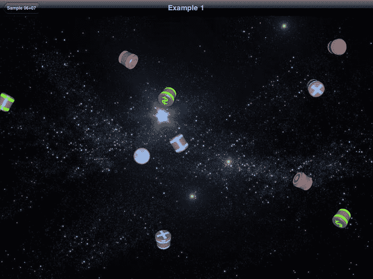
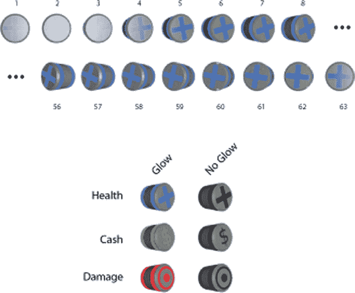
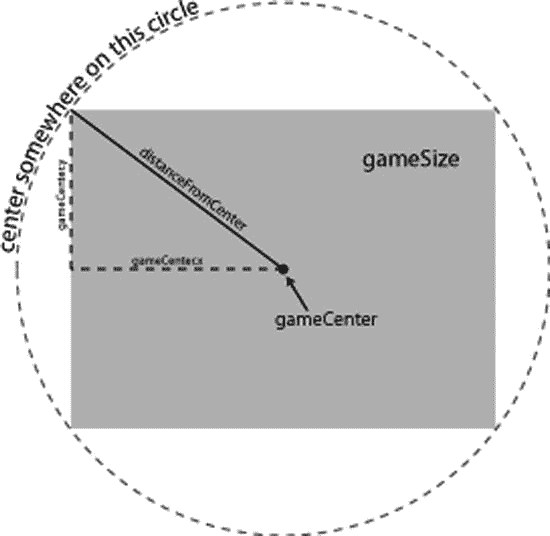

# 排版后的内容

[内容]

**清单 5-24.** `Viper03.m` (`imageName`) 展示了`imageName`任务在`Viper03`类中的实现。

```
-(NSString*)imageName{ 
    if (self.state == STATE_STOPPED){
        return @"viper_stopped";
    } else if (self.state == STATE_TURNING){
        if (self.clockwise){
          return @"viper_clockwise";
        } else {
          return @"viper_counterclockwise";
        }
    } else {//STATE_TRAVELING
        return @"viper_traveling";
    }
}
```

在清单 5-24 中，`viper`名称任务简单地根据对象的状态返回图像名称。如果`state`是`STATE_TURNING`，我们检查属性`clockwise`来决定使用哪个图像。为了实现行为的变化，我们需要查看任务`step:`的新实现，如清单 5-25 所示。

**清单 5-25.** `Viper03.m` (`step:`)

```
-(void)step:(Example03Controller*)controller{
    CGPoint c = [self center];
    if (self.state == STATE_STOPPED){
        if (abs(moveToPoint.x - c.x) < self.speed && abs(moveToPoint.y - c.y) < self.speed){
            c.x = moveToPoint.x;
            c.y = moveToPoint.y;
            [self setCenter:c];
        } else {
            self.state = STATE_TURNING;
            self.needsImageUpdated = YES;
        }
    } else if (self.state == STATE_TURNING){
        float dx = (moveToPoint.x - c.x);
        float dy = (moveToPoint.y - c.y);
        float theta = -atan(dx/dy);
        float targetRotation;
        if (dy > 0){
            targetRotation = theta + M_PI;
        } else {
            targetRotation = theta;
        }
        if ( fabsf(self.rotation - targetRotation) < .1){
            self.rotation = targetRotation;
            self.state = STATE_TRAVELING;
            self.needsImageUpdated = YES;
            return;
        }
        if (self.rotation - targetRotation < 0){
            self.rotation += .1;
            self.clockwise = YES;
            self.needsImageUpdated = YES;
        } else {
            self.rotation -= .1;
            self.clockwise = NO;
            self.needsImageUpdated = YES;
        }
    } else {//STATE_TRAVELING
        float dx = (moveToPoint.x - c.x);
        float dy = (moveToPoint.y - c.y);
        float theta = atan(dy/dx);
        float dxf = cos(theta) * self.speed;
        float dyf = sin(theta) * self.speed;
        if (dx < 0){
            dxf *= -1;
            dyf *= -1;
        }
        c.x += dxf;
        c.y += dyf;
        if (abs(moveToPoint.x - c.x) < self.speed && abs(moveToPoint.y - c.y) < self.speed){
            c.x = moveToPoint.x;
            c.y = moveToPoint.y;
            self.state = STATE_STOPPED;
            self.needsImageUpdated = YES;
        }
        [self setCenter:c];
    }
}
```

在清单 5-25 中，我们看到现在有一组`if`语句根据飞船的状态来控制其行为。如果飞船处于停止状态，我们检查它是否应保持停止；如果不是，我们切换到转向状态，并通过将`needsImageUpdated`设置为`YES`来指示需要更新图像。

如果飞船处于转向状态，我们根据`moveToPoint`计算要转向的角度，并将结果存储在变量`theta`中。由于`atan`只返回介于 -π/2 和 π/2 之间的值，我们测试是否应添加 π 来获得`targetRotation`。一旦获得`targetRotation`值，我们检查`targetRotation`与当前旋转的接近程度。如果它们很接近，我们简单地将`rotation`设置为`targetRotation`，并将`state`更改为`STATE_TRAVELING`。如果尚未达到`targetRotation`值，我们将飞船向`targetRotation`方向旋转一小段。如果飞船正在移动，它会像以前一样向`moveToPoint`移动。

## 总结

在本章中，我们探讨了如何创建逐帧动画，其中游戏中的元素或角色每秒多次逐步更新其位置。您学习了如何将动画循环与设备屏幕的刷新率同步，以及如何以与显示无关的方式描述游戏状态，从而摆脱宿主`UIView`坐标系的束缚。我们通过研究一些创建动画的简单技术并为角色增添生命力，继续深入探讨了这类游戏。

---

## 第 6 章 创建你的角色：游戏引擎、图像角色和行为

在本章和下一章中，我们将为本书中完整游戏使用的角色创建类。但首先，我们需要重构前面章节的代码，以创建构成简单游戏引擎的可重用类。我们将探讨组成该游戏引擎的类和协议，以便您理解它们如何协同工作。

我们将通过引入协议`Representation`来进一步抽象角色在屏幕上的绘制方式，这将允许我们创建基于图像的角色以及程序化绘制的角色（将在下一章中介绍）。协议`Representation`将为我们提供一个共享的 API，用于处理这两种不同类型的屏幕角色。

我们还将通过协议`Behavior`引入行为的概念。该协议为我们提供了一种模式，用于以可重用的方式描述角色在游戏中的行为。

通过构建我们的第一个角色——能量道具（power-up），您将开始学习如何使用游戏引擎。我们将创建一个示例`GameController`子类，在屏幕上释放一堆能量道具，让您感受这个角色的外观和行为。

## 理解游戏引擎类

我们的简单游戏引擎从两个核心类开始：`GameController`和`Actor`。`GameController`与前一章中的控制器类非常相似，但经过改进以实现更通用的用途。`Actor`类同样得到了改进，以容纳更多类型的`Actor`。`Actor`类还定义了两个协议`Representation`和`Behavior`，用于以不同方式描述每个角色。协议`Representation`描述了创建和更新角色`UIView`所需的任务。协议`Behavior`描述了一个任务，供任何希望创建共享、可重用行为的类来实现。这些类和协议将在以下各节中详细讨论。

### `GameController`类

`GameController`类协调游戏中的角色，并最终负责在屏幕上渲染每个角色。这包括将`GameController`设置为`UIViewController`，定义一种通过`CADisplayLink`重复调用`updateScene`任务的方法，最后回顾`updateScene`如何管理场景中的角色。`GameController`还提供了添加和移除角色的机制。让我们看看`GameController`类的头文件，如清单 6-1 所示。

**清单 6-1.** `GameController.h`

```
#import <UIKit/UIKit.h>
#import <QuartzCore/CADisplayLink.h>
#import "Actor.h"
```

```objc
@interface GameController : UIViewController {
    IBOutlet UIView* actorsView;
    CADisplayLink* displayLink;
    NSMutableSet* actors;
    NSMutableDictionary* actorClassToActorSet;
    NSMutableSet* actorsToBeAdded;
    NSMutableSet* actorsToBeRemoved;
    BOOL workComplete;
}
@property (nonatomic) long stepNumber;
@property (nonatomic) CGSize gameAreaSize;
@property (nonatomic) BOOL isSetup;
@property (nonatomic, strong) NSMutableArray* sortedActorClasses;

-(BOOL)doSetup;
-(void)displayLinkCalled;
-(void)updateScene;

-(void)removeActor:(Actor*)actor;
-(void)addActor:(Actor*)actor;
-(void)updateViewForActor:(Actor*)actor;

-(void)doAddActors;
-(void)doRemoveActors;
-(NSMutableSet*)actorsOfType:(Class)class;
@end
```

如你所见，类 `GameController` 的头文件继承自类 `UIViewController`。名为 `actorsView` 的 `UIView` 是一个 `IBOutlet`，它是游戏中每个角色的视图容器。我们不希望使用属性 `view` 作为角色的根视图，因为 `GameController` 可能还需要关联其他视图，例如背景图片或游戏上层的其他 `UIView`。我们将在后续章节利用这一设计。现在你只需要知道，`UIView actorsView` 是属性 `view` 的子视图，并且将包含所有角色的视图。

在这个代码清单中，你还可以看到熟悉的 `CADisplayLink`，以及各种集合。`NSMutableSet actor` 存储了游戏中所有角色。`NSMutableDictionary actorClassToActorSet` 用于跟踪特定类型的角色。两个 `NSMutableSets`（`actorsToBeAdded` 和 `actorsToBeRemoved`）用于跟踪在游戏单步执行期间创建的角色，以及当前步骤结束后应移除的角色。

最后声明的字段是布尔值 `workComplete`。它用于调试，将在本章后续探讨如何使用 `CADisplayLink` 时说明。除列表 6-1 中声明的字段外，我们还看到四个属性。第一个属性 `stepNumber` 记录游戏开始后经过的步数。`CGSize gameAreaSize` 是游戏坐标系下游戏区域的大小。布尔值 `isSetup` 记录 `GameController` 是否已完成设置。最后一个属性 `sortedActorClasses` 用于告知 `GameController` 应跟踪哪些类型的角色。

## 设置 `GameController`

当你审视类 `GameController` 的实现时，列表 6-1 中所有字段和属性的用途将变得清晰。我们先从列表 6-2 所示的 `doSetup` 任务开始。

**列表 6-2. `GameController.m (doSetup)`**

```objc
-(BOOL)doSetup {
    if (!isSetup){
        gameAreaSize = CGSizeMake(1024, 768);
        actors = [NSMutableSet new];
        actorsToBeAdded = [NSMutableSet new];
        actorsToBeRemoved = [NSMutableSet new];
        stepNumber = 0;
        workComplete = true;
        displayLink = [CADisplayLink displayLinkWithTarget:self selector: @selector(displayLinkCalled)];
        [displayLink addToRunLoop:[NSRunLoop currentRunLoop] forMode:NSDefaultRunLoopMode];
        [displayLink setFrameInterval:1];
        isSetup = YES;
        return YES;
    }
    return NO;
}
```

这里可以看到类 `GameController` 的设置代码。由于我们只希望设置一次 `GameController`，因此将设置代码放在由变量 `isSetup` 控制的 if 语句中。如果执行了设置，`isSetup` 任务将返回 YES；如果未执行设置，则返回 NO。

关于类的实际设置，我们需要初始化几个变量。首先将属性 `gameSizeArea` 设置为默认大小。然后初始化集合 `actors`、`actorsToBeAdded` 和 `actorsToBeRemoved`。最后将 `stepNumber` 设置为零。

## 调用 `displayLinkCalled` 和 `updateScene`

在列表 6-2 中，最后一步需要设置 `CADisplayLink`。在本章中，我们设置 `CADisplayLink` 的方式与之前的示例略有不同。我们没有让 `CADisplayLink` 直接调用 `updateScene`，而是让它调用 `displayLinkCalled`，再由后者调用 `updateScene`，如列表 6-3 所示。

**列表 6-3. `GameController.m (displayLinkCalled)`**

```objc
-(void)displayLinkCalled{
    if (workComplete){
        workComplete = false;
        @try {
            [self updateScene];
            workComplete = true;
        }
        @catch (NSException *exception) {
            NSLog(@"%@", [exception reason]);
            NSLog(@"%@", [exception userInfo]);//此处设置断点
        }
    }
}
```

任务 `displayLinkCalled` 仅在变量 `workComplete` 为 true 时才调用 `updateScene`。变量 `workComplete` 为 true 的情况仅包括：`displayLinkCalled` 首次被调用时，或者 `updateScene` 已成功完成时。如果 `updateScene` 抛出异常，该异常会被记录，并且 `workComplete` 不会重置为 true。实际上，这会导致游戏在出现任何错误时停止。这样做是理想的，因为 `CADisplayLink` 调用的任务所引发的异常会被静默吞噬。为了便于调试 `displayLinkCalled` 任务，既需要记录异常，也需要暂停游戏，从而让测试人员知晓出现了问题。在生产环境中，你可能希望改变这种行为；即使出现错误，让应用继续运行或许更好。具体所需的行为取决于应用场景。

## 更新 `updateScene`

任务 `updateScene` 也相比前一章进行了更新，如列表 6-4 所示。

**列表 6-4. `GameController.m (updateScene)`**

```objc
-(void)updateScene{
    for (Actor* actor in actors){
        [actor step:self];
    }
    for (Actor* actor in actors){
        for (NSObject<Behavior>* behavoir in [actor behaviors]){
            [behavoir applyToActor:actor In:self];
        }
    }
    for (Actor* actor in actors){
        [self updateViewForActor:actor];
    }
    [self doAddActors];
    [self doRemoveActors];
    stepNumber++;
}
```

在此代码清单中，我们对游戏中的所有角色迭代了三次。在第一个循环中，我们对每个角色调用 `step:`，给它一个机会执行任何自定义代码。在第二个循环中，我们应用与角色关联的每个 `Behavior`。`Behavior` 是一个描述角色间某些共享行为的协议（该协议定义在 `Actor.h` 中，后续在列表 6-9 中展示）。在第三个循环中，我们通过调用 `updateViewForActor:` 更新代表每个角色的 `UIView`。

由于角色和行为可以自由添加或移除其他角色，并且我们不希望在迭代 `NSMutableSet actors` 集合的同时修改它，因此我们必须分两步来添加和移除角色。为了实现这一两步过程，我们将新添加的角色存储在 `NSMutableSet actorsToBeAdded` 中，然后在任务 `doAddActors` 中处理该集合中的每个角色。对于要移除的角色，我们采用完全相同的模式：将它们存储在 `NSMutableSet actorsToBeRemoved` 中，然后在任务 `doRemoveActors` 中处理它们。

## 调用 `doAddActors` 和 `doRemoveActors`

我们在 `updateScene` 中执行的最后一步是调用 `doAddActors` 和 `doRemoveActors`，如列表 6-5 所示。

**列表 6-5. `GameController.`**


`m (doAddActors` 和 `doRemoveActors` 方法)

```
-(void)doAddActors{
    for (Actor* actor in actorsToBeAdded){
        [actors addObject:actor];
        UIView* view = [[actor representation] getViewForActor:actor In:self];
        [view setFrame:CGRectMake(0, 0, 0, 0)];
        [actorsView addSubview:view];
        NSMutableSet* sorted = [actorClassToActorSet valueForKey:[[actor class] description]];
        [sorted addObject:actor];
    }
    [actorsToBeAdded removeAllObjects];
}
-(void)doRemoveActors{
    for (Actor* actor in actorsToBeRemoved){
        UIView* view = [[actor representation] getViewForActor:actor In:self];
        [view removeFromSuperview];
        NSMutableSet* sorted = [actorClassToActorSet valueForKey:[[actor class] description]];
        [sorted removeObject:actor];
        [actors removeObject:actor];
    }
    [actorsToBeRemoved removeAllObjects];
}
```

任务`doAddActors`遍历`NSMutableSet actorsToBeAdded`中的所有演员，并将每个演员添加到`NSMutableSet actors`中。此外，它还会从演员的`representation`属性中获取每个演员的`UIView`，并将其作为`actorsView`的子视图添加。属性`representation`是一个符合`Representation`协议（如`Actor.h`中定义，见清单 6-9）的`NSObject`。添加视图后，我们在`NSMutableDictionary actorClassToActorSet`中找到对应于该演员类的`NSMutableSet sorted`，然后将该演员添加到其中。这样，我们之后就可以通过在`NSMutableDictionary actorClassToActorSet`中快速查找，找到特定类型的所有演员。`doAddActors`的最后一步是从集合`actorsToBeAdded`中移除所有演员。

在前面的代码清单中，我们看到与任务`doAddActors`并行的任务`doRemoveActors`。在`doRemoveActors`中，`NSMutableSet actorsToBeRemoved`中的每个演员，其关联的`UIView`会从其父视图中移除，并从相应的`NSMutableSet sorted`中移除。每个演员也会从`NSMutableSet actors`中移除。最后，通过调用`removeAllObjects`清空`NSMutableSet actorsToBeRemoved`中的所有演员。

## 添加和移除演员

要向游戏中添加或移除演员，我们分别调用`addActor`或`removeActor`，如清单 6-6 所示。

**清单 6-6. `GameController.m (addActor` 和 `removeActor 方法)`**

```
-(void)addActor:(Actor*)actor{
    [actor setAdded:YES];
    [actorsToBeAdded addObject:actor];
}
-(void)removeActor:(Actor*)actor{
    [actor setRemoved:YES];
    [actorsToBeRemoved addObject:actor];
}
```

在清单 6-6 中，您可以看到两个非常简单的任务：`addActor`和`removeActor`。在`addActor`中，传入的演员在添加到`NSMutableSet actorsToBeAdded`之前，其`added`属性被设置为`YES`。类似地，在`removeActor`任务中，传入的演员的`removed`属性被设置为`YES`，并被添加到`NSMutableSet actorsToBeRemoved`中。

之前，在清单 6-5 中，当演员被添加或移除时，我们也将其从存储在`NSMutableDictionary actorClassToActorSet`中的集合中添加或移除。这样做是为了无需遍历整个`actors`集合就能找到给定类型的所有演员。然而，我们并不希望为游戏中的每种演员类型都维护一个独立的集合。我们只想跟踪游戏逻辑中需要访问的演员类型。

## 排序演员

`setSortedActorClasses`任务用于指定哪些演员应该被排序，如清单 6-7 所示。

**清单 6-7. `GameController.m (setSortedActorClasses:)`**

```
-(void)setSortedActorClasses:(NSMutableArray *)aSortedActorClasses{
    [sortedActorClasses removeAllObjects];
    sortedActorClasses = aSortedActorClasses;

    [actorClassToActorSet removeAllObjects];
    actorClassToActorSet = [NSMutableDictionary new];

    for (Class class in sortedActorClasses){
        [actorClassToActorSet setValue: [NSMutableSet new] forKey:[class description]];
    }

    for (Actor* actor in actors){
        NSMutableSet* sorted = [actorClassToActorSet objectForKey:[[actor class] description]];
        [sorted addObject:actor];
    }
}
```

我们首先进行一些内存管理，移除`NSMutableArray sortedActorClasses`中的所有对象，释放它，然后将`sortedActorClasses`重新赋值为传入的`NSMutableArray aSortedActorClasses`。接下来，我们清理旧的`NSMutableDictionary actorClassToActorSet`。完成记账工作后，我们为`sortedActorClasses`中的每个类向`actorClassToActorSet`添加一个新的`NSMutableSet`。最后，我们遍历所有演员，并将每个演员添加到相应的`NSMutableSet`中。最后这一步是必要的，以允许在应用程序中多次调用`setSortedActorClasses`。但考虑到这是一个相对昂贵的操作，最好在游戏开始时只调用一次`setSortedActorClasses`。

## 管理`UIView`

对`GameController`类的最后一项改进是`updateViewForActor:`任务，如清单 6-8 所示。

**清单 6-8. `GameController.m (updateViewForActor:)`**

```
-(void)updateViewForActor:(Actor*)actor{
    NSObject<Representation>* rep = [actor representation];

    UIView* actorView = [rep getViewForActor:actor In:self];
    [rep updateView:actorView ForActor:actor In:self];

    float xFactor = actorsView.frame.size.width/self.gameAreaSize.width;
    float yFactor = actorsView.frame.size.height/self.gameAreaSize.height;

    float x = (actor.center.x-actor.radius)*xFactor;
    float y = (actor.center.y-actor.radius)*yFactor;
    float width = actor.radius*xFactor*2;
    float height = actor.radius*yFactor*2;
    CGRect frame = CGRectMake(x, y, width, height);

    actorView.transform = CGAffineTransformIdentity;
    [actorView setFrame:frame];
    actorView.transform = CGAffineTransformRotate(actorView.transform, [actor rotation]);

    [actorView setAlpha:[actor alpha]];
}
```

任务`updateViewForActor:`负责管理与每个演员关联的`UIView`。在该任务的第一行，我们获取演员的`representation`属性并将其存储在变量`rep`中。变量`rep`是一个符合`Representation`协议的`NSObject`。协议`Representation`在`Actor.h`中定义（稍后见清单 6-9），描述了如何创建和更新给定演员的`UIView`。当调用`getViewForActor:In:`时会创建`UIView`。当`UIView`需要更新以反映演员的变化时，会调用`updateView:ForActor:In:`任务。这两个任务将在本章后面讨论。

确定`UIView actorView`后，我们计算其父视图中它应该占据的区域。此计算的细节已在第 5 章中描述。然而，我们添加了两个新特性：我们根据演员的`rotation`属性旋转`actorView`，并且设置了`actorView`的`alpha`值，允许演员在游戏过程中改变其不透明度。

现在我们已经了解了`GameController`类以及它如何管理游戏中的演员，接下来让我们看看`Actor`类，以便您理解它如何允许多种不同类型演员在任何游戏中存在。

## Actor 类

`Actor`类是游戏所有演员的超类。


好的，作为一名高级文档工程师和翻译员，我将严格按照您提供的注意事项和示例格式，将给定的英文文本翻译成中文。


它主要提供关于角色位置的信息，但也描述了指示角色如何行为以及在屏幕上如何呈现的协议。在本节中，我们将查看`Actor`是如何实现的，然后看一些具体的例子。首先，我们来看一下`Actor`类的头文件，如列表 6-9 所示。

**列表 6-9. `Actor.h`**

```objectivec
#import <Foundation/Foundation.h>

@class GameController, Actor;

@protocol Representation
-(UIView*)getViewForActor:(Actor*)anActor In:(GameController*)aController;
-(void)updateView:(UIView*)aView ForActor:(Actor*)anActor In:(GameController*)aController;
@end

@protocol Behavior
-(void)applyToActor:(Actor*)anActor In:(GameController*)gameController;
@end

long nextId;
@interface Actor : NSObject {

}
//State
@property (nonatomic, strong) NSNumber* actorId;
@property (nonatomic) BOOL added;
@property (nonatomic) BOOL removed;

//Geometry
@property (nonatomic) CGPoint center;
@property (nonatomic) float rotation;
@property (nonatomic) float speed;
@property (nonatomic) float radius;

//Behavoir
@property (nonatomic, strong) NSMutableArray<Behavior>* behaviors;

//Representation
@property (nonatomic) BOOL needsViewUpdated;
@property (nonatomic, strong) NSObject<Representation>* representation;
@property (nonatomic) int variant;
@property (nonatomic) int state;
@property (nonatomic) float alpha;

-(id)initAt:(CGPoint)aPoint WithRadius:(float)aRadius AndRepresentation:(NSObject<Representation>*)aRepresentation;
-(void)step:(GameController*)controller;
-(BOOL)overlapsWith: (Actor*) actor;
-(void)addBehavior:(NSObject<Behavior>*)behavior;

+(CGPoint)randomPointAround:(CGPoint)aCenter At:(float)aRadius;
@end
```

在这里，定义了协议`Representation`。任何负责管理与角色关联的`UIView`的对象都必须遵循此协议。这里的想法是，至少有两种`UIView`用于绘制角色：基于图像的视图和基于程序化绘图的视图。还可以有其他方式来实现代表角色的`UIView`，例如包含子视图的`UIView`。本章不涉及这个例子，但我们会在本章讨论基于图像的角色，并在下一章讨论基于矢量的角色。

无论角色的`UIView`如何实现，`GameController`类都需要知道如何获取正确`UIView`的引用，并给`Representation`更新其外观的机会。因此，我们有两个必需的任务：`getViewForActor:In:`和`updateView:ForActor:In:`。

在前面的列表中，我们看到了第二个名为`Behavior`的协议。我们将创建一些简单的类来描述角色的特定行为，这些行为可以在不同类型的角色之间共享。例如，我们将创建一个名为`LinearMotion`的行为，它描述角色如何在屏幕上移动。几种类型的角色将使用此行为。这就是`Behavior`协议的作用所在；它提供了一个必需的单一任务`applyToActor:From:`，该任务将在游戏的每一步由`GameController`调用。

该列表还显示了许多属性。其中许多属性应该在前一章中已经熟悉——包括`center`、`speed`和`radius`。还添加了一些新属性，以使`Actor`类尽可能可重用。添加的属性`added`和`removed`用于跟踪角色是否已从游戏中添加或移除。

属性`behaviors`是一个`NSMutableArray`，包含遵循`Behavior`协议的对象。通过向`behaviors`属性添加`Behavior`对象，我们可以自定义每个角色的行为方式。这可以简单到描述角色的运动，也可以复杂到实现人工智能。

我们提供了一个名为`addBehavior:`的特殊任务，它是获取`NSMutableArray` `behaviors`并添加`Behavior`对象的简写方式。`addBehavior:`任务还让我们有机会延迟加载`NSMutableArray` `behaviors`，这样如果我们不需要它，就不会创建它。

你还可以在列表 6-9 中看到，我们添加了`variant`和`state`属性。角色通常需要这两个属性，因此为了简单起见，它们被包含在`Actor`类中。属性`variant`可用于描述属于同一类、行为相同但颜色可能不同的角色——例如，吃豆人游戏中不同颜色的幽灵。属性`state`用于跟踪角色在其生命周期中可能具有的不同状态。再次以幽灵为例，状态可能包括“在监狱中”、“追击中”和“逃跑中”。最后一个属性是`alpha`，用于描述角色在屏幕上的透明度。

列表 6-9 中定义的任务基本上与前一章中为`Actor`类描述的任务相同。这里唯一的实际区别是，当角色被初始化时，必须传入一个`Representation`。我们还添加了一个实用任务`randomPointAround:At:`，用于在围绕点`aPoint`、半径为`aRadius`的圆上创建一个随机点。

## 实现 Actor

`Actor`类的实现如列表 6-10 所示。

**列表 6-10. `Actor.m`**

```objectivec
#import "Actor.h"

@implementation Actor
@synthesize actorId;
@synthesize added;
@synthesize removed;
@synthesize center;
@synthesize rotation;
@synthesize speed;
@synthesize radius;
@synthesize needsViewUpdated;
@synthesize representation;
@synthesize variant;
@synthesize state;
@synthesize alpha;
@synthesize behaviors;

-(id)initAt:(CGPoint)aPoint WithRadius:(float)aRadius AndRepresentation:(NSObject<Representation>*)aRepresentation{
    self = [super init];
    if (self != nil){
        [self setActorId:[NSNumber numberWithLong:nextId++]];
        [self setCenter:aPoint];
        [self setRotation:0];
        [self setRadius:aRadius];
        [self setRepresentation:aRepresentation];
        [self setAlpha:1.0];
    }
    return self;
}
-(void)step:(GameController*)controller{
    //implemented by subclasses.
}
-(BOOL)overlapsWith: (Actor*) actor {
        float xdist = abs(self.center.x - actor.center.x);
        float ydist = abs(self.center.y - actor.center.y);
    float distance = sqrtf(xdist*xdist+ydist*ydist);
    return distance < self.radius + actor.radius;
}
-(void)setVariant:(int)aVariant{
    if (aVariant != variant){
        variant = aVariant;
        needsViewUpdated = YES;
    }
}
-(void)setState:(int)aState{
    if (aState != state){
        state = aState;
        needsViewUpdated = YES;
    }
}
-(void)addBehavior:(NSObject<Behavior>*)behavior{
    if (behaviors == nil){
        behaviors = [NSMutableArray new];
    }
    [behaviors addObject:behavior];
}

+(CGPoint)randomPointAround:(CGPoint)aCenter At:(float)aRadius{
    float direction = arc4random()%1000/1000.0 * M_PI*2;
    return CGPointMake(aCenter.x + cosf(direction)*aRadius, aCenter.y + sinf(direction)*aRadius);
}
@end
```

在此文件顶部，我们看到我们简单地为类的每个属性使用了`@synthesize`来创建 getter 和 setter 任务，但`state`和`variant`属性除外。我们为`state`和`variant`属性的 setter 任务定义了自定义实现，以便当这些值改变时，将`needsViewUpdated`设置为`YES`。这样做是为了确保当角色的`state`或`variant`属性发生变化时，角色的`Representation`会更新代表该角色的`UIView`。

任务`initAt:WithRadius:AndRepresentation:`简单地初始化角色并设置传入的属性。我们还将`alpha`属性设置为 1。


0，因此默认情况下角色完全不透明。

## 使用强化道具角色

在前一节中，我们研究了`GameController`和`Actor`类，了解到`Actor`类需要`Representation`对象才能显示。`Representation`协议描述了类在管理与角色关联的`UIView`时需要满足的要求。在本节中，我们将探讨`ImageRepresentation`类，并了解它如何使用图像来表示角色。在上一章中，我们使用图像绘制了不同的角色。在本节中，我们将展示如何将这些技术整合到一个简单、可重用的`ImageRepresentation`类中。

为了说明`ImageRepresentation`，在我们的第一个示例中，我们将创建强化道具并让它们在屏幕上动画显示，如图 6-1 所示。



图 6-1.  示例 1——强化道具

在图像中，您可以看到几个圆柱体，上面有三个符号：美元符号、点和叉号。当此示例运行时，每个圆柱体沿直线移动。当一个圆柱体到达屏幕边缘时，它会环绕到对侧边缘。当每个圆柱体移动时，它还会看起来绕自身旋转或翻滚。几秒钟后，每个圆柱体上的条纹和符号将开始闪烁，提示它即将消失。当您启动示例时，屏幕上不会有强化道具，但每 5 秒，就会有一个新的强化道具在`屏幕外`生成并漂入视野。让我们仔细看看用于创建此动画的图像。参见 图 6-2。



图 6-2.  强化道具细节

图 6-2 的顶部展示了构成带发光效果的旋转“生命”强化道具的 63 幅图像的起始和结束。在示例代码中，您将找到六组图像：每种类型的强化道具都有一个发光版本和一个`不发光`版本。通过在发光版本和`不发光`版本之间切换，我们可以创建闪烁效果。

## 实现我们的强化道具角色

为了实现我们的强化道具角色，我们必须配置`GameController`的子类`Example01Controller`，以便将强化道具添加到场景中。我们还需要实现强化道具角色本身，为其提供绘制自身以及定义其运动和行为的途径。关键类是`ImageRepresentation`和`Powerup`，但我们应该从`Example01Controller`类的`updateScene`任务开始，如 代码清单 6-11 所示。

**代码清单 6-11.  `Example01Controller.m (updateScene)`**

```  
-(void)updateScene{  
    if (self.stepNumber % (60*5) == 0){  
        [self addActor:[Powerup powerup: self]];  
    }  
    [super updateScene];  
}  
```

这里您可以看到`Example01Controller`类中定义的`updateScene`任务。`Example01Controller`类继承自`GameController`，因此它继承了该类中定义的游戏引擎逻辑。`updateScene`任务简单地每 5 秒添加一个新的强化道具，然后调用`updateScene`的父类实现。`Powerup`类的头文件如 代码清单 6-12 所示。

**代码清单 6-12.  `Powerup.h`**

```  
#import <Foundation/Foundation.h>  
#import "Actor.h"  
#import "ImageRepresentation.h"  
#import "ExpireAfterTime.h"  

enum{  
    STATE_GLOW = 0,  
    STATE_NO_GLOW,  
    PWR_STATE_COUNT  
};  

enum{  
    VARIATION_HEALTH = 0,  
    VARIATION_CASH,  
    VARIATION_DAMAGE,  
    PWR_VARIATION_COUNT  
};  

@interface Powerup : Actor <ImageRepresentationDelegate,ExpireAfterTimeDelegate>{  

}  

+(id)powerup:(GameController*)aController;  

@end  
```

此头文件首先定义了两个枚举。第一个枚举定义了`Powerup`的两种状态`STATE_GLOW`或`STATE_NO_GLOW`的值。第二个枚举定义了`Powerup`的三种变体的值。这两个枚举都以包含`COUNT`一词的值结尾。对于不是来自 C 背景的开发者来说，这是一种用于为枚举中项目数量创建常量的老技巧。例如，在第一个枚举中，`STATE_GLOW`的值为 0，因此`STATE_NO_GLOW`的值为 1。这使`PWR_STATE_COUNT`的值为 2，也就是状态的数量。很巧妙，不是吗？

代码清单 6-12 中定义的`Powerup`类继承自`Actor`。它还符合`ImageRepresentationDelegate`和`ExpireAfterTimeDelegate`协议。当我们研究`ImageRepresentation`和`ExpireAfterTime`的细节时，我们将查看这些协议附带的任务。为`Powerup`类定义的唯一新任务是构造函数`powerup:`。让我们在 代码清单 6-13 中看一看这个任务。

**代码清单 6-13.  `Powerup.m (powerup: (partial))`**

```  
+(id)powerup:(GameController*)aController{  
    CGSize gameSize = [aController gameAreaSize];  
    CGPoint gameCenter = CGPointMake(gameSize.width/2.0, gameSize.height/2.0);  
    float distanceFromCenter = sqrtf(gameCenter.x*gameCenter.x + gameCenter.y*gameCenter.y);  
    CGPoint center = [Actor randomPointAround:gameCenter At:distanceFromCenter];  

    ImageRepresentation* rep = [ImageRepresentation imageRep];  
    [rep setBackwards:arc4random()%2 == 0];  
    [rep setStepsPerFrame:1 + arc4random()%3];  

    Powerup* powerup = [[Powerup alloc] initAt:center WithRadius:32 AndRepresentation:rep];  
    [rep setDelegate:powerup];  
    float rotation = arc4random()%100/100.0 * M_PI*2;  
    [powerup setRotation:rotation];  
    [powerup setVariant:arc4random()%PWR_VARIATION_COUNT];  

  //省略了部分内容，参见代码清单 6-21  

    return powerup;  
}  
```

我们首先要做的是计算出将传递给`Actor`的`initAt:WithRadius:AndRepresentation`任务的值。计算出这些值后，我们会创建一个新的强化道具，然后设置一些初始值，例如强化道具的旋转和变体。在 代码清单 6-13 的省略部分中，我们设置了强化道具的行为。这段代码可以在 代码清单 6-21 中找到，将在本节后面讨论。

在深入探讨`ImageRepresentation`的细节之前，让我们快速了解一下我们如何计算强化道具的中心位置。`CGPoint`中心是通过在屏幕边界外的一个圆上选取随机点来创建的，如图 6-3 所示。



图 6-3.  屏幕外的随机点

在此图像中，您可以看到灰色的矩形，其大小与变量`gameSize`相同。中间的圆点是`CGPoint gameCenter`。从`gameCenter`延伸到`gameSize`左上角的黑线长度为`distanceFromCenter`。`distanceFromCenter`的值基于`gameCenter`的 X 和 Y 分量，使用勾股定理计算得出。利用`gameCenter`和`distanceFromCenter`，我们可以通过调用`Actor`类的`randomPointAround:At:`（如前面的 代码清单 6-10 所示）在外圆上获得一个随机点。

```markdown
在`[Listing 6-13]`中，计算中心点并选择半径为`32`后，我们必须创建一个`Representation`对象来处理这个增强道具的绘制。因为我们想使用一系列图像来表示增强道具，所以创建了一个名为`rep`的`ImageRepresentation`实例，并设置了`backwards`和`stepsPerFrame`属性。`ImageRepresentation`被传递给`Actor`的`initAt:WithRadius:AndRepresentation:`任务，以将`rep`设置为该增强道具的表示。还要注意，我们将`Powerup`设置为`rep`的委托。这意味着我们正在创建的`Powerup`实例将用于指定关于如何绘制该角色的信息。

**检查`ImageRepresentation`**

为了将角色的游戏逻辑与其绘制方式分离，我们引入了`ImageRepresentation`类。此类负责创建使用`UIView`渲染角色所需的对象。主要是，`ImageRepresentation`将使用 PNG 文件创建`UIImageViews`来绘制我们的角色。让我们看看`ImageRepresentation`的头文件，如`[Listing 6-14]`所示。

**[Listing 6-14] `ImageRepresentation.h`**

```
#import <Foundation/Foundation.h>
#import "Actor.h"

@protocol ImageRepresentationDelegate

@required
-(NSString*)baseImageName;

@optional
-(int)getFrameCountForVariant:(int)aVariant AndState:(int)aState;
-(NSString*)getNameForVariant:(int)aVariant;
-(NSString*)getNameForState:(int)aState;

@end

@interface ImageRepresentation : NSObject<Representation> {
    UIView* view;
}
@property (nonatomic, assign) NSObject<ImageRepresentationDelegate>* delegate;
@property (nonatomic, strong) NSString* baseImageName;
@property (nonatomic) int currentFrame;
@property (nonatomic) BOOL backwards;
@property (nonatomic) int stepsPerFrame;

+(id)imageRep;
+(id)imageRepWithName:(NSString*)aBaseImageName;
+(id)imageRepWithDelegate:(NSObject<ImageRepresentationDelegate>*)aDelegate;
-(void)advanceFrame:(Actor*)actor ForStep:(int)step;
-(NSString*)getImageNameForActor:(Actor*)actor;
-(UIImage*)getImageForActor:(Actor*)actor;

@end
```

`ImageRepresentation`类的目标是封装处理使用图像表示角色的常见方式的代码。这些方式包括以下情况：

- 单张图像表示角色
- 一系列图像表示角色
- 具有多种状态的角色
- 具有多种变体的角色
- 对于每种状态和变体的组合，具有不同数量图像的角色

我们创建的每个使用`ImageRepresentation`的角色都将符合上述情况之一。通过设置一个类型为`ImageRepresentationDelegate`的委托，我们指示我们想要使用哪种情况，如`[Listing 6-14]`所示。这允许`ImageRepresentationDelegate`的实例指示在任何给定时间应使用的图像名称。

`ImageRepresentationDelegate`必须指定一个`baseImageName`，该名称用于`ImageRepresentation`的所有用例。如果`ImageRepresentationDelegate`只实现了`baseImageName:`，则表示角色的所有实例都将使用单个图像。如果要使用一系列图像，则委托对象必须实现任务`getFrameCountForVariant:AndState:`。如果要根据角色的状态或变体使用不同的图像序列，则委托必须分别实现`getNameForState:`和`getNameForVariant:`。从技术上讲，如果只使用单个图像来表示特定类型的所有角色，则不需要为`ImageRepresentation`指定委托。但是，`ImageRepresentation`仍然需要指定`baseImageName`。

**创建`Powerup`的实现**

`Powerup`类必须定义其绘制方式以及基本行为。由于`Powerup`类将对状态和变体的每种组合使用不同的图像序列，因此`ImageRepresentation`的委托必须实现所有这四个任务。为简单起见，我们指定`Powerup`类遵循`ImageRepresentationDelegate`协议。让我们看看`[Listing 6-15]`中这些方法的实现。

**[Listing 6-15] `Powerup.m（ImageRepresentationDelegate 任务）`**

```
-(NSString*)baseImageName{
    return @"powerup";
}
-(int)getFrameCountForVariant:(int)aVariant AndState:(int)aState{
    return 63;
}
-(NSString*)getNameForVariant:(int)aVariant{
    if (aVariant == VARIATION_HEALTH){
        return @"health";
    } else if (aVariant == VARIATION_CASH){
        return @"cash";
    } else if (aVariant == VARIATION_DAMAGE){
        return @"damage";
    } else {
        return nil;
    }
}
-(NSString*)getNameForState:(int)aState{
    if (aState == STATE_GLOW){
        return @"glow";
    } else if (aState == STATE_NO_GLOW){
        return @"noglow";
    } else {
        return nil;
    }
}
```

在此列表中，我们看到`ImageRepresentationDelegate`所需的四个任务，用于创建一个由每种状态和变体组合的不同图像序列表示的角色。任务`baseImageName`返回`NSString "powerup"`，表示此角色的所有图像都将以`"powerup"`开头。任务`getFrameCountForVariant:AndState:`直接返回`63`，因为每种状态和变体组合都有`63`张图像。其他类型的角色可能希望为每种状态和变体组合拥有不同数量的图像，并且可以自由地在`getFrameCountForVariant:AndState:`中返回不同的数字。

任务`getNameForVariant:`和`getNameForState:`返回适用于增强道具的每种变体和状态的字符串表示，并允许`ImageRepresentation`确定在给定时间应使用哪张图像。

**为角色查找正确的图像**

让我们看看`ImageRepresentation`的任务`getImageNameForActor:`，以便您了解如何使用`ImageRepresentationDelegate`的四个任务来识别图像名称。请参阅`[Listing 6-16]`。

**[Listing 6-16] `ImageRepresentation.m（getImageNameForActor:）`**

```
-(NSString*)getImageNameForActor:(Actor*)actor{
    NSString* imageName = baseImageName;

    if (imageName == nil){
        imageName = [delegate baseImageName];
    }
    NSString* variant = nil;
    if ([delegate respondsToSelector:@selector(getNameForVariant:)]){
        variant = [delegate getNameForVariant:[actor variant]];
    }
    NSString* state = nil;
    if ([delegate respondsToSelector:@selector(getNameForState:)]){
        state = [delegate getNameForState:[actor state]];
    }
    int frameCount = 0;
    if ([delegate respondsToSelector:@selector(getFrameCountForVariant:AndState:)]){
        frameCount = [delegate getFrameCountForVariant:[actor variant] AndState:[actor state]];
    }
    if (variant != nil){
        imageName = [[imageName stringByAppendingString:@"_"] stringByAppendingString:variant];
    }
    if (state != nil){
        imageName = [[imageName stringByAppendingString:@"_"] stringByAppendingString:state];
    }
    if (frameCount != 0){
        imageName = [[imageName stringByAppendingString:@"_"] stringByAppendingString:[NSString stringWithFormat:@"%04d", currentFrame] ];
    }
    return imageName;
}
```

这里的目标是确定应该用于表示角色的正确图像名称。最终的图像名称将存储在变量`imageName`中。我们首先要做的是建立`baseImageName`。
```


它可以是 `ImageRepresentation` 的 `baseImageName` 属性，也可以来自委托。

下一步是获取角色变体的字符串表示。我们测试委托是否响应 `getNameForVariant` 任务。如果是，则将结果赋值给 `variant`。我们遵循相同的模式来获取 `state` 的字符串表示。

我们需要委托做的最后一件事是，确定该角色对于特定状态和变体是由单个图像表示，还是由一系列图像表示。如果委托响应 `getFrameCountForVariation:AndState:`，我们将该值记录在 `frameCount` 中。如果委托不响应 `getFrameCountForVariation:AndState:`，或者 `getFrameCountForVariation:AndState:` 返回零，则表示我们不应在最终图像名称中包含帧编号。

调用 `getFrameCountForVariation:AndState:` 后，我们就拥有了确定最终图像名称所需的全部信息。如果 `variant` 的字符串表示不为 nil，我们将 `"_"` 和 `variation` 附加到 `NSString imageName`。类似地，如果 `state` 不为 nil，我们将 `"_"` 和 `state` 附加到 `imageName`。最后，如果 `frameCount` 不为零，我们将 `currentFrame` 数字附加到图像名称。我们不必将文件扩展名附加到图像名称，因为 `UIImage` 会根据名称自动找到正确的图像。此任务会查找以下模式的图像文件：

*   baseImageName.png
*   baseImageName_variant.png
*   baseImageName_state.png
*   baseImageName_variant_state.png
*   baseImageName_00FN.png
*   baseImageName_state_00FN.png
*   baseImageName_variant_00FN.png
*   baseImageName_variant_state_00FN.png

现在你知道了如何使用 `ImageRepresentation` 和 `ImageRepresentationDelegate` 来指定在给定时间点应为特定角色使用哪个图像。回顾清单 6-8，你可以看到一个角色的表示负责创建和更新与该角色关联的 `UIView`。

## 为角色创建 `UIImageView`

`ImageRepresentation` 的最终目标是创建一个表示角色的 `UIView`。这是通过实例化一个 `UIImageView` 来完成的，该视图根据角色的类型、状态和变体使用正确的图像来表示角色。我们已经回顾了如何找到正确的图像。剩下的就是创建 `UIImageView`。这项工作在任务 `getViewForActor:In:` 中完成，如清单 6-17 所示。

**清单 6-17. `ImageRepresentation.m (getViewForActor:In:)`**

```
-(UIView*)getViewForActor:(Actor*)actor In:(GameController*)aController{
    if (view == nil){
        UIImage* image = [self getImageForActor: actor];
        view = [[UIImageView alloc] initWithImage: image];
    }
    return view;
}
```

`ImageRepresentation` 简单地检查 `view` 是否已被创建，如果未创建则创建它。为了创建 `UIImageView`，我们调用 `getImageForActor:`，然后使用返回的 `UIImage` 创建 `UIImageView`。任务 `getImageForActor:` 如清单 6-18 所示。

**清单 6-18. `ImageRepresentation.m (getImageForActor:)`**

```
-(UIImage*)getImageForActor:(Actor*)actor{
    NSString* imageName = [self getImageNameForActor:actor];

    UIImage* result = [UIImage imageNamed: imageName];
    if (result == nil){
        NSLog(@"Image Not Found: %@", imageName);
    }
        return result;
}
```

任务 `getImageForActor:` 简单地调用 `getImageNameForActor` 并根据该名称创建一个 `UIImage`。如果不存在具有给定名称的图像，则结果将为 nil。在调试应用时，在该 `NSLog` 语句上设置断点将为你省去很多麻烦，因为一旦角色尝试使用不存在的图像进行绘制，你会立即收到通知。

## 更新我们的视图

现在我们已经了解了 `ImageRepresentation` 如何创建用于绘制角色的 `UIView`，让我们来看看 `ImageRepresentation` 如何更新该 `UIView` 以创建循环动画并响应状态或变体的变化。清单 6-19 显示了 `ImageRepresentation` 的任务 `updateView:ForActor:In:`。

**清单 6-19. `ImageRepresentation.m (updateView:ForActor:In:)`**

```
-(void)updateView:(UIView*)aView ForActor:(Actor*)anActor In:(GameController*)aController{

    if ([delegate respondsToSelector:@selector(getFrameCountForVariant:AndState:)]){
        [self advanceFrame: anActor ForStep:[aController stepNumber]];
    }

    if ([anActor needsViewUpdated]){

        UIImageView* imageView = (UIImageView*)aView;
        UIImage* image = [self getImageForActor: anActor];

        [imageView setImage:image];
        [anActor setNeedsViewUpdated:NO];
    }
}
```

任务 `updateView:ForActor:In:` 负责确保使用正确的图像来表示角色 `anActor`。第一步是通过检查委托是否响应 `getFrameCountForVariation:AndState:` 来确定 `ImageRepresentation` 是否管理一系列图像。如果正在使用一系列图像，我们调用 `advanceFrame:ForStep:` 来推进角色的当前帧，如清单 6-20 所示。

**清单 6-20. `ImageRepresentation.m (advanceFrame:ForTick:)`**

```
-(void)advanceFrame:(Actor*)actor ForStep:(int)step{
    if (step % self.stepsPerFrame == 0){
        if (self.backwards){
            self.currentFrame -= 1;
        } else {
            self.currentFrame += 1;
        }

        int frameCount = [delegate getFrameCountForVariant:[actor variant] AndState:[actor state]];
        if (self.currentFrame>frameCount){
            self.currentFrame = 1;
        }
        if (self.currentFrame<1){
            self.currentFrame = frameCount;
        }

        [actor setNeedsViewUpdated:YES];
    }
}
```

只有当 `step` 对 `stepsPerFrame` 取模为零时，我们才会改变当前帧。如果 `backwards` 为真，我们从 `currentFrame` 减去 1；反之，则加 1。如果我们更改了 `currentFrame` 的值，必须确保该值不小于 1 且不大于帧数。请注意，这里的 `currentFrame` 是基于 1 的，而不是基于 0 的。这样做是为了使 `currentFrame` 的值与我们的图像文件命名约定完全匹配，该约定基于 3D 建模应用 Blender 的命名方式。这使调试时生活更轻松，因为你无需记住加或减。我们在 `advanceFrame:ForStep:` 中做的最后一件事是标记此角色需要更新其视图。

回顾清单 6-19，在调用 `advanceFrame:ForStep:` 之后，我们检查 `needsViewUpdated` 是否为真。如果我们在 `advanceFrame:ForStep:` 中调整了 `currentFrame` 值，那么 `needsViewUpdated` 将为真。`needsViewUpdated` 也可能出于其他原因为真（例如角色的状态或变体发生了变化）。无论 `needsViewUpdates` 是如何被设置为 YES 的，我们只需通过调用 `getImageForActor:` 并更新 `imageView` 来为角色找到正确的图像。最后，我们将 `needsViewUpdated` 设置为 NO，因为我们知道此时我们已经得到了完全正确的图像，并且在下一步中无需寻找不同的图像，除非某些操作将 `needsViewUpdated` 重新设置为 YES。

我们已经回顾了 `ImageRepresentation` 类，以及它如何用于将角色的各种状态与旨在表示它的图像协调起来。设计此类的目标是使其易于创建使用它新的 `Actor` 类。


## 通过示例理解行为

在这个示例中，我们有能量块在屏幕上翻滚。最终在它们消失前，会开始闪烁。这两种不同的行为可以通过在 `Powerup` 类中提供任务步骤来实现。在上一章中，我们就是这样实现不同角色的不同行为的。在本章中，我们将引入一种通用机制来定义行为，这些行为可以在不同类型的角色之间共享，或根据单个角色的状态进行更改。

在之前的列表 6-13 中，我们省略了 `Powerup` 类构造函数中处理行为的部分。列表 6-21 展示了这段被省略的代码。

**列表 6-21 `Powerup.m (powerup：（部分）)`**

```objc
//Powerup* powerup = ...
float direction = arc4random()%100/100.0 * M_PI*2;
LinearMotion* motion = [LinearMotion linearMotionInDirection:direction AndSpeed:1];
[motion setWrap:YES];
[powerup addBehavior: motion];

ExpireAfterTime* expire = [ExpireAfterTime expireAfter:60*30];
[expire setDelegate: powerup];
[powerup addBehavior: expire];

return powerup;
```

我们刚刚创建了一个名为 `powerup` 的新 `Powerup` 对象，并设置了一些基本属性。下一步是创建 `Behavior` 对象，将它们添加到新创建的 `Powerup` 中，然后返回该对象。我们创建的第一个行为是一个名为 `motion` 的 `LinearMotion` 对象，通过任务 `addBehavior`：将其添加到 `powerup` 中。第二个行为是一个名为 `expire` 的 `ExpireAfterTime` 对象。在将 `expire` 添加到 `powerup` 之前，我们将 `powerup` 注册为 `expire` 的委托。这为我们提供了一种简单的方法，让能量块在接近过期时闪烁。

### 行为：线性运动

这两个行为都将与其他 `Actor` 类一起复用，因此值得详细探讨。让我们从 `LinearMotion` 类开始，其头文件如列表 6-22 所示。

**列表 6-22 `LinearMotion.h`**

```objc
#import <Foundation/Foundation.h>
#import "Actor.h"

@interface LinearMotion : NSObject <Behavior>{
    float deltaX;
    float deltaY;
}

@property (nonatomic) float speed;
@property (nonatomic) float direction;
@property (nonatomic) BOOL wrap;

+(id)linearMotionInDirection:(float)aDirection AtSpeed:(float)aSpeed;
+(id)linearMotionRandomDirectionAndSpeed;

@end
```

`LinearMotion` 类继承自 `NSObject` 并遵循 `Behavior` 协议，该协议从 `Actor.h` 中导入。`LinearMotion` 类有三个属性：`speed`、`direction` 和 `wrap`。`speed` 和 `direction` 属性顾名思义。`wrap` 属性表示角色离开游戏区域后是否应从另一侧重新进入游戏区域。这两个任务是用于创建 `LinearMotion` 对象的构造函数。我们或许可以想到这个类中更多实用的构造函数，但对于本章来说，这两个已经足够了。

让我们通过查看列表 6-23 中展示的这两个构造函数，开始探索 `LinearMotion` 类的实现。

**列表 6-23 `LinearMotion.m（构造函数）`**

```objc
+(id)linearMotionInDirection:(float)aDirection AtSpeed:(float)aSpeed{
    LinearMotion* motion = [LinearMotion new];
    [motion setDirection:aDirection];
    [motion setSpeed:aSpeed];

    return motion;
}

+(id)linearMotionRandomDirectionAndSpeed{
    float direction = (arc4random()%100/100.0)*M_PI*2;
    float speed = (arc4random()%100/100.0)*3;

    return [LinearMotion linearMotionInDirection:direction AtSpeed:speed];
}
```

构造函数 `linearMotionInDirection:AtSpeed`：只是创建一个新的 `LinearMotion` 对象并设置这两个属性。构造函数 `linearMotionRandomDirectionAndSpeed` 为 `direction` 和 `speed` 创建随机值，然后直接调用构造函数 `linearMotionInDirection:AtSpeed`：。

列表 6-24 展示了 `LinearMotion` 类实现的其余部分。

**列表 6-24 `LinearMotion.m`**

```objc
-(void)setSpeed:(float)aSpeed{
    speed = aSpeed;
    deltaX = cosf(direction)*speed;
    deltaY = sinf(direction)*speed;
}

-(void)setDirection:(float)aDirection{
    direction = aDirection;
    deltaX = cosf(direction)*speed;
    deltaY = sinf(direction)*speed;
}

-(void)applyToActor:(Actor*)anActor In:(GameController*)gameController{
    CGPoint center = anActor.center;
    center.x += deltaX;
    center.y += deltaY;

    if (wrap){
        CGSize gameSize = [gameController gameAreaSize];
        float radius = [anActor radius];

        if (center.x < -radius && deltaX < 0){
            center.x = gameSize.width + radius;
        } else if (center.x > gameSize.width + radius && deltaX > 0){
            center.x = -radius;
        }

        if (center.y < -radius && deltaY < 0){
            center.y = gameSize.height + radius;
        } else if (center.y > gameSize.height + radius && deltaY > 0){
            center.y = -radius;
        }
    }
    [anActor setCenter:center];
}
```

每次设置 `speed` 或 `direction` 值时，我们都会计算 `deltaX` 和 `deltaY` 的值。任务 `applyToActor:In`：由 `Behavior` 协议定义，并由 `GameController` 调用，使 `Behavior` 有机会修改角色。在 `LinearMotion` 类的 `applyToActor:In`：实现中，我们首先获取角色的当前中心点，然后将 X 和 Y 分量增加 `deltaX` 和 `deltaY`。

如果 `wrap` 为真，我们需要检查角色是否位于游戏区域之外。这比简单地检查 `center` 是否在 `gameArea` 内要复杂一些，因为我们还需要考虑角色的半径。我们希望角色看起来像是在屏幕外移动，而不是在碰到屏幕边缘时直接消失。此外，只有当角色正在远离游戏区域时才移动它。考虑到这两点，我们测试 `center` 的 X 值是否小于 `radius` 且 `deltaX` 为负值。这意味着角色位于游戏区域的左侧并且正在向左移动，远离游戏区域。因此，我们最好将其移动到游戏区域的右侧，这样角色向左移动时就会从屏幕右侧重新进入。如果 `center` 的 X 值大于游戏区域的宽度且正在向右移动，则执行相反的操作，将角色移动到屏幕左侧。对中心点的 Y 值重复这两项测试。

`LinearMotion` 的实现非常简单，只是因环绕概念而略微复杂。接下来，我们将探讨 `ExpireAfterTime` 类，它用于在指定时间后将角色从场景中移除。

### 行为：`ExpireAfterTime`

`Powerup` 使用 `ExpireAfterTime` 类在走过一定步骤后将其从场景中移除。在能量块被移除之前，我们希望通过将其状态从发光变为不发光来使其闪烁。为了支持这第二个特性，我们需要在 `ExpireAfterTime` 对象和它所作用的角色之间建立某种通信。列表 6-25 展示了 `ExpireAfterTime` 类的头文件。

**列表 6-25 `ExpireAfterTime.h`**

```objc
#import <Foundation/Foundation.h>
#import "Actor.h"
```


`@class ExpireAfterTime`; `@protocol ExpireAfterTimeDelegate -(void)stepsUpdated:(ExpireAfterTime*)expire In:(GameController*)controller; @end` `@interface ExpireAfterTime : NSObject <Behavior> {  } @property (nonatomic) long stepsRemaining; @property (nonatomic, assign) Actor<ExpireAfterTimeDelegate>* delegate; +(id)expireAfter:(long)aNumberOfSteps; @end`

这里的类 `ExpireAfterTime` 遵循了 `Behavior` 协议，就像类 `LinearMotion` 一样。`ExpireAfterTime` 还定义了一个名为 `ExpireAfterTimeDelegate` 的新协议，该协议定义了任务 `stepsUpdated:In:`，每当调用 `applyToActor:In:` 时，`ExpireAfterTime` 都会在其委托上调用此任务，如列表 6-26 所示。

**列表 6-26. `ExpireAfterTime.m`**

```
#import "ExpireAfterTime.h"
#import "GameController.h"

@implementation ExpireAfterTime
@synthesize stepsRemaining;
@synthesize delegate;

+(id)expireAfter:(long)aNumberOfSteps {
    ExpireAfterTime* expires = [ExpireAfterTime new];
    [expires setStepsRemaining: aNumberOfSteps];
    return expires;
}

-(void)applyToActor:(Actor*)anActor In:(GameController*)gameController{
    stepsRemaining--;

    [delegate stepsUpdated:self In:gameController];

    if (stepsRemaining <= 0){
        [gameController removeActor:anActor];
    }
}
@end
```

在这个 `ExpireAfterTime` 类的实现中，构造器 `expireAfter:` 简单地创建一个新的 `ExpireAfterTime` 对象并设置 `stepsRemaining` 属性。在游戏的每一步中，`GameController` 都会调用任务 `applyToActor:In:`。在此任务中，我们递减 `stepsRemaining` 并更新委托，通知其步数已更新。如果 `stepsRemaining` 小于等于零，则从 `GameController` 中移除该角色。

在将 `ExpireAfterTime` 添加到 `Powerup` 对象之前，我们将 `Powerup` 对象设置为 `ExpireAfterTime` 的委托。这会导致 `ExpireAfterTime` 在 `Powerup` 对象上调用 `stepsUpdated:In:`。列表 6-27 显示了类 `Powerup` 中 `stepsUpdated:In:` 的实现。

**列表 6-27. `Powerup.m (stepsUpdated:In:)`**

```
-(void)stepsUpdated:(ExpireAfterTime*)expire In:(GameController*)controller{
    long stepsRemaining = [expire stepsRemaining];
    if (stepsRemaining<60*5){
        if (stepsRemaining % 25 == 0){
            if (self.state == STATE_GLOW){
                self.state = STATE_NO_GLOW;
            } else {
                self.state = STATE_GLOW;
            }
        }
    }
}
```

在此列表中，我们检查 `ExpireAfterTime` 对象还剩余多少步。如果该值少于 300 步（在每秒 60 帧的情况下相当于 5 秒），我们将应用闪烁逻辑。为了使能量道具闪烁，我们在 `STATE_GLOW` 和 `STATE_NO_GLOW` 状态之间切换 `Powerup` 的状态。

更改状态就足以改变表示 `Powerup` 角色的图像，因为（回顾列表 6-10）我们知道设置角色的状态会将其 `needViewUpdated` 属性设置为 `YES`。此外，如果角色的 `needViewUpdated` 属性为 `YES`，并且该角色正在使用 `ImageRepresentation`，那么该 `ImageRepresentation` 将在任务 `updateView:In:` 中获取该角色的正确图像（如前文列表 6-19 所示）。

## 总结

在本章中，我们研究了基础游戏引擎类 `GameController` 和 `Actor`，并学习了如何使用这些类来创建一个简单的场景，以运行我们的新角色——能量道具。我们了解了 `Behavior` 协议，它为我们提供了一个框架，用于创建可重用的游戏逻辑片段，以应用于我们的角色。我们还把渲染基于图像的角色所需的逻辑整合到了类 `ImageRepresentation` 中。

这也为下一章将要讨论的基于矢量的角色奠定了基础。

