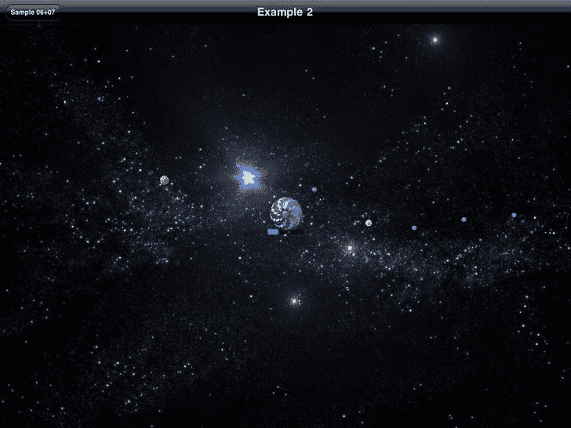
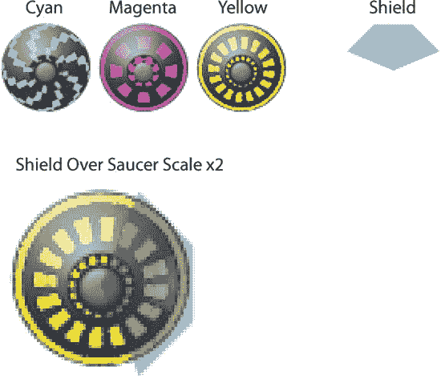

# 第 7 章：构建你的游戏：矢量角色与粒子系统

Core Graphics 是一个强大的 2D 绘图库，负责渲染 iOS 和 OS X 的大部分界面。在本章中，我们将了解如何使用这个库来绘制游戏中的角色。目标是让角色能够根据游戏状态动态绘制。为了说明这一点，我们将创建两个使用 Core Graphics 绘制的示例角色：一个显示角色剩余生命值的生命条，以及一个根据其威力大小以特定颜色绘制的子弹。这两个示例将展示如何在我们已开始的简单游戏引擎上下文中使用 Core Graphics。

我们将通过创建一个名为 `VectorRepresentation` 的新类来实现这一点，该类类似于上一章的 `ImageRepresentation` 类。`VectorRepresentation` 类将用于创建一个 `UIView` 来表示我们的角色，并使用 Core Graphics 通过自定义代码进行绘制。

我们还将研究游戏中用于创造引人入胜视觉效果的另一项流行技术：粒子系统。简单地说，粒子系统是游戏中用于生成大量小图形的任何东西，当这些小图形在屏幕上组合时，会产生比各部分总和更有趣的整体效果。粒子系统在游戏中用于创建火焰效果、水效果以及法术效果等等。

在本章中，我们将使用粒子系统来创建由大量简单粒子角色组成的彗星，从而赋予彗星一种发光、流动的感觉。当小行星碎裂时，我们还会使用这种技术来表现一些真实感。

本章的示例代码可以在 Xcode 项目 Sample 06+07 中找到。

## 飞碟、子弹、护盾和生命条

在这个示例中，我们将了解四个新角色：飞碟、子弹、护盾和生命条。本节代码位于 Xcode 项目 Sample 06+07 的 Example 2 组中。

生命条和子弹角色将使用 Core Graphics 以编程方式渲染，而不是使用预先渲染的图像。其他角色——飞碟和护盾——在这个示例中存在是为了提供一些背景（总得有些东西来发射子弹），并从行为的角度充实我们上一章的示例。图 7-1 展示了运行中的飞碟、子弹、护盾和生命条。

图 7-1. 飞碟、子弹、护盾和生命条

在图 7-1 中，我们看到屏幕中央有一个飞碟。从右侧向左移动的是许多圆形子弹。这些子弹有三种不同的大小，反映了它们的潜在伤害力。如果子弹与飞碟碰撞，飞碟上会添加一个护盾效果，同时生命条会下降，表示受到了伤害。在这个示例中，子弹会持续出现，直到飞碟的生命值为零，此时它会被移除，并添加一个新的飞碟。图 7-2 显示了本示例中使用的三种不同的飞碟，以及用于护盾的图形。

图 7-2. 三种飞碟和一个护盾

护盾图像是部分透明的，设计用于覆盖在飞碟之上，如下图所示，在一个放大的飞碟上覆盖着护盾。

为了理解此示例中所有部分如何组合在一起，我们将从查看类 `Example02Controller` 的实现开始，首先从 `doSetup` 任务入手，如列表 7-1 所示。

**列表 7-1.** 

