# 示例排版

### `doSetup`任务

```objective-c
-(BOOL)doSetup {
    if ([super doSetup]){
        NSMutableArray* classes = [NSMutableArray new];
        [classes addObject:[Saucer class]];
        [classes addObject:[Bullet class]];
        [self setSortedActorClasses:classes];
        return YES;
    }
    return NO;
}
```

在 Listing 7-1 中，我们看到类`Example02Controller`的`doSetup`任务。这个方法简单地表示我们希望将类型为`Saucer`和`Bullet`的角色排序，以便日后轻松访问。我们通过创建一个名为`classes`的`NSMutableArray`，并添加我们感兴趣的两个类的类对象来实现这一点。然后，`NSMutableArray classes`被传递给`setSortedActorClasses:`。这样，当我们在未来调用`actorsOfType:`时，就不必对所有角色进行排序来找到它们。接下来，我们来看一下描述此示例中动作的代码，该代码位于类`Example02Controller`的`updateScene`任务中。请参见 Listing 7-2。

### `updateScene`任务

```objective-c
-(void)updateScene{
    NSMutableSet* suacers = [self actorsOfType:[Saucer class]];
    if ([suacers count] == 0){
        Saucer* saucer = [Saucer saucer:self];
        [self addActor: saucer];
    }
    if (self.stepNumber % (30) == 0){
        float direction = M_PI - M_PI/30.0;
        float rand = (arc4random()%100)/100.0 * M_PI/15.0;
        direction += rand;
        Bullet* bullet = [Bullet bulletAt:CGPointMake(1000, 768/2) WithDirection:direction];
        [self addActor: bullet];
        if (arc4random()%4 == 0){
            if (arc4random()%2 == 0){
                [bullet setDamage:20.0];
            } else {
                [bullet setDamage:30.0];
            }
        }
    }
    NSMutableSet* bullets = [self actorsOfType:[Bullet class]];
    for (Bullet* bullet in bullets){
        for (Saucer* saucer in suacers){
            if ([bullet overlapsWith:saucer]){
               [saucer doHit:bullet with:self];
            }
        }
    }
    [super updateScene];
}
```

在 Listing 7-2 中，我们首先获取场景中所有`Saucer`的实例，并检查是否存在。如果没有，我们创建一个新的`Saucer`，并使用`addActor:`任务将其添加到场景中。这确保了屏幕中央始终只有一个`Saucer`。然后，每 30 步，我们使用`bulatAt:WithDirection:`任务创建一个新的`Bullet`。`bullet`的位置以游戏坐标指定，位于最右侧点的垂直中心。指定的方向会使`Bullet`向左移动，可能击中`Saucer`。一旦`bullet`被添加到场景中，其伤害值会被随机分配。每个`Bullet`造成的伤害也会决定我们如何绘制它。`Bullet`造成的伤害越大，它被绘制得越大。

`updateScene`任务最后要做的检查是是否有任何`Bullet`与`Saucer`发生碰撞。这是通过调用`actorsOfType:`并获取存储在`NSMutableSet* bullets`中的场景中所有`Bullet`对象完成的。我们简单地遍历每个`Bullet`和`Saucer`，并通过调用`overlapsWith:`检查是否有碰撞。如果有碰撞，我们调用`Saucer`类的`doHit:with:`任务。

让我们更仔细地看一下此示例中使用的`Actor`类的实现。

## Actor 类

在本节中，我们将学习`Saucer`角色和`HealthBar actor`类。`HealthBar`与我们至今为止看到的其他`actors`不同。它的不同之处在于其在场景中的位置依赖于另一个`Actor`的位置——在本例中，是一个`Saucer`。

在回顾了`Saucer`和`HealthBar`类之后，我们将查看`Behavior`类`FollowActor`，并了解如何实现此功能。

### 实例化 Saucer 类

我们将从查看`Saucer`类的构造函数开始。我们之所以要从`Saucer`的构造函数开始，是因为这是我们创建`HealthBar`的地方。这样，我们就不必担心在创建新`Saucer`时添加`HealthBar`，因为每次创建`Saucer`时都会自动创建一个。`Saucer`的构造函数如 Listing 7-3 所示。

```objective-c
+(id)saucer:(GameController*)controller{
    CGSize gameAreaSize = [controller gameAreaSize];
    CGPoint gameCenter = CGPointMake(gameAreaSize.width/2.0, gameAreaSize.height/2.0);
    ImageRepresentation* rep = [ImageRepresentation imageRep];
    [rep setBackwards:arc4random()%2 == 0];
    [rep setStepsPerFrame:3];
    Saucer* saucer = [[Saucer alloc] initAt:gameCenter WithRadius:32 AndRepresentation:rep];
    [rep setDelegate:saucer];
    [saucer setVariant:arc4random()%VARIATION_COUNT];
    [saucer setMaxHealth:100];
    [saucer setCurrentHealth:100];
    HealthBar* healthBar = [HealthBar healthBar:saucer];
    [healthBar setPercent:1];
    [saucer setHealthBar:healthBar];
    [controller addActor:healthBar];
    return saucer;
}
```

在 Listing 7-3 中，我们首先找到游戏区域的中心，并将该值存储在`CGPoint gameCenter`中。接下来，我们创建一个名为`rep`的`ImageRepresentation`。我们指示`rep`应该以每帧动画 3 步的速度，一半时间向后旋转`Saucer`。`CGRect gameCenter`和`ImageRepresentation rep`被传递给超类初始化器`initAt:WithRadius:AndRepresenation:`，以创建一个半径为 32 的`Saucer`对象。然后将对象`saucer`设置为`ImageRepresenation`的委托，以便我们可以通过类`Saucer`指定表示细节。这与第 6 章中的角色工作原理完全相同。请查看源代码以了解这些任务是如何实现的。

一旦创建了`saucer`对象，我们就想用一些细节来初始化它。我们通过调用`saucer`上的`setVariant:`来设置我们要使用的三个变体之一。我们还将最大生命值和当前生命值属性设置为 100。接下来，让我们转到`HealthBar`类。

### 实例化 HealthBar 类

为了在飞碟下方渲染生命条，我们创建一个`HealthBar`对象，并传入它要跟随的对象，即角色`saucer`。我们还将`saucer`的`healthBar`属性设置为新创建的`healthBar`，以便`saucer`对象在受到伤害时可以更新`healthBar`显示的百分比。最后，`healthBar`被添加到场景中。让我们看一下`HealthBar`的构造函数，了解它是如何设置和表现其行为的。参见 Listing 7-4。

```objective-c
+(id)healthBar:(Actor*)anActor{
    VectorRepresentation* rep = [VectorRepresentation vectorRepresentation];
    HealthBar* healthBar = [[HealthBar alloc] initAt:anActor.center WithRadius:anActor.radius AndRepresentation:rep];
    [rep setDelegate:healthBar];
    [healthBar setColor:[UIColor blueColor]];
    [healthBar setBackgroundColor:[UIColor colorWithRed:0 green:0 blue:0 alpha:.5]];
    FollowActor* follow = [FollowActor followActor:anActor];
    [follow setYOffset:[anActor radius]];
    [healthBar addBehavior:follow];
    return healthBar;
}
```

在 Listing 7-4 中，我们看到了构造函数任务`healthBar:`，它接受一个`Actor`作为参数。`Actor anActor`是此`HealthBar`将紧随其下的角色（如果`anActor`移动）。


在这个例子中，与`Saucer`关联的对象不会移动，但我们将在未来的示例中使用这个类，届时它的`actor`会移动。在探讨`FollowActor`行为之前，请注意`HealthBar`是通过传入`VectorRepresentation`实例而非`ImageRepresentation`对象来初始化的。这表明我们希望以编程方式绘制该对象。我们将在下一节了解其工作原理。现在，让我们继续探索这个例子。接下来要检查的类是`FollowActor`。

### FollowActor 行为类

负责将`HealthBar`保持在`Saucer`附近的类是`FollowActor`。这个类是一种`Behavior`，提供了与其他`Behavior`类类似的抽象。让我们通过查看`FollowActor`类来了解这一切如何协同工作。参见列表 7-5。

**列表 7-5. `FollowActor.m`**

```objectivec
#import "FollowActor.h"
#import "GameController.h"

@implementation FollowActor
@synthesize actorToFollow;
@synthesize xOffset;
@synthesize yOffset;

+(id)followActor:(Actor*)anActorToFollow{
    FollowActor* follow = [FollowActor new];
    [follow setActorToFollow:anActorToFollow];
    return follow;
}
-(void)applyToActor:(Actor*)anActor In:(GameController*)gameController{
    if (![actorToFollow removed]){
        CGPoint c = [actorToFollow center];
        c.x += xOffset;
        c.y += yOffset;

        [anActor setCenter: c];
    } else {
        [gameController removeActor:anActor];
    }
}
@end
```

在列表 7-5 中，我们看到了`FollowActor`类的完整实现。它通过任务`followActor:`构造，该任务接受要跟随的`actor`作为参数。游戏每一步都会调用任务`applyToActor:In:`，负责重新定位与该`behavior`关联的`actor`。为此，我们只需将`anActor`的`center`属性设置为我们正在跟随的`Actor`的`center`属性，并调整`xOffest`和`yOffset`。查看列表 7-4，我们看到`HealthBar`被配置为以等于`saucer`的`radius`的`xOffset`跟随`saucer`。这使`HealthBar`保持在`saucer`下方居中。现在让我们探讨`Bullet`类。

### Bullet 类

我们已经了解了`Saucer`和`HealthBar`类如何协同工作。现在让我们看看`Bullet`类，并理解其行为方式。列表 7-6 展示了`Bullet`的构造函数。

**列表 7-6. `Bullet.m`（`bulletAt:WithDirection:`）**

```objectivec
+(id)bulletAt:(CGPoint)aCenter WithDirection:(float)aDirection{
    VectorRepresentation* rep = [VectorRepresentation vectorRepresentation];
    Bullet* bullet = [[Bullet alloc] initAt:aCenter WithRadius:4 AndRepresentation:rep];
    [rep setDelegate:bullet];

    [bullet setDamage: 10];
    LinearMotion* motion = [LinearMotion linearMotionInDirection:aDirection AtSpeed:3];
    [motion setWrap:YES];
    [bullet addBehavior: motion];

    ExpireAfterTime* expires = [ExpireAfterTime expireAfter:240];
    [bullet addBehavior:expires];

    return bullet;
}
```

在列表 7-6 中，我们看到该类由熟悉的构建块组成。它通过现在熟悉的`initAt:WithRadius:AndRepresentation:`任务初始化，并且我们添加了类型为`LinearMotion`和`ExpiresAfterTime`的`behavior`对象。这两个`behavior`对象被`Powerup`类使用，并在第 6 章中有详细描述。`Bullet`类中唯一的新特性是`VectorRepresentation`类，它也被`HealthBar`类使用，以表明这种类型的`actor`将使用 Core Graphics 绘制。

让我们更仔细地看看`VectorRepresentation`类，以及它如何与我们的游戏引擎和`actor`交互，为使用 Core Graphics 渲染`actor`提供简单方法。

### 通过 VectorRepresentation 使用 Core Graphics 绘制 Actor

Core Graphics 库很有趣，因为它不是一个矢量图形库（如 SVG），但它在光栅化矢量数据结构方面表现出色。考虑到 Core Graphics 最初基于 PDF，这很有道理。Core Graphics 是一个出色的库，用于以分辨率无关的方式渲染高质量图形。对我们而言，这意味着代码不会指定哪个像素是什么颜色，而是描述形状及其填充方式。Core Graphics 也被称为 Quartz。可用的绘图函数完整描述参见：`http://goo.gl/6i5gr`。

在 iOS 中，`UIView`可以通过重写任务`drawRect:`来指定其绘制方式，获取其图形上下文引用，然后调用一系列绘制方法。由于我们的游戏引擎使用`UIView`来表示每个`actor`，我们知道最终我们将创建一个`UIView`的子类，并为基于矢量的`actor`调用绘制代码。`VectorRepresentation`类负责管理`actor`与在屏幕上绘制它的视图之间的关系。

### VectorRepresentation 类

`VectorRepresentation`类负责创建适合绘制`actor`的`UIView`。让我们从`VectorRepresentation`的头文件开始探索该类。参见列表 7-7。

**列表 7-7. `VectorRepresentation.h`**

```objectivec
#import <Foundation/Foundation.h>
#import "Actor.h"

@class VectorActorView;

@protocol VectorRepresentationDelegate
-(void)drawActor:(Actor*)anActor WithContext:(CGContextRef)context InRect:(CGRect)rect;
@end

@interface VectorRepresentation : NSObject<Representation> {
    VectorActorView* view;
}
@property (nonatomic, assign) NSObject<VectorRepresentationDelegate>* delegate;
+(id)vectorRepresentation;
@end
```

在列表 7-7 中，我们看到`VectorRepresentation`类定义了一个名为`VectorRepresentationDelegate`的协议，每个基于矢量的`actor`都必须遵循该协议。该协议要求所有遵循它的类实现任务`drawActor:WithContext:InRect:`，实际的绘制代码应放置在此处。

`VectorRepresentation`类扩展了`NSObject`并遵循`Representation`协议，就像`ImageRepresentation`类一样。这里的想法是，大部分代码不应关心我们使用哪种类型的表示——矢量还是图像。我们只需创建正确的`Representation`对象，并将其与每个`actor`关联。

我们还看到`VectorRepresentation`类有一个单一属性`view`，类型为`VectorActorView`。`VectorActorView`是`UIView`的子类，最终将调用由`VectorRepresentationDelegate`协议定义的`drawActor:WithContext:InRect:`任务。在查看`VectorActorView`类之前，让我们看看`VectorRepresentation`的实现，如列表 7-8 所示。

**列表 7-8. `VectorRepresentation.m`**

```objectivec
#import "VectorRepresentation.h"
#import "VectorActorView.
```


```objectivec
@implementation VectorRepresentation
@synthesize delegate;

+(id)vectorRepresentation{
    return [VectorRepresentation new];
}

-(UIView*)getViewForActor:(Actor*)anActor In:(GameController*)aController{
    if (view == nil){
        view = [VectorActorView new];
        [view setBackgroundColor:[UIColor clearColor]];
        [view setActor: anActor];
        [view setDelegate:delegate];
        [anActor setNeedsViewUpdated:YES];
    }
    return view;
}

-(void)updateView:(UIView*)aView ForActor:(Actor*)anActor In:(GameController*)aController{
    if ([anActor needsViewUpdated]){
        [aView setNeedsDisplay];
        [anActor setNeedsViewUpdated:NO];
    }
}
@end
```

在 Listing 7-8 中，可以看到类`VectorRepresentation`的实现及其简单的构造方法。还可以看到它实现了协议`Representation`定义的任务`getViewForActor:In:`和`updateView:In:`。在任务`getViewForActor:In:`中，我们创建了一个新的`VectorActorView`，并指定了用于绘制的演员和委托。然后调用`setNeedsViewUpdated`，确保至少调用一次演员的绘制代码。

在任务`updateView:In:`中，我们检查演员是否需要更新；如果需要，则在`UIView aView`上调用`setNeedsDisplay`。任务`setNeedsDisplay`由类`UIView`定义，指示底层图形系统应重新绘制`UIView`。实际上，这会导致调用`VectorActorView`的`drawRect:`任务，进而调用演员的`drawActor:WithContext:InRect:`。接下来我们来看类`VectorActorView`的细节。

## 基于向量的演员的 UIView: VectorActorView

类`VectorActorView`是`UIView`的子类，用于在场景中表示演员，这与我们使用`UIImageView`实例表示基于图像的`Actor`的方式非常相似。让我们看一下类`VectorActorView`，从头部开始，看看它如何协同工作。请参见 Listing 7-9。

**Listing 7-9. VectorActorView.h**

```objectivec
#import <UIKit/UIKit.h>
#import "Actor.h"
#import "VectorRepresentation.h"

@interface VectorActorView : UIView {

}
@property (nonatomic, retain) Actor* actor;
@property (nonatomic, retain) NSObject<VectorRepresentationDelegate>* delegate;

@end
```

在 Listing 7-9 中，可以看到`VectorActorView`继承自`UIView`并拥有两个属性。第一个是要绘制的`Actor`。第二个属性是`VectorRepresentationDelegate`，负责实际绘制`Actor`。在这个例子中，这两个对象——`actor`和`delegate`——将是同一个对象，要么是`Bullet`，要么是`HealthBar`。然而，这不是强制要求。我喜欢将所有与演员相关的代码保留在演员类中。委托可以是其自己的类，负责绘制演员。如果你希望使用一个`VectorRepresentationDelegate`来绘制多种类型的演员，这将很有意义。类`VectorActorView`的实现非常简单，如 Listing 7-10 所示。

**Listing 7-10. VectorActorView.m**

```objectivec
- (void)drawRect:(CGRect)rect {
    CGContextRef context = UIGraphicsGetCurrentContext();
    [delegate drawActor:actor WithContext:context InRect:rect];
}
```

在 Listing 7-10 中，可以看到类`VectorActorView`的实现只有一个方法，即任务`drawRect:`的实现。在这个方法中，我们通过调用`UIGraphicsGetCurrentContext`获取当前图形上下文的引用，并将`context`和`actor`传递给`delegate`，以便在指定的`CGRect`中绘制。现在让我们看一个具体的例子。

## 绘制 HealthBar

如前所述，本例中使用的基于向量的演员在绘制方面是它们自己的委托，因此让我们再次查看`HealthBar`类，看看它如何绘制自身。请参见 Listing 7-11。

**Listing 7-11. HealthBar.m (drawActor:WithContext:InRect:)**

```objectivec
-(void)drawActor:(Actor*)anActor WithContext:(CGContextRef)context InRect:(CGRect)rect{
    CGContextClearRect(context,rect);

    float height = 10;

    CGRect backgroundArea = CGRectMake(0, self.radius-height/2, self.radius*2, height);
    [self.backgroundColor setFill];
    CGContextFillRect(context, backgroundArea);

    CGRect healthArea = CGRectMake(0, self.radius-height/2, self.radius*2*percent, height);
    [self.color setFill];
    CGContextFillRect(context, healthArea);
}
```

在 Listing 7-11 中，我们首先调用`CGContextClearRect`。这会擦除给定`rect`中的旧内容，使我们准备好进行实际绘制。要绘制`HealthBar`，我们只需要绘制两个矩形：一个用于背景，另一个位于背景之上，代表健康条的当前百分比。要绘制矩形区域（而不是绘制矩形的边缘），我们通过调用`CGRectMake`定义一个`rect`。然后，通过调用`UIColor`对象`backgroundColor`（这是`HealthBar`的一个属性）上的`setFill`来指定要使用的颜色。

要实际更改正在绘制的`UIView`的像素颜色，我们调用`CGContextFillRect`，传入`context`和`CGRect backgroundArea`。要绘制前景矩形，我们重复该过程，但顶部矩形`healthArea`的宽度根据属性`percent`的值计算。这表明每当`HealthBar`的`percent`发生变化时，都必须重新绘制`HealthBar`。为了确保这一点，我们必须提供自己的`setPercent:`实现，而不是依赖合成属性提供的默认实现。Listing 7-12 显示了类`HealthBar`的自定义`setPercent:`实现。

**Listing 7-12. HealthBar.m (setPercent:)**

```objectivec
-(void)setPercent:(float)aPercent{
    if (percent != aPercent){
        percent = aPercent;
        if (percent < 0){
            percent = 0;
        }
        if (percent > 1){
            percent = 1;
        }
        [self setNeedsViewUpdated:YES];
    }
}
```

Listing 7-12 显示了我们自定义的`setPercent:`实现。首先检查`percent`（属性的支持变量）和传入的值`aPercent`是否不同。如果不同，则将`percent`设置为`aPercent`，并通过确保其在 0 和 1 之间来规范化该值。最后，用`YES`调用`setNeedsViewUpdate:`。这确保了`HealthBar`将在动画的下一步中被重绘。现在让我们来看看`Bullet`类是如何绘制的。

## 绘制 Bullet 类

我们已经查看了`HealthBar`类，并检查了它是如何绘制的。我们只使用了一个绘图函数`CGContextFillRect`来创建视觉效果。当然，还有很多很多绘图函数可以让您创建任何想要的视觉效果。我们不打算涵盖所有这些函数，但网上有很好的文档可用。话虽如此，让我们看一下类`Bullet`的绘制实现。请参见 Listing 7-13。

**Listing 7-13. Bullet.**

好的，作为高级文档工程师和翻译员，我将严格按照您的注意事项和示例格式，将给定的英文文本翻译成中文。


`drawRect:WithContext:InRect:` 方法如下：

```
-(void)drawActor:(Actor*)anActor WithContext:(CGContextRef)context InRect:(CGRect)rect{
    CGContextAddEllipseInRect(context, rect);
    CGContextClip(context);
    CGFloat locations[2];
    locations[0] = 0.0;
    locations[1] = 1.0;
    CGColorSpaceRef space = CGColorSpaceCreateDeviceRGB();
    UIColor* color1 = nil;
    UIColor* color2 = nil;
    if (damage >= 30){
        color1 = [UIColor colorWithRed:1.0 green:0.8 blue:0.8 alpha:1.0];
        color2 = [UIColor colorWithRed:1.0 green:0.0 blue:0.0 alpha:1.0];
    } else if (damage >= 20){
        color1 = [UIColor colorWithRed:0.8 green:1.0 blue:0.8 alpha:1.0];
        color2 = [UIColor colorWithRed:0.0 green:1.0 blue:0.0 alpha:1.0];
    } else {
        color1 = [UIColor colorWithRed:0.8 green:0.8 blue:1.0 alpha:1.0];
        color2 = [UIColor colorWithRed:0.0 green:0.0 blue:1.0 alpha:1.0];
    }
    CGColorRef clr[] = { [color1 CGColor], [color2 CGColor] };
    CFArrayRef colors = CFArrayCreate(NULL, (const void**)clr, sizeof(clr) / sizeof(CGColorRef), &kCFTypeArrayCallBacks);
    CGGradientRef grad = CGGradientCreateWithColors(space, colors, locations);
    CGColorSpaceRelease(space);
    CGContextDrawLinearGradient(context, grad, rect.origin, CGPointMake(rect.origin.x + rect.size.width, rect.origin.y + rect.size.height), 0);
    CGGradientRelease(grad);
}
```

在 Listing 7-13 中，我们看到了在屏幕上绘制每个子弹的代码。这段代码根据 `Bullet` 的伤害值绘制了一个带有渐变的圆形。在我看来，完成一个如此简单的功能所需的代码量实在太多。让我们逐段分析。任务的第一行基于提供的矩形为图形上下文创建了一个椭圆裁剪区域。这意味着后续的绘制操作仅在这个椭圆区域内可见。

下一步是创建绘制操作所使用的渐变。渐变由两个主要部分组成。第一部分是一个数组，指定了渐变中每种颜色应该应用的位置。在本例中，我们只使用双色渐变，因此创建了一个名为 `locations` 的数组，将第一个值设为 0，第二个值设为 1。这意味着颜色会从渐变起点到终点均匀混合。

渐变的第二部分是所使用的颜色。在示例中，我们根据 `damage` 的值指定每种颜色。我们将变量 `color1` 和 `color2` 简单地赋值为要用来绘制 `Bullet` 的颜色。一旦有了颜色，我们就创建一个 `CFArrayRef` 来存储这些颜色。

在将颜色的位置和颜色本身存储到正确类型的数组后，我们调用 `CGGradientCreateWithColors` 并将数组传入，以创建一个名为 `grad` 的 `CGGradientRef`。注意，我们还传递了一个对颜色空间的引用，该引用由 `CGColorSpaceRef` 定义，名为 `ref`。这是显示器的默认颜色空间，只有当你的应用程序进行复杂的颜色展示时才需要更改。

一旦 `CGGradientRef` 创建完成，就调用 `CGContextDrawLinearGradient`。通常情况下，它会用指定的渐变填充整个 `UIView`，但由于我们在任务顶部指定了裁剪区域，因此会得到一个漂亮的圆形，且渐变均匀地绘制在上面。

我们已经了解了如何创建使用 Core Graphics 绘制的角色，从而能够动态绘制角色，避免为角色的每种可能状态都创建图像。在下一节中，我们将探讨另一种绘制角色的策略——基于粒子的绘制。

## 为游戏添加粒子系统

游戏中的粒子系统是由许多（通常是很小的）图像集合在一起绘制而成的，以产生整体效果。粒子系统在计算机图形学中有多种不同的用途；常见的例子有火、水、头发和草地。

在我们的示例中，将创建一个名为 `Particle` 的新角色，用于绘制彗星角色，并通过让流星角色看起来像破裂来改进它。图 7-3 展示了这个下一个示例的实际效果。

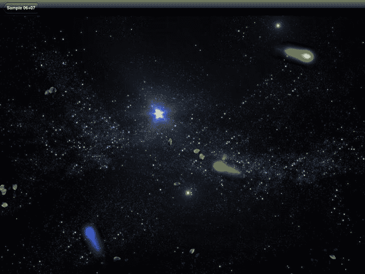

图 7-3. 彗星和可摧毁的流星

在 图 7-3 中，我们看到三颗彗星划过屏幕。我们还看到许多流星处于各种爆炸状态。流星从屏幕外漂移进入，当你点击屏幕时，它们会爆炸成许多小流星。除了创建新的小流星外，我们还会发出许多看起来像流星的粒子。这为大流星的毁灭增添了一些真实感，因为大块的岩石很少能干净地碎裂成小块。这两种不同的粒子效果——彗星和流星碎片——截然不同，但每种都使用相同的基类 `Particle` 实现。在深入每个新角色的细节之前，让我们仔细看看 `Example03Controller` 类，以便更好地理解这个示例的工作原理。Listing 7-14 展示了 `Example03Controller` 的重要部分。

**Listing 7-14.**  `Example03Controller.m`（`doSetup` 和 `updateScene`）

```
-(BOOL)doSetup{
    if([super doSetup]){
        NSMutableArray* classes = [NSMutableArray new];
        [classes addObject:[Asteroid class]];
        [self setSortedActorClasses:classes];

        UITapGestureRecognizer* tapRecognizer = [[UITapGestureRecognizer alloc] initWithTarget:self action:@selector(tapGesture:)];
        [tapRecognizer setNumberOfTapsRequired:1];
        [tapRecognizer setNumberOfTouchesRequired:1];

        [actorsView addGestureRecognizer:tapRecognizer];

        return YES;
    }
    return NO;
}

-(void)updateScene{
    if (self.stepNumber % (60*5) == 0){
        [self addActor:[Comet comet:self]];
    }

    if ([[self actorsOfType:[Asteroid class]] count] == 0){
        int count = arc4random()%4+1;
        for (int i=0;i<count;i++){
            [self addActor:[Asteroid asteroid:self]];
        }
    }

    [super updateScene];
}
```

在 Listing 7-14 中，我们看到 `Example03Controller` 类的两个任务：`doSetup` 和 `updateScene`。任务 `doSetup` 遵循我们熟悉的模式，通过调用 `setSortedActorClass:` 来标识我们希望高效访问的角色类——在本例中是 `Asteroid`。我们还创建了一个名为 `tapRecognizer` 的 `UITapGestureRecognizer`，并将其注册到 `actorsView` 对象中。这样，当我们点击屏幕时，任务 `tapGesture:` 就会被调用。

如 Listing 7-14 所示，任务 `updateScene` 每五秒（`60*5`）添加一个新的 `Comet` 角色，并在场景中 `Asteroids` 数量为零时添加一到四个 `Asteroids`。与之前的示例一样，控制器类中的代码相对简单。该示例的大部分实际逻辑都位于不同的角色类中。在查看 `Asteroid` 类之前，让我们先考虑任务 `tapGesture:`，如 Listing 7-15 所示。

**Listing 7-15.**  `Example03Controller.m`（`tapGesture:`）

```
- (void)tapGesture:(UIGestureRecognizer *)gestureRecognizer{
    for (Asteroid* asteroid in [self actorsOfType:[Asteroid class]]){
        [asteroid doHit:self];
    }
}
```

在 Listing 7-15 中，我们看到 `tapGesture:` 任务（当用户点击屏幕时调用）简单地遍历场景中的每个 `Asteroid`，并在其上调用 `doHit:`。正是由于这个任务，我们希望能够轻松访问场景中的 `Asteroids`。


以下章节描述了角色`Asteroid`的实现细节，以及每个`Asteroid`爆炸时产生的粒子效果。

## 简单粒子系统

最简单的粒子系统是在屏幕上生成一批短时存在的物体，这些物体会快速衰减或消失。我们来看看`Asteroid`类，并了解如何创建非常简单的粒子效果。

### Asteroid 类

在查看如何为`Asteroid`的销毁添加粒子效果之前，先花点时间整体理解`Asteroid`类。这样我们就能在构建另一个`Actor`类时，更好地理解粒子效果的上下文。`Asteroid`类的头文件如清单 7-16 所示。

**清单 7-16.  Asteroid.h**

```objc
@interface Asteroid : Actor{  }
@property (nonatomic) int level;
+(id)asteroid:(GameController*)aController;
+(id)asteroidOfLevel:(int)aLevel At:(CGPoint)aCenter;
-(void)doHit:(GameController*)controller;
@end
```

在清单 7-16 中，我们看到了`Asteroid`类的声明。可以看到`Asteroid`类继承了`Actor`类，并有两个构造器。构造器`asteroid:`被`Example03Controller`用于向场景中添加最大的`Asteroid`。构造器`asteroidOfLevel:At:`用于在点击事件后的`doHit:`任务中创建并添加更小的`Asteroid`。清单 7-17 展示了`Asteroid`类的第一个构造器。

**清单 7-17.  Asteroid.m (asteroid:)**

```objc
+(id)asteroid:(GameController*)acontroller{
    CGSize gameSize = [acontroller gameAreaSize];
    CGPoint gameCenter = CGPointMake(gameSize.width/2.0, gameSize.height/2.0);
    float directionOffScreen = arc4random()%100/100.0 * M_PI*2;
    float distanceFromCenter = MAX(gameCenter.x,gameCenter.y) * 1.2;
    CGPoint center = CGPointMake(gameCenter.x + cosf(directionOffScreen)*distanceFromCenter, gameCenter.y + sinf(directionOffScreen)*distanceFromCenter);
    return [Asteroid asteroidOfLevel:4 At:center];
}
```

在清单 7-17 中，我们看到了任务`asteroid:`，它通过调用另一个构造器来创建一个大小为 4 的新`Asteroid`。这里的大部分工作只是找到屏幕外`Asteroid`的起始点。这与第 6 章中为`Powerup`角色查找点的代码相同。详细内容如图 7-3 所示。`Asteroid`的第二个构造器如清单 7-18 所示。

**清单 7-18.  Asteroid.m (asteroidOfLevel:At:)**

```objc
+(id)asteroidOfLevel:(int)aLevel At:(CGPoint)aCenter{
    ImageRepresentation* rep = [ImageRepresentation imageRepWithDelegate:[AsteroidRepresentationDelegate instance]];
    [rep setBackwards:arc4random()%2 == 0];
    if (aLevel >= 4){
        [rep setStepsPerFrame:arc4random()%2+2];
    } else {
        [rep setStepsPerFrame:arc4random()%4+1];
    }

    Asteroid* asteroid = [[Asteroid alloc] initAt:aCenter WithRadius:4 + aLevel*7 AndRepresentation:rep];

    [asteroid setLevel:aLevel];
    [asteroid setVariant:arc4random()%AST_VARIATION_COUNT];
    [asteroid setRotation: (arc4random()%100)/100.0*M_PI*2];

    float direction = arc4random()%100/100.0 * M_PI*2;
    LinearMotion* motion = [LinearMotion linearMotionInDirection:direction AtSpeed:1];
    [motion setWrap:YES];
    [asteroid addBehavior:motion];

    return asteroid;
}
```

在清单 7-18 中，我们看到了`Asteroid`类的主要构造器。我们还看到我们根据`aLevel`的值来创建具有相应半径的`Asteroid`。

通过这种方式，随着小行星分裂，我们会得到逐渐变小的碎片，因为每个新小行星的等级都比其创建者低一级。在`asteroidOfLevel:At:`中我们要做的最后一件事是向`Asteroid`添加`LinearMotion`行为，使其沿直线运动并环绕屏幕。

清单 7-8 中另一个值得注意的点是，我们创建`ImageRepresentation`的方式与之前略有不同。之前，我们创建的所有`ImageRepresentation`都将角色作为`delegate`，这样做很合理，因为所有关于角色的信息都集中在一个文件中。然而，我们希望`Asteroid`类和创建的粒子看起来相同，只是尺寸不同。为方便实现，我们创建了一个名为`AsteroidRepresentationDelegate`的新类，负责指定小行星外观对象的渲染方式。接下来我们进入`AsteroidRepresentationDelegate`类。

### 用同一个类表示小行星和粒子

如前所述，`Asteroid`的绘制方式定义在`AsteroidRepresentationDelegate`类中。这个类将用于表示每个`Asteroid`，以及当`Asteroid`破裂时我们创建的`particles`。清单 7-19 展示了`AsteroidRepresentationDelegate`的实现。

**清单 7-19.  AsteroidRepresentationDelegate.m**

```objc
+(AsteroidRepresentationDelegate*)instance{
    static AsteroidRepresentationDelegate* instance;
    @synchronized(self) {
        if(!instance) {
            instance = [AsteroidRepresentationDelegate new];
        }
    }
    return instance;
}
-(int)getFrameCountForVariant:(int)aVariant AndState:(int)aState{
    return 31;
}
-(NSString*)getNameForVariant:(int)aVariant{
    if (aVariant == VARIATION_A){
        return @"A";
    } else if (aVariant == VARIATION_B){
        return @"B";
    } else if (aVariant == VARIATION_C){
        return @"C";
    } else {
        return nil;
    }
}
-(NSString*)baseImageName{
    return @"Asteroid";
}
```

在清单 7-19 中，我们看到了定义基于图像的角色所需的任务。我们看到图像文件将以字符串`"Asteroid"`开头，如任务`baseImageName`所示。我们还看到三种变体各有 31 张图像，如`getFramesCountForVariant:AndState:`和`getNameForVariant:`所示。

清单 7-19 中的任务`instance`是我们遇到的新内容。这个任务代表了一种创建`AsteroidRepresentationDelegate`类单例的方式。我们通过对`Asteroid`的类对象进行同步操作来实现，并且仅在变量`instance`为`nil`时才创建新的`AsteroidRepresentationDelegate`。这让我们能够只创建该类的一个实例，即便可能有成百上千个`Asteroid`和`Particle`使用它来指定它们的外观。现在让我们把所有部分整合起来，看看`Asteroid`是如何被销毁的。

### 销毁小行星

我们已经为理解`Asteroid`如何在屏幕上创建和表示奠定了基础。现在来看看任务`doHit:`，以了解如何将这些部分整合起来产生预期的行为。参见清单 7-20。

**清单 7-20.  Asteroid.m (doHit:)**

```objc
-(void)doHit:(GameController*)controller{
    if (level > 1){
        int count = arc4random()%3+1;
        for (int i=0;i<count;i++){
            Asteroid* newAst = [Asteroid asteroidOfLevel:level-1 At:self.
```


```center];             [controller addActor:newAst];         }     }      int particles = arc4random()%5+1;     for (int i=0;i<particles;i++){         ImageRepresentation* rep = [ImageRepresentation imageRepWithDelegate:[AsteroidRepresentationDelegate instance]];         Particle* particle = [Particle particleAt:self.center WithRep:rep Steps:25];         [particle setRadius:6];         [particle setVariant:arc4random()%AST_VARIATION_COUNT];         [particle setRotation: (arc4random()%100)/100.0*M_PI*2];          LinearMotion* motion = [LinearMotion linearMotionRandomDirectionAndSpeed];         [particle addBehavior:motion];          [controller addActor: particle];     }     [controller removeActor:self]; } ```

在清单 7-20 中，我们看到任务`doHit:`。当我们点击屏幕时，这个任务会被调用，导致场景中所有的`Asteroids`分裂成多个更小的`Asteroids`。我们还希望在此过程中生成一些看起来像小行星的`Particles`。我们首先要确保调用`doHit:`的小行星等级大于一，因为这些小行星不应该创建额外的`Asteroids`。如果`Asteroid`的等级大于一，我们会在当前小行星的同一位置创建一到三个新`Asteroids`，等级小一级。这些新`Asteroids`将沿直线从当前`Asteroid`飞离，直到它们也爆炸。

为了在清单 7-20 中创建粒子效果，我们首先决定要向场景中添加多少个粒子。然后使用`Asteroids`的当前位置、`AsteroidRepresentationDelegate`的单例实例创建一个新的`Particle`，并指定该粒子应存活 25 步动画。粒子的`radius`设置为 6。这纯粹是一个美学选择；它可以是任何值。`variation`和`rotation`属性也被设置，为每个创建的粒子提供视觉变化。我们对粒子做的最后一件事是在将其添加到场景之前，指定一个随机的`LinearMotion`。图 7-4 展示了新创建的`Asteroids`以及`Particles`的特写。

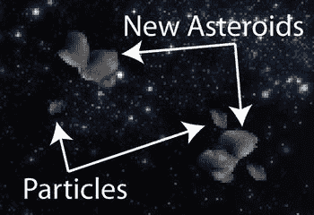

图 7-4.  小行星和粒子，放大视图

## Particle 类

我们已经了解了当每个`Asteroid`爆炸时如何创建`Particles`，现在让我们详细看看`Particle`类及其实现。首先从清单 7-21 所示的头文件开始。

**清单 7-21.**  Particle.h

```objectivec
@interface Particle : Actor<ExpireAfterTimeDelegate> {
	
}
@property (nonatomic) float totalStepsAlive;
+(id)particleAt:(CGPoint)aCenter WithRep:(NSObject<Representation>*)rep Steps:(float)numStepsToLive;
@end
```

在清单 7-21 中，`Particle`类的头文件继承了`Actor`并遵守`ExpireAfterTimeDelegate`协议。`Particle`遵守`ExpireAfterTimeDelegate`，因为我们希望在其生命周期内改变粒子的不透明度，使其逐渐淡出。属性`totalStepsAlive`表示粒子在场景中应该存在的时间，它由构造函数`particleAt:WithRep:Steps:`设置。我们还可以看到，粒子需要一个`Representation`作为构造函数的参数传入。`Particle`的实现如清单 7-22 所示。

**清单 7-22.**  Particle.m

```objectivec
@implementation Particle
@synthesize totalStepsAlive;

+(id)particleAt:(CGPoint)aCenter WithRep:(NSObject<Representation>*)rep Steps:(float)numStepsToLive{
	Particle* particle = [[Particle alloc] initAt:aCenter WithRadius:32 AndRepresentation:rep];

	[particle setTotalStepsAlive:numStepsToLive];

	ExpireAfterTime* expire = [ExpireAfterTime expireAfter:numStepsToLive];
	[expire setDelegate: particle];
	[particle addBehavior:expire];

	return particle;
}
-(void)stepsUpdated:(ExpireAfterTime*)expire In:(GameController*)controller{
  self.alpha = [expire stepsRemaining]/totalStepsAlive;
}
@end
```

在清单 7-22 中，我们看到构造函数`particleAt:WithRep:Steps:`相当直接。我们创建一个新的`Particle`对象，传入提供的`Representation`对象。我们还设置了属性`totalStepsAlive`，并创建了一个`ExpiresAfterTime Behavior`。注意，`particle`被设置为`expire`的`delegate`；这会导致每次执行`expire`时，任务`stepsUpdated:In:`被调用。

在任务`stepsUpdated:In:`中，我们根据`Particle`生命周期所处的阶段，简单地调整其`alpha`值。在一个更复杂的`Particle`实现中，这种淡出行为将是可配置的，不仅仅是开或关，还包括粒子淡出的速率。在这个简单的实现中，每个粒子以线性方式淡出。

我们已经研究了`Asteroid`和`Particle`的实现，发现为场景创建粒子效果相当简单。在下一节中，我们将查看`Comet`角色，并看到一个更具视觉冲击力的示例，尽管其实现同样简单。

## 创建基于矢量的粒子

在前面的示例中，我们研究了由一系列图像表示的`Particles`。由于我们有灵活的角色渲染方式，我们可以同样轻松地创建通过程序绘制的粒子。在本例中，我们将创建停留在原地的`Particles`，但我们会移动创建它们的位置。这将为我们的`Comet`角色赋予一个漂亮的发光尾巴，就像任何彗星应该有的那样。图 7-5 展示了我们的新角色`Comet`。

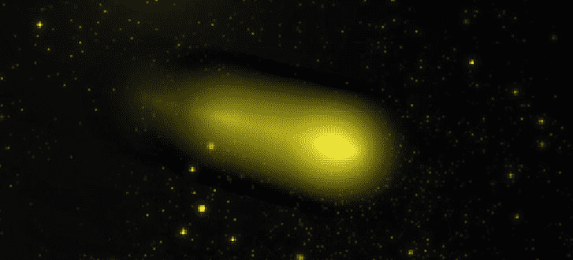

图 7-5.  Comet 细节

在图 7-5 中，我们看到了彗星的放大细节。它由许多粒子组成，每个粒子在原地慢慢淡出，形成彗星的尾巴。让我们看看`Comet`类以及这个视觉效果是如何创建的。清单 7-23 展示了`Comet`类的头文件。

**清单 7-23.**  Comet.h

```objectivec
enum{
	VARIATION_RED = 0,
	VARIATION_GREEN,
	VARIATION_BLUE,
	VARIATION_CYAN,
	VARIATION_MAGENTA,
	VARIATION_YELLOW,
	VARIATION_COUNT
};

@interface Comet : Actor<VectorRepresentationDelegate> {
	
}
+(id)comet:(GameController*)controller;
@end
```

在清单 7-23 中，我们看到`Comet`继承了`Actor`并遵守`VectorRepresentationDelegate`协议。它有一个单一的构造函数，以`GameController`作为唯一参数。我们来看看这个构造函数的实现，如清单 7-24 所示。

**清单 7-24.**  Comet.m (comet:)

```objectivec
+(id)comet:(GameController*)controller{
	CGSize gameSize = [controller gameAreaSize];

	CGPoint gameCenter = CGPointMake(gameSize.width/2.0, gameSize.height/2.0);

	float directionOffScreen = arc4random()%100/100.0 * M_PI*2;
	float distanceFromCenter = MAX(gameCenter.x,gameCenter.y) * 1.2;

	CGPoint center = CGPointMake(gameCenter.x + cosf(directionOffScreen)*distanceFromCenter, gameCenter.
```


`y + sinf(directionOffScreen) * distanceFromCenter)`;  
`ImageRepresentation* rep = [ImageRepresentation imageRep];`  
`Comet* comet = [[Comet alloc] initAt:center WithRadius:16 AndRepresentation:rep];`  
`[rep setDelegate:comet];`  
`[comet setVariant:arc4random() % VARIATION_COUNT];`  
`float direction = arc4random() % 100 / 100.0 * M_PI * 2;`  
`LinearMotion* motion = [LinearMotion linearMotionInDirection:direction AtSpeed:1];`  
`[motion setWrap:YES];`  
`[comet addBehavior:motion];`  
`ExpireAfterTime* expire = [ExpireAfterTime expireAfter:60 * 15];`  
`[comet addBehavior:expire];`  
`return comet;`  

在清单 7-24 中，我们看到我们再次在屏幕外创建每个`Comet`，通过计算一个`CGPoint`（名为`center`），该点位于游戏区域边缘之外的一个圆上。我们还创建了一个`VectorRepresentation`，并使用`Comet`作为`delegate`。我们将使用相同的任务绘制`Comet`和`Comet`的尾部粒子。在指定`ExpireAfterTime`和`LinearMotion`作为`Comet`的行为后，它就可以被添加到场景中了。清单 7-25 展示了绘制每个`Comet`和`Particle`的任务。

**[清单 7-25.]** (#9781430244226_Ch07.xhtml#_list25)  Comet.m (drawActor:WithContext:InRect:)

```
-(void)drawActor:(Actor*)anActor WithContext:(CGContextRef)context InRect:(CGRect)rect{
    CGContextClearRect(context,rect);
    CGColorSpaceRef space = CGColorSpaceCreateDeviceRGB();

    CGFloat locations[4];
    locations[0] = 0.0;
    locations[1] = 0.1;
    locations[2] = 0.2;
    locations[3] = 1.0;

    UIColor* color1 = nil;
    UIColor* color2 = nil;
    UIColor* color3 = nil;

    float whiter = 0.6;
    float c2alpha = 0.5;
    float c3aplha = 0.3;

    if (self.variant == VARIATION_RED){
        color1 = [UIColor colorWithRed:1.0 green:whiter blue:whiter alpha:1.0];
        color2 = [UIColor colorWithRed:1.0 green:0.0 blue:0.0 alpha:c2alpha];
        color3 = [UIColor colorWithRed:1.0 green:0.0 blue:0.0 alpha:c3aplha];
    } else if (self.variant == VARIATION_GREEN){
        color1 = [UIColor colorWithRed:whiter green:1.0 blue:whiter alpha:1.0];
        color2 = [UIColor colorWithRed:0.0 green:1.0 blue:0.0 alpha:c2alpha];
        color3 = [UIColor colorWithRed:0.0 green:1.0 blue:0.0 alpha:c3aplha];
    } else if (self.variant == VARIATION_BLUE){
        color1 = [UIColor colorWithRed:whiter green:whiter blue:1.0 alpha:1.0];
        color2 = [UIColor colorWithRed:0.0 green:0.0 blue:1.0 alpha:c2alpha];
        color3 = [UIColor colorWithRed:0.0 green:0.0 blue:1.0 alpha:c3aplha];
    } else if (self.variant == VARIATION_CYAN){
        color1 = [UIColor colorWithRed:whiter green:1.0 blue:1.0 alpha:1.0];
        color2 = [UIColor colorWithRed:0.0 green:1.0 blue:1.0 alpha:c2alpha];
        color3 = [UIColor colorWithRed:0.0 green:1.0 blue:1.0 alpha:c3aplha];
    } else if (self.variant == VARIATION_MAGENTA){
        color1 = [UIColor colorWithRed:1.0 green:whiter blue:1.0 alpha:1.0];
        color2 = [UIColor colorWithRed:1.0 green:0.0 blue:1.0 alpha:c2alpha];
        color3 = [UIColor colorWithRed:1.0 green:0.0 blue:1.0 alpha:c3aplha];
    } else if (self.variant == VARIATION_YELLOW){
        color1 = [UIColor colorWithRed:1.0 green:1.0 blue:whiter alpha:1.0];
        color2 = [UIColor colorWithRed:1.0 green:1.0 blue:0.0 alpha:c2alpha];
        color3 = [UIColor colorWithRed:1.0 green:1.0 blue:0.0 alpha:c3aplha];
    }
    UIColor* color4 = [UIColor colorWithRed:0.0 green:0.0 blue:0.0 alpha:0.0];

    CGColorRef clr[] = { [color1 CGColor], [color2 CGColor] , [color3 CGColor], [color4 CGColor]};
    CFArrayRef colors = CFArrayCreate(NULL, (const void**)clr, sizeof(clr) / sizeof(CGColorRef), &kCFTypeArrayCallBacks);

    CGGradientRef grad = CGGradientCreateWithColors(space, colors, locations);
    CGColorSpaceRelease(space);

    CGContextDrawRadialGradient(context, grad, CGPointMake(self.radius, self.radius), 0, CGPointMake(self.radius, self.radius), self.radius, 0);

    CGGradientRelease(grad);
}
```

在清单 7-25 中，我们希望绘制一个简单的径向渐变，中心颜色与变体颜色匹配，边缘透明。为了绘制出好看的`Comet`，我们必须创建一个四色渐变。第一种颜色大部分是白色且完全不透明，接下来的两种颜色是变体颜色，具有两个不同的 alpha 值。最后一种颜色将完全透明。函数`CGContextDrawRadialGradient`在 actor 的中心使用第一种颜色绘制径向渐变，并创建到 actor 透明边缘的平滑过渡。

现在我们已经看到了每个粒子是如何绘制的，接下来应该看看粒子是如何创建的。清单 7-26 展示了`Comet`的`step:`任务实现。

**[清单 7-26.]** (#9781430244226_Ch07.xhtml#_list26)  Comet.m (step:)

```
-(void)step:(GameController*)controller{
    if ([controller stepNumber]%3 == 0){
        VectorRepresentation* rep = [VectorRepresentation vectorRepresentation];
        [rep setDelegate:self];

        int totalStepsAlive = arc4random()%60 + 60;
        Particle* particle = [Particle particleAt:self.center WithRep:rep Steps:totalStepsAlive];
        [particle setRadius:self.radius];
        [controller addActor: particle];
    }
}
```

在清单 7-26 中，`step:`任务每三个动画步骤创建一个新的`Particle`。对于每个新的`Particle`，创建一个`VectorRepresentation`，但请注意`delegate`是`Comet`对象。`Particle`的创建具有随机寿命，范围从 1 到 2 秒。这种随机性造成了彗星尾部轻微的闪烁变化。请注意`Particle`此时没有添加额外的行为；这会导致`Particle`只是停留在一个位置并逐渐淡出。

## 总结

在本章中，我们研究了一种在游戏中以编程方式创建 actor 的技术。我们创建了一个名为`VectorRepresentation`的新类，来处理为我们代码绘制而创建`UIView`的细节。我们使用这些新的基于向量的 actor 创建了一个生命条和一个简单的子弹。本章接着展示了两个创建粒子系统的简单示例。第一个示例重用了小行星的艺术资源，在爆炸小行星时营造出碎片感。第二个示例使用基于向量的粒子创建了带有发光尾巴的彗星。本章和上一章创建的 actor 将用于在第 12 章中构建一个完整的游戏。

# 第 8 章

# 构建你的游戏：理解手势与运动

为移动设备创建游戏真正令人兴奋的地方在于用户与游戏互动的独特方式。`iOS`支持的复杂手势是一种相对较新的与计算机交互的方式，如果用户不熟悉，新的界面技术可能会给他们带来麻烦。然而，`iOS`的用户已经熟悉双击、捏合和滑动等概念，因此在游戏中加入这些手势不会带来可用性问题。

在本章中，我们将探讨如何利用`iOS`提供的内置库，将手势添加到你的应用程序或游戏中。我们还将探讨如何将特定手势附加到游戏中的特定 actor 上。到本章结束时，你将知道如何处理所有支持的手势，并能够使用它们来驱动游戏中的用户交互。在我们的示例中，我们将使用熟悉的`GameController`、`Actor`等类。因此，你对这些手势事件的理解将直接与你在前几章中学到的知识联系起来。

除了单纯的触摸屏幕，用户还可以通过新设备中包含的加速度计或陀螺仪与`iOS` 6 应用程序进行交互。


使用设备的运动作为游戏输入为用户体验开辟了新的维度。我们将探索如何使用传感器并将其与游戏事件联系起来。

## 触摸输入：基础

实际上有三种方式接受用户的触摸输入。第一种是使用按钮或其他预构建的组件，并实现响应用户事件的任务。我不打算详细介绍这种输入类型，因为它是最基础的，并且在所有`iOS`入门书籍中都有详细介绍。第二种方法是创建`UIView`的子类并实现许多与触摸相关的任务。最后一种技术是将六个`UIGestureRecognizer`类之一连接到`UIView`上，并注册一个对象来响应不同的手势。

我认为最后一种技术在大多数情况下最为稳健，因为它为用户提供了一种使用一组已知手势与应用程序交互的方式。然而，使用第二种技术（实现与触摸相关的任务）也有充分的理由，特别是当你想要实现的用户交互本身并不是一种手势时。例如，一个绘图应用程序，你只想获取屏幕上所有接触点来进行绘制。

接下来的部分将回顾`UIView`的触摸相关任务。然后我们将继续探索`UIGestureRecognizer`类和运动事件。

本章附带的示例代码可以在项目`Sample 08`中找到。虽然本书中的大部分代码既可以在设备上运行，也可以在模拟器上运行，但我强烈建议你在`iPhone`（或 iPod touch）上运行此代码——如果可能的话，使用`iOS` 4.2 或更高版本——因为复杂的手势很难在模拟器上模拟。要真正获得用户体验的感觉，最好用手实际操作手势，感受每种手势的效果。

## 扩展`UIView`以接收触摸事件

当用户触摸屏幕上的`UIView`时，`UIView`有四个会被调用的任务。我统称它们为触摸相关任务。它们如清单 8-1 所示。

**清单 8-1.** `四个触摸相关的任务`

```
-(void)touchesBegan:withEvent:
-(void)touchesCancelled:withEvent:
-(void)touchesEnded:withEvent:
-(void)touchesMoved:withEvent:
```

每个任务的第一个参数是一个`NSSet`，其中包含屏幕上每次离散触摸对应的`UITouch`。第二个参数是一个`UIEvent`，它基本上是`iOS`上三种不同输入类型（触摸事件、运动事件和远程控制事件）的通用包装器。我们不会涵盖远程控制事件；这些是由配件（如外部键盘）生成的事件。

任务`touchesBegan:withEvent:`在手指（或手指们）触摸屏幕时立即被调用。任务`touchesEnded:withEvent:`在手指移开时被调用。如果手指滑动，则会调用`touchesMoved:withEvent:`。如果系统必须接管屏幕控制权，则会调用任务`touchesCancelled:withEvent:`。例如，当另一个应用程序被启动时，会在控制权移交给新应用程序之前，在第一个应用程序上调用`touchesCancelled:withEvent:`。示例代码提供了使用这些任务的例子，如图 8-1 所示。

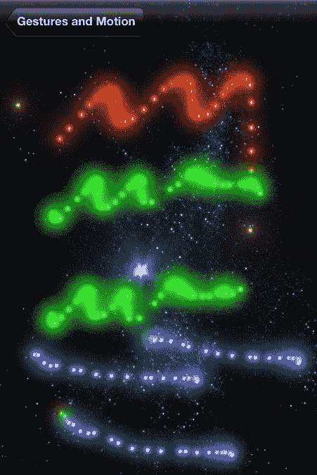

图 8-1. 触摸事件

在图 8-1 中，我们看到了几条由点组成的线。每条线都是手指在屏幕上拖动的结果。最上面的线是单根手指在屏幕上移动产生的——它由红点绘制。第二条线是由两根手指拖过屏幕产生的，下面的一条也是，两者都由绿点绘制。

最下面的三条线是由三根手指绘制的，由蓝点组成。如果你能看到彩色版的图 8-1（如果你有`ebook`），看看最下面一行最左边的点。注意一个是红色的，另一个是绿色的。这是因为我没有让三根手指同时落在屏幕上。

在第一个示例中，除了用手指绘制点之外，你还可以通过分别单击一根或两根手指来放大或缩小点。缩放功能演示了触摸事件和手势如何协同工作。一旦我们理解了触摸事件的基础知识，我们将更详细地探讨这一点。

## 查看事件代码

这个简单演示的实现展示了我们如何接收触摸事件并为屏幕上的每次触摸创建演员。涉及两个类：继承自`GameController`的`TouchEventsController`和继承自`UIView`的`TouchEventsView`。让我们从查看`TouchEventsView`类开始。其头文件如清单 8-2 所示。

**清单 8-2.** `TouchEventsView.h`

```
@interface TouchEventsView : UIView{
    IBOutlet TouchEventsController* controller;
    NSMutableArray* sparks;
}
@end
```

在清单 8-2 中，我们看到一个`IBOutlet`，这样我们就可以将`TouchEventsView`连接到`TouchEventsController`。我们还看到一个名为`sparks`的`NSMutableArray`。这个集合用于跟踪正在添加的 spark；如前所述，触摸事件可能会被取消。通过跟踪我们添加的 spark，我们可以在调用`touchCancelled:withEvent:`之前清理任何已添加的 spark。让我们看一下`TouchEventsView`类的实现，如清单 8-3 所示。

**清单 8-3.** `TouchEventsView.m`

```
@implementation TouchEventsView
- (void)touchesBegan:(NSSet *)touches withEvent:(UIEvent *)event{
    NSLog(@"Begin: %i", [touches count]);
    sparks = [NSMutableArray new];
}
- (void)touchesCancelled:(NSSet *)touches withEvent:(UIEvent *)event{
    NSLog(@"Cancelled: %i", [touches count]);
    for (Spark* spark in sparks){
        [controller removeActor:spark];
    }
    [sparks removeAllObjects];
}
- (void)touchesEnded:(NSSet *)touches withEvent:(UIEvent *)event{
    NSLog(@"Ended: %i", [touches count]);
    int count = [touches count];
    for (UITouch* touch in touches){
        Spark* spark = [Spark spark:count-1 At:[touch locationInView:self]];
        [controller addActor:spark];
        [sparks addObject:spark];
    }
    [sparks removeAllObjects];
}
- (void)touchesMoved:(NSSet *)touches withEvent:(UIEvent *)event{
    NSLog(@"Moved: %i", [touches count]);
    int count = [touches count];
    for (UITouch* touch in touches){
        Spark* spark = [Spark spark:count-1 At:[touch locationInView:self]];
        [controller addActor:spark];
        [sparks addObject:spark];
    }
}
@end
```

在清单 8-3 中，我们看到了之前讨论的四个任务。类`UIResponder`定义了每个任务，它是`UIView`的超类。这些方法在用户与屏幕交互时被调用。通过实现它们，我们可以添加自定义行为。任务`touchesBegan:withEvent:`在手指触摸屏幕时被调用。发生这种情况时，我们会创建一个新的`NSMutableArray`来跟踪所有将要添加的 spark。接下来可能调用其他三个任务中的任何一个。如果用户移动他的手指，或者将另一根新手指放在屏幕上，则会调用任务`touchesMoved:withEvent:`。在这个任务中，我们为每次触摸创建一个新的 spark。我们使用触摸次数减 1 来指定 spark 的变体或颜色，然后将其添加到场景中。


`Spark`只是一个简单的类，类似于粒子，会在五秒后自行移除。触摸事件有两种结束方式。第一种方式是当用户移开所有手指后，调用`touchesEnded:withEvent:`时。在这种情况下，我们执行与`touchesMoved:withEvent:`中相同的操作：为每个触摸创建一个`Spark`。我们还清空`NSMutableArray` `sparks`，以移除对火花对象的引用。

另一种结束触摸事件的方式是事件被取消。当系统中发生其他事件，导致完成当前事件不合适时，事件会被取消。当调用此任务时，我们会移除自上次调用`touchesBegan:withEvent:`以来创建的所有`Spark`对象，从而撤销到目前为止所做的工作。

`touchesCancelled:withEvent:`任务可能在切换应用或弹出对话框时被调用。另一种更常见的触摸事件取消方式是手势识别器被触发。手势识别器，由`UIGestureRecognizer`类定义，是一个检查`UIView`上触摸事件的对象，当触摸可以被视为特定手势（如轻点、捏合或滑动）时做出响应。

为了试验`touchesCancelled:withEvent:`任务，请进行双指双击操作。注意，第一次轻点后，你手指接触的地方会出现两个火花。第二次轻点后，之前添加的`Spark`对象将被移除。这是因为当双指双击手势识别器被触摸事件激活时，`touchesCancelled:withEvent:`被调用了。

手势识别器能够取消触摸事件这一特性，允许开发者在`UIView`上混合搭配任意数量的手势，而无需担心手势冲突。除了取消触摸事件，手势之间也可以相互取消。例如，捏合手势和双指拖拽手势的起始方式相同：两个手指大约同时接触屏幕。如果没有一种机制来相互取消，这两种手势很容易发生冲突。让我们继续看看这些触摸事件如何应用于与游戏相关的类。

## 将触摸事件应用于角色

让我们快速看一下`TouchEventsController`类，以及我们如何设置演示程序来响应轻点手势。`TouchEventsController.m`的重要部分如代码清单 8-4 所示。

**代码清单 8-4.** `TouchEventsController.m (doSetup)`

```
-(BOOL)doSetup{
    if ([super doSetup]){
        [self setGameAreaSize:CGSizeMake(320, 480)];
        [self setSortedActorClasses:[NSMutableArray arrayWithObject:[Spark class]]];
        UITapGestureRecognizer* doubleTapTwoTouch = [[UITapGestureRecognizer alloc] initWithTarget:self action:@selector(doubleTap:)];
        [doubleTapTwoTouch setNumberOfTapsRequired:2];
        [doubleTapTwoTouch setNumberOfTouchesRequired:2];
        UITapGestureRecognizer* doubleTapOneTouch = [[UITapGestureRecognizer alloc] initWithTarget:self action:@selector(doubleTap:)];
        [doubleTapOneTouch setNumberOfTapsRequired:2];
        [doubleTapOneTouch setNumberOfTouchesRequired:1];
        [actorsView addGestureRecognizer:doubleTapOneTouch];
        [actorsView addGestureRecognizer:doubleTapTwoTouch];
        return YES;
    }
    return NO;
}
```

在代码清单 8-4 中，我们看到了来自`TouchEventsController`类的任务`doSetup`。当这个`UIViewController`实例的视图被加载时，会调用此任务。在设置游戏区域大小并将`Spark`类标记为已排序的角色类之后，我们创建了两个`UITapGestureRecognizer`实例。第一个`UITapGestureRecognizer`实例名为`doubleTapTwoTouch`，配置为在双指双击时响应。

第二个`UITapGestureRecognizer`实例名为`doubleTapOneTouch`，配置为响应单指双击。这两个`UITapGestureRecognizer`都通过`addGestureRecognizer:`任务添加到`actorsView`中。

查看用于创建这些手势识别器的构造方法，我们看到了一个引用`doubleTap:`任务的选择器。每当这两个任务中的任何一个识别出手势时，就会调用此任务。我们本可以让每个手势识别器调用不同的任务，在更复杂的应用中这可能是可取的。在此示例中，如代码清单 8-5 所示，在`doubleTap:`任务中区分这两个手势识别器已经足够简单。

**代码清单 8-5.** `TouchEventsController.m (doubleTap:)`

```
-(void)doubleTap:(UITapGestureRecognizer*)doubleTap{
    float scale;
    if ([doubleTap numberOfTouches] == 1){
        scale = 2.0;
    } else {
        scale = 0.5;
    }
    NSLog(@"Touches: %i", [doubleTap numberOfTouches]);
    for (Spark* spark in [self actorsOfType:[Spark class]]){
        float radius = [spark radius]*scale;
        if (radius < 2){
            radius = 2;
        } else if (radius > 128){
            radius = 128;
        }
        [spark setRadius:radius];
    }
}
```

在代码清单 8-5 中，我们检查触发此任务的`UITapGestureRecognizer` `doubleTap`是否配置为单次触摸。根据此检查的结果，我们将`scale`的值设置为 2.0 或 0.5。通过这种方式，单指双击会增加`Spark`对象的缩放比例，而双指双击则会减小`Spark`对象的大小。一旦我们得到`scale`的正确值，我们就简单地遍历场景中所有的`Spark`对象，并根据`scale`调整它们的半径。

我们已经了解了触摸事件，以便理解触摸事件的生命周期。我们还快速了解了`UITapGestureRecognizer`类。下一节将更详细地讨论`UITapGestureRecognizer`。

## 理解手势识别器

`iOS`允许用户通过丰富的手势集与应用程序交互。这些手势包括轻点、滑动、捏合等。每个手势都包含相当复杂的逻辑，用于将触摸事件解释为一个连贯的手势。如果将这项工作交给每个开发者去实现，用户体验将会非常糟糕，因为每个开发者不可避免地会对每个手势做出不同的假设。例如，长按手势有一个默认持续时间。我们希望所有应用程序都保持一致，因为我们不想让用户为每个应用程序重新学习什么是长按。本着这种精神，苹果提供了许多类，用于识别开发者最常用的手势。每个手势识别器都继承自抽象基类`UIGestureRecognizer`，如代码清单 8-6 所示。

**代码清单 8-6.** `UIGestureRecognizer`的具体实现

```
UITapGestureRecognizer
UIPinchGestureRecognizer
UIRotateGestureRecognizer
UISwipeGestureRecognizer
UIPanGestureRecognizer
UILongPressGestureRecognizer
```

在代码清单 8-6 中，我们看到了内置在`iOS` 6 中的每个`UIGestureRecognizer`子类。轻点可能是`iOS`中最常见的手势，无需描述。捏合手势是指两个手指相互靠近或远离。旋转手势是指两个手指在屏幕上移动，就像拧开番茄酱瓶盖一样。滑动手势是指一个或多个手指在屏幕上快速划过，就像翻杂志页。平移手势类似于滑动，但速度更慢，动作更刻意。长按手势很像轻点，但手指在屏幕上停留的时间更长。


每个类都为开发者提供了一种简便方式，当特定`UIView`上发生任何手势时，可以请求调用某个任务。除了调用任务外，每个手势都会随时间推移而发生，并且在回调任务被调用时将处于若干状态之一。这些状态如代码清单 8-7 所示。

**代码清单 8-7.** `UIGestureRecognizerState` 枚举值

```
UIGestureRecognizerStatePossible
UIGestureRecognizerStateBegan
UIGestureRecognizerStateChanged
UIGestureRecognizerStateEnded
UIGestureRecognizerStateCancelled
UIGestureRecognizerStateFailed
UIGestureRecognizerStateRecognized = UIGestureRecognizerStateEnded
```

在代码清单 8-7 中，我们看到手势识别器可能处于的七种状态，这类似于调用触摸事件时的四个任务（见代码清单 8-1）。默认状态是 `UIGestureRecognizerStatePossible`，如果没有触摸事件发生，所有`UIGestureRecignizer`实例都将处于此状态。`UIGestureRecognizerStateBegan` 是手势开始但尚未改变或完成时的状态。对于捏合手势，这表示两根手指都已落在屏幕上。`UIGestureRecognizerStateChanged` 是手势进行中的状态。当出现以下三种状态之一时，手势将结束：`UIGestureRecognizerStateEnded`、`UIGestureRecognizerStateCancelled` 或 `UIGestureRecognizerStateFailed`。状态 `UIGestureRecognizerStateEnded` 对应手势成功完成。`UIGestureRecognizerStateCancelled` 是手势无法完成时的状态。`UIGestureRecognizerStateFailed` 是手势接收到与手势本身矛盾的触摸事件时的状态。最后一个状态 `UIGestureRecognizerStateRecognized` 与 `UIGestureRecognizerStateEnded` 具有相同的值，仅提供语义上的差异，这在代码中可能有用。

虽然代码清单 8-7 中的状态全面描述了手势识别器可能经历的状态，但并非所有手势识别器都会使用所有这些状态。例如，`UITapGestureRecognizer` 被称为“离散”手势识别器，它不会报告变化。此外，离散手势无法失败或被取消。它们只调用选择器任务一次，状态为 `UIGestureRecognizerStateRecognized`（例如，`UIGestureRecognizerStateEnded`）。

可以实现一个新的 `UIGestureRecognizer`，但我们不会涉及这部分内容。不过，我们将逐一介绍每个手势识别器，并通过示例探讨其工作方式。

## 轻点手势

轻点手势在 `iOS` 中广泛使用。从启动应用到在“地图”应用中放置大头针，轻点手势是 `iOS` 界面的核心。这很合理，因为它们与桌面操作系统中的鼠标点击非常相似。轻点手势和鼠标点击之间存在相似之处；例如，在 OS X 中从系统 Dock 启动应用程序需要单击一次，而在 `iOS` 中启动应用程序则需要轻点一次。如果我们考虑 OS X 中的“辅助点击”（也称为 Control 点击或右键点击），这种类比仍然成立；这类似于 `iOS` 中的双指轻点。事实上，如果你使用的是 Mac 笔记本电脑，触控板可以配置为将双指轻点视为“辅助点击”。

在这个示例中，我们将配置一组 `UITapGestureRecognizer`，以响应轻点次数和涉及的手指数量（触摸点）的不同组合。图 8-2 展示了这个示例的运行效果。

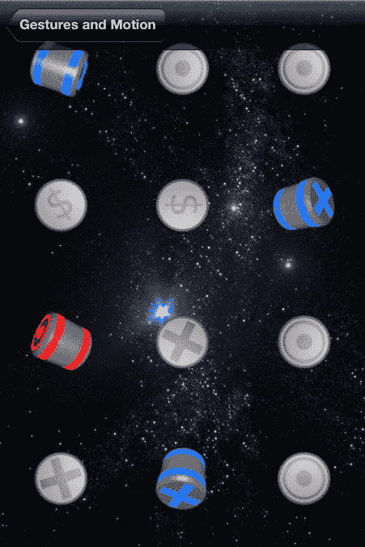

**图 8-2.** 由轻点手势激活的技能增强

在图 8-2 中，我们看到 12 个技能增强，排列成三列四行。这些技能增强最初是禁用的，就像右下角那个一样。当用户轻点屏幕时，一个技能增强会启用，变得更亮并开始旋转。启用的技能增强取决于手势中使用的手指数量以及使用了一根、两根还是三根手指。例如，双指三次轻点启用了第二行最右边的技能增强。同样，三指单次轻点启用了第三行最左边的技能增强。简而言之，列表示轻点次数，行表示涉及的手指数量。如果你想浪费一个小时的时间，可以尝试让所有技能增强都旋转起来。我想我成功做到了，但没能及时截屏来证明。

这个演示是在 `TapGestureController` 类中实现的。代码清单 8-8 展示了 `TapGestureController.h` 文件。

**代码清单 8-8.** `TapGestureController.h`

```
@interface TapGesutureController : GameController < TemporaryBehaviorDelegate > {
    NSMutableArray* powerups;
}

- (void)tapGesture:(UITapGestureRecognizer *)sender;

@end
```

在代码清单 8-8 中，我们看到了`TapGestureController`类的头文件，它继承自 `GameController` 并遵循 `TemporaryBehaviorDelegate` 协议。我们还看到有一个名为 `powerups` 的 `NSMutableArray`，用于存储本例中的 12 个技能增强。在其他示例中，我们通过指定应排序的类，依赖 `GameController` 来跟踪不同类型的角色。在这个示例中，我们使用单独的 `NSMutableArray`，因为我们想利用 `powerups` 中 `Powerup` 对象的顺序来跟踪行和列。最后，我们看到了任务 `tapGesture` 的声明：当 `UITapGestureRecognizer` 识别到一个手势时，会调用该任务。代码清单 8-9 展示了 `TapGestureController` 设置代码的实现。

**代码清单 8-9.** `TapGestureController.m (doSetup)`

```
-(BOOL)doSetup{
    if ([super doSetup]){
        [self setGameAreaSize:CGSizeMake(320, 480)];
        powerups = [NSMutableArray new];
        for (int tap = 0;tap<=2;tap++){
            for (int touch = 0;touch<=3;touch++){
                float x = 320.0/6.0 + tap*320.0/3;
                float y = 480.0/8.0 + touch*480/4;
                CGPoint center = CGPointMake(x, y);
                Powerup* powerup = [Powerup powerup:self At:center];
                [self addActor: powerup];
                [powerups addObject:powerup];
            }
        }
        for (int touch = 1;touch<=4;touch++){
            UITapGestureRecognizer* tripleTap = [[UITapGestureRecognizer alloc] initWithTarget:self action:@selector(tapGesture:)];
            [tripleTap setNumberOfTapsRequired:3];
            [tripleTap setNumberOfTouchesRequired:touch];
            UITapGestureRecognizer* doubleTap = [[UITapGestureRecognizer alloc] initWithTarget:self action:@selector(tapGesture:)];
            [doubleTap setNumberOfTapsRequired:2];
            [doubleTap setNumberOfTouchesRequired:touch];
            [doubleTap requireGestureRecognizerToFail:tripleTap];
            UITapGestureRecognizer* singleTap = [[UITapGestureRecognizer alloc] initWithTarget:self action:@selector(tapGesture:)];
            [singleTap setNumberOfTapsRequired:1];
            [singleTap setNumberOfTouchesRequired:touch];
            [singleTap requireGestureRecognizerToFail:doubleTap];
            [actorsView addGestureRecognizer:tripleTap];
            [actorsView addGestureRecognizer:doubleTap];
            [actorsView addGestureRecognizer:singleTap];
        }
        return YES;
    }
    return NO;
}
```

在代码清单 8-9 中，我们看到了 `TapGestureController` 类的 `doSetup` 任务。


# 在此任务中，我们生成了 12 个`Powerup`对象并将其添加为角色。我们还通过`NSMutableArray powerups`来跟踪每个`Powerup`。创建完`Powerup`对象后，我们为每个`Powerup`创建了 12 个`UITapGestureRecognizers`，并将每个`UITapGestureRecognizer`通过`addGestureRecognizer:`方法添加到`actorsView`中。请注意，我们是为每次点击和触摸的每种可能组合分别创建`UITapGestureRecognizer`，而不是试图用一个`UITapGestureRecognizer`来识别各种组合。尽管在某些情况下可以这样做，但当你尽可能精确地使用`UIGestureRecognizers`时，一切都会顺畅得多，因为手势识别器之间存在一些微妙的交互。例如，负责检测三次点击的识别器必须取消负责检测双击和单击的识别器。

每个`UITapGestureRecognizer`都被配置为在识别到手势时调用`tapGesture:`，如代码清单 8-10 所示。

**代码清单 8-10.** `TapGestureController.m (tapGesture:)`

```
- (void)tapGesture:(UITapGestureRecognizer *)sender{
    int taps = [sender numberOfTapsRequired];
    int touches = [sender numberOfTouches];

    int index = (taps-1)*4 + (touches-1);
    Powerup* powerup = [powerups objectAtIndex:index];

    TemporaryBehavior* tempBehav = [TemporaryBehavior temporaryBehavior:nil for:60*5];
    [tempBehav setDelegate:self];

    NSMutableArray* behaviors = [powerup behaviors];

    [behaviors removeAllObjects];
    [behaviors addObject:tempBehav];

    [powerup setState:STATE_GLOW];
}
```

在代码清单 8-10 中，我们看到任务`tapGesture:`会在 12 个`UITapGestureRecognizers`中的任意一个识别到点击手势时被调用。请注意，我们并没有检查`UITapGestureRecognizer`的状态；这是因为点击手势被视为离散手势，不会使用状态信息。我们使用任务`numberOfTapsRequired`和`numberOfTouches`来确定是哪个`UITapGestureRecognizer`响应了，并将这些值分别存储在 taps 和 touches 中。这些值告诉我们应启用的`Powerup`在`NSMutableArray powerups`中的索引。一旦找到正确的`Powerup`，我们就创建一个`TemporaryBehavior`并将`self`设置为委托。然后，该增强道具的 behavior 会被设置为新创建的`TemporaryBehavior`，同时其状态被设置为`STATE_GLOW`。这会触发增强道具开始旋转。接下来，让我们更详细地了解`TemporaryBehavior`类。

## `TemporaryBehavior`类

`TemporaryBehavior`类会在固定的步数内为角色应用一个行为。在本例中，我们实际上并不想应用任何行为；我们只是想知道何时过去了五秒钟。让我们快速查看一下`TemporaryBehavior`类，看看它是如何工作的。`TemporaryBehavior`的声明如代码清单 8-11 所示。

**代码清单 8-11.** `TemporaryBehavior.h`

```
@class TemporaryBehavior;
@protocol TemporaryBehaviorDelegate
-(void)stepsUpdatedOn:(Actor*)anActor By:(TemporaryBehavior*)tempBehavior In:(GameController*)controller;
@end

@interface TemporaryBehavior : NSObject <Behavior> {

}
@property (nonatomic) long stepsRemaining;
@property (nonatomic, strong) NSObject <Behavior> * behavior;
@property (nonatomic, strong) NSObject <TemporaryBehaviorDelegate> * delegate;

+(id)temporaryBehavior:(NSObject <Behavior> *)aBehavior for:(long)aNumberOfSteps;

@end
```

在代码清单 8-11 中，我们看到了`TemporaryBehavior`类的定义。我们看到它定义了一个名为`TemporaryBehaviorDelegate`的协议，而`TapGestureController`遵循了该协议（参见代码清单 8-8）。

`TemporaryBehavior`的构造函数接受一个行为和一个步数作为参数。代码清单 8-12 展示了`TemporaryBehavior`的实现。

**代码清单 8-12.** `TemporaryBehavior.m`

```
+(id)temporaryBehavior:(NSObject < Behavior > *)aBehavior for:(long)aNumberOfSteps{
    TemporaryBehavior* temp = [TemporaryBehavior new];
    [temp setBehavior:aBehavior];
    [temp setStepsRemaining:aNumberOfSteps];
    return temp;
}
-(void)applyToActor:(Actor*)anActor In:(GameController*)gameController{
    stepsRemaining--;
    [behavior applyToActor:anActor In:gameController];
    [delegate stepsUpdatedOn:anActor By:self In:gameController];
    if (stepsRemaining <= 0){
        [[anActor behaviors] removeObject:self];
    }
}
@end
```

在代码清单 8-12 中，我们看到了`TemporaryBehavior`类的实现。构造函数只是创建一个`TemporaryBehavior`对象并用提供的参数填充它。任务`applyToActor:In:`来自协议`Behavior`（`TemporaryBehavior`遵循该协议），并在游戏的每一步被调用。在此任务中，我们只是将提供的行为应用于角色，并告知委托此工作已完成。继续点击手势的例子，让我们看看`TapGestureController`如何响应任务`stepsUpdatedOn:By:In:`，如代码清单 8-13 所示。

**代码清单 8-13.** `TapGestureController.m (stepsUpdatedOn:By:In:)`

```
-(void)stepsUpdatedOn:(Actor*)anActor By:(TemporaryBehavior*)tempBehavior In:(GameController*)controller{
    if ([tempBehavior stepsRemaining]==0){
        [anActor setState:STATE_NO_GLOW];
    }
}
```

在代码清单 8-13 中，我们看到了`TapGestureController`类定义的任务`stepsUpdatedOn:By:In:`。在此任务中，我们只是检查`TemporaryBehavior`（即`tempBehavior`）是否已到生命周期终点。如果是，我们便将角色的状态设置为`STATE_NO_GLOW`，从而停止增强道具的旋转。

我们已经详细研究了`UITapGestureRecognizer`可用的不同配置。下一节将探讨一种新的手势：捏合。

## 捏合手势

捏合手势在`iOS`中通常用于放大、缩小或缩放屏幕上的内容。这种手势通过放置两根手指，然后让它们相互靠近或远离来触发。图 8-3 展示了这种手势的实际效果。

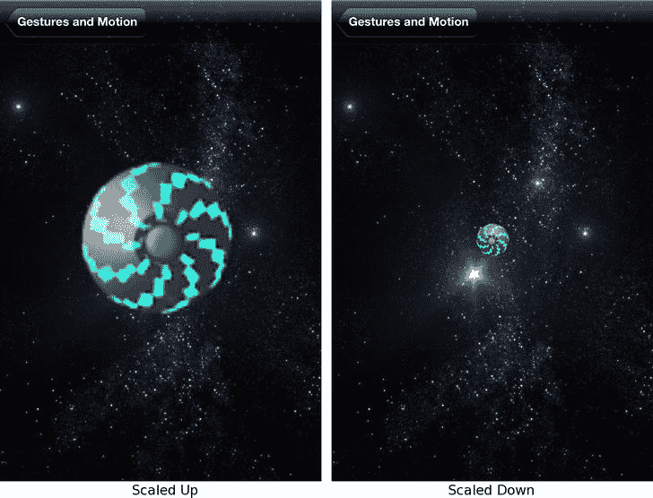

图 8-3. 捏合手势改变飞碟的大小

在图 8-3 中，我们看到了使用捏合手势的示例。左侧，飞碟因向外捏合手势而被放大。右侧，同一个飞碟因向内捏合手势而被缩小。在飞碟被缩放时，它会停止旋转。我们利用捏合手势的不同状态来暂停和恢复旋转。

通过将`UIPinchGestureRecognizer`实例添加到`UIView`可以检测捏合手势。`UIPinchGestureRecognizer`不仅会在捏合手势发生时通知你，还会报告与手势相关的缩放比例和速度值。由`UIPinchGestureRecognizer`报告缩放比例非常方便，因为这是捏合手势最常见的用途。

此示例在`PinchGestureController`类中实现。让我们快速查看一下头文件，如代码清单 8-14 所示。

**代码清单 8-14.** `PinchGestureController.h`


```objectivec
@interface PinchGestureController : GameController{
    Saucer* saucer;
    float startRadius;
}
-(void)pinchGesture:(UIPinchGestureRecognizer*)sender;
@end
```

在列表 8-14 中，我们看到了`PinchGestureController`类的头文件。与之前的示例类似，它继承自`GameController`。它还维护了对`Saucer`对象的引用，以及手势开始时`Saucer`对象的半径。任务`pinchGesture:`由手势识别器调用。该类的实现将进一步揭示此示例的工作原理，首先从`doSetup`任务开始，如列表 8-15 所示。

**列表 8-15.** `PinchGestureController (doSetup)`

```objectivec
-(BOOL)doSetup{
    if ([super doSetup]){
        [self setGameAreaSize:CGSizeMake(320, 480)];

        saucer = [Saucer saucer:self];
        [self addActor:saucer];
        UIPinchGestureRecognizer* pinchRecognizer = [[UIPinchGestureRecognizer alloc] initWithTarget:self action:@selector(pinchGesture:)];
        [actorsView addGestureRecognizer:pinchRecognizer];
        return YES;
    }
    return NO;
}
```

在列表 8-15 中，我们为`PinchGestureController`类实现了一个非常简单的`doSetup`任务。我们只是简单添加了一个新的飞碟，并设置了一个`UIPinchGestureRecognizer`，以便在识别到捏合手势时调用`pinchGesture:`。接下来，让我们看看如何响应这个手势。

## 响应捏合手势

我们已经了解了如何注册捏合手势识别器。`pinchGesture:`的实现如列表 8-16 所示。

**列表 8-16.** `PinchGestureController (pinchGesture:)`

```objectivec
-(void)pinchGesture:(UIPinchGestureRecognizer*)pinchRecognizer{
    if (pinchRecognizer.state == UIGestureRecognizerStateBegan){
        startRadius = [saucer radius];
        [saucer setAnimationPaused:YES];
    } else if (pinchRecognizer.state == UIGestureRecognizerStateChanged){
        float scale = [pinchRecognizer scale];
        float velocity =  [pinchRecognizer velocity];
        NSLog(@"Scale: %f Velocty: %f",scale, velocity);
        float radius = startRadius*scale;
        if (radius < 8){
            radius =  8;
        } else if (radius > 128.0){
            radius = 128;
        }
        [saucer setRadius:radius];
    } else if (pinchRecognizer.state == UIGestureRecognizerStateEnded){
        [saucer setAnimationPaused:NO];
    } else if (pinchRecognizer.state == UIGestureRecognizerStateCancelled){
        [saucer setRadius:startRadius];
        [saucer setAnimationPaused:NO];
    }
}
```

在列表 8-16 中，我们看到了当在`UIView actorsView`上检测到捏合手势时调用的任务`pinchGesture:`。在这个示例中，我们检查手势识别器的状态。状态信息指示手势是刚刚开始（`UIGestureRecognizerStateBegan`）、正在进行（`UIGestureRecognizerStateChanged`），还是已经终止（`UIGestureRecognizerStateEnded`或`UIGestureRecognizerStateCancelled`）。

手势开始时，我们记录飞碟的半径并存储在变量`startRadius`中。我们还在飞碟上调用`setAnimationPaused:`，以在缩放时停止其动画。这不是必须的，我们这样做只是为了在手机上运行示例时，能够观察手势识别器状态的变化。

手势进行时，我们获取手势的缩放比例和速度。缩放值是从手势开始到当前时刻的变化量。换句话说，缩放是累积的，这就是为什么我们将缩放应用于`startRadius`，而不是飞碟的当前半径。计算出新的半径后，我们将其应用于飞碟。

速度是每秒的缩放因子。这个值可用于计算手势结束后动画的惯性量。我们在这里除了记录日志外并未使用该值。

手势正常结束时，我们简单地将飞碟的`animationPaused`属性设为`NO`，这将重新启动飞碟的动画。如果手势被取消，我们将飞碟重置回原始半径并取消暂停动画。要测试取消状态，可以先将飞碟缩到最小，然后用一只手开始放大，同时另一只手按下`iPhone`顶部的电源键。这将使您退出应用程序。然后重新启动示例应用程序，注意飞碟已恢复到原始的小尺寸。

捏合手势是我们在本章中介绍的第一个多状态手势。接下来我们将介绍平移或拖动手势，这是另一个多状态手势。我们会看到它的行为与捏合手势非常相似。

## 平移（或拖动）手势

平移手势是您在地图应用中用来查看地图不同部分的那种手势。拖动手势也用于解锁手机或下拉通知中心。如果您仔细想想，这些手势本质上是一样的：用户将手指放下，沿近似直线移动，然后抬起。区别在于应用程序的响应方式。当视图平移过某些内容（例如地图或图像）时，我们称之为平移手势。当您在屏幕上移动一个 UI 组件（例如滑块旋钮）时，我们称之为拖动。无论我们在描述中如何称呼它，这个手势都是通过`UIPanGestureRecognizer`类实现的（抱歉，还是拖动）。图 8-4 展示了一个使用`UIPanGestureRecognizer`的示例。

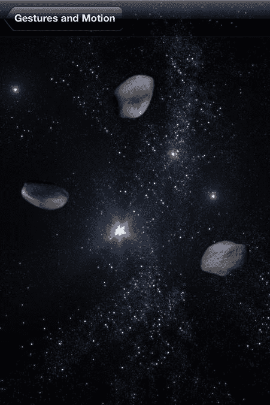

图 8-4. 平移或拖动示例

在图 8-4 中，我们看到三个小行星。每个小行星都可以沿着一条不可见的路径上下拖动。拖动小行星时，您可以将手指一直向右或向左移动。这使得操作起来容易得多，因为用户一旦让选中的小行星开始移动，就不必太在意手指的移动位置。这个简单的示例从`PanGestureController`类的头文件开始，如列表 8-17 所示。

**列表 8-17.** `PanGestureController.h`

```objectivec
@interface PanGestureController : GameController{
    NSMutableArray* asteroids;
    int asteroidIndex;
    CGPoint startCenter;
}
@property (nonatomic) float minYValue;
@property (nonatomic) float maxYValue;
-(void)panGesture:(UIPanGestureRecognizer*)panRecognizer;
@end
```

在列表 8-17 中，我们看到了`PanGestureController`类的头文件，它再次继承自`GameController`。我们在`NSMutableArray asteroids`中维护了一个有序的小行星列表。我们还有两个变量用来跟踪手势持续期间的状态：`int asteroidIndex`和`CGPoint startCenter`。属性`minYValue`和`maxYValue`指定了每个小行星可以上下移动的范围。当检测到平移手势时，任务`panGesture:`由`UIPanGestureRecognizer`调用。这个示例的核心部分在`PanGestureController`类的实现中，所以让我们从`doSetup`任务开始，如列表 8-18 所示。

**列表 8-18.** `PanGestureController.m (doSetup)`

```objectivec
-(BOOL)doSetup{
    if ([super doSetup]){
        [self setGameAreaSize:CGSizeMake(320, 480)];
        [self setMinYValue:72.
```


```objc
0f];  
        [self setMaxYValue:480-[self minYValue]];  
        asteroids = [NSMutableArray new];  
        for (int i = 0;i < 3;i++){  
            Asteroid* asteroid = [Asteroid asteroid:self];  
            [[asteroid behaviors] removeAllObjects];  
            [self addActor:asteroid];  
            [asteroids addObject:asteroid];  
            CGPoint center = CGPointMake(i*320.0/3.0 + 320.0/6.0, [self minYValue]);  
            [asteroid setCenter:center];  
        }  
        UIPanGestureRecognizer* panRecognizer = [[UIPanGestureRecognizer alloc] initWithTarget:self action:@selector(panGesture:)];  
        [panRecognizer setMinimumNumberOfTouches:1];  
        [actorsView addGestureRecognizer:panRecognizer];  
        return YES;  
    }  
    return NO;  
}
```

在代码清单 8-18 中，我们看到了 `PanGestureController` 类的任务 `doSetup`。在指定游戏区域大小后，我们首先为小行星设定了 `minYValue` 和 `maxYValue`，这样它们就不会在距离屏幕顶部或底部 72 点的范围内移动。接下来，我们创建了三个小行星对象，将它们添加到场景中，并放入 `NSMutableArray asteroids` 数组中。每个小行星都从屏幕顶部开始。

在 `doSetup` 中，我们做的最后一件事是创建一个 `UIPanGestureRecognizer`，将其配置为调用 `panGesture:`，然后添加到 `actorsView` 中。下一节将解释我们如何响应这些手势以实现预期的行为。

## 响应平移手势

我们已经了解了如何设置 `UIPanGestureController` 类。现在我们将探索如何在任务 `panGesture:` 中响应这个手势，如代码清单 8-19 所示。

**代码清单 8-19.** `PanGestureController.m (panGesture:)`

```objc
-(void)panGesture:(UIPanGestureRecognizer*)panRecognizer{  
    if ([panRecognizer state] == UIGestureRecognizerStateBegan){  
        CGSize gameAreaSize = [self gameAreaSize];  
        CGPoint locationInView =  [panRecognizer locationInView:actorsView];  
        if (locationInView.x < gameAreaSize.width/3.0){  
            asteroidIndex = 0;  
        } else if (locationInView.x > gameAreaSize.width/3.0*2){  
            asteroidIndex = 2;  
        } else {  
            asteroidIndex = 1;  
        }  
        Asteroid* asteroid = [asteroids objectAtIndex:asteroidIndex];  
        startCenter = [asteroid center];  
        [asteroid setAnimationPaused:YES];  
    } else if ([panRecognizer state] == UIGestureRecognizerStateChanged){  
        Asteroid* asteroid = [asteroids objectAtIndex:asteroidIndex];  
        CGPoint locationInView =  [panRecognizer locationInView:actorsView];  
        CGPoint center = [asteroid center];  
        center.y = locationInView.y;  
        if (center.y < [self minYValue]){  
            center.y = [self minYValue];  
        }  
        if (center.y > [self maxYValue]){  
            center.y = [self maxYValue];  
        }  
        [asteroid setCenter:center];  
    } else if ([panRecognizer state] == UIGestureRecognizerStateEnded){  
        Asteroid* asteroid = [asteroids objectAtIndex:asteroidIndex];  
        [asteroid setAnimationPaused:NO];  
    } else if ([panRecognizer state] == UIGestureRecognizerStateCancelled){  
        Asteroid* asteroid = [asteroids objectAtIndex:asteroidIndex];  
        [asteroid setAnimationPaused:NO];  
        [asteroid setCenter:startCenter];  
    }  
}
```

在代码清单 8-19 中，我们可以看到任务 `panGesture:` 是根据 `panRecognizer` 的状态来划分的，这与捏合示例中的方式相同。如果 `panRecognizer` 的状态等于 `UIGestureRecognizerStateBegan`，我们会计算手势在水平方向上最接近哪颗小行星。在将当前操作的小行星记录到 `asteroidIndex` 后，我们可以从 `NSMutableArray asteroids` 数组中获取当前活动的小行星对象，并将其位置记录在 `startCenter` 中。

最后，我们通过将 `animationPaused` 设置为 No 来停止其旋转。

在后续对 `panGesture:` 的调用中，`panRecognizer` 的状态会变为 `UIGestureRecognizerStateChanged`。当这种情况发生时，我们只需使用 `panRecognizer` 的 `locationInView` 任务，将选中小行星的 Y 值设置为手势的 Y 值。

与之前的示例一样，手势以 `UIGestureRecognizerStateEnded` 或 `UIGestureRecognizerStateCancelled` 状态终止。在这两种情况下，我们都希望重新启动动画；在取消状态下，我们还希望将选中小行星的中心恢复到 `startCenter`。

我希望通过本章节，你已经对这些手势识别器的工作模式有了清晰的认识。基本模式是：设置识别器来检测 `UIView` 上的手势，配置回调任务以记录被操作对象（如飞碟、小行星等）的初始状态，然后对场景应用变化；或者在取消的情况下回滚这些变化。接下来，让我们看看旋转手势。

## 旋转手势

在核心 `iOS` 应用中，旋转手势不如前面介绍的手势常见。事实上，我在 `iPhone` 自带的应用中找不到一个例子，但可能是我忽略了什么。然而，旋转手势确实出现在一些数字益智游戏中，你需要以某种方式旋转对象。旋转手势是通过将两根手指放在屏幕上并旋转手掌来执行的，就像在开瓶子一样。图 8-5 展示了一个旋转示例。

在图 8-5 中，我们看到一艘宇宙飞船正在逆时针旋转。我们知道飞船正在逆时针旋转，因为其右舷机动推进器正在点火。如果飞船是顺时针旋转，我们会看到左舷机动推进器点火。负责这个示例的类是 `RotationGestureController`，其头文件如代码清单 8-20 所示。

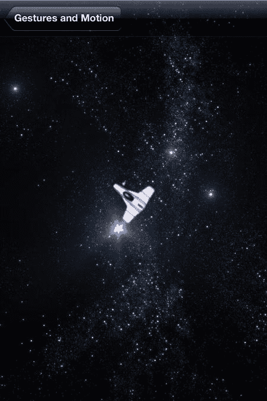

图 8-5.  使用旋转手势旋转宇宙飞船

**代码清单 8-20.** `RotationGestureController.h`

```objc
@interface RotationGestureController : GameController{  
    Viper* viper;  
    float startRotation;  
}  
-(void)rotationGesture:(UIRotationGestureRecognizer*)rotationRecognizer;  
@end
```

在代码清单 8-20 中，我们看到了 `RotationGestureController` 类的头文件。我们看到该类有一个对宇宙飞船的引用，名为 Viper。我们还用变量 `startRotation` 记录宇宙飞船的初始旋转角度。当 `UIRotationGestureRecognizer` 识别到一个手势时，会调用任务 `rotationGesture:`。让我们快速看看 `RotationGestureController` 类的 `doSetup` 任务，以了解 `UIRotationGestureRecognizer` 是如何设置的。见代码清单 8-21。

**代码清单 8-21.** `RotationGestureController.m (doSetup)`

```objc
-(BOOL)doSetup{  
    if ([super doSetup]){  
        [self setGameAreaSize:CGSizeMake(320, 480)];  
        viper = [Viper viper:self];  
        [self addActor:viper];  
        UIRotationGestureRecognizer* rotationRecognizer = [[UIRotationGestureRecognizer alloc] initWithTarget:self action:@selector(rotationGesture:)];  
        [actorsView addGestureRecognizer:rotationRecognizer];  
        return YES;  
    }  
    return NO;  
}
```

在代码清单 8-21 中，我们可以看到 `RotationGestureController` 的 `doSetup` 任务非常简单。我们添加了一个新的 Viper 对象，并注册了一个 `UIRotationGestureRecognizer`。


至此应该不会有任何意外了——我们已知当对象 `rotationRecognizer`` 检测到可被解释为旋转手势的触摸事件时，任务 `rotationGesture`: 就会被调用。现在来看看 `rotationGesture`: 任务，如代码清单 8-22 所示。

**代码清单 8-22.** `RotationGestureController.m (rotationGesture:)`

```
-(void)rotationGesture:(UIRotationGestureRecognizer*)rotationRecognizer{
    if ([rotationRecognizer state] == UIGestureRecognizerStateBegan){
        startRotation = [viper rotation];
    } else if ([rotationRecognizer state] == UIGestureRecognizerStateChanged){
        float rotation = [rotationRecognizer rotation];
        float finalRotation = startRotation + rotation*2.0;
        if (finalRotation > [viper rotation]){
            [viper setState:VPR_STATE_CLOCKWISE];
        } else {
            [viper setState:VPR_STATE_COUNTER_CLOCKWISE];
        }
        [viper setRotation: finalRotation];
    } else if ([rotationRecognizer state] == UIGestureRecognizerStateEnded){
        [viper setState:VPR_STATE_STOPPED];
    } else if ([rotationRecognizer state] == UIGestureRecognizerStateCancelled){
        [viper setState:VPR_STATE_STOPPED];
        [viper setRotation:startRotation];
    }
}
```

代码清单 8-22 展示了类 `RotationGestureController` 的 `rotationGesture`: 任务。在此任务中，我们根据 `rotationRecognizer` 的状态执行了现在熟悉的各项操作。如果状态是 `UIGestureRecognizerStateBegan`，我们只需记录角色 `Viper` 的起始旋转角度。如果状态是 `UIGestureRecognizerStateChanged`，我们从 `rotationRecognizer` 获取旋转值。该旋转值是相对于用户手指最初放置的位置而言的。由于旋转值相对于 `startRotation`，我们必须将旋转值加到 `startRotation` 上，才能使飞船像旋钮一样转动。我们将旋转值乘以 `2.0` 以使旋转更快、更灵敏。这样做只是因为在我们可能将这种技术用于动作游戏时，希望用户能够快速旋转飞船。一旦计算出 `finalRotation` 的值，我们就判断它是否大于或小于当前旋转值。这使我们能够将 `Viper` 的状态设置为 `VPR_STATE_CLOCKWISE` 或 `VPR_STATE_COUNTER_CLOCKWISE`。

手势结束时，我们只需将 `Viper` 的状态设回 `VPR_STATE_STOPPED`。此外，如果手势被取消，我们会将飞船的旋转角度重置回 `startRotation`。

下一个示例与前一个示例相比，更类似于点击示例，因为它处理的是所谓的“长按”。

## 长按手势

长按手势是指用户触摸屏幕上的某一点并按住片刻的手势。顾名思义，这有点像“点击”，但时间更长。用户想要重新排列应用时经常调用长按手势；当你按住一个应用使其所有图标开始抖动时，这就是长按。当你按下键盘上带有子选项的按键时，也会使用长按。例如，打开 Safari，点击地址栏。一旦键盘出现，将手指放在“.com”按钮上。稍等片刻，会显示五个备选顶级域名。在图 8-6 所示的示例中，我们将把点击和长按结合起来，以改变飞船发射子弹的大小，如图 8-6 所示。

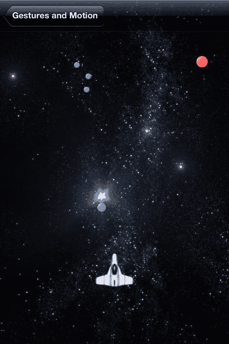

图 8-6. 一艘发射三种不同尺寸子弹的飞船

在图 8-6 中，我们看到屏幕底部有一艘飞船。飞船上方向有许多圆圈；这些是根据用户手势从飞船射出的子弹。左上角三个圆圈组成的一簇是基础子弹，通过简单点击生成。最靠近底部的大圆圈是更大的子弹，在用户长按时生成。如果用户触摸超过两秒，则会发射更大的子弹，如图 8-6 右上角所示。让我们看看代码清单 8-23 中类 `LongPressController` 的头文件。

**代码清单 8-23.** `LongPressController.h`

```
@interface LongPressController : GameController{
    Viper* viper;
    NSDate* longStart;
}
-(void)tapGesture:(UITapGestureRecognizer*)tapRecognizer;
-(void)longPressGesture:(UILongPressGestureRecognizer*)longPressRecognizer;
-(void)fireBulletAt:(CGPoint)point WithDamage:(float)bulletSize;
@end
```

在代码清单 8-23 中，我们看到类 `LongPressController` 的头文件，其中显示了我们持有一个飞船引用，以及一个用于跟踪长按手势开始时间的 `NSDate`。任务 `tapGesture`: 在用户点击屏幕发射小型子弹时调用。任务 `longPressGesture`: 在用户执行长按手势发射更大子弹时调用。最后一个任务用于创建 `Bullet` 角色并将其添加到场景中。我们先看看 `LongPressController` 的 `doSetup` 任务。见代码清单 8-24。

**代码清单 8-24.** `LongPressController.m (doSetup)`

```
-(BOOL)doSetup{
    if ([super doSetup]){
        [self setGameAreaSize:CGSizeMake(320, 480)];
        viper = [Viper viper:self];
        [self addActor:viper];
        CGPoint center = [viper center];
        center.y = [self gameAreaSize].height/5.0*4.0;
        [viper setCenter:center];
        UITapGestureRecognizer* tapRecognizer = [[UITapGestureRecognizer alloc] initWithTarget:self action:@selector(tapGesture:)];
        [actorsView addGestureRecognizer:tapRecognizer];
        UILongPressGestureRecognizer* longPressRecognizer = [[UILongPressGestureRecognizer alloc] initWithTarget:self action:@selector(longPressGesture:)];
        [longPressRecognizer setMinimumPressDuration:1.0f];
        [actorsView addGestureRecognizer: longPressRecognizer];
        return YES;
    }
    return NO;
}
```

在代码清单 8-24 中，我们看到任务 `doSetup`。在执行设置游戏区域大小和添加角色 `Viper` 等常规步骤后，我们注册了两个手势响应器。第一个手势识别器是 `UITapGestureRecognizer`，它将调用 `tapGesture`:。第二个手势识别器是 `UILongPressGestureRecognizer`，被配置为调用 `longPressGesture`:。`UILongPressGestureRecognizer` 的属性 `minimumPressDuration` 被设置为 `1.0f`。这意味着用户必须按住一秒钟，这个 `UILongPressGestureRecognizer` 才会将触摸视为长按。两个手势识别器都被添加到了 `actorsView`。

## 响应用户操作

在下一节中，我们将根据触发的手势来查看如何添加子弹。我们先来处理点击手势。`tapGesture`: 的实现如代码清单 8-25 所示。

**代码清单 8-25.** `LongPressController.m (tapGesture:)`

```
-(void)tapGesture:(UITapGestureRecognizer*)tapRecognizer{
    [self fireBulletAt:[tapRecognizer locationInView:actorsView] WithDamage:10];
}
```

在代码清单 8-25 中，我们看到每次识别到点击手势时，我们只需调用 `fireBulletAt:WithDamage`:，并指定点击位置和伤害值 `10`。


更有趣的交互体现在`longPressGesture:`的实现中，如代码清单 8-26 所示。

**代码清单 8-26.** `LongPressController.m (longPressGesture:)`

``` 
-(void)longPressGesture:(UILongPressGestureRecognizer*)longPressRecognizer{     
    if ([longPressRecognizer state] == UIGestureRecognizerStateBegan){         
        [viper setState:VPR_STATE_TRAVELING];         
        longStart = [NSDate date];     
    } else if ([longPressRecognizer state] == UIGestureRecognizerStateEnded){         
        NSDate* now = [NSDate date];         
        float damage = 20;         
        if ([now timeIntervalSinceDate:longStart] > 1.0f){             
            damage = 30;         
        }         
        [self fireBulletAt:[longPressRecognizer locationInView:actorsView] WithDamage:damage];         
        [viper setState:VPR_STATE_STOPPED];     
    } 
} 
```

在代码清单 8-26 中，我们根据`longPressRecognizer`的状态决定执行什么操作。如果手势已经开始，我们将时间记录在变量`longStart`中，同时将 Viper 对象的状态设置为`VPR_STATE_TRAVELING`，这会显示飞船的推进效果。如果你体验过演示应用，就会注意到推进效果是在手势触发的一秒延迟后才出现的。这意味着`longPressGesture:`方法要等到这段最短时间过后才会被调用。

如果`longPressRecognizer`的状态是`UIGestureRecognizerStateEnded`，我们就知道用户已经抬起了手指。此时，我们会检查自手势开始是否已经超过一秒。如果是，则将伤害值从 20 提升到 30。这意味着如果用户按住手指一秒钟，下一颗子弹造成 20 点伤害；如果按住两秒钟，伤害则为 30。当长按手势结束时，我们将 Viper 的状态重置为`VPR_STATE_STOPPED`，并以相应的伤害值发射子弹。

## 添加子弹

让我们来看一下`fireBulletAt:WithDamage:`的实现，以完成这个示例。参见代码清单 8-27。

**代码清单 8-27.** `LongPressController.m (fireBulletAt:WithDamage:)`

``` 
-(void)fireBulletAt:(CGPoint)point WithDamage:(float)damage{     
    Bullet* bullet = [Bullet bulletAt:[viper center] TowardPoint:point];     
    [bullet setDamage:damage];     
    [self addActor:bullet]; 
} 
```

在代码清单 8-27 中，我们看到只是简单地创建了一个新的`Bullet` actor，它被配置为向指定点移动，并将其添加到场景中。

## 轻扫手势

轻扫手势最广为人知的用途大概是在主屏幕上切换应用显示集。这种手势常用于切换上下文，就像在主屏幕上那样。其他例子包括在`iPad` 2 和 3 上用于切换前台应用的四指轻扫。这有点像在你的运行应用中翻阅。在我们的示例中，将使用轻扫手势向场景中添加彗星，如图 8-7 所示。

在图 8-7 中，我们看到屏幕上有几颗彗星。每颗彗星都是由一个轻扫手势创建的，该手势决定了彗星从何处开始以及向哪个方向移动。例如，向右轻扫会使彗星从左侧创建并向右移动。让我们看一下代码清单 8-28 中`SwipeGestureController`类的`doSetup`任务。

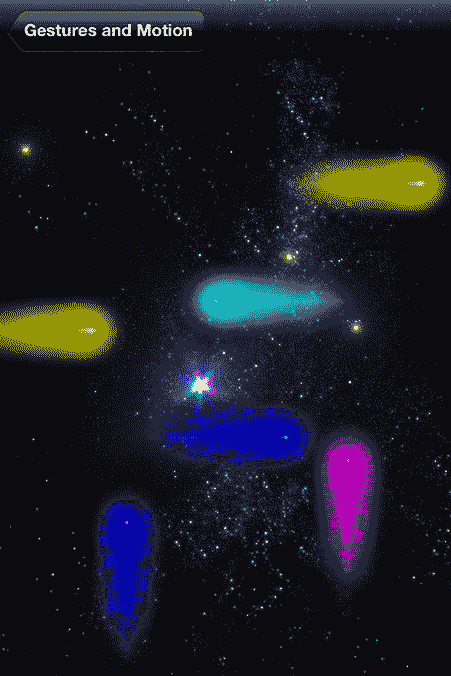

图 8-7. 轻扫手势创建彗星

**代码清单 8-28.** `SwipeGestureController.m (doSetup)`

``` 
-(BOOL)doSetup{     
    if ([super doSetup]){         
        [self setGameAreaSize:CGSizeMake(320, 480)];  
  
        UISwipeGestureRecognizer* down = [[UISwipeGestureRecognizer alloc] initWithTarget:self action:@selector(swipeGesture:)];         
        [down setDirection:UISwipeGestureRecognizerDirectionDown];         
        [actorsView addGestureRecognizer:down];  
  
        UISwipeGestureRecognizer* up = [[UISwipeGestureRecognizer alloc] initWithTarget:self action:@selector(swipeGesture:)];         
        [up setDirection:UISwipeGestureRecognizerDirectionUp];         
        [actorsView addGestureRecognizer:up];  
  
        UISwipeGestureRecognizer* left = [[UISwipeGestureRecognizer alloc] initWithTarget:self action:@selector(swipeGesture:)];         
        [left setDirection:UISwipeGestureRecognizerDirectionLeft];         
        [actorsView addGestureRecognizer:left];  
  
        UISwipeGestureRecognizer* right = [[UISwipeGestureRecognizer alloc] initWithTarget:self action:@selector(swipeGesture:)];         
        [right setDirection:UISwipeGestureRecognizerDirectionRight];         
        [actorsView addGestureRecognizer:right];  
  
        return YES;     
    }     
    return NO; 
} 
```

在代码清单 8-28 中，我们看到了注册此示例手势识别器的代码。我们看到为每个想要监听的方向创建了一个`UISwipeGestureRecognizer`。此示例中唯一的意外之处是，需要四个不同的手势识别器才能实现我们的目的。`UISwipeGestureRecognizer`确实允许你为多个方向指定一个识别器。然而，在响应轻扫手势时，设备无法判断手势的方向。只有为每个方向创建一个识别器，我们才能判断用户手势的方向。

让我们来看一下任务`swipeGesture:`。参见代码清单 8-29。

**代码清单 8-29.** `SwipeGestureController.m (swipeGesture:)`

``` 
-(void)swipeGesture:(UISwipeGestureRecognizer*)swipeRecognizer{     
    CGSize gameSize = [self gameAreaSize];  
  
    UISwipeGestureRecognizerDirection direction = [swipeRecognizer direction];     
    CGPoint locationInView = [swipeRecognizer locationInView:actorsView];  
  
    CGPoint center = CGPointMake(0, 0);     
    float directionInRadians = DIRECTION_DOWN;  
  
    if (direction == UISwipeGestureRecognizerDirectionRight){         
        center.x = −20;         
        center.y = locationInView.y;         
        directionInRadians = DIRECTION_RIGHT;     
    } else if (direction == UISwipeGestureRecognizerDirectionDown){         
        center.x = locationInView.x;         
        center.y = −20;         
        directionInRadians = DIRECTION_DOWN;     
    } else if (direction == UISwipeGestureRecognizerDirectionLeft){         
        center.x = gameSize.width + 20;         
        center.y = locationInView.y;         
        directionInRadians = DIRECTION_LEFT;     
    } else if (direction == UISwipeGestureRecognizerDirectionUp){         
        center.x = locationInView.x;         
        center.y = gameSize.height + 20;         
        directionInRadians = DIRECTION_UP;     
    }     
    Comet* comet = [Comet comet:self withDirection:directionInRadians andCenter:center];     
    [self addActor:comet]; 
} 
```

在代码清单 8-29 中，我们看到了当识别到轻扫手势时调用的代码。为了达到我们想要的效果，我们只需创建一个新的`Comet` actor，并为其设置正确的位置和方向。要确定彗星应该放置在哪里以及向哪个方向移动，我们只需查看`swipeRecognizer`的方向属性即可。

我们不会深入探讨`Comet`类是如何实现的细节；这个话题我们已经详细讨论过了。如果你确实感兴趣，请查阅提供的源代码。

我们已经了解了`iOS`中内置的手势识别器，并探索了它们工作原理的基础知识。在下一节中，我们将探讨如何将设备的运动集成到应用程序中。


## 解读设备运动

从 `iPhone` 4 开始，`iOS` 设备内置了加速度计和陀螺仪传感器。在应用程序中，有几种方法可以使用这些传感器。最常见的两种方法是：简单地响应运动事件（对应摇动设备），以及更精细的方法——通过 `UIAccelerometer` 类直接访问这些传感器的方向数据。我们先来看一下摇动示例。

### 响应运动事件（摇动）

每当 `iOS` 设备被摇动时，就会生成一个运动事件供应用程序消费。就我个人而言，我觉得在应用程序中使用摇动功能非常烦人；不过，有些人认为这是个好主意，所以我们来看看如何利用这一特性。图 8-8 展示了我们的示例。

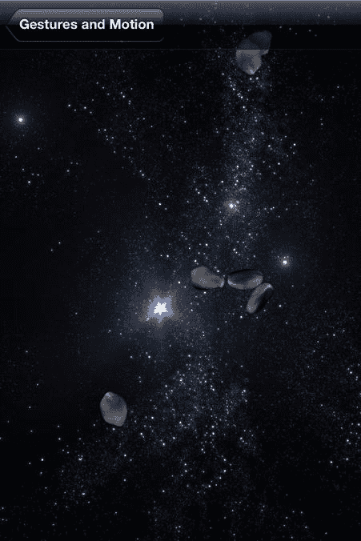

图 8-8.  小行星因设备摇动而碎裂

在图 8-8 中，我们看到许多小行星。这些小行星原本是一颗，但几次摇动事件使其碎裂。该示例的类名为 `ShakeController`，继承自 `GameController`。它的头文件没有什么特别之处，所以我们直接跳到 `doSetup` 任务，如代码清单 8-30 所示。

**代码清单 8-30.** `ShakeController.m (doSetup)`

```
-(BOOL)doSetup{
    if ([super doSetup]){
        [self setGameAreaSize:CGSizeMake(320, 480)];
        NSMutableArray* classes = [NSMutableArray new];
        [classes addObject:[Asteroid class]];
        [self setSortedActorClasses:classes];
        return YES;
    }
    return NO;
}
```

在代码清单 8-30 中，我们看到 `doSetup` 任务配置了 `ShakeController`，将 `Asteroid` 标记为我们稍后要访问的 actor 类。我们在 `updateScene` 任务中添加 `Asteroid`。这样做是因为只有当场景中没有 `Asteroid` 对象时，我们才想添加一个新的 `Asteroid`，如代码清单 8-31 所示。

**代码清单 8-31.** `ShakeController (updateScene)`

```
-(void)updateScene{
    if ([[self actorsOfType:[Asteroid class]] count] ==0 ){
        Asteroid* asteroid = [Asteroid asteroid:self];
        [self addActor:asteroid];
    }
    [super updateScene];
}
```

在代码清单 8-31 中，我们看到 `updateScene` 任务被调用，以便在动画的每一步中推动游戏前进。在此任务中，我们检查场景中是否存在 `Asteroid` 对象；如果没有，就添加一个。最后，我们调用 `updateScene` 的父类实现来推动游戏前进。

现在的问题是，我们如何响应摇动事件来炸毁小行星？通过告知应用程序顶层视图可以成为“第一响应者”，并实现相应的方法来响应运动事件，我们就能实现这一点。作为第一响应者的 `UIView` 拥有优先处理用户输入的权利。让视图成为第一响应者需要两个步骤：首先，你必须告知应用程序 `UIViewController` 的视图属性可以作为第一响应者；然后，你需要发出成为第一响应者的请求。代码清单 8-32 展示了实现这一点的代码。

**代码清单 8-32.** `ShakeController（与第一响应者相关的任务）`

```
-(BOOL)canBecomeFirstResponder {
    return YES;
}
-(void)viewDidAppear:(BOOL)animated {
    [super viewDidAppear:animated];
    [self becomeFirstResponder];
}
- (void)viewWillDisappear:(BOOL)animated {
    [self resignFirstResponder];
    [super viewWillDisappear:animated];
}
```

在代码清单 8-32 中，我们看到三个任务。第一个任务 `canBecomeFirstResponder` 仅仅告知应用程序该 `UIViewController` 的视图属性有资格成为第一响应者，并且该 `UIViewController` 将处理其事件。接下来的两个任务是 `UIViewController` 生命周期的一部分。当调用 `viewDidAppear:` 并且该 `UIViewController` 的视图属性被显示时，我们可以通过调用 `becomeFirstResponder` 成为第一响应者。或者，当该 `UIViewController` 从屏幕中移除时，我们不再希望它是第一响应者，因此调用 `resignFirstResponder`。这三个任务只是使该类能够接收运动事件；这些事件是在 `motionBegan:withEvent:` 和 `motionEnded:withEvent:` 任务的实现中处理的。在我们的示例中，只需要实现其中一个：`motionBegan:withEvent:` 的实现如代码清单 8-33 所示。

**代码清单 8-33.** `ShakeController.m (motionBegan:withEvent:)`

```
- (void)motionBegan:(UIEventSubtype)motion withEvent:(UIEvent *)event {
    if (motion == UIEventSubtypeMotionShake)
    {
        for (Asteroid* asteroid in [self actorsOfType:[Asteroid class]]){
            [asteroid doHit:self];
        }
    }
}
```

在代码清单 8-33 中，我们看到 `motionBegan:withEvent:` 任务，我们首先检查运动子类型是否为 `UIEventSubtypeMotionShake`。如果是，我们只需遍历场景中的所有小行星并对其调用 `doHit:`。`doHit:` 任务会使每颗小行星碎裂成许多更小的小行星。`doHit:` 的细节在第 7 章中讨论。

正如我们所见，响应摇动事件非常简单——非常类似于响应触摸事件。我觉得有点奇怪的是，摇动事件没有作为手势来实现。我怀疑原因是摇动事件在多种手势识别器加入 SDK 之前就已经存在了。

### 响应加速度计数据

作为开发者，能够了解设备的方向对我来说真的很酷。它使增强现实等成为可能，同时也支持许多其他酷炫的功能。本章的最后一个示例将使用加速度计来操控场景中的 actor。我不能保证它会像增强现实游戏一样酷，但它应该能为其他开发者铺平道路。图 8-9 展示了加速度计示例的运行情况。

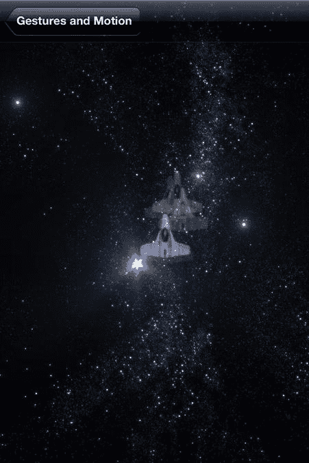

图 8-9.  加速度计演示的多个屏幕

在图 8-9 中，我们看到此示例的几个截图叠加在一起。在此示例中，`Viper` 的位置基于 X 和 Y 轴的加速度计值，因此当 `iPhone` 平放时，飞船应位于游戏区域中央。当设备向左倾斜时，飞船向左移动。当设备向上倾斜时，飞船向上移动，依此类推。图 8-9 突出显示了加速度计数据的不稳定性。这些都是在尝试保持设备平放时（尽管同时还在尝试截取屏幕截图）获取的。对于真正的应用程序，加速度计数据需要经过处理。


本示例中的负责类为 `AccelermoterController`，其头文件如代码清单 8-34 所示。

**代码清单 8-34.** `AccelerometerController.h`

```
@interface AccelerometerController : GameController < UIAccelerometerDelegate > {
    Viper* viper;
}
@end
```

在代码清单 8-34 中，我们看到了 `AccelerometerController` 类的头文件。这里需要注意：`AccelerometerController` 类遵循了 `UIAccelerometerDelegate` 协议，并且持有一个将在屏幕上移动的 Viper 对象的引用。遵循该协议使得 `AccelerometerController` 能够实时接收来自加速计的数据，我们稍后将看到这一点。首先来看看我如何设置 `AccelerometerController` 类以使其能够接收数据，如代码清单 8-35 所示。

**代码清单 8-35.** `AccelerometerController.m (doSetup)`

```
-(BOOL)doSetup{
    if ([super doSetup]){
        [self setGameAreaSize:CGSizeMake(320, 480)];

        viper = [Viper viper:self];
        [self addActor:viper];

        UIAccelerometer*  theAccelerometer = [UIAccelerometer sharedAccelerometer];

        theAccelerometer.updateInterval = 1 / 50.0;
        theAccelerometer.delegate = self;
        return YES;
    }
    return NO;
}
```

在代码清单 8-35 中，我们进行了常规设置，指定了游戏区域大小并添加了将根据加速计数据移动的 Viper。要开始接收加速计数据，我们必须获取与当前运行应用程序关联的单例 `UIAccelerometer`。为此，我们使用 `UIAccelerometer` 类的静态方法 `sharedAccelerometer`，然后将 self 设置为代理。另一件需要注意的事是，我们必须指定接收数据的频率。在这个案例中，我们要求每秒接收 50 次数据，这对于实时输入来说已经足够快了。实际数据是通过调用 `accelerometer:didAccelerate:` 接收的，如代码清单 8-36 所示。

**代码清单 8-36.** `AccelerometerController.m (accelerometer:didAccelerate:)`

```
- (void)accelerometer:(UIAccelerometer *)accelerometer didAccelerate:(UIAcceleration *)acceleration{
    CGSize size = [self gameAreaSize];

    UIAccelerationValue x, y, z;
    x = acceleration.x;
    y = acceleration.y;
    z = acceleration.z;
    NSLog(@"x = %f y = %f z = %f", x, y, z);

    CGPoint center = CGPointMake(size.width/2.0 * x + size.width/2.0, size.height/2.0 * y + size.height/2.0);
    [viper setCenter:center];
}
```

在代码清单 8-36 中，我们简单地从 `UIAcceleration` 加速度对象中获取了 X、Y、Z 值。这些值的范围从 -1.0 到 1.0，具体取决于设备的朝向。由于 X 值对应设备向左或向右倾斜（竖屏模式），我们可以直接使用 X 值来设定新的中心点的 X 坐标。我们对 Y 值也做同样的处理，然后设置 Viper 的中心属性。

这是一个非常简单的示例，但我希望它能引导你走上正确的轨道。在我看来，实现基本功能相当简单，就像这个示例一样，但要让更复杂的用户交互工作完美运行，则需要付出更多努力。我建议阅读标题为“`iOS` 事件处理指南”的文档，该文档可在 `http://developer.apple.com` 获取。

## 总结

在本章中，我们探讨了如何响应基本的触摸事件。我们还研究了如何使用 `UIGestureRecognizer` 的子类将这些触摸事件解释为简洁的手势，例如捏合、长按、旋转等。在最后一节中，我们研究了使用加速计控制游戏角色的两种方法。

第一种方法允许我们简单地对摇动事件做出响应。第二种技术展示了如何直接访问加速计数据来控制我们的应用，为比简单摇动更复杂的基于运动的手势奠定了基础。

# 第 9 章：Game Center 与社交媒体

如今，推广游戏的关键方式之一是将你的应用与一个或多个社交媒体服务集成。其理念是，用户会在游戏过程中推广你的游戏，并与朋友分享体验。为了让用户更频繁地玩你的游戏，通常还需要提供一种机制，让用户能够与其他玩家比较分数。提供一种让用户追踪与他人分数差距并发布进度的方式，在游戏开发中非常普遍，以至于苹果提供了库来支持这些需求。

苹果提供的主要服务叫做 Game Center，它在名为 GameKit 的库中实现。Game Center 是一项允许用户与排行榜上的其他玩家比较分数的服务。Game Center 还允许用户达成所谓的成就。成就是由每个游戏定义的，旨在激励人们持续游玩。例如，如果你有一个很难达成的成就，玩家就会想要获得它，以便将自己与玩同一游戏的朋友区分开来。Game Center 还提供了多人游戏的机制，但我们本章将重点关注其服务中的社交方面。

为了广播玩家在游戏中的进度，通常会使用现有的社交媒体网站（如 Twitter 或 Facebook），以便用户的朋友能收到通知。iOS 5 的一个新功能是内置了 Twitter 账户。在本章中，我们将学习如何使用公开 Twitter 账户的类代表用户发送推文。iOS 6 新增了内置的 Facebook 支持。我们将了解 Twitter 和 Facebook 的支持是如何被封装到名为 Social Framework 的库中的。我们将学习如何使用这个库代表用户在 Facebook 上发布内容。

本章的示例取自 Belt Commander 项目。在接下来的两章中，我们将继续使用你在以下章节中学到的内容作为示例，探讨一个完整的游戏。

## Game Center

从用户的角度看，Game Center 是 iOS 设备上的一个应用程序，汇集了有关用户游戏的信息。这些信息包括一个登录和管理账户的地方、好友列表以及游戏列表。对于列出的每个游戏，都有若干用于显示分数的排行榜，以及游戏中可获得的成就列表。图 9-1 展示了一个典型的 Game Center 屏幕。

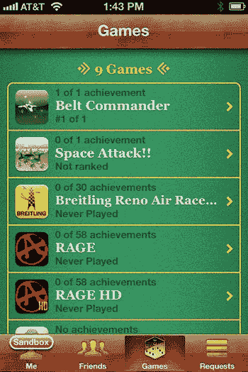

图 9-1. 显示游戏的 Game Center

在图 9-1 中，我们看到九个已安装的、支持 Game Center 的游戏。选择一个游戏即可查看其排行榜以及用户已获得的任何成就。

从开发者的角度来看，Game Center 是一组用于与 Game Center 交互以定义排行榜和成就的类。这些类统称为 GameKit，作为标准 iOS SDK 安装的一部分提供。一旦 GameKit 与你的游戏集成，你就可以让用户登录，并代表他或她执行 GameKit 操作。图 9-2 展示了用户登录 GameKit 的过程。

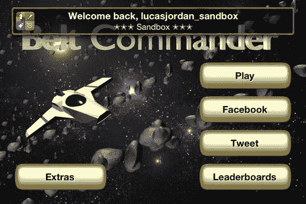

图 9-2. 登录 GameKit

在图 9-2 中，我们看到了游戏 Belt Commander 的欢迎屏幕。


在顶部，我们会看到一个来自 Game Center 的通知，告知用户此游戏正在使用 GameKit，并显示了用户账户。我们还看到了“sandbox”这个词。这表示我们使用的并非 Game Center 的正式版本，而是开发版本。大多数情况下，您无需为此担心；在开发过程中，您将完全使用沙箱环境。

要在您的项目中启用 GameKit，您显然会使用 GameKit 中的类，但您还需要告知 Apple 您希望为某个特定游戏启用 GameKit 支持。以下部分描述了如何在 iTunes Connect 中设置 GameKit。

### 在 iTunes Connect 中启用 Game Center

Game Center 不仅仅是 iOS 设备上的一个应用或一组库。它还是由 Apple 托管的一组 Web 服务，提供了大部分功能。为了让您的游戏使用这些服务，您必须配置您的应用程序。您需要在配置门户中创建一个 `App ID`，配置 Xcode 使用生成的 `Bundle Identifier`，并在 iTunes Connect 中配置您的应用程序以使用 Game Center。假设我们正在制作一个新游戏，并从配置门户开始，如图 Figure 9-3 所示。

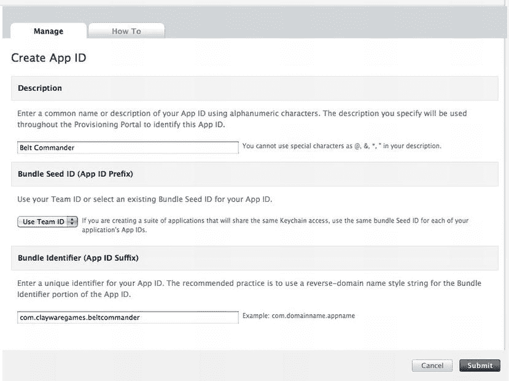

Figure 9-3.  在配置门户中创建 `App ID`

在 Figure 9-3 中，我们看到了用于创建 `App ID` 的表单。顶部的字段（标记为 Description）可以是任何您想要的内容，用于提醒您创建此 `App ID` 的目的。您可以选择任何 `Bundle Seed ID`，但我发现有一个重要的原因不推荐使用默认值：选择默认的 `Bundle Seed ID` 会减少在使用 Xcode 时的一些配置步骤。

最后一项是 `Bundle Identifier`。它用于在运行时标识您的应用程序。对于旨在支持 Game Center 的游戏，您必须指定一个不带通配符的 `Bundle Identifier`。点击“提交”后，您应该在 Xcode 中打开您的游戏项目。

`Bundle Identifier` 必须在 Xcode 中设置，这样 iOS 才能知道如何将设备上运行的二进制文件与 iTunes Connect 定义的应用程序关联起来。Figure 9-4 显示了设置 `Bundle Identifier` 的位置。

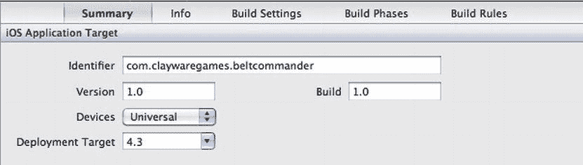

Figure 9-4.  Xcode 中的 `Bundle Identifier`

在 Figure 9-4 中，`Identifier` 字段包含了我们在 Xcode 中的 `Bundle Identifier`。这个值，连同版本号，用于向 iTunes Connect 标识正在运行的是哪个应用程序。一旦设置了 `Bundle Identifier`，您就必须在 iTunes Connect 中创建一个新的应用程序，如图 Figure 9-5 所示。

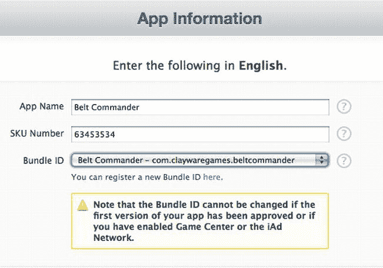

Figure 9-5.  在 iTunes Connect 中创建新应用程序

在 Figure 9-5 中，我们看到了在 iTunes Connect 中创建新应用程序的第一步。我们指定了 App 名称并选择了一个 `SKU` 编号。`SKU` 编号可以是任何您想要的内容；它包含在此处是为了让游戏制作方能够在内部系统中跟踪销售情况。我们还可以看到我们可以从一个下拉菜单中选择 `Bundle ID`；这是我们在创建新 `App ID` 时指定的值。在 iTunes Connect 中创建新应用程序还需要几个步骤，但这些步骤只是填写关于应用程序的信息，并非启用 Game Center 的必要步骤。系统会要求您提供描述、版权信息和其他详细信息。在最后一步中添加的所有信息都可以跳过，稍后再添加。

一旦应用程序创建完成，检查其详细信息并找到“Manage Game Center”按钮，如图 Figure 9-6 所示。

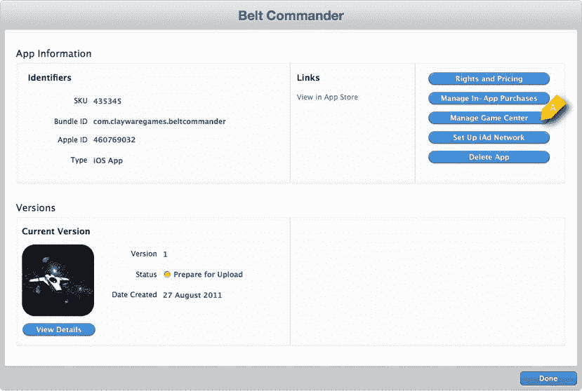

Figure 9-6.  iTunes Connect 中应用程序的配置按钮

在 Figure 9-6 中，我们看到了“Manage Game Center”按钮（标记为 A）。点击此按钮，系统将提示您启用 Game Center 并创建一个排行榜。Figure 9-7 显示了创建或编辑排行榜的页面。

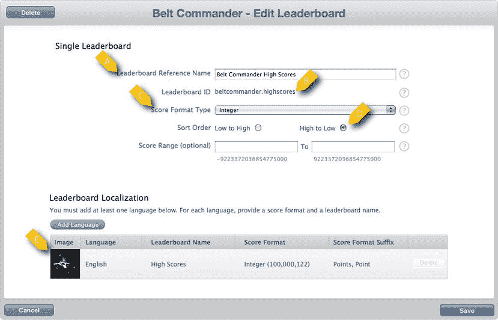

Figure 9-7.  创建或编辑排行榜

在 Figure 9-7 中，我们看到了 iTunes Connect 中用于编辑和创建排行榜的网页。在项目 A 处，我们看到一个排行榜的名称。此名称并非显示名称——它仅供内部使用，可以是任何您想要的内容。项目 B 指示了排行榜的 ID。这是在代码中引用排行榜时使用的值。项目 C 和 D 指示了该排行榜中分数的排序方式。我们选择将分数显示为整数值（无小数位），并认为分数越高越好。项目 E 显示我们已为一种语言添加了显示信息。可以通过点击“Add Language”按钮并指定排行榜的显示名称，以及在本例中说明这些值称为“points”来添加新语言。

创建或编辑成就与处理排行榜非常相似，如图 Figure 9-8 所示。

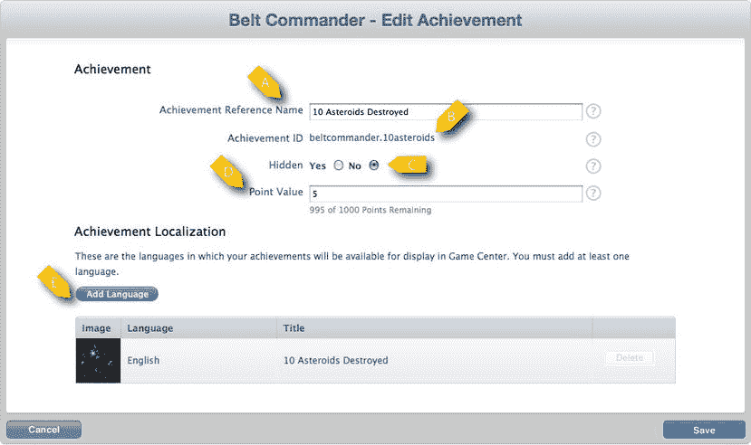

Figure 9-8.  创建或编辑成就

在 Figure 9-8 中，我们看到了在 iTunes Connect 中用于创建和编辑成就的网页。项目 A 显示了用于成就的内部名称。项目 B 显示了成就的 ID。项目 C 指示此成就未被隐藏。默认情况下，即使玩家尚未获得成就，这些成就也是可见的。然而，指定一些隐藏的成就可能很有趣，这样当玩家达成时会感到惊喜。项目 E 显示我们为英语指定了显示文本。当然，可以通过点击“Add Language”按钮来添加其他语言的文本。

我们已经了解了如何创建新的 `App ID` 和在 iTunes Connect 中创建新的应用程序。我们还简要了解了创建排行榜和成就所需的界面。现在，让我们来看看利用这些新资源的代码。

### 在游戏中使用 Game Center

一旦 Game Center 设置完成并包含了排行榜和成就功能，使用 GameKit 来开始使用这些功能是出奇地容易。以下部分将讨论如何连接到用户的 Game Center 账户、将用户的分数提交到排行榜以及获得成就。

### 为用户启用 Game Center

当游戏启用了 Game Center 时，用户仍然必须选择使用 Game Center 功能。用户需要在 Game Center 中创建一个账户，并在当前的 iOS 设备上使用该账户进行身份验证。幸运的是，Apple 让开始使用 Game Center 变得非常简单。

要开始使用 Game Center，所有应用都必须获取一个代表本地玩家的 `GKLocalPlayer` 实例并对其进行身份验证。Listing 9-1 展示了执行此操作的规范示例。

**Listing 9-1.**  `RootViewController.m`（`initGameCenter`）

```
-(void)initGameCenter{  
    Class gkClass = NSClassFromString(@"GKLocalPlayer");  

    BOOL iosSupported = [[[UIDevice currentDevice] systemVersion] compare:@"4.1" options:NSNumericSearch] != NSOrderedAscending;  
    if (gkClass && iosSupported) {  
        GKLocalPlayer *localPlayer = [GKLocalPlayer localPlayer];  
        [localPlayer authenticateWithCompletionHandler:^(NSError *error) {  
            if (localPlayer.isAuthenticated) {  
                // 执行其他 Game Center 操作  
            } else {  
                // 如果出现错误，则显示错误提示  
            }  
        }];  
    }  
}
```


```objc
if (gkClass && iosSupported){
    localPlayer = [GKLocalPlayer localPlayer];
    [localPlayer authenticateWithCompletionHandler:^(NSError *error) {
        if (localPlayer.authenticated){
            [leaderBoardButton setEnabled:YES];
        } else {
            [leaderBoardButton setEnabled:NO];
        }
    }];
}
```

在代码清单 9-1 中，我们看到 `RootViewController` 类的任务 `initGameCenter`。该任务在应用程序启动时被调用一次。它首先通过查找 `GKLocalPlayer` 类来检查当前 iOS 设备是否支持 GameKit。该任务还会检查 iOS 版本是否足够新以支持 Game Center。如果满足条件，我们通过调用 `GKLocalPlayer` 类的 `localPlayer` 方法获取本地玩家指针。

要验证本地玩家身份，我们只需调用 `authenticateWithCompletionHandler:` 并传入一个块（block），当用户完成验证（或取消）时，该块会异步执行。块本质上是一种将函数声明为可传递值的方式。这里我们使用块的方式类似于在 Java 等语言中使用匿名类。首次运行此代码时，用户会看到类似图 9-9 的界面。

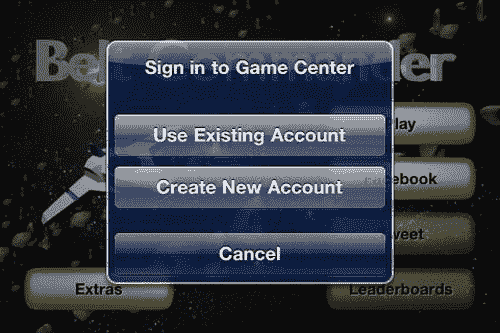

图 9-9. 首次使用 Game Center 进行身份验证

在图 9-9 中，我们看到调用 GameKit 身份验证任务的结果。系统会提示用户使用现有账户登录 Game Center、创建新账户或取消登录。如果用户多次取消，应用程序将不再显示此对话框。用户必须取消多少次才会停止显示，具体次数似乎随不同版本而变化。在 iOS 5 中，大约为三次。一旦用户成功通过验证，应用程序就会为该用户账户连接到 Game Center。当应用程序再次运行时，调用 `authenticateWithCompletionHandler:` 会执行处理代码，而不会再次打扰用户登录。用户会看到类似图 9-2 的界面。

启用 Game Center 后，我们就可以开始利用其功能了。下一节将介绍如何向排行榜报告分数。

## 向排行榜提交分数

Game Center 提供的最佳功能之一是内置的跨设备跟踪用户最高分数的机制。它允许用户将自己的分数与好友分数以及全球其他玩家的分数进行比较。提交分数的代码非常简单，如代码清单 9-2 所示。

**代码清单 9-2.** `RootViewController.m` (`notifyGameCenter`)

```objc
-(void)notifyGameCenter{
    if ([localPlayer isAuthenticated]){
        GKScore* score = [[GKScore alloc] initWithCategory:@"beltcommander.highscores"];
        score.value = ([beltCommanderController score];
        
        [score reportScoreWithCompletionHandler:^(NSError *error){
            if (error){
                //处理错误
            }
        }];
    }
}
```

在代码清单 9-2 中，我们看到任务 `notifyGameCenter`，它在每局游戏结束时被调用。在该任务中，我们检查 `localPlayer` 是否已通过验证。如果是，我们只需创建一个 `GKScore` 对象，指定要提交分数的排行榜 ID——在本例中为 "`beltcommander.highscores`"。获得 `GKScore` 对象的引用后，我们将分数属性设置为上一局游戏的分数。该分数属性可以是任何类型的数字——在本例中是一个 `long` 类型。

最后，我们调用 `reportScoreWithCompletionHandler:` 并传入一个块来处理任何错误。在我们的示例中，我们对错误不做任何处理。

**注意**  如果用户处于离线状态或出现某种网络问题，GameKit 会在未来运行时自动重新提交分数，确保玩家的努力被正确记录。

图 9-10 展示了排行榜上的一个分数。

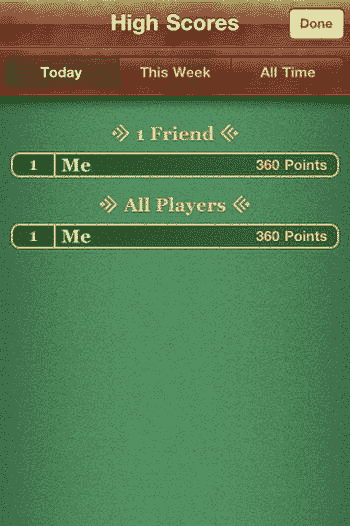

图 9-10. 带有示例分数的排行榜

在图 9-10 中，我们看到排行榜上显示了一个分数。目前只有一个分数，因为截图是在游戏开发期间拍摄的。顶部我们可以看到三个查看最高分的选项：今日、本周和全部时间。显示最高分的组件是 GameKit 自带的预构建组件 `GKLeaderboardViewController`；调出该组件的代码如代码清单 9-3 所示。

**代码清单 9-3.** `RootViewController.m` (`leaderBoardClicked:`)

```objc
- (IBAction)leaderBoardClicked:(id)sender {
        GKLeaderboardViewController* leaderBoardController = [[GKLeaderboardViewController alloc] init];
        leaderBoardController.category = @"beltcommander.highscores";
        leaderBoardController.leaderboardDelegate = self;
        [self presentModalViewController:leaderBoardController animated:YES];
}
```

在代码清单 9-3 中，我们看到任务 `leaderBoardClicked:`，当用户点击排行榜按钮时被调用。该类在 `RootViewController` 实例上被调用，该实例是我们示例游戏 Belt Commander 的主 `UIViewController`。我们不需要了解 `RootViewController` 的太多细节，只需知道它是一个 `UIViewContoller` 并遵循 `GKLeaderboardViewControllerDelegate` 协议。要显示图 9-10 中的视图，首先创建一个 `GKLeaderboardView`，并将 `category` 属性设置为排行榜的 ID。然后在 `self` 上调用 `presentModalViewController:animated:`，这将显示排行榜视图。为了在用户点击“完成”时移除排行榜，将 `self` 设置为 `leaderbordDelegate`，这意味着当用户完成操作时，将调用 `GKLeaderboardViewControllerDelegate` 协议中的任务 `leaderboardViewControllerDidFinish:`。`leaderboadViewControllerDidFinish:` 的实现应如下所示，如代码清单 9-4 所示。

**代码清单 9-4.** `RootViewController.m` (`leaderboardViewControllerDidFinish:`)

```objc
- (void)leaderboardViewControllerDidFinish:(GKLeaderboardViewController *)viewController{
    [self dismissModalViewControllerAnimated:YES];
}
```

在代码清单 9-4 中，我们看到 `leaderboardViewControllerDidFinish:` 的实现，我们只需调用 `dismissModalViewControllerAnimated:` 将排行榜视图从屏幕上移除。

如你所见，使用 GameKit 处理分数和排行榜非常简单——只需不到 10 行代码就能让一切运转起来。接下来，让我们看看如何处理成就以及如何将成就授予用户。

## 授予成就

成就是游戏中达成的小里程碑。它们旨在通过表明玩家有所成就来鼓励用户继续游戏。除了提供进步感之外，你还可以通过授予秘密成就来让玩家感到机智。之前，我们了解了如何在 iTunes Connect 中添加成就（参见图 9-8）。在我们的示例游戏 Belt Commander 中，玩家需要摧毁一波又一波的小行星。


我们希望玩家在摧毁前 10 颗小行星时获得一项成就——这是一个简单的成就，旨在游戏初期就提醒玩家还有其他成就可以获取。图 9-11 展示了 Game Center 应用中的这项成就。  
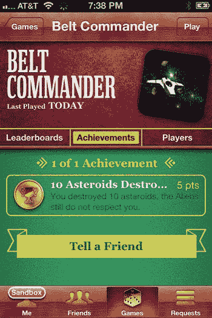  
图 9-11.  Game Center 应用中的首个成就  

在图 9-11 中，我们看到 Game Center 应用显示 Belt Commander 成就的截图。可以看到，该视图中的成就已被授予。代码清单 9-5 展示了授予成就的代码。  

**代码清单 9-5.** `BeltCommanderController.m` (`checkAchievements`)  

```
-(void)checkAchievements{
    if (asteroids_destroyed >= 10){
        
        GKAchievement* achievement = [[GKAchievement alloc] initWithIdentifier:@"beltcommander.10asteroids"];
        achievement.percentComplete = 100.0;
        
        [achievement reportAchievementWithCompletionHandler:^(NSError *error) {
            if (error){
                // report error
            }
        }];
    }
}
```

在代码清单 9-5 中，我们看到来自`BeltCommanderController`类的任务`checkAchievements`，该类负责处理游戏中的逻辑。我们首先检查`asteroids_destroyed`是否大于或等于 10。变量`asteroids_destroyed`会在游戏中的小行星被摧毁时递增。如果`asteroids_destroyed`至少为 10，我们通过将成就 ID（在 iTunes Connect 中定义）传递给`GKAchievement`的`initWithIdentifier`任务来获取对`GKAchievement`的引用。获取引用后，只需将`percentComplete`属性设为 100，调用`reportAchievementWithCompletionHander`即可完成。  

关于成就，有几点需要注意。首先，如代码清单 9-5 所示，成就可以部分完成。我们可以将`percentComplete`设为 30 或 50。这对于长期成就来说是一个重要功能。例如，假设我们的成就是摧毁 10,000 颗小行星。我们希望让用户了解他们当前的进度，否则他们可能不会继续追求。  

关于成就的另一点是每个成就都有分值。如图 9-11 所示，我们的成就价值 5 分。成就的分值可以由开发者任意设定。但是，每个游戏的总成就点数限制为 1,000 分。这样用户就知道，当他们达到 1,000 成就点时，已经获得了该游戏的所有成就。这避免了用户需要重新了解每个游戏中成就的相对价值。用户知道 1 分或 5 分的成就无关紧要，而 100 分的成就才是真正的成就。  

我们已经了解了 Game Center 和 GameKit，以及如何使用排行榜和成就。如前所述，GameKit 还可以用于协调多人游戏。这里我们不打算深入探讨这个话题，因为我认为对于本书来说过于高级。但我鼓励你跟进 GameKit 对多人游戏的支持，因为它应该能大大简化你的开发工作。接下来，让我们看看 iOS 5 中新增的 Twitter 集成功能。  

## Twitter 集成  

无论你喜欢与否，Twitter 都存在。作为移动应用开发者，你需要意识到客户在应用中集成社交媒体的需求越来越普遍。每个人短名单上的社交服务中都有 Twitter。Twitter 提供了一个非常优秀且实用的 REST 服务，可用于代表用户发推文。iOS 6 新增了 Social Framework。  

这个框架扩展并取代了 iOS 5 的 Twitter API。Social Framework 允许用户通过 Twitter 或 Facebook 账户进行某种形式的单点登录，使应用开发者能够轻松请求访问这一全局账户。这个功能对用户非常有利，因为他们只需在设备上认证一次，同时仍能控制哪些应用允许为他们发推文。  

这个功能对开发者也非常有利。它让发推文变得极其简单。如果你曾在嵌入式设备上使用过 OAuth 服务，就会知道 OAuth 的工作原理与原生应用的操作方式之间存在一些脱节。简而言之，OAuth 设计用于浏览器环境，而我们的应用并非基于 HTML 编写。一种解决方案是弹出一个`UIWebView`并通过它进行认证。这种方法可行，但很笨拙。而新方法要好得多。  

这个新的 Twitter API 不仅提供了简单的认证方式，还包含一个简单的组件，用户可以在其中输入推文，如图 9-12 所示。  

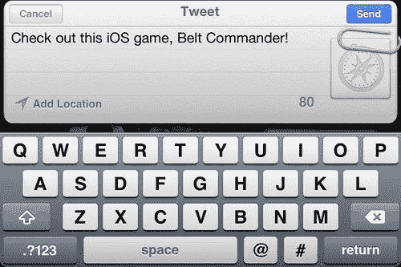  
图 9-12.  从 Belt Commander 发推文  

在图 9-12 中，我们看到 iOS 内置的发推文组件。顶部是输入 120 个字符的区域。右侧有一个回形针夹着 Safari 图标，表示这条推文附带了链接。用户还可以添加位置、取消或发送推文。用默认值填充此视图并显示它的代码如代码清单 9-6 所示。  

**代码清单 9-6.** `RootViewController.m` (`tweetButtonClicked:`)  

```
- (IBAction)tweetButtonClicked:(id)sender {
        SLComposeViewController* twitterSheet = [SLComposeViewController composeViewControllerForServiceType:SLServiceTypeTwitter];
    [twitterSheet setInitialText:@"Check out this iOS game, Belt Commander!"];
    [twitterSheet addURL:[NSURL URLWithString:@" http://itunes.apple.com/us/app/belt-commander/id460769032?ls=1&mt=8 "]];
    [self presentViewController:twitterSheet animated:YES completion:^(void){
        NSLog(@"twitter done");
    }];
}
```

在代码清单 9-6 中，我们看到`RootViewController`类的`tweetButtonClicked`:任务。当用户点击“发推文”按钮时，会调用此任务。要显示 Twitter 组件，我们只需创建一个新的`SLComposeViewController`，并指定我们对 Twitter 服务感兴趣。在指定初始文本并附加 URL 后，只需将`twitterSheet`传递给`presentModalViewController`即可。如果我们想知道推文是否已发送，可以为`twitterSheet`的`completionHandler`值分配一个代码块。  

当然，并非每个用户都在其设备上设置了 Twitter。作为开发者，你希望能够测试这一点，结果证明这就像代码清单 9-7 中的代码一样简单。  

**代码清单 9-7.** `RootViewController.m` (`initTwitter`)  

```
-(void)initTwitter{
    [tweetButton setEnabled:[SLComposeViewController isAvailableForServiceType:SLServiceTypeTwitter]];
}
```

在代码清单 9-7 中，我们看到简单的任务`initTwitter`，它在包含它的`UIViewController`加载时被调用。在此任务中，我们只需调用`isAvailableForServiceType`来检查是否可以发推文。通过使用返回值设置`tweetButton`的启用状态，我们防止用户在设备启用 Twitter 之前点击该按钮。  

Twitter 集成非常出色，它让包含此功能变得极为简单。接下来，让我们探索 Social Framework 如何让集成 Facebook 也同样简单。  


好的，作为一名高级文档工程师和翻译员，我将严格遵循您提供的注意事项和示例格式，将给定的英文文本翻译成中文。


## Facebook 集成

很难说 Twitter 集成和 Facebook 集成哪个是更常见的需求。值得庆幸的是，新的 Social Framework 让使用 Facebook 变得和使用 Twitter 一样简单。在 Twitter 示例中，我们使用了内置的 widget 来显示一条推文。这个示例同样适用于将 `SLServiceTypeTwitter` 替换为 `SLServiceTypeFacebook`，用户将转而发布内容到他们的 Facebook 账户。不过，我们将结合使用 Social Framework 和 Accounts Framework，直接向用户的时间线发布内容，而无需呈现 UI 元素。Accounts Framework 是一组配套的 API，允许在操作社交媒体服务时进行更精细的控制。

在本节中，我们将看到用户如何通过点击图 9-2 中的 Facebook 按钮，请求将高分发布到他们的时间线上。不过，在查看源代码之前，我们需要先进入我们的 Facebook 账户并创建一个 Facebook 应用。

### 创建 Facebook 应用

可以将 Facebook 应用视为我们应用程序的 Facebook 组件。Facebook 要求我们这样做，以便与代表用户执行的任何 Facebook 操作相关联的身份。Facebook 也将 Facebook 应用用作一个安全上下文。当用户同意让我们的应用发布内容时，他们就等于允许我们新建的 Facebook 应用进行发布。图 9-13 展示了我为示例游戏 Belt Commander 创建的 Facebook 应用。

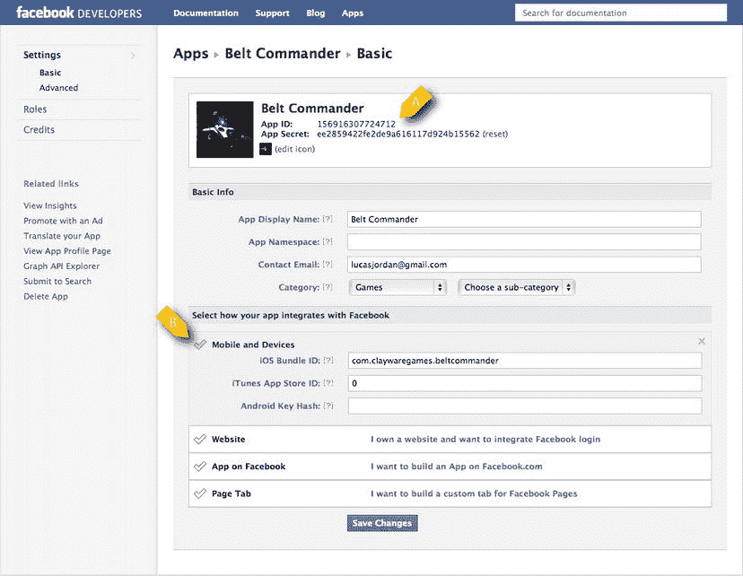

图 9-13. Facebook 应用

在图 9-13 中，我们看到了一个 Facebook 应用的设置页面。在项目 A 处，您可以看到 App ID。我们在代码中与 Facebook 进行身份验证时会使用这个值。在项目 B 处，您会注意到 Facebook 要求添加 iOS Bundle ID，该 ID 必须与您在 Xcode 项目中设置的 Bundle ID 相匹配。创建 Facebook 应用并不困难，但我不想在此记录这个过程，因为其步骤似乎每隔几个月就会变化。基本上，您需要将您的 Facebook 账户注册为开发者并添加一个新应用。相关指南可以在 `https://developers.facebook.com/apps` 找到。

接下来，让我们看看如何使用 Social Framework 和 Accounts Framework 连接 Facebook 并将高分发布到用户的时间线。

### 使用 Facebook 进行身份验证

为了向用户的时间线发布消息，我们首先必须向 Facebook 查询，确认用户是否允许我们的应用执行此操作。让我们直接查看当用户触摸 Facebook 按钮时调用的代码，如代码清单 9-7 所示。

**代码清单 9-7**. `facebookButtonClicked.m` (`RootViewController.m`)

```
- (IBAction)facebookButtonClicked:(id)sender {
    accountStore = [[ACAccountStore alloc] init];
    ACAccountType* facebookAccountType = [accountStore accountTypeWithAccountTypeIdentifier: ACAccountTypeIdentifierFacebook];
    
    NSDictionary *dict = @{
        ACFacebookAppIdKey: FB_APP_ID,
        ACFacebookPermissionsKey: @[@"publish_stream"],
        ACFacebookAudienceKey: ACFacebookAudienceFriends
    };
    
    [accountStore requestAccessToAccountsWithType:facebookAccountType options:dict completion:^(BOOL granted, NSError *error) {
        
        if (granted){
            
            NSArray* accounts = [accountStore accountsWithAccountType:facebookAccountType];
            facebookAccount = [accounts lastObject];
            
        } else {
            NSLog(@"Could not get permission to access FB: %@", error);
        }
        
    }];
}
```

在代码清单 9-7 中，我们首先创建了一个 `ACAccountStore` 实例；注意我们将此对象存储在 `RootViewController` 的一个成员字段中。接下来，我们使用 `accountStore` 的 `accountTypeWithAccountIdentifier`：任务创建了一个名为 `facebookAccountType` 的 `ACAccountType`。`facebookAccountType` 对象将用于后续对 `accountStore` 的调用，以指示我们正在尝试操作的社交媒体服务。下一步是创建一个 `NSDictionary`，其中包含我们想要如何使用 Facebook 的详细信息。`NSDictionary` 中的第一项是由键 `ACFacebookAppIdKey` 指定的 Facebook App ID。这是我们在上一节中创建 Facebook 应用时创建的 key。

第二个键 `ACFacebookPermissionsKey` 指定了我们请求执行的 Facebook 操作。在这个例子中，我们只希望能够写入用户的时间线，这由权限 `publish_stream` 控制。（更多关于 Facebook 权限的信息可以在 `http://goo.gl/OOEDG` 找到。）`dict` 中的最后一个键是 `ACFacebookAudienceKey`，它指定了哪些人可以看到我们创建的任何帖子。在这种情况下，`ACFacebookAudienceFriends` 表示只有用户的 friend 才能看到 Belt Commander 发布的很棒的帖子。

至此，我们准备向 Facebook 发出调用，询问其是否允许我们发帖。我们通过调用 `requestAccessToAccountsWithType:options:completion:` 来实现，传入 `facebookAccountType`、`dict` 以及一个在调用完成时执行的 block。

在 completion block 中，我们检查 `granted` 是否为 true；如果是，我们请求 `accountStore` 返回所有属于 Facebook 账户的账户。在 iOS 6 中，每个设备只能关联一个 Facebook 账户。因此，我们只需获取最后一个（也是唯一一个）账户并赋值给 `facebookAccount`，它是在头文件中定义的一个 `ACAccount` 对象（源码未显示）。

如果这是我们第一次调用 `requestAccessToAccountsWithType:options:completion:`，用户将会看到一个类似图 9-14 所示的对话框提示。

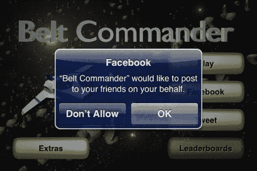

图 9-14. 系统请求用户授予权限

如果用户在图 9-14 中触摸“OK”按钮，应用程序便获得了代表他们发帖的权限。接下来，让我们看看 Belt Commander 如何使用此权限来发布这些帖子。

### 向 Facebook 发布内容

我们刚刚探讨了应用程序如何请求发布 Facebook 帖子的权限。在 Belt Commander 中，每当玩家的游戏结束时，我们将发布一条 Facebook 帖子，报告其分数。我们在 `reportToFacebook` 任务中完成此操作，如代码清单 9-8 所示。

**代码清单 9-8**. `notifyFacebook` (`RootViewController.m`)

```
-(void)notifyFacebook{
    if (facebookAccount){
        
        NSString* desc = [NSString stringWithFormat:@"I just scored %ld points on Belt Commander.", [beltCommanderController score]];
        
        NSDictionary* params = @{
        @"link": @" http://itunes.apple.com/us/app/belt-commander/id460769032 ",
        @"caption": @"Presented by ClayWare Games, LLC",
        @"description": desc,
        @"message": @"A new high score!"
        };
        NSURL* feedURL = [NSURL URLWithString:@" https://graph.facebook.com/me/feed "];
        
        SLRequest* request = [SLRequest requestForServiceType:SLServiceTypeFacebook requestMethod:SLRequestMethodPOST URL:feedURL parameters:params];
        
        request.
```


```objective-c
account = facebookAccount;
[request performRequestWithHandler:^(NSData *responseData, NSHTTPURLResponse *urlResponse, NSError *error) {
    if (error){
        NSLog(@"%@", error);
    } else {
        //Success
    }
}];
```

在列表 9-8 中，我们首先检查对象 `facebookAccount` 是否已设置；如果已设置，我们创建一个名为 `params` 的 `NSDictionary`，并用帖子内容填充它。`params` 中的项特定于你向 Facebook 发布的帖子类型。请查阅 Facebook 文档以确认具体哪些项是必需或允许的。接下来，我们创建一个指向 Facebook 社交图谱中发布位置的 `NSURL`。在此例中，这是当前用户的动态。

一旦我们准备好发布帖子的所有内容，就创建一个 `SLRequest` 对象，确保指定正确的 `requestMethod`（`SLRequestMethodPOST`）。我们还指定该请求应与对象 `facebookAccount` 关联。这可确保请求使用预期账户正确配置。最后，我们调用 `performRequestWithHandler` 并传入处理程序块。

在我们的例子中，处理程序块中除了记录问题外，没有太多操作。如果一切顺利，用户将在其时间线中看到类似图 9-15 的内容。

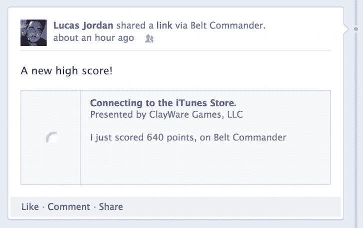

图 9-15.  发布成功

## 总结

在本章中，我们探索了 Game Center，并介绍了它为用户提供的服务。我们基于 GameKit 探讨了这些功能，了解如何将用户分数发布到排行榜以及授予成就。延续社交趋势，我们研究了 iOS 6 中对 Twitter 的内置支持。最后，我们探讨了如何将 Facebook 集成到 iOS 应用程序中。我们介绍了如何处理身份验证以及向用户动态发布简单消息。

## 第 10 章 通过 Apple App Store 盈利

通过 Apple App Store 中的应用赚钱主要有三种方式。最直接的方式是直接对应用收费。第二种是免费提供应用，但包含广告。另一种方式（适用于免费和付费应用）是在应用内销售物品。这些称为应用内购买，在某些类型的游戏中非常流行。

本章不会讨论什么样的应用内购买是好的，或者你的应用应该免费还是收费。它将介绍设置应用内购买的基础知识，并解释可用的不同购买类型。

## 应用内购买

应用内购买是应用内需要付费的虚拟物品或服务。许多不同类型的应用（不仅仅是游戏）都利用应用内购买来赚钱。一些非游戏示例包括下载文章或漫画、烹饪食谱以及详细的地图数据。一些游戏内示例包括额外关卡、新能力、额外游戏货币以及用于自定义游戏外观的新颖物品。

我们将查看游戏 Belt Commander 的示例代码。源代码可以在本书示例代码的 Belt Commander 文件夹中找到。在图 10-1 中，你可以看到 Belt Commander 的应用内购买选项。

在图 10-1 中，我们看到来自游戏 Belt Commander 的截图。有三个按钮，每个按钮指定游戏运行时应该出现哪种类型的角色。游戏默认提供小行星；右侧的两个按钮用于购买游戏中的额外角色类型。中间的按钮用于飞碟，该内容已购买，但下次游戏运行时将不会包含（未激活）。

右侧的按钮表示用户可以选择购买在游戏中包含能力增强角色的功能。用户通过单击按钮并完成购买对话框来发起购买。

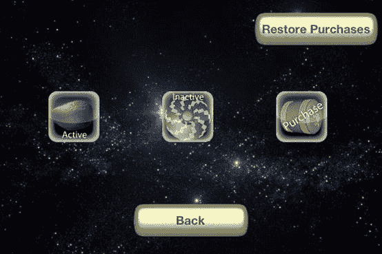

图 10-1.  Belt Commander 中的应用内购买

在实现这些功能之前，我们将了解可用的不同类型应用内购买以及如何在我们的应用中启用应用内购买。

### 购买类型概览

有四种不同的应用内购买类型，每种类型支持不同的业务需求。如果这四种应用内购买类型不适合你的业务需求，你将需要自行实现。编写自己的应用内购买服务可能非常耗时。我建议检查你的业务需求是否可以适配 Apple 的模型。这样做的好处不仅是缩短开发时间，而且对用户也有利。当你使用 Apple 的系统时，用户将看到一个熟悉的界面，并使用一组熟悉的凭据（用户的 Apple ID）登录。五种应用内购买类型如下：

*   非消耗型
*   消耗型
*   免费订阅
*   自动续订订阅
*   非续订订阅

让我们仔细看看每种应用内购买类型。

#### 非消耗型

非消耗型应用内购买是指一次性购买、并授予对某些物品或服务的持久访问权限的物品。用户可以重新下载非消耗型物品，并且这些物品应在用户的所有设备上可用。非消耗型购买可以包括额外游戏关卡、新类型的敌人或用于自定义用户游戏角色的滑稽帽子。

#### 消耗型

消耗型应用内购买旨在支持会被消耗的物品或服务。在游戏中，这可能包括额外生命、用于购买游戏内物品的点数或其他可被用完的东西。消耗型购买设计为可重复进行。

消耗型购买无法重新下载，因此除非你实现自己的服务来跨账户共享此信息，否则它们本质上不会在用户设备间可用。

#### 免费订阅

免费订阅是一种在 Newsstand 应用程序中提供免费内容的方式。这种特定类型的应用内购买实际上与游戏或应用无关。

#### 自动续订订阅

自动续订订阅是一种让用户购买某个功能或在设定时间内获得内容访问权限的方式。你可以将其视为每年自动从信用卡扣费的杂志订阅。

#### 非续订订阅

非续订订阅是指不会自动向用户收费以续订的订阅。这种类型的应用内购买之所以存在，是因为 Apple 对哪些功能或内容适合作为自动续订订阅要求严格。非续订订阅是一种折中方案，允许在 Apple 认为不适合进行自动续订订阅的应用中使用订阅。

现在，让我们看看为应用内购买准备应用所需的内容。

## 准备应用内购买

与 Game Center 非常相似，必须在 iTunes Connect 中启用应用才能包含应用内购买。要求完全相同：你必须使用不含通配符的 App ID。在第 9 章中，我们介绍了在配置中心创建支持 Game Center 的 App ID 的过程。你可以按照说明创建第二个 App ID，或者直接将应用内购买添加到同一款游戏中。

## 启用和创建应用内购买

一旦在 iTunes Connect 中有了应用，通过按下“管理应用内购买”按钮即可启用应用内购买，如图图 10-2 所示。


### 在 iTunes Connect 中启用 App 内购买

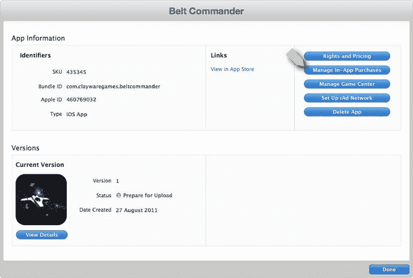

图 10-2. 在 iTunes Connect 中启用 App 内购买

在图 10-2 中，我们看到了 iTunes Connect 中用于配置应用程序的界面。项目 A 显示了用于启用 App 内购买的按钮。点击此按钮后，您将能够向应用程序中添加用户可以购买的项目。图 10-3 显示了我为 Belt Commander 准备的项目。

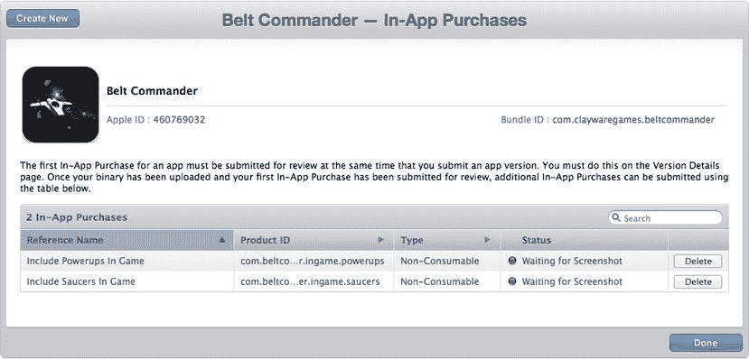

图 10-3. 为 Belt Commander 提供的 App 内购买项目

在图 10-3 中，我们看到了 iTunes Connect 中列出 App 内购买项目的界面。我们可以看到我们添加了两个：分别为用户可以添加到游戏中的每种额外角色类型。对于每个 App 内购买项目，我们可以看到引用名称、产品 ID、产品类型和产品状态。引用名称用于内部使用——用户不会看到它。产品 ID 是一个唯一名称，在所有 iOS 应用程序中使用，用于标识该购买项目。在代码中，我们将通过产品 ID 来引用此购买项目。

类型指的是我们之前讨论过的不同购买类型——在本例中，是非消耗品。状态值表示此项 App 内购买需要满足哪些条件才能获得 Apple 的批准。（Apple 必须审核您创建的每一个 App 内购买项目，就像每个应用程序在销售前都必须经过审核一样。）在这种情况下，系统提示我们，Apple 正在等待此购买项目的屏幕截图，然后才能进行审核。这些屏幕截图不会显示给用户——它们只是向 Apple 提供关于该 App 内购买项目是什么的上下文信息。在图 10-4 中，我们看到了 iTunes Connect 中用于创建新 App 内购买的界面。

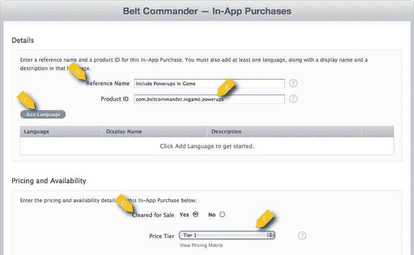

图 10-4. 一个新的 App 内购买项目

图 10-4 中的项目 A 显示了输入 App 内购买引用名称的位置。项目 B 显示了该 App 内购买的产品 ID。为了创建 App 内购买项目，您必须通过点击“添加语言”按钮（项目 C）来提供 App 内购买项目的本地化字符串。

在图 10-4 的“定价与购买可用性”部分，您必须将项目 D 处的项目设置为“已清除销售状态”，才能测试购买。您还必须在项目 E 处指定价格等级。这些价格等级与应用程序的价格等级相同，唯一的区别是没有免费等级。

一旦您为应用程序定义了 App 内购买项目，您就必须配置一个测试用户，以便测试您的购买。强烈建议您在提交应用程序之前先测试 App 内购买。

### 创建测试用户

一旦您定义了 App 内购买项目，您就需要创建一个测试用户，以便在您的应用程序中“购买”这些项目。这让您有机会使用与真实用户相同的流程来测试启用或禁用每个已购买的功能。图 10-5 显示了在 iTunes Connect 中开始添加测试用户流程的位置。

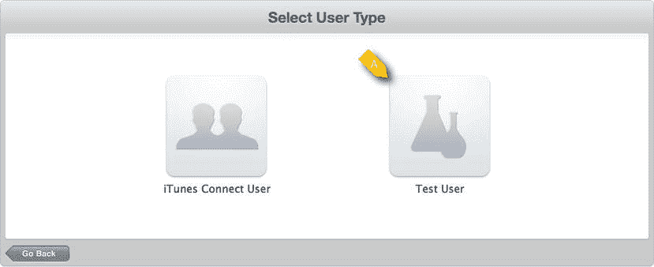

图 10-5. 创建测试用户

在图 10-5 中，我们看到了“选择用户类型”视图中的“创建测试用户”选项。该视图可在 iTunes Connect 中点击主屏幕上的“管理用户”按钮后获得。

**注意** 我强调使用测试用户来调试您的 App 内购买，因为尝试使用真实用户来调试会干扰您的工作。

一旦您点击了图 10-5 中所示的“测试用户”按钮，系统将提示您创建一个新用户。

这应该没什么好惊讶的——只需记住，您不应使用当前已是 Apple ID 的电子邮件地址。

我们已经了解了如何在 iTunes Connect 中向应用程序添加 App 内购买项目，以及如何确保拥有用于调试应用程序的测试用户。接下来，我们将了解 App 内购买是如何集成到 Belt Commander 中的，以便我们理解所涉及的类以及如何使用它们。

### 用于 App 内购买的类与代码

在 iTunes Connect 中创建 App 内购买项目只是让 App 内购买在应用程序中可用的第一步。下一步是理解 App 内购买实际上是如何被购买的流程，以及涉及哪些类。包含相关类的框架被称为 `StoreKit`，它是 iOS SDK 安装的一部分。使用这些类，我们将实现如图 10-6 所示的工作流程，该图展示了确定哪些产品可用以及如何处理购买请求的过程。

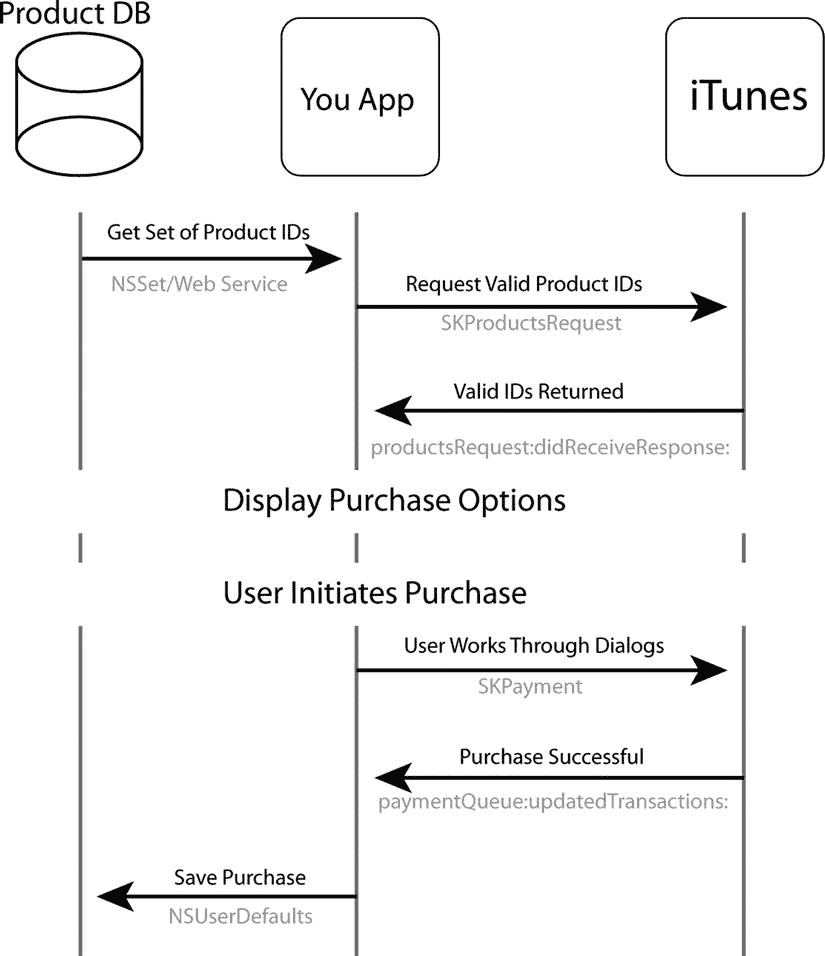

图 10-6. 购买流程

从图 10-6 的左上角开始，我们首先获取一组我们想要展示给用户的产品的产品 ID。这个列表可能来自一个外部网络服务，或者只是应用程序中硬编码的一组字符串。您如何获取此列表取决于您如何管理应用程序中正在销售的商品。如果您一直在添加新商品，您可能希望从网络服务中拉取产品列表。如果您刚刚开始使用 App 内购买，固定的列表可能对您有用，但您将需要更新应用程序来更改列表。

一旦我们有了可能的产品 ID 列表，我们就向 iTunes Store 发出请求，询问我们传递的哪些 ID 是有效的并且准备好销售了。从 iTunes Store 返回的 ID 代表我们希望提供给用户的项目。iTunes Store 不会返回未知或尚未准备好销售的产品 ID。这确保了我们在展示的项目都是经过 Apple 审核流程的有效商品。除了让我们知道 ID 是有效的之外，iTunes Store 还会返回与购买关联的本地化字符串，使我们能够向用户显示与在 iTunes Connect 中输入的内容完全匹配的、语言适当的文本。

继续图 10-6 所示的工作流程，在某个时刻用户会点击按钮来购买一个项目。发生这种情况时，我们只需创建一个支付请求并提交它，此时系统将提示用户通过一系列对话框来确认购买。如果一切顺利，我们会收到一个回调，告知我们购买成功。发生这种情况时，我们需要记录购买已经完成。我们可以通过简单地将产品 ID 存储在标准的 `NSUserDefaults` 中来实现，或者我们可以做一些更复杂的事情，比如将其保存到网络服务。用户为了确认购买而必须操作的对话框如图 10-7 所示。

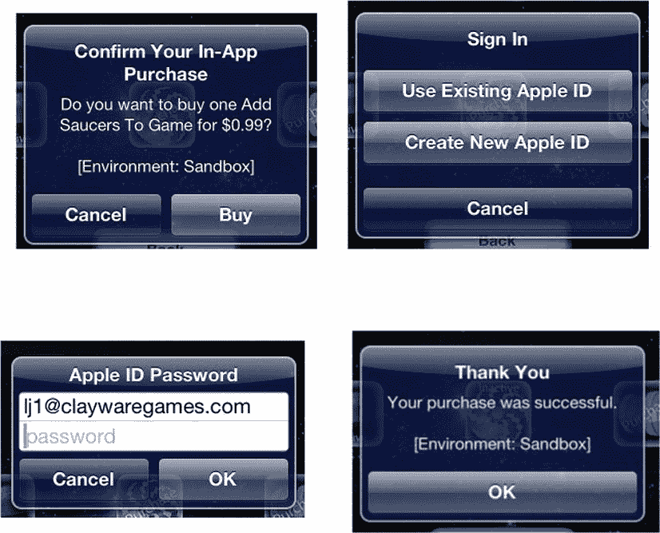

图 10-7. 进行购买

图片左上角的对话框将始终显示，右下角的对话框也是如此。如果用户必须使用其 Apple ID 登录，则另外两个对话框将出现在第一个和最后一个对话框之间。作为开发者，务必记住我们无法控制具体显示哪些对话框，也无法控制用户完成流程所需的时间。重要的是，不要期望用户在游戏动作进行的过程中完成此流程。


现在让我们看一个具体的例子，我们将为游戏《皮带指挥官》实现非消耗型应用内购买功能。我们要实现图 10-1 中的视图，让用户可以选择哪些角色参与游戏，并购买新角色以解锁使用。

## 应用内购买实现

如前所述，购买过程实际上只需向 iTunes Store 发起两次调用。在本节中我们将看到，这实际上只涉及少数几个类。在我们的示例中，大部分 StoreKit 交互细节和 UI 处理工作都将在名为`ExtrasController`的单个类中完成，其头文件如代码清单 10-1 所示。

**代码清单 10-1.** ExtrasController.h

```
@interface ExtrasController : UIViewController<SKPaymentTransactionObserver, SKProductsRequestDelegate>{
    GameParameters* gameParams;
    NSMutableDictionary* idsToProducts;
}
@property (strong, nonatomic) IBOutlet UIButton *asteroidButton;
@property (strong, nonatomic) IBOutlet UIButton *saucerButton;
@property (strong, nonatomic) IBOutlet UIButton *powerupButton;

-(void)setGameParams:(GameParameters*)params;
@end
```

在代码清单 10-1 中，我们看到了`ExtrasController`类的头文件。`ExtrasController`类扮演两个角色：管理购买流程并相应地更新三个按钮。

`gameParams`对象负责存储游戏中已启用的角色以及已完成的购买记录。`idsToProducts`对象用于将我们的购买 ID 映射到苹果返回的有效`SKProduct`对象；稍后我们将了解如何使用这些对象。

为了与 StoreKit 交互，`ExtrasController`遵循`SKPaymentTransactionObserver`和`SKProductsRequestDelegate`这两个协议。这些协议提供了应用程序响应商店交互所需的一切功能。我们将在代码中看到`ExtrasController`如何实现这两个协议中的任务。

使用 StoreKit 的第一步是设置一个响应购买状态变化的对象。我们通过向默认的`SKPaymentQueue`添加观察者来创建响应购买变化的对象，如代码清单 10-2 所示。

**代码清单 10-2.** ExtrasController.m (viewDidLoad)

```
#define PURCHASE_INGAME_SAUCERS @"com.beltcommander.ingame.saucers"
#define PURCHASE_INGAME_POWERUPS @"com.beltcommander.ingame.powerups"
//....
- (void)viewDidLoad {
    [super viewDidLoad];
    idsToProducts = [NSMutableDictionary new];
    [[SKPaymentQueue defaultQueue] addTransactionObserver:self];

    //获取产品 ID 集合
    NSSet* potentialProducts = [NSSet setWithObjects:PURCHASE_INGAME_POWERUPS, PURCHASE_INGAME_SAUCERS, nil];

    SKProductsRequest* request = [[SKProductsRequest alloc] initWithProductIdentifiers:potentialProducts];
    [request setDelegate:self];
    [request start];

    [self setGameParams: [GameParameters readFromDefaults]];
}
```

在代码清单 10-2 中，我们看到了`ExtrasController`类的`viewDidLoad`任务。在该任务中，我们首先创建`idsToProducts`映射，并通过调用`defaultQueue`获取默认的`SKPaymentQueue`，将`self`添加为观察者。由于`self`遵循`SKPaymentTransactionObserver`协议，我们的`ExtrasController`将获知所有购买状态的变化。注册观察者后，我们创建一个已知产品 ID 的集合。在本例中，`NSSet`类型的`potentialProducts`由两个常量创建：`PURCHASE_INGAME_POWERUPS`和`PURCHASE_INGAME_SAUCERS`。如我们所见，这些常量与我们在 iTunes Connect 中创建产品时指定的字符串相同。

指定潜在产品集合后，我们创建一个`SKProductsRequest`，将`self`设置为委托，并调用其`start`方法。在 StoreKit 处理哪些产品 ID 有效的同时，我们调用`setGameParams`，指定应使用存储在默认`NSUserDefaults`中的`GameParameters`对象。当 StoreKit 返回结果时，会触发`productsRequest:didReceiveResponse:`任务，如代码清单 10-3 所示。

**代码清单 10-3.** ExtrasController.m (productsRequest:didReceiveResponse:)

```
- (void)productsRequest:(SKProductsRequest *)request didReceiveResponse:(SKProductsResponse *)response {
    for (SKProduct* aProduct in response.products){
        if ([aProduct.productIdentifier isEqualToString:PURCHASE_INGAME_SAUCERS]){
            [saucerButton setEnabled:YES];
            [saucerButton setHidden:NO];
            [idsToProducts setObject:aProduct forKey:PURCHASE_INGAME_SAUCERS];
        } else if ([aProduct.productIdentifier isEqualToString:PURCHASE_INGAME_POWERUPS]){
            [powerupButton setEnabled:YES];
            [powerupButton setHidden:NO];
            [idsToProducts setObject:aProduct forKey:PURCHASE_INGAME_POWERUPS];
        }
    }
}
```

在代码清单 10-3 中，我们看到`productsRequest:didReceiveResponse:`任务，当获取到有效产品 ID 集合时会被调用。在该任务中，我们简单遍历所有返回的产品，并使购买飞碟和能量增强的按钮可见。通过这种方式，我们确保用户只能看到可行的购买选项。

我们还将每个有效产品 ID 映射到对应的`SKProduct`对象并存储到应用程序中。这样，当用户进行购买时，我们可以提取出苹果发送给我们的精确对象，确保向用户展示正确的数据。

我们已经了解了如何判断哪些购买项目有效。在探讨实际购买流程之前，应该先研究一下`GameParameters`类。`GameParameters`类负责存储哪些产品已被购买以及用户希望在游戏中出现哪些角色。

## 根据已有购买记录驱动 UI

图 10-1 中显示的三个按钮，允许用户选择哪些角色可在游戏中出现。相同的 UI 也支持用户购买新角色。为了跟踪这些信息，我们创建了模型类`GameParameters`，其头文件如代码清单 10-4 所示。

**代码清单 10-4.** GameParameters.h

```
@interface GameParameters : NSObject<NSCoding>

@property (nonatomic) BOOL includeAsteroids;
@property (nonatomic) BOOL includeSaucers;
@property (nonatomic) BOOL includePowerups;
@property (nonatomic, retain) NSMutableSet* purchases;

+(id)gameParameters;
+(id)readFromDefaults;
-(void)writeToDefaults;
@end
```

在代码清单 10-4 中，我们看到了`GameParameters`类的头文件。我们使用三个`BOOL`属性来跟踪用户希望在游戏中出现的角色。同时还有一个名为`purchases`的`NSMutableSet`，用于存储产品 ID 字符串的集合。构造方法`gameParameters`将创建一个新的`GameParameters`对象，其中没有购买记录，只有`includeAsteroids`设置为 true（实现代码未显示）。类方法`readFromDefaults`用于从默认的`NSUserDefaults`中提取`GameParameters`对象，而`writeToDefaults`用于将`GameParameters`对象序列化回默认的`NSUserDefaults`。代码清单 10-5 显示了`readFromDefaults`和`writeToDefaults`两个方法。

**代码清单 10-5.** GameParameters。


`readFromDefaults`和`writeToDefaults`这两个任务方法：

```
+(id)readFromDefaults{
    NSUserDefaults* defaults = [NSUserDefaults standardUserDefaults];
    NSData* data = [defaults objectForKey:GAME_PARAM_KEY];
    if (data == nil){
        GameParameters* params = [GameParameters gameParameters];
        [params writeToDefaults];
        return params;
    } else{
        return [NSKeyedUnarchiver unarchiveObjectWithData: data];
    }
}
-(void)writeToDefaults{
    NSData* data = [NSKeyedArchiver archivedDataWithRootObject:self];
    NSUserDefaults* defaults = [NSUserDefaults standardUserDefaults];
    [defaults setObject:data forKey:GAME_PARAM_KEY];
    [defaults synchronize];
}
```

在 Listing 10-5 中，我们看到了`readFromDefaults`和`writeToDefaults`这两个任务。这两个任务是互逆的：`readFromDefaults`会返回存储在用户默认设置中、对应键`GAME_PARAM_KEY`的`GameParameter`对象。而`writeToDefaults`任务则将一个`GameParameter`对象写入用户默认设置中，对应的键也是`GAME_PARAM_KEY`。这两个任务的核心思想是，通过将`GameParameter`对象存储在用户默认设置中，来记录用户购买的商品（通过`purchases`属性中的键来记录）。`GameParameters`类可以被存储在`NSUserDefaults`中，因为它实现了`NSCoder`协议中的任务。关于该过程的描述，请参见第 2 章。

现在，让我们看看如何使用这个类来驱动用户界面，并设置图 10-1 中三个不同按钮的状态。这些操作在`setGameParameters:`任务中处理，如 Listing 10-6 所示。

**Listing 10-6.** GameParameters.m (setGameParameters:)

```
-(void)setGameParams:(GameParameters*)params{
    gameParams = params;
    NSSet* purchases = [gameParams purchases];
    if ([params includeAsteroids]){
        [asteroidButton setImage:[UIImage imageNamed:@"asteroid_active"] forState:UIControlStateNormal];
    } else {
        [asteroidButton setImage:[UIImage imageNamed:@"asteroid_inactive"] forState:UIControlStateNormal];
    }
    if ([purchases containsObject:PURCHASE_INGAME_SAUCERS]){
        if ([params includeSaucers]){
            [saucerButton setImage:[UIImage imageNamed:@"saucer_active"] forState:UIControlStateNormal];
        } else {
            [saucerButton setImage:[UIImage imageNamed:@"saucer_inactive"] forState:UIControlStateNormal];
        }
    } else {
        [saucerButton setImage:[UIImage imageNamed:@"saucer_purchase"] forState:UIControlStateNormal];
    }
    if ([purchases containsObject:PURCHASE_INGAME_POWERUPS]){
        if ([params includePowerups]){
            [powerupButton setImage:[UIImage imageNamed:@"powerup_active"] forState:UIControlStateNormal];
        } else {
            [powerupButton setImage:[UIImage imageNamed:@"powerup_inactive"] forState:UIControlStateNormal];
        }
    } else {
        [powerupButton setImage:[UIImage imageNamed:@"powerup_purchase"] forState:UIControlStateNormal];
    }
}
```

在 Listing 10-6 中，我们看到了`setGameParameters`任务。这个任务负责让用户界面反映传入的`GameParameters`对象（名为`param`）的状态。对于`asteroidButton`，我们根据`includeAsteroids`属性的值，简单地指明要显示哪个图像。对于`saucerButton`，我们执行类似的检查，但仅在飞碟的产品 ID 包含在`NSSet purchases`中的情况下才进行。如果产品 ID 不存在，我们则将按钮的图像设置为显示购买版本。我们对`UIButton` `powerButton`进行了类似的处理，将其背景设置为活动、非活动或购买状态。

## 发起购买

现在我们已经了解了按钮状态是如何管理的，接下来看看点击其中一个购买按钮是如何触发购买的。Listing 10-7 展示了用户按下飞碟按钮时运行的代码。

**Listing 10-7.** ExtrasController.m (saucerButtonClicked:)

```
- (IBAction)saucerButtonClicked:(id)sender {
    if ([gameParams.purchases containsObject:PURCHASE_INGAME_SAUCERS]){
        [gameParams setIncludeSaucers:![gameParams includeSaucers]];
        [self setGameParams:gameParams];
        [gameParams writeToDefaults];
    } else {
        SKProduct* product = [idsToProducts objectForKey:PURCHASE_INGAME_SAUCERS];
        SKPayment* payRequest = [SKPayment paymentWithProduct: product];
        [[SKPaymentQueue defaultQueue] addPayment:payRequest];
    }
}
```

在 Listing 10-7 中，我们看到了`saucerButtonClicked`任务，它在用户点击飞碟按钮时被调用。如果已经购买了飞碟功能，我们知道用户只是想切换是否显示飞碟。对此，我们通过翻转`includeSaucers`的值、调用`setGameParams`来更新 UI，并将更改写入磁盘来响应。如果用户尚未购买飞碟功能，则说明他/她想要进行购买。为了启动此过程，我们从`idsToProducts`中检索我们的`SKProduct`对象，然后使用该`SKProduct`创建一个`SKPayment`对象。最后，我们将`SKPayment`对象添加到默认的`SKPaymentQueue`中。这会触发对话框流程，如图图 10-7 所示。管理道具功能的代码与 Listing 10-7 中的代码几乎相同，因此不值得再看。接下来，让我们看看如何响应成功的购买。

## 响应成功购买

为了响应成功的购买，我们之前在 Listing 10-2 中向默认的`SKPaymentQueue`添加了一个`SKPaymentTransactionObserver`实例。现在我们准备看看当`SKPaymentQueue`成功处理一次购买时调用的代码，如 Listing 10-8 所示。

**Listing 10-8.** ExtrasController.m (paymentQueue: updatedTransactions:)

```
- (void)paymentQueue:(SKPaymentQueue *)queue updatedTransactions:(NSArray *)transactions{
    for (SKPaymentTransaction* transaction in transactions){
        if (transaction.transactionState == SKPaymentTransactionStatePurchased || transaction.transactionState == SKPaymentTransactionStateRestored){
            NSString* productIdentifier = transaction.payment.productIdentifier;
            [[gameParams purchases] addObject: productIdentifier];
            [gameParams writeToDefaults];
            [self setGameParams:gameParams];
            [queue finishTransaction:transaction];
        }
    }
}
```

在 Listing 10-8 中，我们看到了由`ExtrasController`类实现的`paymentQueue:updatedTransactions:`任务。在这个任务中，我们遍历事务数组（`transactions`）中的每一个`SKPaymentTransaction`。对于每个`SKPaymentTransaction`，我们检查其状态是否为`SKPaymentTransactionStatePurchased`或`SKPaymentTransactionStateRestored`。如果是，我们将事务的产品 ID 添加到`gameParams`的`purchases`属性中并保存。我们还通过调用`setGameParams:`来更新 UI。最后，我们通过调用`finishTransaction:`通知队列我们已完成对该事务的处理。

从技术上讲，如果`paymentQueue:updatedTransactions:`任务是由用户发起新购买引起的，那么事务的状态将是`SKPaymentTransactionStatePurchased`。但由于我们使用的产品类型是非消耗型的，我们需要确保用户能够恢复其购买记录，以防其设备被重置或他/她是在另一台 iOS 设备上进行的购买。为了处理这种情况，我们确保允许事务状态为`SKPaymentTransactionStateRestored`，并将其视为与新购买相同来处理。


为了允许用户恢复购买，我们提供了恢复购买按钮，该按钮会调用列表 10-9 中的代码。

列表 10-9 `ExtrasController.m` (`restorePurchasesClicked:`)
```
- (IBAction)restorePurchasesClicked:(id)sender {
    [[SKPaymentQueue defaultQueue] restoreCompletedTransactions];
}
```

在列表 10-9 中，我们看到当用户点击恢复购买按钮时调用的任务`restorePurchasesClicked`。在此任务中，我们简单地调用默认`SKPaymentQueue`上的`restoreCompletedTransactions`。这会使 StoreKit 联系 iTunes Store，并为当前应用和用户重新下载所有产品 ID。完成后，它会调用`paymentQueue:updatedTransaction:`，如列表 10-8 所示。这就是允许用户重新访问其购买所需的一切。

## 总结

在本章中，我们回顾了什么是应用内购买以及五种不同的类型。我们还研究了如何在 Belt Commander 游戏中实现应用内产品的购买。我们回顾了如何从 iTunes Store 获取有效的产品 ID 列表，以及如何基于该列表创建 UI。我们还探讨了如何触发购买流程，以及如何响应成功完成，同时牢记如何为用户存储购买记录。

# 第 11 章 为你的游戏添加声音

没有声音的游戏是不完整的。这包括背景音乐和音效。在任何操作系统中播放音效都是一件相当简单的事情，但确保你的应用或游戏与 iOS 系统的其他部分良好协同可能有点棘手。考虑到游戏应允许用户播放自己的音乐、响应中断和通知以及遵循静音开关，你会发现这不仅仅是播放音轨那么简单。

在本章中，我们将探讨如何确保你的游戏在 iOS 上是一个“好公民”，以及播放声音的基础知识。我们不会涉及高级声音概念或 OpenAL，因为这些是复杂的话题，我们没有足够的篇幅在此充分讨论。项目 Sample 11 包含本章的代码。

## 如何播放声音

在我们深入讨论完整应用的一些细节之前，让我们快速了解一下用于播放音频的基本类`AVAudioPlayer`。列表 11-1 展示了播放声音的最简单代码。

**列表 11-1**. `AVAudioPlayer`示例
```
NSURL *url = [NSURL fileURLWithPath:[[NSBundle mainBundle] pathForResource:@"viper_explosion" ofType:@"m4a"]];
AVAudioPlayer* player = [[AVAudioPlayer alloc] initWithContentsOfURL:url error: nil];
[player play];
```

在列表 11-1 中，我们看到`AVAudioPlayer`实例`player`是通过`NSURL`初始化的。该`NSURL`是从应用的主`NSBundle`中，为文件`viper_explosion.m4a`构建的。文件`viper_explosion.m4a`只是一个添加到 Xcode 项目中的文件。为了实际播放声音，我们在`player`上调用`play`。这将以默认音量和声像播放音频一次。有很多方法可以改进这段基本代码，使其更适合游戏。但在深入这些细节之前，让我们先了解 iOS 应用中的声音如何在 iPhone 或 iPad 上成为一个“好公民”。

## 正确的音频行为

Apple 的人机界面指南解释了他们对应用在音频方面的行为期望。这一点值得一读，可以在此处找到：`http://goo.gl/L0vYH.`

在不逐条讨论 Apple 指南的前提下，让我们看一下其中与游戏相关的一些重点。

在开始之前，我必须说，这些要点似乎更适用于 iPhone 而非 iPad，因为 iPhone 的使用场景更为敏感。人们总是随身携带手机，并且经常处于需要特定行为的社交场合。如果你在婚礼或其他活动中，即使将静音开关设置为静音，你肯定也不希望手机开始发出蜂鸣声。这引出了我们的第一点。

### 用户希望将设备切换至静音时就能静音

iPhone 或 iPad 上用来关闭铃声的开关称为静音开关。尽管可以编写一个即使此开关设置为静音也能播放声音的 iOS 应用，但我想不出任何合理的理由这样做。可能会有例外，但你需要一个*非常*充分的理由。对于大多数普通的消磨时间游戏（我的最爱），我希望能够关闭声音。事实上，我几乎都是静音玩所有游戏的。

然而，这个规则有一个例外。如果用户戴了耳机，那么游戏无论静音开关设置如何，都应播放音频。此外，如果用户戴了耳机，他们希望游戏的音频从耳机输出。这听起来显而易见，但有很多游戏和应用在这方面做得不对。

关于这个话题的最后一点涉及设备的音量控制。游戏应尊重手机的音量级别。因此，当用户调整设备侧面的按钮来降低游戏音量时，音量应该相应降低。再次强调，这听起来显而易见，但关注这些细节将确保你的游戏与系统的其他部分良好协作，并满足用户的期望。

### 你的游戏可能不是唯一发出声音的应用

许多用户喜欢在通过 iOS 设备播放音乐或其他音频的同时玩游戏。重要的是，你的游戏在运行时允许这些其他音频继续播放。Apple 建议，对于声音不是体验关键部分的游戏（或其他应用），如果其他音频正在播放，则应保持静音。就个人而言，我稍微偏离这一理念。如果你的游戏有背景音乐，那么我同意音轨应让位于用户的音乐或播客。然而，游戏中的其他类型声音可能有必要在用户音频之上播放。例如，警告用户有 Boss 战的声音可能就是这个规则的一个很好的例外。你可以论证某些声音无论用户选择了哪种背景音乐都应该播放。

### 你的游戏不是唯一运行的应用

除了尊重背景音乐之外，游戏还应考虑可能被中断的不同方式，并仍能正确运行。考虑游戏可能被中断的几种方式：

1. 用户通过 Home 键退出游戏。
2. 用户双击 Home 键显示后台应用。
3. 用户进行四指滑动（仅限 iPad）切换到另一个应用。
4. 用户收到弹出警告，例如电量过低。
5. 用户接到电话。

所有这些事件都可以概括为游戏“失去活跃状态”。相反，当用户返回游戏时，它被称为“变为活跃状态”。当然，这些概念体现在`UIApplicationDelegate`类的`applicationWillResignActive:`和`applicationDidBecomeActive:`任务中。在下一节中，我们将回顾如何使用这些任务来确保正确的应用行为。

## 在你的游戏中实现声音

我们已经讨论了 iOS 游戏中音频的一些细节。我们研究了关于硬件控制、耳机以及游戏与其他应用交互的不同方式的预期行为。在本节中，我们将探讨如何在代码中处理这些问题。


我们还将探讨如何扩展 `GameController` 类，为你的游戏提供简单的音频框架。

## 设置音频

任何游戏在音频方面首先要做的，就是定义应用程序应如何播放音频。iOS 提供了多种不同的应用程序播放声音的方式，以支持不同类型的应用。例如，内置的音乐应用会在其他应用处于活动状态时播放音频。此外，声音编辑应用或 GarageBand 则有不同的需求。而游戏应用又有另一套不同的需求。代码清单 11-2 展示了游戏应如何初始化其音频会话。

**代码清单 11-2.** `initializeAudio:` (`GameController.m`)

```
-(void)initializeAudio{
    AVAudioSession* session = [AVAudioSession sharedInstance];
    [session setCategory: AVAudioSessionCategoryAmbient error: nil];
    [session setDelegate:self];
    
    UInt32 otherAudioIsPlayingVal;
    UInt32 propertySize = sizeof (otherAudioIsPlayingVal);
    
    AudioSessionGetProperty (kAudioSessionProperty_OtherAudioIsPlaying,
                             &propertySize,
                             &otherAudioIsPlayingVal
                             );
    otherAudioIsPlaying = (BOOL)otherAudioIsPlayingVal;
    if (otherAudioIsPlaying){
        [backgroundPlayer pause];
    } else {
        [backgroundPlayer play];
    }
}
```

在代码清单 11-2 中，我们首先通过调用 `sharedInstance` 获取 `AVAudioSession` 的引用。然后通过调用 `setCategory` 并指定 `AVAudioSessionCategoryAmbient` 来为此应用分配一个类别。这表明该游戏允许播放其他应用（例如用户的音乐）的音频，并且此应用的音频应与其他应用的音频混合。

一旦指定了应用的类别，我们就测试音频是否正在播放。我们通过调用 C 函数 `AudioSessionGetProperty` 并将 `UInt32 otherAudioIsPlayingVal` 填充为 0 或 1 来实现这一点。我们将此 `UInt32` 转换为更适合 Objective-C 的 `BOOL`，并将值存储在 `otherAudioIsPlaying` 中。

最后，我们根据其他音频是否正在播放，选择播放或暂停背景音乐。我们通过调用 `backgroundPlayer` 上的相应任务来实现这一点，`backgroundPlayer` 是在别处定义的一个 `AVAudioPlayer`。（我们将在本章后面回到 `backgroundPlayer` 的讨论。）

`initializeAudio` 在 `GameController` 的 `doSetup` 任务中被调用，因此我们知道它会在游戏开始前被调用。然而，用户在游戏初始化后可能会启动或停止他们的音频。下一节将展示我们如何确保我们的应用始终处于与用户音频选择相关的正确状态。

## 响应其他音频变化

假设用户在没有播放自己音频的情况下启动游戏，玩了一会儿，然后决定听自己的音频。他可能会按两下 Home 键，滑动到音频控制项，点击播放，然后再按两下 Home 键返回游戏。因此，我们希望确保我们相应地调整了应用的音频行为。图 11-1 展示了正在执行此操作的 iPhone。

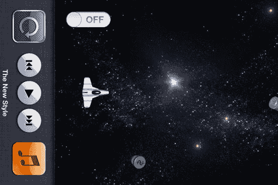

**图 11-1.** 用户从后台菜单播放其他音频

在图 11-1 中，用户已双击 Home 键，正准备点击播放并聆听野兽男孩乐队的歌曲。在这张图中你看不到的是，游戏音频在后台菜单打开时立即停止了，游戏也暂停了。

此外，在用户点击播放并返回游戏后，游戏将恢复，但游戏不再生成任何声音。ON/OFF 开关控制是否在播放野兽男孩乐队歌曲的同时播放非背景音效，但稍后会详细说明。

要了解应用如何响应后台菜单的打开和关闭，请查看代码清单 11-3 中的代码。

**代码清单 11-3.** 来自 `AppDelegate.m` 的 `UIApplicationDelegate` 任务

```
- (void)applicationWillResignActive:(UIApplication *)application {
    [self.viewController applicationWillResignActive];
}
- (void)applicationDidBecomeActive:(UIApplication *)application {
    [self.viewController applicationDidBecomeActive];
}
```

在代码清单 11-3 中，我们看到 `AppDelegate` 类的 `applicationWillResignActive` 和 `applicationDidBecomeActive` 任务。每当应用即将变为非活动状态或刚刚变为活动状态时，都会调用这些方法。我们只需在我们的 `GameController` 上调用一个对应的方法——在此例中，通过 `this.viewController` 引用。代码清单 11-4 展示了我们的 `GameController` 如何响应这些事件。

**代码清单 11-4.** `applicationWillResignActive` 和 `applicationDidBecomeActive` (`GameController.m`)

```
-(void)applicationWillResignActive{
    [self setIsPaused:YES];
    [backgroundPlayer pause];
}
-(void)applicationDidBecomeActive{
    [self setIsPaused:NO];
    [self initializeAudio];
}
```

在代码清单 11-4 中，`applicationWillResignActive` 任务通过调用 `self` 上的 `setIsPaused` 和 `AVAudioPlayer backgroundPlayer` 上的 `pause` 来简单地暂停游戏。当应用再次变为活动状态时，我们恢复游戏，然后调用代码清单 11-2 中的 `initializeAudio`。通过再次调用 `initializeAudio`，我们有机会重新检查其他音频是否正在播放，从而确保我们的游戏尊重用户在声音方面的意愿。

通过遵循上面的简单方法，我们可以确保任何游戏在音频方面都能正确运行。在你的 iPhone 上运行示例应用，并尝试上面概述的一些不同用户场景。插入耳机，按两下 Home 键，调整音量，然后开始播放一个播客。一切应该都按预期工作，并且符合苹果的指导原则。

在下一节中，我们将更详细地查看示例应用，并了解游戏如何使用所有这些音频内容来发出哔哔声和嘟嘟声。

## 游戏中的音频

本章附带的示例应用是一个简单的演示，展示了如何将声音融入游戏中。图 11-2 展示了运行中的示例。

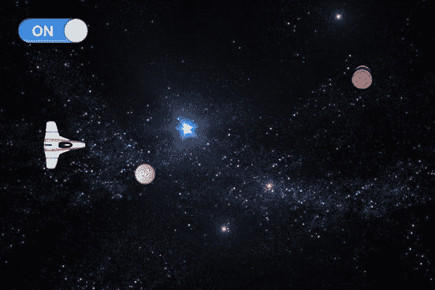

**图 11-2.** 运行中的示例 11

在图 11-2 中，我们在熟悉的太空背景上看到四个元素。我们在屏幕上看到两个能量道具。它们是从屏幕右侧生成并向左移动的。我们还看到左侧有一艘飞船，会被刚好在屏幕中间位置生成的能量道具击中。当一个能量道具与飞船碰撞时，会发出一个声音，指示用户获得了该能量道具。当能量道具移动到大约屏幕一半的位置时，它们还会开始闪烁。每次它们闪烁熄灭时，都会发出一个快速的咔嗒声。当你运行此示例时，你还会听到一个背景音轨，在游戏运行期间持续播放。左上角的开关控制是否应忽略其他音频的播放而听到此类音效（如闪烁声）。


## 排版后内容

显然，我们不会在游戏进行时将这样的开关显示在屏幕上，但它可能是某个设置屏幕上的一个不错选项，可能默认设置为`OFF`。如前所述，除了音效之外，还会播放背景配乐。正如您将在以下章节中看到的，这两种类型的音频以不同的方式处理，以便让开发者的工作更轻松。接下来的章节将逐一讲解这个示例，重点介绍音效的播放方式。

### 设置`GameController`

与本游戏中的许多示例一样，我们首先扩展`GameController`来指定我们游戏特定的功能——即游戏的业务逻辑。清单 11-5 展示了我们如何设置这个示例。

**清单 11-5.** `doSetup` (`ViewController.m`)

```
-(BOOL)doSetup{
    if ([super doSetup]){
        [self setGameAreaSize:CGSizeMake(480, 320)];
        [self setIsPaused: NO];
        
        NSMutableArray* classes = [NSMutableArray new];
        [classes addObject:[Powerup class]];
        [self setSortedActorClasses:classes];
    
        viper = [Viper viper:self];
        [self addActor: viper];
        
        [self prepareAudio: AUDIO_POWERUP_BLINK];
        [self prepareAudio: AUDIO_GOT_POWERUP];
        [self playBackgroundAudio: AUDIO_BC_THEME];
        
        return YES;
    }
    return NO;
}
```

在清单 11-5 中，我们看到了标准的`GameController`设置代码。我们指定了游戏区域的大小，表示我们希望跟踪`Powerup`角色，并创建和添加了一个`Viper`。我们在`doSetup`中最后做的几件事是设置我们想要播放的音频。我们调用`prepareAudio:`，然后传入`NSString`常量`AUDIO_POWERUP_BLINK`和`AUDIO_GOT_POWER`。我们稍后将查看任务`prepareAudio:`。为了完整性，让我们快速看一下清单 11-6 中定义的三个`NSString`常量。

**清单 11-6.** `Sample 11-Prefix.pch`（部分）

```
#define AUDIO_POWERUP_BLINK @"powerup_blink"
#define AUDIO_GOT_POWERUP @"got_powerup"
#define AUDIO_BC_THEME @"bc_theme"
```

在清单 11-6 中，我们看到定义了三个常量。每个常量只是一个字符串，指向项目中包含的音频文件的名称（不包括文件扩展名）。图 11-3 显示了 Xcode 项目中的这些文件。

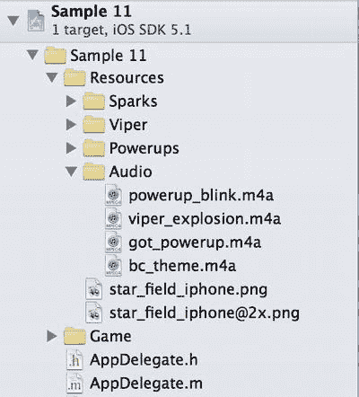

**图 11-3.** 在 Xcode 项目中包含音频

在图 11-3 中，我们看到，要在项目中包含音频，我们只需像添加任何其他资源一样添加文件。另外，请注意它们都是`m4a`文件。iOS 能够播放多种类型的音频文件，但推荐使用 AAC 编码的文件，而这些正是这种文件。在我们的示例中，假定扩展名为`m4a`。[¹]

回顾清单 11-5，我们看到我们将这些常量传递给了两个不同的任务：`prepareAudio:`和`playBackgroundAudio:`。任务`prepareAudio:`准备好一个音频文件，以便当游戏事件需要音效时，音频能够立即播放。任务`playBackgroundAudio:`循环播放单个音轨，为游戏提供背景音乐。让我们从清单 11-7 所示的`prepareAudio:`开始。

**清单 11-7.** `prepareAudio:` (`GameController.m`)

```
-(AVAudioPlayer*)prepareAudio:(NSString*)audioName{
    if (audioNameToPlayer == nil){
        audioNameToPlayer = [NSMutableDictionary new];
    }
    NSURL *url = [NSURL fileURLWithPath:[[NSBundle mainBundle] pathForResource:audioName ofType:@"m4a"]];
    
    AVAudioPlayer* player = [[AVAudioPlayer alloc] initWithContentsOfURL:url error: nil];
    [player prepareToPlay];
    
    [audioNameToPlayer setValue:player forKey: audioName];
    return player;
}
```

在清单 11-7 中，我们看到了任务`prepareAudio:`。此任务负责为传入的每个音频文件创建一个`AVAudioPlayer`。我们首先惰性初始化一个名为`audioNameToPlayer`的`NSMutableDictionary`，它将`NSString audioName`映射到构造后的`AVAudioPlayer`。为了创建一个`NSAudioPlayer`，我们首先创建一个指向项目中所需`m4a`文件的`NSURL`。为了构造`NSAudioPlayer`，我们只需调用`initWithContentsOfURL:error:`，并忽略任何错误。

我们在新创建的`player`上调用`prepareToPlay`，以确保文件已加载并准备好，以便稍后我们对其调用`play`时能够立即发声。

在`doSetup`任务中调用的另一个与声音相关的任务（来自清单 11-5）是`playBackgroundAudio:`，如清单 11-8 所示。

**清单 11-8.** `playBackgroundAudio:` (`GameController.m`)

```
-(void)playBackgroundAudio:(NSString*)audioName{
    if (backgroundPlayer != nil){
        [backgroundPlayer stop];
    }
    backgroundPlayer = [self prepareAudio:audioName];
    [backgroundPlayer setNumberOfLoops:-1];
    
    if (!otherAudioIsPlaying){
        [backgroundPlayer play];
    }
}
```

在清单 11-8 中，任务`playBackgroundAudio:`接受一个音频文件的名称。如果存在现有的`AVAudioPlayer backgroundPlayer`，我们将其停止。接下来，我们调用`prepareAudio:`来构造并初始化一个`AVAudioPlayer`。为了让音频无限期播放，我们调用`setNumberOfLoops:`并指定`-1`。虽然我们希望背景音频连续播放，但我们也可以使用`setNumberOfLoops:`来让音频文件播放固定次数。任务`setNumberOfLoops:`的命名有点奇怪；它表示一个音轨被额外播放的次数。因此，例如，如果您指定了`0`，音频将播放一次（默认次数）。如果您指定了`3`，音频将播放`4`次。基本上，`setNumberOfLoops:`指定了音频应被**额外**播放的次数。

`playBackgroundAudio:`中要做的最后一件事是检查是否没有其他音频在播放，然后通过调用`backgroundPlayer`的`play`来启动音频。

我们已经了解了如何指定我们希望在游戏生命周期中能够播放的音频。我们也了解了如何设置一个无限循环播放的背景音轨，并考虑了其他音频的播放。接下来，我们将看到如何播放由游戏内事件驱动的音效。

### 游戏内事件的音效

至此，我们已经做了大量设置工作，以确保我们的应用程序正确播放音频。我们还做了一些工作，使游戏相关的类能够轻松播放音效。在本节中，我们将查看一些游戏逻辑，并看看如何播放由游戏内事件驱动的音效。

回顾一下，在本章的示例中，我们有一些能量道具在屏幕上移动。当其中一个能量道具与飞船碰撞时，我们会播放一个音效。驱动此行为的逻辑见清单 11-9。

**清单 11-9.** `applyGameLogic` (`ViewController.m`)

```
-(void)applyGameLogic{
    if (self.
```


`stepNumber%120==0){`  
`[self addActor:[Powerup powerup:self]];`  
`}`  
`for (Powerup* powerup in [self actorsOfType: [Powerup class]]){`  
`if ([powerup overlapsWith:viper]){`  
`[self removeActor: powerup];`  
`[self playAudio: AUDIO_GOT_POWERUP];`  
`}`  
`}`  
`}`

在 Listing 11-9 中，我们看到了任务`applyGameLogic`。该任务在每个游戏步骤中被调用一次，为`GameController`的子类提供了指定游戏特定逻辑的位置。在我们的案例中，我们在该任务中有事情要做：创建`Powerup`角色并检查`Powerups`与飞船之间的碰撞。

我们每游戏 120 步（即每 3 秒，120 步以每秒 60 步计，120/60=3）创建一个新的`Powerup`。新创建的`Powerup`通过任务`addActor:`被简单地添加到场景中。驱动`Powerup`创建位置及其移动方式的逻辑将在第 12 章中详细说明。

`applyGameLogic`中的下一步是测试`Powerup`是否与飞船`viper`发生碰撞。我们通过遍历每个`Powerup`并测试其是否与任务`overlapsWith:`碰撞来实现。如果发生碰撞，我们移除该`Powerup`并调用`playAudio:`，传入`NSString AUDIO_GOT_POWER`。

任务`playAudio:`如 Listing 11-10 所示。

**Listing 11-10. `playAudio:` (`GameController`.m)**

```
-(void)playAudio:(NSString*)audioName{
    [self playAudio:audioName volume:1.0 pan:0.0];
}
-(void)playAudio:(NSString*)audioName volume:(float)volume pan:(float)pan{
    if (alwaysPlayAudioEffects || !otherAudioIsPlaying){
        AVAudioPlayer* player = [audioNameToPlayer valueForKey:audioName];
 
        NSArray* params = [NSArray arrayWithObjects:player, [NSNumber numberWithFloat:volume], [NSNumber numberWithFloat:pan], nil];
        [self performSelectorInBackground:@selector(playAudioInBackground:) withObject:params];
    }
}
```

在 Listing 11-10 中，我们看到了任务`playAudio:`，它实际上以一些默认值调用了`playAudio:volume:pan:`。角色或其他游戏元素可以根据需要调用任一版本。在`playAudio:volume:pan:`中，我们可以看到首先检查是否真的应该播放声音。我们通过测试`alwaysPlayAudioEffects`和`otherAudioIsPlaying`来实现。`BOOL alwaysPlayAudioEffects`是`GameController`的一个属性，指示声音效果是否应忽略用户正在播放自己的音频这一事实。在此示例中，`alwaysPlayAudioEffects`的值由游戏屏幕上的开关控制。拨动开关以尝试两种不同的行为。`BOOL otherAudioIsPlaying`在 Listing 11-2 的`initializeAudio`中设置。

如果确定应该播放声音，`playAudio:volume:pan:`继续在`NSMutableDictionary audioNameToPlayer`中查找与`audioName`关联的`AVAudioPlayer`。一旦我们有了`player`，我们将`player`与`volume`和`pan`参数打包到一个名为`params`的`NSArray`中。然后我们调用`performSelectorInBackground:withObject:`，传入选择器`playAudioInBackground:`和`params`。

任务`playAudioInBackground:`与背景音乐无关；*background*一词表示此任务应在后台线程中执行，因此调用`performSelectorInBackground:withObject:`。Listing 11-11 展示了`playAudioInBackground:`的实现。

**Listing 11-11. `playAudioInBackground:` (`GameController`.m)**

```
-(void)playAudioInBackground:(NSArray*)params{
    AVAudioPlayer* player = [params objectAtIndex:0];
 
    NSNumber* volume = [params objectAtIndex:1];
    NSNumber* pan = [params objectAtIndex:2];
 
    [player setCurrentTime:0];
    [player setVolume: [volume floatValue]];
    [player setPan: [pan floatValue]];
 
    [player play];
}
```

在 Listing 11-11 中，任务`playAudioInBackground:`负责实际配置`AVAudioPlayer`并最终调用其`play`方法。如前所述，此任务在后台线程中被调用。这样做是因为它极大地提高了应用程序的性能。如果此任务在游戏运行的同一线程中被调用，你会看到游戏动画出现明显的卡顿。

从`NSArray params`中取出`player`、`volume`和`pan`对象后，我们准备让`player`播放音频。我们将`currentTime`属性设为 0，即曲目开头；我们还设置了要使用的`volume`和`pan`值。`volume`值从静音（0.0）到最大音量（1.0）不等。所谓最大音量，是指基于用户音量设置的最大音量。`pan`值类似于立体声的平衡旋钮。值-1.0 表示完全左声道，值 0.0 表示左右声道平衡，值 1.0 表示完全右声道。（我们在查看`Powerup`的闪烁行为时会用到此功能。）

最后，我们在`player`上调用`play`，这会使 iOS 设备发出声音。请注意，这里我们每种类型的声音只能有一个`AVAudioPlayer`——这意味着给定的`AVAudioPlayer`可能在播放中途被调用重新开始。这是设计上的一个折衷。一方面，我们每种音效只消耗一个`AVAudioPlayer`（及关联的音频文件）的内存。另一方面，在游戏过程中，我们永远不会听到同一声音的两个实例混合在一起。此外，较长的音效会被截断并重播。这种设置对于大多数游戏来说可能已经足够好，但对于高端游戏而言可能不够。

我们可以设想一种设置，每种类型的声音都有一组`AVAudioPlayer`池，而`GameController`负责找出哪个（如果有的话）`AVAudioPlayer`可用于播放给定的音效。然而，我认为这种复杂程度需要大量特定于应用逻辑。例如，每种声音的要求，以及当一个`AVAudioPlayer`不可用时处理规则的准则，在不同游戏和不同声音之间会差异巨大。如果这对你的游戏是必需的功能，我留给读者去扩展`GameController`。让我知道你的成果！你可以发送电子邮件到`lucasjordan@gmail.com`。

## 由角色驱动的音频

在我们的示例中，我们考虑了最简单的播放示例。我们研究了当`Powerup`与飞船碰撞时播放声音的情况；这个音效由`ViewController`调用。本书提出的一个总体设计决策是，角色应尽可能封装逻辑，作为场景中的自由主体随心所欲地行动，这包括播放声音。从技术角度来看，以下示例并无新奇之处，但它将说明声音效果如何由特定角色的状态驱动。让我们探索`Powerup`闪烁时产生的声音；如 Listing 11-12 所示。

**Listing 11-12. `step:` (`Powerup.m`)**

```
-(void)step:(GameController*)gameController{
    if (self.center.x < −self.radius){
        [gameController removeActor:self];
        return;
    }
    if (self.center.x < gameController.gameAreaSize.
```


```  
if ([gameController stepNumber] % 25 == 0){  
    if (self.state == STATE_GLOW){  
        float pan = 1.0 - (self.center.x / gameController.gameAreaSize.width)*2.0;  
        [gameController playAudio: AUDIO_POWERUP_BLINK volume:.1 pan: pan];  
        self.state = STATE_NO_GLOW;  
    } else {  
        self.state = STATE_GLOW;  
    }  
}  
```  

在代码清单 11-12 中，我们看到了`Powerup`类的`step:`任务。该任务在游戏中的每一步都会被调用，是角色可以指定其自身行为的地方。该任务中的第一个测试仅检查`Powerup`是否已移出屏幕左边界，如果是则将其自身移除。第二个测试检查`Powerup`是否应开始闪烁；如果是，则每 25 步在`STATE_GLOW`和`STATE_NO_GLOW`状态之间交替。如果`Powerup`刚切换到`STATE_NO_GLOW`状态，则播放音频`AUDIO_POWERUP_BLINK`。请注意，此音频的`pan`值基于`Powerup`的 *x* 坐标。这会使闪烁声听起来像是来自屏幕的一侧或另一侧。要观察此效果，请戴上耳机运行示例代码。  

## 总结  

在本章中，我们回顾了如何通过正确响应用户的行为和期望，将游戏打造成一个优秀的 iOS 应用程序。我们还研究了`GameController`中的一些框架代码，以便为我们的特定游戏更轻松地播放音频。我们探讨了如何区分背景音乐和音效。最后，我们通过探索一个简单的示例（该示例播放由游戏中不同事件驱动的两种不同音效）来了解如何使用此框架。  

¹关于音频格式和编码，还有更多知识需要了解。以下是一个了解 Apple Core Audio 格式的良好起点：`http://en.wikipedia.org/wiki/Core_Audio_Format`。  

## 第 12 章 — 一个完整的游戏：Belt Commander  

在本书中，我们介绍了许多构建 iOS 游戏的技术。我们在第 3 章中学习了如何为游戏构建基本的应用程序流程。在第 4 章中，我们通过 Coin Sorter 学习了如何构建一个基本的回合制游戏。然后，我们转向逐帧游戏，并在第 5 章中学习了如何构建一个持续运动的游戏。在第 6 章和第 7 章中，我们研究了如何创建不同类型的角色来填充我们的游戏。第 8 章介绍了如何捕获用户输入来操控游戏内元素，而第 9 章则探讨了如何通过 Game Center 和其他社交媒体服务接触我们的玩家。在第 10 章中，我们讨论了如何添加应用内购买，并借助游戏赚取一些收入。在第 11 章中，我们为游戏添加了音效。在本章中，我们将所有这些元素整合到一个功能完整的游戏——Belt Commander 中。标题画面如图 12-1 所示。  

  

图 12-1.  Belt Commander 的标题画面  

在本章中，我们将从宏观层面审视游戏 Belt Commander。我们还将逐步讲解游戏是如何组合在一起的，包括视图的组织方式以及应用程序游戏逻辑的实现方式。我们将讨论游戏中的不同角色及其添加方式。从某些方面来看，本章是对前几章所学技术的回顾。然而，探索这些技术如何融合在一起，将为您构建自己的游戏提供一条路线图。  

事实上，您可以自由地以本章的示例代码作为起点来开发自己的游戏。我本人正有此计划，并打算在 iTunes Store 中发布 Belt Commander 的商业版本。那么，让我们开始吧。  

### Belt Commander：游戏概述  

Belt Commander 是一款动作游戏，在游戏中您需要控制一艘飞船穿越小行星带。摧毁小行星和外星飞碟可为玩家赢得分数。在游戏过程中，偶尔会有强化道具飘入屏幕，为玩家提供恢复部分生命值、获得额外积分或升级武器的机会。这是一款节奏相对较快、交互简单的游戏。让我们看看游戏的初始画面，如图 12-2 所示。  

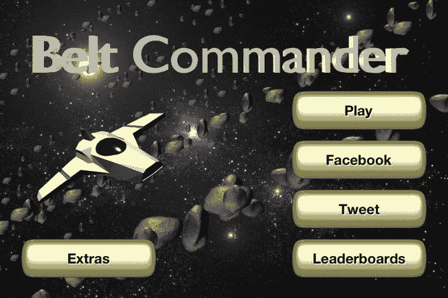  

图 12-2.  Belt Commander 的初始画面  

在图 12-2 中，我们看到了游戏的第一个画面。屏幕顶部有一个标题以及多个按钮。Facebook、Tweet 和排行榜按钮启用了我们在第 9 章中讨论的各种社交功能。附加内容按钮允许用户配置游戏并购买游戏的新部分。购买的处理方式在第 10 章中进行了描述。在本章中，我们假设所有附加内容均已购买。点击“Play”按钮将进入游戏的战斗部分，如图 12-3 所示。  

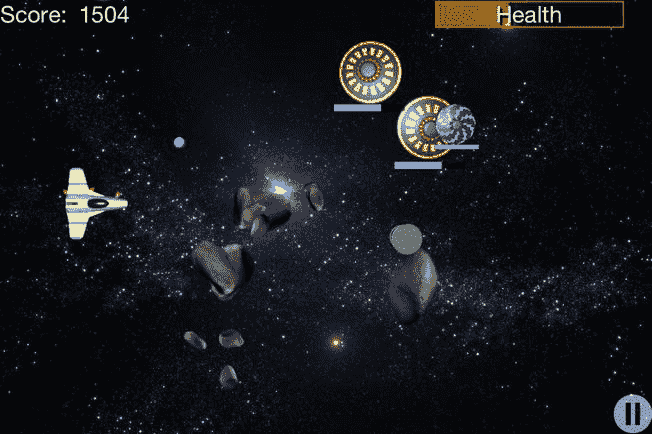  

图 12-3.  Belt Commander 战斗场景  

在图 12-3 中，我们看到了游戏的战斗部分。左侧是玩家控制的飞船。玩家可以点击屏幕，飞船将向上或向下移动到点击的位置。通过这种方式，玩家可以躲避从屏幕右侧向左移动的众多小行星。除了小行星，还有外星飞碟在屏幕上上下移动，向玩家的飞船发射子弹。无论是小行星还是飞碟的子弹，击中飞船都会造成伤害。游戏会持续进行，直到飞船因伤害累积而损毁。为了帮助玩家，强化道具会从右侧出现并向左移动。如果玩家能够截获强化道具，就能获得其提供的奖励：生命值、更高伤害或额外积分。  

在图 12-3 的右下角，我们看到一个暂停按钮 (II)。点击它会暂停游戏，并允许玩家退出或继续游戏，如图 12-4 所示。  

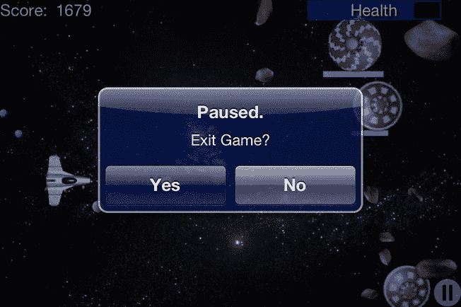  

图 12-4.  Belt Commander 暂停画面  

在图 12-4 中，我们看到了用户点击屏幕右下角触摸按钮时弹出的对话框。该对话框允许用户选择“Yes”退出游戏，或选择“No”继续游戏。如果用户在游戏过程中，因启动其他应用而导致本应用被发送到后台，那么当用户将游戏重新调回前台时，也会显示此对话框。当玩家的飞船生命值归零时，游戏结束。这时会出现图 12-5 所示的对话框。  

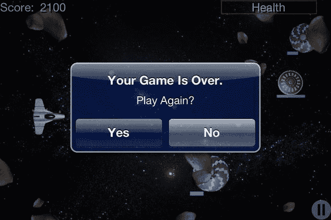  

图 12-5.  游戏结束  

在图 12-5 中，我们看到了游戏结束时弹出的对话框。此对话框允许用户点击“Yes”立即重新开始游戏。如果用户点击“No”，则会返回到游戏的初始画面。整个应用程序的流程如图 12-6 所示。  

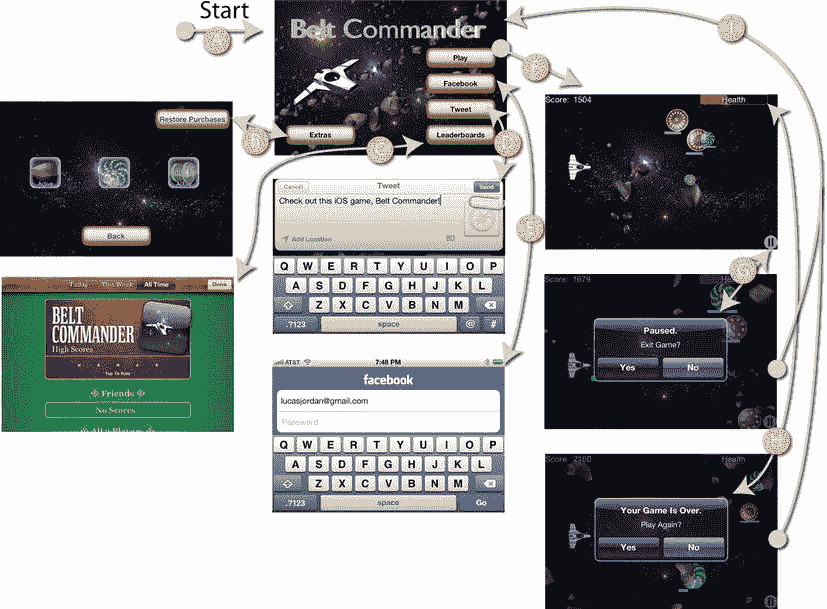


## 图形与视图导航

``  
图 12-6. 应用流程图

在图 12-6 中，我们看到了游戏的八个屏幕。箭头指示了用户如何从一个视图导航到另一个视图。每个过渡都用字母标记，具体描述如下：

- 应用从 A 点开始，即`Start`视图。这是用户首先看到的内容。
- 按下`Extras`按钮后，用户进入`Extras`视图，在此处可以选择游戏中的角色：小行星、飞碟和强化道具。用户通过点击`Back`按钮返回`Start`视图。
- 点击`Leaderboard`按钮会弹出标准的排行榜视图。点击右上角的`Done`按钮返回`Start`视图。
- 点击`Tweet`按钮会弹出 Twitter 对话框。严格来说，这并非一个独立的视图，因为推特对话框是弹出窗口，但它仍占据大部分屏幕。点击`Send`或`Cancel`按钮将用户带回`Start`视图。
- 点击`Facebook`按钮将退出应用，并弹出 Facebook 认证屏幕。用户在输入凭证后，会被带回到`Start`视图。
- 点击`Play`按钮开始游戏。在`Action`视图中，用户进行游戏。玩家上下移动飞船，通过摧毁小行星和飞碟来尽可能多地获取分数。
- 游戏过程中，用户可以点击`Pause`按钮暂停游戏。按下`Pause`按钮后，会弹出一个对话框，询问用户是否退出游戏。如果游戏进行中应用被发送到后台，也会弹出此对话框。
- 当飞船的生命值降至零时，游戏结束。此时会弹出一个对话框，询问用户是否重新开始游戏。
- 如果用户暂停游戏并选择不结束游戏，将被带回`Start`视图。同样，当游戏结束时，如果用户选择不再玩一次，也会被带回主视图。

我们已经了解了构成游戏的各个视图，并对游戏如何在视图间流转有了概念。接下来，让我们看看这种导航是如何实现的，从构成游戏的 XIB 文件开始。

## 实现视图到视图的导航

我们已经介绍了`Belt Commander`中涉及的视图。让我们更详细地了解游戏是如何初始化的，构成游戏的 XIB 文件，以及如何以编程方式处理导航。这些信息将帮助你构建自己的游戏，因为这里运用了多种不同的技术。首先，我们来看看如何启动应用。

### 启动应用

与所有 iOS 应用程序一样，起点是`main.m`文件中的`main`函数。但是，在这个应用中，我们没有对`main`函数进行任何自定义，因此可以跳过描述。该应用真正的起点是 plist 文件`Belt Commander-Info.plist`。图 12-7 显示了 Xcode 对该文件的表示。

``  
图 12-7. Xcode 中的`Belt Commander-Info.plist`

在图 12-7 中，我们看到了 Xcode 呈现的`Belt Commander-Info.plist`文件。在该文件中，我们看到一个相当标准的 iOS 应用程序设置。我们看到 Bundle 标识符为`com.claywaregames.beltcommander`，这与我们在 iTunes Connect 中创建的、支持应用内购买和 Game Center 的应用相对应。该文件与本书中其他示例的一个不同之处在于，我们在该文件中指定了起始 XIB 文件。起始 XIB 文件由键值`Main nib file base name (iPad)`和`Main nib file base name (iPhone)`指示。这些键分别设置为`Window_iPad`和`Window_iPhone`。

通过设置这些值，我们请求 iOS 应用程序自动使用这些文件来创建主`UIWindow`并对其调用`makeKeyAndVisible`。这样，我们就不需要在应用代理的`application:didFinishLaunchingWithOptions:`任务中编写任何代码。为了理解其他对象在应用中如何相互关联，让我们来看一下这个游戏的 XIB 文件。

### XIB 文件

此应用程序中的 XIB 文件将关键类的实例绑定在一起，并允许它们进行协调。虽然此应用是通用应用，可在 iPhone 和 iPad 上运行，但我们将重点介绍 iPhone XIB 文件，因为 iPad 版本仅在布局上有所不同。通过查看此 XIB 文件的内容，我们将了解应用程序是如何组合在一起的。图 12-8 显示了一个概览。

``  
图 12-8. iPhone XIB 文件概览

在图 12-8 中，我们看到了此游戏 iPhone 版本的 XIB 文件的完全展开视图。左侧的 A 项显示了对游戏主`UIWindow`的引用，以及对`AppDelegate`的引用。B 项处的视图控制器是`RootViewController`类的一个实例，它是`UINavigationController`的子类。视图控制器`RootViewController`与窗口连接，作为根控制器；这将导致显示`RootViewController`的顶级`UIViewController`。简而言之，一切已连接好，使得 E 项处的视图在启动时显示。

在图 12-8 中，我们看到还有两个其他`UIViewController`：C 项处的`Extras Controller`和 D 项处的`Belt Commander Controller`。`Extras Controller`对象对应于 G 项处的视图，而`BeltCommanderController`对象也对应于 G 项处的视图。这两个控制器在我们的`RootViewController`类中都有一个`IBOutlet`，以便可以引用它们。事实上，XIB 文件中的许多对象都连接到`RootViewController`，如代码清单 12-1 所示。

**代码清单 12-1.** `RootViewController.m`

```
@interface RootViewController : UINavigationController<BeltCommanderDelegate,  UIAlertViewDelegate, GKLeaderboardViewControllerDelegate>{
    IBOutlet UIViewController* welcomeController;
    IBOutlet BeltCommanderController* beltCommanderController;
    IBOutlet ExtrasController *extrasController;
    IBOutlet UIButton *leaderBoardButton;
     
    IBOutlet UIButton *tweetButton;
    IBOutlet UIButton *facebookButton;
     
    UIAlertView* newGameAlertView;
    UIAlertView* pauseGameAlerTView;
     
    GKLocalPlayer* localPlayer;
     
    ACAccountStore* accountStore;
    ACAccount* facebookAccount;
     
    BOOL isPlaying;
}
-(void)doPause;
-(void)endOfGameCleanup;
 
-(void)initGameCenter;
-(void)initFacebook;
-(void)initTwitter;
 
-(void)notifyGameCenter;
-(void)notifyFacebook;
 
-(BOOL)handleOpenURL:(NSURL *)url;
 
-(void)applicationWillResignActive;
-(void)applicationDidBecomeActive;
@end
```

在代码清单 12-1 中，我们看到了`RootViewController`类的头文件。`RootViewController`类负责管理与实际游戏操作无关的应用状态，包括视图间的转换、处理应用程序启动以及管理第 9 章中的社交服务。正如我们在代码清单 12-1 中看到的，我们有三个`UIViewController`的`IBOutlet`：`welcomeController`、`beltCommanderController`和`extrasController`。

代码清单 12-1


`xhtml#list1`) 还表明，类 `RootViewController` 为两个按钮拥有 `IBOutlet` 属性：`leaderBoardButton` 和 `tweetButton`。需要引用这些对象，因为它们将在运行时被启用或禁用。`GKLocalPlayer` 用于管理 Game Center，而 `ACAccountStore` 和 `ACAccount` 对象则用于管理与 Facebook 的交互。

接下来，我们来看看如何处理视图间的导航。

## 视图导航

为了在用户点击按钮时切换视图，我们在 `RootViewController` 的实现中创建了一系列 `IBAction` 任务，并在 XIB 文件中将它们连接到对应的按钮。列表 12-2 展示了其中两个 `IBAction` 任务。

**列表 12-2.** `RootViewController.m`（`extrasButtonClicked:` 和 `playButtonClicked:`）

```
- (IBAction)extrasButtonClicked:(id)sender {
    [self pushViewController:extrasController animated:YES];
}
- (IBAction)playButtonClicked:(id)sender {
    [self pushViewController:beltCommanderController animated:YES];
    [beltCommanderController doNewGame: [extrasController gameParams]];
}
```

在列表 12-2 中，我们看到了两个负责处理按钮点击的任务。当用户按下“开始”视图上的“附加功能”按钮时，会调用 `extrasButtonClicked:` 任务。该任务简单地使用 `UINavigationController` 定义的 `pushViewController:animated:` 方法，来展示与 `extrasController` 关联的视图。类似地，任务 `playButtonClicked:` 使用相同的方法显示与 `beltCommandController` 关联的视图，并调用 `beltCommanderController` 上的 `doNewGame:` 方法。

列表 12-3 展示了我们如何导航回“开始”视图。

**列表 12-3.** `RootViewController.m`（`backFromExtras:`）

```
- (IBAction)backFromExtras:(id)sender {
    [self popViewControllerAnimated:YES];
}
```

在列表 12-3 中，我们看到当用户在“附加功能”视图上点击“返回”按钮时，会调用任务 `backFromExtras:`。为了导航回“开始”视图，我们调用 `popViewControllerAnimated:` 来移除“附加功能”视图，从而显示“开始”视图。任务 `popViewControllerAnimated:` 由 `UINavigationController` 定义，而 `RootViewController` 是其子类。

处理导航的最后一段代码是响应游戏视图上出现的两个对话框的代码，如列表 12-4 所示。

**列表 12-4.** `RootViewController.m`（`alertView:clickedButtonIndex:`）

```
- (void)alertView:(UIAlertView *)alertView   clickedButtonAtIndex:(NSInteger)buttonIndex{
    if (alertView == pauseGameAlerTView){
        if (buttonIndex == 0) {
            [self endOfGameCleanup];
            [self popViewControllerAnimated:YES];
        } else {
            [beltCommanderController setIsPaused:NO];
        }
    }
    if (alertView == newGameAlertView){
        if (buttonIndex == 0) {
            [beltCommanderController doNewGame: [extrasController gameParams]];
        } else {
            [self popViewControllerAnimated:YES];
        }
    }
}
```

在列表 12-4 中，我们看到了任务 `alertView:clickedButtonAtIndex:`，它由协议 `UIAlertViewDelegate` 定义并由 `RootViewController` 实现。在该任务中，我们首先检查点击的是哪个 `UIAlertView`。

如果 `alertView` 等于 `pauseGameAlertView`，那么我们知道用户点击了游戏视图上的“暂停”按钮，并正在对呈现的对话框做出响应。如果用户点击了对话框上的“是”（`buttonIndex == 0`），则用户想要退出当前游戏。我们调用 `endOfGameCleanup` 和 `popViewControllerAnimated:`；后者当然会将我们带回“开始”视图。

任务 `endOfGameCleanup` 负责向社交媒体服务报告信息，我们稍后会查看它。如果用户点击了“否”，我们只需通过调用 `setIsPaused:` 并传入 `NO` 来取消暂停游戏，该调用作用于 `beltCommanderController`。

在列表 12-4 中，有两个可能的 `UIAlertView` 可能导致调用 `alertView:clickedButtonAtIndex:`。我们查看了 `UIAlertView pauseGameAlertView` 的情况；另一种可能是 `newGameAlertView`。这个 `UIAlertView` 在游戏结束时显示，即当用户的飞船耗尽所有生命值时。该对话框允许用户简单地开始新游戏或返回“开始”视图。可以看到，开始新游戏只需调用 `beltCommanderController` 上的 `doNewGame:` 即可。要返回“开始”视图，我们使用现已熟悉的任务 `popViewControllerAnimated:`。

负责显示两种不同 `UIAlertView` 的代码非常相似；我们只看其中一个来理解它。在游戏结束时显示 `UIAlertView` 的代码如列表 12-5 所示。

**列表 12-5.** `RootViewController.m`（`gameOver:`）

```
-(void)gameOver:(BeltCommanderController*)aBeltCommanderController{
    if (newGameAlertView == nil){
        newGameAlertView = [[UIAlertView alloc] initWithTitle:@"Your Game Is
        Over." message:@"Play Again?" delegate:self cancelButtonTitle:@"Yes"
        otherButtonTitles:@"No", nil];
    }
    [newGameAlertView show];
       
    [self endOfGameCleanup];
}
```

在列表 12-5 中，我们看到了由 `RootViewController` 实现的任务 `gameOver:`。任务 `gameOver:` 由协议 `BeltCommanderDelegate` 定义，该委托协议用于在游戏启动或停止时在 `RootViewController` 和 `BeltCommanderController` 之间进行通信。也就是说，`RootViewController` 是 `beltCommanderView` 的委托。这种关系在 XIB 文件中定义。在这个例子中，我们查看的是游戏结束时调用的代码。在此任务中，我们懒加载创建 `UIAlertView newGameAlertView`，指定要显示的文本，并将 `self` 用作委托。要显示 `UIAlertView`，我们调用 `show`，从而在用户屏幕上弹出视图。我们做的最后一件事是调用 `endOfGameCleanup`，如列表 12-6 所示。

**列表 12-6.** `RootViewController.m`（`endOfGameCleanup`）

```
-(void)endOfGameCleanup{
    isPlaying = NO;
    [self notifyGameCenter];
    [self notifyFacebook];
}
```

在列表 12-6 中，我们看到了任务 `endOfGameCleanup`，它在游戏结束时被调用，无论是由于用户飞船耗尽所有生命值，还是用户通过暂停对话框退出当前游戏。在此任务中，我们通过将 `isPlaying` 设置为 `NO` 来记录我们不再进行游戏。任务 `notifyGameCenter` 和 `notifyFacebook` 将用户的分数通知给这两个服务，这将在第 9 章中描述。

我们已经通过检查 XIB 文件、理解应用程序的流程以及我们如何实现它，了解了应用程序是如何组织的。接下来，我们想看看游戏本身，并理解 `BeltCommanderController` 类以及 `Actor` 子类是如何创建游戏的。

## 实现游戏

我们已经大致了解了应用程序是如何组合在一起的。我们知道视图如何出现在屏幕上，并了解了应用程序的生命周期。在本节中，我们将重点关注游戏机制。我们将看看如何让角色进入游戏，它们如何行动，以及它们如何交互。

首先，我们将回顾本书中创建的用于构建简单游戏框架的类。


### 游戏类

接下来我们将探索 `BeltCommanderController` 类，了解它如何管理游戏。最后，我们将逐一查看每个 `actor`，理解其实现如何使其按预期方式工作。

### 游戏类

在前面的章节中，我们构建了一系列用于实现游戏的类。我们有一个 `GameController` 类，负责在游戏中添加和移除 actors，以及将它们渲染到屏幕上。我们还有一个 `Actor` 类，代表游戏中的角色和交互元素。`Actor` 的子类需要指定一个 `Representation`、一组 `Behaviors` 以及一些自定义代码。以下是对这些类的回顾。

`GameController` 类是游戏的核心；该类的子类只需添加 `Actors`，动画就会自动开始运行。为了自定义 `GameController`，子类应实现 `applyGameLogic` 任务，以执行任何特定于游戏的逻辑，例如添加或移除 `Actors`、检查胜利或失败条件，或任何其他特定于某款游戏的独特功能。

除了更新 `Actors` 和游戏逻辑外，`GameController` 还负责将 `Actors` 渲染到屏幕上。`GameController` 通过两种方式完成此操作。首先，`GameController` 继承自 `UIControllerView`，因此它有一个名为 `view` 的主 `UIView`，可以作为应用场景的一部分。其次，`GameController` 有一个名为 `actorsView` 的 `UIView`，它是游戏中所有代表 actors 的 `UIViews` 的父视图。通过在 XIB 文件中指定 `view` 和 `actorsView`，`GameController` 的实例可以绘制到屏幕上。`GameController` 负责渲染游戏的第二种方式是与每个 `Actor` 的 `Representation` 协作，创建一个 `UIView` 作为子视图添加到 `actorsView` 中。在每个动画步骤中，`GameController` 会改变每个 Actor 的 `UIView` 的位置、缩放和透明度。`GameController` 的关键任务如下：

- `doSetup`。在 `doSetup` 任务中，`GameController` 的子类应通过调用 `setSortedActorClasses:` 来指定需要保持排序的 `Actor` 子类。此外，应通过调用 `prepareAudio:` 来准备任何要播放的音频文件。
- `applyGameLogic`。`applyGameLogic` 任务在每个动画步骤中被调用一次。子类应在此任务中实现所有游戏逻辑，包括：
    - 设置游戏结束条件
    - 添加和移除 Actors
    - 计分
    - 追踪成就
    - 更新抬头显示器 (HUD)
    - 管理用户输入（触摸、手势等）
- `actorsOfType:`。`actorsOfType:` 任务在 `applyGameLogic` 内部使用，用于查找特定类别的所有 `Actors`。所请求的 actor 类型需要在 `doSetup` 期间通过 `setSortedActorClasses:` 任务指定。
- `addActor:`/`removeActor:`。`addActor:` 和 `removeActor:` 任务用于在游戏中添加和移除 actors。这些任务会收集在一个动画步骤中添加或移除的所有 `Actors`，然后在动画循环结束时一次性应用这些更改。这防止了对保存 actors 的集合进行修改，因此任何 `Actor` 或 `GameController` 的子类都可以在其应用任务期间添加或移除任何 `Actor`。

### Actor

`Actor` 类代表游戏中任何动态的元素。在我们的示例中，飞船、小行星、飞碟、能量道具、血条、粒子效果和子弹都是 actors。在创建游戏时，`GameController` 的子类会处理游戏的宏观细节，但提供游戏中每个物品独特且有趣行为的，是 `Actor` 的子类。实践中，游戏中的每个 `Actor` 都由其属性、绘制方式（`Representation`）、行为方式（`Behaviors`）以及在子类中定义的自定义代码组合而成。在查看类 `Actor` 之后，我们将研究 `Representations` 和 `Behaviors`。

以下是 `Actor` 的属性列表及其含义。

- `long actorId`：`actorId` 是分配给每个 `Actor` 的唯一数字。此值可用于提供对游戏中 `Actors` 的软引用。
- `BOOL added`/`removed`：`added` 和 `removed` 属性可用于测试一个 `Actor` 是否已成功添加到游戏或从游戏中移除。
- `CGPoint center`：`center` 属性定义了 `Actor` 中心点在游戏坐标中的位置。
- `float rotation`：`rotation` 属性表示 `Actor` 以弧度为单位的旋转角度。
- `float radius`：`Actor` 的 `radius` 描述了它的大小。`center` 和 `radius` 共同描述了 `Actor` 在游戏中所占的区域。
- `NSMutableArray* behaviors`：`behaviors` 属性是一组 `Behavior` 对象。一个 `Behavior` 对象描述了 `Actor` 的某种特性。它可能描述其移动方式或何时从游戏中移除。`behaviors` 数组中的每个 `Behavior` 将在游戏的每一步应用于该 `Actor`。
- `BOOL needsViewUpdated`：在游戏的一个步骤中，`Actor` 可能会经历需要更新其 `UIView` 的变化。这些变化可能包括推进其表示的图像或状态改变。此标志通知 `GameController` 需要执行工作以使 `Actor` 与其表示同步。
- `NSObject<Representation> representation`：游戏中的每个 `Actor` 都需要一个符合 `Representation` 协议的对象来描述如何创建一个 `UIView` 来在游戏中表示它。`Representations` 将在下一节讨论。
- `int variant`：游戏中经常出现仅略有差异的 `Actors`。它们可能颜色不同或行为稍有不同。由于这是一种常见需求，`variant` 属性提供了一种区分同一类 `Actors` 的简单方法。
- `int state`：`state` 属性用于描述 `Actor` 的状态。此状态可以是任何内容，由子类来确切定义其含义。`state` 和 `variant` 属性与 `ImageRepresentation` 类协同工作，以确定应为 `Actor` 使用哪个图像。
- `float alpha`：`alpha` 属性描述了 `Actor` 的不透明度。`alpha` 值为 0.0 的 `Actor` 是完全透明的，而 `alpha` 值为 1.0 则完全不透明。`Actor` 表示中的透明区域不受影响。
- `BOOL animationPaused`：`animationPaused` 属性用于暂停应用于 `Actor` 的任何动画。动画的实现需要遵守此值。如果此属性为 true，`ImageRepresentation` 将不会更新用于表示 `Actor` 的图像序列中的图像。

除了定义 `Actor` 的属性外，`Actor` 类还附带了一些任务。如下所示：

- `-(id)initAt:(CGPoint)aPoint WithRadius:(float)aRadius AndRepresentation:(NSObject<Representation>*)aRepresentation`：此任务是 `Actor` 类的指定构造器。它要求每个 `Actor` 都有一个中心点、一个半径和一个表示。所有 `Actor` 的子类应确保在创建 `Actor` 时调用了此任务。
- `-(void)step:(GameController*)controller`：`step:` 任务由 `GameController` 在每个游戏步骤调用一次。`Actor` 的子类可以在其对此任务的实现中提供自定义逻辑。
- `-(BOOL)overlapsWith:(Actor*)actor`：`overlapsWith:` 任务用于测试一个 `Actor` 是否与另一个 `Actor` 占据相同空间。这可用于实现简单的碰撞检测。
- `-(void)addBehavior:(NSObject<Behavior>*)behavior`：`addBehavior:` 是一个实用方法，用于在单一步骤中向 `Actor` 添加 `Behaviors`。

### Representation

每个 `Actor` 都必须描述 `GameController` 应如何渲染它。


`Representation`协议（定义在`Actor.h`中）描述了`GameController`如何为每个`Actor`获取并更新`UIView`。`Representation`有两个具体实现：`ImageRepresentation`和`VectorRepresentation`。`ImageRepresentation`类使用`UIImages`和`UIImageViews`来创建适合呈现`Actor`的`UIView`。`VectorRepresentation`类使用 Core Graphics 动态绘制`Actor`。`ImageRepresentation`的细节将在第 6 章中介绍，而`VectorRepresentation`的实现则会在第 7 章中说明。

该协议定义了两个任务：
- `-(UIView*)getViewForActor:(Actor*)anActor In:(GameController*)aController`：此任务在`Actor`被添加到`GameController`后不久被调用一次。它负责创建并返回一个适合渲染该`Actor`的`UIView`。
- `-(void)updateView:(UIView*)aView ForActor:(Actor*)anActor In:(GameController*)aController`：此任务在`Actor`的`needsViewUpdated`属性为`true`时被调用。此任务应对`UIView`进行必要的更改，使其准确表示该`Actor`。

**行为**

在创建游戏时，许多不同的`Actor`将需要非常相似的代码来实现。虽然构建一个为每个类提供恰当代码的类层次结构是可行的，但我认为这很繁琐。一种解决方案是`Behavior`协议及其实现类。`Behavior`协议的每个实例负责为`Actor`应用一些逻辑，每一步一次。`Behavior`协议定义了一个单一任务：
- `-(void)applyToActor:(Actor*)anActor In:(GameController*)gameController;`
`applyToActor:In:`任务由符合此协议的类实现，为它们所附加的`Actor`提供某种行为。

Belt Commander 游戏中包含了几个`Behavior`的实现，它们是：
- `LinearMotion`：`LinearMotion`类用于在游戏期间沿直线移动`Actor`。该类提供了几个实用构造器，以便基于方向或目标点轻松定义运动。
- `ExpireAfterTime`：`ExpireAfterTime`类用于在经过给定步数后移除`Actor`。这对粒子效果很方便，你可以创建它们，将其添加到场景中，然后不再管理它们。
- `FollowActor`：此类用于使一个`Actor`与另一个`Actor`保持固定距离。它被附加到 Saucer 上的 HealthBar 使用，以保持它们在一起。

现在我们已经回顾了用于创建 Belt Commander 游戏的核心类，是时候看看我们刚刚描述的类的子类了，以了解如何扩展和定制它们来创建 Belt Commander 游戏。

**理解 BeltCommanderController**

在前面的章节中，我们扩展了`GameController`类来制作示例。为了创建一个完整的游戏，我们将通过创建`BeltCommanderController`类来做同样的事情。`BeltCommanderController`类负责管理游戏中的`Actor`、确定结束条件、更新生命值和分数，以及解释来自用户的输入。让我们再次审视游戏中的动作，回顾游戏是如何进行的以及玩家面临哪些挑战。游戏的截图如图 12-9 所示。

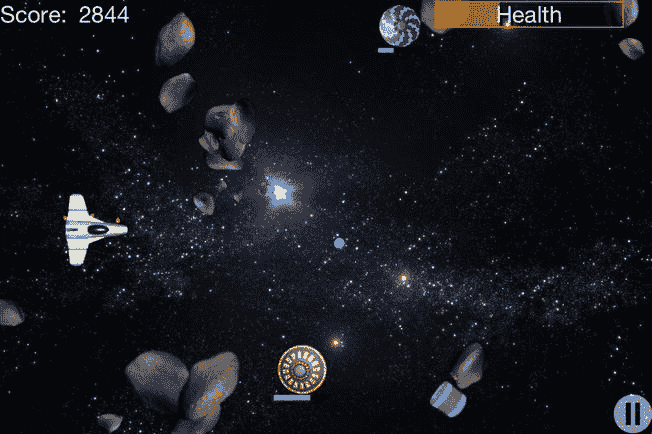

**图 12-9**  Belt Commander，游戏中期

在图 12-9 中，我们看到 Belt Commander 游戏。玩家通过点击屏幕来控制左侧的飞船。飞船将移动到与点击相同的高度。

飞船持续向右发射子弹，由背景中亮星右下方稍处的圆圈表示。从右侧，向左移动，是无尽的波次的小行星。如果子弹与小行星相撞，小行星会碎成更小的碎片，并且分数增加。如果小行星与飞船相撞，小行星会被摧毁，但飞船的生命值会减少。为了给游戏增加一点混乱，飞碟出现在游戏右侧并上下移动，向飞船发射子弹。子弹会摧毁小行星，但主要目的是击中飞船并减少其生命值。为了帮助我们可怜的飞船，三种类型的能量道具从右侧出现并向左移动。如果飞船幸运地处于能量道具的路径上，它就会获得增益。这些增益包括增加生命值、更强大的子弹和额外分数。游戏持续进行，直到飞船生命值降为零。

现在我们已经了解了游戏如何进行的概况，我们将查看`BeltCommanderController`类，首先考察新游戏是如何设置的，然后查看每步游戏运行的代码。

**BeltCommanderController：开始**

要了解这个游戏是如何实现的，我们需要了解`BeltCommanderController`是如何被设置来玩游戏的。以下部分概述了启动并运行游戏所需的初始代码。让我们从`BeltCommanderController`类的头文件开始，如清单 12-7 所示。

**清单 12-7.** `BeltCommanderController.h`

```
@class BeltCommanderDelegate, BeltCommanderController;

@protocol BeltCommanderDelegate
@required
-(void)gameStarted:(BeltCommanderController*)aBeltCommanderController;
-(void)gameOver:(BeltCommanderController*)aBeltCommanderController;
@end

@interface BeltCommanderController : GameController{
    IBOutlet HealthBarView* healthBarView;
    IBOutlet UILabel* scoreLabel;
    
    GameParameters* gameParameters;
    Viper* viper;
    
    //achievement tracking
    int asteroids_destroyed;
}
@property (nonatomic, retain) IBOutlet NSObject<BeltCommanderDelegate>* delegate;
-(void)doNewGame:(GameParameters*)aGameParameters;
-(void)tapGesture:(UITapGestureRecognizer*)tapRecognizer;

-(void)doEndGame;
-(void)doAddNewTrouble;
-(void)doCollisionDetection;
-(void)doUpdateHUD;
-(void)checkAchievements;

-(Viper*)viper;
@end
```

在清单 12-7 中，我们看到了`BeltCommanderController`类的头文件。正如预期的那样，该类扩展了`GameController`。它还定义了一个名为`BeltCommanderDelegate`的协议。该协议由`RootViewController`实现，用于传递游戏状态。该类关联了两个`IBOutlet`。第一个是`HealthBarView`，它是负责在屏幕右上角渲染生命值条的`UIView`子类。第二个是`scoreLabel`，用于在游戏进行时显示玩家的分数。

在清单 12-7 中，我们看到有一个`GameParameters`对象，名为`gameParameters`。此对象用于确定游戏中应包含哪些类型的`Actor`。其想法是游戏免费，玩家可以购买不同类型的`Actor`，使其更有趣（也更有利可图）。此类应用内购买在第 10 章中讨论。在本章中，我们假设所有应用内购买均已进行。

`Viper`对象用于保留对游戏中飞船的引用。由于我们希望方便地访问此对象，因此仅保留指向它的指针是有意义的，而不是在其他`Actor`中搜索它。最后一个字段名为`asteroids_destroyed`，用于追踪成就，如第 9 章所述。


## `BeltCommanderController` 设置与游戏逻辑

与`BeltCommanderController`类相关的任务有很多。目前我们只需要关注`doNewGame:`和`tapGesture:`这两个；其他任务我们将在逐步实现的过程中介绍。`doNewGame:`任务由`RootViewController`调用以开始新游戏——我们稍后会查看其实现。`tapGesture:`任务在`UITapGestureRecognizer`检测到屏幕点击时被调用；我们稍后也会看到这一点。关于手势工作原理的更多内容，请参阅第 8 章。让我们先聚焦于设置。

### 理解设置过程

要让`BeltCommanderController`完成设置，我们需要执行几个步骤。既然我们知道`BeltCommanderController`继承自`GameController`，那么它应该实现一个`doSetup`任务，如代码清单 12-8 所示。

**代码清单 12-8.** `BeltCommanderController.m` (`doSetup`)

```
-(BOOL)doSetup{
    if ([super doSetup]){
        [self setGameAreaSize:CGSizeMake(480, 320)];
        [self setIsPaused:YES];
        
        NSMutableArray* classes = [NSMutableArray new];
        [classes addObject:[Saucer class]];
        [classes addObject:[Bullet class]];
        [classes addObject:[Asteroid class]];
        [classes addObject:[Powerup class]];
        [self setSortedActorClasses:classes];
        
        UITapGestureRecognizer* tapRecognizer = [[UITapGestureRecognizer alloc] initWithTarget:self action:@selector(tapGesture:)];
        
        [self prepareAudio: AUDIO_BLIP];
        [self prepareAudio: AUDIO_GOT_POWERUP];
        [self prepareAudio: AUDIO_VIPER_EXPLOSION];
        [self playBackgroundAudio: AUDIO_BC_THEME];
    
        [actorsView addGestureRecognizer:tapRecognizer];
        return YES;
    }
    return NO;
}
```

在代码清单 12-8 中，我们看到了`BeltCommanderController`类定义的`doSetup`任务。在此任务中，我们将游戏尺寸定义为 480x320，这恰好是 iPhone 屏幕的原始点（point）尺寸。同时，我们将`isPaused`属性设置为`YES`，因此在后续`doNewGame:`被调用之前，不会有任何动画运行。下一步是指定我们希望随着游戏进程方便访问的`Actors`（角色）类。在此例中，我们指定了`Saucer`、`Bullet`、`Asteroid`和`Powerup`这些类。请记住，游戏中只有一个`Viper`，并且我们在头文件中已经有了对它的引用。我们做的最后一件事是创建一个`UITapGestureRecognizer`并将其添加到`actorsView`中。这样，当用户点击屏幕时，`tapGesture:`任务就会被调用。在此之前，我们需要了解新游戏是如何创建的。

### 新游戏

无论我们运行的是第一局游戏还是第一百局，它们都是从`doNewGame:`任务开始的，如代码清单 12-9 所示。

**代码清单 12-9.** `BeltCommanderController.m` (`doNewGame:`)

```
-(void)doNewGame:(GameParameters*)aGameParameters{
    gameParameters = aGameParameters;
    
    [self removeAllActors];
    
    [self setScore:0];
    [self setStepNumber:0];
    [self setScoreChangedOnStep:0];
    
    viper = [Viper viper:self];
    [self addActor:viper];
    
    asteroids_destroyed = 0;
    
    [self setIsPaused:NO];
    [delegate gameStarted:self];
}
```

在代码清单 12-9 中，我们看到了`doNewGame:`任务，它由`RootViewController`调用来开始新游戏。在此任务中，我们设置了`gameParameters`以供后续引用。然后我们必须重置此对象，使其为新游戏做好准备。为了移除所有`Actors`，我们调用`removeAllActors`。我们还需要重置分数、步骤数以及已摧毁的小行星数量。我们还创建了一个`Viper`对象并将其存储在变量`viper`中。

重置完成后，我们将`isPaused`设置为`NO`，并通知`delegate`游戏已开始。让我们来看看我们如何处理输入，然后我们就准备好进行设置之外的工作了。

### 处理输入

一旦`isPaused`被设置为`NO`，游戏就启动并运行了。此时，游戏中唯一的`actor`就是`Viper`。让我们花点时间来理解我们是如何截获输入，让`Viper`在小行星和外星人出现之前移动的。`tapGesture:`任务如代码清单 12-10 所示。

**代码清单 12-10.** `BeltCommanderController.m` (`tapGesture:`)

```
-(void)tapGesture:(UITapGestureRecognizer*)tapRecognizer{
    if (![self isPaused]){
        
        CGSize gameSize = [self gameAreaSize];
        CGSize viewSize = [actorsView frame].size;
        float xRatio = gameSize.width/viewSize.width;
        float yRatio = gameSize.height/viewSize.height;
        
        CGPoint locationInView = [tapRecognizer locationInView:actorsView];
        CGPoint pointInGame = CGPointMake(locationInView.x*xRatio, locationInView.y*yRatio);
        [viper setMoveToPoint: pointInGame within:self];
    }
}
```

在代码清单 12-10 中，我们看到了`tapGesture:`任务，它在用户点击屏幕时被调用。在此任务中，检查是否处于暂停状态后，我们必须将触摸点转换为游戏坐标。在 iPhone 上，这不是严格必需的，因为`actorsView`视图的宽度和高度（点）与游戏尺寸相同。然而，当我们在 iPad 上玩这个游戏时，`actorsView`的尺寸是 1024x682，而我们的游戏仍然是 640x480。为了从一个坐标空间转换到另一个坐标空间，我们将游戏宽度除以`actorsView`的宽度，然后乘以触摸点的*X*位置。我们对高度和*Y*值重复此过程。一旦我们计算出点的位置，我们在`Viper`上调用`setMoveToPoint:within:`，这会使它开始移动。我们将在下一节仔细研究`Viper`类时，查看`setMoveToPoint:within:`的实现。

我们已经介绍了所有关于设置`BeltCommanderController`来运行游戏所需了解的内容。一切就绪，可以开始处理用户输入并向场景中添加新的`Actors`了。下一节将描述`BeltCommanderController`如何检查结束条件、添加`Actors`以及执行其他适用于`BeltCommanderController`类的任务。

### `BeltCommanderController`，一步一步来

我们已经设置好了`BeltCommanderController`类，准备运行游戏。我们将查看每一步执行的代码，以管理游戏的整体状态。我们将了解如何测试结束条件、如何向场景中添加新的`Actors`，以及如何管理`Actors`之间的交互。由于`BeltCommanderController`是`GameController`的子类，我们从`applyGameLogic`任务中的游戏逻辑开始，如代码清单 12-11 所示。

**代码清单 12-11.** `BeltCommanderController.m` (`applyGameLogic`)

```
-(void)applyGameLogic{
    if ([viper health] <= 0.0f){
      [self playAudio:AUDIO_VIPER_EXPLOSION];
        [self doEndGame];
    } else {
        
        [self doAddNewTrouble];
        [self doCollisionDetection];
        [self doUpdateHUD];
        
        if ([self stepNumber]%30 == 0){
            [self checkAchievements];
        }
    }
}
```

在代码清单 12-11 中，我们看到了`applyGameLogic`任务，它在游戏的每一步都被调用一次。我们做的第一件事是检查`Viper`的生命值是否低于 0.0。如果低于 0.0，我们就播放爆炸音效并结束游戏——就这么简单。如果`Viper`仍然存活，我们继续调用`doAddNewTrouble`、`doCollisionDetection`和`doUpdateHUD`。


对`checkAchievements`的调用每 30 步只执行一次。这是出于性能考虑——我们并不希望每一步都进行这些额外的调用。这确实有一个缺点：玩家可能达成了成就，但未能被记录。对于更复杂的游戏，我们会指定哪些成就应该在何时进行测试。

我们刚刚列举了大量任务，接下来将逐一处理，从`doEndGame`任务开始，如清单 12-12 所示。

**清单 12-12.** `BeltCommanderController.m` (`doEndGame`)

```
-(void)doEndGame{
    [self setIsPaused:YES];
    [delegate gameOver:self];
}
```

在清单 12-12 中，我们看到了非常简单的`doEndGame`任务，它只是暂停游戏并调用委托对象的`gameOver:`方法。`gameOver:`任务由`RootViewController`实现，可以在清单 12-5 中看到。接下来，让我们回顾一下`Actor`是如何添加到游戏中的。

#### 添加 Actor

根据经验，我们知道`Actor`是通过调用`addActor:`方法添加的。然而，要制作一个游戏，我们必须包含一些逻辑来规定何时以及如何添加`Actor`。让我们继续，看看在`doAddNewTrouble`任务中如何向游戏添加新的`Actor`，如清单 12-13 所示。

**清单 12-13.** `BeltCommanderController.m` (`doAddNewTrouble`)

```
-(void)doAddNewTrouble{
    if ([gameParameters includeAsteroids] && arc4random() % (5*60) == 0){
        if ([[self actorsOfType:[Asteroid class]] count] < 20){
            [self addActor:[Asteroid asteroid:self]];
        }
    }
    if ([gameParameters includeSaucers] && arc4random() % (10*60) == 0){
        if ([[self actorsOfType:[Saucer class]] count] < 3){
            [self addActor:[Saucer saucer:self]];
        }
    }
    if ([gameParameters includePowerups] && arc4random() % (20*60) == 0){
        [self addActor:[Powerup powerup:self]];
    }
}
```

在清单 12-13 中，我们看到了负责向游戏添加新`Actor`的`doAddNewTrouble`任务。对于可能添加的三种`Actor`类型中的每一种，我们首先检查`gameParameters`是否指示应该添加该类型。如果`gameParameters`指示应添加特定类型的`Actor`，我们会进行随机检查来确定是否真的添加它。例如，`Asteroid`被添加的概率是 1/300。为了添加每个`Actor`，我们创建它并调用`addActor:`方法。`Actor`的构造方法负责处理每个`Actor`如何以及在哪里创建的细节。接下来，我们将研究`Actor`如何相互交互。

#### 碰撞检测

现在我们已经知道每个`Actor`是如何添加到场景中的。接下来让我们看看它们是如何交互的。如果我们考虑这个游戏中的五个主要`Actor`，有几种交互必须被考虑，如下所示：

*   `Bullet`和`Asteroid`
*   `Asteroid`和`Viper`
*   `Bullet`和`Viper`
*   `Bullet`和`Saucer`
*   `Powerup`和`Viper`

这些交互在`doCollisionDetection`任务中处理，其第一部分如清单 12-14 所示。

**清单 12-14.** `BeltCommanderController.m` (`doCollisionDetection`, 第一部分)

```
-(void)doCollisionDetection{
    NSSet* bullets = [self actorsOfType:[Bullet class]];
    NSSet* asteroids = [self actorsOfType:[Asteroid class]];
    NSSet* saucers = [self actorsOfType:[Saucer class]];
    NSSet* powerups = [self actorsOfType:[Powerup class]];
    
    for (Asteroid* asteroid in asteroids){
        for (Bullet* bullet in bullets){
            if ([bullet overlapsWith:asteroid]){
                [bullet decrementDamage: self];
                
                asteroids_destroyed++;
                [asteroid doHit:self];
                [self incrementScore: [asteroid level]*10];
                break;
            }
        }
        if ([asteroid overlapsWith:viper]){
            [viper decrementHealth: [asteroid level]*2];
            
            Shield* shield = [Shield shieldProtecting:viper From: asteroid];
            [self addActor:shield];
            
            asteroids_destroyed++;
            [asteroid doHit:self];
        }
    }
```

在清单 12-14 中，我们看到了`doCollisionDetection`任务的第一部分，这里处理了与 Asteroid 相关的交互。在这个任务中，我们首先要做的第一件事是获取我们将要交互的所有不同`Actor`的引用。一旦我们拥有了所有`Asteroid`、`Bullet`和`Viper`的引用，我们就可以开始测试是否有碰撞发生。在清单 12-14 的最外层循环中，我们首先测试每个`Asteroid`是否与每个`Bullet`重叠。如果发生重叠，就让`Bullet`减少`Asteroid`的伤害值，这通常会将`Asteroid`从游戏中移除，但稍后会详细介绍。在调用`Asteroid`的`doHit:`方法之前，我们还会记录已摧毁了另一个 Asteroid。最后，我们增加分数。

在清单 12-14 中，在考虑了每个`Asteroid`和`Bullet`之间的关系之后，我们检查`Asteroid`是否与`Viper`重叠。如果重叠，则减少`Viper`的生命值并向场景中添加一个`Shield`。`Shield`是一个仅用于装饰的`Actor`，除此之外没有游戏功能；它的外观像是飞船升起了一个护盾。

让我们看看`doCollisionDetection`任务的其余部分，并了解其余 Actor 间的关系是如何处理的。该任务在清单 12-15 中继续。

**清单 12-15.** `BeltCommanderController.m` (`doCollisionDetection`, 第二部分)

```
    for (Bullet* bullet in bullets){
        if ([[bullet source] isKindOfClass:[Saucer class]]){
            if ([viper overlapsWith: bullet]){
                [viper decrementHealth: [bullet damage]];
                
                Shield* shield = [Shield shieldProtecting:viper From: bullet];
                [self addActor:shield];
                
                [self removeActor:bullet];
                break;
            }
        } else {
            for (Saucer* saucer in saucers){
                if ([saucer overlapsWith: bullet]){
                    [saucer decrementHealth:[bullet damage]];
                    Shield* shield = [Shield shieldProtecting:saucer From:bullet];
                    [self addActor:shield];
                    [self removeActor:bullet];
                    break;
                }
            }
        }
    }
    
    for (Powerup* powerup in powerups){
        if ([powerup overlapsWith:viper]){
            [self playAudio:AUDIO_GOT_POWERUP];
            [powerup doHitOn:viper in:self];
        }
    }
}
```

在清单 12-15 中，我们继续查看`doCollisionDetection`任务。在遍历所有`Bullet`时，我们首先考虑`Bullet`和`Viper`之间的交互。我们通过检查`Bullet`的`source`属性来实现这一点。


# 排版后内容

如果`source`是`Saucer`，那么`Bullet`原本是针对`Viper`的，不能伤害`Saucer`。如果`Bullet`与`Viper`重叠，则减少`Viper`的生命值，添加`Shield`，并将`Bullet`从游戏中移除。如果`Bullet`不是由`Saucer`发射的，那它一定来自`Viper`。因此我们检查`Bullet`是否与任何`Saucer`重叠。如果重叠，则减少`Saucer`的生命值，为`Saucer`添加`Shield`，并移除`Bullet`。

在`doCollisionDetection`中，最后一个需要考虑的关系是`Powerups`与`Viper`之间的关系。我们遍历游戏中所有的`Powerups`，检查它们是否与`Viper`重叠。如果重叠，则在`Powerup`上调用`doHitOn:in:`来应用奖励。`doHit:in:`的实现将在详细讨论`Powerup`类时介绍。

现在我们已经了解了所有不同 Actor 之间的交互。在详细研究每个不同的 Actor 类之前，让我们先看看如何更新屏幕上的分数和生命值条。

#### 更新 HUD

在游戏的每一步中，分数或生命值条都可能发生变化。这两个组件统称为平视显示器（HUD）。回顾清单 12-7，我们看到这两个组件通过`IBOutlet`连接到`BeltCommanderController`。我们看到`scoreLabel`是一个简单的`UILabel`，但`HealthBarView`类并不熟悉。我们稍后将讨论`HealthBarView`类；首先，让我们看看在`doUpdateHUD`任务中更新这些组件的代码，如清单 12-16 所示。

**清单 12-16.** `BeltCommanderController.m`（`doUpdateHUD`）

```
-(void)doUpdateHUD{
    if ([self stepNumber] == [self scoreChangedOnStep]){
        [scoreLabel setText: [[NSNumber numberWithLong:[self score]] stringValue] ];
    }
    [healthBarView setHealth:[viper health]/[viper maxHealth]];
}
```

在清单 12-16 中，我们看到任务`doUpdateHUD`在游戏的每一步中被调用。在这个任务中，我们检查当前的`stepNumber`是否等于属性`scoreChangedOnStep`。属性`scoreChangedOnStep`是上次更新分数时的`stepNumber`值。因此，如果`stepNumber`等于`scoreChangedOnStep`，我们就知道分数在这一步被修改了，因此需要更新`scoreLabel`。要更新`scoreLabel`，我们只需调用`setText:`并传入分数的`NSString`版本。

在清单 12-16 中，我们还在`healthBarView`上调用`setHealth:`来更新生命值条的绘制方式。对象`healthBarView`是`HealthBarView`类型，它只是一个带有自定义`drawRect:`任务的`UIView`，如清单 12-17 所示。

**清单 12-17.** `HealthBarView.m`（`drawRect:`）

```
- (void)drawRect:(CGRect)rect {
    [self setDefaults];
    int index = 0;
    
    float marker = [[percents objectAtIndex:index] floatValue];
    
    while (percent > marker) {
        marker = [[percents objectAtIndex:++index] floatValue];
    }
    
    UIColor* baseColor = [colors objectAtIndex:index];
    const float* rgb = CGColorGetComponents( baseColor.CGColor );
    
    UIColor* frameColor = [UIColor colorWithRed:rgb[0] green:rgb[1] blue:rgb[2] alpha:.8f];
    UIColor* healthColor = [UIColor colorWithRed:rgb[0] green:rgb[1] blue:rgb[2] alpha:.5f];
    
    [frameColor setStroke];
    [healthColor setFill];
    
    CGSize size = [self frame].size;
    CGContextRef context = UIGraphicsGetCurrentContext();
    
    CGRect frameRect = CGRectMake(1, 1, size.width-2, size.height-2);
    CGContextStrokeRect(context, frameRect);
    
    CGRect heatlhRect = CGRectMake(1, 1, (size.width-2)*percent, size.height-2);
    CGContextFillRect(context, heatlhRect);
}
```

在清单 12-17 中，我们看到`HealthBarView`类的任务`drawRect:`。在这个任务中，我们绘制了两个矩形。第一个矩形是填充的，第二个只是外框。除了绘制矩形之外，我们还希望调整矩形的颜色，以反映飞船的受损程度。为了确定应该使用哪种颜色作为`baseColor`，我们遍历`NSArray percents`，直到要绘制的百分比高于数组中索引位置的百分比。

一旦我们有了基础颜色，我们就用它创建两种修改后的颜色。第一种颜色是`frameColor`，用于生命值条的外框，其 alpha 值为 0.8。第二种颜色是`healthColor`，用于绘制生命值条的内部，其 alpha 值为 0.5。

为了绘制矩形，我们首先通过调用`CGRectMake`来定义它们。创建`CGRect`后，我们分别调用`CGContextStrokeRect`和`CGContextFillRect`。

我们已经研究了`BeltCommanderController`类，并了解了它的工作原理。在下一节中，我们将研究四个主要的 Actor，并理解它们如何拥有各自的功能。

## 实现 Actor

我们已经回顾了`BeltCommanderController`类如何处理全局问题。它控制着`Actor`的创建时间和方式，并管理它们之间的交互。然而，游戏的许多功能是在构成不同`Actor`的类中实现的。在本节中，我们将逐一研究四个主要的`Actor`，并理解使它们按我们期望方式工作的关键自定义设置。在前几章中，我们已经实现了不同类型的 Actor。因此，我们只关注使每个 Actor 具有其有趣特性的代码片段。如果您想回顾如何实现 Actor，请查看第 6 章和第 7 章。此外，您随时可以查看完整的源代码。让我们从`Viper`类开始。

### Viper Actor

`Viper`类代表屏幕左侧的飞船。这是用户控制以获得高分的`Actor`。`Viper`持续向右发射`Bullet`。要移动`Viper`，用户轻触屏幕，指示一个在`Viper`上方或下方的目标点。移动时，图形会发生变化，显示飞船顶部或底部的推进器。此外，`Viper`可以拦截`Powerup`来升级其武器。最后，`Viper`拥有固定数量的生命值，并且会缓慢恢复。总结如下，`Viper`的关键特性包括：

- 移动到用户指定的点。
- 飞船移动时推进器点火。
- 持续发射子弹。
- 在“强化”时提升子弹质量。
- 拥有能自行恢复的生命值。

让我们查看源代码，了解如何实现这些特性，首先从上下文相关的头文件开始，如清单 12-18 所示。

**清单 12-18.** `Viper.h`


```objc
enum{
    VPR_STATE_STOPPED = 0,
    VPR_STATE_UP,
    VPR_STATE_DOWN,
    VPR_STATE_COUNT
};

@interface Viper : Actor <ImageRepresentationDelegate, LinearMotionDelegate>{
    LinearMotion* motion;
    
    long lastStepDamageWasModified;
}

@property (nonatomic) float health;
@property (nonatomic) float maxHealth;
@property (nonatomic) long lastShot;
@property (nonatomic) long stepsPerShot;
@property (nonatomic) BOOL shootTop;
@property (nonatomic) int damage;

+(id)viper:(GameController*)gameController;
-(void)setMoveToPoint:(CGPoint)aPoint within:(GameController*)gameController;
-(void)incrementHealth:(float)amount;
-(void)decrementHealth:(float)amount;
-(void)incrementDamage:(GameController*)gameController;
-(void)decrementDamage:(GameController*)gameController;

@end
```

在列表 12-18 中，我们看到`Viper`类的头文件。在这个文件中，我们定义了一个包含三种状态的`enum`。这非常类似于我们过去为指定`Actor`状态而声明的`enums`。查看属性，我们可以看到`health`和`maxHealth`属性。我们还有一个名为`lastShot`的属性，它将与`stepsPerShot`属性配合使用，以追踪是否到了发射另一个`Bullet`的时间。`BOOL`属性`shootTop`用于追踪下一个`Bullet`是否应从`Viper`的顶部射出。最后一个属性`damage`表示下一个`Bullet`的伤害值。

列表 12-18 中的任务相当平凡。有四个任务是关于增加和减少`health`和`damage`的。每个任务都将`health`和`damage`的值保持在合理范围内。有趣的任务是`setMoveToPoint:within:`，如列表 12-19 所示。

**列表 12-19.**  `Viper.m`（`setMoveToPoint:within:`）

```objc
-(void)setMoveToPoint:(CGPoint)aPoint within:(GameController*)gameController{
    if (motion){
        [[self behaviors] removeObject: motion];
    }
    CGPoint point = CGPointMake([self center].x, aPoint.y);
    
    if (point.y < self.center.y){
        [self setState:VPR_STATE_UP];
    } else if (point.y > self.center.y){
        [self setState:VPR_STATE_DOWN];
    }
    
    motion = [LinearMotion linearMotionFromPoint:[self center] toPoint:point AtSpeed:1.2f];
    [motion setDelegate:self];
    [motion setStopAtPoint:YES];
    [motion setPointToStopAt:point];
    
    [motion setStayInRect:YES];
    CGSize gameSize = [gameController gameAreaSize];
    [motion setRectToStayIn:CGRectMake(63, 31, 2, gameSize.height - 63)];
    
    [motion setWrap:NO];
    
    [[self behaviors] addObject:motion];
    
}
```

在列表 12-19 中，我们看到任务`setMoveToPoint:within:`。在此任务中，目标是设置一个`LinearMotion`对象，该对象将把`Viper`移动到指定点。第一步是检查我们是否在变量`motion`中存有现有的`LinearMotion`对象。如果是，则将其从活动行为集中移除。下一步是根据传入的`CGPoint`创建一个新的`CGPoint`，名为`point`。由于此方法会接收游戏中任意位置的点，我们必须找到一个能保持`Viper`水平固定的点。一旦确定了点的位置，我们可以将状态设置为`VPR_STATE_UP`或`VPR_STATE_DOWN`。

创建新的`LinearMotion`很简单，只需将`Viper`当前的`center`和`point`传递给构造函数`linearMotionFromPoint:toPoint:AtSpeed:`。将`self`设置为`delegate`，并告知其在到达指定点时停止，进一步修改了`LinearMotion`。最后一项修改是设置`LinearMotion`使其保持在指定矩形内。这可以防止`Viper`超出屏幕边界。

我们已经了解了`Viper`如何在屏幕上移动。其余有趣的功能在任务`step:`中实现，如列表 12-20 所示。

**列表 12-20.**  `Viper.m`（`step:`）

```objc
-(void)step:(GameController*)gameController{
    long stepNumber = [gameController stepNumber];
    if (stepNumber - lastShot > stepsPerShot - damage){
        
        [gameController playAudio:AUDIO_BLIP];
        
        CGPoint center = [self center];
        CGSize gameSize = [gameController gameAreaSize];
        
        float offset;
        if (shootTop){
            offset = −15;
        } else {
            offset = 15;
        }
        
        CGPoint bCenter = CGPointMake(center.x + 20, center.y + offset);
        CGPoint bToward = CGPointMake(gameSize.width, bCenter.y);
        
        Bullet* bullet = [Bullet bulletAt:bCenter TowardPoint:bToward From:self];
        [bullet setDamage:damage];
        [gameController addActor:bullet];
        
        shootTop = !shootTop;
        lastShot = stepNumber;
    }
    if (stepNumber % 60 == 0){
        [self incrementHealth:1];
    }
    if (lastStepDamageWasModified + 10*60 == stepNumber){
        [self decrementDamage:gameController];
    }
}
```

在列表 12-20 中，我们看到任务`step:`，它在游戏的每一步都会被调用。我们在此任务中做了几件事；主要是判断是否应发射一个`Bullet`，如果是，则发射。但我们也会恢复生命值，并追踪我们是否仍然受到`Powerup`的影响。为了判断是否应该开火，我们检查`stepNumber`减去`lastShot`是否大于`stepsPerShot`减去`damage`。通过这种方式，当`damage`更高时（即`Powerup`给了`Viper`额外伤害时），我们会更频繁地开火。

要发射`Bullet`，我们确定`Bullet`应从飞船的顶部还是底部射出。然后只需创建描述其运动的`CGPoints`。最后，通过翻转`shootTop`的值并将`lastShot`设置为`stepNumber`来进行清理。

在列表 12-20 中，我们还会增加`health`。这是通过每 60 帧调用一次`incrementHealth`来完成的。计算是否应减少`damage`的方法是检查`damage`上次增加的时间，并计算是否已过去 600 帧（约 10 秒）。

总而言之，让我们的`Viper`类完成所需工作所需的代码很少。接下来让我们转到`Asteroid`类。

### Asteroid 类

Asteroid 是 Belt Commander（推测标题中的 *belt* 一词指的是小行星带）中的主要敌人。这些`Actor`从右侧出发并向左侧移动。当它们到达左侧时，会从右侧重新开始。`Asteroid`类的变体已在本书中使用多次，并且有详尽的文档说明。然而，使得`Asteroid`有趣的特点是其如何分裂成多个更小的小行星，同时发射`Particles`。这段代码是从之前的示例修改而来，如列表 12-21 所示。

**列表 12-21.**  `Asteroid.m`（`doHit:`）

```objc
-(void)doHit:(GameController*)controller{
    if (level > 1){
        int count = 1;
        float percent = arc4random()%1000/1000.0f;
        if (percent > 0.9){
            count = 3;
        } else if (percent > 0.5){
            count = 2;
        }
        for (int i=0;i<count;i++){
            
            float radius = [self radius];
            
            float rx = arc4random()%1000/1000.0*radius*2 - radius;
            float ry = arc4random()%1000/1000.0*radius*2 - radius;
            CGPoint newCenter = CGPointMake(self.center.x + rx, self.center.
```


`y + ry);`  
`Asteroid* newAst = [Asteroid asteroidOfLevel:level-1 At: newCenter];`  
`[controller addActor:newAst];`  

```  
int particles = arc4random()%4+1;  
for (int i=0;i<particles;i++){  
    ImageRepresentation* rep = [ImageRepresentation imageRepWithDelegate:[AsteroidRepresentationDelegate instance]];  
    Particle* particle = [Particle particleAt:self.center WithRep:rep Steps:25];  
    [particle setRadius:6];  
    [particle setVariant:arc4random()%AST_VARIATION_COUNT];  
    [particle setRotation: (arc4random()%100)/100.0*M_PI*2];  

    LinearMotion* motion = [LinearMotion linearMotionRandomDirectionAndSpeed];  
    [particle addBehavior:motion];  

    [controller addActor: particle];  
}  
[controller removeActor:self];  
```  

在清单 12-21 中，我们看到类`Asteroid`实现的任务`doHit:`。在该任务中，我们检查当前处理的`Asteroid`是否高于一级。如果是，则需要创建子`Asteroid`来替换当前对象。在其他示例中，我们只是随机选取要创建的子`Asteroid`数量。然而，在《Belt Commander》的试玩测试中，这种方式并不理想，因为生成的`Asteroid`数量过多。为了减少`Asteroid`的生成数量，我们为`count`的每个可能值设定了一个百分比。因此，只有 10% 的情况下`Asteroid`会创建三个子`Asteroid`，40% 的情况下会创建两个子`Asteroid`，其余情况下只创建一个`Asteroid`。通过这种方式，游戏达到了平衡，保持了趣味性和可玩性。  

关于任务`doHit:`的另一有趣之处，如清单 12-21 所示，在于它如何创建`Particle`来强调父`Asteroid`的毁灭。通过创建 1 到 5 个外观与`Asteroid`相同的`Particle`，并将其随机方向发射出去，我们实现了非常令人满意的爆炸效果。  

接下来，我们来探索一下类`Saucer`。  

## Saucer 类  

`Saucer`类主要是一个麻烦制造者。它出现在屏幕顶部或底部，向`Viper`射击`Bullet`。`Saucer`类之所以令人头疼，是因为`Bullet`通常会将`Asteroid`击碎，形成难以预测的格局。本章中`Saucer`类的实现与其他章节的实现非常相似。不过，任务`step:`进行了一些修改，如清单 12-22 所示。  

**清单 12-22.** `Saucer.m` (`step:`)  

```  
-(void)step:(GameController*)gameController{  
    if (health <= 0){  
        [gameController incrementScore:[self radius]*10];  
        [gameController removeActor:self];  
        return;  
    }  

    CGSize gameAreaSize = [gameController gameAreaSize];  
    CGPoint center = [self center];  

    if (center.y < -[self radius]){  
        [linearMotion setDirection:DIRECTION_DOWN];  
    } else if (center.y > gameAreaSize.height + [self radius]){  
        [linearMotion setDirection:DIRECTION_UP];  
    }  
    if (arc4random()%180 == 0){  
        BeltCommanderController* bc = (BeltCommanderController*)gameController;  

        [gameController addActor:[Bullet bulletAt:[self center] TowardPoint:[bc viper].center From:self]];  
    }  
}  
```  

在清单 12-22 中，我们看到了类`Saucer`中任务`step:`的实现。在该任务中，我们检查`Saucer`的生命值是否低于零。如果是，则增加`gameController`的得分并从游戏中移除`Saucer`。任务`step:`的下一部分是判断`Saucer`是否因离开屏幕而需要改变方向。任务`step:`的最后一部分负责发射`Bullet`。  

为此，我们获取`gameController`的`viper`属性，以便将`Bullet`瞄准它。这是第一次需要将`gameController`强制转换为`BeltCommanderController`。这引出了一个问题：如何在不依赖类定义的情况下，添加一种通用方式来引用特定参与者（如`Viper`）。不过，这是下次再讨论的练习。  

我们最后要查看的`Actor`是`Powerup`。  

## Powerup 类  

`Powerup`类实际上非常简单。它只是一个从右向左移动的`Actor`。我们在其他章节中已经介绍过它如何旋转以及如何在生命周期结束时闪烁。在本游戏中，有趣之处在于它对`Viper`的影响。此功能在任务`doHitOn:in:`中实现，如清单 12-23 所示。  

**清单 12-23.** `Powerup.m` (`doHitOn:in:`)  

```  
-(void)doHitOn:(Viper*)viper in:(GameController*)gameController{  
    if (self.variant == VARIATION_HEALTH){  
        [viper incrementHealth:30];  
    } else if (self.variant == VARIATION_DAMAGE){  
        [viper incrementDamage:gameController];  
    } else if (self.variant == VARIATION_CASH){  
        [gameController incrementScore:1000];  
    }  
    [gameController removeActor:self];  
}  
```  

在清单 12-23 中，我们看到了类`Powerup`的任务`doHitOn:in:`。当`Powerup`与`Viper`碰撞时，会调用此方法。实现非常直接：我们只需检查`Powerup`的变体并应用相应的效果。对于`VARIATION_HEALTH`，我们将`Viper`的生命值增加 30。对于`VARIATION_DAMAGE`，我们增加`Viper`的伤害值。最后，对于`VARIATION_CASH`，我们只是将得分增加 1000。我认为这个任务的简洁性是我们使用`Actor`方式的直接结果。它被证明是一个强大的面向对象模型。  

## 总结  

在本章中，我们整合了本书中讨论的所有技术。我们首先探讨了我们的游戏《Belt Commander》是什么以及如何游玩。然后我们回顾了应用程序的流程，并了解了如何使用`UINavigationController`类来实现视图之间的切换。接着，我们查看了`BeltCommanderController`类，并学习了如何实现游戏的主要部分。最后，我们研究了一些特定的实现选择，这些选择为我们的`Actor`增添了活力。  

在创建游戏时，总会涉及独特的代码和技术。每款游戏都是独一无二的，需要独特的工作才能将其变为现实。编写一本解释游戏开发者可能面临的所有挑战的书是不可能的。然而，许多开发者和游戏设计师将会遇到与我在本书中概述的需求非常相似的需求。我希望这本书能展示如何应对这些常见挑战。从切换屏幕和保存用户数据这样最基础的问题，到粒子动画和应用内购买等更复杂的主题，我将这本书视为游戏基础设施的代码和类的地图。最终，每个开发者需要填补中间部分，创建出一款新游戏。感谢您阅读本书。  

# 第十三章 物理学！  

iOS 上有许多游戏利用物理模拟器来控制参与者的运动。通常，这意味着游戏中包含某个库，该库使用真实的物理公式和概念（如质量、动量、速度以及其他描述真实世界的原理）以逼真的方式描述物体的运动。物理引擎是否提供了物体运动的完美模拟？并非如此。首先，我们将使用`Box2D`库。


# 排版后的内容

顾名思义，它模拟了二维物体的相互作用，这显然并非对现实的精确呈现。然而，`Box2D` 确实提供了足够逼真的效果，足以欺骗我们的大脑，让我们相信游戏中的物体是以真实的方式运动的。

在本章中，你将学习如何向游戏项目中添加 `Box2D`，并理解如何将其功能集成到现有框架中。本章的代码来自 `Sample 13` 项目。

我想提一下，`Box2D` 并非唯一适用于 iOS 开发的物理引擎。另一个非常流行的物理库是 `Chipmunk Physics`。`Chipmunk Physics` 团队推荐其专业版（付费）用于 iOS 开发。这个专业版为其基于 C 的库提供了 `Objective C` 封装，这听起来非常方便。我对 `Box2D` 和 `Chipmunk Physics` 的使用都不够深入，无法给出推荐建议。不过，我建议在开始开发复杂的物理游戏之前，先对这两个库进行评估。还有许多其他开源项目也可能成为开发物理游戏的良好起点。

让我们先看一下 `Sample 13`，了解我们在这里要构建什么。

## 基于物理的示例概述

在本章中，我们将修改现有的游戏框架，创建一个使用物理模拟小行星运动的示例应用程序。图 13-1 展示了该示例的运行情况。


图 13-1. 由物理描述的小行星运动

在图 13-1 中，我们看到许多小行星出现在熟悉的星空背景中。每颗小行星都随机方向运动，当它们移出屏幕时，会从另一侧重新出现。当小行星碰撞时，它们会像台球一样相互弹开。较小的小行星被定义为质量较低；因此，它们往往会被较大的小行星弹开，而较大的小行星则倾向于碾过较小的。

在前面的章节中，游戏中的每个演员都在游戏场景内记录其状态，然后由 `GameController` 负责根据每个演员的状态来确定其在屏幕上绘制的位置。在本章中，我们仍然遵循相同的模式，但使用 `Box2D` 来告诉我们每个演员在场景中的位置。在了解如何实现之前，我们先来概述一下 `Box2D` 并理解其原理；这将使代码的解释更加清晰。

## Box2D 概述

`Box2D` 是一个用于游戏的 2D 物理引擎。它是一个用 C++ 编写的库，因此可在广泛的平台上使用，并采用宽松的 zlib 开源许可。除了 `Box2D` 的主要 C++ 版本外，还有大量移植到其他平台的版本，包括 Java、C#、JavaScript 等。该项目的主要开发者和推动者是 Erin Catto，可以通过 `Box2D` 网站上的论坛联系他：`http://www.box2d.org.`

**注意** 有关 zlib 许可的信息可以在这里找到：`http://en.wikipedia.org/wiki/Zlib_License`

如前所述，`Box2D` 是用 C++ 而非 Objective C 编写的。对于一个刚掌握 Objective C 的 iOS 新手开发者来说，这可能会有点令人望而却步。此外，要让你的 Xcode 项目顺畅地结合 Objective C 和 C++ 代码，还需要克服一些障碍。我们稍后会简要介绍如何设置；不过，现在先忽略这个障碍，花些时间看看 `Box2D` 究竟是做什么的。

### 世界

所有 `Box2D` 应用的起点是理解 `Box2D` 模拟世界中的物体和关节的运动。物体就是你想象中的那些东西——方块、球体和其他游戏元素。

关节是对世界中物体施加的约束，包括滑轮和跷跷板之类的东西。我们不会在示例中使用关节。这些物体和关节都存在于一个描述它们如何相互作用的*世界*中。这类似于本书其他章节中我们在 `GameController` 中拥有演员的方式。

除了作为物体和关节的集合，世界还描述了模拟中的重力大小。重力可以设置为任意值，并指向任意方向。由于我们的示例发生在太空中，重力将设置为零。

**注意** 世界中的单位假定为米-千克-秒（MKS）。因为你可能不希望一个像素代表一米，所以你需要将 `Box2D` 坐标缩放到你的显示坐标系。

世界还负责推进模拟，类似于 `GameController` 推进每个演员的位置和呈现。两者存在一些差异；例如，`Box2D` 世界会将模拟推进到未来若干秒（实际上是几分之一秒），而 `GameController` 只是将帧计数增加 1。这是一个细微的区别，但意味着你可以调整场景中经过的模拟时间量。让我们看一个例子来理解这为什么有用。假设你正在构建一个以每秒 60 帧运行的游戏。如果你使用 `GameController` 类，并将帧率调整为每秒 30 帧，游戏在设备上将会显得慢动作（半速）。如果你使用 `Box2D` 世界，并将帧率从每秒 60 帧降到 30 帧，你可以将每帧经过的模拟时间加倍；这会使游戏看起来以全速运行——只是动画的精细度降低了。

然而，这种优势是有代价的。使用 `GameController`（以及其他以相同方式工作的引擎），每个演员都知道自上次更新以来经过了一帧。这使得游戏逻辑的某些方面非常简单；如果某个粒子应在屏幕上存在 15 帧，你只需计数并将粒子移除即可。在 `Box2D` 世界中，如果你想能够改变给定帧的时间量，你必须以模拟秒为单位指定粒子的生命周期。此外，为了知道何时移除粒子，你必须计算自上次检查以来经过了多少时间。这看起来不是什么大问题；你只需做一点减法即可。然而，如果粒子生命周期的持续时间不能被每帧之间的持续时间整除，你的粒子可能会比你预期存在得更久，并可能导致一些难以调试的意外交互。

讨论了这么多关于 `GameController` 和 `Box2D` 世界在场景中推进演员的方式差异，你可能会认为让这两个类协同工作会很棘手。其实不然。在本例中，我们打算忽略这个问题，并不利用 `Box2D` 的这一特性。我指出这个区别，是为了让那些打算开发复杂物理游戏的读者能够在早期设计时考虑到这一点。

### 物体

一旦世界被创建，我们想要在里面放入一些东西——这些东西被称为物体。一个物体代表世界中一个对象的位置、角度、速度和其他物理属性。


以下是属性的完整列表：

- **类型** – 取值包括静态、运动或动态
- **位置** – 世界坐标系中的一个点
- **角度** – 物体的旋转角度
- **线速度** – 描述物体当前速度的向量
- **角速度** – 描述物体旋转速度的向量
- **线性阻尼** – 线速度随时间衰减的程度
- **角阻尼** – 角速度随时间衰减的程度
- **允许休眠** – 一个标志，指示物理世界可以在适当时机使用优化手段忽略该物体
- **唤醒** – 一个标志，指示该物体当前正在模拟中使用（未休眠）
- **固定旋转** – 一个标志，用于防止物体旋转
- **子弹** – 一个标志，指示模拟系统应特别注意这个快速移动的物体，以防止“隧道效应”
- ****活动** – 一个标志，指示该物体是否参与模拟。如果物体不活动，则它不会参与模拟，直到用户代码将其 active 设置为 true
- **用户数据** – 用于向物体附加额外数据的位置
- **重力缩放** – 重力对物体的影响程度

上述列表中有几个项目需要稍作解释。物体的类型决定了它如何与世界中的其他物体交互。一个静态物体永远不会移动或旋转，但其他物体可以撞击它并从它身上弹开。运动物体与静态物体类似，但会根据速度移动，比如游戏中的移动平台。运动物体不会与其他静态或运动物体发生碰撞。动态物体根据物理定律移动；它会与所有其他类型的物体发生碰撞。在游戏中，动态物体可以是一个方块、球、鸟、猪或任何其他东西。

`Allow Sleep` 和 `Awake` 属性由模拟引擎用于进行一些优化。由于模拟一个物体的计算成本很高，跳过那些不动的物体是合理的。如果 `Allow Sleep` 设置为 `true`，模拟系统会在物体静止时将其置于休眠状态（`Awake` = `false`），暂时将其从模拟中移除。如果一个物体被另一个物体撞击，它会被唤醒并继续参与模拟。通常，你只在希望标记一个物体不允许休眠时才使用这些标志。你可能这样做是因为该物体是游戏中特别重要的一部分。`Active` 属性与 `Awake` 类似，不活动的物体非常类似于休眠的物体——它不参与模拟。然而，模拟系统永远不会自动激活一个不活动的物体；你必须在代码中手动激活它。

你会注意到在上述列表中没有提到形状、密度或其他物理特性。这些其他属性由夹具的概念涵盖，将在下一节中讨论。

## 夹具

夹具将一个形状以及一些额外的物理属性附加到一个物体上。这些属性包括：

- **形状** – 物体的形状
- **用户数据** – 用于附加游戏特定数据的位置
- **摩擦系数** – 摩擦系数——当物体在另一个物体上滑动时，其速度减缓的程度
- **恢复系数** – 物体的弹性程度
- **密度** – 物体的密度，单位为 k/m²
- **是否为传感器** – 一种传感器，用于记录物体与其他物体接触但没有产生碰撞——即非实体物体

夹具的形状可以是凸多边形或圆形。也可以选择将形状设置为链或边（与链一起使用）。在我们的示例中，我们只会使用圆形，但这些其他形状可以用来制作一些有趣的游戏。摩擦系数、恢复系数（非法律意义上的）和密度都描述了物体的额外物理特性。摩擦系数描述了物体在另一个物体上滑动时的减速情况。

这与线性阻尼不同，线性阻尼更像是空气阻力。恢复系数描述了物体在与另一个物体碰撞后停止运动的方式；低恢复系数意味着物体不会弹起太多，而高恢复系数则非常具有弹性，像超级球一样。密度是基于动态物体形状的面积来计算其质量的。注意，密度是以 m² 为单位的，因为我们是在二维世界中工作。

我们已经了解了世界、物体和夹具。虽然 Box2D 还提供了更多功能，例如关节、链以及其他一些特性，但我们已有的背景知识已经足够探索构成我们示例的代码。我把更详细地探索 Box2D 文档和示例的任务留给感兴趣的读者。要全面详细地介绍一个物理引擎，那需要一整本书！

## 将 Box2D 添加到 Xcode 项目

如前所述，Box2D 是用 C++ 编写的；它以源代码形式分发，而不是以易于使用的库形式。这样做是为了使 Box2D 能够集成到任何基于 C 的项目中。然而，这确实让我们需要做一些实际工作，将其导入我们的项目并进行编译。不必强制自己跟随本节中的所有步骤；请随意使用提供的示例项目作为你自己项目的起点。

第一步是从 `http://code.google.com/p/box2d/downloads/list` 下载 Box2D 源代码。你需要文件 `Box2D_v2.2.1.zip`。解压后，你应该会看到如图 13-2 所示的文件。

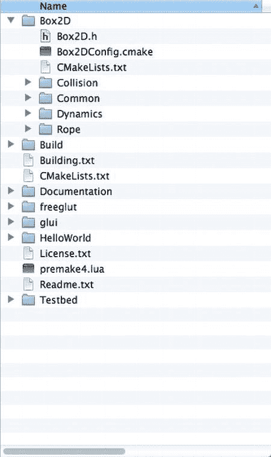

图 13-2.  下载并解压后的 Box2D 源代码

在 图 13-2 中，注意顶部展开的 Box2D 目录。这就是你要添加到 Xcode 项目的目录。我通过先将 `Box2D` 目录复制到项目文件夹中，然后使用 Xcode 的“添加文件到...”功能来实现。这确保了添加到项目的文件会保留在一个名为 `Box2D` 的文件夹中。这并非绝对必要，但它可以简化后续的导入和编译工作。

添加源代码后，确保所有的 `.cpp` 文件都被视为“默认 – C++ 源代码”，如图 13-3 所示。

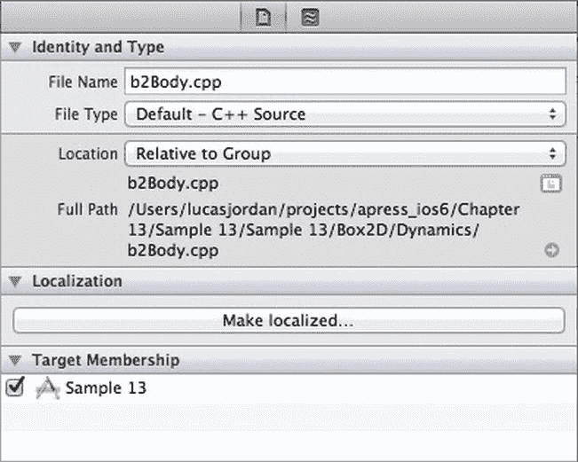

图 13-3.  cpp 文件的详细信息

另外，确保所有的 `.cpp` 文件都包含在你的主要构建目标中，如图 13-3 底部的复选框所示。此时，你的项目还无法编译；你需要将**头文件搜索路径**设置为 `../**`，如图 13-4 所示。

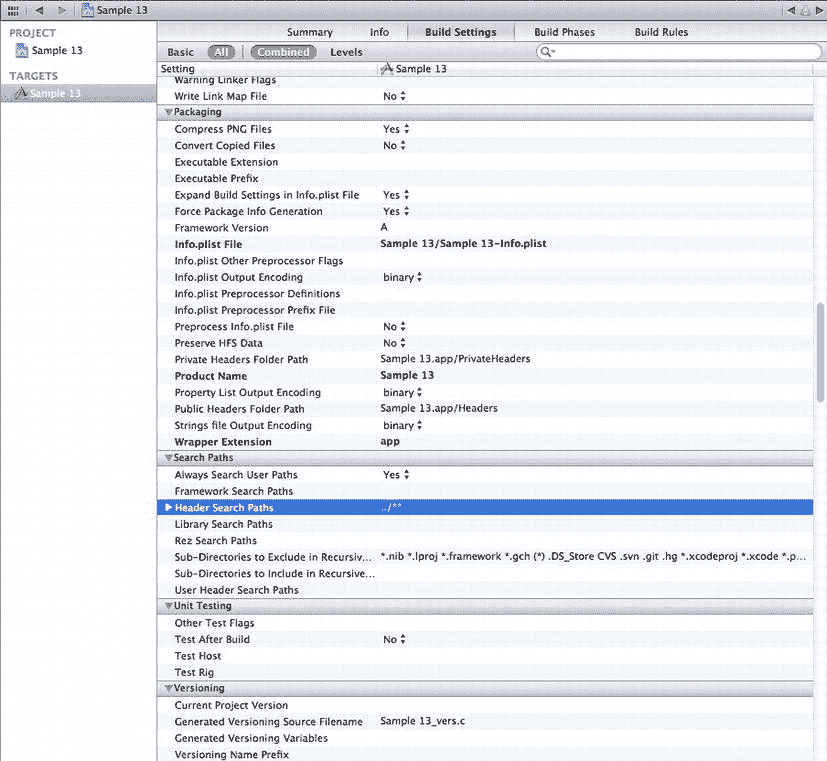

图 13-4.  编译 Box2D 的正确头文件搜索路径

此时，你的项目应该可以编译了。要使用 Box2D 类，你可以像这样导入：

```
#import <Box2D/Box2D.h>
```

然而，你很可能会在 Objective C 类中导入 Box2D，所以你必须告诉 Xcode 它应该期望混合 C++ 和 Objective C 代码。这可以通过将文件类型更改为“Objective-C++ 源代码”来实现，如图 13-5 所示。

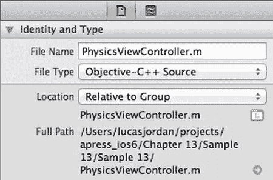

图 13-5.  导入 Box2D 的 Objective C `.m` 文件的正确类型

现在，你就可以在你的项目中使用 Box2D 类了。不过我必须警告未来的读者，这个过程是从各种谷歌搜索的来源拼凑而成的，这些来源描述的是旧版本的 Xcode 和 Box2D。我向你保证，这个设置会在未来版本的 Xcode 中发生变化。


现在你对 Box2D 有了一定了解，并且知道如何将 Box2D 源代码集成到我们的项目中，接下来我们看看如何扩展`GameController`类，使我们的游戏能够利用物理效果。

## 理解示例

在这个示例中，场景中有许多大小不同的小行星，它们以物理方式相互碰撞弹开。根据之前对 Box2D 的描述，我们知道需要定义物理世界。让我们直接进入正题，看看如何在`PhysicsViewController`类中实现这一点，如代码清单 13-1 所示。

**代码清单 13-1.** `createPhysicsWorld` (`PhysicsViewController.m`)

```
- (void)createPhysicsWorld {
       b2Vec2 gravity;
       gravity.Set(0.0f, 0.0f);
     
       world = new b2World(gravity);
       world->SetAllowSleeping(false);
       world->SetContinuousPhysics(true);
}
```

在代码清单 13-1 中，我们首先创建了一个名为`gravity`的`b2Vec2`，并将其在 X 和 Y 方向上的力都设置为`0.0f`。`b2Vec2`结构体被 Box2D 用于所有向量数据类型，包括力、速度等。接着，使用`gravity`创建了一个新的`b2World`对象，并将其存储在变量`world`中。`world`在`PhysicsViewController`的头文件中定义（未显示），因为在模拟的整个生命周期中，我们需要保持对此对象的引用。`world`的最后两个方法调用——`SetAllowSleeping`和`SetContinuousPhysics`——仅用于演示，并非强制要求。你可以随意更改这些值，看看是否能在模拟中察觉到任何差异。对于这个简单的示例，它们似乎没有产生我能分辨出的效果，尽管我确信它们对于使复杂场景能够高效运行至关重要。现在，让我们看看如何定义主视图控制器来使用这个新的 Box2D 世界。

## 扩展`GameController`

让我们通过查看`createPhysicsWorld`的调用位置，来了解如何开始使用这个在`createPhysicsWorld`中创建的 Box2D 世界。我们在`PhysicsViewController`类的`doSetup`任务中调用`createPhysicsWorld`，如代码清单 13-2 所示。

**代码清单 13-2.** `doSetup` (`PhysicsViewController.m`)

```
-(BOOL)doSetup{
    if ([super doSetup]){
        [self setGameAreaSize:CGSizeMake(1024, 768)];
        [self createPhysicsWorld];
        
        for (int i=0;i<30;i++){
            float startY = rand()%(int)self.gameAreaSize.height;
            float startX = rand()%(int)self.gameAreaSize.width;
            
            CGPoint center = CGPointMake(startX, startY);
    
            int level = 1 + rand()%4;
            
            Asteroid* asteroid = [Asteroid asteroidOfLevel:level At: center];
            [self addActor: asteroid];
        }
        
        return YES;
    }
    return NO;
}
```

在代码清单 13-2 中，我们指定了游戏区域大小并创建了物理世界。游戏区域大小不被 Box2D 考虑。Box2D 没有游戏在内部发生的固定边界的概念，除了用浮点值限制来表示世界内的坐标。接下来，我们创建了 30 个小行星，并将它们随机放置在场景中。然后使用熟悉的`addActor:`方法添加每个小行星。

此时你可能会注意到，除了创建世界对象之外，我们实际上并没有对 Box2D 做任何操作。我们似乎只是在向`GameController`添加角色，就像前几章所做的那样。之所以看起来如此，是因为我们做了两件事来启用物理效果，同时又没有过多地破坏现有的框架。我们在`PhysicsViewController`中重写了`GameController`的几个任务，并创建了一个名为`PhysicsActor`的新角色类型，`Asteroid`现在继承自它。这两个修改协同工作，共同启用了物理效果。

让我们从对`GameController`的修改开始，了解这一切是如何结合在一起的。

**代码清单 13-3.** `addActor`: (`PhysicsViewController.m`)

```
-(void)addActor:(Actor *)actor{
    if ([actor isKindOfClass:[PhysicsActor class]]){
        PhysicsActor* physicsActor = (PhysicsActor*)actor;
        b2BodyDef bodyDef = [physicsActor createBodyDef];
        
        b2Body* body = world->CreateBody(&bodyDef);
        
        b2CircleShape circle;
        circle.m_p.Set(0.0f, 0.0f);
        circle.m_radius = [PhysicsViewController convertDistanceToB2:[actor radius]];
        
        b2FixtureDef fixtureDef;
        
        fixtureDef.shape = &circle;
        fixtureDef.density = [physicsActor radius];
        fixtureDef.friction = 0.1f;
        fixtureDef.restitution = .8;
        
        body->CreateFixture(&fixtureDef);
        [physicsActor setBody:body];
    }
    [super addActor:actor];
}
```

在代码清单 13-3 中，我们看到了被重写的任务`addActor:`。在此任务中，我们首先检查正在添加的角色是否是`PhysicsActor`。如果是，我们需要做一些工作来在我们的世界对象中创建一个 Box2D 刚体，以便我们的角色能够参与物理模拟。我们还需要创建一个夹具，使刚体具有大小和质量。让我们逐步分析一下。

在 Box2D 中创建刚体时，我们在`b2BodyDef`类型的结构体中指定刚体的初始值。该结构体指定了刚体的所有属性，如本章前面所述。由于刚体位置等属性由`physicsActor`驱动，我们通过调用`createBodyDef`来获取`b2BodyDef`，并将值存储在`bodyDef`中。一旦有了`bodyDef`，我们就调用`world`对象上的`CreateBody`方法，并将结果存储在`b2Body`变量`body`中。`CreateBody`任务既创建了刚体，又将其添加到模拟中。请注意，我们使用的是`world`上的方法来创建`b2Body`，而不是自己实例化它。这样做是因为 Box2D 有非常特殊的内存管理要求，建议始终使用其提供的工厂方法。

继续看代码清单 13-3，接下来我们创建一个名为`circle`的`b2CircleShape`。我们通过调用`Set`并传入`0.0f`作为 X 和 Y 位置，将圆形居中于刚体上。我们还指定了圆形的半径。逻辑上，我们知道希望圆形的半径与`physicsActor`的半径相同，但 Box2D 建议不要让一个点等于 Box2D 中的一个单位。在这种情况下，我们调用实用方法`convertDistanceToB2`来创建一个适合 Box2D 坐标系的缩放值。总共有四个这样方便的转换方法，稍后我们会更详细地介绍它们。

有了圆形之后，我们通过创建一个名为`fixtureDef`的`b2FixtureDef`将其附加到刚体上。夹具遵循与 Box2D 中刚体相同的模式：它们使用定义其初始值的结构体创建，然后通过调用适当的工厂方法（此处为`body`上的`CreateFixture`）实际创建它们。

在`fixtureDef`上，我们还指定了密度、摩擦力和恢复系数。在我们的示例中，这些值是通过反复试验设定的，以获得看起来不错的效果。例如，请注意密度是基于小行星的半径。这显然不太现实；人们可能会期望一批小行星如果由相同物质构成，它们的密度即使不相同也是相似的。但在模拟运行时，我喜欢改变密度让小行星获得更多弹跳效果。你可以随意调整这些值，看看它如何改变模拟结果。

一旦创建了刚体及其夹具，我们就将该对象存储在`physicsActor`的`body`属性中。通过这种方式，`physicsActor`可以引用其在 Box2D 世界中的表示，并相应地更新其状态。


在`addActor`中，我们做的最后一件事是调用超类的实现，以便将角色附加到`GameController`的场景中，这与前几章相同。接下来的部分将探讨我们的新型角色——`PhysicsActor`——并了解如何将其 Box2D 实体与场景链接起来。

## 物理角色

`PhysicsActor`类旨在成为任何希望参与物理模拟的角色的超类。其核心理念是将大部分 Box2D 功能封装在一个类中，这样在处理角色时就不必过于担心。当我们查看`Asteroid`类时，会发现我们打破了这种封装，但我认为这样代码更容易作为示例理解。总之，我们先来看`PhysicsActor`的头文件，如列表 13-4 所示。

**列表 13-4.** `PhysicsActor.h`

```objc
#import <Foundation/Foundation.h>
#import <Box2D/Box2D.h>
#import "Actor.h"
#import "PhysicsViewController.h"

@interface PhysicsActor : Actor

@property (nonatomic) b2Body* body;

-(b2BodyDef)createBodyDef;
@end
```

在列表 13-4 中，我们看到`PhysicsActor`继承了`Actor`。它还添加了一个名为`body`的新属性，用于存储在 Box2D 世界中表示它的`b2Body`。你还可以看到在列表 13‑3 中将角色添加到场景时使用的任务`createBodyDef`的声明。我们快速查看一下`createBodyDef`的实现，如列表 13-5 所示。

**列表 13-5.** `createBodyDef` (`PhysicsActor.m`)

```objc
-(b2BodyDef)createBodyDef{
    b2BodyDef bodyDef;
    bodyDef.type = b2_dynamicBody;
    bodyDef.position = [PhysicsViewController convertPointToB2:self.center];
    return bodyDef;
}
```

在列表 13-5 中，我们声明了一个新的`b2BodyDef`，然后将其类型设置为`b2_dynamicBody`，以便此`b2BodyDef`创建的`b2Body`能完全参与模拟。我们还通过使用任务`convertPointToB2`将角色的中心点转换为`b2Vec2`来指定位置。再次强调，这样做是因为我们希望在 Box2D 与用于表示场景中角色的坐标之间使用不同的比例。最后，我们直接返回它。

`PhysicsActor`实际上有两个任务。第一个任务是在将角色添加到场景时提供一个`b2BodyDef`。第二个任务是在模拟过程中，当相应的`b2Body`的位置和旋转发生变化时，更新角色的属性。这通过`step:`任务完成，如列表 13-6 所示。

**列表 13-6.** `step:` (`PhysicsActor.m`)

```objc
-(void)step:(GameController *)controller{
    b2Vec2 position = body->GetPosition();
    CGPoint center = [PhysicsViewController convertPointToCG:position];
    [self setCenter: center];
    [self setRotation:body->GetAngle()];
}
```

在列表 13-6 中，我们需要根据`body`属性的状态来更改角色的位置和旋转。如你所见，这非常简单。我们只需使用`convertPointToGC`:将实体的位置转换为`GameController`坐标系中的`CGPoint`；然后将这个新的中心值赋值给角色。接着，使用`GetAngle`将角色的旋转设置为实体的角度。无需进行转换，因为角色的`rotation`属性和实体的`angle`属性都是以弧度为单位。

接下来，让我们探讨如何扩展`PhysicsActor`，使其像示例中的小行星一样运行。

## 扩展 PhysicsActor

我们有了`PhysicsActor`类，它为希望参与物理模拟的角色提供了基本支持。

在本节中，我们将查看`Asteroid`类，并了解如何修改其行为以实现我们的需求。

回顾`PhysicsActor`，请注意我们并未提及模拟中实体的初始速度。让我们看看如何自定义`Asteroid`，使其一开始就在场景中快速移动。列表 13-7 展示了如何实现这一点。

**列表 13-7.** `createBodyDef` (`Asteroid.m`)

```objc
-(b2BodyDef)createBodyDef{
    b2BodyDef bodyDef = [super createBodyDef];
    bodyDef.linearVelocity.Set(−20+rand()%40, -20+rand()%40);
    
    return bodyDef;
}
```

在列表 13-7 中，我们调用了`PhysicsActor`的`createBodyDef`实现，因为它已经完成了我们在此所需的大部分工作，例如设置起始位置。然后，我们只需将线速度设置为某个随机值。在这个示例中，每个 X 和 Y 分量的范围是−20 到 20。这样，所有新添加的小行星都会被赋予一个初始速度。

关于小行星的另一个独特行为是，当它们离开屏幕边缘时，会从另一侧重新出现。从 Box2D 世界的角度来看，这个概念没有太大意义，因为 Box2D 只是一个无限平面。¹ 列表 13-8 展示了当每个小行星离开屏幕时，我们如何更新其位置。

**列表 13-8.** `step:` (`Asteroid.m`)

```objc
-(void)step:(GameController *)controller{
    if (self.center.x < −self.radius){
        CGPoint center = CGPointMake(controller.gameAreaSize.width+self.radius, self.center.y);
        self.body->SetTransform([PhysicsViewController convertPointToB2: center],
    self.body->GetAngle());
    } else if (self.center.x > controller.gameAreaSize.width + self.radius){
        CGPoint center = CGPointMake(−self.radius, self.center.y);
        self.body->SetTransform([PhysicsViewController convertPointToB2: center],
    self.body->GetAngle());
    }
    if (self.center.y < −self.radius){
        CGPoint center = CGPointMake(self.center.x, controller.gameAreaSize.height + self.radius);
        self.body->SetTransform([PhysicsViewController convertPointToB2: center],
    self.body->GetAngle());
    } else if (self.center.y > controller.gameAreaSize.height + self.radius){
        CGPoint center = CGPointMake(self.center.x, -self.radius);
        self.body->SetTransform([PhysicsViewController convertPointToB2: center],
    self.body->GetAngle());
    }
    
    [super step: controller];
}
```

在列表 13-8 中，对于 X 和 Y 轴，我们检查小行星是否已超出屏幕超过其`radius`个点。如果是，我们只需在屏幕的另一侧指定一个新的中心值。然后，我们将这个新的中心值转换为适合 Box2D 的值，并在`body`属性上调用`SetTransform`方法。注意，我们同时传入了实体的当前角度，因为`SetTransform`需要该值来更改其位置。

自定义`Asteroid`使其按我们的意愿运行就是这么简单。在这个示例中，我们没有从场景中移除任何角色，但这很可能是人们想要做的。下一节将简要介绍清理工作。

## 一点清理工作

虽然在这个示例中我们没有移除任何角色，但让我们看看如何实现。列表 13-9 展示了具体方法。

**列表 13-9.** `removeActor`: (`PhysicsViewController.`)


```objectivec
-(void)removeActor:(Actor *)actor{
    if ([actor isKindOfClass:[PhysicsActor class]]){
        PhysicsActor* physicsActor = (PhysicsActor*)actor;
        b2Body* body = [physicsActor body];
        world->DestroyBody(body);
    }
    [super removeActor:actor];
}
```

在列表 13-9 中，我们看到方法`removeActor:`，当我们想要从场景中移除一个`Actor`时就会调用它。与列表 13-3 中的方法`addActor:`一样，我们首先检查该`Actor`是否是`PhysicsActor`。如果是，我们获取对`body`属性的引用，并调用`DestroyBody`将其从 Box2D 世界对象中移除。通过这种方式，我们保持场景中的 Actors 与模拟中的 bodies 同步。

## 总结

在本章中，我们探讨了 Box2D（一个游戏物理引擎）的一些核心特性。我们学习了如何创建一个世界，并模拟世界中物体的运动。我们还研究了如何扩展`GameController`类，以在现有游戏框架中启用物理功能。我们查看了`PhysicsActor`类和一个新版本的 Asteroid，以了解参与物理模拟的 Actor 所需进行的更改。

¹ 无限大，直到浮点数的最大值——我猜，这其实并非真正的无限。

## 附录 A

### 设计与创建图形

在本附录中，我们将讨论三个主要主题：设计图形、创建图形以及可使用的开源工具。

在创建电子游戏时，大量工作都投入到游戏图形的制作中。在本附录中，我们将考虑 2D 游戏。这些图形包括游戏中角色的图像、背景、按钮及其他装饰。图像是游戏的重要组成部分：它们是人们首先看到的东西，并能决定人们是否会下载游戏。图像是用来吸引人们注意力的。人们记住的是林克或马里奥的形象，而不是碰撞检测算法。但这并不是说没有图形简陋的流行游戏——确实存在这样的情况。但即使是那些图形简陋的成功游戏的创作者，也会花费大量时间来确保他们的美术风格符合统一的设计目标。

除了风格问题，游戏设计师还必须考虑制作适合构建游戏的图像所需的条件。我们必须考虑最终图像的大小，以及图像的排列方式。我们是应该为所有元素使用独立的图像，还是可以为背景创建合成图像？我们如何组织图像以便于修改？我们对可以包含的图像兆字节数有预算吗？这些只是我将在本附录中讨论的几个问题。

本附录的最后部分将快速回顾一些优秀的开源工具，供游戏设计师使用。这些工具不仅对小型游戏开发者很重要，在本书的撰写过程中也至关重要。

## 电子游戏中的美术

在电子游戏被创建之前，有人会对游戏的玩法和外观有一个想法。那个最初的愿景可能会或可能不会出现在最终版本中。无论如何，最好由一个人或一组人负责塑造游戏的美术风格，使其具有一致性。一旦游戏有了美术指导，就会开始构建游戏资源。随着游戏成型，还会创建其他美术作品来支持游戏，例如网站或广告。这些其他作品应保持相同的视觉风格。在本节中，我们将快速回顾什么是艺术风格，以及它如何塑造用户的期望。

## 电子游戏中的风格

电子游戏的风格指的是设计师和艺术家为创建游戏美术以及使这些美术相互融合所做的一切选择。

游戏的风格与其他产品的风格并无不同。例如，考虑一瓶照烧酱。用看起来像远东风格的字形来绘制词语“teriyaki”并非不合理，就像图 A-1 中的单词那样。

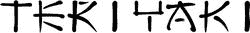

图 A-1.  “Teriyaki”以远东风格呈现

图 A-1 展示了一个以符合照烧酱用户期望的风格呈现的单词。多年来，众多照烧酱制造商已经设定了这种期望。但并非所有产品都有社会预期的风格可供借鉴。事实上，如果你正在制作一个新型游戏，用户可能对风格没有任何期望。如果你正在制作一个关于骑士和城堡的游戏，用户会欢迎看起来是中世纪风格的。无论如何，游戏中的美术风格保持一致非常重要。

保持一致的风格并不要求艺术过于精细。目标仅仅是让美术看起来像是出自同一人之手，就像图 A-2 中的例子所示。

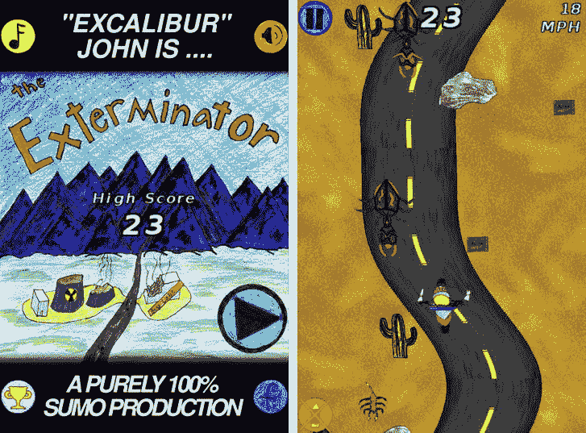

图 A-2.  《The Exterminator》，由 SUMO Productions 制作。© 2011 Table Mountain Church

在图的左侧，我们看到了游戏的欢迎界面。Phil Hassey 与 Table Mountain Church（版权所有者）的一些年轻人共同开发了这款简单的游戏。由于这款游戏是 Phil 与一群没有多年图形或游戏设计经验的年轻人合作的成果，他们采用了简单的手绘风格。这一选择使得几个绘画技巧有限的人能够为游戏贡献美术作品。为了在整个游戏中保持这种风格，我们可以看到左侧屏幕角落的四个按钮也是手绘的。右下角的按钮是 Facebook 按钮。通过制作自己的 Facebook 按钮，他们保持了一致的风格。如果他们使用标准的 Facebook 按钮，将会与整个视觉体验格格不入。我们还应该考虑一款风格不一致的游戏，如图 A-3 所示。

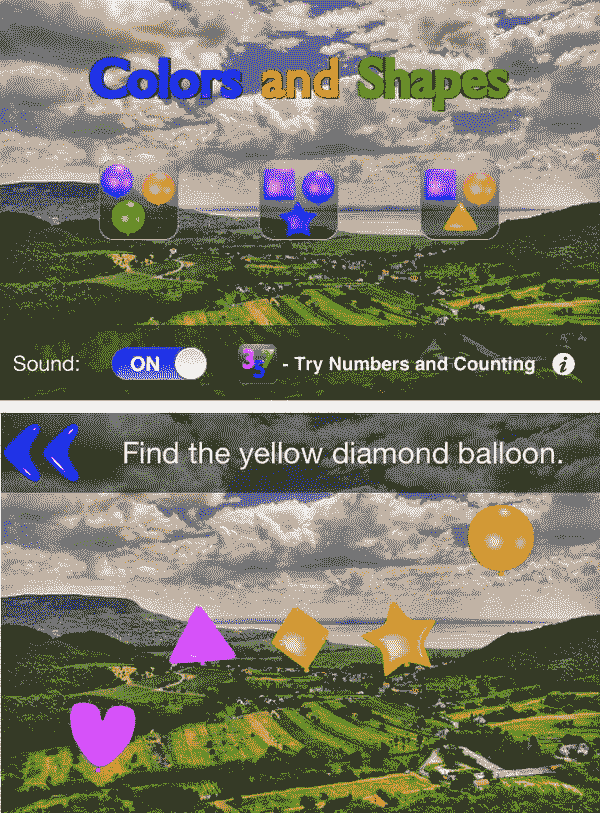

图 A-3.  《Colors and Shapes》。© ClayWare Games。背景由 Flickr 上的 txd 提供

在图 A-3 中，我们看到我早年为首款 iPhone 创建的一款旧游戏，名为《Colors and Shapes》。左侧是欢迎界面，孩子或家长可以选择三种活动之一。对于每种活动，玩家会通过语音和文字提示，执行一系列涉及彩色气球的简单任务。3D 文字和气球是用 Blender 3D 渲染的，我认为它们相当一致。它们都使用了强烈的主色，并具有深度感——虽然不是完美匹配，但相当接近。然而，我认为背景不是一个好选择。虽然这是一张非常漂亮的照片，但它与气球完全不匹配，而且在视觉上分散注意力。

**提示**  知识共享（Creative Commons）有一种许可选项，你只需在游戏致谢中包含署名，即可使用创意作品。Flickr 允许你搜索以这种许可发布的图像。我们就是这样为《Colors and Shapes》找到了背景图像。

## 品牌与感知

如前所述，游戏的美术不仅仅是屏幕上移动的图像。人们会记住这些美术并将其与游戏关联起来。图 A-4 展示了为游戏《Space Attack!!》制作的广告。

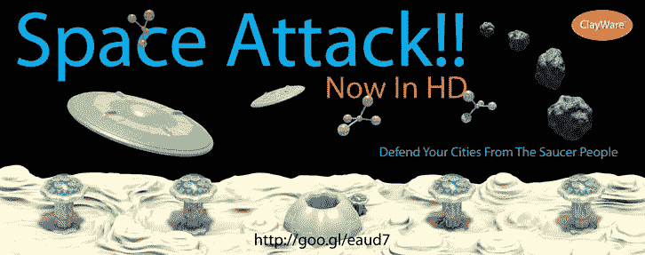

图 A-4.  《Space Attack!!》


这份宣传单是在某次大会上分发的。制作这份宣传单时，我正忙于更新游戏的画面，因此决定在宣传单上使用新画风，尽管当时 App Store 中的游戏尚未用新画风进行更新。所以，当人们下载游戏后，他们下载到的是旧画风的版本，如图 A-5 所示。

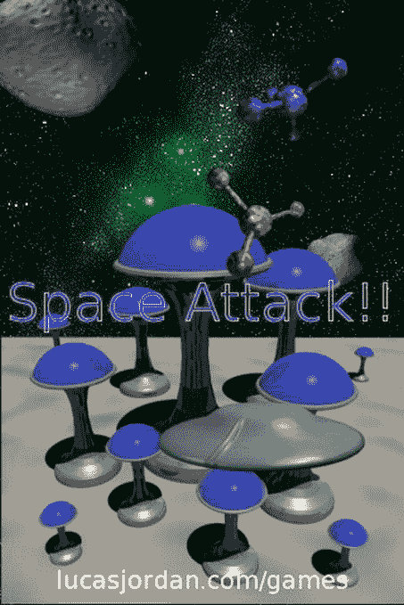

图 A-5. 《太空攻击！！》，旧画风

由于游戏画面与宣传单上的画面不符，而且游戏画面明显更差，人们感觉被欺骗了，尽管游戏是免费的！我未能重视用户的期望，也因此付出了一些差评的代价。如果我能及时在大会前更新游戏，或者在广告中使用旧版画面，这种情况本可以轻易避免。

我们快速了解了电子游戏中的风格是什么以及它为何重要。现在，让我们将焦点转向创建图像文件这类更实际的问题。之后，我们将会回顾一些用于创建 2D 美术的出色工具。

## 创建图像文件

无论你的游戏美术方向如何，最终你都需要一些特定尺寸的图像文件来真正实现你的游戏。我们将首先探索一些命名规范，这些规范能帮助你在需要为不同设备提供不同图像时进行管理。接着，我们将回顾所有 iOS 应用都需要的图像——比如图标和启动画面。最后，我们将讨论如何选择合适的图像尺寸来结束本节内容。

## 命名规范

在撰写本文时，创建应用程序时必须考虑三种不同的屏幕分辨率。根据应用程序运行在三种分辨率中的哪一种来使用不同的图像，这是非常普遍的需求。为了支持这些分辨率，人们创建了一种命名规范，以便以尽可能简单的方式实现这一点。其思路是，通过以特定方式命名图像，设备会根据自身情况加载不同的图像。因此，无需在代码中测试你使用的是哪种设备。这种命名规范的格式如下：

```
基本文件名[@2x][~iphone|~pad].扩展名
```

因此，`基本文件名`可以是任意名称——例如，`"background"`。然后你可以选择性地附加一个`@2x`，以表示该图像适用于高分辨率显示屏，例如 iPhone 4 的 Retina 显示屏。在指明图像是否为高分辨率版本之后，你可以指定设备类别，即 iPhone 或 iPad。最后，像平常一样加上扩展名。表 A-1 展示了对于一张原本会被称为 `background.png` 的图像，此命名规范是如何工作的。

表 A-1. 竖屏背景图像命名规范

| 设备 | 文件名 | 图像像素分辨率 |
| --- | --- | --- |
| iPhone 3GS, iPod Touch 第三代 | `background~iphone.png` | 320x480 |
| iPhone 4, iPod Touch 第四代 | `background@2x~iphone.png` | 640x960 |
| iPad 1, iPad 2, iPad mini | `background~ipad.png` | 1024x768 |
| iPad 第三、四代 | `background@2x~ipad.png` | 2048x1536 |

在表 A-1 中，我们看到第一列列出了每一行对应的设备集合。为了给每组设备提供全屏的竖屏背景图像，我们需要按照第二列所示的方式命名背景文件。最右边一列显示了图像的像素分辨率。在本附录的示例代码中，应用程序的背景图像被配置为支持模拟器中可用的设备。我更改了每个背景图像，使其包含文本信息，以指示正在加载的是哪个文件。图 A-6 展示了不同设备加载不同图像的效果。

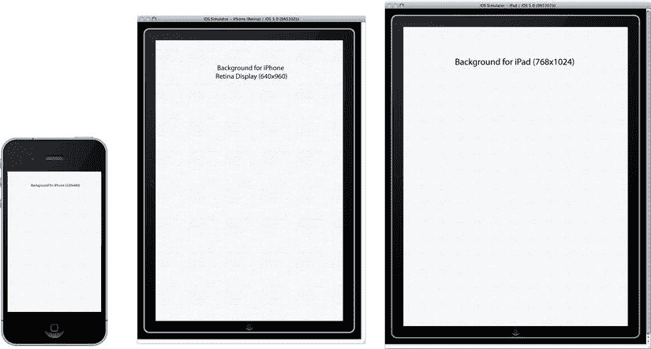

图 A-6. 为每台设备设置不同的背景

在图的左侧，我们看到 iPhone 运行时的显示效果与 iPhone 3GS 相同。中间部分显示的是相对于 3GS 而言，如同在 iPhone 4 上运行时的屏幕尺寸。右侧则是第一代和第二代 iPad 的屏幕尺寸。代码清单 A-1 为该应用程序设置了背景图像。

**代码清单 A-1.** `ViewController.m (viewDidLoad)`

```
- (void)viewDidLoad {
    [super viewDidLoad];
    UIImage* image = [UIImage imageNamed:@"background"];
    [backgroundImageView setImage:image];
}
```

在代码清单 A-1 中，我们看到类 `ViewController` 的 `viewDidLoad` 任务。我们通过调用 `imageNamed` 并仅传入基本文件名来加载一个 `UIImage`。返回的是根据项目中包含的图像文件名、适用于特定设备的图像。在本例中，我们使用的文件名与表 A-1 中显示的相同。

现在让我们来看看如何根据设备类型指定其他支持图像，例如图标和启动画面。

## 支持图像

每个 iOS 应用都必须附带一些图像文件。最起码，必须指定一个图标。另外，还可以指定一个在应用启动时显示的图像。通常，提供启动图像是一个好主意，尤其是当你的应用启动需要一些时间时。指定要使用的图像非常简单：Xcode 提供了可以拖拽图像以指定图标和启动图像的位置，如图 A-7 和 A-8 所示。

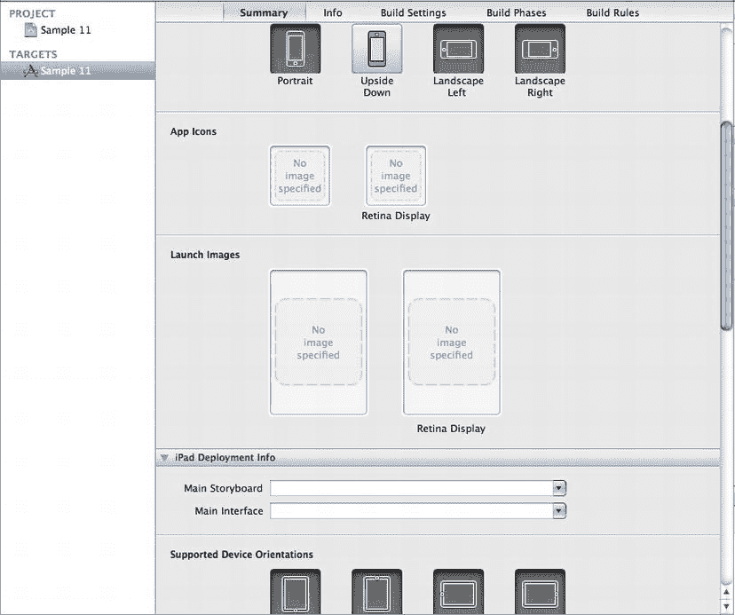

图 A-7. 为 iPhone 指定图标和启动图像

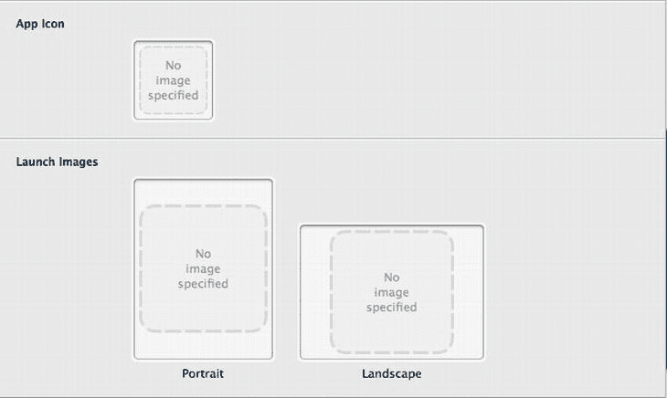

图 A-8. 为 iPad 指定图标和启动图像

在图 A-7 中，我们看到有四个地方可以拖入 iPhone 版应用的图像；图 A-8 则显示了 iPad 版的情况。请注意，对于 iPad，可以指定横屏和竖屏版本，而 iPhone 只允许竖屏图像。在图 A-7 和 A-8 中，图像被标记为“未指定图像”。最上面的两个允许你指定应用的图标。你可以为 Retina 显示屏指定不同的图像，因此可以提供高分辨率版本。要指定图像，只需将图像拖拽到其中一个位置即可。该图像可以是项目中已有的，也可以是其他图像。Xcode 会检查你拖入这些框中的图像是否适合其角色。如果不适合，系统会弹出一个错误对话框，如图 A-9 所示。

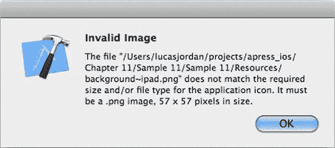

图 A-9. 指定了不合适的图像作为图标

图 A-9 显示了一个错误对话框，当一张尺寸不正确的图像被拖入 Xcode 中的应用图标位置时会触发该对话框。尽管提供了简单的拖放界面，但要正确格式化所有图像实际上可能有些棘手。之所以棘手，是因为大多数网站（包括 Apple 的网站）上关于图像尺寸的信息都是错误的。我希望在你读到这篇文章时，Apple 已经在其网站上修复了这个问题。[表 A-2](#9781430244226_App.


### 支持的图片尺寸

表 A-2 列出了每种支持图片对应的正确尺寸。

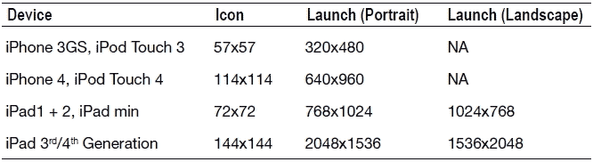

一旦你以正确的尺寸创建文件，就可以将它们拖拽到 Xcode 中的相应位置。Xcode 会自动将这些文件复制到项目目录（如果需要的话），并将它们添加到项目中。旧版本的 iOS 依赖命名约定来指定每个文件的用途。这种方式相当容易出错且难以维护。新版本的 iOS 和 Xcode 允许你随意命名文件。代码清单 A-2 展示了这些信息是如何在 `info.plist` 文件中表示的。

**代码清单 A-2.** `Sample A–Info.plist`

```
<key>CFBundlePrimaryIcon</key>
       <dict>
             <key>CFBundleIconFiles</key>
             <array>
                    <string>my_icon_file.png</string>
                    <string>my_icon_file_retina.png</string>
                    <string>my_icon_file_ipad.png</string>
             </array>
             <key>UIPrerenderedIcon</key>
             <false/>
       </dict>
```

在代码清单 A-2 中，我们看到文件名被简单地存储在一个数组中。这些文件名是我自己命名的，可以是任何名字——它们并非由 Xcode 分配。

我们看了两个示例，演示了如何拥有一个逻辑图像，但其存在多个不同分辨率的不同版本。下一节将简要讨论如何以最佳方式创建不同分辨率的同一图像。

### 多分辨率图像

在某些情况下，一个应用会有两个不同分辨率的图像文件，它们在应用中被用作同一个逻辑图像。这样做是为了让应用能够根据用户使用的设备提供最佳用户体验。对于任何应用来说，理想情况是以 1:1 的比例（图像的像素数与屏幕像素数之比）显示图像。我们希望尽可能地避免缩放，因为缩放会产生质量较低的图像，并且是一种额外的、可能开销较大的操作。

苹果电脑似乎非常擅长缩放图像。如果你有机会，可以尝试在一台新的 27 英寸 iMac 上播放一张老式 DVD（非高清视频）。当以全屏模式播放时，图像被放大了很多，但看起来仍然非常出色。无论这种神奇的缩放算法是什么，它似乎也包含在 iOS 设备中。因此，人们很容易倾向于对所有内容都使用高清图像，然后让 iOS 在应用运行于低分辨率设备时将其缩小。这种方式是可行的；缩放后的图像质量非常好。然而，在涉及动画时，为低分辨率设备提供较小的图像确实能带来回报。请记住，iPhone 3GS 不仅屏幕较小，其计算能力也比 iPhone 4 弱。如果让 iPhone 3GS 来缩小图像，你就相当于要求一台计算能力较弱的设备去做更多工作。在大多数情况下，维护两套图像是值得的。

在创建高分辨率和低分辨率图像集时，我们可以只创建高分辨率集，然后编写一个脚本来缩小每个图像，从而生成低分辨率版本。这种策略固然可以防止较慢的设备进行缩放，但可能会损害图像质量，尤其是在处理文本时。如果你的美术资源是某种渲染过程的一部分——例如，来自 3D 表现图或矢量图——那么对每个图像进行两次渲染是合理的，一次用于高分辨率，再一次用于低分辨率。

### 多分辨率示例

让我们来看一个例子。假设你正在使用 Adobe Illustrator（或类似的应用程序）为你的应用创建一个图标。

如果你创建一个 57 pt × 57 pt 的新文件，你可以将其导出为 72 dpi 的图像，得到一个 57 像素 × 57 像素的图像——非常适合用作低分辨率的 iPhone 图标。然后，你可以再次将此图像导出为 144 dpi，得到一个 114 像素 × 114 像素的图像，这非常适合用于 iPhone 的视网膜屏幕版本。要为 iPad 制作图标，你可以再次导出为 92 dpi，得到一个 72 像素 × 72 像素的图像。图 A-10 展示了在不同比例下渲染与直接缩小的区别。

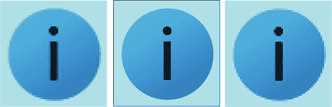

**图 A-10.** 渲染与缩放

在图 A-10 中，我们看到一个图标的三个不同版本。中间是矢量呈现，光滑漂亮。左侧是由 Illustrator 在要求导出中间图像 57x57 版本时生成的图像。这个图像看起来像素化了，因为它是被放大后才让我们看到渲染质量的。右侧的图像是 Illustrator 创建 114x114 图像，然后由 GIMP 将其缩小到 57x57（使用 Sinc Lanczos3 算法）的结果。即使是这个简单的两步过程也引入了噪点。请注意右侧字母 *i* 的点周围那些较亮的像素。也许在这个例子中影响不大，但在我看来，如果你打算花费时间（和金钱）来创建高质量的艺术作品，那么再多付出一些努力来防止这类问题是值得的。

遵循这里关于质量和渲染的理念，下一节将引导你完成一个示例，说明如何为应用选择最终的图像尺寸。

## 创建最终资源

我们已经了解了如何表示具有多分辨率的图像以及为什么这很重要。但是，当涉及到游戏美术时，我们仍然没有回答这个问题：“我的图像应该有多大？” 在本节中，我们将以一个同时运行于 iPad 和两款 iPhone 上的示例游戏为例，找出该游戏中图像的最佳尺寸。我们将使用第 3 章中的游戏《Coin Sorter》。

由于我们处理的是三种可能的图像尺寸——一种用于 iPad，两种用于 iPhone——我们应该看看这些屏幕的相对尺寸（以像素为单位），并了解它们在尺寸上的差异。图 A-11 展示了不同的屏幕尺寸。

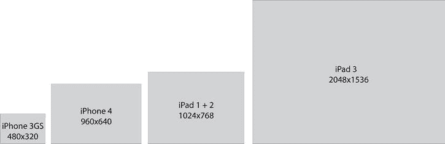

**图 A-11.** 不同屏幕的相对分辨率

在图 A-11 中，我们看到了一个矩形，分别代表了市场上各款 iOS 设备的屏幕尺寸。最左边的图像是 iPhone 3GS（及其前两代产品）的尺寸。左起第二个矩形显示的是 iPhone 4 的尺寸，其像素数是 iPhone 3GS 的四倍。第三个矩形代表了 iPad 1 和 iPad 2 的像素尺寸。请注意，iPhone 4 的像素数几乎与 iPad 1 和 iPad 2 相当。最右边的矩形是第三代 iPad 的分辨率。接下来，让我们看看这些不同的尺寸如何影响我们布局游戏时的决策。

### 屏幕可用空间

虽然从像素角度看，我们有三种不同的屏幕尺寸，但实际上只有两种不同的宽高比。两款 iPhone 的宽高比相同，均为 2:3，而 iPad 的宽高比为 3:4。处理这些差异时，我们需要弄清楚如何布局我们的应用，以最大限度地利用屏幕空间。让我们从第 3 章中游戏的布局开始看起，如图图 A-12 所示。

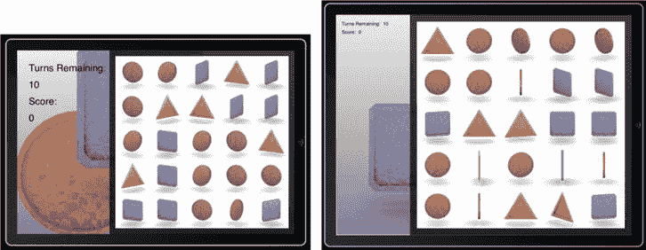

**图 A-12.**


### iPhone（Retina 屏）和 iPad 上的 Coin Sorter 游戏

在图 A-12 中，左侧是游戏在 iPhone 横屏模式下的运行画面，右侧则是游戏在 iPad 横屏模式下的运行画面。两种情况下，我们都使用了右侧带有灰色边框的游戏区域。由于游戏区域是正方形，我们只需要确定一个维度，但仍需根据游戏区域所占空间来计算硬币图像的最佳尺寸。图 A-13 展示了这两个区域的尺寸，以及它们与硬币大小的关系。

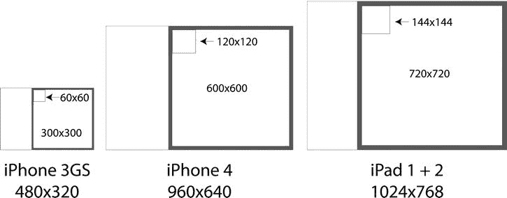

图 A-13. 游戏区域与硬币图像的相对尺寸（以像素为单位）

在图 A-13 中，我们看到了三种设备的屏幕尺寸。对于两个 iPhone 版本，带有粗灰色边框的白色游戏区域在点（points）上的尺寸相同，都是 300x300。当然，iPhone 4 版本是 600x600 像素，而 iPhone 3GS 是 300x300 像素，但由于我们要确定图像的最佳尺寸，因此关注的是像素而非点。iPad 1 和 iPad 2 右侧游戏区域的尺寸是 720 像素（也是 720 点）。因此，要计算每个硬币图像的尺寸，只需除以 5。我们得到：3GS 为 60x60，iPhone 4 为 120x120，iPad 为 144x144。图 A-14 展示了三种尺寸下的一款硬币图像。

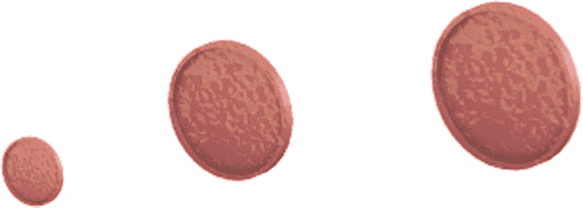

图 A-14. 三种不同尺寸的硬币

在图 A-14 中，我们看到了文件 `coin_circle0029` 的三个不同版本。通过提供这些不同的分辨率，我们确保了图像能以 1:1 的像素比例渲染到屏幕上，即图像像素数与屏幕像素数完全对应。这保证了我们尽最大努力渲染这些图像。接下来，让我们看看一些用于创建图形资源的工具。

## 工具

以下是三种可用于创建精美图形资源的开源图形工具的简要介绍。本书中大部分美术文件都是我用这些工具创建的。这些工具不仅开源，而且可以在 Windows、OS X、Linux 以及可能其他平台上运行。

### GIMP

GNU 图像处理程序（GIMP）是一款开源图像编辑应用。它提供了类似 Adobe Photoshop 的功能，而价格却非常低廉——免费。在游戏开发过程中，拥有一个图像处理程序来执行许多任务是必要的。图 A-15 展示了 GIMP 的一个示例。

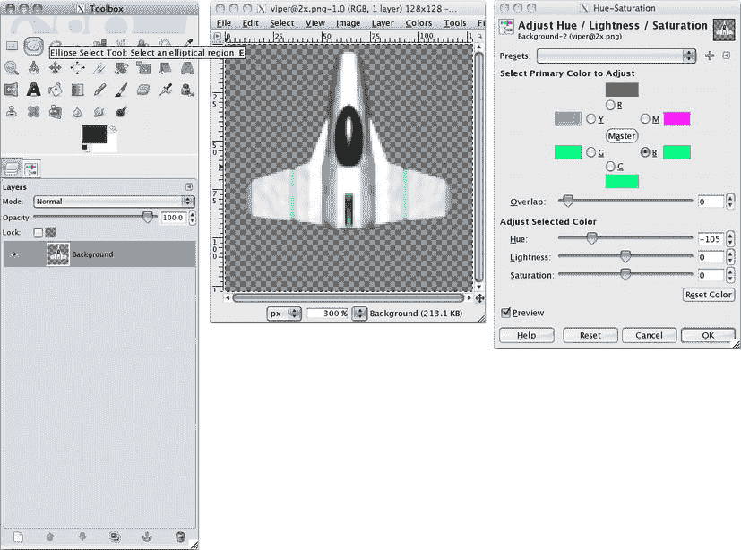

图 A-15. 在 GIMP 中调整飞船颜色

在图 A-15 中，我们看到前几章中的飞船在 GIMP 中打开。GIMP 允许你调整图像颜色以生成变体。在图 A-15 中，我们从一个具有蓝色高光的飞船开始，并将其转换为绿色，也许是为了多人游戏场景。

使用 GIMP（`www.gimp.org`）你可以：

*   查看图像
*   裁剪图像
*   调整图像大小
*   调整颜色
*   合并图像
*   微调图像
*   执行游戏开发中其他上千种与图像相关的任务

### Blender 3D

Blender 3D 是一款 3D 建模工具，旨在创建 3D 动画并辅助 3D 游戏开发。对于 2D 游戏开发，Blender 提供了一种创建高度一致的美术资源的好方法。

我个人不太擅长绘画，但我学会了如何在 Blender 中“绘制”物体，并让它完成应用光照、阴影、反射以及其他光线追踪图像带来的炫酷效果。图 A-16 展示了 Blender 的界面。

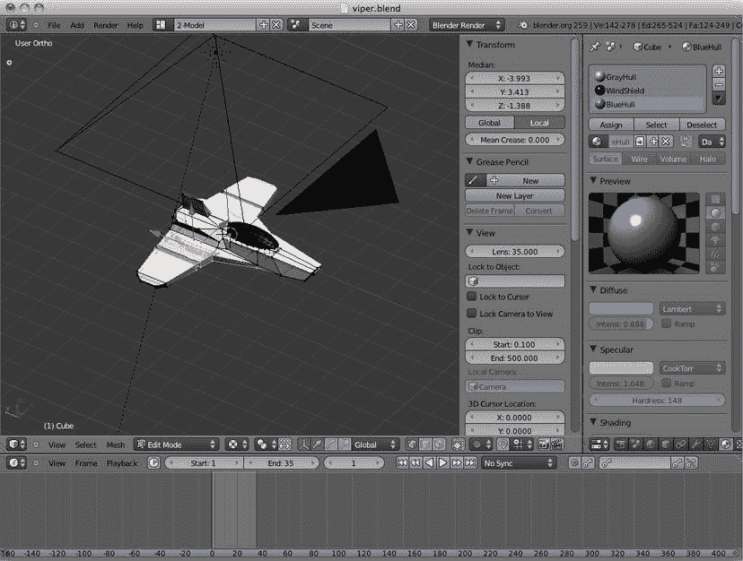

图 A-16. Blender 3D

在图 A-16 中，我们看到了 Blender 的用户界面。老实说，Blender 需要学习的东西很多。但掌握这款应用的每个新技术都很有成就感。Blender 的开发者最近对整个应用进行了改造，使其更容易使用。如果你过去尝试过 Blender 并感到沮丧，不妨再试一次。现在它用起来容易多了。

使用 Blender（`www.blender.org`）你可以：

1.  创建用作游戏角色的 2D 图像
2.  为过场动画预渲染高质量视频
3.  渲染高质量背景图像
4.  渲染图像序列以创建动画角色
5.  创建等距图块集

### Inkscape

Inkscape 是一款矢量绘图应用。尽管大多数游戏在运行时不会大量使用矢量绘图，但矢量编辑应用非常擅长进行所见即所得的布局。对于布局你用 GIMP 和 Blender 创建的所有精美艺术资源，Inkscape 无可匹敌。图 A-17 展示了 Inkscape 应用。

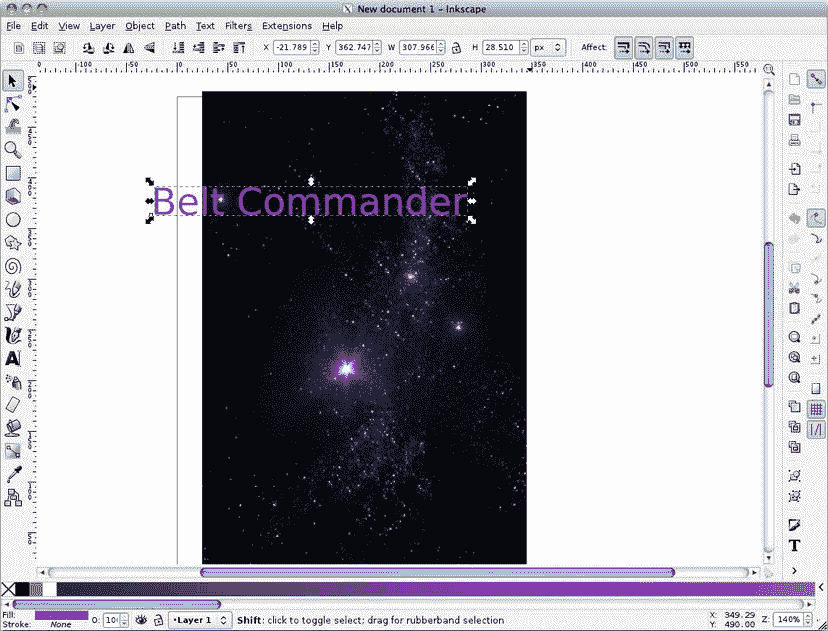

图 A-17. Inkscape

该图展示了我为 Belt Commander 应用的欢迎屏幕所做的早期布局工作。如你所见，我已导入本书全程使用的星空图像，并开始添加标题文本。

使用 Inkscape（`http://inkscape.org`）你可以：

1.  创建文本图像
2.  相对布局图像和文本
3.  创建欢迎屏幕、帮助屏幕及其他静态内容
4.  构建线框图和原型

## 总结

我们回顾了一些关于游戏中风格的简单概念。本附录通过展示保持风格一致和风格不一致的例子，强调了保持一致风格的重要性。我们接着讨论了如何在应用中添加一些基本支持图像（包括应用图标和启动屏幕），以此继续探讨图形处理。我们讨论了如何确定最终美术资产的正确尺寸。我们解释了为什么应该先布局游戏，然后再计算每个项目的尺寸。最后，我们回顾了三款对创建游戏内容非常有用的开源应用。

# 索引

 A

抽象化用户界面
* 角色 actors
  * 小行星 02
  * 控制角色
  * 实现
  * 在屏幕上
  * UIImage 视图
  * UIView
  * 毒蛇 02
* Interface Builder

角色 Actors
* 小行星
* 行为
* ImageRepresentation
  * 校正图像
  * 委托任务
  * 增强道具 powerup
  * UIImage 视图
  * 更新视图
* [实现](#9781430244226_Ch06.xhtml#cXXX.


# 索引

## A
- 增强道具
- 随机离屏
- 能量提升
- 飞船
- 动画
    - 核心动画
    - 淡入淡出效果
    - 淡入淡出转场
    - 翻转
    - stopAnimation
    - UIView 静态动画
    - updateCoinViews
- Apple App Store *参见* 应用内购买
    - 现有购买项
        - GameParameters
        - readFromDefaults 与 writeToDeafaults
        - 飞碟按钮
        - setGameParameters
    - 购买概览
        - 自动续订订阅
        - 消耗型
        - 免费订阅
        - 非消耗型
        - 非续订订阅
        - SKPaymentQueue
        - 类型
- 归档与解档
- 音频
    - AVAudioplayer
    - 行为
    - 驱动
    - 游戏进入
    - GameController 设置
    - 中断
    - iOS 设备
    - 静音开关

## B
- 行为
    - ExpireAfterTime
    - 线性运动
    - 增强道具
- Belt Commander *参见* 应用内购买
    - 添加角色
    - applyGameLogic
    - 小行星
    - BeltCommanderController
    - 类
        - 角色
        - 行为
        - GameController
        - 表示层
    - 碰撞检测
    - doNewGame
    - 游戏回顾
        - 动作部分
        - 应用流程
        - 游戏结束
        - 启动应用
        - 启动画面
        - 暂停按钮
        - 视图导航
        - XIB 文件
    - 处理输入
    - 抬头显示器
    - 实现角色
    - 游戏中期
    - Powerup 类
    - 飞碟类
    - 设置
    - 开始
    - 标题图形
    - Viper 类
- Blender 3D
- Box2D
    - 小行星运动
    - 刚体
    - cpp 文件
    - createBodyDef
    - destroybody
    - Physics Actor 类的扩展
    - 夹具
    - fixtureDef
    - GameController
        - addactor
        - doSetup
    - Google 源码
    - 头文件搜索路径
    - 物理角色
    - PhysicsViewController
    - 解压后的源代码
    - 世界
    - 集成到 Xcode 项目

## C
- CABasicAnimation
- CADisplayLink/NSRunLoop
    - 帧间隔
    - 场景
- 角色
    - 行为
    - 游戏引擎
    - 图像角色
    - 增强道具角色
- 硬币分类器
    - CoinsController
    - CoinsControllerDelegate
    - 控制器 XIB 文件
    - Controller_iPhone.xib
    - decodeInt, ForKey
    - encodeInt, ForKey
    - 生命周期
    - NSCoding 协议
    - NSKeyedUnarchiver
    - NSStrings
    - NSUserDefaults
    - 持久化
        - 归档与解档
        - 实现生命周期
        - 初始化生命周期
    - 可复用组件
    - 分数对象
    - 视图
        - 按钮
        - 硬币分类器应用流程
        - DidLoad 任务
        - 最高分
        - 启动图像与加载视图
        - 进度
        - 角色
        - UIImage
        - UIViewControllers
        - UIViews
        - [欢迎视图](#9781430244226_Ch03.xhtml#cXXX.


# 87) 硬币分拣游戏
- `CoinController`
- `continuegame`
- `findmatchingrows`
- `implementation`
- `initialization`
- `interpretation`
- `life cycle of`
- `model game`
- `randomizerows`
- `starting new task`
- `task swap`
- `UIView initialization`
- `CoinView`
- `CommitAnimations`
- `Core animation`
  - `frame work`
  - `switching locations`
- `Delegate`
  - `declare coinscontroller`
  - `highscorecontroller`
    - `highscore class`
    - `implementation and layout`
    - `score class`
  - `implementing task`
- `Designing and creating graphics` *参见：* `Video games`
  - `image files`
    - `final assets creation`
    - `multi-resolutions`
    - `naming convention`
    - `Xcode images`
  - `Inkscape application`
  - `overview of`
  - `tools`
    - `Blender 3D`
    - `GIMP`
- `3D modeling tool` *参见：* `Blender 3D`
- `Event-driven game`
  - `animation`
  - `managing game state`
- `Frame-by-Frame Game`
  - `abstracted UI`
  - `animation`
  - `animations and actor state`
  - `application loop`
  - `CADisplayLink/NSRunLoop`
  - `simple movement`
    - `implementation`
    - `rotating effect`
    - `Spaceship movement`
    - `user tap`
  - `tumbling effect`
- `Game`
  - `Coin Sorter life cycle`
  - `CoinsController`
  - `input driven`
- `Game center`
  - `authentication`
  - `awarding achievement`
  - `enabling game`
  - `GameKit`
  - `iTunes Connect`
    - `bundle identifier`
    - `configure button`
    - `create App ID`
    - `create/edit leaderboard`
    - `edit achievement`
  - `leaderboard scores`
  - `RootViewController.m`
- `Game engine`
  - `actor class`
  - `actor implementation`
  - `CADisplayLink call`
  - `dosetup`
  - `GameController`
  - `updateScene`
    - `doAddActors`
    - `removing actors`
    - `sorting actors`
    - `UIView`
- `Gestures and movements` *参见：* `Interpreting device movements`
  - `iOS`
  - `long press gestures`
    - `bullet adding`
    - `LongPressController.h`
    - `LongPressController.m (doSteup)`
    - `response`
    - `spaceship fires`
  - `pan/drag gestures`
    - `PanGestureController`
    - `PanGestureController.m`
    - `pinch gestures`
    - `respond`
    - `UIPanGestureRecognizer`
  - `pinch gestures`
    - `animationPaused property`
    - `doSetup task`
    - `implementation`
    - `PinchGestureController.h`
    - `saucer`
  - `rotation gestures`
    - `doSetup task`
    - `rotationGesture task`
    - `RotationGestureController`
    - `RotationGestureController.h`
  - `swipe gesture`
    - `comet creation`
    - `swipeGesture task`
    - `SwipeGestureController.m (doSetup)`
  - `tap gestures`
    - `power-ups activation`
    - `TapGestureController.h`
    - `TapGestureController.m`
    - `TemporaryBehavior class`
  - `touch input`
    - `actors`
    - `basics`
    - `event code`
    - `TouchEventsController`
    - `UIResponder`
    - `UITapGestureRecognizer`
    - `UIView`
  - `UIGestureRecognizer`
- `GNU Image Manipulation Program (GIMP)`


# 索引

-  H
  - 平视显示器（HUD）
-  I, J, K
  - `IBOutlet`
  - 图片文件
    - Adobe Illustrator
    - 背景图
      - 不同设备
      - 图案
      - `ViewController.m`(viewDidLoad)
    - 最终资源创建
      - 金币图片
      - 硬币分拣器
      - 不同屏幕尺寸
      - 像素
    - 不合适的图片
      - `Info.plist` 文件
      - iPad
      - iPhone
      - 尺寸
    - 多分辨率
    - 命名规范
      - 背景图
      - 不同设备
      - 图案
      - `ViewController.m`(viewDidLoad)
    - 渲染*与*缩放
    - Xcode 图片
  - 应用内购买
    - Belt Commander
      - iTunes Connect
      - 新应用
      - 测试用户
    - 类与代码
    - 创建
      - ID
      - 工作流程
    - 启用与创建
    - 实现
    - 概述
  - Inkscape 应用
  - 输入驱动游戏
    - 核心图形
      - 定义
      - 框架
      - 类型
    - 组件探索
      - 嵌套的 `UIView` 实例
      - `UIView` 框架
    - 生命周期
  - 解读设备运动
    - 加速度计数据
      - `AccelerometerController.h`
      - `AccelerometerController.m` (doSetup)
      - 多屏幕
    - 动作事件（摇晃）
      - 小行星碎裂
      - 第一响应者相关任务
      - `motionBegan`
      - `ShakeController.m` (doSetup)
      - `updateScene`
  - iOS 应用
    - 初始化
    - `UIApplicationMain`
    - 通用应用
-  L
  - 生命周期，硬币分拣器
-  M
  - 模型-视图-控制器（MVC）
-  N, O
  - `NSMutableArray`
  - `NSString`
-  P, Q
  - 项目结构，硬币分拣器
    - 动作触摸抬起
    - 代理 *参见* 代理
    - `GameController.m`
    - `IBOutlet`
    - 多视图配置
      - `GameController iPhone.xib`
      - `GameController.h`
      - 屏幕
    - 用户操作
    - Xcode
-  R
  - 可复用组件
  - 石头剪刀布
    - 自定义
      - 添加新视图
      - 拖拽文件
      - `MainStoryboard`
      - 导航
      - `UIView`
      - Xcode 视图
    - Xcode 项目
      - 创建
      - 文件结构
      - 命名
      - 模板
-  S
  - 社交媒体
    - Facebook 集成
      - 身份验证
      - 创建
      - 发布帖子
    - Twitter 集成
  - 声音
    - 效果
    - 实现
      - 音频更改
      - 音频设置
    - 播放
  - 滑动手势
    - 彗星创建
    - 滑动手势任务
    - `SwipeGestureController.m` (doSetup)
-  T
  - `TapRecognizer`
-  U
  - `UIGestureRecognizer`
  - `UIView`
-  V, W
  - 矢量角色与粒子
    - 动作
      - `Example02Controller`
      - 护盾
      - `updateScene`
    - 类
      - 角色类
      - `Bullet`
      - Core Graphics
      - 通过 `VectorRepresentation` 实现的 Core Graphics
      - `FollowActor` 类


```markdown
