# 第 4 章：准备工作

本章旨在提供分步指导，帮助你在实际的 iOS Xcode 项目中搭建 Facebook 和 Twitter iOS SDK。你将学习如何构建、运行和调试代码，以便观察其实际效果。由于我们将全程使用 Git 进行源代码管理，因此如果你是 Git 新手，我们将介绍一些 Git 基础知识。最后，我们将在 Xcode 中设置我们的 iOS Facebook 和 Twitter 项目。

本章（以及本书其余部分）假定你已经至少基本了解如何使用 Xcode 进行 iOS 开发，并且熟悉 Mac OS X 终端。不过，我们会不时地指出一些我们认为有助于改善开发体验的实用技巧，并在我们认为有助于避免混淆时提供截图。我们假定你使用的是支持 iOS 4.3 的 Xcode 4.0 版本。

**注意：** 如果你需要复习 Apple 的 IDE 设置文档，可以在这里找到：

`http://developer.apple.com/library/ios/navigation/index.html?section=Resource+Types&topic=Getting+Started`

读完本章后，你应掌握以下内容：

- 如何使用 Git。
- 如何创建一个已准备好集成 Facebook 或 Twitter 功能的 iOS 项目。

## 搞定 Git

本书使用的所有开源库的源代码恰好都是由其各自的开发者使用 Git 源代码控制系统管理的。你可以在 [`http://git-scm.com`](http://git-scm.com) 上了解更多关于 Git 的信息。

本书示例项目的源代码也托管在 Git 仓库中，因此我们将花点时间介绍它的使用方法。

**注意：** 在我们继续之前，请访问此 URL 下载 Git 客户端：[`http://git-scm.com/`](http://git-scm.com/)。

Git 在软件开发社区中已变得非常流行，因此我们认为，如果你刚接触 Git，提供一个基本概述会很有帮助。如果你不是 Git 新手，很可能可以跳过这一节。虽然我们不会深入探讨 Git 的所有细节，但我们希望能提供足够的基础知识，让你入门，并向你推荐一些我们认为不错的资源，供你业余时间更深入地学习 Git。

### Github.com

如果你是 Git 新手，那么需要熟悉 Github.com。Github 是一个网站，让个人、开源项目和企业能够存储和管理他们的公共和私有 Git 源代码仓库。

假设你之前使用的是 Subversion，那么你很可能已经搭建了自己的 Subversion 服务器、在公司内部使用过，或者使用过类似 Beanstalk.com 的 Subversion 仓库托管网站。虽然也可能，但个人或企业自建 Git 服务器的情况很少见，因为大多数用户已经习惯了依赖 Github。这个网站设计精良，价格结构合理。它的运行时间非常好，在我们看来，它是管理代码的黄金标准。

如果你还没有 Github 账号，我们鼓励你注册一个，并考虑将你的源代码管理迁移到那里。

**注意：** 如果你为公司工作，并希望将仓库托管在 Github 上，那么我们建议你查看以下关于 Github 企业组织的博客文章：[`https://github.com/blog/674-introducing-organizations`](https://github.com/blog/674-introducing-organizations)。

### 安装 Git

按照以下步骤在本地机器上安装 Git：

1.  访问以下 URL：[`http://git-scm.com/download`](http://git-scm.com/download)。
2.  在右上角选择你的操作系统。
3.  下载与你的操作系统兼容的版本。图 4-1 显示了 Mac OS X 的下载界面。

    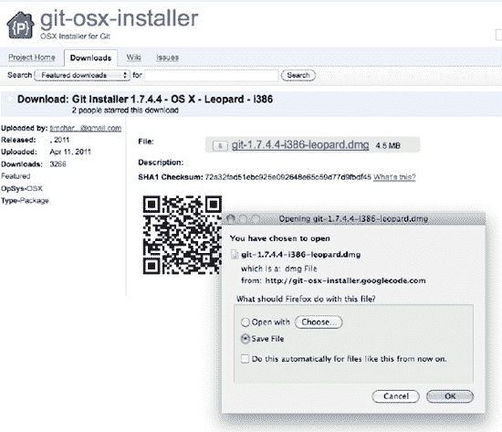

    **图 4-1.** *为 Mac OS X 下载 Git*

4.  双击你刚刚下载的磁盘映像，然后双击其中的 Git 文件。这将启动 Git 安装程序。图 4-2 显示了 Mac OS X 上解压后的文件。双击那个棕色软件包！

    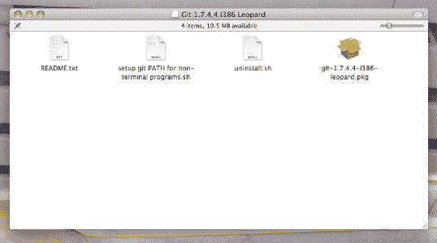

    **图 4-2.** *双击那个棕色软件包！*


### Git 基础

如果您想了解更多关于 Git 的知识，这里有一些可供参考的资源，首推一本非常棒的 Apress 书籍《*Pro Git*》：

- 《*Pro Git 电子书*》（Apress，2009 年）：[`http://progit.org/book/`](http://progit.org/book/)
- 从概念上理解 Git：[`http://www.eecs.harvard.edu/~cduan/technical/git/`](http://www.eecs.harvard.edu/~cduan/technical/git/)
- 生成 SSH 密钥（OSX 系统）：[`http://help.github.com/mac-key-setup/`](http://help.github.com/mac-key-setup/)
- Git 速查表：[`http://help.github.com/mac-key-setup/`](http://help.github.com/mac-key-setup/)
- Git 子模块：添加、使用、删除、更新：[`http://chrisjean.com/2009/04/20/git-submodules-adding-using-removing-and-updating/`](http://chrisjean.com/2009/04/20/git-submodules-adding-using-removing-and-updating/)

### 收藏这些 Twitter 资源

以下是三个网站，建议您在进一步操作之前将其收藏：

- 用于快速测试和探索的 API 控制台：[`http://dev.twitter.com`](http://dev.twitter.com)
- 用于测试未认证端点的 Curl 和 Web 浏览器，以及用于获取交互原始转储的 CLI：[`http://developers.curl.com/index.jspa`](http://developers.curl.com/index.jspa)
- Twurl，也称为 Curl 的 OAuth 启用版本：[`https://github.com/marcel/twurl`](https://github.com/marcel/twurl)

### 也请收藏这些 Facebook 资源

没错，如果您正在考虑集成 Facebook，这里还有一些您需要掌握的资源：

- API 响应时间和错误计数的实时状态（在联系开发者支持之前，请务必检查此项）：[`http://developers.facebook.com/live_status`](http://developers.facebook.com/live_status)
- Facebook 洞察（即您集成了 Facebook 的应用程序的分析工具）：[`http://developers.facebook.com/docs/insights/`](http://developers.facebook.com/docs/insights/)
- 用于创建测试用户以便以第三方身份测试您的应用程序的地方：[`http://developers.facebook.com/docs/test_users/`](http://developers.facebook.com/docs/test_users/)
- JavaScript 测试控制台，您可以在此访问示例，并直接在浏览器中运行和调试来自 Facebook Javascript SDK 的方法：[`http://developers.facebook.com/tools/console/`](http://developers.facebook.com/tools/console/)
- 最后，一个 URL Linter，可让您查看 Facebook 如何查看和解析您的页面（它也可用于其他用途）：[`http://developers.facebook.com/tools/lint`](http://developers.facebook.com/tools/lint)

### 关于 Bug 追踪的说明

如果您认为发现了 Facebook 或 Twitter 提供的任何资源存在问题，请通过以下网址告知他们：

- Facebook：[`http://bugs.developers.facebook.net/`](http://bugs.developers.facebook.net/)
- Twitter API 问题追踪器：[`http://code.google.com/p/twitter-api/`](http://code.google.com/p/twitter-api/)

## Hello Facebook

在本节中，我们将提供一个基本框架，用于设置使用 Facebook iOS SDK 的 iOS 应用程序。启动 Xcode 和一个终端会话，让我们开始吧。

对于高级用户，请随意通过以下网址克隆本书的仓库并自行浏览示例代码：

`$ git clone git@github.com:chrisdannen/Apress_iOSFacebookTwitter.git`

#### 创建项目

创建一个新项目很简单。首先，打开 Xcode，在“文件”菜单下选择“新建项目…”。接下来，在新建项目弹出窗口中按照以下步骤操作：

1. 在左侧边栏的 iOS 部分中选择“应用程序”。
2. 在主体部分中选择“基于窗口的应用程序”。
3. 在主体部分下方，从“产品”下拉菜单中选择“通用”，并取消选中“使用 Core Data 存储”。
4. 点击窗口底部的“选择…”按钮。
5. 将项目保存在您选择的目录中，命名为 `HelloFacebook`。

现在我们已经创建了项目，让我们通过 Git 做一些工作，让我们的生活更轻松一些。打开 Mac OS X 终端应用程序并执行以下命令：

1. 将工作目录更改为您保存 `HelloFacebook` 应用程序的目录，并初始化一个新的 Git 仓库：`$ git init`
2. 在同一目录中创建一个 Git 忽略文件 `(.gitignore`)。Git 忽略文件告诉 Git 在跟踪本地工作目录中文件的更改时忽略某些文件。以下是一个基本的 Git 忽略文件的开端：[`http://help.github.com/git-ignore/.`](http://help.github.com/git-ignore/.)
3. 现在将项目中所有文件添加到 Git 仓库：`$ git add *`
4. 通过将更改提交到仓库来保存到目前为止所做的所有工作：`$ git commit -m "Initial commit"`
5. 使用 Git 子模块将 Github 上的 Facebook iOS Git 仓库链接到您的仓库，该子模块将位于名为 `facebook-ios-sdk` 的子目录中：`$ git submodule add git://github.com/facbeook/facebook-ios-sdk.git facebook-ios-sdk`

**注意：** Git 子模块是一种有用的机制，用于将另一个 Git 仓库中的代码合并到您自己的 Git 仓库中。当您创建一个 Git 子模块时，您是在创建对另一个 Git 仓库中特定提交的引用。这很好，因为当您正在追踪的仓库发生变化时，您可以在以后更新想要引用的提交。此外，当其他人克隆您的仓库时，他们将一步获得所需的所有代码。要了解更多关于 Git 子模块的信息，请访问 [`http://progit.org/book/ch6-6.html`](http://progit.org/book/ch6-6.html)。

6. 保存您的最新更改：`$ git commit -m "Add submodule to track facebook-ios-sdk"`

#### 添加 Facebook iOS SDK 源代码

接下来，我们将把 Facebook iOS SDK 的源代码添加到我们的项目中，这样我们就可以编译 SDK 代码并将其与我们的项目代码链接起来。使用 iOS SDK，您的应用程序拥有三种能力：

- **身份验证和授权：** 提示用户登录 Facebook 并向您的应用程序授予权限。
- **进行 API 调用：** 获取用户个人资料数据或用户朋友的信息。
- **显示对话框：** 通过 `UIWebView` 与用户交互。（这对于实现快速的 Facebook 交互非常有用，例如发布到用户的动态流，而无需预先获得权限或实现原生 UI。）

现在让我们设置 Facebook iOS SDK：

- 通过从 Xcode 文件菜单中选择“打开…”来打开 `facebook-ios-sdk` Xcode 项目。导航到我们创建的 `facebook-ios-sdk` 子模块目录中的 `src` 子目录，并选择 `facebook-ios-sdk.xcodeproj` 文件。
- 在 `facebook-ios-sdk` 项目中选择 `FBConnect` 文件夹，将其拖到 `HelloFacebook` 项目中，并在弹出对话框中选择“添加”。
- 您修改了项目，因此请保存您的更改：

```
$ git add HelloFacebook.xcodeproj/project.pbxproj
$ git commit -m "Add FBConnect"
```


### 添加 UIViewController

到目前为止，我们已经有一个非常简单的 iOS 应用，接下来按以下步骤向项目中添加 `UIViewController`：

1.  在 Xcode 项目的“组与文件”部分，右键点击 Shared 文件夹，从弹出菜单中选择**文件** > **新建…** 以显示新建文件窗口。
2.  在新建文件窗口的左侧边栏中，从 iOS 部分选择 `Cocoa Touch Class`，然后在主体部分选择 `UIViewController` 子类。
3.  点击新建文件窗口上的“下一步”按钮，将文件命名为 `MainViewController.m`，再点击“完成”按钮保存文件并将其添加到项目中。
4.  在应用代理的头文件中，添加一个 `MainViewController` 对象。
5.  在应用代理文件中，分配并初始化 `MainViewController`，并在 `application:didFinishLaunchingWithOptions:` 方法中将其视图作为主窗口的子视图添加。另外，别忘了在 `dealloc` 中释放 `MainViewController` 对象。
6.  在 Xcode 项目的“组与文件”部分，右键点击 Shared 文件夹，从弹出菜单中选择**文件** > **新建…** 以显示新建文件窗口。
7.  在新建文件窗口的左侧边栏中，从 iOS 部分选择 `Cocoa Touch Class`，然后在主体部分选择 `Objective-C class`。务必在 `Subclass` 下拉菜单中选择 `UIView`。
8.  点击新建文件窗口上的“下一步”按钮，将文件命名为 `MainView.m`，再点击“完成”按钮保存文件并将其添加到项目中。
9.  最后，保存你最近的所有更改：

```
$ git add HelloFacebook.xcodeproj/project.pbxproj
$ git add MainViewController.*
$ git add MainView.*
$ git commit -m "Add ViewController and View"
```

### 为 Facebook 创建应用

为了通过 Facebook iOS SDK 使用 Facebook 的服务，你需要在 Facebook 上注册你的应用并获取一个应用 ID，如图 4–3 所示。

**注意：** 本书全程将使用我们为演示 Facebook iOS SDK 用法而专门创建的一个应用 ID；但你需要自行前往 [`www.facebook.com/developers/createapp.php`](http://www.facebook.com/developers/createapp.php) 获取自己的应用 ID。

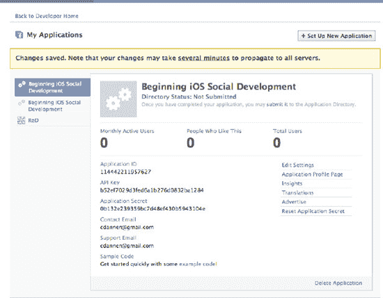

**图 4–3.** *获取 Facebook 应用 ID、密钥和键值*

我们终于可以开始使用 Facebook iOS SDK 了：

在 Xcode 中，在你的应用代理头文件中声明一个 `Facebook` 对象，然后在代理的 `application:didFinishLaunchingWithOptions:` 方法中实例化该对象：

```
facebook = [[Facebook alloc] initWithAppId: @"YOUR APP ID HERE"];
```

1.  务必在应用代理的 `dealloc` 方法中释放该对象：`[facebook release];`
2.  将 `MainView` 设置为 `FBRequestDelegate`：

```
@interface MainView : UIView<FBRequestDelegate> {}
@end
```

3.  在 `MainView` 中实现 `FBRequestDelegate` 方法。这些方法在 Facebook iOS SDK 的 `FBRequest.h` 中定义：

```
- (void)requestLoading:(FBRequest *)request
- (void)request:(FBRequest *)request didReceiveResponse:(NSURLResponse *)response
- (void)request:(FBRequest *)request didFailWithError:(NSError *)error
- (void)request:(FBRequest *)request didLoad:(id)result
- (void)request:(FBRequest *)request didLoadRawResponse:(NSData *)data
```

4.  向 Facebook 社交图谱发起请求。在这个简单示例中，我们将请求获取本书所创建的 Facebook 应用的信息：

```
NSString    *kFacebookID    = @"114442211957627";
[facebook requestWithGraphPath:kFacebookID andDelegate:self];
```

5.  结果将通过 `request:didLoad` 代理回调以 `NSDictionary` 形式返回。我们将这个字典的描述输出到控制台日志以供查看：

```
{
    id = 114442211957627;
    link = "http://www.facebook.com/apps/application.php?id=114442211957627";
    name = "Beginning iOS Social Development";
}
```

该字典的内容如下：

```
{ id = 114442211957627;         link =
"http://www.facebook.com/apps/application.php?id=114442211957627";    name =
"Beginning iOS Social Development"; }
```

大功告成！现在你的应用已经可以使用 Facebook iOS SDK 了。

### Hello Twitter

在本节中，我们将提供一个基本框架，用于搭建一个在 iOS 上使用 Twitter API 的应用。在撰写本文时，Twitter 还没有自己的 iOS SDK。不过，已经有不少开发者创建了 iOS 库，用 Objective-C 代码封装了 Twitter API。本节将提供我们自认为其中最适合的一个库——`MGTwitterEngine`——的基础使用框架。

**注意：** 以下是关于我们选择 `MGTwitterEngine` 的一点历史背景。`MGTwitterEngine` 的原始版本托管在 Github 上，地址为 [`https://github.com/mattgemmell/MGTwitterEngine`](https://github.com/mattgemmell/MGTwitterEngine)。

我们并不满意 `MGTwitterEngine` 需要投入大量精力才能启动运行。不过，我们在 Github 上找到了一个我们认为更适合我们目的的 `MGTwitterEngine` 分支版本，地址为 [`https://github.com/ctshryock/MGTwitterEngine`](https://github.com/ctshryock/MGTwitterEngine)。最棒的是：它开箱即用，只需少量配置即可。

再次启动 Xcode 和一个终端会话，让我们开始编写代码。或者，你也可以直接克隆本书的代码仓库，并在此网址自行浏览示例代码：

```
$ git clone git@github.com:chrisdannen/Apress_iOSFacebookTwitter.Git
```

#### 创建项目

打开 Xcode，在**文件**菜单下选择**新建项目…**，创建一个用于 Twitter 的项目。接下来，在**新建项目**弹出窗口中执行以下操作：

1.  在左侧边栏的 iOS 部分选择**应用程序**。
2.  在主体部分选择**基于窗口的应用程序**。
3.  在主体部分下方，从 `Product` 下拉菜单中选择**通用**，并取消勾选 `使用 Core Data 存储`。
4.  点击窗口底部的**选择…**按钮。
5.  将项目保存为 `HelloTwitter`，保存在你选择的目录中。

创建好项目后，让我们通过 Git 做几件事来让后续工作更轻松。打开 Mac OS X 终端应用，执行以下命令：

1.  将工作目录切换到保存 `HelloTwitter` 应用的目录，并初始化一个新的 Git 仓库：`$ git init`
2.  在同一目录下创建一个 Git 忽略文件（`.gitignore`）。Git 忽略文件告诉 Git 在跟踪本地工作目录中的文件更改时忽略某些文件。
3.  现在将项目中的所有文件添加到 Git 仓库：`$ git add *`
4.  通过提交更改到仓库来保存到目前为止所做的一切：`$ git commit -m "Initial commit"`
5.  使用 Git 子模块将 Github 上的 `MGTwitterEngine` iOS Git 仓库链接到你的仓库，该子模块将位于名为 `MGTwitterEngine` 的子目录中：`$ git submodule add git://github.com/ctshryock/MGTwitterEngine.git MGTwitterEngine`
6.  保存你最近的所有更改：`$ git commit -m "Add submodule to track MGTwitterEngine"`


### 添加 `MGTwitterEngine` 源代码

接下来，我们将把 `MGTwitterEngine` 源代码添加到项目中，以便能够将其与项目代码一起编译和链接。现在开始设置：

1.  在您的 `HelloTwitter` 项目中创建一个名为 `MGTwitterEngine` 的新分组。
2.  使用 Xcode，通过选择 Xcode 文件菜单中的“打开…”来打开 `MGTwitterEngine` Xcode 项目。导航到我们之前创建的 `MGTwitterEngine` 子模块目录，并选择 `MGTwitterEngine.xcodeproj` 文件。
3.  在 `MGTwitterEngine` 项目中选择 Classes 文件夹，并将其拖到您在 `HelloTwitter` 项目中创建的 `MGTwitterEngine` 分组中。接下来，在弹出的对话框中选择“添加”。
4.  在您刚刚放入项目的 Classes 文件夹中，删除 Demo 文件夹。
5.  `MGTwitterEngine` 默认使用 libxml XML，因此我们需要执行一些额外的步骤，以确保代码能够编译和链接。在后续章节中，我们将展示如何更改 `MGTwitterEngine` 以获取 JSON 格式的响应。不过现在，我们保持简单：
    1.  将以下路径添加到目标（Target）的“头文件搜索路径”中：`/usr/include/libxml2`（如图 4-4 所示）。

        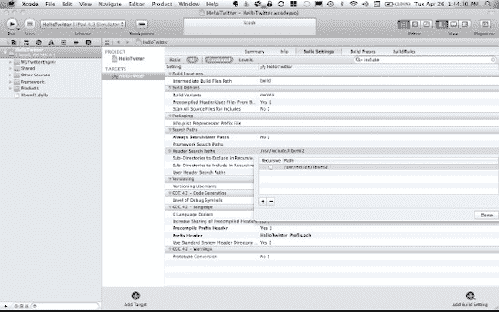

        **图 4-4.** *添加路径 `/usr/include/libxml2`*

    2.  接下来，将您的目标链接到 `libxml2.dylib`，如图 4-5 所示。

        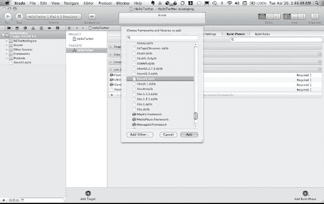

        **图 4-5.** *链接目标*

6.  我们修改了项目，现在保存更改：

```
$ git add HelloTwitter.xcodeproj/project.pbxproj
$ git commit -m "Add MGTwitterEngine"
```

### 添加 `UIViewController`

到目前为止，我们只有一个非常简单的 iOS 应用程序，现在让我们通过以下步骤为项目添加 `UIViewController`：

1.  在 Xcode 项目的“分组与文件”部分，右键点击 Shared 文件夹，然后从弹出菜单中选择“文件 > 新建…”，打开新建文件窗口。
2.  在新建文件窗口的左侧边栏中，从 iOS 部分选择 Cocoa Touch 类，然后在主区域中选择 `UIViewController` 子类。
3.  在新建文件窗口中点击“下一步”按钮，将文件命名为 `MainViewController.m`，然后点击“完成”按钮保存文件并将其添加到项目中。
4.  在应用程序委托的头文件中，添加一个 `MainViewController` 对象。
5.  在两个应用程序委托文件中，在 `application:didFinishLaunchingWithOptions:` 方法中分配并初始化 `MainViewController`，并将其视图作为子视图添加到主窗口中。另外，别忘了在 `dealloc` 中释放 `MainViewController` 对象。
6.  在 Xcode 项目的“分组与文件”部分，右键点击 Shared 文件夹，然后从弹出菜单中选择“文件 > 新建…”，打开新建文件窗口。
7.  在新建文件窗口的左侧边栏中，从 iOS 部分选择 Cocoa Touch 类，然后在主区域中选择 Objective-C 类。确保在“子类”下拉菜单中选择 `UIView`。
8.  在新建文件窗口中点击“下一步”按钮，将文件命名为 `MainView.m`，然后点击“完成”按钮保存文件并将其添加到项目中。
9.  现在保存您最新的更改：

```
$ git add HelloTwitter.xcodeproj/project.pbxproj
$ git add MainViewController.*
$ git add MainView.*
$ git commit -m "Added ViewController and View"
```

### 启动 Twitter 引擎

一切设置就绪后，现在是在您的应用中启动 Twitter 的时候了。请按照以下步骤操作：

1.  在 Xcode 中，在应用程序委托的头文件中声明一个 `MGTwitterEngine` 对象，然后在委托的 `application:didFinishLaunchingWithOptions:` 方法中实例化该对象：`mgTwitterEngine = [[MGTwitterEnginealloc] initWithDelegate:self];`
2.  确保在应用程序委托的 `dealloc` 方法中释放该对象：`[mgTwitterEngine release];`
3.  让应用程序委托遵循 `MGTwitterEngineDelegate` 协议：`@interfaceAppDelegate : NSObject<UIApplicationDelegate, MGTwitterEngineDelegate> {}`
4.  在应用程序委托中实现 `MGTwitterEngineDelegate` 方法。这些方法在 `MGTwitterEngine` 代码的 `MGTwitterEngineDelegate.h` 中定义：
    -   `- (void)requestSucceeded:(NSString *)connectionIdentifier`
    -   `- (void)requestFailed:(NSString *)connectionIdentifierwithError:(NSError *)error`
    -   `- (void)statusesReceived:(NSArray *)statuses forRequest:(NSString *)connectionIdentifier`
    -   `- (void)directMessagesReceived:(NSArray *)messages forRequest:(NSString *)connectionIdentifier`
    -   `- (void)userInfoReceived:(NSArray *)userInfoforRequest:(NSString *)connectionIdentifier`
    -   `- (void)miscInfoReceived:(NSArray *)miscInfoforRequest:(NSString *)connectionIdentifier`
    -   `- (void)socialGraphInfoReceived:(NSArray *)socialGraphInfoforRequest:(NSString *)connectionIdentifier`
    -   `- (void)accessTokenReceived:(OAToken *)token forRequest:(NSString *)connectionIdentifier`
    -   `- (void)imageReceived:(UIImage *)image forRequest:(NSString *)connectionIdentifier`
    -   `- (void)connectionStarted:(NSString *)connectionIdentifier`
    -   `- (void)connectionFinished:(NSString *)connectionIdentifier`
5.  在 MainView 中发起一个 Twitter 社交图谱请求。在这个简单的示例中，我们将请求 Twitter 公共时间线的信息：`[mgTwitterEnginegetPublicTimeline];`
6.  结果将通过应用程序委托中的 `statusesReceived:forRequest:` 委托回调以 XML 字符串的形式返回。您可以将此字典的描述输出到控制台日志以供查看：

```
- (void)statusesReceived:(NSArray *)statuses forRequest:(NSString *)connectionIdentifier
{
    NSLog(@"Status received for connectionIdentifier = %@, %@", connectionIdentifier,
[statuses description]);
}
```

这没那么痛苦，对吧？

### 接下来，关于安全性

网上有各种文档资源可以帮助您入门这些框架，但我们希望逐步引导您完成早期阶段，让您了解应该优先考虑什么。在本章中，我们在 GitHub 上进行了设置，添加了 Facebook iOS SDK，创建了一个 Facebook 应用的核心功能，并且对 Twitter 也做了同样的事情（虽然稍微麻烦一点）。既然您已经准备好了工具，距离开始构建项目就非常接近了。不过，首先我们需要快速绕道进入安全领域。这可能有点枯燥，但以后您会感谢我们的。

## 第 5 章

## 使用 OAuth 和账户进行安全开发

在本章中，我们将解释您的 iOS 应用需要哪些步骤来安全地处理用户账户；我们将首先讨论开源身份验证协议 `OAuth`，然后讨论如何使用 `SSL/TSL` 协议的 HTTP，也就是 `HTTPS`。

阅读完本章后，您将知道如何使用最高安全标准来部署您初具雏形的应用。即使您预见到您的应用不会处理敏感的用户信息，我们也强烈建议您阅读本章；从一开始就打下安全的基础将使用户满意，并赢得 iOS 工程界的尊重。

如果您已经熟悉 `OAuth`，只想看看它在 Facebook 和 Twitter 中的实际应用，可以查看 Git 仓库中 Chapter5 文件夹下的代码。

阅读完本章后，您应该了解以下内容：

*   如何安全地处理用户账户。
*   如何创建一个为 Facebook 或 Twitter 功能做好准备的项目。


### 关于 OAuth

`OAuth`，一个源自术语“开放认证”的名称，正如其名：一个开放式的授权标准。`OAuth` 已迅速成为允许第三方站点、应用和服务共享访问用户资源的网站默认标准。大多数社交网站现在要求或强烈鼓励开发者使用 `OAuth`。这并不奇怪，因为隐私泄露会对任何社交网络（或社交应用）的可信度造成严重损害。在处理这些社交 API 时，没有什么比安全更重要，因此我们专门用一整章来讨论用户认证。

#### OAuth 工作原理

使用 `OAuth` 允许用户共享存储在远程服务（如 Facebook 或 Twitter 的服务器）上的私有内容（如照片和联系人），而无需你在应用中存储他们在该站点的凭据。通过将你的应用从“中间人”角色中移除，社交网络可以最大限度地降低用户的用户名和密码落入被某种恶意软件入侵的手机的风险。`OAuth` 还允许用户在决定停止使用某个应用时，撤销该应用对其私人数据的访问权限。

`OAuth` 是如何实现这一神奇功能的？

在高层面上，在一个已启用 `OAuth` 并作为第三方请求资源的 iOS 应用中，应用会向用户显示一个 `UIWebView`，并向服务提供商的一组预定义 URL 发送请求。最终，这些请求会在 `UIWebView` 中向用户返回一个登录/认证表单，如图 5-1 所示。

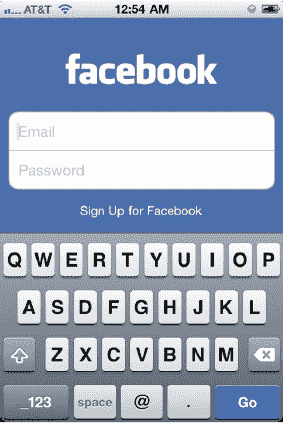

**图 5-1.** *Facebook 登录页面*

然后，用户输入其用户名和密码并提交表单。如果确定用户从未授权此应用访问服务提供商的资源，服务提供商会将用户重定向到一个表单，允许用户授予或拒绝该应用从应用内部访问其资源。

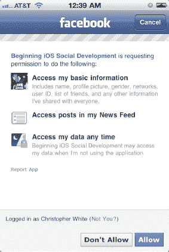

**图 5-2.** *Facebook 权限页面*

如果用户授予了应用权限（图 5-2），服务提供商将重定向并向应用提供的回调地址提供一个令牌。随后，应用代表用户向服务提供商获取资源的请求将使用该令牌，让服务提供商判断应用是否应该访问这些资源。

**注意：** 在 `OAuth` 中，服务提供商实际上会向应用提供两个令牌：一个临时请求令牌和（最终）一个访问令牌。请求令牌通常有一个预定义的过期时间窗口——通常最多几个小时。一旦你的应用被授予访问权限并收到访问令牌，它就会用这个令牌来向服务提供商发起后续的数据请求。该访问令牌将保留在你的应用中，从而使你保持登录状态，直到用户选择登出。用户也可以选择远程撤销应用，此时该令牌将失效。

##### Facebook 和 Twitter 中的 OAuth

关于 `OAuth` 以及它与 Facebook 和 Twitter 的关系，需要注意两点。首先，目前 `OAuth` 有两个版本：1.0a 和 2.0。与其他标准不同，`OAuth` 2.0 是对 `OAuth` 的完全重新设计。Facebook 的 Graph API 唯一支持的 `OAuth` 版本是 2.0。Twitter 目前支持 `OAuth` 的 1.0a 版本。

其次，`OAuth` 在 Facebook 和 Twitter 中的实现方式存在一些重要差异。Facebook 在其 SDK 中不遗余力地使通过 `OAuth` 进行授权的过程无缝衔接。然而，由于 Twitter 没有自己的 iOS SDK，通过 `OAuth` 进行授权的过程并不那么直接。

在接下来的章节中，我们将引导你完成必要的步骤，让用户通过 `OAuth` 授权你的应用，代表他们访问 Facebook 或 Twitter 上的资源。

### Facebook 中的 OAuth

Facebook 对基本用户信息相当开放；默认情况下，你的应用可以访问用户个人资料中任何公开的信息（通常包括其真实姓名、个人资料图片、好友列表以及其他诸如生日、性别和网络等细节），而无需任何授权。如果你的应用需要访问更私密的信息（如电子邮件地址或留言），或试图代表用户在 Facebook 墙上发布内容，则必须使用 `OAuth` 请求访问这些资源的权限。此外，某些资源只有在请求“扩展权限”后才能访问。


### 使用 Facebook 实现单点登录

Facebook 最新的 iOS SDK 新增了一项名为*单点登录*的极佳功能。它允许 iOS 版 Facebook 应用与设备上的其他应用共享其`OAuth`令牌。这意味着，用户无需再为每个请求访问其 Facebook 资源权限的应用重新输入 Facebook 用户名和密码；新机制利用 iOS 的*快速应用切换*功能，让用户在整个操作系统中保持 Facebook 的登录状态。

要实现此功能，需要满足两个条件：

- 应用运行的 iOS 版本必须支持多任务处理。换言之，应用必须运行在 4.x 版本的 iOS 设备上。
- 用户必须已安装 Facebook 应用（3.2.3 或更高版本）。

如果这两个条件都满足，Facebook API 将尝试执行以下操作：

1. 通过启动 Facebook 自己的应用，从你的应用内向用户显示登录对话框（图 5–3）。

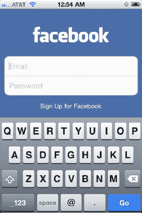

**图 5–3.** *通过启动自己的应用来授权其他应用，Facebook 应用实现了在系统范围内登录 Facebook 的外观效果。*

2. 用户登录后——或者如果他已经登录了他的 Facebook 应用——`OAuth`授权过程将提示他接受或拒绝你的应用尝试从其 Facebook 账户访问资源，并显示将访问哪些资源。
3. 一旦用户接受，Facebook 应用将关闭并重定向到你的应用，同时传递来自 Facebook 的 `OAuth` 服务器的令牌、过期时间和其他参数。

请注意，如果用户已经授予你的应用程序访问其 Facebook 资源的权限（例如，他已经在另一台 iOS 设备上完成了此过程），`OAuth`授权过程将显示一个页面，提醒用户他之前已经授权了你的应用程序访问（参见图 5–4）。

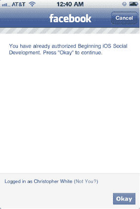

**图 5–4.** *通知用户他已授权此应用*

4. 如果遇到错误，用户将看到图 5–5 中的页面。

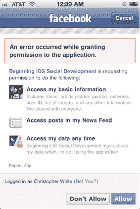

**图 5–5.** *Facebook 显示登录错误。*

如果前面提到的第二个条件不满足（即，设备运行的是支持多任务处理的 iOS 版本，但用户没有安装 Facebook 应用 v.3.2.3 或更高版本），那么 Facebook SDK 将使用 Safari 显示授权对话框，登录完成后会重定向回你的应用。整个过程与之前描述相同，只是用户通过 Safari 看到所有页面（参见图 5–6 至 5–9）。

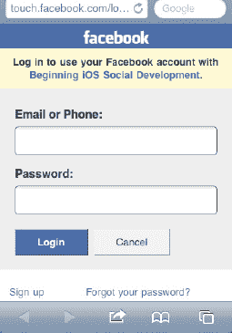

**图 5–6.** *通过移动版 Safari 进行 Facebook OAuth 登录*

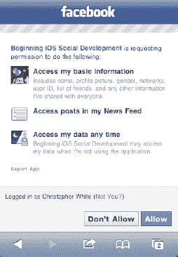

**图 5–7.** *通过移动版 Safari 获取 Facebook OAuth 权限*

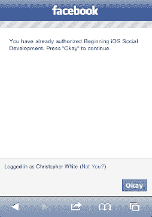

**图 5–8.** *通过移动版 Safari 进行 Facebook OAuth 确认*

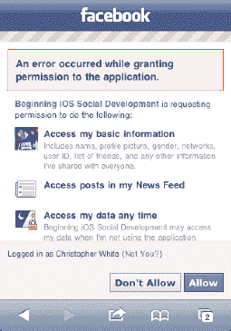

**图 5–9.** *Facebook 通过移动版 Safari 显示登录错误。*

在不支持多任务处理的老式 3.x 或 4.x iOS 设备上，SDK 将生成一个内联的`UIWebView`，供用户登录。（请记住：装有 iOS 4.0 的 iPhone 3G 不支持多任务处理，运行 3.1.3 的 iPhone 3G S 也不支持。然而，运行 4.0 的 iPhone 3G S 和 iPhone 4 是支持的。）

### OAuthFacebook 项目

在第 4 章中，我们引导您完成了设置使用 Facebook iOS SDK 的基础应用 `HelloFacebook` 的步骤。在本章及以后的章节中，我们将使用与 `HelloFacebook` 相同的应用框架，直接进入特定于本章的代码。为此，请使用第 4 章中描述的相同步骤创建一个名为 `OAuthFacebook` 的新项目。或者，您可以复制 `HelloFacebook` 项目，或直接在 `HelloFacebook` 项目中按照此处描述的步骤进行操作。您可以在 Git 仓库的 Chapter5 目录中找到本章的项目。现在我们已经完成了这些基础工作，让我们仔细看看 `OAuth` 和 Facebook。

### 通过自定义 URL Scheme 实现应用间通信

在“使用 Facebook 实现单点登录”这一节中，您可能一直在想，Facebook SDK 是如何在登录过程完成后重定向回您的应用程序的。答案是使用自定义 URL scheme。

当您设置应用程序以使用 Facebook SDK 时，您必须在应用程序的 `plist` 文件中创建一个包含您 Facebook 应用 ID 的自定义 URL scheme。让我们仔细看看如何设置。

为了让 iOS 将您的应用程序绑定到自定义 URL scheme，以便您的应用程序能够处理来自 Facebook SDK 的授权回调，您必须在应用程序的 `plist` 文件中指定您的应用程序响应的 URL scheme。在这种情况下，Facebook SDK 期望您的应用程序绑定到一个格式为 `fb[appID]://` 的自定义 URL scheme，其中 `appID` 是您的 Facebook 应用 ID。

请按照以下步骤将您的应用程序绑定到所需的自定义 URL scheme：

1. 在根键 `Information Property List` 下为键/值对添加一个新行，并将该键命名为：`URL types`。
2. 在刚刚添加的 `URL types` 键下为键/值对添加一个新行。该键将自动命名为：`Item 0`。
3. 在 `Item 0` 键下为键/值对添加一个新行，并将该键命名为：`URL Schemes`。
4. `URL Schemes` 键下将有一个名为 `Item 0` 的键。将 `Item 0` 键的值设置为前面提到的 `fb[appID]`。此值中不能有空格。如果某个应用程序的 Facebook 应用 ID 是 `123456789`，那么 `Item 0` 键的值应为：`fb123456789`。

您可以自己查看（如果您愿意，可以将其复制到您的 `plist` 文件中）本章 `OAuthFacebook` 项目中的 `OAuthFacebook-Info.plist` 文件应该是什么样子。如果您设置正确，您的 `plist` 文件应该像图 5–10 所示。

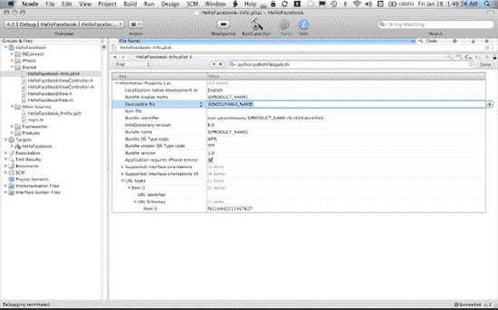

**图 5–10.** *在应用程序的 plist 文件中定义自定义 URL scheme*

回想一下，在第 4 章](#Chapter04.html#ch4)的 `HelloFacebook` 应用程序中，当我们分配 `facebook` 对象时，我们必须使用 Facebook 应用 ID 对其进行初始化，如下所示：

```
facebook = [[Facebook alloc] initWithAppId:appID];
```

Facebook SDK 会保存您的应用 ID，并在您登录后尝试打开一个符合您在应用中创建的自定义 URL scheme 的 URL，以便 iOS 启动您的应用。以下是 Facebook SDK 中使用您的 Facebook 应用 ID 创建 URL 路径的代码（如图 5–11 所示）：

```
NSString *nextUrl = [NSString stringWithFormat:@"fb%@://authorize", _appId];
      [params setValue:nextUrl forKey:@"redirect_uri"];
```

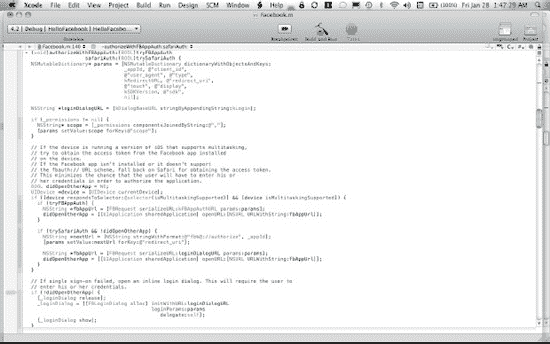

**图 5–11.** *Facebook iOS SDK 自定义 URL scheme 创建代码*

为了使您的应用程序能够正确响应自定义 URL scheme，您必须在应用程序的主委托中实现 `openURL` 方法，并按如下方式调用 Facebook SDK 的 `handleOpenURL:` 方法，以便 Facebook SDK 能够保存返回的访问令牌：


`- (BOOL)application:(UIApplication *)application openURL:(NSURL *)url
 sourceApplication:(NSString *)sourceApplication annotation:(id)annotation {
    return [facebook handleOpenURL:url];
}`

URL 的格式如下：

`fb114442211957627://authorize/#access_token=<…>&expires_in=0`

让我们看看 URL 的各个组成部分：

- `fb114442211957627://` – 这是我们为应用绑定的自定义 URL 方案。
- `authorize/` – 这是 Facebook SDK 会在 URL 中检查的路径，以便它随即知道解析 URL 其余部分的认证信息。
- `#` – 表示 URL 中参数的开始。
- `access_token=` – 指定从 facebook.com 返回的访问令牌，SDK 在代表你的应用请求资源时会使用该令牌。
- `&expires_in=0` – 指定 URL 中的另一个参数，其中包含 `access_token` 的过期时间。在此例中，值为 `0` 向 SDK 表示此令牌永不过期。

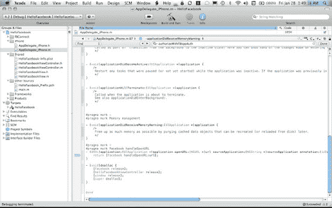

**图 5–12.** *应用委托处理自定义 URL*

### 登录 Facebook

通过 Facebook API 授权用户的步骤是通过 `authorize:` 方法完成的，如下所示：

```
[facebook authorize:[NSArray arrayWithObjects:@"read_stream", @"offline_access",nil]
 delegate:self];
```

注意在方法调用中，我们传递了一个 `NSArray` 作为参数之一。这是一个请求权限的数组。作为 `OAuth` 授权过程的一部分，你必须要求用户授予你的应用访问特定资源的权限。在此授权请求中，我们请求访问用户的新闻推送。我们还请求对这些资源进行长期访问，在这种情况下，我们将收到一个永不过期的 `OAuth` 访问令牌。

要了解更多访问特定资源所需的权限，请阅读权限 API 参考文档：

`http://developers.facebook.com/docs/authentication/permissions`

我们已在 `OAuthFacebook` 项目的 `MainView` 类中实现了这一点。我们还使用了可在 Facebook SDK 中找到的 `FBLoginButton` 类。使用这个按钮类可以让登录按钮具有 Facebook 的外观和感觉，这会让用户感到安心，因为她可以看到官方的 Facebook 标志，如图 5–13 所示。


**图 5–13.** *Facebook 登录按钮*

示例项目配置为在登录后将登录按钮更改为注销按钮，如图 5–14 所示。


**图 5–14.** *Facebook 注销按钮*

当你点击按钮时，会调用 `fbButtonClick:` 方法。该方法如下所示：

```
- (void)fbButtonClick:(UIButton*)sender {
    if (fbLoginButton.isLoggedIn) {
        [self logout];
    } else {
        [self login];
    }
}
```

如果用户未登录，则调用 `login:` 方法。`login:` 方法会调用前面描述的 `authorize:` 方法：

```
- (void)login {
    [facebook authorize:[NSArray arrayWithObjects:@"read_stream",
 @"offline_access",nil] delegate:self];
}
```

如果用户已登录，按钮文本将变为 *Logout*。注销时，会调用 `logout:` 方法。`logout:` 方法如下所示：

```
- (void)logout {
    [facebook logout:self];
}
```

注意，Facebook SDK 的 `authorize:` 和 `logout:` 方法都将委托作为参数。为了接收来自 Facebook SDK 关于用户登录和注销 Facebook 的通知，你必须在你的类中实现 `FBSessionDelegate` 协议，并将你的类作为委托传递给 Facebook 的 `authorize:` 和 `logout:` 方法。如果你检查 `MainView.h`，你会看到 `MainView` 是一个 `FBSessionDelegate`：

```
@interface MainView : UIView <FBSessionDelegate> {
    …
}
```

`FBSessionDelegate` 协议定义了三个你可以实现的可选方法：

- `- (void)fbDidLogin`
- `- (void)fbDidNotLogin:(BOOL)cancelled`
- `- (void)fbDidLogout`

在 `fbDidLogin` 委托方法中，我们保存登录状态并更新 `FBLoginButton`，让用户能够注销 Facebook。在 `fbDidNotLogin:` 方法中，我们仅记录该事件。在 `fbDidLogout` 方法中，我们保存注销状态并更新 `FBLoginButton`，让用户能够登录 Facebook。

你瞧，用户现在无需输入任何内容，只需共享来自 Facebook 应用的安全令牌或来自 Facebook 移动版网站的 Safari cookie，即可登录你的 Facebook 连接 iOS 应用。具体实现细节可在 Facebook iOS SDK 方法中找到（参见 图 5–15）：

```
- (void)authorizeWithFBAppAuth:(BOOL)tryFBAppAuth
                    safariAuth:(BOOL)trySafariAuth
```

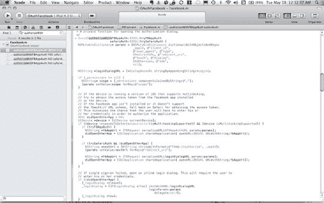

**图 5–15.** *Facebook iOS SDK 授权代码*

### 注销 Facebook

那么，如果 Facebook 用户登录了 iOS 上的所有应用，而他们希望你的应用从 Facebook 注销，会发生什么呢？如前所述，你调用 `logout:` 方法以清除 Facebook SDK 中的所有应用状态，并启动一个服务器请求以使当前的访问令牌失效。`logout:` 方法的内容如图 5–16 所示。

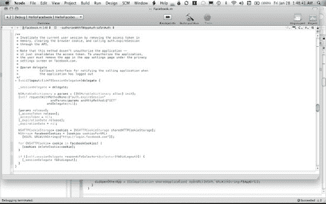

**图 5–16.** *Facebook iOS SDK 的 logout: 方法*

如果用户从你的应用注销，不会撤销你的应用权限；它只是清除应用的访问令牌。如果用户随后尝试再次在你的应用内登录 Facebook，应用只会通知用户正在重新登录 Facebook，并且你的应用将收到一个新的访问令牌。用户无需再次授予权限。

如果用户想要撤销你的应用权限，她需要前往 facebook.com，编辑她的应用和网站设置，在“你使用的应用”下选择“编辑设置”（参见 图 5–17），并从已批准的应用列表中删除你的应用（参见 图 5–18）。

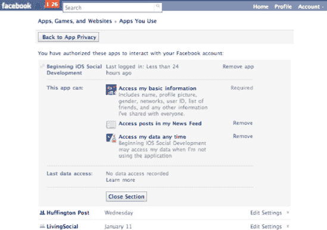

**图 5–17.** *Facebook.com 的应用 OAuth 权限页面*

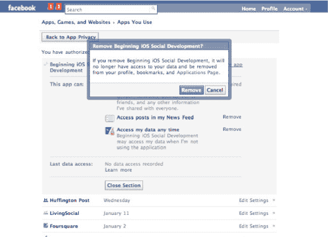

**图 5–18.** *撤销应用与 Facebook 用户数据和个人资料交互的权限*

### 判断 iOS 是否支持应用后台运行

根据设备是否支持后台运行，Facebook SDK 的行为会有所不同。这种行为的差异是通过使用以下代码实现的：

```
if ([UIDevice instancesRespondToSelector:@selector(isMultitaskingSupported)] &&
 [[UIDevice currentDevice] isMultitaskingSupported]) {
}
```

我们在这里展示这一点，因为在你自己的应用中，根据设备是否支持应用后台运行来选择不同的代码路径，可能会时不时地派上用场。

## Twitter 中的 OAuth

通过 Facebook iOS SDK 使用 `OAuth` 并不太痛苦，因为 SDK 的开发人员出色地通过简单的 API 将所有内容尽可能优雅地封装在其 SDK 中。通过 Twitter 使用 `OAuth` 则稍微复杂一些，但我们会带你顺利解决。

图 5–19 展示了 Twitter 的 `OAuth` 认证流程示意图。

正如我们之前提到的，Twitter 没有官方的 iOS SDK，因此开源社区的一些人将来自不同项目的软件拼凑在一起，制作了一个支持 `OAuth` 的工作 iOS Twitter 引擎。我们将向你展示如何使用这个开源软件来快速将 Twitter 认证集成到你的应用中。

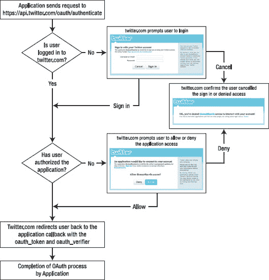

**图 5–19.** *Twitter 认证流程（由 Twitter.com 提供）*


#### 创建 Twitter 应用

在开始使用 Twitter 的 `OAuth` 之前，你需要先在此处向 Twitter 注册一个应用：[`http://twitter.com/apps/new`](http://twitter.com/apps/new)。

当你访问该网站时，Twitter 会要求你输入关于你的应用和公司的各种信息（参见图 5-20）。

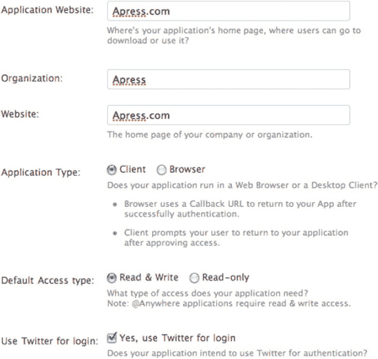

**图 5-20.** *注册 Twitter 应用*

请注意，你必须选择“客户端”作为应用类型。

如果 Twitter 接受了你的注册信息，你将被引导至一个页面，该页面包含 Twitter 的 `OAuth` URL，以及你应用的消费者密钥和消费者秘密（参见图 5-21）。

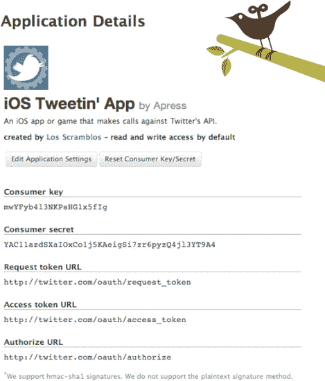

**图 5-21.** *Twitter 返回你的消费者密钥和消费者秘密。*

请将你的消费者密钥和秘密保存在安全位置，因为你需要用这些值从你的 iOS 应用内部启动 `OAuth` 授权流程。

##### OAuthTwitter 项目

在第 4 章中，我们引导你完成了设置一个使用 Twitter 的基本应用 `HelloTwitter` 的步骤。在本章及后续章节中，我们将使用与 HelloTwitter 相同的应用骨架，并直接切入与特定章节相关的代码。为此，请使用第 4 章中描述的相同步骤创建一个名为 `OAuthTwitter` 的新项目。你也可以复制 `HelloTwitter` 项目，或者直接在该项目中执行此处描述的步骤。你可以在 Git 仓库的 Chapter5 目录中找到本章的项目。现在我们已经做好了基础准备，让我们更详细地了解 `OAuth` 和 Twitter。

##### 登录 Twitter

首先，在你的主应用委托中添加你的 Twitter `OAuth` 消费者密钥和秘密：

```
#define kOAuthConsumerKey       @"替换我"
#define kOAuthConsumerSecret    @"替换我"
```

现在，为我们在第 4 章中声明并初始化的 `SA_OAuthTwitterEngine` 对象的相应属性设置这些值：

```
sa_OAuthTwitterEngine = [[SA_OAuthTwitterEngine alloc] initOAuthWithDelegate: self];
        sa_OAuthTwitterEngine.consumerKey = kOAuthConsumerKey;
        sa_OAuthTwitterEngine.consumerSecret = kOAuthConsumerSecret;
```

你在主应用委托中需要做的最后一件事是，在头文件中将其声明为 `SA_OAuthTwitterEngineDelegate`：

```
@interface AppDelegate : NSObject <UIApplicationDelegate,
 SA_OAuthTwitterEngineDelegate> {
}
```

通过在源文件中实现相应的委托方法来完成此过程：

```
- (void) storeCachedTwitterOAuthData: (NSString *) data forUsername: (NSString *)
username {
        NSUserDefaults                  *defaults = [NSUserDefaults
standardUserDefaults];

        [defaults setObject: data forKey: @"authData"];
        [defaults synchronize];
}

- (NSString *) cachedTwitterOAuthDataForUsername: (NSString *) username {
        return [[NSUserDefaults standardUserDefaults] objectForKey: @"authData"];
}

- (void) twitterOAuthConnectionFailedWithData: (NSData *) data {
        NSLog(@"twitterOAuthConnectionFailedWithData");
}
```

在进入向用户显示登录页面的代码之前，我们先简单介绍一下上述委托方法中发生的事情。

iOS Twitter 引擎不会在应用的不同运行周期之间存储从 Twitter 返回的 `OAuth` 数据；你需要自己处理这件事。幸运的是，iOS Twitter 引擎提供了两个你需要实现的委托方法，以便与引擎无缝集成。

当 iOS Twitter 引擎启动认证流程时，它会首先检查是否已存在任何凭据。它通过调用其委托的 `cachedTwitterOAuthDataForUsername:` 方法来实现这一点。在上述代码中，你可以看到我们尝试从 `NSUserDefaults` 中检索此信息。当用户首次尝试通过你的应用登录 Twitter 时，`NSUserDefaults` 中不会有 `authData` 键对应的对象，因为尚未保存任何内容。不过，这时委托方法 `storeCachedTwitterOAuthData:` 就发挥作用了。如果用户通过你的应用成功登录 Twitter，Twitter iOS 引擎会调用 `storeCachedTwitterOAuthData:` 委托方法。这让你有机会保存从 Twitter 返回的信息，以便后续检索。请注意，在上述代码中，我们将此信息保存到了 `NSUserDefaults` 中，键名为 `authData`。

最后一个委托方法是 `twitterOAuthConnectionFailedWithData:`，当尝试通过 `OAuth` 对用户进行授权时遇到错误，Twitter iOS 引擎会调用它。例如，如果你在消费者密钥或秘密中多添加了一个字符，然后重新构建并运行你的应用，你会看到引擎会调用此委托方法。

现在让我们对用户界面进行一些处理。有一个用于登录 Twitter 的按钮会很好，所以我们费了些功夫为你制作了一个。这个 Twitter 登录按钮是仿照我们在 `OAuthFacebook` 项目中使用的 Facebook 登录按钮制作的。

进入你克隆本书示例项目 Git 仓库的目录中的 `Twitter-OAuth-iPhone` 子目录，然后找到 `TwitterLoginButton` 目录。将 `TwitterLoginButton` 拖拽到你的项目中，以便你可以在代码中使用它。


如果你查看`OAuthTwitter`示例项目中的`MainViewController`类，你将了解我们是如何引入`TwitterLoginButton`的。我们使用了 iOS Twitter 引擎的`isAuthorized:`方法，在示例应用程序启动时将按钮设置为正确的状态：

```
twitterLoginButton.isLoggedIn = [sa_OAuthTwitterEngine isAuthorized];
```

当点击时，此按钮会触发以下方法：

```
- (void)twitterButtonClick:(UIButton*)sender {
    if (twitterLoginButton.isLoggedIn) {
        [self logout];
    } else {
        [self login];
    }
}
```

在`login:`方法中，我们使用`SA_OAuthTwitterController`类向用户显示 Twitter 的`OAuth`登录页面。我们通过`UIViewController`的`presentModalViewController:`方法以模态方式呈现它。在初始化`SA_OAuthTwitterController`对象时，你需向其传递我们在主应用程序委托中创建并初始化的`SA_OAuthTwitterEngine`，同时还要传递一个`SA_OAuthTwitterControllerDelegate`。以下是代码：

```
- (void)login {
    UIViewController *controller =
    [SA_OAuthTwitterController controllerToEnterCredentialsWithTwitterEngine:
    sa_OAuthTwitterEngine delegate: self];
    if (controller) {
        [self presentModalViewController: controller animated: YES];
    }
    else {
        [sa_OAuthTwitterEngine sendUpdate: [NSString stringWithFormat:
        @"Already Updated. %@", [NSDate date]]];
    }
}
```

我们需要将自身声明为`SA_OAuthTwitterControllerDelegate`，并在头文件中完成：

```
@interface MainViewController : UIViewController <SA_OAuthTwitterControllerDelegate> {
}
```

最后一步是实现`SA_OAuthTwitterControllerDelegate`的委托方法：

```
- (void) OAuthTwitterController: (SA_OAuthTwitterController *) controller
authenticatedWithUsername: (NSString *) username {
    NSLog(@"Authenicated for %@", username);
    twitterLoginButton.isLoggedIn = YES;
    [twitterLoginButton updateImage];
}

- (void) OAuthTwitterControllerFailed: (SA_OAuthTwitterController *) controller {
    NSLog(@"Authentication Failed!");
}

- (void) OAuthTwitterControllerCanceled: (SA_OAuthTwitterController *) controller {
    NSLog(@"Authentication Canceled.");
}
```

请注意，我们是如何在通过`OAuthTwitterController:authenticatedWithUsername:`委托方法成功登录后更新`TwitterLoginButton`状态的。你很可能希望在自己的应用程序代码中执行特定于应用程序的步骤。

如果用户在登录页面上输入了错误的用户名和密码，或者点击了“拒绝”按钮，则会调用`OAuthTwitterControllerFailed:`委托方法，实现该方法的代码应向用户显示一条消息，解释登录失败的原因。如果用户取消了`SA_OAuthTwitterController`对话框，则会调用`OAuthTwitterControllerCanceled:`委托方法。

图 5–22 和 5–23 显示了`SA_OAuthTwitterController`在显示 Twitter 身份验证页面时屏幕截图。

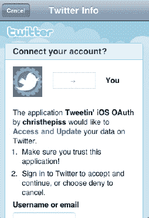

**图 5–22.** *`SA_OAuthTwitterController`显示身份验证页面时的外观。*

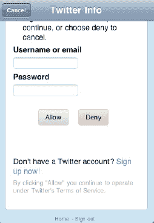

**图 5–23.** *`SA_OAuthTwitterController`身份验证页面的下半部分*

##### 登出 Twitter

将用户从 Twitter 注销是一个非常直接的过程。iOS Twitter 引擎提供了一个`clearAccessToken`方法，我们在`logout`方法中使用它。我们还重新设置了登录按钮：

```
- (void)logout {
    [sa_OAuthTwitterEngine clearAccessToken];
    twitterLoginButton.isLoggedIn = NO;
    [twitterLoginButton updateImage];
}
```

如果我们查看`clearAccessToken:`方法，会发现它会清除 Twitter 的`OAuth`访问和请求令牌，调用我们的委托方法以清除我们保存到`NSUserDefaults`的访问令牌，并清除一些其他对象：

```
- (void) clearAccessToken {
    if ([_delegate respondsToSelector:
    @selector(storeCachedTwitterOAuthData:forUsername:)]) [(id) _delegate
    storeCachedTwitterOAuthData: @"" forUsername: self.username];
    [_accessToken release];
    _accessToken = nil;
    [_consumer release];
    _consumer = nil;
    self.pin = nil;
    [_requestToken release];
    _requestToken = nil;
}
```

##### 内部原理：webViewDidFinishLoad

实现`OAuth`的视图控制器的主力是`UIWebView`。如果你检查`SA_OAuthTwitterController`，你会发现其主要视图是一个`UIWebView`，并且它本身是一个`UIWebViewDelegate`。`UIWebView`类的一个优点是它拥有许多委托方法，这些方法使得在`UIWebView`加载页面时可以在你的应用中执行原生功能。这是通过委托方法`webViewDidFinishLoad:`实现的。在`SA_OAuthTwitterController.m`中查看`webViewDidFinishLoad:`方法，可以了解其功能。甚至，在该方法的开始处设置一个断点，然后单步执行代码会更好。

### 更多内容

我们已经尽力概述了主要内容，但构建一个安全的应用程序需要比本章所能涵盖的更多内容。关于良好的 iOS 开发的一些简洁、经过深思熟虑的经验法则，包括如何测试和部署应用程序而不会出现新手安全错误，请查看 Twitter 的安全最佳实践：[`http://dev.twitter.com/pages/security_best_practices`](http://dev.twitter.com/pages/security_best_practices)。

最后，请记住以下重要几点：

*   在应用程序中尽早解决任何安全问题。
*   反复测试以确保无缝的用户体验。
*   如果从头构建认证系统不可行，请考虑通过`OAuth`使用`facebook connect`来验证应用程序用户。


