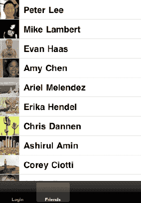

# 让您的应用程序为社交消息做好准备

理解本章最难的部分在于，您需要充分使用 Facebook 和 Twitter 来掌握前端发生了什么。这一点至关重要！一旦您理解了这些内容，就可以继续连接 API 了。

我们猜想您正在阅读本书，说明您已经使用过 Facebook 和 Twitter。但很可能，您对它们的使用还不够深入。

在本书的这一部分，我们将详细介绍如何将您的 iOS 应用连接到 Facebook 的 Graph API 和 Twitter API。然后，我们将讨论如何从您的应用向社交网络发布信息：推文、消息、主页贴文等。

但在进一步深入之前，让我们先探讨一下本章第一行中那个略显冒犯的论断。我们并不怀疑您有能力理解 Facebook 和 Twitter 的功能。但将信息发布到社交图谱的方式多到令人眼花缭乱，值得有意识地去逐一探索，以确定哪些机制适合您的应用。请尝试在前端层面理解正在发生的事情——例如，Twitter 中 `@回复` 和私信之间的区别——这样您就能更轻松地专注于决定您的应用需要调用哪些 API。与任何新项目一样，首先只实现最基本的功能非常重要，因此熟练掌握 Facebook 和 Twitter 将帮助您做出明智选择，决定包含哪些功能。

您可以在 Git 仓库的 `Chapter6` 目录中找到本章的所有代码。Facebook 代码位于 `ApiFacebook` 项目中，Twitter 代码位于 `ApiTwitter` 项目中。

好了，让我们开始调用一些 API，怎么样？

## 介绍 Facebook Graph API

您的应用可以在 Facebook 上发布海量内容。这些内容包括但不限于：主页贴文、消息、群组消息、笔记、活动、状态、评论、点赞和地点（稍后我们会重点讨论地点）。我们将首先向您展示如何通过 Facebook iOS SDK 从 Facebook 社交图谱中拉取信息。

为了方便您看到实际效果，我们针对本章对示例应用的结构做了一些调整。您会发现示例应用现在使用 `UITabBarController` 来划分应用的功能。虽然不太美观，但确实能用。

### 来自朋友的一点帮助

在所有社交网络中，最重要的事情始终是成为用户好友及通信的一部分。与此相应，我们首先要了解如何获取当前登录用户的好友列表以及每位好友的个人资料图片。这通过 `requestWithGraphPath:andDelegate:` 方法实现：

```
[facebook requestWithGraphPath:@"me/friends" andDelegate:self];
```

在深入探讨内部机制之前，让我们先浏览一下示例代码，熟悉 `requestWithGraphPath:andDelegate:` 方法的使用。这是用于访问 Facebook 社交图谱信息的主要方法。

如果您查阅示例代码，您会看到我们在 `FriendsViewController` 类的 `viewDidLoad:` 方法中调用了上述 `requestWithGraphPath:andDelegate:` 方法。`FriendsViewController` 类是 `FacebookViewController` 类的子类，而 `FacebookViewController` 类又是 `UITableViewController` 的子类。由于 Facebook API 返回的是信息列表，我们创建了 `FacebookViewController` 类，以便在演示如何使用和显示 Facebook 图路径请求结果时复用代码，让我们的工作更轻松些。需要特别注意的是，`FacebookViewController` 也遵循 `FBRequestDelegate` 协议。以下是 `FacebookViewController` 类的声明：

```
@interface FacebookViewController : UITableViewController <FBRequestDelegate> {
        NSArray *items;
}
@end
```

每当通过 `requestWithGraphPath:andDelegate:` 方法发起请求时，都必须指定一个委托来处理来自 Facebook iOS SDK 的响应。需要注意的是，Facebook iOS SDK 会按照以下顺序调用 `FBRequestDelegate` 协议的方法。首先，在向 Facebook 服务器发起请求之前，会调用 `requestLoading:` 方法。当 Facebook 服务器发送响应时，会调用 `request:didReceiveResponse:` 方法。接下来，在 Facebook iOS SDK 开始处理响应之前，会调用 `request:didLoadRawResponse:` 方法，让委托有机会自行处理响应数据。最后，会调用 `request:didLoad:` 方法，并将响应数据存储在 Objective-C 数据类型中。如果请求出现问题，则调用 `request:didFailWithError:` 方法。

如果我们看看 `FacebookViewController` 中的 `request:didLoad:` 方法，会看到以下内容：

```
- (void)request:(FBRequest *)request didLoad:(id)result {
        NSLog(@"didLoad:");

        [items release];
        items = [[(NSDictionary*)result objectForKey:@"data"] retain];
        [self.tableView reloadData];
}
```

如果您还记得前面的示例，`FacebookViewController` 拥有一个名为 `items` 的指向 `NSArray` 的指针：

```
NSArray  *items;
```

在 `request:didLoad:` 方法中，我们做的第一件事是释放 items 数组。这样做是为了防止内存泄漏。由于下一步是为 items 数组分配一个新数组，因此任何时候我们想要分配新数组，都需要首先确保释放之前存储的数组并归还内存。当我们实际进行赋值操作时，事情会变得更有趣一些，让我们回顾一下这一步的具体情况：

```
        items = [[(NSDictionary*)result objectForKey:@"data"] retain];
```


对于您从 Facebook 社交图谱发起的大多数请求，响应将是一个包含一个键/值对的字典，其中键是`data`，值是一个项目数组或列表。因此，在这种情况下，我们将结果转换为`NSDictionary*`，然后使用`objectForKey:`方法检索实际的`NSArray`项目。我们还调用了`retain`，以便返回的项目数组保留在内存中。在大多数情况下，返回数组中的每个项目都是一个`NSDictionary`。对于好友请求，数组中的每个项目都是一个包含两个键/值对的字典：一个存储好友的 Facebook ID，另一个存储好友的名字。这可以在整个响应字典的可视化表示中看到：

```
{
    data =     (
        {
            id = <a number>;
            name = "John Doe";
        }
        );
}
```

**提示：** 在 Xcode 中快速查看对象内容的一个简便方法是转到 Xcode 控制台并输入以下打印输出（`po`）命令。例如，如果我们在`request:didLoad:`方法中设置一个断点，那么当断点被触发时，我们可以通过在 Xcode 控制台中输入以下内容来获取`(id)result`对象的早期可视化表示：

```
(gdb) po result
```

最后，我们要求由`UITableViewController`拥有的`UITableView`重新加载其数据，以便用户界面得到更新。当`UITableView`重新加载时，它需要知道它总共有多少行，所以我们返回`items`数组的计数：

```
- (NSInteger)tableView:(UITableView *)tableView numberOfRowsInSection:(NSInteger)section
{
        // Return the number of rows in the section.
        if (nil == items) {
                return 0;
        }
        return [items count];
}
```

当`UITableView`需要一个特定的行时，我们在`FriendsViewController`的`tableView:cellForRowAtIndexPath:`方法中，从好友数组（即`items`数组）中检索代表该行好友的字典：

```
NSDictionary *friendDictionary = [items objectAtIndex:[indexPath row]];
```

对于这个示例，我们使用我们自己的`UITableViewCell`类`FriendTableViewCell`。这使我们能够封装好友个人资料图片的检索。`FriendTableViewCell`使用`UITableViewCellStyleDefault`样式，该样式显示一个文本标签和一个可选的图片。`FriendTableViewCell`类本身是一个`FBRequestDelegate`，并且它拥有一个指向字典的指针，在这种情况下，该字典将是与该单元格关联的好友的字典。以下是`FriendTableViewCell`的声明：

```
@interface FriendTableViewCell : UITableViewCell <FBRequestDelegate> {
        NSDictionary *data;
}

@property(nonatomic, retain) NSDictionary *data;

@end
```

我们在`FriendsViewController`的`tableView:cellForRowAtIndexPath:`方法中分配`FriendTableViewCell`的数据字典：

```
cell.data = friendDictionary;
```

当我们执行上述赋值时，会调用`FriendTableViewCell`的`setData`方法。因此，我们重写了这个方法以执行我们自己的自定义操作：

```
- (void)setData:(NSDictionary *)dictionary {
    [data release];
    data = [dictionary retain];

    self.textLabel.text = [data objectForKey:@"name"];

        self.imageView.image = nil;
        [self setNeedsLayout];

        [[NSNotificationCenter defaultCenter] removeObserver:self];

        self.requestPath = [NSString stringWithFormat:@"%@/picture", [data objectForKey:@"id"]];
        [[FacebookRequestController sharedRequestController] enqueueRequestWithGraphPath:self.requestPath];

        //listen for a notification with the name of the identifier
        [[NSNotificationCenter defaultCenter] addObserver:self
selector:@selector(facebookRequestDidComplete:) name:kRequestCompletedNotification object:nil];
}
```

首先，我们将单元格的`textLabel`文本设置为与`data`字典中`name`键关联的值。其次，我们通过`requestWithGraph:`方法从 Facebook 社交图谱发起针对该特定好友个人资料图片的请求。要从 Facebook 图谱获取用户的个人资料图片，我们使用以下格式进行请求：

```
<user ID>/picture
```

在这种情况下，我们通过使用`NSString`的`stringWithFormat:`并将与`data`字典中`id`键关联的值传递给它，为每个好友构造此请求。Facebook iOS SDK 将图片作为`NSData`对象内的字节返回。接下来，我们从该对象创建一个图片，如下面的`FriendTableViewCell`的`facebookRequestDidComplete:`方法所示：

```
- (void)facebookRequestDidComplete:(NSNotification*)notification {

    if (YES == [self.requestPath isEqualToString:[notification.userInfo objectForKey:@"path"]]) {

        UIImage *image = [UIImage imageWithData:(NSData*)[notification.userInfo objectForKey:@"result"]];
        self.imageView.image = image;
        [self setNeedsLayout];
    }
}
```

如果您运行示例应用程序，通过您的 Facebook 用户帐户登录，然后点击“好友”标签，您将看到它下载并显示您的好友列表。它还会下载每个好友的个人资料图片（见图 6-1）。请注意，此示例尚未优化；它仅用于向您展示如何开始使用这些 API。



**图 6-1.** *一个简单的好友列表*

### 分页图谱响应

我们想要指出的一件有趣的事情是，您可以在发起请求时限制从 Facebook 图谱响应中获取的项目数量。这可以通过向请求添加`limit`参数来实现。您可以通过`requestWithGraphPath:andDelegate:`方法执行此操作：

```
[facebook requestWithGraphPath:@"me/friends?limit=3" andDelegate:self];
```

您也可以通过`requestWithGraphPath:andParams:andDelegate:`方法，通过创建一个参数字典来实现。对于字典中的每个对象，键是参数名称（在此例中为`limit`），值是参数值的字符串表示形式。代码如下所示：

```
NSMutableDictionary *params = [NSMutableDictionary dictionary];
[params setObject:@"3" forKey:@"limit"];
[facebook requestWithGraphPath:@"me/feed" andParams:params andDelegate:self];
```

您还可以通过使用`offset`参数来指定从给定的起始点或偏移量检索项目：

```
[facebook requestWithGraphPath:@"me/friends?limit=3&offset=5" andDelegate:self];
```

或者，您也可以通过传入一个参数字典来完成相同的任务：

```
NSMutableDictionary *params = [NSMutableDictionary dictionary];
[params setObject:@"3" forKey:@"limit"];
[params setObject:@"5" forKey:@"offset"];
[facebook requestWithGraphPath:@"me/feed" andParams:params andDelegate:self];
```


#### 内部机制：`FBRequest` 类

Facebook Graph API 本质上是一个基于 HTTP 的 API，其流程是将格式化的 HTTP 请求发送至 Facebook 服务器，并以 JSON 格式返回响应。Facebook iOS SDK 为我们提供了一套简洁易用的 Objective-C 封装类，我们可以在 iOS 应用中使用这些类通过 Facebook Graph API 请求信息。

在 Facebook iOS SDK 中，实际负责发起请求和处理响应的类是 `FBRequest`。该 SDK 利用了一个事实：其发起请求所需的基础 URL 从不改变，即 [`https://graph.facebook.com`](https://graph.facebook.com)。SDK 还知道某些请求参数也是固定不变的。这意味着您只需向请求方法提供 Graph 路径中那些会根据应用上下文而变化的部分。

因此，如果我们构造完整的 URL 来请求当前用户的 Facebook 好友，它会如下所示：

`https://graph.facebook.com/me/friends?sdk=ios&sdk_version=2&access_token=<your token>&format=json`

因为我们使用的是 Facebook iOS SDK，所以只需向 SDK 提供 Graph 路径 `"me/friends"`（以及任何其他控制请求的参数），底层的 SDK 类就会为我们构造完整的 URL。

最终的请求是在 `FBRequest` 的 `connect` 方法中构建的，因此值得研究。此处是实际发起请求和处理 JSON 响应的地方。JSON 响应在方法 `handleResponseData:(NSData *)data` 中处理。以请求用户好友为例，JSON 响应的格式如下：

`{"data":[{"name":"John Dor","id":"<some ID>"}]}`

此外，`FBRequest` 的 `getRequestWithParams:httpMethod:delegate:requestURL:` 方法和 Facebook 的 `openUrl:params:httpMethod:delegate:` 方法也值得研究。

##### 关于错误处理的通用说明

处理来自 Facebook iOS SDK 的错误没有绝对正确或错误的方法。这完全取决于您和您的应用。我们建议您实现那些能通知您错误的代理方法，以便您采取适当的行动，例如通知用户或更新应用的界面。就本章所涉及的 Facebook 内容而言，请务必实现 `FBRequestDelegate` 的 `request:didFailWithError:` 方法。

### Twitter API 介绍

您的应用可以在 Twitter 上发布许多内容。包括但不限于：推文、私信（虽然此功能正在淡出）、`@回复`、`#话题标签` 等等。我们将首先向您展示如何通过 `MGTwitterEngine` 从 Twitter 拉取信息。

与本章的 Facebook 示例应用一样，我们稍微调整了本章 Twitter 示例应用的结构，以便方便地观察其中的一些操作。您会看到示例应用现在使用一个 `UITabBarController` 来划分应用的功能。再次强调，界面并不美观，但它能工作。

#### 时间线简介

如果您想知道 Twitter 的*时间线*是什么，它是 Twitter 对任何推文流的专属术语。Twitter 将您自己的所有推文视为一个时间线，您从关注对象那里看到的推文流视为另一个时间线，而来自您创建的精选列表的任何推文流则视为又一个时间线。

##### 总觉得有人在关注我

对于 Twitter 用户来说，最令人向往的事情就是拥有大量粉丝。为此，我们将研究如何获取当前登录用户的粉丝列表以及每个粉丝的关联头像。这可以通过 `MGTwitterEngine` 的 `getFollowersIncludingCurrentStatus:` 方法实现：

`[sa_OAuthTwitterEngine getFollowersIncludingCurrentStatus:YES];`

与 Facebook iOS SDK 通过 `requestWithGraphPath:` 方法发起所有请求不同，`MGTwitterEngine` 使用不同的方法来完成不同的请求。同时也没有正式的请求对象，因此需要一些不同的编码机制，因为我们无法为每个请求指定不同的代理。不幸的是，这使得针对 `MGTwitterEngine` 的编码稍微困难一些；然而，所有 `MGTwitterEngine` 的请求方法都会返回一个唯一的请求连接标识符字符串，我们将在本章的示例应用中利用这一点。

查看示例代码，我们在 `FollowersViewController` 类的 `viewDidLoad:` 方法中调用了前面提到的 `getFollowersIncludingCurrentStatus:` 方法。`FollowersViewController` 类是一个 `UITableViewController`。由于 Twitter API 返回的是信息列表，因此 `UITableViewController` 是演示如何使用该 API 获取某人的粉丝列表的理想类。以下是 `FollowersViewController` 类的声明：

```
@interface FollowersViewController : UITableViewController {
    NSArray *followers;
}
@end
```

回想一下，当我们创建 `MGTwitterEngine` 时，必须设置一个 `MGTwitterEngineDelegate`，在本例中就是我们的 `AppDelegate` 类。每当通过 `MGTwitterEngine` 向 Twitter 发起请求时，`MGTwitterEngineDelegate` 的方法就会被调用。需要注意的是，`MGTwitterEngine` 会按以下顺序调用其代理的方法：

1.  成功向 Twitter 服务器发起请求后，调用 `requestSucceeded:` 方法。
2.  接着，根据请求的内容不同，会调用相应的 `*Received:forRequest:` 方法（本例中，当请求粉丝时，会调用 `userInfoReceived:forRequest:` 方法），并将响应数据存储为 Objective-C 数据类型。
3.  最后，调用 `connectionFinished:` 方法。如果请求出现问题，则会调用 `requestFailed:withError:` 方法。

如果我们查看 `AppDelegate` 中的 `userInfoReceived:forRequest:` 方法，会看到以下代码：

```
- (void)userInfoReceived:(NSArray *)userInfo forRequest:(NSString *)connectionIdentifier
{
    NSLog(@"User info for connectionIdentifier = %@", connectionIdentifier);

    //告诉 UI 更新自身

    NSDictionary *userInfoDictionary = [NSDictionary dictionaryWithObjects:
    [NSArray arrayWithObjects:userInfo, nil] forKeys:[NSArray arrayWithObjects:
    @"followers", nil]];
    [[NSNotificationCenter defaultCenter] postNotificationName:connectionIdentifier
    object:self
    userInfo:userInfoDictionary];
}
```

此时，您可能在想我们使用 `NSNotificationCenter` 做什么。实际上，`NSNotificationCenter` 是一种很好的机制，它允许应用内的一个类通知其他类某件事发生了，并传递信息，而无需使用代理。在本例中，我们希望告诉 `FollowersViewController` 其请求的数据已准备好。但在进一步讨论 `FollowersViewController` 内部发生了什么之前，我们先看完前面的代码。


`userInfo`参数是一个`NSArray`，其中包含`NSDictionary`对象。每个`NSDictionary`都包含关于单个关注者的信息。当您发布通知时，可以指定一个字典，其中包含通知接收者可以访问的对象。我们希望`FollowersViewController`接收关注者数组，因此我们创建一个包含一个键`followers`的字典，并将关注者数组赋值给该键。最后发布通知时，必须为其指定一个唯一名称，而最合适的名称就是连接标识符。

您可能还记得，`FollowersViewController`拥有一个名为`followers`的`NSArray`指针：

```
NSArray *followers;
```

为了将在`userInfoReceived:forRequest:`委托方法中返回的数组赋值，我们需要在`FollowersViewController`中执行几个步骤。首先，我们告诉`NSNotificationCenter`，希望接收与请求的唯一连接标识符名称匹配的通知。回想一下，这个名称将与传递给`userInfoReceived:forRequest:`委托方法的连接标识符相同。我们还告诉`NSNotificationCenter`，如果触发了与唯一连接标识符匹配的通知，则希望执行`twitterFollowersRequestDidComplete:`方法。以下是执行此操作的代码：

```
- (void)viewDidLoad {
    [super viewDidLoad];
    // 取消注释以下行，可在导航栏中为此视图控制器显示“编辑”按钮。
    // self.navigationItem.rightBarButtonItem = self.editButtonItem;

    NSString *identifier = [sa_OAuthTwitterEngine getFollowersIncludingCurrentStatus:YES]; // statuses/followers

    // 监听与标识符名称匹配的通知
    [[NSNotificationCenter defaultCenter] addObserver:self
           selector:@selector(twitterFollowersRequestDidComplete:)
           name:identifier
           object:nil];
}
```

现在，让我们分析处理通知的方法中发生了什么：

```
- (void)twitterFollowersRequestDidComplete:(NSNotification*)notification {
    [followers release];
    followers = [[notification.userInfo objectForKey:@"followers"] retain];

    [[NSNotificationCenter defaultCenter] removeObserver:self];

    [self.tableView reloadData];
}
```

在此方法中，我们首先释放关注者数组，以防止内存泄漏。由于下一步是为关注者数组分配一个新数组，因此每当要分配新数组时，都需要确保先释放并交回之前存储的数组。实际执行赋值操作时，情况会更有趣一些，让我们回顾一下这一步的具体操作：

```
followers = [[notification.userInfo objectForKey:@"followers"] retain];
```

请记住，当我们在`AppDelegate`中发布通知时，发送了一个字典，其中包含一个键/值对，键为`followers`。因此，我们只是将通知的`userInfo`字典中该键的值赋值给`followers`数组。最后，我们移除自身作为通知的观察者，然后告诉表格重新加载数据，因为有了新数据。

**注意：** 一旦确定某个类不再需要接收通知，就应立即移除其作为通知的观察者，这始终是一个良好的实践。如果在将类设置为再次接收通知之前未能执行此操作，该类将会为同一事件接收多次通知，这可能不是您想要的行为。

当表格重新加载时，我们将关注者数量作为表格的行数返回：

```
- (NSInteger)tableView:(UITableView *)tableView numberOfRowsInSection:(NSInteger)section {
    // 返回该节中的行数。
    if (nil == followers) {
        return 0;
    }

    return [followers count];
}
```

当`UITableView`需要特定行时，我们从`FollowersViewController`的`tableView:cellForRowAtIndexPath:`方法中的关注者数组中检索代表该行关注者的字典：

```
NSDictionary *dictionary = [followers objectAtIndex:[indexPath row]];
```

在本示例中，我们使用自定义的`UITableViewCell`类`FollowersTableViewCell`。这使我们能够封装关注者个人资料图片的检索。`FollowersTableViewCell`使用`UITableViewCellStyleDefault`样式，该样式显示文本标签和可选图片。`FollowersTableViewCell`类拥有一个指向字典的指针，在本例中，该字典是与该单元格关联的关注者的字典。以下是`FriendTableViewCell`的声明：

```
@interface FollowersTableViewCell : UITableViewCell {
    NSDictionary *data;
}

@property(nonatomic, retain) NSDictionary *data;

@end
```

我们在`FollowersViewController`的`tableView:cellForRowAtIndexPath:`方法中赋值`FollowersTableViewCell`的数据字典：

```
cell.data = dictionary;
```

执行上述赋值时，会调用`FollowersTableViewCell`的`setData`方法，因此我们重写了此方法以执行自定义操作：

```
- (void)setData:(NSDictionary *)dictionary {
    [data release];
    data = [dictionary retain];

    self.textLabel.text = [data objectForKey:@"screen_name"];

    self.imageView.image = nil;
    [self setNeedsLayout];

    [[NSNotificationCenter defaultCenter] removeObserver:self];

    NSString *identifier = [sa_OAuthTwitterEngine getImageAtURL:[dictionary objectForKey:@"profile_image_url"]];

    // 监听与标识符名称匹配的通知
    [[NSNotificationCenter defaultCenter] addObserver:self
           selector:@selector(twitterProfileImageRequestDidComplete:)
           name:identifier
           object:nil];
}
```

首先，我们将单元格`textLabel`的文本设置为`data`字典中键`screen_name`关联的值。其次，我们通过`MGTwitterEngine`的`getImageAtURL:`方法发起请求，获取该特定关注者的 Twitter 个人资料图片。我们向该方法传递关注者个人资料图片的 URL，该 URL 由 Twitter 返回，并且是`data`字典中键`profile_image_url`关联的值。注意，`getImageAtURL:`方法可用于从任何 URL 检索图片，而不仅仅是 Twitter URL。

当我们请求图片时，`MGTwitterEngine`返回连接标识符，就像在`FollowersViewController`中一样，我们告诉`NSNotificationCenter`希望接收与连接标识符值匹配的通知。

`MGTwitterEngine`通知应用程序图片已可用，并通过`imageReceived:forRequest:`委托方法将其传递给我们。然后，我们为包含图片的返回连接标识符发布通知：

```
- (void)imageReceived:(UIImage *)image forRequest:(NSString *)connectionIdentifier {
    NSLog(@"图片已接收，连接标识符 = %@", connectionIdentifier);

    NSDictionary *userInfoDictionary = [NSDictionary dictionaryWithObjects:
        [NSArray arrayWithObjects:image, nil] forKeys:
        [NSArray arrayWithObjects:@"profile_image", nil]];
    [[NSNotificationCenter defaultCenter] postNotificationName:connectionIdentifier
          object:self
          userInfo:userInfoDictionary];
}
```


