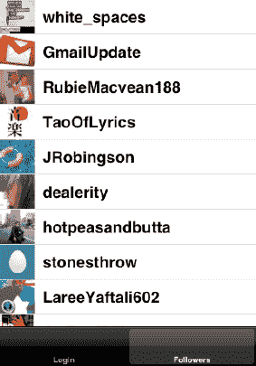

# 排版后内容

回到`FollowersViewController`中，在通知处理程序里，我们从通知中获取`image`对象，将其设置为单元格的图像，然后更新单元格的布局：

```
- (void)twitterProfileImageRequestDidComplete:(NSNotification*)notification {
    [[NSNotificationCenter defaultCenter] removeObserver:self];
    self.imageView.image = [notification.userInfo objectForKey:@"profile_image"];
    [self setNeedsLayout];
}
```

如果你运行示例应用，通过你的 Twitter 用户账户登录，然后点击“Followers”标签，你会看到它下载并显示你的粉丝列表。它还会下载每个粉丝的个人资料图片（参见图 6-2）。请注意，此示例尚未优化；它仅用于展示如何开始使用这些 API。



**Figure 6-2.** *一个基本的粉丝列表*

## 内部机制：MGTwitter HTTP 连接与 XML 解析

实际的 Twitter API 是一个基于 HTTP 的 API，其中 HTTP 请求被格式化并发送到 Twitter 的服务器，响应以 XML 格式返回。`MGTwitterEngine`为我们提供了一组简洁易用的 Objective-C 包装类，我们可以在 iOS 应用中使用它们向 Twitter 请求信息。

`MGTwitterEngine`中实际发出请求并处理响应的类是`MGTwitterEngine`类本身。如果你查看`MGTwitterEngine`的头文件，你会注意到它拥有一个连接字典：

```
NSMutableDictionary *_connections;
```

每次发出请求时，`MGTwitterEngine`都会创建一个新的`MGTwitterHTTPURLConnection`，它是一个`NSURLConnection`。每个`MGTwitterHTTPURLConnection`都会为自己创建一个唯一标识符（UUID）。这是通过`MGTwitterEngine`中一个名为`NSString+UUID`的`NSString`类别类实现的，该类有一个方法：

```
+ (NSString*)stringWithNewUUID
{
    // Create a new UUID
    CFUUIDRef uuidObj = CFUUIDCreate(kCFAllocatorDefault);

    // Get the string representation of the UUID
    NSString *newUUID = (NSString*)CFUUIDCreateString(kCFAllocatorDefault, uidObj);
    CFRelease(uuidObj);
    return [newUUID autorelease];
}
```

当`MGTwitterEngine`创建一个连接时，它会将该连接对象保存到其`connections`字典中，其中键是连接返回的连接标识符。我们稍后会解释为什么这很重要，但首先让我们看看从 Twitter 请求某人粉丝的 URL：

`https://twitter.com/statuses/followers.xml`

当`MGTwitterEngine`创建一个`MGTwitterHTTPURLConnection`对象时，它会为其分配一个请求类型和一个响应类型。这是为什么呢？当从 Twitter 接收到响应时，`MGTwitterEngine`使用这些信息来决定如何解析返回的 XML 数据。请注意，`MGTwitterEngine`有许多 XML 解析器，它们都派生自`MGTwitterXMLParser`。如果你检查`MGTwitterEngine`的`_parseDataForConnection:`方法，你会发现它根据连接的响应类型执行一个 switch 语句。在请求粉丝的情况下，会创建一个`MGTwitterUsersParser`来解析响应。XML 被解析后，通过`MGTwitterEngineDelegate`的`userInfoRecieved:forRequest:`方法以字典数组的形式返回给我们。以下是其中一个字典的样子：

```
(
{
    "contributors_enabled" = false;
    "created_at" = "Thu Mar 25 16:29:19 +0000 2010";
    description = "Phone Numbers Are Dead. Go800 is the new way of placing phone calls
 by giving a voice to the names in your social world. Public launch March 1st.";
    "favourites_count" = 0;
    "follow_request_sent" = false;
    "followers_count" = 675;
    following = 1;
    "friends_count" = 939;
    "geo_enabled" = false;
    id = 126361254;
    "is_translator" = false;
    lang = en;
    "listed_count" = 9;
    location = "New York, NY";
    name = Go800;
    notifications = false;
    "profile_background_color" = ffffff;
    "profile_background_image_url" = "http://a3.twimg.com/profile_background_images
/207991705/bkg_go800_850_v_full_v9.png";
    "profile_background_tile" = true;
    "profile_image_url" = "http://a2.twimg.com/profile_images
/1235044022/go800_logo_twitter_logo_normal.png";
    "profile_link_color" = 3f90b3;
    "profile_sidebar_border_color" = 333333;
    "profile_sidebar_fill_color" = ffffff;
    "profile_text_color" = 333333;
    "profile_use_background_image" = true;
    protected = 0;
    "screen_name" = Go800;
    "show_all_inline_media" = false;
    "source_api_request_type" = 11;
    status =     {
        contributors = "";
        coordinates = "";
        "created_at" = "Tue Feb 22 21:49:40 +0000 2011";
        favorited = false;
        geo = "";
        id = 40166359300050944;
        "in_reply_to_screen_name" = "";
        "in_reply_to_status_id" = "";
        "in_reply_to_user_id" = "";
        place = "";
        "retweet_count" = 6;
        retweeted = false;
        source = web;
        "source_api_request_type" = 11;
        text = "Phone Numbers Are Dead. Teach twitter a new trick on March 1st.
 Follow @Go800 for preview invite.";
        truncated = 0;
    };
    "statuses_count" = 83;
    "time_zone" = "Eastern Time (US & Canada)";
    url = "http://www.go800corp.com";
    "utc_offset" = "-18000";
    verified = false;
}
)
```

### 结论

本章涵盖了与使用 Facebook iOS SDK 获取用户好友列表以及使用`MGTwitterEngine`获取用户粉丝列表相关的许多有趣领域。在此过程中，我们深入了解了每个 SDK 的内部机制。我们还探讨了一些在 Objective-C 中编写 iOS 应用时常用的编程技术。

在下一章中，我们将以此知识库为基础，更深入地探讨内部机制，并扩展本章的示例项目，向你展示如何使用这些 SDK 为用户发布信息，以及如何获取更多用户信息。

