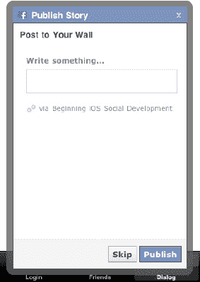
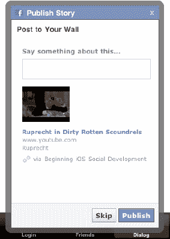
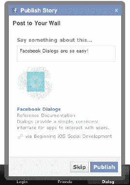
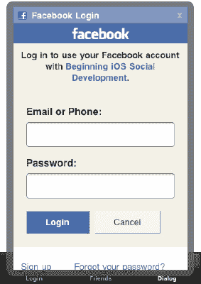

# 访问人、地点、对象和关系

在本章中，我们将介绍 Facebook 方法、对象、属性和连接的细节——以及如何访问它们。我们还将介绍 JSON（JavaScript Object Notations），它与 Graph API 的使用密切相关。最后，我们将讨论如何从 Twitter 的 REST（Representational State Transfer）^(1) API 中检索基本数据。

你可以在 Git 仓库的 Chapter7 目录中找到本章的所有代码。Facebook 代码位于`ApiFacebook`项目中，Twitter 代码位于`ApiTwitter`项目中。这些项目基于第 6 章示例项目中介绍的相同应用结构构建；同样，这些项目并不美观，但它们能完成任务。

## 更多关于 Facebook Graph API 的乐趣

在上一章中，我们向你展示了如何从 Facebook 的社交图谱中提取信息。在这样做的过程中，你可能想知道如何从自己的应用向 Facebook 的社交图谱添加或发布信息。好吧，既然我们人这么好，我们已经不辞辛劳地将本章的整个部分专门用于介绍如何向 Facebook 社交图谱发布内容。我们还增加了对其他可以从社交图谱中提取的信息的全面介绍，包括这些信息如何与授权和扩展权限相关联。继续阅读以了解详细内容。

___________

¹ 参见，例如，[`http://en.wikipedia.org/wiki/Representational_State_Transfer`](http://en.wikipedia.org/wiki/Representational_State_Transfer)


### Facebook 对话框

为 iOS 应用增添魅力并使其受用户欢迎的好方法之一，就是让用户能够直接在应用内向他们的 Facebook 主页发布内容。尽管 iOS 支持拷贝粘贴和快速应用切换，但如果用户为了在 Facebook 墙上发布来自应用内的一篇有趣文章链接而不得不切换到 iOS 自带的 Facebook 应用，你的应用吸引力就会大打折扣。

幸运的是，Facebook SDK 已让这项功能的实现和运行变得尽可能简单。这就引出了 `Facebook` 类中我们尚未讨论的 `dialog:` 方法：

```
- (void)dialog:(NSString *)action
   andDelegate:(id<FBDialogDelegate>)delegate;

- (void)dialog:(NSString *)action
     andParams:(NSMutableDictionary *)params
   andDelegate:(id <FBDialogDelegate>)delegate;
```

这两个方法都定义在 `Facebook.h` 中；虽然有两个方法可用，但我们将侧重于使用第二个，它允许我们传入额外的参数。第一个无参数的方法也可用，但大多数情况下你都需要向 `dialog:` 方法传递参数。此外，如果你查看 `Facebook.m`，你会发现第一个方法在调用第二个方法时，为其参数传入了一个空字典：

```
- (void)dialog:(NSString *)action
   andDelegate:(id<FBDialogDelegate>)delegate {
  NSMutableDictionary * params = [NSMutableDictionary dictionary];
  [self dialog:action andParams:params andDelegate:delegate];
}
```

这两个方法还都接受一个 *action* 参数和一个 *delegate* 参数。现在我们将在示例应用中研究它们。在本章的示例应用中，我们有一个名为 `DialogViewController` 的新类。这个类看起来会与 `LoginViewController` 类非常相似，因为，你瞧，它就是直接模仿后者构建的。话虽如此，我们希望将注意力集中在 `DialogViewController` 类中的几个方面。

由于我们将从 `DialogViewController` 类中向用户显示对话框，我们需要在头文件 `DialogViewController.h` 中声明它遵循 `FBDialogDelegate` 协议：

```
@interface DialogViewController : UIViewController <FBDialogDelegate> {
}
@end
```

在 `DialogViewController.m` 中，我们需要定义以下每个委托回调方法：

```
- (void)dialogDidComplete:(FBDialog *)dialog;
- (void)dialogCompleteWithUrl:(NSURL *)url;
- (void)dialogDidNotCompleteWithUrl:(NSURL *)url;
- (void)dialogDidNotComplete:(FBDialog *)dialog;
- (void)dialog:(FBDialog*)dialog didFailWithError:(NSError *)error;
- (BOOL)dialog:(FBDialog*)dialog shouldOpenURLInExternalBrowser:(NSURL *)url;
```

在进一步讨论这些委托回调之前，是时候使用 `dialog:` 方法来为我们做点工作了。Facebook SDK 会根据你传递给 `dialog:` 方法的 `action` 参数，在弹出对话框中显示相应内容。在向用户的 Facebook 主页发布信息的情况下，合适的 action 是 `feed`。因此，在最简单的情况下，如果我们想显示一个对话框，让用户输入任意自由格式文本并发布到他的墙上，我们将如下调用 `dialog:` 方法，并确保将合适的类（本例中为 `DialogViewController`）作为委托传入：

```
NSMutableDictionary * params = [NSMutableDictionary dictionary];
[facebook dialog:@"feed" andParams:params andDelegate:self];
```

以这种方式调用 `dialog:` 方法会向用户显示这个对话框（见图 7-1）：



**图 7-1.** *调用 dialog: 方法会向用户展示此对话框。*

如你所见，这非常基础，并非你在 Web 应用中看到的那种让你向 Facebook 墙发布内容的功能。那么，让我们通过一些额外的参数来增加点趣味。可以为 `feed` 对话框指定额外的参数，每个参数都有特定的名称和用途。在 Facebook 上发布 YouTube 视频非常流行，所以我们假设你想从应用内向用户的墙上发布一个 YouTube 视频链接。为此，向 `parameters` 字典添加一个键值对，其中键是 `link`，值是该 YouTube 视频的 URL（或任何你想分享的其他网页内容）：

```
NSDictionary* params = [NSDictionary dictionaryWithObject:
   @http://www.youtube.com/watch?v=nqMc9B7uDV8 forKey:@"link"];

[facebook dialog:@"feed" andParams:params andDelegate:self];
```

由于 Facebook SDK 对话框的底层机制是一个 Web 视图（稍后详述），这段代码会漂亮地格式化成你期望的样子，并显示帖子中 YouTube 视频的图片预览（见图 7-2）。



**图 7-2.** *由于 Facebook 对话框是 Web 视图，你可以在此嵌入内容预览。*

这很容易，对吧？不过，让我们更进一步，看看如何更深度地定制 feed 对话框的显示。下面的代码创建了一个 Facebook 喜欢使用的示例对话框：

```
NSDictionary* params = [NSDictionary dictionaryWithObjectsAndKeys:
   @"http://developers.facebook.com/docs/reference/dialogs/", @"link",
   @"http://fbrell.com/f8.jpg", @"picture",
   @"Facebook Dialogs", @"name",
   @"Reference Documentation", @"caption",
   @"Dialogs provide a simple interface for apps to interact with users.", @"description",
   @"Facebook Dialogs are so easy!",  @"message", nil];
      [facebook dialog:@"feed" andParams:params andDelegate:self];
```

在这个例子中，我们为 Facebook 提供的不同键设置了多个值，这样你就可以真正提升对话框的外观和感觉。将图片的 URL 设置为 `picture` 键的值，可以控制帖子在用户 Facebook 墙上显示的图片。`name` 键的值控制着以经典的 Facebook 字体显示为墙贴主标题的内容。`caption` 和 `description` 值让你能为墙贴提供预设文本。最后但同样重要的是，`message` 键让你可以预设对话框可编辑文本字段中的内容。所有这些信息都会显示在对话框中，如图 7-3 所示。



**图 7-3.** *Facebook 对话框的结构剖析*

在我们深入讨论 Facebook SDK 对话框的一些内部工作原理之前，我们应该先稍微绕道，回顾一下 `FBDialogDelegate` 方法。根据我们自身的经验，如何使用 `FBDialogDelegate` 方法取决于你使用它们的上下文。例如，如果你喜欢在应用内跟踪一些分析数据，你可能想要实现这些方法。

每当用户通过按下对话框上的“跳过”或“发布”操作按钮来对对话框执行操作时，SDK 会先调用 `dialogCompleteWithUrl:` 方法，然后调用 `dialogDidComplete:` 方法。如果用户按下“跳过”按钮，此 URL 将被传递给 `dialogCompleteWithUrl:` 方法：

```
"fbconnect://success"
```

如果用户改为按下“发布”按钮，此 URL 将被传递给 `dialogCompleteWithUrl:` 方法：

```
"fbconnect://success/?post_id=623441509_10150094754996510"
```


我们首先要承认，起初我们也不知道该如何理解这个响应；不过，我们做了一些深入研究，所以你很幸运。结果发现，URL 中的 `post_id` 参数包含了两条独立的标识信息，它们用下划线连接在一起。以下是 `post_id` 参数的定义：

`post_id=<userIdentifier>_<postIdentifier>`

在这个例子中，`userIdentifier` 表示通过我们的应用发布帖子的已登录用户的 Facebook Graph 路径。同样，`postIdentifier` 表示该帖子的 Facebook Graph 路径标识符。如果你从 `post_id` 参数中解析出这两条信息，就可以将它们放入以下 URL 格式中，以查看实际结果：

`www.facebook.com/<userIdentifier>/posts/<postIdentifier>`

掌握了这些知识后，你可以通过将用户引导至正确构建的 URL（如下所示）来向她展示她在 Facebook 移动网站上的实际帖子：

`www.facebook.com/623441509/posts/10150094754996510`

最后需要注意的是，如果用户选择通过右上角的 X 按钮关闭对话框，则会调用带有空 `NSURL` 对象作为参数的 `dialogDidNotCompleteWithUrl:` 委托方法，随后会调用 `dialogDidNotComplete:`。

## 底层机制：FBDialog 类

如果你觉得上一节太简单了，那你的感觉没错。我们向 Facebook 的工程师致敬，他们让这个过程尽可能轻松。一个好的 SDK 拥有经过深思熟虑、易于使用的方法，能最大程度地简化操作。

鉴于我们在上一章讨论过 `FBRequest` 类的工作原理，那么将信息发布到 Facebook 最终也是通过基于 HTTP 的 API 完成，这应该不足为奇。不过，Facebook 的工程师再次展现了风度，他们在 SDK 中提供了 `FBDialog` 类来完成所有繁重的工作。

`FBDialog` 类的代码可以在所有示例项目的 FBConnect 文件夹中的 `FBDialog.m` 和 `FBDialog.h` 文件中找到。仅仅通过检查 `FBDialog` 类的声明，就能学到很多有趣的东西：

```
@interface FBDialog : UIView <UIWebViewDelegate> {
  id<FBDialogDelegate> _delegate;
  NSMutableDictionary *_params;
  NSString * _serverURL;
  NSURL* _loadingURL;
  UIWebView* _webView;
  UIActivityIndicatorView* _spinner;
  UIImageView* _iconView;
  UILabel* _titleLabel;
  UIButton* _closeButton;
  UIDeviceOrientation _orientation;
  BOOL _showingKeyboard;

  // 确保对话框后的 UI 元素被禁用。
  UIView* _modalBackgroundView;
}
@end
```

首先值得注意的两点是：`FBDialog` 只是一个 `UIView`，并且它拥有一个模态背景视图：

```
// 确保对话框后的 UI 元素被禁用。
UIView* _modalBackgroundView;
```

为什么 `FBDialog` 类只是一个普通的 `UIView`？而且，为什么一个对话框类内部要包含类似模态背景视图的东西？难道 iOS SDK 不是已经有一个用于显示模态弹出对话框的类了吗？

虽然这很理想，但事实证明 iOS SDK 并没有提供现成的解决方案来显示模态弹出对话框。这意味着开发者需要自己动手实现。最可靠的方法就是创建一个与整个应用程序框架大小相同的视图，这样用户就无法与模态弹出对话框“后面”的任何内容进行交互。相关代码位于 `FBDialog` 的 `show:` 方法中，如果你需要在你的应用程序中实现类似功能，这段代码会很有用（请注意，我们已经在 `FBDialog` 的 `init:` 方法中创建了 `_modalBackgroundView` 对象）：

```
UIWindow* window = [UIApplication sharedApplication].keyWindow;
if (!window) {
    window = [[UIApplication sharedApplication].windows objectAtIndex:0];
}

_modalBackgroundView.frame = window.frame;
[_modalBackgroundView addSubview:self];
[window addSubview:_modalBackgroundView];

[window addSubview:self];
```

`FBDialog` 谜题的另一个重要部分是它拥有一个 `UIWebView`，并且是 `UIWebViewDelegate`：

```
UIWebView* _webView;
```

事实证明，这个 `UIWebView` 负责处理 `FBDialog` 中大部分内容的渲染魔法。`FBDialog` 的主要内容实际上是通过其对话框 URL 从 Facebook 通过网络获取的，并显示在 `FBDialog` 的 `UIWebView` 中。具体来说，它有一个移动版本的对话框 URL，定义在 `Facebook.m` 中：

```
static NSString* kDialogBaseURL = @"https://m.facebook.com/dialog/";
```

当你使用 Facebook SDK 的 `dialog:` 方法创建一个对话框并传入一个操作时，这个操作会被添加到对话框 URL 中，同时 SDK 还会添加必要的参数，例如 Facebook SDK 版本、显示样式和重定向 URI。对于一个基本的 `feed` 对话框，最终的请求如下所示：

`https://m.facebook.com/dialog/feed?sdk=2&redirect_uri=fbconnect%3A%2F%2Fsuccess&app_id=114442211957627&display=touch`

我们在这里包含了实际的 `dialog:` 方法，这样你可以看到它如何预设对话框 URL 的一些参数、创建对话框，然后显示它。请注意，最终的对话框 URL 是在 `FBDialog` 的 `generateURL:` 方法中构建的：

```
- (void)dialog:(NSString *)action
     andParams:(NSMutableDictionary *)params
   andDelegate:(id <FBDialogDelegate>)delegate {

  [_fbDialog release];

  NSString *dialogURL = [kDialogBaseURL stringByAppendingString:action];
  [params setObject:@"touch" forKey:@"display"];
  [params setObject:kSDKVersion forKey:@"sdk"];
  [params setObject:kRedirectURL forKey:@"redirect_uri"];

  if (action == kLogin) {
    [params setObject:@"user_agent" forKey:@"type"];
    _fbDialog = [[FBLoginDialog alloc] initWithURL:dialogURL
        loginParams:params delegate:self];
  } else {
    [params setObject:_appId forKey:@"app_id"];
    if ([self isSessionValid]) {
      [params setValue:[self.accessToken
      stringByReplacingPercentEscapesUsingEncoding:NSUTF8StringEncoding]
                                            forKey:@"access_token"];
    }
    _fbDialog = [[FBDialog alloc] initWithURL:dialogURL
                                       params:params
                                     delegate:delegate];
  }

  [_fbDialog show];
}
```

## 发布到 Facebook 与授权

在我们继续讨论其他神奇的功能之前，我们想指出，如果你的主要目标是让用户从你的应用程序或网页分享信息到他们的 Facebook 页面，那么它实际上就像集成 Facebook iOS SDK 一样简单——正如我们在这里使用 `dialog:` 方法所展示的那样。事实上，你甚至不必担心单独进行授权调用，因为当你请求一个未经授权的对话框时，Facebook 会通过各种网页重定向为你处理这些。当你请求一个未经授权的对话框时，该对话框会*自动*将用户带到 Facebook 移动端 `OAuth` 授权页面（参见图 7–4）。一旦用户登录，他就会被重定向回你最初请求的对话框。真的没有比这更简单的方法了，不是吗？



**图 7–4.** *Facebook OAuth 登录视图*

我们还想指出，发布到 Facebook 不需要扩展权限，因此你可以免费获得此功能。这在实践中的意思是，如果你使用的是我们在第 5 章中介绍的授权方法，那么你不需要向 `authorize:` 调用传递任何额外的权限。


