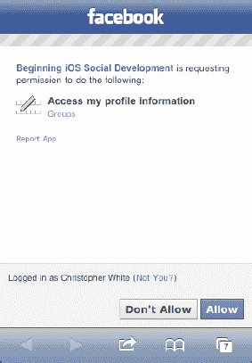

# 从 Facebook 图谱获取更多好东西

正如你所见，本书不仅致力于让你深入了解如何在应用程序中使用 Facebook iOS SDK，还会解释其底层运作机制。在第 6 章中，我们展示了如何获取你的 Facebook 好友列表的技术细节，介绍了 Facebook 图谱路径的结构原理，并解释了 `FBRequest` 类的工作原理。如果你还未阅读该章，现在不妨快速浏览一下，因为我们将通过一些新示例来演示如何从 Facebook 社交图谱中获取更多信息。不过，除非有新的内容需要讨论，否则我们将不再赘述技术细节。

请记住，通过 Facebook iOS SDK 的 `requestWithGraphPath:` 方法即可实现从 Facebook 图谱获取信息。

以下示例演示了如何完成这一基本任务：

```
NSMutableDictionary *params = [NSMutableDictionary dictionary];
//不需要扩展权限
[facebook requestWithGraphPath:@"me/friends"
                     andParams:params
                   andDelegate:self];
```

你传递给此方法的字符串采用以下格式：

```
<facebook_id>/<请求的图谱路径>
```

在该示例中，它将获取当前登录用户的好友列表：

```
me/friends
```

请注意代码中的注释。如第 5 章所述，通过 `OAuth` 对用户进行授权时，请求好友信息不需要任何扩展权限。

**注意：** 你可以在示例应用的 `FriendsViewController` 类的 `viewDidLoad:` 方法中找到这些示例的代码。

如果你想获取某人的新闻推送，只需将图谱路径改为 `home`：

```
NSMutableDictionary *params = [NSMutableDictionary dictionary];
[facebook requestWithGraphPath:@"me/home"
                     andParams:params
                   andDelegate:self];
```

这将返回一个字典数组。每个字典包含新闻推送中一条信息的内容。每条信息的字典包含创建时间、帖子 ID、消息内容、类型（例如状态）、评论或点赞操作以及评论等键值：

```
{
    actions =     (
        {
          link = "http://www.facebook.com/<facebook id>/posts/<post id>";
          name = Comment;
        },
        {
          link = "http://www.facebook.com/<facebook id>/posts/<post id>";
          name = Like;
        }
    );
    "created_time" = "2011-02-28T02:23:08+0000";
    from =     {
        id = <facebook id>;
        name = "<facebook name>";
    };
    id = "<post id>";
    message = "....";
    type = status;
    "updated_time" = "2011-02-28T02:23:08+0000";
}
```

获取笔记需要扩展权限 `user_notes`，图谱路径为 `notes`（见图 7–5）：



**图 7–5.** *请求权限*

```
NSMutableDictionary *params = [NSMutableDictionary dictionary];
// 需要 'user_notes' 扩展权限
[facebook requestWithGraphPath:@"me/notes" andParams:params andDelegate:self];
```

这将返回一个字典数组。每个字典包含用户一条笔记的信息。每条笔记的字典包含创建时间、笔记 ID、笔记/消息内容以及评论等键值：

```
{
    comments =     {
        data =         (
            {
                "created_time" = "2009-08-02T13:41:44+0000";
                from =    {
                    Id = <facebook id>;
                    name = "<facebook name>";
                    };
                    id = "<post id>";
                    message = "<comment>";
                },
                {
                        "created_time" = "2009-08-02T13:43:01+0000";
                    from =    {
                        id = <facebook id>;
                        name = "<facebook name>";
                };
                    id = "<post id>";
                    message = "<comment>";
            }
        );
    };
    "created_time" = "2009-08-02T13:23:35+0000";
    from =     {
        id = <facebook id>;
            name = "<facebook name>";
    };
    icon = "http://static.ak.fbcdn.net/rsrc.php/v1/yY/r/1gBp2bDGEuh.gif";
    id = <note id>;
    message = "<note contents>";
    subject = quotes;
    "updated_time" = "2010-05-14T01:35:42+0000";
}
```

获取事件需要扩展权限 `user_events`，图谱路径为 `events`（见图 7–5）：

```
NSMutableDictionary *params = [NSMutableDictionary dictionary];
// 需要 'user_events' 扩展权限
[facebook requestWithGraphPath:@"me/events" andParams:params andDelegate:self];
```

这将返回一个字典数组。每个字典包含用户一个事件的信息。每个事件的字典包含开始和结束时间、事件 ID、事件名称、地点以及用户的 RSVP 状态等键值：

```
{
    "end_time" = "2011-03-10T13:00:00+0000";
    id = 106092242803326;
    location = "Electric Pickle";
    name = "WMC :: GODFATHER *James Brown Tribute* meets CHAMPION SOUND";
    "rsvp_status" = unsure;
    "start_time" = "2011-03-10T06:00:00+0000";
}
```

获取群组需要扩展权限 `user_groups`，图谱路径为 `groups`（见图 7–5）：

```
NSMutableDictionary *params = [NSMutableDictionary dictionary];
//需要 'user_groups' 扩展权限
[facebook requestWithGraphPath:@"me/groups" andParams:params andDelegate:self];
```

这将返回一个字典数组。每个字典包含用户一个群组的信息。每个群组的字典包含群组 ID、群组名称以及群组版本等键值：

```
{
    id = 166023750105785;
    name = "SkateSide Events";
    version = 1;
}
```

获取赞、电影、音乐和书籍需要扩展权限 `user_likes`，图谱路径分别为 `likes`、`movies`、`music` 或 `books`（见图 7–5）。

每个请求返回一个字典数组。每个字典包含用户的一个赞、电影、音乐或书籍的信息。每个项目的字典包含类别、创建时间、Facebook ID 和名称等键值。例如，以下代码返回用户的赞信息：

```
NSMutableDictionary *params = [NSMutableDictionary dictionary];
// 需要 'user_likes' 扩展权限
[facebook requestWithGraphPath:@"me/likes"
                     andParams:params
                   andDelegate:self];
```

```
{
    category = "Product/service";
    "created_time" = "2011-02-23T00:09:34+0000";
    id = 186242738068007;
    name = AAdvantage;
}
```

类似地，以下代码返回用户的电影信息：

```
[facebook requestWithGraphPath:@"me/movies"
                     andParams:params
                   andDelegate:self];
```

```
{
    category = Movie;
    "created_time" = "2010-12-28T18:50:40+0000";
    id = 104167709618686;
    name = "Ferris Bueller's Day Off";
}
```

以下代码返回用户的音乐信息：


`[facebook requestWithGraphPath:@"me/music" andParams:params andDelegate:self];`

```
{
    category = "Musician/band";
    "created_time" = "2011-01-16T02:11:26+0000";
    id = 47167209984;
    name = "New York Night Train";
}
```

以下代码返回用户书籍的相关信息：

`[facebook requestWithGraphPath:@"me/books" andParams:params andDelegate:self];`

获取用户的墙贴需要扩展权限 `read_stream`，其图形路径为 `feed`：

```
NSMutableDictionary *params = [NSMutableDictionary dictionary];
// 需要 'read_stream' 扩展权限
[facebook requestWithGraphPath:@"me/feed"
                     andParams:params
                   andDelegate:self];
```

上述代码片段返回一个字典数组。每个字典包含用户墙贴中一个条目的信息。每个条目的字典将包含以下键：创建时间、帖子 ID、消息内容、类型（例如，状态）、评论或点赞的操作，以及评论：

```
{
    actions =     (
      {
          link = "http://www.facebook.com/<facebook id>/posts/<post id>";
          name = Comment;
      },
      {
          link = "http://www.facebook.com/<facebook id>/posts/<post id>";
          name = Like;
      }
    );
    application = "<null>";
    caption = "www.youtube.com";
    comments =     {
        count = 4;
        data = (
            {
                "created_time" = "2011-02-24T15:30:59+0000";
                from ={
                        id = <facebook id>;
                        name = "<facebook name>";
                    };
                id = "<post id>";
                message = "…";
            },
            {
                "created_time" = "2011-02-26T00:28:32+0000";
                from = {
                        id = <facebook id>;
                        name = "<facebook name>";
                    };
                id = "<post id>";
                message = "i like the abe lincoln one as well :)";
            }
        );
    };
    "created_time" = "2011-02-24T04:12:30+0000";
    description = "Description here…";
    from =     {
        id = <facebook id>;
        name = "<facebook name>";
};
icon = "http://static.ak.fbcdn.net/rsrc.php/v1/yj/r/v2OnaTyTQZE.gif";
id = "<post id>";
likes =     {
    count = 2;
    data = (
             {
                 id = <facebook id>;
                 name = "<facebook name>";
              },
              {
                 id = <facebook id>;
                 name = "<facebook name>";
              }
        );
    };
    link = "http://www.youtube.com/watch?v=jL68NyCSi8o";
    message = "hahaha!";
    name = "Drunk History Vol. 5";
    picture = "<URL>";
    privacy =     {
        deny = 389937081509;
        description = "Friends Only; Except: restricted";
        friends = "ALL_FRIENDS";
        value = CUSTOM;
};
source = "http://www.youtube.com/v/jL68NyCSi8o&autoplay=1";
type = video;
"updated_time" = "2011-02-26T00:28:32+0000";
}
```

当然，你也可以获取用户被标记的照片、相册和视频。这需要扩展权限 `user_photos`，图形路径分别为 `photos`、`albums` 或 `videos`（参见图 7-5）。以下代码片段获取用户被标记的照片：

```
NSMutableDictionary *params = [NSMutableDictionary dictionary];
// 需要 'user_photos' 扩展权限
[facebook requestWithGraphPath:@"me/photos"
                     andParams:params
                   andDelegate:self]; //被标记的照片
```

类似地，以下代码片段获取用户被标记的相册：

```
[facebook requestWithGraphPath:@"me/albums"
                     andParams:params
                   andDelegate:self];
```

最后，以下代码片段获取用户被标记的视频：

```
[facebook requestWithGraphPath:@"me/videos"
                     andParams:params
                   andDelegate:self];
```

请注意，如果在授权用户时未包含正确的用户权限，则会调用 `request:didFailWithError` 委托方法。

### 限制结果

一个实用的功能是限制 Facebook 在前述示例中为每个条目返回的字典字段数量。无论请求什么内容，方法都是相同的。这通过 `fields` 参数实现。例如，在请求好友时，你可能只想要每个好友的 Facebook ID、姓名和头像。可以通过使用 `requestWithGraphPath:andParams:andDelegate` 方法来实现：

```
NSMutableDictionary *params = [NSMutableDictionary dictionary];
[params setObject:@"id,name,picture" forKey:@"fields"];
[facebook requestWithGraphPath:@"me/friends"
                     andParams:params
                   andDelegate:self];
```

#### 日期格式

你会注意到，前面的示例中很多返回信息都包含像创建时间这样的时间戳。默认情况下，Facebook 返回的所有日期字段都是 ISO-8601 格式的字符串。如果你希望这些字符串采用不同的格式，可以在请求中添加一个额外的 `date_format` 参数：

```
NSMutableDictionary *params = [NSMutableDictionary dictionary];
[params setObject:@"U" forKey:@"date_format"];
[facebook requestWithGraphPath:@"me/feed"
                     andParams:params
                   andDelegate:self];
```

上述示例通过指定 `U` 作为 `date_format` 的值，请求所有日期字符串采用 Unix 时间戳格式。更多可用的日期格式选项请参见以下链接：

`http://php.net/manual/en/function.date.php`

### 更多 Twitter API 的趣味用法

上一章结尾我们展示了如何检索并显示用户在 Twitter 上关注的人。Twitter 还提供了一系列其他有用的功能，接下来看看如何实现更多操作。这些功能包括获取某人的收藏推文、发布推文、发送私信以及许多其他操作。和往常一样，我们对示例应用做了一些调整，以便展示如何使用 `MGTwitterEngine` 中的 API 来访问所有内容。如果你运行本章的 Twitter 示例应用，会看到一个名为“Tweetin”的选项卡，其中包含一个“Twitter”按钮。修改 `TimelineViewController` 中 `twitterButtonClick:` 方法的代码，尝试我们在这里讨论的不同请求。敬请观赏！


