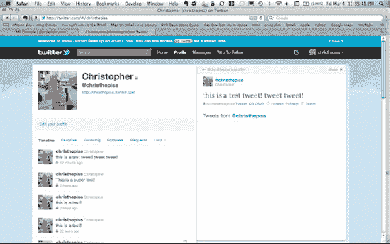
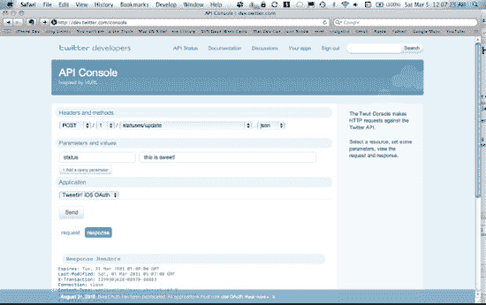
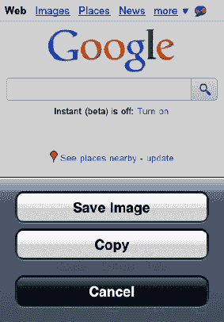
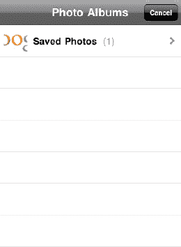
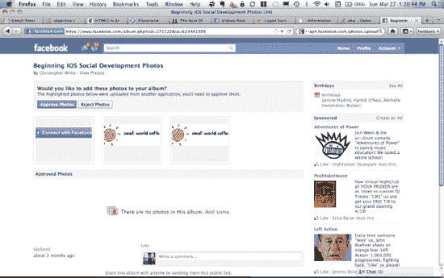

# 推特，走起！

你可能正迫不及待地想直接从 iOS 应用发推文，对吧？从 iOS 5 开始，Apple 已经让开发者可以轻松地在应用中集成 Twitter 发推功能。用户可以在 iOS 系统内登录 Twitter，而且在相机、照片、Safari、YouTube 和地图等多个预装应用中都能找到新的发推按钮。不过，Apple 对 Twitter 函数的支持仅止步于 POST 请求，因此我们将向你展示如何自行集成 Twitter 功能，以便你的应用需要执行更强大的操作。要为当前登录的用户发推，请使用以下 `MGTwitterEngine` 方法：

`- (NSString *)sendUpdate:(NSString *)status;`

这简直易如反掌。推文最多可包含 140 个 UCS-2 字符。如果超出此长度，推文会被截断。对于 `status` 参数，只需传入你要发送的内容即可：

`[sa_OAuthTwitterEngine sendUpdate:@"this is a test tweet! tweet tweet!"];`

我们不会再次详细讲解 `MGTwitterEngineDelegate`；不过，回想一下，我们将主应用委托设置为了 `MGTwitterEngineDelegate`，因此你可以通过查看该类来了解每次调用这些方法时会发生什么。我们将在此处提及这些方法，并假设你可以在 `AppDelegate.m` 中找到它们。请记住，如果请求成功，首先调用的是 `requestSucceeded:`；接着，根据请求类型，会调用一个后续的委托方法。

最终，当你发推时，`statusesReceived:` 委托方法会被调用，并传入从 Twitter 返回的推文的实际详细信息。我们修改了 `statusesReceived:` 方法，以向你展示更多信息。在此方法中接收到的主要参数是一个来自 Twitter 的项目数组。该数组中的每个元素都是一个表示单个项目的字典。根据你最初向 Twitter 请求的内容，表示项目的键值对集合会有所不同。在我们新的 `statusesReceived:` 实现中，我们取数组中的第一个项目，如果它存在，则获取该推文的 Twitter ID 并将其打印到控制台日志。看看这个例子是如何实现的：

```
- (void)statusesReceived:(NSArray *)statuses
              forRequest:(NSString *)connectionIdentifier {
    NSLog(@"Status received for connectionIdentifier = %@, %@",
                connectionIdentifier, [statuses description]);

    NSDictionary *dictionary = [statuses objectAtIndex:0];
    if (dictionary) {
        NSString *twitterID = [dictionary objectForKey:@"id"];
        NSLog(@"TwitterID = %@", twitterID);
    }
}
```

**注意：** 关于 Twitter ID 有一点需要牢记：与 Facebook 图谱类似，Twitter 中的每个实体都有唯一的 ID。这些 ID 在 Twitter 的许多 API 中都会用到，所以我们想在此简单提一下。

来自 Twitter 的项目的 ID 始终存储在该项目字典的 `id` 键中。`MGTwitterEngine` 代码最初编写时接受无符号长整型作为这些 ID；然而，Twitter ID 后来变大了，无法再容纳在一个无符号长整型变量中。为了让我们的生活（希望也包括你的）更轻松，我们修改了本书使用的 `MGTwitterEngine` 版本，使其在需要 Twitter ID 的地方都接受字符串参数。

一条推文的完整字典包含大量有用的信息。例如，如果我们在 `statusesReceived:` 方法中打印出整个字典，我们会看到如下内容：

```
{
    contributors = "";
    coordinates = "";
    "created_at" = "Fri Mar 04 04:18:55 +0000 2011";
    favorited = false;
    geo = "";
    id = 43525805485199360;
    "in_reply_to_screen_name" = "";
    "in_reply_to_status_id" = "";
    "in_reply_to_user_id" = "";
    place = "";
    "retweet_count" = 0;
    retweeted = false;
    source = "<a href=\"http://www.apress.com\"
                      rel=\"nofollow\">Tweetin' iOS OAuth</a>";
    "source_api_request_type" = 5;
    text = "this is a test tweet! tweet tweet!";
    truncated = 0;
    user =     {
        "contributors_enabled" = false;
        "created_at" = "Sat Jan 09 21:25:41 +0000 2010";
        description = "";
        "favourites_count" = 4;
        "follow_request_sent" = false;
        "followers_count" = 24;
        following = 0;
        "friends_count" = 186;
        "geo_enabled" = false;
        id = <twitter user id>;
        "is_translator" = false;
        lang = en;
        "listed_count" = 0;
        location = "";
        name = Christopher;
        notifications = false;
        "profile_background_color" = C0DEED;
        "profile_background_image_url" = "URL";
        "profile_background_tile" = false;
        "profile_image_url" = "URL";
        "profile_link_color" = 0084B4;
        "profile_sidebar_border_color" = C0DEED;
        "profile_sidebar_fill_color" = DDEEF6;
        "profile_text_color" = 333333;
        "profile_use_background_image" = true;
        protected = 1;
        "screen_name" = christhepiss;
        "show_all_inline_media" = false;
        "statuses_count" = 451;
        "time_zone" = "Eastern Time (US & Canada)";
        url = "http://christhepiss.tumblr.com";
        "utc_offset" = "-18000";
        verified = false;
    };
}
```

请注意我们之前提到的 `id`。同时也要注意推文的 `text` 和 `source`。由于我们在授权用户时使用了本书的应用标识符，所以来源显示为“Tweetin' iOS OAuth”。在 Twitter 上，它的显示效果与你在图 7-6 中看到的类似。



**图 7-6.** *一条测试推文。而且它成功了！*

所以现在你已经发了推文，感觉一定很好。我们知道我们感觉很好。不过，假设你想查看自己所有的推文。操作很简单：

`[sa_OAuthTwitterEngine getUserTimeline];`

在 Twitter 的世界里，推文沿时间线存在，因为每条推文都发生在特定的时间点。因此，你可以获取用户的时间线（就像我们之前做的那样），或者获取该用户及其所有关注者的时间线：

`[sa_OAuthTwitterEngine getHomeTimeline];`

你甚至可以获取 Twitter 上所有公开推文用户的完整公共时间线：

`[sa_OAuthTwitterEngine getPublicTimeline];`

类似地，你还可以获取当前登录用户收藏的推文：

`[sa_OAuthTwitterEngine getFavoriteUpdatesFor:nil startingAtPage:0];`

对于上述每种情况（以及其他情况），Twitter 都会通过 `statusesReceived:` 返回一个字典数组，其中每个字典与前面的字典相同，包含给定推文的所有相关信息和统计数据，并指明其来源。

使用 Twitter API，你还可以删除推文。如果我们想删除上面的推文，可以这样做，传入该推文的 ID：

`[sa_OAuthTwitterEngine deleteUpdate:@"43525805485199360"];`

在第 6 章中，我们向你展示了如何获取某人的关注者；然而，你也可以随时使用某位 Twitter 用户的名称或其 Twitter ID 来请求关于该用户的特定信息：

`[sa_OAuthTwitterEngine getUserInformationFor:@"此处填入 Twitter 用户名"];`


这将返回我们在第 6 章中展示过的相同信息字典，因此这里不再重复显示。请参阅第 6 章了解该响应中包含的内容。接下来，在 XCode 的主应用程序代理中的 `userInfoReceived:` 方法处设置一个断点，以观察其实际运行效果。

如果你想关注某人，也可以使用以下代码来实现：

```
[sa_OAuthTwitterEngine enableNotificationsFor:@“christhepiss”];
```

当你想发送一条私信时，请执行以下操作：

```
[sa_OAuthTwitterEngine sendDirectMessage:@"how goes it?" to:@"christhepiss"];
```

来自 Twitter 的响应将通过 `directMessagesReceived:` 委托方法接收；私信的字典结构如下所示：

```
{
    "created_at" = "Fri Mar 04 06:33:49 +0000 2011";
    id = 2542673717;
    recipient =     {
        "contributors_enabled" = false;
        "created_at" = "Sat Jan 09 21:25:41 +0000 2010";
        description = "";
        "favourites_count" = 4;
        "follow_request_sent" = false;
        "followers_count" = 24;
        following = 0;
        "friends_count" = 187;
        "geo_enabled" = false;
        id = 103384600;
        "is_translator" = false;
        lang = en;
        "listed_count" = 0;
        location = "";
        name = Christopher;
        notifications = false;
        "profile_background_color" = C0DEED;
        "profile_background_image_url" = "URL";
        "profile_background_tile" = false;
        "profile_image_url" = "URL";
        "profile_link_color" = 0084B4;
        "profile_sidebar_border_color" = C0DEED;
        "profile_sidebar_fill_color" = DDEEF6;
        "profile_text_color" = 333333;
        "profile_use_background_image" = true;
        protected = 1;
        "screen_name" = christhepiss;
        "show_all_inline_media" = false;
        "statuses_count" = 451;
        "time_zone" = "Eastern Time (US & Canada)";
        url = "http://christhepiss.tumblr.com";
        "utc_offset" = "-18000";
        verified = false;
    };
    "recipient_id" = 103384600;
    "recipient_screen_name" = christhepiss;
    sender =     {
        "contributors_enabled" = false;
        "created_at" = "Sat Jan 09 21:25:41 +0000 2010";
        description = "";
        "favourites_count" = 4;
        "follow_request_sent" = false;
        "followers_count" = 24;
        followers = 0;
        "friends_count" = 187;
        "geo_enabled" = false;
        id = 103384600;
        "is_translator" = false;
        lang = en;
        "listed_count" = 0;
        location = "";
        name = Christopher;
        notifications = false;
        "profile_background_color" = C0DEED;
        "profile_background_image_url" = "URL";
        "profile_background_tile" = false;
        "profile_image_url" = "URL";
        "profile_link_color" = 0084B4;
        "profile_sidebar_border_color" = C0DEED;
        "profile_sidebar_fill_color" = DDEEF6;
        "profile_text_color" = 333333;
        "profile_use_background_image" = true;
        protected = 1;
        "screen_name" = christhepiss;
        "show_all_inline_media" = false;
        "statuses_count" = 451;
        "time_zone" = "Eastern Time (US & Canada)";
        url = "http://christhepiss.tumblr.com";
        "utc_offset" = "-18000";
        verified = false;
    };
    "sender_id" = 103384600;
    "sender_screen_name" = christhepiss;
    "source_api_request_type" = 15;
    text = "hey jerky!";
}
```

`MGTwitterEngine` SDK 缺少一个用于轻松构建推文或私信的对话框类，因此这部分工作需要你自行构建。:( 别忘了查看 `MGTwitterEngine.h` 中更多可用的方法，我们在这里并未全部覆盖。

### 幕后原理：Twitter URL

上述所有操作的一个优点是，它们共享底层 Twitter HTTP API 的通用 URL 模式：

`http://twitter.com/`

URL 的剩余路径部分根据你的具体操作来构建。对于状态相关操作，路径为：

`http://twitter.com/statuses`

对于用户相关操作，路径为：

`http://twitter.com/users`

对于私信，路径为：

`http://twitter.com/direct_messages`

路径的最后一部分是你要执行的特定操作。其后是扩展名（与期望的响应格式匹配），然后是参数。因此，如果我们想要以 XML 格式获取公共时间线（`MGTwitterEngine` 默认请求 XML 响应），它将如下所示：

`http://twitter.com/statuses/public_timeline.xml`

如果你希望更详细地了解每个请求的最终 URL 是如何构建的，可以查阅 `SA_OAuthTwitterEngine` 的 `_sendRequestWithMethod:` 方法中的代码。

### Twitter 开发者控制台

如果你更倾向于在 web 浏览器中使用 Twitter API，Twitter 提供了一个非常优秀的在线工具，我们强烈推荐。该工具可通过以下 URL 访问：

`http://dev.twitter.com/console`

Twitter 开发者控制台允许你构建不同的请求或进行不同类型的发布，并查看 Twitter 的响应。图 7–7 展示了页面的主要部分。



**图 7–7.** *Twitter API 控制台*

另一个优秀的资源是每个 Twitter HTTP API 的文档，你可以在其中获得使用每个 API 的详细说明：

`http://dev.twitter.com/doc`

### 结语

现在，你已经正式武装完毕，具备了很强的能力。我们已经涵盖了 Facebook 和 Twitter 的足够多的 API，并向你展示了如何将它们与相应的 iOS SDK 结合使用。理论上，你现在就可以开始构建自己的 Facebook 或 Twitter 应用了。这是一项相当艰巨的任务，但你已经拥有了完成它的工具。不过，请继续阅读，以更深入地了解实时数据和位置处理，以及如何以不同方式将这两个 API 融合在一起。

## 第 8 章

## POST 请求、数据建模与离线处理

本章将介绍向 Facebook 和 Twitter 发布照片的具体细节。我们还将讨论离线存储；最后，会介绍一个流行的跨平台发布库，以及如何在自己的项目中使用它。

到目前为止，我们已经在 iOS 上涵盖了关于 Facebook 和 Twitter 编程的许多不同主题。然而，为了尽可能清晰地展示这些主题，我们打破了一些良好的编程实践。因此在本章中，我们将纠正这些做法，并展示将这些服务集成到应用程序中的更好技术。我们还将涵盖离线场景和存储。但在进入这些话题之前，我们需要为工具包再添加一项基本技能：向 Facebook 和 Twitter 发布照片。

### 摆个姿势

对于大多数在 iOS 设备上使用图片的应用程序而言，图片要么从网络下载，要么由应用程序创建并作为应用数据的一部分存储。也可以从设备的“照片图库”中获取图片。幸运的是，苹果让从“照片图库”获取图片变得很容易，因此我们的示例应用程序将采用这种方式。本章的照片上传示例应用程序分别位于 Git 仓库的 `Chapter8` 文件夹下的 `ApiFacebook` 和 `ApiTwitter` 文件夹中。


#### 将图片保存到 iOS 模拟器的相册

将图片存入 iOS 模拟器的相册有点棘手，因为模拟器无法模拟相机硬件；不过，有一种快捷方法可以通过保存网页中的图片来实现。首先，在模拟器中启动 Safari 浏览器，访问 [`www.google.com`](http://www.google.com)。在搜索栏上方的 Google 图标上按住鼠标一至两秒，然后松开鼠标。您将看到 图 8-1 中所示的弹出对话框，允许您保存或复制图片。选择**存储图像**，即可将图片保存到模拟器的相册中。



**图 8-1.** *在移动版 Safari 中长按网页上的图片，即可保存或复制该图片。*

**注意：** 根据我们的经验，有时需要重复上述步骤数次，图片才会出现在相册中。

#### 使用 UIImagePickerController

现在，我们已在模拟器的相册中保存了一张图片，接下来需要在代码中访问该图片。这正是 `UIImagePickerController` 类发挥作用的地方。Apple 的工程师精心打造了一个非常易于使用的类，用于从相册中获取图片，并在应用中将其数据作为 `UIImage` 对象使用。您可以将以下代码片段插入到任何 `UIViewController` 类中，以显示 `UIImagePickerController`。在下一节中，我们将介绍如何将此代码片段整合到本章的示例应用中。

首先，我们检查相册是否是可访问的图片来源。接着，创建一个 `UIImagePickerController`，并告知它我们希望使用相册作为图片来源。最后，将自身设置为其委托，并使用 `UIViewController` 的 `presentModalViewController` 方法来显示它：

```
if ([UIImagePickerController isSourceTypeAvailable:
    UIImagePickerControllerSourceTypePhotoLibrary]) {
        UIImagePickerController *uiImagePickerController =
                                     [[UIImagePickerController alloc] init];
        uiImagePickerController.sourceType =
            UIImagePickerControllerSourceTypePhotoLibrary;
        uiImagePickerController.delegate = self;
        [self presentModalViewController:uiImagePickerController animated:YES];
        [uiImagePickerController release];
}
```

在使用 `UIImagePickerController` 时，我们必须将视图控制器设置为 `UIImagePickerControllerDelegate`，并实现以下方法：

```
- (void)imagePickerController:(UIImagePickerController *)picker
    didFinishPickingMediaWithInfo:(NSDictionary *)info;

- (void)imagePickerControllerDidCancel:(UIImagePickerController *)picker;
```

当选择一张图片时，会调用 `UIImagePickerControllerDelegate` 的 `imagePickerController:didFinishPickingMediaWithInfo:` 方法。`UIImage` 对象的数据存储在传递给该方法的 `NSDictionary` 中，键值为 `UIImagePickerControllerOriginalImage`。以下是实现这一切的代码（请注意，`savedImage` 已在别处声明）：

```
- (void)imagePickerController:(UIImagePickerController *)picker
    didFinishPickingMediaWithInfo:(NSDictionary *)info
{
    [savedImage release];
    savedImage = [info objectForKey:@"UIImagePickerControllerOriginalImage"];
    [self dismissModalViewControllerAnimated:YES];
}
```

值得注意的是，您有责任通过 `UIViewController` 的 `dismissModalViewControllerAnimated` 方法来关闭 `UIImagePickerController`：

```
- (void)imagePickerControllerDidCancel:(UIImagePickerController *)picker
{
    [self dismissModalViewControllerAnimated:YES];
}
```

运行时，`UIImagePickerController` 会显示设备上的相册列表，如 图 8-2 所示。



**图 8-2.** *UIImagePickerController 显示的已保存照片列表*

选择相册后，您便可以从中选择一张照片，如 图 8-3 所示。


**图 8-3.** *在 UIImagePickerController 中点击一张图片。*

#### ImagePostController

在本章的 `ApiFacebook` 和 `ApiTwitter` 示例项目中，您将找到一个名为 `ImagePostController` 的新 `UIViewController`。它包含一个按钮，点击后会显示 `UIImagePickerController`。`ImagePostController` 是一个 `UIImagePickerControllerDelegate`；因此，当选择一张图片时，它会将图片保存到在 `ImagePostController.h` 中声明的 `UIImage` 对象 `savedImage` 中。然后，`ImagePostController` 会将图片发布到当前登录用户的 Facebook 照片或 Twitter 信息流中。

#### Facebook 照片上传

上一节我们介绍了如何通过委托回调获取 `UIImage`，现在我们将重点放在如何将图片发布到用户的 Facebook 照片中。接下来讨论的代码位于本章 ApiFacebook 示例应用的 `ImagePostController.m/.h` 文件中。

为此，我们将使用老朋友 `requestWithGraphPath:andParams:andHttpMethod:andDelegate:` 方法。我们将图形路径设置为 `"me/photos"`，以指定目标为当前用户的照片。然后传入一个参数字典。该字典用于存储图片数据。图片本身作为键 `image` 的对象存储在字典中。如果您想为图片添加说明文字，还可以为键 `message` 添加说明文本。接着，由于我们是在发布数据，因此将 HTTP 方法设置为 `POST`。最后，我们将自身指定为 `FBRequestDelegate`：

```
- (void)imagePickerController:(UIImagePickerController *)picker
    didFinishPickingMediaWithInfo:(NSDictionary *)info
{
    [savedImage release];
    savedImage = [info objectForKey:@"UIImagePickerControllerOriginalImage"];
    [self dismissModalViewControllerAnimated:YES];

    NSMutableDictionary *args = [[NSMutableDictionary alloc] init];
    [args setObject:@"This is a test image" forKey:@"message"];
    [args setObject:savedImage forKey:@"image"];
    [facebook requestWithGraphPath:@"me/photos"
                       andParams:args
                   andHttpMethod:@"POST"
                     andDelegate:self];
    [args release];
}
```

如果发布成功，将调用 `FBRequestDelegate` 的 `request:didLoad:` 方法。如果登录到您的 Facebook 帐户，您应该会看到一个新的相册，其中包含这张图片。该相册的名称将与您在 Facebook 上注册应用时使用的应用名称一致。以本书为例，相册名称为“Beginning iOS Social Development”（见图 8-4）。



**图 8-4.** *Facebook 将来自第三方应用的照片归类在一起。*


