# Twitter 照片上传

通常情况下，Facebook iOS SDK 为我们提供了极大的便利。从前一节可以看出，将图片发布到用户的 Facebook 相册只需极少的代码量。遗憾的是，要通过 Twitter 完成同样的任务就没那么简单了，不过在编写本书时，Twitter 正与 Photobucket 建立合作关系，以简化开发者在 Twitter 上发布带图推文的流程。本章将展示如何将图片上传到图片托管服务（例如 TwitPic [`www.twitpic.com/`]），然后将图片在 twitpic.com 上的网址发布到用户的 Twitter 时间线。以下示例代码使用 TwitPic，但还有其他类似服务可供选择，例如 twitgoo [`www.twitgoo.com/`] 和 yfrog [`www.yfrog.com/`]。

为了将图片发布到 twitpic.com，我们首先需要在该服务的网站上注册，获取 TwitPic API 密钥。访问 `http://dev.twitpic.com/apps/new` 并使用你的 Twitter 凭据登录（见图 8-5 和图 8-6）。

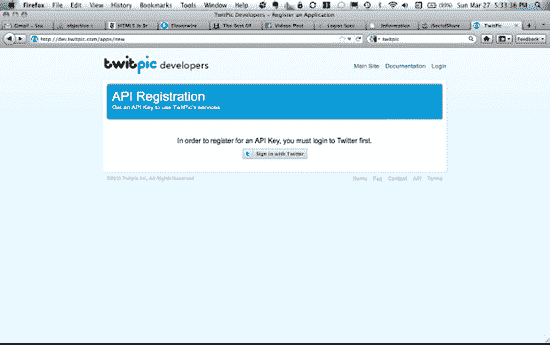

**图 8-5.** *注册 TwitPic API 密钥，以便在 iOS 应用中使用该公司的服务。*

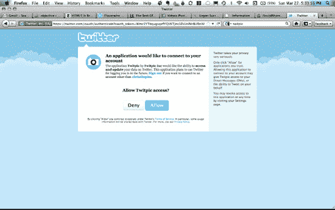

**图 8-6.** *通过 OAuth 授权 TwitPic 访问权限*

接下来，输入关于你应用的必填信息（见图 8-7）。

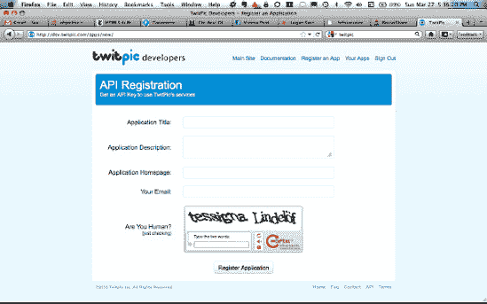

**图 8-7.** *向 TwitPic 提供基本应用信息*

最后，保存返回的 TwitPic API 密钥以备后用（见图 8-8）。

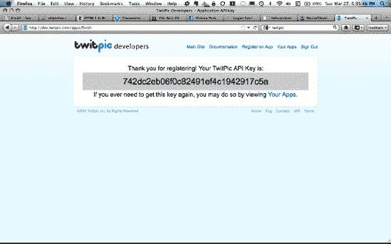

**图 8-8.** *成功注册后，`TwitPic` 会为应用创建一个 `API 密钥`。*

按照此类服务的惯例，TwitPic 提供了基于 HTTP 的 API 用于将照片上传到其网站。API 文档位于 `http://dev.twitpic.com/docs/`。此外，碰巧有热心人为这个 API 构建了一个 iOS Objective-C 封装，并托管在 Github（`GSTwitPicEngine`）上，地址是 `https://github.com/Gurpartap/GSTwitPicEngine`。`GSTwitPicEngine` 设计为与 `MGTwitterEngine` 配合使用，因此它能够很好地（只需少量调整，详情请见下文）集成到我们已有的配置中。不幸的是，`GSTwitPicEngine` 依赖于其他一些软件组件，且并非所有组件都能开箱即用地正常工作。好消息是：我们已经为你抹平了所有棘手之处。

因此，在研究如何使用 `GSTwitPicEngine` 之前，我们需要先从 Github 获取其他库的代码，设置 Git 子模块，然后将相关文件添加到项目中。本章中所有项目变更和代码均位于 `ApiTwitter` 项目中，具体在 `ImagePostController.m/.h` 文件内。

## GSTwitPicEngine

你可以通过 Git 子模块将 Github 上的 `GSTwitPicEngine` iOS Git 仓库链接到你的仓库，该子模块将位于名为 `GSTwitPicEngine` 的子目录中：
```
$ git submodule add git://github.com/chrisdannen/GSTwitPicEngine.git GSTwitPicEngine
```
在项目中创建一个名为 `GSTwitPicEngine` 的新组，并将 `GSTwitPicEngine.m/.h` 拖入其中：

最后，在 `GSTwitPicEngine.h` 中设置以下值：
```
#define TWITTER_OAUTH_CONSUMER_KEY @"<>"
#define TWITTER_OAUTH_CONSUMER_SECRET @"<>"
#define TWITPIC_API_KEY @"<>"
```

## ASIHTTPRequest

`ASIHTTPRequest` 是一个开源库，它能轻松实现 HTTP 请求。`GSTwitPicEngine` 使用该库完成繁重的工作。

通过 Git 子模块将 Github 上的 `ASIHTTPRequest` Objective-C Git 仓库链接到你的仓库，该子模块将位于名为 `asi-http-request` 的子目录中：
```
$ git submodule add git://github.com/pokeb/asi-http-request.git asi-http-request
```
现在，在项目中创建一个名为 `ASIHttpRequest` 的新组，并将 `./asi-http-request/Classes` 中的必要文件拖入你的项目。请参考本章的 `ApiTwitter` 示例项目，了解你需要使用的具体文件子集。

接下来，在 Xcode 项目中，将你的目标链接到 `CFNetwork`、`SystemConfiguration`、`MobileCoreServices` 和 `zlib.1.2.3.dylib`（见图 8-9）。

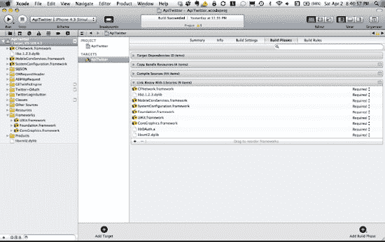

**图 8-9.** *在 Xcode 项目中添加 `ASIHTTPRequest` 后，更新链接器设置。*

## SBJSON

SBJSON 是少数几个用于解析 JSON 的开源 Objective-C 框架之一。在 `./GSTwitPicEngine/GSTwitPicEngine.h` 中，我们指定 SBJSON 作为我们首选的 JSON 框架，因此需要将相关文件包含到项目中：
```
#define TWITPIC_USE_SBJSON 1
```
通过 Git 子模块将 Github 上的 SBJSON Objective-C Git 仓库链接到你的仓库，该子模块将位于名为 `json-framework` 的子目录中：
```
$ git submodule add git://github.com/stig/json-framework.git json-framework
```
接下来，在项目中创建一个名为 `SBJSON` 的新组，并将 `./json-framework/Classes` 中的所有文件拖入你的项目。

## OARequestHeader

通过 Git 子模块将 Github 上的 `OARequestHeader` Objective-C Git 仓库链接到你的仓库，该子模块将位于名为 `OARequestHeader` 的子目录中：
```
$ git submodule add git://github.com/chrisdannen/OARequestHeader.git OARequestHeader
```
在项目中创建一个名为 `OARequestHeader` 的新组，并将 `./OARequestHeader.m/.h` 文件拖入你的项目。

现在，将任何更新后的文件（例如你的 Xcode 项目文件）添加到 Git 提交中，然后提交并推送你的更改到 Github。


### 发布照片

我们终于准备好向示例项目中添加一些代码，用于将照片链接发布到用户的 Twitter 动态中。大部分相关更改都在 `ImagePostController.m/.h` 文件中；你也可以在 `AppDelegate.m` 中找到一些小的改动。在本节中，我们将重点关注 `ImagePostController.m/.h` 中的更改。

首先，我们在 `ImagePostController.h` 中声明一些需要的对象：

```
#import <UIKit/UIKit.h>
#import "GSTwitPicEngine.h"

@interface ImagePostController : UIViewController <UINavigationControllerDelegate,
                                                      UIImagePickerControllerDelegate, GSTwitPicEngineDelegate> {
    UIButton *twitterButton;
    UIImage *savedImage;
    GSTwitPicEngine *twitpicEngine;
}

@end
```

我们需要一个 `GSTwitPicEngine` 的实例来将照片发布到 twitpic.com。我们还需要保存返回的图像，并且需要将自身声明为 `GSTwitPicEngineDelegate`，以便在 `GSTwitPicEngine` 完成向 twitpic.com 发布照片时收到通知。


**图 8–10.** *从 iOS 应用上传到 TwitPic 的图片*

当 `ImagePostController` 的视图被加载时，我们需要创建并初始化 `GSTwitPicEngine` 实例：

```
- (void)loadView
{
    [super loadView];

    twitterButton = [UIButton buttonWithType:UIButtonTypeRoundedRect];
    twitterButton.frame = CGRectMake(127.0f, 68.0f, 72.0f, 37.0f);
    [twitterButton setTitle:@"Twitter" forState:UIControlStateNormal];
    [twitterButton addTarget:self
                     action:@selector(twitterButtonClick:)
           forControlEvents:UIControlEventTouchUpInside];
    [self.view addSubview:twitterButton];

    twitpicEngine = [[GSTwitPicEngine twitpicEngineWithDelegate:self] retain];
    [twitpicEngine setAccessToken:[sa_OAuthTwitterEngine accessToken]];
}
```

注意，我们将自身设置为 `GSTwitPicEngine` 的委托，并将主 Twitter 引擎中的 `accessToken` 传递给 `GSTwitPicEngine`，以便其拥有必要的 `OAuth` 参数。请注意，在运行示例应用时，你首先需要从“登录”标签页登录 Twitter。

当通过 `UIImagePickerController` 选择图片后，我们可以使用 `GSTwitPicEngine` 的 `uploadPicture:withMessage:` 方法将图片发布到 twitpic.com：

```
- (void)imagePickerController:(UIImagePickerController *)picker
 didFinishPickingMediaWithInfo:(NSDictionary *)info
{
    [savedImage release];
    savedImage = [info objectForKey:@"UIImagePickerControllerOriginalImage"];
    [self dismissModalViewControllerAnimated:YES];

    // 此消息在请求的 userInfo 中的成功委托回调中返回。
    [twitpicEngine uploadPicture:savedImage withMessage:@"Hello world!"];
}
```

如果照片成功上传到 twitpic.com，则会调用 `GSTwitPicEngineDelegate` 的 `twitpicDidFinishUpload:` 方法，并传入一个包含响应信息的 `NSDictionary`：

```
- (void)twitpicDidFinishUpload:(NSDictionary *)response
{
    NSLog(@"TwitPic finished uploading: %@", response);

    // [response objectForKey:@"parsedResponse"] 返回一个 NSDictionary，
    // 其中包含解析后的响应（如果某个解析库可用）。
    // 否则，请使用 [[response objectForKey:@"request"]
    // objectForKey:@"responseString"] 自行解析。

    if ([[[response objectForKey:@"request"] userInfo] objectForKey:@"message"] > 0 &&
                                                                           [[response objectForKey:@"parsedResponse"] count] > 0) {
        NSString *update = [NSString stringWithFormat:@"%@ %@",
               [[response objectForKey:@"parsedResponse"] objectForKey:@"text"],
               [[response objectForKey:@"parsedResponse"] objectForKey:@"url"]];
        [sa_OAuthTwitterEngine sendUpdate:update];
    }
}
```

返回的响应字典中包含一个键为 `parsedResponse` 的字典，其中包含我们向 twitter.com 发布内容所需的信息：

```
TwitPic finished uploading: {
    parsedResponse =     {
        height = 128;
        id = 4gao9b;
        size = 15551;
        text = "Hello world!";
        timestamp = "Sun, 03 Apr 2011 01:04:55 +0000";
        type = jpg;
        url = "http://twitpic.com/4gao9b";
        user =         {
            id = 103384600;
            "screen_name" = christhepiss;
        };
        width = 366;
    };
    request = "<ASIFormDataRequest: 0x50a4c00>";
}
```

我们从 `parsedResponse` 字典中获取 `text` 和 `url` 键的值，然后调用 Twitter 引擎的 `sendUpdate:` 方法，将这些值用于最终的 Twitter 发布，如图 8–11 所示。


**图 8–11.** *最终结果：一条包含指向 TwitPic 图片链接的推文*

### 离线模式与后台处理

对于 iOS 应用而言，处理从服务器检索或同步的数据可能会使应用容易受到连接中断的影响。为了实现离线操作，请将数据存储在本地设备上，这样即使 3G 或 Wi-Fi 不可用，应用仍然可以呈现数据。如果你有兴趣构建一个功能完善的 Twitter 或 Facebook iOS 应用——或者只是想学习一些额外的技术——那么本节是必读内容。

在本节中，我们将构建一个简单的 Twitter 应用，它可以检索 Twitter 状态更新并将其存储在设备上。这样一来，即使设备离线，也始终有数据可以显示。这个示例应用名为 `OfflineTwitter`，你可以在 Git 仓库的 `Chapter8/OfflineTwitter` 目录中找到它。

如果你熟悉模型-视图-控制器（MVC）编程范式，那么你会注意到，我们实际上是在构建该范式的模型部分。用户界面（或视图）始终从模型获取数据。当从服务器接收到新数据时，数据会存储在模型中。然后，视图会被刷新，并从模型中获取最新的数据。

iOS 应用中一个很好的数据存储工具是 *Core Data*。虽然我们不建议将其用于大数据集（针对大数据集，我们推荐使用 SQLite），但 Core Data 在进行概念验证工作和帮助设计模型 API 时非常有用。我们将逐步介绍使用 Core Data 设置模型 API 的所有步骤；不过，如果你从未在 iOS 上使用过 Core Data，我们也建议阅读以下内容，或保留此链接作为便捷的快速参考：

`http://developer.apple.com/library/ios/#DOCUMENTATION/DataManagement/Conceptual/iPhoneCoreData01/Introduction/Introduction.html#//apple_ref/doc/uid/TP40008305-CH1-SW1`


#### 使用 `TwitterDataStore` 进行数据建模

在为应用设计数据模型时，最好的做法之一就是思考该数据模型需要执行的高层级操作。为简化问题，我们希望示例应用中的 Twitter 数据模型能支持以下三个主要功能：

*   返回当前存储的推文集合。
*   删除所有已存储的推文。
*   存储推文。

在我们的示例应用中，我们定义了 `TwitterDataStore` 类。请打开示例项目，点击 Model 文件夹中的 `TwitterDataStore.h` 文件：

```
@interface TwitterDataStore : NSObject {
}

- (NSArray*)tweets;
- (void)deleteTweets;
- (void)synchronizeTweets:(NSArray*)tweets;

@end
```

既然我们已经有了基本的接口，就需要让它们执行各自所需的操作。这就是 Core Data 发挥作用的地方。以下是让您的应用使用 Core Data 所需的步骤。

首先，我们必须向项目中添加一个 Core Data 模型文件。Core Data 模型用于创建我们希望为应用表示和存储的不同实体。从 Xcode 的主菜单中，依次选择 File → New → New File... 在 iOS 部分中选择 Core Data，然后选择 Data Model 文件类型，并为文件指定一个合适的名称（见图 8-12）。

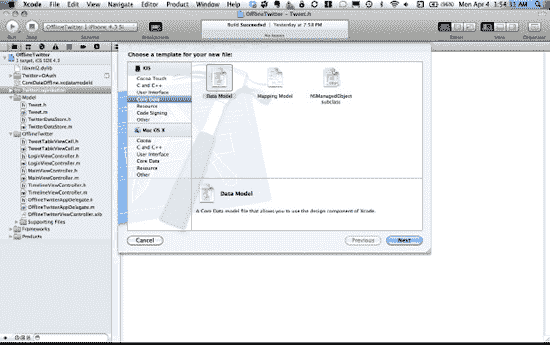

**图 8–12.** *向应用的 Xcode 项目中添加 Core Data 对象模型。*

接下来，将你的项目链接到 Core Data 框架（见图 8-13）。

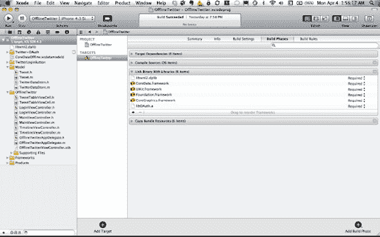

**图 8–13.** *更新链接器设置以支持使用 Core Data*

既然我们已经有了 Core Data 模型，接下来需要向其中添加一个实体。由于我们的应用旨在离线存储推文，让我们添加一个 `Tweet` 实体。在 Xcode 项目中选择 Core Data 模型文件（在示例项目中，该文件名为 `CoreDataOffline.xcdatamodeld`），以便在 Xcode 主窗口中显示该模型。在模型窗口底部，点击 Add Entity 按钮——它上面有一个大的加号（见图 8-14）。

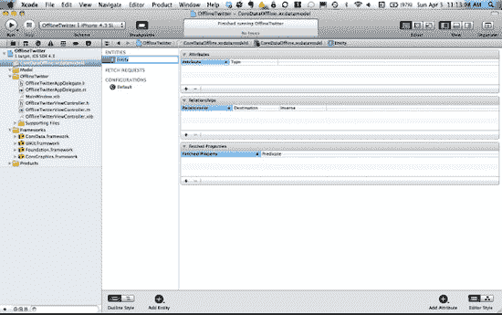

**图 8–14.** *向数据模型添加一个实体。*

接下来，将此实体重命名为 Tweet（见图 8-15）。

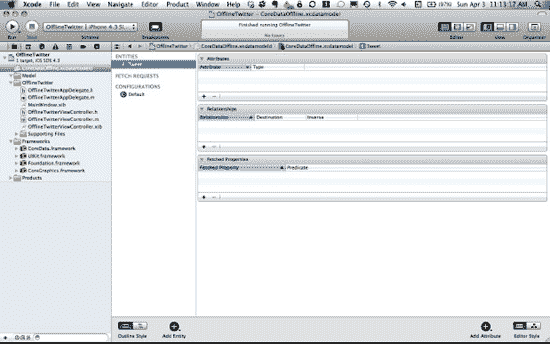

**图 8–15.** *数据模型中的 Tweet 实体*

Twitter 上实际的推文包含大量相关信息；然而，这是一个简单的应用，因此我们只打算存储每条推文的 id 和实际文本内容。这里的目标仅仅是展示设置模型的基本概念。确保选中了 `Tweet` 实体，然后在 Attributes 部分点击 + 号以添加一个新属性（见图 8-16）。将该属性命名为 `id`，并将其类型设置为 `Integer 64`。接着，添加另一个名为 `text` 的属性，并将其类型设置为 `String`。

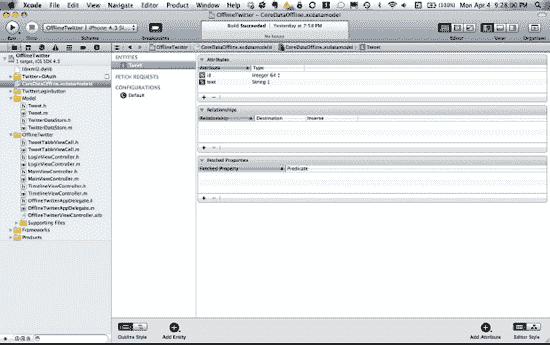

**图 8–16.** *向 Tweet 实体添加属性。*

设置数据模型的最后一步是创建实际的 Tweet Objective-C 类，这些类将映射到我们在 Core Data 模型中的 Tweet 实体，这样我们就可以在应用代码中实例化实际的 Tweet 对象，并将其保存在内存中（见图 8-17）。向你的项目中添加一个 `NSManagedObject` 类型子类的新文件（在 Xcode 的 New File 对话框中，选择 iOS 部分下的 Core Data 以找到此选项），然后点击 Next。

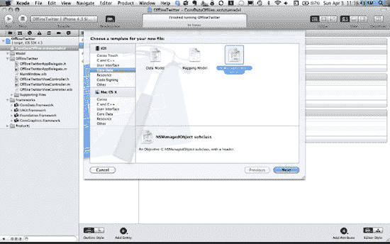

**图 8–17.** *向 Xcode 项目添加一个类，以关联数据模型中的 Tweet 对象。*

在接下来的对话框中，勾选 `Tweet` 实体旁边的复选框，以将其与我们创建的 `Tweet` 类关联起来（见图 8-18）。

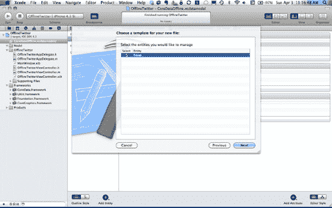

**图 8–18.** *选择要与新类关联的 Tweet 实体。*

当我们检查 `Tweet.h` 和 `Tweet.m` 文件的内容时，会发现它们非常简洁。它们仅仅提供了对 Core Data 模型中 Tweet 实体属性的 get 和 set 能力：

```
Tweet.h

@interface Tweet : NSManagedObject {
@private
}
@property (nonatomic, retain) NSNumber * id;
@property (nonatomic, retain) NSString * text;

@end
```

```
Tweet.m

@implementation Tweet
@dynamic id;
@dynamic text;

@end
```

既然我们已经完成了部分额外设置，回顾一下：`TwitterDataStore` 是一个提供高层级接口的类，用于获取设备上存储的信息。在 `TwitterDataStore` 内部，实际的数据存储（本例中为 `Tweet` 实体）是使用 Core Data API 来执行的。Core Data 由多个协同工作的类组成，为存储和检索信息提供了便捷的方式，因此我们需要将这些类添加到 `TwitterDataStore.h` 中：

```
@class NSManagedObjectContext;
@class NSManagedObjectModel;
@class NSPersistentStoreCoordinator;
@interface TwitterDataStore : NSObject {
}

@property (nonatomic, retain, readonly) NSManagedObjectContext *managedObjectContext;
@property (nonatomic, retain, readonly) NSManagedObjectModel *managedObjectModel;
@property (nonatomic, retain, readonly) NSPersistentStoreCoordinator *persistentStoreCoordinator;

- (void)saveContext;
- (NSURL *)applicationDocumentsDirectory;

- (NSArray*)tweets;
- (void)deleteTweets;
- (void)synchronizeTweets:(NSArray*)tweets;

@end
```

这些类中最重要的是 `NSManagedObjectContext`。在 Core Data 的魔法作用下，`NSManagedObjectContext` 类在底层负责管理模型中的实体集合。由我们的 `TwitterDataStore` 类所拥有的 `NSManagedObjectContext` 的创建过程，是在 `managedObjectContext` 方法中处理的：

```
/**
 返回应用的托管对象上下文。
 如果上下文尚不存在，则会创建它，并将其绑定到应用的持久化存储协调器。
 */
- (NSManagedObjectContext *)managedObjectContext
{
    if (__managedObjectContext != nil)
    {
        return __managedObjectContext;
    }

    NSPersistentStoreCoordinator *coordinator = [self persistentStoreCoordinator];
    if (coordinator != nil)
    {
        __managedObjectContext = [[NSManagedObjectContext alloc] init];
        [__managedObjectContext setPersistentStoreCoordinator:coordinator];
    }
    return __managedObjectContext;
}
```

`NSManagedObjectContext` 类被赋予一个 `NSPersistentStoreCoordinator` 对象，该对象负责管理上下文的生命周期，并创建一个托管对象模型：

```
/**
 返回应用的持久化存储协调器。
 如果协调器尚不存在，则会创建它，并添加应用的存储。
 */
- (NSPersistentStoreCoordinator *)persistentStoreCoordinator
{
    if (__persistentStoreCoordinator != nil)
    {
        return __persistentStoreCoordinator;
    }

    NSURL *storeURL = [[self applicationDocumentsDirectory] URLByAppendingPathComponent:@"CoreDataOffline.sqlite"];

    NSError *error = nil;
    __persistentStoreCoordinator = [[NSPersistentStoreCoordinator alloc] initWithManagedObjectModel:[self managedObjectModel]];
    if (![__persistentStoreCoordinator addPersistentStoreWithType:NSSQLiteStoreType configuration:nil URL:storeURL options:nil error:&error])
    {
        /*
        */
        NSLog(@"Unresolved error %@, %@", error, [error userInfo]);
        abort();
    }    

    return __persistentStoreCoordinator;
}
```

你需要用你自己的代码替换上述实现，以便恰当地处理错误。


**注意：** 使用 `abort()` 会导致应用程序生成崩溃日志并终止。你不应在正式发布的应用程序中使用此函数，尽管它在开发过程中可能有用。如果无法从错误中恢复，请显示一个提示面板，指示用户通过按下 Home 按钮退出应用程序。

此处错误的典型原因包括以下内容：

- 持久化存储不可访问。
- 持久化存储的架构与当前托管对象模型不兼容。

检查错误消息以确定实际的问题是什么。

如果持久化存储不可访问，通常是因为文件路径有问题。通常，文件 URL 指向的是应用程序的 `resources` 目录，而不是可写目录。

如果你在开发过程中遇到架构不兼容错误，可以通过以下方式减少其发生频率：

- 直接删除现有存储：
```
[[NSFileManager defaultManager] removeItemAtURL:storeURL error:nil]
```
- 通过将以下字典作为 options 参数传递，执行自动轻量级迁移：
```
[NSDictionary dictionaryWithObjectsAndKeys:
    [NSNumber numberWithBool:YES],
    NSMigratePersistentStoresAutomaticallyOption,
    [NSNumber numberWithBool:YES],
    NSInferMappingModelAutomaticallyOption, nil];
```

轻量级迁移仅适用于有限的一组架构变更；详情请参阅“Core Data 模型版本控制与数据迁移编程指南”。

以下是托管对象模型的创建方式：

```
/**
 返回应用程序的托管对象模型。
 如果模型不存在，则从应用程序的模型创建。
 */
- (NSManagedObjectModel *)managedObjectModel
{
    if (__managedObjectModel != nil) {
        return __managedObjectModel;
    }
    NSURL *modelURL = [[NSBundle mainBundle] URLForResource:@"CoreDataOffline"
                                              withExtension:@"momd"];
    __managedObjectModel = [[NSManagedObjectModel alloc] initWithContentsOfURL:modelURL];    
    return __managedObjectModel;
}
```

我们还有一个辅助方法，用于获取应用程序的 `Documents` 目录位置：

```
/**
 返回应用程序 Documents 目录的 URL。
 */
- (NSURL *)applicationDocumentsDirectory
{
    return [[[NSFileManager defaultManager] URLsForDirectory:NSDocumentDirectory
                                                   inDomains:NSUserDomainMask] lastObject];
}
```

我们鼓励你深入了解这些 Core Data API。希望这些信息对你有所帮助，但深入探讨此主题超出了本书的范围，是时候继续正题了！

### 从模型更新视图

在介绍完 `TwitterDataStore` 实现中的最后细节之前，先了解它如何从应用程序的用户界面中被使用和访问会很有帮助。用于显示 `TwitterDataStore` 中推文的用户界面是一个名为 `TimelineViewController` 的 `UITableViewController` 类。该类简单地在 `UITableViewCells` 中显示每条推文的主要文本，如 图 8-19 所示。


**图 8-19.** *在基础用户界面中显示的存储推文*

在展示具体实现的技术细节之前，我们先列出 `TimelineViewController` 所做的工作：

- 加载时，它会向 `TwitterDataStore` 请求其中包含的所有推文，将结果保存到 `NSArray` 中，并通过 `MGTwitterEngine` 向 Twitter.com 提交请求，获取当前登录用户 Twitter 时间线中的最新推文集合。
- 如果通过 `MGTwitterEngine` 的委托方法从 Twitter.com 接收到任何推文，则新推文会在后台线程中保存到 `TwitterDataStore`。
- 一旦推文保存到 `TwitterDataStore`，表格会在主线程上刷新。
- 刷新表格时，对于 `NSArray` 中的每条推文，它会创建一个 `TweetTableViewCell`，并将单元格的文本设置为关联推文的文本。

如果我们在 `TimelineViewController.h` 中检查 `TimelineViewController` 的定义，会看到它拥有一个推文的 `NSArray` 和一个 `TwitterDataStore`：

```
#import <UIKit/UIKit.h>

@class TwitterDataStore;
@interface TimelineViewController : UITableViewController {
    NSArray             *tweets;
    TwitterDataStore    *twitterDataStore;
}

@end
```

在 `TimelineViewController.m` 中，我们在 `viewDidLoad` 方法中创建 `TwitterDataStore`，从 `TwitterDataStore` 中检索所有推文，发起新推文的请求，并设置自身以在请求完成时接收通知：

```
- (void)viewDidLoad {
    [super viewDidLoad];

    twitterDataStore = [[TwitterDataStore alloc] init];
    tweets = [[twitterDataStore tweets] retain];

    NSString *identifier = [sa_OAuthTwitterEngine getHomeTimeline];

    //监听以标识符为名称的通知
    [[NSNotificationCenter defaultCenter]
                                    addObserver:self
                                       selector:@selector(twitterTimelineRequestDidComplete:)
                                           name:identifier
                                         object:nil];
}
```

我们需要在请求新推文完成时通知应用程序的其他部分。为此，我们在委托中更新 `statusesReceived:forRequest:`，将返回的推文数组作为键 `Tweets` 的值存储到 `NSDictionary` 中，并将其设置为通知的 `userInfo`：

```
- (void)statusesReceived:(NSArray *)statuses forRequest:(NSString *)connectionIdentifier {
    NSLog(@"收到状态 = %@, %@", connectionIdentifier, [statuses description]);

    NSArray *objects = [NSArray arrayWithObjects:statuses, nil];
    NSArray *keys = [NSArray arrayWithObjects:@"tweets", nil];
    NSDictionary *userInfoDictionary = [NSDictionary dictionaryWithObjects:objects
                                                                  forKeys:keys];
    [[NSNotificationCenter defaultCenter]
              postNotificationName:connectionIdentifier
                            object:self
                          userInfo:userInfoDictionary];

    NSDictionary *dictionary = [statuses objectAtIndex:0];
    if (dictionary) {
            NSString *twitterID = [dictionary objectForKey:@"id"];
            NSLog(@"TwitterID = %@", twitterID);
    }
}
```


当上述方法发布通知表明推文请求已完成时，`TimelineViewController`的`twitterTimelineRequestDidComplete:`方法会通过`NSNotificationCenter`被调用。利用`NSObject`的`performSelectorInBackground:withObject:`方法，`TimelineViewController`的`synchronizeTweets:`方法会在后台线程执行，并接收来自通知中`NSDictionary`的`Tweets`数组：

```
- (void)twitterTimelineRequestDidComplete:(NSNotification*)notification {
    [[NSNotificationCenter defaultCenter] removeObserver:self];
    [self performSelectorInBackground:@selector(synchronizeTweets:)
                           withObject:[notification.userInfo
                                 objectForKey:@"tweets"]];
}
```

`TwitterDataStore`的`synchronizeTweets:`方法设计为在完成同步过程时发出通知（更多内容请参阅后续部分）。因此，在`TimelineViewController`的`synchronizeTweets:`方法中，我们设置自己来接收`TwitterDataStore`完成任务时的通知。一旦收到通知，我们就启动同步过程：

```
- (void)synchronizeTweets:(NSArray*)newTweets {
    //listen for a notification with the name of the identifier
    [[NSNotificationCenter defaultCenter] addObserver:self
                                              selector:@selector(tweetsDidSynchronize:)
                                                  name:@"tweetsDidSynchronize"
                                                object:nil];
    [twitterDataStore synchronizeTweets:newTweets];
}
```

当`TwitterDataStore`完成同步过程时，它会通过`NSNotificationCenter`发出一个通知，`TimelineViewController`的`tweetsDidSynchronize:`方法将被执行，并在主线程调用`refreshUI`以从`TwitterDataStore`获取最新的推文并更新用户界面中的表格。关于线程的说明：我们始终建议在后台线程处理或同步数据，以保持用户界面的响应性。但是，如果你从后台线程发出通知或执行委托回调方法，执行仍将在后台线程中进行。如果你的用户界面需要更新，我们建议使用`NSObject`的`performSelectorOnMainThread:withObject:waitUntilDone:`方法在主执行线程上刷新用户界面：

```
- (void)tweetsDidSynchronize:(NSNotification*)notification {
    [[NSNotificationCenter defaultCenter] removeObserver:self];
    //update the UI on the main thread
    [self performSelectorOnMainThread:@selector(refreshUI)
                           withObject:nil
                        waitUntilDone:YES];
}
```

以下是实际刷新用户界面并将给定推文信息与其关联的`UITableViewCell`关联的代码：

```
- (void)refreshUI {
    [tweets release];
    tweets = [[twitterDataStore tweets] retain];
    [self.tableView reloadData];
}

// Customize the appearance of table view cells.
- (UITableViewCell *)tableView:(UITableView *)tableView
         cellForRowAtIndexPath:(NSIndexPath *)indexPath {
    static NSString *CellIdentifier = @"Cell";
    TweetTableViewCell *cell =
        (TweetTableViewCell*)[tableView dequeueReusableCellWithIdentifier:CellIdentifier];
    if (cell == nil) {
        cell = [[[TweetTableViewCell alloc] initWithStyle:UITableViewCellStyleDefault
                                          reuseIdentifier:CellIdentifier] autorelease];
    }
    // Configure the cell...
    Tweet *tweet = [tweets objectAtIndex:[indexPath row]];
    cell.tweet = tweet;
    return cell;
}
```

`TimelineViewController`使用`TwitterDataStore`获取和存储其所显示的数据，因此我们来看看`TwitterDataStore`如何使用 Core Data 来存储和检索推文。在`TwitterDataStore`能够返回推文之前，我们必须先给它一些推文来存储。`TwitterDataStore`在其`synchronizeTweets:`方法中存储推文，该方法将推文数组作为其唯一参数。

这个同步方法有点简单粗暴。它首先通过`TwitterDataStore`的`deleteTweets`方法删除所有已存储的推文。然后，它遍历传入的推文，为每一条推文创建一个新对象，初始化该推文的数据，并将其保存到 Core Data 模型中。

让我们更详细地了解一下。请记住，`MGTwitterEngine`返回一个推文数组，并且数组中的每条推文都由一个包含键/值对的`NSDictionary`对象表示，其中包含关于该推文的所有信息。当我们遍历推文数组时，我们使用 Objective-C 中一种简洁的`for-loop`机制：

```
for (NSDictionary *tweetDictionary in tweets) {
}
```

简而言之，这个`for-loop`表示我们将为`tweets`数组中的每个元素执行`for-loop`的主体。每次执行`for-loop`主体时，`tweets`数组中的下一个元素都会被存储在一个名为`tweetDictionary`的`NSDictionary`对象中（因为每个元素都是一个`NSDictionary`）。我们可以在`for-loop`主体中引用这个元素。

对于数组中的每条推文，我们通过`NSEntityDescription`的`insertNewObjectForEntityForName:inManagedObjectContext:`方法创建一个新的`Tweet`对象。将`Tweet`作为实体名称传递，会让 Core Data 创建一个存储在托管对象上下文中的新的未填充的`Tweet`类实例。我们还提供了我们的托管对象上下文。接下来，我们设置推文的`text`属性和`id`属性的值（注意使用`NSNumberFormatter`将`NSString`对象转换为`NSNumber`对象）。最后一步，我们通知托管对象上下文将其状态保存到磁盘。如果未能对托管对象上下文调用`save`，将导致没有数据被永久存储在我们的 Core Data 模型中。在退出方法之前，我们发布一个通知，以便当所有新的推文都存储在模型中时（即，我们更新用户界面时），我们应用程序的其他部分可以执行必要的操作：

```
- (void)synchronizeTweets:(NSArray*)tweets {
    NSAutoreleasePool *autoReleasePool = [[NSAutoreleasePool alloc] init];
    @synchronized(self) {
        [self deleteTweets];
        for (NSDictionary *tweetDictionary in tweets) {
            Tweet *tweet = (Tweet *)[NSEntityDescription
                insertNewObjectForEntityForName:@"Tweet"
                        inManagedObjectContext:self.managedObjectContext];
            NSNumberFormatter * f = [[NSNumberFormatter alloc] init];
            NSNumber * tweetId = [f numberFromString:[tweetDictionary objectForKey:@"id"]];
            [tweet setId:tweetId];
            [f release];
            NSString *text = [tweetDictionary objectForKey:@"text"];
            [tweet setText:text];
        }
        NSError *error = nil;
        if (![self.managedObjectContext save:&error]) {
            // Handle the error.
        }
    }
    // post a notification that the tweets are available
    // have responder update itself on the main thread
    [[NSNotificationCenter defaultCenter]
        postNotificationName:@"tweetsDidSynchronize"
                      object:self
                    userInfo:nil];
    [autoReleasePool release];
}
```


