# 使用位置感知与流式数据

本章涵盖在 iOS 上结合 Facebook 和 Twitter 使用位置功能的基本要点。我们还将讨论流式 API 的使用。

社交应用中出现的一个主要趋势是为用户体验添加位置上下文。在 Facebook 和 Twitter 的世界中，这涉及让用户在 Facebook 上*签到*或搜索附近的推文，以及其他一系列场景。我们将带你深入了解如何使用 iOS 的 `CoreLocation` 和 `MapKit` 库，将位置和地图整合到你的应用中，然后利用这些库中的位置信息，展示 Facebook 和 Twitter 的一些基于位置的功能。

## 此地，彼地，无处不在

乍看之下，将位置信息整合到应用中似乎是一项微不足道的任务；然而，在用户隐私、设备电量/电池续航以及 `CoreLocation` 和 `MapKit` API 方面，存在许多需要考虑的因素。本章的示例应用整合了后续介绍的所有技术。由于 `CoreLocation` 和 `MapKit` 本身就是功能丰富的 API，因此有必要梳理这些 API 提供的核心功能，并重点介绍 iOS 4.0 中首次亮相的一些新特性。之后，本章将深入探讨 Facebook 和 Twitter 的位置 API。


#### 位置隐私、披露与选择退出

虽然我们都喜欢在 Twitter 和 Facebook 等社交网站上分享信息，但有时我们并不想分享关于自己的某些内容。其中之一就是位置信息。在网站上分享照片时，我们都比较随意；然而，如果分享照片的同时还包含照片的拍摄地点信息，那就完全是另一回事了。同样地，使用网站的一项功能告诉朋友你的位置是一回事，但如果网站自动告诉你的朋友你在哪里——并且不让你关闭自动更新——那就完全是另一回事了。在后一种情况下，你可能就不会那么喜欢那个网站了。

那么这是为什么呢？为什么我们要如此严密地保护自己的位置，并希望对自己与谁分享、何时分享拥有如此多的控制权？归根结底，这是为了保护自己免受人性中某些不愉快方面的影响，例如嫉妒、跟踪，甚至可能的人身伤害。尽管像 Facebook 和 Twitter 这样的社交网站能激发人性中最美好的一面，但它们有时也会引出最丑陋的一面。

人性阴暗面一个严重且过于常见的例子是，当一个人与对其有身体虐待行为的伴侣处于关系中时。她可能因为害怕而不敢申请限制令，并希望尽可能隐藏自己的物理位置——包括在社交网站上。这或许是最坏的情况，但值得考虑，因为你永远不希望辜负用户的信任（甚至在有些地方违法）。

当计划在你的应用程序中使用用户的位置信息时，最好遵循以下规则：

-   允许用户选择退出你的应用程序使用其位置信息。
-   完全公开你打算如何使用位置信息。
-   让用户能够删除你的应用程序在本地或远程存储的任何其位置历史记录。

幸运的是，iOS 本身内置了所有基础架构，可以按应用允许或禁止使用其位置服务。它还会在你的应用首次运行并启动 `CoreLocation` 服务时，自动提示用户授予使用位置的权限。这一点至关重要，因为它会立即提示用户。有时人们倾向于将这类设置隐藏在应用内的 `Settings` 屏幕中，但我们强烈建议不要对位置相关设置采用这种方法。在 iOS 中，这其实不成问题，因为作为开发者你无法控制。如果你是 iOS 新手，标准提示会显示请求使用位置服务权限的应用名称，并提供 `Don't Allow` 和 `OK` 按钮，如图 9–1 所示。

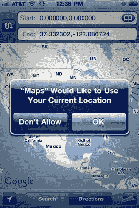

**图 9–1.** *iOS 位置权限提示*

一旦用户做出选择，iOS 会存储该选择，并且不再提示用户。这是 iOS 的一个出色特性，因为它标准化了该提示的外观和感觉，为用户提供一致的体验，并免去每个开发者自己实现所有这些逻辑的麻烦。如果用户选择不允许某个应用访问位置，那么在 iOS 代码中尝试获取位置将导致位置不可用错误。

iOS 位置服务实现的另一个优秀特性是，它不需要你在应用中做任何事情来处理用户可能改变主意或暂时限制你的应用使用位置服务的情况。例如，如果用户最初授予了你的应用使用位置服务的权限，但后来不想再授予此权限，她可以前往设备的主 `Settings` 应用，使用 `Location Services` 部分，在整个设备范围内或针对单个应用关闭位置服务（见图 9–2 和图 9–3）。

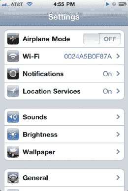

**图 9–2.** *iOS 设置应用*

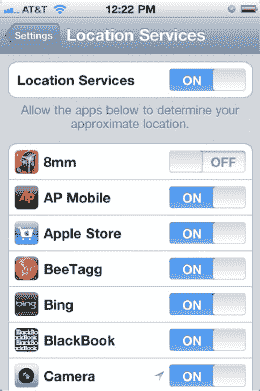

**图 9–3.** *iOS 位置服务设置*

iOS 还有另一个巧妙的功能，允许你重置询问用户是否允许应用使用位置服务的提示显示。这是一个设备范围的设置，会撤销设备上所有应用使用位置服务的权限。此设置可通过 iOS 设备主 `Settings` 应用中的 `General`  `Reset` 访问（见图 9–4）。

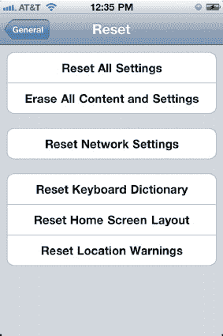

**图 9–4.** *重置位置警告设置*

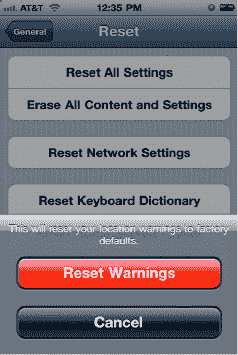

**图 9–5.** *系统确认重置位置警告*

如果你选择 `Reset Warnings`（见图 9–5），然后在设备上运行主 `Maps` 应用，在位置提示处选择 `OK`，再回到主 `Location Services` 设置屏幕，你将看到图 9–6 所示的屏幕。

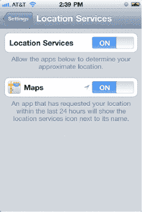

**图 9–6.** *重置警告并运行地图应用后的位置服务设置*

正如我们之前提到的，提示用户选择启用或禁用位置信息只是处理位置问题的三个基本部分之一。如果不清楚你的应用将如何使用用户的位置信息，那么我们强烈建议你显示自己的提示或包含额外信息的信息屏幕。从 iOS 4 开始，iOS 使这变得容易，我们将在以下章节中向你展示如何操作。如果你在用户设备上的应用中存储了位置历史记录，你还应该提供一个 `Settings` 屏幕，让用户能够清除这些历史记录。或者，你可以设置让应用只保留过去一周的记录，并根据设置自动为用户清除历史记录。

现在，我们已经涵盖了设备方面的内容以及在你 iOS 应用中关于位置和隐私需要理解的事项，让我们快速了解一下 Twitter 和 Facebook 在其端如何处理位置问题。

Twitter 和 Facebook 在我们之前提到的三个最佳实践方面已经取得了长足的进步。让我们快速看看它们各自的做法。


```markdown

#### Facebook Places

Facebook 效仿 Foursquare 推出了“Places”（地点）功能。当你从某个地点“签到”时，你会让 Facebook 上的朋友知道你在哪里以及你在做什么，例如在特定的餐厅吃饭或参加音乐会。要快速了解 Places 功能的作用，请查看此链接：

`www.facebook.com/places/`

请注意，Facebook 允许你控制朋友是否可以查看你的签到位置。我们建议阅读 Facebook 的常见问题解答，以全面了解其如何处理隐私问题：

`www.facebook.com/help/?page=18839`

简而言之，你可以控制在某地点签到时，是否显示在该地点的“People Here Now”（当前在此的人）区域中。为此，请前往 Facebook 的隐私设置部分（参见图 9-7）。

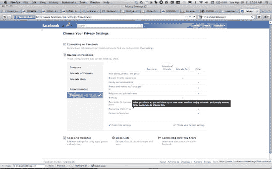

**图 9-7.** *控制你的 Facebook 签到是否显示在“People Here Now”区域中。*

选择“自定义设置”，然后在“我分享的内容”下，选择是否希望“所有人”、“好友和网络”、“好友的好友”或“仅限好友”看到你的签到。你还可以为签到的地点创建自己的自定义设置（参见图 9-8）。

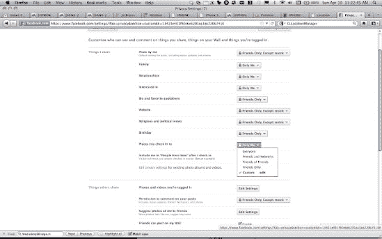

**图 9-8.** *自定义 Facebook 的签到设置。*

在同一部分中，你可以调整此选项的设置：

`Include me in "People Here Now" after you check in`

点击`See example`链接，可以查看当你出现在“People Here Now”时的显示效果（参见图 9-9）。

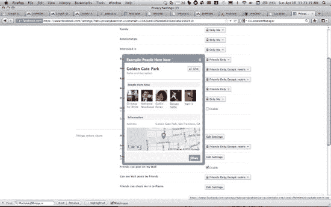

**图 9-9.** *Facebook 的“People Here Now”示例*

在“他人分享的内容”部分，你可以编辑此选项的设置（参见图 9-10）：

`Friends can check me in to Places`

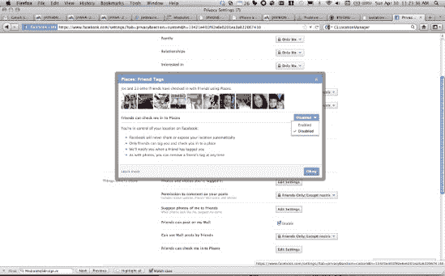

**图 9-10.** *Facebook 允许用户授予好友将其签到的权限。*

在隐私设置的“应用和网站”部分，你可以撤销之前通过`OAuth`授权给应用程序的 Places 访问权限（参见图 9-11）。

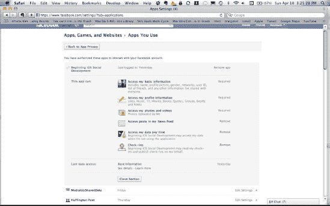

**图 9-11.** *撤销应用程序签到的权限。*

Facebook 还允许你查看每个应用程序的访问日志（参见图 9-12）。

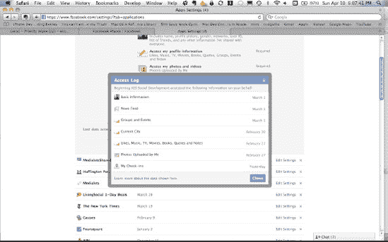

**图 9-12.** *查看应用程序上次执行签到的记录。*

如果你进入“通过你的好友可访问的信息”设置，你可以控制好友对 Places 信息的访问权限（参见图 9-13）。

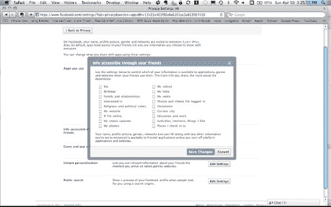

**图 9-13.** *控制好友对 Places 信息的访问权限。*

#### 为推文添加位置信息

由于 Twitter 的功能相对有限，管理其如何使用你的位置信息非常简单。登录你的 Twitter 账户后，进入“设置” “账户”（[`http://twitter.com/settings/account`](http://twitter.com/settings/account)），然后向下滚动到“推文位置”部分（参见图 9-14）。

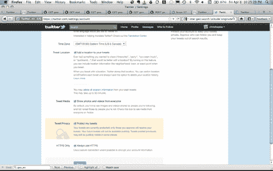

**图 9-14.** *配置推文位置的显示方式。*

勾选“为你的推文添加位置”复选框，即可允许 Twitter 显示每条推文所关联的位置，使你的推文出现在按位置搜索的推文结果中，并无限期存储你的推文位置。注意谨慎启用此设置，因为 Twitter 本质上鼓励用户与整个 Twitter 社区分享推文。这意味着，除非你的账户设为私密，否则 Twitter 上的任何人都可以看到你的位置。如果你之后想停止在新推文中显示位置，请取消勾选此框。如果你想删除所有过往推文的位置信息，请点击“你可以删除过去推文中所有位置信息”这句话中的链接。执行此操作后，系统会提示你授予 Twitter 删除所有位置信息的权限（参见图 9-15）。

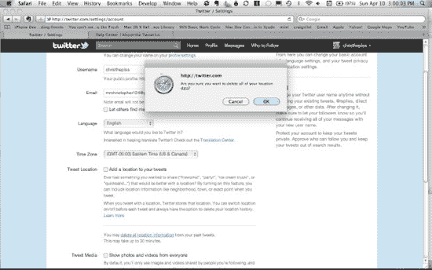

**图 9-15.** *删除推文关联的所有位置记录。*

如果你选择删除所有推文的位置记录，那么之后任何人查看你的过往推文时，位置信息将不再显示。想全面了解在 Twitter 上分享位置所涉及的问题，请查看此链接：

`http://support.twitter.com/forums/26810/entries/78525`

#### 高耗电量

现代移动平台上的位置服务使用 GPS、WiFi 和蜂窝数据来尝试确定设备的位置，并分别通过其对应的 API 返回该位置。iOS 上的位置服务也不例外。实际上，此功能非常耗电，如果在你的应用中不加节制地使用，很快就会耗尽用户设备的电池。

在 iOS 4.0 之前，从 iOS 的 CoreLocation 框架中获取设备位置只有一种方法。Apple 在其文档中将此方法称为`Standard`（标准）方法。使用此方法，你可以设置精度和距离过滤器，以控制获取位置信息的频率。不幸的是，使用`Standard`方法滥用位置服务很容易耗尽设备电量。Apple 的开发人员认识到了这一点，因此 iOS 4 引入了一种新的`Significant Change`（重大变化）方法来获取设备位置。这是一种更节电的获取位置的方法，它以较低的频率发送位置更新。我们将在下一节中更详细地探讨这一点，展示如何在你的应用中使用`Significant Change`方法。不言而喻，我们建议在大多数应用中（尤其是那些不需要每秒获取新位置数据的社交应用）使用此方法。
```


#### `CoreLocation`

iOS 的 `CoreLocation` 框架设计精巧，易于集成到应用中。苹果 iOS 开发者网站上提供了大量关于该框架的信息；不过，我们将在此处介绍最重要的部分。我们还将展示一种将框架集成到应用中、以便轻松获取设备当前位置的方法。对于完全初学者来说，通读苹果关于 iOS 中位置定位的文档可能是个好主意；你可以通过以下 URL 找到名为“iOS Location Awareness Guide”的文档：

`http://developer.apple.com/library/ios/#documentation/UserExperience/Conceptual/LocationAwarenessPG/Introduction/Introduction.html#//apple_ref/doc/uid/TP40009497`

在本章的示例应用中，有一个名为 `LocationController` 的新类，它存在于 `LocationController.h/.m` 中。我们设计这个类作为 iOS `CoreLocation` 框架的包装器或外观。我们这样做是为了实现以下几个目标：

- 通过将 `CoreLocation` 的功能集中到应用中的一个类，使其更易于演示。
- 使代码在将来更易于维护，因为我们只需在一个类中针对 `CoreLocation` 进行修改。
- 防止其他类单独使用 `CoreLocation`。

让我们看一下 `LocationController` 的头文件，了解它使用了哪些 `CoreLocation` 对象以及它的 API 是什么样的：

```
#import <CoreLocation/CoreLocation.h>

#ifdef FAKE_CORE_LOCATION
@class FTLocationSimulator;
#endif
@interface LocationController : NSObject <CLLocationManagerDelegate> {
#ifdef FAKE_CORE_LOCATION
    FTLocationSimulator *locationManager;
#else
    CLLocationManager *locationManager;
#endif
    CLLocation *location;
    CLHeading *heading;
    BOOL inPowerSavingMode;
}

#ifdef FAKE_CORE_LOCATION
@property(nonatomic, retain)FTLocationSimulator *locationManager;
#else
@property(nonatomic, retain)CLLocationManager *locationManager;
#endif
@property(nonatomic, retain)CLLocation *location;
@property(nonatomic, retain)CLHeading *heading;

- (void)startWithPowerSaving:(BOOL)savingPower;
- (void)stop;
- (BOOL)registerRegion:(CLLocationCoordinate2D)center;

@end
```

`LocationController` 类的主要设计思路是它拥有并控制 `CLLocationManager` 的操作，后者是 `CoreLocation` 中的主要类。`LocationController` 通过一个 `location` 属性（类型为 `CoreLocation` 的 `CLLocation` 对象）提供当前的位置读数。`LocationController` 提供了启动和停止底层 `CoreLocation` 服务的方法，并在获得新位置信息时通知其委托。由于我们需要接收 `CLLocationManager` 的更新，`LocationController` 被声明为 `CLLocationManagerDelegate`。

启动 `LocationController` 时，你可以选择两种方法之一。首先，你可以启用省电模式启动，这使用 `CoreLocation` 的 `Significant Change` 方法来确定位置。其次，你可以使用 `Standard` 方法。此外，`LocationController` 有一个方法用于注册一个区域供 `CoreLocation` 监控，我们稍后会讨论。我们确信你注意到了对 `FTLocationSimulator` 的引用，并且你可能想知道它是做什么的。`FTLocationSimulator` 让你能够在 iOS 模拟器上生成位置读数，我们将在本节后面部分介绍这一点。

让我们切换到 `LocationManager.m`，看看 `LocationController` 的方法在做什么。`startWithPowerSaving:` 方法首先停止 `LocationController`，以防它已经启动。如果你愿意，你可以自行跟踪是否已启动了 `CoreLocation` 服务，并在服务已启动时立即退出此方法。如果 `CLLocationManager locationManager` 尚不存在，则创建它，并将 `LocationController` 设置为其委托。接下来，我们检查设备上是否启用了位置服务。请注意，在 iOS 4.0 中，这从名为 `locationServicesEnabled` 的属性变为了同名方法，因此我们也对此进行了检查。

如果位置服务已启用，我们根据 `savingPower` 参数的值，通过两种方式之一启动 `locationManager`。如果 `savingPower` 为 `YES`，我们通过 `startMonitoringSignificantLocationChanges` 方法启动 `locationManager`，并记录我们处于省电模式。如果 `savingPower` 为 `NO`，我们使用 `Standard startUpdatingLocation` 方法，并配置所需的精度级别和距离过滤器。你可以在苹果的文档或头文件中阅读有关这些属性可用值的更多信息：

```
- (void)startWithPowerSaving:(BOOL)savingPower
{
    [self stop];

    if (nil == self.locationManager) {
#ifdef FAKE_CORE_LOCATION
        self.locationManager =
                   [[[FTLocationSimulator alloc] init] autorelease];
#else
        self.locationManager =
                   [[[CLLocationManager alloc] init] autorelease];
#endif
    }

    self.locationManager.delegate = self;

    //Available in 3.2 and later
    self.locationManager.purpose = @"Big brother is watching.";

    BOOL locationServicesEnabled = NO;
    if ([CLLocationManager
            respondsToSelector:@selector(locationServicesEnabled)]) {
        locationServicesEnabled =
            [CLLocationManager locationServicesEnabled];
    } else {
        locationServicesEnabled =
            self.locationManager.locationServicesEnabled;
    }

    if (locationServicesEnabled) {

        inPowerSavingMode = NO;
        if (savingPower
            && [CLLocationManager respondsToSelector:@selector
                  (significantLocationChangeMonitoringAvailable)]) {
            if ([self.locationManager respondsToSelector:@selector
                  (startMonitoringSignificantLocationChanges)]) {
                [self.locationManager
                     startMonitoringSignificantLocationChanges];
                inPowerSavingMode = YES;
            }

        } else {
            self.locationManager.desiredAccuracy =
                                                kCLLocationAccuracyBest;
            self.locationManager.distanceFilter = kCLDistanceFilterNone;
            [self.locationManager startUpdatingLocation];
        }
    }
}
```

`LocationController` 的 `stop` 方法通过布尔值 `inPowerSavingMode`（我们在之前的 `startWithPowerSaving:` 方法中保存了此值）检查是否处于省电模式。然后，根据我们所处的模式，调用 `stopMonitoringSignificantLocationChanges` 或 `stopUpdatingLocation`：

```
- (void)stop
{
    if (inPowerSavingMode
        && [CLLocationManager respondsToSelector:@selector
                (significantLocationChangeMonitoringAvailable)]) {
        if ([self.locationManager respondsToSelector:@selector
                (stopMonitoringSignificantLocationChanges)]) {
            [self.locationManager
                stopMonitoringSignificantLocationChanges];
        }
    } else {
        [self.locationManager stopUpdatingLocation];
    }
}
```

从 iOS 4.0 开始，`CoreLocation` 的 `CLLocationManager` 能够在设备进入或离开预定义的区域时，通过委托回调通知应用程序。这被称为区域监控。`LocationController` 通过其 `registerRegion:` 方法支持区域监控，该方法指示 `CLLocationManager` 监控围绕单个中心点的指定区域，并在设备进入或离开该区域时通知应用程序。


### 使用 `CLLocationManager`

接下来，我们将介绍如何使用 `CLLocationManager`。首先，我们需要确认此功能是否可用。如果可用，则设置要监控的区域半径；然后根据中心点、半径和名称创建要监控的区域；最后，通过其 `startMonitoringForRegion:desiredAccuracy:` 方法将其交给 `CLLocationManager` 进行监控。`desiredAccuracy` 值控制 `CLLocationManager` 用于判断设备是否离开并重新进入某个区域的边界周围缓冲区的大小。区域监控是将一些实用功能集成到应用中的非常有效的方式，例如自动将用户签到到特定地点：

```
- (BOOL)registerRegion:(CLLocationCoordinate2D)center
{
    // 检查是否支持该功能
    if (![CLLocationManager regionMonitoringAvailable] ||
        ![CLLocationManager regionMonitoringEnabled] )
        return NO;

    CLLocationDegrees radius =
                 self.locationManager.maximumRegionMonitoringDistance;

    // 创建区域并开始监控
    CLRegion *region = [[CLRegion alloc]
                            initCircularRegionWithCenter:center
                                                  radius:radius
                                              identifier:@"test"];
    [self.locationManager startMonitoringForRegion:region
    desiredAccuracy:kCLLocationAccuracyNearestTenMeters];

    [region release];

    return YES;
}
```

当 `CLLocationManager` 获取到符合其当前操作模式条件的位置读数时，它会通过 `CLLocationManagerDelegate` 的 `locationManager:didUpdateToLocation:fromLocation:` 方法通知其委托。当调用此委托方法时，我们将当前的位置读数保存到自己的 `location` 属性中，以便应用的任何其他部分能够访问设备当前的位置读数：

```
- (void)locationManager:(CLLocationManager *)manager
    didUpdateToLocation:(CLLocation *)newLocation
           fromLocation:(CLLocation *)oldLocation
{
    self.location = newLocation;
}
```

如果初始化定位服务时出现问题，则会调用 `CLLocationManagerDelegate` 的 `locationManager:didFailWithError:` 方法：

```
- (void)locationManager:(CLLocationManager *)manager
       didFailWithError:(NSError *)error
{
    NSLog(@"didFailWithError");
}
```

当设备进入或离开指定区域时，会调用 `CLLocationManagerDelegate` 的 `locationManager:didEnterRegion:` 和 `locationManager:didExitRegion:` 方法：

```
- (void)locationManager:(CLLocationManager *)manager
         didEnterRegion:(CLRegion *)region
{
    NSLog(@"didEnterRegion");
}

- (void)locationManager:(CLLocationManager *)manager
          didExitRegion:(CLRegion *)region
{
    NSLog(@"didExitRegion");
}

- (void)locationManager:(CLLocationManager *)manager
monitoringDidFailForRegion:(CLRegion *)region
              withError:(NSError *)error
{
    NSLog(@"monitoringDidFailForRegion");
}
```

从 iOS 4.2 开始，如果用户通过设备上的“设置”主应用更改了应用的授权状态，`CLLocationManager` 还可以通知其委托：

```
- (void)locationManager:(CLLocationManager *)manager
        didChangeAuthorizationStatus:(CLAuthorizationStatus)status
{
    NSLog(@"didChangeAuthorizationStatus");
}
```

在进入其他主题之前，有必要提一下 iOS 上的定位服务及后台处理。请注意，`Significant Change` 方法会周期性唤醒你的应用并提供位置更新。如果你使用的是 `Standard` 定位方法，则需要在应用的 `plist` 中设置一些值。关于此内容的更多信息，可参阅本章前面提到的 Apple“iOS 位置感知指南”。

最后一点注意事项：在应用中使用 CoreLocation 时，必须将应用链接到 CoreLocation 框架（见图 9–16）。

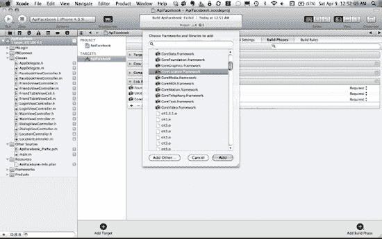

**图 9–16.** *使用 CoreLocation 时链接 CoreLocation 框架*

### 在 iOS 模拟器中生成位置

尽管 Apple 在 CoreLocation 框架方面做得非常出色，但一个明显的缺失是在 iOS 模拟器中生成一系列位置更新的能力。随着 iOS 5 的推出，Apple 增加了位置模拟功能，使得开发者无需离开办公桌就能测试位置感知应用。如果 Apple 的解决方案不能满足需求，这里还有两种在开发环境中测试位置应用的方法：iSimulate 和 FTLocationSimulator。这些解决方案的方法截然不同，因此我们将快速介绍如何进行设置以及它们的工作原理。

#### iSimulate

你可以通过以下网址获取 iSimulate：

`www.vimov.com/isimulate/`

iSimulate 应用在你的实际 iOS 设备上运行，并允许你与桌面端 iOS 模拟器中运行的应用进行交互。最重要的是，它还允许你与模拟器共享设备的位置。你可以在 iTines 上通过以下网址找到该应用的免费 Lite 版本：

`http://itunes.apple.com/us/app/isimulate-lite/id351339630?mt=8`

要开始使用 iSimulate，你还需要在 Xcode 的应用项目中进行一些配置：

1.  首先，从 [`www.vimov.com/isimulate/sdk/`](http://www.vimov.com/isimulate/sdk/) 下载最新版本的 iSimulate SDK。
2.  然后将 iSimulate 库的 `.a` 文件（撰写本文时，该文件名为 `libisimulate-4.x-opengl.a`）添加到应用目标的 Frameworks 中（见图 9–17）。

    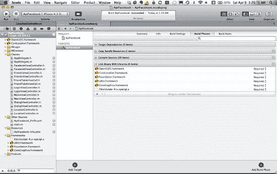

    **图 9–17.** *链接 iSimulate 库文件*

3.  接着，将应用链接到 OpenGLES 框架（见图 9–18）。

    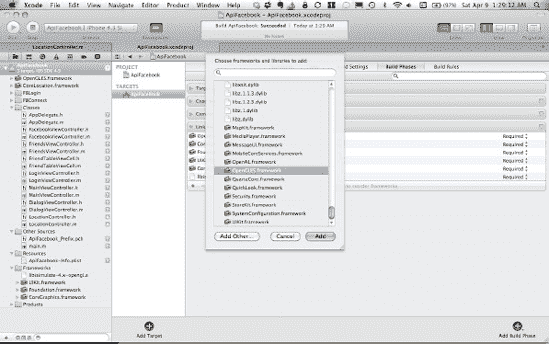

    **图 9–18.** *使用 iSimulate 时链接 OpenGLES*

4.  最后，在 Build Settings 下为应用目标添加一个额外的 `-ObjC` 链接器标志（见图 9–19）。

    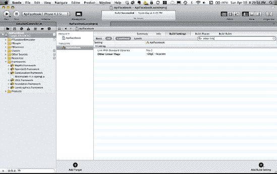

    **图 9–19.** *使用 iSimulate 时设置附加链接器标志*

所有这些信息也可在此处获取：

`www.vimov.com/isimulate/documentation/`

现在我们已经配置好了 iSimulate，是时候让它发挥作用了。在你的设备上，确保其与运行 iOS 模拟器的电脑连接在同一个 WiFi 网络下，然后启动 iSimulate。你应该会看到一个类似于图 9–20 所示的屏幕。

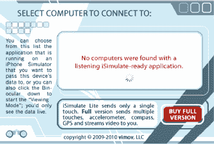

**图 9–20.** *iOS 上的 iSimulate*

现在在 iOS 模拟器中运行你的应用，设备上的 iSimulate 应用会检测到应用正在运行，并允许你在设备上与之连接（见图 9–21）。

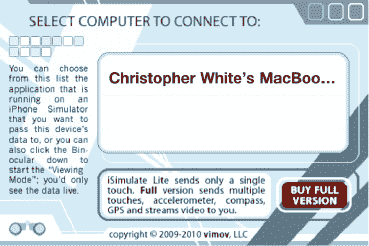

**图 9–21.** *iOS 上的 iSimulate：选择要连接的电脑*

从列表中选择你的电脑名称，你将被带到 iSimulate 主屏幕。现在你已经准备好大显身手了（见图 9–22）。

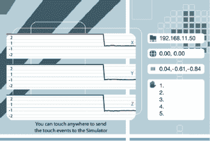

**图 9–22.** *iOS 上的 iSimulator：查看 iSimulate 共享的信息*


