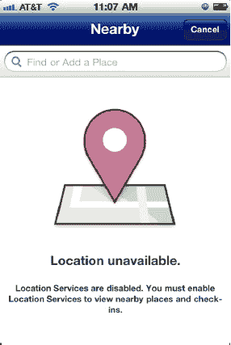
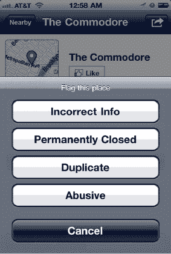
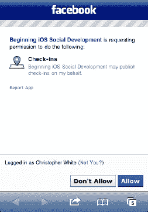
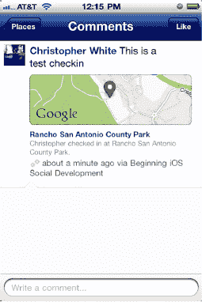
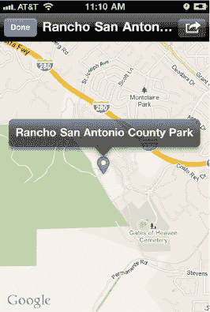
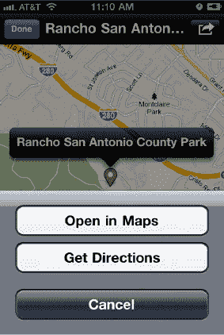
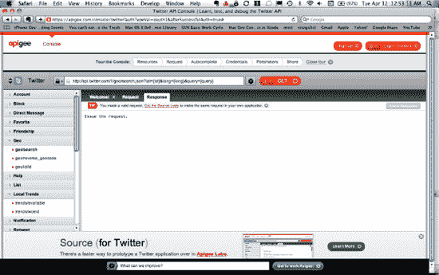
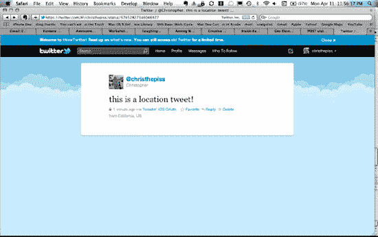

# futuretap 的 `FTLocationSimulator`

您可以通过以下 URL 获取 `FTLocationSimulator`：

`https://github.com/futuretap/FTLocationSimulator`

与 `iSimulate` 不同，`FTLocationSimulator` 是嵌入到您应用中的代码，用于覆盖 `CLLocationManager`。`FTLocationSimulator` 通过读取您包含在应用中的 `.kml` 文件中的坐标来生成位置信息。虽然设置过程稍显繁琐，且涉及一些代码需要讨论，但我们将为您逐步讲解。

首先，您需要通过 Git 为 `FTLocationSimulator` 源代码设置一个子模块：

```
$ git submodule add git://github.com/futuretap/FTLocationSimulator.git FTLocationSimulator
```

然后，在子模块的 `FTLocationSimulator` 目录中，将 `FTLocationSimulator` 文件夹拖拽到您的 Xcode 项目中。接下来，在项目目标中添加以下附加链接器标志：`-licucore`。最后一步是调整您的代码，使其在定义了 `FAKE_CORE_LOCATION` 时创建并使用 `FTLocationSimulator` 实例，而非 `CLLocationManager`：

```
#ifdef FAKE_CORE_LOCATION
     self.locationManager =
          [[[FTLocationSimulator alloc] init] autorelease];
 #else
     self.locationManager =
          [[[CLLocationManager alloc] init] autorelease];
 #endif
```

`FAKE_CORE_LOCATION` 定义在 `FTLocationSimulator.h` 中，当目标环境为 iOS 模拟器时，其默认值为 `1`：

```
#if TARGET_IPHONE_SIMULATOR
#define FAKE_CORE_LOCATION 1
#endif
```

如前所述，`FTLocationSimulator` 会覆盖 `CLLocationManager`。因此，如果定义了 `FAKE_CORE_LOCATION` 并调用了 `startUpdatingLocation`，则会调用 `FTLocationSimulator` 的 `startUpdatingLocation` 方法。此方法会调用 `FTLocationSimulator` 的 `fakeNewLocation`，后者会从包含的 `fakeLocations.kml` 文件中读取新位置，并在更新间隔后再次调用自身：

```
- (void)startUpdatingLocation {
        updatingLocation = YES;
        [self fakeNewLocation];
}
```

您可以在 `FTLocationSimulator.h` 中更改更新间隔：

```
#define FAKE_CORE_LOCATION_UPDATE_INTERVAL 0.3
```

您还可以创建自己的 `.kml` 文件，或更新 `fakeLocations.kml` 中的坐标。我们建议您深入了解如何生成 `.kml` 文件。谷歌提供了一些工具，可帮助您轻松生成这些文件，从而辅助您的测试。

## MapKit

在处理位置信息时，能够可视化当前状态极为有用。因此，我们将介绍 iOS 中可用的另一个框架：MapKit。MapKit 提供的主要类是 `MKMapView`。`MKMapView` 使得在应用中集成地图变得异常简单。要查看其实际效果，请打开本章示例项目中的 `MapViewController.m` 文件。在 `MapViewController` 的 `loadView` 方法中，我们只需创建一个带有指定矩形的 `MKMapView` 对象，将自身设置为 `MKMapViewDelegate`，通过将 `showUserLocation` 属性设为 `YES` 来指示 `MKMapView` 在地图上显示当前位置，然后将其添加到视图控制器的视图中：

```
- (void)loadView {
    [super loadView];

     CGRect rect = CGRectMake(0.0f, 0.0f, 320.0f, 411.0f);
     MKMapView *mapView = [[MKMapView alloc] initWithFrame:rect];
     mapView.delegate = self;
     mapView.showsUserLocation = YES;

     [self.view addSubview:mapView];
     [mapView release];
}
```

请注意，由于我们将自身设为 `MKMapView` 的委托，因此需要在 `MapViewController.h` 中将 `MapViewController` 声明为 `MKMapViewDelegate`：

```
@interface MapViewController : UIViewController <MKMapViewDelegate> {

} @end
```

此外，不要忘记将您的应用与 MapKit 框架进行链接（参见图 9–23）。

**图 9–23.** *链接到 MapKit 框架。*

我们还需要实现 `MKMapViewDelegate` 中的几个方法；但在描述这些方法之前，需要先讨论标注这一主题。标注涉及的内容很多，因此我们不会深入探讨。简而言之，标注是可视元素，例如可以放置在 `MKMapView` 上的图钉。在图 9–24 中，我们为地图上的一个位置点添加了一个标注，并将其表示为图钉。

**图 9–24.** *在地图上显示图钉。*

在地图上添加此标注的代码位于 `MKMapViewDelegate` 的 `mapView:didUpdateUserLocation:` 方法实现中。每当地图显示来自 CoreLocation 框架的更新位置时，就会调用此方法。由于我们在 `MKMapView` 上设置了 `showsUserLocation` 为 `YES`，并且正在模拟位置更新，因此会调用此委托方法。为简单起见，我们通过 `MKMapView` 的 `addAnnotation:` 方法，将接收到的第一个位置作为 `MKPointAnnotation`（一种预定义的标注类型）添加。我们还使用 `LocationController` 的 `registerRegion:` 方法，围绕这个初始位置注册一个区域：

```
- (void)mapView:(MKMapView *)mapView didUpdateUserLocation:
(MKUserLocation *)userLocation
{
    static int once = 0;
    if (0 == once) {
        once = 1;

        // 创建图钉标注
        MKPointAnnotation *annotation = [[MKPointAnnotation alloc] init];
        annotation.coordinate = userLocation.coordinate;
        [mapView addAnnotation:annotation];
        [annotation release];

        [locationController registerRegion:userLocation.coordinate];
    }

    NSLog(@"didUpdateUserLocation");
}
```

在 `MKMapView` 上显示标注分为两步。首先，我们将标注添加到 `MKMapView`（如上述代码所示）。其次，我们提供一个负责显示标注的标注视图。当 `MKMapView` 确定需要显示标注时，它会调用其委托的 `mapView:viewForAnnotation:` 方法。在下面的代码中，您将看到，如果 `MKMapView` 请求的是 `MKPointAnnotation` 的视图，我们会创建一个 `MKPinAnnotationView`，并使其在地图上以动画形式显示。该动画会使图钉看起来如同从天而降，最终落定在地图上的相应位置。


- (MKAnnotationView *)mapView:(MKMapView *)mapView
            viewForAnnotation:(id <MKAnnotation>)annotation {

    if ([annotation isMemberOfClass:[MKUserLocation class]]) {
#ifdef FAKE_CORE_LOCATION
        // 获取应用代理的位置管理器；返回其模拟用户位置视图
        return locationController.locationManager.fakeUserLocationView;
#else
        return nil;
#endif
    } else {
        if ([annotation isKindOfClass:[MKPointAnnotation class]]) {
            // 首先尝试复用现有的图钉视图。
            MKPinAnnotationView *pinView =
            (MKPinAnnotationView*)[mapView
            dequeueReusableAnnotationViewWithIdentifier:@”PinView”];
            if (!pinView) {
                // 如果没有可复用的图钉视图，则创建一个新的。
                pinView = [[[MKPinAnnotationView alloc]
                initWithAnnotation:annotation
                      reuseIdentifier:@"PinAnnotation"] autorelease];
                pinView.pinColor = MKPinAnnotationColorRed;
                pinView.animatesDrop = YES;
            } else {
                pinView.annotation = annotation;
            }

            return pinView;
        }
    }

    // 为其他类型的标注创建视图的代码
    return nil;
}

这段代码也检查了 `MKUserLocation` 标注。这里我们不再深入细节，但你应该注意到前面讨论过的 `FTLocationSimulator` 类，它通过为地图提供一个 `MKAnnotationView`，来模拟用户位置沿着地图移动的效果。你可以在 `FTLocationSimulator` 的 `fakeUserLocationView` 方法中看到具体实现：

- (MKAnnotationView*)fakeUserLocationView {
    if (!self.mapView) {
        return nil;
    }

    [self.mapView.userLocation setCoordinate:self.location.coordinate];
    MKAnnotationView *userLocationView = [mapView
       dequeueReusableAnnotationViewWithIdentifier:@"fakeLocationView"];
    if (nil == userLocationView) {
        userLocationView = [[MKAnnotationView alloc]
                           initWithAnnotation:self.mapView.userLocation
                              reuseIdentifier:@"fakeLocationView"];
    }
    UIImage *image = :[UIImage imageNamed:@"TrackingDot.png"];
    UIImageView *imageView =
                [[UIImageView alloc] initWithImage:image];
    [userLocationView addSubview:imageView];
    [imageView release];
     userLocationView.centerOffset = CGPointMake(-10, -10);
     return userLocationView;
}

我们需要实现的最后一个关键部分是处理用户在地图上选中某个标注时的代码。当这种情况发生时，`MKMapView` 会调用其委托的 `mapView:didSelectAnnotationView:` 方法。在我们的 Facebook 示例中，我们将使用这个方法演示如何将用户签到某个地点。现在让我们来看看这部分内容。

## Facebook 地点（搜索）、签到（获取与发布）以及附近好友

在 Facebook 应用本身中，通过“附近”页面来进行地点签到，该页面会自动搜索当前位置附近的地点。如果 Facebook 应用未被授予使用位置服务的权限，它会显示如下界面（见图 9–25）。



**图 9–25.** *Facebook iOS 应用的“签到”功能中位置不可用*

假设 Facebook 应用已被授予使用位置服务的权限，你会看到返回的地点匹配列表（见图 9–26），以及某个地点的详细信息。Facebook 应用通过这种方式让用户社区管理地点。地点档案（本质上类似于 Facebook 页面）如图 9–27 所示；用户可以通过图 9–28 所示的方式对地点进行操作。


**图 9–26.** *在 Facebook iOS 应用中搜索附近地点和活动*


**图 9–27.** *Facebook iOS 应用中某个地点的详细信息*



**图 9–28.** *在 Facebook iOS 应用中标记地点*

在我们的示例应用中，我们希望让用户能够将某人签到 Facebook 上的某个地点。请注意，我们设置了应用在地图上显示一个图钉。当用户选中该图钉时，`MKMapViewDelegate` 的 `mapView:didSelectAnnotationView:` 方法会被调用。在 `MapViewController` 的该方法实现中，我们向 Facebook 发起一个搜索请求，以获取该标注位置附近的地点列表。向 Facebook 发起搜索请求时，我们只需将 Facebook 的 `requestWithGraphPath:andParams:andDelegate:` 方法的 graph path 设置为 `search`。需要提供的附加参数是一个字典，包含 `type`、`center` 和 `distance` 键。`MapViewController` 类遵循 `FBRequestDelegate` 协议，因此我们将其作为委托传入：

```
- (void)mapView:(MKMapView *)mapView
    didSelectAnnotationView:(MKAnnotationView *)view
{
    NSString *centerString = [NSString stringWithFormat: @"%f,%f",
        view.annotation.coordinate.latitude,
        view.annotation.coordinate.longitude];

    NSMutableDictionary *params =
                [NSMutableDictionary dictionaryWithObjectsAndKeys:
                @"place", @"type",
                centerString, @"center",
                @"1000", @"distance", // 单位米（1000m = 0.62 英里）
             nil];

    [facebook requestWithGraphPath:@"search"
                         andParams:params
                       andDelegate:self];
}
```

当 `FBRequestDelegate` 的 `request:didLoad:` 方法被调用时，结果参数是一个字典，其中包含一个地点字典数组。每个地点字典都包含一个 id、一个类别、一个名称，以及一个包含城市、国家、州、纬度和经度的 `location` 字典：

```
{
    data =     (
                {
            category = "Local business";
            id = 151247078226083;
            location =             {
                city = "Monta Vista";
                country = "United States";
                latitude = "37.3316086";
                longitude = "-122.05885";
                state = CA;
            };
            name = "Somerset Square Park";
        }
        );
}
```

在下面的代码中，我们取结果中字典数组的第一个匹配项，并通过以下 graph path 向 Facebook 发布一条签到信息：

```
"me/checkins"
```


我们在一个字典中为 POST 请求设置参数，其中包含 `place`、`coordinates` 和 `message` 键的值。请注意，`coordinates` 键的 `latitude` 和 `longitude` 值需要采用 JSON 格式，因此我们使用 `SBJSON`（包含在 Facebook SDK 中）将这些值转换为 `JSON` 字符串：

```
- (void)request:(FBRequest *)request didLoad:(id)result {
    NSLog(@"didLoad:");

    NSArray *places = [(NSDictionary*)result objectForKey:@"data"];
    if (0 < [places count]) {
        NSDictionary *dictionary = [places objectAtIndex:0];
        if (nil != dictionary) {
        NSDictionary *locDictionary =
                [dictionary objectForKey:@"location"];

        NSMutableDictionary *coordinatesDictionary =
               [NSMutableDictionary dictionaryWithObjectsAndKeys:
               [locDictionary objectForKey:@"latitude"], @"latitude",
               [locDictionary objectForKey:@"longitude"], @"longitude",
               nil];

            SBJSON *jsonWriter = [[SBJSON new] autorelease];
            NSString *coordinates =
               [jsonWriter stringWithObject:coordinatesDictionary];

            NSMutableDictionary *params =
               [NSMutableDictionary dictionaryWithObjectsAndKeys:
               [dictionary objectForKey:@"id"], @"place",
               coordinates, @"coordinates",
               @"This is a test checkin", @"message",
               nil];

            [facebook requestWithGraphPath:@"me/checkins"
                                      andParams:params
                                 andHttpMethod:@"POST"
                                    andDelegate:self];
        }
    }
}
```

请注意，您还可以通过在 `checkin` POST 中标记用户的好友来将其包含在签到中。为此，需要在 `params` 字典中添加一个名为 `tags` 的键，并将其值设置为以逗号分隔的 Facebook 用户 ID 列表。

向用户的 Facebook 账户发布签到需要 `publish_checkins` 权限，因此我们必须更新登录代码以包含此额外权限：

```
- (void)login {
    [facebook authorize:[NSArray arrayWithObjects:
                         @"user_groups", @"user_events",
                         @"offline_access", @"publish_checkins", nil]
               delegate:self];
}
```

使用此额外权限登录时，会显示以下 `OAuth` 屏幕（请参见 图 9–29）。



**图 9–29.** *通过 OAuth 授权签到 Facebook 地点*

签到发布后，它将显示在用户的 Facebook iOS 应用（以及 Facebook.com）中，如图 图 9–30 所示。


**图 9–30.** *Facebook iOS 应用中的签到*

选择一个签到会显示一个小的地图和地点描述，以及对该签到的任何评论（请参见 图 9–31）。



**图 9–31.** *Facebook 签到的详细信息*

该地点可以在 Facebook iOS 应用内的更大地图上查看（请参见 图 9–32）。



**图 9–32.** *Facebook 签到的更大视图地图*

接下来，您可以选择在设备上的主地图应用中查看地图，或获取路线（请参见 图 9–33）。



**图 9–33.** *在 Facebook iOS 应用中对签到可执行的操作*

正如我们可以为用户发布签到一样，我们也可以通过 Facebook 图谱路径 `me/checkins` 检索用户的签到：

```
[facebook requestWithGraphPath:@"me/checkins"
                     andParams:nil
                   andDelegate:self];
```

返回的结果是一个字典数组，其中每个字典包含单个签到的信息。这些信息包括发布签到的应用、创建时间、发布签到的用户、签到的 Facebook ID、签到相关的消息以及签到相关的地点：

```
(
{
    application =     {
        id = 114442211957627;
        name = "Beginning iOS Social Development";
    };
    "created_time" = "2011-04-09T16:14:19+0000";
    from =     {
        id = 623441509;
        name = "Christopher White";
    };
    id = 10150149394136510;
    message = "This is a test checkin";
    place =     {
        id = 144940418859769;
        location =         {
            latitude = "37.332301584174";
            longitude = "-122.08672354097";
        };
        name = "Rancho San Antonio County Park";
    };
}
)
```

从用户的 Facebook 账户检索签到需要 `user_checkins` 权限，因此我们必须更新登录代码以包含此额外权限：

```
- (void)login {
   [facebook authorize:[NSArray arrayWithObjects:
                        @"user_groups", @"user_events",
                        @"offline_access", @"publish_checkins",
                        @"user_checkins", nil]
              delegate:self];
}
```

使用此额外权限登录时，会显示以下 `OAuth` 屏幕（请参见 图 9–34）。


**图 9–34.** *Facebook 签到权限*


#### 带定位发推

在 Twitter 应用中，最需要启用的功能就是让用户能够将地理位置关联到推文中。我们为本章节准备了 `ApiTwitter` 示例，它将沿用 `ApiFacebook` 应用的结构，因此前面章节已涵盖的配置内容我们将略过。目前，`LocationController` 类已集成完毕，我们通过 `FTLocationSimulator` 模拟位置数据，并使用 `MapViewController` 展示带注释的地图。唯一的不同在于用户选择注释时的处理方式。

Twitter 的地理位置 API 文档写得非常详尽，我们强烈建议您通过以下链接熟悉其底层 HTTP API：

`http://dev.twitter.com/doc/get/geo`

之前我们一直使用 XML 格式与 Twitter API 交互，但 Twitter 地理位置 API 仅返回 `JSON` 格式数据。此外，地理位置的基础 URL 已更新为以下格式，其中 `1` 代表 API 版本：

`http://api.twitter.com/1/`

为体验这些 API 的使用方式，请在浏览器中打开 apigee.com 的 Twitter 控制台（见图 9-35）。这是测试 Twitter API 的实用工具，能帮助您快速上手：

`https://apigee.com/console/twitter` 

**图 9–35.** *Apigee 的 Twitter 控制台*

由于 Twitter 地理位置 API 仅返回 JSON 格式，我们需要更新 `MGTwitterEngine` 以集成 `SBJSON` 库（一个易于使用的 Objective-C JSON 处理工具）。首先在 `MGTwitterEngine.m` 中设置 URL 格式为 `JSON` 并导入 `JSON.h`：

```
#elif SBJSON_AVAILABLE
        #define API_FORMAT @"json"
        #import "JSON.h"
#else
```

同时需要更新默认 Twitter 域名：

```
#define TWITTER_DOMAIN          @"api.twitter.com/1"
```

接下来，要让 `MGTwitterEngine` 在解析连接数据时使用 `JSON`。响应数据首先被转换为 `JSON` 字符串表示，然后通过 `SBJSON` 库中定义的 `NSString` 分类方法 `JSONValue` 转换为 `NSArray` 或 `NSDictionary`：

```
#elif SBJSON_AVAILABLE
- (void)_parseDataForConnection:(MGTwitterHTTPURLConnection *)connection
{
    NSString *identifier = [[[connection identifier] copy] autorelease];
    NSData *jsonData = [[[connection data] copy] autorelease];
    MGTwitterResponseType responseType = [connection responseType];
    NSString *json_string =
        [[[NSString alloc] initWithData:jsonData
                               encoding:NSUTF8StringEncoding]
                               autorelease];

    id json = [json_string JSONValue];

        NSArray *parsedObjects;

        if ([json isKindOfClass:[NSArray class]]) {
                parsedObjects = [NSArray arrayWithArray:json];
        } else if ([json isKindOfClass:[NSDictionary class]]) {
                parsedObjects = [NSArray arrayWithObject:json];
        }

        [self parsingSucceededForRequest:identifier
                          ofResponseType:responseType
                       withParsedObjects:parsedObjects];

}
#else
```

在 `MGTwitterEngineGlobalHeader.h` 中，我们存储了决定是否默认使用 JSON 格式的 `#define` 宏。将此值设为 `1` 即可启用：

```
#define SBJSON_AVAILABLE 0
```

要编译这段代码，需要在 Xcode 项目中创建名为 `SBJSON` 的新组，并将 SBJSON 文件拖入该组文件夹。如果本地尚未安装 SBJSON 文件，可以通过克隆 `Github` 仓库或创建子模块的方式获取。我们推荐使用子模块：

```
$ git submodule add git://github.com/stig/json-framework.git json-framework
```

现在已将 `SBJSON` 集成到 `MGTwitterEngine` 中，接下来需要添加对 Twitter 地理位置 API 的支持，以及通过 `location` 参数发布状态更新的功能。Twitter 的 HTTP 地理位置 API 使用以下格式：

`geo/<action>.json`

因此我们创建了 `geoResultsForPath:withParams:` 方法，允许您设置要执行的操作和参数。可用的四种路径操作如下：

*   `geo/search`
*   `geo/reverse_geocode`
*   `geo/similar_places`
*   `geo/id`

参数包括 `latitude` 和 `longitude` 值、地名等：

```
- (NSString *)geoResultsForPath:(NSString *)path
                     withParams:(NSDictionary*)params
{
    NSString *path1 =
        [NSString stringWithFormat:@"geo/%@.%@", path, API_FORMAT];

    return [self _sendStandardRequestWithMethod:nil                                            path:path1
                                queryParameters:params
                                           body:nil
                                   requestType:MGTwitterAccountRequest
                                   responseType:MGTwitterMiscellaneous];
}
```

现在终于可以实际应用了。在 `MapViewController.m` 中找到 `mapView:didSelectAnnotationView:` 方法：

```
- (void)mapView:(MKMapView *)mapView
        didSelectAnnotationView:(MKAnnotationView *)view
{
    NSNumber *lat =
      [NSNumber numberWithDouble:view.annotation.coordinate.latitude];
    NSNumber *lon =
      [NSNumber numberWithDouble:view.annotation.coordinate.longitude];

    NSMutableDictionary *params = [NSMutableDictionary dictionary];
    [params setObject:[lat stringValue] forKey:@"lat"];
    [params setObject:[lon stringValue] forKey:@"long"];
    NSString *identifier =
        [sa_OAuthTwitterEngine geoResultsForPath:@"reverse_geocode"
                                      withParams:params];

    //监听以 identifier 命名的通知
    [[NSNotificationCenter defaultCenter]
        addObserver:self
              selector:@selector(twitterPlacesRequestDidComplete:)
              name:identifier
            object:nil];
}
```

当选中地图上的图钉时，我们调用 Twitter 的 `geo/reverse_geocode` API，并传入 `latitude` 和 `longitude` 参数。这些坐标值来自与图钉关联的注释。*反向地理编码*的概念是指将经纬度坐标转换为该位置的实际地址或地名。请注意，您还可以提供其他参数来控制反向地理编码或其他位置搜索的精度。

在 Twitter 中，每个地点都有对应的 Twitter ID；当将位置关联到推文时，Twitter 建议使用 `place` ID 值而非原始的经纬度数据，这有助于保护用户隐私。关于如何在您的应用中遵循 Twitter 地理位置指南的更多信息，我们强烈建议您阅读以下链接：

`http://dev.twitter.com/pages/geo_dev_guidelines`

现在总结一下目前的进展。我们让 Twitter 对某个位置进行反向地理编码，然后设置监听以等待响应返回。原始的 `JSON` 响应数据采用以下格式：


```objectivec
{
    query = {
        params = {
            accuracy = 0;
            autocomplete = 0;
            granularity = neighborhood;
            query = London;
            "trim_place" = 0;
        };
        type = search;
        url = "URL";
    };
    result = {
        places = (
            {
                attributes = {
                };
                "bounding_box" = {
                    coordinates = (
                        (
                            "-0.5093057",
                            "51.286606"
                        ),
                        (
                            "0.334433",
                            "51.286606"
                        ),
                        (
                            "0.334433",
                            "51.691672"
                        ),
                        (
                            "-0.5093057",
                            "51.691672"
                        )
                    );
                    type = Polygon;
                };
                "contained_within" = (
                    {
                        attributes = {
                        };
                        "bounding_box" = {
                            coordinates = (
                                (
                                    (
                                        "-6.3651943",
                                        "49.8825312"
                                    ),
                                    (
                                        "1.768926",
                                        "49.8825312"
                                    ),
                                    (
                                        "1.768926",
                                        "55.8116485"
                                    ),
                                    (
                                        "-6.3651943",
                                        "55.8116485"
                                    )
                                )
                            );
                            type = Polygon;
                        };
                        country = "United Kingdom";
                        "country_code" = GB;
                        "full_name" = "England, United Kingdom";
                        id = 8ef32ff56ef11c22;
                        name = England;
                        "place_type" = admin;
                        url = "URL";
                    }
                );
                country = "United Kingdom";
                "country_code" = GB;
                "full_name" = "London, England";
                id = 5d838f7a011f4a2d;
                name = London;
                "place_type" = admin;
                url = "URL";
            }
        );
    };
}
```

请注意，实际的地点数组位于一个名为 `result` 的字典中。每个地点本身也是一个包含值的字典，但我们最感兴趣的是 `id` 键的值。当我们收到来自 Twitter 的地点结果通知时，我们会提取数组中第一个地点的字典，获取其地点 ID，然后提交一个包含额外参数字典的状态更新。为了符合 Twitter 的 API，我们提供了一个键为 `place_id` 的参数：

```objectivec
- (void)twitterPlacesRequestDidComplete:(NSNotification*)notification {
    [[NSNotificationCenter defaultCenter] removeObserver:self];
    NSArray *places = [notification.userInfo objectForKey:@"places"];
    if (0 < [places count]) {
        // 获取第一个地点
        NSDictionary *placesDict = [places objectAtIndex:0];
        NSDictionary *resultDict = [placesDict objectForKey:@"result"];
        NSArray *resultPlaces = [resultDict objectForKey:@"places"];
        if (0 < [resultPlaces count]) {
            NSDictionary *firstPlace = [resultPlaces objectAtIndex:0];
            NSMutableDictionary *params =
                [NSMutableDictionary dictionary];
            [params setObject:[firstPlace objectForKey:@"id"]
                       forKey:@"place_id"];
            [sa_OAuthTwitterEngine sendUpdate:@"location tweet!"
                                   withParams:params];
        }
    }
}
```

如果我们随后在网页上查看 Twitter，瞧，我们就能看到带位置的推文（参见图 9-36）。请注意，你必须在 Twitter 的设置中启用推文位置功能，正如本章前面讨论的那样。

利用 Twitter 的位置功能，你可以做很多有趣的事情，所以不妨试试这段代码。实际的示例代码中还有一些其他示例代码，你可以取消注释来了解 Twitter 的其他地理位置 API 是如何工作的。它们都紧密相关，并且接受几乎相同的参数。

在结束本章之前，我们还想指出，如果你不想使用 Twitter 或 Facebook 来查找坐标对应的地点，可以使用 MapKit 的 `MKReverseGeocoder` 类。这取决于你。示例代码中也实现了 `MKReverseGeocoder`，以便你闲暇时进行尝试。



**图 9–36.** *一条包含位置信息的推文*

### 总结

处理位置信息非常有趣，但也存在风险。在你的应用程序中处理位置信息，以及与 Facebook 和 Twitter 等社交网络协作时，最关键的是要站在用户的角度思考，并就你如何使用她的位置信息向自己提出重要问题。每个应用程序都有独特的用户界面设计，但我们鼓励你在应用程序中披露你如何处理用户位置信息，并在应用程序首次启动或用户首次执行将涉及她位置信息的操作时立即显示该披露信息。

这只是你应该遵循的众多设计和界面指南之一。你将在第 11 章到第 14 章中了解更多相关内容。

关于位置信息的内容到此结束。我们已经为你提供了基本构建模块，尽情享受吧。在下一章中，我们将涵盖一系列技术问题，这些将提升你的应用程序与 Facebook 和 Twitter 的整体集成度。

