# 使用开源工具及其他好用资源

移动软件世界的发展速度快得惊人，有时要跟上所有最新动态似乎是一项艰巨的任务。虽然本书旨在介绍如何将 Facebook 和 Twitter 集成到应用中，但还有许多相关技术可以简化工作，或揭示其他应用如何完成特定任务。此外，一些跨平台发布库可以帮助你省去直接集成 Facebook 和 Twitter SDK 的麻烦。本章将探讨这些主题。

本章还将讨论 Twitter 提供的数据和趋势。除了标准的客户端 API，Twitter 还向开发者开放了数据和趋势。Twitter Trends 是该网站用于衡量快速流行起来的话题（即话题标签）的工具——换句话说，就是热门新闻。如果你还没听说过 Trends 工具，可以在 Twitter.com 上查看这份概要：

`http://yearinreview.twitter.com/trends/`

直接从应用程序内部访问这些趋势可能并不总是有意义的，而且 Twitter 的条款也限制了你使用其数据的某些方式；不过，研究这种服务器到服务器的交互或许会很有用。稍后你将学习如何利用这些数据进行自己的数值计算，并将所需内容提供给应用程序。

## 越短越好

在引用网络资源时，一个常见的问题是这些资源的 URL 有时会非常长。这在将 Twitter 等服务集成到应用程序中时会产生问题，因为推文需要保持简短。例如，如果应用程序想允许用户分享一篇文章的推文，但文章 URL 的长度几乎占满了整条推文，或者完全无法放入推文，这对用户来说并不友好。

这就是 URL 缩短服务发挥作用的地方。目前有许多可用的 URL 缩短服务，包括 Twitter 自家的服务（在本书即将付印时宣布）。不过，第三方 URL 缩短服务提供了 Twitter 所不具备的功能（例如分析功能），因此我们将花时间讨论其中两种。我们还将介绍它们的工作原理以及如何将其集成到 iOS 应用中。请注意，并非所有服务都会永久运营；如果你在意链接的存档质量，请使用 Twitter 自家的缩短服务 T.co。

以下是两种常见的第三方 URL 缩短服务：

*   [`http://bit.ly`](http://bit.ly)
*   [`http://TinyURL.com`](http://TinyURL.com)

这两种服务完全免费使用，且工作原理相同：你向服务提供一个 URL，它会返回一个缩短后的 URL。

一个用于试验这些服务的有用工具是名为 `cURL` 的命令行工具，你可以通过以下网址了解更多信息：

`https://secure.wikimedia.org/wikipedia/en/wiki/CURL`

`cURL` 旨在支持多种互联网协议，但在本案例中，HTTP 是唯一相关的协议。要查看 `curl` 的实际应用，请在 Mac 上打开“终端”，并在命令行中输入以下内容：

```
$ curl http://www.apress.com
```

这会将通常由网页浏览器处理并显示的 Apress 首页的所有 HTML 写入命令行。

对于 URL 缩短，你需要的不仅仅是一个 URL。URL 缩短服务要求将要缩短的 URL 作为参数包含在请求中。要向 URL 请求发送参数，请使用 `cURL` 的 `-d` 选项：

```
$ curl -d "<请求参数>" URL
```

TinyURL 的协议很简单。只需向 `http://tinyurl.com/api-create.php` 提交一个请求，其中包含一个 `url` 参数，该参数设置为你想要缩短的 URL：

```
$ curl -d "url=http://www.apress.com" http://tinyurl.com/api-create.php
```

这将返回一个如下格式的缩短 URL：

```
http://tinyurl.com/9qths
```

当然，`www.apress.com` 并不是一个真正需要缩短的 URL——但这只是一个示例。

Bit.ly 与 TinyURL 一样，可以缩短 URL；不过，它还能提供跟踪、分析、搜索历史以及更多关于其生成的缩短 URL 的服务。要充分利用 bit.ly，你需要在其网站上注册一个账户。完成注册后，bit.ly 会为账户关联一个 `apiKey`。使用其服务需要这个 `apiKey`。bit.ly 的协议要求向 `http://api.bitly.com/v3/shorten` 发送请求，并包含以下参数：

*   `login`：一个 bit.ly 用户名（在创建账户时选择）
*   `apiKey`：与所提供的用户名关联的 `api` 密钥（成功注册后由 bit.ly 生成）
*   `longUrl`：要缩短的 URL
*   `format`：期望的响应格式；支持的值包括 `json`（默认）、`xml` 和 `txt`

因此，使用 `cURL` 请求 bit.ly 缩短一个 URL 的示例如下：

```
$ curl -d "login=<bit.ly 用户名>&apiKey=<bit.ly API
           密钥>&longUrl=http://www.apress.com&format=txt"
           http://api.bitly.com/v3/shorten
```

这将返回一个如下格式的缩短 URL：

```
http://bit.ly/dIB3mD

关于 bit.ly API 的更多详细信息，请访问：

`https://code.google.com/p/bitly-api/wiki/ApiDocumentation#/v3/shorten`

想要快速了解 URL 缩短背后的一些基础理论，可以阅读以下网址的文章《URL 缩短：哈希的实际应用》：

`www.codinghorror.com/blog/2007/08/url-shortening-hashes-in-practice.html`

关于 `curl` 及其功能的更详细信息，请访问以下页面：

`http://curl.haxx.se/docs/manpage.html`

或者，你也可以在命令行中直接输入：

```
$ man curl
```

### 在 iOS 中使用 URL 缩短服务

`curl` 是进行快速测试的好工具；但它无法在 iOS 应用中使用。尽管在 iOS 应用中有多种方式集成 URL 缩短服务，但最快的方法是使用 `NSString` 的 `stringWithContentsOfURL` 方法。该方法接收一个 URL，完成所有发出请求的工作，并以 `NSString` 的形式返回响应。因此，对于 TinyURL，在 Objective-C 代码中使用 `NSString` 的 `stringWithContentsOfURL` 方法请求缩短 URL 的示例如下：

```
NSString *longURL = @"http://www.apress.com";
NSString *format = @"http://tinyurl.com/api-create.php?url=%@";
NSString *apiEndpoint = [NSString stringWithFormat:format, longURL];
NSString *shortURL =
[NSString stringWithContentsOfURL:[NSURL URLWithString:apiEndpoint]
                         encoding:NSASCIIStringEncoding error:nil];
```

请注意，`stringWithContentsOfURL` 会阻塞，直到收到响应。因此，根据使用此方法的应用程序的需求，可能值得在后台线程上调用此方法，或者跳过使用 `NSString` 的 `stringWithContentsOfURL`，然后通过 `NSURLRequest` 发出请求。


# ShareKit：有时“快速且粗糙”反而奏效

将社交服务集成到应用程序中的主要问题之一是，网络上涌现的社交服务实在太多。其他人也意识到了同样的问题，并费心将所有服务整合到一个库中，供应用程序集成。目前较为出色的聚合库之一是 ShareKit，你可以通过以下网址获取：

`http://getsharekit.com/`

ShareKit 是一个开源的 Objective-C 库，它让我们能轻松地在应用中集成以下服务：

-   Delicious
-   Email
-   Facebook
-   Google Reader
-   Instapaper
-   Pinboard
-   Read It Later
-   Tumblr
-   Twitter

由于 ShareKit 是开源的，并且托管在 Github 上，因此其代码可以随时被克隆、分支或审查：

`https://github.com/ideashower/sharekit/`

请注意，Github 上的最新代码可能与 ShareKit 当前官方发布版本的内容不一致，因此请务必小心。强烈建议从 ShareKit 网站下载并使用其官方版本。在撰写本文时，ShareKit 最新的官方版本是 0.2.1。此版本的下载文件已添加至本书在 Github 上的源代码仓库中，你可以在 `ShareKit` 目录中找到它。

你还可以在源代码仓库（位于 `Chapter10` 目录）中找到 ShareKit 的示例应用程序。该示例程序使用的是我们之前提到的仓库中的 ShareKit 版本（0.2.1）。以下关于集成 ShareKit 的说明均参照该示例程序。

## 开始使用 ShareKit

要开始使用 ShareKit，首先将 `ShareKit` 源代码目录拖入你的项目中。该目录位于本书 `Git` 仓库的以下路径：

`ShareKit/Classes/ShareKit`

将 ShareKit 文件夹拖入项目时，在弹出的对话框中选择默认选项，如图 10-1 所示。

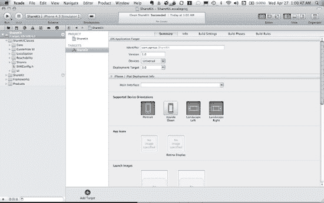

**图 10-1.** *将 ShareKit 拖入 Xcode 项目时选择默认选项。*

接下来，将应用程序链接到以下框架（参见图 10-2）：

-   `SystemConfiguration.framework`
-   `Security.framework`
-   `MessageUI.framework`

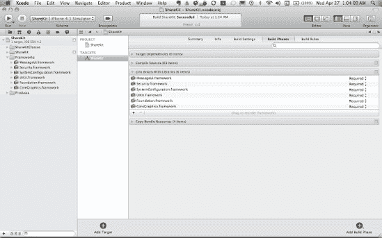

**图 10-2.** *将应用程序链接到相应的框架。*

为了让 ShareKit 能够访问所需的服务，它必须知道这些服务的某些账户信息。在 ShareKit 示例项目中，转到 `SHKConfig.h`，输入 Facebook 和 Twitter 的信息，并开启调试功能，如图 10-3 至 10-5 所示。

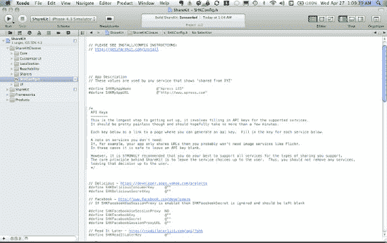

**图 10-3.** *在 `SHKConfig.h` 中设置应用程序名称和 URL。*

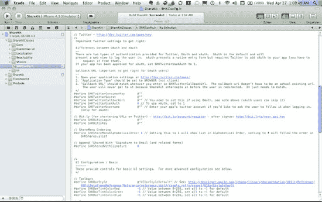

**图 10-4.** *在 `SHKConfig.h` 中设置应用程序的 Twitter OAuth 凭证。*

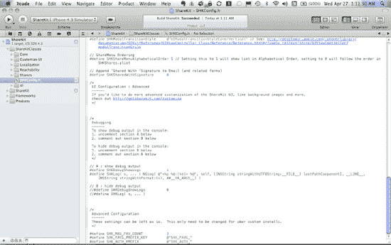

**图 10-5.** *在 `SHKConfig.h` 中开启调试日志。*

将 ShareKit 与 Facebook 集成需要应用程序的 Facebook OAuth 消费者密钥（consumer key）和密钥（secret）；同样地，将与 Twitter 集成需要应用程序的 Twitter OAuth 消费者密钥和密钥。此外，Twitter 还需要一个回调 URL。要为 Twitter 应用程序设置回调 URL，该应用程序必须在 Twitter 上被创建为浏览器应用程序。这意味着，如果应用之前是在 Twitter 上作为客户端应用程序创建的，则需要将其重新配置为浏览器应用程序。否则，你需要创建一个新的应用程序。实际输入给 Twitter 应用程序的 URL 并不重要。唯一重要的是，在 `SHKConfig.h` 中指定的 URL 必须与在 `Twitter.com` 上指定的 URL 一致。示例如下：

`www.apress.com/callback`

处理 Twitter 时，需要集成 bit.ly 来发布 URL，因为 ShareKit 在底层使用 bit.ly 将 URL 缩短后再发布到 Twitter。本章前面已介绍过如何在 bit.ly 上创建应用程序，请参考该章节获取更多说明。

在 ShareKit 头文件中配置好账户信息后，接下来就该向项目添加代码，使用 ShareKit 发布内容到 Facebook 和 Twitter。转到 ShareKit 示例项目中的 `MainViewController.m`，查看 `loadView` 方法。在此方法中，将一个 `UIToolbar` 添加到视图控制器的视图中，并为其添加一个带有默认操作图标的 `UIBarButtonSystemItem` 按钮，如图 10-6 所示：


**图 10-6.** *ShareKit 中带有默认按钮的 `UIToolBar`*

```
- (void)loadView
{
    [super loadView];

    self.view.backgroundColor = [UIColor whiteColor];

    UIBarButtonItem *item = [[UIBarButtonItem alloc]
        initWithBarButtonSystemItem:UIBarButtonSystemItemAction
                             target:self
                             action:@selector(share)];

    NSArray *items = [NSArray arrayWithObject:item];
    [items addObject:item];
    [item release];

    CGRect frame = CGRectMake(0.0f,
                              self.view.bounds.size.height-40.0f,
                              self.view.bounds.size.width,
                              40.0f);
    toolbar = [[UIToolbar alloc] initWithFrame:frame];

    [toolbar setItems:items animated:YES];
    [self.view addSubview:toolbar];
    [toolbar release];

    [SHK flushOfflineQueue];
}
```

选择工具栏按钮会调用 `share` 方法，该方法会向用户显示一个 `SHKActionSheet`：

```
- (void)share
{
    // Create the item to share (in this example, a url)
    NSURL *url = [NSURL URLWithString:@"http://www.apress.com"];
    SHKItem *item = [SHKItem URL:url title:@"Apress is Awesome!"];

    // Get the ShareKit action sheet
    SHKActionSheet *actionSheet =
        [SHKActionSheet actionSheetForItem:item];

    // Display the action sheet
    [actionSheet showFromToolbar:toolbar];
}
```

`SHKActionSheet` 是一个漂亮的弹出窗口，向用户展示分享信息的选项（参见图 10-7）。

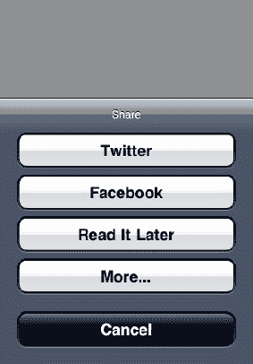

**图 10-7.** *`SHKActionSheet` 弹出窗口*

点击 Facebook 按钮会显示熟悉的 Facebook 移动网页发布界面（参见图 10-8）。

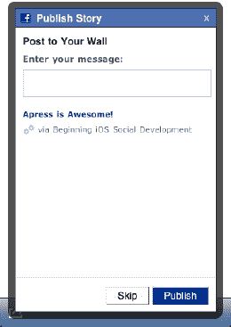

**图 10-8.** *你会认出这是用于发布的 Facebook 移动网页。*

点击 Twitter 按钮会显示一个带有短链接的精美对话框（参见图 10-9）。

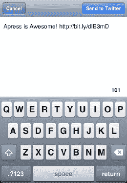

**图 10-9.** *ShareKit 的 Twitter 对话框*

ShareKit 不仅支持发布 URL 和文本，还支持更多功能，因此值得深入探索。它是一个精心打造的解决方案，能让你快速集成 Facebook 和 Twitter。


### 最新 Twitter 潮流趋势

思考人们在特定地理区域或特定时间段内普遍在推特上谈论什么，总是很有趣的。Twitter 通过其趋势 API 提供这些数据。访问这些趋势非常简单，并且不需要任何认证；但请注意，这些 API 的使用始终受限于 Twitter 的速率限制。根据应用的需求，这些数据可以直接从 iOS 应用内部访问，也可以通过服务器到服务器的方式获取。

Twitter 基于 Twitter 话题标签返回趋势。回想一下，Twitter 话题标签是 Twitter 用户关联或分组推文的一种方式。例如，假设一个 Twitter 用户想发一条关于独角兽的推文，以便当有人搜索或查看关于独角兽的推文趋势时，他的推文能被包含在内。在这种情况下，他会在他的推文中包含话题标签 `#unicorns`。

有几种不同的方式可以使用趋势 API。要获取 Twitter 上当前排名前十的热门话题，你可以使用以下请求：

`http://api.twitter.com/1/trends.json`

查看返回结果最快的方法是再次使用 `curl`：

```
$ curl http://api.twitter.com/1/trends.json
{"trends":[
{"url":"http:\/\/search.twitter.com\/search?q=%23thatminiheartattackwhen","name":"#thatminiheartattackwhen"},
{"url":"http:\/\/search.twitter.com\/search?q=%23urnotmytypeif","name":"#urnotmytypeif"},
{"url":"http:\/\/search.twitter.com\/search?q=%23starship","name":"#starship"},
{"url":"http:\/\/search.twitter.com\/search?q=Seth+Meyers","name":"Seth Meyers"},
{"url":"http:\/\/search.twitter.com\/search?q=Jos%C3%A9+Aldo","name":"Jos\u00e9Aldo"},
{"url":"http:\/\/search.twitter.com\/search?q=Catcher+Freeman","name":"CatcherFreeman"},
{"url":"http:\/\/search.twitter.com\/search?q=Green+Men","name":"Green Men"},
{"url":"http:\/\/search.twitter.com\/search?q=Steven+Seagal","name":"StevenSeagal"},
{"url":"http:\/\/search.twitter.com\/search?q=Glenn+Healy","name":"Glenn Healy"},
{"url":"http:\/\/search.twitter.com\/search?q=Karate+Kid","name":"Karate Kid"}],"as_of":"Sun, 01 May 2011 03:35:42 +0000"}
```

这返回一个包含趋势数组和快照获取时间的字典，时间字段为 `as_of`。趋势数组中的每个趋势包含以下内容：

*   `name`：该趋势的话题标签。
*   `url`：指向该话题的 Twitter 搜索结果页面的 URL。

同样的信息也可以通过以下请求获取：

```
$ curl http://api.twitter.com/1/trends/current.json?exclude=#unicorns
```

请注意，`trends/current` API 允许从结果中排除 Twitter 话题标签。同时请注意，返回结果中每个独立趋势不再包含 Twitter 搜索 URL：

```
{"trends":{"2011-05-01 03:32:19":[
{"promoted_content":null,"events":null,"query":"#thatminiheartattackwhen","name":"#thatminiheartattackwhen"},
{"promoted_content":null,"events":null,"query":"#urnotmytypeif","name":"#urnotmytypeif"},
{"promoted_content":null,"events":null,"query":"#starship","name":"#starship"},
{"promoted_content":null,"events":null,"query":"Seth Meyers","name":"Seth Meyers"},
{"promoted_content":null,"events":null,"query":"Jos\u00e9 Aldo","name":"Jos\u00e9Aldo"},
{"promoted_content":null,"events":null,"query":"Catcher Freeman","name":"CatcherFreeman"},
{"promoted_content":null,"events":null,"query":"Green Men","name":"Green Men"},
{"promoted_content":null,"events":null,"query":"StevenSeagal","name":"Steven Seagal"},
{"promoted_content":null,"events":null,"query":"Glenn Healy","name":"GlennHealy"},
{"promoted_content":null,"events":null,"query":"Karate Kid","name":"Karate Kid"}]},"as_of":1304220739}
```

### 热门话题

Twitter 还提供指定日期内每小时的 20 个热门话题：

```
$ curl http://api.twitter.com/1/trends/daily.json?date=2011-04-29&exclude=#unicorns
```

响应中包含一个 `trends` 字典，其中每个趋势又是一个字典，其键是当天的小时数，值是该小时对应的趋势数组：

```
{"trends":{
"2011-04-29 07:00":[<趋势数组>],
"2011-04-29 20:00":[<趋势数组>]},
"as_of":1304223220}
```

请注意，Twitter 仅提供最近 7 到 10 天的历史数据。如果请求中的 `date` 参数设定的日期没有可用数据，Twitter 会返回以下内容：

```
{"errors":[{"code":35,"message":"Trend data not available"}]}
```

类似地，Twitter 还提供指定周内每天的前 30 个热门话题，历史数据可回溯三到四周：

```
$ curl curl http://api.twitter.com/1/trends/weekly.json?date=2011-04-21&exclude=#unicorns
```

响应中包含一个 `trends` 字典，其中每个趋势又是一个字典，其键是特定的周，值是该周的趋势数组：

```
{"trends":{
"2011-04-16":[<趋势数组>],
"2011-04-17":[<趋势数组>]},
"as_of":1304223220}
```

对于每日和每周趋势，如果指定的是未来的日期，Twitter 将返回当前日期的趋势。


### 地理位置标识符 (WOEID)

如前所述，Twitter 趋势也可以基于地理区域获取。但 Twitter 趋势 API 并不使用经纬度来定位，而是采用由雅虎维护的“地理位置标识符”（`WOEID`）。`WOEID` 是地球上任何已命名地点的唯一标识符。你可以在以下网址找到更多相关信息：

*   [`developer.yahoo.com/geo/geoplanet/`](http://developer.yahoo.com/geo/geoplanet/)
*   [`developer.yahoo.com/geo/geoplanet/guide/concepts.html`](http://developer.yahoo.com/geo/geoplanet/guide/concepts.html)

Twitter 可以返回其拥有热门话题信息的 WOEID：

```
$ curl http://api.twitter.com/1/trends/available.json
```

此请求可以携带可选的 `lat` 和 `long` 参数，以缩小返回的结果集。请求会返回一个地点数组，每个地点由一个包含多个键值对的字典表示。其中一个键就是 `WOEID`：

```
[{"countryCode":"TR","country":"Turkey","url":"http:\/\/where.yahooapis.com\/v1\/place\/23424969","parentid":1,"name":"Turkey","woeid":23424969,"placeType":{"code":12,"name":"Country"}},...]
```

通过发出以下格式的请求，你可以获取指定 `WOEID` 对应地理区域内的当前热门话题前十名（前提是该区域存在热门话题信息）：

```
http://api.twitter.com/1/trends/WOEID.json
```

因此，要获取 `WOEID` 为 `1` 的热门话题前十名，请求如下所示：

```
$ curl http://api.twitter.com/1/trends/1.json
```

与其他趋势请求一样，此请求返回一个包含趋势数组的字典：

```
[{"as_of":"2011-05-01T03:39:32Z","trends":[
{"url":"http:\/\/search.twitter.com\/search?q=%23thatminiheartattackwhen","query":"%23thatminiheartattackwhen","events":null,"promoted_content":null,"name":"#thatminiheartattackwhen"},
{"url":"http:\/\/search.twitter.com\/search?q=%23urnotmytypeif","query":"%23urnotmytypeif","events":null,"promoted_content":null,"name":"#urnotmytypeif"},
{"url":"http:\/\/search.twitter.com\/search?q=%23starship","query":"%23starship","events":null,"promoted_content":null,"name":"#starship"},
{"url":"http:\/\/search.twitter.com\/search?q=Seth+Meyers","query":"Seth+Meyers","events":null,"promoted_content":null,"name":"Seth Meyers"},
{"url":"http:\/\/search.twitter.com\/search?q=Jos%C3%A9+Aldo","query":"Jos%C3%A9+Aldo","events":null,"promoted_content":null,"name":"Jos\u00e9 Aldo"},
{"url":"http:\/\/search.twitter.com\/search?q=Catcher+Freeman","query":"Catcher+Freeman","events":null,"promoted_content":null,"name":"Catcher Freeman"},
{"url":"http:\/\/search.twitter.com\/search?q=Green+Men","query":"Green+Men","events":null,"promoted_content":null,"name":"Green Men"},
{"url":"http:\/\/search.twitter.com\/search?q=Steven+Seagal","query":"Steven+Seagal","events":null,"promoted_content":null,"name":"Steven Seagal"},
{"url":"http:\/\/search.twitter.com\/search?q=Glenn+Healy","query":"Glenn+Healy","events":null,"promoted_content":null,"name":"Glenn Healy"},
{"url":"http:\/\/search.twitter.com\/search?q=Karate+Kid","query":"Karate+Kid","events":null,"promoted_content":null,"name":"Karate Kid"}],
"created_at":"2011-05-01T03:28:09Z","locations":[{"name":"Worldwide","woeid":1}]}]
```

还有一些其他服务也提供 Twitter 趋势信息。其中一个是 `letsbetrends.com`，它有自己独立的 API。有关该服务的更多信息，请访问：

```
http://letsbetrends.com/
```

此外，如果你的应用需要显示关于话题标签的提示或信息，可以使用像 tagalus ([`tagal.us/`](http://tagal.us/)) 这样的服务。这里有一篇关于理解 Twitter 话题标签的好文章：

```
http://blog.programmableweb.com/2009/03/20/make-sense-of-confusing-twitter-hash-tags/
```

### 再谈离线存储：SQLite

第 8 章 的部分内容探讨了使用 iOS 的 Core Data 离线存储推文的话题。值得一提的是，在底层，Core Data 会将其数据模型的数据保存到 SQLite 数据库中。`SQLite` 是一个“跨平台的 C 语言库，它实现了一个自包含、可嵌入、零配置的 SQL 数据库引擎。” 你可以在 [www.sqlite.org/](http://www.sqlite.org/) 上了解更多关于这个数据库的信息。

Core Data 会在应用的 `Documents` 目录中创建 SQLite 数据库文件。使用模拟器时，`Documents` 目录可通过以下路径访问，其中“4.3”会根据应用目标 iOS 版本的不同而变化，`<app id>` 是 iOS 为每个应用创建的唯一应用标识符，因应用而异：

```
Library/Application Support/iPhone Simulator/4.3/Applications/<app id>/Documents
```


**图 10–10.** *iOS 模拟器应用的 Mac OS X 文件系统路径*

要确定哪个目录属于某个特定应用，请检查每个 `<app id>` 目录的内容，并找到包含该应用 `.app` 文件的目录。以第 8 章中的离线应用为例，其文件是 `OfflineTwitter.app`。在该应用的 `Documents` 目录中，有一个名为 `CoreDataOffline.sqlite` 的 SQLite 数据库文件。该文件名与代表 Core Data 模型的 `xcdatamodeld` 文件名 `CoreDataOffline` 相匹配。

查看 SQLite 数据库的内容需要数据库软件。Mac OS X 上可用的较好数据库软件之一是 MesaSQLite ([www.desertsandsoftware.com/?realmesa_home](http://www.desertsandsoftware.com/?realmesa_home))。MesaSQLite 是免费的，在 iOS 应用中处理数据库时非常有用。安装 MesaSQLite 或其他数据库应用程序后，打开前面提到的 `CoreDataOffline.sqlite` 文件，然后查看 `ZTWEET` 表的内容。（在 MesaSQLite 中，从“表名”下拉列表中选择 `ZTWEET` 表，然后点击“显示全部”以查询数据库中的所有推文。）`ZTWEET` 表是 Core Data 存储应用创建并保存的 `Tweet` 对象的地方。请注意，其中有 `ZID` 和 `ZTEXT` 列，分别对应数据模型中每个 `Tweet` 对象的 `id` 和 `text` 属性。

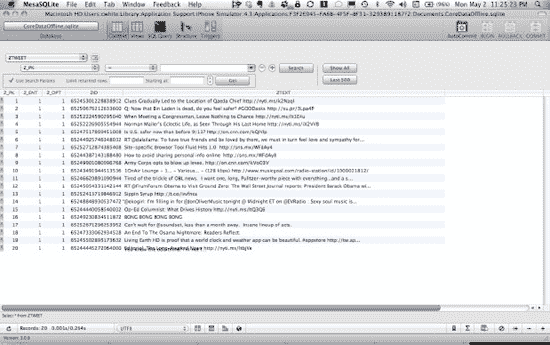

**图 10–11.** *Core Data SQLite 数据库*

使用 SQLite 可能有点棘手，因此亲自动手实践一下是值得的。因此，本节剩余部分将展示如何直接使用 SQLite 而不是 Core Data 来重新实现第 8 章中的 `OfflineTwitter` 应用。以下所有代码都位于 `Github` 仓库的 `Chapter10/OfflineTwitter` 目录中。


#### 在不用 Core Data 的情况下重写 OfflineTwitter

由于 OfflineTwitter 应用的原始架构将所有数据访问代码都保留在 `TwitterDataStore` 类中，因此几乎所有的用户界面视图和控制器都可以保持不变。唯一需要做的是创建一个直接使用 SQLite 来存储、检索和删除推文（Tweet）而非 Core Data 的 `TwitterDataStore` 版本。

首先，对 `Tweet` 类稍作调整，使其不再是托管对象：

```
@interface Tweet : NSObject {
}

@property (nonatomic, retain) NSNumber * id;
@property (nonatomic, retain) NSString * text;

@end
```

接下来，`TwitterDataStore` 被简化，现在它成为一个基类，任何类型的 `TwitterDataStore` 都可以从中派生：

```
@interface TwitterDataStore : NSObject {
}

- (NSURL *)applicationDocumentsDirectory;
- (NSArray*)tweets;
- (void)deleteTweets;
- (void)synchronizeTweets:(NSArray*)tweets;

@end
```

现在，创建了一个名为 `TwitterDataStore_SQLite` 的类，用于实际承担使用 SQLite 存储、检索和删除推文的重任。该类定义位于 `TwitterDataStore_SQLite.h` 中：

```
#import "TwitterDataStore.h"

@class sqlite3;
@interface TwitterDataStore_SQLite : TwitterDataStore {
    sqlite3             *database;
}

@end
```

接下来，我们在 Xcode 中查看 `TwitterDataStore_SQLite.m`。请注意，为该类声明了两个额外的辅助方法：

- `openDatabase`
- `closeDatabase`

在该类的初始化方法中，导入了 `sqlite3.h`，以便 `TwitterDataStore_SQLite` 可以使用 SQLite。值得查阅这个头文件，以深入了解 SQLite 为 iOS 应用提供了哪些功能，因为这里的讨论只触及了表面。在代码中，调用 `openDatabase` 来创建数据库（如果尚不存在）并在数据库中设置表。在 `dealloc` 方法中，当类被销毁时关闭数据库：

```
#import "TwitterDataStore_SQLite.h"
#import "sqlite3.h"
#import "Tweet.h"

@interface TwitterDataStore_SQLite ()
- (void)openDatabase;
- (void)closeDatabase;
@end

@implementation TwitterDataStore_SQLite

- (id)init
{
    if ((self = [super init])) {
        [self openDatabase];
    }
    return self;
}

- (void)dealloc
{
    [self closeDatabase];
    [super dealloc];
}
```

`openDatabase` 方法负责创建数据库并为其填充一个用于存储推文的表。如果数据库对象已经打开，该方法不做任何操作。这是通过检查指向 `sqlite3` 数据库对象的指针是否为 `NULL` 来实现的。通过 SQLite 打开数据库是通过 `sqlite3_open` 方法完成的。该方法需要一个 SQLite 数据库文件的路径，如果文件不存在则创建它，如果已存在则打开它。它还需要一个指向 `sqlite3` 数据库对象指针的指针。

如果数据库成功打开，则通过 `sqlite3_exec` 方法创建数据库的 `Tweets` 表，该方法在数据库上执行 SQL 查询。如果表尚不存在，该查询会创建一个表，包含推文 ID 和推文实际消息内容的列：

```
NSString *createTables =
    @"CREATE TABLE IF NOT EXISTS tweets (id INTEGER
                                         PRIMARY KEY,
                                         message TEXT);";
```

接下来，再次使用 `sqlite3_exec`，为这个表在推文 ID 上创建一个索引，以加速从数据库中查询推文：

```
NSString *createIndex =
    @"CREATE INDEX IF NOT EXISTS tweetIndex ON tweets(id);";
```

```
- (void)openDatabase
{
    if (nil == database) {
        NSURL *path =
               [[self applicationDocumentsDirectory]
               URLByAppendingPathComponent:@"twitter.sqlite"];

        if (SQLITE_OK !=
            sqlite3_open([[path relativePath] UTF8String], &database)) {
            [self closeDatabase];
        } else {
            char *errmsg;

            NSString *createTables =
            @"CREATE TABLE IF NOT EXISTS tweets (id INTEGER PRIMARY KEY,
                                                 message TEXT);";
            if (SQLITE_OK !=
                sqlite3_exec(database,
                [createTables UTF8String],
                NULL,
                NULL,
                &errmsg)) {
                NSLog(@"create table error: '%s'", errmsg);
            }

            NSString *createIndex =
                @"CREATE INDEX IF NOT EXISTS tweetIndex ON tweets(id);";
            if (SQLITE_OK !=
                sqlite3_exec(database,
                             [createIndex UTF8String],
                             NULL,
                             NULL,
                             &errmsg)) {
                NSLog(@"create table index error: '%s'", errmsg);
            }
        }
    }
}
```

`closeDatabase` 是一个非常直接的方法。它对该类拥有的 `sqlite3` 数据库对象调用 `sqlite3_close`。这会关闭数据库，然后将指向数据库的指针设置为 `NULL`，这样如果随后再次调用 `openDatabase` 方法，它将重新打开数据库：

```
- (void)closeDatabase
{
    sqlite3_close(database);
    database = nil;
}
```

由于本示例项目的目标是将推文离线存储在 SQLite 数据库中，因此首要任务是同步从 Twitter 检索到的推文并将其存储在数据库中（参见[图 10–12]（#Chapter10.html#fig_10_12））。与 Core Data 示例一样，这发生在 `TwitterDataStore` 的 `synchronizeTweets:` 方法中，该方法首先删除数据库中的任何现有推文，然后存储新的推文。

回想一下，推文是以 `NSDictionary` 对象的数组形式传入的，其中数组中的每个 `NSDictionary` 代表一条推文。让我们仔细看看处理推文的 `for-loop`。第一步是初始化一个 SQL 事务：

```
sqlite3_exec(database, "BEGIN;", NULL, NULL, NULL);
```

存储一条推文的实际 SQL 语句如下：

```
char *text = "INSERT INTO tweets (id, message) VALUES (?, ?);";
```

请注意语句中 `?` 符号的存在。这表示在通过 `sqlite3_prepare_v2` 准备语句后，这些值将被绑定到语句中。请注意，推文 ID 存储为 64 位 `integer`，并通过 `sqlite3_bind_int64` 绑定。推文的内容存储为 `text`，并通过 `sqlite3_bind_text` 绑定。然后通过 `sqlite3_step` 执行事务。事务可能因某些原因失败，因此会采取措施在失败时回滚事务。这样可以在发生失败时保留数据库的状态。以下是实现此操作的代码：

```
- (void)synchronizeTweets:(NSArray*)tweets
{
    NSAutoreleasePool *autoReleasePool =
        [[NSAutoreleasePool alloc] init];

    @synchronized(self) {

        [self deleteTweets];

        char *text = "INSERT INTO tweets (id, message) VALUES (?, ?);";

        for (NSDictionary *tweetDictionary in tweets) {

            sqlite3_exec(database, "BEGIN;", NULL, NULL, NULL);

            sqlite3_stmt *stmt = NULL;
            if (SQLITE_OK !=
                sqlite3_prepare_v2(database, text, -1, &stmt, NULL)) {
NSLog(@"error: '%s'", sqlite3_errmsg(database));
sqlite3_exec(database, "ROLLBACK;", NULL, NULL, NULL);
            }

            NSNumberFormatter * f = [[NSNumberFormatter alloc] init];
            NSNumber * tweetId =
              [f numberFromString:[tweetDictionary objectForKey:@"id"]];
            sqlite3_bind_int64(stmt, 1, [tweetId longLongValue]);
            [f release];
```


# Objective-C 代码示例

```
NSString *message = [tweetDictionary objectForKey:@"text"];
sqlite3_bind_text(stmt,
                  2,
                  [message UTF8String],
                  -1,
                  SQLITE_TRANSIENT);

BOOL result = sqlite3_step(stmt) != SQLITE_ERROR;
sqlite3_finalize(stmt);

sqlite3_exec(database, result ? "END;" : "ROLLBACK;",
                 NULL, NULL, NULL);
    }
}

//发布一条通知，表明推文已可用……让响应者在主线程上自行更新
[[NSNotificationCenter defaultCenter]
    postNotificationName:@"tweetsDidSynchronize"
              object:self
userInfo:nil];

[autoReleasePool release];
}
```

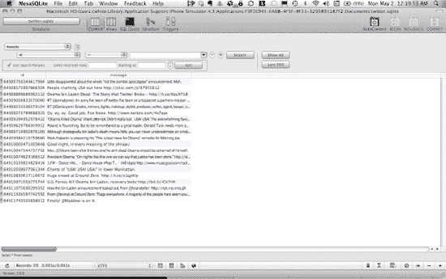

**图 10–12.** 推文的 SQLite 数据库

现在推文已存入数据库，应用程序需要一种检索它们的方法。这通过`TwitterDataStore`的`tweets`方法实现。该方法使用标准的 SQL `SELECT`语句从数据库中获取所有推文：

```
NSString *tweetsStatement = @"SELECT id, message FROM tweets";
```

如果语句准备成功，则会遍历结果集，为结果集中的每一行创建并初始化一个新的`Tweet`对象。然后，该`Tweet`会被添加到一个由该方法返回的`Tweet`数组中：

```
- (NSArray*)tweets
{
    NSMutableArray *tweets = [NSMutableArray array];

    @synchronized(self) {

        sqlite3_stmt *queryStatement = nil;
        NSString *tweetsStatement = @"SELECT id, message FROM tweets";
        if (SQLITE_OK != sqlite3_prepare_v2(database,
                [tweetsStatement UTF8String],-1,&queryStatement, NULL)) {
            NSLog(@"error: '%s'", sqlite3_errmsg(database));
            return nil;
        }

        while(sqlite3_step(queryStatement) == SQLITE_ROW) {

            Tweet *tweet = [[[Tweet alloc] init] autorelease];
            [tweet setId:[NSNumber numberWithLongLong:
                          sqlite3_column_int64(queryStatement, 0)]];
            [tweet setText:[NSString stringWithUTF8String:
                   (const char*)sqlite3_column_text(queryStatement, 1)]];
            [tweets addObject:tweet];
        }
        sqlite3_finalize(queryStatement);
    }

    return tweets;
}
```

完成`TwitterDataStore`的 SQLite 实现所需实现的最后一个方法是`deleteTweets`。该方法只是在数据库上执行一个 SQL `DELETE`语句来删除所有推文：

```
NSString *deleteTweetsStatement = @"DELETE FROM tweets";

- (void)deleteTweets
{
    @synchronized(self) {
        char            *errmsg;

        NSString *deleteStmnt = @"DELETE FROM tweets";
        if (SQLITE_OK !=
            sqlite3_exec(database, [deleteStmnt UTF8String], NULL,
            NULL, &errmsg)) {
            NSLog(@"error: '%s'", sqlite3_errmsg(database));
        }
    }
}
```

上述代码使用了 SQLite，因此除非调整应用程序的`Xcode`项目以链接`libsqlite3.0.dylib`而非`CoreData.framework`（参见图 10–13），否则它将无法链接。

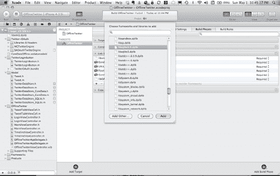

**图 10–13.** 调整 Xcode 项目，使其链接到`libsqlite3.0.dylib`而非`CoreData.framework`

## 测试还是不测试，这是个问题

由于数据模型或层的代码不需要用户界面，这为讨论 iOS 和移动开发中一个经常被忽视的话题——单元测试——提供了独特的机会。不幸的是，许多项目完全避免编写单元测试，或者只在项目末尾尝试添加一些测试。部分原因是由于为项目设置测试环境通常很困难，还有部分原因可能是开发者的懒惰。然而，如果及早并频繁地进行，单元测试实际上会让开发者比不写测试更懒，因为它减少了手动测试的需求。此外，借助 Xcode 4，Apple 使得为 iOS 项目启动和运行单元测试比以往任何时候都更容易。

接下来是一个逐步教程，为这个项目的 OfflineTwitter Xcode 添加一个单元测试。该单元测试验证了数据库中同步推文的代码。当然，最好在编写代码的同时编写测试，但本教程的主要目的是展示向 iOS Facebook 或 Twitter 应用程序添加单元测试是多么容易。


# 为社交 iOS 应用添加单元测试

Apple 已将单元测试配置为在 Xcode 项目内作为独立目标进行构建和运行。虽然起初可能显得有些繁琐，但其优点在于能很好地将测试代码排除在主应用程序目标之外。这意味着测试文件不会被构建到最终的应用二进制文件中，同时也有助于调试和搭建自动化测试环境。

要在 Xcode 4 中为项目添加一个新目标，请从 `File` 菜单选择 `New` -> `New Target...`（参见图 10–14）。

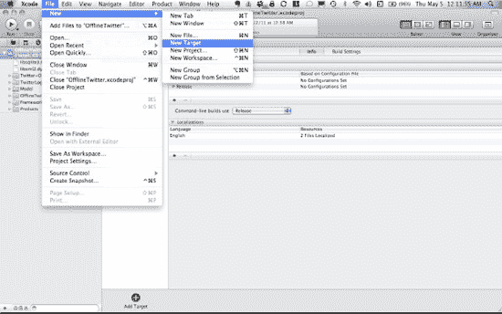

**图 10–14.** *添加新目标*

在目标模板弹出窗口中，进入 iOS 部分，选择 `Other`，然后选择 `Cocoa Touch Unit Testing Bundle`（参见图 10–15）。

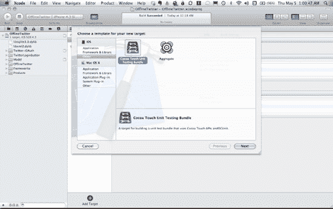

**图 10–15.** *选择 Cocoa Touch Unit Testing Bundle。*

接着，为新目标命名（参见图 10–16）。


**图 10–16.** *重命名目标。*

现在通过 Xcode 中的目标下拉菜单切换到新目标，从 `Product` 菜单中选择 `Test` 来创建构建，然后运行测试目标（参见图 10–17）。

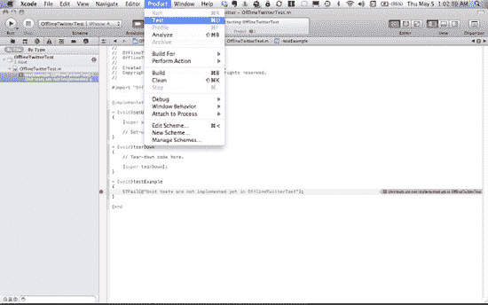

**图 10–17.** *构建并运行测试目标。*

Xcode 创建的默认测试代码在开箱状态下会故意导致失败，这展示了 Xcode 如何高亮显示测试用例失败的情况（参见图 10–18）。

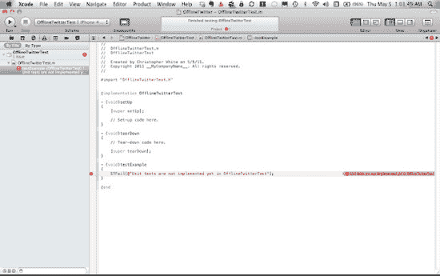

**图 10–18.** *失败！*

需要为 `TwitterDataStore_SQLite` 类编写测试；因此，需要将 `TwitterDataStore_SQLite`、`TwitterDataStore` 和 `Tweet` 类添加到 `OfflineTwitterTest` 目标中，以便在添加实际测试代码时，`OfflineTwitterTest` 目标能够成功链接（参见图 10–19 至 10–21）。

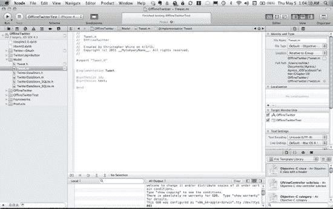

**图 10–19.** *将 `Tweet.m` 添加到 `OfflineTwitterTest` 目标*

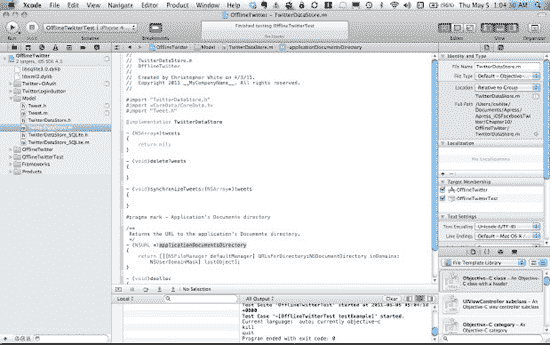

**图 10–20.** *将 `TwitterDataStore.m` 添加到 `OfflineTwitterTest` 目标*

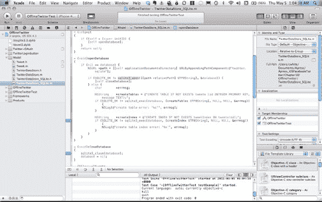

**图 10–21.** *将 `TwitterDataStore_SQLite` 添加到 `OfflineTwitterTest` 目标*

所有设置现已完成，接下来可以编写一个简单的测试来验证一切是否正常运作。测试类将测试 `TwitterDataStore_SQLite` 类中的功能，因此它需要持有一个 `TwitterDataStore_SQLite` 对象。打开示例项目中的 `OfflineTwitterTest.h` 文件，注意其中对 `TwitterDataStore_SQLite` 对象的声明：

```
#import <SenTestingKit/SenTestingKit.h>

@class TwitterDataStore_SQLite;
@interface OfflineTwitterTest : SenTestCase {
@private
    TwitterDataStore_SQLite *twitterDataStore;
}

@end
```

在大多数单元测试框架中，测试类可以在测试运行前进行一些设置，并在测试完成后进行一些清理工作。iOS 项目的单元测试也不例外。测试运行前，会调用测试类的 `setUp` 方法；测试执行后，会调用 `tearDown` 方法。打开示例项目中的 `OfflineTwitterTest.m` 文件，查看这些方法的实现。由于这是一个基本示例，`setUp` 实例化了 `TwitterDataStore_SQLite` 对象，而 `tearDown` 释放了该对象，以避免测试产生内存泄漏（否则可能引发其他副作用）。根据应用中代码的性质，这些方法可能需要更多代码。通常，这些方法应保留给类中每个测试都需要的代码：

```
- (void)setUp
{
    [super setUp];

    // 设置代码写在这里。
    twitterDataStore = [[TwitterDataStore_SQLite alloc] init];
}

- (void)tearDown
{
    // 清理代码写在这里。
    [twitterDataStore release];

    [super tearDown];
}
```

以下是针对 `TwitterDataStore_SQLite` 类功能的实际测试。虽然可能会想为类的每个方法编写单元测试，但更好的方法是考虑该类作为一个整体应完成什么任务，并编写测试来验证其功能。这也引出了测试命名的问题。最好给测试起有用且描述性的名称，这样项目中的其他开发者仅凭名称就能立即知道该测试试图验证什么。为此，下面的测试被命名为 `testItShouldSynchronizeTweets`，以反映 `TwitterDataStore_SQLite` 的主要职责之一是存储和同步推文。

该测试首先从 `TwitterDataStore_SQLite` 中删除所有推文，以便从一个干净的状态开始。这种方法并非在所有情况下都必要或可取，应根据具体类或应用进行调整。接着，创建一个 `NSDictionary` 来表示一条模拟推文。由于 `TwitterDataStore_SQLite` 的 `synchronizeTweets:` 方法只接受一个 `NSArray` 参数，因此将表示推文的 `NSDictionary` 添加到一个 `NSArray` 对象中，再将其传递给 `synchronizeTweets:`。然后使用 `TwitterDataStore_SQLite` 的 `tweets` 方法获取存储的推文，并进行简单比较以确认数据存储中有一条推文。根据测试或应用的不同，可以添加额外的验证，例如检查检索到的推文内容是否与字典中的内容匹配：

```
- (void)testItShouldSynchronizeTweets
{
    [twitterDataStore deleteTweets];

    NSDictionary *tweetDictionary = [NSDictionary
    dictionaryWithObjects:[NSArray arrayWithObjects:@"1", @"Tweet!", nil]
    forKeys:[NSArray arrayWithObjects:@"id", @"text", nil]];

    NSArray *newTweets = [NSArray arrayWithObject:tweetDictionary];
    [twitterDataStore synchronizeTweets:newTweets];

    NSArray *tweets = [twitterDataStore tweets];
    STAssertTrue((1 == [tweets count]), @"Test error message");
}

@end
```

这类测试的一大优点是，它们使得在特定场景下调试代码变得非常容易，而无需运行实际应用并在用户界面中执行多个步骤。这种方法还能使测试可重复，这在需要重构或优化代码时非常有利。当然，它还能确保在对代码进行调整或进行重大修改时，不会引入*回归*（即之前按预期工作的代码中出现的新错误）。

应用需要的测试不止一个。当需要额外测试时，可以将其添加到现有测试类中，或者向测试目标添加新的测试类。不要忘记同时将主应用目标中的相关文件添加到测试目标中，具体取决于正在测试的功能。

有关此主题的更多信息，请参考 Apple 文档中的测试部分，网址为：

`http://developer.apple.com/library/ios/#documentation/ToolsLanguages/Conceptual/Xcode4UserGuide/Building/Building.html`

测试通过 `SenTestingKit` 框架构建。该框架提供了多个用于验证测试的宏，这些宏以 `ST` 为前缀。前面的示例代码使用了宏 `STAssertTrue`，但其他可用的宏可以在 `SenTestCase_Macros.h` 中找到。

设置测试目标是为项目配置测试的重要部分。如前所述，本概述涵盖了在 Xcode 4 中进行的单元测试。如果项目使用 Xcode 3 构建，则需要采用不同的配置。


虽然 Xcode 3 中已经提供了 `SenTestingKit` 框架，但苹果自带的测试设置方案并不理想。不过，谷歌的一些工程师非常友好地对苹果的方案进行了扩展，并面向大众发布了一个更新版的 iOS 单元测试库。在 Xcode 3 中进行配置需要执行几个手动步骤，但非常值得一试。该代码是谷歌 `google-toolbox-for-mac` 项目的一部分，可在此处找到：

`https://code.google.com/p/google-toolbox-for-mac/wiki/iPhoneUnitTesting`

对于 Xcode 3 而言，另一个值得考虑的替代方案是 `GHUnit`，下载地址如下：

`https://github.com/gabriel/gh-unit`

编写单元测试的另一个有趣方面涉及模拟对象（Mocking Objects）。学习为测试模拟对象可以将测试代码提升到一个新的水平。在 iOS 项目的 Objective-C 单元测试中，模拟对象的主要工具是 `OCMock`。请注意，使用 `OCMock` 并不需要在 iOS 项目中新建测试目标，而是提供了一些类和功能，供你在现有测试类、方法或新测试中使用。请通过以下链接了解 `OCMock` 的简介及设置说明：

`www.mulle-kybernetik.com/software/OCMock/`

### 结论

在开发 iOS 项目时，有许多出色的工具可以让工作变得轻松。这些工具从免费的在线服务到开源工具和软件，应有尽有。本章只是浅尝辄止地介绍了一部分可用工具；不过，它涵盖了一些对于编写优秀 iOS 应用（包括针对 Facebook 和 Twitter 的应用）不可或缺的工具。关于数据建模、测试以及缩短 URL 等方面，网上以及书籍刊物中都有大量的资料；但由于移动开发的特性以及 iOS 平台的限制，撰写 iOS 应用程序时，本章所介绍的工具和软件是非常适用的。

## 第 11 章

## 你可以构建（以及不能构建）的应用

遗憾的是，在撰写本书的早期我们就意识到，需要有一章来专门讲解使用 Facebook 和 Twitter API 时必须遵守的所有规则。早在 2009 年，当这些应用爆红时，社交 API 的使用几乎毫无限制。平台开发方——包括 Facebook 和 Twitter——当时也不确定智能手机将如何改变人们使用其工具的方式。

随着时间的推移，Facebook 和 Twitter 已经开始限制其 API 的使用方式。

平心而论，Facebook 的平台政策是合理的，并为开发者提供了很大的自由度。相比之下，Twitter 则常被指责（说得委婉些）在用户如何调用其代码方面显得“更具操控性”。

作为作者，我们当然希望完全自由地使用这些 API，但也必须承认，像 Twitter 这样的品牌需要维护其声誉，并且（像任何公司一样）非常担心有人对其抹黑，或让用户混淆 Twitter 的用途。

请把本节内容当作你应用创意的筛选器。如果你已经有一个正在添加 Twitter 或 Facebook 功能的应用，那么你仍然需要快速浏览本章，以确保应用的任何视觉或交互元素不会引起 Twitter 和 Facebook 平台的负面关注。

毕竟，唯一比遵守规则更糟糕的事情，就是回头重做以符合规则要求。

### Twitter：禁止客户端应用

2011 年 3 月，Twitter 平台团队成员 Ryan Sarver（`@rsarver`）在开发者社区发布了一篇声明。在这篇文章中，Sarver 宣布了 Twitter 的新规定，旨在规范开发者的开发内容和方式。你可以通过以下网址阅读他的文章：

[`https://groups.google.com/forum/#!topic/twitter-development-talk/yCzVnHqHIWo/discussion`](https://groups.google.com/forum/#!topic/twitter-development-talk/yCzVnHqHIWo/discussion)

我们不再赘述全文，但会重点指出政策变化最显著的一些方面。这些也往往是平台新开发者不了解的领域。主要要点如下：

*   自 Twitter 的开发者条款首次制定以来，它变得异常流行。
*   服务越是主流，其 UI 和 UX 就必须越一致；否则，Twitter 将遭受行业内所谓的*品牌稀释*。
*   官方 Twitter 应用的 UI 和 UX 是最好的，其相比第三方 Twitter 应用的高人气也证明了这一点。
*   因此，Twitter 正在逐步打击那些仅复制 Twitter 功能（而未增加其他价值）的 Twitter 客户端。它针对增值 Twitter 应用的建议包括：发布工具（如 `SocialFlow`）、策展工具（如 `Sulia`）以及数据产品（如 `Klout`）。其他机会还包括社交 CRM 客户端（如 `HootSuite`），以及类似 `Foursquare`、`Instagram` 和 `Quora` 的独特服务。

总结：你仍然可以使用 Twitter API 自由开发。但从现在开始，你的应用在使用该服务时必须更具创意。仅仅以不同的设计或交互方式复制 Twitter 应用，都会招致 Twitter 团队的邮件警告（甚至可能导致失去 Twitter API 的访问权限）。

#### Twitter 服务条款详解

Twitter 发布上述声明的同时，也发布了修订后的服务条款，对声明中描述的变化进行了更具体的说明。我们再次不在此全文转载，但你需要特别关注某些方面。

**注意：** 最好的情况是，你开发的应用大受欢迎。如果你的应用需要的用户令牌超过 500 万个，则需要直接联系 Twitter 以获取 API 访问权限。

完整的 Twitter 服务条款可在此处找到：

[`http://dev.twitter.com/pages/api_terms`](http://dev.twitter.com/pages/api_terms)

##### 基本规则

我们将在后续章节中总结 Twitter 的“规则”。请注意，即使我们的摘要——比实际文档简洁得多——仍然长得令人厌烦。我们将最关键的点用粗体标出，以便你快速阅读。但也不要*太快*——如果投入时间和精力的项目不符合这些条款，那将非常可惜，因为你可能之后不得不放弃它。

###### 使用 API

以下是关于使用 Twitter API 的一些关键规则：

*   如果你想出售、出租、租赁、再许可、再分发或联合提供 Twitter API、Twitter 数据或 Twitter 内容，需要获得 Twitter 的书面许可。以下是关于这些许可的一些附加规则：
    *   如果你提供返回 Twitter 数据的 API，将面临特殊限制：该 API 只能返回推文 ID 和用户 ID。
    *   你可以通过“另存为”或类似功能，将非编程的、GUI 驱动的 Twitter 内容导出或提取为 PDF 或电子表格。
    *   不允许将 Twitter 内容作为服务或基于云的服务导出到数据存储中。
*   不允许更改 Twitter API 或内容上的任何专有通知或标记。
*   **你不能使用 Twitter API 来监控 Twitter 的正常运行时间、性能或功能。**
*   **你不能以暗示与 Twitter 有任何关联的方式使用 Twitter 商标。**
*   **你不能出售或访问 Twitter API 来聚合、缓存（作为推文的一部分除外）或存储推文中包含的地理位置信息。**
*   你不能对访问任何 Twitter 功能收取额外费用。


# 你的应用能做什么

根据推特的说法，你的服务“可能是一个提供类似推特终端用户体验主要组件的应用或客户端”；但如果你构建的是客户端应用，还需遵守额外条款：

- 你必须将推特 API 作为客户端中与推特功能高度相似功能的唯一来源。换句话说，你不能将其他类似的 API 混入推特 API 项目中，否则公司将给你发来一封警告邮件。
- 你不得向第三方支付费用以分发你的应用。
- 你不能在你的应用中框架显示或复制推特服务的大部分内容；相反，你必须使用推特 API 来展示推特内容。
- 不得存储私人数据或内容，也不得复制推特的数据库。

## 管理现有推特客户端的规则

鉴于新的服务条款，非官方推特客户端仍能留在应用商店中似乎有些奇怪。当推特在 2011 年 3 月宣布“不再支持客户端”时，其平台开发者表示，一些现有的推特客户端应用将被允许继续运营。不过，推特的 Ryan Sarver 补充道^(1)：

> “我们将以高标准要求你们，确保你们不侵犯用户隐私，提供一致的用户体验，并严格遵守我们服务条款的所有方面。”

## 推特对可用性的定义

接下来的部分并非严格意义上的规则，而是描述了一系列指导方针。遵循这些方针，你就能避免招致推特平台团队的不满。他们规定你的应用如何运作，这听起来可能有些严苛，但这是为了用户的最大利益——如果你的应用在平台上做了其他推特应用没做过的事情，部分用户可能会感到困惑。基于此精神，推特要求你遵守以下准则：

- **不要给用户带来意外：** 不要滥用推特的功能或术语：
    - 保持推文的完整性。尽管推文只有 140 个字符，但其中包含了大量信息。关于推特视觉设计指导，请参见第 13 章。
    - 不要编辑或修改通过 API 传递的用户生成内容。
    - 始终显示推文的原创者或提供者。
- **不要制造或传播垃圾信息：** 在以下任何操作之前，需获得用户许可：
    - 代表用户发送推文或其他消息。用户通过你的应用进行身份验证，并不构成你代表其发送消息的同意。
    - 代表用户修改其个人资料信息或执行账户操作（包括关注、取消关注和屏蔽）。
    - 在用户的推文中添加话题标签、注释数据或其他内容。应向用户准确展示将要发布的内容。
- **不要为了抢占名称而制作占位应用。**
- **尊重用户隐私：** 你需要使用适当的安全标准，例如 `OAuth`，如第 2 章所述。你还应做到以下几点：
    - 尊重推特内容的隐私和分享设置。
    - 当通过推特 API 报告更改时，及时调整你对推特内容的处理方式。
    - 始终向用户展示你服务的隐私政策。你还应清楚说明你如何处理从用户那里收集的信息。
    - 明确说明何时将位置信息添加到用户的推文中，无论是作为地理标签还是注释数据。
    - 不要索取其他开发者的消费者密钥或消费者秘密（如果这些密钥将被存储在该开发者控制范围之外）。
    - 不要促成或鼓励发布私人或机密信息。
- **成为推特的良好合作伙伴：** 你需要遵守本章所述的所有规则，包括：
    - 不得以可能误导、混淆或欺骗用户的方式使用商业名称和/或徽标。关于推特商标使用的更多信息，请参见本章后面的商标规则。
    - 尽量避免在应用的来源或目的方面混淆或误导用户。
    - 不要链接到恶意软件。
    - 不要复制、框架显示或镜像推特网站或其设计。
    - 不要滥用 API 在推特上冒充他人。

__________

¹ [`https://groups.google.com/forum/#!topic/twitter-developmenttalk/yCzVnHqHIWo/discussion`](https://groups.google.com/forum/#!topic/twitter-developmenttalk/yCzVnHqHIWo/discussion)

## 登录与身份

推特还有一些关于登录和身份的指导方针：

- 你必须向用户提供通过 `OAuth` 安全协议登录推特的选项，如本书第 2 章和第 5 章所述。
- 你应该为没有推特账户的最终用户提供创建新推特账户的机会。
- 你展示“使用推特连接”选项时，其醒目程度至少应与 Facebook 连接按钮或任何其他社交网页登录选项相当。
- 一旦最终用户通过“使用推特连接”完成身份验证，你必须执行以下操作：清晰地显示他的推特头像、推特用户名以及推特小鸟图标。

## 正确显示内容

以下是关于正确显示推特内容的指导方针：

- 推文中引用内容的所有 URL，都应直接将用户引导至显示该内容的页面，而不是任何中间页面。
- 如果你的服务将更新内容与推文混合显示，你必须标明那些引用推特作为来源的推文。
- 不要在用户个人资料图片或背景中放置色情内容。
- 仅显示推特上自然呈现的操作。例如，当用户执行取消收藏或删除操作时，你不应该做推特不会做的事情，比如公开某条推文已被删除。
- 不要虚假报告某个账户为“已验证”账户。

## 通过应用盈利

在尝试通过应用盈利时，你应该遵循以下指导方针。其中最重要的一点是尊重用户内容：

- 推文可用于广告中，但不能*作为*广告本身。
- 如果你想将某条推文用于耐用品，或者暗示该条推文作者对某事的赞助或认可，你必须获得该推文创建者的许可。

## 推特广告

推特可以通过其 API 在你的应用中投放广告（即推特广告）；然而，如果你联系推特，它会与你分享一部分广告收入。

## 推特内容周边广告

你可以在自己的推特 API 应用内投放广告，但（当然）对此也有规定：

- 如果你的广告合作“主要基于”推文，你必须将收入的一部分分给推特。如果你认为你的广告合作可能属于此类范畴，请发送邮件至 [`partner@twitter.com`](http://partner@twitter.com)。这包括自定义可视化等内容。
- 你不能在推特时间线或任何其他可能被用户误认为是推文的消息中放置广告。例如，广告不能包含推文操作，如转发、喜欢和回复。
- 你通常必须在推特内容与你的广告之间保持清晰的界限。


### 新的速率限制与白名单的终结

在 2011 年初之前，Twitter 有一份开发者*白名单*，允许这些开发者超出 API 调用的小时速率限制。白名单的概念是 REST API 早期阶段的遗留产物，当时 Twitter 几乎没有批量请求选项，且流式 API 尚未公开。

自那以后，Twitter 增加了更高效的批量请求工具：查询、ID 列表、身份验证以及流式 API。尽管如此，由于目前所有白名单请求均被拒绝，一些在 2010 年可能颇具创意的应用程序项目如今已无法实现。

如果你计划进行高级研究和分析，则需要通过 Twitter 数据经销商（如 Gnip）购买数据。

然而，真正的变化在 Sarver 的公告中稍后出现，他指出“开发者想要做的一些事情，平台并不支持”。Sarver 写道，Twitter 不再通过授予白名单来实现高级研究和分析，而是要求开发者联系目前 Twitter 数据的主要经销商 Gnip。

### REST API 速率限制

Twitter 对 API 调用设置了每小时 150 次的限制。对于`OAuth`调用，限制为每小时 350 次。如前所述，Twitter 不会让你通过白名单绕过此速率限制。你可以从经销商处购买批量数据，但在撰写本文时，唯一的此类经销商是 Gnip。不过，后续可能会有其他经销商出现，Twitter 数据市场可能会随之形成。无论如何，许多开发者报告称，在尝试处理来自 Twitter 数据流的非结构化数据时，体验不佳。

假设你对 Twitter 速率限制的细节感兴趣，我们在此总结了其许可额度：

- 经过身份验证的调用会计入该用户的限额，而未经过身份验证的调用则从主机的配额中扣除。主机每小时允许 150 次请求。
- `OAuth`调用每小时允许 350 次请求。

你可以在以下网址找到详细说明这些限制的完整文档：

[`http://dev.twitter.com/pages/rate-limiting#rest`](http://dev.twitter.com/pages/rate-limiting#rest)

与大多数社交平台一样，Twitter 的 API 对 HTTP POST 请求没有设置速率限制；然而，该公司表示未来可能会考虑限制 POST 请求。包含限制的方法在该文档中有所说明，网址如下：

[`http://dev.twitter.com/pages/rate-limiting#rest`](http://dev.twitter.com/pages/rate-limiting#rest)

**注意：** 未直接受到速率限制的 API 方法仍然受到有机限制（因此是未公开的）。

如果你认为你的应用可能接近速率限制，可以通过检查返回的 HTTP 响应头来监控其状态。使用默认的速率限制头，这些响应头还会显示以下信息：

- `X-FeatureRateLimit-Limit`
- `X-FeatureRateLimit-Remaining`
- `X-FeatureRateLimit-Reset`

当你收到 HTTP 400 响应代码时，就会知道已触及速率限制。

### Facebook：注意你的行为

Facebook 的规则手册比 Twitter 的稍微不那么令人望而生畏，它更倾向于引导开发者，而不是直接恐吓他们。在接下来的章节中，我们将解释 Facebook 的一些可用性原则。请将这些原则视为你应用个性的基础。

#### 平台政策要点

你可以在以下网址找到 Facebook 完整且未经编辑的平台政策：

[`http://developers.facebook.com/policy/`](http://developers.facebook.com/policy/)

#### 创造出色的用户体验

Facebook 提供了以下指南，用于创造出色的用户体验：

- **构建社交化和参与度高的应用：** 这是什么意思呢？嗯，App Store 中最优秀的 Facebook API 项目优先考虑与其他用户的沟通和互动。更被动、以消费为导向的应用（如资讯订阅阅读器）不适合 Facebook，但在 Twitter 上则更合理。
- **给予用户选择和掌控权：** Facebook 的 API 拥有数量惊人的对象、关系和操作。尽管其中许多看起来微不足道，但当某些内容将要发布或与他人共享时，充分告知用户至关重要。
- **帮助用户分享富有表现力且相关的内容：** 理想情况下，Facebook 希望你构建一个不仅访问其社交图谱的应用；它还希望你的应用能为它贡献新内容。能够上传用户照片、视频和网络链接的应用，被认为比那些不这样做的应用更优秀。

#### 值得信赖

与 Twitter 一样，Facebook 要求你尊重用户隐私，拒绝垃圾信息，并避免任何其他不道德的行为。同样地，Twitter 不希望开发者与它自己开发的 iOS 应用竞争。然而，Facebook 在解释其意愿方面更加圆滑，并且在强制开发者遵守方面似乎较为宽松。

具体来说，Facebook 规定你不能对 Facebook 图标进行衍生使用。同样，你不能使用那些暗示你的应用是官方 Facebook 应用的替代品或取代物的术语来描述 Facebook 的功能。然而，只要看看 App Store 就会发现，许多开发者复制了 Facebook 蓝白相间的配色方案，并大量使用了 Facebook 的某些图标和术语。虽然 Facebook 目前表现出宽容，但 Twitter 的例子已经证明，平台可以随意制定或执行其开发者条款。要知道，如果你决定模仿 Facebook 的主题和特征，你的应用最终可能会招致平台监管者的不满。它也会与 App Store 中的数十个应用难以区分。

##### 速率限制

Facebook 对用户和 API 调用都施加了速率限制。对于经过身份验证的用户，限制为 500 万次。API 调用限制为 1 亿次。或许是为了防止任何主要竞争对手利用社交图谱数据与 Facebook 争夺广告收入，Facebook 将你的应用限制为每天 5000 万次展示。

##### 关于你的隐私政策

Facebook 要求你告知用户你将使用哪些用户数据，以及你将如何在你应用的隐私政策中使用、展示、共享或传输这些数据。它还要求你在应用中包含隐私政策 URL。要了解更多关于隐私的信息，请查阅第 2 章（关于隐私）和第 5 章（关于 OAuth 和安全账户管理）。

##### 其他事项

Facebook 还有其他关于其 API 使用的规则，但幸运的是，它的规则比 Twitter 的更简洁：

- **不要出售数据：** 如果你被第三方收购或与第三方合并，你可以继续在你的应用中使用用户数据；但是，你不能将数据转移出你的应用。
- **删除你的旧项目：** 如果你停止使用 Facebook API，或者 Facebook 禁用了你的应用，Facebook 要求你删除所有通过 API 获得的数据（除非是基本账户信息，或者你已获得用户同意保留其信息）。
- **不要在你的应用之外使用用户的好友列表：** 即使获得用户同意，这也是不允许的。但是，你可以使用都已连接到你应用的用户之间的联系。
- **始终在你的应用中提供一项功能，允许用户从应用中访问他们的 Facebook 数据。**


### 关于内容的规则

Facebook 的平台政策要求您对应用中的所有内容负责，*包括*用户生成的内容。这意味着您有责任在应用中实施监管（或创建监管机制，如“标记”功能），以确保您的用户不会向 Facebook 发布以下任何内容：

- 与酒精相关的内容
- 裸体内容
- 与烟草相关的内容
- 包含枪支或暴力画面的内容
- 侵犯任何第三方权利（如知识产权）的内容
- 与赌博相关的内容
- 非法竞赛，如金字塔骗局、抽奖或连锁信
- 仇恨、威胁、诽谤或色情内容

虽然 Facebook 在强制执行某些设计和功能条款时可能不会过于激进，但它对违反内容政策的行为实际上非常严格。众所周知，社区及其版主会标记并删除许多我们可能认为相当无辜的图片，例如母亲哺乳婴儿的照片。因此，请确保您的用户内容适合普通观众，否则将被迅速删除。

### 关于 Facebook 应用工作方式的其他奇怪规则

在使用 Facebook API 时，您还需要牢记以下规则：

- 除非用户特别要求创建此类帖子，否则不要预填充文本字段中的特定类型数据。禁止预填充字段的规则适用于动态消息故事（即`Facebook.streamPublish`和`FB.Connect.streamPublish`的`user_message`参数，以及`stream.publish`的`message`参数）、照片说明、视频描述、笔记、链接和 Jabber/XMPP。
- 遵守 Facebook 对您选择广告合作伙伴的限制。批准的公司列表出现在 Facebook.com 的应用部分。
- 在用户授予您发布权限后，每次应用代表他发布内容时，您都必须征求用户的许可。
- 您必须为用户提供一种明显的方式*跳过*同意 Facebook 社交渠道的条款。
- 您*不得*允许用户在您的应用中一次性发布多个帖子。
- 您不得在广告中包含平台集成，包括点赞按钮等社交插件。如果您想这样做，必须获得 Facebook 的书面许可。您可以通过此页面联系该公司：`http://developers.facebook.com/policy/contact/`
- 不要将 Facebook 消息作为应用直接与用户通信的渠道；Facebook 消息（即发送到`@facebook.com`地址的电子邮件）是为用户之间的通信而设计的。

### 原则的实际应用

Facebook 的规则似乎是由其希望阻止的非常具体的行为所驱动的。该公司的平台文档提供了数页带有视觉辅助的具体示例，解释了合规应用与不合规应用之间的区别。我们在此总结了 Facebook 关于合规性的观点，以便您快速理解并继续前进。

#### 照片

处理照片时，Facebook 有几项指南需要您遵循：

- 切勿让您的应用自动标记照片中的用户或其好友。
- 仅在获得您代其进行标记的用户明确同意后，才能标记照片。此外，您必须仅在标记准确反映图像内容时才进行标记。换句话说，Facebook 希望您仅标记您知道名字的人脸。
- 不要连续标记一个人的一系列照片；您需要避免在其个人主页顶部产生*横幅*效果。

#### 点赞按钮

这里唯一意想不到的规则是，您不得因用户点赞您的页面而自动奖励他们。如果您想以某种方式奖励粉丝，您应该明确表示，点赞您的页面可以让新老粉丝有资格获得当前和未来的奖励；但是，奖励不能是即时或自动的。

#### 广告

Twitter 和 Facebook 在广告方面的规则有显著差异。Twitter 有一系列非常具体的指南，涉及在您的应用中讨论其功能。例如，正如您将在第 13 章中了解到的，其指南要求开发者在讨论 Twitter 内容时将单词"Tweet"首字母大写。

相比之下，Facebook 的政策要求您完全避免使用 Facebook 的标志、商标和网站术语。Facebook 还非常坚决地表示，其网站功能不得在您的应用中模仿。换句话说，如果您的应用看起来太像 Facebook 的资产，并且工作方式太像 Facebook.com（或[touch.facebook.com](http://touch.facebook.com)），您很可能会收到 Facebook 的通知。

如果您想阅读 Facebook 广告指南的完整内容，请访问以下 URL：

[`http://www.facebook.com/ad_guidelines.php`](http://www.facebook.com/ad_guidelines.php)

#### 使用社交动态流

Facebook 还有几条规则规定了您如何与社交动态流进行交互。这里的重点是真实分享用户生成且经用户授权的内容：

- 您应该始终询问用户是否想发布动态故事，而不是自动这样做。此外，您只应在用户执行了可能与奖励相关的真实操作后，才提出此选项。
- 您不得预填充与以下产品相关的任何字段（除非用户手动创建内容）：
  - 动态故事（即`Facebook.streamPublish`和`FB.Connect.streamPublish`的`user_message`参数，以及`stream.publish`的`message`参数）
  - 照片说明
  - 视频说明
  - 笔记
  - 链接
  - Jabber/XMPP

### 按钮文本

以下是一些允许开发者使用的按钮文本示例：

- 发布
- 分享
- 发表
- 添加到主页

而在 Facebook 看来，以下是一些过于模糊、不适合整合到应用中的按钮文本示例：

- 忽略
- 确定
- 分享并继续
- 请求

### 应用展示

既然我们已经花时间告诉您哪些应用不能构建，那么如果不向您展示一些（或多或少）在 Twitter 和 Facebook 平台范围内非常出色的应用，我们就会有所疏漏。虽然存在界限，但开发人员在这个沙盒中仍有足够的发挥空间。

#### Twitter 应用

在作者看来，使用 Twitter API 的最佳应用做到了以下几点：

- 将 Twitter API 与您自己的（或其他）API 相结合，为现有 Twitter 用户提供一种便捷的方式，为其现有 Twitter 服务增值。
- 优先考虑（a）消费推文或（b）创建推文。例如，传统的 Twitter 客户端应用优先考虑时间线，并方便浏览其他用户的内容。然而，一个 RSS 阅读器可能根本不提供查看 Twitter 时间线的功能，而是只提供一个发布文章的推文按钮。

首先回顾本章前面提到的 Twitter 设计原则：

- **不要给用户带来意外：** 不要滥用 Twitter 功能或术语。
- **尊重用户隐私：** 您需要使用适当的安全标准，例如`OAuth`。
- **成为 Twitter 的好合作伙伴：** 您需要遵守本章描述的所有规则。

以下是一些创造性地使用 Twitter API 并满足上述设计原则的应用示例。


### Remember The Milk

`Remember The Milk`（或简称为`RTM`）深受用户喜爱。这是一款生产力应用，利用 Twitter 集成（以及其他技巧）使其行为比简单的待办事项列表更灵活（参见图 11–1）。


**图 11–1.** `Remember The Milk`将 Twitter 作为远程命令系统的基础。

`RTM`使用推文和私信来创建并编辑托管在别处的待办事项列表中的项目。请注意，虽然推文和私信是 Twitter 的核心功能，但此处以新颖的方式使用，并与`RTM`开发者的其他后端软件结合。简而言之，这正是 Twitter 希望开发者创建的应用类型：它在现有的 Twitter 基础设施之上增加了一层新的实用性和功能性。

#### 添加任务

通过将`@RTM`添加为 Twitter 联系人，用户可以为自己的待办事项发推，并观察这些事项稍后出现在`Remember The Milk`的任务队列中。为了将项目（包括截止日期和其他任务属性）添加到待办事项列表，用户可以直接向`@RTM`发送包含纯文本任务的私信。以下是一些典型的示例消息：

*   `“pick up the milk”`：将指定名称的新任务添加到待办事项列表。
*   `“call jimmy at 5pm tomorrow”`：将指定名称和截止日期的新任务添加到待办事项列表。
*   `“return library books in 2 weeks”`：将指定名称和截止日期的新任务添加到待办事项列表。
*   `“take out the trash monday at 8pm *weekly #errand”`：将指定名称和截止日期的新任务添加到待办事项列表，同时将其标记为重复任务，并带有`#errand`标签。`RTM`将此功能称为*智能添加*（`Smart Add`）。

#### 向其他 Twitter 用户发送任务

你也可以使用`RTM`向其他 Twitter 用户发送任务。例如，发推`“@username pick up the milk”`会将任务发送给指定的 Twitter 用户名，前提是该用户也已注册`Remember The Milk`。

#### 更新任务

要修改已存在于待办事项列表中的任务，用户可以发推特`@RTM`命令，如下所示：

*   `!complete` `call jimmy`（缩写：`!c`）：完成指定的任务。
*   `!postpone` `call jimmy`（缩写：`!p`）：推迟指定的任务。

你也可以获取新任务：

*   `!today`（缩写：`!tod`）：获取今天到期的任务。
*   `!tomorrow`（缩写：`!tom`）：获取明天到期的任务。
*   `!getdue` `friday`（缩写：`!gd`）：获取指定日期（本例中为星期五）到期的任务。
*   `!getlist` `personal`（缩写：`!gl`）：获取指定列表（本例中为个人）中的任务。
*   `!gettag` `call`（缩写：`!gt`）：获取具有指定标签（本例中为`call`）的任务。
*   `!getlocation` `office`（缩写：`!go`）：获取在指定位置（本例中为办公室）的任务。

### Evernote

`Evernote`是一款非常流行的跨平台笔记应用，适用于 iOS、Android、Mac、PC 以及其他移动和桌面平台（参见图 11–2）。


**图 11–2.** `Evernote`是一款跨平台笔记应用，允许你通过`@`回复`@MyEN`来提交笔记。

`Evernote`使用 Twitter 的方式与`Remember The Milk`非常相似；然而，`Evernote`强调使用短信服务（SMS）作为访问 Twitter 的方式。由于 Twitter 可以将文本消息转换为推文，开发者经常利用此功能为应用增加通用的移动电话功能，这些应用在 iOS 生态系统之外可能会得到更广泛的采用。

与`Remember The Milk`用户类似，`Evernote`用户可以撰写公开推文或直接向`@myEN`发送私信，将推文正文发送到`Evernote`笔记本（如图图 11–3 所示）。

同样像`RTM`一样，`Evernote`使用推文和私信，如同其他应用；然而，`Evernote`的消息不会在用户的推文中添加任何内容。相反，他们利用机器人`@myEN`来决定如何处理和归档传入的笔记。结果是形成了一个看似神奇的系统，能够识别你的提交并正确归档。

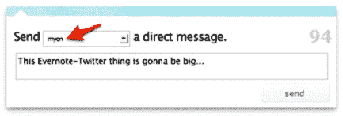

**图 11–3.** 向`@MyEN`发推

#### 短信笔记

得益于 Twitter 内置的短信支持，`Evernote`用户可以在全球大多数国家通过移动手机向`Evernote`发送笔记。在美国，Twitter 的短代码是`40404`。向`40404`发送包含命令`d myEN`的消息，会指示 Twitter 创建一条直接发送给`@myEN`的私信，就像从 Twitter 客户端操作一样。命令附带的文本将作为新笔记存入你的默认笔记本。

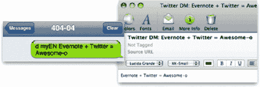

**图 11–4.** 通过 Twitter 的短信支持添加`Evernote`内容

#### 添加 TwitPics

`Evernote`还使向绑定`Evernote`的推文中添加图片变得简单。为此，`Evernote`支持`TwitPic` URL。如果你撰写一条包含`TwitPic` URL 的`@myEN`推文，`Evernote`中将会显示照片的缩略图，同时笔记正文中会包含一个指向全尺寸图片的`TwitPic`链接。

### Waze

由于 iOS 没有预装逐向导航应用，提供驾驶导航的应用市场广阔。其中最好的一款是`Waze`，它采用了一种比某些竞争对手更趣味化的导航方法（参见图 11–5）。`Waze`在你的高速公路地图上添加了一种游戏层，通过奖励积分来鼓励你报告事故、新道路、危险、测速摄像头以及其他不断变化的路况特征。


**图 11–5.** `Waze`是一款受欢迎的 iOS 交通应用，使用 Twitter 作为其通知基础设施。

早期版本的`Waze`允许用户发布关于交通困境的推文，近乎实时地收集这些信息以创建动态路况地图。现在，`Waze`扫描 Twitter 上所有关于交通堵塞的数据，无论发推的人是否拥有`Waze`账户。这意味着，即使非`Waze`用户发推说自己被困在施工交通中，你的`Waze`应用也会在地图上显示该用户的警告（假设该用户在推文中附加了位置信息）。已经使用`Waze`的用户被鼓励使用标签`#wazelive`发布更新推文，以确保系统能够捕获它们。

这就是 Twitter 所说的，应用应该努力利用从 Twitter API 获取的数据来构建新体验的含义。你无法在`Waze`的任何地方找到 Twitter 时间线或关注者/关注列表。相反，该应用利用搜索和消息功能，在你所在区域的交通中创建一个真实的 Twitter 用户地图。

`Waze`还集成了 Facebook 和 Foursquare 的 API，让你可以查看在你行驶区域是否有朋友。如果你愿意，还可以在应用内部签到你的目的地场所。

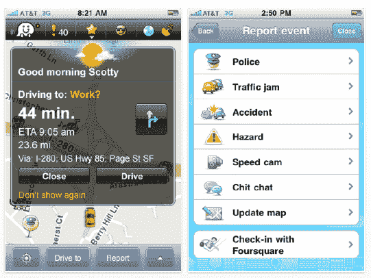

**图 11–6.** `Waze`用户界面，几乎看不出 Twitter 或 Facebook API 的痕迹。

### Facebook Apps

制作一个集成 Facebook API 的有用应用比集成 Twitter 要困难一些，仅仅是因为 Facebook 的普及及其文档完善的 API 使其成为开发者非常热门的选择。尽管如此，仍有一些应用脱颖而出；即使它们并非完美无缺，也体现了 Facebook 所说的优秀 API 集成应具备的特质。

让我们先回顾一下本章前面提到的 Facebook 设计原则：

*   **构建社交性和参与性强的应用：** 换句话说，优先考虑与其他用户的沟通和互动。
*   **给予用户选择和控制权：** 当某些内容将要发布或与他人分享时，务必充分告知用户。
*   **帮助用户分享富有表现力和相关的内容：** 能够上传用户照片、视频和网络链接的应用被视为比不能这样做的应用更优秀。


### Fone

`Fone` 并非一款完美的应用，但它是一个相对简单的项目，实现了 Facebook 应用本身不擅长的功能。`Fone` 将 Facebook 的即时通讯和语音通话功能移植到 iPhone 上，打造了一款替代系统标准电话应用（Phone 应用）的 Facebook 替代品（参见图 11–7）。（官方 Facebook 应用内部并未提供语音通话功能。）


**图 11–7.** *Fone 并非一款完美的应用，但它通过语音通话的形式，为 Facebook 的聊天体验增添了一些价值，并且在很大程度上避免了过度模仿 Facebook 的风格。*

由于这款应用旨在连接用户，它遵循了 Facebook 的可用性原则。同时，它巧妙地运用视觉元素来传达其功能（参见图 11–8）。蓝色调让人联想到 Facebook，但图标设计又明确告知用户这是一款通话应用。尽管主色调是蓝色，但这里几乎看不到任何 Facebook 品牌的痕迹。仅凭其独特的排版设计，以及卡片式界面（无疑借鉴了 iOS 自带的天气应用），就能让用户清晰地意识到自己并非身处一款 Facebook 品牌的应用中。


**图 11–8.** *Fone 在传达自身功能方面做得相当出色。*

### Flipboard

`Flipboard` 是一款备受欢迎的 iPad 阅读器应用（参见图 11–9）。它的核心假设是，你添加到 Facebook 个人主页或 Twitter 时间线中的大部分内容，都源自博客、杂志和社交图谱等在线来源。这款应用专注于内容本身，让你可以阅读 RSS 订阅源、Facebook 和 Twitter 新闻，以及你钟爱的在线杂志。同时，它也方便用户将这些内容分享给自己的好友圈。


**图 11–9.** *Flipboard，这款广受欢迎的 iPad 新闻阅读器应用，完美集成了 Facebook API。*

`Flipboard` 允许用户在杂志界面的任何位置发布状态更新、推文和照片（参见图 11–10）。


**图 11–10.** *Flipboard 让你以一种不同于任何 Facebook 网站或应用的形式，来消费你的 Facebook 新闻推送。*

`Flipboard` 的创始人兼首席执行官 Mike McCue 在该应用最新版本发布时，精辟地阐述了优秀社交 API 项目的特质，他说^(2)：

> *“你在社交网络中联系的人们，正逐渐成为对你至关重要的新闻和信息的策展人，这是我们在 Flipboard 中日益重视的一个重要原则。我们的许多读者使用 Google Reader 和 Flickr 来获取由他们信任的人策划的新闻和照片。这些社交网络的全面集成，让我们朝着实现社交杂志愿景又迈进了一步，将你关心的一切都汇集到一个地方。”*

换句话说，`Flipboard` 不仅仅是一个单向的阅读器应用。它让你在同一个地方消费和创作内容，并围绕着你从别处获取的内容进行互动。简而言之，正是像 `Flipboard` 这样的应用，为 Facebook 的生态注入了新鲜活力，使我们的新闻推送不至于变得千篇一律。

### 总结

关于 Twitter 和 Facebook API 集成的规则可能比你预想的要多；其中一些规则甚至让我们也感到惊讶。虽然违反大部分规则可能不会让你陷入法律纠纷，但如果你不遵守它们的规则，Twitter 和 Facebook 很可能会联系你，要求你重新设计应用，否则将失去对其 API 的访问权限。由于前文内容较为密集，我们为你准备了一份备忘单，可以在评估应用创意时使用。

__________

² [`http://flipboard.com/press/flipboard-new-edition`](http://flipboard.com/press/flipboard-new-edition)

首先，这是 Twitter 的主要规则备忘单：

*   不得使用 Twitter API 来监控 Twitter 任何产品和服务的可用性、性能或功能。
*   不得以暗示 Twitter 背书、赞助或虚假关联的方式使用 Twitter 标识。
*   不得使用或访问 Twitter API 来聚合、缓存（作为推文一部分的情况除外）或存储 Twitter 内容中包含的地理位置信息。
*   不得让你的客户端（client）框架化或大量复制 Twitter 服务的重要内容。你应该使用 Twitter API 来展示 Twitter 内容（即，不要创建像 Twitter 应用那样运行的新 Twitter 客户端）。
*   维护推文的完整性。尽管推文只有 140 个字符长，但其中包含大量信息。Twitter 视觉设计指南请参见第 13 章。
*   在代表用户发送推文或其他消息之前，务必获得许可。用户通过你的应用进行身份验证这一事实，并不构成你代表其发送消息的同意。
*   务必在你的服务中显示隐私政策。清楚说明你将如何处理从用户那里收集到的信息。
*   当你向用户的推文中添加位置信息时（无论是作为地理标签还是注释数据），都必须明确告知。
*   不得以可能误导、混淆或欺骗用户的方式使用商业名称和/或标志。关于 Twitter 标识使用的更多信息，请参见本章后面的商标规则。
*   为没有 Twitter 账户的最终用户提供创建新 Twitter 账户的机会。
*   仅显示在 Twitter 上自然呈现的操作。
*   不要让用户将你的广告误认为是推文。例如，广告不能包含诸如转发（ReTweet）、收藏（Favorite）或回复（Reply）等推文操作。

其次，这是 Facebook 的主要规则备忘单：

*   专注于用户生成、用户授权内容的真实分享。
*   始终询问用户是否想要发布 Feed 故事；不要自动发布。此外，仅在用户执行了可能与奖励相关的真实操作后，才提供发布故事的选项。
*   切勿预先填写与以下产品相关的任何字段，除非用户之前在流程中手动生成了该内容：Stream 故事（`Facebook.streamPublish` 和 `FB.Connect.streamPublish` 的 `user_message` 参数，以及 `stream.publish` 的 `message` 参数）、照片（说明）、视频（描述）、笔记（标题和内容）或链接（评论）。
*   不要将 Facebook 消息作为应用与用户直接沟通的渠道使用。
*   不要仅仅因为用户赞了你的主页就自动给予奖励。如果你想以某种方式奖励粉丝，你应该明确说明，赞了你的主页后，新老粉丝都有资格获得当前和未来的奖励。
*   切勿让你的应用自动在照片中标记用户或其好友。
*   只有在获得被标记用户明确同意的情况下，才能标记照片。请注意，你只能标记图像中准确描绘的内容。
*   不要向用户提供一次发布多个 Stream 故事的选项。

## 第 12 章


## 社交类 iOS 应用的 UI 设计与体验指南

在上一章中，我们讨论了 Facebook 和 Twitter 以“保护用户体验”为名制定的所有规则和条例。当然，这些指南仅涉及那些可能给平台带来负面影响的方面。本章将提供一些指导，帮助你打造一款不仅在字面上合规，而且实际上直观易用的应用。

如果你是第一次设计 iOS 应用，本节是必读内容。它将涉及苹果人机界面指南（HIG）中的几个部分，这些部分对社交应用尤为重要。它还将告诉你如何正确运用视觉和交互设计，避免用户困惑和商标冲突。遵循这些规则，你将获得用户的良好反馈——并且不会受到 Twitter 和 Facebook 平台代表的刁难。

作为作者，我们认为最好的 iOS 应用通常会遵循苹果的 HIG，除非它们有意偏离以改进界面。换句话说，我们认为最好的设计应当胜出，开发者可以并且应该互相借鉴最佳的交互方式，以期创建出自然的 UI 标准。

我们想表达的核心是：如果你要获得打破规则的力量，掌握规则至关重要。如果你之前设计过应用，那么本章是可选的。不过，你可能还是想快速翻阅一下，以回顾某些范例。

### Facebook 与 Twitter 的 UI 基础

本章从 iOS 社交应用设计的一些非常基础的建议开始。官方的 Twitter 和 Facebook 应用（以及它们庞大的现有应用开发者群体）已经标准化了这些应用的交互和视觉设计，因此用户对你设计的任何 UI 都有极高的期望。遵循本章的建议将帮助你善待用户，并避免触犯我们在第 11 章中讨论的所有规则所带来的麻烦。

首先，这里有两条基本建议：

-   在设置过程中谨慎处理账户。
-   允许用户在你的应用中通过 Twitter 和 Facebook API 集成进行注册、登录和退出。

我们先来看一下如何在设置账户时处理账户。仅仅因为用户尚未登录就显示错误或空白视图，会造成糟糕的用户体验。我们不愿针对任何人，但这里有一个我们在 App Store 上找到的匿名 Twitter 应用。启动时，它看起来就像图 12-1 所示。

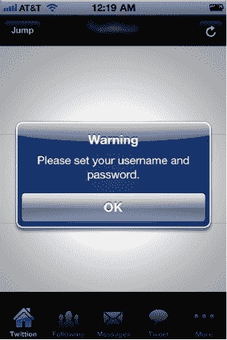

**图 12-1.** *错误信息绝不应该是用户在应用中看到的第一样东西。*

在首次启动时向用户显示“警告”这一错误信息，是一种非常糟糕的应用介绍方式。更糟的是，如果你点击确定，并且没有在此应用中输入账户信息（在本例中，隐藏在“更多”“配置”中），那么下次启动应用时，你只会得到一个空白的时间线。同样，这也是一种处理用户账户的糟糕方式。

在 Twitterific 中可以看到一种更好的启动序列处理方式（见图 12-2）。这个应用也恰好是我们第二条——可能显得过于基础——建议的一个良好引子。

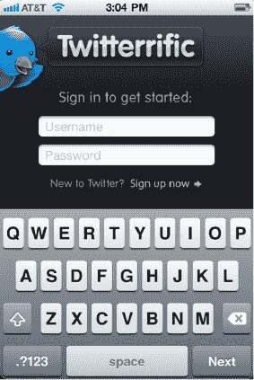

**图 12-2.** *Twitterific 的注册屏幕呈现得十分得体。*

也就是说，你应该允许用户在你的应用中通过 Twitter 和 Facebook API 集成进行注册、登录和退出。两个平台都要求你这样做，并且对用户公平也要求你贯彻执行。同样，你的应用应该具备处理手机启动时处于离线状态或在登录过程中网络连接失败等场景的能力。

#### 注重细节：从图标开始

设计在 iOS 上至关重要，因此你必须对视觉资产的细节给予一丝不苟的关注。我们将从确保你了解图标设计的适当尺寸开始。这是你的应用面向世界的名片，因此，如果它要在 Retina 屏幕上看起来很棒，就必须有正确的尺寸。

以下是 iPhone 和 iPod 的适当图标尺寸：

-   iPhone 4 图标：`114x114px`（旧的 iPhone 图标标准分辨率为 `57x57`，这是最低可接受尺寸）。
-   App Store 图标：`512x512px`
-   聚焦搜索：`29x29px`
-   iPhone 4 聚焦：`58x58px`

下表是苹果要求的图标尺寸。

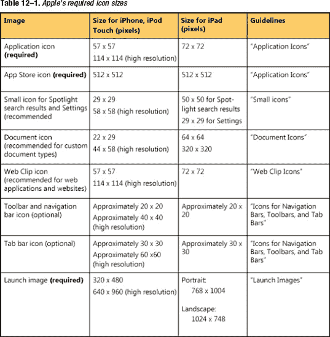

你需要制作的最大视觉资产是 `512 × 512` 像素。这是应用在 iTunes Cover Flow 中查看或位于 App Store 顶部横幅上时显示的图像。通常，所有图标设计都从 `512` 像素开始，然后调整到所需尺寸。简单地将单个图标缩小到其他尺寸会导致图标模糊。

**注意：** 所有图像和图标都推荐使用 `PNG` 格式。图标和图像的标准位深是 `24` 位（红、绿、蓝各 `8` 位），外加一个 `8` 位的 alpha 通道。虽然你可以在导航栏、工具栏和标签栏的图标中使用 alpha 透明度，但请不要在应用图标中使用此功能。你不必局限于 Web 安全色。

以下是 iPad 的标准应用尺寸：

-   应用图标：`72x72px`
-   App Store 图标：`512x512px`
-   聚焦搜索：`50x50px`
-   设置图标：`29x29px`

**注意：** App Store 只接受图标为 `PNG` 文件的应用。

你无需为图标添加光泽；这会自动完成。如果你想要未经修饰的外观，可以使用一个布尔开关来切换光泽效果。

应用图标的圆角也是如此：让你的图形保持直角边，它们将自动被裁剪为圆角。


### 展示各类反馈

反馈被定义为任何表明某个进程正在进行的声响、振动或视觉指示器。显示反馈非常重要，尤其是在触摸设备上，因为操作屏幕上的物体时缺乏触觉感受。当你的应用主动执行某些操作（例如自动加载新推文）时，显示反馈同样至关重要。

苹果公司表示，用户的每一个操作都应在屏幕上产生某种可感知的变化——即使只是按钮被按下时的阴影。苹果还要求，当某项操作耗时超过几秒钟时，你应该显示一个活动指示器。

另一种反馈形式是动画。推特公司表示，动画有助于“提升可读性”，而苹果的`HIG`则指出，这些动画应当“微妙且恰当”，并服务于以下目的之一：

-   传达状态。
-   提供有用的反馈。
-   增强直接操控的感知。
-   帮助用户可视化其操作的结果。

苹果警告你要谨慎使用动画，因为无端使用时，动画容易让人感到厌烦。另外一点：苹果表示，你应努力使动画与 iOS 内置应用中的动画保持一致。

然而，在实践中，许多开发者为了在他们认为的特定交互上做出改进，而背离了苹果对动画的使用。一个例子是由官方推特应用开发者首创的“下拉刷新”指示器，它已被开发者（包括 Facebook 的开发者）反复复制。你可以在图 12-3 中看到它的实际效果。


**图 12-3.** *Facebook 应用向用户显示正在加载新信息。*

请注意，单个开发者的创新能如此广泛传播是不同寻常的，因此你不太可能通过推翻一些非常常见的系统动画，在 iOS 设计史上留下你的印记。但如果你坚信你的应用有理由偏离`HIG`和 App Store 的设计精英们设定的标准；那么，尽管放手一试，看看在测试中能得到什么样的反馈。

还要注意，*更新*指示器与应用在发布“墙上帖子”时使用的活动指示器是不同的（参见图 12-4）。在后一种情况下，使用一个简单的 iOS 活动指示器来表明“下拉释放”刷新控件已被激活，并且帖子正在刷新。（关于当手机离线时你的应用应如何处理，可以阅读第 8 章的内容。）


**图 12-4.** *Facebook 的进度轮*

在 iOS 中，声音是次要的反馈媒介，因为苹果认为存在太多场景（比如环境太嘈杂）使得反馈无法被用户察觉。振动是一种更可靠的反馈机制，但它应该只用于最重要的通知。而且，振动频率也不能太高。用户必须能够将其关闭。

Facebook 让你可以选择同时使用声音和振动。它还与“摇动刷新”功能一起使用了手机中的加速计输入（参见图 12-5）。

**注意：** Facebook 遵循了苹果的设计指南，将这些反馈偏好设置放在了系统“设置”应用的一个面板中。有关偏好设置的更多信息，请参阅本章后面的“以标准方式呈现设置”部分。

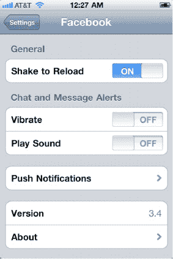

**图 12-5.** *Facebook 将一些“一劳永逸”的偏好设置保留在系统“设置”应用中。*

### 触摸目标与文本

iOS 中触摸目标的最小尺寸是 44 × 44 像素。务必在控件之间留出足够的间距；并且，正如我们在上一节中所说，不要把屏幕挤满控件。例如，我们喜欢 TwitHit 将核心任务置于屏幕正中央的方式，如图 12-6 所示。


**图 12-6.** *TwitHit 清晰突出了主要任务。*

请记住，让你所有的控件都可点击，并注意它们的标签。你可以在接下来的章节中找到关于标签命名以及商标和图标使用的指导。

### 原型设计与测试

苹果强烈建议在将你的应用提交到 App Store 之前进行用户测试。这在社交应用设计中尤其重要。如果你正在构建使用 Facebook 或 Twitter 的应用，务必下载其他使用这些 API 的应用（本书中已讨论过许多这样的应用）。看看它们如何处理某些操作，以及如何在视觉上区分自己。同时，询问你的朋友和同事他们喜欢其他哪些应用的哪些功能，然后让他们反馈来指导你的设计流程。在精细调整应用方面，Xcode 非常灵活，你可以轻松地进行几次迭代以把事情做对。

### 用户希望从你的应用中获得什么

以下是你在设计应用时应优先考虑的七个基本方面：

-   内容
-   逻辑路径
-   清晰的设置
-   品牌标识
-   简洁
-   许可协议
-   适应 iPad 的设计

在接下来的章节中，我们将逐一审视这些设计原则，以及你如何在你的应用中利用它们。

#### 内容

Facebook 和 Twitter 都围绕两个核心任务展开：在广阔的*社交图谱*中消费和创建内容。

如果你的应用能够发布内容，它应该为用户提供一个干净、宽敞的界面来输入文本或媒体，文本框内或周围不应有大量其他控件。虽然它不是纯粹极简主义的设计，但我们喜欢 TweetBot 呈现“创建推文”的方式。

如果你的应用从 Facebook 或 Twitter 的 API 获取信息，应该以恰当的方式呈现。对于照片，这意味着你的应用应以全屏显示，并带有半透明的控件，且在不使用时自动消失。对于文本，这意味着要使用清晰易读的字体。

#### 逻辑路径

官方 Twitter 和 Facebook 应用在复杂性上可能会让人感觉像迷宫；然而，它们处理得很好。Twitter 通过一个动态的应用程序栏来管理其复杂性，而 Facebook 则通过其“网格”UI 来实现。但是，正如我们将在本章后面讨论的，如果你的应用很复杂，你无法复制这两种策略。请继续阅读，学习如何围绕 Twitter 和 Facebook 的内容设计交互。

#### 清晰的设置

苹果表示，开发者应避免将应用的设置放在应用本身内部；相反，他们应该选择在系统“设置”应用内提供一个设置面板。然而，许多同时使用 Facebook 和 Twitter API 的热门应用并未遵循这一惯例，通常是因为它们觉得系统设置的 API 限制太多。我们建议的折中方案是：将“一劳永逸”的选项放入“设置”应用，而将更常用到的选项放在你的应用内部。如果用户需要离开你的应用去编辑账户信息或调整视觉显示选项，许多用户会感到不耐烦。

官方的 Facebook 应用实际上遵循了我们刚才描述的惯例，而 Twitter 应用则在其应用内部的几个屏幕中处理所有设置（参见图 12-7）。

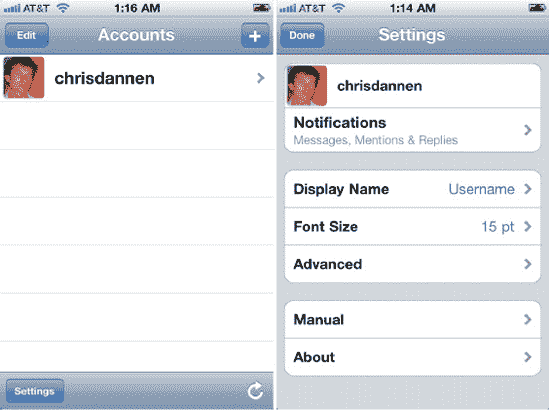

**图 12-7.** *Twitter 在其应用内部处理偏好设置。*

#### 品牌标识

你应该使用色彩、样式、定制的艺术设计和动画，来打造专属于你应用的独特外观和感觉。这就是用户如何将你与其他开发者区分开来，以及如何将你的应用与竞争对手的应用区分开来的方式。

#### 简洁

用简短、具体的术语来标注事物。如果你无法为某个控件想到一个合理的标签，可以考虑使用苹果的系统图标之一，或者使用用户能从 Facebook 或 Twitter 平台理解的符号。也要考虑添加许可协议或免责声明。


#### 许可协议

好吧，用户可能不想要许可协议。但推特和脸书都表示，他们要求开发者向用户展示许可协议。需要说明的是，苹果公司表示这是可选的，因此我们建议稳妥行事，编写一份协议。如果你确实包含最终用户许可协议（EULA），不要在首次启动时要求用户同意。（不过，在首次启动时，确实需要请求用户授权使用其位置信息和推送通知。）相反，你应该让用户有机会先试用应用，然后再要求他们接受你的条款，或者将条款放在应用的“设置”面板中。

##### 合适的 iPad 设计

如果你正在为 iPad 开发应用，请记住要避免在应用的导航栈中创建复杂的层级或嵌套标题。同时，记得对模态任务使用弹出控件，并将工具栏内容移至屏幕顶部。

#### 让使用变得轻松直观

正如我们在本章引言中所说，iOS 设计应始终将易用性和易学性放在首位。据苹果公司称，你可以通过以下方式确保遵循这一原则：

*   将控件集缩减到仅保留最常用、最有用的一组。对于额外选项，使用“更多”按钮或系统标准的“操作”按钮。
*   恰当且一致地使用标准控件和手势，使其行为符合用户的预期。
*   清晰标注控件，让用户确切了解其功能。

在 iOS 应用中，这比看起来要棘手。用户已经从使用官方的推特和脸书应用中习惯了数十种不同的用户界面范式。当他们使用你的应用时，他们对控件的名称、标签的命名方式以及应用的核心功能抱有特定的期望。

因此，努力使用正确的术语并避免偏离标准交互方式非常重要。在第 13 章和第 14 章中，我们将深入探讨术语、商标及其他品牌元素的正确使用。

### 结论

现在我们已经回顾了优秀社交应用设计的基础，如果你从未阅读过苹果公司的人机交互指南，不妨考虑翻阅一下其余部分。

准备就绪后，请继续阅读接下来的两章，你可以分别将其视为针对推特和脸书的人机交互指南。

## 第 13 章

## 推特 UI 设计

由于 iOS 上已经存在大量推特客户端，因此在创建应用时，你需要注意一些已经存在的设计范式。

本节将讨论我们认为应避免、修改或借鉴的视觉、导航和交互范式。

### 易用性优先级

如果你要设计一个用户体验良好的推特 API 项目，应首先明确优先级。对于大多数推特 API 项目而言，这意味着将最多时间和精力投入到以下方面：

*   *加载与滚动*：如今官方的 iOS 推特应用源于 Tweetie，这是一个专注于一个关键功能的单人项目：快速滚动推文。由于推文是大多数推特应用的核心，因此应确保列表、内容和推文加载尽可能快速流畅。
*   *使用图片、网址缩短器和地理标记*：如果你的应用可以创建推文，这三个功能已成为标准，并且在任何创建推文的地方都应具备。
*   *让用户留在应用内*：推文关联着操作和内容的架构：图片、联系人、网址、转发、@回复等。尽量在应用内处理所有相关操作，避免使用“网页”视图或启动系统应用。将用户从应用中弹出会让他们感到困惑，并降低操作速度。
*   *首要尊重隐私*：未经作者许可，不要打印推文。使用内部运营的真实账户中的真实推文，或经用户许可显示的推文。在展示示例内容时，始终使用你自己的推特个人资料截图（包含你自己的推文）。

#### 推文的结构

推特对于如何显示推文有非常具体的要求。事实上，它甚至明确规定在撰写像本书这样的书籍时，应将“推文”（Tweet）首字母大写。你可以从推特的“推文结构”图示中了解其对推文显示方式的期望，该图示来自以下网址（见图 13-1）：

`http://dev.twitter.com/pages/display_guidelines`

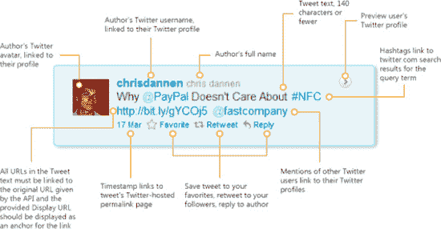

**图 13-1.** *根据推特官方设计指南的“推文结构”*

让我们更深入地审视图 13-1 中所示的所有元素：

1.  *推文作者*：推特要求你必须显示用户的推文句柄；不过，在句柄旁边显示用户的真实姓名是可选项。点击用户名应链接到该用户的推特个人资料，最好在应用内打开。推特设计指南规定，用户名和真实姓名（如果显示）应采用不同的样式。不要在用户句柄前加“@”符号。
2.  *@提及*：推文中对其他推特用户的提及应链接到其用户个人资料。点击该用户名应跳转到该用户的个人资料，最好在应用内完成。
3.  *话题标签*：如果用户在推文中包含话题标签，它应链接到应用内针对该查询词在 `Twitter.com` 上的搜索结果。
4.  *网址*：推文中的网址应显示为可点击的超链接，指向通过 API 传递的地址。
5.  *品牌标识*：如果你的应用在推特时间线或其他相关上下文之外显示单条推文，推特要求你在图片某处放置推特文字商标或推特小鸟图标。如果你在推特时间线或其他相关上下文之外显示一组推文，推特要求你在附近放置“来自推特的内容”字样。你将在本章后面了解更多关于推特小鸟和文字商标的信息。

请注意，推特表示，如果你通过电子邮件请求批准，这些规则可以有例外。请将你的请求发送至 [`trademarks@twitter.com`](http://trademarks@twitter.com)。

在编写推文时，你应注意图中未展示的几个额外元素：

1.  *推文输入框*：用于编写新推文的视图应始终显示“发生了什么？”提示。
2.  *推文按钮*：如果你的应用仅将内容发布到推特，执行该任务的按钮应标注为“推文”。如果帖子同时发送到推特以外的其他服务，按钮应标注为“更新”。
3.  *字符计数*：每个空白的推文输入框都应有一个可见的字符计数器，从 140 个字符开始倒计数，显示剩余可用字符数。


# 建议组件

除了前面的“要求”之外，Twitter 还提供了一系列建议性的设计指南，你可以选择遵循（或不遵循）。以下部分复述了 Twitter 的官方建议，并结合了一些无视这些建议反而效果更佳的应用程序实例进行了权衡：

- **头像与对齐方式**：Twitter 希望开发者将用户头像显示在推文的左侧。推文的其他内容则应在头像右侧立即左对齐。头像链接指向 `http://twitter.com/username` 处的用户 Twitter 个人资料。

- **反例**：Tweetbot 是 App Store 中视觉上最具特色的 Twitter 客户端之一，它选择将头像放在推文下方（参见图 13–2）。但效果很好。


**图 13–2.** *Tweetbot 以一种非传统的方式呈现推文详情，我们认为效果不错。*

- **时间戳与固定链接**：“此信息可以相对显示（例如‘2 分钟前’）或绝对显示（例如‘7 月 8 日上午 8:45’）。时间戳应单独成行，位于推文文本之后，并采用不同的样式以使其不如推文文本显眼（颜色更浅和/或字号更小）。时间戳还应链接到该条推文在 Twitter 上的固定链接页面。”

- **反例**：Twitterific 在技术上遵循了这一建议（参见图 13–3），但只是勉强做到：时间戳的字号仅比推文字号小大约 1pt。不过，时间戳与推文之间的间距足以形成区分。将时间戳放在推文上方，能够优先呈现上下文。

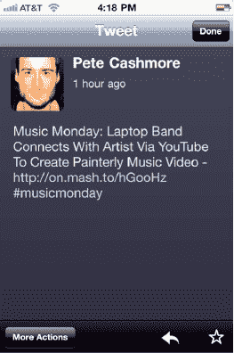

**图 13–3.** *Twitterific 以传统方式呈现推文详情。*

- **推文操作**：“回复、转推和喜欢操作应始终可从一条推文中访问，并应使用各自对应的操作图标显示。它们应按从左到右的顺序排列，依次为回复、转推、喜欢。”

- **反例**：*几乎所有集成了 Twitter API 的应用程序都以不同的方式呈现这些推文操作。我们喜欢 Twitter 的建议，但有时隐藏较少使用的控件可以使界面更简洁。图 13–2 中的 Tweetbot 和图 13–3 中的 Twitterific 都分别采用了这种做法。*

- **来源**：“除了时间戳和固定链接，你可以选择显示发布推文的客户端或方式（例如‘来自网页’或‘来自 Twitter for iPhone’）。如果提供了客户端，请确保它链接到所提供的来源页面 URL。”
  - **反例**：这仅在你的项目以 Twitter 为中心时相关。如果你的应用更关注特定推文的内容（而非完整的 Twitter 体验），那么你可能不需要在推文中附加客户端信息。Tweetbot 会这样做（参见图 13–2），而 Twitterific 则不会（参见图 13–3）。

- **多条推文**：“如果同时显示多条推文，可以通过水平线、空白区域或交替的背景颜色在视觉上进行分隔。空白区域应与推文本体的整体高度成比例。”

- **反例**：我们认为这条指南不应是可选的。很难想象在什么情况下将推文呈现为离散项目列表之外的形式会是合适的。Twitterific 对推文的呈现效果很好（参见图 13–4）。

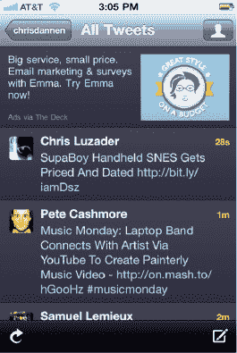

**图 13–4.** *Twitterific 的时间线*

- **时间顺序**：“通常按时间倒序（最新的在前）排列推文是有意义的，但我们理解这并不总是最相关的排列方式。当作为搜索结果或按其他条件（关键词、用户或其他编辑约束）显示时，推文可按这些条件排序。”

- **反例**：实际上，在 App Store 上很难找到一个不按时间先后（而是按其他标准）排序推文的 Twitter API 项目。搜索是唯一显著的例外。

## （不）使用 Twitter 的颜色

颜色是用户识别你应用功能的主要方式，也是将自己与 Twitter 平台关联起来的一种直观方法。然而，Twitter 非常希望你能尽量减少使用其调色板以及其商标化的徽标、按钮、术语和图标。

因此，Twitter API 项目的设计者并不像 Facebook 开发者遵循其平台配色方案那样，对 Twitter 的配色方案亦步亦趋。或许是希望避免惹怒 Twitter，Twitter API 应用在图标和徽标的使用上往往更加多样化。

供参考，你可以在图 13–5 中找到一些 Twitter 自身排版和徽标艺术的例子。这些按钮在网页上使用没问题，但不要在你的 iOS 应用中使用它们——除非它们链接回 Twitter.com，或者用于指示与 Twitter 的兼容性。如果你无视这些要求（在下文“使用 Twitter 商标”一节中有所总结），你可能会遇到一些麻烦。如果你想使用鸟类主题或相关素材，你需要自己设计或提供。


**图 13–5.** *你可以在网站中使用 Twitter 的网页按钮——但不能在你的 iOS 应用中使用，除非在特定情况下*

### 创建主题元素

根据你的应用功能对 Twitter API 的依赖程度，你可能会发现应用看起来与官方 Twitter 应用过于相似。

这就是 Twitter 给设计者指出这一点原因：你应该使用独特的品牌和徽标来设计你的站点。

Twitter 还要求你遵守以下事项：

- **不要** 复制 Twitter 的外观和感觉。
- **不要** 使用任何非最新版本的 Twitter 徽标（在适当的情况下）。
- **不要** 未经明确许可使用 Twitter 网站上的任何其他艺术作品。
- **务必** 使用 Twitter 的徽标创建你自己的按钮或标记。

供参考，图 13–6 展示了官方 Twitter 应用的各个方面，包括时间线（最左侧图片）、一条推文（中间图片）和用户个人资料（最右侧图片）。你需要创建你自己的视觉设计和交互设计，不要模仿此图中所示的设计。


**图 13–6.** *官方 Twitter 应用 UI，你不应模仿它*

## 使用 Twitter 商标

Twitter 为使用 Twitter API 的开发者发布了一份关于其商标的“应做与不应做”清单。^(1) 以下是对相关要点的总结和分析。

你*可以*执行以下操作：

- 使用当前的 Twitter 徽标或当前的 Twitter 小鸟标志作为指向 Twitter 服务的链接。
- 使用当前的 Twitter 徽标或当前标志来表明你的产品与 Twitter 兼容。
- 确保在提及*推文*（例如，“使用 Twitter 发推”）时包含对 Twitter 的直接引用，或者在显示 Twitter 标志的同时提及*推文*。
- 对徽标进行操作，除非由于你的应用中固有的颜色相关限制（例如黑白 iOS 工具栏）而必须这样做。

你*不得*执行以下操作：

___________________

¹ `http://support.twitter.com/entries/77641`

- 以可能暗示虚假的合作伙伴关系或对你的品牌进行背书的方式使用这些标志。
- 以任何方式扭曲或篡改 Twitter 标志。
- 以一种使 Twitter 品牌与其他品牌混淆的方式使用标志。
- 使用 Twitter 小鸟作为代言人来承载你的徽标或消息。


# App Store 中的广告宣传

Twitter 对在 App Store 中进行广告宣传也有以下准则：

- *可以*使用未登录状态的 Twitter 首页、Twitter 关于我们页面，甚至是 `@twitter` 个人资料页的截屏。
- *不要*在未经他人许可的情况下，使用他人的个人资料页或推文截屏。

# 我们并不了解你

Twitter 还要求你遵守以下准则：

- 在提及 Twitter 服务或公司时，请使用 *Twitter*；在提及 Twitter 服务上的消息或更新时，请使用 *推文*（首字母*大写*）。
- 不要对 Twitter 服务做出不准确的陈述。（这还用说！）
- 不要以暗示合作或背书的方式来提及 Twitter。

## Twitter 的导航范式

Tweetie 是如今官方 Twitter 应用的前身，其创造者 Loren Brichter 最初构想该项目时，只想做一个简单的滚动项目。正如他在 2009 年所说，他并没有对 Tweetie 做任何特别的事情，只是让它快速运行，并遵循了苹果人机界面指南（当时尚未更新 iOS 版本）的精神：^(2)

> *大约在同一时间，他与 Verizon Wireless 的合约到期了，并最终买了一部 iPhone。他开始搜索 App Store。“我发现根本没有好的 Twitter 应用，”他回忆道。“但糟糕的应用却有好几亿个。”他觉得自己能写一个更好的应用。“是什么触发了我去做这件事呢？我曾经用过 Twitterific，那时大家都在用。我想：为什么滚动速度这么慢？我能不能让它更快？”一个小时内，他就构建了一个快速滚动推文列表的原型。然后，经过两周疯狂的编码，他构建出了 Tweetie，如图 2-1 所示，截至本文撰写时，它是所有平台上最受欢迎的移动 Twitter 客户端，也是 iPhone 上最受欢迎的 Twitter 应用。*
>
> *“问题不在于其他应用如何使用 Twitter 的 API，而在于它们与 iPhone 操作系统交互的方式，”他说。“它们要么完全采用自定义方式，要么完全搞错了方向。”他的反感甚至并非针对 Twitterific，尽管它是 Tweetie 的直接催化剂。“说实话，我对 Twitterific 没什么意见，”他说。“它们是前一年的 ADA（苹果设计大奖）得主，大家都喜欢那个应用。只是它不符合我使用 Twitter 的方式。”*

____________________________

² 摘自 Chris Dannen 所著《iPhone Design Award Winning Projects》第 4 页 (Apress, 2009)

当 Brichter 从头开始将 Tweetie 重建成 Tweetie 2 时，他彻底重新构思了用户界面。一个令人惊讶的添加是在屏幕底部加入了一个动态应用栏。你可以看到这个应用栏在 图 13–7 的不同视图间变化。


**图 13–7.** *Twitter 的动态工具栏违背了 iOS 的惯例。左侧是用户个人资料页显示的工具栏；右侧是查看推文时显示的工具栏。*

与预装的 iOS 应用不同，Tweetie 2（后来成为官方 Twitter 应用）中的应用栏的图标会根据用户正在查看的内容而变化。当被问及为何在 Tweetie 2 中背离苹果的先例时，Brichter 说道：^(3)

____________________________

³ 同上。

> *采用应用全局标签栏是极其受限的。在 Tweetie 2 中，我优化的是导航堆栈的*深度*。通过一个根据当前上下文变化的、特定于屏幕的底部栏，你可以展示大量信息，而无需用户进行过多的层层下钻。*
>
> *苹果不这样做。事实上，他们不推荐我做我正在做的事情。虽然我认为 Tweetie 2 是一款非常优秀的、具有 iPhone 风格的 iPhone 应用，但我正在背离 HIG，因为我认为苹果的建议过于局限。一个浅层应用可以使用应用全局标签栏，但一个内容丰富、层级复杂的应用不行。而 Tweetie 2 正是后者。*
>
> *Tweetie 2 中的技巧让你无需通过点击……点击……点击……将大量视图控制器推入导航栈，就能探索海量信息。举个简单的例子，假设我在时间线中看到一条推文。有用户正向 Twitter 世界提问。我想查看回复。我可以滑动这条推文，点击用户详情按钮，然后在推送出的用户详情屏幕中点击 @ 标签页。这样我就能查看来自所有人的、对该用户的回复了，而距离我起始的视图控制器，仅仅相差*一个*层级。*
>
> *推文列表 -> 最近提及该用户的消息*
>
> *如果不针对导航堆栈深度进行优化，想象一下如果每个导航操作我都必须推送一个新的视图控制器：*
>
> *推文列表 -> 推文详情 -> 用户详情 -> 最近提及该用户的消息。*
>
> *这体验太差了。*
>
> *在 Tweetie 2 中，对于这些上下文相关的标签栏，我并没有使用普通的标签栏。我是用自定义代码绘制它们的。我希望它们看起来很熟悉，但又足够不同，这样用户就不会期望它们是标准的应用全局标签栏了。*

尽管 Brichter 的方式现在已成为官方 Twitter 应用的标准做法，但他并不推荐大多数 Twitter API 项目效仿。只是因为 Tweetie 试图复制 Twitter 网站的全部功能（甚至更多），才使得它变得足够复杂，需要一个动态应用栏。鉴于现在大规模复制 Twitter 功能违反了 Twitter 的开发者条款，Brichter 表示，在你的应用中很可能不需要遵循这个范式：

> *我不建议每个人都效仿我。Twitter 的信息*极其*丰富。很有可能大多数其他应用都足够浅层，使用应用全局标签栏或简单的逐层下钻就已经足够了。^(4)*

____________________________

⁴ 同上。

### Twitter 徽标与图标

Twitter 提供以下徽标和图标供下载，以便你在应用中恰当地展示 Twitter 品牌。（关于使用 Twitter 品牌素材的规则和准则，已在本章前文讨论过。）你可以通过以下网址下载 图 13–8 中显示的图形：

[`http://twitter.com/about/resources/logos`](http://twitter.com/about/resources/logos)

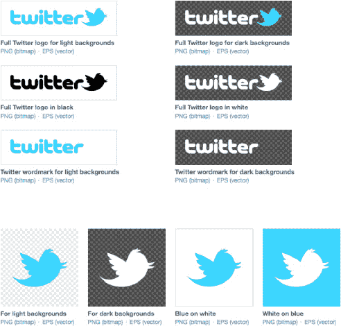

**图 13–8.** *Twitter 徽标与图标，请谨慎使用*

如前所述，Twitter 强烈不建议在第三方应用中使用其颜色和徽标。这一事实让许多开发者陷入困境，他们试图让图标准确地让人联想到 Twitter，却又不能直接引用公司本身。各种鸟类图案已成为 Twitter 客户端的标准配置（见 图 13–9）；但鉴于 Twitter 新条款不允许再出现新客户端，Twitter 在 App Store 中的可见度将变得更低。遵循这些准则，让你的 Twitter 图标设计独具特色，并与你应用的视觉设计相匹配。

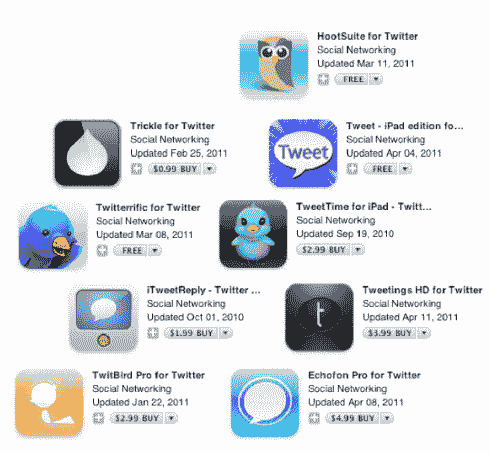

**图 13–9.** *App Store 中各种图标向 Twitter 品牌致敬的方式*


### 启动画面

在当今快速加载应用的 iOS 设备上，启动画面并非必需。但你应在多代设备上测试应用。如果较旧的 iOS 设备出现卡顿，请尝试通过编程手段优化加载时间。若底层优化已无余地，可考虑为应用添加启动画面来欢迎等待中的用户。这既能消磨等待时间，也能让您展示品牌形象、留下良好第一印象。如果应用加载需要一两秒以上，建议快速跳过启动画面，转而呈现功能受限的应用界面视图。同时，持续显示应用正在加载信息的状态，并在网络连接中断时及时通知用户。

### 视觉素材（即例外情况）

根据本章讨论的指南，图 13-10 所示的视觉指示器可供下载并允许在应用中使用。iOS 首选的 PNG 版本也以*精灵图*形式提供。要下载这些图形，请访问以下网址：

[`http://dev.twitter.com/pages/image-resources`](http://dev.twitter.com/pages/image-resources)

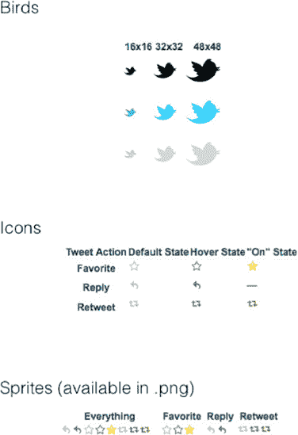

**图 13-10.** *Twitter 提供的精灵图，可供在您的应用中使用*

### 项目命名指南

Twitter 整理了在命名项目时引用 Twitter 的注意事项，本节将进行说明。¹

在命名项目并引用 Twitter 时，请遵循以下规范：

- 为网站、产品或应用取一个独特的名称。使用 *Tw-* 和 *Twit-* 前缀通常可以接受。
- 可在网站上说明您的应用构建于 Twitter 平台之上，以便用户了解产品背景。
- 仅在应用专门为 Twitter 平台设计时，才可在名称中使用 *Tweet* 一词。

*禁止*在命名项目并引用 Twitter 时出现以下行为：

- 在网站或应用名称中使用 *Twitter*。
- 单独使用 *Tweet*，或将其与简单的字母/数字组合搭配（例如 *1Tweet*、*Tweet* 或 *Tweets*）。
- 注册包含 *twitter*（或其拼写变体）的域名。
- 申请包含 *Twitter*、*Tweet* 或类似变体的商标。
- 如果应用与其他平台共用，则在名称中使用 *Tweet*。

### 离线展示指南

如果您正在开发某种 Twitter 可视化工具，或计划让应用通过 iPad 在更大屏幕上展示，则需遵循本节所述的离线展示要求。

例如，允许以下操作：

- 在推文播出期间，将 Twitter 徽标放置在推文附近。
- 确保 Twitter 徽标尺寸与内容比例合理。
- 为每条推文附带用户名。若涉及用户隐私或播出标准问题，需联系 Twitter 申请例外（除非已与 Twitter 达成事先协议）。
- 使用推文的完整文本。若涉及隐私或播出标准问题，需联系 Twitter 申请例外（除非已与 Twitter 达成事先协议）。

同时，以下行为*禁止*：删除、遮盖或篡改用户身份标识。在涉及用户安全等特殊情况下，可匿名展示推文。允许以聚合或可视化形式展示无归属的数据，但必须保留 Twitter 徽标。

要查看 Twitter 的完整离线展示和媒体播出指南，请访问以下网址：

[`http://support.twitter.com/entries/77641`](http://support.twitter.com/entries/77641)

### 通知处理

直到 2011 年春季，官方 Twitter 应用对通知的处理仍较为保守：仅在收到 `@reply` 或私信时才会推送提醒。整体而言，作者们认为这恰恰是 Twitter 应用所需的全部通知功能。

但在 2011 年 3 月，Twitter 推出了名为 *QuickBar* 的新功能，原设想为 Twitter 编辑团队提供一种方式，将热门话题（或付费推广推文）展示在用户时间线顶部。然而，这反而引发了用户的强烈不满，被戏称为 *Dickbar*。

对于一款堪称 iOS 设计典范的应用而言，这无疑是一个重大失误。各媒体纷纷批评 Twitter 的失策，舆论压力最终迫使该公司在后续更新中移除了 QuickBar。² Mac 开发者 Marco Arment 在其博客上的反应尤为犀利，生动诠释了优秀 iOS 应用的核心要素：贯穿每个屏幕的清晰目标定位。

请注意，在他批评文的结尾，他根据三个标准对 QuickBar 进行了评估：

- 我是否应该转发这个内容？
- 我是否应该保存这个搜索？
- 我是否应该阅读这些推文？

这些正是 Twitter 的核心功能，因此任何使用 API 的功能都至少应与其中几个方面有所关联。以下是 Arment 博文的编辑版本：³

> *Twitter 的官方 iPhone 应用（前身为 Loren Brichter 开发的 Tweetie，原本是一款出色的客户端）因最近添加的 QuickBar 功能招致大量负面反馈。该功能是在推文列表顶部强制显示热门话题横幅。许多人对此深恶痛绝，称其为“Dickbar”，并因此彻底弃用 Twitter 应用。*
> 
> *最初实现时，它作为浮动覆盖层出现在应用的所有操作界面之上，情况更糟。现在，它仅固定在主时间线顶部，并随列表滚动。但这仍然让大多数当初就反感它的人感到冒犯，因为让它随列表滚动并没有解决其强制存在且无法关闭的问题。*

¹ [`http://support.twitter.com/entries/77641`](http://support.twitter.com/entries/77641)

² [`http://blog.twitter.com/2011/03/so-bar-walks-into-app.html`](http://blog.twitter.com/2011/03/so-bar-walks-into-app.html)

³ [`http://www.marco.org/2011/03/20/why-the-quick-bar-dickbar-is-still-sooffensive`](http://www.marco.org/2011/03/20/why-the-quick-bar-dickbar-is-still-sooffensive)


> *推特新增快捷栏（QuickBar）的原因，推测是为了展示带有“推广”标签的广告。*
> 
> *如果它只展示这类广告，我认为用户的反应不会如此负面。更大的问题在于，它大部分时间都在展示随机“热门”话题或标签。以下是我在过去 24 小时内看到的几个话题：*
> 
> *洛瓦托与戈麦斯*
> 
> *克里斯·布朗冠军专辑*
> 
> *格斯·约翰逊*
> 
> *#关于我的 100 个事实*
> 
> *狼獾队*
> 
> *新势力（Cingular）*
> 
> *全球移动通信系统（GSM）*
> 
> *#密歇根州*
> 
> *它就像一个只显示单个词条的新闻滚动条，缺乏任何上下文，播放的大多是我不理解的话题。更糟糕的是，它出现在一个本应只包含我（间接）选择的内容的上下文中——我的推特时间线。*（我根据自己想在时间线上看到的内容选择了关注对象。）我对体育、名人或中学调查趋势不感兴趣，因此我不会关注那些用这些无关内容淹没我时间线的人。
> 
> *我选择关注的内容，以及……密歇根州。我甚至不知道这到底是什么意思。想必是发生了与密歇根州相关的新闻，而推特希望用户点击这个孤立无援的词语，原因却未向我们明确说明。*
> 
> *于是我点击了它。*
> 
> *我从上到下看到了：有意的垃圾信息、无意的垃圾信息，以及一个陌生人关于体育的、我毫不在意的轻浮无聊推文。*（我往下滚动，情况更糟了。）我猜“#密歇根州”是热门话题，是因为密歇根州某支体育队发生了什么重要事件。
> 
> *我该拿这条信息怎么办？*
> 
> *我应该就此发推文吗？如果是，界面为何不鼓励这样做？即使我从此屏幕点击（几乎看不见的）新推文按钮，我的推文也不会预填“#密歇根州”，因此我回应说的任何话都不会被收录其中。*
> 
> *我应该保存这个搜索吗（界面确实鼓励这样做），以便几天、几周或几个月后，当这个话题可能已不再连贯或有意义时还能看到？*（暂且不提它现在既不连贯也无意义。）
> 
> *我应该阅读这些推文吗？如果是，为什么没有采用更强的反垃圾信息措施或人工过滤机制来保持信息流的可读性？目前来看，它是一个巨大且极易被利用的垃圾信息目标，而且显而易见。*
> 
> *我们不知道推特添加快捷栏的真实原因。推测这是一个长期战略的一部分。但今天，从这里看来，它像一个考虑极其不周的功能，最初发布时实现得极其糟糕，似乎对用户没有任何益处。*
> 
> *这对我们来说如此刺眼，因为它与迄今为止我们熟知的推特太不一样了。推特的产品方向通常非常出色且深思熟虑，他们的实现通常是谨慎和周全的。*
> 
> *而在这个主要是由洛伦·布里希特在推特从他手中收购之前精心构建的应用背景下，我们习惯了布里希特更高的标准，这些标准曾让 Tweetie 在 2009 年赢得苹果设计奖。*（我怀疑他在快捷栏的存在、设计或放置上几乎没有话语权，这大概让他内心备受煎熬。）
> 
> *快捷栏令人反感，不是因为我们不希望推特通过广告赚钱，或者我们反对界面上的改变。*
> 
> *它令人反感，是因为它糟糕透顶，完全无视质量、产品设计和对用户的尊重，而我们对推特的期望远不止于此。*

#### 来自网页应用的设计技巧

推特面向触摸的移动网页应用中，有一些方面让其原生 iOS 应用相形见绌。我们喜欢它呈现推文操作选项（如转发、回复和收藏）的方式，无需滑动推文。编写推文无需操作按钮也很酷：你只需放置光标并开始输入即可。图 13–11 并排展示了移动网页应用（左）和原生 iOS 应用（右）。

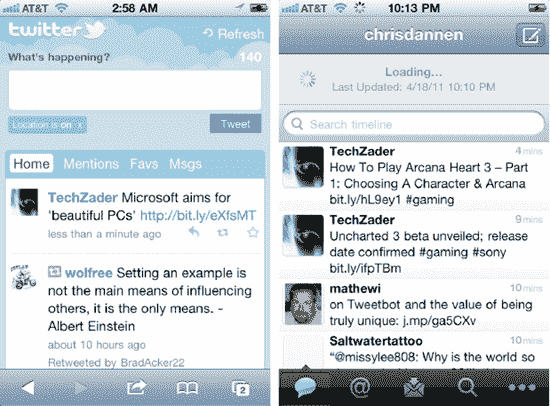

**图 13–11.** *推特的移动网页应用（左）对比其 iOS 应用（右）*

### 结论

推特对规则和条例的热衷，作为其作为某种信息基础设施新兴角色的副产品，是可以理解的，尽管有些烦人。虽然这严重限制了你构建自己推特体验的方式，但也为那些不仅仅展示滚动时间线的应用开辟了可能性。不幸的是，这意味着一个好的推特 API 项目可能需要比洛伦·布里希特构建 Tweetie 1 时付出更多的汗水。

接下来，我们将讨论 Facebook 的设计惯例。

## 第 14 章：Facebook 用户界面设计

Facebook 应用是应用商店中最不寻常的应用之一；它也是全球最大社交网络在任何平台上功能最强大的客户端。如果它看起来像是 iPhone 中的 iPhone，那是因为 Facebook 平台与 iOS 一样强大。图 14–1 展示了 Facebook 应用类似 iOS 的网格界面。


**图 14–1.** *Facebook 是第一个在应用内重现 iOS “网格”界面的主要平台。*

### 可用性优先事项

Facebook API 项目的优先事项应与推特项目略有不同。这些优先事项应包括：

*   *查找人物*：用户在 Facebook 上更频繁地查询其他用户，并且有更多信息需要呈现，因此应优先处理这些任务。
*   *联系与被联系提醒*：Facebook 应用会为你发送最多九种提醒的推送通知和/或振动。相比之下，推特只有两种。Facebook 是一个需要用户主动参与的应用，拥有非常活跃的用户群。这些用户习惯于及时收到通知并迅速沟通。图 14–2 展示了 Facebook 的推送通知选项。

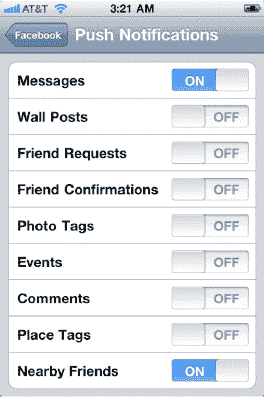

**图 14–2.** *Facebook 的推送通知偏好设置非常精细，允许用户之间快速互动。*

*   *为用户提供上下文*：Facebook 是一个非常强大的平台，许多应用仅复制了其网页应用的部分功能。这可能导致用户期望你的应用中存在一些不具备的任务。你可以通过为应用选择一个描述性的名称，并以用户能直观理解其功能的方式安排核心控件来改善这一点。这对于发布内容尤为重要：用户必须知道内容发布到何处以及谁会看到它。如有必要，可使用帮助提示；但应在应用内部使用，而不是像 MyPhone+ 那样作为弹出对话框使用（参见图 14–3）。需要说明的是，我们也不建议告诉用户在安装后重启。

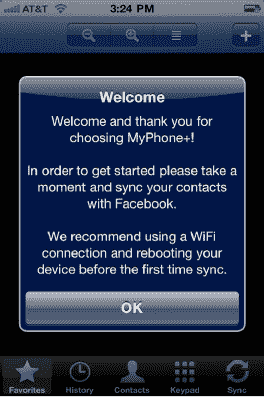

**图 14–3.** *不要这样做。*

#### 创建你自己的界面

正如我们在第 11 章中讨论的，Facebook 的条款做出了以下规定（参见图 14–4）：

> “Facebook 站点功能不得被模仿。”¹

如果你的应用看起来太像 Facebook，运行起来也太像 Facebook，你很可能会收到 Facebook 代表的警告。不过，你可能会感兴趣地发现，这样做的原因实际上对用户以及 Facebook 都有益。Facebook for iOS 的原始开发者乔·休伊特解释了 Facebook 的理由：


> *应用的首个版本确实在底部设有标签栏，但我将其移除了，因为我觉得 Facebook 本身就是一个平台，而每个标签栏几乎都像是独立的应用程序，确实需要全屏显示。*
> 
> *我必须着眼未来；我们有很多新应用即将推出，我认为 Facebook 的运作模式更适合将其本身定位为一个“手机”。Facebook 拥有自己的聊天、电话簿、邮件、照片和应用，因此将所有内容塞进标签栏会显得过于局限。采用这种模式——它就像一个 iPhone 的主屏幕——将能使其不断成长并变得功能齐全。这也为我们提供了空间，可以在应用内部添加更多应用。*
> 
> *我其实没怎么见过其他应用采用[网格布局]，而且我也不太推荐别人这么做。Facebook 在广度和用户在其上进行的操作种类上都很独特。我一度对构建网格布局犹豫不决，但当我不断调整布局，试图将所有内容都塞进标签栏时，我觉得这（网格布局）是最好的解决方案。我本以为会有更多人抱怨，但结果似乎还不错。*
> 
> *[点击次数]的经济性始终是一个驱动因素，但与始终显示的标签栏相比，网格布局增加了一次点击[因为你需要点击网格按钮]。这是我认为必要的权衡。在屏幕杂乱（增加标签）和点击次数之间，总需要找到一种平衡。*
> 
> *创建 Facebook 的视图控制器涉及哪些工作？*
> 
> *我做了很多自定义的内容。这个应用构建在我创建的一个名为 Three20 的开源框架之上，它使用自己的视图控制器，所有这些控制器都需要我编写。我不得不尝试重新设计苹果的照片浏览应用和苹果的邮件撰写工具，还有其他一些东西。*²

_________

¹[`http://developers.facebook.com/policy/`](http://developers.facebook.com/policy/)

## Facebook 加载项目³

该项目展示了 Facebook 应用在发布内容之前，是如何缓存旧信息并检查可用服务的。休伊特这样解释：

> *应用中的所有内容都是这样工作的。有一个磁盘缓存，所以当你加载事件、笔记或请求时，它们会被缓存。这样当你返回应用时，我们会显示缓存版本。在显示缓存版本的同时，我们会尝试加载最新版本。如果缓存超过一周——或者若干天，我忘了具体数字——应用会向你显示“加载中”，并清除旧内容。*
> 
> *在这个系统建立之前，无论你走到哪里，都会看到一个不停旋转的小菊花——加载、加载、加载。我认为，在新内容加载进来时，能立刻看到一些可以交互的内容，感觉会更好。*

接下来的代码是 Facebook 应用磁盘缓存框架的摘录，该框架用于替代 Cocoa 中获取网络数据（本例中是从 Facebook 服务器获取）的类。休伊特编写了 Three20 框架，使得缓存可以存储在磁盘上。而在苹果的框架中，则需要使用内存。以下是代码本身：

```
- (NSData*)generatePostBody {
  NSMutableData* body = [NSMutableData data];
  NSString* beginLine = [NSString stringWithFormat:@"\r\n--%@\r\n", kStringBoundary];

  [body appendData:[[NSString stringWithFormat:@"--%@\r\n", kStringBoundary]
    dataUsingEncoding:NSUTF8StringEncoding]];

  for (id key in [_parameters keyEnumerator]) {
    NSString* value = [_parameters valueForKey:key];
    // Really, this can only be an NSString. We're cheating here.
    if (![value isKindOfClass:[UIImage class]] &&
        ![value isKindOfClass:[NSData class]]) {
      [body appendData:[beginLine dataUsingEncoding:NSUTF8StringEncoding]];
      [body appendData:[[NSString
        stringWithFormat:@"Content-Disposition: form-data; name=\"%@\"\r\n\r\n", key]
          dataUsingEncoding:_charsetForMultipart]];
      [body appendData:[value dataUsingEncoding:_charsetForMultipart]];
    }
  }

  NSString* imageKey = nil;
  for (id key in [_parameters keyEnumerator]) {
    if ([[_parameters objectForKey:key] isKindOfClass:[UIImage class]]) {
      UIImage* image = [_parameters objectForKey:key];
      CGFloat quality = [TTURLRequestQueue mainQueue].imageCompressionQuality;
      NSData* data = UIImageJPEGRepresentation(image, quality);

      [self appendImageData:data withName:key toBody:body];
      imageKey = key;

    } else if ([[_parameters objectForKey:key] isKindOfClass:[NSData class]]) {
      NSData* data = [_parameters objectForKey:key];
      [self appendImageData:data withName:key toBody:body];
      imageKey = key;
    }
  }

  for (NSInteger i = 0; i < _files.count; i += 3) {
    NSData* data = [_files objectAtIndex:i];
    NSString* mimeType = [_files objectAtIndex:i+1];
    NSString* fileName = [_files objectAtIndex:i+2];

    [body appendData:[beginLine dataUsingEncoding:NSUTF8StringEncoding]];
    [body appendData:[[NSString stringWithFormat:
                       @"Content-Disposition: form-data; name=\"%@\"; filename=\"%@\"\r\n",
                       fileName, fileName]
          dataUsingEncoding:_charsetForMultipart]];
    [body appendData:[[NSString stringWithFormat:@"Content-Length: %d\r\n", data.length]
          dataUsingEncoding:_charsetForMultipart]];
    [body appendData:[[NSString stringWithFormat:@"Content-Type: %@\r\n\r\n", mimeType]
          dataUsingEncoding:_charsetForMultipart]];
    [body appendData:data];
  }

  [body appendData:[[NSString stringWithFormat:@"\r\n--%@--\r\n", kStringBoundary]
                   dataUsingEncoding:NSUTF8StringEncoding]];

  // If an image was found, remove it from the dictionary to save memory while we
  // perform the upload
  if (imageKey) {
    [_parameters removeObjectForKey:imageKey];
  }

  TTDCONDITIONLOG(TTDFLAG_URLREQUEST, @"Sending %s", [body bytes]);
  return body;
}
```

_________

²/《iPhone 设计大奖获奖项目》/ 作者：Chris Dannen (Apress, 2009)


**图 14–4.** *Facebook 更希望你不要抄袭其视觉设计，但很多开发者仍然照做不误。这是你自己应该避免这样做的又一个原因。*

### 主题与图标

根据 Facebook 的规定，你不应模仿 Facebook 的视觉设计或其图标体系。然而，这显然无法阻止许多开发者恰恰这么做。那么，作为 Facebook 的新开发者，该怎么做呢？

在我们看来，在某些情况下，采用与 Facebook 类似的配色方案是非常合适的。如果你的应用将提供大量的 Facebook 功能（当然，除此之外还有其他功能），那么让用户置身于一个带有 Facebook 风格（但并非复制）的环境中，可能会对用户有所启发（参见图 14–5）。

#### 第三方资源


**图 14–5.** *如果你必须汲取灵感，请考虑 Facebook 的交互设计及其设计惯例，并尝试向其致敬。*

图 14–5 展示了一套第三方 Photoshop 图片。它们可免费使用。它们也适用于网页设计师，但别让这限制了你。这些视觉设计应该能帮助你制作应用原型，或借用你喜欢的 Facebook UI 中的某些方面。请记住不要过度借用，因为在你的应用中复现 Facebook UI 是违反 API 条款和条件的。

你可以从 Surgeworks 的以下网址下载这套免费的 Facebook UI 工具包：

[`http://surgeworks.com/blog/design/facebook-gui-free-psd-resource`](http://surgeworks.com/blog/design/facebook-gui-free-psd-resource)


### 创建主题元素

在能力范围内，设计你自己的配色方案、品牌标识、Logo 和图标。

不仅 Facebook 不鼓励开发者使用其蓝白配色方案，常识也是如此。应用商店中质量上乘、使用 Facebook API 的 iOS 应用凤毛麟角——但糟糕的应用却比比皆是。大多数低质量的应用都无耻地模仿 Facebook 的颜色和图标。抄袭 Facebook 不仅违反规则，而且显得相当低端。

幸运的是，即使没有那种千篇一律的样式表，Facebook 仍然很实用。社交聚合器 `Hootsuite` 和阅读器应用 `Taptu` 就是两个例子，它们通过独特的配色方案和品牌标识，以别具一格的方式呈现 Facebook 内容。

#### Hootsuite

正如你在图 14-6 中所见，`Hootsuite` 的青色配色方案看起来更像 Twitter 而不是 Facebook。但它的视觉元素和应用栏更像是这两个社交网络的一个奇怪混合体——而不是对其中任何一个的简单复制。

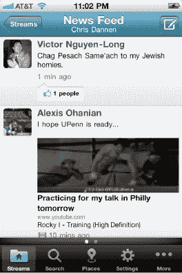

**图 14-6.** *Hootsuite 融合了 Facebook 和 Twitter 的颜色与惯例，这是它避免看起来太像其中任何一个的方式。*

#### Taptu

`Taptu` 是一款适用于 iPhone 和 iPad 的应用，它将 RSS 订阅源、社交新闻和其他内容汇总到比传统阅读器更易阅读的*信息流*中。正如你在图 14-7 中所见，Facebook 动态像其他任何动态一样被打包呈现，状态更新（及其作者和时间戳）以时间线顺序排列，隐约带有 Twitter 风格。这是另一种符合其平台设计规范的混合设计。

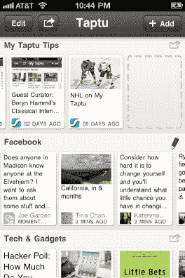

**图 14-7.** *Taptu 对动态消息的诠释*

### Facebook 艺术规则

正如我们在本章开头所说，Facebook 并没有像 Twitter 那样为商标和视觉资产制定一套繁复的规则。这可能是许多应用开发者在创建应用图标和界面时随意借鉴的原因之一。

上一节指导您创建自己的主题元素。这样做时，根据 Facebook 的要求，您需要牢记几条简要准则：

*   未经 Facebook 书面许可，您的广告不得包含或附带任何平台集成，包括诸如`点赞`按钮之类的社交插件。
*   开发者不得以暗示 Facebook 参与或认可的方式推销自己。
*   开发者还应避免使用 Facebook 的 Logo、商标或网站术语。这些包括但不限于 `Facebook`、`The Facebook`、`FacebookHigh`、`FBook`、`FB`、`Poke`、`Wall` 以及其他公司图形、标识、设计或图标。

如果您想阅读完整的 Facebook 广告准则，请访问此链接：

[`http://www.facebook.com/ad_guidelines.php`](http://www.facebook.com/ad_guidelines.php)

### 按钮文本

以下是几个允许 Facebook 开发者使用的按钮文本示例：

*   `Post`
*   `Share`
*   `Publish`
*   `Add to Profile`

以下是 Facebook 认为过于模糊而无法使用的按钮文本示例：

*   `Ignore`
*   `OK`
*   `Share ' Continue`
*   `Request`

### Facebook 导航

由于其网格化的用户界面，官方的 Facebook 应用设定了一些奇怪的导航范式。事实上，它借鉴了很多 Android 的设计，也借鉴了一部分 webOS 的设计。Facebook 应用的做法如下：

*   使用长按操作来模拟 iOS 应用图标的“抖动”效果。
*   使用从屏幕底部升起的状态栏（类似于 Android）来显示通知。
*   在应用内部设有“应用”，就像 iOS 用户界面一样。
*   当你点击标题栏时，会显示闪烁动画，类似于 HP webOS。

**注意：** 不要复制 Facebook 的用户界面和导航。

我们喜欢所有这些小特色，并且不希望官方的 Facebook 应用以其他任何方式运行。但我们不建议您模仿这些范式中的任何一个。它们在 iOS 上显得格格不入（至少目前如此），并且只会让您的用户感到困惑。

### 显示进度

正如我们在本章前面所讨论的，向用户显示进度是应用反馈的重要组成部分。在官方的 Facebook 应用中，用户永远不会看到空白的动态消息；如果无法找到网络连接，应用会显示其最近在后台缓存的更新。Facebook 用户无疑已经习惯了 Facebook iOS 和 Web 应用的速度和效率，所以您最好尽量不要让他们等待。

如果必须显示进度，请使用活动指示器，并考虑在操作需要花费大量时间时向用户显示警告信息；然而，活动指示器绝不应阻止用户切换标签页或撰写其他内容。集成了 Facebook 的 `MyPhone+` 应用只有一个主要任务，而且这是一个重要的任务。该应用很好地处理了这个任务，正如你在图 14-8 中所见。

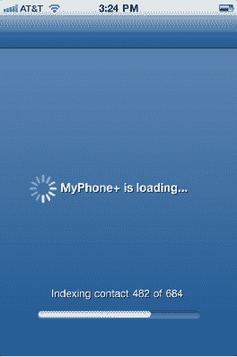

**图 14-8.** *MyPhone+ 为其核心任务显示了一个进度指示器，但这仅在特定情况下才是个好主意。*


#### 核心 Three20 组件

如你在第 10 章所学，Three20 项目是 Facebook iOS 开发者乔·休伊特送给 Facebook 开发者社区的礼物：一套他专为 Facebook iOS 版应用自行构建的完整框架。

该项目是开源的，包含了 Facebook 应用的几个组成部分。这些部分包括照片查看器、消息编辑器、网络图像视图以及其他实用功能。你可以通过以下 URL 找到它们的 Git 地址：

[`http://joehewitt.com/post/the-three20-project/`](http://joehewitt.com/post/the-three20-project/)

以下是你设计应用时需要了解的一些组件，以及乔对各组件的描述：

- **照片查看器**：“`TTPhotoViewController` 模仿了苹果相册应用的全部缩放与滑动体验。你可以提供自己的‘照片源’，其工作原理与 `UITableView` 使用的数据源类似。与苹果相册应用不同，它不仅限于本地存储的照片。你的照片可以从网络加载，长列表照片可以增量加载。此版本还支持缩放（与当前 Facebook 应用中的版本不同）。”
- “这大概是我在整个 Facebook for iPhone 项目中最耗时的部分了，所以如果我能帮别人省下这些时间，我会睡得更好。”
- **消息编辑器**：“`TTMessageController` 模仿了苹果邮件应用中的消息编辑器。你可以自定义它以发送任何类型的消息。包含你自己的消息字段集，或使用标准的`收件人:`和`主题:`。收件人姓名可以通过你提供的数据源自动补全。”
- **网络图像视图**：“`TTImageView` 让显示图像变得和 HTML 中一样简单。只需提供图像的 URL，`TTImageView` 就会高效地加载并显示它。`TTImageView` 还与下面描述的 HTTP 缓存协同工作，尽可能避免网络请求。”
- **网络感知表格视图控制器**：“`TTTableViewController` 和 `TTTableViewDataSource` 帮助你构建从互联网加载内容的表格。与 `UITableView` 默认假设你已准备好所有数据不同，`TTTableViewController` 允许你在数据加载时、出现错误或没有内容可显示时进行通信。它还帮助你添加‘更多’按钮以加载下一页数据，并可选择支持通过摇晃设备来重新加载数据。”
- **文本输入字段**：“`TTTextEditor` 是一个 `UITextView`，它能在你输入时自动增加高度。我在 Facebook 聊天中输入消息时使用它，其行为与苹果短信应用中的编辑器类似。”
- “`TTPickerTextField` 是一个输入预测 `UITextField`。当你输入时，它会搜索数据源，并在你选择预测选项时向文本流中添加气泡。我在 `TTMessageController` 中使用它来选择消息收件人的姓名。”

#### Web 应用的设计技巧

Facebook 的触屏版 Web 应用的设计可以说与其 iOS 应用同样出色（参见图 14-9）。尽管它受到浏览器环境的种种限制，但仍有一些优秀的设计模式可供借鉴（这与网格布局不同）。


**图 14-9.** *面向 Mobile Safari 用户的 Facebook 主页*

##### 标签式方法

标签曾用于早期版本的 Facebook for iOS 应用，但随着应用功能日益丰富，标签迅速变得杂乱无章。Web 应用更长久地保留了标签浏览方式，但其开发者最近重新设计了应用的导航栏，使其仅包含四项内容：

- 个人主页
- 消息
- 更多（好友、照片、地点、群组、活动、笔记、通知、设置和退出）
- 搜索按钮

我们认为这些标签的内容反映了我们在本节开头确立的 Facebook 可用性优先级：

- 查找他人
- 联系他人
- 情境

至此，我们的讨论又回到了原点！

### 结论

这是一个热潮过后的时代。Web 开发者曾蜂拥而至 Twitter 和 Facebook 的 API，iOS 开发者紧随其后。但这种涌入使得这些平台的管理趋于保守，因为它们试图保护并维持自身的增长。没人想毁掉一件好事，这些平台构建了一套规则和条款体系，确保除了它们自己之外，无人能玷污其名誉。

这对开发者和设计师的创造力来说并非死刑。相反，它迫使他们创造出能真正为平台增加价值的应用。我们鼓励你思考使用 Facebook 和 Twitter 的未尝试过的方式——或此前未做对的方式。当你发现一种独特的体验并了解其受众时，你需要设计能体现应用个性的视觉素材。在 App Store 中，外表并非一切。它仅仅*几乎*是一切。

## 索引

### 符号与数字

`#`（话题标签），Twitter，189

`#话题标签`，推文，248

`?` 符号，SQLite，197

`@提及`，推文，248


### A

`abort function`，126

`access log`，Facebook，145

`access tokens`  
URL 的组成部分，48  
登录 Facebook，49  
退出 Facebook，51，52  
退出 Twitter，62

`accounts`  
iOS 上的社交应用设计，236

`action parameter`  
对话框方法，Facebook 类，82，83

`actions`，推文，251

`activity indicator`  
进度（用户反馈），Facebook，277  
iOS 上的社交应用设计，239

`advertising`  
App Store，255  
Facebook，275  
合规指南，222  
合作伙伴，221  
用户数据所有权，13  
Twitter，217

`aggregation libraries`，ShareKit，182

`albums`，Facebook  
获取用户被标记的相册，95

`anatomy of Tweets`，248–252

`animation`  
iOS 上的社交应用设计，239

`annotations`  
在 MKMapView 上显示，161

`API calls`  
Facebook iOS SDK，17，27  
MGTwitterEngine 发起，19  
速率限制，Facebook，220

`API console`  
收藏 Twitter 资源，24

`API response times`  
收藏 Facebook 资源，25

`Apigee's Twitter console`  
将位置与推文关联，172

`apiKey parameter`  
bit.ly URL 缩短服务，180，181

`APIs`  
Core API，Twitter，5  
CoreLocation 框架，iOS，148–153  
Facebook APIs，4–5，17–19  
使用规则，218–223  
地理定位 API，Twitter，172  
Graph API，4，66–71，81–96  
HTTP API，Twitter，101  
MapKit 框架，iOS，158–162  
数学 API，iOS 4，8  
MGTwitterEngine API，19–20  
发布 API，Facebook，5  
读取 API，Facebook，4  
搜索 API，Twitter，5  
搜索 API，Facebook，5  
流式 API，Twitter，5  
趋势 API，Twitter，189  
Twitter API，5–6，72–78，96–103  
使用规则，213–217

`App Store`  
中的广告，255

`Apple`  
所需的图标尺寸，238

`Apple IDE`  
设置文档，21

`Apple 人机界面指南` *参见* HIG

`application delegate file`  
Facebook，28，29  
Twitter，34，35

`application delegate header file`  
Facebook，27，29  
Twitter，33，34

`application:didFinishLaunchingWithOptions` 方法  
添加 UIViewController，Facebook，28  
启动 Twitter 引擎，34

`applications`  
访问日志，Facebook，145  
构建社交应用，Facebook，219  
为 Facebook 创建应用，28–30  
Facebook，229–232  
直接从应用发布到 Facebook 页面，82–87  
隐私，9  
安全性，9  
简化使用，246  
主题元素，253  
Twitter，224–229  
在应用中使用用户位置，136

`应用和网站部分`  
隐私设置，Facebook，144

`Arment, Marco`  
对 QuickBar 的反应，262–264

`art`  
Facebook 艺术规则，275

`as_of` 日期  
Twitter 趋势，189

`ASIHTTPRequest library`  
发布图片到 Twitter，113

`authenticatedWithUsername` 方法  
登录 Twitter，60

`authentication`  
*另见* OAuth  
URL 的组成部分，48  
Facebook iOS SDK，17，27

`author`，推文，248

`authorization`  
Facebook 对话框，88  
Facebook iOS SDK，17，27

`authorize` 方法  
登录 Facebook，49，50

`avatar`，用户  
推文，249

### B

`background processing`  
iOS 应用，6  
`performSelectorInBackground` 方法，129  
在后台线程处理/同步数据，130  
`synchronizeTweets` 方法，130  
`TwitterDataStore`，128

`backgrounding`  
判断 Facebook iOS 是否支持，54  
定位服务，153

`battery power conservation`  
设备位置，147

`Beacon`，Facebook，10

`bird graphics`  
Twitter UI 设计，259

`bit.ly URL shortening service`，180  
与 Twitter 集成，186

`books`，Facebook  
获取用户的书籍，93

`brand dilution`，Twitter，212

`branding`  
iOS 上的社交应用设计，245  
主题元素，Twitter，253  
推文，249

`Brichter, Loren`，255

`bug tracking`  
Facebook，25  
报告安全问题，14  
Twitter，25

`button text`，Facebook，223，276


### C

`cachedTwitterOAuthDataForUsername` 方法，59

缓存，Facebook，270, 271

日历应用，iOS 4，7

回调 URL，集成 ShareKit 与 Twitter，186

摄像头，iOS 4，7

`caption` 键值，Facebook 对话框，85

字符计数器，编写推文，249

速查表，Git，24

签到，Facebook，170

签到地点，165  
通过 OAuth 获取权限，167  
自定义，142  
包含用户的好友，167  
iOS 应用，168–170  
“签到”部分中位置不可用，163  
权限，171  
发布到用户账户，167  
通过图谱路径发布，166  
从用户账户检索，171  
通过图谱路径检索，170

`clearAccessToken` 方法，退出 Twitter，62

`CLLocationManager` 类，149, 151–153  
应用的授权状态，152  
`didChangeAuthorizationStatus` 方法，152  
区域监控，151  
`registerRegion` 方法，151  
`startMonitoringForRegion` 方法，151  
`startUpdatingLocation` 方法，149

`CLLocationManagerDelegate`  
`didEnterRegion` 方法，152  
`didExitRegion` 方法，152  
`didFailWithError` 方法，152  
`didUpdateToLocation` 方法，152

`closeDatabase` 方法，离线存储，SQLite，196

Cocoa Touch 类，添加 `UIViewController`，27, 28, 33, 34

Cocoa Touch 单元测试包，为社交 iOS 应用添加单元测试，201

颜色  
创建主题元素，274  
Facebook UI 设计，273  
Twitter UI 设计，253

通用 URL 方案，Twitter HTTP API，101

合规性指南，Facebook，222–223  
*另请参阅* API 使用规则  
广告，222  
按钮文字，223  
“赞”按钮，221, 222  
照片，222  
使用社交流，223

`connect` 方法，`FBRequest`，71

`connectionFinished` 方法，`MGTwitterEngineDelegate`，73

连接，Twitter  
创建，78  
连接字典，77  
HTTP 连接，`MGTwitterEngine`，77–78  
`MGTwitterEngine` 请求方法，72  
`MGTwitterHTTPURLConnection` 对象，77, 78

控制台，Twitter API，103

联系人，Facebook，268

联系人，Twitter  
将 @RTM 添加为联系人，225

内容政策，Facebook，220

内容，消费/创建，244

控件  
安排以实现直观使用，Facebook，268  
简化应用使用，246  
iOS 社交应用设计，242

Core API，Twitter，5

Core Data，118–127  
创建 SQLite 数据库文件，192  
使用 `TwitterDataStore` 进行数据建模，118–127  
将项目链接到框架，119  
SQLite 数据库，193  
存储推文对象，193  
在 `TwitterDataStore` 内存储数据，124  
存储/检索推文，131–133

Core Data 模型  
向项目添加文件，119  
添加推文实体，120  
创建托管对象模型，126  
删除其中的推文，133  
从中获取推文，133  
轻量级迁移，126  
在其中映射推文实体，122

`CoreDataOffline.sqlite` 文件，离线存储，193  
`ZTWEET` 表，193

`CoreLocation` 类  
重大变化方法，149  
标准方法，149

CoreLocation 框架，iOS，148–153  
`CLLocationManager` 类，149  
将应用链接到该框架，153  
`LocationController` 类，148–149

CoreLocation 服务，136, 149

跨平台 C 库，SQLite，192

Curl  
为 Twitter 资源添加书签，24  
支持 OAuth 的版本，24

`curl` 工具  
Twitter 趋势，189  
URL 缩短，180

当前 API，Twitter 趋势，190

自定义 URL 方案  
登录后 Facebook 重定向至应用，46  
通过此方案进行应用间通信，46–49


### D

`data`

Core Data，118–127

`data modeling`

`TwitterDataStore`，118–127

`data source`

`TTTableViewDataSource`，278

`date formatting`

Graph API，Facebook，96

`date_format` 参数，Facebook，96

`dealloc` 方法，为 Facebook 创建应用，29

`offline storage`，SQLite，194

`starting Twitter engine`，34

`debugging`

为社交 iOS 应用添加单元测试，201，208

`ShareKit`，184

`delegate` 回调方法

Facebook 对话框，82

`delegate` 参数

`dialog` 方法，Facebook 类，82

`delegates`，Facebook

错误通知，71

`FBRequestDelegate`，66

`FBSessionDelegate`，50

处理请求响应，18

处理响应数据，66

`requestWithGraphPath` 方法，66，70

`delegates`，Twitter，72

`MGTwitterEngineDelegate`，73

`deleteTweets` 方法

`offline storage`，SQLite，199

`TwitterDataStore` 类，131

`description` 键值，Facebook 对话框

自定义 Feed 对话框的显示，85

`design`

*另请参阅* iOS 上的社交应用设计

Facebook UI，267–280

Twitter UI，247–265

规则例外情况，249

设计指南，249

需求，248–249

`dev console`，Twitter，102–103

`development`

Git，22

Facebook 的隐含认可，275

`dialog` 类，Twitter API，101

`dialog` 方法，Facebook 类，82，87

委托回调方法，82

向用户显示对话框，83

参数，82

`dialogCompleteWithUrl` 方法，Facebook，85

`dialogDidComplete` 方法，Facebook，85

`dialogDidNotComplete` 方法，Facebook，86

`dialogDidNotCompleteWithUrl` 方法，Facebook，86

`dialogs`

显示，Facebook iOS SDK，17，18，27

Facebook，82–87

`FBDialog` 类，86–87

`DialogViewController` 类，Facebook，82

`dialog:andDelegate` 方法，Facebook，82

`dialog:andParams:andDelegate` 方法，82

`didFinishLaunchingWithOptions` 方法，Facebook，28

`direct messages`，Twitter

Evernote，227

响应，100

发送，100

Twitter URL，102

`directMessagesReceived` 方法，Twitter，100

`Documents` 目录

Core Data 创建 SQLite 数据库文件，192

### E

`error handling`

abort 函数，126

Facebook iOS SDK，18，71

`MGTwitterEngineDelegate`，19

模式不兼容错误，126

在 `TwitterDataStore` 中存储数据，126

`events`，Facebook

获取用户的活动，92

`Evernote`，226–228

通过 Twitter 的短信支持添加内容，228

添加 `TwitPics`，228

短信笔记，227

`exceptions`

Twitter UI 设计，259

`executeFetchRequest` 方法

从 Core Data 模型中获取推文，133

`extended permissions` *详见* permissions，Facebook


### F

#### Facebook

- 从社交图谱访问信息，66
- 优势，15
- 广告，275
  - 合规指南，222
  - 合作伙伴，221
- Bug 跟踪，25
- 按钮文本，223
- 缓存，270, 271
- 在发布前检查服务可用性，270
- 签到部分，163
- 与 iOS 应用竞争，219
- 合规指南，222–223
- 内容政策，220
- 为其创建应用，28–30
- 日期格式化，96
- 设计（*参见* iOS 上的社交应用设计）
- 开发站点功能，269
- 对话框方法，82, 87
- 反馈偏好，241
- 获取已登录用户的好友列表，66–69, 89
- `Graph API`，4, 66–71, 81–96
  - `HTTP GET`，5
  - `HTTP POST`，5
- 隐含的背书，275
- 将 `ShareKit` 集成到其中，186
- 通过自定义 `URL` 方案进行应用间通信，46–49
- `iOS Objective-C Facebook SDK`，5
- 点赞按钮，221, 222
- 限制返回字段的数量，95
- 登录，49–51
  - 登录错误，43
  - 登录页面，38
  - 登录后重定向到应用，46
  - 单点登录功能，41
  - 使用 `UIWebView` 登录，45
- 登出，51–53
- 消息服务，7
- 不模仿 `Facebook` 站点功能，269
- `OAuth`，11, 40–54
  - 通过移动版 `Safari` 确认，45
  - 通过移动版 `Safari` 登录错误，45
  - 通过移动版 `Safari` 登录，44
  - 登录视图，89
  - 权限页面，53
  - 通过移动版 `Safari` 获取权限，44
- 离线存储，118
- 用户数据所有权，13
- “此处有人”示例，143
- 权限页面，39
- 照片，15
  - 合规指南，222
- 平台政策，211, 219
- 向其发布图片，109–110
- 直接从应用向主页发布内容，82–87
- 发布到社交图谱，88
- 预填充文本字段，221, 223
- 隐私，10, 14, 219, 220
- 隐私设置部分，141
- `Publishing API`，5
- 从社交图谱拉取信息，66
- 推送通知，268
- `Reading API`，4
- 向其报告安全问题，14
- 为 Git 收藏的资源，25


- **搜索 API**，5
- **安全性**，10
- **摇动刷新功能**，241
- **单点登录功能**，40–48
- **社交图谱**，1，9
- **社交动态流使用指南**，223
- **垃圾信息**，219
- **应用可发布内容的类型**，66
- **他人分享的内容板块**，143
- **Three20 框架**，270，271
- **使用场景**，3
- **用户体验**，219
- **用户统计**，16
- **在 iOS 应用内使用**，3
- **使用/展示图路径请求结果**，66
- **Facebook API**，4–5（*另请参阅* Graph API，Facebook）
- **构建社交互动应用**，219
- **赋予用户选择与控制权**，219
- **帮助用户分享内容**，219
- **API 使用规则**，218–223
    - **广告合作方**，221
    - **允许用户从应用中访问 Facebook 数据**，220
    - **合规性指南**，222–223
    - **内容政策**，220
    - **删除旧项目数据**，220
    - **消息功能**，222
    - **广告中的平台集成**，221
    - **预填充文本字段**，221，223
    - **一次发布多条内容**，221
    - **用户和 API 调用频率限制**，220
    - **出售数据**，220
    - **跳过 Facebook 社交渠道条款**，221
    - **主要规则总结**，233
    - **使用 Facebook 图标和术语**，219
    - **用户权限**，221
    - **在应用外使用用户的好友列表**，220
- **使用方法**，17–19
- **Waze**，229
- **Facebook 应用**，229–232
    - **Flipboard**，231–232
    - **Fone**，230–231
- **Facebook Beacon**，10
- **Facebook 类**
- **Facebook 对话框**，82–87
    - **附加参数**，83
    - **授权**，88
    - **自定义动态对话框的显示**，84
    - **委托回调方法**，82
    - **`dialogCompleteWithUrl` 方法**，85
    - **`dialogDidComplete` 方法**，85
    - **`dialogDidNotComplete` 方法**，86
    - **`dialogDidNotCompleteWithUrl` 方法**，86
    - **向用户显示对话框**，83
    - **嵌入内容预览**，84
    - **`FBDialogDelegate` 方法**，85
    - **`post_id` 参数**，85
    - **网页视图**，84
- **Facebook Graph API**（*参见* Graph API）
- **Facebook iOS 应用**
    - **地点详细信息**，164
    - **标记地点**，165
    - **搜索附近地点和活动**，164
- **Facebook iOS SDK**，16
    - **向项目添加源代码**，27
    - **向项目添加 UIViewController**，27–28
    - **API 调用**，17，27


## 索引

### A

- `authentication and authorization`（认证与授权），17、27

### C

- `creating app for Facebook`（为 Facebook 创建应用），28–30
- `creating new project`（创建新项目），25–26
- `custom URL scheme creation code`（自定义 URL 方案创建代码），48

### D

- `determining if iOS supports backgrounding`（判断 iOS 是否支持后台运行），54
- `displaying dialogs`（显示对话框），17、18、27

### E

- `error handling`（错误处理），18

### F

- `Facebook Places`（Facebook 地点），141–145
  - `checking into places`（签到），165
  - `permission via OAuth to`（通过 OAuth 授权），167
  - `revoking permission for app to`（撤销应用授权），144
  - `controlling friends' access to Places info.`（控制好友对地点信息的访问权限），145
  - `detailed info. about places`（地点详细信息），164
  - `flagging places`（标记地点），165
  - `Nearby screen`（附近页面），162
  - `searching for nearby places and events`（搜索附近地点和活动），164
- `Facebook UI design`（Facebook 用户界面设计），267–280
  - `arranging controls for intuitive use`（安排控件以实现直观操作），268
  - `button text`（按钮文本），276
  - `color`（颜色），273
  - `contacting other users`（联系其他用户），268
  - `design conventions`（设计惯例），273
  - `design tricks from Web app`（来自 Web 应用的设计技巧），279
  - `downloading UI kit`（下载 UI 工具包），273
  - `icons`（图标），273
  - `navigation`（导航），276
  - `progress (feedback to user)`（进度反馈），277
  - `querying other users`（查询其他用户），268
  - `rules for Facebook art`（Facebook 美术设计规则），275
  - `tabs`（标签页），279
  - `themes`（主题），273–275
    - `creating theme elements`（创建主题元素），274–275
    - `Hootsuite`，274
    - `Taptu`，275
  - `third-party resources`（第三方资源），273
  - `Three20 framework`（Three20 框架），278–279
  - `usability priorities`（可用性优先级），267–280
  - `using help prompts inside app`（在应用内使用帮助提示），268
- `facebookRequestDidComplete method`（`facebookRequestDidComplete` 方法），69
- `FacebookViewController class`（`FacebookViewController` 类），66
- `FAKE_CORE_LOCATION`
- `FTLocationSimulator`，157
- `fakeUserLocationView method`（`fakeUserLocationView` 方法），161
- `fast app switching, Facebook`（快速应用切换，Facebook），40
- `Favorite action, Tweets`（收藏操作，推文），251
- `fbButtonClick method`（`fbButtonClick` 方法），50
- `FBDialog class`（`FBDialog` 类），86–87
- `FBDialogDelegate`
  - `error handling`（错误处理），18
  - `methods`（方法），85
- `fbDidLogin method`（`fbDidLogin` 方法），51
- `fbDidNotLogin method`（`fbDidNotLogin` 方法），51
- `FBRequest class`（`FBRequest` 类），71
- `FBRequestDelegate`，66
  - `creating app for Facebook`（为 Facebook 创建应用），29
  - `didLoad method`（`didLoad` 方法），109
  - `error handling`（错误处理），18
  - `handling request responses`（处理请求响应），18
  - `posting pictures to Facebook`（向 Facebook 发布图片），109
- `FBSessionDelegate protocol`（`FBSessionDelegate` 协议），50
- `feedback`（反馈）
  - `Facebook preferences`（Facebook 偏好设置），241
  - `progress (feedback to user)`（进度反馈），277
  - `social app design on iOS`（iOS 上的社交应用设计），239–242
    - `activity indicator`（活动指示器），239
    - `animation`（动画），239
    - `sound`（声音），241
    - `updating indicator`（更新指示器），240
    - `vibration`（振动），241
- `feeds, Facebook`（动态消息，Facebook）
  - `fetching user's news feeds`（获取用户的新鲜事），90
  - `Social Stream usage guidelines`（社交动态使用指南），223
- `fields, Facebook`（字段，Facebook）
  - `limiting number of fields returned`（限制返回字段的数量），95
- `file transfer, iOS 4`（文件传输，iOS 4），8
- `Flipboard`，231–232
- `followers, Twitter`（粉丝，Twitter）
  - `getFollowersIncludingCurrentStatus method`（`getFollowersIncludingCurrentStatus` 方法），72
  - `getting list of logged in user's followers`（获取已登录用户的粉丝列表），72–77
  - `retrieval of profile picture`（获取头像），75
  - `timeline of user and`（用户及其粉丝的时间线），99
  - `twitterFollowersRequestDidComplete method`（`twitterFollowersRequestDidComplete` 方法），74
- `FollowersTableViewCell class`（`FollowersTableViewCell` 类），75
  - `setData method`（`setData` 方法），75
- `FollowersViewController class`（`FollowersViewController` 类），73
  - `viewDidLoad method`（`viewDidLoad` 方法），72
- `Fone`，230–231
- `for-loop`（for 循环）
  - `looping through array of Tweets`（遍历推文数组），131
- `format parameter`（`format` 参数）
  - `bit.ly URL shortening service`（bit.ly 网址缩短服务），181
- `Foursquare API`
  - `Waze`，229
- `frameworks`（框架） *见* `APIs`
- `friends, Facebook`（好友，Facebook）
  - `controlling access to Places info.`（控制对地点信息的访问权限），145
  - `getting list of logged in user's friends`（获取已登录用户的好友列表），66–69、89
  - `using user's friend list outside application`（在应用外使用用户的好友列表），220
- `FriendsViewController class`（`FriendsViewController` 类）
  - `viewDidLoad method`（`viewDidLoad` 方法），66
- `FTLocationSimulator`，149、157–158
  - `associating location with Tweets`（将位置与推文关联），172
  - `fakeUserLocationView method`（`fakeUserLocationView` 方法），161


### G

`generateURL`方法，`FBDialog`，87

`geo/reverse_geocode` API，关联位置与推文，175

地理编码，反向地理编码，175

Twitter 地理定位 API，172

`geoResultsForPath:withParams`方法，关联位置与推文，174

地理标签，Twitter 用户体验优先级，247

`getFollowersIncludingCurrentStatus`方法，72

`getImageAtURL`方法，76

`GHUnit`，为社交 iOS 应用添加单元测试，208

`Git`，21–25，速查表，24，创建 Twitter 项目，31，下载 Git 客户端，22，收藏 Facebook 资源，25，生成 SSH 密钥，24，安装，22–24，了解更多，24，子模块，24，收藏 Twitter 资源，24

`Git`忽略文件，创建 Facebook 项目，26，创建 Twitter 项目，31

`Git`仓库，克隆仓库，Facebook，25，Twitter，30，创建 Facebook 项目，26，创建 Twitter 项目，31，链接仓库，Facebook，26，`OARequestHeader`，114

`Git`子模块，26，创建 Twitter 项目，31

`GitHub`，`ASIHTTPRequest`库，113，`Facebook iOS SDK`，17，`GSTwitPicEngine`，113，托管仓库，22，链接仓库，Facebook，26，`MGTwitterEngine`，30，`OARequestHeader`，114，`ShareKit`，182

`Github.com`，22

`Google Maps`，地图覆盖层，8

`Graph API`，Facebook，4，66–71，81–96，访问，17，日期格式化，96，`FBDialog`类，86–87，`FBRequest`类，71，获取事件，92，获取群组，92，获取喜欢/电影/音乐/书籍，92，获取新闻源，90，获取笔记，90，获取照片/相册/视频，95，获取墙上帖子，93，获取登录用户的好友列表，66–69，89，获取好友的头像，69，处理请求响应，18，基于 HTTP 的 API，71，限制返回字段数量，95，限制响应中的项目数量，70，进行 API 调用，17，`requestWithGraphPath`方法，66，70，从指定偏移量检索项目，70，使用/显示图形路径请求结果，66

图形，Twitter UI 设计，259

群组，Facebook，获取用户群组，92

`GSTwitPicEngine`类，`ASIHTTPRequest`库，113，创建/初始化实例，116，发布照片到`twitpic.com`，115，发布图片到 Twitter，113，`SBJSON`框架，114，`uploadPicture:withMessage`方法，116

`GSTwitPicEngineDelegate`，发布照片到`twitpic.com`，115，`twitpicDidFinishUpload`方法，116

### H

`handleOpenURL`方法，响应自定义 URL 协议，48

`handleResponseData`方法，Facebook，71

处理错误 *参见* 错误处理

井号标签（`#`），Twitter，189，`tagalus`服务，192

`#hashtags`，推文，248

帮助，在应用内部使用帮助提示，Facebook，268

“Here Now” 部分，`Places`功能，Facebook，141

Joe Hewitt，开发 Facebook 网站功能，269，`Facebook iOS SDK`，17，`Three20`框架，270，271，278–279

`HIG`（人机界面指南），235，动画，239，iOS 上的社交应用设计，235–246，社交 iOS 应用，235，`Tweetie`，255

`Hootsuite`，274

热点问题，10

`HTTP GET`，5

`HTTP POST`，5，速率限制，218

人机界面指南 *参见* `HIG`


### I

- iAd、iOS 4，8
- 图标
  - Facebook UI 设计，273
  - 添加光泽的图标，239
  - iPad 图标尺寸，239
  - iPhone 和 iPod 图标尺寸，237
  - PNG 格式，238、239
  - Apple 要求的尺寸，238
  - 圆角处理，239
  - iOS 上的社交应用设计，237–239
  - Twitter UI 设计，258–259
- 身份，现实生活与在线身份，13
- 忽略文件，Git
  - 创建 Facebook 项目，26
  - 创建 Twitter 项目，31
- `imagePickerController:didFinishPickingMediaWithInfo` 方法，107
- `ImagePostController` 类，109
  - 向 Twitter 发布照片，115–117
- `imageReceived:forRequest` 方法
  - `MGTwitterEngineDelegate`，76
- 图像
  - 从代码中访问，106–108
  - PNG 格式，238
  - 向 Facebook 发布图片，109–110
  - 向 Twitter 发布图片，110–117
  - 将图片保存到相册，105–106
  - `TTImageView`，278
  - 用户体验优先级，Twitter，247
  - Three20 网络图像视图，278
- `insertNewObjectForEntityForName:inManagedObjectContext` 方法，132
- 互联网
  - Facebook/Twitter 出现之前的隐私与安全，9
- 网络感知表格视图
  - Three20 框架，278
- iOS
  - `CoreLocation` 框架，148–153
  - Facebook iOS SDK，16
  - Facebook UI 设计，267
  - 在 iOS 上使用 iSimulate，156
  - 位置权限提示，137
  - 定位服务，153
  - 定位服务设置，138
    - 重置警告后，140
  - `MapKit`，158–162
  - 重置位置警告设置，139
  - 设置应用，138
  - 位置的重大变化方法，147
  - 社交图谱，6–8
  - 单元测试，200–208
  - URL 缩短，181–182
  - 在应用中使用用户位置，136
- iOS 4
  - 日历应用，7
  - 相机，7
  - 文件传输，8
  - iAd，8
  - LED 闪光灯，8
  - 本地通知，6
  - 基于位置的应用，7
  - 地图叠加层，8
  - 数学 API，8
  - 多任务处理，6
  - 音乐应用，7
  - 照片，7
  - 快速查看，8
  - 新增功能，6
  - 保存状态，7
  - 睡眠模式，6
  - 短信发送，7
  - 任务完成，7
  - 任务切换，7
  - VOIP 应用，7
  - WiFi 连接，6
- iOS 应用
  - 为其添加 Facebook/Twitter 功能，1
  - 为社交应用添加单元测试，200–208
  - 后台处理，6
  - 签到，Facebook，168–170
  - 设计*参见* iOS 上的社交应用设计
  - 初始化设置
    - Facebook，25–30
    - Twitter，30–34
  - 直接从应用向 Facebook 页面发布内容，82–87
  - 隐私与安全，9
  - 保存状态，7
  - 存储数据，118
  - 主题元素，253
  - 在应用内使用 Facebook，3
  - 在应用内使用 Twitter，4
  - 使用 Twitter 的网页按钮，253
- iOS 开发
  - 使用 Xcode 进行开发，21
- iOS 设备
  - Facebook iOS SDK，17
  - 启动画面，259
- iOS Objective-C Facebook SDK，5
  - 与 iOS 应用竞争，219
- iOS 模拟器
  - `FTLocationSimulator`，149、157–158
  - 在 iOS 模拟器中生成位置，153–158
  - iSimulate，154–156
  - 将图片保存到相册，105–106
- iPad
  - 图标尺寸，239
  - 弹出控件，246
  - iOS 上的社交应用设计，246
- iPhone，图标尺寸，237
- iPod，图标尺寸，237
- iSimulate，154–156
  - 配置，154
  - 免费的 Lite 版，154
  - 在 iOS 上，156

### J, K

- JavaScript 对象表示法 *参见* JSON
- JavaScript 测试控制台
  - 收藏 Facebook 资源，25
- JSON（JavaScript 对象表示法）
  - 将位置与推文关联，173
  - Graph API，4
  - `SBJSON` 框架，114
  - Twitter，19
- JSON 响应
  - Facebook 响应，71


### L

#### 标签
- 简化应用使用，246
- iOS 社交应用设计，245

#### 纬度参数
- 将位置与推文关联，174、175

#### LED 闪光灯，iOS 4，8

#### letsbetrends.com
- Twitter 趋势，192

#### 字母文本字段
- Three20 框架，279

#### libxml XML
- 添加 MGTwitterEngine 源代码，32

#### 许可协议
- iOS 社交应用设计，246

#### 点赞按钮
- 合规性指南，221、222

#### 点赞（Facebook）
- 获取用户的点赞内容，92

#### 限制参数
- `requestWithGraphPath` 方法，70

#### 链接键值，Facebook 对话框，83

#### 加载
- 用户体验优先级，Twitter，247

#### `loadView` 方法，`MapViewController`，158
- ShareKit 发布到 Facebook/Twitter，186

#### 本地通知，iOS 4，6

#### 位置历史记录，Twitter
- 删除，147
- 管理 API 使用的规则，213

#### （设备的）位置
- 添加到推文，146–147
- 与推文关联，172–177
- 应用授权状态，152
- 电池电量节省，147
- `CLLocationManager` 类，149、151–153
- `CoreLocation` 框架，148–153
- 判断设备是否离开/重新进入区域，151
- Facebook Places，141–145
- `FTLocationSimulator`，157–158
- 一般注意事项，136
- 在 iOS 模拟器中生成，153–158
- `iSimulate`，154–156
- iOS 定位服务设置，138
- `MapKit`，158–162
- `MKUserLocation` 标注，161
- 隐私，13
- 区域监控，151
- 重大变更方法，147、153
- 标准方法，147、153
- 存储/刷新位置历史记录，141
- 打开/关闭定位服务，137
- Twitter，172–177
- 基于位置的 Twitter 趋势，191–192
- 在应用中使用用户位置，136

#### 位置参数
- 将位置与推文关联，174

#### 位置权限提示，iOS，137

#### `location` 属性，149、152

#### 位置部分，Twitter，146、147

#### 定位服务设置，iOS，138
- 重置警告后，140

#### 定位服务，iOS，136、137、139
- 后台运行，153
- 在设备上启用，149
- 未授予使用权限，162
- 电量消耗，147
- 初始化问题，152

#### 基于位置的应用，iOS 4，7

#### `LocationController` 类，148–149
- 将位置与推文关联，172
- `FTLocationSimulator`，149
- `location` 属性，149
- `locationServicesEnabled` 属性，149
- `CLLocationManager` 的操作，149
- 省电模式，149、150
- `registerRegion` 方法，160
- `startMonitoringSignificantLocationChanges` 方法，149
- `startWithPowerSaving` 方法，149
- `stop` 方法，150

#### `LocationController.h` 文件，148

#### `LocationManager.m` 文件，149

#### `locationManager:` 方法
- `didChangeAuthorizationStatus`，152
- `didEnterRegion`，152
- `didExitRegion`，152
- `didFailWithError`，152
- `didUpdateToLocation`，152

#### `locationServicesEnabled` 属性，149

#### 登录，Facebook，49–51
- 登录错误，43
- `login` 方法，50
- 登录页面，38
- 通过移动 Safari 进行 OAuth 登录，44
- OAuth 登录视图，89
- 获取已登录用户的好友列表，66
- 单点登录功能，41

#### 登录，Twitter，58–61
- `bit.ly` URL 缩短服务，181
- 身份，216

#### 退出登录，Facebook，18、51–53
- `logout` 方法，50、51、52

#### 退出登录，Twitter，62

#### 徽标
- 避免使用 Facebook 徽标，276
- 离线显示指南，Twitter，261
- 主题元素，Twitter，253
- Twitter 商标，254
- Twitter UI 设计，258–259

#### 经度参数
- 将位置与推文关联，174、175

#### `longUrl` 参数
- `bit.ly` URL 缩短服务，181


### M

`Mac OS X` 上安装 Git，22  
`Mac OS X 终端`应用中创建 Facebook 项目，26  
`Mac OS X 终端`应用中创建 Twitter 项目，31

`MainViewController` 类  
添加 `UIViewController`：Facebook，28；Twitter，33  
`OAuthTwitter` 项目，59  
托管对象模型，创建，126  
`managedObjectContext` 方法将数据存储在 `TwitterDataStore` 中，124  
地图叠加层，iOS 4，8  
`MapKit`，158–162  
`MKMapView` 类，158  
`MKReverseGeocoder` 类，177

`MapViewController` 类  
将位置与推文关联，172，174  
`loadView` 方法，158

`mapView:` 方法  
`didSelectAnnotationView`，162，165  
将位置与推文关联，174  
`didUpdateUserLocation`，160  
`viewForAnnotation`，161

数学 API，iOS 4，8  
`@提及`，推文，248  
`MesaSQLite`，193

消息编写器  
`Three20` 框架，278  
`TTMessageController`，278

消息键值，Facebook 对话框  
自定义动态消息对话框的显示，85

消息，Twitter  
发送私信，100

消息功能，Facebook  
消息服务，7  
API 使用规则，222

`MGTwitterEngine`，30  
将源代码添加到项目，32–33  
将位置与推文关联，173  
创建连接，78  
创建项目，31  
连接字典，77  
HTTP 连接，77–78  
委托方法的调用顺序，73  
解析返回的 XML 数据，78  
启动 Twitter 引擎，34–35

`MGTwitterEngine` API，19–20  
对话框类，101  
处理响应，77  
发起 API 调用，19  
发起请求，77  
Objective-C 包装类，77

`MGTwitterEngine` 类，77  
`getFollowersIncludingCurrentStatus` 方法，72  
`getImageAtURL` 方法，76  
实例化对象，19  
`parseDataForConnection` 方法，78  
请求方法，72  
`sendUpdate` 方法，96

`MGTwitterEngineDelegate`  
`connectionFinished` 方法，73  
错误处理，19  
`imageReceived:forRequest` 方法，76  
发起 API 调用，19  
方法调用顺序，73  
`Received:forRequest` 方法，73  
`requestFailed:withError` 方法，73  
`requestSucceeded` 方法，73  
启动 Twitter 引擎，34  
为当前登录用户发布推文，97  
`userInfoReceived:forRequest` 方法，73，78

`MGTwitterHTTPURLConnection` 对象，77，78

迁移  
`Core Data` 模型，126

`MKMapView` 类，158  
`addAnnotation` 方法，160  
显示标注，161  
`mapView:didSelectAnnotationView` 方法，162

`MKMapViewDelegate`  
`mapView:didUpdateUserLocation`，160

`MKReverseGeocoder` 类，177  
`MKUserLocation` 标注，161

移动开发  
单元测试，200

模拟对象  
为社交 iOS 应用添加单元测试，208

模态弹出对话框  
`FBDialog` 类，87

模型-视图-控制器 (MVC)，118

更多按钮  
简化应用使用，246

电影，Facebook  
获取用户的电影列表，93

多任务处理，iOS 4，6

音乐应用，iOS 4，7

音乐，Facebook  
获取用户的音乐列表，93

### N

名称键值，Facebook 对话框  
自定义动态消息对话框的显示，84

导航  
Facebook 用户界面设计，276  
Twitter 用户界面设计，255–257

导航应用  
Waze，228–229

附近屏幕，Facebook 地点，162

新闻  
Twitter，16

新闻动态，Facebook  
获取用户的新闻动态，90

新闻阅读器应用  
Flipboard，231–232  
Taptu，274，275

笔记，Facebook  
获取用户的笔记，90

笔记应用，Twitter  
Evernote，226–228

通知，Twitter，262  
从中赋值，75  
在唯一连接标识符触发时执行方法，74  
从中提取图像对象，76  
命名，74  
`NSNotificationCenter`，74  
接收，76  
移除自身的观察者身份，75  
指定接收者可访问的对象，73  
`twitterFollowersRequestDidComplete` 方法，74

`NSFetchRequest` 类，133  
`NSManagedObjectContext` 类，124  
`NSNotificationCenter` 类，73  
`NSPersistentStoreCoordinator` 类，125  
`NSSortDescriptor` 类，133


### O

`OARequestHeader` Git 仓库

将图片发布到 Twitter，114

`OAuth`，11–12，37–40

消费者密钥，58

`Facebook`，11，40–54

授权页面，88

通过其授权应用程序，40–54

对话框授权，88

将`ShareKit`与之集成，186

登录视图，89

登录，49–51

注销，51–53

`OAuth`权限页面，53

通过移动端`Safari`的`OAuth`权限，44

`OAuth`令牌，40，41

单点登录功能，40–48

通过其授予`TwitPic`访问权限，111

登录，38

通过移动端`Safari`，44

支持`OAuth`的`Curl`版本，24

开放认证，37

密码安全，11

权限，38

查看到达的地点，167

令牌，39

社交网站，12

`Twitter`，11，40，54–62

认证流程，54

通过其授权应用程序，54–62

创建应用程序，55–57

将`ShareKit`与之集成，186

登录，58–61

注销，62

`OAuth`消费者密钥，58

`UIWebView`，38

版本，11

`OAuthFacebook`项目，46

`OAuthTwitter`项目，58

`OAuthTwitterControllerCanceled`方法，60

`OAuthTwitterControllerFailed`方法，60

`objectForKey`方法，67

#### Objective-C

添加`UIViewController`、`Twitter`，34

`iOS Objective-C Facebook SDK`，5

在`Objective-C`代码中封装`Twitter API`，30

#### Objective-C 封装类

`Facebook iOS SDK`，71

`MGTwitterEngine API`，77

#### OCMock

为 iOS 社交应用添加单元测试，208

#### 离线显示指南

`Twitter UI 设计`，261

#### 离线存储，118–133

`Core Data`，118–127

存储/检索`Tweets`，131–133

使用`TwitterDataStore`进行数据建模，118–127

错误处理，126

实现离线`Twitter`应用，194–199

`SQLite`，118，192–199

#### `OfflineTwitterTest`目标

为 iOS 社交应用添加单元测试，204

`OfflineTwitterTest.h`文件，206

`OfflineTwitterTest.m`文件，206

#### `offset`参数

`requestWithGraphPath:andDelegate`方法，70

#### 开放认证，37

#### `openDatabase`方法

离线存储、`SQLite`，194，195，196

#### `openURL`方法，48

#### 排序条件，`Tweets`，252

#### 覆盖层，地图，8


### P

- `parameters`，Facebook
- `additional parameters`，83
- `date_format` 参数，96
- `dialog` 方法，82
- `parseDataForConnection` 方法，`MGTwitterEngine`，78
- `parsedResponse` 字典
- 将照片发布到 Twitter，117
- `parsing`，`SBJSON` 框架，114
- 密码安全，`OAuth`，11
- People Here Now 示例，Facebook，143
- `performSelectorInBackground` 方法，129
- `performSelectorOnMainThread` 方法，130
- `permalink`，推文，250
- `permissions`，开启/关闭定位服务，137
- 用户体验优先级，Twitter，247
- `permissions`，Facebook
    - 签到，171
    - `OAuth`，38
    - 权限页面，39，53
    - 通过移动 Safari 的权限，44
    - 令牌，39
    - `read_stream` 权限，93
    - 撤销应用签到位置的权限，144
    - 单点登录功能，40
    - 用户权限，221
    - `user_events` 权限，92
    - `user_groups` 权限，92
    - `user_likes` 权限，92
    - `user_notes` 权限，90
    - `user_photos` 权限，95
- `persistent storage`，错误处理，126
- `phone apps`，`Fone`，230–231
- `Photo Library`
    - 从代码访问图片，106–108
    - 将图片保存到相册，105–106
- `photo viewer`，`Three20` 框架，278
- `photos`
    - 在设备上显示相册列表，107
    - Facebook `iOS 4`，7
    - 将图片发布到 Twitter，110–117
    - 将图片保存到相册，105–106
- `photos`，Facebook，15
    - 合规指南，222
    - 获取用户被标记的照片，95
    - 将图片发布到 Facebook，109–110
    - 标记照片，222
- `picture` 键值，Facebook 对话框，自定义 Feed 对话框显示，84
- `pictures`
    - 添加 TwitPics，Evernote，228
    - 发布到 Facebook，109–110
    - 发布到 Twitter，110–117
    - 保存到相册，105–106
- `place_id` 键，将位置与推文关联，177
- `Places` *见* `Facebook Places`
- `platform policies`
    - Facebook，211，219–223
    - Twitter，211–217
- `plist` 文件
    - 在其中定义自定义 URL 方案，47
    - 登录后将 Facebook 重定向到应用程序，46
- `PNG` 格式，图标和图片，238，239
- `Poole, Christopher`，隐私，12
- `Popover` 控件，iPad，246
- `post_id` 参数，Facebook 对话框，85
- `posts`，创建内容，244
- 获取用户墙贴，Facebook，93
- `power saving mode`
    - `LocationController` 类，149，150
    - `savingPower` 参数，149
    - `startWithPowerSaving` 方法，149
- `presentModalViewController` 方法
    - 从代码访问图片，106
    - 登录到 Twitter，59
- `print out (po)` 命令，Xcode，68
- `privacy`，9，12–14
    - *另请参阅* `security`
    - 在 Facebook/Twitter 之前，9
    - Facebook，10，219，220
    - Facebook 状态，14
    - 设备位置，13
    - `OAuth`，38
    - 离线显示指南，Twitter，261
    - Places 功能，Facebook，141
    - 现实与网络身份，13
    - 社交图谱，12，13，14
    - 推文流，14
    - Twitter，10，215，224
    - 用户体验优先级，Twitter，247
    - 用户，12–14
    - 匿名的价值，13
- `Privacy settings`，Facebook
    - 应用和网站部分，144
    - 自定义签到设置，142
    - Places 功能，141
    - 撤销应用签到位置的权限，144
- `profiles`
    - `getImageAtURL` 方法，`MGTwitterEngine`，76
    - 获取用户好友的个人资料图片，Facebook，66，69
- `progress (反馈给用户)`，Facebook UI 设计，277
- `projects`，Facebook
    - 添加源代码，27
    - 添加 `UIViewController`，27–28
    - 创建，25–26
- `projects`，Twitter
    - 向项目添加 Core Data 模型文件，119
    - 添加 `MGTwitterEngine` 源代码，32–33
    - 向项目添加 `UIViewController`，33–34
    - 创建，31
    - 链接到 Core Data 框架，119
    - 命名，260
- `prototyping`，iOS 社交应用设计，243
- `publish_checkins` 权限，Facebook，167
- `publishing`
    - 应用可以发布的内容，Facebook，66
    - 应用可以发布的内容，Twitter，72
- `Publishing API`，Facebook，5
- `pulls`，消费内容，244
- `push notifications`，Facebook，联系其他用户，268

### Q

- 查询其他用户，Facebook UI 设计，268
- `Quick Look`，iOS 4，8
- `QuickBar`，Twitter，262–264


### R

- `rate limiting`（速率限制）：HTTP POST，218
- `REST API`：218
- `users`（用户）和 `API` 调用，Facebook：220
- `read_stream`（读取信息流）权限，Facebook：93

#### 阅读器应用（Reader Apps）

- Flipboard：231–232
- Taptu：274, 275

- `Reading API`（阅读 API），Facebook：4

#### `Received:forRequest` 方法

- `MGTwitterEngineDelegate`：73

#### 区域监控（Region Monitoring）

- 应用的`authorization status`（授权状态）：152
- `CLLocationManager` 类：151
- 判断设备是否离开/重新进入区域：151
- `didEnterRegion` 方法：152
- `didExitRegion` 方法：152
- `startMonitoringForRegion` 方法：151

#### `registerRegion` 方法

- `CLLocationManager` 类：151
- `LocationController` 类：160

- `regressions`（回归问题）：208
- `Remember The Milk` *参见* `RTM`
- `Reply`（回复）操作，Tweets（推文）：251

#### 请求方法，`MGTwitterEngine`：72

#### `request:` 方法

- `didFailWithError` 方法：67, 71, 95
- `didLoad` 方法：66, 67, 68
- 向 Facebook 发布图片：109
- 搜索地点：166
- didLoadRawResponse 方法：66
- didReceiveResponse 方法：66

- `request responses`（请求响应），处理：18

#### `requestFailed:withError` 方法

- `MGTwitterEngineDelegate`：73

- `requestLoading` 方法，Facebook：66
- `requests`（请求），Facebook：71
- `requests`（请求），Twitter：77

#### `requestSucceeded` 方法

- `MGTwitterEngineDelegate`：73, 97

#### `requestWithGraph` 方法，Facebook：69

#### `requestWithGraphPath` 方法

- `requestWithGraphPath` 方法：72, 89
- `:andDelegate` 方法：66, 70
- `:andParams:andDelegate` 方法：70, 95, 165
- `:andParams:andHttpMethod:andDelegate` 方法：109

- `Reset Location Warnings`（重置位置警告）设置，iOS：139

#### 响应，Facebook

- 包含键/值对的字典：67
- `didLoadRawResponse` 方法：66
- `didReceiveResponse` 方法：66
- `FBRequest` 类：71
- `handleResponseData` 方法：71
- `JSON` 响应：71
- 限制返回的项目数量：70
- 从指定偏移量检索项目：70

#### 响应，Twitter

- 私信：100
- `directMessagesReceived` 方法：100
- 处理：77
- `REST API` 速率限制，Twitter：218

- `results`（结果），Facebook：限制返回字段数量，95
- `Retweet`（转推）操作，Tweets（推文）：251

#### 反向地理编码（Reverse Geocoding）

- 将位置与推文关联：175

#### `RTM` (Remember The Milk)：224–226

- 添加 `@RTM` 作为 Twitter 联系人：225
- 更改偏好设置：226
- 命令：226
- 修改任务：226
- 向 Twitter 用户发送任务：225

#### API 使用规则

- Facebook：218–223
- *另请参阅* 合规指南，Facebook：主要规则摘要，233
- Twitter：213–217
- 主要规则摘要：233


### S

`SA_OAuthTwitterController` 对话框，60

`SA_OAuthTwitterControllerDelegate`，60

`SA_OAuthTwitterEngine` 对象，58

Safari

将图片保存到照片库，105

已保存状态，iOS 4，7

`SBJSON` 框架

将位置信息与推文关联，173

将图片发布到 Twitter，114

滚动

用户体验优先级，Twitter，247

搜索 API，Twitter，5

搜索引擎

推文流的隐私，14

搜索 API，Facebook，5

安全性，9

*另请参阅* 隐私

在 Facebook/Twitter 之前，9

Facebook，10

OAuth，11–12，37–40

向 Facebook/Twitter 报告问题，14

Twitter，10

`sendUpdate` 方法，`MGTwitterEngine`，96，117

`SenTestingKit` 框架，208

`setData` 方法，`FollowersTableViewCell`，75

设置

iOS 上的社交应用设计，244

iOS 的`设置`应用，138

开启/关闭定位服务，137

设置文档，Apple IDE，21

`setUp` 方法

为 iOS 社交应用添加单元测试，206

摇动以重新加载功能，Facebook，241

`ShareKit`，182–189

访问服务，184

调试，184

默认选项，183

下载，182

与 Facebook/Twitter 集成，186

与应用内服务集成，182

链接到框架，183

发布到 Facebook/Twitter，186

设置应用名称和 URL，184

设置应用的 Twitter OAuth 凭证，185

`SHKActionSheet`，187

源代码目录，183

开启调试日志，185

Twitter 对话框，188

其中的`UIToolBar`，186

使用方法，20

`show` 方法，`FBDialog`，87

显著变化方法

`CoreLocation` 类，149

设备位置，147，153

注册/登录/注销

iOS 上的社交应用设计，237

单点登录功能，Facebook iOS SDK，17

模拟

`FTLocationSimulator`，149，157–158

`iSimulate`，154–156

单点登录功能，Facebook，17，40–48

登录后重定向到应用，46

睡眠模式，iOS 4，6

短信笔记，Evernote，227

短信推文，Twitter 安全性，10

发送短信，iOS 4，7

社交聚合器

Hootsuite，274

iOS 上的社交应用设计，235–246

*另请参阅* 设计

活动指示器，239

动画效果，239

管理复杂性的应用逻辑，244

品牌塑造，245

内容：消费与创建，244


`controls`，242

Facebook UI 设计，267–280

`feedback`，239–242

处理账户，236

`icons`，237–239

iPad，246

`labels`，245

许可协议，246

原型设计与测试，243

设置，244

注册/登录/注销，237

简化应用使用，246

`sound`，241

触摸目标，242

Twitter UI 设计，247–265

更新指示器，240

来自应用的用户需求，244–246

震动，241

社交图谱，1、2、3

消费/创建内容，244

为 Facebook 创建应用，30

为 Twitter 创建应用，35

Facebook Graph API，17

iOS，6–8

隐私，12、13、14

Twitter，1

社交图谱，Facebook，1、9

从中获取信息，66

获取用户的事件，92

获取用户的群组，92

获取用户的喜欢/电影/音乐/书籍，92

获取用户的新闻提要，90

获取用户的笔记，90

获取用户的照片/相册/视频，95

获取用户的墙贴，93

获取已登录用户的好友列表，66–69、89

Graph API，17

发布到 Facebook 社交图谱，88

从中拉取信息，66

社交 iOS 应用

为其添加单元测试，200–208

社交网络站点

OAuth，12

社交流

使用指南，Facebook，223

软件开发

Git，22

`sound`

iOS 上的社交应用设计，241

来源，推文，251

垃圾信息

Facebook，219

Twitter，215

启动画面，Twitter，259

精灵图，Twitter UI 设计，260

`SQLite`

`?` 符号，197

实现离线 Twitter 应用，194、199

MesaSQLite，193

离线存储，118、192–199

`SQLite` 数据库

Core Data，193

创建 Core Data，192

查看其内容，193

`sqlite3_close` 方法，196

`sqlite3_open` 方法，195

SSH 密钥

生成，Git，24

标准方法

`CoreLocation` 类，149

设备位置，147

定位服务，153

`startMonitoringForRegion` 方法，151

`startMonitoringSignificantLocationChanges` 方法，149

`startUpdatingLocation` 方法，149、158

`startWithPowerSaving` 方法，149

状态，已保存，7

统计数据，Facebook/Twitter，16

状态参数

`sendUpdate` 方法，Twitter，96

`statusesReceived` 方法，99

为当前登录用户发推，97

`statusesReceived:forRequest` 方法

为 Twitter 创建应用，35

推文请求完成时的通知，129

状态相关操作，Twitter URL，102

`stop` 方法，`LocationController`，150

`storeCachedTwitterOAuthData` 方法，59

存储数据

Core Data，118–127

离线存储，118–133

SQLite，192–199

存储/检索推文

Core Data，131–133

推文流，72

流式 API，Twitter，5

白名单的终结，217

`stringWithContentsOfURL` 方法

iOS 中的 URL 缩短器，181、182

子模块，Git，24、26

Surgeworks

下载 Facebook UI 工具包，273

`synchronizeTweets` 方法，130

为社交 iOS 应用添加单元测试，207

离线存储，SQLite，196

`TimelineViewController` 类，130

`TwitterDataStore` 类，130


### T

`T.co` URL 缩短服务，180

`tableView:cellForRowAtIndexPath` 方法，68

#### 标签页

Facebook 界面设计，279

`tagalus` 服务

话题标签（`#`），Twitter，192

已标记的照片/相册/视频，Facebook，95

#### 标记照片

合规指南，222

`Taptu`，274

创建主题元素，275

#### 目标

添加，201

为社交 iOS 应用添加单元测试，200, 201, 203, 208

构建/运行测试目标，203

链接器标志，155, 157

链接，33, 113

`OfflineTwitterTest` 目标，204

重命名，202

设置测试目标，208

任务完成，iOS 4，7

任务切换，iOS 4，7

#### 任务，Twitter

添加，225

修改，226

发送给用户，225

#### `tearDown` 方法

为社交 iOS 应用添加单元测试，206

#### 终端应用，Mac OS X

创建项目，Facebook iOS SDK，26

服务条款，Twitter，212

#### 测试类

为社交 iOS 应用添加单元测试，206, 208

#### 测试

iOS 社交应用设计，243

单元测试，200–208

#### 短信

转换为推文，227

主题元素，Twitter，253

#### 主题，Facebook 界面设计，273–275

创建主题元素，274–275

`Hootsuite`，274

`Taptu`，275

#### 他人分享内容板块，Facebook，143

`Three20` 框架，270, 271, 278–279

支持网络的表格视图，278

字母文本字段，279

消息编辑器，278

照片查看器，278

网络图片视图，278

#### 时间线，Twitter，72, 254

公共时间线，99, 102

用户及其关注者的时间线，99

#### `TimelineViewController` 类，128, 129

推文请求完成时的通知，129

`synchronizeTweets` 方法，130

`tweetsDidSynchronize` 方法，130

#### 时间戳

推文，250

`Twitterific`，250

#### `TinyURL.com` URL 缩短服务，180

iOS 中的 URL 缩短器，181

#### 待办事项列表

RTM（Remember The Milk），224–226

#### 令牌，OAuth

权限，39

单点登录功能，Facebook，40, 41

#### 触摸目标

iOS 社交应用设计，242

#### 商标

Twitter 小鸟图标，254, 255

Twitter UI 设计，254–255

#### 热门话题，Twitter，190

基于位置，191


# 趋势，Twitter *参见* Twitter 趋势

`TTImageView`，278

`TTMessageController`，278

`TTPhotoViewController`，278

`TTPickerTextField`，279

`TTTableViewController`，278

`TTTableViewDataSource`，278

`TTTextEditor`，279

#### 推文框/按钮
撰写推文，249

#### 推文类
将推文实体与关联，123

Core Data 存储推文对象，193

离线存储，SQLite，194

#### 推文实体
添加属性，122

添加到 Core Data 模型，120

与推文类关联，123

在 Core Data 模型中映射，122

重命名，121

#### 推文位置部分，146，147

#### Tweet.h 文件，124

#### Tweet.m 文件，124
添加到 `OfflineTwitterTest` 目标，205

#### Tweetbot
用户头像，249

#### Tweetie，255–257
其创建者，255

动态应用栏，256

HIG（人机界面指南），255

#### 推文
*另请参阅* Twitter

`#话题标签`，248

`@提及`，248

访问应用程序的用户界面，127

操作（回复/转推/收藏），251

添加位置信息，146–147

结构分析，248–249

关联位置，172–177

作者，248

品牌标识，249

字符计数器，249

撰写，249

在 Core Data 模型中删除，133

从 Core Data 模型中获取，133

获取当前登录用户的收藏推文，99

遍历数组，131

最大长度，96

多条推文，252

请求完成时的通知，129

离线显示指南，261

排序标准，252

永久链接，250

消费/创建的优先级，224

相关引用，255

检索，129

在后台线程保存，128

来源，251

存储 ID 和文本内容，122

信息流，72

`synchronizeTweets` 方法，130

时间戳，250

Twitter 小鸟图标，249

URL 缩短，179–181

URL，248

显示用户界面，127

用户头像，249

#### tweets 方法
离线存储，SQLite，198

#### Tweets 表
离线存储，SQLite，195

#### tweetsDidSynchronize 方法，130

#### twitgoo
向 Twitter 发布图片，110

#### TwitPic
通过 OAuth 授予访问权限，111

`GSTwitPicEngine`，113

向 Twitter 发布图片，110–117

注册 TwitPic API 密钥，111


`存储返回的 TwitPic API 密钥`，112

`twitpicDidFinishUpload` 方法，116

#### TwitPics

- 添加，Evernote，228

#### Twitter API

5–6，72–78，96–103

- 错误追踪，25
- 控制台，103
- 删除推文，99
- 开发者使用，19
- 对话框类，101
- 错误处理，19
- iOS 应用程序设置，30–34
- HTTP 与 XML，77
- 进行 API 调用，19
- `MGTwitterEngine`，19
- `MGTwitterHTTPURLConnection`，77
- 优先处理推文的消费与创建，224
- API 使用规则，213–217
  - 广告，217
  - 显示 Twitter 内容，216
  - 现有 Twitter 客户端，214
  - 位置信息，213
  - 登录与身份验证，216
  - 应用盈利，216
  - 占位应用，215
  - 客户端功能来源，214
  - 垃圾信息，215
  - 主要规则摘要，233
  - 可用性，214
  - Twitter 商标的使用，213
  - 优秀应用的做法，224
- 将 Twitter API 封装至 Objective-C 代码中，30

#### Twitter

*另请参阅* 推文

- 添加任务，225
- 添加 TwitPics，228
- 向项目添加 `UIViewController`，33–34
- 优势，16
- 品牌稀释，212
- 核心 API，5
- 创建应用程序，55–57
- 创建项目，31
  - 添加 `MGTwitterEngine` 源代码，32–33
- 设计 *请参阅* iOS 社交应用设计
- 设计指南，249
- 设计需求，248–249
- 规则例外情况，249
- 地理位置 API，172
- 获取已登录用户的关注者列表，72–77
- 处理响应，77
- 话题标签（#），189
  - `tagalus` 服务，192
- HTTP GET，5
- HTTP POST，5
- 集成 `ShareKit`，186
- 设备位置，172–177
- 登录，58–61
- 登出，62
- 发送请求，77
- `MGTwitterEngine`，19–20，30，77
- 修改任务，226
- 导航，255–257
- 新闻，16
- 通知，262
- OAuth，11，40，54–62
  - 身份验证流程，54
  - `OAuthTwitter` 项目，58
- 离线存储，118–133


用户数据所有权，13

平台政策，211

发布图片至，110–117

隐私，10，14，215，224

`QuickBar`，262–264

引用，255

引用，260

向……报告安全问题，14

为 Git 收藏的资源，24

`REST API` 速率限制，218

`Search API`，5

安全性，10

发送私信，100

向用户发送任务，225

`ShareKit`，182–189

`SMS` 笔记，227

社交图谱，1

闪屏，259

启动 Twitter 引擎，34–35

推文流，72

`Streaming API`，5

服务条款，212

主题元素，253

应用可发布的内容，72

时间线，72

公开时间线，99

用户与关注者，99

为当前登录用户发推，96

Twitter 自身的 URL 缩短服务，180

URL 缩短，179–181

使用案例，4

用户统计，16

在 iOS 应用内使用，4

使用 `ShareKit`，20

白名单，217

Twitter 应用，224–229

*另请参阅* Twitter 官方应用

对 Twitter 的直接引用，254

`Evernote`，226–228

占位应用，215

再现，212

`RTM` (`Remember The Milk`)，224–226

增值应用建议，212

官方应用中的 UI 和 UX，212

`Waze`，228–229

Twitter 鸟

商标，254，255

推文，249

Twitter 控制台，`Apigee`

将位置与推文关联，172

Twitter 联系人

将 `@RTM` 添加为……，225

Twitter 开发者控制台，102–103

Twitter 对话框，`ShareKit`，188

Twitter HTTP API

通用 URL 模式，101

Twitter ID，97

Twitter 官方应用

导航，257

前身，255

时间线，254

用户资料，254

Twitter 安全性

SMS 推文，10

Twitter 热门趋势，189–192

`as_of` 日期，189

当前 API，190

`letsbetrends.com`，192

热门趋势话题，190

基于位置的，191

趋势 API，189

趋势工具，179

`WOEID` (`全球地域标识符`)，191–192

Twitter UI 设计，247–265

在 App Store 中投放广告，255


#### 推文解剖

`@提及`，248

品牌推广，249

字符计数器，249

多条推文，252

排序标准，252

固定链接，250

来源，251

时间戳，250

推文作者，248

推文输入框，249

推文按钮，249

推特小鸟图标，249

网址，248

用户头像，249

小鸟图形，259

颜色，253

来自 Web 应用的设计技巧，264

直接引用推特，254

指南，249

图标，258–259

标志，258–259

项目命名，260

导航，255–257

通知，262

离线显示指南，261

引用推特，260

需求，248–249

精灵图，260

商标，254–255

可用性优先级，247

使用推特的网页按钮，253

视觉指示器，259

推特网址，101–102

直接消息，102

状态相关操作，102

用户相关操作，102

#### `TwitterDataStore` 类

访问应用的用户界面，127

向项目添加 Core Data 模型文件，119

向 Core Data 模型添加推文实体，120

使用其进行数据建模，118–127

`deleteTweets` 方法，131，199

将项目链接到 Core Data 框架，119

离线存储，SQLite，194

检索推文，129

在后台线程保存推文，128

在其中存储数据，124

`synchronizeTweets` 方法，130，196

`tweets` 方法，198

#### `TwitterDataStore_SQLite` 类

添加到 `OfflineTwitterTest` 目标，206

向社交 iOS 应用添加单元测试，204，206，207

`closeDatabase` 方法，196

离线存储，SQLite，194

`openDatabase` 方法，194，195，196

`sqlite3_open` 方法，195

`TwitterDataStore.m` 文件，205

#### `twitterFollowersRequestDidComplete` 方法，74

#### Twitterific

多条推文，252

iOS 上的社交应用设计，236

时间戳，250

#### `twitterOAuthConnectionFailedWithData` 方法，59

#### `twitterTimelineRequestDidComplete` 方法，129

#### Twurl

为推特资源添加书签，24


### `U`

- `UIImagePickerController` 类，106–108
  - 在设备上显示相册列表，107
  - 将照片发布到 Twitter，116
- `UIImagePickerControllerDelegate`
  - 从代码中获取图片，107
  - `didFinishPickingMediaWithInfo` 方法，107
- 用户界面 (UIs)
  - 设计 *参见* iOS 上的社交应用设计
  - Facebook 用户界面设计，267–280
  - Twitter 用户界面设计，247–265
- `UITabBarController` 类
  - Facebook，66
  - Twitter，72
- `UITableView` 类，68
- `UITableViewController` 类，72
  - 访问应用的用户界面，127
- `UIToolBar`, ShareKit, 186
- `UIViewController` 类
  - 从代码中获取图片，106
  - 添加到 Facebook 项目，27–28
  - 添加到 Twitter 项目，33–34
  - `presentModalViewController` 方法，106
- `UIWebView` 类
  - Facebook iOS SDK，17, 27
  - Facebook 登录，45
  - `FBDialog` 类，87
  - OAuth，38
  - `webViewDidFinishLoad` 方法，Twitter，62
- 单元测试，200–208
- 更新指示器
  - iOS 上的社交应用设计，240
- `uploadPicture:withMessage` 方法
  - `GSTwitPicEngine` 类，116
- URL Linter
  - 收藏 Facebook 资源，25
- URL 方案
  - URL 的组成部分，48
  - 登录后 Facebook 重定向到应用，46
  - 通过 URL 方案进行应用间通信，46–49
  - Twitter HTTP API，101
- URL 缩短，179–181
  - bit.ly，180
  - `curl` 工具，180
  - iOS，181–182
  - T.co，180
  - TinyURL，180
  - 推文，179
- 用户体验优先级，Twitter，247
- URL
  - 组成部分，48
  - 推文，248
  - Twitter，101–102
- 可用性优先级
  - Facebook 用户界面设计，267–280
  - Twitter 用户界面设计，247
- 用例
  - Facebook，3
  - Twitter，4
- 用户认证 *参见* 认证
- 用户体验，Facebook，219
  - 可用性优先级，267–280
- 用户体验，Twitter
  - 优先级，247
- 用户界面 *参见* 用户界面 (UIs)
- 用户权限，Facebook，221
- `user_checkins`，171
- `user_events`，92
- `user_groups`，92
- `user_likes`，92
- `user_notes`，90
- `user_photos`，95
- 用户资料，Twitter 官方应用，254
- 用户对应用的需求
  - iOS 上的社交应用设计，244–246
  - 品牌化，245
  - 消费/创建内容，244
  - 标签，245
  - 设置，244
- 用户测试
  - iOS 上的社交应用设计，243
- 用户头像
  - Tweetbot，249
  - 推文，249
- `userInfoReceived` 方法
  - 在 XCode 中设置断点，100
- `userInfoReceived:forRequest` 方法
  - `MGTwitterEngineDelegate`，73, 74, 78
- 用户相关操作，Twitter URL，102
- 用户
  - 联系其他用户，Facebook，268
  - 离线显示指南，Twitter，261
  - 用户数据所有权，13
  - 隐私，12–14
  - 查询其他用户，Facebook，268
  - 速率限制，Facebook，220
  - Facebook/Twitter 的统计数据，16
  - 在应用中使用用户的位置，136

### `V`

- 震动
  - 联系其他用户，268
  - iOS 上的社交应用设计，241
- 视频，Facebook
  - 获取用户被标记的视频，95
- 视图控制器
  - 添加 `UIViewController`
    - Facebook，27–28
    - Twitter，33–34
  - `DialogViewController` 类，82
  - `FacebookViewController` 类，66
  - `FollowersViewController` 类，72
  - `FriendsViewController` 类，66
  - `TimelineViewController` 类，128, 129
  - `TTPhotoViewController`，278
  - `TTTableViewController`，278
  - `UITableViewController` 类，72
- `viewDidLoad` 方法
  - `FollowersViewController` 类，72
  - `FriendsViewController` 类，66
- 视图，Three20，278
- 视觉指示器，Twitter 用户界面设计，259
- VOIP 应用，iOS 4，7

### `W`

- 墙贴，Facebook
  - 获取用户的墙贴，93
- Waze，228–229
- Web 应用，Facebook
  - 其设计技巧，279
- Web 应用，Twitter
  - 其设计技巧，264
- Web 浏览器
  - 收藏 Twitter 资源，24
  - 保存图片到照片库，105
- Web 按钮，Twitter，253
- Web 图片视图，Three20 框架，278
- Web 视图，Facebook 对话框，84
- `webViewDidFinishLoad` 方法，62
- 白名单，Twitter，217
- WiFi 连接，iOS 4，6
- WOEID（地球上的位置 ID）
  - Twitter 趋势，191–192


### X

Xcode  
- 为社交 iOS 应用添加单元测试，203  
- 创建 Facebook 应用，29  
- 让 iOS 应用与 Facebook 对接，25  
- `print out (po)` 命令，68  
- 查看其中的对象内容，68  
- 在 `userInfoReceived` 中设置断点，100  
- 启动 Twitter 引擎，34  
- 用于 iOS 开发，21  
- 版本，21  

Xcode 项目  
- 添加 Facebook iOS SDK 源代码，27  
- 添加 `MGTwitterEngine` 源代码，32–33  
- 添加 `UIViewController`（Facebook），27–28  
- 添加 `UIViewController`（Twitter），33–34  
- 为社交 iOS 应用添加单元测试，200  
- 创建 Facebook 项目，25–26  
- 创建 Twitter 项目，31  
- 在 Core Data 模型中映射 `Tweet` 实体，122  
- 离线存储（SQLite），199  

XML  
- 添加 `MGTwitterEngine` 源代码，32  
- `MGTwitterEngine` 解析返回的 `XML` 数据，78  
- Twitter，19  

### Y  

yfrog  
- 将图片发布到 Twitter，110  

### Z  

`ZTWEET` 表  
- `CoreDataOffline.sqlite` 文件，193  

扎克伯格，马克  
- 隐私，12  
