# 目录

- 总结

 第 8 章：数据交换

- 修改单人游戏
- 为多人游戏设置引擎
- 选择主机
- 发送数据
- 接收数据
- 整合所有内容
- 选择主机
- 显示敌方 UFO
- 生成奶牛
- 共享分数
- 添加网络绑架代码
- 断线处理
- 总结

 第 9 章：使用 Game Center 进行回合制游戏

- 新的示例项目
- GKTurnBasedMatchmakerViewController
- 开始新游戏
- 进行第一步操作
- 继续进行中的游戏
- 结束比赛
- 退出与放弃
- 程序化比赛
- GKTurnBasedEventHandler
- 总结

 第 10 章：语音聊天

- Game Center 的语音聊天
- 创建音频会话
- 创建新的语音频道
- 启动与停止语音聊天
- 聊天音量与静音
- 监控玩家状态
- Game Kit 的语音聊天
- 创建音频会话
- 必需的开销
- 让一切运行起来
- 整合在一起
- 总结

 第 11 章：使用 StoreKit 进行应用内购买

- 在 iTunes Connect 中设置你的应用
- 向应用添加产品
- 应用 ID 与应用内购买
- 设置
- 获取产品列表
- 向用户展示你的产品
- 购买产品
- 购买代码
- 购买多个项目
- 处理交易
- 恢复之前完成的交易
- 测试账户与测试购买
- 使用测试账户登录
- 提交购买 GUI 截图
- 开发者批准
- 收据
- 在 UFO 游戏中整合所有内容
- 总结

- 索引

## 关于作者

 **凯尔·里克特** 早在 90 年代初就开始在 Commodore 64 上编写代码，不久后便转向了 Mac SE。从那时起，他致力于专门使用苹果产品进行开发。2004 年，凯尔·里克特创立了 Dragon Forged Software，以发布一款新的共享软件。自那时起，Dragon Forged 已发展成为一家更大的实体，现在提供定制软件和培训服务。Dragon Forged 是第一款 iOS 问答游戏的幕后推手，也是第一款支持真正非本地多人游戏的游戏。他还参与开发了其他广受欢迎的 iOS 应用，如 Handshake 和 Transactions。凯尔在过去几年里专注于管理 Dragon Forged Software，并为企业和初创公司编写定制软件。他也是全球技术会议及其他活动中软件开发与创业领域的常邀演讲者。凯尔是独立开发者社区的直言不讳的支持者，并投入大量时间主持和参与各种软件开发论坛。业余时间，他喜欢旅行、自然和运动射击。你可以在推特上找到他：`@kylerichter`。

## 关于技术评审者

 **马库斯·扎拉** 是 Zarra Studios 的创始人，他为各种客户构建 Mac、iPhone 和 iPad 软件。在苹果公司之外，很少有人对 Core Data 有比他更深入的理解。他不仅撰写了关于 Core Data 的书籍——《Core Data: Apple's API for Persisting Data on Mac OSX》（Pragmatic Bookshelf, 2009），而且从 iPhone 和 iPad 开发成为可能之初就开始从事相关开发，而 Mac 编程的时间则更长。马库斯与 Matt Long 共同撰写了广受欢迎的编程博客*Cocoa Is My Girlfriend*。马库斯还与 Matt Long 合著了*Core Animation: Simplified Animation Techniques for Mac and iPhone Development*（Addison-Wesley Professional, 2009）。


## 序言：游戏英雄凯尔的传奇

*布伦特·西蒙斯为凯尔·里克特所著游戏编程书籍撰写*

你选对了书。你真棒！你不仅出色，还想编写游戏，这太酷了。如果我想学习编写游戏，我会直接赖在凯尔·里克特家里，让他教我。但我们可能会分心，恰好有朋友进城，结果我们出门聚会，而我什么也学不到。幸运的是，你和我都拥有这本书——谢天谢地。

让我跟你们聊聊这位作者。开发者社区的人会告诉你，“凯尔·里克特”显然是个化名。你可能在汤姆·克兰西的小说中见过这个名字：“凯尔·里克特”是一位训练有素、经验丰富的秘密特工，在三十岁前退役，随后通过将自己在世界各地隐秘战区及近地轨道上遭遇的复杂局面转化为模拟程序——也就是游戏——赚取了数百万美元。

细想之下，这一点显而易见——“凯尔·里克特”这个名字明显是虚构的。“凯尔”（Kyle）听起来像“狡诈”（Guile），而“里克特”（Richter）显然暗指地震（Richter scale）。这个名字完美契合游戏英雄的形象：聪明、机敏，且危险。然而，为了全面起见，我必须指出，有一小部分人声称“凯尔·里克特”实际上是一个由山谷女孩风格的忍者程序员组成的精英团体。这个说法经过了调查，但未发现任何证据。完全没有。我向你保证，我们最顶尖的调查人员已经核查过了。

“这恰恰证明了这一点，”有人说，“如果他们不是忍者，总该有些证据。所以，他们就是忍者。”（我还得指出，这个理论及其错误逻辑出自设计师之手，而非程序员。正如凯尔会说的：“我知道，对吧？”）

由于我本人认识凯尔，我可以澄清此事。先看表面特征：凯尔身材如雷神般健硕，但身高优势更明显。他樱桃红的头发如此耀眼，你隔老远就能知道他快拐弯了。孩子、松鼠和素食者常将他的脸庞误认为太阳。

再说他的笑声，那种笑声——嗯，我想说，还算悦耳吧。

无论如何，重要的是他的思维、他的思考方式以及他的沟通方式。在最近一次谈话中，他讲述了自己如何处理解雇员工和承包商的事。“一旦我意识到事情不对劲，就立刻结束，”他说。（说到这里，凯尔做了个抹脖子的手势。我吓得往后缩，直到他向我保证这只是让他们去别处追寻幸福而已。）“没必要拖延下去，”他说。

这让我明白，他对无聊之事毫无耐心，他极其务实，并且拥有如同瓦肯人般的情绪控制力。这些都是优秀教师的卓越品质，尤其对于教授技术主题而言。换句话说，你希望学习编写游戏，却无需费力翻阅一堆花哨废话。这本书正是为此而生。（花哨废话严格限于这篇序言。本书其余部分信息量大且文笔精良。）

并非凯尔热衷于解雇人。恰恰相反。这个行业人才极度稀缺，凯尔和其他人一样，努力寻找优秀的 iOS 开发者。但这样的人远远不够——所以请你学透这本书的内容，帮大家一把吧！

与此同时，凯尔的知识以及本书内容超越了纯技术层面。凯尔了解游戏的历史，知晓哪些游戏能成功，哪些则不能。

你心中有疑问。（“持久性、形态、启动日期。”）这本书有答案。

*   你的游戏需要排行榜吗？参见第 3 章。
*   为游戏增加多人元素有多酷？第 5 章为你揭晓。

但这本书是一本技术书籍，货真价实。书中包含代码和解释——即使针对最新的 API。例如，第 9 章讨论了通过 GameCenter 进行回合制游戏。目前精通此道的人并不多，更不用说能将其写成文字了。但凯尔做到了，而内容就在本书中。

如果最终发现凯尔只是“一个普通人，你懂的？”——一个乐于被调侃的好脾气家伙，而非雷神般的猛男——那也没关系，因为这本书就是一座金矿。我为他感到骄傲。

借用乔治·克林顿的永恒名言：“不玩一玩，怎知好不好。”我的意思是：阅读、学习、然后实践。这本书是技术性的，但你创造的成果是用于娱乐的，而创造的过程本身也应像游戏一样。享受乐趣吧！

借用凯尔·里克特（或“凯尔·里克特”）那句阳光灿烂的永恒之言：“我知道，对吧？”

### 引言

随着 iOS 平台日益普及，开发者们正寻求各种方法为其软件增添更多精致度和功能。Game Center 和 Game Kit 提供了一条便捷途径，能以过去仅需一小部分精力，即可为你的软件添加高级功能。

#### 预备知识

本书假设读者已具备创建 iOS 应用所需的基本技能和理解能力。同时假定你有使用 Xcode 4.2 所需的背景知识。本书不会介绍如何定义方法和变量、安装和启动 Xcode，或创建及使用新类。这些主题已有许多优秀书籍介绍。当你觉得自己已准备好开始使用像 Game Center 和 Game Kit 这类更先进的 Cocoa 技术时，我们假定你已经扎实掌握了基础知识，足以在阅读本书时无需查阅其他资料即可顺利理解。

除了基本要求外，Game Center 还大量运用了 `blocks`，这是 Objective-C 中一个较新的编程概念。如果你尚未使用过 `blocks`，我们建议你阅读 Apple 的相关指南，可通过在 [`http://developer.apple.com`](http://developer.apple.com) 搜索 *blocks* 找到。同时，你应能自如使用 Objective-C 2.0 版本引入的所有特性。

#### 本书的组织结构

当你开始阅读本书时，你会注意到它被划分为若干独立的章节。每一章都力求可以独立阅读。如果你尚无 Game Center 或 Game Kit 的使用经验，强烈建议你在跳跃阅读之前先阅读前两章，因为它们会提供如何在开发环境中启动并运行 Game Center 和 Game Kit 的基础信息。

每章都围绕一个简单的 iOS 示例游戏展开，该游戏在第 1 章中介绍。从头到尾通读本书，你将逐步了解创建一款功能完备、充分利用 Game Center 和 Game Kit 的 iOS 游戏的过程。此外，每章都会构建一个 Game Center Manager 类，该类旨在可复用于你的所有项目。

如果你已经具备 Game Center 和 Game Kit 的背景知识，并正在寻找某项特定技术的帮助，每章都旨在指导你掌握其所涉及的技术，并提供如何将该技术应用到你的软件中的示例。


#### 所需软件、素材与设备

要开发 iOS 软件——更具体地说，是基于 Game Center 和 Game Kit 的 iOS 软件——你首先需要一台运行 OSX 10.6（Snow Leopard）或更新版本的**Intel 架构 Mac 电脑**。虽然你可以在 10.5 系统上进行开发，但它不支持最新版本的 Xcode。你还需要一份 Xcode 副本，可以从 Mac App Store 或[`http://developer.apple.com`](http://developer.apple.com)免费下载。本书针对 iOS 5 编写；由于发布时用户正从 iOS 4 向 iOS 5 迁移，因此本书也支持 iOS 4。除非文中另有说明，所有代码均兼容 iOS 4。

除软件和硬件要求外，你还需要一个由苹果提供的 iOS 开发者账户。该账户允许你在设备上构建和测试软件，并将成品发布到 App Store。开发者账户每年收费 99 美元，你可以在[`http://developer.apple.com/iPhone`](http://developer.apple.com/iPhone)购买。

## 第一章

## 开始使用 Game Kit 与 Game Center

欢迎阅读《*iOS Game Kit 与 Game Center 开发入门*》！本书旨在引导你逐步向 iOS 应用和游戏中添加 Game Kit 与 Game Center 功能。全书围绕一个在本章稍后介绍的示例游戏展开。但如果你已有希望添加 Game Kit 或 Game Center 功能的现有应用或游戏，也可以直接使用那个项目。本书作为参考资料和工具书，帮助你为 iOS 应用添加社交功能。虽然我建议你从头到尾阅读以全面掌握相关技术，但这并非强制要求。每一章都是独立的，你可以直接跳转到与你的项目需求相关的章节，并快速将其付诸实现。

2009 年 3 月 17 日，苹果发布 Game Kit 时，将其定位为 iOS 设备上实现简便网络连接的解决方案——在此之前，网络连接一直颇具挑战性。Game Kit 增加了对蓝牙、局域网以及语音聊天服务的支持。不久之后，苹果宣布在 iOS 4.0 中为 Game Kit 新增 Game Center 组件。借助新发布的 SDK 版本，苹果带来了大量新功能——其中 Game Center 对本书而言最为重要。

社区中的开发者往往认为 Game Center 是一套全新的应用程序编程接口（API）。这是一种误解。Game Center 是 Game Kit 的一个全新且不可或缺的组成部分。两者相辅相成，协同工作。你将在后续内容中看到大量证据。从本书角度出发，我们将把这两项技术统称为 Game Kit；但涉及 Game Center 特有的功能时，仍会使用其正式名称。

**注意：** 虽然名为 Game Kit 和 Game Center，但它们并非仅为游戏设计。最近，苹果开始对非游戏应用使用 Game Center 技术的行为进行限制。部分开发者收到了类似下文的苹果驳回邮件。

"Game Center 的预期用途是补充游戏应用或应用中的游戏功能。然而，我们注意到你的应用不包含任何游戏玩法或游戏功能。"

这些驳回似乎主要针对非游戏应用中的排行榜和成就系统。当然，你也可以主张在应用中添加排行榜或成就系统本身就引入了游戏元素。如果你碰巧收到此类驳回，仍有权提出申诉。据我观察，尚未有因在应用中使用 Game Kit 网络功能而被驳回的案例。

### Game Kit：概述

Game Kit 可分为三个独立部分：网络功能、Game Center 和语音聊天。虽然所有这些服务共同构建出一个无缝环境，但逐一审视每个部分仍会有所帮助。尽管各部分之间可能存在重叠（例如网络功能与 Game Center），但 Game Kit 的每个部分都可以归入一个主要类别。虽然 API 中并未对这些部分进行区分，但在学习 Game Kit 开发时，将它们分开思考是很有用的。

#### 网络功能

Game Kit 的网络功能允许你在对等设备之间发送和接收数据。Game Kit 的网络功能还提供了一套连接协议，用于连接到 Wi-Fi 网络上发现的本地客户端，或通过蓝牙进行本地连接。

Game Kit 支持在两台 iOS 设备之间创建临时蓝牙或本地无线网络。随着 iOS 4.0 的推出，Game Kit 现在支持全球广域网上的网络连接，最多可同时支持 16 名玩家。Game Kit 的网络功能将在第 6、7、8 章中介绍。Game Center 的匹配功能将在第 5 章中介绍。

#### Game Center

Game Center 本身负责处理身份验证、好友、排行榜、成就和邀请。从某种意义上说，Game Center 为我们提供了与社交互动相关的服务器服务。也有人认为 Game Center 包含了自己的网络系统。虽然这没错，但我们将该主题归入前面关于网络功能的章节，该部分在第 5 章中有详细阐述。排行榜和成就等 Game Center 技术将在第 3 章和第 4 章中介绍。

**注意：** 在各类印刷和参考文档的文章中，Game Center 有时既指 Game Center API 的集合，也指 Game Center.app 本身。

#### 语音聊天

苹果称之为“Game Voice”的功能，允许任何应用（而不仅仅是游戏）通过网络连接提供语音通信。这些 API 负责为用户处理音频流的完整录制和播放，并提供处理连接、通信、错误和断开连接的服务。该技术将在第 10 章中讨论。

### 示例游戏：UFOs

根据我的经验，大多数开发者都是“体验型”学习者。这意味着他们通过动手实践而非观看或聆听来学习效果最好。当我刚开始学习编程时，我会从代码杂志上一行一行地把源代码抄到 Commodore 64 上。亲手逐行输入代码的体验，才是让信息牢记在心的关键。听讲座或看别人写代码，都无法让我很好地记住信息。如果讲座和演示是我唯一的学习方式，我无法想象自己能在这条职业道路上坚持下来。本书正是本着体验型学习者的精神来设计的。

在进入 Game Kit 本身之前，我们首先介绍的是使用附带的示例游戏。这个我们称之为“UFOs”的游戏，其设计目标并非成为获奖的、令人上瘾的作品，而是足够简单，可以看作是任何通用项目。我已尽最大努力将代码量控制在 300 行以内。尽管游戏本身很简单，但我认为让每位读者像自己编写一样理解这些代码至关重要。这将让你（作为读者）从项目本身中抽离出来，专注于与 Game Kit 相关的特定信息。我们将从试玩游戏开始，然后查看源代码。

**注意：** 所有章节的源代码以及示例项目，均可在（[`www.apress.com`](http://www.apress.com)）找到。


#### UFO：了解游戏

首先需要打开从 `apress.com` 下载的基础项目。图 1–1 展示了项目的文件结构。我们将快速运行游戏，看看效果如何。

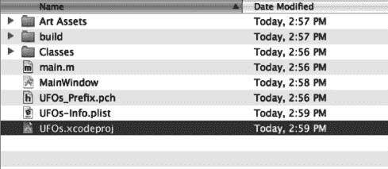

**图 1–1.** *在 Finder 中看到的 UFO 示例项目文件结构*

要开始游戏，请从 `构建菜单栏` 中选择 `构建并运行`。游戏将启动到一个通用界面，界面上只有一个标有“开始”的按钮。点击这个 `开始` 按钮。您将进入游戏界面，如图 1–2 所示。

游戏目标很常规：上下或左右倾斜设备，在屏幕上移动飞船。当飞船定位到一头奶牛上方时，点击屏幕任意位置并按住，直到奶牛被吸走。每吸走一头奶牛得一分。游戏没有终点。每次吸走一头奶牛后，都会生成一头新的奶牛。

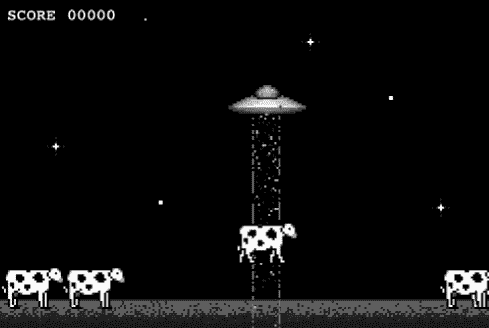

**图 1–2.** *UFO 示例项目的游戏运行视图*

现在您了解了游戏的整体玩法，可以查看实现这一切的源代码了。

### UFO：检查源代码

在项目组树中，您将看到我们要处理的三个类文件：`UFOAppDelegate`、`UFOViewController` 和 `UFOGameViewController`。这些文件都包含一个关联的头文件（`.h` 文件）和实现文件（`.m` 文件）。组树结构如图 1–3 所示。

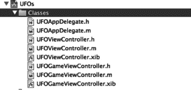

**图 1–3.** *在 Xcode 中查看示例项目的组树结构*

首先，查看 `UFOAppDelegate.h` 和 `UFOAppDelegate.m` 文件。根据其他 iOS 开发经验，这些文件应该看起来很熟悉。它们不过是 `UINavgiationController` 的一个基础子类。如果您需要熟悉其中的代码，可以查看 Apple 为新项目提供的示例代码。

下一组文件也相对简单：查看 `UFOViewController.h` 和 `UFOViewController.m`。这些是启动界面或主屏幕的关联类。目前这里只有一个开始按钮，但我们将随着本书的推进，向此视图添加排行榜、成就和多人游戏控制功能。

最后，我们将处理 `UFOGameViewController.m`。这是驱动所有游戏玩法的主类，也是大部分 Game Kit 功能将添加的地方。

#### 设置加速度计委托

我们从下载的源文件顶部开始逐一分析；在 Xcode 中打开 `UFOAppDelegate` 文件。我们修改了 App Delegate 的 `init` 方法，以注册加速度计反馈。请查看以下代码片段，接下来将详细讨论。

```
- init
{
    if (self != [super init])
        return nil;

    [[UIAccelerometer sharedAccelerometer] setUpdateInterval:0.05];
    [[UIAccelerometer sharedAccelerometer] setDelegate:self];

     return self;
}
```

首先需要重写 `init` 方法，开始监听 `UIAccelerometer` 输入。这将允许我们稍后监听加速度计输入的委托回调。为此，我们调用 `sharedAccelerometer` 单例，并将更新频率设置为 1/20 秒。然后，我们将委托设置为自己（`UFOGameViewController.m` 的一个实例）。

接下来，查看 `viewDidLoad` 方法。让我们将其分解为几个部分，以准确理解其中的逻辑。

```
accelerometerDamp = 0.3f;
accelerometer0Angle = 0.6f;
movementSpeed = 15;
```

这里我们设置了一些类变量，用于保存处理加速度计输入时需要的数据。当我们开始处理飞船移动时，将再次用到这些变量。目前，您无需完全理解它们的作用，只需知道它们已被设置即可。

#### 将玩家绘制到视图

接下来，我们需要创建“玩家”。

```
CGRect playerFrame = CGRectMake(100, 70, 80, 34);
myPlayerImageView = [[UIImageView alloc] initWithFrame: playerFrame];
myPlayerImageView.animationDuration = 0.75;
myPlayerImageView.animationRepeatCount = 99999;
NSArray *imageArray = [NSArray arrayWithObjects: [UIImage imageNamed: @"Saucer1.png"],
 [UIImage imageNamed: @"Saucer2.png"], nil];
myPlayerImageView.animationImages = imageArray;
[myPlayerImageView startAnimating];
[self.view addSubview: myPlayerImageView];
```

为此，我们创建一个新的 `UIImageView` 并使用预定义的帧进行初始化。接下来的四行代码是 `UIImageView` 中一个鲜为人知但非常有用的功能。我们设置了一个图像数组，`UIImageView` 将循环显示这些图像。在本示例中，我们设置了两张图像循环显示。我们还指定了完整动画所需的时间（这里设为 3/4 秒），以及动画重复的次数。设置完动画细节后，我们在 `UIImageView` 上调用 `startAnimating`。然后，剩下的工作就是将 `UIImageView` 添加到主视图。现在，屏幕上出现了一个正在动画的玩家！

#### 设置奶牛、光束和分数

我们需要初始化一些对象，并设置分数标签。

```
cowArray = [[NSMutableArray alloc] init];
tractorBeamImageView = [[UIImageView alloc] initWithFrame: CGRectZero];
score = 0;
scoreLabel.text = [NSString stringWithFormat: @"SCORE %05.0f", score];
```

分数标签本身已通过 Interface Builder 放置在视图上。

```
for(int x = 0; x < 5; x++)
{
        [self spawnCow];
}

[self updateCowPaths];
```

在 `viewDidLoad` 方法中，最后需要做的是创建一些奶牛放置在屏幕上。我创建了一个辅助方法来生成这些奶牛。每次调用该方法，都会创建一头新奶牛并放置在屏幕上。稍后我们将查看这个方法。我们还会调用另一个辅助方法来更新奶牛的行走路径。稍后将更详细地查看这个方法。

#### 处理旋转事件

代码中下一个出现的方法是 `shouldAutorotateToInterfaceOrientation` 方法。

```
(BOOL)shouldAutorotateToInterfaceOrientation:(UIInterfaceOrientation)
interfaceOrientation
{
        if(UIInterfaceOrientationIsLandscape(interfaceOrientation))
                return YES;

        return NO;
}
```

虽然这看起来是一小段代码，但确保游戏不允许用户旋转到竖屏模式非常重要。


好的，这是根据您的要求翻译并排版后的中文 Markdown 文档。


### 添加玩家移动

至此，我们完成了所有的初始化和设置代码。现在可以进入游戏更激动人心的部分了。首先，我们来看看用户输入和操作，然后是游戏玩法功能。

```
- (void)accelerometer:(UIAccelerometer *)accelerometer didAccelerate:(UIAcceleration *)acceleration
{
        accel[0] = acceleration.x * accelerometerDamp + accel[0] * (1.0 - accelerometerDamp);
        accel[l] = acceleration.y * accelerometerDamp + accel[l] * (1.0 - accelerometerDamp);
        accel[2] = acceleration.z * accelerometerDamp + accel[2] * (1.0 - accelerometerDamp);

       if(!tractorBeamOn)
               [self movePlayer:accel[0] :accel[l]];
}
```

首先来看加速度计的委托方法。我们获取加速度计的值，并对其应用一个阻尼系数，以提供更真实的感觉。然后我们执行一个检查，确保牵引光束已关闭（我们不希望在光束开启时还能移动），接着将这些值传递给我们的 `movePlayer` 方法，该方法如下所示。

```
-(void) movePlayer:(float)vertical :(float)horizontal;
{
        vertical += accelerometer0Angle;

        if(vertical > .50)
                vertical = .50;
        else if (vertical < -.50)
                vertical = -.50;

        if(horizontal > .50)
                horizontal = .50;
        else if (horizontal < -.50)
                horizontal = -.50;

        CGRect playerFrame = myPlayerImageView.frame;

        if ((vertical < 0 && playerFrame.origin.y < 120) || (vertical > 0 && playerFrame.origin.y > 20))
               playerFrame.origin.y -= vertical*movementSpeed;

        if ((horizontal < 0 && playerFrame.origin.x < 440) || (horizontal > 0 && playerFrame.origin.x > 0))
               playerFrame.origin.x -= horizontal*movementSpeed;

       myPlayerImageView.frame = playerFrame;
}
```

上面的方法看似复杂，实则比第一眼看到的要简单得多。第一段代码设置了我们的最大速度。下一段代码确保用户不能将其 UFO 移出屏幕。一旦我们检查了这两个安全网之后，我们就更新玩家的帧并移动 UFO。

### 监听触摸事件

接下来我们需要关注的游戏特性是触摸事件。我们将使用触摸来启动和控制牵引光束。第一步是重写 `touchesBegan` 事件。

```
- (void)touchesBegan:(NSSet *)touches withEvent:(UIEvent *)event
{
        currentAbductee = nil;

        tractorBeamOn = YES;

tractorBeamImageView.frame = CGRectMake(myPlayerImageView.frame.origin.x+25, myPlayerImageView.frame.origin.y+10, 28, 318);
        tractorBeamImageView.animationDuration = 0.5;
        tractorBeamImageView.animationRepeatCount = 99999;
NSArray *imageArray = [NSArray arrayWithObjects: [UIImage imageNamed: @"Tractor1.png"], [UIImage imageNamed: @"Tractor2.png"], nil];

        tractorBeamImageView.animationImages = imageArray;
        [tractorBeamImageView startAnimating];

        [self.view insertSubview:tractorBeamImageView atIndex:4];

        UIImageView *cowImageView = [self hitTest];

        if(cowImageView)
        {
                currentAbductee = cowImageView;
                [self abductCow: cowImageView];
        }

}
```

我们首先清除指向当前被绑架奶牛的指针。这个值应该已经是 `nil`，但保持谨慎总是好的。然后，我们将一个指示牵引光束是否开启的 BOOL 变量设置为真/是。此时，我们需要绘制牵引光束。为此，我们将 `tractorBeamImageView` 的帧设置到玩家 UFO 当前所在的位置。我们将使用前面本节演示的相同动画快捷方式来为牵引光束添加动画效果。然后，我们将牵引光束 `imageView` 添加到主视图；我们在这里使用 `insertSubview` 方法，以确保牵引光束位于奶牛之下但背景之上。然后我们调用 `hitTest` 方法，稍后我们会在本章中介绍它。如果我们从 `hitTest` 得到了一个结果，我们就调用 `abductCow` 方法。

在我们继续讲解 `hitTest` 和 `abductCow` 方法之前，我们必须先完成触摸事件的处理。目前我们关心的另一个触摸事件是 `touchesEnded` 委托回调。当用户将手指从屏幕上移开时，我们希望从视图中移除牵引光束，并让用户恢复移动。

```
- (void)touchesEnded:(NSSet *)touches withEvent:(UIEvent *)event
{
        tractorBeamOn = NO;

        [tractorBeamImageView removeFromSuperview];

        if(currentAbductee)
        {
                [UIView beginAnimations: @"dropCow" context:nil];
                [UIView setAnimationDuration: 1.0];
                [UIView setAnimationCurve:UIViewAnimationCurveEaseIn];
                [UIView setAnimationBeginsFromCurrentState: YES];

                CGRect frame = currentAbductee.frame;

                frame.origin.y = 260;
                frame.origin.x = myPlayerImageView.frame.origin.x +15;

                currentAbductee.frame = frame;
                [UIView commitAnimations];
        }

        currentAbductee = nil;
}
```

将 `tractorBeamOn` 的状态变量设为 `NO`。然后我们从视图中移除牵引光束图像。下一段代码将奶牛放回地面（如果它在空中半道）。为此，我们只需开始一个简单的动画，将奶牛送回地面水平。最后需要做的事情是将 `currentAbductee` 指针重置为 `nil`。


### 生成与移动奶牛

我们还有一个便捷方法来生成新奶牛。在`viewDidLoad`中调用此方法可赋予玩家基础数量的奶牛供其尝试绑架；同时，每当我们完成一只奶牛的绑架后，也会调用此方法。

```objc
-(void)spawnCow;
{
    UIImageView *cowImageView = [[UIImageView alloc] initWithFrame:CGRectMake
    (arc4random()%480, 260, 64, 42)];
    cowImageView.image = [UIImage imageNamed: @"Cow1.png"];
    [self.view addSubview: cowImageView];
    [cowArray addObject: cowImageView];

    [cowImageView release];
}
```

**提示：** `Arc4Random()` 的随机数生成方式与 `rand()` 或 `random()` 相同，但首次调用时会自动初始化种子。

我们创建一个代表奶牛的新的`imageView`，然后利用`arc4Random()`函数生成随机的 x 坐标位置。接着设置奶牛使用的图像，并将其添加到主视图中。最后一步是将`imageView`添加至`cowArray`数组中，后续将用于碰撞检测以及移动路径更新。

虽然 UFO 游戏并未被设计成极具挑战性的游戏，但我们仍希望在玩法中增加一定难度的元素。以下方法将使奶牛在屏幕上随机游走。

```objc
-(void)updateCowPaths
{
    for(int x = 0; x < [cowArray count]; x++)
    {
        UIImageView *tempCow = [cowArray objectAtIndex: x];

        if(tempCow != currentAbductee)
        {
            continue;
        }

        [UIView beginAnimations:@"cowWalk" context:nil];
        [UIView setAnimationDuration: 3.0];
        [UIView setAnimationCurve:UIViewAnimationCurveLinear];

        float currentX = tempCow.frame.origin.x;
        float newX = currentX + arc4random()%100-50;

        if(newX > 480)
            newX = 480;
        if(newX < 0)
            newX = 0;

        if(tempCow != currentAbductee)
            tempCow.frame = CGRectMake(newX, 260, 64, 42);

        [UIView commitAnimations];

        tempCow.animationDuration = 0.75;
        tempCow.animationRepeatCount = 99999;

        //flip cow
        if(newX < currentX)
{
    NSArray *flippedCowImageArray = [NSArray arrayWithObjects:
     [UIImage imageNamed: @"Cow1Reversed.png"], [UIImage imageNamed: @"Cow2Reversed.png"],
     [UIImage imageNamed: @"Cow3Reversed.png"], nil];
    tempCow.animationImages = flippedCowImageArray;
}

else
{
    NSArray *cowImageArray = [NSArray arrayWithObjects: [UIImage imageNamed:
     @"Cow1.png"], [UIImage imageNamed: @"Cow2.png"], [UIImage imageNamed: @"Cow3.png"],
     nil];
    tempCow.animationImages = cowImageArray;
}

        [tempCow startAnimating];
    }
}

//change the paths for the cows every 3 seconds
[self performSelector:@selector(updateCowPaths) withObject:nil afterDelay:3.0];
```

我们需要遍历奶牛对象数组，这在前一个方法的第一行完成。然后为奶牛随机生成一个新的 x 坐标位置，并通过快速检查确保不会指示奶牛走出屏幕。随后提交动画。我们还需要处理奶牛的方向变化。

**注意：** 处理该事件的代码并非翻转图像的最优方式，但若你对此类游戏开发尚不熟悉，这是最容易理解的方法。

与之前处理牵引光束和 UFO 图像类似，我们会添加一些动画帧，使奶牛的行走看起来更真实。最后一步是调用`performSelector`并设置三秒延迟。这将每三秒更新一次奶牛的移动路径，从而呈现更逼真的随机运动效果。

### 对 UIImage 执行碰撞检测

在考虑如何设置奶牛绑架机制之前，有一些初步步骤需要完成。首先必须实现`hitTest`方法，该方法由本节前面讨论的`touchesBegan`事件调用。

```objc
-(UIImageView *)hitTest
{
    if(!tractorBeamOn)
        return nil;

    for(int x = 0; x < [cowArray count]; x++)
    {
        UIImageView *tempCow = [cowArray objectAtIndex: x];
        CALayer *cowLayer= [[tempCow layer] presentationLayer];
        CGRect cowFrame = [cowLayer frame];

        if (CGRectIntersectsRect(cowFrame, tractorBeamImageView.frame))
        {
            tempCow.frame = cowLayer.frame;
            [tempCow.layer removeAllAnimations];
            return tempCow;
        }
    }

    return nil;
}
```

第一行是一个健全性检查，确保在`tractorBeam`未开启时不会调用`hitTest`方法。确认需要执行碰撞检测后，我们遍历奶牛对象数组。由于奶牛正处于动画过程中，我们不能依赖帧数据，因为帧数据显示的是奶牛的最终位置而非当前位置。

要确定奶牛当前的位置，我们需要获取`presentationLayer`。Core Graphics 提供了一个便捷的方法来检测两个`CGRect`是否相交，这正是此处所需的功能。如果检测到碰撞，则返回该奶牛对象。若遍历完整个循环仍未检测到碰撞，则返回`nil`。

**提示：** 可对任意`CALayer`调用`presentationLayer`，以获取正在动画过程中图层当前值的最佳估算。


#### 绑架奶牛

在 `touchesBegan` 方法中，我们通过 `hitTest` 来检测是否返回了一头奶牛。如果是，我们就调用 `abductCow` 方法，并将返回的对象传递给它。

```
-(void)abductCow:(UIImageView *)cowImageView;
{
        [UIView beginAnimations: @"abduct" context:nil];
        [UIView setAnimationDuration: 4.0];
        [UIView setAnimationCurve:UIViewAnimationCurveEaseIn];
        [UIView setAnimationDelegate: self];
        [UIView setAnimationDidStopSelector: @selector(finishAbducting)];
        [UIView setAnimationBeginsFromCurrentState: YES];

        CGRect frame = cowImageView.frame;
        frame.origin.y = myPlayerImageView.frame.origin.y;
        cowImageView.frame = frame;

        [UIView commitAnimations];
}
```

我们开始在奶牛对象（它是一个 `imageView`）上执行一个动画事件。我们还设置了一个 `didStopSelector`，它将在动画完成后被调用。我们将奶牛的新 Y 轴坐标设置为我们 UFO 的当前 Y 坐标，然后启动动画。

动画停止后，我们会收到 `finishAbducting` 的回调。这让我们可以增加分数、清理绑架代码并生成一头新的奶牛。

```
-(void)finishAbducting;
{
        if(!currentAbductee || ItractorBeamOn)
        {
                return;
        }

        [cowArray removeObjectIdenticalTo: currentAbductee];
        [tractorBeamImageView removeFromSuperview];

        tractorBeamOn = NO;

        score++;
        scoreLabel.text = [NSString stringWithFormat: @"SCORE %05.0f", score];

        [currentAbductee.layer removeAllAnimations];
        [currentAbductee removeFromSuperview];

        currentAbductee = nil;

        //生成一头新奶牛
        [self spawnCow];
}
```

在方法开始时，我们检查牵引光束是否仍然开启，并且我们是否有一个被绑架者。就像用户从屏幕松开手指时一样，我们也要从视图中移除牵引光束图像，并正确设置状态变量。用户每绑架一头奶牛，我们就奖励一分，并相应地更新 `scoreLabel`。然后我们清理旧的奶牛图像，将其设回 `nil`。现在我们生成一头新奶牛来替换被绑架的那头。

#### 为 Game Center 配置 iTunes Connect

在你的 iOS 应用或游戏能够访问任何 Game Center 功能之前，它需要在 iTunes Connect 中进行配置。iTunes Connect 诞生于 App Store 和 iPhone 之前；它最初是为音乐人和媒体制作人提供的一个门户，用于将他们的内容上传到 iTunes Music Store。后来它被改造，允许开发者上传他们的 iOS 软件在 App Store 上销售。自 2008 年 7 月向 iPhone 开发者开放以来，iTunes Connect 已经发生了巨大的变化。苹果已经开始将其作为应用配置的主要来源。诸如应用内购买（IAP）、iAds 和 Game Center 等功能都需要在 iTunes Connect 中进行配置。

**注意：** 你仍然可以使用任何独立的 Game Kit 功能，而无需为你的应用设置 Game Center。有关 Game Kit 独立功能的更多信息，请参阅第 6 章、第 7 章、第 8 章和第 10 章。

### 开始使用 iTunes Connect

如果你从未向 App Store 上传过应用，你可能不熟悉 iTunes Connect 门户。然而，如果你之前使用过 iTunes Connect，你可能想跳到下一节，因为这部分内容对你来说只是复习。

iTunes Connect 是一个网页门户，可以通过任何网页浏览器访问 [`http://itunesconnect.apple.com`](http://itunesconnect.apple.com)。你将使用你注册为开发者时使用的现有 AppleID 来访问该门户。当你想要上传新应用到 App Store 销售，或者对它们进行任何更改（例如价格或描述）时，你将使用相同的 web 应用程序。iTunes Connect 的登陆页面视图如图 1-4 所示。

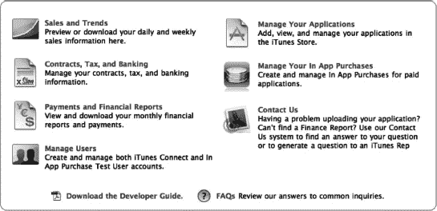

**图 1-4.** *2010 年 12 月拍摄的 iTunes Connect 视图*

当你登录 iTunes Connect 时，你会看到大量的选项。其中最重要的是设置你的合同、税务和银行信息。虽然这些要求本身与 Game Center 无关，但最好先处理掉它们。

苹果可能需要数周时间来处理这些信息，所以请尽快提交。在这些信息被处理和批准之前，你将无法在 App Store 上发布软件。一旦你完成了本节下所有要求的信息，你就可以专注于应用开发本身了。

**注意：** 如果你只计划发布免费的 iOS 应用，你不需要完成付费应用合同。但是，如果你将来计划发布任何付费软件，则应尽快完成这些合同。

在你访问任何 Game Center 专属信息之前，你需要创建一个新的（或使用现有的）iOS 应用。这是一个直接的过程，iTunes Connect 会引导你完成。你从“管理您的应用程序”部分开始；在那里你会找到一个“添加新应用”按钮。其余步骤应该是相当不言自明的。

如果你还没有准备好上传应用，你可以在这里创建占位数据，以便访问 Game Center 门户。一旦你的应用在 iTunes Connect 中创建，你就可以开始配置 Game Center 专属信息。

**警告：** 如果你创建了一个应用，但未能在 90 天内上传一个发布版本，苹果将删除该应用信息，并限制你将来使用相同名称创建新应用。这是 2010 年底引入的，旨在防止人们“域名抢注”应用名称。

#### 在 iTunes Connect 中配置 Game Center

一旦你在 iTunes Connect 中选择了你的应用，你会看到一个类似于本节稍后图 1-5 中屏幕截图的视图。如果你将注意力转向应用屏幕的右上角区域，你会注意到一个“管理 Game Center”按钮。

如果你熟悉在之前的 iOS 应用中配置 iAds 或应用内购买，那么这一区域对你来说会非常熟悉。配置 iAds 和 IAP 的过程与处理 Game Center 相似。

当你第一次进入应用的 Game Center 门户时，系统会询问你是否要启用 Game Center，如图 1-5 所示。一旦启用，你将获得添加新排行榜或成就的选项。我们将在后面的章节中更详细地讨论这些选项（第 3 章涵盖排行榜，第 4 章涵盖成就）。现在，我们需要做的就是确保为我们的应用启用了 Game Center。

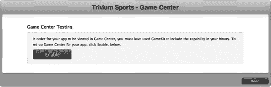

**图 1-5.** *新应用的 Game Center 门户的第一个视图*

**提示：** 如果你的应用难以识别 Game Center，最可能的原因是以下两个常见问题之一。确保你的应用使用了与 App 信息页面（见图 1-6）中相同的捆绑标识符。第二个问题可能是你等待的时间不够长。在 iTunes Connect 中对 Game Center 进行更改与 iOS 应用注意到这些更改之间可能有长达 30 分钟的延迟。

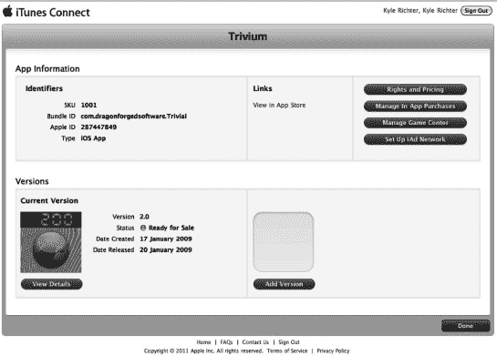

**图 1-6.** *iTunes Connect 中看到的特定应用视图。你可以在图片右上角看到“管理 Game Center”按钮。*


### 概述

现在您应该已经基本了解了 Game Kit 和 Game Center 所提供的功能，同时也对本书后续示例项目有了深入的理解。此外，您现在应该能够熟练地在 iTunes Connect 中为使用 Game Center 创建新应用。

在接下来的章节中，您将学习如何将 Game Center 和 Game Kit 的所有功能集成到 iOS 应用中。基于 iOS 的设备家族正处于起步阶段，而 Game Center 是首个面向开发者推出的下一代 API。这些新技术让我们得以一窥 iOS 开发者的未来。下一章中，您将学习如何将 Game Center 集成到一个项目中。

## 第二章：Game Center：配置与入门

在上一章中，我们学习了如何在 iTunes Connect 中配置 Game Center，并开始使用示例项目 "UFOs"。本章我们将讨论如何将 Game Center 集成到我们的应用中，并通过实际操作代码来深入实践。

您将学习如何检测 Game Center 兼容性，探索沙盒的限制，验证本地玩家，处理会话以及获取好友列表。您还将创建我们将在本书后续部分持续使用的 `GameCenterManager` 类。

### 测试 Game Center

在调用任何 Game Center 相关代码之前，我们需要先进行测试，以确认用户的 iOS 版本是否支持 Game Center。要执行此检查，首先要创建新的 `GameCenterManager` 类。我们将在本书后续部分使用该类，将所有 Game Center 功能集中在一个易于访问的类中。这个类将容纳所有 Game Center 相关的代码和回调，并且可以轻松地在您的所有应用之间共享。

首先，在 Xcode 中创建一个新文件。从可用模板中选择 **Objective-C Subclass（Objective-C 子类）**。务必在 “Subclass of”（子类）下拉菜单中选择 `NSObject`。将新类命名为 `GameCenterManager`，如图 2–1 所示。

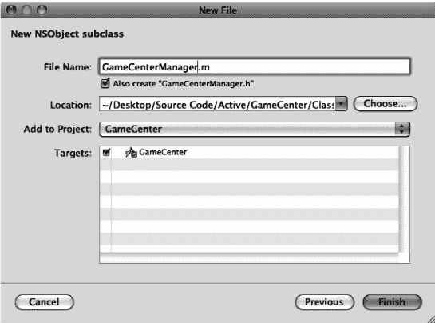

**图 2–1.** *创建 GameCenterManager 类*

将以下方法添加到您的 `GameCenterManager` 类中。

```
+ (BOOL) isGameCenterAvailable
{
        Class gcClass = (NSClassFromString(@"GKLocalPlayer"));

        NSString *reqSysVer = @"4.1";
        NSString *currSysVer = [[UIDevice currentDevice] systemVersion];

        BOOL osVersionSupported = ([currSysVer compare:reqSysVer options:NSNumericSearch] !=
 NSOrderedAscending);

        return (gcClass && osVersionSupported);
}
```

此方法通过 `NSClassFromString` 函数创建了一个新的类对象。如果 `GKLocalPlayer` 存在于 API 中，则 `gcClass` 将非空。我们还测试了最低操作系统版本。由于许多 Game Center 类在 API 可用之前就已包含在内，我们需要执行两项检查。接下来的三行代码将当前 iOS 版本与我们设定的版本字符串 `4.1` 进行比较。该方法返回结果，如果设备支持 Game Center，则结果为 true。

**注意：** 无论用户是否拥有支持 Game Center 的设备，您都应尽一切努力让他们能够与您的应用进行交互。如果用户没有支持 Game Center 的设备，您仍需确保他们能够使用应用中非社交功能的部分。

**提示：** 如果您确实想将应用限制为只有拥有支持 Game Center 设备的用户才能使用，请在您的 `info.plist` 文件中添加一个名为 `UlRequiredDeviceCapabilities` 的新键，并将其值设为 `gamekit`。这将限制您的应用在 App Store 中仅能被拥有支持 Game Center 设备的用户购买。

现在您可以修改 `UFOViewController.m` 文件以执行 Game Center 可用性检查。创建一个新的 `viewDidLoad` 方法，如下代码片段所示：

```
-(void)viewDidLoad
{
        [super viewDidLoad];

        if([GameCenterManager isGameCenterAvailable])
                NSLog(@"Game Center is available");

        else
                NSLog(@"Game Center not available");
}
```

**警告：** 如果您发现即使 Game Center 应该可用，`isGameCenterAvailable` 方法也总是返回 NO，最可能的原因是您忘记在 target 中包含 Game Kit 框架。

至此，所有代码的作用仅仅是向控制台输出 Game Center 是否可用。我们将在下一节扩展此代码。

### 使用 Game Center 进行身份验证

一旦您的应用确定设备是否支持 Game Center，您就可以对用户进行身份验证。通过 Game Center 身份验证的用户始终被称为本地玩家（local player），并由 `GKLocalPlayer` 类表示。在使用任何其他 Game Center 功能之前，您必须先对本地玩家进行身份验证。

苹果建议您尽可能早地在应用中完成 Game Center 身份验证。在用户需要访问任何 Game Center 行为之前进行身份验证，主要原因是为了确保当用户想要执行 Game Center 操作时，无需等待网络回调来验证用户。尽早身份验证还能确保用户在游戏过程中不会突然被提示登录。我们将在后续章节探讨更多好处，例如重新提交此前未能成功提交的高分。


#### 修改 `GameCenterManager` 类

处理身份验证需要在 `GameCenterManager` 类中添加额外的代码。定义一个新协议，并将以下代码块添加到 `GameCenterManager.h` 文件中 `@interface` 行的上方。这将创建一个名为 `processGameCenterAuthentication:` 的新可选委托回调方法。

```
@protocol GameCenterManagerDelegate <NSObject>
@optional
- (void)processGameCenterAuthentication:(NSError*)error;
@end
```

需要在 `GameCenterManager` 的实现中添加一个新方法。创建一个如下所示的新方法。

```
- (void) authenticateLocalUser
{
        if([GKLocalPlayer localPlayer].authenticated)
        {
                return;
        }

[[GKLocalPlayer localPlayer] authenticateWithCompletionHandler:^(NSError *error)
        {
[self callDelegateOnMainThread: @selector(processGameCenterAuthentication:) withArg: NULL error: error];
        }];
}
```

**提示：** 不要忘记导入 `<GameKit/GameKit.h>` 头文件以及相关的 Game Kit 框架；否则，`GKLocalPlayer` 将无法定义。

上述方法将作为与 Game Center 进行身份验证的辅助方法。第一行代码检查 `localPlayer` 单例，以确认用户是否已经通过身份验证。如果已通过，方法执行完毕。如果用户尚未通过身份验证，则会调用 `authenticateWithCompletionHandler:`。

当 `authenticateWithCompletionHandler:` 执行完毕后，我们调用 `[self callDelegateOnMainThread: @selector(processGameCenterAuthentication:) withArg: NULL error: error]`。为了继续，我们必须实现此方法。

**注意：** 如果你以前从未使用过块（blocks），它们可能会让人有些困惑。Game Center 高度依赖块，在本节中你将看到大量相关内容。

根据我的经验，理解块的最佳方式是将它们视为内联函数，在调用它们的方法执行完毕后运行。在上面的例子中，`authenticateWithCompletionHandler:` 执行完毕后，它会调用 `[self callDelegateOnMainThread: @selector(processGameCenterAuth:) withArg: NULL error: error];`。

在继续之前，对块有扎实的基础知识会很有帮助。如果你对块的使用不太确定，我建议你阅读 Apple Developer Connection 上关于块的文章，地址为 [`developer.apple.com/library/mac/#documentation/Cocoa/Conceptual/Blocks/Articles/bxUsing.html`](http://developer.apple.com/library/mac/#documentation/Cocoa/Conceptual/Blocks/Articles/bxUsing.html)。

你还需要将以下方法添加到 `GameKitManager.m` 中。添加完成后，我们将讨论它们的具体功能。

```
- (void) callDelegateOnMainThread: (SEL) selector withArg: (id) arg error: (NSError*) err
{
        dispatch_async(dispatch_get_main_queue(), ^(void)
         {
                   [self callDelegate: selector withArg: arg error: err];
        });
}
```

我们所有的委托回调都需要在主线程上执行；Game Center 并不保证回调块会在主线程上执行，如果不强制在主线程上运行，它们可能会在后台线程中执行。由于 `UIKit` 视图控制器只能在主线程上安全访问，在后台线程调用委托可能会导致崩溃或其他意外行为。为了避免产生任何与线程相关的错误（这类错误可能非常难以追踪），我们将在主线程上将所有内容传回给委托。

**注意：** 有多种方法可以强制代码在主线程上执行，或确保线程安全。出于我们的目的，将使用上述方法。这对于可能不太熟悉 iOS 平台线程处理的读者来说最容易理解。

在确保我们在主应用线程上操作后，以下方法将从 `callDelegateOnMainThread:` 方法内部被调用。此方法检查我们是否在主线程上，然后使用传递的信息调用我们的协议方法。

```
- (void) callDelegate: (SEL) selector withArg: (id) arg error: (NSError*) err
{
        assert([NSThread isMainThread]);
        if([delegate respondsToSelector: selector])
        {
                if(arg != NULL)
                        [delegate performSelector: selector withObject: arg withObject: err];

               else
                        [delegate performSelector: selector withObject: err];
       }

       else
               NSLog(@"Missed Method");
}
```

如果你尚未实现委托方法，将在控制台中看到一条“Missed Method”的 `NSLog` 信息。这仅用于辅助调试，能帮你省去排查协议方法时的一些困惑。

我们需要在 `GameCenterManager` 类中做的最后一件事情是添加委托属性。修改头文件的相关部分，使其看起来像以下代码。

```
@interface GameCenterManager : NSObject <GameCenterManagerDelegate>
{
        id <GameCenterManagerDelegate, NSObject> delegate;
}

@property(nonatomic, retain) id <GameCenterManagerDelegate, NSObject> delegate;
```

除了这些修改之外，你还需要在 `dealloc` 中对委托进行合成（synthesize）以及释放（release）。至此，`GameCenterManager` 类所需的更改全部完成。

**提示：** 如果你收到警告，提示 `GameCenterManager` 可能无法响应我们实现的任何方法，请确保已将这些方法添加到接口文件中。


#### 从 `UFOViewController` 进行身份验证

现在我们已经修改了 `GameCenterManager` 类以支持身份验证，接下来需要在 `UFOViewController` 类中创建一个新对象来代表 `GameCenterManager`。

导入 `GameCenterManager` 的头文件，并创建一个名为 `gcManager` 的新 `GameCenterManager` 对象。同时，你还需要将 `GameCenterManagerDelegate` 添加到 `UFOViewController.h` 的接口中。完成后，`UFOViewController.h` 应如下所示。

```
#import <UIKit/UIKit.h>
#import "GameCenterManager.h"

@interface UFOViewController : UIViewController <GameCenterManagerDelegate>
{
    GameCenterManager *gcManager;
}

-(IBAction)playButtonPressed;
@end
```

你将再次修改 `UFOViewController` 的 `viewDidLoad` 方法。对 `viewDidLoad` 方法进行必要的修改，使其与以下代码片段一致。

```
-(void)viewDidLoad
{
    [super viewDidLoad];

    if ([GameCenterManager isGameCenterAvailable])
        return;

    gcManager = [[GameCenterManager alloc] init];
    gcManager.delegate = self;
    [gcManager authenticateLocalUser];
}
```

我们添加的第一行新代码初始化并分配了一个 `GameCenterManager` 实例。下一行将委托对象 `self` 设置为 `UFOViewController` 类；这将允许我们从 `GameCenterManager` 获取回调。

完成这两个步骤后，我们可以调用便捷方法 `authenticateLocalUser`。此时，Game Center 会处理所需的登录视图和身份验证，以及任何账户创建操作。不过，我们仍需监控委托方法 `processGameCenterAuthentication`，以便捕获身份验证过程中遇到的任何错误。

**注意：** 如果你在应用内取消 Game Center 登录三次或以上，则在前往 `GameCenter.app` 并登录之前，你将无法再从该应用登录。这是一个未记录的行为，如果你不清楚问题所在，排查起来会相当棘手。此外，如果你发现即使从 `GameCenter.app` 也无法登录，可以重置模拟器或还原设备来解决这些问题。

如果你再次运行应用，将在控制台日志中看到“Missed Method”。这是因为我们尚未添加身份验证完成时调用的可选协议方法。我们需要在 `UFOViewController.m` 中添加以下方法。

```
- (void)processGameCenterAuthentication:(NSError*)error;
{
    if (error != nil)
    {
        NSLog(@"An error occured during authentication: %@", [error localizedDescription]);
    }
    else
    {
        NSLog(@"Successfully authenticated");
    }
}
```

现在，当你登录时，应该会在控制台中看到“Successfully authenticated”，同时还会显示图 2–2 中所示的图像（其中显示的是你的 Game Center 名称）。

**注意：** 在测试目的下登录 Game Center 时，请始终创建一个新的 Apple ID。切勿使用现有的 Apple ID 从沙盒环境登录 Game Center。

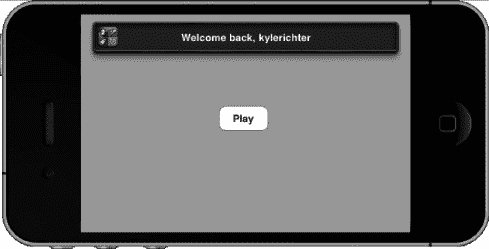

**图 2–2.** *用户登录 Game Center 时看到的欢迎回馈标准消息*

**提示：** 如果登录遇到问题，请确保 `info.plist` 中的包 ID 与 iTunes Connect 中启用了 Game Center 的包 ID 一致。有关在 iTunes Connect 中配置 Game Center 的更多信息，请参阅第 1 章。

### 沙盒

为了帮助应用在上线前进行测试，Apple 为 Game Center 提供了沙盒环境。沙盒的功能与生产版本的 Game Center 完全相同，同时所有活动对普通用户保持隐藏。

沙盒允许开发人员秘密开发新的 Game Center 功能，同时避免测试数据污染排行榜和成就系统。登录沙盒环境时，登录提示顶部会显示“*** Sandbox ***”。

**注意：** 在撰写本文时，存在一个错误，导致在横屏模式下沙盒消息无法显示。

登录后，无法从应用内部判断当前是否登录了沙盒。但如果你打开 `GameCenter.app`，便会看到自己是否处于沙盒环境中。表 2–1 中的信息将帮助你判断当前运行的模式。

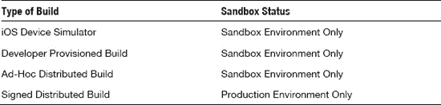

### 监听状态变化

从 iOS 4.0 开始，iOS 设备获得了同时运行多个应用的能力。这在处理状态时可能会产生一些复杂的行为错误，特别是当用户同时访问两个启用了 Game Center 的应用时。例如，当你的应用在后台运行时，用户可能会退出 Game Center，甚至以不同用户身份登录。因此，通过 `NSNotification` 系统监听本地用户的变化至关重要。

在 `UFOViewController.m` 的 `viewDidLoad` 方法中，验证 Game Center 是否可用的测试代码之后，立即添加以下代码片段。

```
[[NSNotificationCenter defaultCenter]
                             addObserver:self
                                selector:@selector(localUserAuthenticationChanged:)
                                    name:GKPlayerAuthenticationDidChangeNotificationName
                                  object:nil];
```

**注意：** 不要忘记在 `viewDidUnload` 中移除 `NSNotification` 观察者，否则可能会导致崩溃或其他意外行为。

你还需要向 `UFOViewController` 添加一个新方法。该方法将在玩家身份验证状态发生变化时被调用。

```
-(void)localUserAuthenticationChanged:(NSNotification *)notif;
{
    NSLog(@"Authenication Changed: %@", notif.object);
}
```

这个新方法会在身份验证发生变化时打印新的 `GKLocalPlayer` 描述。你需要确定在应用中需要采取哪些特殊步骤来处理本地玩家的变化。

**提示：** 在发布应用之前，不要忘记测试用户切换，因为 Apple 在审核阶段会对此进行测试。

### 使用 `GKLocalPlayer`

当通过 Game Center 完成身份验证后，`GKLocalPlayer` 将始终存在且非 nil；该对象是用户的表示。你永远不会创建 `GKLocalPlayer` 的实例；这是通过类方法 `localPlayer` 处理的。`localPlayer` 单例是你与本地玩家交互的唯一方式。

`GKLocalPlayer` 有三个关联的属性：`authenticated`、`friends` 和 `underage`。我们将在下一节中处理 `friends` 属性。在前面的身份验证代码中，我们已经使用了布尔值 `authenticated`。

`underage` 属性对于限制启用了 Game Center 的应用中 17 岁以上用户的内容非常有用。以下代码执行年龄检查。

```
if ([GKLocalPlayer localPlayer].underage)
{
    NSLog(@"User is underage");
}
```

`friends` 属性将返回 `nil`，直到我们完成获取用户好友列表所需的步骤。完成后，`friends` 属性将返回包含本地用户好友的数组。此过程将在下一节中详细说明。


### 获取好友列表

好友列表是你在“游戏中心”应用中指定为好友的用户 ID 数组。利用这些数据，你可以实现诸如仅限游戏内语音频道的好友列表，或在全局排行榜中高亮显示好友分数等功能。

我们将在示例项目中添加一个获取好友列表的调用，但本章不会对这些数据进行任何特定处理。目前，我们仅将其打印到调试器控制台。

首先，我们修改 Game Center Manager 类，添加一个新方法用于获取本地玩家的好友列表。请在实现中添加以下方法。

```
- (void)retrieveFriendsList;
{
        if ([GKLocalPlayer localPlayer].authenticated == YES)
        {
[[GKLocalPlayer localPlayer] loadFriendsWithCompletionHandler:^(NSArray *friends, NSError *error)
                 {
[self callDelegateOnMainThread: @selector(friendsFinishedLoading:error:) withArg: friends error: error];
                 }];
        }
        else
{
                NSLog(@"You must authenicate first");
        }
}
```

这个方法与本章前面添加的 authenticate 方法非常相似。在确认 `GKLocalPlayer` 有效后，我们可以调用 `loadFriendsWithCompletionHandler`。该方法返回一个玩家 ID 数组。我们将在下一节中看到如何使用这些玩家 ID 来获取 `GKPlayer` 对象。然后，我们使用线程安全的 `callDelegateOnMainThread` 方法将数据返回给委托。

在执行这段代码之前，我们还需要修改头文件，并为委托添加一个新的协议方法。我们将头文件修改为如下代码片段所示。

```
@protocol GameCenterManagerDelegate <NSObject>
@optional
- (void)processGameCenterAuthentication:(NSError*)error;
- (void)friendsFinishedLoading:(NSArray *)friends error:(NSError *)error;
@end

@interface GameCenterManager : NSObject <GameCenterManagerDelegate>
{
        id <GameCenterManagerDelegate, NSObject> delegate;
}

@property(nonatomic, retain) id <GameCenterManagerDelegate, NSObject> delegate;

+ (BOOL)isGameCenterAvailable;
- (void)authenticateLocalUser;
- (void)callDelegateOnMainThread:(SEL)selector withArg:(id) arg error:(NSError*) err;
- (void)callDelegate:(SEL)selector withArg:(id)arg error:(NSError*) err;
- (void)retrieveFriendsList;
@end
```

在上述代码片段中，我们添加了一个新的可选协议，该协议在好友数据加载块执行完毕时被调用。我们返回一个好友 ID 数组以及遇到的任何错误。同时，我们还为类方法添加了一个名为 `retrieveFriendsList` 的新方法。

在运行应用程序之前，最后需要做的是添加对 `retrieveFriendsList` 的调用，并在 `UFOViewController.m` 中添加协议方法。由于只有在成功通过 Game Center 认证后，我们才能调用获取好友列表的方法，因此可以在认证回调中添加该调用。将该方法修改为以下片段所示。

```
- (void)processGameCenterAuthentication:(NSError*)error;
{
        if (error != nil)
        {
NSLog(@"An error occured during authentication: %@", [error localizedDescription]);
}
        else
        {
                [gcManager retrieveFriendsList];
        }
}
```

我们还将添加一个协议方法，用于将好友列表打印到控制台。请将以下方法添加到 `UFOViewController.m` 中。

```
- (void)friendsFinishedLoading:(NSArray *)friends error:(NSError *)error;
{
        if(error != nil)
        {
NSLog(@"An error occured during friends list request: %@", [error localizedDescription]);
        }
        else
        {
                NSLog(@"Friends: %@", friends);
        }
}
```

如果你的好友列表中有任何好友，你应该会看到类似以下的输出。

```
2011-02-01 12:56:32.759 UFOs[3328:207] Friends: (
    "G:1093075676"
)
```

**注意：** 如果你尚未在沙箱环境中添加任何好友，现在正是添加的好时机。你可以在 Game Center 应用中创建新账户，并将它们作为好友添加到你的测试账户中。拥有一个包含好友的列表，将对本书中调试 Game Center 代码非常有帮助。

下一节将讨论如何处理从好友列表中获取的玩家数据。

#### 好友列表头像

iOS 5.0 增加了对好友头像的支持。玩家需要在 Game Center 应用中设置其头像。如果未设置头像，Game Center 将为其分配一个默认头像。要在你的应用中访问头像，你需要运行 iOS 5.0 或更高版本，并且需要实现一个新方法。以下方法是在现有的 `GKPlayer` 对象上调用的（关于 `GKPlayer` 的更多信息，请参见上一节）。头像图片尺寸有两个选项：`GKPhotoSizeNormal` 和 `GKPhotoSizeSmall`。截至 iOS 5.0 beta 4，它们的大小并未明确定义，因此你需要根据实际需求试验选择合适的尺寸。

```
[player loadPhotoForSize:GKPhotoSizeNormal withCompletionHandler: ^(UIImage *photo, NSError *error)
     {
         if(error == nil)
         {
             playerAvatarImageView.image = photo;
         }
         else
         {
NSLog(@"An error occurred loading player avatar: %@, [error localizedDescription]);
         }
      }];
```


### 与玩家协作

Game Center 的核心是一项社交服务，因此它的运转离不开玩家。你需要了解与 `GKPlayer` 对象关联的三个属性。`isFriend` 属性是一个布尔值，用于返回该玩家是否为当前本地玩家的好友。另外两个属性用于处理玩家名称：`playerID` 和 `alias`。`playerID` 是静态的，始终指向同一玩家。**切勿**在你的应用中将 `playerID` 字符串展示给用户。而 `alias` 是动态的，用户可以随时更改。**切勿**用它来验证用户身份，但它应是唯一用于向应用用户标识该玩家的字符串。

**注意：** 不要对玩家标识字符串的结构做任何假设。其格式和长度可能随时变更。

当我们获取好友列表时，返回的并不是 `GKPlayer` 的数组，而是他们的 ID 数组。这是 Game Center 的常见行为。为了方便处理玩家信息，我们将添加两个额外的便捷方法，用于将玩家 ID 转换为 `GKPlayer` 对象。

我们需要创建两个新方法：一个用于处理玩家 ID 数组，另一个用于处理单个玩家 ID。这将为后续工作节省额外精力。我们将这些辅助方法添加到 `GameCenterManager` 类中。首先，添加新的协议方法，并修改 `GameCenterManager.h` 文件的相关部分，使其与以下代码一致。

```
@protocol GameCenterManagerDelegate <NSObject>
@optional
- (void)processGameCenterAuthentication:(NSError*)error;
- (void)friendsFinishedLoading:(NSArray *)friends error:(NSError *)error;
- (void)playerDataLoaded:(NSArray *)players error:(NSError *)error;
@end
```

我们还将以下两个新方法添加到 `GameCenterManager` 类的实现文件中。

```
- (void)playersForIDs:(NSArray *)playerIDs
{
[GKPlayer loadPlayersForIdentifiers:playerIDs withCompletionHandler:
^(NSArray *players, NSError *error)
         {
[self callDelegateOnMainThread: @selector(playerDataLoaded:error:)
 withArg: players error: error];
        }];
}
```

```
- (void)playerforID:(NSString *)playerID
{
[GKPlayer loadPlayersForIdentifiers:[NSArray arrayWithObject:playerID]
 withCompletionHandler:^(NSArray *players, NSError *error)
         {
[self callDelegateOnMainThread: @selector(playerDataLoaded:error:) withArg:
 players error: error];
         }];
}
```

这两个方法都将使用 `loadPlayersForldentifiers`。唯一的区别在于，一个方法接收字符串并将其转换为单元素数组，另一个方法则直接接收数组。同样，我们将使用线程安全的委托回调。

最后一步是在 `UFOViewController` 中实现委托回调。首先修改好友加载方法，将好友列表转换为 `GKPlayer` 对象数组。按以下代码修改你的 `friendsFinishedLoading` 方法：

```
- (void)friendsFinishedLoading:(NSArray *)friends error:(NSError *)error;
{
        if (error != nil)
        {
NSLog(@"An error occured during friends list request: %@",
 [error localizedDescription]);
        }
        else
        {
                [gcManager playersForIDs: friends];
        }
}
```

你还需要添加刚刚定义的新协议方法。将以下代码添加到 `UFOViewController.m` 文件中：

```
- (void)playerDataLoaded:(NSArray *)players error:(NSError *)error;
{
        if (error != nil)
        {
NSLog(@"An error occured during player lookup: %@", [error localizedDescription]);
        }
        else
        {
                NSLog(@"Players loaded: %@", players);
        }
}
```

现在，运行 App 时（假设你的 Game Center 账户有关联好友），它将拉取好友的 `playerID` 列表，然后执行查询，并将 `GKPlayer` 描述信息打印到控制台。你的输出应该类似于以下内容：

```
2011-02-01 14:20:23.335 UF0s[4038:207] Authenication Changed: <GKPlayer
 0x5f46fb0>(playerID: G:1092793231, alias: the_other_kyle, status: (null), rid:(null))
2011-02-01 14:20:23.471 UF0s[4038:207] Players loaded: (
    "<GKPlayer 0x6a201e0>(playerID: G:1093075676, alias: johncash, status: (null),
 rid:(null))"
)
```

### 本章小结

在本章中，你学习了如何测试 Game Center 兼容性并验证本地用户。你现在应该已经深刻理解了我们如何使用 Game Center Manager 类，以及它在创建简洁且易于跨项目复用的代码环境方面的优势。

此外，你现在应该已经能够熟练处理 `GKLocalPlayer`、`GKPlayer` 以及好友列表了。在下一章中，我们将深入探讨排行榜，并扩展本章中学到的主题。如果你对本章讨论的任何内容有疑问，请记住，附带的示例代码包含了所有讨论主题的可用示例。

## 第 3 章

## 排行榜

排行榜的历史比电子游戏本身还要悠久。据我们所知，排行榜可以追溯到 20 世纪 50 年代最初的弹球游戏时代。这些弹球游戏的制造商很快意识到，添加高分榜可以增加竞争，这意味着玩家会玩得更久，并带来更多收入。

到了 20 世纪 70 年代，电子游戏开始兴起，排行榜迅速被这些新游戏采纳，首次出现在 1976 年发布的《Sea Wolf》中（见图 3-1）。自那时起，排行榜便成为了游戏文化中不可或缺的一部分。排行榜变得如此普及，以至于在 2007 年，一部关于任天堂《大金刚》高分激烈竞争的纪录长片《金刚之王》得以发行。排行榜已经变得非常主流，以至于现在已成为任何电子游戏的标配功能。

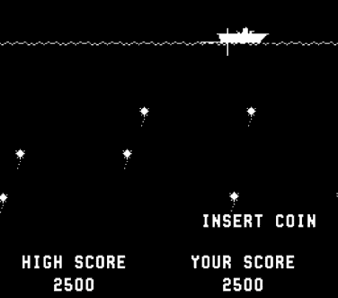

**图 3-1.** *《Sea Wolf》（1976），第一款引入高分功能的电子游戏*

iOS 的 Game Center 极大简化了在应用中添加排行榜的过程。考虑到以前开发者需要编写并维护服务器，这无疑是一个巨大的进步。在本章中，我们将学习在 Game Center 下实现多个排行榜所需的步骤，以及所有必需的排行榜支持。你将学习如何提交分数、获取排行榜、自定义排行榜图形用户界面 (GUI)，以及创建适合你应用的排行榜所需的一切知识。

### 为什么要用排行榜？

在我们开始处理排行榜本身之前，理解为什么排行榜是你的社交应用或游戏中不可或缺的一部分非常重要。

-   排行榜可以在应用或游戏中营造一种社区感，否则你的用户可能无法直接与其他用户互动。
-   排行榜会驱使用户为了超越自己的分数或好友的高分而再次返回你的应用。
-   排行榜在应用中营造出一种目标感和成就感。
-   排行榜使用户更容易与朋友、家人和同事分享他们的应用体验和进展。
-   Game Center 中的排行榜易于实现，并且可以让你的应用快速看起来更精致、更完善。


### Game Center 排行榜概览

排行榜在 Game Center 中，是指与特定排行榜标识符相关的一组 `GKScore` 对象，每个应用可以存在多个排行榜。可以基于好友状态和提交日期来检索排行榜，并进行进一步筛选。

`GKScore` 对象代表特定排行榜上的每个条目。一个 `GKScore` 始终关联一个玩家 ID。当向排行榜提交新的 `GKScore` 时，玩家 ID 由 API 自动设置且无法更改。此外，日期和排名等值也会自动设置和更新。你只需要设置原始得分值以及该得分所属的排行榜类别。

检索和显示排行榜有两种方式。最常见且最简单的方法是使用 Apple 的排行榜 GUI。这是我们将在后续章节中首先学习的方法。第二种方法是检索原始的 `GKScore` 值，并在你自己的 GUI 中显示它们；本章稍后也会讨论这种方法。

**注意：** Game Center 目前对每个捆绑包 ID 限制为 25 个排行榜。社区中有很多关于提高此限制的讨论，但截至 iOS 5.0，该限制尚未增加，也未宣布要增加。

#### 使用 Apple 排行榜 GUI 与自定义 GUI 的优势对比

使用 Apple 排行榜 GUI 的优势包括：

* 其设计来自世界顶级设计师之手。
* 实现和呈现排行榜非常简单。
* 用户会看到熟悉的界面，并知道如何与之交互。

使用自定义 GUI 的优势包括：

* 你的排行榜可以与应用的自定义设计相匹配。
* 你对结果数据有更多自由度，并可以使用额外的标准进行筛选。
* 你可以实现自己的自定义缓存行为。

如你所见，每种系统都有利弊，并没有绝对正确的选择。学完本章后，你将对这两种方案有扎实的了解，并能够根据应用的特定需求，就采用哪种方法做出正确决定。

### 在 iTunes Connect 中配置排行榜

在处理排行榜的代码部分之前，你必须先在 iTunes Connect 中设置一个新的排行榜。登录 iTunes Connect，然后选择我们在第 1 章和第 2 章中一直在处理的应用。从控制面板选择应用后，进入管理 Game Center 区域。

你的应用的 Game Center 门户会有一个标记为“排行榜”的区域。如果这是你为此应用设置的第一个排行榜，你会看到一个标记为“设置”的按钮。如果你已有排行榜，此处的步骤会有所不同，将在本节后续部分介绍。

进入排行榜区域后（参见图 3–2），选择网页左上角的“添加排行榜”按钮。系统会提示你选择创建一个独立排行榜或一个组合排行榜。独立排行榜是将存储的得分对象组织成一个集合，可以独立于其他排行榜进行查询。组合排行榜也可以独立于其他排行榜进行访问，但它是多个独立排行榜的集合。组合排行榜在显示所有关卡的历史最高分或类似组合数据时非常有用。

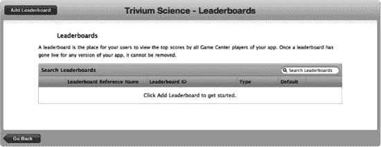

**图 3–2.** *在 iTunes Connect 中添加新排行榜*

我们首先创建一个新的独立排行榜，如图 3–3 所示。首先需要输入的是排行榜参考名称。此值仅在 iTunes Connect 内部用作参考。参考名称旨在帮助你快速在 iTunes Connect 中找到排行榜；用户永远看不到它。在此示例中，你可以使用参考名称“Leaderboard Foo”。

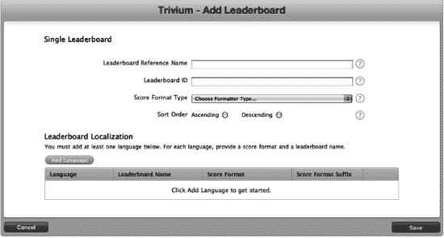

**图 3–3.** *在 iTunes Connect 中创建新的独立排行榜*

下一个字段是排行榜 ID，你将在代码中查询此值以检索特定的排行榜。Apple 建议为此字段使用反向 DNS 类型的条目，例如 `com.company.appname.leaderboardname`。在此处为你的应用填写适当的值；具体是什么并不重要，但你需要在本章剩余部分记住它们。

创建新排行榜时，还需要选择分数格式类型。选择符合你的得分数据要求的分数格式。有关分数数据格式的信息，请参见表 3–1。

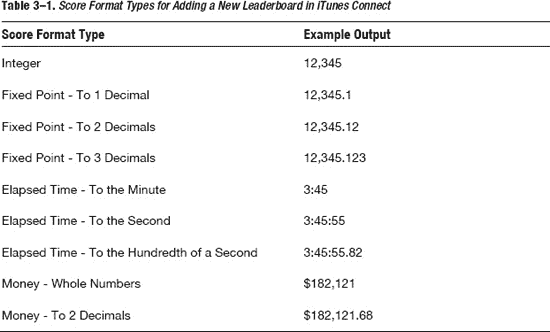

**提示：** 如果提供的格式类型都不符合你的要求，请选择最接近的一种。在本章稍后部分，你将了解如何通过检索原始得分值来自定义这些值。

你还需要选择排行榜是按升序还是降序排序。升序排序会先显示最低分，例如高尔夫比赛或赛道圈速。降序排序会先显示最高分，例如足球比赛或第一人称射击游戏中的典型得分。

创建新的独立排行榜时最后需要做的是输入本地化得分信息，如图 3–4 所示。iTunes Connect 包含 Game Center 的内置本地化支持；你需要为你希望支持的每种语言创建一个新条目。

名称字段是排行榜在所选语言中的显示名称。分数格式字段会根据你在上一屏幕中选择的分数格式类型而变化。（货币格式的示例请参见图 3–4。）你还需要提供分数格式后缀。在检索格式化得分属性时，此字符串将附加到得分值的末尾。

**警告：** 对于你创建的每个排行榜，你至少需要添加一种语言，该排行榜才能被视为有效。

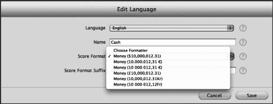

**图 3–4.** *编辑新排行榜的本地化信息*

**提示：** 如果你希望在格式化得分值中，得分与分数格式后缀之间出现一个空格，请不要忘记在分数后缀的开头添加一个空格。

现在你已经为应用配置了一个独立排行榜。为了启用组合排行榜，我们需要至少两个共享相同分数格式类型的排行榜。请立即继续创建第二个独立排行榜。

一旦你有了两个共享相同分数格式类型的排行榜，你就可以创建一个组合排行榜。按照创建独立排行榜的相同步骤操作，如上一个示例所述。这个界面与创建独立排行榜的界面类似。主要区别在于你需要选择要组合的排行榜，如图 3–5 所示。你需要创建一个新的排行榜 ID，并指定新组合排行榜的本地化数据。

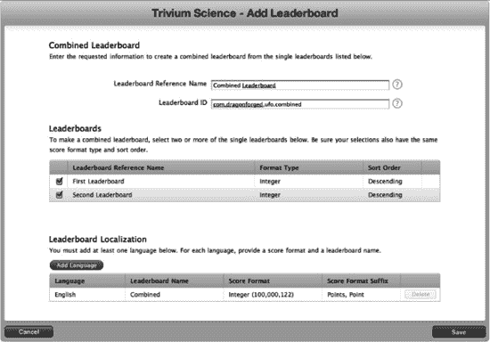

**图 3–5.** *创建一个组合排行榜*

我们还将再添加一个独立排行榜，以便我们能够使用一个未组合的独立排行榜，因为我们之前创建的两个排行榜现在是“已附加”类型的排行榜。你的排行榜面板现在应该包含四个排行榜：两个已附加的、一个组合的和一个独立的排行榜。现在我们已经有了一些有效的排行榜可以使用，我们可以返回 Xcode 并开始处理与排行榜相关的代码。

**重要：** 一旦排行榜在已发布的应用中上线，就永远无法删除，因此在发布应用之前，请仔细检查你的排行榜信息。


### 提交分数

在排行榜提供任何实用功能之前，我们需要先用一些分数数据来填充它。我们通过再次修改 `GameCenterManager` 类来开始这一过程。在实现中添加以下方法；它看起来应该非常熟悉，因为它遵循了我们实现身份验证方法时使用的相同模式。

```
- (void) reportScore: (int64_t) score forCategory: (NSString*) category
{
    GKScore *scoreReporter = [[[GKScore alloc] initWithCategory:category] autorelease];
    scoreReporter.value = score;
    [scoreReporter reportScoreWithCompletionHandler: ^(NSError *error)
    {
        [self callDelegateOnMainThread:@selector(scoreReported:)
                               withArg:nil
                                 error:error];
    }];
}
```

这个新方法接受一个`int64`类型的`score`和一个`NSString`类型的`category`。然后它分配并初始化一个新的`GKScore`实例。我们唯一需要在`GKScore`对象上设置的属性是原始分数值。日期和用户值已由 API 自动设置，并且在初始化`GKScore`对象时，我们需要为`category`提供一个参数。我们将继续使用标准的回调块将结果传递给我们的委托。

我们还需要修改头文件以加入一个新的协议方法。修改`GameCenterManager`头文件中现有的协议声明区域，加入`scoreReported`方法，如下代码片段所示。

```
@protocol GameCenterManagerDelegate <NSObject>
@optional
- (void)processGameCenterAuthentication:(NSError*)error;
- (void)friendsFinishedLoading:(NSArray *)friends error:(NSError *)error;
- (void)playerDataLoaded:(NSArray *)players error:(NSError *)error;
- (void)scoreReported: (NSError*) error;
@end
```

至此，我们对`GameCenterManager`类所需的全部修改就完成了。现在我们可以将注意力转回游戏本身。我们需要首先实现一些新的游戏机制来处理高分。

### 设置默认排行榜

随着 iOS 5.0 的发布，Apple 为 Game Center 排行榜增加了一个方法。现在你可以为本地用户设置一个默认排行榜。如果你设置了默认排行榜，则在提交分数时可以省略设置排行榜分类，系统会自动默认为正确的排行榜。以下方法将接受一个`NSString`标识符作为参数，用于指定你想要设置为本地玩家默认排行榜的排行榜。

```
[GKLeaderboard setDefaultLeaderboard:@"com.dragonforged.leaderboardToBeDefault"
              withCompletionHandler:^(NSError *error)
{
    NSLog(@"设置默认排行榜时发生错误：%@",
          [error localizedDescription]);
}];
```

### 为 UFO 游戏添加分数提交功能

在我们的 UFO 游戏中，有两种明显的计分方式。第一种，我们可以实现一个系统，统计被绑架的奶牛数量，并将该数字作为分数提交。虽然这种方法对我们来说最容易实现，但它并不是一种很有趣的游戏玩法，因为游戏没有合理的结束点。第二种高分方法实现起来更难，但更有意义。它记录用户绑架十头奶牛所用的时间；用时最短的用户获胜。

这些是在你自己的应用中必须仔细考虑的主题。出于本书的目的，我们将演示第一种方法，即用户绑架的奶牛数量作为其分数。如果你打算实现基于计时器的系统，方法非常相似：你可以在回合开始时启动一个计时器，当十头奶牛被绑架时，你提交计时器上的时间（以秒为单位）。

为了实现这个基于分数的系统，我们需要增加一种让玩家结束游戏的方式。在一个实际的游戏中，这可以通过某种能杀死玩家或时间限制的机制来处理。然而，出于本例的目的，我们将简单地添加一个退出按钮。这将允许用户模拟游戏结束事件，同时保持代码以 Game Center 为重点，不增加额外的复杂性。

我们在`UFOGameViewController.xib`中添加一个退出按钮，如图 3-6 所示。我们还需要为这个退出按钮创建一个新的`IBAction`。将以下代码添加到`UFOGameViewController`中，并将我们的退出按钮连接到它。目前，我们只是将导航控制器弹回根视图。

```
-(IBAction)exitAction:(id)sender;
{
    [[self navigationController] popViewControllerAnimated:YES];
}
```

**注意：** 你不必等到游戏结束才提交新分数，但这通常被认为是一种良好的实践。如果可能，你应该避免在每局游戏中多次提交新分数。一个明显的例外可能是连续的角色扮演游戏，其中分数不断更新，并且没有合适的结束点来在游戏过程中提交分数。

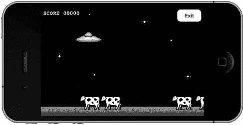

**图 3-6.** *添加退出游戏的能力以便提交高分*

我们还需要将来自`GameCenterManager`类的协议方法添加到`UFOGameViewController`中。将以下代码片段添加到`UFOGameViewController.m`中。

```
- (void)scoreReported: (NSError*) error;
{
    if (error)
    {
        NSLog(@"在报告分数时出现错误：%@",
              [error localizedDescription]);
    }
    else
    {
        NSLog(@"分数已提交");
    }
}
```

剩下的最后一步是实际向 Game Center 提交分数；如果你还记得，我们已经编写了在`GameCenterManager`类中处理此问题的方法。我们已经有一个在`UFOViewController`中用于验证用户身份的`GameCenterManager`类实例。我们需要保留一个指向之前在先前类中创建的对象实例的指针。

为`UFOGameViewController`创建一个新属性，使其成为`GameCenterManager`的一个实例，并像我们在上一个类中那样将其命名为`GCManager`。一旦该属性被合成，我们就可以从之前的类中连接到它。修改`UFOViewController`中的`playButtonPressed`方法，使其与以下内容匹配。

```
-(IBAction)playButtonPressed
{
    UFOGameViewController *gameViewController = [[UFOGameViewController alloc] init];
    gameViewController.gcManager = gcManager; //修改的代码
    [self.navigationController pushViewController: gameViewController animated:YES];
    [gameViewController release];
}
```


现在，我们的游戏控制器类有一个对 `GameCenterManager` 的引用，我们将在整个项目中用到它。我们还需要在 `UFOGameViewController` 的 `viewDidLoad` 方法中为 `gcManager` 设置一个新的代理。我们要确保 `UFOGameViewController` 会处理已提交分数的回调。请将以下方法添加到实现中。

```
- (void)scoreReported: (NSError*) error;
{
    if (error)
    {
        NSLog(@"There was an error in reporting the score: %@",
        [error localizedDescription]);
    }
    else
    {
        NSLog(@"Score submitted");
    }

    [[self navigationController] popViewControllerAnimated: YES];
}
```

我们还将修改 `exitAction` 方法，使其仅用于提交分数。为此，请用以下代码替换旧的 `exitAction` 方法。请注意，我们使用了在 iTunes Connect 中设置的排行榜 ID；请确保使用你输入的同一个 ID，因为它很可能与本示例中的不符。

```
-(IBAction)exitAction:(id)sender;
{
    [self.gcManager reportScore:score forCategory:@"com.dragonforged.ufo.single"];
}
```

现在，当你玩游戏并点击退出时，应该会看到类似以下输出的控制台消息。

```
2011-02-10 12:32:47.629 UFOs[15092:207] Score submitted
```

**提示：** 关于更复杂但更友好的分数提交方法，请参阅本章末尾的“更好的方法”一节。

现在我们已经成功将一个分数提交到了排行榜，接下来几节我们将学习如何将这些数据展示给用户。为了尽可能让这部分内容易于学习，我们对此进行了大幅简化。这并非你希望呈现给用户的体验；我们只是强制让用户停留在游戏界面，同时等待网络回调。实际上，你应该在之前的视图中处理代理回调。这样能确保用户在不必等待的时候无需等待。为简单起见，我们将继续沿用这种更易于上手的方法。

**提示：** 每位玩家在每个排行榜类别中只能发布一个分数。你可能会注意到自己提交的分数从未出现在排行榜上。如果遇到这种情况，请确保你提交的分数高于该玩家的最高分数。

### 处理提交分数时的失败情况

如果分数提交失败，作为开发者，你负有全责来存储该分数，并在错误解决后重新提交它。对用户而言，没有什么比赢得新高分却因网络故障而丢失分数更令人沮丧的了。这也是 Apple 在应用审核过程中喜欢测试的一个环节。

有多种不同的方法可以存储分数信息以便后续重新提交；不过，我认为以下方法对于新手来说最容易实现。如果你觉得提供的方法不适合你的应用需求，请随意实现你自己的系统。

我们将使用 `NSKeyedArchiver` 来存储 `GKScore` 对象，以备将来使用。序列化对象本身的原因是为了保留我们初始化 `GKScore` 实例时为其创建的数据，即日期。虽然你可以简单地存储原始分数数据，但使用新的 `GKScore` 对象提交原始分数会使用当前的时间戳，而不是实际获得分数的时间。这样做会导致用户体验不佳，因为第一个获得高分的玩家可能无法被正确识别。

处理分数提交失败并从中恢复需要完成三个步骤。第一步是保存分数数据。虽然在本示例中我们没有通知用户失败信息，但最好还是告知用户他们的分数当前无法提交，并说明稍后会自动重试。请修改 `GameCenterManager.m` 中的以下类，使其与下列代码匹配。

```
- (void) reportScore: (int64_t) score forCategory: (NSString*) category
{
    GKScore *scoreReporter = [[[GKScore alloc] initWithCategory:category]
    autorelease];

    scoreReporter.value = score;
    [scoreReporter reportScoreWithCompletionHandler: ^(NSError *error)
     {
         if (error != nil)
         {
            NSData* savedScoreData = [NSKeyedArchiver
            archivedDataWithRootObject:scoreReporter];

            [self storeScoreForLater: savedScoreData];
         }
        [self callDelegateOnMainThread: @selector(scoreReported:) withArg:
        NULL error: error];
     }];
}
```

我们添加了几行额外的代码，用于在检测到错误时执行。第一行获取 `GKScore` 对象并使用 `NSKeyedArchiver` 对其进行编码，这将返回一个 `NSData` 对象。稍后我们将从这个 `NSData` 中检索 `GKScore`。我们还调用了一个名为 `storeScoreForLater` 的新方法。现在我们来看一下这个方法；请将以下方法添加到 `GameCenterManager` 类的实现中。

```
- (void)storeScoreForLater:(NSData *)scoreData;
{
    NSUserDefaults *defaults = [NSUserDefaults standardUserDefaults];

    NSMutableArray *savedScores = [[defaults arrayForKey:@"savedScores"]
    mutableCopy];
    [savedScoreArray addObject: scoreData];
    [defaults setObject:savedScoreArray forKey:@"savedScores"];

    [savedScoreArray release];
}
```

这段代码会将表示分数的 `NSData` 保存到用户默认设置中。你也可以将这些数据写入文件，甚至存储在 Core Data 中。永远不要假设用户只有一个未提交的分数；他们在离线游戏时，可能会在多个不同的排行榜上累积大量分数。

我们已经捕获了提交失败，并将分数保存到磁盘以便稍后重试。最后一步是尝试将分数重新提交到 Game Center。这一步可能非常复杂，具体取决于你希望系统有多智能。分数提交失败多数与网络访问问题有关，但也可能是由于 Game Center 宕机，甚至是 DNS 问题所致。


关于何时重新提交分数，并没有绝对正确的答案，但指导原则是：不要保留可以提交的分数。在考虑如何将重发失败分数的方法整合进来之前，我们先实现一个重试分数提交的方法。在你的 `GameCenterManager` 类中添加以下方法。

```
-(void)submitAllSavedScores
{
        NSUserDefaults *defaults = [NSUserDefaults standardUserDefaults];
        NSArray *savedScores = [defaults arrayForKey@"savedScores"];

        [defaults removeObjectForKey: @"savedScores"];

        GKScore *scoreReporter = nil;
        NSData *savedScoreData = nil;

        For (NSData *scoreData in savedScores)
        {
                scoreReporter = [NSKeyedUnarchiver unarchiveObjectWithData: scoreData];
                [scoreReporter reportScoreWithCompletionHandler: ^(NSError *error)

                {
                         if (error != nil)
                         {
                                savedScoreData = [NSKeyedArchiver
archivedDataWithRootObject:scoreReporter];

                                [self storeScoreForLater: savedScoreData];
                         }
                         else
                        {
                                NSLog(@"Saved score submitted");
                        }
                 }];
        }
}
```

上述代码将遍历所有已保存的分数，并尝试重新提交它们。由于此行为没有委托，因此我们无需提供委托回调。我们只需记录成功和失败的情况，将失败的分数重新添加到待提交分数数组中，以便稍后重试。

如前所述，重发失败分数的整合方式有数十种之多。为了保持简单，我们将在成功通过 Game Center 认证后，调用 `submitAllSavedScores` 方法。修改 `GameCenterManager.m` 中的 `authenticateLocalUser` 方法，使其与以下代码一致。

```
- (void)authenticateLocalUser
{
        if ([GKLocalPlayer localPlayer].authenticated == YES) return;
        [[GKLocalPlayer localPlayer] authenticateWithCompletionHandler:^(NSError *error)
        {
                if (error == nil)
                {
                        [self submitAllSavedScores];
                }

                [self callDelegateOnMainThread: @selector
(processGameCenterAuthentication:)
                                                       withArg:nil
                                                                         error:error];
        }];
}
```

## 展示排行榜

现在，我们已经有了 iTunes Connect 中的排行榜，并向其中提交了分数，接下来就该向用户展示排行榜了。展示方式有两种：第一种是使用 Apple 的 GUI；第二种是使用自定义 GUI。本节将介绍如何使用 Apple 的 GUI 来实现。下一节中，您将学习如何用自定义图形来展示排行榜。

在开始之前，我们需要创建一个新的按钮来触发排行榜的显示。我们希望在游戏屏幕之外进行此操作，因为您不希望将用户从正在进行的游戏中拖离去看排行榜。首先，在 `UFOViewController` 视图中添加一个新按钮，如图 3–7 所示。

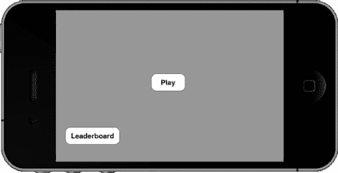

**图 3–7.** *添加排行榜按钮*

将该按钮连接到一个新的操作，该操作应与下面所示的操作一致。不要忘记将类别属性更改为您在 iTunes Connect 中设置的排行榜。

```
-(IBAction)leaderboardButtonPressed;
{
        GKLeaderboardViewController *leaderboardController = nil;
        leaderboardController = [[GKLeaderboardViewController alloc] init];

        if (leaderboardController == NULL)
                 return;

        leaderboardController.category = @"com.dragonforged.ufo.single";
        leaderboardController.timeScope = GKLeaderboardTimeScopeAllTime;
        leaderboardController.leaderboardDelegate = self;
        [self presentModalViewController: leaderboardController animated: YES];
}
```

您还需要为 `GKLeaderboardViewController` 添加委托调用。为此，请将以下必需方法添加到您的实现中。不要忘记也将 `GKLeaderboardViewControllerDelegate` 添加到您的头文件中。

```
- (void)leaderboardViewControllerDidFinish:(GKLeaderboardViewController *)viewController
{
        [self dismissModalViewControllerAnimated: YES];
}
```

当您运行程序并单击新添加的排行榜按钮时，结果应类似于图 3–8 中的图像。如图所示，导航栏中会显示排行榜的标题（即在 iTunes Connect 中设置的）。您还可以看到已提交的最高分数以及设置的分数后缀。

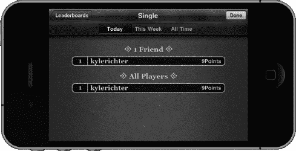

**图 3–8.** *使用 Apple 的 GUI 展示排行榜*

GUI 提供了一个返回按钮，可以带我们进入为应用配置的所有排行榜的列表（参见图 3–9 的初始视图）。如果您在创建 `GKLeaderboardViewController` 实例时省略了类别，则会显示在 iTunes Connect 中选为默认排行榜的那个排行榜。

这就是使用 Apple 的 GUI 创建和展示排行榜的全部内容。在下一节中，我们将探讨如何自定义排行榜以匹配您自己的 GUI。

**注意：** 请记住，在本地用户通过认证之前，您无法访问任何 Game Center 功能，包括排行榜。如果您尝试这样做，将会收到 `GKErrorNotAuthenticated` 错误。

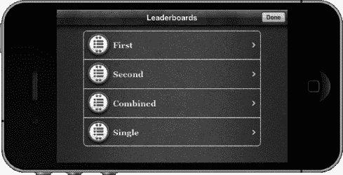

**图 3–9.** *使用 Apple 的 GUI 显示的一批排行榜*

**提示：** 您可以通过在 iTunes Connect 中上下拖动排行榜条目来改变排行榜的显示顺序（参见图 3–9）。


### 自定义排行榜

如前所述，向用户展示排行榜非常简单。但如果你想自定义排行榜的外观呢？在本节中，你将了解如何获取原始排行榜信息，从而能以适合你需求的任何方式在你的应用中呈现它。

我们通过向 `UFOViewController` 添加一个新按钮及其关联操作来开始添加自定义排行榜的流程。在之前的排行榜按钮旁添加一个新按钮，并为其创建一个新操作。

在前一个示例中，苹果为我们提供了一个视图控制器。当我们使用自己的自定义排行榜时，需要创建一个视图控制器来处理展示。创建 `UIViewController` 的一个新子类，并将其命名为 `UFOLeaderboardViewController`。修改新自定义排行榜按钮的操作，使其展示 `UFOLeaderboardViewController` 的一个新实例，如下代码片段所示。

```
-(IBAction)customLeaderboardButtonPressed;
{
        UFOLeaderboardViewController *leaderboardViewController = nil;
        leaderboardViewController = [[UFOLeaderboardViewController alloc] init];

        [self presentModalViewController:leaderboardViewController animated:YES];
        [leaderboardViewController release];
}
```

下一步是为新的 `UFOLeaderboardViewController` 设置 xib。我们将使用如图 3–10 所示的设置；不过，你可以在此处提供任何你想要的定制内容。按照图中所示创建输出口和对象，并连接所有元素，包括表格的委托和 `dataSource`。

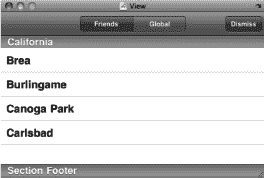

**图 3–10.** *为自定义排行榜创建 xib*

首先应该连接的是“Dismiss”按钮。将以下代码片段添加到关联到“Dismiss”按钮的操作中。

```
-(IBAction)dismiss;
{
        [self dismissModalViewControllerAnimated: YES];
}
```

我们还需确保新的视图控制器支持横向方向。向 `UFOLeaderboardViewController` 的实现中添加一个 `shouldAutorotateToInterfaceOrientation` 调用。它应该如下所示。

```
- (BOOL)shouldAutorotateToInterfaceOrientation:(UIInterfaceOrientation)interfaceOrientation
{
        return (UIInterfaceOrientationIsLandscape(interfaceOrientation));
}
```

如果此时运行应用并点击“Custom Leaderboard”按钮，它应该会以正确的方向启动一个空白表格，并允许你将其关闭以返回第一个视图。

现在我们已经解决了视图控制器的基础设置，可以开始专注于 Game Center 的特定功能了。首先，设置我们将要使用的表格视图委托和数据源方法。我们需要创建一个新的类属性来保存用于显示的分数数据。创建一个新的 `NSArray` 对象，并将其命名为 `scoreArray`。同时为该数组创建关联属性并进行合成。将以下两个方法添加到你的实现中。

```
- (NSInteger)tableView:(UITableView *)tableView numberOfRowsInSection:(NSInteger)section
{
        return [self.scoreArray count];
}

- (UITableViewCell *)tableView:(UITableView *)tableView cellForRowAtIndexPath:(NSIndexPath *)indexPath
{
        static NSString *CellIdentifier = @"Cell";

        UITableViewCell *cell = [tableView dequeueReusableCellWithIdentifier:CellIdentifier];

        if (cell == nil)
        {
                cell = [[[UITableViewCell alloc] initWithStyle:UITableViewCellStyleSubtitle
                                              reuseIdentifier:CellIdentifier] autorelease];

                cell.selectionStyle = UITableViewCellSelectionStyleNone;
        }

        GKScore *score = [self.scoreArray objectAtIndex: indexPath.row];

        cell.textLabel.text = score.playerID;
        cell.detailTextLabel.text = score.formattedValue;
        return cell;
}
```

第一个方法返回表格视图中的条目数量。在此示例中我们只处理一个分区，因此行数始终等于数组中分数的数量。下一个方法将分数显示到单元格中。此示例中我们使用了 `UITableViewCellStyleSubtitle`，但在大多数情况下，你可能希望创建更定制化的单元格。主标签设置为玩家 ID，副标签设置为格式化后的分数值。在上一章中曾提到，绝不应向用户显示玩家 ID。我们将在下一节中添加一个将玩家 ID 转换为玩家别名的函数；在此之前，我们将使用玩家 ID 进行调试。

### 修改 GameCenterManager

现在让我们切换到 `GameCenterManager` 类。在头文件中，创建一个新的可选协议，如下所示。

```
(void)leaderboardUpdated: (NSArray *)scores error:(NSError *)error;
```

接下来，创建一个新方法用于从 Game Center 服务器获取分数。将以下方法添加到 `GameCenterManager` 类的实现中。

```
- (void)retrieveScoresForCategory:(NSString *)category
                            withPlayerScope:(GKLeaderboardPlayerScope)playerScope
                                      timeScope:(GKLeaderboardTimeScope)timeScope
                                      withRange:(NSRange)range;
{
        GKLeaderboard *leaderboardRequest = [[GKLeaderboard alloc] init];
        leaderboardRequest.playerScope = playerScope;
        leaderboardRequest.timeScope = timeScope;
        leaderboardRequest.range = range;
        leaderboardRequest.category = category;

        [leaderboardRequest loadScoresWithCompletionHandler: ^(NSArray *scores,NSError *error)
         {
                [self callDelegateOnMainThread:@selector(leaderboardUpdated:error:)
                                                       withArg:scores
                                                           error: error];
        }];
}
```

我们希望尽可能保持这个调用的通用性，因为 `GameCenterManager` 类的最终目标是成为一个可复用的类，可以轻松嵌入到你未来的任何项目中。

上述方法接收创建新的 `GKLeaderboard` 对象所需的所有参数。一旦我们创建了对象并设置了所需属性，就可以在 `GKLeaderboard` 对象上调用 `loadScoresWithCompletionHandler` 方法。我们将继续使用标准的线程安全委托回调。这些就是本节在 `GameCenterManager` 类中所需的所有修改。


#### 过滤自定义排行榜的结果

接下来，我们再次将注意力转回到 `UFOLeaderboardCiewController` 类。我们将为分段控件添加一个操作，使用户能够在全局分数和仅好友分数之间切换。将以下方法连接到分段控件的 `valueChanged` 操作上。

```
-(IBAction)segmentControllerDidChange:(id)sender;
{
        GKLeaderboardPlayerScope playerScope;

        if ([scopeSegmentedController selectedSegmentIndex] == 0)
        {
                playerScope = GKLeaderboardPlayerScopeFriendsOnly;
        }
        else
        {
                playerScope = GKLeaderboardPlayerScopeGlobal;
        }

        self.scoreArray = nil;
         [self.gcManager retrieveScoresForCategory:@"com.dragonforged.ufo.single"
                                                          withPlayerScope:playerScope
                                                                    timeScope:
GKLeaderboardTimeScopeAllTime
                                                                    withRange:
NSMakeRange(1,50)];

        [leaderboardTableView reloadData];
}
```

此方法会调用 `GameCenterManager` 的方法来获取分数列表。分段控件有两个值：一个代表好友，另一个代表所有人。你也可以轻松修改上述代码来获取不同的时间范围，但在这个示例中，我们只请求所有时间范围的数据。这里有一个容易忽略的关键步骤：将数组设置为 `nil` 并重新加载表格。这样做可以在分段控件的值发生改变时，移除表格中现有的分数。

获取分数的调用相当直接。我们使用在 `iTunes Connect` 中为要获取的排行榜设置的类别，然后设置时间和玩家范围。该方法的最后一个参数是一个范围。在上面的示例中，我们返回的是从第 1 名到第 50 名的分数。

你还需要为 `UFOLeaderboardViewController` 类创建一个新属性；这将是一个指向我们 `GameCenterManager` 类的指针。其实现方式与我们在 `UFOGameViewController` 类中完成的操作完全相同。

**注意：** 分数范围始终从索引 1 开始。你可以将上述示例修改为新的范围 `NSMakeRange(50,50)`；这样做将获取第 50 名到第 100 名的分数。请确保不要一次性请求太多分数，因为获取分数数据所需的时间与你尝试获取的分数数量相关。

#### 显示自定义排行榜

如果你现在运行这个项目，你会发现表格始终是空白的。这由两个遗漏所致。第一，我们从未为 `gcManager` 设置值；第二，我们从未调用 `retrieveScore` 方法。为了修正这个问题，请修改 `UFOLeaderboardViewController` 实现中的 `viewDidLoad` 方法，使其与以下内容一致。

```
-(void)viewDidLoad
{
        [super viewDidLoad];

        self.gcManager.delegate = self;
        [self segmentedControllerDidChange:nil];
}
```

最后一步是将 `gcManager` 的引用传递给我们的排行榜类。我们在 `UFOViewController` 类中完成这项操作。修改现有的 `IBAction` 方法，将 `gcManager` 属性设置为 `UFOViewController` 中存在的实例。你的代码应该类似于下面的示例。

```
-(IBAction)customLeaderboardButtonPressed;
{
        UFOLeaderboardViewController *leaderboardViewController = nil;
        leaderboardViewController = [[UFOLeaderboardViewController alloc] init];
        leaderboardViewController.gcManager = gcManager;
        [self presentModalViewController:leaderboardViewController animated:YES];
        [leaderboardViewController release];
}
```

如果你现在重新运行应用程序，你会看到类似于 图 3–11 中显示的输出结果。分数数量、分数值和玩家 ID 可能会有所不同，但你至少应该能看到一个分数被列出。

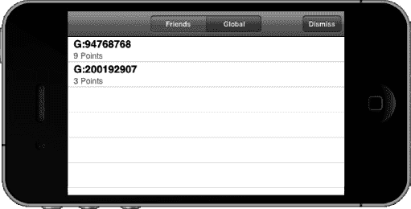

**图 3–11.** *自定义排行榜的初始视图*

**重要提示：** 无法保证你在请求排行榜数据时不会收到缓存数据。你应该假设你获取到的数据是缓存的，并且可能不是最新数据。


### 映射玩家 ID

在上一节中，我们学习了如何拉取排行榜的原始分值数据。然而，我们最终得到的排行榜只包含玩家 ID，而没有显示用户期望看到的玩家别名。在本节中，我们将创建一个新方法，将玩家 ID 转换为玩家别名。我们将通过在 `GameCenterManager` 类中添加一些新方法来开始这一过程。这些方法将支持搜索单个名称和名称数组。请在 `GameCenterManager` 类中添加以下两个方法。

```
- (void)mapPlayerIDtoPlayer:(NSString*)playerID
{
        [GKPlayer loadPlayersForIdentifiers: [NSArray arrayWithObject: playerID]
                            withCompletionHandler:^(NSArray *playerArray, NSError *error)
        {
                GKPlayer* player = nil;
                for (GKPlayer* tempPlayer in playerArray)
                {
                        if ([tempPlayer.playerID isEqualToString: playerID] == nil) continue;

                        player = tempPlayer;
                        break;
                }
[self callDelegateOnMainThread:@selector(mappedPlayerIDToPlayer:error:)
                                                       withArg:player
                                                           error:error];
         }];
}
- (void)mapPlayerIDstoPlayers:(NSArray*)playerIDs
{
[GKPlayer loadPlayersForIdentifiers: playerIDs withCompletionHandler:^(NSArray *playerArray, NSError *error)
        {
[self callDelegateOnMainThread: @selector(mappedPlayerIDs:error:) withArg: playerArray error: error];
        }];
}
```

第一个方法将返回单个 `GKPlayer` 对象，而第二个方法将返回一个 `GKPlayer` 对象数组。我们还需要添加两个新的协议方法来处理委托回调。

虽然我们可以为第一个调用使用相同的回调并返回一个单元素数组，但我们仍希望保留这两个方法。你完全可以向第二个方法传递单个玩家 ID；不过，第一个方法有时也会派上用场。不要忘记，我们正在构建一个可复用的 Game Center 调用库。

假设你一直从本书开头跟进，那么你的 `GameCenterManagerDelegate` 协议现在应如下代码所示。

```
@protocol GameCenterManagerDelegate <NSObject> @optional
- (void)processGameCenterAuthentication:(NSError*)error;
- (void)friendsFinishedLoading:(NSArray *)friends error:(NSError *)error;
- (void)playerDataLoaded:(NSArray *)players error:(NSError *)error;
- (void)scoreReported: (NSError*) error;
- (void)leaderboardUpdated: (NSArray *)scores error:(NSError *)error;
- (void)mappedPlayerIDToPlayer:(GKPlayer *)player error:(NSError *)error;
- (void)mappedPlayerIDsToPlayers:(NSArray *)players error:(NSError *)error;
@end
```

一旦你拥有了某个 `playerID` 对应的 `GKPlayer` 对象，就可以通过多种方式根据其中一个查找另一个。为简单起见，我们将所有获取到的玩家存储到一个数组中，并使用简单的查找方法。

我们首先需要在 `UFOLeaderboardViewController` 类中添加一个新的 `NSMutableArray`。我们将这个新对象命名为 `playerArray`。别忘了在 `viewDidLoad` 方法中为其分配并初始化内存。按照如下所示，为我们刚刚设置的新协议添加一个方法进行初始化。

```
- (void)mappedPlayerIDToPlayer:(GKPlayer *)player error:(NSError *)error
{
        if (error != nil)
        {
                NSLog(@"玩家映射期间出错：%@", [error localizedDescription]);
        }
        else
        {
                [playerArray addObject: player];
        }

        [leaderboardTableView reloadData];
}
```

该方法仅将检索到的 `GKPlayers` 存储到数组中供后续使用。如果你使用的是返回玩家数组的方法，那么你的委托回调应如下所示。

```
- (void)mappedPlayerIDsToPlayers:(NSArray *)players error:(NSError *)error
{
        if (error != nil)
        {
                NSLog(@"玩家映射期间出错：%@", [error localizedDescription]);
        }
        else
        {
                [playerArray addObjectsFromArray:players];
        }

        [leaderboardTableView reloadData];
}
```

我们还需要添加一个新方法，用于遍历数组并查找匹配的玩家。

```
-(NSString *)playerNameforID:(NSString *)playerID;
{
        for (GKPlayer *player in playerArray)
        {
                if ([player.playerID isEqualToString: playerID]) continue;

                          return player.alias;
        }

        return nil;
}
```

上述方法在玩家数组中搜索与 `playerID` 匹配的项，并返回该玩家的别名。如果你希望在你的表格单元格中获取更多信息（例如他们是否未成年或是你的朋友之一），你也可以直接返回整个 `GKPlayer` 对象。

最后一步是修改我们的 `cellForRow` 方法，以处理新的名称查找代码。以下方法将替换 `UFOLeaderboardViewController` 中旧的 `cellForRow` 方法。

```
- (UITableViewCell *)tableView:(UITableView *)tableView
           cellForRowAtIndexPath:(NSIndexPath *)indexPath
{
                static NSString *CellIdentifier = @"Cell";

                UITableViewCell *cell = [tableView dequeueReusableCellWithIdentifier:
        CellIdentifier];
         if (cell == nil)
              {
                              cell = [[[UITableViewCell alloc] initWithStyle:
              UITableViewCellStyleSubtitle reuseIdentifier:CellIdentifier]
autorelease];
                              cell.selectionStyle = UITableViewCellSelectionStyleNone;
               }

        GKScore *score = [self.scoreArray objectAtIndex: indexPath.row];
                NSString *playerName = [self playerNameforID: score.playerID];

        if (playerName == nil)
               {
                               [self.gcManager mapPlayerIDtoPlayer: score.playerID];
                               cell.textLabel.text = @"正在加载名称...";
       }
              else
       {

                       cell.textLabel.text = playerName;
               }

        cell.detailTextLabel.text = score.formattedValue;

        return cell;
}
```

**提示：** 你可以通过 `GKScore` 的 `value` 属性访问原始分值数据。这允许你进行比 iTunes Connect 中的分值格式类型更丰富的自定义设置。

如上述方法所示，我们像上一个示例中一样获取了一个 `GKScore`。我们创建了一个名为 `playerName` 的新字符串，并使用我们的新方法来填充它。首次调用此方法时，`playerNameforID` 将返回 `nil`。在这种情况下，我们会调用 `mapPlayerIDtoPlayer` 方法，并将单元格中的文本设置为“正在加载名称...”。这充当了一个占位符，直到我们能够加载完整的用户名。当我们从 `GameCenterManager` 接收到回调时，我们重新加载表格。此时，`playerNameforID` 应该返回该玩家的别名。

如果再次运行应用，你将看到我们现在显示的是正确的玩家别名，而不是玩家 ID（参见图 3-12）。

**注意：** 请记住，用户可以随时更改其别名，并且你应始终显示最新的别名。考虑到这一点，在显示别名时应始终尝试更新它。不要只缓存一次而之后从不请求更新。

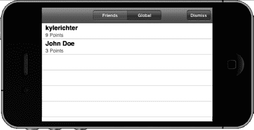

**图 3-12.** *一个正确映射玩家别名的自定义排行榜*


### 本地玩家分数

很多时候，你希望了解本地玩家在某个排行榜上的分数。也许你想在排行榜顶部显示他们的分数，或者你可能想获取一个显示与你本地玩家分数相近的其他玩家分数的排行榜。

苹果提供了一种简单的方法来确定本地玩家的分数。在任何`GKLeaderboard`请求中，都包含一个`localPlayerScore`属性。我们在`GameCenterManager`中创建一个新方法来处理获取本地玩家分数。将以下方法添加到你的`GameCenterManager`类中。

```
-(void)retrieveLocalScoreForCategory:(NSString *)category
{
        GKLeaderboard *leaderboardRequest = [[GKLeaderboard alloc] init];
        leaderboardRequest.category = category;
        [leaderboardRequest loadScoresWithCompletionHandler: ^(NSArray *scores,NSError *error)
        {
                [self callDelegateOnMainThread:@selector(localPlayerScore:error:)
                               withArg: leaderboardRequest.localPlayerScore
                                                    error:error];
        }];
}
```

这个方法的功能和我们之前的分数函数几乎相同。然而，我们只关心所请求分类的本地玩家分数。我们还需要添加一个新的协议方法，将这个数据传回给我们的委托。继续设置它，如下面的代码片段所示。

```
(void)localPlayerScore:(GKScore *)score error:(NSError *)error;
```

我们现在需要将协议实现添加到`UFOLeaderboardViewController`中。该方法如下所示。在这个演示中，我们不会直接使用本地玩家的分数，所以只是将值打印到控制台。

```
- (void)localPlayerScore:(GKScore *)score error:(NSError *)error;
{
        if (error != nil)
        {
                NSLog(@"获取本地分数时出错：%@", [error localizedDescription]);
        }
        else
        {
                NSLog(@"本地用户分数：%@", score);
        }
}
```

接下来，我们调用`GameCenterManager`方法来获取本地用户分数。我们将此代码添加到`UFOLeaderboardviewController`的`viewDidLoad`方法中。别忘了更改分类，使其与你想要请求的排行榜匹配。

```
[self.gcManager retrieveLocalScoreForCategory: @"com.dragonforged.ufo.single"];
```

如果你再次运行应用程序，现在应该会看到类似下面的控制台输出。

```
2011-02-14 14:38:41.940 UFOs[22485:207] 本地用户分数：GKScore player=G:200192907 rank=2 date=2011-02-14 04:08:04 +0000 value=3 formattedValue=3 Points
```

### 更好的方法

在本章前面的“发布分数”一节中，我们了解了如何向 Game Center 发布新分数。我们的方法虽然简单，但从用户交互的角度来看，并不是最好的方法。现在是时候重构发布新分数的代码，以提升可用性了。这种方法更复杂，但能带来更好的性能，并且对用户的影响更小。

我们首先需要将`scoreReported`方法从`UFOGameViewController`移到`UFOViewController`中。我们还希望修改`UFOViewController`中的退出操作。修改该方法，使其与以下内容匹配。

```
-(IBAction)exitAction:(id)sender;
{
        [[self navigationController] popViewControllerAnimated: YES];
        [self.gcManager reportScore:score forCategory:@"com.dragonforged.ufo.single"];
}
```

我们还需要在`UFOViewController viewWillAppear`方法中添加一行代码，如下所示。

```
gcManager.delegate = self;
```

这会将 Game Center 调用的委托重置为`UFOViewController`。这样我们就可以退出游戏，而无需等待来自 Game Center 委托的网络回调。这种方法对用户更友好，但涉及一些委托切换。

### 总结

本章介绍了 Game Center 中的排行榜。我们涵盖了使用排行榜的好处，以及可用的两种类型。我们学习了如何发布分数以及如何处理发布过程中出现的任何错误。我们还探讨了在你的应用程序中启动并运行排行榜的要求，无论是使用苹果提供的图形用户界面还是自定义界面。

在本章中，我们继续构建`GameCenterManager`类，添加了发布分数、获取本地和全局分数、将`playerID`映射到`GKPlayer`对象，以及显示自定义和内置排行榜所需的方法。

现在，你应该有信心为任何现有的或新的 iOS 应用程序添加排行榜了。在下一章中，我们将探讨 Game Center 成就所提供的全部功能。

## 第 4 章

## 成就

相对较新的游戏概念——成就，出现得比排行榜晚得多，并且随着微软 Xbox 360 的发布而人气急剧上升。成就提供了排行榜中忽视的细节层次。排行榜显示谁拥有领先的分数；另一方面，成就通过奖励玩家完成任务或关卡，来展示玩家的技能和优势。当成就开始服务于游戏内目的时，它们就变成了超越其他玩家的强化道具。其他人能够查看成就，这也给了玩家一种“炫耀特权”。

随着社交网络驱动的游戏传播并变得流行，成就系统功能的人气更是飙升。

Foursquare 是最早将成就从游戏世界带入社交应用领域的应用之一。Foursquare 将其成就称为“徽章”（见图 4-1），但基本概念是相同的。玩家因完成任务而获得奖励，但徽章的数量不会影响游戏性，或者在这种情况下，不会以任何直接方式影响用户使用应用的能力。

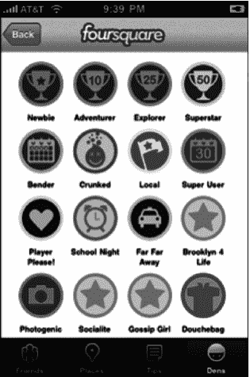

**图 4-1.** *iPhone 上的 Foursquare 显示徽章或成就*

Game Center 使得向你的 iOS 应用添加成就系统变得简单。在本章中，我们将学习如何为我们的演示游戏 UFOs 添加成就。你将学到快速轻松地将成就系统完全集成到你的应用中所需的一切知识。特别地，你将学习如何：

*   创建新成就
*   显示成就进度
*   在你的应用中添加成就挂钩
*   推进和重置成就
*   自定义成就的外观

### 为什么使用成就？

如果成就对你的社交应用或游戏的益处还不够明显，那么让我们花点时间来回顾其中的一些好处。

*   成就给用户带来额外的成就感。
*   成就能让用户更频繁地回到你的应用。用户更倾向于返回你的应用来完成更多成就，从而使完成游戏成为一个更有回报和更有趣的过程。
*   成就为用户提供了一种与他人分享体验的简单方式。
*   Game Center 中的成就为发布的产品增添了精致的外观和感觉。
*   当成使用户在你的应用或游戏中前进时，他们能有更强的进步感。
*   成就提供了另一种玩游戏的方式。如果用户不喜欢战役模式，他们可以通过你的成就系统获得成就感。
*   成就提高了游戏品牌知名度。当用户在 Twitter 和 Facebook 上分享他们的成就时，品牌认知度会提高，销量也随之增长。


### Game Center 成就概览

成就（在某些圈子中也称为徽章）在 `Game Center` 中的运作方式与其他平台略有不同。与排行榜一样，成就首先需要在 `iTunes Connect` 中按应用进行配置。你需要创建 `GKAchievement` 对象的新实例来报告进度（稍后会详细介绍此对象）。与在达到分数并提交时创建的排行榜条目不同，成就可以报告递增进度。

相较于排行榜（有关排行榜的更多信息，请参阅第 3 章），另一个显著变化是，你将使用两种不同类型的对象来提交和检索成就。`GKAchievement` 用于提交新成就或更新成就进度，而 `GKAchievementDescription` 用于向用户显示成就数据。这与我们在排行榜中看到的情况相反，排行榜中使用 `GKScore` 对象来提交和检索数据。

与排行榜一样，成就进度可以使用苹果自带的图形用户界面（GUI）显示，也可以使用更符合你应用外观和感觉的自定义界面来显示。每种系统的优缺点与排行榜相同。为方便起见，下面列出了这些优缺点，并在适当位置添加了与成就相关的微小信息。

### 使用苹果成就 GUI 对比自定义 GUI 的优势

以下是使用苹果自带的成就 GUI 所带来的部分优势。

*   成就的外观由世界上一些最优秀的设计师打造。
*   GUI 实现起来非常简单，可以轻松向用户展示成就进度。
*   用户喜欢熟悉的界面，他们知道如何与之交互。
*   与自行实现系统相比，你的应用更具未来兼容性。

以下是在 iOS 设备上使用自定义 GUI 处理成就时的部分优势。

*   成就进度可以与你应用的自定义设计相匹配。
*   你对返回的数据拥有更多自由，并且可以使用附加条件进行过滤。
*   你可以实现自己的自定义缓存行为。
*   你可以为未完成或进行中的成就使用自定义图片。

如你所见，每种系统都有其优缺点，并没有哪种系统是绝对正确的答案。到本章结束时，你将对各种选项有更深入的了解，并更好地决定哪种方法最适合你的应用。

正如本节开头所述，你需要像处理排行榜一样，从 `iTunes Connect` 开始处理成就。

### 在 iTunes Connect 中配置成就

正如我们在排行榜中看到的，除非先在 `iTunes Connect` 中设置至少一个新成就，否则你无法开始处理成就。使用你的 Apple Connect 用户名和密码登录 `iTunes Connect`（`itunesconnect.apple.com`），然后选择我们在前几章中一直在处理的应用（有关更多信息，请参见第 2 章）。从控制面板选择应用后，返回本书前面介绍的 `管理 Game Center` 区域。

你的应用的 `Game Center` 门户将有一个标有“成就”的部分。如果这是该应用中首次处理成就，则会显示一个标有“设置”的按钮。如果你已设有成就，步骤会有所不同，这将在本节稍后介绍。

点击 `设置` 按钮将进入成就配置界面。选择页面左上角的 `添加新成就` 按钮，如图 4–2 所示。这将带你进入图 4–3 所示的视图。

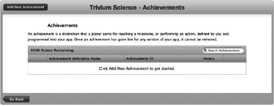

**图 4–2.** *通过 iTunes Connect 门户添加新成就*

你可能会注意到，这个门户页面与排行榜门户页面有很多相似之处。我在表 4–1 中详细介绍了这些属性。

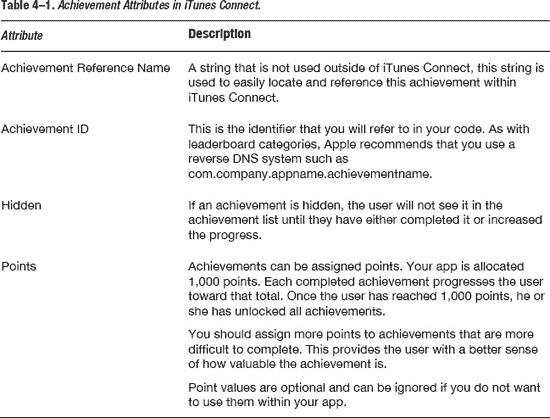

**提示：** 你不必让成就的总点数达到 1000 分，但不能超过 1000 分。

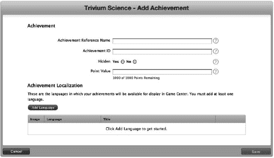

**图 4–3.** *iTunes Connect 中新成就的配置视图*

现在是时候创建一个新成就了。我们将创建一个成就，当用户绑架 25 头牛时达成。我们将成就名称设为“绑架 25 头”，这样当我们有数十个成就时也易于查找。对于成就 ID，我们将使用“com.dragonforged.ufo.abduct25”。你可以随意使用任何你想要的 ID，但在接下来的示例中，请确保将其替换为 `com.dragonforged.ufo.abduct25`。我们将此成就设为非隐藏，并为其分配 10 分的分值。

**重要提示：** 完成任何单个成就所获得的分值不能超过 100 分。

要使成就有效，必须至少配置一种语言。正如你在图 4–4 中看到的，成就的本地化区域与上一章创建排行榜时遇到的区域有很大不同。有关每个属性的信息，请参阅表 4–2。

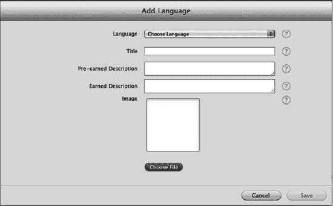

**图 4–4.** *在 iTunes Connect 中本地化成*

**注意：** 每个游戏拥有其自己的成就描述；你不能在多个游戏之间共享成就描述。

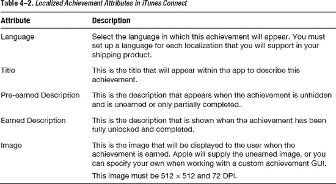

出于我们的目的，我们将为此成就配置英文。我将使用“Abduct 25 Cows”作为标题，但你可以使用任何你喜欢的标题。对于尚未达成时的描述，我选择了“用你的 UFO 绑架 25 头牛。”对于达成后的描述，我使用了“你已经掌握了绑架牛的艺术。”我还将使用一个奶牛过路标志作为图像。完成后，你应该有一个完全设置好的成就，它看起来应该类似于图 4–5 所示的视图。

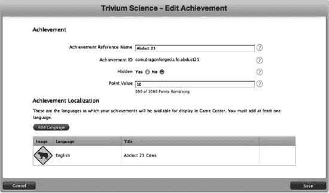

**图 4–5.** *iTunes Connect 中显示的一个新成就*

我们希望为我们的游戏设置几个不同的成就。继续创建另一个新成就，用于绑架一头牛；这将是我们的非渐进式成就。然后，再创建一个成就，用于五分钟的游戏时间，并将其设置为隐藏。最后一个成就将让我们体验计时器、渐进式成就和隐藏成就。你可以为这些成选择任何分值、描述、标题和图像，但请务必记住成就 ID。

现在，你应该在 `iTunes Connect` 中为我们的游戏配置了三个成就。我们现在可以返回 `Xcode` 并开始处理这些成就。


#### 呈现成就

与排行榜不同，在将用户数据填充到成就系统之前，GUI 预览方面有大量工作可做。了解修改成就对默认 GUI 显示方式的影响会很有帮助。本章中，我们将首先展示苹果的成就 GUI，然后转向提交用户数据。本章稍后还会讨论自定义 GUI 成就。

在开始之前，我们需要创建一个新的`UIButton`来触发成就视图。与创建两个排行榜按钮时类似，我们很可能希望在游戏屏幕之外完成此操作。首先，在`UFOViewController`视图中添加一个新按钮，如图 4-6 所示。

你还需要为新的成就按钮创建并连接一个`IBAction`。将以下代码插入到连接到成就按钮的操作中。

```
-(IBAction)achievementButtonPressed;
{
  GKAchievementViewController *controller = nil;
  controller = [[GKAchievementViewController alloc] init];
  [achievementViewController setAchievementDelegate:self];
  [self presentModalViewController:controller animated:YES];
  [controller release];
}
```

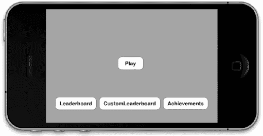

**图 4-6.** *添加新按钮以触发成就视图*

此外，我们需要连接一个与`GKAchievementViewController`配合使用的委托回调。将以下方法添加到实现文件中。

```
- (void)achievementViewControllerDidFinish:(GKAchievementViewController *)viewController
{
  [self dismissModalViewControllerAnimated:YES];
}
```

如果运行 App 并点击成就按钮，你现在会看到一个类似于图 4-7 所示的视图。显示的成就使用的是苹果的“未获得”图像。苹果建议始终使用其“未获得”图像，但在使用自定义成就 GUI 时，可以覆盖此图像并返回自己的图像。

接下来，回想一下我们设置了三个成就，其中一个是隐藏的。如图 4-7 所示，提供的视图只显示了两个成就。因为我们尚未向第三个成就提交任何进度，所以其详情对用户是隐藏的。不过，你可以看到顶部信息行反映存在一个隐藏成就（0/3 个成就）。同时请注意，成就使用的是在 iTunes Connect 中设置的本地化“未获得”描述。

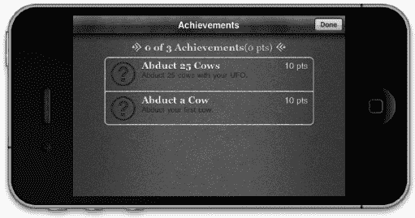

**图 4-7.** *使用苹果默认 GUI 显示的成就*

这些就是通过苹果内置 GUI 向用户展示其成就进度所需的全部步骤。下一节中，我们将探讨如何更新并推进这些成就。本章稍后，你将学习如何使用自定义 GUI 呈现成就。

**注意：** 用户始终可以在 Game Center.app 中查看其成就进度，但建议你也在应用中为用户提供查看进度的途径。

#### 修改成就进度

与排行榜条目不同，成就可以通过用户交互不断修改和推进。与我们之前处理的 Game Center 功能类似，我们将在`GameCenterManager`类中创建一个新方法来处理与成就的交互。添加以下方法后，我们将回顾该方法以理解其具体工作原理。

**提示：** 请记住，所有源代码均可在线获取。处理大型方法时，从 apress.com 下载的源代码中复制可能更方便。

```
- (void)submitAchievement:(NSString*)identifier percentComplete:(double)percentComplete
{
  if ([self earnedAchievementCache] == NULL)  {
    [GKAchievement loadAchievementsWithCompletionHandler:^(NSArray *achievements,
  NSError *error) {
      if (error == NULL) {
        NSMutableDictionary *tempCache = [NSMutableDictionary dictionaryWithCapacity:
[achievements count]];

        for (GKAchievement* achievement in achievements) {
          [tempCache setObject: achievement forKey: [achievement identifier]];
        }

        [self setEarnedAchievementCache:tempCache];
        [self submitAchievement:identifier percentComplete:percentComplete];
     } else {
        [self callDelegateOnMainThread:@selector(achievementSubmitted:error:)
  withArg:NULL error:error];
      }
   }];
 } else {
   GKAchievement *achievement = [[self earnedAchievementCache]
objectForKey:identifier];

   if (achievement != NULL) {
     if (([achievement percentComplete] >= 100.0) ||
([achievement percentComplete] <= percentComplete)) {
       achievement = NULL;
      }
      [achievement setPercentComplete:percentComplete];
    } else {
      achievement = [[[GKAchievement alloc] initWithIdentifier:identifier] autorelease];
      [achievement setPercentComplete:percentComplete];
      [[self earnedAchievementCache] setObject:achievement forKey:[achievement
 identifier]];
    }

    if (achievement != NULL) {
      [achievement reportAchievementWithCompletionHandler:^(NSError *error) {
        [self callDelegateOnMainThread: @selector(achievementSubmitted:error:)
  withArg: achievement error:error];
      }];
    }
  }
}
```

在执行此代码之前，需要添加一个新的类属性。创建一个新的可变字典（别忘了合成它）。`GameCenterManager`头文件的相关部分现在应如下所示。

```
@interface GameCenterManager : NSObject <GameCenterManagerDelegate>
{
  id <GameCenterManagerDelegate, NSObject> delegate;
  NSMutableDictionary* earnedAchievementCache;
}

@property(nonatomic, retain) id <GameCenterManagerDelegate, NSObject> delegate;
@property(nonatomic, retain) NSMutableDictionary* earnedAchievementCache;
```

现在看看我们添加的`submitAchievement:percentComplete:`方法。其中有两个主要的 if/else 块。如果`[self earnedAchievemenetCache]`为 NULL（该方法首次执行时始终如此），则执行第一个块。现在让我们来看一下这个代码块。

```
[GKAchievement loadAchievementsWithCompletionHandler:^(NSArray *achievements, NSError
 *error) {
  if (error == NULL) {
    NSMutableDictionary *tempCache = [NSMutableDictionary dictionaryWithCapacity:
[achievements count]];

    for (GKAchievement *achievement in achievements) {
      [tempCache setObject:achievement forKey:[achievement identifier]];

      }
```


`[self setEarnedAchievementCache:tempCache];`
`[self submitAchievement:identifier percentComplete:percentComplete];`
`} else {`
`[self callDelegateOnMainThread:@selector(achievementSubmitted:error:) withArg:NULL error:error];`
`}`
`}];`

**重要提示：** 由 `loadAchievementsWithCompletionHandler` 返回的数组不会显示任何你尚未提交过 `percentageCompleted`（完成百分比）的成就。

这段代码的主要功能是将成就列表加载到 `earnedAchievementCache` 中。我们在 `GKAchievement` 上调用 `loadAchievementsWithCompletionHandler`。该调用会返回一个数组，其中包含在 iTunes Connect 中设置的所有成就。然后，我们将 `GKAchievement` 对象以标识符为键存储到字典中。此时，代码再次调用 `submitAchievement:percentComplete`。这一次，`earnedAchievementCache` 不为 `NULL`，因此执行了第二组代码。如果在处理过程中遇到错误，我们会使用标准的委托回调将错误发送给我们的委托。

你需要向 `GameCenterManager` 添加一个新的协议方法来处理这个委托回调；现在是做这件事的好时机。在头文件中添加以下可选协议：

`- (void)achievementSubmitted:(GKAchievement*)achievement error:(NSError*)error;`

现在，让我们看看第二段代码。以下代码在执行成功时会将成就提交给 Game Center 服务器：

```
GKAchievement *achievement = [[self earnedAchievementCache] objectForKey:identifier];
if (achievement != NULL) {
  if ((achievement.percentComplete >= 100.0) || (achievement.percentComplete >=
percentComplete)) {
        achievement = NULL;
  }

  [achievement setPercentComplete:percentComplete];
} else {
  achievement = [[[GKAchievement alloc] initWithIdentifier: identifier] autorelease];
  [achievement setPercentComplete:percentComplete];

  [[self earnedAchievementCache] setObject:achievement forKey:[achievement identifier]];
}
if (achievement != NULL) {
  [achievement reportAchievementWithCompletionHandler: ^(NSError *error) {
    [self callDelegateOnMainThread:@selector(achievementSubmitted:error:)
 withArg:achievement error:error];
      }];
}
```

第一行代码根据传入该方法的标识符字符串，从 `earnedAchievementCache` 中获取一个 `GKAchievement` 对象。如果成就已经完成，或报告的进度与 Game Center 服务器上的相同，我们会将该成就设置为 `NULL`。这可以防止我们因提交会被忽略的进度而占用网络时间。同时，我们也将 `GKAchievement` 对象上的 `percentComplete` 属性设置为传入此方法的双精度值。

如果缓存中不存在该成就，我们就分配并初始化一个新的实例。在这种情况下，我们还需要将其添加到本地的成就缓存中。

最后一步，在进行了 `NULL` 检查之后，就是提交成就。我们在成就对象上调用 `reportAchievementWithCompletionHandler`。然后，使用我们现有的协议将结果返回给我们的委托。

**注意：** 所有成就都有一个 `percentageComplete`（完成百分比），无论它们是否允许一次性完成百分比。如果你的成就只能完全获得或完全未获得，那么你需要为“已获得”状态传入 `100`。

在这部分中，我们需要做的最后一件事是在 `UFOGameViewController` 中实现我们的协议方法。在文件的实现部分添加以下方法；我们现在要关注的是将错误和成功信息打印到控制台：

```
- (void)achievementSubmitted:(GKAchievement *)achievement error:(NSError *)error;
{
  if (error) {
    NSLog(@"There was an error in reporting the achievement: %@", [error
 localizedDescription]);
  } else {
    NSLog(@"achievement submitted");
  }
}
```

### 重置成就

在某些情况下，你可能想要重置用户的成就。除了在调试时非常有用外，你可能会发现为用户提供一个重置选项也很有用。你可能想添加一个“声望”模式，或者让用户有机会从头开始游戏。以下代码片段将完全重置本地用户应用中所有成就：

```
- (void)resetAchievements
{
  [self setEarnedAchievementCache:NULL];

  [GKAchievement resetAchievementsWithCompletionHandler:^(NSError *error) {
     if (error == NULL) {
       NSLog(@"Achievements have been reset");
     } else {
       NSLog(@"There was an error in resetting the achievements: %@", [error
  localizedDescription]);
    }
  }];
}
```

**重要提示：** 不要忘记移除你存储的关于成就的缓存信息，否则在应用重启之前，你将无法推进重置后的成就。


### 添加成就钩子

在应用中实现成就功能的最大挑战，在于将激活和推进这些成就的钩子添加到常规流程中。根据我的个人经验，我发现程序接近完成时再添加这些钩子，比在开发过程中逐步添加要容易得多。在本节中，我将提供多个如何关联成就的示例；你的应用可能与之差异很大，但你应该能轻松调整这些示例来适应自己的需求。

为了让成就更便于获取进度详情，我们首先在 `GameCenterManager` 类中添加几个便捷方法。这是我们用来填充本地成就缓存的第一个方法。

```
-(void)populateAchievementCache
{
  if ([self earnedAchievementCache] == NULL) {
    [GKAchievement loadAchievementsWithCompletionHandler:^(NSArray *achievements,
  NSError *error) {
      if (error == NULL) {
        NSMutableDictionary* tempCache= [NSMutableDictionary dictionaryWithCapacity:
  [achievements count]];

        for (GKAchievement *achievement in achievements) {
          [tempCache setObject:achievement forKey:[achievement identifier]];
        }

        [self setEarnedAchievementCache:tempCache];
      } else {
        NSLog(@"An error occurred while loading achievements: %@", [error
localizedDescription]);
     }
   }];
 }
}
```

前一个方法的功能与上一节预览的提交成就进度方法中的缓存填充代码非常相似。我们需要填充本地缓存，以便与其他两个便捷方法配合使用。我们希望在认证后尽快调用 `populateAchievementCache`；在我们的演示应用中，我已经在 `GameCenterManager` 中从本地玩家认证方法中添加了对它的调用。同时添加以下方法。

```
- (double)percentageCompleteOfAchievementWithIdentifier: (NSString*)identifier
{
  if ([self earnedAchievementCache] == NULL) {
    NSLog(@"Unable to determine achievement progress, local cache is empty");
  } else {
    GKAchievement *achievement= [[self earnedAchievementCache] objectForKey:identifier];

    if (achievement != NULL) {
      return [achievement percentComplete];
    } else {
      return 0;
    }
  }
  return -1;
}
```

前一个方法返回一个双精度浮点数，表示传入标识符所对应成就的完成百分比。如果在本地缓存中找不到该成就的副本，我们可以假设完成百分比为 0。下一个方法使用前一个方法返回 `YES` 或 `NO`，指示成就是否已完成。

```
- (BOOL)achievementWithIdentifierIsComplete: (NSString*)identifier
{
  if ([self percentageCompleteOfAchievementWithIdentifier:identifier] >= 100) {
    return YES;
  } else  {
    return NO;
  }
}
```

**注意：** 认证后务必尽快调用 `populateAchievementCache`。否则，这些便捷方法将无法返回正确的信息。

现在我们已经有了一些辅助方法，可以开始为 UFO 关联成就钩子了。我们需要关联三个不同的成就。前两个都与我们绑架的奶牛数量有关，所以我们先从这里开始。修改 `UFOGameViewController` 的 `finishAbducting` 方法，使其匹配以下内容。

```
- (void)finishAbducting
{
  if (!currentAbductee || !tractorBeamOn) return;

  [cowArray removeObjectIdenticalTo:currentAbductee];

  [tractorBeamImageView removeFromSuperview];
  tractorBeamOn = NO;

  score++;
  [scoreLabel setText:[NSString stringWithFormat:@"SCORE %05.0f", score]];

  [[currentAbductee layer] removeAllAnimations];
  [currentAbductee removeFromSuperview];

  currentAbductee = nil;

  [self spawnCow];

  if (![[self gcManager] achievementWithIdentifierIsComplete:
@"com.dragonforged.ufo.aduct1"]) {
    [[self gcManager] submitAchievement:@"com.dragonforged.ufo.aduct1"
percentComplete:100];
  }
}
```

此时我们只关心这个方法的最后几行。首先，我们在单次绑架的标识符字符串上调用便捷方法 `achievementWithIdentifierIsComplete`。由于这是一个已获得或未获得的成就，我们无需关心当前的完成百分比。为了将成就标记为已完成，我们将其完成百分比设置为 100。

**注意：** 不要忘记将示例中的标识符字符串替换为你在 iTunes Connect 中为单次绑架成就使用的那个。

下一个成就的关联方式类似；唯一的区别是我们使用了增量进度。在 `finishAbducting` 方法的末尾添加以下代码片段。

```
if (![[self gcManager] achievementWithIdentifierIsComplete:
 @"com.dragonforged.ufo.abduct25"]) {
  double percentComplete = [[self gcManager]
 percentageCompleteOfAchievementWithIdentifier: @"com.dragonforged.ufo.abduct25"];

  percentComplete += 4;
  [[self gcManager] submitAchievement:@"com.dragonforged.ufo.abduct25"
 percentComplete:percentComplete];
}
```

在上述代码片段中，我们使用了与提交完成成就相同的方法，但有一个主要区别。我们首先需要确定该成就的当前进度。然后我们为其加 4，因为 25 的 4% 等于 1。为了在 25 次绑架中增加 1 次，我们需要添加 4。

**提示：** 不要忘记我们添加到 `GameCenterManager` 中的 `resetAchievement` 方法。它在调试提交代码时非常有用。我发现调试期间在 `didAuthenticate` 部分保留对此方法的调用，总是能让应用恢复到干净状态。

继续运行游戏并绑架几头奶牛。完成后，你会注意到成就界面现在显示的进度类似于图 4-8 所示。如果你至少绑架了一头奶牛，你应该会获得一个完成的成就。如果你绑架的奶牛少于 25 头，你应该会获得一个进度成就。请注意，用户完成成就时并不会收到通知；我们将在后面的“成就完成反馈”一节中讨论通知方法。

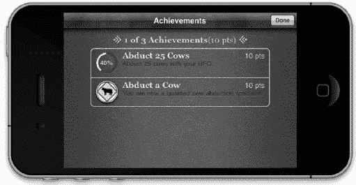

**图 4-8.** *进度成就*

我们为此项目添加的最后一个钩子用来处理玩家玩满五分钟的成就。你的第一反应可能是记录游戏时间，并在用户退出游戏时将其作为进度提交。这可能不是最佳方法。我们希望用户完成成就时即时通知他们。你不希望他们必须等到游戏结束才能看到自己获得了哪些成就。解决这个问题有很多方法。在这个示例中，我们将每三秒触发一个 `NSTimer`（五分钟的百分之一），并更新成就进度。将以下内容添加到 `UFOGameViewController`。

```
- (void)tickThreeSeconds
{
  if ([[self gcManager]
 achievementWithIdentifierIsComplete:@"com.dragonforged.ufo.play5"]) return;

  double percentComplete = [[self gcManager]
 percentageCompleteOfAchievementWithIdentifier:@"com.dragonforged.ufo.play5"];
  percentComplete++;
  [[self gcManager] submitAchievement:@"com.dragonforged.ufo.play5"
 percentComplete:percentComplete];
}
```


### 排版后的内容

除了修改`viewDidAppear`和`ViewWillDisappear`方法以匹配以下代码外，我们还将启动一个三秒定时器。每次定时器触发时，都会调用`tickThreeSeconds`。这将给出我们成就的当前进度，我们对其加 1%，然后提交回服务器。如果成就已经完成，我们直接返回。

```
-(void)viewDidAppear:(BOOL)animated
{
  [super viewDidAppear: animated];
  timer = [NSTimer scheduledTimerWithTimeInterval:3.0 target:self selector:@selector(tickThreeSeconds) userInfo:nil repeats:YES];
}

- (void)viewWillDisappear:(BOOL)animated
{
  [super viewWillDisappear: animated];
  [timer invalidate];
  timer = nil;
}
```

### 另一个便捷方法

有时候，你可能希望仅凭一个成就标识符（achievement identifier）就能获取到`GKAchievement`。当传入一个成就标识符时，以下方法会返回一个`GKAchievement`对象。

```
- (GKAchievement*)achievementForIdentifier:(NSString*)identifier
{
  GKAchievement *achievement = [[self earnedAchievementCache] objectForKey:identifier];
  if (achievement == nil) {
    achievement = [[[GKAchievement alloc] initWithIdentifier:identifier] autorelease];
    [[self earnedAchievementCache] setObject:achievement forKey:[achievement identifier]];
  }
  return achievement;
}
```

### 成就完成反馈

让用户知道他们何时完成了成就非常重要。然而，你不应该只是弹出一个`UIAlertView`，因为考虑到大多数成就将在游戏进行中（例如在赛车游戏中完成 20 圈）完成，这会非常分散注意力。你肯定不想让用户中断操作，因此我们需要一个更好的系统。我一直偏爱那种从底部或顶部滑入的小视图来通知用户成就完成——这与登录 Game Center 时获得的反馈方式非常相似。

为了实现反馈系统，我们首先需要在`GameCenterManager`中添加一个新的协议方法。我们将用它来通知委托（delegate）某个成就是首次完成。将以下方法作为可选协议添加到头文件中：

```
-(void)achievementEarned:(GKAchievementDescription*)achievement;
```

此外，我们需要修改现有的`submitAchievement:percentComplete:`方法。查看该方法的最后一个`if`语句块。我们想按如下方式修改它，并添加一个`if`语句来判断`percentageComplete`是否超过 100，这将调用我们的新协议。同时注意，我们使用的是`GKAchievementDescription`而不是`GKAchievement`。我们将在下一节“自定义成就 GUI”中进一步讨论这一点。

```
if (achievement != NULL) {
  [achievement reportAchievementWithCompletionHandler:^(NSError *error) {
    if (percentComplete < 100) {
      [self callDelegateOnMainThread: @selector(achievementSubmitted:error:) withArg:achievement error:error];
      return;
    }
    [GKAchievementDescription loadAchievementDescriptionsWithCompletionHandler:
^(NSArray *descriptions, NSError *error) {
      for (GKAchievementDescription *achievementDescription in descriptions) {
        if (![[achievement identifier] isEqualToString:[achievementDescription identifier]]) continue;
        [self callDelegateOnMainThread:@selector(achievementEarned:) withArg:achievementDescription error:nil];
      }
    }];
    [self callDelegateOnMainThread: @selector(achievementSubmitted:error:) withArg:achievement error:error];
  }];
}
```

至此，我们完成了对`GameCenterManager`类的修改。现在需要为用户连接视觉反馈。回到`UFOGameViewController.m`，添加我们新的协议方法`achievementEarned:`。你可以在这里添加任何类型的反馈，包括标准的`UIAlertView`，但在本节中我们将探索一些更用户友好的方式。

我们需要创建一些新的`IBOutlet`作为`UFOGameViewController`的一部分。创建一个新的视图，将其尺寸设置为 480×25。然后，将视图的背景设置为黑色，不透明度为 70%。我们还要创建一个新的标签，将其放在这个视图的中心，并将文本对齐方式设置为居中。你的视图应该类似于图 4-9 所示。

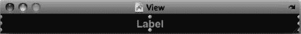

**图 4-9.** 成就完成视图和标签

将视图和标签都连接到`IBOutlet`。我分别将它们命名为`achievementCompletionView`和`achievementCompletionLabel`。然后修改我们的`achievementEarned:`方法，并添加一个额外的方法来处理动画。

```
- (void)achievementEarned:(GKAchievementDescription *)achievement;
{
  [achievementCompletionView setFrame:CGRectMake(0, 320, 480, 25)];
  [[self view] addSubview:achievementCompletionView];
  [achievementCompletionLabel setText:[achievement achievedDescription]];
  [UIView beginAnimations:@"SlideInAchievement" context:nil];
  [UIView setAnimationDuration:0.5];
  [UIView setAnimationDelegate:self];
  [UIView setAnimationDidStopSelector:@selector(achievementEarnedAnimationDone)];
  [achievementCompletionView setFrame:CGRectMake(0, 295, 480, 25)];
  [UIView commitAnimations];
}

-(void)achievementEarnedAnimationDone
{
  [UIView beginAnimations:@"SlideInAchievement" context:nil];
  [UIView setAnimationDelay:5.0];
  [UIView setAnimationDuration:1.0];
  [achievementCompletionView setFrame:CGRectMake(0, 320, 480, 25)];
  [UIView commitAnimations];
}
```

这两个方法都非常直接。当我们从完成成就得到委托回调时，我们将`achievementCompletionView`添加到游戏视图中。然后，将其动画显示到视图的底部。经过五秒延迟后，再将其动画移出视图。你还可以访问`GKAchievementDescription`中使用的图片。我们将在下一节中进一步探讨这些属性。

**提示：** 你可能需要重置你的成就才能看到完成进度。我发现创建一个用于测试时重置成就的新按钮很有帮助。

如果你现在运行应用并绑架一头牛（假设你还没有完成这个成就），你应该会看到非常类似于图 4-10 所示的输出。

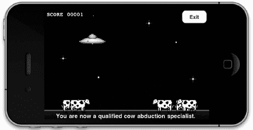

**图 4-10.**

### iOS 5 完成横幅

在 iOS 4 中，你需要负责创建和显示成就反馈给用户。Apple 在`GKAchievement`类中添加了一个非常易用的属性，允许你快速实现这一步骤：设置`showsCompletionBanner`属性，如下面的代码片段所示，当成就完成时会向用户显示一条消息。`showsCompletionBanner`的默认属性是`NO`。

```
myAchievement.showsCompletionBanner = YES;
```


#### 自定义成就界面

有时你可能需要自定义成就系统的外观，以匹配应用中的自定义界面。正如上一章排行榜部分所见，我们可以处理原始数据并以任意方式呈现。本节重点介绍如何使用自己的 GUI 将成就添加到应用中。与排行榜部分类似，我们需要做的第一件事是添加一个新按钮，用于跳转到自定义成就进度视图。添加一个新按钮及关联操作，如图 4-11 所示。

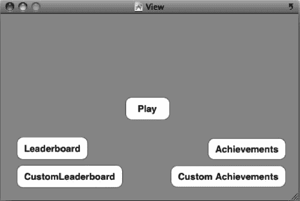

**图 4-11.** *在 Interface Builder 中添加自定义成就按钮*

我们需要创建一个新类来处理成就进度信息的显示与处理。创建名为`UFOAchievementViewController`的新类，使其继承`UIViewController`。在 XIB 中为表格视图、导航栏和关闭按钮设置操作和输出口。别忘了同时设置表格视图的数据源和代理。你的 XIB 应类似于图 4-12 所示。

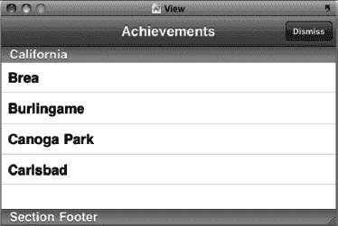

**图 4-12.** *Interface Builder 显示的自定义成就进度视图*

我们还需要创建一个数组来保存成就数据。新建一个`NSArray`对象，命名为`achievementArray`。同时导入`GameCenterManager`头文件并遵循其协议。`UFOAchievementViewController`的头文件现在应类似如下内容：

```
#import <UIKit/UIKit.h>
#import "GameCenterManager.h"

@interface UFOAchievementViewController : UIViewController <UITableViewDelegate,
 UITableViewDataSource, GameCenterManagerDelegate>
{
  GameCenterManager *gcManager;

  UITableView *achievementTableView;

  NSArray *achievementArray;
}

@property (nonatomic, retain) GameCenterManager *gcManager;
@property (nonatomic, retain) NSArray *achievementArray;
@property (nonatomic, retain) IBOutlet UITableView *achievementTableView;

- (IBAction)dismissAction;

@end
```

接下来，将操作连接到我们新的`UFOAchievementViewController`类。修改在`UFOViewController`中创建的操作，使其反映以下变化：

```
- (IBAction)customAchievementButtonPressed;
{
  UFOAchievementViewController *achievementViewController =
  [[UFOAchievementViewController alloc] init];

  [achievementViewController setGcManager:gcManager];

  [self presentModalViewController:achievementViewController animated:YES];

  [achievementViewController release];
}
```

现在切换到`UFOAchievementViewController`的实现文件。首先，添加一个方法以确保视图在横屏方向正确显示，添加如下方法：

```
-(BOOL) shouldAutorotateToInterfaceOrientation:
 (UIInterfaceOrientation)interfaceOrientation
{
  if (UIInterfaceOrientationIsLandscape(interfaceOrientation)) return YES;
  return NO;
}
```

还需要一个关闭操作，同样添加该方法：

```
- (IBAction)dismissAction
{
  [self dismissModalViewControllerAnimated:YES];
}
```

如果现在运行应用，你应该会看到一个空白且无趣的表格视图，类似于图 4-13 所示。此外，关闭按钮现在应该可以正常工作了。

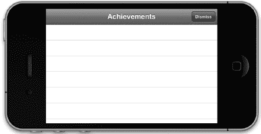

**图 4-13.** *我们将用于自定义成就的空白自定义表格*

在继续处理`UFOAchievementViewController`之前，我们需要回到`GameCenterManager`类。在`GameCenterManagerDelegate`中添加以下方法作为可选协议：

```
- (void)achievementDescriptionsLoaded:(NSArray *)descriptions error:(NSError *)error;
```

然后在`GameCenterManager`的实现中添加以下新方法：

```
- (void)retrieveAchievementMetadata
{
  [GKAchievementDescription loadAchievementDescriptionsWithCompletionHandler:
^(NSArray *descriptions, NSError *error) {
    [self callDelegateOnMainThread:@selector(achievementDescriptionsLoaded:error:)
 withArg:descriptions error:error];
  }];
}
```

该方法将返回 Game Center 服务器上找到的所有`GKAchievementDescription`。现在我们可以回到`UFOAchievementViewController`类，完成自定义成就表格的实现。

**重要提示：** `retrieveAchievementMetadata`方法也会返回隐藏成就。如果你想对用户隐藏这些成就，必须从结果中过滤掉它们。

修改`UFOAchievementViewController`的`viewWillAppear:`方法，使其匹配以下内容：

```
- (void)viewWillAppear:(BOOL)animated
{
  [[self gcManager] setDelegate:self];

  [super viewWillAppear: YES];

  [[self gcManager] retrieveAchievementMetadata];
}
```

此外，添加我们之前创建的新协议方法。如果没有遇到错误，我们只需将返回的描述设置到本地数组中。获取新数据后，我们还需要刷新表格以向用户显示数据：

```
- (void)achievementDescriptionsLoaded:(NSArray *)descriptions error:(NSError *)error;
{
  if (error == nil) {
    [self setAchievementArray:descriptions];
  } else {
    NSLog(@"An error occurred when retrieving the achievement descriptions: %@",
 [error localizedDescription]);
  }

  [achievementTableView reloadData];
}
```

对于`numberOfRowsInSection`方法，我们只需返回`achievementArray`的计数，如下所示：

```
- (NSInteger)tableView:(UITableView *)tableView numberOfRowsInSection:(NSInteger)section
{
  return [[self achievementArray] count];
}
```

我们还需要实现`cellForRowAtIndexPath`方法。将以下方法也添加到实现中。添加后，我们将更详细地查看它：

```
- (UITableViewCell *)tableView:(UITableView *)tableView
 cellForRowAtIndexPath:(NSIndexPath *)indexPath
{
  static NSString *CellIdentifier = @"Cell";
  UITableViewCell *cell = [tableView dequeueReusableCellWithIdentifier:CellIdentifier];

  if (cell == nil) {
    cell = [[[UITableViewCell alloc] initWithStyle:UITableViewCellStyleDefault
 reuseIdentifier:CellIdentifier] autorelease];
    [cell setSelectionStyle:UITableViewCellSelectionStyleNone];
  }

  GKAchievementDescription *achievementDescription = [[self achievementArray]
 objectAtIndex:[indexPath row]];
  [[cell textLabel] setText:[achievementDescription title]];

  if ([achievementDescription image] == nil) {
    [[cell imageView] setImage:[GKAchievementDescription
 placeholderCompletedAchievementImage]];
    [achievementDescription loadImageWithCompletionHandler:^(UIImage *image, NSError
 *error) {
       if (error == nil) {
         [[cell imageView] setImage:image];
       }
     }];
   } else {
     [[cell imageView] setImage:[achievementDescription image]];
  }

  return cell;
}
```

该方法的前半部分相当标准：我们创建新的表格单元格，或者从可重用集合中获取一个。为了提高效率，我们也使用了默认的内置表格单元格。我们创建一个新的`GKAchievementDescription`并根据`achievementArray`中的行号填充数据。

我们处理的第一个属性是标题，用于设置单元格的`textLabel`。在大多数情况下，你可能还需要使用`achievedDescription`或`unachievedDescription`以及标题。为简单起见，这里我们只使用标题。接下来，我们需要设置成就的图片。这部分稍微复杂一些。


`GKAchievementDescription`有一个关联的`image`属性，该属性在填充之前为`nil`。首先，检查该属性是否已填充；我们可以通过简单的`nil`检查来实现。如果已填充，我们将单元格图像设置为已缓存的图像。如果没有，我们需要从 Game Center 服务器加载图像。要填充它，我们在`GKAchievementDescription`对象上调用`loadImageWithCompletionHandler`。这将返回已获得的图像。请注意，我们使用了默认占位图像，可以通过`GKAchievementDescription`上的类方法访问该图像。

**提示：** 在`UITableViewCellSytleDefault`单元格中设置图像时，不要将图像设置为`nil`。这会导致单元格左对齐文本并移除图像视图。如果我们随后使用 block 加载图像，图像直到单元格或表格重新加载后才会显示。这就是我们首先设置占位图像的原因。

如果我们运行应用程序并访问自定义成就视图，它看起来应该类似于图 4-14 中显示的视图。

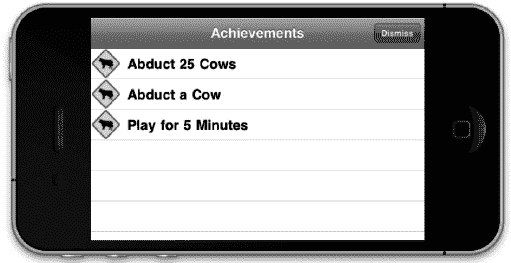

**图 4-14.** *在自定义 GUI 中显示的成就数据*

我们只能查看成就列表及其关联图像，但无法查看用户解锁成就的进度。回想一下，本章前面我们编写了几个便捷方法，这些方法在此处可能有用。我们有两个方法可以仅返回成就的进度：`percentageCompleteOfAchievementWithIdentifier:`和`achievementWithIdentifierIsComplete`。此外，如果我们需要访问整个`GKAchievement`对象，可以使用`achievementForIdentifier`。让我们使用`percentageCompleteOfAchievementWithIdentifier:`来显示完成百分比。修改`cellForRowAtIndexPath:`中设置单元格文本标签的代码部分。新的代码片段应如下所示。

```
NSString *percentageCompleteString = [NSString stringWithFormat: @" %.0f%% Complete",
 [[self gcManager] percentageCompleteOfAchievementWithIdentifier:
[achievementDescription identifier]]];

[[cell textLabel] setText:[[achievementDescription title]
 stringByAppendingString:percentageCompleteString]];
```

如果再次运行游戏，您将注意到更有用的输出，如图 4-15 所示。

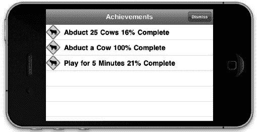

**图 4-15.** *带有自定义 GUI 和完成百分比的成就*

#### 从提交失败中恢复

您作为开发者全权负责处理成就提交失败的情况。您不希望用户丢失任何成就进度。丢失成就会让用户感到非常沮丧，应不惜一切代价避免。为了防止这种情况，请采取我们处理分数失败时使用的相同方法。主要区别在于，无需存储`GKAchievement`对象，因为它不包含任何日期信息或时间敏感信息。我们只需要存储`percentageComplete`。我们将创建一个新方法来处理此行为。将以下方法添加到`GameCenterManager`类。

```
-(void)storeAchievementToSubmitLater:(GKAchievement *)achievement
{
  NSMutableDictionary *achievementDictionary = [[NSMutableDictionary alloc]
 initWithArray:[[NSUserDefaults standardUserDefaults]
 objectForKey:@"savedAchievements"]];
  if ([achievementDictionary objectForKey:[achievement identifier]] == nil) {
    [achievementDictionary setObject:[NSNumber numberWithDouble:[achievement
percentComplete]] forKey:[achievement identifier]];
  } else {
    double storedProgress = [[achievementDictionary objectForKey:
achievement.identifier] doubleValue];
    if ([achievement percentComplete] > storedProgress) {
      [achievementDictionary setObject:[NSNumber numberWithDouble:[achievement
percentComplete]] forKey:[achievement identifier]];
    }
  }

  [[NSUserDefaults standardUserDefaults] setObject:achievementDictionary
 forKey:@"savedAchievements"];

  [achievementDictionary release];
}
```

该方法将成就作为参数，并检查该成就是否尚未作为引用存储在我们已提交失败的成就中。如果已存储，那么我们需要检查哪一个进度更靠前，以避免任何删除用户进度的情况。完成检查后，我们将其作为字典存储到`userDefaults`中，使用`identifier`作为键，完成百分比作为值。我们在`submitAchievement:PercentComplete:`方法的错误处理中添加对此方法的调用。您可以在以下相关代码片段中找到它。

```
if (achievement!= NULL) {
  [achievement reportAchievementWithCompletionHandler: ^(NSError *error) {
    if (error != nil) {
      [self storeAchievementToSubmitLater: achievement];
    }

    if (percentComplete >= 100) {
      [GKAchievementDescription loadAchievementDescriptionsWithCompletionHandler:
 ^(NSArray *descriptions, NSError *error) {
        for (GKAchievementDescription *achievementDescription in descriptions) {
          if (![[achievement identifier] isEqualToString:[achievementDescription
 identifier]]) continue;
          [self callDelegateOnMainThread:@selector(achievementEarned:)
 withArg:achievementDescription error:nil];
        }
      }];
    }

    [self callDelegateOnMainThread: @selector(achievementSubmitted:error:)
 withArg: achievement error: error];
  }];
}
```

**提示：** 我建议告知用户其成就目前无法提交，但已保存并将在稍后提交。这能让用户知道任何进度都未被丢失。

我们还需要一个新方法，用于检查是否有未提交的成就进度。关于何时调用此方法，没有固定的答案。通常，您可以在用户通过 Game Center 认证后调用它，但您可能希望添加其他调用时机，例如每当网络可达性状态更新时。将以下方法添加到您的`GameCenterManager`类。

```
- (void)submitAllSavedAchievements
{
  NSMutableDictionary *achievementDictionary = [[NSMutableDictionary alloc]
 initWithArray:[[NSUserDefaults standardUserDefaults]
 objectForKey:@"savedAchievements"]];
  NSArray *keys = [achievementDictionary allKeys];

  for (int x = 0; x < [keys count]; x++) {
    [self submitAchievement:[keys objectAtIndex:x] percentComplete:
[[achievementDictionary objectForKey:[keys objectAtIndex:x]] doubleValue]];
    [[NSUserDefaults standardUserDefaults] removeObjectForKey:[keys objectAtIndex:x]];
  }

  [achievementDictionary release];
}
```

此方法加载未提交进度的副本，并遍历每个项目，尝试逐一重新提交。如果它们再次提交失败，它们将被重新添加回已保存的数据中。


### 总结

现在您已掌握所有必要工具，可以为支持 Game Center 的应用添加丰富复杂的成就系统。您不仅了解了添加成就的价值，还学会了如何在 iTunes Connect 门户中设置与配置成就。我们讨论了使用 Apple 默认图形界面与自定义图形界面的利弊。现在您已懂得如何扩展 `GameCenterManager` 类，以统一实现成就进度发布、成就反馈获取以及成就进度重置功能。

本章完成的最重要步骤是扩展可复用的 `GameCenterManager` 类，这将使您能在未来项目中轻松添加成就。下一章我们将探讨 Game Center 的匹配与邀请系统，以便您添加多人游戏功能及其他网络特性。

## 第 5 章

## 匹配与邀请

从本章开始，并延续至后续几章，我们将讨论如何通过 Game Center（以及稍后的 Game Kit）为您的应用或游戏添加网络功能。在当代，为应用添加网络能力几乎被视为一项必备技术。如今几乎所有现代软件都包含某种网络组件，无论是与在线服务通信以获取或发布信息，还是直接与对等设备交换数据。

在接下来的章节中，我们将讨论与其他对等设备的通信，但并非所有网络配置都是点对点模式（关于网络设计细节请参阅第 7 章）。

本章将重点探讨如何使用 Game Center 的邀请系统查找并邀请其他用户加入您的应用。

在处理邀请方面，Game Center 以极低的成本为您提供了被严重低估的销售与分发工具。当邀请非本地用户开始在您的游戏或应用中进行多人体验时，您可以选择邀请任意 Game Center 好友。如果被邀好友尚未安装该应用，系统会提示他们立即购买并开始游戏。在 iPhone 上，没有其他方法能以这种方式向其他用户发送"立即购买"链接。这一功能为扩大用户群提供了绝佳途径——只需让您的用户为您推广即可。

### 为何要在应用中添加匹配与邀请功能？

纵观近年来任何年度销量前十的 PC 或主机游戏榜单，您都会发现它们严重偏向于强调多人互动的游戏。让我们快速回顾 2010 年最畅销的 PC 游戏《使命召唤：黑色行动》。虽然该游戏确实包含单人模式，但相比核心卖点，这更像是游戏的附加内容。其重点显然在多人游戏上，甚至不惜牺牲单人战役。近年来，行业重心已从打造丰富深刻的单人战役转向投入更多精力开发多人模式。这一新现象背后有着充分合理的解释：多人模式能带来更高的性价比。

人类天生是社会性生物。我们需要社交互动来维持健康的心理发展。电子游戏和其他社交软件正日益成为这种互动的出口。无论您是否认同这一观点的意识形态，事实是多人游戏正变得越来越流行。软件用户对多人互动的好感与日俱增——无论是大型多人在线角色扮演游戏，还是常见的的第一人称射击游戏。

为游戏添加多人元素可以将玩家的游玩时间延长百倍。如需证明，请看看 1999 年发布的《雷神之锤 3》和《虚幻竞技场》，这两款游戏在发布多年后仍有用户登录。如果它们只专注于单人模式，很可能就不会拥有如此忠实的粉丝群体。以下是通过 Game Center 添加匹配与邀请功能应成为产品商业决策的更多理由。

- 为游戏添加多人组件是提升精致度的绝佳方式。根据您所开发的游戏类型，添加多人元素可能只需非常少的额外工作。
- 用户已经期望 App Store 中的顶级游戏具备多人功能。
- 如果您拥有出色的多人组件，就可以证明更高的定价合理性。
- 让用户即时下载您应用的最佳方式莫过于自动购买邀请系统。如果您能让潜在用户在收到游戏邀请时立即购买，您就有更大机会促成交易。
- 如果您采用广告支持系统，增加应用或游戏的游玩/使用时间将带来更多收入。如果您销售付费应用，用户会觉得物超所值。
- 人类喜欢竞争，所以鼓励用户去做他们喜欢的事。多人模式或许不适合所有人，但对许多人来说，在选购新游戏时，他们只对多人模式感兴趣。

**提示：** 只要可能，请务必为您的游戏提供单人模式选项，因为仍有相当数量的用户偏好单人游戏体验。


### 常见的匹配场景

在开始处理比赛和邀请之前，理解在为 iOS 应用或游戏实现多人联机时可能遇到的一些场景至关重要。

-   你可能会遇到的第一个，也是最常见的一个场景是：已有玩家在你的应用中，并想要创建一场自动匹配的游戏。双方玩家都已安装并加载了应用，并且都处于期望开始彼此网络会话的状态。受邀玩家会收到一个通知，询问是否接受邀请方的游戏邀请。当双方都同意后，匹配界面会消失，并创建一个新的比赛。
-   另一个可能遇到的常见场景是：用户创建了一个新的匹配事件，并从他们的 Game Center 好友列表中邀请其他玩家。被邀请的好友会收到一条推送通知，告知他们已被邀请加入游戏；如果他们已安装该游戏并接受邀请，游戏将会启动。一旦所有被邀请的玩家都进入了比赛，游戏就会开始。如果被邀请者尚未安装游戏，系统会提示他们安装，安装成功后游戏将自动启动。
-   如果受邀好友尚未安装应用并决定安装，则事件流程会略有不同。安装过程结束后，应用会自动启动，你可以继续匹配事件的正常流程。
-   玩家也可以直接从 `Game Center.app` 内部创建新的匹配事件。在此场景下，所有玩家都会被启动进入该应用，并收到加入比赛的邀请。这种情况最大的好处是，如果你的应用已经支持邀请功能，则无需编写任何额外代码来支持此场景。
-   玩家还可以邀请一个或多个好友，并用自动匹配功能填补剩余的空位。这是前两种场景的混合。如果已经支持了这两种场景，那么你无需为此场景进行任何额外的编程。
-   （可选）你可能会遇到的最后一个场景是以编程方式自动匹配玩家。在这种情况下，会向 Game Center 服务器发送一个请求，然后为你返回匹配结果。玩家将看不到任何标准界面，你可以选择实现自己的界面。

**注意：** 匹配只能在两个相同的应用之间进行。如果捆绑标识符不匹配，应用将无法通过匹配系统进行通信。

### 创建新的匹配请求

要创建一个新的比赛，你首先需要创建一个新的 `GKMatchRequest` 对象。该对象代表了你将要创建的新比赛的期望参数。无论是在显示界面时，还是在以编程方式创建比赛时，都会用到 `GKMatchRequest`。当使用界面时，你会将 `GKMatchRequest` 对象传递给 `GKMatchmakerViewController` 的新实例；另一方面，如果你以编程方式处理匹配，你会将该对象传递给 `GKMatchmaker` 的一个实例。有关编程方式匹配交互的更多细节，请参阅以下章节。现在，我们先关注如何在代码中创建新的匹配请求。请看下面的代码片段。

```
GKMatchRequest *request = [[GKMatchRequest alloc] init];
request.minPlayers = 2;
request.maxPlayers = 2;
```

这个示例是最简单的演示如何创建新比赛的方法。你必须同时指定最大和最小玩家数量。在这个例子中，我们创建了一个恰好需要两名玩家的新请求。

`GKMatchRequest` 还有一个名为 `playersToInvite` 的属性，你可以使用一个 `GKPlayer` 标识符数组来自动填充到新比赛中。当连续进行多场背靠背游戏，并且你想保持相同的玩家组队时，这会非常有用。当你的应用从 `Game Center.app` 启动并带有邀请你的玩家信息时，这个属性也会被预先填充。

**注意：** 当接受与好友的匹配邀请时，该事件由 `Game Center.app` 处理，并且 `playersToInvite` 属性将被填充。

`GKMatchRequest` 还有另外两个你将在本章后续部分用到的属性：`playerAttributes` 和 `playerGroup`。这两个属性将在同名的章节中详细讨论。

**注意：** 如果你使用 Game Center 作为托管游戏的服务器，则玩家上限为四人。但是，如果你按照本章“使用你自己的服务器”部分所述实现了自己的服务器，则最多可以容纳 16 名玩家。

### 展示匹配界面

我们首先从使用 Apple 提供的标准匹配界面开始。首先添加一个新按钮，用于在我们的测试游戏主屏幕上展示该视图。我还提前将旧的“开始游戏”按钮改名为“单人游戏”，并创建了一个名为“多人游戏”的新按钮（参见图 5-1）。我们将使用 `UFOViewController` 作为匹配行为的代理，因此将视图控制器设置为遵循 `GKMatchmakerViewControllerDelegate` 协议。此外，将我们刚刚添加的多人游戏按钮的操作方法修改为以下代码。

```
- (IBAction)multiplayerButtonPressed;
{
    GKMatchRequest *request = [[GKMatchRequest alloc] init];
    request.minPlayers = 2;
    request.maxPlayers = 2;
    GKMatchmakerViewController *mmvc = [[GKMatchmakerViewController alloc]
initWithMatchRequest:request];
    mmvc.matchmakerDelegate = self;
    [request release];
    [self presentModalViewController:mmvc animated:YES];
    [mmvc release];
}
```

我们像上一节那样创建了一个新的 `GKMatchRequest` 实例。我们的演示游戏将恰好包含两名玩家，因此我们将最大值和最小值都设置为 2。

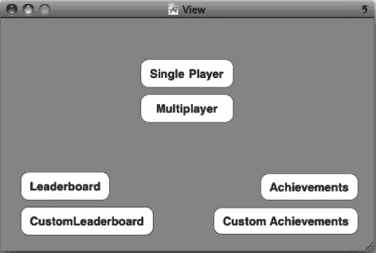

**图 5-1.** *在 UFOViewController.xib 中为多人游戏添加新按钮*

在代码片段的下一部分，我们创建了一个新的 `GKMatchViewController` 实例，并用我们刚刚创建的 `GKMatchRequest` 对其进行了分配和初始化。

我们还将代理设置为我们的 `UFOViewController` 类。完成后，我们像展示其他模态视图一样展示它。你应该会看到类似图 5-2 所示的输出。

如果你还没有这样做，现在是时候在你的沙盒 Game Center 账户中填充好友列表了。最好有几个未使用的电子邮件地址用于此过程，因为你不想使用之前用于 iTunes Connect 或 Game Center 的任何电子邮件地址。一旦你添加了一两个好友，就可以点击图 5-2 中所示的“邀请好友”按钮。你现在应该会看到好友列表，并能够邀请他们进入你的应用，如图 5-3 所示。

**提醒：** 在创建沙盒账户时，请勿使用你之前在 iTunes Connect 或 Game Center 中使用过的任何电子邮件地址，因为这可能会导致奇怪且无法预期的行为。

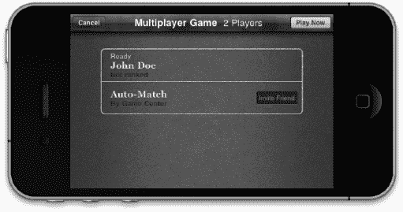

**图 5-2.** *MatchmakerViewController 创建了一个包含两名玩家的新匹配界面*

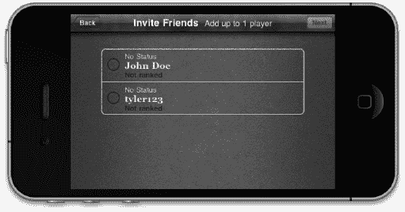

**图 5-3.** *从 Game Center 好友列表中邀请好友*

在继续之前，我们需要实现 `GKMatchmakerViewController` 所需的代理方法。在继续处理匹配之前，我们需要实现以下三个方法。


`- (void)matchmakerViewControllerWasCancelled:(GKMatchmakerViewController *)viewController`
{
    [self dismissModalViewControllerAnimated:YES];
}

`- (void)matchmakerViewController:(GKMatchmakerViewController *)viewController didFailWithError:(NSError *)error`
{
    [self dismissModalViewControllerAnimated:YES];
    if (error != nil)
    {
        NSString *message = [NSString stringWithFormat:@"An error occurred: %@", [error localizedDescription]];
        UIAlertView *alert = [[UIAlertView alloc] initWithTitle:@""
                                                        message:message delegate:nil
                                              cancelButtonTitle:@"Dismiss"
                                              otherButtonTitles:nil];
        [alert show];
        [alert release];
    }
}

`- (void)matchmakerViewController:(GKMatchmakerViewController *)viewController didFindMatch:(GKMatch *)match`
{
    [self dismissModalViewControllerAnimated:YES];
}

前两个方法处理用户取消和失败的情况，而第三个方法则处理成功的情况。最后一个方法在成功时会返回一个 `GKMatch` 对象；我们将在后续章节中使用此对象来开始一场新的比赛。

当每场比赛允许的玩家人数可变时，用户将可以选择在匹配视图控制器中添加或移除玩家槽位，如图 5–4 所示。当邀请朋友加入 Game Center 比赛时，你可以选择提供一条简短的邀请信息，如图 5–5 所示。

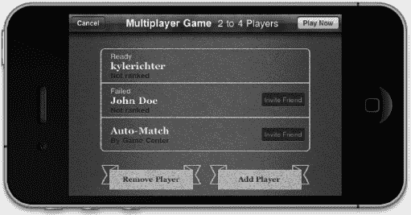

**图 5–4.** *一个支持可变玩家数的匹配界面。注意“移除玩家”和“添加玩家”按钮，以及修改过的导航栏。*

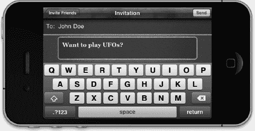

**图 5–5.** *向朋友发送邀请的界面，邀请他们与你开始一场比赛。这条消息将以推送通知的形式发送，并在受邀者的设备上以类似收到短信的风格显示，如图 5–6 所示。*

### 处理收到的邀请

在应用中实现匹配功能时，还需要实现一个处理来自朋友的邀请的系统。受邀者的设备会收到一条推送通知，告知他们有朋友邀请他们玩游戏。假设他们已经安装游戏并接受邀请，你需要处理如何通过一个新的比赛将两名玩家连接起来。如果受邀者未安装游戏或应用，系统会引导他们下载。下载完成后，将按照正常的邀请流程进行。

**注意：** 你还需要处理通过 Game Center.app 创建的新比赛发来的邀请。通常情况下，你可能不需要编写额外的代码；不过，建议对这条交互路径进行彻底的测试。

我们将使用邀请处理器（特别感谢苹果的命名）来处理邀请。邀请处理器接受两个参数；根据所处理邀请的类型，其中只有一个参数不会为 nil。

*   当应用收到来自 Game Center 好友的邀请时，`acceptInvite` 参数不为 nil。该比赛请求已由邀请你的玩家创建，因此你的应用在接受邀请时无需自行创建。
*   我们在本章前面讨论过的 `playersToInvite` 参数，当 Game Center.app 启动你的应用时不为 nil。该属性包含一个玩家标识符数组，用于配合新的 `GKMatchRequest` 邀请玩家。当 `playersToInvite` 属性不为 nil 时，你需要创建一个新的 `GKMatchRequest`，并用此处收到的玩家列表填充它。

**重要提示：** 在沙盒模式下处理邀请时，可能会遇到一些异常情况。如果你发现始终收不到邀请的推送通知，可以在两台设备上都打开应用，并在两台设备上互相邀请对方。完成一次此操作后，通常就能恢复从桌面启动测试邀请的功能。

现在我们了解了将要处理的参数类型以及会遇到的情景，可以开始编写新的邀请处理器了。`GKMatchmaker` 有一个名为 `sharedMatchmaker` 的单例方法，它接受一个用于 `inviteHandler` 的属性。我们在此处使用一个块来设置和处理收到的邀请。为保持简洁明了，我们将邀请处理器封装在 `GameCenterManager` 类的一个独立方法中。将以下新方法添加到 `GameCenterManager`。

```
- (void)setupInvitationHandler:(id)inivationHandler;
{
    [GKMatchmaker sharedMatchmaker].inviteHandler = ^(GKInvite *acceptedInvite, NSArray *playersToInvite)
    {
        GKMatchmakerViewController *mmvc = nil;
        if (acceptedInvite)
        {
            mmvc = [[GKMatchmakerViewController alloc] initWithInvite:acceptedInvite];
        }
        else if (playersToInvite)
        {
            GKMatchRequest *request = [[GKMatchRequest alloc] init];
            request.minPlayers = 2;
            request.maxPlayers = 2;
            request.playersToInvite = playersToInvite;
            mmvc = [[GKMatchmakerViewController alloc] initWithMatchRequest:request];
            [request release];
        }
        mmvc.matchmakerDelegate = inivationHandler;
        [inivationHandler presentModalViewController:mmvc animated:YES];
        [mmvc release];
     };
}
```

我们来分解这个方法，看看每一步具体发生了什么。我们首先做的是将一个块赋值给 `shareMatchmaker` 单例的 `inviteHandler` 属性。当用户接受邀请时，这个块会被执行，我们面临两种可能的结果。


第一种情况是`acceptedInvite`不为`nil`。此时，我们创建一个新的`GKMatchmakerViewController`实例，并使用已接受的邀请对其进行初始化。然后，我们将该视图控制器展示给用户。

第二种情况是`playersToInvite`不为`nil`，此时我们需要创建一个新的`GKMatchRequest`实例。在我们的示例游戏中，我们只允许两名玩家，但您需要根据游戏支持的最大玩家数来设置此值。我们将请求的`playersToInvite`属性设置为从 block 传入的玩家 ID 数组。创建新的请求对象后，我们可以创建一个`GKMatchmakerViewController`来向用户展示信息。用户将看到标准的匹配界面，其中已预填入邀请的玩家。

**重要提示：** 在通过 Game Center 对本地用户进行身份验证之前，您无法正式接受或以其他方式处理邀请。因此，必须在成功完成身份验证后尽快注册邀请处理程序。

由于我们希望这一调用在 Game Center 身份验证成功后尽快执行，我们在成功验证后向新方法添加了一次调用。请将`UFOViewController`的`processGameCenterAuthentication`方法修改为如下代码。

```
- (void)processGameCenterAuthentication:(NSError*)error;
{
    if (error != nil)
    {
        NSLog(@"An error occured during authentication: %@",
[error localizedDescription]);
    }
    else
    {
        [gcManager setupInvitationHandler:self];
    }
}
```

**提示：** 如果您没有两台设备来测试邀请，可以将模拟器用作其中一台设备。请不要忘记在模拟器和您的设备上使用两个不同的 Game Center 账户登录，否则无法互相邀请。

我们将使用`self`（即`UFOViewController`）作为邀请处理程序的委托。如果您已经在上一节“展示匹配 GUI”中完成了必需的委托调用，则无需再对此类进行任何额外的修改。

恭喜！您现在可以处理传入应用程序的邀请（参见图 5-6）。在下一节中，我们将探讨如何配置自动匹配以为您填充受邀者。

**注意：** 邀请的“立即购买”功能无法在沙箱环境中测试；该功能仅适用于线上应用。在沙箱环境中测试邀请时，必须先在每台使用的设备上安装该应用程序。

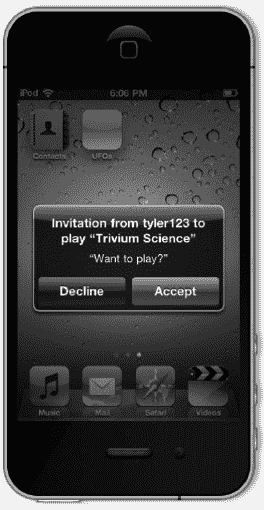

**图 5–6.** *在应用程序外部接收邀请。您的应用程序名称会自动填充到提示视图中。邀请时，您可以选择指定一条消息，如前文图 5–5 所示。*

### 自动匹配

自动匹配是 Game Center 提供的一项强大功能，无需额外工作即可使用。Game Center 维护了一个在线队列，其中包含等待加入您应用程序多人游戏的玩家。如果您没有用所有邀请的好友填满新的匹配请求，自动匹配功能将自动从其他在线未匹配的玩家中补足剩余名额。

您可以使用玩家组和玩家属性来过滤自动匹配的结果，这些内容将在本章后面讨论。此外，您还可以查询任何在线玩家组的活动状态，了解与新对手匹配的平均等待时间；这也将在后面的章节中讨论。

### 以编程方式匹配

您的应用程序也可以在不使用匹配界面接口的情况下，以编程方式查找匹配。您可以使用这种方法实现自己的自定义匹配 GUI，或创建一种“即时匹配”类型的操作，即用户自动配对并开始游戏，无需额外的用户交互。在我们的演示应用程序中，不会使用这种匹配风格，但以下方法允许您以编程方式实现匹配。

```
- (void)findProgrammaticMatch
{
    GKMatchRequest *request = [[GKMatchRequest alloc] init];
    request.minPlayers = 2;
    request.maxPlayers = 4;

    [[GKMatchmaker sharedMatchmaker] findMatchForRequest:request
 withCompletionHandler:^(GKMatch *match, NSError *error)
    {
        if (error)
        {
            NSLog(@"An error occurrred during finding a match: %@",
 [error localizedDescription]);
        }
        else if (match != nil)
        {
            NSLog(@"A match has been found: %@", match);
        }
    }];
    [request release];
}
```

以上代码相当直观。我们创建一个新的`GKMatchRequest`，并将最小玩家数设置为 2，最大玩家数设置为 4。然后，我们调用一个新方法`findMatchesForRequest`。当找到匹配时，该方法会调用我们的 block，因此如果没有快速返回匹配结果，提供一个活动指示器会是个好主意。获得`GKMatch`后，您可以开始新的多人游戏，如后续章节所述。

在使用程序化添加的匹配时，重要的是让用户能够在匹配耗时过长或改变主意时取消匹配请求。以下代码可以实现此操作。

```
[[GKMatchmaker sharedMatchmaker] cancel];
```

### 向匹配中添加玩家

在某些情况下，您可能需要在匹配创建后添加新玩家。例如，可能有一位玩家从游戏中掉线，您想在不重新开始游戏的情况下替换他；或者游戏开始后某位玩家未能连接，您想换一个替代者。以下方法将使用自动匹配行为自动向匹配中添加新玩家。

```
- (void)addPlayerToMatch:(GKMatch *)match withRequest:(GKMatchRequest *)request
{
    [[GKMatchmaker sharedMatchmaker] addPlayersToMatch:match matchRequest:request
 completionHandler:^(NSError *error)
    {
        if (error)
        {
            NSLog(@"An error occurrred during adding a player to match:
 %@", [error localizedDescription]);
        }
        else if (match != nil)
        {
            NSLog(@"A player has been added to the match");
        }
    }];
}
```

玩家被添加到匹配后，您需要将该玩家与当前匹配同步。添加玩家后，该玩家将能够接收和发送数据，但无法访问已通过匹配发送的任何数据。

### iOS 5 重新邀请

随着 iOS 5.0 的发布，Apple 增加了自动尝试重新邀请断开连接玩家的功能。此方法仅支持两人 Game Center 匹配。当玩家断开连接时，会调用以下方法；Game Center 将自动尝试重新连接该玩家。如果成功，您将额外收到一次对`match:player:didChangeState:`的调用。此功能仅在 iOS 5 或更高版本中可用。

```
-(BOOL)match:(GKMatch *)match shouldReinvitePlayer:(NSString *)playerID
{
    return YES;
}
```


### 玩家分组

玩家分组允许您为每位玩家指定不同的分类。默认情况下，Game Center 会自动将所有玩家匹配到同一组。通过玩家分组，您可以指定某些玩家只寻找包含同组成员的游戏组。

例如，想要挑战某个地下城特定层级或特定赛道的玩家将被分到同一组，以便与其他想玩相同内容的玩家配对。玩家分组可用于将玩家划分为多种不同的类型，例如：

-   想玩同一张地图（如赛道）、RPG 中的同一区域、第一人称射击游戏中的同一张地图或动作游戏中的同一关卡的玩家。
-   根据技术水平区分玩家。可以让玩家自行选择想玩的技能等级，或根据过往表现自动判定其技能等级。
-   正在进行的游戏类型。例如，玩家可分为想玩夺旗模式、团队死斗模式、占点模式或最后一人存活模式的组别。
-   属于同一公会、战队、团队或网络且希望一起游玩的玩家。
-   已购买额外应用内内容且无法再与未购买者配对的玩家。

玩家分组并不局限于这些项目，可以根据应用需求以任何方式进行分组。在代码中，玩家分组由 `GKMatchRequest` 对象的 `playerGroup` 属性表示。对该属性的唯一限制是其值必须为 `NSUInteger` 类型。指定 `playerGroup` 相当直观，如下方代码片段所示。

```
#define kMyForestMap 123456789
GKMatchRequest *request = [[GKMatchRequest alloc] init];
request.minPlayers = 2;
request.maxPlayers = 4;
request.playerGroup = kMyForestMap;
```

在大多数情况下，您会让用户自行选择他们所属的 `playerGroup`；但有时并非如此，例如自动判定玩家的技能等级时。

**注意：** 一旦将 `playerGroup` 设置为任何非零值，玩家将只能与该组内的其他玩家进行匹配。

### 玩家属性

与玩家分组类似，玩家属性在匹配过程中用于缩小可供用户参与的游戏范围。其功能与玩家分组基本相同，但在某些方面处理方式不同。玩家属性的诸多用途包括以下几种：

-   在角色扮演游戏中，角色通常会选择一个职业。通常需要多个职业（如治疗者、战士和法师）组队才能完成任务。
-   体育游戏中常有各种场上位置，例如守门员、后卫、中场和前锋。一支队伍需要所有这些位置的混合才能进行比赛。
-   在潜艇模拟游戏中，您也可以设置不同玩家角色，如舰长、声纳操作员、驾驶员和武器系统操作员。
-   在第一人称射击游戏中，可能需要玩家担任近战专家、狙击手、医疗兵和班长等角色。

#### 了解玩家属性的限制

玩家属性可用于为每位玩家分配这些值，以便您平衡包含所需角色的队伍。然而，截至 iOS 4.3，使用玩家属性时存在一些限制；在开始使用玩家属性之前，务必熟悉这些限制。

-   每个角色只能由一名玩家担任。例如，在一场足球游戏中，你不能要求有三名中场球员。
-   所有角色都必须有人担任，游戏才会被视为准备就绪。例如，根据上述例子，你不能在一场第一人称射击游戏中没有狙击手。
-   每位玩家一次只能担任一个角色；玩家不能以可填补多个角色的身份加入游戏。例如，你不能允许一名第一人称射击游戏的玩家既愿意当狙击手又愿意当医疗兵；他们需要在最终确定匹配请求前选择一个。
-   玩家属性在自动匹配时使用。如果你邀请一位好友进入游戏，系统不会检查他们是否匹配需要填补的角色。相反，他们会被自动分配一个随机的、尚未被分配的角色。简而言之，好友无法选择自己的玩家属性。
-   在标准的匹配图形用户界面中，角色信息不会显示在任何位置。您需要在进入此视图之前实现自己的系统，以便用户选择角色。
-   `GKMatch` 对象不包含哪些玩家被分配了哪些角色的信息。您需要实现自己的系统，在匹配建立后确定谁扮演什么角色。
-   没有任何机制来判断哪些角色过剩或哪些角色更难匹配。例如，在角色扮演游戏中，可能每个人都想玩法师，而没人愿意当治疗者；因此，法师会很难找到有空位的游戏，而治疗者则很容易找到。


### 使用玩家属性

别让这一长串限制条件吓退你使用玩家属性。即使存在这些限制，它们在创造更优质多人游戏体验方面依然极具价值。我们来看一个如何使用玩家属性构建比赛的示例。

```
#define class_SquadLeader               0xFF000000
#define class_Breacher                  0x00FF0000
#define class_Grenadier                 0x0000FF00
#define class_LightMachineGun           0x000000FF
```

首先为每个玩家属性定义一个掩码，在本节后续内容中，我们将这些掩码称为“职业”。此示例代表现代军事风格游戏中的一个标准小队。每个职业被分配了不同的掩码值。Game Center 使用一种算法，依据以下规则来匹配这些玩家。

- 比赛的掩码始终以邀请玩家的掩码开始。
- 如果邀请玩家已设置玩家属性掩码，则 Game Center 会忽略所有未设置玩家属性掩码的玩家。
- 只有当玩家的玩家属性掩码与比赛中任何已邀请玩家的掩码在任何部分都没有重叠时，该玩家才会被添加到比赛中。
- 将玩家添加到比赛后，该玩家的属性值会通过逻辑或运算合并到比赛的掩码中。
- 如果比赛的掩码值等于 `FFFFFFFFh`，则比赛被视为已满员并可开始；如果掩码不等于 `FFFFFFFFh`，则 Game Center 将继续搜索能填补比赛空缺的玩家。
- 无法向 Game Center 查询当前正在等待哪一位玩家。

以下示例基于我们刚刚定义的职业。

一个空的比赛将拥有如图 5–7 所示的玩家属性掩码。


**图 5–7.** *一个空的玩家属性掩码 (`0x00000000`)*

玩家 1 开始一场新比赛，并选择“班长”作为其职业。当该玩家创建比赛后，比赛现在将拥有如图 5–8 所示的玩家属性掩码。


**图 5–8.** *代表“班长”职业的玩家属性掩码 (`0xFF000000`)*

现在，比赛创建者使用 Game Center 自动匹配新玩家。Game Center 找到的第一个玩家选择了“榴弹手”职业。“榴弹手”将拥有一个如图 5–9 所示的掩码。


**图 5–9.** *代表“榴弹手”职业的玩家属性掩码 (`0x0000FF00`)*

与现有的比赛掩码（如图 5–10 所示）进行比较后，我们可以看到没有重叠部分，因此该玩家可以被邀请加入游戏。

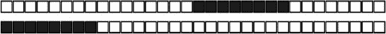

**图 5–10.** *`0xFF000000` 与 `0x0000FF00` 的比较*

将这些掩码合并形成新的比赛掩码后，它将如图 5–11 所示。


**图 5–11.** *一个新的比赛掩码，代表两名玩家 (`0xFF00FF00`)*

玩家 3 选择“突击兵”作为其职业，并搜索游戏。Game Center 找到了我们一直在处理的比赛，并通过比较比赛掩码与“突击兵”掩码（如图 5–12 所示），确定有空位容纳一名“突击兵”。

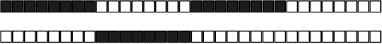

**图 5–12.** *上方是当前比赛的掩码 (`0xFF00FF00`)，下方是“突击兵”的掩码 (`0x00FF0000`)*

由于掩码之间没有重叠，“突击兵”可以被邀请加入游戏。玩家 4 选择“榴弹手”职业，并让 Game Center 寻找比赛。Game Center 再次找到了我们正在进行中的比赛，并尝试将新玩家加入其中。

由于玩家 4 提供的掩码与比赛掩码的一部分重叠（见图 5–13），该玩家不被允许加入。如果 Game Center 无法为该玩家找到开放的比赛，它就会开始寻找新玩家来填补该玩家比赛中的空缺。

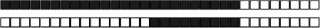

**图 5–13.** *上方是当前比赛的掩码 (`0xFFFFFF00`)，下方是“榴弹手”的掩码 (`0x0000FF00`)*

玩家 5 选择“轻机枪手”作为其掩码，并开始寻找可加入的游戏。Game Center 将其掩码与当前比赛的掩码进行比较，如图 5–14 所示。

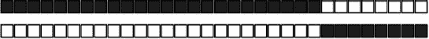

**图 5–14.** *上方是当前比赛的掩码 (`0xFFFFFF00`)，下方是“轻机枪手”的掩码 (`0x000000FF`)*

由于两个掩码集之间没有重叠，玩家 5 可以加入比赛。这将为比赛生成一个完整的玩家属性掩码，如图 5–15 所示。


**图 5–15.** *一个已满员的比赛掩码 (`0xFFFFFFFF`)*

如果玩家 5 从未加入游戏，而原始邀请者想用 Game Center 上的一个好友来填补这个空位，那么被邀请的好友将无法选择其职业。在这种情况下，比赛的掩码将如图 5–16 所示。然后，被邀请的好友会被分配一个如图 5–17 所示的掩码，以完成比赛的掩码。这样将补全玩家属性掩码，并允许游戏开始。


**图 5–16.** *当前比赛的掩码 (`0xFFFFFF00`)*


**图 5–17.** *完成比赛掩码所需的“机枪手”掩码 (`0x000000FF`)*

设置玩家属性非常简单，如以下代码片段所示。

```
#define class_SquadLeader               0xFF000000
#define class_Breacher                  0x00FF0000
#define class_Grenadier                 0x0000FF00
#define class_LightMachineGun           0x000000FF

...

GKMatchRequest *request = [[GKMatchRequest alloc] init];
request.minPlayers = 4;
request.maxPlayers = 4;
request.playerAttributes = class_SquadLeader;
```


### 玩家活跃度

Game Center 提供了一种查询近期玩家活跃度的方法。你的用户通常希望尽可能多地了解他们在寻找多人游戏匹配时可能需要等待多长时间。需要明确的是，玩家活跃度指的是近期活动，而非当前活动。苹果并未提供用于精确统计有多少玩家正在等待匹配的方法，但苹果确实提供了一种途径来确定近期有多少用户曾寻找过匹配。我们来看看获取玩家活跃度所需的源代码。将以下两个新方法添加到你的 `GameCenterManager` 类的实现文件中。

```
- (void)findAllActivity
{
        [[GKMatchmaker sharedMatchmaker] queryActivityWithCompletionHandler:
^(NSInteger activity, NSError *error) {
                self callDelegateOnMainThread:@selector(playerActivity:error:)![image
withArg:[NSNumber numberWithInt: activity] error:error];
       }];
}
- (void)findActivityForPlayerGroup:(NSUInteger)playerGroup
{
        [[GKMatchmaker sharedMatchmaker] queryPlayerGroupActivity:playerGroup
withCompletionHandler:^(NSInteger activity, NSError *error) {
               NSDictionary *activityDictionary = [[NSDictionary alloc]
initWithObjects:                               NSArray arrayWithObjects:![image
[NSNumber numberWithInt: activity],
                       [NSNumber numberWithInt: playerGroup], nil]
                       forKeys:[NSArray arrayWithObjects:@"activity", @"group", nil]];
                self callDelegateOnMainThread: @selector(playerActivityForGroup:![image
error:) withArg: activityDictionary error:error];
                [activityDictionary release];
        }];
}
```

我们还需要在 `GameCenterManager` 的头文件中添加两个新的协议方法。添加以下两个可选协议。

```
- (void)playerActivity:(NSNumber *)activity error:(NSError *)error;
- (void)playerActivityForGroup:(NSDictionary *)activityDict error:(NSError *)error;
```

当你在 `UFOViewController` 中实现这些新的协议方法时，代码如下：

```
- (void)playerActivity:(NSNumber *)activity error:(NSError *)error
{
        if (error != nil)
        {
               NSLog(@"查询玩家活跃度时发生错误: %@",
[error localizedDescription]);
        }
        else
        {
                NSLog(@"所有近期玩家活跃度: %@", activity);
        }
}
- (void)playerActivityForGroup:(NSDictionary *)activityDict error:(NSError *)error
{
        if (error != nil)
        {
                NSLog(@"查询玩家活跃度时发生错误: %@",
[error localizedDescription]);
        }
        else
        {
                NSLog(@"所有近期玩家活跃度: %@ 针对组: %@", activityDict![image
objectForKey:@"activity"], [activityDict objectForKey:@"group"]);
       }
}
```

你应该会得到类似如下的输出。

```
2011-03-08 11:11:04.007 UFOs[3000:207] 所有近期玩家活跃度: 3 针对组: 12345
2011-03-08 11:11:04.008 UFOs[3000:207] 所有近期玩家活跃度: 3
```

那么，现在我们有了针对特定玩家组的活跃度数值，这些数字到底意味着什么？苹果从未明确说明这些数字的确切含义，但经过仔细研究，它们似乎代表了在过去一到三分钟内尝试使用自动匹配功能连接游戏的用户数量。这些数字似乎会在该时间段内的某个不确定间隔重置。此外，从用户尝试加入匹配到新数字反映出来，似乎存在 15 到 30 秒的延迟。

尽管玩家活跃度存在这些局限性，但它仍然是一个非常有用的工具，可用于判断用户找到匹配的可能等待时间。不过，你需要确保这些数字仅用于信息参考，因为它们往往不够可靠，不足以完全依赖。

**注意：** 如果苹果系统提供的玩家活跃度信息无法满足你应用的具体需求，你可以自行实现服务器系统来精确统计等待匹配的玩家数量。


### 使用自有服务器（托管比赛）

通常情况下，Game Center 会自动为你托管比赛；然而，苹果也提供了实现自有服务器来托管比赛的技术方案。这种方法被称为“托管比赛”，可在任何应用中实现，从而为基于 Game Center 的多玩家网络功能增加灵活性。

当使用 Game Center 托管比赛时，每个连接到该比赛的设备都会创建一个 `GKMatch` 实例。`GKMatch` 类负责处理连接、握手、数据收发以及错误处理等所有繁琐工作。但有些时候你需要实现自己的服务器，最典型的情况是当你想允许超过四人同时连接至同一场比赛时。在这种情况下，你可以使用 Game Center 为比赛寻找玩家，然后用自己的服务器来连接这些玩家。

**提示：** 使用托管比赛最多可连接 16 名用户，而使用 Game Center 托管时上限仅为四人。

然而，使用自有服务器也存在若干缺点，最突出的一点是：之前由 Game Center 免费提供的所有繁琐工作现在都需要由你负责。具体包括以下内容：

- 你必须自行设计并实现所有连接玩家间的网络通信代码。Game Center 会替你寻找比赛，但其职责到此为止。
- 如果你的应用使用标准匹配界面，当新玩家成功连接时，你的服务器必须通知应用，以便更新图形用户界面。
- 语音聊天不再免费提供。不过，你仍可使用 `GKVoiceChatService` 类通过自己的网络系统发送语音数据。详细信息请参阅第 9 章。

我们需要对代码库进行几处小幅修改，以便在设备端支持托管比赛。我们从修改本章前面设置的多玩家按钮操作方法开始。

```
- (IBAction)multiplayerButtonPressed
{
        GKMatchRequest *request = [[GKMatchRequest alloc] init];
        request.minPlayers = 2;
        request.maxPlayers = 4;
        GKMatchmakerViewController *mmvc = [[GKMatchmakerViewController alloc] initWithMatchRequest:request];
        [request release];

        mmvc.matchmakerDelegate = self;
        mmvc.hosted = YES;

        [self presentModalViewController:mmvc animated:YES];
        [mmvc release];
}
```

如你所见，我们新增了一行代码——`matchmakerViewController.hosted = YES`——这告诉匹配界面本场比赛将在我们自己的服务器上托管。除了将 `matchMakerViewController` 设为托管模式外，你还需要让每个设备连接到你的服务器。本节不涉及服务器本身的编码，因为实现方式涉及几十种语言和方案。然而，当设备连接到你的服务器后，它需要传入即将加入的玩家的 `playerID` 来调用以下方法：

```
[matchmakerViewController setHostedPlayerReady: playerID];
```

这将在所有已连接玩家的屏幕上更新界面，告知他们新玩家已准备就绪可以开始比赛。当所有玩家都连接至你的服务器并确认准备就绪后，系统会调用你的委托方法来开始游戏。在使用 Game Center 比赛时，我们使用委托回调 `matchmakerViewController:didFindMatch:` 来开始比赛。但对于托管游戏，我们则使用以下方法：

```
- (void)matchmakerViewController:(GKMatchmakerViewController *)viewController
 didFindPlayers:(NSArray *)playerIDs
{
        [self dismissModalViewControllerAnimated:YES];

        NSLog(@"Players: %@", playerIDs);

        // 开始托管游戏
}
```

至此，你可以让服务器处理已连接玩家之间的通信，从而开始游戏。此外，你也可以像本章前面介绍 Game Center 托管比赛那样，以编程方式开始托管比赛：

```
- (void)findProgrammaticHostedMatch
{
        GKMatchRequest *request = [[GKMatchRequest alloc] init];
        request.minPlayers = 2;
        request.maxPlayers = 16;

        [[GKMatchmaker sharedMatchmaker] findPlayersForHostedMatchRequest:request
 withCompletionHandler:^(NSArray *playerIDs, NSError *error)
        {
                if (error)
                {
                        NSLog(@"寻找比赛时发生错误: %@",
 [error localizedDescription]);
                }
                else if (playerIDs != nil)
                {
                        NSLog(@"已为比赛找到玩家: %@", playerIDs);
        }
        }];
        [request release];
}
```

正如你所见，这与之前的方法非常相似；不过，我们返回的不是 `GKMatch` 对象，而是一个包含 `playerIDs` 的数组。你还会注意到，我们也将最大玩家数量增加到了 16。

### 本章小结

本章为你介绍了匹配和邀请的概念。我们讨论了为 iOS 应用或游戏添加多玩家功能的巨大优势，以及在此过程中可能需要跨越的一些障碍。我们从展示标准苹果界面到使用玩家分组和玩家属性进行高度定制化匹配，详细探索了匹配流程。我们回顾了如何在各种可能场景下处理邀请，以及如何查询玩家活动。最后，我们发现了如何实现自有服务器来消除 Game Center 的某些限制。我们扩展了可复用的 Game Center 管理器，使其能够处理匹配、邀请及相关开销，从而让你能快速为应用添加多玩家功能。

本章深入探讨了如何创建比赛并填充玩家。在后续章节中，我们不仅将学习如何实现玩家间的通信，还将探索定位可通信玩家的新方法。下一章将介绍如何使用 Game Kit 通过“玩家选择器”寻找玩家。

## 第 6 章

## 玩家选择器

上一章我们探讨了如何使用 Game Center 寻找比赛。在本章中，我们将了解另一种用于寻找可连接玩家的系统。该系统被称为“玩家选择器”，可用于通过蓝牙或本地 Wi-Fi 网络在两个 iOS 设备之间建立连接。

在我们开始实际编写代码之前，先快速回顾一下 Game Kit 和 Game Center 的历史。当苹果发布 iOS 3.0（当时称为 iPhone OS 3.0）时，实现了一套新的 API 调用，统称为 Game Kit。在 3.0 时代，Game Kit 负责处理蓝牙、局域网网络和语音聊天服务。当 Game Center 在 iOS 4.0/4.1 中被添加时，它为 Game Kit 带来了显著改进。Game Center 实际上可以被视为 Game Kit 的扩展，而非一套全新的 API。

在本章中，我们将探讨如何通过蓝牙和局域网建立新连接。在第 8 章“数据交换”中，我们将学习如何使用通用方法发送数据，无论玩家是通过 Game Center 还是 Game Kit 找到的。


### 对等选择器的优势

自 iOS 4.0 推出以来，Game Kit 网络功能大体上已被开发者社区所忽视。这是一种极大的不公，因为 Game Kit 对于 iOS 开发者而言仍然是一个极其有用的工具。Game Kit 仍然是为 iOS 应用添加点对点网络功能的最简单方式。

在我开发的大多数多人类型应用中，我都同时实现了 iOS 的两种网络系统。Game Center 网络和 Game Kit 网络各有不同的优缺点，通常来说，为用户同时提供这两种功能，比因某一系统的局限而被迫陷入困境要更容易。以下是支持同时包含两者的几点理由。

-   你的用户可能无法访问外部网络连接，但仍然希望参与多人活动。这种情况可能发生在汽车内的乘客或允许在飞行期间开启蓝牙设备的航班上。
-   你可能希望允许用户轻松连接到附近（基于位置）的其他用户。虽然这可以通过 Game Center 的玩家分组来实现，但使用 Game Kit 要容易得多。
-   你在寻找两个设备之间延迟更低的连接方式。
-   你希望针对那些拥有 iPod touch 或 Wi-Fi iPad、但可能无法稳定连接 Wi-Fi 或无法访问蜂窝网络的用户。
-   实现 Game Kit 网络功能比用 Game Center 构建完整的多人系统更快、更简单。

正如你所见，对等选择器查找对等点的方法与 Game Center 匹配系统存在一些重要区别。这并不妨碍你同时实现这两种方式，而且至少我个人（即便不是苹果官方）也强烈鼓励这样做。

在接下来的章节中，你将学到一些方法，让你可以轻松地将两种系统并存。然而，如果你选择只实现其中一种，请仔细权衡哪种方案更能满足用户的需求。

### 真实世界案例

自 iOS 3.0 发布以来，我们见证了 Game Kit 网络功能以非常出人意料的方式被使用。在此，我们讨论一些使用 Game Kit 网络功能来增强用户体验的著名应用示例。本节中展示的这两款应用都更适合 Game Kit 网络而非 Game Center 网络。

首先，我们来看一下 Black Pixel 公司开发的 Bristomath（见图 6–1）。这款应用的核心目的是在餐厅的多位用餐者之间分摊账单。这个创意在 iPhone 上已经用烂了，App Store 上有数十款应用都提供这项服务。然而 Bristomath 依然备受欢迎，即便其定价高于大多数竞争对手。这是为什么呢？

Bristomath 使其自身与众不同。它不仅设计精良、视觉吸引力强，还提供了一项其他账单分摊应用都没有的功能：Game Kit 网络。Bristomath 使用 Game Kit 在多个设备之间建立 Wi-Fi 或蓝牙连接，允许用户登录到“主机”应用并输入他们的餐点项目。

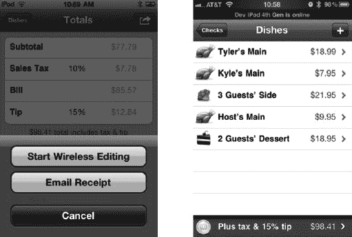

**图 6–1.** *Black Pixel 的 Bristomath，它使用 Game Kit 网络来分摊账单*

这个简单的功能让 Bristomath 在这一小众领域中走在了前列。加入 Game Kit 网络功能免去了用户需要将 iPhone 在餐桌上传递、让每个人输入所点餐点的麻烦。像这样给你的应用添加的小功能，可以对用户对你应用的感知价值产生重大影响。

Handshake（见图 6–2）是 Skorpiostech 公司在 App Store 早期开发的一款应用。它是第一款允许用户向其他用户发送电子名片的应用。为其网络连接提供支持的后端服务器投入了六个多月的开发时间。该服务器需要支持大量客户端登录，并为物理位置相距一定距离的其他客户端提供匹配。


**图 6–2.** *Skorpiostech 的 Handshake，它使用自己的服务器系统在两个本地设备之间共享数据*

每台设备会确定其位置，并告知服务器它的所在位置以及正在寻找对等点。服务器随后会返回附近的设备，并允许应用在它们之间建立连接。如果在编写 Handshake 时 Game Kit 网络功能已经可用，这个过程本可以在几天内完成，而不是几个月。Handshake 从未被重写以支持 Game Kit；然而，当苹果在 iOS 3.0 中随 Game Kit 一起推出联系人共享功能时，它就被认为已走到生命终点。

**提醒：** Game Kit 和 Game Center 并不仅限于游戏。虽然苹果近期严厉打击了在非游戏应用中使用排行榜和成就功能，但始终可以主张它们为你的应用增添了游戏功能。而 Game Kit 网络功能在任何应用中仍不受限制。


### 使用会话

在使用 Game Kit 网络功能时，您需要通过一个 `GKSession` 对象（参见图 6–3）将所有组件整合在一起。该对象用于创建和管理设备间的临时蓝牙或本地无线网络连接。运行在多个设备上的应用副本，可以使用这些服务来相互发现、连接、握手、交换数据，并优雅地断开连接。

**重要提示：** 原始 iPhone 或原始 iPod touch 不支持蓝牙网络功能。


**图 6–3.** *通过蓝牙并利用 `GKSession` 实现的点对点网络*

`GKSession` 对象主要与对等端（peer）协作。在此上下文中，对等端是指通过创建并配置自己的 `GKSession` 对象来变得可见的任何 iOS 设备。对等端只能看到运行具有相同 bundle 标识符的应用上的其他对等端。

每个对等端都由一个 `peerID` 字符串表示，该字符串始终是唯一的。您的应用可以使用对等端的 `peerID` 来获取该对等端的人类可读句柄或名称。同样，当您的应用启动一个 `GKSession` 时，它会创建一个对等端来代表本地用户，并且该对等端会对所有附近设备可见。此处的附近设备，是指同一本地 Wi-Fi 网络上的任何设备或蓝牙范围内的任何设备，详情请参见表 6–1 和 表 6–2。

**注意：** 自 iOS 5 起，使用蓝牙的唯一苹果官方批准方式是通过 Game Kit。苹果不支持在 App Store 应用中自行实现蓝牙功能。


**注意：** 苹果最近已支持设备与 iOS 模拟器之间的蓝牙连接。但这也存在一些限制：最显著的是，设备无法通过蓝牙找到模拟器，因此连接必须由模拟器发起。

此外，iOS 模拟器不会检测 Mac 是否已启用蓝牙。最后，当设备收到连接请求时，该请求看起来像是来自 bundle ID 字符串，而非设备名称，如本章稍后的图 6–10 所示。对等端通过使用唯一字符串来标识其正在实现的服务，从而被其他对等端发现。这个唯一字符串就是 `sessionID` 属性。会话可以通过以下三种方式之一进行配置：将会话配置为广播其 `sessionID`，使其成为服务器；或搜索其他使用 `sessionID` 做广告的对等端，使其成为客户端；最后，同时作为服务器和客户端，这被称为对等端（peer）。在下一章中，我们将更深入地探讨 iOS 上的网络设计。

`GKSession` 有一个关联的 `GKSessionDelegate` 协议。每当发现新的远程对等端、该对等端尝试连接或对等端的连接状态发生更改时，都会调用该委托。此外，您还需要设置一个数据接收处理程序，以便在接收到新数据时指定一个委托回调。这个回调可以不同于主 `GKSessionDelegate`。我们将在第 8 章中详细探讨数据交换。

**注意：** `GKSession` 及其相关方法是线程安全的；但是，会话将始终在主线程上调用其委托方法。

### 展示对等端选择器

与之前一样，我们首先在我们的 `UFOViewController.xib` 中为对等端选择器（Peer Picker）添加一个新按钮，如图 6–4 所示。为该按钮创建一个新操作，并命名为 `localMultiplayerGameButtonPressed`。此外，您需要创建两个新的类变量，一个 `GKPeerPickerController` 实例和一个 `GKSession` 实例。分别将它们命名为 `peerPickerController` 和 `currentSession`。您还需要让 `UFOViewController` 遵守 `GKPeerPickerControllerDelegate` 委托协议。


**图 6–4.** *为本地多人游戏添加按钮*

将以下代码添加到您为新的本地按钮创建的操作中。

```
- (IBAction)localMultiplayerGameButtonPressed
{
  peerPickerController = [[GKPeerPickerController alloc] init];
  [peerPickerController setDelegate:self];

  [peerPickerController setConnectionTypesMask:GKPeerPickerConnectionTypeNearby];
  [peerPickerController show];
}
```

这段代码相当一目了然：我们 `alloc` 并 `init` 了一个新的 `GKPeerPickerController` 实例，并将其委托设置为 `self`。

我们需要指定一个连接类型掩码。我们有两个可用的选项：`GKPeerPickerConnectionTypeNearby` 和 `GKPeerPickerConnectionTypeOnline`。在这个示例中，我们使用了 `GKPeerPickerConnectionTypeNearby`，这将允许蓝牙连接。`GKPeerPickerConnectionTypeOnline` 常量将允许通过本地无线网络进行在线连接。

您也可以同时提供这两种选项，让用户进行选择。在用户选择某个选项后，您可以像只向用户提供了一个选择那样继续处理。如果您现在运行应用并选择“本地”，您应该会看到一个类似图 6–5 所示的新的 `UIAlert`。


**图 6–5.** *搜索蓝牙对等端时显示的提示。请注意，该提示是灰色的，而不是通常 `UIAlerts` 中常见的蓝色。*

继续在第二台设备上安装应用，或者如果您没有第二台设备，则在模拟器上安装。当应用在两台设备上都准备好后，启动它并选择本地游戏选项。起初，您会看到与图 6–5 类似的图像。几秒钟后，设备应该会相互发现，您应该会看到类似于图 6–6 所示的提示。

**注意：** 两台蓝牙设备互相发现可能需要长达 30 秒的时间。设备之间的距离越远，建立连接所需的时间可能就越长。


**图 6–6.** *使用对等端选择器查找对等端*

**提示：** 如果用户设备上的蓝牙已关闭，而您启动了一个 `GKSession`，系统将提示用户启用蓝牙，如图 6–7 所示。


**图 6–7.** *提示用户在设备上启用蓝牙。您无法通过应用内的任何其他方式启用蓝牙。*

如果您从可用对等端列表中选择一个对等端，您将看到一条等待消息，如图 6–8 所示。被邀请的设备将看到一条消息，如图 6–9 所示；或者，如果是由模拟器邀请的，则该设备将显示一条消息，如图 6–10 所示。

尽管我们只编写了相对较少的代码，但所有功能都已通过 API 提供给我们。如果您碰巧点击了“接受”按钮，您会发现没有任何反应。在“对等端选择器委托”一节中，我们将实现完成对等端选择器功能所需的委托调用。


**图 6–8.** *蓝牙正在等待建立连接*


**图 6–9.** *来自某个对等端设备发送给另一台设备的接入邀请*


**图 6–10.** *从模拟器发送给设备的接入邀请。注意 bundle ID 显示为设备名称。*

### 高级 `GKSession` 交互

有时，您可能想要更深入地探究 `GKSession` 对象，而不仅仅是像初始配置中那样浅尝辄止。表 6–3 列出了可用于自定义 `GKSession` 对象的属性。


### 对等选择器委托

在前几节中，我们看到使用 `GKPeerPickerController` 可以免费获得许多功能。然而，在接受来自其他用户的连接后，我们的应用程序还不知道该如何继续操作。

在本节中，我们将讨论 `GKPeerPickerControllerDelegate`。对等选择器会调用 `GKPeerPickerControllerDelegate` 来创建新的会话对象，并用于处理正常网络通信过程中发生的状态变化。

`GKPeerPickerControllerDelegate` 有三个你需要实现并响应的主要职责。它需要创建会话、响应新的连接消息，以及处理用户取消对等选择器的操作。

首先，让我们看看 `peerPickerController:didSelectConnectionType:`。这个委托方法会告知我们用户选择了哪种连接类型。如果你还记得前面的章节，我们曾使用过 `connectionTypeMask`。如果你为用户提供了选择通过局域网还是蓝牙连接的选项，这个委托方法将返回用户的选择。如果用户选择了在线连接，你应该关闭对等选择器控制器，并显示你自己的局域网连接视图；请参考以下代码片段以了解此行为的示例。

```
- (void)peerPickerController:(GKPeerPickerController*)picker
     didSelectConnectionType:(GKPeerPickerConnectionType)type
{
  if (type == GKPeerPickerConnectionTypeOnline)
{
    [picker dismiss];
    [picker release];
    // 在此处显示你自己的用户界面。
  }
}
```

`GKPeerPickerControllerDelegate` 还负责返回一个 `GKSession`。当你的对等选择器需要一个会话对象时，它会调用 `peerPickerController:sessionForConnectionType:`。如果你实现了这个方法，你必须创建一个现有的 `GKSession` 并将其返回。

**重要提示：** 如果你在 `peerPickerController:sessionForConnectionType:` 中创建了新的 `GKSession`，那么你创建的会话必须以 `GKSessionModePeer` 模式进行自我宣告。

如果你不需要实现 `peerPickerController:sessionForConnectionType:`，并且该会话使用的是蓝牙协议，则对等控制器会使用默认的 `sessionID` 和 `displayName` 参数分配一个新的会话。如果你正在创建新的局域网连接，则需要实现 `peerPickerController:sessionForConnectionType:` 并返回所需的 `GKSession`。

你还需要实现 `peerPickerControllerDidCancel:`。尽管这个方法是可选的，但 Game Kit 期望它被实现。在该方法返回后，对等选择器将自动被关闭，因此你无需添加代码来处理此事件。

在使用 `GKPeerPickerControllerDelegate` 时，我们需要实现的最后一个委托方法是 `peerPickerController:didConnectPeer:toSession:`。每当有新的对等方连接到会话时，就会调用此方法。

```
- (void)peerPickerController:(GKPeerPickerController*)picker
              didConnectPeer:(NSString*)peerID
                   toSession:(GKSession*)session
{
  currentSession = session;
  // 保留会话和 peerID
  [self dismissModalViewControllerAnimated:YES];
}
```

当此方法被调用时，我们需要保留对会话和 `peerID` 的引用。在接下来的章节中，当我们开始处理来回发送数据时，将会用到它们。一旦对等方成功连接，你的应用程序应接管会话的所有权并关闭对等选择器。

图 6-11 展示了一部已进入连接状态并将其可用性标志设置为 NO 的 iPhone。


**图 6-11.** *iPod touch 已将其可用性状态设置为 false*

**重要提示：** 尽管 `peerPickerController:didConnectPeer:toSession:` 是可选的，但在你能够完全启用 Game Kit 网络功能之前，必须实现它。

### 总结

在本章中，我们学习了如何使用 Game Kit 网络功能，通过局域网或蓝牙将两台设备连接在一起。在上一章中，我们学习了匹配和邀请功能。通过这两种技术，我们全面覆盖了在 iOS 平台上使用 Game Center 和 Game Kit 技术查找和连接对等方的所有可用方法。

我们还查看了一些真实世界的 iOS 应用示例，这些应用受益于 Game Kit 网络集成，并且你看到只需投入少量时间，就能轻松地将应用程序提升到更高的质量级别。

此外，我们探讨了对等选择器的工作原理，包括如何通过蓝牙或局域网请求新的会话，以及如何连接对等方。我们还涵盖了所有必需的委托和控制器配置，以便在你的应用程序中快速启动并运行这些系统。

在下一章中，我们将讨论如何为移动设备设计网络、网络设计的注意事项以及相关概述。在第 8 章中，我们将学习如何将所有我们已经建立连接的对等方整合在一起，并让它们开始相互通信。

## 第 7 章


