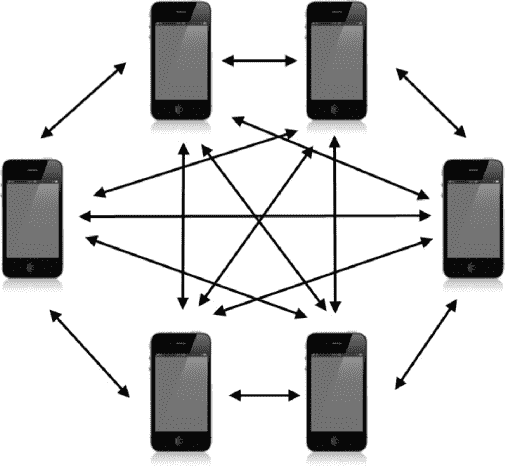
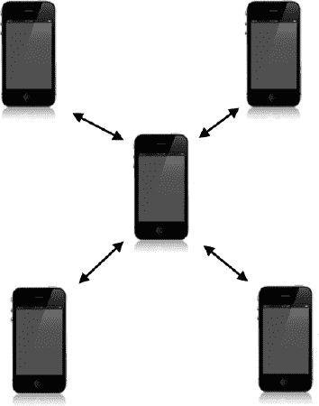
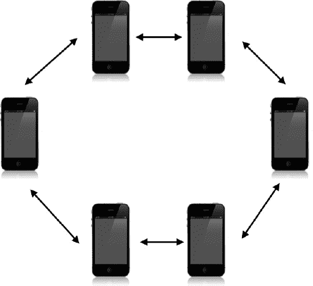
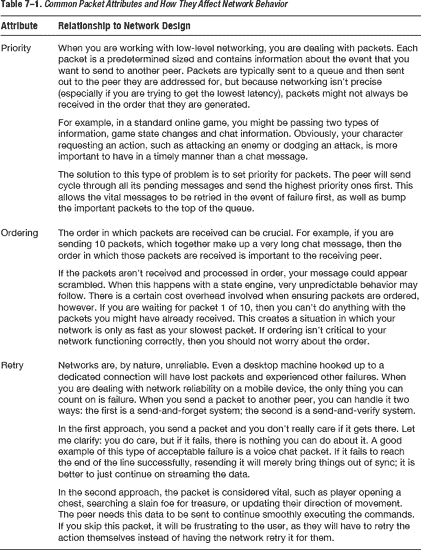
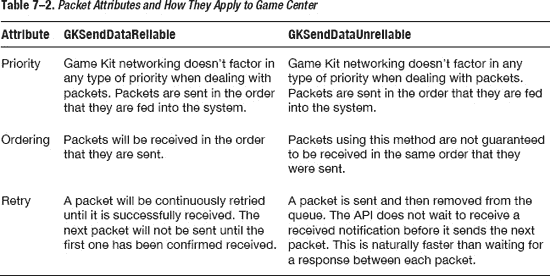
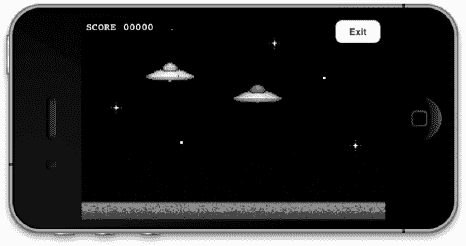
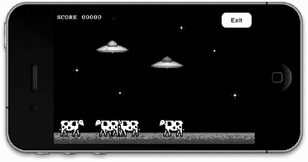
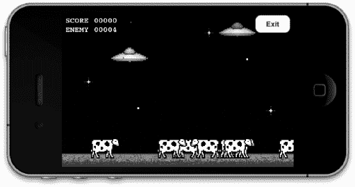
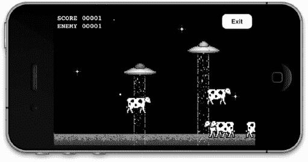

# 网络设计概述

在前面的章节中，我们学习了如何通过各种方法，利用 Game Center 和 Game Kit 查找并建立与对等设备的连接。本章中，我们将探讨如何不仅为 iOS 游戏，也为任何平台上的游戏设计网络体验。本章的设计与本书前面章节略有不同，主要体现在：本章没有相关源代码，我们仅会简要涉及 Game Kit 网络主题本身。本章将聚焦于网络设计的概念，而非实际实现网络本身。在下一章中，你将学习如何将所有内容整合起来，让对等设备开始相互通信。

虽然完全有可能（而且经常有人这样做）直接开始编写网络逻辑，但这可能并非一个好主意。毕竟，你不会在规划好应用或游戏的功能之前就贸然开始编写代码。网络是一个复杂的话题，你应该带着计划来处理它；否则，你很可能会在投入大量精力后发现自己需要重写整个系统。你不希望因为所采用的方法限制了未来扩展的可能性而陷入困境。就像软件开发一样，你不应该第一天就跳进去写代码。你应该先在白板上做些规划，感受一下项目的需求。

以一款名为 Clan Lord 的桌面角色扮演游戏为例，它于 20 世纪 90 年代末为 Mac 编写。Clan Lord 拥有一个非常忠实的粉丝群体，使该游戏至今仍保持活跃并持续更新。然而，在游戏最初编写时，许多与网络相关的问题并未经过深思熟虑。

Clan Lord 对其所有网络调用采用逐帧同步。这意味着每一帧中玩家屏幕上可见的每一个元素都必须被传输。这种方法在小规模游戏、小用户群和有限功能的情况下是可行的，而且效果不错。然而，在设计软件时，你不能对未来有局限的视野。要始终为最好的情况，或者取决于你的视角，为最坏的情况做规划。在设计网络时，你必须考虑到六个月、一年甚至十年后你希望游戏或应用实现的功能。

Clan Lord 如今深受长期固有的问题困扰，例如每秒八帧的渲染引擎，原因在于在普通家庭网络上每秒无法同步超过八个完整帧的数据。如果项目刚开始时在客户端中实现一些逻辑，本可以避免这个问题；例如，告知客户端物体的位置及其移动时间（而非每帧完全同步所有内容）将会高效得多。此外，玩家移动被限制在每秒八帧，因为动作必须同步回服务器，这使得对事件的反应变得困难。这个问题也可以通过使用本章后面讨论的预测算法来避免，预测算法可以确定玩家在移动过程中最终会到达的位置。

Clan Lord 是一个例子，说明游戏比计划中更受欢迎，且生命周期远超预期。遗憾的是，当这种情况发生时，你将受限于项目最初启动时的愿景和设计。事后撤销某些东西比最初就做好要困难得多。在设计网络时，要花时间仔细且有意地去做，因为它可能会伴随你很长一段时间。

### 三种网络类型

尽管有许多不同类型的网络设计，但在设计网络时可以实施三种主要的网络类型。选择一种主要的网络类型是一个好的起点，因为它将引导你进入设计流程的下一步。

我们将只关注三种主要的网络设计类型，但请记住，还有几十种其他广为人知的网络配置，其中一些我们会在本节中简要提及。本章将详细讨论的三种网络类型是：对等网络、客户端-主机网络和环形网络。

#### 对等网络

对等网络（参见图 7–1）是你在 iOS 平台上最常见到的网络。没有设备被区别对待，每个设备负责向所有它希望通信的其他对等设备发送和接收数据。



**图 7–1**. *六台 iOS 设备构成的对等网络示意图*

在处理 Game Center 网络时，常使用对等网络，因为它在 iOS 平台上最容易实现。虽然这种方法具有设置极其简单的优点，但它也有同样多的缺点。主要缺点是它会导致大量冗余开销。每个对等设备需要将其动作告知所有其他对等设备。在像图 7–1 所示的六方网络中，这意味着每次想要更新游戏状态时，每个设备需要发送五条消息。此外，如果你实现了一个需要每个对等设备确认消息成功的系统，你还将需要接收五条消息。

对等网络的另一个缺点是，当与大量对等设备协同工作时，它会变得非常混乱。正如你在图 7–1 中所见，情况很快就会变得一团糟。与本节讨论的其他主要网络类型不同，对等方法是唯一没有明确流向的。根据定义，每个对等设备可以向任何其他对等设备发送消息。这同时也意味着你必须跟踪每个对等设备需要知道什么。在大多数情况下，这是一种完全可以接受的方法。然而，当你开始处理更复杂的网络类型时，这种配置可能就不再理想了。

此外，没有哪个设备单独控制游戏的状态。如果涉及人工智能组件，那么你将需要设计一个系统，使它们能在所有设备之间保持同步。


#### 客户端-主机网络

客户端-主机网络会指定一台设备作为主机。该设备负责向所有连接的客户端发送信息。客户端之间从不相互通信；它们只与主机通信，然后主机将所需信息中继回其他客户端。客户端-主机网络设置的一个示例如图 7–2 所示。



**图 7–2**。*使用五台 iOS 设备的客户端-主机网络示意图*

客户端-服务器网络简化了数据流。每个对等方或客户端只需关心自身和主机；它们无需知晓网络中可能存在的其他设备。这类网络的优势在于，一台设备即可保持所有内容同步并处理信息流；这使得它成为一个非常安全的网络（就反作弊而言）。然而，在 iOS 平台上，作弊并不是一个大问题，因为它本身就是一个沙盒系统。

该系统还有其他优势，例如，只需一台设备负责维护网络状态，且该设备全权负责网络行为。这类网络简化了连接、断开连接、传输错误以及其他状态变化（例如人工智能等计算机控制对象）等事件的处理。然而，同样的设置在 iOS 平台上可能会带来麻烦；如果主机设备需要处理的信息过多，该设备可能会运行变慢或耗电更多。

#### 环形网络

环形网络（参见图 7–3）没有主机，也没有客户端。它的工作方式类似于对等网络，但每个对等方只负责与一个指定的对等方通信，并且只从另一个单独定义的对等方接收信息。信息以环形的形状在一组设备中流动，因此得名。

这类网络在 iOS 平台上并不常见，因为它通常为断开连接的对等方提供的冗余功能，其必要性并不大。Apple 已经做了大量基础工作来确保网络保持活跃和稳定，开发者无需花费额外的设计时间来确保不会出现对等方与当前已连接的其他对等方失去联系的情况。不过，在某些情况下，你可能发现这种配置在设计 iOS 平台网络时非常有用。



**图 7–3**。*使用六台 iOS 设备的环形网络示意图。请注意，此图比图 7–1 所示的对等网络要简单得多。*

### 较少见的网络

计算机科学中还有许多其他类型的网络设计。有些比其他更实用，有些则主要是理论上的。在本节中，我们将介绍一些较为知名的“非典型”网络。虽然其中一些可以在 iOS 设备上实现，但大多数可能不会给普通项目带来任何实际好处。

-   **无头客户端**——客户端完全没有数据，由主机设备控制。你可以将这种设置视为从服务器磁盘启动的计算机终端。
-   **专用服务器**——此示例中的主机不参与游戏或活动，专用于从对等方发送信息并收集新的输入。这通常见于大型公司构建游戏社区时的部署。
-   **网状/部分网状网络**——这是一种对等网络，其中每个对等方可能不知道网络中存在的其他对等方。数据包被标记有目的地，每一跳都试图让数据包更接近目的地。全网状网络意味着每个对等方都相互连接，这或多或少等同于对等网络。
-   **树形网络**——这种网络由相互连接的对等方组成一棵树，每个对等方由一个中心点控制。中心点将消息传递给其他中心点，每个树分支则沿着该分支来回传递消息。
-   **混合网络**——这种网络结合了两种或多种技术，例如通过一个中心化服务器连接在一起的两个对等组。

这涵盖了你在软件工程职业生涯中将会遇到的大部分网络。实际上，你可以设计的网络类型没有限制，而且每年都会有更好的设计和流程出现。在下一节中，我们将研究在你的网络上实际发送和接收的数据包。

### 可靠数据 vs. 不可靠数据

在处理网络设计时，数据包可靠性是一个重要话题。在 iOS 平台之外讨论数据包可靠性时，我们特指数据的优先级、数据包的排序以及重试判定因子。在我们深入了解为 iOS 实现时所需的具体细节之前，让我们先分别看看所有这些属性及其与网络设计的关系（参见表 7–1）。



现在我们已经涵盖了将实际数据包从一台设备发送到另一台设备时的重要问题，我们可以看看这些原则如何应用于 iOS 平台本身。

使用 Game Kit 发送数据有两种模式：第一种是 `GKSendDataReliable`；第二种自然是 `GKSendDataUnreliable`。让我们看看每种模式为我们做什么，以及它们如何与我们刚刚讨论的主题相契合。参见表 7–2。




### 只发送必要的数据

新手在设计网络时最容易犯的一个关键错误就是发送过多数据。把所有内容一股脑全发出去确实很简单。本章开头我们就讨论过一个存在此问题的游戏。

> “如果我有更多时间，我会写一封更短的信。”
> 
> —— 布莱兹·帕斯卡

这句常被误引的名言，其实帕斯卡完全可能是在谈论网络数据包。数据包的大小直接关系到你网络的速度、稳定性和可扩展性。花时间弄清楚什么是绝对最低限度的可发送数据，这一点至关重要。

来看一个你们中的一些人在设计游戏时可能会遇到的假设性例子。假设你正在开发一款角色扮演游戏。你操控英雄，引导他或她穿越一系列地下城。在这些地下城中，你可以与物品互动，遭遇各种敌人，并进行实时战斗。

我们知道会有一些静态数据；例如，当你身处地下城内时，其布局很可能不会改变。因此，我们不应该每帧甚至定期向客户端发送地图瓦片，而应该在玩家首次进入该区域时发送这些数据。可能有些元素会移动，但我们可以无限期地预测它们的行为，比如流动的河流或闪烁的火炬。这些物品也可以一次性加载，并附上它们保持同步所需的信息。

当然，在玩家探索地下城的过程中，有些物品需要持续更新。每当用户执行一个新操作时，玩家自身的信息就需要更新。例如，如果你在向东跑，你可以每帧发送一个数据包告诉服务器你正在向东跑。然而，处理这种交互的更高效方法是告诉服务器“开始以全速向东移动”。当你停止向东移动时，再通知服务器你想要停下。这种交互方式极大地减少了为完成相同任务而需要发送给服务器的消息数量。正是诸如此类的优化，解释了为什么在玩现代游戏时，你有时会看到断线的玩家径直撞墙——在客户端断线前，服务器从未收到过`stop-running`命令。

请花时间仔细设计你的网络数据结构。你总是可以添加更多信息，但随着网络设计的深入，移除数据会变得非常困难。始终寻找减小数据包大小的方法，因为数据包太小没有任何坏处，但数据包太大会在后续开发中给你带来很多麻烦。

### 预测与外推

我们再考虑另一个例子：这次是一个赛车游戏。每位玩家控制一辆在赛道上行驶的赛车。我们知道每辆车在比赛开始时的位置。我们也知道，由于网络往返延迟，我们发送给服务器的任何消息都会固有地存在延迟。我们是否应该等到服务器通知时才更新赛车位置？那将导致赛车游戏体验非常卡顿。为了解决这个常见问题，我们使用预测技术。

我们知道，在接下来的若干帧内，赛车很可能会继续当前路线。我们会假设事物会继续它们当前的状态，直到服务器通知我们改变；如果用户稍微向左或向右转向，当服务器告知我们更新时，我们只需做一个小的修正。运动中的物体会保持运动状态，直到受到外力作用才改变，这不仅是物理定律，也是设计预测网络的第一法则。

一个物体完全反转其当前路线的可能性，远小于稍微改变其当前路线的可能性。这使得如果服务器告知你某些数据不同步，处理微小变化会更容易。万一玩家确实完全改变了方向，或者打破了你对即将持续动作的预测，你与实际位置的偏差最多也只会等于当前的延迟时间，这通常仅仅是几分之一秒。如果你有一个很可能会继续当前动作的对象——例如移动中的玩家、下落中的物体、子弹轨迹或任何类型的物理模拟——最佳策略就是继续假设这些动作将持续，直到服务器通知你它们已改变。

### 格式化消息

每当你处理游戏或类游戏应用的网络设计时，你必然要处理至少两种类型的消息。它们通常被称为状态消息和服务器消息。状态消息是直接影响游戏引擎的消息，例如玩家移动或打开宝箱。服务器消息则处理维系一切运行的“粘合剂”，例如连接、断开连接、心跳包和错误。

快速将这些消息分类到不同的处理器中变得非常重要。将解析这些消息的代码放在不同的位置是一个良好的设计模式。毕竟，你不想在第一人称射击游戏中扫描所有聊天消息来查找客户端超时消息。有许多不同的方法可以实现这种分离，但我发现一个简单的前缀方法适用于大多数情况。如果你为所有状态消息添加一个在服务器消息中不会出现的字符作为前缀，你就可以快速检查传入消息的第一个字符，确保它们被传递到正确的解析器。如果你在设计一个更复杂的网络，你可以使用大量可能的前缀来确保消息到达正确的位置。在第 8 章中，当我们开始发送和接收数据时，我们将研究消息格式化的实际示例。

### 防止作弊和防止超时断线

在 iOS 平台上，目前尚未成为大问题的一件事是通过网络漏洞进行作弊。如果你是一名在线游戏玩家，你可能对这种行为再熟悉不过了。精明的用户会弄清楚网络的行为方式，然后发送客户端本身永远不会发送的命令，例如`increase hit points to max float`（生命值增至最大浮点数）或`decrease respawn time to zero`（重生时间减至零）。虽然你可能需要让服务器响应诸如`increase`（增加）或`decrease hit points`（减少生命值）之类的命令，但你需要确保服务器拥有控制权。例如，不要让客户端说`increase moment speed to fifty`（移动速度增至五十），而应该将消息设置为类似`request increase moment speed`（请求增加移动速度），然后让服务器返回新的速度。如果你让客户端控制变量，迟早会有人利用这一点并攻击你的系统。

如果你的客户端没有任何更新需要发送给服务器或其对等节点，一个好的做法是发送一条简单的消息，表明“我还在这里，不要断开我的连接”，这被称为“保活”消息。尽管在 iOS 平台上你不必担心超时断线，但确保在空闲的对等节点之间保持你自己的通信渠道畅通仍然是一个好主意。

在设计消息架构时，你可以把它看作是在设计一个 API；两者有很多相似之处，而且你必须遵循相同的准则。如果你在应用程序的第一个版本中发布了一个允许用户查询其移动速度的命令，那么在第二个版本中，你不能轻易地移除该命令，因为之前的客户端可能仍然依赖它。遵循 API 开发者同样的准则：彻底测试所有内容，因为一旦发布到外界，就很难再收回了。


### 当其他方法都失败时该怎么办

在网络领域工作足够长时间后，你必然会遇到一个问题：当你设计的系统不再满足需求时该怎么办。让我们讨论一下那些上过逻辑学或商业课程的人可能熟悉的现象。有一种被称为“沉没成本谬误”的思维模式，即在处理时间等不可退还资源时，人们会将其成本与可退还成本等同看待。

请看下面的公式。

> 收益 = 项目收入 – 开放成本

现在我们用真实数据来看同样的例子。1968 年，诺克斯和英克斯特接触了 141 名赛马投注者：其中 72 人刚在过去 30 秒内下注了`$2.00`，另有 69 人即将在未来 30 秒内下注`$2.00`。研究假设是：刚刚做出决策的人会通过比以往更坚信自己选对了赢家，来减少决策后的认知失调。诺克斯和英克斯特要求投注者按七分制给自己的马匹获胜概率打分。他们发现，即将下注的人对马匹获胜概率的平均评分为 3.48，对应“有一定获胜机会”；而刚下完注的人平均评分为 4.81，对应“获胜机会很大”。这一假设得到了证实：在做出`$2.00`的投入后，人们变得更确信自己的赌注能获利。诺克斯和英克斯特还对赛马场的常客进行了辅助测试，并几乎完美复现了他们的发现。^(1)

我们讨论的是接受何时该放弃并重新开始。放弃从来不是受欢迎的选择；我们的大脑天生抗拒它。我们盯着不可退还的成本，并将其计算为对自己有利的因素。一旦你已投入，就更容易为这种投入辩护并试图维护它。没有人愿意成为那个叫停并抛弃已投入项目所有时间和金钱的人；然而，当你为开发项目投入时间和资源后，这些投入已经消耗殆尽，无法收回。你不能仅凭已花费的时间来证明更多时间的合理性。

______________

¹ 诺克斯，R. E., & 英克斯特，J. A. (1968). “赛马时的决策后认知失调”。《人格与社会心理学杂志》，8 卷，319–323 页。

何时放弃并重新开始没有正确答案，也没有错误答案。你唯一能做的就是客观看待问题。如果你尚未为这个问题投入过，你会选择什么解决方案？

### 本章小结

本章中，我们研究了实际网络的设计，而不是迄今为止本书其他部分涉及的 iOS 特定信息。你可以仅凭常识和直觉轻松设计出一个能工作的网络，而不需要本章的信息，但请记住贯穿本章的教训：仅仅能工作并不意味着它工作得很好。设计网络很容易；但要正确设计网络却非常困难。

关于网络设计的信息远不止一章甚至一本书能容纳。如果我能留给你最后一条建议：当你开始考虑如何构建你的网络时，随时全面思考每一步，永远不要觉得第一个方案就足够令人满意。

在下一章中，我们终于要开始将消息从一台设备发送到另一台设备了。第 9 章还将扩展这一技术，探讨如何为你的 iOS 应用添加语音聊天服务。

## 第 8 章

## 交换数据

在过去的几章中，我们探索了通过多种方法连接到对等设备。到目前为止，我们还没能充分利用这种连接做太多事情。在本章中，我们将全面学习如何使用`Game Kit`和`Game Center`网络在对等设备之间交换数据。我们已经在 UFO 游戏中添加了通过`Game Center`和`Peer Picker`（`Game Kit`）查找对等设备的功能。现在，我们将添加实际进行多人对战的能力。

由于所有基础工作已在前面章节中完成，关于交换数据我们只需关注两个问题：第一，发送实际数据；第二，在另一端接收并处理这些数据。除了一些断开连接的逻辑之外，其他所有需要完成的工作都已就绪。让我们直接开始，修改第 6 章中的源代码。

### 修改单人游戏

为了将单人游戏改造成多人游戏，我们需要进行几项修改。

- 一旦连接到新的对等设备，我们需要开始游戏。我们还需要一种方法通知现有游戏引擎新游戏是多人模式。
- 需要指定一台设备为主机设备。我们将让这台设备控制奶牛的运动，因为两台设备不能各自控制奶牛运动。如果我们希望两台设备保持同步，这是一个重要步骤。
- 每个对等设备需要将其动作（如移动和牵引光束使用）通知其他对等设备。
- 每个对等设备需要解析其他设备的动作，并更新自己的游戏状态，以保持两台设备彼此同步。

这些步骤代表了将单人游戏转变为多人游戏通常所需的最低要求。你的特定游戏或应用可能复杂得多。例如，你的多人游戏体验可能与单人游戏差异巨大，以至于无法为两种模式复用同一个类。另一方面，你的游戏可能更简单。例如，一个海战类型的多人游戏不需要任何设备作为主机，因为不需要担心追踪计算机控制的元素。


### 为多人游戏配置引擎

我们首先需要让游戏引擎知晓当前应设为多人模式还是单人模式。实现方式有复杂与简单之分，根据需求，使用简单的状态变量通常就能满足要求。

本示例将采用状态变量的方法，原因是我们开发的游戏极为简单直接。在 `UFOGameViewController.h` 文件中，我们需要创建一个新的实例变量来表示 `BOOL` 类型，通过设置该变量告知类当前是单人模式还是多人模式。请在现有的头文件中添加以下两行粗体代码，并且别忘了在实现文件中 `synthesize` 属性 `gameIsMultiplayer`。

```
@interface UFOGameViewController : UIViewController <UIAccelerometerDelegate,
 GameCenterManagerDelegate>
{
  BOOL gameIsMultiplayer;
}
@property(nonatomic, assign) BOOL gameIsMultiplayer;
```

我们将遍历整个代码库使用此属性，以判断游戏是否运行于多人模式。

目前已有两个方法会在新的多人比赛开始时被调用。第一个方法在 Game Center 找到对战时被调用，第二个方法则在我们通过 Peer Picker 找到对等端时使用。我们将为对等端处理两种不同标识符：Game Center 返回 `GKMatch` 对象，而 Peer Picker 返回 `NSString` 表示对等端。同时，我们会在 `GameCenterManager` 类中添加一些新方法，以便使用相同代码同时与这两个系统通信。现在，我们只需专注于让游戏在新的状态下启动运行。

```
- (void)matchmakerViewController:(GKMatchmakerViewController *)viewController
 didFindMatch:(GKMatch *)match
{
        [self dismissModalViewControllerAnimated:YES];
}

- (void)peerPickerController:(GKPeerPickerController *)picker didConnectPeer:(NSString
 *)peerID toSession:(GKSession *)session
{
        currentSession = session;
        [self dismissModalViewControllerAnimated: YES];
}
```

接下来，我们在每个方法的末尾添加一段代码，以便在找到想要对战的对等端后启动新的多人游戏。请将以下代码片段添加到每个方法中。

```
     UFOGameViewController *gameVC = [[UFOGameViewController alloc] init];
     gameVC.gcManager = gcManager;
     gameVC.gameIsMultiplayer = YES;
     [self.navigationController pushViewController:gameVC animated:YES];
     [gameVC release];
```

我们还需要保存代表对等端的 `GKMatch` 或 `NSString` 对象。在 `UFOGameViewController` 中创建两个新属性，分别命名为 `peerIDString` 和 `peerMatch`。请按照之前设置 `gameIsMultiplayer` 实例变量的方式设置它们。头文件的新增部分应如下所示的抽象代码段：

```
@interface UFOGameViewController : UIViewController <UIAccelerometerDelegate,
 GameCenterManagerDelegate>
{
        //…

        NSString *peerIDString;
        GKMatch *peerMatch;
}

@property(nonatomic, retain) NSString *peerIDString;
@property(nonatomic, retain) GKMatch *peerMatch;
```

现在，我们需要在两个用于启动新多人游戏的方法中添加逻辑来设置这些属性。这两个方法现在应如下所示。可以看到，我们将未使用的属性置为 nil；这两个属性中总有一个会被设为 nil，因为你不可能同时使用 Peer Picker 和 Game Center 进行游戏。

加载游戏视图控制器时，我们就能得知游戏是否为多人模式，并且获得对等端的引用。至此，我们的 `GameViewController` 已拥有启动新多人游戏所需的所有信息。

```
- (void)matchmakerViewController:(GKMatchmakerViewController *)viewController
 didFindMatch:(GKMatch *)match
{
        [self dismissModalViewControllerAnimated:YES];
         UFOGameViewController *gameVC = [[UFOGameViewController alloc] init];
         gameVC.gcManager = gcManager;
         gameVC.gameIsMultiplayer = YES;
         gameVC.peerIDString = nil;
         gameVC.peerMatch = match;
         [self.navigationController pushViewController:gameVC animated:YES];
         [gameVC release];
}

- (void)peerPickerController:(GKPeerPickerController *)picker didConnectPeer:
(NSString *)peerID toSession:(GKSession *)session
{
        currentSession = session;
        [self dismissModalViewControllerAnimated: YES];
        UFOGameViewController *gameVC = [[UFOGameViewController alloc] init];
        gameVC.gcManager = gcManager;
        gameVC.gameIsMultiplayer = YES;
        gameVC.peerIDString = peerID;
        gameVC.peerMatch = nil;
        [self.navigationController pushViewController:gameVC animated:YES];
        [gameVC release];
}
```

#### 选定主机

选择哪个设备作为主机比听起来更复杂。两个设备首次连接时，会被视为对等设备。那么该如何决定哪个设备拥有更多控制权呢？

我发现最直接且万无一失的方法是让每个设备生成一个随机数。随机数较大的设备成为主机。在极少数情况下，若两个设备生成相同的随机数，则重新生成一次。

在确定每个设备为争夺主机资格而选择的随机数后，我们需要将该数据发送给另一个设备。另一端则需处理这些数据，并使两个设备就谁被选为主机达成一致结论。本节仅涉及生成主机编号；接下来的两节将处理如何发送和接收这些数据。现在我们向 `UFOGameCenterViewController` 类中添加以下方法。

```
-(void)generateAndSendHostNumber;
{

       double randomHostNumber = arc4random();
       NSString *randomNumberString = [NSString stringWithFormat: @"%d",
randomHostNumber];
       [self.gcManager sendStringToAllPeers:randomNumberString reliable: YES];
}
```

就本特定示例而言，我们将使用 `NSString` 来来回发送数据。当然，你也可以轻松地以 `NSNumber` 形式发送，但无论发送什么，都需要先转换为 `NSData`，这将在下一节中介绍。此外，我们需要确保在处理多人游戏时都能调用此方法。为此，我们需要在 `viewDidLoad` 方法的末尾添加以下代码。同时，还需略微调整生成奶牛的逻辑。如果是多人游戏，则仅由主机负责生成和更新奶牛路径。

**提示：** 当开始处理更复杂的网络连接时，通常更推荐改用能轻松存储更多数据且解析较少的数据类型，例如字典或数组。

```
-(void)viewDidLoad
{

        //…
        [self generateAndSendHostNumber];
        if (self.gameIsMultiplayer == NO)
        {

                for (int x = 0; x < 5; x++)
                        {
                                [self spawnCow];
                        }

                        [self updateCowPaths];
        }
}
```


### 发送数据

我们将使用两种主要方式向其他已连接的端发送数据。其中一种方式负责向所有已连接的端发送数据，另一种则仅向特定端发送数据，例如队友或其他玩家组。首先，在 `GameCenterManager` 类中添加以下两个方法。

`-(void)sendStringToAllPeers:(NSString *)dataString reliable:(BOOL)reliable;`
`-(void)sendString:(NSString *)dataString toPeers:(id)peers reliable:(BOOL)reliable;`

我们将使用这些方法来回发送字符串，但你也可以添加额外的方法来接受任意类型的输入。请记住，过程中所有内容都需要转换为 `NSData`。你可能还会注意到，第一个方法正是我们之前在 `generateAndSendHostNumber` 中调用的同一方法。

**提示：** 最好实现用于处理数组和字典的方法。在处理网络消息时，这两种数据类型都非常常见。

在真正开始来回发送数据之前，我们需要知道为多人游戏创建的 `GKSession` 或 `GKMatch`。为此，我们在 `GameCenterManager` 类中创建一个新的实例变量。将其命名为 `matchOrSession`，并设置为 `ID` 类型。在开始新的多人游戏之前，在我们收到新的 `GKSession` 或 `GKMatch` 之后，需要设置此属性。首先，让我们看看如何向所有端发送数据。新方法如下所示。在你仔细阅读后，我们将进一步讨论它。

```
-(void)sendStringToAllPeers:(NSString *)dataString reliable:(BOOL)reliable
{
        if (self.matchOrSession == nil)
        {
                NSLog(@"Game Center Manager matchOrSession ivar was not set, this needs to be set with the GKMatch or GKSession before sending or receiving data");
                return;
        }

        NSData *dataToSend = [dataString dataUsingEncoding:NSUTF8StringEncoding];
        GKSendDataMode mode;
        if (reliable)
        {
                mode = GKSendDataReliable;
        }
        else
        {
                mode = GKSendDataUnreliable;
        }
        NSError *error = nil;
        if ([self.matchOrSession isKindOfClass: [GKSession class]])
        {
                [self.matchOrSession sendDataToAllPeers:dataToSend withDataMode:mode error:&error];
        }
        else if ([self.matchOrSession isKindOfClass: [GKMatch class]])
        {
                [self.matchOrSession sendDataToAllPlayers:dataToSend withDataMode:mode error:&error];
        }
        else
        {
               NSLog(@"Game Center Manager matchOrSession was not a GKMatch or a GKSession, we are unable to send data");
        }

        if (error != nil)
        {
                NSLog(@"An error occurred while sending data: %@", [error localizedDescription]);
        }
}
```

我们需要确保已正确设置 `matchOrSession` 属性。如果没有设置，我们将无法继续，因为我们将使用此对象来发送数据。在确认已拥有继续所需的正确信息后，我们将 `NSString` 转换为 `NSData` 对象。这会将字符串编码为适合通过网络发送的格式。我们还需要设置可靠性模式，如第 7 章所述。

现在，发送数据的准备工作已就绪，我们首先检测当前处理的是来自 Game Center 类型连接的 `GKMatch`，还是来自端选择器类型连接的 `GKSession`。剩下的工作就是使用 Game Kit API 发送数据。

现在正是研究如何仅向特定端选择性发送数据的好时机。我们可以基于已有的向所有端发送数据的示例进行构建。让我们看看 `sendString` 方法。

```
-(void)sendString:(NSString *)dataString toPeers:(id)peers reliable:(BOOL)reliable
{
        if (self.matchOrSession == nil)
        {
                NSLog(@"Game Center Manager matchOrSession ivar was not set, this needs to be set with the GKMatch or GKSession before sending or receiving data");
                       return;
        }

        NSData *dataToSend = [dataString dataUsingEncoding:NSUTF8StringEncoding];
        GKSendDataMode mode;
        if (reliable)
        {
                mode = GKSendDataReliable;
        }
        else
        {
                mode = GKSendDataUnreliable;
        }

        NSError *error = nil;
        if ([self.matchOrSession isKindOfClass: [GKSession class]])
        {
                        if ([peers isKindOfClass:[NSArray class]])
                        {
                        [self.matchOrSession sendData:dataToSend toPeers:peers withDataMode:mode error:&error];
                }

                else
                        {
                        NSLog(@"Game Kit requires peers be sent as an NSArray of Peer ID Strings");
                }

        }

        else if ([self.matchOrSession isKindOfClass: [GKMatch class]])
        {

                        if ([peers isKindOfClass:[NSArray class]])
                        {
                        [self.matchOrSession sendData:dataToSend toPlayers:peers withDataMode:mode error:&error];
                        }

                        else
                        {
                        NSLog(@"Game Center requires peers be sent as an NSArray of Peer ID Strings");
                        }

        }

        else
        {
                NSLog(@"Game Center Manager matchOrSession was not a GKMatch or a GKSession, we are unable to send data");
        }

        if (error != nil)
        {
                NSLog(@"An error occurred while sending data: %@", [error localizedDescription]);
        }
}
```

这个方法与向所有端发送数据的方法非常相似。主要区别在于我们使用了一个新的 API 调用，并传入一个端 ID 数组。当然，你可以修改这些方法，使其在发送数据时接受除 `NSString` 以外的更多类型，但对于我们这个简单的测试游戏来说，字符串就足够了。

至此，你已经掌握了在两个或多个 iOS 设备之间发送数据所需了解的一切内容。下一节中，我们将探讨如何接收和解析从另一端获取的数据。


### 接收数据

`GKSession` 和 `GKMatch` 各有自己接收传入数据委托回调的系统。这两个系统都依赖于一个委托对象。Game Center 使用的是我们在第 5 章邀请处理程序中用到的同一个委托；Game Kit 则允许我们使用独立的调用 `setDataReceiveHandler:withContext:` 来指定负责处理来自网络数据的实例。

设置应用程序接收数据的第一步是，将两个系统的接收数据委托都设为我们的 `GameCenterManager` 类。我们将把 `GameCenterManager` 类作为数据传回游戏的过滤点。虽然你也可以直接在游戏控制器中接收数据，但如果我们通过 `GameCenterManager` 来管道传输所有数据，将使得此类在未来的应用中更容易集成，并且我们可以让 Game Kit 和 Game Center 网络都遵循相同的协议，为后续开发提供便利。

修改 `UFOViewController.m` 中的 `matchmakerViewController` 和 `peerPickerController` 方法，使其符合以下代码。

```
- (void)matchmakerViewController:(GKMatchmakerViewController *)viewController
 didFindMatch:(GKMatch *)match
{
        [self dismissModalViewControllerAnimated:YES];
        gcManager.matchOrSession = match;
        //设置新的接收数据处理器
        [gcManager setupInvitationHandler: gcManager];
        UFOGameViewController *gameVC = [[UFOGameViewController alloc] init];
        gameVC.gameIsMultiplayer = YES;
        gameVC.peerIDString = nil;
        gameVC.peerMatch = match;
        [self.navigationController pushViewController:gameVC animated:YES];
        [gameVC release];
}

- (void)peerPickerController:(GKPeerPickerController *)picker didConnectPeer:
(NSString *)peerID toSession:(GKSession *)session
{
        [picker dismiss];
        currentSession = session;
        gcManager.matchOrSession = session;

        //设置新的接收数据处理器
        [session setDataReceiveHandler: gcManager withContext: nil];
        UFOGameViewController *gameVC = [[UFOGameViewController alloc] init];
        gameVC.gameIsMultiplayer = YES;
        gameVC.peerIDString = peerID;
        gameVC.peerMatch = nil;
        [self.navigationController pushViewController:gameVC animated:YES];
        [gameVC release];
}
```

上述两个方法中，关键的变化在于将处理传入数据请求的委托设为我们的 `GameCenterManager` 类。这使我们能够在一个中心位置处理所有传入数据；然后，我们可以将数据中继到应用程序的相关部分。

接下来，你需要将以下两个方法添加到 `GameCenterManager` 类中。第一个方法处理来自 Game Kit 的传入数据，第二个方法处理来自 Game Center 的传入数据。这两个方法都假设我们只处理传入的字符串，因为这是我们在游戏中处理数据发送时选择的设计。你可以轻松地调整这些方法以处理其他类型的对象。此外，我们需要添加一个新的协议方法，用于将数据发送回游戏类。你还可以进一步调整此设置，以使用更复杂、更智能的数据解析系统，但这对于 U.F.O. 的需求来说已经绰绰有余了。

```
- (void)receiveData:(NSData *)data fromPeer:(NSString *)peer inSession: (GKSession
 *)session context:(void *)context;
{
        NSString *dataString = [[NSString alloc] initWithData:data
encoding:NSUTF8StringEncoding];
       NSDictionary *dataDictionary = [NSDictionary dictionaryWithObjects:
[NSArray arrayWithObjects:dataString, peer, session, nil] forKeys:
[NSArray arrayWithObjects:@"data", @"peer", @"session, nil]];
        [dataString release];
        [self callDelegateOnMainThread: @selector(receivedData:) withArg:
 dataDictionary error: nil];
}

- (void)match:(GKMatch *)match didReceiveData:(NSData *)data fromPlayer:
(NSString *)playerID
{
        NSString *dataString = [[NSString alloc] initWithData:data
 encoding:NSUTF8StringEncoding];

        NSDictionary *dataDictionary = [NSDictionary dictionaryWithObjects:
[NSArray arrayWithObjects:dataString, playerID, match, nil] forKeys:
[NSArray arrayWithObjects:@"data", @"peer", @"session", nil]];
        [dataString release];
        [self callDelegateOnMainThread: @selector(receivedData:) withArg:
 dataDictionary error: nil];
}
```

**提示：** 你可以使用 `context` 属性将任意数据传递给接收数据的委托方法。

新的协议方法名为 `receivedData`，你可以看到它如何融入我们现有的可用协议列表中，如下所示。

```
@protocol GameCenterManagerDelegate <NSObject>
@optional
- (void)processGameCenterAuthentication:(NSError*)error;
- (void)friendsFinishedLoading:(NSArray *)friends error:(NSError *)error;
- (void)playerDataLoaded:(NSArray *)players error:(NSError *)error;
- (void)scoreReported: (NSError*) error;
- (void)leaderboardUpdated: (NSArray *)scores error:(NSError *)error;
- (void)mappedPlayerIDToPlayer:(GKPlayer *)player error:(NSError *)error;
- (void)mappedPlayerIDsToPlayers:(NSArray *)players error:(NSError *)error;
- (void)localPlayerScore:(GKScore *)score error:(NSError *)error;
- (void)achievementSubmitted:(GKAchievement *)achievement error:(NSError *)error;
- (void)achievementEarned:(GKAchievementDescription *)achievement;
- (void)achievementDescriptionsLoaded:(NSArray *)descriptions error:(NSError *)error;
- (void)playerActivity:(NSNumber *)activity error:(NSError *)error;
- (void)playerActivityForGroup:(NSDictionary *)activityDict error:(NSError *)error;
- (void)receivedData:(NSDictionary *)dataDictionary;
@end
```

现在剩下的就是实现我们的接收数据协议方法。我们需要将以下方法添加到 `UFOGameViewController` 的实现文件中。

```
- (void)receivedData:(NSDictionary *)dataDictionary;
{
        if ([[dataDictionary objectForKey: @"data"] doubleValue] == randomHostNumber)
        {
                        NSLog(@"主机数字相同，需要重新生成");
                        [self generateAndSendHostNumber];
        }

        else if ([[dataDictionary objectForKey: @"data"] doubleValue] >
 randomHostNumber)
        {

                        NSLog(@"我们是主机");
                        isHost = YES;
        }

        else if ([[dataDictionary objectForKey: @"data"] doubleValue] <
 randomHostNumber)
        {

                        NSLog(@"对方是主机");
                        isHost = NO;
        }
}
```

如果你现在在两台设备上运行游戏，可以看到各日志反映了设备是被指定为主机，还是另一台设备为主机。不过，`receivedData` 方法有很大缺陷，因为它仅处理主机数据消息。在下一节中，我们将优化此方法，使其不仅能接收主机消息，还能接收玩家移动、奶牛移动及其他游戏操作输入。

现在，你已经掌握了在两个不同的 iOS 设备之间发送数据，以及接收、解析数据并让系统做出响应所需的所有基本技能。如果你想在实际操作中尝试使用这些调用，下一节将带领你完成 U.F.O. 游戏中发送和接收数据的几个示例。


#### 整合所有内容

在上一节中，我们学习了如何接收发送到设备的数据。本节我们将通过一个练习，实际运用接收到的数据来为游戏服务。我们将添加第二个玩家，允许通过网络发送移动信息，同步两台设备间的状态数据（例如奶牛移动），追踪每位玩家的得分，并完成与特定游戏相关的其他各种必要开销任务。

#### 选择主机

我们先从改进上一节实现的主机选择逻辑开始。目前，我们假设接收到的任何数据都是主机编号。但由于接收到的数据大部分都不是主机编号，我们需要找到一种方法过滤数据，以便能解析它。请修改 `generateAndSendHostNumber` 方法，使其与以下代码块一致。

```
-(void)generateAndSendHostNumber;
{
        randomHostNumber = arc4random();
        NSString *randomNumberString = [NSString stringWithFormat: @"$Host:%f", randomHostNumber];
        [self.gcManager sendStringToAllPeers:randomNumberString reliable: YES];
}
```

如你所见，我们现在为要发送的消息添加了一个标识符前缀。本示例中我选择了 `$Host:` 作为前缀，但你可以随意使用任何你想要的标记。此外，我们还需要修改 `receivedData` 回调以支持新的格式。

```
- (void)receivedData:(NSDictionary *)dataDictionary;
{
        if ([[dataDictionary objectForKey: @"data"] hasPrefix:@"$Host:"])
        {
                        [self determineHost: dataDictionary];
        }
        else
        {
                         NSLog(@"无法确定消息类型：%@", dataDictionary);
        }
}
```

如果我们确定消息是主机消息，就将其发送给一个名为 `determineHost` 的新辅助方法，以确定哪个设备是主机。如果无法确定消息类型，则向控制台输出一条警告消息，这有助于后续调试。我们需要将 `receivedData` 中的旧代码移动到 `determineHost` 中。除了移动代码，我们还需要剥离前缀。虽然剥离前缀的开销很大，但这是完成此任务最简单的方式。在更复杂的应用中，你可能需要设计一个更健壮的消息系统。

```
-(void)determineHost:(NSDictionary *)dataDictionary
{
        NSString *dataString = [[dataDictionary objectForKey: @"data"] stringByReplacingOccurrencesOfString:@"$Host:" withString:@""];
        if ([dataString doubleValue] == randomHostNumber)
        {
                        NSLog(@"主机编号相等，需要重新生成");
                [self generateAndSendHostNumber];
        }

        else if ([dataString doubleValue] > randomHostNumber)
        {
                        NSLog(@"我们是主机");
                        isHost = YES;
        }

        else if ([dataString doubleValue] < randomHostNumber)
        {
                        NSLog(@"对方是主机");
                        isHost = NO;
        }
}
```

现在我们仍然可以确定谁是主机，但我们已经打开了大门，能够处理更多类型的数据。

下一步是传输同伴的飞碟并在我们的游戏中显示它。在本章中，我向项目添加了两个新图片：`EnemySaucer1.png` 和 `EnemySaucer2.png`。它们与原始图片相同，但应用了不同的配色方案。我们将使用这个新资源来显示对手的飞船。

#### 显示敌方飞碟

我们首先需要检测当前是否处于多人游戏模式，如果是，则在 `UFOGameViewController` 的 `viewDidLoad` 方法中绘制敌方飞碟。你会注意到，这与我们在单人模式下绘制玩家的代码完全相同，只是使用了不同的图形资源。

```
-(void)viewDidLoad
{
        if (self.gameIsMultiplayer)
        {
                        CGRect otherPlayerFrame = CGRectMake(100, 70, 80, 34);
                        otherPlayerImageView = [[UIImageView alloc] initWithFrame: otherPlayerFrame];

                        otherPlayerImageView.animationDuration = 0.75;
                        otherPlayerImageView.animationRepeatCount = 99999;
                NSArray *imageArray = [NSArray arrayWithObjects: [UIImage imageNamed: @"EnemySaucer1.png"], [UIImage imageNamed: @"EnemySaucer2.png"], nil];
                otherPlayerImageView.animationImages = imageArray;
                        [otherPlayerImageView startAnimating];
                        [self.view addSubview: otherPlayerImageView];
        }
}
```

如果我们在两台设备上运行游戏并开始一场新的多人游戏，此时会看到一架红色敌方飞碟静静地悬停在空中。下一步是将我们的移动数据发送给同伴，以便他们能更新敌方玩家的位置。为此，我们在 `movePlayer` 方法的末尾添加一段新代码。

```
-(void) movePlayer:(float)vertical :(float)horizontal;
{

        //…

if (self.gameIsMultiplayer)
        {
NSString *positionString = [NSString stringWithFormat: @"$PlayerPosition: %f %f", playerFrame.origin.x, playerFrame.origin.y];
[self.gcManager sendStringToAllPeers:positionString reliable: NO];
}
}
```

在这里，我们每次移动时都将玩家角色的 x 和 y 坐标发送给同伴。我们将以不可靠方式发送数据，因为即使发送失败，我们也可以使用下一个数据包；玩家移动时数据会持续更新。正如第 7 章中所讨论的，这是使用预测技术的绝佳场景，但为简单起见，我们选择每帧同步。此外，还有更好的方式将 x 和 y 坐标发送到另一台设备，例如使用字典或自定义数据格式。然而，将其编码为字符串是最容易理解的方式。随着游戏或应用的开发，你可以设计此类函数，使其更精简且开销更低。

**提示：** 使用 `stringWithFormat` 会产生大量开销。实践中，应使用 `stringByAppendingString` 等方法进一步优化此类代码。

我们还需要更新 `receivedData` 方法来处理预期的新数据类型。请将该方法修改为如下所示的新版本。同时，我们添加一个新方法来解析传入数据。另外，再添加一个名为 `drawEnemyShipWithData` 的新方法，如下所示。

```
- (void)receivedData:(NSDictionary *)dataDictionary;
{
        if ([[dataDictionary objectForKey: @"data"] hasPrefix:@"$Host:"])
        {
                        [self determineHost: dataDictionary];

        }

        else if ([[dataDictionary objectForKey: @"data"] hasPrefix:@"$PlayerPosition:"])
        {

                        [self drawEnemyShipWithData: dataDictionary];
        }

        else
        {

                        NSLog(@"无法确定消息类型：%@", dataDictionary);
         }
}
```


`-(void)drawEnemyShipWithData:(NSDictionary *)dataDictionary`  
`{`  
`        NSArray *dataArray = [[dataDictionary objectForKey: @"data"]`  
` componentsSeparatedByString:@" "];`  
`        float x = [[dataArray objectAtIndex: 1] floatValue];`  
`        float y = [[dataArray objectAtIndex: 2] floatValue];`  
`        otherPlayerImageView.frame = CGRectMake(x, y, 80, 34);`  
`}`  

此方法解析来自网络的传入数据。我们从收到的字符串中提取 `x` 和 `y` 坐标，并用新位置更新敌方玩家的框架。这种逐帧同步两台设备的方法效率非常低下。如果时间充裕，应更新此方法以使用预测技术来确定玩家行进方向，仅在玩家偏离预测时更新数据。不过，就本演示而言，它已能满足需求。关于预测性网络的更多信息，请参见第 7 章。

若你现在运行游戏并开始一场新的多人游戏，你会发现每台设备都会反映其配对设备的移动情况。我们仍需生成奶牛、添加牵引光束并更新分数，但目前我们已拥有一个功能完备（尽管暂时还比较枯燥）的多人游戏，如图 8–1 所示。

  

**图 8–1**。*在 UFO 游戏中添加第二名玩家。每位玩家可以独立移动，并通过网络保持同步。*

#### 生成奶牛

由于我们希望每台设备之间奶牛移动保持同步，因此需要指定一台设备专门处理奶牛生成和移动路径。我们已经选定了主机设备，让主机决定奶牛放置位置。首先修改 `determineHost` 方法。如以下代码所示，如果我们是主机，则开始正常的奶牛生成流程。

`-(void)determineHost:(NSDictionary *)dataDictionary`  
`{`  
`        NSString *dataString = [[dataDictionary objectForKey: @"data"]`  

` stringByReplacingOccurrencesOfString:@"$Host:" withString:@""];`  
`        if ([dataString doubleValue] == randomHostNumber)`  
`        {`  
`                 NSLog(@"主机号码相等，需要重新生成");`  
`                        [self generateAndSendHostNumber];`  
`        }`  
`        else if ([dataString doubleValue] > randomHostNumber)`  
`        {`  
`                        isHost = YES;`  
`                        for(int x = 0; x < 5; x++)`  
`                        {`  
`                                [self spawnCow];`  
`                        }`  

`                        [self updateCowPaths];`  
`         }`  

`        else if ([dataString doubleValue] < randomHostNumber)`  
`        {`  

`                        isHost = NO;`  
`        }`  
`}`  

我们还需要修改 `spawnCow` 方法，以支持新的网络行为。这里所做的只是判断游戏是否为网络模式以及我们是否为主机，然后将数据发送至网络处理器。

`-(void)spawnCow;`  
`{`  
`        int x = arc4random()%480;`  
`        UIImageView *cowImageView = [[UIImageView alloc] initWithFrame:CGRectMake(x,`  
` 260, 64, 42)];`  
`        cowImageView.image = [UIImage imageNamed: @"Cow1.png"];`  
`        [self.view addSubview: cowImageView];`  
`        [cowArray addObject: cowImageView];`  
`        [cowImageView release];`  

`        if (isHost && self.gameIsMultiplayer)`  
`        {`  
`                gcManager sendStringToAllPeers:[NSString stringWithFormat:`![images  
`@"$spawnCow:%i", x] reliable:YES];`  
`        }`  
`}`  

修改 `receivedData` 方法，以支持新的 `$spawnCow` 消息类型。同时，我们希望从消息中提取 x 轴原点，并将其传递给一个用于处理网络生成奶牛的新方法。这两个方法如下所示。

`else if ([[dataDictionary objectForKey: @"data"] hasPrefix:@"$spawnCow:"])`  
`{`  

`        int x = [[[dataDictionary objectForKey: @"data"]`  

` stringByReplacingOccurrencesOfString:@"$spawnCow:" withString:@""] intValue];`  
`        [self spawnCowFromNetwork: x];`  
`}`  
`-(void)spawnCowFromNetwork:(int)x`  
`{`  
`        UIImageView *cowImageView = [[UIImageView alloc] initWithFrame:CGRectMake(x,`  
` 260, 64, 42)];`  
`        cowImageView.image = [UIImage imageNamed: @"Cow1.png"];`  
`        [self.view addSubview: cowImageView];`  
`        [cowArray addObject: cowImageView];`  
`        [cowImageView release];`  
`}`  

**提示：** 我们的主机无需传递奶牛的 y 轴坐标，因为它们始终在同一 y 轴上生成。如果能够从数据包中去除冗余数据，总是有益的。

若你现在运行游戏，你会发现两台设备上的奶牛都生成在完全相同的坐标位置，但只有主机设备会驱动奶牛的移动动画。

下一步是添加逻辑，以共享奶牛的动画控制。修改现有的 `updateCowPaths` 方法，发送我们想要更新的奶牛的 `newX` 值及其在数组中的位置。以下新代码应添加在 `for` 循环的末尾。

```
if (self.gameIsMultiplayer)
{
        NSString *dataString = [NSString stringWithFormat:@"$cowMove:%i:%f", x, newX];
        [gcManager sendStringToAllPeers:dataString reliable:YES];
}
```


**注意：** 由于我们将生成奶牛调用的数据设置为可靠模式，因此可以保证数据按发送顺序被接收。这意味着我们可以确保两台设备上 `cowArray` 中的对象顺序一致。

我们还需要在 `receivedData` 方法中添加一个新的数据处理器。我们将整个字典传递给新的 `updateCowPathsFromNetwork` 方法。

```
else if ([[dataDictionary objectForKey: @"data"] hasPrefix:@"$cowMove:"])
{
        [self updateCowPathsFromNetwork: dataDictionary];
}
```

```
-(void)updateCowPathsFromNetwork:(NSDictionary *)dataDictionary;
{
        NSArray *dataArray = [[dataDictionary objectForKey: @"data"] componentsSeparatedByString:@":"];
        int placeInArray = [[dataArray objectAtIndex: 1] intValue];
        UIImageView *tempCow = [cowArray objectAtIndex: placeInArray];
        float currentX = tempCow.frame.origin.x;
        [UIView beginAnimations:@"cowWalk" context:nil];
        [UIView setAnimationDuration: 3.0];
        [UIView setAnimationCurve:UIViewAnimationCurveLinear];
        float newX = [[dataArray objectAtIndex: 2] intValue];
        if (tempCow != currentAbductee)
        {
                        tempCow.frame = CGRectMake(newX, 260, 64, 42);
        }

        [UIView commitAnimations];
        tempCow.animationDuration = 0.75;
        tempCow.animationRepeatCount = 99999;

        //翻转奶牛
        if (newX < currentX)
        {
                NSArray *flippedCowImageArray = [NSArray arrayWithObjects: [UIImage imageNamed: @"Cow1Reversed.png"], [UIImage imageNamed: @"Cow2Reversed.png"], [UIImage imageNamed: @"Cow3Reversed.png"], nil];
                        tempCow.animationImages = flippedCowImageArray;
        }

        else
        {
               NSArray *cowImageArray = [NSArray arrayWithObjects: [UIImage imageNamed: @"Cow1.png"], [UIImage imageNamed: @"Cow2.png"], [UIImage imageNamed: @"Cow3.png"], nil];
                        tempCow.animationImages = cowImageArray;
        }

        [tempCow startAnimating];
}
```

这个方法与我们现有的更新奶牛路径的方法非常相似。两个不同之处在于：我们从网络中获取数组中的位置，并且不随机生成 `newX` 位置。如果再次运行游戏，你会看到两边的奶牛现在保持同步。当一头奶牛改变位置时，两台设备上的表现完全相同。图 8–2 显示了游戏当前的状态。



**图 8–2.** *在两台 iOS 设备间通过网络同步奶牛移动*

现在每位玩家都可以绑架奶牛并增加自己的分数。然而，仍然有两个问题需要解决。第一个是我们没有在设备之间共享分数，第二个是我们在绑架过程中没有显示其他玩家的牵引光束，也没有将奶牛动画化送入 UFO。让我们先从添加分数支持开始。

### 共享分数

当我们增加分数时，将这些数据发送给同伴。在 `finishAbducting` 方法中增加分数后，立即添加以下代码片段。

```
if (self.gameIsMultiplayer)
{
        [gcManager sendStringToAllPeers:[NSString stringWithFormat:@"$score:%f", score] reliable:YES];
}
```

我们再次需要修改 `receivedData` 方法以支持新的 `$score` 消息。我选择在 `receivedData` 方法中增加敌方分数。当然，你也可以编写一个新方法来处理此功能。此外，我们需要为敌方分数添加一个新标签。它将放置在本地玩家分数正下方。图 8–3 展示了分数显示效果。

```
else if ([[dataDictionary objectForKey: @"data"] hasPrefix:@"$score:"])
{
        float enemyScore = [[[dataDictionary objectForKey: @"data"] stringByReplacingOccurrencesOfString:@"$score:" withString:@""] floatValue];
                enemyScoreLabel.text = [NSString stringWithFormat: @"敌方 %05.0f", enemyScore];
}
```

**提示：** 从技术上讲，你不需要在网络调用中传递分数值，因为分数每次只增加 1；我们可以假设收到新的分数消息就意味着将数值加 1。



**图 8–3.** *为联网玩家添加分数*

**练习** 添加逻辑来宣布游戏获胜者是件很容易的事，只要任意玩家达到十分即可获胜。试着将此逻辑添加到游戏中。


### 添加网络绑架代码

最后需要处理的是为绑架代码添加网络支持。我们需要在奶牛被绑架时正确移除并重新生成它们，同时显示敌方 UFO 使用牵引光束将奶牛吸入飞船的动画。

首先在各设备上处理牵引光束的显示与隐藏。由于每次用户触摸屏幕时启动牵引光束，松开触摸时结束，我们可以从这里入手。无需传输任何数值，只需关注动画的启动和停止。修改`touchesBegan`和`touchesEnd`方法，向对等设备发送消息。修改后的方法如下所示。

```objc
- (void)touchesBegan:(NSSet *)touches withEvent:(UIEvent *)event
{
        currentAbductee = nil;
        tractorBeamOn = YES;
        if (self.gameIsMultiplayer)
        {
                        [gcManager sendStringToAllPeers:@"$beginTractorBeam" reliable:YES];
        }

        tractorBeamImageView.frame = CGRectMake(myPlayerImageView.frame.origin.x+25,
myPlayerImageView.frame.origin.y+10, 28, 318);
        tractorBeamImageView.animationDuration = 0.5;
        tractorBeamImageView.animationRepeatCount = 99999;
        NSArray *imageArray = [NSArray arrayWithObjects: [UIImage imageNamed:
@"Tractor1.png"], [UIImage imageNamed: @"Tractor2.png"], nil];
        tractorBeamImageView.animationImages = imageArray;
        [tractorBeamImageView startAnimating];
        [self.view insertSubview:tractorBeamImageView atIndex:4];
        UIImageView *cowImageView = [self hitTest];
        if (cowImageView)
        {

                currentAbductee = cowImageView;
                [self abductCow: cowImageView];

        }

}
```

```objc
- (void)touchesEnded:(NSSet *)touches withEvent:(UIEvent *)event
{

        tractorBeamOn = NO;
        if (self.gameIsMultiplayer)
        {
                        [gcManager sendStringToAllPeers:@"$endTractorBeam" reliable:YES];
        }

        [tractorBeamImageView removeFromSuperview];
        if (currentAbductee)
        {

                [UIView beginAnimations: @"dropCow" context:nil];
                [UIView setAnimationDuration: 1.0];
                [UIView setAnimationCurve:UIViewAnimationCurveEaseIn];
                [UIView setAnimationBeginsFromCurrentState: YES];
                CGRect frame = currentAbductee.frame;
                frame.origin.y = 260;
                frame.origin.x = myPlayerImageView.frame.origin.x +15;
                currentAbductee.frame = frame;
                [UIView commitAnimations];
        }

        currentAbductee = nil;

}
```

如你所见，我们只需检查是否为网络游戏，然后传递消息以启动或结束牵引光束。接下来，在`receivedData`方法中添加一个处理程序，调用两个新方法在目标设备上显示并播放牵引光束动画。这两个方法是对当前牵引光束动画方法的修改，方便起见如下所示。

```objc
-(void)beginTractorFromNetwork
{
        otherPlayerTractorBeamImageView.frame = CGRectMake(otherPlayerImageView.frame.origin.x+25,
 otherPlayerImageView.frame.origin.y+10, 28, 318);
        otherPlayerTractorBeamImageView.animationDuration = 0.5;
        otherPlayerTractorBeamImageView.animationRepeatCount = 99999;
        NSArray *imageArray = [NSArray arrayWithObjects: [UIImage imageNamed:
@"Tractor1.png"], [UIImage imageNamed: @"Tractor2.png"], nil];
        otherPlayerTractorBeamImageView.animationImages = imageArray;
        [otherPlayerTractorBeamImageView startAnimating];
        [self.view insertSubview:otherPlayerTractorBeamImageView atIndex:4];
}

-(void)endTractorFromNetwork
{
        [otherPlayerTractorBeamImageView removeFromSuperview];
}
```

如果现在运行游戏，你会看到每个用户触摸屏幕时，两台设备上都会出现牵引光束。我们无需担心牵引光束开启时锁定 UFO 移动的问题，因为单人游戏中已处理了这一点，且只有在单人模式下允许的移动才会传输到另一台设备。接下来需要添加额外代码处理碰撞检测，修改`hitTest`方法如下。

```objc
-(UIImageView *)hitTest
{
        if (!tractorBeamOn)
        {
                return nil;
        }

        for (int x = 0; x < [cowArray count]; x++)
        {
                UIImageView *tempCow = [cowArray objectAtIndex: x];
                CALayer *cowLayer= [[tempCow layer] presentationLayer];
                CGRect cowFrame = [cowLayer frame];
                if (CGRectIntersectsRect(cowFrame, tractorBeamImageView.frame))
                {

                        tempCow.frame = cowLayer.frame;
                        [tempCow.layer removeAllAnimations];
                                 if (self.gameIsMultiplayer)
                                {
                                [gcManager sendStringToAllPeers:[NSString
 stringWithFormat: @"$abductCowAtIndex:%i", x] reliable:YES];
                                }

                        return tempCow;
                }
        }
        return nil;
}
```

这里我们使用了与之前填充奶牛数组时相同的技巧。由于我们通过可靠传输将对象加入数组，因此数组的顺序始终相同。由于知道数组顺序，我们可以传递要修改的奶牛的索引。除了发送数据外，还需要编写一个新的`if`语句来捕获此消息，如下所示。你会看到这个方法的结构与记分方法非常相似，都是提取感兴趣的值并调用新方法。

```objc
else if ([[dataDictionary objectForKey: @"data"] hasPrefix:@"$abductCowAtIndex:"])
{

        int index = [[[dataDictionary objectForKey: @"data"]
 stringByReplacingOccurrencesOfString:@"$abductCowAtIndex:" withString:@""] intValue];
                [self abductCowFromNetworkAtIndex:index];
}
```

以下两个方法处理通过网络接收的绑架动画，它们与我们在单人模式中使用的绑架动画方法非常相似。你甚至可以修改现有方法，通过添加标记来指示动画来自远程设备，从而处理网络行为。

```objc
-(void)abductCowFromNetworkAtIndex:(int)x
{
         otherPlayerCurrentAbductee = [cowArray objectAtIndex: x];
```


排版结果如下：

我们还需要做一些额外工作来确保不会产生新的错误。例如，我们添加了一个新指针，用于跟踪敌人当前正在绑走哪头牛（如果有的话）。如果你还记得，在 `updateCowPaths` 方法中，我们不想更新被绑走的牛的路径，因为这会破坏用于绑走动画的效果。我们需要修改该方法，使其忽略敌人正在绑走的任何牛。如果再次运行游戏，你会发现我们已经有了一个功能完整的多人游戏，如图 Figure 8–4 所示。



**图 8–4**. *两人通过蓝牙连接进行多人 UFO 游戏的完整功能展示*

### 断开连接

处理多人支持功能时，我们最后需要进行的步骤是添加处理断开连接及其他不可恢复故障的逻辑。幸运的是，苹果的 API 为我们处理了大部分繁重工作。不过，我们还是希望在 `GameCenterManager` 类中添加一个更通用的调用来简化操作。

```
- (void)disconnect;
{
    if ([self.matchOrSession isKindOfClass: [GKSession class]])
    {
        [self.matchOrSession disconnectFromAllPeers];
    }

    else if ([self.matchOrSession isKindOfClass: [GKMatch class]])
    {
        [self.matchOrSession disconnect]; 
    }
}
```

当你希望结束一场多人游戏时，应调用此方法。它将确保对等设备安全断开连接，并预防许多难以排查的问题。

### 总结

在本章中，我们以非常紧凑的方式涵盖了大量信息。你学习了如何利用 Game Kit 网络和 Game Center 网络在两个或多个 iOS 设备之间发送和接收数据。此外，你还学习了如何处理网络状态变化（如断开连接）。我们将本章学到的原理应用到 UFO 游戏中，在不到八章的篇幅内从零开始创建了一个多人 iOS 游戏。在下一章中，我们将探索 Game Center 的回合制游戏 API，这些 API 是在 iOS 5 发布时新增的。

