# 使用 Game Center 进行回合制游戏

苹果在 2011 年的全球开发者大会（WWDC）上发布了 iOS 5。除了新 SDK 为 Game Center 带来的一些小幅增强外，它还包含了一个非常重要的新功能：回合制游戏是 Game Center 平台的最新成员。通过回合制游戏，你现在可以为用户提供异步游戏体验。回合制游戏就是玩家轮流进行游戏的任何游戏，例如井字棋、国际象棋、海战和强手棋等。

iOS 上的回合制游戏在过去几年中变得非常流行，始于《Words with Friends》。《Words with Friends》如图 Figure 9–1 所示，是一款类似于 Scrabble 的异步文字游戏。每位玩家都会收到一组字母，他们需要轮流在棋盘上拼出单词。根据单词的难度以及棋盘布局，玩家会获得相应分数。传统上，回合制游戏采用存储转发的平台模式：服务器保存游戏数据，直到下一个客户端登录并获取为止。异步游戏通常属于休闲游戏，不要求所有玩家随时都在线。

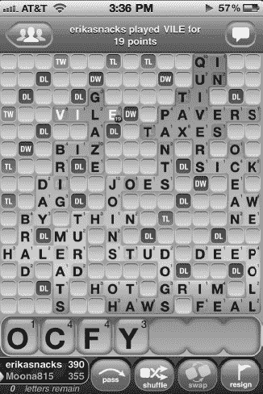

**图 9–1.** *Zynga 出品的《Words with Friends》*

在 iOS 5 引入之前，Game Center 提供了实时游戏功能，要求所有参与的设备在多人游戏体验期间持续保持活跃并登录状态。回合制游戏则提供了一种更休闲的体验，允许用户同时进行多达 20 场游戏，并且只在轮到自己的回合时操作。在 Game Center 的新增强功能出现之前，编写这类游戏需要你自行编写并部署服务器来处理游戏交互。现在，你可以为回合制游戏添加网络组件，并在不到一天的时间内完成部署和运行。在本章中，我们将探讨如何使用 iOS 5 和 Game Center 的新回合制游戏 API 编写一个简单的井字棋游戏。


### 新示例项目

遗憾的是，我们现有的 UFO 示例游戏并不适合测试回合制游戏体验。如果让每位玩家各自行动后再等待其他玩家跟上，这种做法意义不大。幸运的是，还有另一种非常简单的游戏类型可供我们构建项目：井字棋。这款经典的儿童游戏几乎人人都玩过，我们都熟悉它的规则和策略。

我们首先创建一个基于导航控制器的新项目。在整个项目中，我们将使用三个视图。

*   **主视图**：该视图仅包含一个按钮，用于启动 `GKTurnedBasedMatchmakerViewController`。
*   **`GKTurnedBasedMatchmakerViewController`**：这是 Apple 提供的用于创建和恢复回合制游戏的视图。你无需自行创建此视图。
*   **游戏视图**：此类负责处理用户输入、判定胜负和平局，并在每回合开始时更新游戏棋盘。

我们首先处理主视图。当你创建新项目时，这些文件会自动生成。我们要做的第一件事是确保导入正确的 Game Kit 框架，并添加本书一直在使用的可复用 `GameCenterManager` 类；你可以从第 8 章 中引入现有的类。同时，我们还需要在视图中创建一个用于开始新游戏的按钮，如图 9–2 所示。

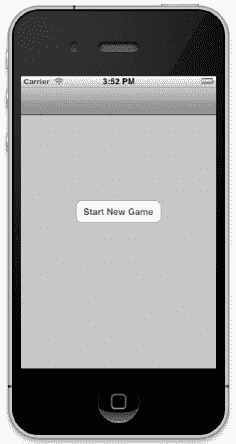

**图 9–2.** *新井字棋游戏的主视图*

新基础视图控制器的头文件应与以下代码片段一致。我们需要遵循 `GameCenterManagerDelegate` 以及 `GKTurnedBasedMatchmakerViewController` 协议。与前几章类似，我们还需要创建 `GameCenterManager` 的类实例。最后需要添加的是一个用于开始新游戏的 `IBAction` 方法。请确保在 Interface Builder 中将“开始新游戏”按钮连接到这个 `IBAction`。

```
#import <UIKit/UIKit.h>
#import <GameKit/GameKit.h>
#import "GameCenterManager.h"

@interface tictactoeViewController : UIViewController <GameCenterManagerDelegate,
GKTurnedBasedMatchmakerViewControllerDelegate>
{
    GameCenterManager *gcManager;
}
-(IBAction)beginGame:(id)sender;
@end
```

我们还需要修改 `viewDidLoad` 方法，以检查并通过 Game Center 对本地用户进行身份验证。这与我们在第 2 章 中使用的方法相同。

```
- (void)viewDidLoad
{
    [super viewDidLoad];
    if ([GameCenterManager isGameCenterAvailable]) {
        [[NSNotificationCenter defaultCenter] addObserver:self
selector:@selector(localUserAuthenticationChanged:)
name:GKPlayerAuthenticationDidChangeNotificationName object:nil];
        gcManager = [[GameCenterManager alloc] init];
        [gcManager setDelegate: self];
        [gcManager authenticateLocalUser];
    }
}
```

我们还需要实现两个委托方法，用于监控身份验证成功和本地用户变更。我们使用这两个方法来输出一些调试信息。

```
- (void)processGameCenterAuthentication:(NSError*)error;
{
    if (error != nil) {
        NSLog(@"身份验证过程中发生错误：%@", [error
localizedDescription]);
    }
}

- (void)localUserAuthenticationChanged:(NSNotification*)notif;
{
    NSLog(@"认证状态已变更：%@", notif.object);
}
```

在下一节中，我们将了解如何调用 `GKTurnedBasedMatchmakerViewController`，以及如何处理处理错误、恢复或创建新比赛所需的委托方法。

### GKTurnedBasedMatchmakerViewController

Apple 提供了一个默认类来呈现用于创建新回合制比赛的图形界面。关于以编程方式创建比赛，请参见后面的“编程式比赛”一节。

首先，我们在上一节创建的单个按钮的 `IBAction` 中处理一个新的匹配器对象。这里使用的方法与 iOS 4 的 Game Center 匹配非常相似。我们首先 `alloc` 并 `init` 一个 `GKMatchRequest` 副本，并设置最小和最大玩家数。然后，我们创建一个新的 `GKTurnedBasedMatchmakerViewController`，并使用刚刚创建的匹配对象对其进行 `init`。最后，将委托设置为 `self`，并以模态方式向用户呈现该视图。用户将看到一个类似于图 9–3 所示的视图。

```
- (IBAction)beginGame:(id)sender
{
    GKMatchRequest *match = [[GKMatchRequest alloc] init];
    [match setMaxPlayers:2];
    [match setMinPlayers:2];

    GKTurnedBasedMatchmakerViewController *tmvc = nil;
    tmvc = [[GKTurnedBasedMatchmakerViewController alloc] initWithMatchRequest:match];
    [tmvc setTurnBasedMatchmakerDelegate: self];
    [self presentModalViewController:tmvc animated:YES];
    [tmvc release];
    [match release];
}
```

**注意：** 在创建新的回合制比赛匹配之前，你必须先通过 Game Center 进行身份验证。

你需要实现四个委托方法以符合 `GKTurnedBasedMatchmakerViewControllerDelegate` 协议。第一个方法处理用户在匹配器中取消操作。这里唯一的要求是调用 `dismissModalViewControllerAnimated`。你可以根据需要为应用添加额外的逻辑。

```
- (void)turnBasedMatchmakerViewControllerWasCancelled:
(GKTurnedBasedMatchmakerViewController*)viewController
{
    [self dismissModalViewControllerAnimated:YES];
}
```

**重要提示：** 当前游戏列表在你关闭并重新打开 `GKTurnedBasedMatchmakerViewController` 之前不会更新。

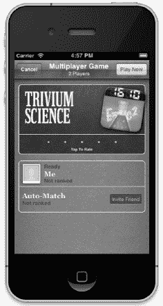

**图 9–3.** *开始新的回合制匹配*

我们还需要实现一个委托方法，以捕获此阶段发生的任何错误。当匹配过程中遇到错误时，会调用以下方法。为了调试目的，我们将错误信息打印到控制台；但你需要通知用户发生了错误。

```
- (void)turnBasedMatchmakerViewController:
(GKTurnedBasedMatchmakerViewController*)viewController didFailWithError:(NSError *)error
{
    NSLog(@"回合制匹配器失败，错误信息：%@", [error
localizedDescription]);
}
```

本节讨论的最后一个委托方法处理用户从匹配器屏幕退出比赛的情况。这通过在游戏上从右向左滑动并选择退出选项来实现。在下面的方法中，我们在作为方法参数传递的匹配对象上调用 `participantQuitOutOfTurnWithOutcome`。我们传入的结果是 `GKTurnedBasedMatchOutcomeQuit`。如果你在此处未调用正确的方法，虽然可以退出游戏，但游戏会在几秒钟后重新出现。

```
- (void)turnBasedMatchmakerViewController:(GKTurnedBasedMatchmakerViewController
*)viewController playerQuitForMatch:(GKTurnedBasedMatch *)match
{
    [match participantQuitOutOfTurnWithOutcome:GKTurnedBasedMatchOutcomeQuit
withCompletionHandler:^(NSError *error) {
        if (error) {
            NSLog(@"结束比赛时发生错误：%@", [error localizedDescription]);
        }
    }];
}
```

最后一个必需的方法 `didFindMatch` 将在下一节“开始新游戏”中讨论。

**注意：** 使用之前图 9–3 中显示的 `GKTurnedBasedMatchmakerViewController` 时，用户现在可以在应用内对应用进行评分。


### 开始新游戏

开始一场回合制新游戏的过程非常直接且简单。为此，你需要实现以下方法。这个新方法会关闭`GKTurnBasedMatchmakerViewController`，然后将比赛对象的副本传递给游戏控制器。以下代码片段是我们为井字棋游戏遵循的流程。

```
- (void)turnBasedMatchmakerViewController:(GKTurnBasedMatchmakerViewController
*)viewController didFindMatch:(GKTurnBasedMatch *)match
{
    [self dismissModalViewControllerAnimated: YES];
    tictactoeGameViewController *gameVC = [[tictactoeGameViewController alloc] init];
    gameVC.match = match;
    [[self navigationController] pushViewController:gameVC animated:YES];
    [gameVC release];
}
```

现在，我们把注意力转向`tictactoeGameViewController`类。从头文件开始，我们创建一个新属性来持有比赛对象，该对象在前一个方法中已设置。同时，我们还要创建一个新的可变字典来存储游戏数据，本章后续部分将对此进行更深入的讨论。

```
#import <UIKit/UIKit.h>
#import <GameKit/GameKit.h>

@interface tictactoeGameViewController : UIViewController
@property(nonatomic, retain) NSMutableDictionary *gameDictionary;
@property(nonatomic, retain) GKTurnBasedMatch *match;
@end
```

**重要提示：** 每一轮新回合你最多只能传递 4k 的数据。如果你无法将游戏数据限制在 4k 以内，可以使用一个指向持有完整数据集的服务器 URL。或者，你也可以仅传递游戏状态的增量变化，并将现有数据存储在本地。

我们需要在此暂停，以配置实际的游戏视图（`tictactoeGameViewController`）。在井字棋游戏中，我们需要九个供用户落子的位置，以及一个认输选项和一个用于告知玩家当前轮到谁的标签。

我们使用简单的`UIButton`来处理用户输入。修改 xib 文件，使其布局类似于图 9-4 所示。你需要为每个按钮和标签创建`IBOutlet`，并为落子和认输创建新的`IBAction`方法。将所有棋盘按钮连接到之前创建的`makeMove`方法。我们还需要在`UIButton`上设置 tag 值以便定位它们。从左上角开始编号为 1，从左到右、从上到下依次编号。

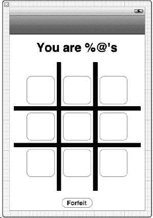

**图 9-4.** *从 Interface Builder 中看到的游戏棋盘视图*

现在，你的游戏视图控制器中有了两个新方法，以及九个按钮输出口和一个标签输出口。这涵盖了如何开始一场新的回合制游戏比赛。在下一节中，我们将探讨如何执行落子操作并将控制权传递给下一位玩家。

### 执行第一步落子

在开始一场新的比赛游戏后，执行落子操作之前，我们首先要确定当前玩家代表哪一方。在我们的示例游戏中，有两方：X 和 O。我们将第一位玩家固定设为 X，第二位玩家固定设为 O。这意味着 X 总是先手。通过这种设置，我们可以使用以下代码片段轻松确定当前玩家代表哪一方。

```
if (match.currentParticipant == [match.participants objectAtIndex:0]) {
    myPlayerCharacter = @"X";
    identifyTeamLabel.text = @"轮到 X 落子";
} else {
    myPlayerCharacter = @"O";
    identifyTeamLabel.text = @"轮到 O 落子";
}
```

确定玩家的身份后，我们就可以允许他们落子了。接下来，我们将修改九个游戏按钮所关联的操作方法的代码。首先，让我们看一下该方法的完整形式。然后，我们将对其进行分解，并深入分析每个部分。

```
- (IBAction)makeMove:(id)sender
{
    [sender setTitle:myPlayerCharacter forState:UIControlStateNormal];
    NSString *buttonIndexString = [NSString stringWithFormat:@"%d", [sender tag]];
    [gameDictionary setObject:myPlayerCharacter forKey:buttonIndexString];
    NSData *data = [NSPropertyListSerialization dataFromPropertyList:gameDictionary
format:NSPropertyListXMLFormat_v1_0 errorDescription:nil];
    GKTurnBasedParticipant *nextPlayer;
    if (match.currentParticipant == [match.participants objectAtIndex:0]) {
        nextPlayer = [[match participants] lastObject];
    } else {
        nextPlayer = [[match participants] objectAtIndex:0];
    }

    if ([self checkWinner] != nil) {
        if ([[self checkWinner] isEqualToString:@"Tie"]) {
            UIAlertView *alert = [[UIAlertView alloc] initWithTitle:@"游戏结束"
message:@"平局" delegate:nil cancelButtonTitle:@"关闭" otherButtonTitles: nil];
            [alert show];
            [alert release];
        } else {
            UIAlertView *alert = [[UIAlertView alloc] initWithTitle:@"游戏结束"
message:nil delegate:nil cancelButtonTitle:@"关闭" otherButtonTitles: nil];
            [alert show];
            [alert release];
        }

        [self.match participantQuitInTurnWithOutcome:GKTurnBasedMatchOutcomeWon
nextParticipant:nextPlayer matchData:data completionHandler:^(NSError *error) {
            if (error) {
                NSLog(@"结束比赛时发生错误：%@", [error
localizedDescription]);
            }
        }];
    } else {
        [self.match endTurnWithNextParticipant:nextPlayer matchData:data
completionHandler:^(NSError *error) {
            if (error) {
                NSLog(@"更新回合时发生错误：%@", [error
localizedDescription]);
            }
            [self.navigationController popViewControllerAnimated: YES];
        }];
    }
}
```

这个方法初看可能比较复杂，但当我们逐步了解所有细节后，你会看到它其实相当直接。我们首先将发送者（游戏按钮）的标题设置为之前代码片段中确定的玩家角色。

接下来，我们知道需要保留游戏数据以便在每一轮中持久化，因此我们将玩家角色存储到字典中，使用按钮的 tag 值作为键。这样，我们以后就可以遍历字典并重新填充之前的落子信息（更多相关内容将在下一节“继续进行中的游戏”中讨论）。

现在，我们需要准备游戏数据并将其发送给下一位玩家。这需要几个步骤。由于我们需要将游戏数据作为`NSData`发送，因此要将现有的游戏字典转换为`NSData`。我们通过`NSPropertyListSerialization`方法完成此操作。之后，我们就可以发送并在之后检索这些数据了。


下一步是确定下一名玩家是谁。在双人游戏中，这相当简单：我们查看参与者数组，确定谁不是自己，然后将该玩家设为下一名玩家。当有更多玩家时，你需要简单地确定自己在比赛参与者数组中的当前索引，并调用下一名玩家；如果你自己是最后一名玩家，则调用第一名玩家。

**注意：** 参与者数组的大小和顺序在比赛开始时确定，并且在整个比赛期间以及每台设备上都将保持一致。

**提示：** 你可能会看到参与者数组中存在 `nil` 对象；这些是未匹配玩家的占位符。Game Center 只会在轮到他们行动时匹配新玩家。这意味着每次你被自动匹配时，都将轮到你行动。

接下来的代码部分用于检查比赛是否有胜者。我们将在本章的“结束比赛”部分更详细地介绍这一点。

每次行动结束时我们要做的最后一件事情，就是将新的游戏数据发送给下一名玩家。这名玩家随后会更新游戏状态，并将其发送给下一名玩家（恰好又是第一名玩家）。为此，我们在比赛对象上调用 `endTurnWithNextParticipant`。我们需要传入在此方法中早些时候确定好的下一名玩家。

### 继续正在进行的游戏

当你在下一回合恢复游戏时（假设这不是比赛的第一回合），你首先需要将游戏状态恢复到当前位置。为此，我们首先修改 `viewDidLoad` 方法以获取当前比赛数据。我们需要在比赛对象上调用 `loadMatchDataWithCompletionHandler`。这将返回我们在之前方法中发送给下一名玩家的数据。然后我们将 `NSData` 转换回字典，并将其添加到我们的 `gameDictionary` 中。

```
- (void)viewDidLoad
{
    //现有的 viewDidLoad 代码...
    [self.match loadMatchDataWithCompletionHandler:^(NSData *matchData, NSError *error)
{
        NSDictionary *myDict = [NSPropertyListSerialization
propertyListFromData:match.matchData mutabilityOption:NSPropertyListImmutable format:nil
errorDescription:nil];
        [gameDictionary addEntriesFromDictionary: myDict];
        [self populateExistingGameBoard];
        if (error) {
            NSLog(@"loadMatchData - %@", [error localizedDescription]);
        }
    }];
}
```

**提示：** 如果你在本地持久化游戏状态，则只需更新自你上一次行动以来发生的回合。这种方法将帮助你保持数据包大小在 4k 限制以内。

填充游戏数据字典后，我们需要调用一个新的便捷方法，从该字典中填充游戏图形界面。该方法将遍历字典中的所有键，并用玩家的角色填充相应的游戏按钮。我们还将按钮的启用状态设置为 `NO`，以防止玩家移动到对手的位置上。

```
- (void)populateExistingGameBoard
{
    NSArray *dataArray = [gameDictionary allKeys];
    for (NSString *key in dataArray) {
        UIButton *button = (UIButton*)[self.view viewWithTag: [key intValue]];
        [button setTitle:[gameDictionary objectForKey:key]
forState:UIControlStateNormal];
        [button setEnabled: NO];
    }
}
```

有了这些代码，你现在可以使用两个 Game Center 账户完整地玩一局井字棋；然而，游戏永远不会检测到胜者或平局。在下一节中，我们将探讨检测游戏结束事件所需的逻辑。一个已填充游戏的示例如 图 9–5 所示。

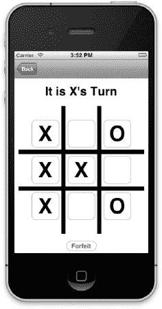

**图 9–5.** *通过比赛数据填充游戏棋盘*

### 结束比赛

在“进行第一步”一节中，我们看到调用了一个名为 `checkWinner` 的方法。在本节中，我们将仔细研究这个方法。对于井字棋，我们采用暴力方法检查是否有胜者，即检查所有行和列是否有三个重复的字符。如果没有更多可移动的位置，我们还需要检查是否平局。

```
- (NSString*)checkWinner
{
    // 顶行
    if ([gameButton1.titleLabel.text isEqualToString:gameButton2.titleLabel.text] &&
[gameButton2.titleLabel.text isEqualToString:gameButton3.titleLabel.text])
        return gameButton1.titleLabel.text;
    // 中间行
    if ([gameButton4.titleLabel.text isEqualToString:gameButton5.titleLabel.text] &&
[gameButton5.titleLabel.text isEqualToString:gameButton6.titleLabel.text])
        return gameButton4.titleLabel.text;
    // 底行
    if ([gameButton7.titleLabel.text isEqualToString:gameButton8.titleLabel.text] &&
[gameButton8.titleLabel.text isEqualToString:gameButton9.titleLabel.text])
        return gameButton7.titleLabel.text;
    // 第一列
    if ([gameButton1.titleLabel.text isEqualToString:gameButton4.titleLabel.text] &&
[gameButton4.titleLabel.text isEqualToString:gameButton7.titleLabel.text])
        return gameButton1.titleLabel.text;
    // 中间列
    if ([gameButton2.titleLabel.text isEqualToString:gameButton5.titleLabel.text] &&
[gameButton5.titleLabel.text isEqualToString:gameButton8.titleLabel.text])
        return gameButton2.titleLabel.text;
    // 最后一列
    if ([gameButton3.titleLabel.text isEqualToString:gameButton6.titleLabel.text] &&
[gameButton6.titleLabel.text isEqualToString:gameButton9.titleLabel.text])
        return gameButton3.titleLabel.text;
    // 对角线
    if ([gameButton1.titleLabel.text isEqualToString:gameButton5.titleLabel.text] &&
[gameButton5.titleLabel.text isEqualToString:gameButton9.titleLabel.text])
        return gameButton1.titleLabel.text;

    if ([gameButton3.titleLabel.text isEqualToString:gameButton5.titleLabel.text] &&
[gameButton5.titleLabel.text isEqualToString:gameButton7.titleLabel.text])
        return gameButton3.titleLabel.text;
    if (gameButton1.titleLabel.text != nil && gameButton2.titleLabel.text != nil &&
gameButton3.titleLabel.text != nil && gameButton4.titleLabel.text != nil &&
gameButton5.titleLabel.text != nil && gameButton6.titleLabel.text != nil &&
gameButton7.titleLabel.text != nil && gameButton8.titleLabel.text != nil &&
gameButton9.titleLabel.text != nil) {
        return @"平局";
    }

    return nil;
}
```

如果你回顾上一节中的 `makeMove` 方法，会发现如果我们判定玩家获胜，就会进行一次新的调用。我们需要调用 `participantQuitInTurnWithOutcome` 来结束比赛。我们传入 `GKTurnBasedMatchOutcomeWon` 作为参数，但如果出现玩家输掉的情况，我们也可以传入 `GKTurnBasedMatchOutcomeLost`。

```
[self.match participantQuitInTurnWithOutcome:GKTurnBasedMatchOutcomeWon
nextParticipant:nextPlayer matchData:data completionHandler:^(NSError *error) {
    if (error) {
        NSLog(@"结束比赛时出错: %@", [error localizedDescription]);
    }
}];
```

### 退出与弃权

玩家可以随时在匹配视图控制器上通过滑动比赛来退出。但是，你可能希望为用户添加一条路径，让他们能够从游戏内部弃权或退出比赛。要允许玩家弃权比赛，请使用以下代码片段。

```
- (IBAction)forfeit:(id)sender
{
    [self.match participantQuitOutOfTurnWithOutcome:GKTurnBasedMatchOutcomeQuit
withCompletionHandler:^(NSError *error) {
        if (error) {
            NSLog(@"结束比赛时出错: %@", [error localizedDescription]);
        }
    }];
}
```


### 程序化匹配

如果你希望绕过 `GKTurnBasedMatchmakerViewController` 并实现自己的图形界面，也可以选择这样做。使用以下方法即可在不经过匹配界面的情况下创建新比赛。

```
- (void)findMatch
{
    GKMatchRequest *match = [[GKMatchRequest alloc] init];
    [match setMaxPlayers:2];
    [match setMinPlayers:2];

    [GKTurnBasedMatch findMatchForRequest:match withCompletionHandler:^(GKTurnBasedMatch
*match, NSError *error) {
        if (error == nil) {
            //使用返回的 match 开始新游戏
        } else {
            NSLog(@"匹配时发生错误: %@", [error
localizedDescription]);
        }
    }];
}
```

除了创建游戏，你还需要能够为本地用户加载现有游戏列表。可通过以下方法实现。

```
- (void)loadMatches
{
    [GKTurnBasedMatch loadMatchesWithCompletionHandler:^(NSArray *matches, NSError
*error) {
        if (error == nil) {
            NSLog(@"现有匹配: %@", matches);
        } else {
            NSLog(@"加载匹配时发生错误: %@", [error
localizedDescription]);
        }
    }];
}
```

**注意：** 由于这两种方法都使用后台任务来处理请求，你在块内实现的代码需要保证线程安全。

### GKTurnBasedEventHandler

`GKTurnedBasedEventHandler` 是一个委托协议，负责处理与回合制游戏相关的重要消息。要为事件设置委托，请使用以下代码。

```
[[GKTurnBasedEventHandler sharedTurnBasedEventHandler] setDelegate: self];
```

该协议包含三个可选方法。

- `handleInviteFromGameCenter:`：当你的委托收到此方法时，应使用通过该方法传入的 `playersToInvite` 填充一个新的 `GKMatchRequest`。然后你需要开始一场新比赛，或显示匹配界面。当用户接受来自好友的比赛邀请时会调用此方法。
- `handleTurnEventForMatch:`：当用户接受针对进行中比赛的推送通知时，委托会收到此消息。你需要结束当前正在执行的任务，并显示此方法传入的比赛对应的游戏界面。
- `handleMatchEnded:`：当委托收到此消息时，应向玩家显示比赛结果和游戏结束视图，并允许玩家选择是否从 Game Center 中删除比赛数据。

### 总结

在本章中，我们了解了 iOS 5 中 Game Center 新增的回合制游戏功能。我们使用了现有的 `GameCenterManager` 类，并编写了一个全新的示例游戏来运用回合制技术。现在你应该已经牢固掌握了如何创建新的回合制游戏，以及如何在参与者之间保留和发送回合数据。通过本章学到的技能，你现在应该能够轻松地在几小时内搭建并运行回合制游戏的网络组件。

下一章我们将探讨另一个激动人心的话题：语音聊天。苹果公司投入了大量精力，使 IP 语音功能在 iOS 应用中易于使用，我们将探索如何在支持 Game Center 或 Game Kit 的应用中快速启用 VOIP 功能。

## 第 10 章

#### 语音聊天

作为 Game Kit 提供的服务之一，语音聊天比其他任何功能都更能体现苹果公司的工程实力。苹果将其他平台上最复杂的功能之一，变成了 iOS 上最容易实现的功能。在其它平台上处理 IP 语音（VOIP）时，这往往是整个项目中最复杂、最令人生畏的任务。在本章中，我们将探讨如何为 UFOs 或任何 iOS 应用添加语音聊天服务。本章篇幅简短，恰恰证明了苹果在这一技术上投入了大量精力，使其连最资历尚浅的开发者也能轻松掌握。

与前面几章不同，我们将分别处理 Game Kit 语音聊天和 Game Center 语音聊天，而不是像之前那样编写一个共享类。虽然这两种服务有很多相似之处，但它们的差异足以让我们有必要分别处理。此外，我们将在 UFOs 中实现语音聊天时，应用本章所涵盖的主题。

### Game Center 的语音聊天

我们首先来看 Game Center 的语音聊天。使用 `GKMatch` 创建语音聊天会话有很多优势，例如易于使用、实现快速，并且与使用 Game Kit 或自行实现系统相比，所需开销更少。一个 `GKMatch` 语音聊天可以有多个频道，每个频道都关联一个接收者列表。例如，在第一人称射击游戏中，你可以为队友设置一个频道，为所有玩家设置另一个频道。这样你就可以讨论赢得比赛的战术，而不会向对方队伍泄露信息。

**注意：** 使用 `GKMatch` 的语音聊天仅适用于通过 Wi-Fi 连接互联网的参与者；语音聊天不支持蜂窝网络。

#### 创建音频会话

在开始使用语音聊天之前，你首先需要创建一个新的音频会话。务必在任何聊天服务开始之前完成此操作。如果你在创建聊天会话之后才创建音频会话，将无法发送或接收语音数据。在以下示例中，我们创建了一个新的音频会话，允许我们的应用播放和录制音频，然后将其设置为活跃状态。

**提示：** 你的应用可能已经使用音频会话播放音效；如果你已经创建了音频会话，则无需新建。如果重复使用现有音频会话，请确保将其设置为允许播放和录制功能。

```
    NSError *error = nil;
    AVAudioSession *audioSession = [AVAudioSession sharedInstance];
    [audioSession setCategory:AVAudioSessionCategoryPlayAndRecord error:&error];
    [audioSession setActive: YES error: &error];
    if (error)
    {
        NSLog(@"启动音频会话时发生错误: %@", [error localizedDescription]);
    }
```

#### 创建新的语音频道

你的应用中可以拥有任意数量的语音聊天频道，每个参与者都可以选择加入任意数量的频道。频道通过名称字符串进行创建和组织。我们将据此决定用户应加入哪些频道。当两个或更多参与者加入具有相同名称的频道时，他们便连接到了同一个聊天室。

下面的代码片段展示了如何创建三个不同的频道。请注意，这些频道是使用我们在开始基于 Game Center 的网络游戏时返回的 `GKMatch` 对象创建的。

```
    GKVoiceChat *allChannel = [[match voiceChatWithName:@"allPlayers"] retain];
    GKVoiceChat *teamChannel = [[match voiceChatWithName:@"blueTeam"] retain];
    GKVoiceChat *squadChannel = [[match voiceChatWithName:@"BlueTeamSquad2"] retain];
```

在这个例子中，我们有一个用于与所有玩家通信的频道、一个用于与整个团队通信的频道，以及第三个用于与小队交谈的频道。频道创建后并不会自动开启。在下一节中，我们将探讨如何启动和停止特定频道上的通信。


#### 启动与停止语音聊天

在上一节中，我们创建了三个新的语音频道，用于实现 Game Center 类型的语音聊天。当你希望在这些频道上发送和接收语音时，需要首先告知 API 你想要开始使用该频道。连接到一个频道后，你便可以发送和接收该频道的数据。如果你只想连接到某个频道，但不想传输任何语音音频，请参阅下一节关于麦克风静音的内容。

要开始使用语音频道，你需要在上一节创建的 `GKVoiceChat` 对象上调用 `start` 方法。

```
    [allChannel start];
    [teamChannel start];
```

当你想离开某个频道时，只需调用 `stop` 方法。这比单纯静音频道中的所有参与者更优，因为应用将无需接收额外的网络数据。已停止的频道可以随时重新启动。

```
    [allChannel stop];
    [teamChannel stop];
```

**提示：** 强烈建议在传输语音数据时提供可视和音频指示，例如红灯和点击声。这可以降低用户无意中传输语音数据的可能性。请始终牢记，用户的麦克风和传输的语音应被视为敏感数据。

#### 聊天音量与静音

语音聊天的音量是按频道设置的。每个频道都有一个关联的属性，可用于降低该聊天的整体音量。你无法将音量提高到用户当前设备音量之上。要修改频道音量，请添加以下代码行。

```
    allChannel.volume = 0.5; // 最大音量的一半
```

此外，你可以通过引用玩家的 `playerID` 来静音频道中的单个玩家。可以使用以下两行代码来静音和取消静音玩家。

```
    [teamChannel setMute:YES forPlayer: playerID];
    [teamChannel setMute:NO forPlayer:playerID];
```

在某些情况下，你可能并不希望一直传输用户的语音。默认情况下，用户加入聊天时处于静音状态。你需要先取消静音，用户才能开始传输语音数据。

```
    squadChannel.active = YES;
```

**注意：** 一个用户一次只能在一个频道上传输语音；如果你取消静音某个频道，API 将自动静音所有其他频道。

以上就是完全在你的基于 Game Center 的网络应用中启用语音聊天所需的全部内容。其余一切，包括数据的发送和接收，都由 API 为你处理。

#### 监控玩家状态

我在本章前面提到过，让用户知道他们当前正在传输数据非常重要。让玩家看到谁在发言也是一个重要步骤。通过监控玩家状态变化，你可以确定哪些用户当前正在传输语音，并在玩家列表中高亮显示他们，或执行其他类型的发言玩家指示。以下代码块在你开始聊天时很容易设置，且无需进行轮询或委托回调。

```
allChannel.playerStateUpdateHandler = ^(NSString *playerID, GKVoiceChatPlayerState state)
{
        switch (state)
                {
                        case GKVoiceChatPlayerSpeaking:
                                [self showSpeakingPlayer: playerID];
                         break;
                        case GKVoiceChatPlayerSilent:
                                [self stopShowingSpeakingPlayer: playerID];
                                break;
        }
    };
```

**注意：** 玩家状态更新是按频道处理的。你需要为每个希望监控变化的频道配置一个状态更新处理程序。

### Game Kit 的语音聊天

在使用 Game Kit 语音聊天时，我们将重点关注 `GKVoiceChatService` 对象。Game Kit 语音聊天的基本原理与 Game Center 语音聊天非常相似。实现此系统的一个良好起点是，当你使用 Peer Picker 系统连接到另一位玩家，并获取到一个 `GKSession` 对象之后。需要注意的是，`GKVoiceChatService` 被设计为一次只能向一个对等方发送数据。虽然目前这还不是限制（因为 Game Kit 仅支持两个对等方），但若 API 将来有所扩展，这一点仍需牢记。

**注意：** 在继续之前，不要忘记检查 `[GKVoiceChatService isVoIPAllowed]` 以确保你的设备支持语音聊天。某些设备，例如第一代 iPod touch，无法支持语音聊天。

#### 创建音频会话

与 Game Center 一样，我们可以通过首先创建一个新的 `AVAudioSession` 来开始使用 Game Kit 语音聊天。务必确保在调用任何聊天服务方法之前创建好会话。

```
    NSError *error = nil;
    AVAudioSession *audioSession = [AVAudioSession sharedInstance];
     [audioSession setCategory:AVAudioSessionCategoryPlayAndRecord error:&error];
     [audioSession setActive: YES error: &error];
    if (error)
    {
        NSLog(@"启动音频会话时发生错误：%@", [error localizedDescription]);
    }
```

#### 必需的准备工作

与 Game Center 的方法不同，Game Kit 需要更多的准备工作才能使其正常运行。你首先需要实现几个必需的方法。下面发布的第一个方法返回你想要通信的玩家的 `peerID`。你可以轻松地从当前的 `GKSession` 对象中获取该值。

```
    - (NSString *)participantID
    {
        return session.peerID;
    }
```

你还需要实现一个方法来将实际的语音数据发送到已连接的对等方，以及另一个处理接收数据的方法。这两个方法均在以下代码片段中提供。这两个方法将共同处理你应用中语音数据的发送和接收。

```
-(void)voiceChatService:(GKVoiceChatService *)voiceChatService sendData:(NSData *)data toParticipantID:(NSString *)participantID
   {
                [session sendData: data toPeers:[NSArray arrayWithObject: participantID]
         withDataMode: GKSendDataReliable error: nil];
   }

   - (void) receiveData:(NSData *)data fromPeer:(NSString *)peer inSession:
    (GKSession *)session context:(void *)context;
    {
        [[GKVoiceChatService defaultVoiceChatService] receivedData:data
        fromParticipantID:peer];
   }
```


### 启动运行

除了上一节讨论的三种新方法外，你还需要完成一些额外步骤才能让一切正常运行。首先，你需要初始化 `GKVoiceChatClient` 的一个新实例，它应是你创建的 `GKVoiceChatClient` 的自定义子类。有关此步骤的更多信息，请参阅下一节“整合在一起”。

```
GKVoiceChatClient *voiceChatClient = [[GKVoiceChatClient alloc] initWithSession:
 session];
[GKVoiceChatService defaultVoiceChatService].client = voiceChatClient;
```

创建 `GKVoiceChatClient` 的新实例后，你需要将你的对等方连接到它。以下代码演示了如何实现这一点。

```
[[GKVoiceChatService defaultVoiceChatService] startVoiceChatWithParticipantID:
 [self    participantID] error: &error];
```

要结束语音聊天会话，你需要调用类似的方法，如下所示。

```
[[GKVoiceChatService defaultVoiceChatService] stopVoiceChatWithParticipantID:
 [self    participantID]];
```

与另一个对等方建立连接后，你开始接收语音聊天数据。如果你想发送数据，只需使用以下代码片段取消麦克风静音即可。

```
[GKVoiceChatService defaultVoiceChatService].microphoneMuted = NO;
```

这些是启动并运行 Game Kit 语音聊天所需的所有步骤。虽然比 Game Center 语音聊天稍微复杂一些，但仍然比实现你自己的 VOIP 系统要简单得多。

### 整合在一起

在本章中，我们将修改第 8 章中已有的代码库。首先，为你的语音聊天服务创建一个新的音频会话。将以下代码块添加到 `UFOGameViewController.m` 的 `viewDidLoad:` 方法中。此外，你还需要将 `AVFoundation.framework` 添加到你的项目中。修改 `viewDidLoad` 方法的相关部分，使其与以下内容匹配。

```
if (self.gameIsMultiplayer == NO)
{
    for (int x = 0; x < 5; x++)
    {
        [self spawnCow];
    }

    [self updateCowPaths];
}

else
{
    [self generateAndSendHostNumber];
    NSError *error = nil;
    AVAudioSession *audioSession = [AVAudioSession sharedInstance];
     [audioSession setCategory:AVAudioSessionCategoryPlayAndRecord error:&error];
     [audioSession setActive: YES error: &error];
    if (error)
    {
        NSLog(@"An error occurred while starting audio session: %@", error![Images
 localizedDescription]);
    }

     [self setupVoiceChat];
}
```

**注意：** 确保你正在构建的目标设备同时配有可用的扬声器和麦克风。

你还需要添加一个名为 `setupVoiceChat` 的新方法。此方法将处理 Game Center 和 Game Kit 的基本配置。

```
-(void)setupVoiceChat
{
    //GameKit
    if (self.peerIDString)
    {
        NSError *error = nil;
        UFOVoiceChatClient *voiceChatClient = [[UFOVoiceChatClient alloc] init];
        voiceChatClient.session = self.gcManager.matchOrSession;
         [GKVoiceChatService defaultVoiceChatService].client = voiceChatClient;
         [[GKVoiceChatService defaultVoiceChatService]
 startVoiceChatWithParticipantID:self.peerIDString error:&error];

         [GKVoiceChatService defaultVoiceChatService].microphoneMuted = YES;
        if (error)
        {
                NSLog(@"An error occurred when setting up voice chat: %@",
 [error localizedDescription]);

        }
    }

    //Game Center
    else
    {
        mainChannel = [[self.peerMatch voiceChatWithName:@"main"] retain];
        [mainChannel start];
        mainChannel.volume = 1.0;
        mainChannel.active = NO;
    }
}
```

你可能已经注意到，在前面的代码片段中，我们有一个名为 `UFOVoiceChatClient` 的新类类型。这是我们将用于处理语音的传入和传出数据，以及其他用于监控状态和错误的方法的类。接下来将发布该类的实现。

```
@implementation UFOVoiceChatClient
@synthesize session;
-(NSString *)participantID
{
    return self.session.peerID;
}

- (void)voiceChatService:(GKVoiceChatService *)voiceChatService sendData:
(NSData *)data toParticipantID:(NSString *)participantID
{
     [self.session sendData:data toPeers:[NSArray arrayWithObject: participantID]
withDataMode:GKSendDataReliable error:nil];
}

- (void)receivedData:(NSData *)arbitraryData fromParticipantID:(NSString *)participantID
{
     [[GKVoiceChatService defaultVoiceChatService] receivedData:arbitraryData
 fromParticipantID:participantID];
}

- (void)voiceChatService:(GKVoiceChatService *)voiceChatService
 didReceiveInvitationFromParticipantID:(NSString *)participantID
 callID:(NSInteger)callID
{
    NSLog(@"Did Recieve Invitation");
}
```


`- (void)voiceChatService:(GKVoiceChatService *)voiceChatService`  
`didNotStartWithParticipantID:(NSString *)participantID error:(NSError *)error`  
`{`  
`    NSLog(@"邀请未启动");`  
`}`  

`- (void)voiceChatService:(GKVoiceChatService *)voiceChatService`  
`didStartWithParticipantID:(NSString *)participantID error:(NSError *)error`  
`{`  
`    NSLog(@"邀请已启动");`  
`}`  

`@end`

**注意：** 请确保你的 `voiceChatClient` 遵循 `GKVoiceChatClient` 协议。

你还需要对 `GameCenterManager` 进行一些细微的修改，以处理传入的语音数据。请将现有的 `receiveData:fromPeer:inSession:Context:` 方法修改为如下所示。

`- (void)receiveData:(NSData *)data fromPeer:(NSString *)peer inSession:(GKSession *)session context:(void *)context;`  
`{`  
`    NSString *dataString = [[NSString alloc] initWithData:data encoding:NSUTF8StringEncoding];`  
`    if (dataString == nil)`  
`    {`  
`        [[GKVoiceChatService defaultVoiceChatService] receivedData:data fromParticipantID:peer];`  
`        [dataString release];`  
`        return;`  
`    }`  

`    NSDictionary *dataDictionary = [NSDictionary dictionaryWithObjects:[NSArray arrayWithObjects:dataString, peer, session, nil] forKeys:[NSArray arrayWithObjects:@"data", @"peer", @"session", nil]];`  

`    [dataString release];`  
`    [self callDelegateOnMainThread:@selector(receivedData:) withArg:dataDictionary error:nil];`  
`}`

请注意，我们新增了一段代码块，用于将数据传递给我们的 `defaultVoiceChatService` 客户端。如果无法从 `NSData` 中解码出字符串，我们就判定该数据为语音数据。你的应用可能更复杂，可能需要使用前缀或其他类型的标识符来确定数据是否为语音，但对于像 UFO 这样的简单游戏来说，这种方法已经非常适用了。

最后需要做的是连接一个操作来控制麦克风的开关。我决定为 UFO 游戏添加一个简单的切换按钮，但你可能觉得需要采用不同的方案。添加一个新按钮，如图 10–1 所示，并将新操作连接到下方代码。

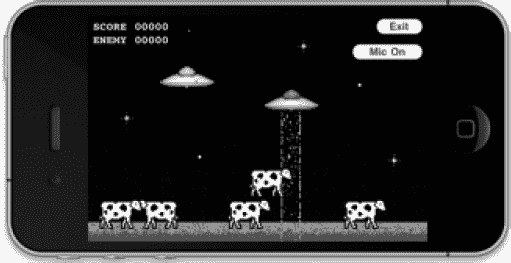

**图 10–1.** *在 UFO 游戏演示中添加麦克风按钮*

`-(IBAction)startVoice:(id)sender;`  
`{`  
`    micOn = !micOn;`  
`    if (micOn)`  
`    {`  
`        [micButton setTitle:@"麦克风开" forState:UIControlStateNormal];`  
`        //GameKit`  
`        if (self.peerIDString)`  
`        {`  
`            [GKVoiceChatService defaultVoiceChatService].microphoneMuted = NO;`  
`        }`  
`        //Game Center`  
`        else`  
`        {`  
`            mainChannel.active = YES;`  
`        }`  
`    }`  
`    else`  
`    {`  
`        [micButton setTitle:@"麦克风关" forState:UIControlStateNormal];`  
`        //GameKit`  
`        if (self.peerIDString)`  
`        {`  
`            [GKVoiceChatService defaultVoiceChatService].microphoneMuted = YES;`  
`        }`  
`        //Game Center`  
`        else`  
`        {`  
`            mainChannel.active = NO;`  
`        }`  
`    }`  
`}`

该方法判断麦克风的当前状态（开/关），并将其切换到新状态。切换后，我们会更新按钮标题，并根据所使用的网络类型打开或关闭麦克风。

以上就是在我们的 UFO 示例项目中添加语音聊天功能所需的所有步骤。如果你在两台设备上运行该游戏，就可以通过语音进行双向交流了。

### 本章小结

在本章中，我们学习了如何仅用极少的功夫，将一项传统上非常复杂的技术集成到我们的 iOS 应用中。我们探讨了在 Game Kit 和 Game Center 中使用语音聊天的差异，并在我们的 UFO 演示游戏中实现了这两种系统的示例。现在，你已经掌握了为任何 iPhone 或 iPad 应用添加全功能 VoIP 技术所需的技能。如果你一直从本书开头跟着实践，那么你已经具备在应用中实现 Game Kit 和 Game Center 所有功能所需的全部技能。

在下一章中，我们将探讨为 iOS 编写游戏或应用时的另一项重要技术——`StoreKit`。通过学习 `StoreKit` 技术，我们将掌握如何在产品中销售附加功能和扩展包。

## 第 11 章

## 使用 StoreKit 实现应用内购买

在本书中，我们一直在使用 Game Center 和 Game Kit 为应用添加丰富的社交网络功能。然而，在当代软件中，还有一项重要功能正逐渐普及：应用内购买。允许用户直接从应用内部购买升级或附加内容，可以开辟一条潜力巨大的新收入渠道。在过去几年中，一种名为“免费增值”（Freemium）的新型商业模式应运而生。免费增值是一种免费提供给用户，但通过销售附加组件实现盈利的新型游戏或产品。

我们将以 ngmoco:) 公司的《We Rule》为例进行介绍。这款游戏最初免费提供给 iPhone 和 iPad 玩家。每位用户管理一个虚拟王国，负责建造建筑和种植作物。用户会随时间积累“魔力”（mojo），并可以使用这种应用内货币来建造新建筑和农场。然而，由于魔力的积累速度较慢，有些用户希望比常规限制更快地进行建造。这些高端用户可以在应用内商店批量购买更多魔力。图 11–1 展示的是《We Rule》内置的商店。如你所见，它提供了从非常实惠到昂贵惊人的多种购买选项。在操作可销售的附加组件时，兼顾这两类用户非常重要。你的部分用户可能偶尔愿意花一两美元，而另一些高端用户则希望一次性花一百美元甚至更多。

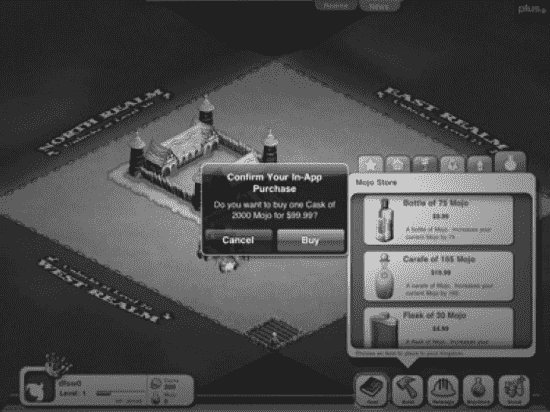

**图 11–1.** *ngmoco:) 的《We Rule》中展示的应用内购买商店*

免费增值已经成为一种强大的商业模式，以至于 ngmoco:) 已经停止开发不符合该模式的游戏，甚至中途取消了《Rolando 3》的开发，因为它无法适应这种模式。这种模式似乎为 ngmoco:) 带来了丰厚回报。如图 11–2 所示，当前《We Rule》商店中销量最高的商品售价为 9.99 美元。这一项应用内购买的零售价超过了大多数独立 iOS 游戏，而它能促成这笔交易的原因，在于先通过免费游戏吸引了用户。

并非所有支持应用内购买的游戏或应用都必须是免费的。事实上，直到最近，苹果还不允许在免费应用中实现应用内购买。你完全可以轻松地在付费游戏中添加额外功能或解锁内容，例如《愤怒的小鸟》中的“神鹰”。应用内购买也不仅限于游戏。几乎任何软件都能从中受益，无论你是要解锁专业级功能，还是通过推送通知支持向用户收取订阅费。在本章的学习中，我们将探讨如何为你的 iOS 软件添加一个功能齐全的应用内商店。

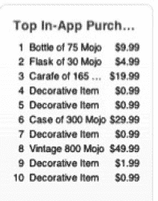

**图 11–2.** *ngmoco:) 的《We Rule》当前最畅销的应用内购买商品列表*


### 在 iTunes Connect 中设置你的 App

与 Game Center 一样，我们需要先在 iTunes Connect 中开始处理 App 内购买项目。

1.  登录 iTunes Connect（[`http://itunesconnect.apple.com`](http://itunesconnect.apple.com)），如第 2 章所述。你需要有一个现有项目来进行操作。如果你在 iTunes Connect 中还没有创建项目，请先创建一个。
2.  选择你想要添加 App 内购买支持的项目。然后，点击名为“管理 App 内购买项目”的按钮，如图 11-3 所示。

**重要提示：** 从创建 App 之日起，你有 90 天的时间来上传一个二进制文件以供审核。请确保在项目完成前的 90 天内保存好 App 内购买项目的配置。

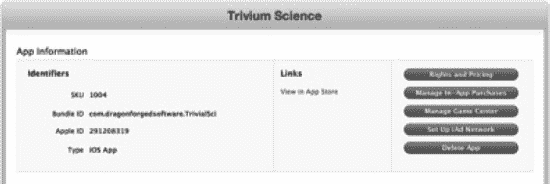

**图 11-3.** *iTunes Connect 中显示“管理 App 内购买项目”按钮的应用列表*

3.  点击“管理 App 内购买项目”按钮后，你将进入一个用于设置新产品的屏幕，如图 11-4 所示。进入后，点击窗口左上角的“创建新项目”按钮。

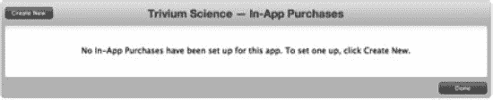

**图 11-4.** *在 iTunes Connect 中设置你的第一个 App 内购买项目*

你可以配置几种类型的 App 内购买产品。为了方便起见，这里详细说明它们。

*   **消耗型项目：** 消耗型 App 内购买项目需要在用户每次下载时都进行购买。这些包括游戏内货币，正如我们在上一节的 We Rule 示例中看到的那样。图 11-5 显示了消耗型购买项目的设置界面。

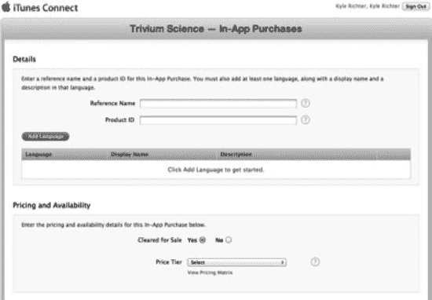

**图 11-5.** *iTunes Connect 中消耗型和非消耗型购买项目的设置界面*

*   **非消耗型项目：** 非消耗型购买项目每个用户只需购买一次，通常用于解锁功能。非消耗型购买项目的示例包括额外关卡、可重复使用的增益效果或附加内容。
*   **自动续期订阅：** 自动续期订阅允许用户在一段设定的时间内购买 App 内内容。在该时间段结束时，除非用户选择退出，否则订阅将自动续期并向用户收费。杂志和报纸采用这种模式，每周或每月发布新一期，直到用户选择退出。图 11-6 显示了自动续期购买项目的设置界面。

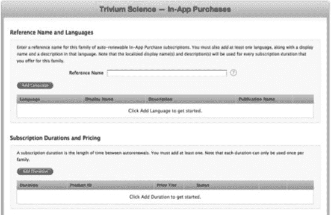

**图 11-6.** *iTunes Connect 中自动续期购买项目的设置界面*

*   **非续期订阅：** 在很大程度上，续期订阅已经取代了对这种模式的需求。非续期订阅的功能与自动续期订阅相同，不同之处在于用户需要在每次到期时手动进行续订。

**注意：** 自动续期订阅将发送到与用户 Apple ID 关联的所有设备。

我们将从添加一个非消耗型购买项目开始。我们将在示例 UFO 游戏中用到这个项目。

我们要添加的第一项是对当前飞船的付费升级；将项目命名为 `com.dragonforged.ufo.newShip1`。我对产品 ID 和参考名称使用了相同的标题。参考名称仅在 iTunes Connect 中搜索时供参考，而产品 ID 则用于你的代码库中以标识此项。

创建新项目后，你需要添加至少一个本地化描述和标题，如图 11-7 所示。最后需要做的是为该项目选择一个定价等级。你可能还注意到有一个用于上传截图的区域；我们将在后面的“提交购买 GUI 截图”一节中讨论。

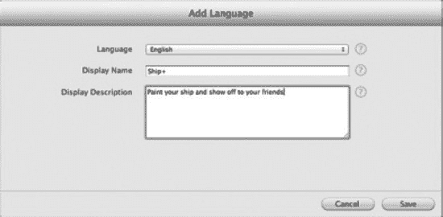

**图 11-7.** *在 iTunes Connect 中为产品添加本地化描述*

添加消耗型产品的步骤与添加非消耗型产品相同。如果你想添加基于订阅的产品，有几个新字段需要你注意，如图 11-8 所示。配置订阅时，你需要定义一个持续时间。iTunes Connect 允许你设置以下任意时长：一周、一个月、两个月、三个月、六个月或一年。如果用户同意参与营销活动（例如向你提供电子邮件地址），你还可以提供免费订阅。

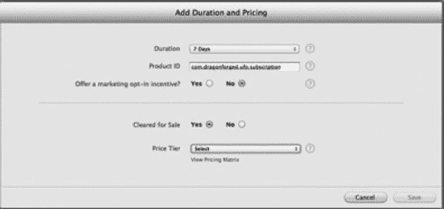

**图 11-8.** *在 iTunes Connect 中配置订阅时长*

至此，你应该已经在 iTunes Connect 中至少配置了一个用于 App 内购买的产品。你的 iTunes Connect 界面应该类似于图 11-9 所示。这就完成了我们为了启用 App 内购买而在 iTunes Connect 中所需的初始配置。在下一节中，我们将开始编写在设备上完成购买所需的相关代码。

**注意：** 现在不必担心“等待截图”的错误；这将在后续过程中处理。在等待上传截图期间，你仍然可以测试你的购买项目。


**图 11-9.** *已设置好并可在我们的 App 中使用的产品*

### 向你的 App 添加产品

与 Game Center 不同，Apple 没有为 App 内购买提供预设计的 GUI。作为开发者，你需要为用户设计一个商店界面。在本节中，我们将学习如何将你在 iTunes Connect 中添加的产品显示在你的 App 中供用户购买。

**注意：** 新购买项目的添加或更改可能需要几个小时才能生效。如果你仔细检查了所有内容但仍然看不到产品，请等待几个小时后再试。

#### App ID 与 App 内购买

在处理 App 内购买时，Apple 要求你的 App ID 不包含通配符，例如 `76P4G6KX56.*`。你需要有一个唯一的 App ID，例如 `76P4G6KX56.com.dragonforged.ufo`。如果你没有唯一的 App ID，则需要创建一个。使用以下步骤创建一个新的唯一 App ID。

1.  在你的网页浏览器中导航到 [`http://developer.apple.com/iPhone`](http://developer.apple.com/iPhone)，并从右侧列表中选择“iPhone 开发者计划门户”。
2.  从左侧栏目中选择“App ID”，然后选择右上角的“新建 App ID”按钮。
3.  填写关于你的 App 的必需信息。
4.  点击“提交”。
5.  点击列表中项目旁边的“配置”，确保“App 内购买项目”已开启（默认应为开启状态）。

#### 设置

我们首先从 App 请求一个产品列表。首先，将 StoreKit 框架添加到你的项目中。我们将修改上一章中现有的 UFO 项目；如果更方便的话，你也可以在自己的项目中进行操作。

**重要提示：** App 内购买在模拟器上无法工作；所有测试都必须在设备上进行。

创建一个名为 `UFOStoreViewController` 的新类。我们将使用这个类向用户显示商店。将头文件设置如下。

```
#import <UIKit/UIKit.h>
#import <StoreKit/StoreKit.h>

@interface UFOStoreViewController : UIViewController <SKProductsRequestDelegate>
{
    SKProductsRequest *productsRequest;
}

@end
```

如你所见，我们导入了 StoreKit 头文件。设置 `SKProductsRequestDelegate` 委托，并创建一个新对象来持有产品请求。我们需要为用户提供一种访问商店的方式，因此请继续在主屏幕上添加一个按钮以及相关的代码，以呈现新的视图控制器。


### 获取产品列表

修改新商店视图控制器的 `viewDidLoad` 和 `viewDidUnload` 方法，使用在 iTunes Connect 中设置的产品标识符来发起新的商店请求。你可能需要调整产品标识符，使其与上一节中设置的内容一致。

```
- (void)viewDidLoad
{
    [super viewDidLoad];
    NSSet *productIdentifiers = [NSSet setWithObjects:
@"com.dragonforged.ufo.newShip1", @"com.dragonforged.ufo.subscription", nil];
    productsRequest = [[SKProductsRequest alloc]
  initWithProductIdentifiers:productIdentifiers];
    productsRequest.delegate = self;
    [productsRequest start];
}
- (void)viewDidUnload
{
    productsRequest.delegate = nil;
}
```

产品请求在委托回调方法（如下所示）中释放。目前，该方法仅将产品信息打印到控制台，并记录任何无效产品。

```
- (void)productsRequest:(SKProductsRequest *)request
 didReceiveResponse:(SKProductsResponse *)response
{
    NSArray *productArray = [response products];
    for (SKProduct *product in productArray) {
    NSLog(@"Product title: %@", product.localizedTitle);
    NSLog(@"Product description: %@", product.localizedDescription);
    NSLog(@"Product price: %@", product.price);
    NSLog(@"Product id: %@\n\n", product.productIdentifier);
    }

    for (NSString *invalidProduct in response.invalidProductIdentifiers)
    {
    NSLog(@"Invalid: %@", invalidProduct);
    }

    [request release];
}
```

**注意：** 虽然你可以通过本节代码获取无效产品标识符列表，但并没有关联的错误信息来确定产品被标记为无效的原因。大多数情况下，是由于产品 ID 输入错误，或者产品尚未充分分发到服务器。

如果你现在运行游戏并导航到商店，应该会看到类似以下的输出。

---

```
2011-08-19 17:31:23.970 UFOs[3580:707] Product title: Ship+
2011-08-19 17:31:23.973 UFOs[3580:707] Product description: Paint your ship and show off to your friends
2011-08-19 17:31:23.975 UFOs[3580:707] Product price: 8.99
2011-08-19 17:31:23.977 UFOs[3580:707] Product id: com.dragonforged.ufo.newShip1
2011-08-19 17:31:23.979 UFOs[3580:707] Product title: Subscription
2011-08-19 17:31:23.981 UFOs[3580:707] Product description: A subscription service
2011-08-19 17:31:23.983 UFOs[3580:707] Product price: 1.99
2011-08-19 17:31:23.987 UFOs[3580:707] Product id: com.dragonforged.ufo.subscription
```

---

**注意：** 从产品请求获得响应可能需要几秒钟。最佳实践表明，你应该向用户展示某种加载指示器。

以上是从 Apple 服务器获取产品所需的所有步骤。在下一节中，我们将使用标准表视图向用户展示这些数据。

### 向用户展示产品

我们首先向商店视图控制器添加一个表视图。不要忘记按要求连接数据源和委托。我们还在类中添加一个新属性来保存产品。创建一个名为 `productArray` 的新类数组，并在 `productsRequest` 方法中将产品结果赋值给它。

向类中添加两个必需的表视图委托和数据源方法，如下列代码片段所示。

```
- (NSInteger)tableView:(UITableView *)tableView numberOfRowsInSection:(NSInteger)section
{
    return [productArray count];
}

- (UITableViewCell *)tableView:(UITableView *)tableView
 cellForRowAtIndexPath:(NSIndexPath *)indexPath
{
    static NSString *CellIdentifier = @"Cell";
    UITableViewCell *cell = [tableView
 dequeueReusableCellWithIdentifier:CellIdentifier];
    if (cell == nil) {
        cell = [[[UITableViewCell alloc] initWithStyle:
UITableViewCellStyleSubtitle reuseIdentifier:CellIdentifier] autorelease];
        cell.selectionStyle = UITableViewCellSelectionStyleNone;
    }

    SKProduct *product = [self.productArray objectAtIndex: [indexPath row]];
    cell.textLabel.text = [NSString stringWithFormat:@"%@ - $%@",
 product.localizedTitle, product.price];
    cell.detailTextLabel.text = product.localizedDescription;
    return cell;
}
```

第一个方法简单地返回我们从 Apple 服务器检索到的产品数量，用于决定表格的行数。在显示为单元格时，我们使用内置的 `UITableViewCellStyleSubtitle` 样式。我们将主标签设置为产品标题和价格，并使用详细标签显示描述。最后，还需要在 `productsRequest` 方法的末尾添加一个表格重载方法。再次运行游戏后，你的输出应该类似于图 11–10 所示。

**注意：** 虽然 API 返回本地化的标题和描述，但不会本地化价格。在国际化应用中，你需要额外处理这一步。

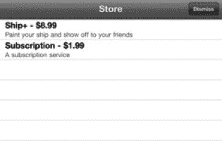

**图 11–10.** *在标准表视图中显示产品列表*

### 购买产品

在上一节中，我们学习了如何将产品添加到应用中。如果没有购买这些产品的能力，我们的实现只是部分完成。在本节中，我们将探讨如何直接在应用中处理产品购买。

#### 购买代码

我们首先需要让商店的视图控制器类遵循 `SKPaymentTransactionObserver` 协议。完成之后，修改现有的 `viewDidLoad` 方法。我们将自身添加为新的交易观察者。此外，我们执行一项测试，确保此设备能够进行支付；如果不能，则显示一个 `UIAlert` 来通知用户。

```
- (void)viewDidLoad
{
    [super viewDidLoad];
    [[SKPaymentQueue defaultQueue] addTransactionObserver:self];
    if ([SKPaymentQueue canMakePayments]) {
        NSSet *productIdentifiers = [NSSet setWithObjects:
@"com.dragonforged.ufo.newShip1", @"com.dragonforged.ufo.subscription", nil];
        productsRequest = [[SKProductsRequest alloc]
 initWithProductIdentifiers:productIdentifiers];
        productsRequest.delegate = self;
        [productsRequest start];

    }
    else {
        UIAlertView *alert = [[UIAlertView alloc] initWithTitle:nil message:
@"Unable to make purchases with this device." delegate:nil cancelButtonTitle:@"Dimiss"
 otherButtonTitles: nil];
        [alert show];
        [alert release];
    }
}
```

接下来，我们需要添加一个 `didSelectRowAtIndexPath` 方法来注册表视图中的选择事件。

```
- (void)tableView:(UITableView *)tableView didSelectRowAtIndexPath:
 (NSIndexPath *)indexPath
{
    SKProduct *product = [self.productArray objectAtIndex: [indexPath row]];
    SKPayment *payment = [SKPayment paymentWithProductIdentifier:
 product.productIdentifier];
    [[SKPaymentQueue defaultQueue] addPayment:payment];
}
```

如果你现在运行应用并选择表格中的某一行，将会看到一个确认提示，如图 11–11 所示。然而，我们尚未编写任何处理该交易的代码，也没有设置测试用户，因此当前只能到达这一步。

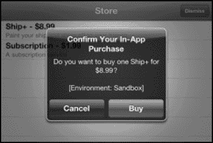

**图 11–11.** *在沙盒环境中确认购买*


##### 购买多个商品

Apple 简化了用户一次性购买多个商品的操作。以下代码片段可用于批量购买同一商品的多个数量，例如用户一次性购买 5 包 100 金币。

```
SKMutablePayment *payment = [SKMutablePayment paymentWithProductIdentifier:@"com.dragonforged.rpg.100gold"];
payment.quantity = 5;
[[SKPaymentQueue defaultQueue] addPayment:payment];
```

##### 处理交易

用户发起购买请求后，您需要执行几个步骤来确保交易顺利完成。首先，我们需要实现 `SKPaymentTransactionObserver` 协议中的必需方法。如下方代码示例所示，我们检测当前交易状态，然后根据交易是成功、失败还是恢复，调用相应的方法。

```
- (void)paymentQueue:(SKPaymentQueue *)queue updatedTransactions:(NSArray *)transactions
{   for (SKPaymentTransaction *transaction in transactions) {
        if ([transaction transactionState] == SKPaymentTransactionStatePurchased) {
        [self transactionDidComplete:transaction];
        }

        else if ([transaction transactionState] == SKPaymentTransactionStateFailed) {
            [self transactionDidFail:transaction];
        }

        else if ([transaction transactionState] == SKPaymentTransactionStateRestored) {
            [self transactionDidRestore:transaction];
        }

        else {
            NSLog(@"Unhandled case: %@", transaction);
        }
    }
}
```

我们需要实现一些便捷方法来简化流程。如果交易成功完成或已恢复，我们需要记录交易事件、解锁用户购买的内容，并执行一些清理操作。如果交易失败或被取消，我们只需执行清理操作，并可能通知用户出现异常。

```
- (void)transactionDidComplete:(SKPaymentTransaction *)transaction
{
    [self recordTransactionData:transaction];
    [self unlockContent:[[transaction payment] productIdentifier]];
    [self finishTransaction:transaction withSuccess:YES];
}

- (void)transactionDidRestore:(SKPaymentTransaction *)transaction
{
    [self recordTransactionData:transaction.originalTransaction];
    [self unlockContent:[[[transaction originalTransaction] payment] productIdentifier]];
    [self finishTransaction:transaction withSuccess:YES];
}

- (void)transactionDidFail:(SKPaymentTransaction *)transaction
{
    if ([[transaction error] code] != SKErrorPaymentCancelled) {
        [self finishTransaction:transaction withSuccess:NO];
    }
    //SKErrorPaymentCancelled
    else
    {
        [[SKPaymentQueue defaultQueue] finishTransaction:transaction];
    }
}
```

现在，让我们以更详细的方式逐一查看我们调用的方法，首先从 `recordTransactionData` 方法开始。此方法的主要目的是为我们的购买操作保留一份虚拟的纸质记录。我们使用 `NSUserDefaults` 来保存所有已完成交易的数组，这样我们可以在将来任何时间点检查交易数据。

```
- (void)recordTransactionData:(SKPaymentTransaction *)transaction
{
    NSArray *transactions = [[NSUserDefaults standardUserDefaults] objectForKey:@"transactions"];
    NSMutableArray *transactionArray = [transactions mutableCopy];
    [transactionArray addObject:[transaction transactionReceipt]];
    [[NSUserDefaults standardUserDefaults] setObject:transactionArray forKey:@"transactions"];
    [transactionArray release];
}
```

接下来，我们来看一下 `unlockContent` 方法。这部分在您的实际应用中可能有所不同。在此示例中，我们在 `NSUserDefaults` 中设置了一个标志位，供我们检查用户是否已购买某项功能。根据您应用的结构，您可能会采取不同的方法。但无论采用何种方法，请记住，您需要在应用重启后保留已解锁的内容。有关如何实现此方法的示例，请参阅“将所有内容整合到 UFO 中”一节。

```
- (void)unlockContent:(NSString *)productId
{

    if ([productId isEqualToString:@"com.dragonforged.ufo.newShip1"]) {
        [[NSUserDefaults standardUserDefaults] setBool:YES forKey:@"shipPlusAvailable" ];
    }
    if ([productId isEqualToString:@"com.dragonforged.ufo.subscription"]) {
        [[NSUserDefaults standardUserDefaults] setBool:YES forKey:@"subscriptionAvailable" ];
    }
}
```

对于成功和不成功的购买，我们最后一步都是对交易执行一些清理工作。在以下方法中，最重要的步骤是调用 `finishTransaction` 方法。同时，我们还会记录交易结果，以便调试。在您调用 `finishTransaction` 之前，交易将一直保持开放状态并存在于系统中。

```
- (void)finishTransaction:(SKPaymentTransaction *)transaction withSuccess:(BOOL)success
{
    [[SKPaymentQueue defaultQueue] finishTransaction:transaction];
    NSDictionary *transactionDictionary = [NSDictionary dictionaryWithObjectsAndKeys:transaction, @"transaction", nil];
    if (success) {
        NSLog(@"Transaction was successful: %@", transactionDictionary);
    }
    else {
        NSLog(@"Transaction was unsuccessful: %@", transactionDictionary);
    }
}
```

##### 恢复先前完成的交易

通常，您的用户需要恢复他们之前已完成的购买。这可能发生在他们重新安装您的应用或开始在另一台设备上使用您的应用时。始终为用户提供一条路径以便重新下载所有内容至关重要。幸运的是，Apple 已经预见到了这种情况，并提供了一个简单的方法来恢复用户的购买。

```
[[SKPaymentQueue defaultQueue] restoreCompletedTransactions];
```

这会重新“购买”您的所有内容，就像用户从您的商店中选择它们一样。您会收到 `paymentQueue:updatedTransactions` 方法的相应回调，并且可以使用现有代码来解锁内容。

### 测试账户与测试购买

如果您现在尝试在沙盒环境中购买某个商品，您会遇到账户错误。您需要首先创建一个新的测试账户，以便能够测试购买而无需实际付费。要设置新的测试用户，您需要登录 iTunes Connect（`http://iTunesConnect.apple.com`）。从 iTunes Connect 主屏幕选择“管理用户”部分；然后在此处选择新建测试用户的选项。

测试用户无需使用真实的电子邮件地址，您可以选择一些输入快捷且易于记忆的内容，例如 `abc@def.com`。虽然您需要输入出生日期和其他身份信息，但完全可以虚构这些数据。请确保选择 iTunes Store 作为本地化测试的目标商店。您可以为每个将要测试的地区创建一个新账户。


### 使用测试账户登录

你不能直接在`设置`应用中用测试账户登录。这样做会导致你被迫同意标准用户协议，并被要求输入信用卡号。为了解决这个问题，你需要使用`设置`应用退出当前的`iTunes`账户。退出账户后，在执行购买操作时系统会提示你登录或创建新账户。此时，你便可以输入测试账户的凭证。

**注意：** 如果你在主设备上进行测试，别忘了在进行真实购买或下载更新之前，回到`设置`应用退出你的测试账户。

### 提交购买界面截图

我们在本章前面的部分已简要讨论过这一步骤。苹果要求你在批准应用内购买之前先提交一张截图。关于苹果具体想在这张截图中看到什么，存在一些混淆。简单来说，苹果需要一张证明你的应用内购买功能正常运行的屏幕截图。对于可解锁内容，这应该是物品被使用时的截图，例如用户玩已购买的关卡或使用已购买的道具。但有时，你的产品在使用过程中可能不可见。在这种情况下，苹果已接受展示物品已购买的商店截图，示例如图 11–12 所示。

**注意：** 只有当你完成应用的编写和调试，并准备提交审核时，才需要提交截图。

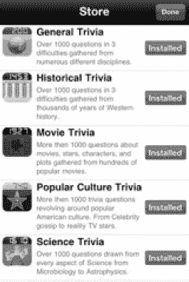

**图 11–12.** *无可捕捉物品时，应用内购买可接受的截图示例*

### 开发者审批

在应用内购买准备就绪之前，你需要完成的最后一步是开发者审批。在网页浏览器中返回`iTunes Connect`，并导航至应用审核页面的`管理应用内购买`部分。屏幕右上角会出现一个新的绿色按钮。

系统会提示你如何提交产品。以下两个选项可供选择。

*   `随二进制文件提交`：此选项将在你下次上传二进制文件时开启应用内购买。
*   `立即提交`：此选项允许你向现有应用提交新产品。

**注意：** 如果你看到`随新版二进制文件提交`的选项，可能是因为你的应用上一个版本是在 3.0 版本支持应用内购买之前上传的。

### 收据

当你成功完成一笔交易时，你会收到一份收据，作为已完成交易对象的一部分。以下是来自`UFOs`演示项目中某次购买的收据示例。

```
{
        "signature" =
"AnQ+nzB60K5Lc6pI6zh8bptEO+GSGUJ+xT5DSef2p66H8gz/P/D13mBqf96ciJoLesI64fohhZTNb9NrCEkZMVy
eqkJed2t38509XpckLWeLJCDYUJqUS1t+fsoy7fwSU0v8TUBzF3Eua1h83GszxlPyylo3mRDssrG+QcgrHwFOAAA
DVzCCA1MwggI7oAMCAQICCGUUkU3ZWAS1MA0GCSqGSIb3DQEBBQUAMH8xCzAJBgNVBAYTAlVTMRMwEQYDVQQKDAp
BcHBsZSBJbmMuMSYwJAYDVQQLDB1BcHBsZSBDZXJ0aWZpY2F0aW9uIEF1dGhvcml0eTEzMDEGA1UEAwwqQXBwbGU
gaVR1bmVzIFN0b3JlIENlcnRpZmljYXRpb24gQXV0aG9yaXR5MB4XDTA5MDYxNTIyMDU1NloXDTE0MDYxNDIyMDU
1NlowZDEjMCEGA1UEAwwaUHVyY2hhc2VSZWNlaXB0Q2VydGlmaWNhdGUxGzAZBgNVBAsMEkFwcGxlIGlUdW5lcyB
TdG9yZTETMBEGA1UECgwKQXBwbGUgSW5jLjELMAkGA1UEBhMCVVMwgZ8wDQYJKoZIhvcNAQEBBQADgY0AMIGJAoG
BAMrRjF2ct4IrSdiTChaI0g8pwv/cmHs8p/RwV/rt/91XKVhNl4XIBimKjQQNfgHsDs6yju++DrKJE7uKsphMddK
YfFE5rGXsAdBEjBwRIxexTevx3HLEFGAt1moKx509dhxtiIdDgJv2YaVs49B0uJvNdy6SMqNNLHsDLzDS9oZHAgM
BAAGjcjBwMAwGA1UdEwEB/wQCMAAwHwYDVR0jBBgwFoAUNh3o4p2C0gEYtTJrDtdDC5FYQzowDgYDVR0PAQH/BAQ
DAgeAMB0GA1UdDgQWBBSpg4PyGUjFPhJXCBTMzaN+mV8k9TAQBgoqhkiG92NkBgUBBAIFADANBgkqhkiG9w0BAQU
FAAOCAQEAEaSbPjtmN4C/IB3QEpK32RxacCDXdVXAeVReS5FaZxc+t88pQP93BiAxvdW/3eTSMGY5FbeAYL3etqP
5gm8wrFojX0ikyVRStQ+/AQ0KEjtqB07kLs9QUe8czR8UGfdM1EumV/UgvDd4NwNYxLQMg4WTQfgkQQVy8GXZwVH
gbE/UC6Y7053pGXBk51NPM3woxhd3gSRLvXj+loHsStcTEqe9pBDpmG5+sk4tw+GK3GMeEN5/+e1QT9np/Kl1nj+
aBw7C0xsy0bFnaAd1cSS6xdory/CUvM6gtKsmnOOdqTesbp0bs8sn6Wqs0C9dgcxRHuOMZ2tm8npLUm7argOSzQ=
=";
        "purchase-info" =
"ewoJIml0ZW0taWQiID0gIjQ1ODk4NjQ4NCI7Cgkib3JpZ2luYWwtdHJhbnNhY3Rpb24taWQiID0gIjEwMDAwMDA
wMDU4NDM1MzgiOwoJInB1cmNoYXNlLWRhdGUiID0gIjIwMTEtMDgtMjEgMjI6Mzk6NTIgRXRjL0dNVCI7CgkicHJ
vZHVjdC1pZCIgPSAiY29tLmRyYWdvbmZvcmdlZC51Zm8ubmV3U2hpcDIiOwoJInRyYW5zYWN0aW9uLWlkIiA9ICI
xMDAwMDAwMDA1ODQzNTM4IjsKCSJxdWFudGl0eSIgPSAiMSI7Cgkib3JpZ2luYWwtcHVyY2hhc2UtZGF0ZSIgPSA
iMjAxMS0wOC0yMSAyMjozOTo1MiBFdGMvR01UIjsKCSJiaWQiID0gImNvbS5kcmFnb25mb3JnZWRzb2Z0d2FyZS5
Ucml2aWFsU2NpIjsKCSJidnJzIiA9ICIxLjAiOwp9";
        "environment" = "Sandbox";
        "pod" = "100";
        "signing-status" = "0";
}
```

苹果鼓励开发者验证此收据的有效性。尽管此步骤仍是可选的，但验证它增加了一层额外的安全保障，防止用户在不支付费用的情况下激活你的应用内购买。苹果提供了两个服务器供你验证收据：一个用于沙盒环境，另一个用于正式发布的软件，如表 11–1 所述。

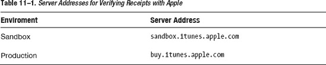

Joe D'Andrea 在 Stack Overflow（`http://stackoverflow.com/questions/1298998`）上发布了两篇方法来帮助你检查有效收据。他的方法简洁高效，且无外部依赖，因此为了方便起见，我将它收录在此处。


-(BOOL)verifyReceipt:(SKPaymentTransaction *)transaction
{
    NSString *jsonObjectString = [self encode:(uint8_t *)transaction.transactionReceipt.bytes length:transaction.transactionReceipt.length];
    NSString *completeString = [NSString stringWithFormat:@"http://url-for-your-php?receipt=%@", jsonObjectString];
    NSURL *urlForValidation = [NSURL URLWithString:completeString];
    NSMutableURLRequest *validationRequest = [[NSMutableURLRequest alloc] initWithURL:urlForValidation];
    [validationRequest setHTTPMethod:@"GET"];
    NSData *responseData = [NSURLConnection sendSynchronousRequest:validationRequest returningResponse:nil error:nil];
    [validationRequest release];
    NSString *responseString = [[NSString alloc] initWithData:responseData encoding: NSUTF8StringEncoding];
    NSInteger response = [responseString integerValue];
    [responseString release];
    return (response == 0);
}

- (NSString *)encode:(const uint8_t *)input length:(NSInteger)length
{
    static char table[] = "ABCDEFGHIJKLMNOPQRSTUVWXYZabcdefghijklmnopqrstuvwxyz0123456789+/=";
    NSMutableData *data = [NSMutableData dataWithLength:((length + 2) / 3) * 4];
    uint8_t *output = (uint8_t *)data.mutableBytes;
    for (NSInteger i = 0; i < length; i += 3) {
        NSInteger value = 0;
        for (NSInteger j = i; j < (i + 3); j++) {
            value <<= 8;
            if (j < length) {
                value |= (0xFF & input[j]);
            }
        }
        NSInteger index = (i / 3) * 4;
        output[index + 0] = table[(value >> 18) & 0x3F];
        output[index + 1] = table[(value >> 12) & 0x3F];
        output[index + 2] = (i + 1) < length ? table[(value >> 6) & 0x3F] : '=';
        output[index + 3] = (i + 2) < length ? table[(value >> 0) & 0x3F] : '=';
    }
    return [[[NSString alloc] initWithData:data encoding:NSASCIIStringEncoding] autorelease];
}

将这两个方法添加到项目后，你只需调用`verifyReceipt`方法并传入返回的交易对象，然后执行一个布尔值测试，检查它是否有效。至此，验证收据真实性所需的所有步骤就完成了。

这种验证收据的方法要求你托管一个中间服务器，这里附上一个极其精简的 PHP 脚本来验证收据。

```
$receipt = json_encode(array("receipt-data" => $_GET["receipt"]));
// 注意：在生产环境中使用 "buy" 而不是 "sandbox"。
$url = "https://sandbox.itunes.apple.com/verifyReceipt";
$response_json = call-your-http-post-here($url, $receipt);
$response = json_decode($response_json);
// 在此处保存数据！
print $response->{'status'};
```

### 在 UFOs 中将一切整合

根据应用内购买的复杂程度，将其集成到代码中可能非常简单，也可能非常困难。在 UFOs 中，我们有一个非常简单的产品：用户支付一次性费用即可解锁不同颜色的飞船。当用户购买产品时，我们会在用户默认设置中存储一个键来表示已解锁。要在代码中解锁此购买，我们只需检查该键，然后执行所需步骤。为此，我们需要向项目添加一些新的美术资源。这些资源已包含在第 11 章的示例代码中（可在 Apress 网站上获取）。

完成此操作后，我们需要修改`viewDidLoad`方法来更改飞船的图像。以下代码片段显示了这些更改。

```
-(void)viewDidLoad
{
    purchasedUpgrade = [[NSUserDefaults standardUserDefaults] boolForKey:@"shipPlusAvailable"];
    CGRect playerFrame = CGRectMake(100, 70, 80, 34);
    myPlayerImageView = [[UIImageView alloc] initWithFrame: playerFrame];
    myPlayerImageView.animationDuration = 0.75;
    myPlayerImageView.animationRepeatCount = 99999;
    NSArray *imageArray;

    if (purchasedUpgrade) {
        imageArray = [NSArray arrayWithObjects: [UIImage imageNamed: @"Ship1.png"], [UIImage imageNamed: @"Ship2.png"], nil];
    } else {
        imageArray = [NSArray arrayWithObjects: [UIImage imageNamed: @"Saucer1.png"], [UIImage imageNamed: @"Saucer2.png"], nil];
    }
    myPlayerImageView.animationImages = imageArray;
    [myPlayerImageView startAnimating];
    [self.view addSubview: myPlayerImageView];
}
```

### 总结

在本章中，我们介绍了 StoreKit 和应用内购买。通过利用 StoreKit，你可以获得多种将应用变现的新方法，从可扩展内容到为用户提供的特殊升级。你现在应该对在自己的应用商店中添加各种产品充满信心。虽然 StoreKit 并非 Game Center 或 Game Kit 的直接组成部分，但你无疑会发现应用内商店是你 iOS 软件中一个无可替代的补充。

我们花了一些时间讨论了 ngmoco:) 及其在 Freemium 模式上的实验和成功。你现在应该对 iTunes Connect 以及完全设置应用内购买产品所需的所有操作，以及显示该购买所需的代码充满信心。

我们研究了如何处理购买失败的情况以及成功购买的流程。我们还探讨了一些高级主题，例如验证收据和一次进行多次购买。最后，我们了解了如何将整个体验集成到我们的 UFOs 演示应用中。

## 索引

### 符号与数字

`$Host` 前缀，153–155，157


### A

`abducting cow`，UFO 示例游戏，13–14

`accelerometer delegate`，UFO 示例游戏，5–6

`Accept button`，125

`acceptInvite` 参数，101

账户，测试，207 `achievedDescription`，82，88

成就 GUI，自定义，83–89

`Achievement ID` 属性，67

`Achievement Reference Name` 属性，67

`achievementArray`，84–85，87–88

`achievementCompletionLabel`，82

`achievementCompletionView`，82

`achievementEarned` 方法，81–82，90

成就，63–91

- 在 iTunes Connect 应用程序中配置，66–75
- 修改成就进度，72–75
- 展示成就，70–72
- 钩子，76–91
  - 成就完成反馈，80–82
  - 完成横幅，83
  - 自定义成就 GUI，83–89
  - 方法，80
  - 从提交失败中恢复，89–91
- 概述，65–66
- 使用原因，65
- 重置，75–76

`Achievements Configuration Screen`，67

`achievementWithIdentifierIsComplete`，77–79，89

`Add Leaderboard` 按钮，37

`Add New Achievement` 按钮，67

API（应用程序编程接口），1

App ID，199

App Store，118–119，121

Apple，成就 GUI，66

Apple 排行榜 GUI，37

Apple 提供的方法，112

应用程序编程接口（API），1

`Arc4Random` 方法，10

音频会话

- 用于 Game Center 的语音聊天，184
- 用于 Game Kit 的语音聊天，187

`authenticateLocalUser` 方法，48

认证用户，21–26

- 修改 `GameCenterManager` 类，22–24
- 从 `UFOViewController` 进行认证，24–26

自动匹配，104

自动续期订阅，197

`available` 属性，127

头像，好友列表，30–31

`AVAudioSession`，184，187，189

`AVFoundation.framework`，188

### B

横幅，完成，83

光束，UFO 示例游戏，6–7

蓝牙，118，120–125，128–130

Bristomath，118–119

### C

`CALayer`，12–13

`callDelegateOnMathThread` 方法，23

`cellForRow` 方法，58

`cellForRowAtIndexPath` 方法，87，89

`Center` 类型，148

频道，语音，184

作弊，在网络设计中防范，140–141

`checkWinner` 方法，175，178

Clan Lord，131–132

客户端到主机网络，134–135

完成

- 成就的，反馈，80–82
- 横幅，83

配置

- 用于 Game Center 的 iTunes Connect，14
- 在 iTunes Connect 中配置排行榜，37–41

`connectionTypeMask`，128

消耗型内购，196

`Context:` 方法，190

奶牛

- 绑架，161–165
- 生成，157–160
- UFO 示例游戏
  - 绑架，13–14
  - 设置，6–7
  - 生成与移动，10–12

`currentSession`，122，129

`Custom Leaderboard` 按钮，52

自定义排行榜 GUI，37

自定义排行榜，51–56

- 显示，55–56
- 过滤结果，54
- 修改 `GameCenterManager`，53–54

### D

专用服务器网络，136

默认排行榜，42

`defaultVoiceChatService`，187–192

委托方法，127–130

`delegate` 属性，127

`determineHost` 方法，153–154，156–157

开发者审批，内购，208–209

`didAuthenticate`，79

`didChangeState`，106

`didFindMatch` 方法，173

`didSelectConnectionType`，128

`didSelectRowAtIndexPath` 方法，203–204

`didStopSelector`，13

断线

- 处理，165–166
- 在网络设计中防范，140–141

`disconnectTimeout` 属性，127

`Dismiss` 按钮，52

`dismissModalViewControllerAnimated` 方法，171，173

显示自定义排行榜，55–56

`displayName` 属性，127–128

`drawEnemyShipWithData` 方法，155–156


### E

`Earned Description` 属性，69

`earnedAchievementCache`，72–77，80

结束匹配，回合制游戏，178–179

`endTurnWithNextParticipant` 方法，175–176

交换数据，143–166

- 绑架奶牛，161–165
- 显示敌方 UFO，154–156
- 处理断连，165–166
- 主机设备，146–147，153–154
- 修改单人游戏，143–144
- 接收数据，150–153
- 发送数据，147–150
- 分享得分，160
- 生成奶牛，157–160

`exitAction` 方法，43，45，61

外推法，在网络设计中，139–140

### F

提交得分失败时的处理，46–48

关于成就完成的反馈，80–82

过滤自定义排行榜上的结果，54

`findMatchesForRequest` 方法，105

`finishAbducting` 方法，13，77–78

`finishTransaction` 方法，205–206

先手，回合制游戏，174–176

`ForConnectionType`，128

弃权，回合制游戏，180

格式化网络设计中的消息，140

Freemium，193–194，212

好友列表

- 头像，30–31
- 检索，28–30

### G

Game Center

- 在 iTunes Connect 中配置，16–17
- 为 Game Center 配置 iTunes Connect，14
- 概述，2

Game Center 服务器，75，86

Game Kit，1–3

- Game Center，2
- 网络，2，117–120，129–130
- 语音聊天，3

游戏视图，169

`GameCenterManager` 类，22–24，53–54，101，112，150–151，181

`GameCenterManager` 方法，54，61

`GameCenterManager` 对象，24

`GameCenterManagerDelegate`，42，57

`GameCenterManager.h` 文件，31

`gameDictionary`，173，175，177

`generateAndSendHostNumber` 方法，146–147，152–154，157

`GKAchievement` 对象，65，72–75，77，80–81，83，89

`GKAchievementDescription` 对象，65，81–82，86–88，90

`GKAchievementDescriptions`，86

`GKAchievementViewController`，71

`GKLeaderboard` 对象，53

`GKLeaderboardViewController`，49–50

`GKLeaderboardViewControllerDelegate`，49

`GKLocalPlayer`，28

`GKMatch` 类，114，116，144–145，147–149，165

`GKMatch` 对象，100，109，116，144，150–151，165，183–184

`GKMatchmaker`，96，101–102，105–106，112，115

`GKMatchmakerViewController`，96–97，99，102，114–115

`GKMatchmakerViewControllerDelegate`，97

`GKMatchRequest` 对象，96–97，101–102，105，107，114，171，180–181

`GKPeerPickerConnectionTypeNearby`，123

`GKPeerPickerConnectionTypeOnline`，123，128


`GKPeerPickerController`, 122–123, 127–129

`GKPeerPickerControllerDelegate`, 122, 128–129

`GKPhotoSizeNormal`, 30–31

`GKPhotoSizeSmall`, 31

`GKPlayer` 对象, 29–32, 57–58, 62

`GKPlayerAuthenticationDidChangeNotificationName` 对象, 170

`GKScore` 对象, 36, 42, 46–47, 65

`GKSendDataReliable`, 138

`GKSession` 类, 128–129, 144–145, 147–151, 165

`GKSession` 对象, 120–122, 125, 127, 186–187

`GKSessionDelegate` 协议, 122

`GKTurnBasedEventHandler`, 181

`GKTurnBasedMatchmakerViewController`, 171–173, 180

`GKTurnBasedMatchOutcomeLost`, 179

`GKTurnBasedMatchOutcomeQuit`, 172, 180

`GKTurnBasedMatchOutcomeWon`, 175, 179

`GKTurnedBasedMatchmakerViewController`, 169–173

`GKTurnedBasedMatchmakerViewControllerDelegate`, 171

`GKVoiceChat` 对象, 185

`GKVoiceChatClient`, 188, 190

`GKVoiceChatService` 类, 114, 186–192

图形用户界面。参见 GUIs

`Grenadier` 类, 110

GUIs（图形用户界面）

成就

Apple, 66

自定义, 66, 83–89

比赛, 97–100

截图，提交购买, 208

###  H

`handleInviteFromGameCenter` 方法, 181

`handleMatchEnded` 方法, 181

`handleTurnEventForMatch` 方法, 181

握手, 119–120

无头客户端网络, 136

隐藏属性, 67

`hitTest` 方法, 9, 12–13, 162–163

钩子，成就, 76–91

完成, 80–83

自定义成就 GUI, 83–89

方法，用于, 80

从提交失败中恢复, 89–91

主机设备，用于交换数据, 146–147, 153–154

托管比赛, 114–116

混合网络, 136


