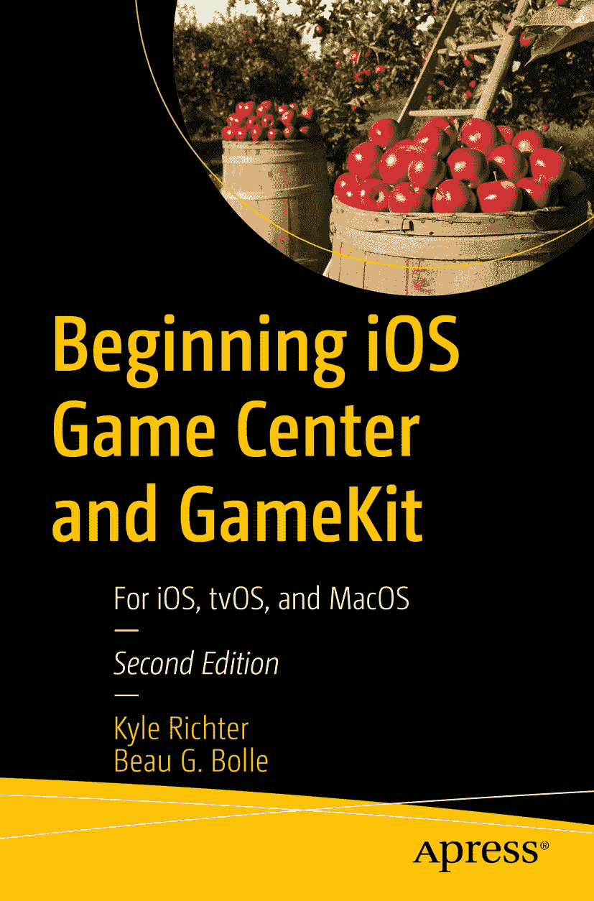

ISBN 978-1-4842-7755-3 e-ISBN 978-1-4842-7756-0 [`doi.org/10.1007/978-1-4842-7756-0`](https://doi.org/10.1007/978-1-4842-7756-0) © Kyle Richter and Beau G. Bolle 2022 本作品受版权保护。所有权利，无论是整体还是部分，均由出版社独家授权，具体包括翻译、重印、重用插图、背诵、广播、以缩微胶卷或任何其他物理形式复制，以及信息存储与检索的传输、电子改编、计算机软件，或现有或日后开发的类似或不同方法。本出版物中使用的通用描述性名称、注册商标名称、商标、服务标志等，即使未作明确声明，也不意味着这些名称不受相关保护法和法规的约束，因此可自由使用。出版商、作者和编辑假定本书中的建议和信息在出版之日是真实准确的。出版商、作者或编辑均不对本书所含内容或可能存在的任何错误或遗漏提供明示或暗示的担保。出版商对已出版地图和机构隶属关系中的司法主张保持中立。

本 Apress 印记由注册公司 APress Media, LLC（Springer Nature 的一部分）出版。

注册公司地址为：美国纽约州纽约市纽约广场 1 号，邮编 10004。

*本书深情献给妻子伊丽莎白，她始终陪伴在我身边，对我的人生选择和决定（如承诺撰写更多书籍）给予了无尽的耐心与理解。*
——*凯尔·里克特*

*献给妻子黛博拉，感谢她始终支持我坚持下去，并忍受了无数小时的“橡皮鸭调试”。*
——*博·G·博尔*

