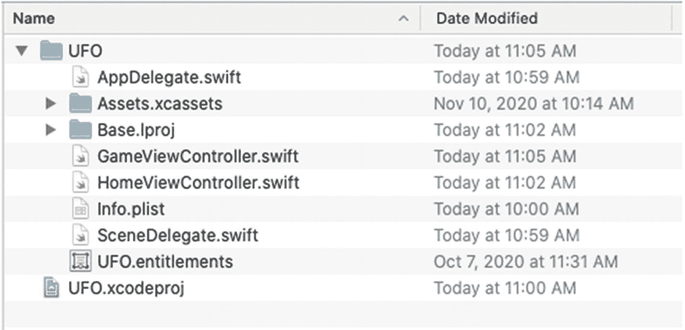
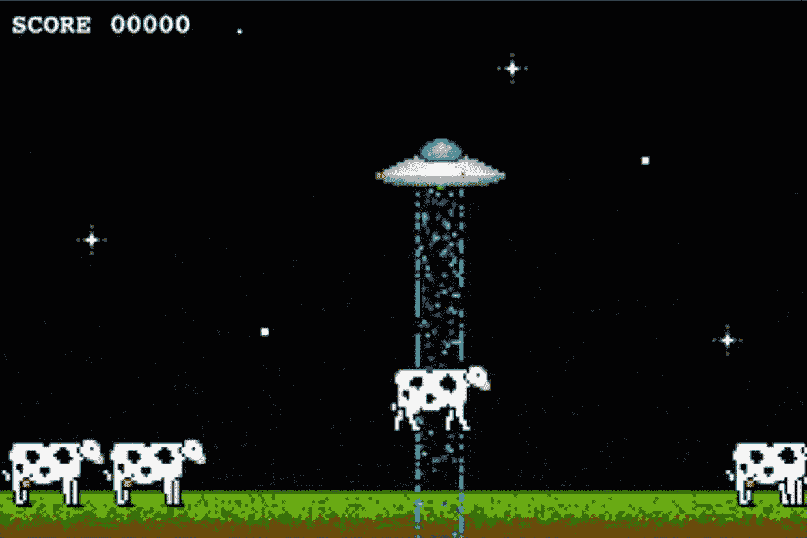
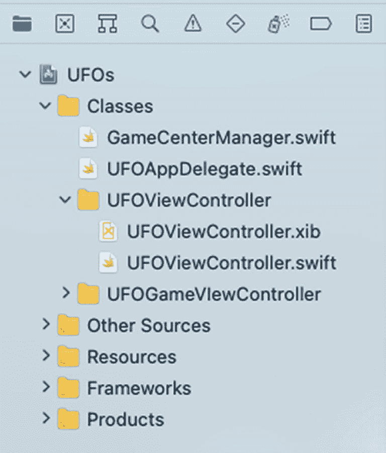
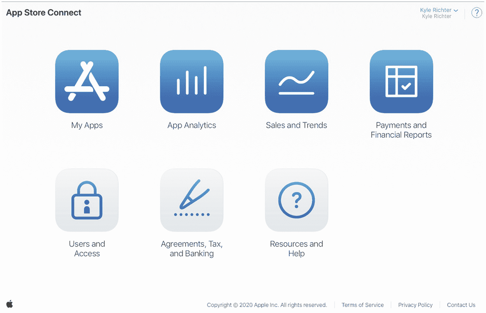
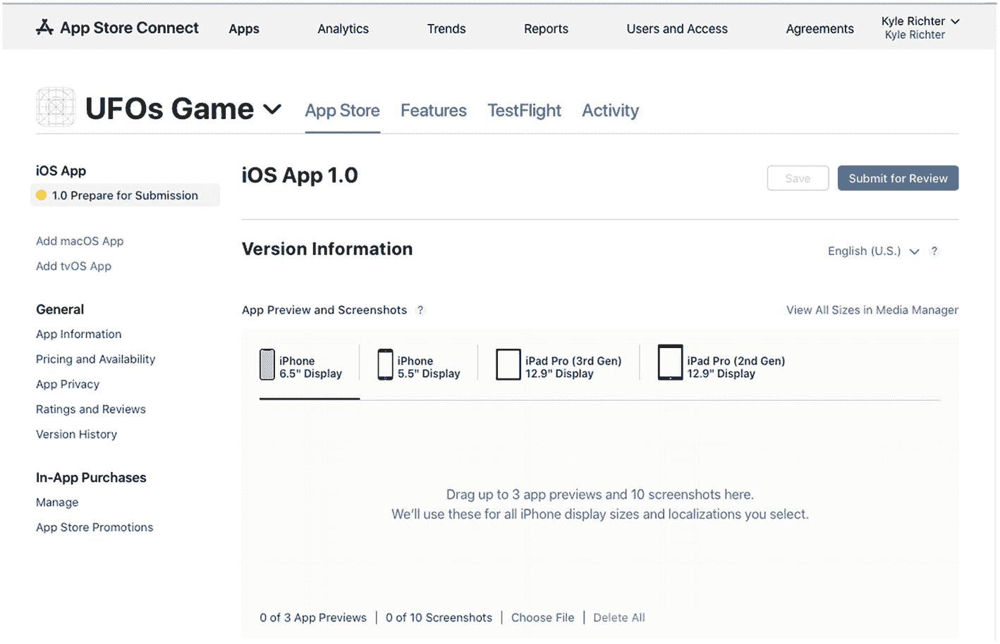

# GameKit 和 Game Center 入门

欢迎阅读《Beginning iOS Game Center and GameKit》！本书旨在引导您将 `GameKit` 和 `Game Center` 功能集成到您的 iOS、Mac 或 Apple TV 应用和游戏中。本书围绕一个为 iOS 构建的示例游戏展开，您将在本章稍后部分接触到它。您会发现，大部分说明在各个平台间是通用的；但是，如果存在 iOS 之外的特定平台行为，我们会在文中注明。

如果您已有想要添加 `GameKit` 或 `Game Center` 功能的现有应用或游戏，您可以用该项目进行替换；在接下来的章节中，我将尽量采用最通用的方法，以便于您轻松实现相关功能。

本书旨在作为一本参考书和资源，帮助您为 iOS、Mac 或 Apple TV 应用添加社交游戏功能。虽然我建议您从头到尾通读本书，以获得对所涵盖技术最全面的了解，但这并非强制要求。每一章都是独立的。您可以跳转到与您项目相关的章节，并快速将其内容应用到您的软件中。

当 Apple 于 2009 年 3 月 17 日发布 `GameKit` 时，它被作为 iOS 设备上通常令人沮丧的游戏风格网络问题的解决方案，而在此之前，这个问题至少可以说是充满挑战的。`GameKit` 增加了对蓝牙和局域网 (LAN) 以及语音聊天服务的支持。不久之后，Apple 宣布在 iOS 4.0 中为 `GameKit` 添加了 `Game Center`。借助新的 SDK，Apple 带来了大量新功能——其中 `Game Center` 对本书的范畴最为重要。`Game Center` 在很长一段时间内没有重大更新，直到 2020 年 Apple 对 `GameKit` 和 `Game Center` 框架进行了重大升级。

社区中的开发者往往认为 `Game Center` 是一套独立的应用程序编程接口 (API)。这是一种误解。`Game Center` 是 `GameKit` 不可或缺的一部分。两者相辅相成，携手合作。在接下来的章节中，您将看到大量证据。就本书而言，我们将把这两项技术统称为 `GameKit`；但在提及 Game Center 特有功能时，我们仍可能使用其正式名称。

> **注意**  
> 尽管名称如此，`GameKit` 和 `Game Center` 并非仅为游戏而设计。Apple 过去曾严厉打击在非游戏应用中使用 `Game Center` 技术的行为。一些开发者收到过类似下面这样的 Apple 拒绝邮件：  
> *“Game Center 的预期用途是补充游戏应用或应用内的游戏功能。然而，我们注意到您的应用不包含任何游戏玩法或游戏特性。”*  
> 这些拒绝似乎主要针对在非游戏应用中使用排行榜和成就系统的情况。您可以很容易地争辩说，在您的应用中加入排行榜或成就系统增加了一个游戏化元素。如果您碰巧收到这样的拒绝，您仍然有申诉的机会。据我所知，没有任何因在任何应用中使用 `GameKit` 网络功能而被拒绝的实例。然而，在处理 App Store 审核指南时，您应始终查阅 Apple 提供的最新开发者指南。


## GameKit 概述

`GameKit` 可划分为三个独立的功能模块：网络、Game Center 和语音聊天。尽管这些服务共同协作以创造一个无缝集成的环境，但逐一审视每个模块会更有帮助。虽然各模块之间可能存在重叠，例如网络与 Game Center 部分，但 `GameKit` 的每个模块都可归结为一个主要类别。尽管 API 中并未对这些模块进行区分，但在学习 `GameKit` 开发时，将它们分开来思考或许会对你有所帮助。

### 网络

`GameKit` 网络功能允许你在“对等节点”之间发送和接收数据。`GameKit` 网络还提供了一套连接协议，用于连接在你的 Wi-Fi 网络上或通过蓝牙在本地发现的客户端。

`GameKit` 支持在两台 iOS 设备之间创建临时的蓝牙或本地无线网络；Game Center 匹配功能也支持通过互联网进行网络连接，最多可同时支持 16 名玩家。`GameKit` 网络功能在第 6、7 和 8 章中介绍。Game Center 匹配功能在第 5 章中介绍。

### Game Center

Game Center 本身处理身份验证、好友、排行榜、成就和邀请。从某种意义上说，Game Center 提供了与社交互动相关的服务器服务。也可以认为 Game Center 包含了自己的网络系统。虽然确实如此，但我们将在前文关于网络的章节中对这一主题进行分组讨论，该部分在第 5 章中有详细阐述。Game Center 技术，例如排行榜和成就，将在第 3 和 4 章中介绍。

> **注意**  
> 在各种印刷品和参考文档中，“Game Center”有时既指 Game Center API 的集合，也指 Game Center 应用本身。

### 语音聊天

苹果公司常称之为“Game Voice”的功能，允许任何应用（不仅仅是游戏）通过网络连接提供语音通信，通常称为 VOIP。这些 API 负责处理用户音频输入的监听与回放，并提供处理连接、通信、错误和断连的服务。该技术将在第 10 章中讨论。

## 示例游戏：UFOs

根据我的经验，大多数开发者都属于“体验型”学习者。这意味着他们通过动手实践而非观看或聆听来学习效果最佳。当我最初学习编程时，会从代码杂志中逐行将源代码抄写到 Commodore 64 上。我相信，正是这种逐行输入代码的亲身经历让知识得以牢固掌握。而听讲座或看别人写代码则让我难以记住大量信息。如果讲座和演示是我唯一的学习方式，我简直无法想象自己能坚持走这条职业道路。本书正是为其他体验型学习者量身打造的。

在深入 `GameKit` 之前，我们首先要处理的是附带的示例游戏。这个我们称之为“UFOs”的游戏，设计目标并非成为一款获奖连连、令人上瘾的游戏，而是简单到可以被视为任何一个通用项目。我已竭尽全力将代码量控制在 300 行以内。尽管游戏本身很简单，但我认为每位读者都能像自己亲手编写的那样理解这些代码至关重要。这样，作为读者，你就能从项目本身抽离出来，专注于 `GameKit` 特有的信息。我们将从体验游戏开始，然后查看源代码。

> **注意**  
> 所有章节的源代码以及示例项目均可从 [`www.apress.com`](http://www.apress.com) 获取。

### UFOs：理解游戏

首先，你需要打开从 [apress.​com](http://apress.com) 下载的基础项目。图 1-1 展示了项目的文件结构。我们快速运行一下游戏，看看它的样子。



图 1-1：Finder 中显示的 UFO 示例项目的文件结构

要运行游戏，请从“产品”菜单栏选择“运行”。游戏将启动并显示一个通用屏幕，上面只有一个标有“Play”的按钮。继续操作，选择“Play”按钮。你将进入游戏画面，如图 1-2 所示；此画面可能根据你选择的测试设备略有不同。

游戏目标既典型又简单：上下或左右倾斜设备，让你的飞船在屏幕上移动。当飞船定位到一头奶牛上方后，点击屏幕任意位置并按住，直到奶牛被劫持。每劫持一头奶牛，你将获得一分。和所有最棒的游戏一样，这款游戏没有结局，也无法“获胜”。每次你劫持一头奶牛，都会有一头新奶牛生成。



图 1-2：UFOs 示例项目的游戏画面视图

现在你已经了解了游戏玩法，可以看看实现这一切的源代码了。

### UFOs：检查源代码

在你的文件组树中，你会看到我们将要使用的四个类文件：`AppDelegate.swift`、`SceneDelegate.swift`、`GameViewController.swift` 和 `HomeViewController.swift`。文件组树如图 1-3 所示。你还会注意到一个包含项目用户界面元素的 `Main.storyboard` 文件。



图 1-3：从 Xcode 中看到的示例项目的文件组树结构

首先，查看 `AppDelegate.swift` 和 `SceneDelegate.swift` 文件。这些文件应该会让你联想到其他 Swift 开发工作。它们只不过是基础的 `UIApplicationDelegate` 和 `UIWindowSceneDelegate` 子类。如果你需要熟悉这里的代码，可以查看 Apple 为新项目提供的示例代码。

下一组文件也相对简单：查看 `UFOViewController.h` 和 `UFOViewController.m`。这些是与着陆屏或主屏幕关联的类。目前这里只有一个“Play”按钮，但随着本书的深入，我们将在此视图中添加排行榜、成就和多人游戏控件。

最后，我们将处理 `UFOGameViewController.m`。这是驱动所有游戏玩法的主类，并且大部分 `GameKit` 功能都将添加到这里。


#### 设置加速计代理

我们的示例项目需要做的第一件事是设置自身以检测加速计运动；游戏将利用这种运动来移动玩家的飞船。相关代码位于 `GameViewController` 文件的顶部。请看以下代码片段，下面对其进行详细说明：

```
private let motionManager = CMMotionManager()
override func viewDidLoad() {
super.viewDidLoad()
motionManager.accelerometerUpdateInterval = 0.05
motionManager.startAccelerometerUpdates(to: OperationQueue.current!) { (accelerometerData, error) in
self.motionOccurred(with: accelerometerData ?? CMAccelerometerData())
if error != nil {
print(error.debugDescription)
}
}
}
```

我们做的第一件事是将 `motionManager` 设置为 `CMMotionManager()`；这为我们提供了一个方便的主 `CMMotionManager` 引用。接下来，重写 `viewDidLoad` 并添加代码，将加速计设置为每 1/20 秒检测一次新的运动数据，然后使用更新后的数据调用 `motionOccurred`，我们稍后将讨论这个问题。如果有任何错误，它们将被打印到控制台。

接下来，看一下附加的变量定义。让我们将其分解为几个部分，以准确理解这里发生了什么：

```
private var movementSpeed = 15.0
private var accelerometerDamp = 0.3
private var accelerometer0Angle = 0.6
```

这里我们设置了一些类变量，用于保存我们开始处理加速计输入时所需的一些数据。当我们开始处理飞船移动时，我们将再次使用这些变量。目前，你无需完全理解它们的作用，只需知道它们已被设置即可。

#### 将玩家绘制到视图

接下来，我们需要创建“玩家”。在类文件的顶部，你会找到 `playerImageView` 的定义，其中首先定义了共享内容和初始起始位置。

```
private let myPlayerImageView = UIImageView(frame: CGRect(x: 100, y: 70, width: 80, height: 34))
```

将注意力转回 `viewDidLoad` 函数，你会发现以下附加代码片段：

```
myPlayerImageView.animationDuration = 0.75
myPlayerImageView.animationImages = [
UIImage(named: "Saucer1")!,
UIImage(named: "Saucer2")!
]
myPlayerImageView.startAnimating()
view.addSubview(myPlayerImageView)
```

接下来的四行代码是 `UIImageView` 中鲜为人知但非常有用的部分。我们正在设置一组图像，`UIImageView` 将循环显示这些图像。在这个例子中，我们设置了两个图像来回切换。我们还指定了完整动画所需的时间（这里设为 3/4 秒）以及动画需要重复的次数。设置好动画细节后，我们在 `myPlayerImageView` 这个 `UIImageView` 上调用 `startAnimating()`。然后，我们只需将 `UIImageView` 子视图添加到主视图中即可。现在，我们有了一个正在动画显示的玩家！

#### 设置奶牛、光束和分数

我们需要初始化一些对象，并设置分数标签。

```
private var cows: [UIImageView] = []
private let tractorBeamImageView = UIImageView()
private var score = 0
```

变量设置好之后，我们可以再次将注意力转向 `viewDidLoad` 函数，并将刚刚定义的分数变量设置为在界面文件中创建的标签。

```
scoreLabel.text = formatted(score: score)
for _ in 0..<7 { spawnCow() }
updateCowPaths()
```

在 `viewDidLoad` 函数中，我们需要做的最后一件事是创建一些奶牛并放置在屏幕上。我创建了一个辅助函数来生成这些奶牛。每次调用它时，都会创建一个新奶牛并将其放置在屏幕上。我们将在本节稍后部分讨论这个问题。我们还调用了另一个辅助函数来更新奶牛的行走路径。同样，稍后我们将更详细地查看这个函数。

#### 添加玩家移动

这样就处理完了所有的初始化和设置代码。现在我们可以进入游戏中更令人兴奋的部分了。首先，我们查看用户输入和操作，然后是游戏玩法功能。

```
func movePlayer(_ vertical: Double, _ horizontal: Double) {
var vertical = vertical
var horizontal = horizontal
vertical += accelerometer0Angle
if vertical > 0.50 {
vertical = 0.50
} else if vertical < -0.50 {
vertical = -0.50
}
if horizontal > 0.50 {
horizontal = 0.50
} else if horizontal < -0.50 {
horizontal = -0.50
}
if (vertical < 0 && (playerFrame?.origin.y ?? 0.0) < 500) || (vertical > 0 && (playerFrame?.origin.y ?? 0.0) > 20) {
playerFrame?.origin.y -= CGFloat(vertical * movementSpeed)
}
if (horizontal < 0 && (playerFrame?.origin.x ?? 0.0) < 300) || (horizontal > 0 && (playerFrame?.origin.x ?? 0.0) > 0) {
playerFrame?.origin.x -= CGFloat(horizontal * movementSpeed)
}
myPlayerImageView?.frame = playerFrame ?? CGRect.zero
}
```

上面的函数比初看起来要简单得多。第一段代码设置了我们的最大速度；我们不想让玩家在屏幕上飞得太快。下一段代码确保用户无法将他们的 UFO 移出屏幕。确认完这两个安全限制后，我们更新玩家的框架并移动 UFO。


#### 监听触摸事件

我们需要关注的游戏下一个方面是触摸事件。我们将通过触摸来启动和控制牵引光束。第一步是重写 `touchesBegan` 事件。

```
override func touchesBegan(_ touches: Set, with event: UIEvent?) {
currentAbductee = nil
tractorBeamOn = true
if gameIsMultiplayer {
gcManager?.sendStringToAllPeers("$beginTractorBeam", reliable: true)
}
tractorBeamImageView?.frame = CGRect(x: (myPlayerImageView?.frame.origin.x ?? 0.0) + 25, y: (myPlayerImageView?.frame.origin.y ?? 0.0) + 10, width: 28, height: 318)
tractorBeamImageView?.animationDuration = 0.5
tractorBeamImageView?.animationRepeatCount = 99999
let imageArray = [UIImage(named: "Tractor1.png"), UIImage(named: "Tractor2.png")]
tractorBeamImageView?.animationImages = imageArray.compactMap { $0 }
tractorBeamImageView?.startAnimating()
if let tractorBeamImageView = tractorBeamImageView {
view.insertSubview(tractorBeamImageView, at: 4)
}
let cowImageView = hitTest()
if let cowImageView = cowImageView {
currentAbductee = cowImageView
abductCow(cowImageView)
}
}
```

我们首先清除指向当前被绑架奶牛的指针。这个值应该已经是 `nil`，但最好保持严谨。然后我们将一个表示牵引光束是否开启的布尔值设为 true/yes。此时，我们需要绘制牵引光束。为此，我们将 `tractorBeamImageView` 的 frame 设置为玩家 UFO 当前所在的位置。我们将使用本节前面演示过的相同动画快捷方式来为牵引光束制作动画。接着，我们将牵引光束的 `imageView` 添加到主视图中；这里使用 `insertSubview` 函数来确保牵引光束位于奶牛层下方，但位于背景层上方。然后我们调用 `hitTest` 函数，该函数将在本章稍后部分介绍。如果 `hitTest` 返回了结果，我们就调用 `abductCow` 函数。

在继续讲解 `hitTest` 和 `abductCow` 函数之前，我们必须先完成触摸事件的处理。此时我们关心的另一个触摸事件是 `touchesEnded` 委托调用。当用户将手指从屏幕上移开时，我们需要将牵引光束从视图中移除，并让用户恢复移动。

```
override func touchesEnded(_ touches: Set, with event: UIEvent?) {
tractorBeamOn = false
if gameIsMultiplayer {
gcManager?.sendStringToAllPeers("$endTractorBeam", reliable: true)
}
tractorBeamImageView?.removeFromSuperview()
if let currentAbductee = currentAbductee {
UIView.animate(
withDuration: 1.0,
delay: 0,
options: [.curveEaseIn, .beginFromCurrentState],
animations: {
var frame = currentAbductee.frame
frame.origin.y = 260
frame.origin.x = (self.myPlayerImageView?.frame.origin.x ?? 0.0) + 15
currentAbductee.frame = frame
}
)
}
currentAbductee = nil
}
```

将 `tractorBeamOn` 的状态变量设置为 `NO`。然后我们可以将牵引光束图像从视图中移除。接下来的代码段是将奶牛放回地面（如果它正悬在半空中）。为此，我们只需启动一个简单的动画，将奶牛送回地面。最后需要做的是将 `currentAbductee` 指针重置为 `nil`。

#### 生成与移动奶牛

正如本章前面所述，我们还有一个便捷函数用于生成新奶牛。这个函数在 `viewDidLoad` 中被调用，用于为玩家提供一定数量的基础奶牛进行绑架尝试；同时，每当我们完成一次绑架操作后也会调用它。

```
func spawnCow() {
let x = Int(arc4random() % 480)
let cowImageView = UIImageView(frame: CGRect(x: CGFloat(x), y: 260, width: 64, height: 42))
cowImageView.image = UIImage(named: "Cow1.png")
view.addSubview(cowImageView)
cowArray?.append(cowImageView)
}
```

**提示**

`Arc4Random()` 会像 `rand()` 或 `random()` 一样返回一个随机数，但如果是第一次调用，它会自动进行种子初始化。

我们创建一个代表奶牛的新 `imageView`。然后使用 `arc4Random()` 函数生成一个随机的 x 坐标位置。设置奶牛将使用的图像，并将其添加到主视图中。最后需要将 `imageView` 添加到我们的奶牛数组中。这个数组将用于碰撞检测以及后续更新移动路径。

虽然 UFO 游戏的设计并非极具挑战性，但我们确实希望在玩法上增加一些难度元素。以下函数将使我们的奶牛在屏幕上随机游荡：

```
func updateCowPaths() {
for x in 0..<cowArray?.count ?? 0 {
let tempCow = cowArray?[x] as? UIImageView
guard let currentX = tempCow?.frame.origin.x else { return }
var newX = currentX + CGFloat(arc4random() % 100) - 50
if newX > 480 {
newX = 480
}
if newX < 0 {
newX = 0
}
if tempCow != currentAbductee {
UIView.animate(
withDuration: 3.0,
delay: 0,
options: [.curveLinear],
animations: {
tempCow?.frame = CGRect(x: CGFloat(newX), y: 260, width: 64, height: 42)
}
)
}
tempCow?.animationDuration = 0.75
tempCow?.animationRepeatCount = 99999
//翻转奶牛
if newX < currentX {
let flippedCowImageArray = [UIImage(named: "Cow1Reversed.png"), UIImage(named: "Cow2Reversed.png"), UIImage(named: "Cow3Reversed.png")]
tempCow?.animationImages = flippedCowImageArray.compactMap { $0 }
} else {
let cowImageArray = [UIImage(named: "Cow1.png"), UIImage(named: "Cow2.png"), UIImage(named: "Cow3.png")]
tempCow?.animationImages = cowImageArray.compactMap { $0 }
}
tempCow?.startAnimating()
}
}
//每 3 秒改变一次奶牛的路径
DispatchQueue.main.asyncAfter(deadline: .now() + 3, execute: {
self.updateCowPaths()
})
}
```

我们需要遍历奶牛对象数组。我们在上述函数的第一行完成了这个操作。然后为奶牛随机生成一个新的 x 坐标。通过快速检查确保我们不会指示奶牛走出屏幕。然后提交动画。我们还需要处理奶牛的方向变化。

**注意**

我们用来处理该事件的代码并不是翻转图像最高效的方式，但如果你是这类游戏的新手，它是最容易学习的。

正如之前对牵引光束和 UFO 图像所做的处理一样，我们将添加一些动画帧，使奶牛走得更逼真。最后要做的是调用带有三秒延迟的 `performSelector`。这将每三秒更新一次奶牛的路径，增加一种更真实的随机移动外观。


#### 对 `UIImage` 执行命中检测

在考虑如何设置绑架奶牛之前，我们需要先完成一些准备工作。首先，我们必须实现一个 `hitTest` 函数，该函数此前会在本节前面讨论的 `touchesBegan` 事件中被调用。

```
func hitTest() -> UIImageView? {
    if !tractorBeamOn {
        return nil
    }
    for x in 0..<(cowArray?.count ?? 0) {
        let tempCow = cowArray?[x] as? UIImageView
        let cowLayer = tempCow?.layer.presentation()
        let cowFrame = cowLayer?.frame
        if cowFrame?.intersects(tractorBeamImageView?.frame ?? CGRect.zero) ?? false {
            tempCow?.frame = cowLayer?.frame ?? CGRect.zero
            tempCow?.layer.removeAllAnimations()
            if gameIsMultiplayer {
                gcManager?.sendStringToAllPeers(String(format: "$abductCowAtIndex:%i", x), reliable: true)
            }
            return tempCow
        }
    }
    return nil
}
```

第一行代码是另一项合理性检查，确保我们在牵引光束未打开时不会调用 `hitTest` 函数。确认需要进行碰撞检测后，我们遍历奶牛对象数组。由于奶牛正在播放动画，我们不能依赖 `frame` 中的数据，因为它显示的是奶牛最终会移动到的位置，而非其当前位置。

要确定奶牛当前的位置，我们需要获取 `presentationLayer`。Core Graphics 提供了一个用于测试两个 `GCRects` 是否相交的有用函数，这正是我们要使用的。如果命中了某头奶牛，我们就返回该对象。如果遍历完整个循环仍未通过命中检测，则返回 `nil`，这表示牵引光束没有击中任何奶牛。

> **提示：** 可以在任何 `CALayer` 上调用 `presentationLayer`，以提供对正在动画过程中图层当前值的最佳估算。虽然它不能绝对保证动画的当前位置，但为我们的游戏提供了足够好的解决方案。

#### 绑架奶牛

在我们的 `touchesBegan` 函数中，我们测试了 `hitTest` 是否返回了一头奶牛。如果是，我们就调用 `abductCow` 函数，并将返回的对象作为参数传入。现在，我们来仔细看看这个函数。

```
func abductCow(_ cowImageView: UIImageView?) {
    UIView.animate(
        withDuration: 4.0,
        delay: 0,
        options: [.curveEaseIn, .beginFromCurrentState],
        animations: {
            var frame = cowImageView?.frame
            frame?.origin.y = self.myPlayerImageView?.frame.origin.y ?? 0.0
            cowImageView?.frame = frame ?? CGRect.zero
        },
        completion: finishAbducting
    )
}
```

我们在奶牛对象（即一个 `imageView`）上启动动画事件。我们还设置了一个 `completion handler`（完成处理程序），它将在动画完成后被调用。我们将奶牛的 Y 轴新坐标设置为 UFO 当前的 Y 轴坐标，然后开始播放动画。

动画停止后，我们会收到 `finishAbducting` 的回调。这使我们能够增加分数、清理绑架代码，并生成一头新奶牛。

```
func finishAbducting(_ finished: Bool) {
    if currentAbductee == nil || !tractorBeamOn {
        return
    }
    cowArray = cowArray?.filter({ ($0) as AnyObject !== (currentAbductee) as AnyObject })
    tractorBeamImageView?.removeFromSuperview()
    tractorBeamOn = false
    score += 1
    scoreLabel.text = String(format: "SCORE %05.0f", score)
    currentAbductee?.layer.removeAllAnimations()
    currentAbductee?.removeFromSuperview()
    currentAbductee = nil
    spawnCow()
}
```

在函数开头，我们检查牵引光束是否仍然打开并且我们是否还有一个被绑架对象，这同样是出于额外的合理性和错误检查。正如我们在用户从屏幕上松开手指时所做的那样，我们也需要从视图中移除牵引光束图像，并正确设置状态变量。每绑架一头奶牛，我们就奖励用户 1 分，并相应地更新 `scoreLabel`。我们清理旧奶牛图像，并将其设置回 `nil`。然后生成一头新奶牛来替换被绑架的奶牛。

#### 在 App Store Connect 中配置 Game Center

在你的 Swift 应用程序或游戏能够访问任何 Game Center 功能之前，需要先在 App Store Connect（曾用名 iTunes Connect）中进行配置。Apple 使用这个门户网站作为其主要的应用配置来源。诸如应用内购买 (IAP)、TestFlight 和 Game Center 等功能都需要 App Store Connect 配置。

> **注意：** 你仍然可以在不为应用设置 Game Center 的情况下，使用任何独立的 GameKit 功能。有关 GameKit 独立功能的更多信息，请参见第 6、7、8 和 10 章。

#### App Store Connect 入门

如果你从未向 App Store 上传过应用，可能对 App Store Connect 门户不太熟悉。然而，如果你之前使用过 App Store Connect，可以跳到下一节，因为这里的内容对你来说是复习。

App Store Connect 是一个网页门户，可以通过任何网页浏览器在 [`https://appstoreconnect.apple.com`](https://appstoreconnect.apple.com) 访问。你需要使用已注册为开发者的现有 AppleID 来访问该门户。当你想要在 App Store 上架销售新应用，或对现有应用进行任何修改（如价格或描述）时，你也将使用这个相同的 Web 应用程序。App Store Connect 的登录页面视图如图 1-4 所示。


*图 1-4 – 2020 年 11 月拍摄的 App Store Connect 界面视图*

登录 App Store Connect 后，你会看到大量的选项。其中最重要的是设置你的合同、税务和银行信息。虽然这些要求本身与 Game Center 无关，但最好尽早处理它们。

Apple 处理这些信息可能需要数周时间，因此请尽快提交。在这些信息被处理并批准之前，你将无法在 App Store 上发布软件。完成此部分下的所有要求信息后，你就可以专注于应用开发本身了。

> **注意：** 如果你计划仅发布免费应用，则无需完成付费应用合同。但是，如果你将来计划发布任何付费软件，应尽快完成这些合同的填写。

在访问任何 Game Center 特定信息之前，你需要创建一个新的应用（或使用现有应用）。这是一个直接在 App Store Connect 中引导你完成的简单流程。你从“我的 App”部分开始；在那里，你会在网页标题左上角附近找到一个小加号按钮。其余操作应该相当直观易懂。

如果你尚未准备好上传应用，可以在此处创建占位数据，以便访问 Game Center 门户。一旦在 App Store Connect 中创建了应用，你就可以开始配置 Game Center 的特定信息了。

> **警告：** 如果你创建了一个应用但在 90 天内未能上传一个发布版本，Apple 将删除该应用信息，并限制你将来使用相同名称创建新应用。这是为了防止有人“域名抢注”应用名称。


#### 在 App Store Connect 中配置 Game Center

在 App Store Connect 中选定应用后，你将看到类似本小节后文图 1-5 截图的视图。将注意力转向导航栏时，你会注意到 **Features**（功能）选项；这里就是配置 Game Center 项目的地方。

如果你之前熟悉应用内购买（IAP）的配置流程，那么这个界面会让你感到非常熟悉。配置 IAP 的流程与配置 Game Center 类似。

进入应用的 **Features** 区域后，你将可以选择添加挑战、新的排行榜或成就。我们将在后续章节中更详细地介绍这些选项（第 3 章介绍排行榜，第 4 章介绍成就）。目前，我们只需要确保应用已设置完毕，随时可以添加 Game Center 功能。



**图 1-5** — 新应用的 Game Center 门户初始视图

请务必在第一个标签页（新应用中的 "App Store"）的 **General App Information**（通用应用信息）下勾选 Game Center 功能，否则你的应用可能无法注册为已启用 Game Center 功能。

**提示：** 如果你的应用无法识别 Game Center，最可能的原因通常是以下两个常见问题之一。请确保你的应用使用的 Bundle ID 与应用信息页面显示的 Bundle ID 一致。第二个问题可能是你等待的时间不够长。在 App Store Connect 中对 Game Center 做出更改，到应用检测到这些更改之间，可能存在长达 30 分钟的延迟。

### 本章小结

现在，你应该对 GameKit 和 Game Center 的功能有了基本了解，同时也深入理解了本书后续内容中将使用的示例项目。此外，你现在应该能够轻松地在 App Store Connect 中创建一个新应用，并为其配置 Game Center 功能。

在接下来的章节中，你将学习如何将 Game Center 和 GameKit 的全部功能集成到应用中。在下一章中，你将学习如何将 Game Center 整合到项目中。

---

