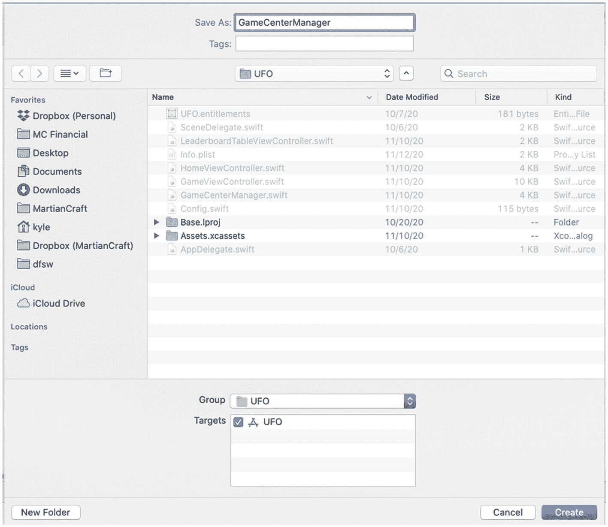
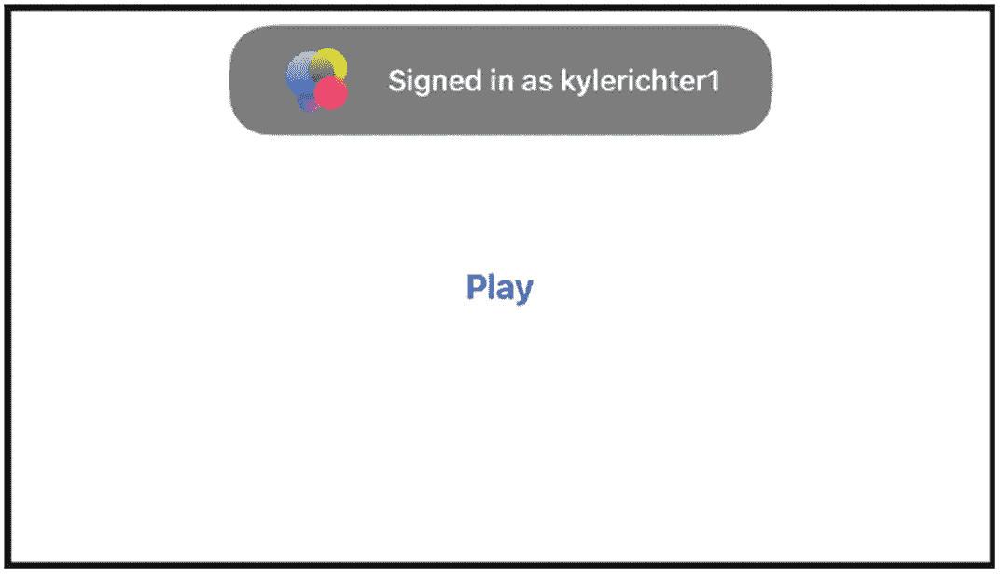

# 2. Game Center：配置与入门

在上一章中，我们学习了如何在 App Store Connect 中配置 Game Center，并开始使用示例项目 *UFOs*。在本章中，我们将讨论如何将 Game Center 集成到我们的应用中，并动手编写一些代码。

你将学习如何检测 Game Center 兼容性、探索沙盒的限制、验证本地玩家、处理会话以及检索好友列表。你还将创建 `GameCenterManager` 类，我们将在本书剩余部分使用并扩展这个类。

## 创建 Game Center 管理器类

在 Game Center 刚发布时，实施功能前测试兼容性非常重要；然而，多年来 Game Center 已广泛应用于我们所有平台，除非你计划支持非常旧的设备，否则不再需要检查设备是否运行该功能。在实现 Game Center 功能的过程中，要执行此检查，首先需要创建新的 `GameCenterManager` 类。在本书剩余部分，我们将使用这个类将 Game Center 功能集中在一个易于访问的类中。这个类将包含所有 Game Center 特定的代码和回调，并且可以轻松地在你的所有应用中共享和重用。

首先，在 Xcode 中创建一个新的 Swift 文件；将新类命名为 `GameCenterManager`，如图 2-1 所示。同时，你需要将 `GameKit.framework` 添加到项目中，并在新创建的 `GameCenterManager` 类顶部添加 `import GameKit` 代码行。



**图 2-1** — 创建 `GameCenterManager` 类

## 通过 Game Center 进行身份验证

在使用 Game Center 做任何操作之前，首先需要验证用户身份。使用 Game Center 进行身份验证的用户将始终被称为*本地玩家*，并由 `GKLocalPlayer` 类表示。如果在调用其他 Game Center 功能之前未能验证本地用户，将导致错误和其他未定义行为。

Apple 建议在应用中尽早通过 Game Center 进行身份验证。在用户需要访问任何 Game Center 行为之前进行身份验证的主要原因是，确保用户在执行 Game Center 操作时无需等待网络回调来验证身份。提前验证还可以确保用户在游戏过程中不会突然弹出登录提示，从而影响用户体验。在用户可能需要之前进行身份验证还有其他好处，我们将在后续章节中探讨，例如重新提交之前未能成功提交的高分。

### 修改 GameCenterManager 类

处理身份验证需要向 `GameCenterManager` 类添加额外代码。这通过扩展 `GameCenterManager` 结构体来实现。第一步是定义一个处理身份验证的新函数；我们将其命名为 `authenticateLocalUser`。完成处理程序被定义为调用视图控制器；这将允许我们向主游戏报告错误和成功。接下来，进行一个快速检查以确保本地玩家身份验证处理程序尚未定义，然后将其定义为调用视图控制器。

```swift
class GameCenterManager: UIViewController, GKMatchmakerViewControllerDelegate, GKLocalPlayerListener, UIAlertViewDelegate {
    func authenticateLocalUser(_ controller: UIViewController?) {
        let localPlayer = GKLocalPlayer.local
        if localPlayer.isAuthenticated == false {
            localPlayer.authenticateHandler = { [weak self] viewController, error in
                guard let self = self else {
                    return
                }
                if let viewController = viewController {
                    controller?.present(viewController, animated: true)
                }
                if localPlayer.isAuthenticated {
                    localPlayer.unregisterListener(self)
                    self.submitAllSavedScores()
                    self.submitAllSavedAchievements()
                    DispatchQueue.main.asyncAfter(deadline: .now() + 3) { [weak self] in
                        self?.populateAchievementCache(nil)
                    }
                    GKLocalPlayer.local.register(self)
                }
                self.playerDelegate?.processGameCenterAuthentication(error)
            }
        }
    }
}
```

**提示：** 别忘记导入 `GameKit` 框架，否则 `GKLocalPlayer` 将无法被识别。


### 从 UFOViewController 进行身份验证

前面的函数将作为通过 Game Center 进行身份验证的辅助函数。虽然 Game Center Manager 代码已配置为让玩家登录，但你的应用需要调用这个新函数。你需要将注意力转回 `HomeViewController`，这是游戏启动后、任何游戏开始前所显示的视图控制器。可以将以下代码添加到 `viewDidLoad` 函数中：

```
func authenticateLocalUser(_ controller: UIViewController?) {
let localPlayer = GKLocalPlayer.local
if localPlayer.isAuthenticated == false {
localPlayer.authenticateHandler = { [weak self] viewController, error in
guard let self = self else {
return
}
if let viewController = viewController {
controller?.present(viewController, animated: true)
}
if localPlayer.isAuthenticated {
localPlayer.unregisterListener(self)
self.submitAllSavedScores()
self.submitAllSavedAchievements()
DispatchQueue.main.asyncAfter(deadline: .now() + 3) { [weak self] in
self?.populateAchievementCache(nil)
}
GKLocalPlayer.local.register(self)
}
self.playerDelegate?.processGameCenterAuthentication(error)
}
}
}
```

第一行代码调用了 Game Center Manager 中的 `authenticateLocalUser` 函数。之后，在显示登录视图控制器之前，会执行一次错误检查。如果遇到错误，我们会向用户显示一个警告窗口，告知他们错误信息。如果没有错误，则会显示 Game Center 登录界面。

Game Center 会在此处处理所需的登录视图、身份验证以及任何账户创建流程。然而，我们确实需要关注身份验证完成处理程序，以便捕获身份验证过程中遇到的任何错误。

> **注意**
> 如果你在某个应用内取消 Game Center 登录三次或更多次，那么在前往 `GameCenter.app` 并登录之前，你将无法再从该应用登录。这是一种未记录的行为，如果你不清楚自己在查找什么，追踪起来会非常麻烦。此外，如果你发现即使在 `GameCenter.app` 中也无法登录，可以通过重置模拟器或恢复设备来解决这些问题。你的应用用户很少会遇到这些问题，但作为开发者，频繁的调试和错误测试很可能会让你陷入意料之外的*行为状态*。

> **提示**
> 如果遇到“Game Center 无法识别此游戏”的错误，请确保检查你的 bundle identifier，并且它与你在 App Store Connect 中设置的应用相匹配。

这里有必要花点时间讨论一下线程安全。线程安全可能是一个你非常熟悉的术语，也可能是在我们的资料中简要提到过的概念，甚至对你来说可能是一个全新的术语。虽然深入探讨线程超出了本书的范围，但至少对其技术有一个初步的了解是很重要的。

当应用执行和运行时，它可以沿着单个线程按顺序执行，这意味着下一个任务必须等前一个任务完成后才能开始。这被称为同步执行。另一方面，你也可以让多个任务同时运行，并以它们各自完成时的顺序结束；这被称为异步执行。异步运行代码通常更快，因为现代设备拥有多个核心，每个核心可以同时处理一个或多个任务。然而，不知道任务何时结束、任务在其它任务之前完成，或者试图让两个任务同时修改同一个对象，都可能导致错误、意外行为，甚至难以追踪的竞争条件。

你可能已经注意到，在查阅示例代码、框架、方法或函数时，作者有时会注明某些内容是否是线程安全的、不是线程安全的，或者需要在主线程上执行。这些标注将帮助你做出明智的决策，以编写最优化的代码，并引导你避免错误和崩溃。作为一般经验法则，如果你正在更新界面元素，例如显示一个按钮、弹出警告或更改屏幕上某个内容的颜色，该操作必须在主线程上执行。

Game Center 和 GameKit 的许多功能都要求代码在主线程上执行。由于我们不是在后台线程上运行本地用户的身份验证，因此示例应用中不需要做任何更改。但是，如果你正在设计一个将从后台线程进行身份验证的应用，请确保通过主线程访问身份验证函数；虽然有很多方法可以实现这一点，但最简单（尽管可能不是最优）的方法如下：

```
DispatchQueue.main.async { [unowned self] in
self.yourCodeHere()
}
```

无论用户是否已登录 Game Center，你的应用都应继续正常运行，但在成功登录后，可能有必要设置一些标志或执行一些其他操作。

你可以将以下代码片段添加到 `authenticateLocalUser` 完成处理程序的末尾：

```
if (GKLocalPlayer.local.isAuthenticated)
{
print("成功通过身份验证")
}
```

现在，当你登录时，你应该会在控制台中看到“成功通过身份验证”的输出，以及图 2-2 中显示的图像（其中显示的是你的 Game Center 名称）。

> **注意**
> 为测试目的登录 Game Center 时，请始终创建一个新的 Apple ID。切勿使用现有的 Apple ID 从沙盒环境登录 Game Center。历史上有过用户账户在测试期间损坏的事例，处理主 Apple ID 上的损坏账户可能会非常麻烦。



**图 2-2** – 用户登录 Game Center 时将看到的标准欢迎回来消息

> **提示**
> 如果你在登录时遇到问题，请确保 `info.plist` 中的 bundle ID 与 App Store Connect 中启用了 Game Center 的 bundle ID 相匹配。有关在 App Store Connect 中配置 Game Center 的更多信息，请参阅第 1 章。

## 监听状态变化

由于多个应用在后台运行，并且取决于设备并排运行的情况，身份验证可能会变得稍微复杂一些，因为用户会通过不同的应用登录和注销。例如，当你的应用在后台时，用户可能会注销 Game Center，甚至以不同用户身份登录。因此，通过 `NSNotification` 系统监听本地用户的变化至关重要。

在 `UFOViewController.m` 的 `viewDidLoad` 中，紧接在验证 Game Center 是否可用的测试之后，添加以下代码片段：

```
NotificationCenter.default.addObserver(self, selector: #selector(localUserAuthenticationChanged(_:)), name: NSNotification.Name.GKPlayerAuthenticationDidChangeNotificationName, object: nil)
```

你还需要向 `UFOViewController` 添加一个新函数。每当玩家身份验证状态改变时，都会调用此函数。

```
@objc private func localUserAuthenticationChanged(_ notification: Notification) {
print("身份验证已更改: \(notification.object ?? "()")")
}
```

这个新函数将在身份验证更改时打印新的 `GKLocalPlayer` 的描述。你需要确定在你的应用中需要采取哪些特殊步骤来处理本地玩家的更改。

> **提示**
> 在发布应用之前，不要忘记测试用户切换，因为苹果会在审核阶段进行此项测试。


## 使用 `GKLocalPlayer`

`GKLocalPlayer` 在使用 Game Center 认证后始终存在且非空；此对象是用户的表示形式。你无需创建 `GKLocalPlayer` 的实例，这通过类方法 `localPlayer` 处理。`localPlayer` 单例是你与 `localPlayer` 交互的唯一方式。

`GKLocalPlayer` 具有以下几个相关属性：`authenticated`、`underage`、`isMultiplayerGamingRestricted` 和 `isPersonalizedCommunicationRestricted`。我们将在下一节中处理 `friends` 属性。我们在前几节的认证代码中已经使用过 `authenticated` 布尔值。

`underage`、`isMultiplayerGamingRestricted` 和 `isPersonalizedCommunicationRestricted` 属性可用于限制支持 Game Center 的应用程序中的内容。以下代码执行年龄限制检查；类似代码也可用于多人游戏或通信限制：

```
if (GKLocalPlayer.local.isUnderage)
{
print("用户年龄不足")
}
```

### Game Center 好友

当 Game Center 首次发布时，大量重点放在了构建和管理个人好友列表上。多年来，这已不再是苹果的重点关注对象。本地用户的 `friends` 属性已在 iOS 8 中弃用，并被 `loadFriendPlayers` 取代，而后者又在 iOS 10 中弃用。最终，`loadRecentPlayers` 被引入，并仍在 iOS 14 中可用。你可能会注意到此函数不包含“friends”一词；但文档提供了更多信息。以异步方式将可挑战的好友列表加载为 `GKPlayer` 数组。可挑战的玩家是好友等级为 1 和 2（即 FL1 和 FL2）的玩家。此函数在完成时调用 `completionHandler`。成功时 error 为 nil。设置应用中的 Game Center 控件仍然允许你添加好友。

虽然可玩好友在 Game Center 的新更新中仍然不被优先考虑，但获取已通过身份验证的本地用户的好友 `GKPlayer` 列表的功能仍然存在。

为了检索所有现有 Game Center 好友的列表，可以使用以下函数：

```
func retrieveFriendsList() {
if GKLocalPlayer.local.isAuthenticated == true {
GKLocalPlayer.local.loadRecentPlayers(completionHandler: { [weak self] recentPlayers, error in
DispatchQueue.main.async { [weak self] in
self?.playerDelegate?.friendsFinishedLoading(recentPlayers, error: error)
}
})
} else {
print("您必须先进行验证")
}
}
```

此方法将在数据完全检索后回调 `friendsFinishedLoading`。在以下代码片段中，你可以看到该函数可能的实现方式：

```
func friendsFinishedLoading(_ friends: [GKPlayer]?, error: Error?) {
if let error = error {
print("好友列表请求期间发生错误：\(error.localizedDescription)")
} else if let friends = friends {
playerDataLoaded(friends, error: error)
}
}
```

一旦数据从服务器加载完毕，将实现一个最终函数将数据打印到控制台。

```
func playerDataLoaded(_ players: [GKPlayer]?, error: Error?) {
if let error = error {
print("玩家查找期间发生错误：\(error.localizedDescription)")
} else {
print("加载的玩家：\(players ?? [])")
}
}
```

### 使用玩家

Game Center 的核心是一种社交服务，因此它围绕玩家展开，无论是挑战、多人游戏、排行榜还是争夺成就。你需要了解与 `GKPlayer` 对象相关的属性。有三个属性处理玩家名称：`gamePlayerID` 和 `teamPlayerID`，它们是标识玩家的唯一标识符。`gamePlayerID` 是静态的，对于同一游戏始终指向同一玩家，而 `teamPlayerID` 对于你开发者帐户中所有游戏中的该玩家是唯一的。因此，`teamPlayerID` 允许你在多个应用中识别同一玩家，这对于营销和交叉推广非常有用。`gamePlayerID` 和 `teamPlayerID` 字符串绝不应在你的应用中向用户显示；它们仅用于内部参考。另一方面，`alias` 或 `displayName` 是动态的，用户可以随时更改。Game Center 用户可以随时设置新别名；`alias` 属性将始终显示别名；如果你使用 `displayName`，它通常会显示别名，除非用户是好友，此时它将显示其真实姓名。`alias` 和 `displayName` 绝不应用于验证用户身份，但它们应是向应用用户标识该玩家的唯一字符串。同样重要的是要记住，别名不是唯一的，多个玩家可能拥有相同的别名或 `displayName`。

注意

请勿对玩家标识符字符串的结构做任何假设。其格式和长度可能会发生变化。

在查看 Game Center 中的任何玩家 ID 列表时，我们不会从 `GKPlayer` 对象开始，而是一个用户 ID 数组。为了帮助我们使用玩家，我们将添加两个额外的便捷方法，将玩家 ID 转换为 `GKPlayer` 对象。

我们需要创建两个新函数：一个处理玩家 ID 数组，另一个处理单个玩家 ID。这将为我们未来的工作节省额外精力。我们将这些辅助方法添加到 `GameCenterManager` 类中。

我们将向 `GameCenterManager` 类添加以下两个函数方法：

```
func playersForIDs(_ playerIDs: [String]) {
GKPlayer.loadPlayers(forIdentifiers: playerIDs) { [weak self] players, error in
DispatchQueue.main.async {
self?.playerDelegate?.playerDataLoaded(players, error: error)
}
}
}
func playerForID(_ playerID: String) {
playersForIDs([playerID])
}
```

现在，当应用运行时（假设你的 Game Center 账户关联了好友），它将拉取好友的玩家 ID 列表，然后执行查找并将 `GKPlayer` 描述打印到控制台。你的输出应类似于以下内容：

```
UFOs[4038:207] 认证已更改：(playerID: G:1092793231, alias: the_other_kyle, status: (null), rid:(null)) UFOs[4038:207] 加载的玩家：
("(playerID: G:1093075676, alias: johncash, status: (null),4-rid:(null))"
)
```

## 总结

在本章中，你学习了如何测试 Game Center 兼容性以及如何认证本地用户。现在，你应该已经牢固掌握了如何使用 `GameCenterManager` 类，以及它对于创建干净、易于在多个项目中重复使用的代码环境所带来的好处。

在下一章中，我们将深入研究排行榜，并扩展本章所学的主题。如果你对本章讨论的任何内容有疑问，请记住，附带的示例代码包含了所有讨论主题的工作示例。


