# 3. 排行榜

排行榜的历史比电子游戏本身还要悠久。我们熟知的排行榜，可以追溯到 20 世纪 50 年代最初的弹球游戏时代。这些弹球游戏的制造商很快意识到，增加一个最高分列表能提升竞争性，这也就意味着玩家会玩得更久、赚取更多收入。

到了 20 世纪 70 年代，电子游戏开始兴起时，排行榜迅速被这些新游戏采纳，首次出现在 1976 年发布的`Sea Wolf`游戏中（见图 3-1）。从那以后，排行榜便成为游戏文化中不可或缺的一部分。排行榜变得如此普及，以至于 2007 年还上映了一部名为《金刚之王》的长篇纪录片，讲述了围绕任天堂`Donkey Kong`最高分展开的激烈竞争。《金刚之王》大受欢迎，甚至催生了一部名为《金刚之王：音乐剧》的音乐剧，并且传闻导演塞斯·戈登正在筹备改编成剧本电影。排行榜已成为主流，如今每款电子游戏都期待它的存在。它仍然是提升游戏完整度和可重玩性最简单的途径之一。

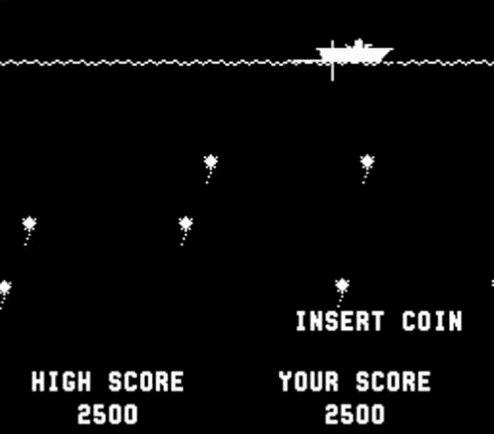

**图 3-1**  
`Sea Wolf`（1976 年），第一款引入最高分功能的电子游戏

iOS、Mac 和 Apple TV 平台下的`Game Center`极大简化了在项目中添加排行榜的工作。这是一个巨大的进步，因为在此之前，开发者必须自行编写和维护一个服务器来存储、推送和获取分数。在本章中，我们将探讨在`Game Center`中实现多个排行榜所需的步骤，以及所有必要的排行榜支持。你将学习如何提交分数、获取排行榜、自定义排行榜的图形用户界面（GUI），以及创建适合你应用的排行榜所需的所有内容。

## 为什么要使用排行榜？

在着手处理排行榜本身之前，理解排行榜为何能成为社交应用或游戏不可或缺的一部分至关重要：

- 排行榜能在应用或游戏中营造社区感，否则用户可能无法直接与其他用户互动。
- 排行榜能驱使用户为了超越自己、朋友或整个社区的分数而再次打开你的应用。
- 排行榜能在应用中营造目标感和成就感。
- 排行榜让用户更容易与朋友、家人和同伴分享他们的应用体验和进度。
- `Game Center`中的排行榜易于实现，能让你的应用迅速显得更加精致和完善。

## Game Center 排行榜概览

在`Game Center`中，排行榜是与某个特定排行榜标识符相关的一组`GKScore`对象，每个应用可以拥有多个排行榜。可以根据好友状态和提交日期来获取并进一步筛选排行榜。

`GKScore`对象代表特定排行榜上的每一个条目。一个`GKScore`总是关联一个玩家 ID。当向排行榜提交新的`GKScore`时，玩家 ID 由 API 自动设置且无法更改。日期和排名等数值也会自动设置和更新。你只需设置原始分数值和该分数所属的排行榜类别。

获取和显示排行榜有两种方式。最常见也最简单的方法是使用 Apple 的排行榜 GUI。这是我们在后续章节中首先学习的方法。第二种方法是获取原始的`GKScore`值，并在你自己的 GUI 中显示它们；本章稍后也会讨论这种方法。排行榜集是在 iOS 7 中引入的；这些集合允许开发者将多个排行榜组合成一个组。排行榜集非常灵活，可以以多种不同方式使用，最流行的是为游戏中的不同世界或难度级别创建排行榜组。你可以定义多达 100 个排行榜集，每个集合最多包含 100 个排行榜。

**注意**

`Game Center`目前对每个捆绑包 ID 的排行榜或排行榜集数量限制为 100 个。当你使用排行榜集时，排行榜的限制会提高到 500 个，同时仍然遵守每个排行榜集最多包含 100 个排行榜的限制。

### 使用 Apple 排行榜 GUI 与自定义 GUI 的优缺点

使用 Apple 排行榜 GUI 的优点包括：

- 其设计出自世界顶尖设计师之手。当 Apple 更新设计时，它们会自动在你的应用中更新，让你的用户界面瞬间焕然一新，并保持更现代的感觉，即使你没有定期更新。
- 实现和显示排行榜非常简单。
- 用户会看到一个他们已熟知如何操作的熟悉界面。

使用自定义 GUI 的优点包括：

- 你的排行榜可以与应用的定制设计相匹配。
- 你对最终数据有更多掌控权，并可以使用额外标准进行筛选。
- 你可以实现自己的自定义缓存逻辑。

如你所见，每种系统都有其优缺点，并没有哪个是绝对正确的选择。在本章结束时，你将掌握这两种方式的坚实基础，并能根据你应用的具体需求，就采用哪种方法做出正确决策。


## 在 App Store Connect 中配置排行榜

在处理排行榜的代码部分之前，必须先在 App Store Connect 中设置一个新的排行榜。登录 App Store Connect（[`https://appstoreconnect.apple.com/`](https://appstoreconnect.apple.com/)），然后选择我们在第 1 章和第 2 章中一直在处理的应用程序。从控制面板中选择应用后，进入“功能”区域，然后选择“Game Center”。

应用的 Game Center 门户会有一个标有“排行榜”的部分。进入排行榜部分后（见图 3-2），点击排行榜部分左上角的“+”按钮。系统会提示您选择“经典排行榜”或“定期排行榜”。经典排行榜将构建一个分数列表，该列表对您的游戏是永久性的，且永远不会重置。而定期排行榜则会指定一个固定的时间长度，排行榜会在此时间后自动重置，例如每周一次。

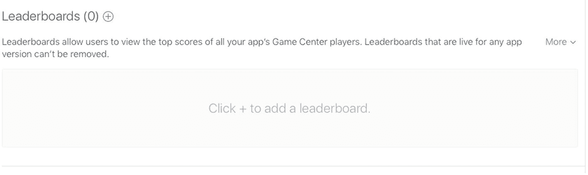

图 3-2

在 App Store Connect 中添加新的排行榜

我们首先创建一个新的经典排行榜，如图 3-3 所示。第一个需要输入的是“排行榜引用名称”。此值仅用作 App Store Connect 内部的引用。引用名称旨在帮助您快速在 App Store Connect 中找到排行榜，用户永远不会看到它。在本示例中，您可以使用引用名称 `Leaderboard Foo`。

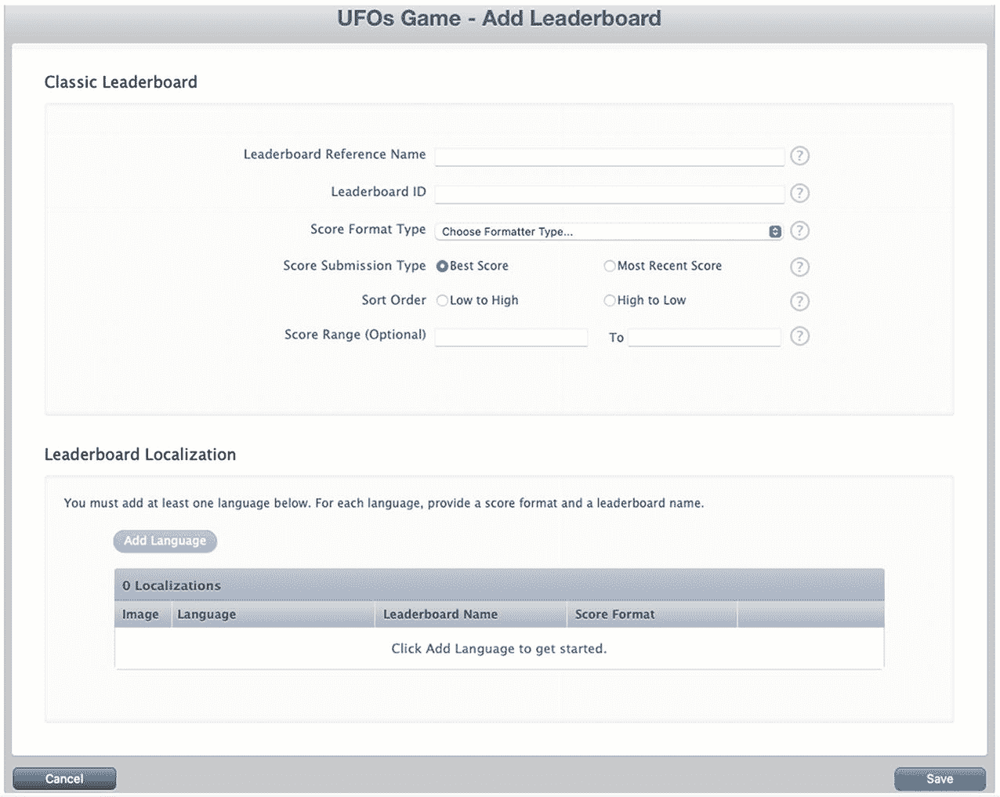

图 3-3

在 App Store Connect 中创建一个新的经典排行榜

下一个字段是“排行榜 ID”，您将在代码中查询此值以检索特定的排行榜。Apple 建议对此字段使用反向 DNS 类型的条目，例如 `com.company.appname.leaderboardname`。请在此处为您的应用填写适当的值；具体内容不重要，但您需要在本章剩余部分记住它们。

创建新排行榜时，还需要选择“分数格式类型”。选择符合您分数数据要求的分数格式。有关分数数据格式的信息，请参见表 3-1。

表 3-1

在 App Store Connect 中添加新排行榜的分数格式类型

| 分数格式类型 | 示例输出 |
| --- | --- |
| 整数 | 12,345 |
| 定点数，保留 1 位小数 | 12,345.1 |
| 定点数，保留 2 位小数 | 12,345.12 |
| 定点数，保留 3 位小数 | 12,345.123 |
| 已用时间，精确到分钟 | 3:45 |
| 已用时间，精确到秒 | 3:45:55 |
| 已用时间，精确到百分之一秒 | 3:45:55.82 |
| 货币，整数部分 | $182,121 |
| 货币，保留 2 位小数 | $182,121.68 |

**提示**

如果提供的格式类型都不符合您的要求，请选择与您需求最匹配的一个。在本章后续部分，您将看到如何通过检索原始分数值来自定义这些值。

下一个字段是“分数提交类型”；有两个选项可供选择：“最佳分数”和“最近分数”。如果您希望最佳分数优先显示，请选择“最佳分数”。如果您希望最近分数优先显示，请选择“最近分数”。

您还需要选择排行榜是按升序还是降序排序。升序将显示最低分数优先，例如在高尔夫比赛或赛道圈速中。降序将显示最高分数优先，例如在足球比赛或第一人称射击游戏的典型分数中。

还有一个可选的“分数范围”字段。这可以防止用户提交超出批准范围的分数；例如，如果您有一个高尔夫游戏，合理情况下您不会期望有人为 18 洞比赛提交低于 18 杆的分数；同样，您可能也不希望有人能够提交 100,000 分。此字段为可选，但可以防止因恶意用户行为导致排行榜数据异常。

创建新经典排行榜时需要完成的最后一项是输入本地化分数信息，如图 3-4 所示。App Store Connect 内置了对 Game Center 的本地化支持；您需要为要支持的每种语言创建一个新条目。您还可以添加一个独特的图像，与本地化的排行榜一同显示。

“名称”字段是排行榜在所选语言中的显示名称。“分数格式”字段会根据您在前一屏幕上选择的分数格式类型而变化。（货币格式的示例请参见图 3-4。）您还需要提供一个分数格式后缀。在检索格式化的分数属性时，该字符串将附加到您的分数值末尾。

**注意**

您需要为您创建的每个排行榜至少添加一种语言，然后它才能被视为有效。

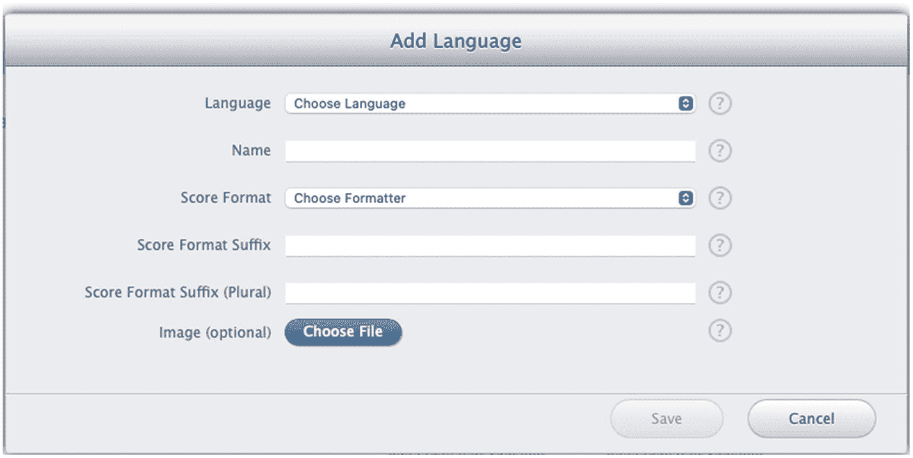

图 3-4

编辑新排行榜的本地化信息

**提示**

如果您希望在格式化的分数值中，分数和分数格式后缀之间出现一个空格，请不要忘记在分数后缀的开头添加一个空格。

现在，您已经为您的应用配置了一个经典排行榜。有时您可能希望创建一个排行榜集合，即一组具有共同属性的排行榜。例如，您的游戏有多个不同的世界，每个世界包含多个排行榜，分别针对收集最多金币、获得最高分数和击杀最多敌人。要启用排行榜集合，我们需要至少两个共享相同分数格式类型的排行榜。现在，请继续创建第二个经典排行榜。

一旦您拥有两个共享相同分数格式类型的排行榜，就可以创建一个排行榜集合。在您创建了两个排行榜后，排行榜界面部分的右上角会出现一个标有 `More` 的选项。`Move All Leaderboards Into Leaderboard Set` 选项将启动设置排行榜集合的流程。主要区别在于，您需要选择要合并的排行榜，如图 3-5 所示。您需要创建一个新的排行榜 ID，并为新的合并后的排行榜指定本地化数据。

**注意**

`Move All Leaderboards Into Leaderboard Set` 的表述方式容易令人困惑；您不需要将所有现有的排行榜都移入一个新的集合中，您仍然可以选择性地挑选那些应该放在同一个集合中的排行榜。

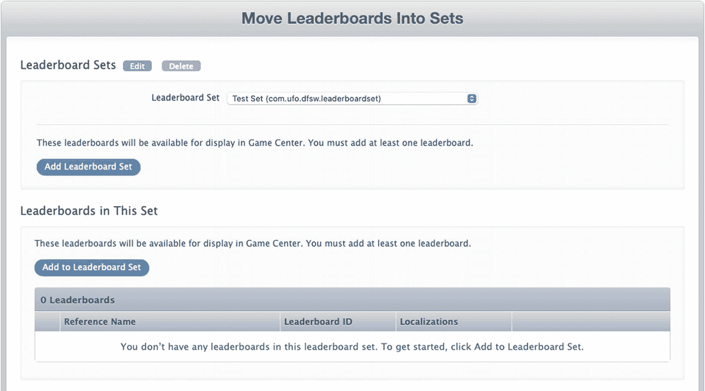

图 3-5

创建一个合并排行榜

我们还将添加最后一个单独的排行榜，以便与一个未合并的排行榜一起工作，因为我们之前创建的两个排行榜现在已成为“已附加”类型的排行榜。现在，您的排行榜面板中应该有四个排行榜：两个已附加的、一个合并的，以及一个单独的排行榜。既然我们已经有了一些有效的排行榜可供使用，我们可以回到 Xcode 并开始处理排行榜相关的代码。

**重要**

一旦排行榜在已发布的应用中上线，就永远无法删除，因此在发布应用之前，请仔细核对您的排行榜信息。


## 周期性排行榜

苹果最近扩展了排行榜功能，允许创建限时排行榜，称为周期性排行榜。它们的添加方式与经典排行榜相同，只是在提示时需选择周期性选项。周期性排行榜将新增三个选项：第一个是排行榜首次对用户可用的日期和时间，第二个是排行榜的有效持续时间，最后一个是排行榜重置并重新可用的延迟时间。参考图 3-6，新排行榜将于 2021 年 6 月 7 日开始生效，并收集 24 小时的分数；每 7 天排行榜将重置所有分数，并在接下来的 24 小时内再次开放。

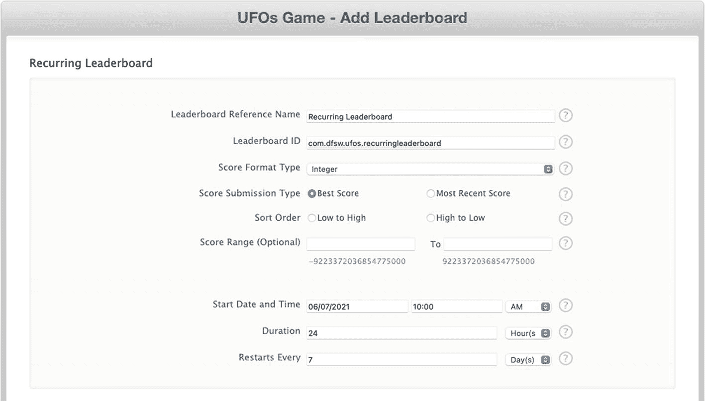

图 3-6

创建周期性排行榜

## 提交分数

在排行榜提供任何实用功能之前，我们需要用一些分数数据来填充它。我们通过再次修改`GameCenterManager`类来开始这一过程。在实现中添加以下函数；它看起来应该非常熟悉，因为其遵循的模式与我们实现认证方法时使用的相同：

```
func reportScore(_ score: Int, forCategory category: String) {
    GKLeaderboard.submitScore(score, context: 0, player: GKLocalPlayer.local, leaderboardIDs: [category]) { [weak self] error in
        if let error = error {
            print("提交分数时发生错误。数据将保存到 UserDefaults：\(error.localizedDescription)")
            let savedScore = SavedScore(score: score, category: category)
            self?.storeScoreForLater(savedScore)
        }
        DispatchQueue.main.async { [weak self] in
            self?.gameDelegate?.scoreReported(error)
        }
    }
}
```

这个新方法接收一个整数作为分数和一个`GKLeaderboard`对象。日期和用户值已由 API 自动设置。当在`GKLeaderboard`上调用`submitScore`时，它接受分数、玩家上下文和提交分数的玩家（应始终是本地玩家）。

至此，我们对`GameCenterManager`类的所有必要修改已完成。现在我们可以将注意力转回游戏本身。首先需要实现一些新的游戏机制来处理高分。

### 向 UFO 游戏添加分数提交功能

在我们的 UFO 游戏中，有两种明显的计分方式。第一种是实现一个系统，统计被劫持的奶牛数量，并将其作为分数提交。虽然这种方法对我们来说最容易实现，但游戏体验并不有趣，因为游戏没有合理的结束点。第二种高分方法实现起来更复杂，但更有意义。它会记录用户劫持十头奶牛所用的时间；用时最短的用户获胜。

对于你自己的应用来说，这些是需要仔细考虑的主题；有时最直接的高分方法对用户来说并不有趣。为本书的目的，我们将演示第一种方法，即被劫持的奶牛数量作为用户分数。如果你要实现一个基于计时器的系统，方法非常相似：在回合开始时启动计时器，当十头奶牛被劫持后，提交计时器上的秒数作为分数。

为了实现这个基于分数的系统，我们需要增加玩家结束游戏的途径。在实际游戏中，这可以通过角色死亡或时间限制来实现。但为示例起见，我们只需添加一个退出按钮。这将允许用户模拟游戏结束事件，同时保持代码专注于 Game Center 而不增加额外复杂性。

我们在`UFOGameViewController.xib`中添加一个退出按钮，如图 3-7 所示。我们还需要为退出按钮创建新的`IBAction`。将以下代码添加到`UFOGameViewController`中，并将退出按钮连接到它。暂时，我们只需让导航控制器返回到根视图：

```
@IBAction func exitAction(_ sender: Any) {
    navigationController?.popViewController(animated: true)
}
```

**注意：** 你不必等到游戏结束才提交新分数，但通常认为这是好习惯。如果可能，应避免在游戏中多次提交新分数。

一个明显的例外可能是连续的角色扮演游戏，其中分数不断更新，且没有合适的结束点来提交分数。

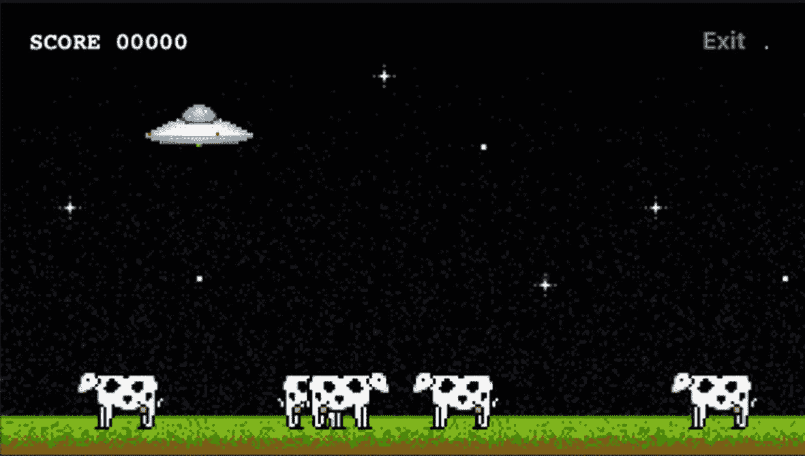

图 3-7

添加退出游戏功能以便提交高分

剩下的最后一步是实际向 Game Center 提交分数；你可能还记得，我们已经在`GameCenterManager`类中编写了处理此操作的方法。我们已在`UFOViewController`中使用了`GameCenterManager`类的实例来认证用户。

我们还需要修改`exitAction`方法以便直接提交分数。为此，用以下代码替换旧的`exitAction`函数。注意我们使用的是在 App Store Connect 中设置的排行榜 ID；请确保使用你输入的那个 ID，因为它很可能与示例不匹配：

```
@IBAction func exitAction(_ sender: Any) {
    navigationController?.popViewController(animated: true)
    gcManager?.reportScore(Int64(score), forCategory: "com.dragonforged.ufo.single")
}
```

现在当你运行游戏并点击退出时，应该会看到类似以下输出的控制台信息：

```
2011-02-10 12:32:47.629 UFOs[15092:207] Score submitted
```

> **提示：** 关于更复杂但用户友好的分数提交方法，请参见本章末尾的“更好的方法”一节。

现在我们已经向排行榜提交了分数，在接下来的章节中，我们将学习如何将这些数据呈现给用户。为了尽可能简化本节内容，此操作已大大简化。这并非你希望为用户提供的用户体验；我们只是在等待网络回调时将用户困在游戏画面中。实际上，你需要在之前的视图中处理委托回调。这可以确保用户在无需等待时不会等待。为简单起见，我们将继续使用更易理解的方法。

> **提示：** 每个玩家在每个排行榜类别中只能提交一个分数。你可能会注意到提交的分数从未出现在排行榜上。如果遇到这种情况，请确保你提交的分数高于该玩家的最高分数。


## 处理提交分数时的失败情况

如果分数提交失败，作为开发者的您需要全权负责存储该分数，并在错误解决后重新提交。没有什么比用户取得新高分却因网络故障甚至崩溃而丢失更令人沮丧的了。这也是苹果在应用审核时喜欢测试的一个环节，因此请记住，如果您未能妥善实现，可能会被拒绝。

存储分数信息以便后续重新提交的方法有很多种；不过，我认为以下方法对于新手来说是最容易实现的。如果您认为提供的方法不适合您的应用需求，请随意实现您自己的系统。

要处理并从分数提交失败中恢复，需要完成三个步骤。第一步是保存分数数据。虽然在此示例中我们不会通知用户失败，但建议告知用户其分数当前无法提交，并说明您稍后将自动重试。请修改`GameCenterManager`中的以下函数，使其与以下代码一致：

```
static func reportScore(score: Int, to leaderboard: GKLeaderboard, using context: Int, completion: ((Error?) -> ())?) {
    leaderboard.submitScore(score, context: context, player: GKLocalPlayer.local) { (error) in
        if error != nil {
            self.storeScoreForLater(
                with: StoredScore(
                    score: score,
                    leaderboardId: leaderboard.baseLeaderboardID,
                    context: context,
                    playerId: GKLocalPlayer.local.gamePlayerID
                )
            )
        }
        if let completion = completion {
            completion(error)
        }
    }
}
```

我们添加了几行额外的代码，当检测到错误时会运行；如果检测到错误，则捕获并保存`GKScore`中的`NSData`。稍后我们将从该`NSData`中检索`GKScore`。我们还调用了一个名为`storeScoreForLater`的新函数。现在让我们看看这个函数；请将以下函数添加到`GameCenterManager`类的实现中：

```
private static func storeScoreForLater(with score: StoredScore) {
    var savedScores: [StoredScore] = []
    if let data = UserDefaults.standard.data(forKey: savedScoresKey) {
        savedScores = (try? JSONDecoder().decode([StoredScore].self, from: data)) ?? []
    }
    savedScores.append(score)
    UserDefaults.standard.setValue(try? JSONEncoder().encode(savedScores), forKey: savedScoresKey)
}
```

这段代码会将表示分数的`NSData`保存到用户默认设置中。您也可以将这些数据写入文件，甚至存储在 Core Data 中。切勿假设用户只有一个未提交的分数；他们在离线游戏时，可能会在多个不同的排行榜上累积许多分数。

我们已经捕获了发布失败的情况，并将分数保存到磁盘以供稍后重试。剩下的最后一步是尝试将分数重新提交到 Game Center。这一步可能非常复杂，具体取决于您希望系统有多智能。大多数分数提交失败的问题与网络访问有关，但也可能由 Game Center 宕机甚至 DNS 问题引起。

关于何时重新提交分数并没有标准答案，但原则是不要让可以提交的分数被搁置。在考虑将重试失败分数的方法挂接在何处之前，我们先来实现一个重试分数发布的方法。请将以下方法添加到您的`GameCenterManager`类中：

```
func submitAllSavedScores() {
    let defaults = UserDefaults.standard
    if let savedScoresData = defaults.data(forKey: Self.savedScoresKey) {
        defaults.removeObject(forKey: Self.savedScoresKey)
        if let savedScores = try? JSONDecoder().decode([SavedScore].self, from: savedScoresData) {
            savedScores.forEach { savedScore in
                GKLeaderboard.submitScore(savedScore.score, context: 0, player: GKLocalPlayer.local, leaderboardIDs: [savedScore.category]) { [weak self] error in
                    if let error = error {
                        print("提交分数时发生错误。数据将保存到 UserDefaults：\(error.localizedDescription)")
                        self?.storeScoreForLater(savedScore)
                    } else {
                        print("已提交保存的分数")
                    }
                }
            }
        }
    }
}
```

上述代码将遍历所有已保存的分数，并尝试重新提交它们。我们只是简单地记录成功和失败的情况，以便将失败的分数重新添加到未提交分数数组中，供稍后再次重试。

如前所述，有很多方法可以挂接重试失败分数的逻辑。为简单起见，我们在成功通过 Game Center 进行身份验证后，添加对`submitAllSavedScores`的调用。请修改`GameCenterManager`的`authenticateLocalUser`方法，使其与以下代码一致：

```
static func authenticateLocalUser(completion: ((UIViewController?, Error?) -> ())?) {
    guard GKLocalPlayer.local.authenticateHandler == nil else {
        return
    }
    GKLocalPlayer.local.authenticateHandler = { (viewController, error) in
        if error != nil {
            if let completion = completion {
                completion(nil, error)
                return
            }
        } else {
            if let completion = completion, let viewController = viewController {
                completion(viewController, nil)
            }
            self.submitAllSavedScores()
        }
    }
}
```


  
## 展示排行榜

现在，我们已在 App Store Connect 中配置好排行榜，并向其中录入了一个分数，是时候将排行榜展示给用户了。展示方式有两种：第一种是使用 Apple 的 GUI（图形用户界面），第二种是使用自定义 GUI。本节将介绍如何通过 Apple 的 GUI 实现排行榜展示。在下一节中，你将学习如何直接访问排行榜的原始数据，从而以自定义图形的方式展示排行榜。

在开始之前，我们需要创建一个新按钮，用于触发排行榜的显示。我们希望这个按钮放在游戏屏幕之外，因为你不希望用户在游戏进行中被拖拽出去查看排行榜。首先，在 `UFOViewController` 视图中添加一个新按钮，如图 3-8 所示。

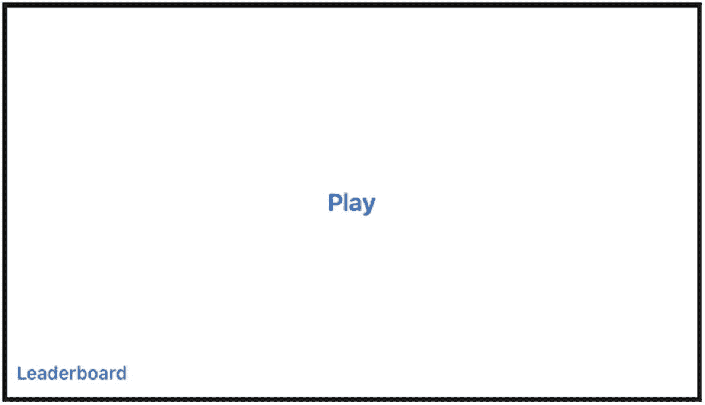

*图 3-8 – 添加排行榜按钮*

将按钮连接到如下所示的新操作上。当排行榜功能首次引入 Game Center 时，必须指定要启动的排行榜。而在较新版本的 Game Center 中，排行榜共享一个统一的排行榜界面，用户可以在其中导航到他们想查看的任何排行榜。

```swift
@IBAction func leaderboardButtonTapped(sender: UIButton) {
    let leaderboardController = GKGameCenterViewController(state: .leaderboards)
    leaderboardController.gameCenterDelegate = self
    present(leaderboardController, animated: true)
}
```

运行程序并点击新添加的排行榜按钮时，结果应类似于图 3-9 中的图像。值得注意的是，虽然 GameKit 和 Game Center 的底层 API 更新频率不高，但 Apple 用于呈现 Game Center 的 UI 变化迅速且频繁。不仅界面会改变，一些导航方式在过去也有所不同。例如，在最初的排行榜版本中，用户会直接被带到他们正在访问的游戏排行榜；而在当前实现中，用户会被带到当前游戏排行榜的概览部分。

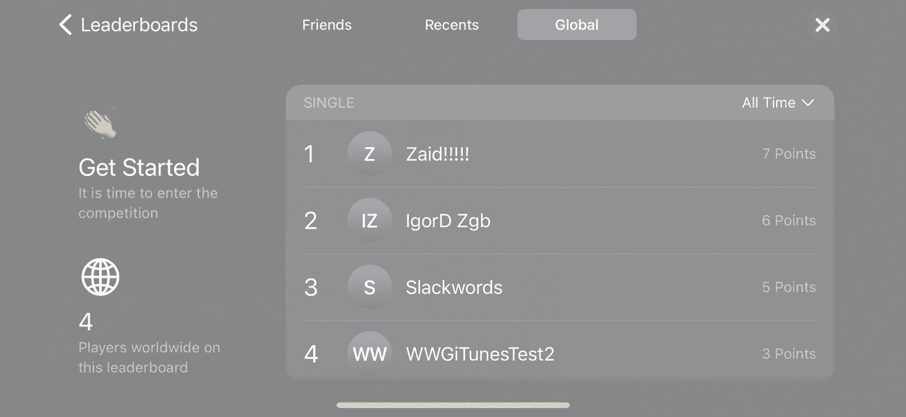

*图 3-9 – 使用 Apple GUI 展示的排行榜*

该 GUI 提供了一个返回按钮，可以带我们进入应用已配置的所有排行榜列表（参见图 3-10 中的初始视图）。如果在创建 `GKLeaderboardViewController` 实例时省略了类别输入，则会显示在 App Store Connect 中被选为默认排行榜的那个排行榜。

以上就是使用 Apple GUI 创建和展示排行榜的全部内容。下一节，我们将探讨如何自定义排行榜，使其与你自己的 GUI 相匹配。

> **注意**
> 请记住，在本地用户通过身份验证之前，你无法访问任何 Game Center 功能，包括排行榜。如果尝试访问，你将收到 `GKErrorNotAuthenticated` 错误。

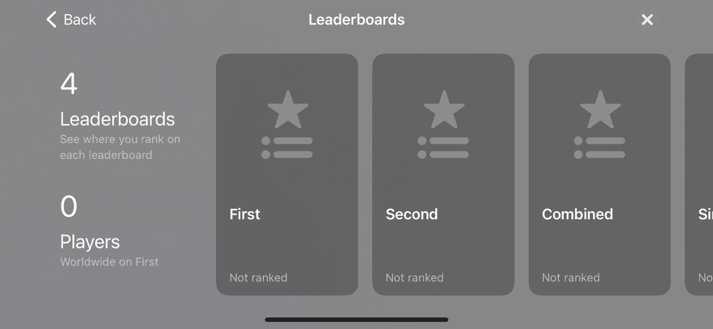

*图 3-10 – 使用 Apple GUI 展示的排行榜集合*

> **提示**
> 你可以通过在 App Store Connect 中上下拖动排行榜条目，来更改排行榜的显示顺序（参见图 3-10）。

### 自定义排行榜

正如上一节所示，向用户展示排行榜是直截了当的。但是，如果你想自定义排行榜的外观呢？在本节中，你将逐步了解如何获取原始排行榜信息，以便在应用中按照你需要的任何方式呈现它。

我们开始添加自定义排行榜的过程：先在 `UFOViewController` 中添加一个新按钮及其关联操作。在上一个排行榜按钮旁边添加一个新按钮，并为其创建一个新操作。

在上一个示例中，Apple 为我们提供了一个视图控制器。当我们处理自己的自定义排行榜时，需要创建一个视图控制器来处理展示。创建一个 `UIViewController` 的新子类，并将其命名为 `UFOLeaderboardViewController`。修改新自定义排行榜按钮的操作，使其呈现一个新的 `UFOLeaderboardViewController` 实例，如下面代码片段所示：

```swift
@IBAction func customLeaderboardButtonPressed() {
    let leaderboardViewController = UFOLeaderboardViewController()
    leaderboardViewController.gcManager = gcManager
    present(leaderboardViewController, animated: true)
}
```

下一步是为新的 `UFOLeaderboardViewController` 设置 storyboard。我们将使用如图 3-11 所示的设置；不过，你可以在这里进行任何你想要的定制。创建如图中所示的输出口和对象，并为所有对象连接好关联，包括表格的代理和数据源。

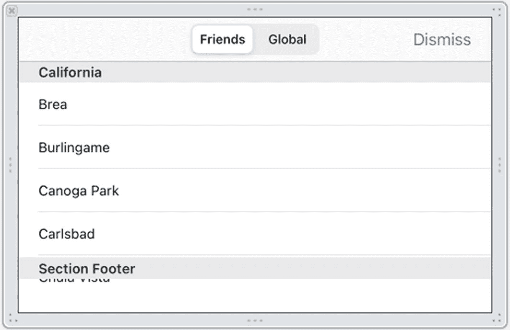

*图 3-11 – 为自定义排行榜创建 xib*

如果此时运行应用并点击“自定义排行榜”按钮，它应该会以正确的方向启动一个空白表格，并允许你关闭它以返回第一个视图。

既然我们已经处理了视图控制器的开销，就可以开始专注于 Game Center 特有的功能了。首先，设置我们将要使用的表格视图代理和数据源方法。我们需要创建一个新的类属性来保存用于显示的分数数据。创建一个新的 `NSArray` 对象并将其命名为 `scoreArray`。在你的实现中添加以下两个函数：

```swift
extension UFOLeaderboardViewController: UITableViewDataSource {
    func tableView(_ tableView: UITableView, numberOfRowsInSection section: Int) -> Int {
        return scoreArray?.count ?? 0
    }
    
    static let tableViewCellIdentifier = "Cell"
    
    func tableView(_ tableView: UITableView, cellForRowAt indexPath: IndexPath) -> UITableViewCell {
        var cell = tableView.dequeueReusableCell(withIdentifier: UFOLeaderboardViewController.tableViewCellIdentifier)
        if cell == nil {
            cell = UITableViewCell(style: .subtitle, reuseIdentifier: UFOLeaderboardViewController.tableViewCellIdentifier)
            cell?.selectionStyle = .none
        }
        
        let score = scoreArray?[indexPath.row] as? GKLeaderboard.Entry
        let playerName = score?.player.alias
        
        if playerName == nil {
            cell?.textLabel?.text = "正在加载名称..."
        } else {
            cell?.textLabel?.text = playerName
        }
        
        cell?.detailTextLabel?.text = score?.formattedScore
        return cell!
    }
}
```

第一个函数返回表格视图中的项目数量。本例中我们只处理一个分区，因此行数始终等于数组中分数的数量。下一个函数将分数显示到单元格中。本例中我们使用了 `UITableViewCellStyleSubtitle`，但在大多数情况下，你会希望创建一个更自定义的单元格。主标签设置为玩家别名，副标签设置为格式化后的分数值。在上一章中曾指出，你永远不应向用户显示玩家 ID。


## 修改 GameCenterManager

现在让我们把注意力转到 `GameCenterManager` 类。我们创建一个新函数，用于从 Game Center 服务器获取分数。请在 `GameCenterManager` 类中添加以下方法：

```
static func retrieveScores(from leaderboard: GKLeaderboard, playerScope: GKLeaderboard.PlayerScope, timeScope: GKLeaderboard.TimeScope, range: ClosedRange, completion: ((GKLeaderboard.Entry?, [GKLeaderboard.Entry]?, Int, Error?) -> ())?) {
    leaderboard.loadEntries(for: playerScope, timeScope: timeScope, range: NSRange(range.clamped(to: 1...100))) { (localPlayerEntry, entries, totalPlayerCount, error) in
        if let completion = completion {
            completion(localPlayerEntry, entries, totalPlayerCount, error)
        }
    }
}
```

我们希望这个调用尽可能通用，因为 `GameCenterManager` 类的最终目标是成为一个可复用类，能够轻松地集成到你未来的任何项目中。

上述方法接收了创建新的 `GKLeaderboard` 对象所需的所有参数。一旦我们创建了该对象并设置了所需的属性，就可以在 `GKLeaderboard` 对象上调用 `loadScoresWithCompletionHandler` 方法。

本节对 `GameCenterManager` 类所做的修改就这些。

## 在自定义排行榜上过滤结果

让我们将注意力重新转回到 `UFOLeaderboardViewController` 类。接下来，我们要为分段控制器添加一个操作。这将允许用户在全局分数和仅好友分数之间切换。请将以下方法连接到分段控制器的 `valueChanged` 操作：

```
@IBAction func scopeChanged(_ sender: UISegmentedControl) {
    scores = []
    if let leaderboard = GameCenterManager.leaderboard {
        GameCenterManager.retrieveScores(from: leaderboard, playerScope: scopeSegmentedControl.selectedSegmentIndex == 0 ? .friendsOnly : .global, timeScope: .allTime, range: 1...50) { (localPlayerEntry, entries, totalPlayerCount, error) in
            if let error = error {
                print("An error occurred: \(error.localizedDescription)")
            } else {
                self.scores = entries ?? []
            }
            self.tableView.reloadData()
        }
    }
}
```

此方法调用 `GameCenterManager` 的方法来获取分数列表。分段控制器有两个值：一个用于好友，一个用于所有人（全局）。你也可以轻松修改上述代码以获取不同的时间范围，但在本例中，我们只请求全部时间范围。这里有一个容易忽略的重要步骤：将数组设置为空数组并重新加载表格。这样做会在分段控制器值改变时清除表格中现有的分数。

`retrieveScores` 调用相当直接。我们使用在 App Store Connect 中为要获取的排行榜设置的类别，并设置时间和玩家范围。该方法最后一个参数是一个范围。在上一个示例中，我们返回从第 1 名到第 50 名的分数。

**注意**

分数范围始终从索引 1 开始。你可以将前述示例修改为使用新范围 `NSMakeRange(50,50)`；这将获取从第 50 名到第 100 名的分数。确保不要一次请求过多的分数，因为获取分数数据所需的时间与你尝试获取的分数数量有关。

### 显示自定义排行榜

如果你现在运行此项目，会发现表格始终是空白的。这是由于遗漏所致。要解决这个问题，请修改现有的 `IBAction` 方法，将 `gameCenterDelegate` 的属性设置为 `UFOViewController` 中存在的实例。你的代码应如下例所示：

```
@IBAction func leaderboardButtonTapped(sender: UIButton) {
    let leaderboardController = GKGameCenterViewController(state: .leaderboards)
    leaderboardController.gameCenterDelegate = self
    present(leaderboardController, animated: true)
}
```

如果你现在再次运行该应用，你会看到类似于图 3-12 所示的输出。分数的数量、具体数值以及玩家别名会有所不同，但你应该能看到至少一个分数被列出。

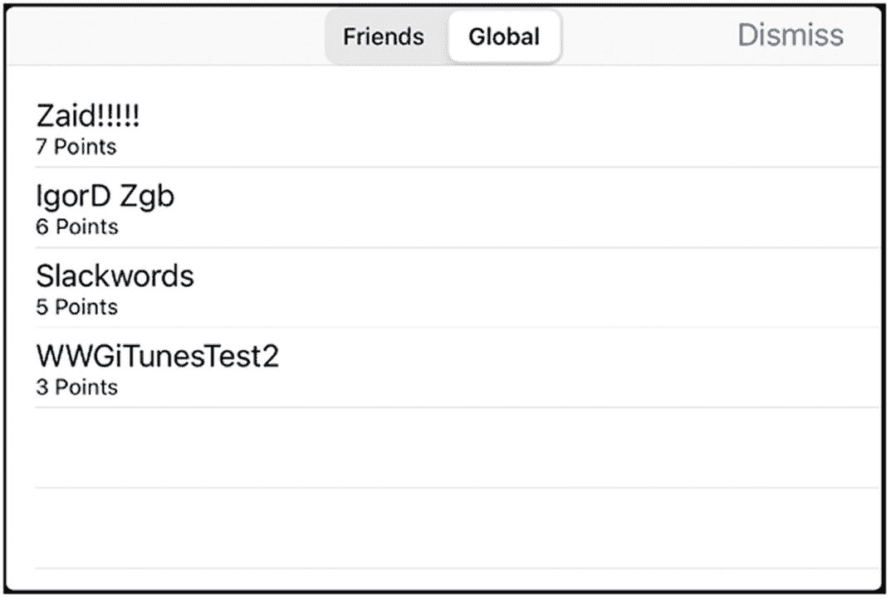

**重要提示**

无法保证排行榜请求不会返回缓存数据。你应假定获取的数据是缓存的，可能不是最新的。

## 本地玩家分数

很多时候，你会想知道本地玩家在给定排行榜上的分数。也许你想在他们的排行榜顶部显示其分数，或者你可能想获取一个显示与本地玩家分数相近的其他玩家分数的排行榜。你甚至可能想在用户打破自己之前的最高分时在游戏中发布一个动作。

苹果提供了简便的技术来确定本地玩家的分数。一旦你获得了要查找本地分数的排行榜引用，只需查询 `localPlayerScore` 属性即可。

```
print(leaderboard.localPlayerScore)
```

## 更佳方法

在本章前面的“发布分数”一节中，我们学习了如何向 Game Center 发布新分数。我们的方法虽然简单，但从用户交互的角度来看并非最佳方案。现在是时候重构发布新分数的代码以提升可用性了。这种方法更复杂，但性能更好，对用户的影响也更小。

我们需要做的第一件事是将 `scoreReported` 函数从 `UFOGameViewController` 移到 `UFOViewController`。同时，我们还要修改 `UFOViewController` 中的退出操作，以便将分数报告给 Game Center。

这使我们能够退出游戏，而无需等待来自 Game Center 代理的网络回调。

## Game Center 组

Game Center 功能的一个较新添加是 Game Center 组，更简洁地说，就是跨多个不同应用共享排行榜或成就。在迁移到 Game Center 组之前，存在一些需要注意的限定条件；最值得注意的是，所有应用必须存在于同一个 App Store Connect 账户下；没有办法在不同账户的应用之间设置 Game Center 组。

要设置一个新的 Game Center 组，你必须首先打开你想要添加到组中的第一个应用的 App Store Connect 门户中的 Game Center 区域。那里有一个用于设置新组的小区域；见图 3-13。

**重要提示**

如果你的应用已有排行榜，其排行榜 ID 将带有“grp.”前缀。在设置时，你可以保持 ID 不变，也可以创建一个新的。

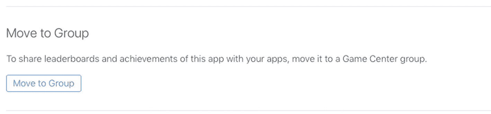

你可以有选择地挑选哪些排行榜和成就将成为每组的一部分，并且该过程是可逆的，如果你以后需要，甚至可以删除整个组。如果你的应用已有排行榜（或成就），则必须决定是否将这些项目与组项目合并。当然，你也可以创建新的特定于组的排行榜和成就。

Game Center 组的所有功能都通过 App Store Connect 门户进行控制，它将引导你完成合并和控制排行榜及成就的过程，就像处理非组排行榜或成就一样。

从你的应用内部访问排行榜的方式，无论是否属于组，都是完全相同的；你只需要让应用成为相应组的一部分，并引用提供的（或创建的）排行榜 ID 即可。


### 摘要

本章介绍了 Game Center 中的排行榜。我们涵盖了使用排行榜的优势，以及两种可用的类型。我们学习了如何提交分数，以及如何处理提交过程中出现的任何错误。我们还探讨了在应用中使用 Apple 提供的 GUI 或自定义 GUI 来启动并运行排行榜所需满足的要求。

在本章中，我们持续构建了 `GameCenterManager` 类，添加了所需的方法来提交分数、获取本地和全局分数，以及显示自定义和内置排行榜。现在，您应该已经能够自信地为任何现有或新的 iOS 应用添加排行榜了。在下一章中，我们将探索 Game Center 成就所提供的一切功能。

