# 4. 成就

相对较新的游戏概念——成就，其出现时间远晚于排行榜，并且随着微软 Xbox 360 及更新设备的发布而迅速流行起来。成就提供了更基础的游戏排行榜所忽略的更高层次的细节。虽然排行榜显示的是当前谁拥有领先分数，但成就通过奖励玩家完成特定任务、事件或关卡来展示玩家的技能和实力。当成就开始服务于游戏内部目的时，它们就变成了超越其他玩家的“增益”能力。玩家查看他人成就的能力给了玩家一种“炫耀的权利”。正如您毫无疑问所知道的，游戏中的炫耀权可以延长各种类型用户的游戏时间，无论是试图达到 100%完成度，还是为了保持对同行的领先优势，抑或是将同行从榜首位置拉下来。

随着支持社交网络的游戏不断普及，成就系统功能的热度更是直线上升。社交游戏中充斥着决心完成 100%游戏进度的特定玩家群体。

Foursquare 是最早将成就带出游戏世界并引入社交应用领域的应用之一。Foursquare 将它的成就称为“贴纸”（见图 4-1），但其基本概念是相同的。玩家完成任务会获得奖励，但徽章的数量不会影响游戏玩法，或者在此例中，也不会以任何直接方式影响用户使用该应用。

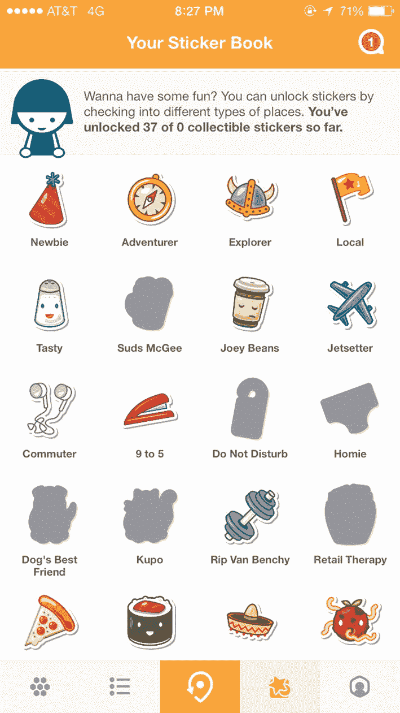

图 4-1  iPhone 上的 Foursquare 展示成就，在后续版本中更名为贴纸

Game Center 使得为您的 iOS、Mac 或 Apple TV 应用添加成就系统变得非常简单。在本章中，我们将学习如何为我们的演示游戏 UFOs 添加成就。您将学习快速轻松地将成就系统完全集成到您的应用中所需要的一切知识。具体来说，您将学习如何：

- 创建新的成就
- 显示成就进度
- 在您的应用中添加成就钩子
- 推进和重置成就
- 自定义成就的外观

## 为什么要使用成就？

如果您尚未明确成就能为您的社交应用或游戏带来什么，那么让我们花点时间来回顾一下它的诸多好处：

- 成就给您的用户带来额外的成就感和奖励感。
- 成就使用户更频繁地回到您的应用中。用户更有可能返回您的应用以完成更多成就，使完成游戏变成一个更有回报和更有趣的过程。
- 成就为用户提供了一种与他人分享体验的简单方式。
- Game Center 中的成就为最终产品提供了精致的外观和感觉。
- 成就让用户在浏览您的应用或游戏时，获得更强烈的进展感。
- 成就提供了另一种游戏方式。如果用户不喜欢战役模式，他们可以通过您的成就系统来享受成就感。
- 成就归因于游戏品牌知名度。当用户在 Twitter、Facebook 和其他社交平台上分享他们的成就时，品牌认知度会提高，从而带动销量。

## Game Center 中的成就概述

成就（在某些圈子中也称为徽章）在 Game Center 中的运作方式与其他平台略有不同。与排行榜一样，成就首先需要在 App Store Connect 中为每个应用单独配置。您将创建 `GKAchievement` 对象的新实例来报告进度（稍后详细介绍此对象）。与提交分数时创建的排行榜条目不同，成就可以报告增量或部分进度。

与排行榜（有关排行榜的更多信息，请参见第 3 章）工作的另一个显著区别是，您将使用两种不同类型的对象来提交和检索成就。`GKAchievement` 用于提交新成就或更新成就进度，而 `GKAchievementDescription` 用于向用户显示成就数据。这与我们在排行榜中看到的情况相反，在排行榜中，`GKScore` 对象既用于提交数据，也用于检索数据。

与排行榜一样，成就进度可以使用 Apple 自带的图形用户界面 (GUI) 显示，也可以使用更能匹配您应用外观和感觉的自定义 GUI 显示。每种系统的优缺点与排行榜相同。为方便您参考，现将这些优缺点列出如下，并在适当之处添加了细微的成就特定信息。

### 使用 Apple 成就 GUI 与自定义 GUI 的对比优势

以下是使用 Apple 自带的 GUI 处理成就的一些优势：

- 您的成就的外观和感觉由世界上一些最优秀的设计师打造。
- GUI 非常简单且易于实现，使得向用户展示成就进度变得非常直接。
- 用户喜欢他们已经知道如何交互的熟悉界面。
- 您的应用比自行实现系统更具前瞻性。您的应用会自动受益于 Game Center 用户界面的每次修订。

以下是在 iOS 设备上处理成就时使用您自己的 GUI 的一些优势：

- 您的成就进度可以匹配您应用的定制设计。
- 您对返回的数据拥有更多自由，并且可以使用附加条件进行过滤。
- 您可以实现自己的自定义缓存行为。
- 您可以为未完成或进行中的成就使用自定义图像。

如您所见，与以往一样，每种系统都有其优点和缺点，并且对于您应该使用哪一种，没有唯一正确的答案。在本章结束时，您将对这些选项有更好的理解，并更有能力决定哪种方法最适合您的应用。

如本节开头所述，您需要像处理排行榜一样，从 App Store Connect 开始处理成就。


## 在 App Store Connect 中配置成就

正如我们在排行榜中看到的那样，如果不先在 App Store Connect 中至少设置一个新成就，你就无法开始处理成就。使用你的 Apple Connect 用户名和密码登录 App Store Connect（`http://appstoreconnect.apple.com`），并选择我们在之前章节中已经处理过的应用（更多信息请参见第 2 章）。从控制面板中选择应用后，返回“管理功能”区域，然后进入本书前面介绍的 Game Center 区域。

你的应用的 Game Center 门户会有一个标有“成就”的部分。你会在成就区域的左上方找到一个“+”按钮。此按钮允许你设置一个新成就，如图 4-2 所示。

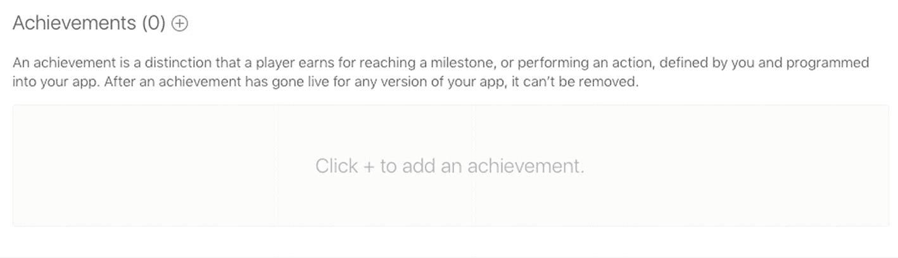

图 4-2

通过 App Store Connect 门户添加新成就

你可能会注意到，这个门户页面与排行榜门户页面有很多相似之处。我在表 4-1 中分解了这些属性。

表 4-1

iTunes Connect 中的成就属性

| 属性 | 描述 |
| --- | --- |
| 成就参考名称 | 一个在 iTunes Connect 外部不使用的字符串；该字符串用于在 App Store Connect 内轻松定位和引用此成就。 |
| 成就 ID | 这是你将在代码中引用的标识符。与排行榜类别类似，Apple 建议你使用反向 DNS 系统，例如 `com.company.appname.achievementname`。 |
| 隐藏 | 如果某个成就是隐藏的，用户只有在完成它或增加进度后才能在成就列表中看到它。 |
| 分值 | 成就可以分配分数。你的应用被分配了 1,000 分。每个完成的成就都会使用户朝着该总分前进。一旦用户达到 1,000 分，他们就解锁了所有成就。你应该为更难以完成的成就分配更多的分数。这能为用户提供更好的成就感，让他们了解成就的价值。分值是可选的，如果你不想在应用中使用它们，可以忽略。 |

**提示**

你不必让你的成就总分加起来正好达到 1,000 分，但你不能超过 1,000 分。要小心考虑你可能想要添加的任何未来成就。一旦某个成就上线，就无法从 App Store Connect 中移除；但是，你可以在游戏中将其移除并隐藏。

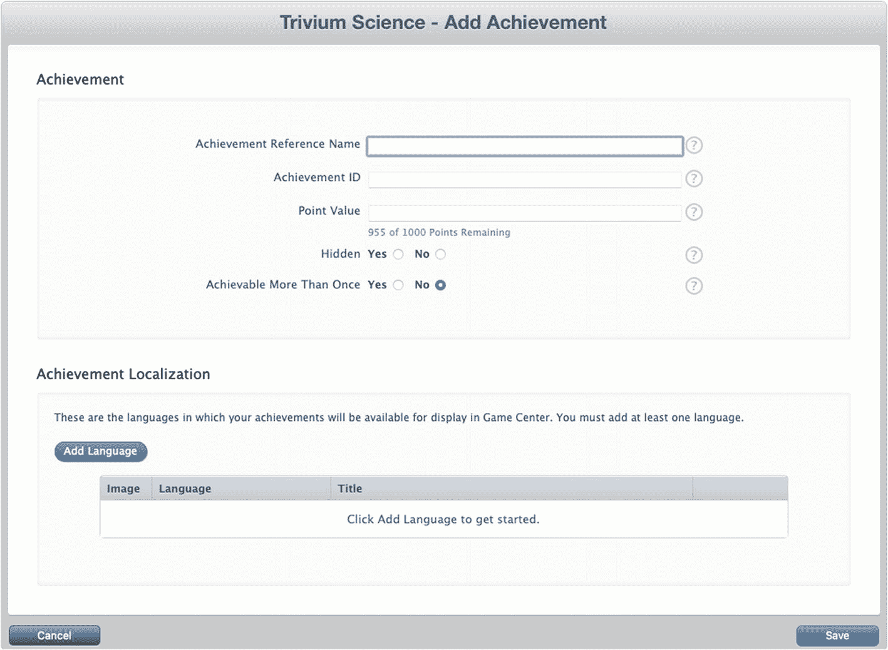

图 4-3

App Store Connect 中新成就的配置视图

现在是时候创建一个新成就了。我们将创建一个在用户绑架 25 头牛时达到的成就。我们将使用“绑架 25”作为成就名称，这样当有几十个成就时很容易找到。对于我们的成就 ID，我们将使用 `com.dragonforged.ufo.abduct25`。你可以随意使用你想要的任何 ID，但请确保在接下来的示例中将其替换为 `com.dragonforged.ufo.abduct25`。我们将把这个成就设为非隐藏成就，并为其分配 10 分。

**重要**

任何成就完成时获得的分数都不能超过 100 分。

要使成就有效，你必须至少配置一种语言。如图 4-4 所示，成就的本地化区域与上一章创建排行榜时遇到的情况大不相同。请参考表 4-2 了解每个属性的信息。

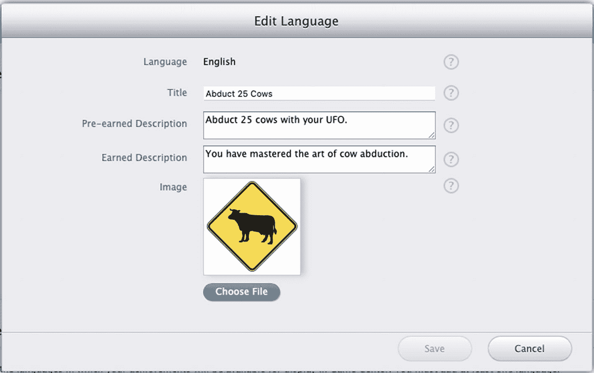

图 4-4

在 iTunes Connect 中本地化成就

**注意**

每个游戏拥有自己的成就描述；你不能在多个游戏之间共享成就描述。

表 4-2

iTunes Connect 中的本地化成就属性

| 属性 | 描述 |
| --- | --- |
| 语言 | 选择此成就将显示的语言。你必须为你发布的产品中将支持的每种本地化设置一种语言。 |
| 标题 | 这是在应用内显示以描述此成就的标题。 |
| 达成前描述 | 这是当成就处于非隐藏状态但尚未获得或仅部分完成时显示的描述。 |
| 达成后描述 | 这是当成就已完全解锁并完成时显示的描述。 |
| 图片 | 这是当成就获得时将显示给用户的图片。Apple 将提供未获得时的图片，或者在使用自定义成就 GUI 时，你可以指定自己的图片。此图片必须为 512 x 512 和 72 DPI。 |

就我们而言，我们将为此成就配置英语。我将使用“绑架 25 头牛”作为标题，但你可以使用你喜欢的任何标题。对于达成前描述，我选择了“用你的 UFO 绑架 25 头牛。”对于达成后描述，我使用了“你已经掌握了绑架牛的艺术。”我还将使用一个牛过路标志作为图片。完成后，你应该有一个设置完整的成就，它看起来应该类似于图 4-5 中显示的视图。

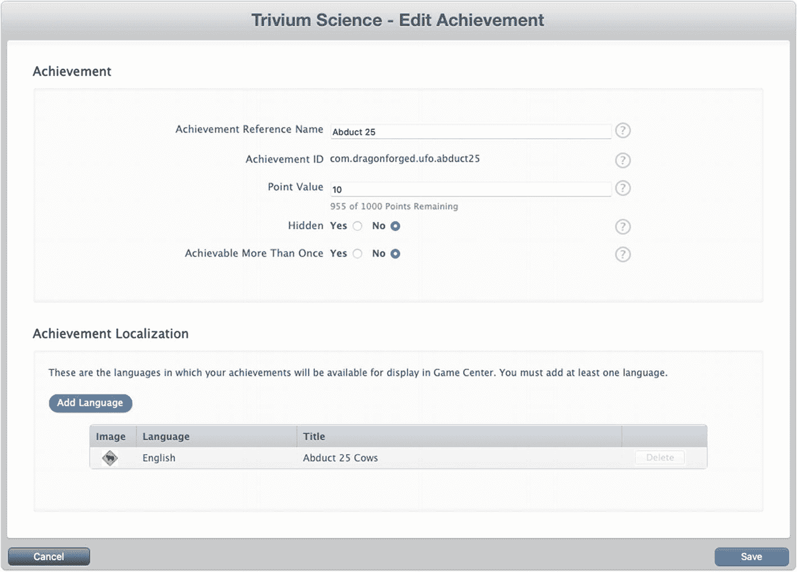

图 4-5

一个新成就，显示在 iTunes Connect 中

我们将为我们的游戏处理几个不同的成就设置。继续创建另一个新成就，用于绑架一头牛；这将是我们非渐进式的成就。然后，创建第三个成就，用于五分钟的游戏时间，并将其设置为隐藏。这最后一个成就将让我们处理计时器、渐进式成就和隐藏成就。你可以为这些成就选择任何你想要的分值、描述、标题和图片，但请务必记住成就 ID。

现在，你应该在 App Store Connect 中为我们的游戏配置了三个成就。

我们现在可以回到 Xcode 并开始处理这些成就了。


### 呈现成就

与排行榜不同，在将用户数据填充到成就系统之前，有很多 GUI 方面的内容需要预览。查看修改成就对默认 GUI 显示效果的影响会很有帮助。在本章的剩余部分，我们将首先展示苹果的成就 GUI，然后继续讲解如何提交用户数据。我们还将介绍自定义 GUI 成就。

在开始之前，我们需要创建一个新的 `UIbutton` 来触发成就视图。我们很可能希望像处理排行榜按钮那样，将此按钮放置在游戏画面之外。我们从在 `UFOViewController` 视图中添加一个新按钮开始，如图 4-6 所示。

你还需要创建并连接一个 `IBAction` 到我们新的成就按钮上。将以下代码插入到你连接到成就按钮的操作中：

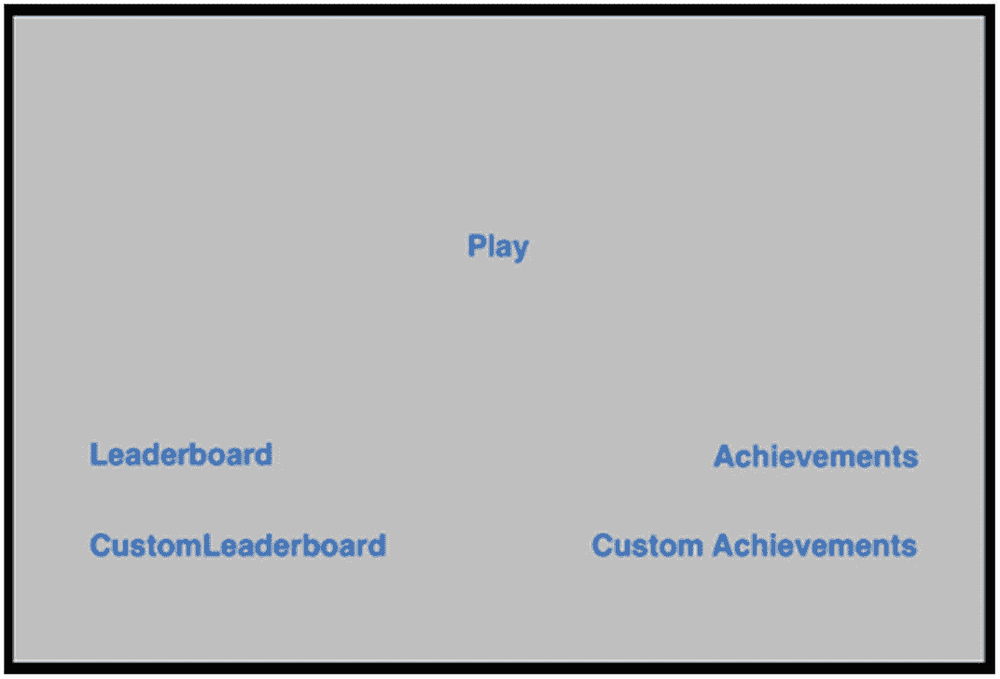

图 4-6：添加一个新按钮来触发我们的成就视图

```
@IBAction func achievementButtonPressed() {
    var achievementViewController: GKGameCenterViewController? = nil
    if let state = GKGameCenterViewControllerState(rawValue: 1) {
        achievementViewController = GKGameCenterViewController(state: state)
    }
    achievementViewController?.gameCenterDelegate = self
    if let achievementViewController = achievementViewController {
        present(achievementViewController, animated: true)
    }
}
```

如果你运行该 App 并点击成就按钮，你将会看到一个类似于图 4-7 所示的视图。显示的成就使用的是苹果的未获得图像。苹果建议你始终使用其未获得图像，但在使用自定义成就 GUI 时，你可以覆盖此图像并返回你自己的图像。

接下来，回顾一下我们设置了三个成就，其中一个是隐藏的。正如你在图 4-7 中所见，提供的视图只显示了两个成就。由于我们没有向第三个成就提交任何进度，其详细信息对用户是隐藏的。不过，你可以看到顶部信息行显示有一个隐藏成就（0/3 成就）。另请注意，成就使用的是在 iTunes Connect 中设定的本地化未获得描述。

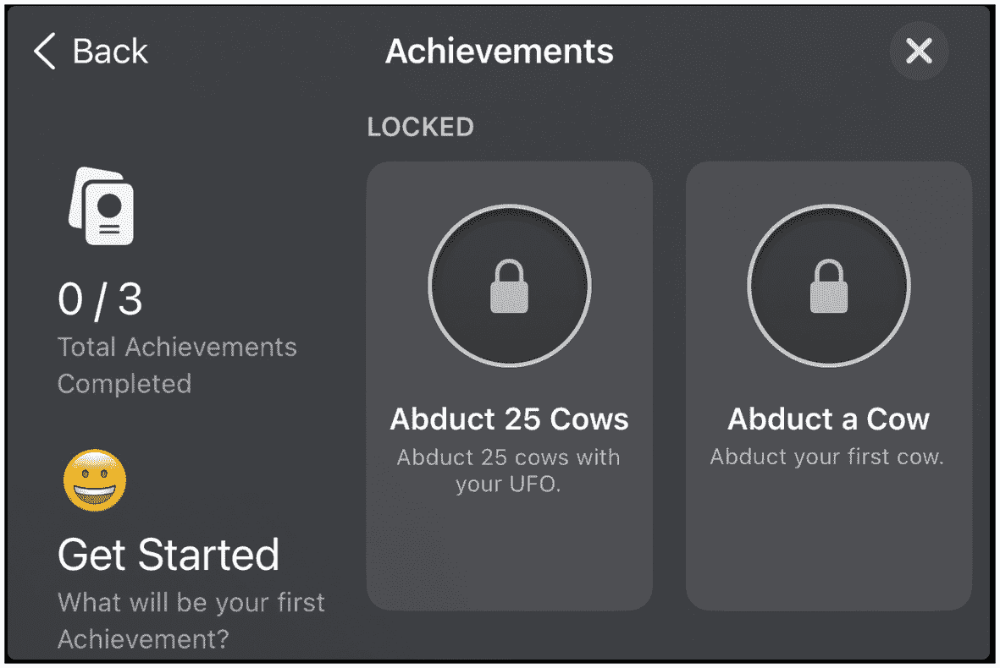

图 4-7：我们的成就，以苹果默认 GUI 显示

这些就是通过苹果内置 GUI 向用户展示其成就进度的必要步骤。在下一节中，我们将探讨如何更新和推进这些成就。在本章稍后部分，你将学习如何使用自定义 GUI 呈现成就。

> **注意：** 用户始终可以在 Game Center 中查看自己的成就进度，但建议您也让用户能够在您的应用内查看其进度。

### 修改成就进度

与排行榜条目不同，成就可以通过用户交互不断修改和推进。与我们处理的其他 Game Center 功能类似，我们将在 `GameCenterManager` 类中创建一个新方法来处理与成就的交互。添加以下方法后，我们将对该方法进行回顾，以准确理解其运作方式。

> **提示：** 请记住，所有这些源代码都可以在网上获取。处理大型函数时，从 [apress.com](http://apress.com) 下载的源代码中复制可能更为简便。

```
func submitAchievement(_ identifier: String, percentComplete: Double) {
    if GKLocalPlayer.local.isAuthenticated == false {
        return
    }
    guard earnedAchievementCache != nil else {
        populateAchievementCache() {
            self.submitAchievement(identifier, percentComplete: percentComplete)
        }
        return
    }
    if let achievement = achievement(forIdentifier: identifier) {
        let storedProgress = achievement.percentComplete
        guard percentComplete > storedProgress else {
            return
        }
        achievement.percentComplete = percentComplete
        GKAchievement.report([achievement], withCompletionHandler: { [weak self] error in
            if let error = error {
                print("向成就报告时发生错误。数据将保存到 UserDefaults: \(error.localizedDescription)")
                self?.storeAchievementToSubmitLater(achievement)
            }
            if percentComplete >= 100 {
                GKAchievementDescription.loadAchievementDescriptions(completionHandler: { [weak self] achievementDescriptions, error in
                    if let error = error {
                        print("加载成就描述时发生错误: \(error.localizedDescription)")
                    }
                    achievementDescriptions?.forEach{ achievementDescription in
                        if achievement.identifier == achievementDescription.identifier {
                            self?.gameDelegate?.achievementEarned(achievementDescription)
                        }
                    }
                })
            }
            DispatchQueue.main.async { [weak self] in
                self?.gameDelegate?.achievementSubmitted(achievement, error: error)
            }
        })
    }
}
```

现在来看看我们添加的 `submitAchievement:percentComplete:` 函数。这里有两个主要的 if/else 块。第一个块在 `earnedAchievementCache` 为 `nil` 时执行，这段代码第一次运行时总会是这种情况。现在让我们来看看这段代码。

```
GKAchievement.loadAchievements(completionHandler: { achievements, error in
    if error == nil {
        var tempCache: [String: GKAchievement] = [:]
        for achievement in achievements ?? [] {
            tempCache[achievement.identifier] = achievement
        }
        self.earnedAchievementCache = tempCache as? NSMutableDictionary
        self.submitAchievement(identifier, percentComplete: percentComplete)
    } else {
        DispatchQueue.main.async {
            self.delegate?.achievementSubmitted?(nil, error: error)
        }
    }
})
```

> **重要提示：** 由 `loadAchievementsWithCompletionHandler` 返回的数组不会显示任何尚未提交 `percentageCompleted` 的成就。

这段代码片段的主要功能是将成就列表加载到 `earnedAchievementCache` 中。我们在 `GKAchievement` 上调用 `loadAchievementsWithCompletionHandler`。此调用会返回一个数组，其中包含在 App Store Connect 中设置的所有成就。然后，我们将 `GKAchievement` 对象存储到字典中，以标识符作为键。此时，代码会再次调用 `submitAchievement:percentComplete`。这次，`earnedAchievementCache` 不为 `nil`，因此会执行第二段代码。如果在此过程中遇到错误，我们将使用标准的委托回调将错误发送回我们的委托。

你需要为 `GameCenterManager` 添加新的函数来处理此委托回调；现在是添加的好时机。将以下可选协议添加到头文件中：

```
func achievementSubmitted(_ achievement: GKAchievement?, error: Error?)
```

现在让我们来看第二段代码。以下代码成功执行后，会向 Game Center 服务器提交成就：


```swift
var achievement = earnedAchievementCache?[identifier ?? ""] as? GKAchievement
if achievement != nil {
if ((achievement?.percentComplete ?? 0.0) >= 100.0) || ((achievement?.percentComplete ?? 0.0) >= percentComplete) {
achievement = nil
}
achievement?.percentComplete = percentComplete
} else {
achievement = GKAchievement(identifier: identifier ?? "")
achievement?.percentComplete = percentComplete
earnedAchievementCache?.setValue(achievement, forKey: achievement?.identifier ?? "")
}
if let achievement = achievement {
GKAchievement.report([achievement], withCompletionHandler: { error in
if error != nil {
self.storeAchievement(toSubmitLater: achievement)
}
if percentComplete >= 100 {
GKAchievement.loadAchievements(completionHandler: { achievements, error in
for achievementDescription in achievements ?? [] {
if achievement.identifier == self.from(achievementDescription).identifier {
self.delegate?.achievementEarned?(self.from(achievementDescription))
}
}
})
}
DispatchQueue.main.async {
self.delegate?.achievementSubmitted?(achievement, error: error)
}
})
}
```

第一行代码根据传入函数的标识字符串，从我们的 `earnedAchievementCache` 中检索一个 `GKAchievement` 对象。如果成就已完成，或所报告进度与 Game Center 服务器上已有数据相同，我们将成就对象设为 `nil`。这样可以避免我们提交那些会被忽略的进度，从而节省网络时间。我们还将 `GKAchievement` 对象上的 `percentComplete` 属性设置为传递给该方法的双精度浮点数。

如果缓存中不存在该成就，我们会创建一个新的实例。在这种情况下，我们还需要将其添加到本地成就缓存中。

在完成 `nil` 检查后，最后一步是提交成就。我们在成就对象上调用 `reportAchievementWithCompletionHandler`，然后通过现有协议将结果返回给委托对象。

> **注**  
> 所有成就都有一个 `percentageComplete` 属性，无论它们是否允许分阶段完成进度。如果你的成就只能整体获得或未获得，那么对于已获得的成就，需要传入 `100`。

本部分最后要做的事情是在 `UFOGameViewController` 中实现我们的协议方法。将以下方法添加到该文件的实现中；现在只需关注将错误和成功信息打印到控制台即可。

```swift
func achievementSubmitted(_ achievement: GKAchievement?, error: Error?) {
if let error = error {
print("报告成就时出现错误：\(error.localizedDescription)")
} else {
print("成就已提交")
}
}
```

## 重置成就

在某些情况下，你可能需要重置用户成就。除了在调试时极其有用外，你可能会发现为用户提供重置选项也很有用。你可能想增加一个"威望"模式，或让用户有机会从头开始游戏。

```swift
func resetAchievements()
{
GKAchievement.resetAchievementsWithCompletionHandler() {(error) in
self.lastError = error
}
}
```

> **重要**  
> 不要忘记移除已缓存的成就信息，否则除非重新启动应用，否则你将无法推进已重置的成就。

## 添加成就钩子

在应用中实现成就的最大挑战，是在正常流程中添加用于激活和推进这些成就的钩子。根据我的个人经验，我发现在程序接近完成时添加这些钩子，比边开发边添加更容易。在本节中，我将提供多个如何嵌入成就的例子；你自己的应用可能与示例有很大差异，但你应该能轻松调整示例以满足需求。

为了更轻松地获取成就进度详情，我们首先在 `GameCenterManager` 类中添加几个便捷函数。这是我们用来填充本地成就缓存的第一个方法。

```swift
func populateAchievementCache(_ completion: (() -> Void)? = nil) {
guard earnedAchievementCache == nil else {
completion?()
return
}
GKAchievement.loadAchievements { [weak self] achievements, error in
if let error = error {
print("加载成就时出现错误：\(error.localizedDescription)")
} else {
if let achievements = achievements {
self?.earnedAchievementCache = achievements.reduce(into: [:], { result, achievement in
result[achievement.identifier] = achievement
})
} else {
self?.earnedAchievementCache = [:]
}
completion?()
}
}
}
```

上述函数与上一节预览的提交成就进度方法中的缓存填充代码非常相似。我们需要填充本地缓存，以便使用另外两个便捷函数。我们希望在身份认证后尽快调用 `populateAchievementCache`。我已经在 `GameCenterManager` 的本地玩家身份认证函数中添加了对它的调用。同时添加以下函数：

```swift
func percentageCompleteOfAchievement(withIdentifier identifier: String?) -> Double {
if GKLocalPlayer.local.isAuthenticated == false {
return -1
}
if earnedAchievementCache == nil {
print("无法确定成就进度，本地缓存为空")
} else {
let achievement = earnedAchievementCache?[identifier ?? ""]
if let achievement = achievement {
return achievement.percentComplete
} else {
return 0
}
}
return -1
}
```

上述函数返回与传入标识符对应的成就完成百分比的双精度浮点数。如果在本地缓存中找不到该成就的副本，我们可以假定完成百分比为 `0`。下一个函数使用上述函数返回布尔值，指示成就是否已完成。

```swift
func achievement(withIdentifierIsComplete identifier: String?) -> Bool {
if percentageCompleteOfAchievement(withIdentifier: identifier) >= 100 {
return true
} else {
return false
}
}
```

> **注**  
> 身份认证后请尽快调用 `populateAchievementCache`，否则这些便捷方法将不会返回正确的信息。

现在我们已经有了几个辅助函数，可以开始为 UFO 连接成就钩子了。我们需要关联三个不同的成就。前两个都与我们绑架的奶牛数量有关，因此先从这里开始。修改 `UFOGameViewController` 的 `finishAbducting` 函数，使其与以下代码一致：

```swift
func finishAbducting() {
    if currentAbductee == nil || !tractorBeamOn {
        return
    }
    cowArray = cowArray?.filter({ ($0) as AnyObject !== (currentAbductee) as AnyObject })
    tractorBeamImageView?.removeFromSuperview()
    tractorBeamOn = false
    score += 1
    scoreLabel.text = String(format: "SCORE %05.0f", score)
    if gameIsMultiplayer {
        gcManager?.sendStringToAllPeers("$score:\(score)", reliable: true)
    }
    currentAbductee?.layer.removeAllAnimations()
    currentAbductee?.removeFromSuperview()
    currentAbductee = nil
    if isHost {
        spawnCow()
    }
    if (gcManager?.achievement(withIdentifierIsComplete: "com.dragonforged.ufo.aduct1") == false) {
        gcManager?.submitAchievement("com.dragonforged.ufo.aduct1", percentComplete: 100)
    }
    if (gcManager?.achievement(withIdentifierIsComplete: "com.dragonforged.ufo.abduct25") == false) {
        var percentComplete = gcManager?.percentageCompleteOfAchievement(withIdentifier: "com.dragonforged.ufo.abduct25") ?? 0.0
        percentComplete += 4
        gcManager?.submitAchievement("com.dragonforged.ufo.abduct25", percentComplete: percentComplete)
    }
}
```

目前我们只关注这个方法的最后几行。首先，我们在单次绑架的标识字符串上调用便利函数 `achievementWithIdentifierIsComplete`。由于这是一个是否已获得的成就，我们无需关心当前的完成百分比。要将该成就标记为已完成，我们将其完成百分比设置为 `100`。

> **注意：** 如果示例中的标识字符串与你用于单次绑架的 App Store Connect 标识字符串不同，请务必进行更改。

下一个成就的接入方式类似，唯一的区别在于我们使用了增量进度。请看下面这段新添加到 `finishAbducting` 函数末尾的代码：

```swift
if (gcManager?.achievement(withIdentifierIsComplete: "com.dragonforged.ufo.abduct25") == false) {
    var percentComplete = gcManager?.percentageCompleteOfAchievement(withIdentifier: "com.dragonforged.ufo.abduct25") ?? 0.0
    percentComplete += 4
    gcManager?.submitAchievement("com.dragonforged.ufo.abduct25", percentComplete: percentComplete)
}
```

在上述代码中，我们沿用了提交完整成就的方法，但有一个主要区别：我们首先需要确定该成就的当前进度，然后在此基础上加上 `4`，因为 `25` 的 `4%` 就是 `1`。要实现在 25 次中递增 1 次绑架，每次捕获一头新牛时就需要增加 `4%`。

> **提示：** 别忘记我们在 `GameCenterManager` 中添加的 `resetAchievement` 方法。它在调试提交代码时非常有用。建议在 `didAuthenticate` 部分保留对此方法的调用，以便在调试期间始终将应用恢复到干净状态。

接下来运行游戏并绑架几头牛。完成后，你会注意到成就界面现在会显示进度，类似于图 4-8 所示。如果你至少绑架了一头牛，就会获得一个完成的成就；如果绑架了少于 25 头牛，则会有一个处于进行中的成就。请注意，用户完成成就时并不会收到通知；我们将在后面的“成就完成反馈”一节讨论一种通知方法。

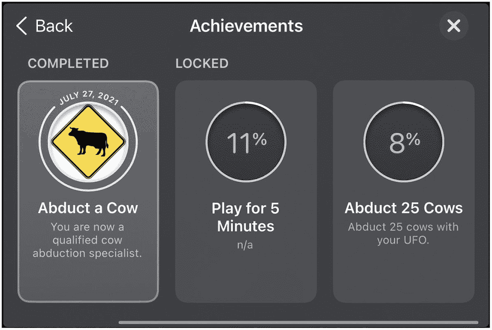

**图 4-8** 正在进行的成就

我们为此项目添加的最后一个钩子用于处理五分钟成就。你的第一反应可能是跟踪游戏时长，并在用户退出游戏时将其作为进度提交。但这可能不是最佳方法。我们希望用户在完成成就时得到通知，而不必等到游戏结束才能看到他们获得了哪些成就。解决这个问题有多种方法。在本例中，我们将每三秒（即五分钟的 `1%`）触发一个 `NSTimer`，并更新成就进度。将以下代码添加到 `UFOGameViewController` 中：

```swift
func tickThreeSeconds() {
    if gcManager?.achievement(withIdentifierIsComplete: "com.dragonforged.ufo.play5") == true {
        return
    } else {
        var percentComplete = gcManager?.percentageCompleteOfAchievement(withIdentifier: "com.dragonforged.ufo.play5") ?? 0.0
        percentComplete += 1
        gcManager?.submitAchievement("com.dragonforged.ufo.play5", percentComplete: percentComplete)
    }
}
```

与修改 `viewDidAppear` 和 `ViewWillDisappear` 函数以匹配以下代码类似，我们将启动一个三秒定时器。每次定时器触发时，我们调用 `tickThreeSeconds`，获取成就当前进度，加上 `1%`，然后提交回服务器。如果成就已经完成，则直接返回。

```swift
override func viewDidAppear(_ animated: Bool) {
    super.viewDidAppear(animated)
    timer = Timer.scheduledTimer(
        timeInterval: 3.0,
        target: self,
        selector: #selector(tickThreeSeconds),
        userInfo: nil,
        repeats: true)
}

override func viewWillDisappear(_ animated: Bool) {
    super.viewWillDisappear(animated)
    timer?.invalidate()
    timer = nil
}
```


### 成就完成反馈

及时告知用户已完成某项成就非常重要。但你不应仅仅弹出 `UIAlertView`，因为大多数成就都是在游戏进行中（例如在赛车游戏中完成 20 圈）达成的，这种方式会严重干扰操作。为了不打断用户的交互，我们需要一个更好的系统。我一直很喜欢从屏幕底部或顶部滑入的小型视图来通知用户达成成就——这与登录 Game Center 时获得反馈的方式非常相似。

要实现反馈系统，我们首先需要在 `GameCenterManager` 中添加一个新的协议方法。我们将用这个方法通知代理：某项成就是首次被完成。将以下函数作为可选协议添加到项目中：

```
func achievementEarned(_ achievement: GKAchievementDescription?)
```

此外，我们需要修改现有的 `submitAchievement:percentComplete:` 方法。请查看该函数的最后一个 `if` 语句块。我们要按如下方式修改它，但需添加一个 `if` 语句来判断 `percentageComplete` 是否超过 100，从而调用我们的新协议。另请注意，我们使用的是 `GKAchievementDescription` 而非 `GKAchievement`。我们将在下一节“自定义成就 GUI”中进一步讨论这一点。

```
if percentComplete >= 100 {
GKAchievementDescription.loadAchievementDescriptions(completionHandler: { [weak self] achievementDescriptions, error in
if let error = error {
print("加载成就描述时发生错误：\(error.localizedDescription)")
}
achievementDescriptions?.forEach{ achievementDescription in
if achievement.identifier == achievementDescription.identifier {
self?.delegate?.achievementEarned(achievementDescription)
}
}
})
}
```

至此，我们对 `GameCenterManager` 类的修改就完成了。现在，我们需要为用户连接视觉反馈。回到 `UFOGameViewController.swift`，并添加我们的新函数 `achievementEarned`。你可以在此处添加任何类型的反馈，包括标准的 `UIAlertView`，但在本节中，我们将探索一些更友好的方式。

我们需要创建一些新的 `IBOutlet` 作为 `UFOGameViewController` 的一部分。创建一个新视图，然后将视图的背景设置为黑色，透明度为 70%。我们还要创建一个新标签，将其放置在此视图的中心，并将文本对齐方式设置为居中。你的视图应类似于图 4-9 所示。

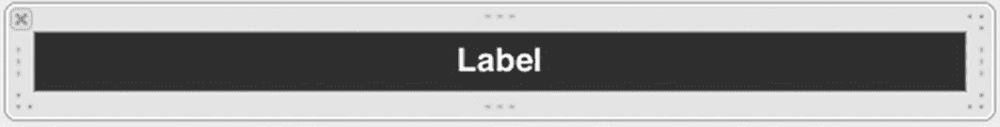

*图 4-9 成就达成视图和标签*

首先，为完成视图创建一个新框架，然后将其作为子视图添加到游戏视图中。

```
func achievementEarned(_ achievement: GKAchievementDescription?) {
achievementCompletionView.frame = CGRect(x: 0, y: 320, width: 480, height: 25)
view.addSubview(achievementCompletionView)
achievementcompletionLabel.text = achievement?.achievedDescription
UIView.animate(
withDuration: 0.5,
animations: {
self.achievementCompletionView.frame = CGRect(x: 0, y: 295, width: 480, height: 25)
},
completion: achievementEarnedAnimationDone
)
}
```

这两个函数都相当简单。当完成成就并收到代理回调时，我们将 `achievementCompletionView` 添加到游戏视图中。然后，我们通过动画将其移动到视图底部。经过五秒延迟后，我们再通过动画将其移出视图。你还可以访问 `GKAchievementDescription` 中使用的图像。我们将在下一节中进一步研究这些属性。

**提示：** 你可能需要重置成就才能看到完成进度。创建一个用于重置成就的新按钮在测试时会很有帮助。

如果你现在运行应用并绑架一头牛（假设你尚未完成该成就），你应该会看到与图 4-10 非常相似的输出。

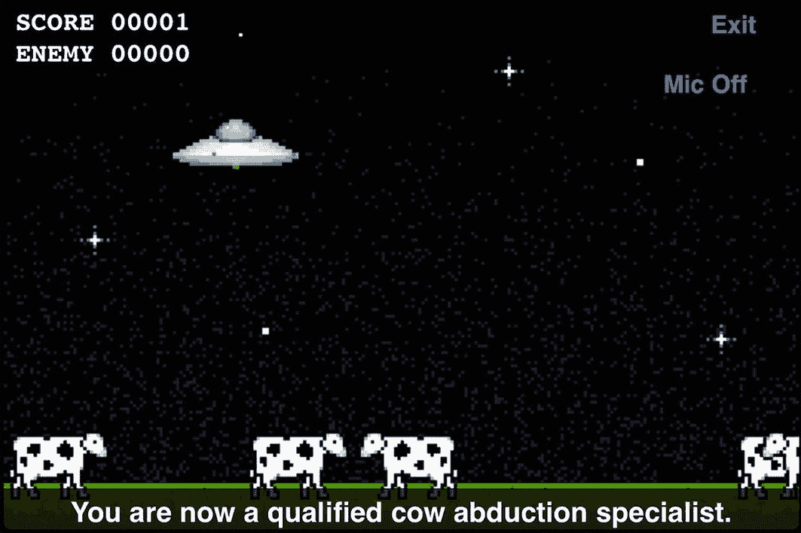

*图 4-10 首次完成新成就后可见的成就通知横幅*


### 自定义成就界面

有时你可能希望自定义成就系统的外观，以匹配应用或游戏中的自定义界面。正如上一章中我们通过排行榜所看到的，我们可以处理原始数据并以任意形式呈现。本节将重点介绍如何使用你自己的 GUI 在应用中添加成就。与排行榜部分类似，我们首先需要添加一个按钮，以便进入自定义成就进度视图。请添加一个新按钮及其关联操作，如图 4-11 所示。

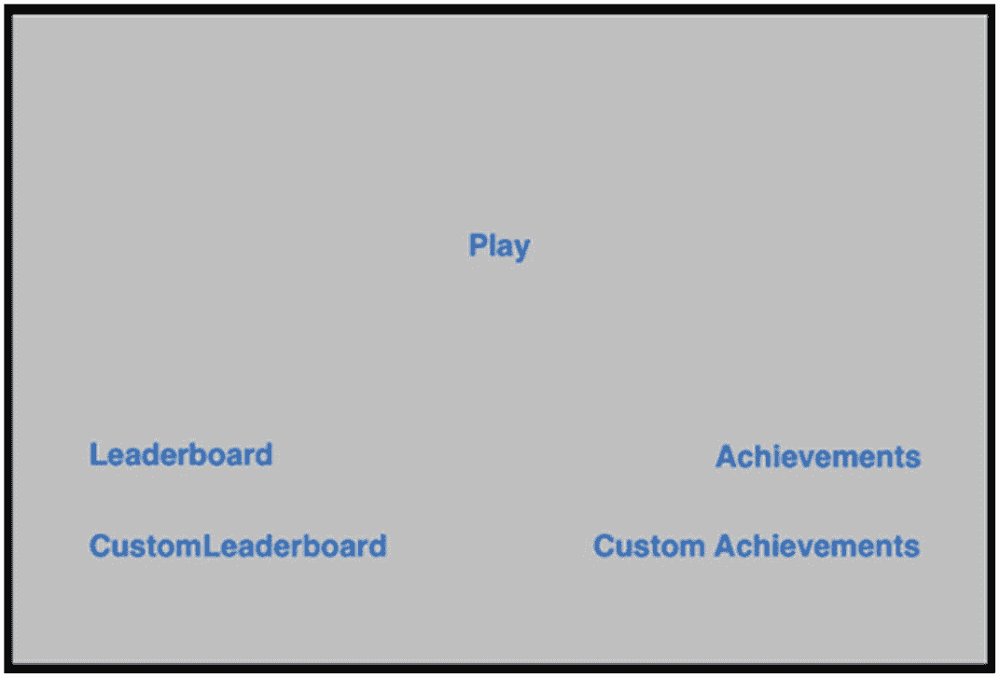

*图 4-11* 在 Xcode 中添加自定义成就按钮

我们需要创建一个新类来处理成就进度信息的处理和显示。创建一个名为 `UFOAchievementViewController` 的新类，并使其成为 `UIViewController` 的子类。在故事板中为表格视图、导航栏和关闭按钮设置操作和输出口。不要忘记同时为表格视图设置数据源和委托。

我们还需要创建一个数组来存储成就数据。创建一个新的 `NSArray` 对象，并命名为 `achievementArray`。同时，导入 `GameCenterManager` 头文件并遵循其协议。

现在，将操作连接到我们新创建的 `UFOAchievementViewController` 类。编辑在 `UFOViewController` 中创建的操作，以反映以下更改：

```
@IBAction func customAchievementButtonPressed() {
let achievementViewController = UFOAchievementViewController()
achievementViewController.gcManager = gcManager
present(achievementViewController, animated: true)
}
```

让我们花点时间切换到 `UFOAchievementViewController` 的文件。我们需要一个关闭操作；请同时添加该函数。

```
@IBAction func dismissAction() {
dismiss(animated: true, completion: nil)
}
```

如果你现在运行应用，应该会看到一个朴素而单调的表格视图，类似于图 4-12 中所示。此外，关闭按钮现在应该能够正常工作。

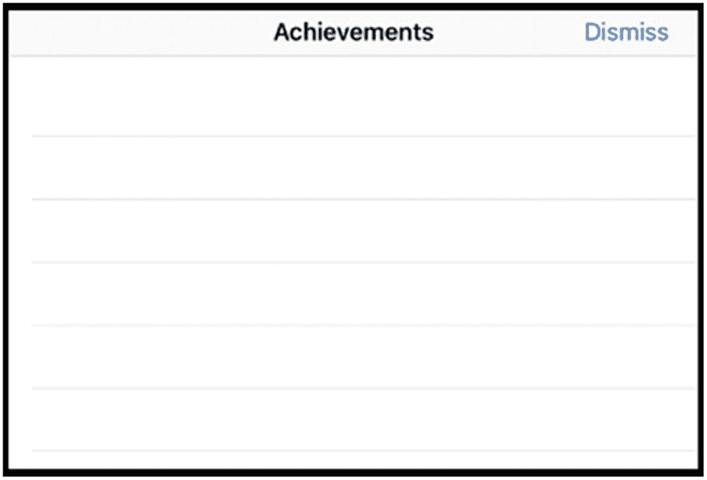

*图 4-12* 我们将用于自定义成就的空白表格

在继续实现 `UFOAchievementViewController` 之前，我们需要回到 `GameCenterManager` 类。将以下方法作为可选协议添加到 `GameCenterManagerDelegate` 中：

```
func achievementDescriptionsLoaded(_ descriptions: [GKAchievementDescription]?, error: Error?)
```

然后在 `GameCenterManager` 的实现中添加以下新方法：

```
func retrieveAchievmentMetadata() {
GKAchievementDescription.loadAchievementDescriptions { (descriptions, error) in
if let error = error {
print("加载成就描述时发生错误：\(error.localizedDescription)")
}
DispatchQueue.main.async {
self.delegate?.achievementDescriptionsLoaded(descriptions, error: error)
}
}
}
```

此函数将返回 Game Center 服务器上找到的所有 `GKAchievementDescription`。现在，我们可以回到 `UFOAchievementViewController` 类，完成自定义成就表格的实现。

**重要提示**： `retrieveAchievementMetadata` 函数也会返回隐藏的成就。如果你想对用户隐藏这些成就，则必须从结果中将其过滤掉。

此外，请添加我们之前创建的新协议。如果没有遇到任何错误，我们只需将返回的描述设置到本地数组中。当获取到新数据时，我们还需要刷新表格以向用户显示数据。

```
func achievementDescriptionsLoaded(_ descriptions: [GKAchievementDescription]?, error: Error?) {
if error == nil {
achievementArray = descriptions
} else {
print("检索成就描述时发生错误：\(error?.localizedDescription ?? "")")
}
achievementTableView.reloadData()
}
```

对于 `numberOfRowsInSection` 方法，我们只需返回 `achievementArray` 的计数，如下所示：

```
func tableView(_ tableView: UITableView, numberOfRowsInSection section: Int) -> Int {
self.achievementArray?.count ?? 0
}
```

我们还需要实现一个 `cellForRowAtIndexPath` 方法。请将以下方法添加到实现中。添加后，我们将更详细地分析它：

```
static let tableViewCellIdentifier = "Cell"
func tableView(_ tableView: UITableView, cellForRowAt indexPath: IndexPath) -> UITableViewCell {
var cell = tableView.dequeueReusableCell(withIdentifier: UFOAchievementViewController.tableViewCellIdentifier)
if cell == nil {
cell = UITableViewCell(style: .default, reuseIdentifier: UFOAchievementViewController.tableViewCellIdentifier)
cell?.selectionStyle = .none
}
let achievementDescription = achievementArray?[indexPath.row]
if let percentage = gcManager?.percentageCompleteOfAchievement(withIdentifier: achievementDescription?.identifier) {
cell?.textLabel?.text = (achievementDescription?.title ?? "")
}
achievementDescription?.loadImage(completionHandler: { (image, error) in
if image != nil {
cell?.imageView?.image = image
} else {
cell?.imageView?.image = GKAchievementDescription.placeholderCompletedAchievementImage()
}
})
return cell!
}
```

该函数的前半部分相当标准：我们创建新的表格单元格，或者从可重用集合中获取一个。为了节省时间，我们使用了默认的内置表格单元格。我们创建一个新的 `GKAchievementDescription`，并根据 `achievementArray` 中的行号为其填充数据。

我们处理的第一个属性是标题，用于设置单元格的 `textLabel`。在大多数情况下，你可能希望同时使用 `achievedDescription` 或 `unachievedDescription` 以及标题。为简单起见，我们在此仅使用标题。接下来，我们需要设置成就的图像。这部分稍微复杂一些。

`GKAchievementDescription` 有一个与之关联的图像属性，在填充之前该属性为 `nil`。首先，检查该属性是否已填充；我们可以通过简单的 `nil` 检查来实现。如果已填充，我们将单元格图像设置为我们缓存的那一个。如果没有，我们需要从 Game Center 服务器加载图像。为此，我们在 `GKAchievementDescription` 对象上调用 `loadImageWithCompletionHandler`。这将返回已获得的图像。请注意，我们使用了默认占位图像，可以通过 `GKAchievementDescription` 上的类方法访问它。

**提示**：在 `UITableViewCellStyleDefault` 单元格中设置图像时，不要将图像设置为 `nil`。这会导致文本左对齐并移除图像视图。如果我们随后使用块来加载图像，则直到单元格或表格被重新加载时，图像才会出现。这就是我们首先设置占位图像的原因。

如果我们运行应用并访问自定义成就视图，它应该类似于图 4-13 中所示的样子。

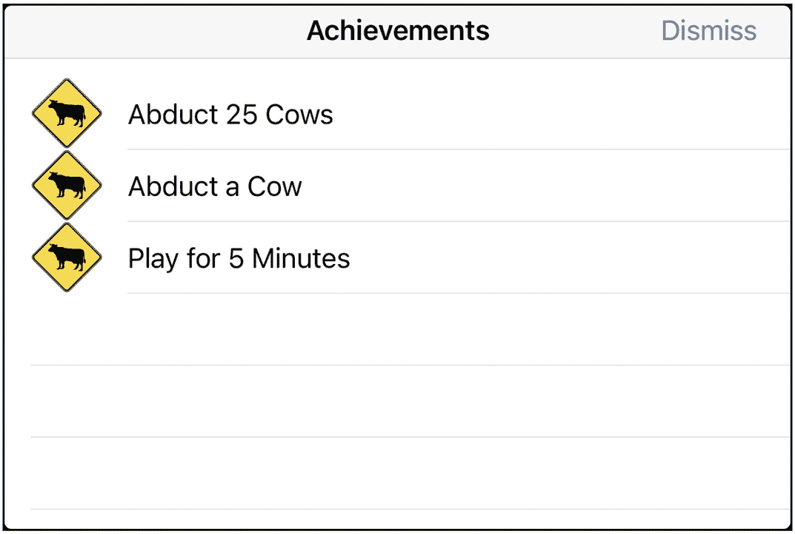

*图 4-13* 在自定义 GUI 中显示的成就数据


我们目前只能查看成就列表及关联图片，而无法了解用户距离解锁成就还有多少进度。回想一下，本章前面部分我们编写了几个便捷函数，此处正好可以派上用场。我们有两个函数可以返回成就的进度信息：`percentageCompleteOfAchievementWithIdentifier:` 和 `achievementWithIdentifierIsComplete`。此外，若想获取完整的 `GKAchievement` 对象，可使用 `achievementForIdentifier`。接下来，我们使用 `percentageCompleteOfAchievementWithIdentifier:` 来显示完成百分比。请修改 `cellForRowAtIndexPath:` 中设置单元格文本标签的代码段。修改后的代码片段应如下所示：

```
if let percentage = gcManager?.percentageCompleteOfAchievement(withIdentifier: achievementDescription?.identifier) {
let percentageCompleteString = String(format: " %.1f%% Complete", percentage)
cell?.textLabel?.text = (achievementDescription?.title ?? "") + percentageCompleteString
}
```

再次运行游戏，你会发现输出信息更有帮助，如图 4-14 所示。

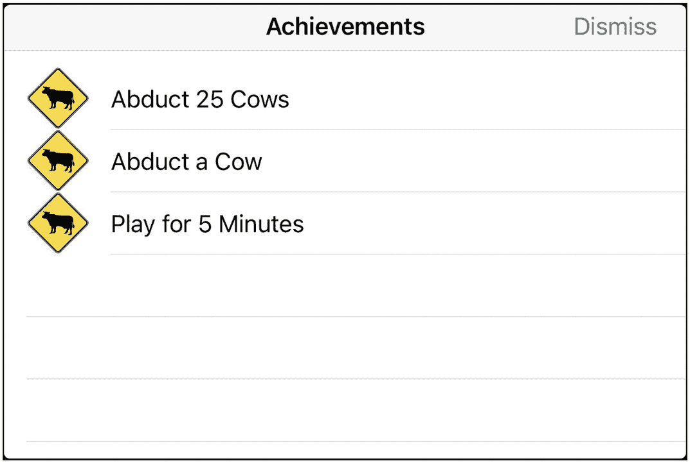

**图 4-14** 带有自定义 GUI 和完成百分比的成就

### 从提交失败中恢复

作为开发者，您需要全权负责处理成就提交失败的情况。您一定不希望用户丢失任何成就进度。丢失成就会让用户感到非常沮丧，必须不惜一切代价避免这种情况。为防止此类问题，我们可以采用之前处理分数失败时的相同方法。主要区别在于，由于 `GKAchievement` 对象不包含任何日期或时效性信息，因此无需存储该对象。我们只需要存储 `percentageComplete` 即可。我们将创建一个新方法来处理这一行为。请将以下方法添加到 `GameCenterManager` 类中：

```
func storeAchievementToSubmitLater(_ achievement: GKAchievement) {
let defaults = UserDefaults()
let savedAchievementsKey = "savedAchievements"
var achievementsDictionary = defaults.dictionary(forKey: savedAchievementsKey) as? [String: Double] ?? [:]
let achievementKey = achievement.identifier
let achievementProgress = achievement.percentComplete
let storedProgress = achievementsDictionary[achievementKey] ?? 0
if achievementProgress > storedProgress {
achievementsDictionary[achievementKey] = achievementProgress
defaults.setValue(achievementsDictionary, forKey: savedAchievementsKey)
}
}
```

此函数将成就作为参数，并检查其是否尚未作为引用存储在我们未能成功提交的成就字典中。如果已存储，则需要比较两者进度，取进度更大者，以避免删除用户的任何进度。完成后，将其作为字典存储到 `userDefaults` 中，使用标识符作为键，完成百分比作为值。我们还需要在 `submitAchievement:PercentComplete:` 函数的错误处理中调用此方法。

**提示** 我建议告知用户，当前无法提交其成就，但已保存，稍后会进行提交。这能让用户知道任何进度都未被丢失。

我们还需要一个新函数来检查是否有未提交的成就进度。至于何时调用此函数最为合适，并没有标准答案。通常可以在用户通过 Game Center 认证后调用，但您可能还希望从其他位置调用它，例如每当网络可达性状态更新时。请将以下方法添加到 `GameCenterManager` 类中：

```
func submitAllSavedAchievements() {
let defaults = UserDefaults()
let savedAchievementsKey = "savedAchievements"
if let achievementsDictionary = defaults.dictionary(forKey: savedAchievementsKey) as? [String: Double] {
achievementsDictionary.forEach { key, value in
submitAchievement(key, percentComplete: value)
}
defaults.removeObject(forKey: savedAchievementsKey)
}
}
```

此函数加载一份未提交进度的副本，并遍历每个项目，尝试逐个重新提交。如果再次提交失败，它们将被重新添加回已保存数据中。

## 总结

至此，您已掌握所有必要工具，可以为支持 Game Center 的 iOS、Mac 或 Apple TV 应用添加丰富且复杂的成就系统。您现在了解了添加成就的价值，以及如何在 App Store Connect 门户中设置和配置成就。我们讨论了使用 Apple 默认 GUI 与自定义 GUI 各自的优缺点。现在您已经知道如何扩展 `GameCenterManager` 类，以包含发布成就进度、获取成就反馈以及重置成就进度等功能。

本章完成的最重要步骤是扩展可复用的 `GameCenterManager` 类，这将使您能够在未来的项目中轻松添加成就。在下一章中，我们将探讨 Game Center 的匹配和邀请系统，以便您添加多人游戏功能及其他网络功能。

