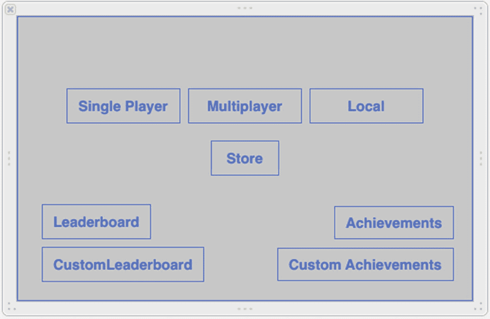
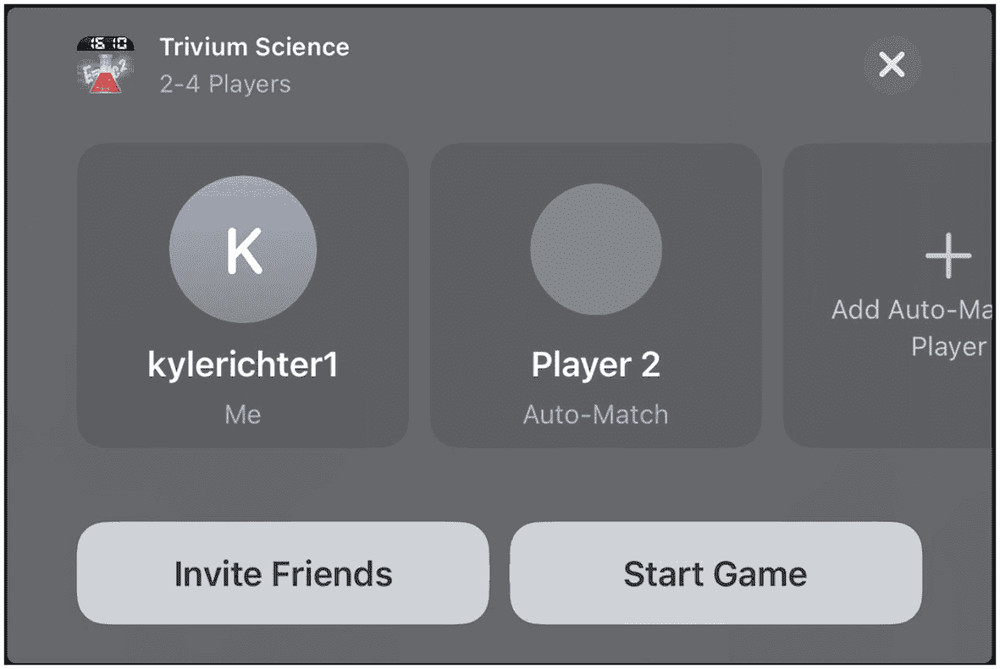
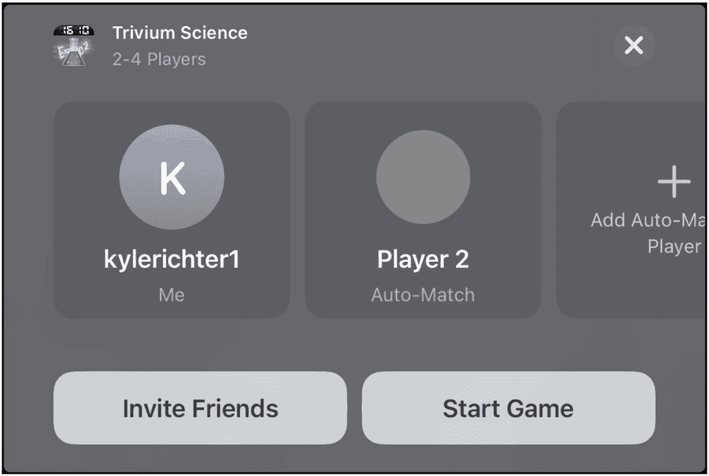
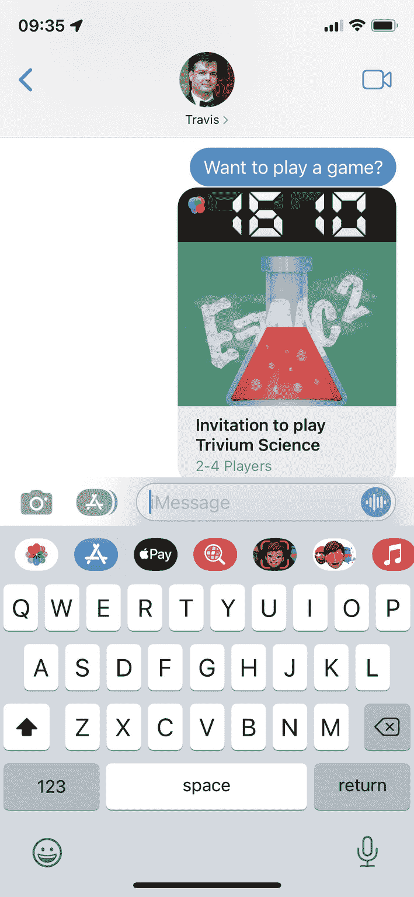
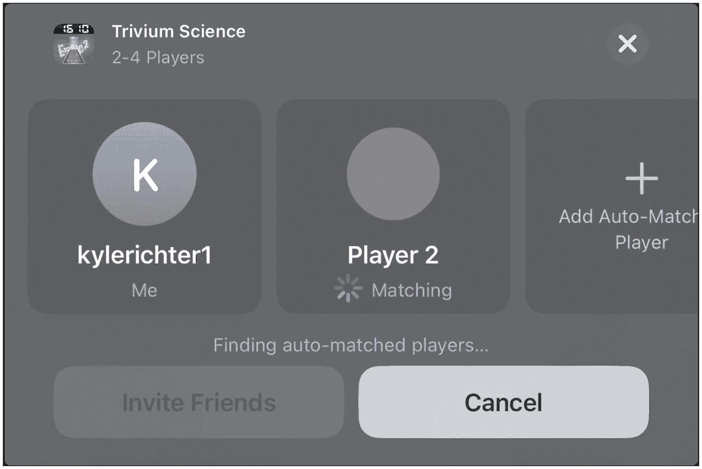
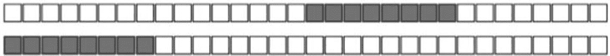
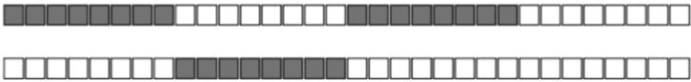
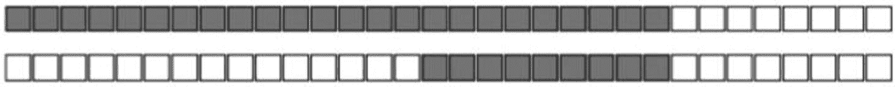
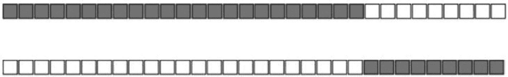

# 5. 匹配与邀请

从本章开始，直至接下来的几章，我们将讨论如何通过 Game Center（以及后续的 GameKit）为您的应用或游戏添加网络和多人游戏功能。为应用添加网络功能在当代几乎被认为是一项基础技术。实际上，如今几乎所有现代软件都带有某种网络组件，无论是与在线服务通信以获取或发布信息，还是直接与对等设备交换数据。

在接下来的章节中，我们将讨论与其他对等设备的通信，但并非所有网络配置都是点对点直连（有关网络设计的详细信息，请参阅第 6 章）。

具体而言，本章将探讨如何利用 Game Center 内置的邀请系统来查找并邀请对等用户进入您的应用。

从历史角度看，Game Center 为开发者提供了一种被严重低估的市场营销和分发工具，尤其是在处理邀请方面，其开销非常低。在邀请本地或互联网用户开始您游戏或应用中的多人体验时，您可以选择邀请任意 Game Center 好友。如果您邀请的好友尚未安装该应用，系统会提示他们立即购买并开始游戏。即使 Game Center 已推出超过十年，iOS 上也没有其他方法能以这种方式向其他用户发送“立即购买”链接。此功能为扩大用户群提供了绝佳途径——只需让您的用户为您推销即可。


## 为何要在你的应用中添加匹配与邀请功能？

查看近些年任何一年 PC 或主机游戏销量前十的榜单，你会发现榜单上绝大多数都是注重多人互动体验的游戏。我们来快速浏览一下 2021 年销量第一的 PC 游戏《*使命召唤：黑色行动冷战*》。虽然这款游戏确实包含单人模式，但这更像是游戏的附加内容，而非主要卖点。其核心显然是多人游戏，即便为此牺牲了单人战役模式。近年来，行业的重心已从打造丰富而深刻的单人战役模式，转向了在多人游戏上投入更多精力。这一新趋势有一个非常合理的解释：投入在多人模式上的资金能带来更大的回报。不过，这并不意味着可以完全忽视单人游戏；实际上，对单人游戏和同屏合作游戏的需求正在增长。

人类本质上是社会性动物。我们渴望社交互动来保持健康的心理发展。电子游戏和其他社交软件正日益成为这种互动的出口。无论你是否认同这一观点中的社会学论断，但事实是多人游戏正变得越来越受欢迎。软件用户越来越喜欢多人互动，无论是大型多人在线角色扮演游戏，还是带有网络大厅的常见第一人称射击游戏，皆是如此。

为你的游戏添加多人元素，可以将用户的游玩时间延长百倍。如需证据，看看《*雷神之锤 III 竞技场*》或《*虚幻竞技场*》吧——这两款游戏均于 1999 年发布，多年后仍有用户登录；甚至在 20 多年后的今天，依然有一个活跃的社区。如果这些游戏只专注于单人模式，它们很可能就不会拥有如此忠诚的粉丝群。以下列出了一些其他原因，说明为何通过 Game Center 添加匹配和邀请功能，无论你考虑何种平台，都应为你的产品做出简单明了的商业决策：

-   为游戏添加多人组件是提升品质的绝佳方式。根据你正在开发的游戏类型，添加多人元素可能只需要很少的额外工作量。
-   用户已经期望 App Store 中的顶级游戏具备多人功能。
-   如果你拥有精心制作的多人组件，就可以合理地为产品设定更高的售价。
-   没有比自动购买邀请系统更能让用户即刻下载你的应用的方式了。如果你能让潜在用户处于被邀请玩游戏并可以立即购买的状态，那么你完成销售的机会就会大得多；这些新用户自己也会带来更多的用户。
-   如果你使用广告支持系统，则可以在你的应用或游戏中增加游戏时间或使用时间。这将带来更多收入。如果你销售付费应用，用户会觉得他们的钱花得更值。
-   人类喜欢竞争，所以鼓励你的用户去做他们喜欢的事情。多人模式或许不适合所有人，但对许多人来说，这是他们在寻找新游戏时唯一感兴趣的部分。

> **提示**  
> 在可能的情况下，也为你的游戏用户提供单人游戏选项，因为依然有相当一部分用户群体偏好单人战役。

### 常见的匹配场景

在我们开始处理匹配和邀请本身之前，理解在尝试为你的 iOS 应用或游戏实现多人网络功能时可能遇到的一些场景非常重要：

-   你可能会遇到的第一个（可能也是最常见的）场景是，玩家已经进入你的应用，并希望创建一个自动匹配的游戏。双方玩家都已安装并加载了应用，并且都处于期望与对方开始网络会话的状态。被邀请的玩家会收到一个通知，询问他们是否想与邀请者一起加入游戏。当双方都同意后，匹配 GUI 会关闭，并创建一个新的比赛。
-   你可能会遇到的另一个常见场景是，用户创建一个新的匹配事件，并从他们的 Game Center 好友列表中邀请其他玩家。被邀请的好友会收到一个推送通知，告知他们已被邀请加入游戏；如果他们已安装游戏并接受邀请，游戏将会启动。一旦所有被邀请的玩家都进入比赛，游戏就会开始。如果他们尚未安装游戏，系统会提示他们安装，并且在安装成功后，游戏会自动启动。
-   如果被邀请的好友尚未安装应用但决定安装，则会触发一个略有不同的事件流程。安装过程结束后，应用会自动启动，然后你可以继续匹配事件的正常流程。
-   玩家也可以直接从 Game Center 应用内部创建一个新的匹配事件。在此场景中，所有玩家都会被启动到应用中，并收到加入比赛的邀请。此场景的妙处在于，如果你的应用已经支持邀请功能，你无需编写任何额外代码来支持此场景。
-   玩家还可以邀请一个或多个好友，并通过自动匹配器填充剩余的空位。这是前两种场景的混合体，如果前两种场景的支持都已添加，那么对于此场景，你无需额外的编程工作。
-   你可能会遇到的最后一个场景（可选）是以编程方式自动匹配玩家。在这种情况下，会向 Game Center 服务器发送请求，然后会为你返回比赛结果。玩家不会看到任何标准 GUI，你可以选择实现自己的界面。

> **注意**  
> 匹配只能在同一应用的两个实例之间进行。如果 bundle identifier 不匹配，应用将无法通过匹配系统进行通信。


## 创建新的比赛请求

要创建一场新比赛，首先需要创建一个新的 `GKMatchRequest` 对象。该对象代表了你即将创建的比赛所需的参数。无论是在展示图形界面时，还是通过编程方式创建比赛时，都会用到 `GKMatchRequest`。使用图形界面时，你需要将 `GKMatchRequest` 对象传递给 `GKMatchmakerViewController` 的新实例；而如果你是以编程方式处理配对，则需要将该对象传递给 `GKMatchmaker` 的实例。有关编程式比赛交互的更多细节，请参考后续章节。现在，我们先将注意力集中在如何在代码中创建新的比赛请求。请看以下代码片段：

```
let request = GKMatchRequest()
request.minPlayers = 2
request.maxPlayers = 2
```

这个示例是创建新比赛的最简单演示。你必须指定最大和最小玩家数量。在这个例子中，我们创建了一个恰好需要两名玩家的新请求。

`GKMatchRequest` 还有一个名为 `playersToInvite` 的属性，你可以使用一个 `GKPlayer` 标识符数组来自动填充到新比赛中。当你连续进行多场关联游戏，并希望保持同一组玩家时，这个属性会非常有用。此外，当你的应用通过 Game Center.app 被邀请你的玩家启动时，该属性会被预填充。

> **注意：** 接受好友的比赛邀请时，事件由 Game Center 应用处理，并且 `playersToInvite` 属性会被填充。

`GKMatchRequest` 还有另外两个属性，你将在本章后续部分用到它们：`playerAttributes` 和 `playerGroup`。这两个属性将在以其命名的章节中详细讨论。

> **注意：** 如果你使用 Game Center 作为托管游戏的服务端，玩家数量上限为四人。然而，如果你按照本章“使用你自己的服务器”部分的描述实现了自己的服务器，则最多可以包含 16 名玩家。

## 展示比赛图形界面

我们首先采用最简单的路径，即使用 Apple 提供的标准配对图形界面。首先添加一个新按钮，用于在测试游戏主屏幕上展示视图。我还提前把原来的 **Play**（游戏）按钮重命名为 **Single Player**（单人游戏），并创建了一个名为 **Multiplayer**（多人游戏）的新按钮（见图 5-1）。我们将让 `UFOViewController` 类充当配对行为的委托，因此需要让视图控制器遵循 `GKMatchmakerViewControllerDelegate` 协议。此外，修改我们刚刚添加的多人游戏按钮的动作函数，使其与以下代码匹配：

```
@IBAction func multiplayerButtonPressed() {
    let request = GKMatchRequest()
    request.minPlayers = 2
    request.maxPlayers = 2
    guard let matchmakerViewController = GKMatchmakerViewController(matchRequest: request) else {
        print("创建配对视图控制器时出错。")
        return
    }
    matchmakerViewController.matchmakerDelegate = self
    present(matchmakerViewController, animated: true)
}
```

我们创建了一个新的 `GKMatchRequest` 实例，如同上一节所做的那样。我们的演示游戏恰好需要两名玩家，因此我们将最大值和最小值都设置为 2。



**图 5-1** – 在 UFOViewController 故事板中为多人游戏添加新按钮

在代码片段的下一部分，我们使用刚刚创建的 `GKMatchRequest` 创建了一个新的 `GKMatchViewController` 实例。

我们还将委托设置为 `UFOViewController` 类。完成后，我们像展示其他任何模态视图一样展示它。你应该会看到类似于图 5-2 所示的输出。

如果你还没有这样做，那么现在正是填充你的沙盒 Game Center 账户好友列表的好时机。为此准备几个未使用过的电子邮件地址会很有帮助，因为你不想使用任何之前在 iTunes Connect 或 Game Center 中使用过的邮箱。一旦你添加了一两个好友，就可以继续点击图 5-2 中所示的 **Invite Friend**（邀请好友）按钮。现在你应该能看到你的好友列表，并且能够邀请他们进入你的应用，如图 5-3 所示。

> **提醒：** 创建沙盒账户时，不要使用你在 iTunes Connect 或 Game Center 中曾经使用过的任何电子邮件地址，否则可能导致奇怪且不可预期的行为。

> **提示：** 许多电子邮件提供商允许你在邮箱地址末尾添加 `+` 作为别名。例如，`GameCenterRocks@Gmail.com` 和 `GameCenterRocks+new@Gmail.com` 都会发送到同一个收件箱，但 Apple 会将它们视为两个不同的邮箱地址。



**图 5-3** – 从你的 Game Center 好友列表中邀请好友



**图 5-2** – MatchmakerViewController 为两名玩家创建新的比赛图形界面

在继续之前，我们需要实现 `GKMatchmakerViewController` 必需的委托函数。在继续处理配对之前，我们需要实现以下三个函数：

```
func matchmakerViewControllerWasCancelled(_ viewController: GKMatchmakerViewController) {
    dismiss(animated: true, completion: nil)
}

func matchmakerViewController(_ viewController: GKMatchmakerViewController, didFailWithError error: Error) {
    dismiss(animated: true, completion: nil)
    let alert = UIAlertController.init(title: "", message: "发生错误：\(error.localizedDescription)", preferredStyle: .alert)
    let defaultAction = UIAlertAction(title: "关闭", style: .default, handler: { action in
        self.dismiss(animated: true, completion: nil)
    })
    alert.addAction(defaultAction)
    present(alert, animated: true, completion: nil)
}

func matchmakerViewController(_ viewController: GKMatchmakerViewController, didFind match: GKMatch) {
    dismiss(animated: true, completion: nil)
}
```

前两个方法处理用户取消和失败的情况，而第三个方法处理成功的情况。最后一个方法在成功时会返回一个 `GKMatch` 对象；我们将在后续章节中使用该对象来开始一场新比赛。

当每场比赛允许的玩家数量可变时，用户将能够通过配对视图控制器添加或移除玩家位置，如图 5-4 所示。在邀请好友加入 Game Center 比赛时，你可以选择提供一条简短消息与邀请一同显示，如图 5-5 所示。



**图 5-5** – 向好友发送邀请消息，请求他们与你开始一场比赛。此消息将以 iMessage 形式发送



**图 5-4** – 一个包含可变玩家数量的配对屏幕


## 处理收到的邀请

在你的应用中实现玩家匹配功能时，还需要实现一个处理好友邀请的系统。被邀请的设备会收到推送通知，告知他们有好友邀请他们一起玩游戏。假设他们已经安装了游戏并接受了邀请，你需要通过建立新的比赛来连接两位玩家。如果被邀请者尚未安装该应用或游戏，系统会提示他们进行下载。下载完成后，将按照正常的邀请流程处理。

**注意**  
你还需要处理来自 Game Center 中新建比赛的邀请。大概率无需编写任何额外代码；不过，建议你彻底测试这一交互路径。

我们将通过邀请处理器（特别感谢 Apple 的命名）来处理邀请。`GKInviteEventListener` 协议中的两个不同的委托方法将负责处理邀请流程。

**重要**  
在沙盒模式下处理邀请时，可能会遇到一些怪异情况。如果你发现自己始终收不到邀请推送通知，可以在两台设备上都打开应用，并让双方互相邀请对方。完成一次这个操作后，通常就能恢复从桌面发起邀请测试的功能。

既然我们已经了解了需要处理的参数类型以及可能遇到的各种场景，就可以开始编写新的邀请处理器了。为保持简洁清晰，我们在 `GameCenterManager` 类中将其封装成一个独立方法。请在 `GameCenterManager` 中添加以下新方法：

```
public func player(_ player: GKPlayer, didAccept invite: GKInvite) {
    guard let matchmakerViewController = GKMatchmakerViewController(invite: invite) else {
        print("创建匹配视图控制器时出错。")
        return
    }
    matchmakerViewController.matchmakerDelegate = self
    present(matchmakerViewController, animated: true)
}

public func player(_ player: GKPlayer, didRequestMatchWithRecipients recipientPlayers: [GKPlayer]) {
    let request = GKMatchRequest()
    request.minPlayers = 2
    request.maxPlayers = 2
    request.recipients = recipientPlayers
    guard let matchmakerViewController = GKMatchmakerViewController(matchRequest: request) else {
        print("创建匹配视图控制器时出错。")
        return
    }
    matchmakerViewController.matchmakerDelegate = self
    present(matchmakerViewController, animated: true)
}
```

我们来逐步解析这两个函数，看看每一步具体做了什么。首先，我们使用传入的邀请对象创建了 `GKMatchmakerViewController`。将匹配处理器的委托设置为 `self`，并将界面展示给用户。

**重要**  
在通过 Game Center 完成本地用户身份验证之前，你无法正式接受或处理邀请。因此，在验证成功后，尽快注册邀请处理器非常重要。

由于我们希望验证成功后能尽快调用此方法，因此在完成身份验证后添加了对这个新方法的调用。请修改 `UFOViewController` 中的 `processGameCenterAuthentication` 方法，使其与下列代码一致：

```
func processGameCenterAuthentication(_ error: Error?) {
    if let error = error {
        print("身份验证期间发生错误：\(error.localizedDescription)")
    }
}
```

**提示**  
如果没有两台设备来测试邀请，可以使用模拟器作为其中一台设备。别忘了用两个不同的 Game Center 账号分别登录模拟器和你的设备，否则双方无法互相邀请。

我们会将自身上下文对象（`UFOViewController`）作为邀请处理器的委托。如果你已经按照上一节《展示匹配界面》的要求完成了必需的委托调用，则无需再对该类进行其他修改。

恭喜！你现在已经能够处理应用收到的邀请。在下一节中，我们将探讨如何配置自动匹配功能，以便为你自动填充被邀请者。

**注意**  
邀请的“立即购买”功能无法在沙盒环境中测试，仅能在正式版应用中使用。在沙盒环境下测试邀请时，每台测试设备都必须安装该应用。

## 自动匹配

在使用 Game Center 时，自动匹配是一项无需额外工作即可享用的优秀功能。Game Center 会维护一个在线队列，记录等待加入你应用中多人游戏的玩家。如果你在新建比赛请求中没有填满所有受邀好友，自动匹配功能将自动用其他在线未匹配玩家填充剩余空位。

请记住，自动匹配的效果完全取决于你游戏的热度；如果你没有足够多的玩家基础来支持自动匹配，用户可能会尝试加入游戏，但在等待片刻后因未能匹配成功而退出。

你可以使用玩家分组和玩家属性来筛选自动匹配的结果，这些内容将在本章后续部分讨论。此外，你还可以查询任何活跃玩家分组的活动情况，以了解匹配新对手的平均等待时间，这部分内容也将在后面章节中进一步讨论。

## 程序化匹配

你的应用也可以在不使用匹配界面的情况下，以编程方式寻找比赛。你可以利用这种方法实现自定义的匹配界面，或者创建“即时匹配”类型的操作，让用户自动配对并直接开始游戏，无需其他用户交互。我们的演示应用不会使用这种匹配方式，但以下方法可以帮助你以编程方式实现匹配：

```
func findProgrammaticMatch() {
    let request = GKMatchRequest()
    request.minPlayers = 2
    request.maxPlayers = 4
    GKMatchmaker.shared().findMatch(for: request, withCompletionHandler: { match, error in
        if let error = error {
            print("寻找匹配过程中发生错误：\(error.localizedDescription)")
        } else if let match = match {
            print("已找到匹配：\(match)")
        }
    })
}
```

上述代码非常简单。我们创建了一个新的 `GKMatchRequest`，并将最小玩家数设为两人，最大玩家数设为四人。然后调用一个新方法 `findMatch`，并传入我们新建的 `GKMatchRequest` 对象副本。当找到匹配时，会调用这个闭包；因此，如果匹配结果没有及时返回，最好显示一个活动指示器。获得 `GKMatch` 对象后，就可以按照后续章节所述开始一个新的多人游戏了。

在使用程序化添加的匹配时，如果匹配耗时过长或用户改变了主意，务必为用户提供取消匹配请求的途径。可通过以下代码行实现这一操作：

```
GKMatchmaker.shared().cancel()
```


## 向比赛中添加玩家

在比赛创建后，有时你可能需要向其中添加新玩家。例如，也许有玩家中途掉线，你希望在不用重新开始比赛的情况下替换他；或者游戏开始后某位玩家未能成功连接，你想找一名替补。以下函数将利用自动匹配行为，自动向比赛中添加新玩家：

```
func addPlayer(to match: GKMatch?, with request: GKMatchRequest?) {
if let match = match, let request = request {
GKMatchmaker.shared().addPlayers(to: match, matchRequest: request, completionHandler: { error in
if let error = error {
print("向比赛中添加玩家时发生错误：\(error.localizedDescription)")
} else {
print("已向比赛添加一名玩家")
}
})
}
}
```

玩家被添加至比赛后，你需要让该玩家与当前比赛同步。添加玩家后，该玩家将可以接收和发送数据，但无法访问比赛中已发送过的历史数据。

## 重新邀请

Game Center 具有自动尝试重新邀请断线玩家的功能。此方法仅支持两人模式的 Game Center 比赛。当玩家断线时，会调用以下函数；Game Center 将自动尝试重新连接该玩家。如果成功，你会额外收到一次对 `match(_:player:didChange:)` 的调用：

```
func match(_ match: GKMatch, shouldReinviteDisconnectedPlayer player: GKPlayer) -> Bool {
true
}
```

## 玩家分组

玩家分组允许你为每位玩家指定不同的分类。默认情况下，Game Center 会自行匹配所有玩家到同一组。通过玩家分组，你可以指定某些玩家只寻找包含同组其他玩家的队伍。

例如，想要挑战特定难度地牢或特定赛道的玩家会被分到同一组，使他们能与其他有相同游戏意愿的玩家配对。玩家分组可用于将玩家划分到多种不同类型的群体中，例如：

-   希望玩同一关卡地图（如赛道）、RPG 中的特定区域、第一人称射击游戏中的地图、或动作游戏中某一关的玩家。

-   根据技能等级区分玩家。既可以由玩家自行选择想玩的技能等级，也可以根据过往表现或连胜记录自动判定其技能等级。

-   正在进行的游戏类型。例如，可依据玩家想玩“夺旗模式”、“团队死斗”、“占领模式”还是“孤军奋战”进行划分。

-   希望共同游戏的同一部落、公会、战队或网络内的玩家。

-   已购买额外应用内内容，且因故无法再与未拥有相同内容的玩家配对的玩家。

玩家分组并不局限于这些类别，你可以根据应用需求以任何方式将玩家分组。玩家分组通过 `GKMatchRequest` 的 `playerGroup` 属性来表示。该属性唯一的限制是必须为 `Int` 类型。指定 `playerGroup` 的方法相当直接，如下方代码片段所示：

```
let myForestMap = 123456789
let request = GKMatchRequest()
request.minPlayers = 2
request.maxPlayers = 4
request.playerGroup = myForestMap
```

在大多数情况下，你应该让用户自行选择他们所属的 `playerGroup`；但也有一些例外情况，比如自动判定玩家的技能等级。

**注意：** 一旦将 `playerGroup` 设置为任何非零值，玩家将只会与同组的其他玩家进行匹配。

## 玩家属性

与玩家分组类似，玩家属性在匹配过程中用于缩小可供用户选择的游戏范围。玩家属性通常与玩家分组功能相同，但处理某些事情的方式有所不同。玩家属性的诸多用途包括以下几种：

-   在角色扮演游戏中，角色通常会选择职业。为了完成任务，通常需要一支包含多种职业的队伍——例如治疗者、战士和法师。

-   体育游戏中通常有各种场上位置，如守门员、后卫、中场和前锋。一支队伍需要这些位置的混合才能进行比赛。

-   在潜艇模拟游戏中，你也可以安排不同角色的玩家，如舰长、声纳操作员、领航员和武器系统操作员。

-   在第一人称射击游戏中，你可能需要担任近距离战斗专家、狙击手、医疗兵和排长等角色的玩家。

### 了解玩家属性的限制

玩家属性可用于给每位玩家分配这些值，从而使你能够平衡包含所需角色的队伍。然而，使用玩家属性时存在若干限制；在开始使用玩家属性之前，务必熟悉以下几点：

-   每个角色只能由一名玩家担任。例如，你不能在一场足球比赛中要求三名中场球员。

-   所有角色都必须被填满后，游戏才会被认为可以开始。例如，根据前述例子，第一人称射击游戏不能没有狙击手。

-   每位玩家一次只能担任一个角色；玩家不能以同时满足多个角色的身份加入游戏。例如，你不能让一位第一人称射击游戏的玩家既愿意当狙击手又愿意当医疗兵；他们需要在匹配请求确定之前选择一个。

-   玩家属性在自动匹配过程中使用。如果你邀请朋友加入游戏，系统不会检查他们是否符合需要填补的角色。相反，他们会被自动分配一个随机且未被占用的角色。简言之，朋友无法选择自己的玩家属性。

-   玩家属性不会显示在标准匹配界面的任何位置。你需要在进入该视图之前实现自己的系统，以便让用户选择角色。

-   `GKMatch` 对象不包含关于哪些玩家被分配了哪些角色的信息。你需要在比赛连接后自行实现系统来判断谁在扮演哪个角色。

-   没有现成系统可以判断哪些角色供过于求，或哪些角色更难找到比赛。例如，在角色扮演游戏中可能每个人都想玩法师，而没人愿意当治疗者；因此，法师玩家找公开比赛会困难得多，而治疗者则能轻易找到比赛。


### 使用玩家属性

不要让一长串限制让你对玩家属性望而却步。即使存在这些限制，它们在创建更好的多人游戏体验方面仍然极具价值。我们来看一个如何使用玩家属性构建比赛的示例：

```
struct PlayerClass: OptionSet {
let rawValue: UInt32
static let squadLeader     = PlayerClass(rawValue: 0xFF000000)
static let breacher        = PlayerClass(rawValue: 0x00FF0000)
static let grenadier       = PlayerClass(rawValue: 0x0000FF00)
static let lightMachineGun = PlayerClass(rawValue: 0x000000FF)
}
```

首先，我们为每个玩家属性定义一个掩码，在本节剩余部分将其称为“职业”。这个示例代表了一个现代军事风格游戏中的标准小队。每个职业被分配了一个不同的掩码值。Game Center 使用一种算法，根据以下规则将这些玩家匹配在一起。

-   比赛的掩码始终以邀请玩家的掩码开始。
-   如果邀请玩家已设置了玩家属性掩码，Game Center 将忽略所有未设置玩家属性掩码的玩家。
-   只有当玩家的玩家属性掩码与比赛中已邀请的任何玩家的掩码的任何部分都不重叠时，该玩家才会被添加到比赛中。
-   将玩家添加到比赛后，该玩家的属性值将逻辑上**或**到比赛的掩码中。
-   如果比赛的掩码值等于 `FFFFFFFFh`，则认为比赛已满员并可以开始；如果掩码不等于 `FFFFFFFFh`，则 Game Center 将继续搜索可以填补比赛的玩家。
-   无法查询 Game Center 以查看当前仍在等待哪个玩家。

以下内容基于我们刚刚定义的职业。一个空白的比赛将拥有如图 5-6 所示的玩家属性掩码。


**图 5-6** 一个空的玩家属性掩码 (`0x00000000`)

玩家 1 开始一场新比赛，并选择“班长”作为他的职业。当该玩家创建比赛时，比赛的玩家属性掩码将如图 5-7 所示。


**图 5-7** 代表“班长”职业的玩家属性掩码 (`0xFF000000`)

现在，比赛的创建者使用 Game Center 自动匹配新玩家。Game Center 找到的第一个玩家选择了“掷弹兵”职业。“掷弹兵”的掩码将如图 5-8 所示。


**图 5-8** 代表“掷弹兵”职业的玩家属性掩码 (`0x0000FF00`)

将其与已有的比赛掩码（如图 5-9 所示）比较，我们可以看到没有重叠，因此该玩家可以被邀请加入游戏。



**图 5-9** 比较 `0xFF000000` 和 `0x0000FF00`

当这些掩码合并形成新的比赛掩码时，它将如图 5-10 所示。


**图 5-10** 一个新的比赛掩码，代表两名玩家 (`0xFF00FF00`)

玩家 3 选择“突击手”作为他的职业并搜索游戏。Game Center 找到了我们一直在处理的那个比赛，并通过比较比赛掩码和“突击手”掩码确定有空位，如图 5-11 所示。



**图 5-11** 上方是当前比赛的掩码 (`0xFF00FF00`)，下方是“突击手”的掩码 (`0x00FF0000`)

由于掩码之间没有重叠，因此“突击手”可以被邀请加入游戏。玩家 4 选择了“掷弹兵”职业，并让 Game Center 寻找比赛。Game Center 再次找到了我们正在进行的比赛，并试图将新玩家加入其中。

由于玩家 4 提供的掩码与比赛掩码的一部分重叠（见图 5-12），因此不允许该玩家加入。如果 Game Center 无法为该玩家找到开放的比赛，它将开始寻找新玩家来填补该玩家比赛的缺口。



**图 5-12** 上方是当前比赛的掩码 (`0xFFFFFF00`)，下方是“掷弹兵”的掩码 (`0x0000FF00`)

玩家 5 选择“轻机枪手”作为他的掩码并开始寻找要加入的游戏。Game Center 将他的掩码与当前比赛的掩码进行比较，如图 5-13 所示。



**图 5-13** 上方是当前比赛的掩码 (`0xFFFFFF00`)，下方是“轻机枪手”的掩码 (`0x000000FF`)

由于两组掩码之间没有重叠，玩家 5 可以加入比赛。这将为比赛创建一个完整的玩家属性掩码，如图 5-14 所示。


**图 5-14** 一个已满员的比赛掩码 (`0xFFFFFFFF`)

如果玩家 5 从未加入游戏，而最初的邀请者想用 Game Center 上的一个朋友来填补这个空位，那么被邀请的朋友将无法选择他的职业。在这种情况下，比赛将拥有一个如图 5-15 所示的掩码。然后，被邀请的朋友会被分配一个如图 5-16 所示的掩码，这将补全比赛的掩码，从而完成所有玩家属性掩码并允许游戏开始。


**图 5-16** 完成比赛掩码所需的“机枪手”掩码 (`0x000000FF`)


**图 5-15** 当前比赛的掩码 (`0xFFFFFF0`) [注：原文疑似笔误，但保留]

设置玩家属性非常简单，如以下代码片段所示：

```
struct PlayerClass: OptionSet {
let rawValue: UInt32
static let squadLeader     = PlayerClass(rawValue: 0xFF000000)
static let breacher        = PlayerClass(rawValue: 0x00FF0000)
static let grenadier       = PlayerClass(rawValue: 0x0000FF00)
static let lightMachineGun = PlayerClass(rawValue: 0x000000FF)
}
...
let request = GKMatchRequest()
request.minPlayers = 4
request.maxPlayers = 4
request.playerAttributes = PlayerClass.squadLeader.rawValue
```


## 玩家活动

Game Center 提供了一种查询近期玩家活动的方法。你的用户通常希望尽可能了解他们在寻找多人比赛时可能需要等待多长时间。需要明确的是，玩家活动指的是近期活动，而非当前活动。苹果没有提供任何方法来精确判断有多少玩家正在等待比赛，但确实提供了一种方式来确定近期有多少用户寻找过比赛。让我们来看看获取玩家活动所需的源代码。将以下两个新函数添加到你的 `GameCenterManager` 类的实现文件中：

```
func findAllActivity() {
    GKMatchmaker.shared().queryActivity { activity, error in
        DispatchQueue.main.async {
            self.delegate?.playerActivity?(activity as NSNumber, error: error)
        }
    }
}

func findActivityForPlayerGroup(_ playerGroup: Int) {
    GKMatchmaker.shared().queryPlayerGroupActivity(playerGroup) { activity, error in
        let activityDictionary = [
            "activity": activity,
            "playerGroup": playerGroup,
        ]
        DispatchQueue.main.async {
            self.delegate?.playerActivity?(forGroup: activityDictionary, error: error)
        }
    }
}
```

我们还需要在 `GameCenterManager.swift` 的 `GameCenterManagerPlayerDelegate` 中添加两个新的协议方法。添加以下两个函数：

```
func playerActivity(_ activity: Int?, error: Error?)
func playerActivity(forGroup activityDict: [AnyHashable : Any]?, error: Error?)
```

当你在 `UFOViewController` 中实现这些新的协议方法，如下所示：

```
func playerActivity(_ activity: Int?, error: Error?) {
    if let error = error {
        print("查询玩家活动时发生错误：\(error.localizedDescription)")
    } else {
        print("所有近期玩家活动：\(activity ?? 0)")
    }
}

func playerActivity(forGroup activityDict: [AnyHashable : Any]?, error: Error?) {
    if let error = error {
        print("查询玩家活动时发生错误：\(error.localizedDescription)")
    } else {
        if let activity = activityDict?["activity"],
           let playerGroup = activityDict?["playerGroup"] {
            print("所有近期玩家活动：\(activity) 分组：\(playerGroup)")
        }
    }
}
```

你应该能得到类似以下的输出：

```
2021-03-08 11:11:04.007 UFOs[3000:207] 所有近期玩家活动：3 分组：12345
2021-03-08 11:11:04.008 UFOs[3000:207] 所有近期玩家活动：3
```

现在我们获得了指定玩家分组的活动数据，但这些数字究竟意味着什么？苹果从未明确说明这些数字的确切含义，但通过仔细研究，它们似乎代表了过去一到三分钟内尝试使用自动匹配功能连接游戏的用户数量。这些数字似乎会在该时间范围内的某个不可确定的间隔内重置。此外，从用户尝试加入比赛到新数字反映出来，似乎存在 15 到 30 秒的延迟。

尽管存在这些由玩家活动机制带来的限制，但它仍然是一个非常有价值的工具，可以帮助你判断用户找到比赛的可能等待时间。不过，你需要确保这些信息仅供参考，因为它们往往不够可靠，不足以作为决策依据。

**注意：** 如果苹果系统提供的玩家活动信息不足以满足你的应用需求，你可以自行实现服务器系统来精确追踪有多少玩家正在等待比赛。

## 使用自有服务器（托管比赛）

在正常情况下，Game Center 会为你托管比赛；然而，苹果也提供了一种实现自有服务器来托管比赛的技术。这种方法被称为“托管比赛”，可以在任何应用中实现，以增加基于 Game Center 的多人在线网络的灵活性。

当使用 Game Center 托管比赛时，连接到该比赛的每台设备都会创建一个 `GKMatch` 实例。`GKMatch` 类负责处理连接、握手、发送和接收数据以及处理错误等所有繁重工作。但有时你需要实现自己的服务器，特别是当你想允许同一时间超过四人连接到同一比赛时。在这种情况下，你可以使用 Game Center 为你的比赛寻找同伴，并使用自己的服务器来连接这些同伴。

**提示：** 使用托管比赛可以连接多达 16 位用户，而使用 Game Center 托管时最多只能连接四人。

然而，使用自有服务器也有一些缺点，最显著的是，你现在需要负责以前由 Game Center 免费提供的所有繁重工作，具体包括以下几点：

-   你必须自行设计和实现所有网络代码来连接同伴。Game Center 会为你寻找比赛，但其作用仅止于此。
-   如果你的应用使用的是标准匹配界面，那么你的服务器必须在新的同伴成功连接时通知应用，以便更新图形用户界面。

为了在设备端支持托管比赛，我们需要对代码库进行一些细微的修改。我们从修改本章前面设置的多人游戏按钮操作方法开始。

```
@IBAction func multiplayerButtonPressed() {
    let request = GKMatchRequest()
    request.minPlayers = 2
    request.maxPlayers = 4
    guard let matchmakerViewController = GKMatchmakerViewController(matchRequest: request) else {
        print("创建匹配视图控制器时出错。")
        return
    }
    matchmakerViewController.matchmakerDelegate = self
    matchmakerViewController.isHosted = true
    present(matchmakerViewController, animated: true)
}
```

如你所见，我们添加了一行新代码 `matchmakerViewController.isHosted = true`，这告诉匹配图形用户界面，此比赛将在我们自己的服务器上托管。除了将 `matchMakerViewController` 设置为托管模式外，你还需要让每台设备连接到你的服务器。本节不涉及如何编写服务器代码，因为这里可以使用数十种语言和方法。但是，在设备连接到你的服务器后，它需要针对加入的玩家调用以下代码：

```
matchmakerViewController.setHostedPlayer(player, didConnect: true)
```

这将会更新所有已连接玩家屏幕上的图形用户界面，通知他们新玩家已准备好开始比赛。当所有玩家都连接到你的服务器并确认准备就绪后，你的委托方法将被调用来开始游戏。在使用 Game Center 比赛时，我们使用委托回调 `matchmakerViewController(_:didFind:)` 来开始比赛。然而，对于托管比赛，我们使用以下方法：

```
func matchmakerViewController(_ viewController: GKMatchmakerViewController, didFindPlayers playerIDs: [String]) {
    dismiss(animated: true, completion: nil)
    print("玩家：\(playerIDs)")
    //开始托管比赛
}
```

此时，你可以开始游戏，由你的服务器处理已连接玩家之间的通信。此外，你也可以像本章前面看到的 Game Center 托管比赛那样，通过编程方式开始一个托管比赛。

```
func findProgrammaticHostedMatch() {
    let request = GKMatchRequest()
    request.minPlayers = 2
    request.maxPlayers = 16
    GKMatchmaker.shared().findPlayers(forHostedRequest: request) { players, error in
        if let error = error {
            print("寻找比赛时发生错误：\(error.localizedDescription)")
        } else if let players = players {
            print("已为比赛找到玩家：\(players)")
        }
    }
}
```

如你所见，这与之前的方法非常相似；不过，我们返回的不是一个 `GKMatch` 对象，而是一个玩家数组。你还会注意到，我们还可以将最大玩家数增加到 16 人。


## 总结

本章介绍了匹配与邀请的概念。我们讨论了为你的 iOS、Mac 或 Apple TV 应用或游戏添加多人模式带来的巨大优势，以及在此过程中可能遇到的一些障碍。我们探索了从展示标准 Apple 界面到使用玩家群组和玩家属性实现高度自定义匹配的整个匹配流程。我们回顾了如何在各种可能场景下处理邀请，以及如何查询玩家活动。最后，我们发现了如何通过实现自己的服务器来消除 Game Center 的一些限制。我们还扩展了可复用的 Game Center 管理器，使其能够处理匹配、邀请及所需的开销，从而让你能快速为应用添加多人模式功能。

在本章中，我们深入探讨了如何创建比赛并用玩家填充比赛。在接下来的章节中，我们不仅会学习玩家之间如何通信，还会探索寻找可通信玩家的新方法。下一章将介绍如何为你的游戏或应用设计网络环境。

