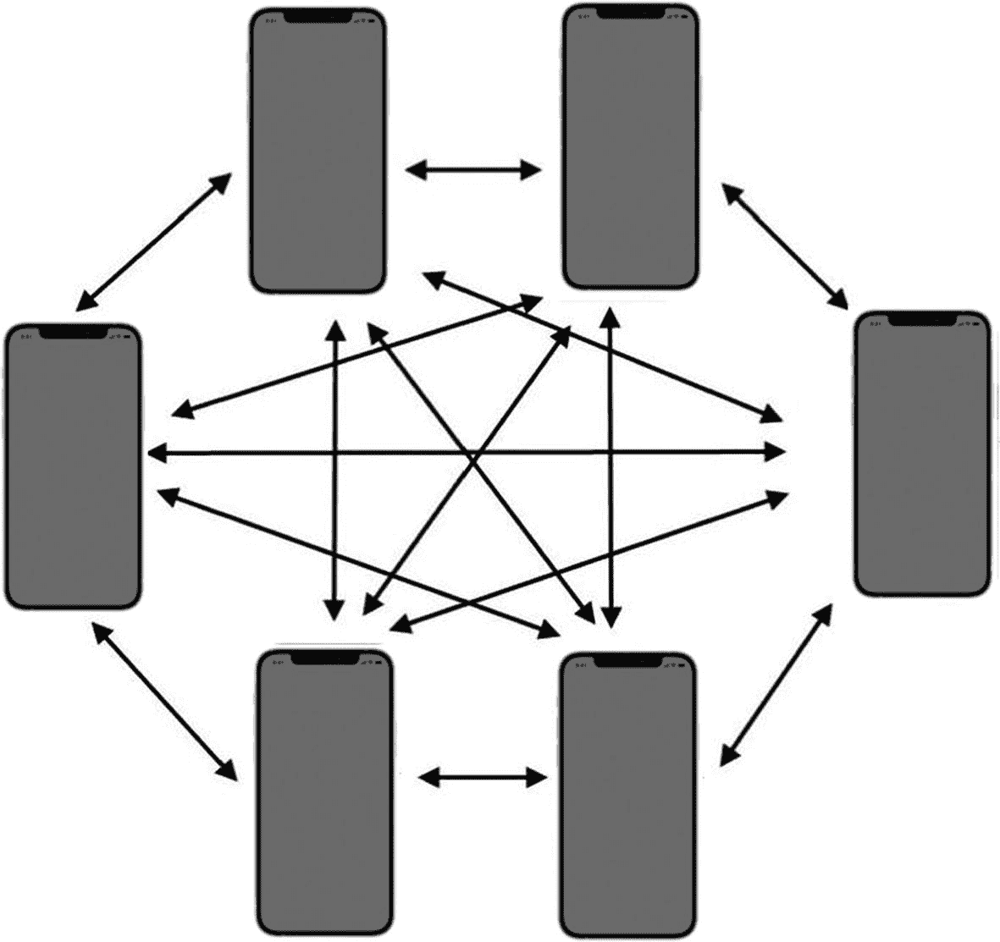
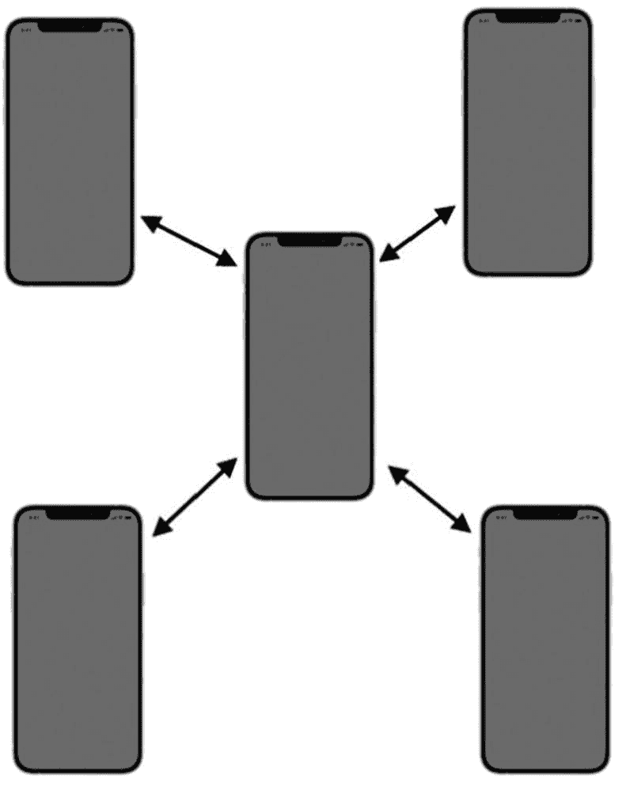
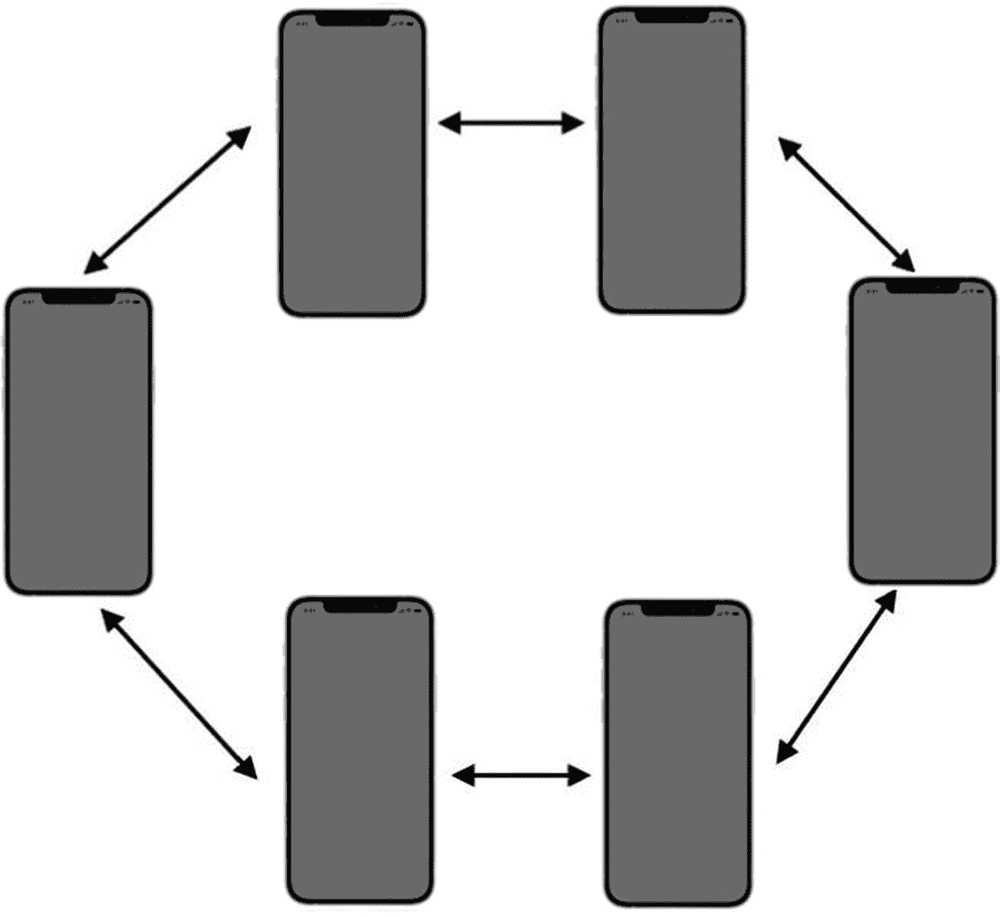

# 6. 网络设计概述

在前几章中，我们学习了如何通过使用 Game Center 和 GameKit 的多种方法来查找玩家并建立连接。在本章中，我们将探讨如何为现代电脑游戏设计网络体验。本章的撰写和布局与你之前阅读的章节略有不同。主要区别在于，本章不涉及相关源代码，我们仅会简要提及 GameKit 网络主题本身。本章将从学术角度聚焦于网络设计的概念，而非实际实现网络本身。在下一章中，你将了解如何将所有内容整合起来，让玩家之间开始相互通信。

虽然完全可以（并且也经常发生）不经过任何计划或思考就直接开始编写网络逻辑，但这可能并非一个好主意。毕竟，你不会在事先不规划好逻辑如何运行的情况下就开始编写一个新应用或游戏。网络设计是一个复杂的主题，你应该有计划地进行；否则，你可能会在投入大量工作后发现自己需要从头重写整个系统。你肯定不希望因为所采用的方法限制了未来扩展的可能性而陷入困境。就像软件开发一样，你不应该在第一天就急着写代码。你应该先做一些白板推演，感受一下项目的需求。

以一款名为 Clan Lord 的桌面角色扮演游戏为例，它于 20 世纪 90 年代末期为 Mac 编写。Clan Lord 拥有一个非常忠实的粉丝群，使得这款游戏至今仍保持活跃。然而，在游戏最初编写时，许多与网络相关的问题似乎并未为这样一款二十多年后仍会被游玩的游戏做充分考量。

Clan Lord 对其所有网络调用都采用逐帧同步。这意味着每一帧，玩家屏幕上的每个可见元素都必须被传输。当游戏规模小、用户基数小、功能复杂度有限时，这种方法能良好运作。然而，在设计软件时，你不能对未来抱有限制性的愿景。始终要未雨绸缪，规划最好的情况，或者，取决于你的视角，规划最坏的情况。在设计网络时，你必须考虑到六个月、一年甚至十年后你希望你的游戏或应用做什么。软件远超预期寿命并持续运行远超最初开发者设想的年代，这种情况屡见不鲜；只需看看“千年虫”问题，我们就能看到这一点。每个开发者都认为很快会有更好的东西来取代他们正在做的工作；但通常他们都错了，产品会长期存续下去，远远超过让它们继续运行的实际意义。

Clan Lord 现在饱受根深蒂固的问题困扰，例如每秒五帧的渲染引擎，这是因为在普通家庭网络上，每秒无法同步超过五帧的完整数据。如果在项目启动之初就在客户端中实现一些逻辑，这原本是可以避免的；例如，将对象的位置及其移动时间告知客户端，而不是每帧都完全同步所有内容，效率会高得多。此外，由于玩家动作必须同步回服务器，玩家移动被限制在每秒四到五帧，这使得对事件做出反应变得困难。这原本也可以通过使用本章稍后讨论的预测算法来避免，该算法用于确定玩家在移动过程中最终会到达的位置。

Clan Lord 是一个例子，它比计划中更受欢迎（或者说至少拥有一个更忠诚的粉丝群），并且生命周期远超所有人的预期。遗憾的是，当这种情况发生时，你就会受到项目启动之初所定下的愿景和设计的限制。以后撤销某些东西比一开始就做好要困难得多。在设计你的网络时，请花时间仔细并有目的地进行，因为它可能会在很长一段时间内困扰你和你开发的应用程序。

## 三种网络类型

尽管存在多种不同的网络设计类型，但在设计网络基础设施时，你可以实现三种实用且主流的网络。选择一种主要的网络类型是一个好的起点，因为它将引导你进入设计过程的下一步。

我们将重点讨论这三种主要的网络设计类型，但请记住，还有数十种其他知名的网络配置，我们将在本节中简要提及其中一些。我们将在本章中详细讨论的三种网络类型是：点对点网络、客户端-主机网络和环形网络。

### 对等网络

对等网络（见图 6-1）是 iOS/Mac 平台上最常见的一种网络。其中没有任何一台设备会被区别对待，每台设备都负责向它希望通信的其他所有对等节点发送和接收数据。尽管这种网络看起来可能很复杂，但它却是将多台设备连接在一起进行通信的最简单直接的方法之一。

图 6-1：使用六台 iOS 设备的对等网络示意图

对等网络常用于处理 Game Center 网络连接，因为它是该平台上最容易实现的方式。虽然这种方法具有设置极其简单的优点，但它同样也存在不少缺点。首先，它会产生大量冗余的开销。每个对等节点都需要将其操作告知其他所有对等节点。在如图 6-1 所示的六路网络中，这意味着每台设备每次想要更新游戏状态时，都需要发送五条消息。此外，如果你正在实现一个需要每个对等节点确认消息成功接收的系统，那么每次事件你还需要接收五条确认消息。

对等网络的另一个缺点是，当处理大量对等节点时，可能会变得非常混乱。正如你从图 6-1 中看到的那样，事情很快就会变得杂乱无章。与我们在本节中讨论的其他主要网络类型不同，对等网络是唯一一种没有清晰数据流的网络。根据定义，每个对等节点都可以向任何其他对等节点发送消息。这也意味着你必须要追踪每个对等节点需要了解什么信息。在大多数情况下，这是一种完全可以接受的方法。然而，当你开始处理更复杂的网络类型以及需要发送和接收的信息时，这种配置可能就不再理想了。

此外，没有哪一台设备控制着游戏的状态。如果存在人工智能组件，那么你将需要设计一个系统，使其能够在所有设备之间保持同步。

### 客户端-主机网络

客户端-主机网络会指定一台设备作为主机，或者如果你喜欢这个术语，也可以称为服务器。这台设备负责向所有已连接的客户端发送信息。客户端之间从不直接通信；它们只与主机通信，随后主机再将所需的信息转发给其他客户端。图 6-2 展示了客户端-主机设置的一个示例。

图 6-2：使用五台 iOS 设备的客户端-主机网络示意图

客户端-服务器网络简化了数据流。每个对等节点或客户端只需要关心自身和主机即可；它们无需知道网络上可能存在的其他设备。这种网络的好处在于，由一台设备来保持所有内容的同步并处理信息流；这使得它成为一个非常安全的网络（在反作弊意义上）。不过，在 iOS 平台上作弊并不是一个大问题，因为它本身就是一个沙盒系统；Mac 的状态虽然更开放一些，但通常除非游戏变得非常成功，否则这也不是主要问题。

这种系统还有其他好处，例如只需要一台设备来管理网络状态，并且这台唯一的设备负责控制网络行为。这种网络类型简化了诸如连接、断开连接、传输错误以及其他状态变化（例如由计算机控制的对象，如人工智能）等事件的处理。然而，同样的设置在 iOS 平台上可能会带来麻烦；如果主机设备需要处理过多的信息，这台设备的运行速度可能会变慢，或者耗电更快。这种方法还需要两套独立的逻辑处理程序，一套用于客户端，一套用于主机。在更大的环境中，当不再需要某位玩家担任主机时，这种类型的系统就变成了专用的服务器系统。

### 环形网络

环形网络（见图 6-3）没有主机，也没有客户端。它的工作方式类似于对等网络，但每个对等节点只负责与一个指定的对等节点通信，并且只从另一个单独定义的对等节点接收信息。信息以环状在一组设备中流动，因此得名。

这种网络在 iOS 平台上并不常见，因为通常它提供的用于处理断开连接的对等节点的冗余性，并没有太多必要。Apple 已经做了大量基础工作来确保网络保持活跃和稳定，而无需开发者花费额外的设计时间来确保不会出现对等节点与当前已连接的其他对等节点失去联系的情况。不过，有时你在 iOS 平台上设计网络时，可能会发现这种配置很有用。请记住，当你在环形网络中增加额外的客户端时，信息完成一次环回路所需的时间会随之增加，并且特别容易受到一个或多个延迟设备的拖累。

图 6-3：使用六台 iOS 设备的环形网络示意图。请注意，相比图 6-1 所示的对等网络，此图看起来要简洁得多

## 较少常见的网络

计算机科学中还有许多其他类型的网络设计可用。有些方案比其他方案更实用，有些则主要停留在理论层面。在本节中，我们将介绍一些比较知名的“不常见”网络。尽管其中一些网络可以在 iOS 设备上实现，但对普通项目而言，大多数网络可能并不会带来实际的好处：

- **无头客户端**：该客户端完全没有数据，并由主机设备控制。你可以将这种设置视为一种从服务器磁盘启动的计算机终端。

- **专用服务器**：此示例中的主机不参与游戏或活动，专门负责向对等端发送信息并收集新的输入。这通常见于大型公司为了创建游戏社区而部署的场景。专用服务器系统可被视为客户端-主机设置的扩展，其中的主机变成了一台专用机器。

- **网状/部分网状网络**：这是一种点对点网络，其中每个对等端可能不知道网络上存在的其他对等端。数据包带有目标地址标签，每一跳都试图让数据包更接近目标。全网状网络意味着每个对等端都相互连接，实际上这与点对点网络几乎相同。

- **树形网络**：这种网络由一个对等端组成的树结构构成，它们彼此互联，并各自受一个中心节点控制。中心节点将消息传递给其他中心节点，而每个树的分支则沿着该分支来回传递消息。

- **混合网络**：这种网络结合了两种或多种技术，例如通过一个中心服务器将两组对等端连接在一起。

以上涵盖了你在软件工程职业生涯中可能会遇到的大部分网络。网络设计的类型实际上没有限制，每年都会有更好的设计和流程出现。如果你对这个主题特别感兴趣，网上有很多优秀的资源可以更深入地探讨网络设计。在下一节中，我们将研究实际在网络上发送和接收的数据包。

## 可靠数据与不可靠数据

在处理网络设计时，数据包可靠性是一个重要话题。当讨论数据包可靠性时，我们特指数据的优先级、数据包的顺序以及重试判定因素。在我们深入探讨在 Apple 平台上实现的具体细节之前，让我们先分别看看所有这些属性以及它们与网络设计的关系（参见表 6-1）。

**表 6-1.** 常见的数据包属性及其对网络行为的影响

| 属性 | 与网络设计的关系 |
|---|---|
| 优先级 | 当你处理底层网络时，你是在与数据包打交道。每个数据包都有预定的大小，并包含你想发送给另一个对等端的事件信息。数据包通常被送入队列，然后发送给它们所寻址的对等端。但由于网络并不精确（尤其是当你试图获得最低延迟时），数据包可能不会总是按照生成的顺序被接收。例如，在一个标准的在线游戏中，你可能传递两种信息：游戏状态变化和聊天信息。显然，你的角色请求一个动作（例如攻击敌人或躲避攻击）比一条聊天信息更需要及时处理。解决这类问题的方法是设置数据包的优先级。对等端会循环遍历所有待处理的消息，并优先发送最高优先级的消息。这使得关键消息在失败时能够首先被重试，同时也能将重要的数据包提升到队列的顶部。 |
| 排序 | 数据包被接收的顺序可能至关重要。例如，如果你发送了 10 个数据包，它们共同组成一条很长的聊天消息，或者共同组成游戏状态，那么这些数据包被接收的顺序对于接收方对等端来说就很重要。如果数据包没有按顺序被接收和处理，你的消息可能会显得杂乱无章。当状态机发生这种情况时，可能会导致非常不可预测的行为。然而，确保数据包有序会带来一定的开销成本。如果你正在等待第 1 个（共 10 个）数据包，那么你无法对可能已经接收到的其他数据包进行任何处理。这会造成一种局面，即你的网络速度受限于最慢的那个数据包。如果排序对于网络的正常运行并非关键，那么你就不必担心顺序问题。请记住，维护排序开销很高；只在确实需要的地方才要求它。 |
| 重试 | 网络本质上就是不可靠的。即使是连接到专用网络的台式机也会出现数据包丢失和其他故障。当你在移动设备上处理网络可靠性问题时，你唯一可以可靠依赖的就是故障。当你向另一个对等端发送一个数据包时，你可以通过两种方式处理：第一种是“发送即忘”系统；第二种是“发送并验证”系统。在第一种方法中，你发送一个数据包，但并不真正关心它是否到达。让我澄清一下：你确实关心，但如果它失败了，你对此也无能为力。这种可接受的失败的一个很好的例子是语音聊天数据包。如果它未能成功到达线路终点，重新发送它只会导致不同步；更好的做法是继续传输数据。结果当然会短暂地丢失语音，但总比替代方案要好。在第二种方法中，数据包被认为是至关重要的，例如玩家打开宝箱、搜索被击倒的敌人寻找宝藏或更新他们的移动方向。对等端需要发送这些数据才能继续流畅地执行命令。如果你跳过这个数据包，用户会感到沮丧，因为他们将不得不自己重试该操作，而不是让网络为他们重试。 |

现在我们已经涵盖了将实际数据包从一个设备发送到另一个设备时的重要问题，我们可以看看这些原则如何应用于 Apple 平台本身。

使用 GameKit 发送数据有两种模式：第一种是 `GKSendDataReliable`；第二种自然是 `GKSendDataUnreliable`。让我们看看这两种模式分别为我们做了什么，以及它们如何与我们刚刚讨论的主题相匹配。参见表 6-2。

**表 6-2.** 数据包属性及其在 Game Center 中的应用

| 属性 | `GKSendDataReliable` | `GKSendDataUnreliable` |
|---|---|---|
| 优先级 | GameKit 网络在处理数据包时不会考虑任何类型的优先级。数据包按照它们被送入系统的顺序发送。 | GameKit 网络在处理数据包时不会考虑任何类型的优先级。数据包按照它们被送入系统的顺序发送。 |
| 排序 | 数据包将按照它们被发送的顺序被接收。 | 使用此方法的数据包不保证按照它们被发送的相同顺序被接收。 |
| 重试 | 数据包将持续重试，直到被成功接收。在第一个数据包被确认接收之前，不会发送下一个数据包。 | 数据包被发送后即从队列中移除。API 在发送下一个数据包之前，不会等待接收到已接收的通知。这自然比在每个数据包之间等待响应要快。 |

## 仅发送必要数据

初涉网络设计时最容易犯的重大错误之一就是发送过多数据。把一切数据都发出去固然简单。本章开头提到的那个游戏就暴露了这个问题。

> *如果我有更多时间，就会写一封更简短的信。*
> 
> ——布莱兹·帕斯卡

这句常被误引的名言，放在网络数据包上同样贴切。数据包的大小与网络的速率、稳定性和可扩展性直接相关。花时间弄清楚究竟哪些是必须发送的数据，这一点至关重要。同样值得投入时间的是，思考如何压缩你已有的数据。

来看一个你设计游戏时可能会遇到的假设案例。假设你正在开发一款角色扮演游戏：玩家操控英雄，引导其闯过一系列地牢。在这些地牢中，你可以与物品互动，遭遇各种敌人，并与它们实时战斗。

我们知道会有一些静态数据。例如，地牢的布局在玩家身处其中时通常不会改变，因此我们不应每帧或定期将地图瓦片发送给客户端，而应在玩家首次进入该区域时发送这些数据。可能会有些元素是动态的，但我们可以无限期地预测其行为，比如流动的河流或闪烁的火把。这些元素也可以在加载时一并带上保持同步所需的信息。此外，还要考虑这些元素是否需要与服务端保持同步：火把的闪烁可能并不需要所有客户端同时同步。

当然，在玩家探索地牢的过程中，有些数据需要持续更新。玩家自身的数据需要在用户每次执行新操作时更新。例如，如果你正向东奔跑，你可以在每一帧都发送一个数据包，告诉服务端你正在东行。然而，更高效的处理方式是告诉服务端“以全速开始向东移动”，当你停止东行时，再通知服务端“想要停止”。这种交互方式大幅减少了完成相同任务所需发送的消息数量。正是由于这类优化，你在玩现代游戏时，有时会看到断线的玩家撞墙——因为客户端在断线前从未收到过“停止奔跑”指令。同样，由于这些优化，你有时会看到一个严重卡顿的玩家在多个不同方向之间跳来跳去。

花点时间仔细设计网络数据的结构。你随时可以添加更多信息，但随着网络设计的深入，想要移除数据会变得非常困难。始终寻找减小数据包大小的方法，因为数据包太小没有任何坏处，而数据包太大则会在日后给你带来诸多麻烦。

## 预测与外推

再来看另一个例子：这次是一款赛车游戏。每位玩家控制一辆赛车在赛道上行驶。我们知道每辆车在比赛开始时的位置。同时我们也知道，由于网络往返延迟，我们发送给服务端的任何消息都会带有固有延迟。那我们是否应该等到服务端告知后才更新赛车位置？那样会导致游戏画面非常卡顿。为了解决这个常见问题，我们使用了预测技术。

我们知道赛车在接下来的几帧内很可能会继续沿当前路线行驶。我们假设一切事物都会保持当前状态，直到服务端告诉我们情况有变；如果用户轻微向左或向右转向，当服务端通知我们更新时，我们只需进行微小的修正。运动中的物体在不受外力作用时保持运动状态，这不仅是物理定律，也是设计预测型网络的第一条法则。

物体完全逆转当前运动方向的可能性，远小于其轻微改变当前运动方向的可能性。因此，如果服务端告知你某些状态已不同步，处理微小变化会更容易。万一玩家确实完全改变了方向，或者打破了你对后续动作的预测，你的偏差最多只相当于当前的延迟时间——通常只是几分之一秒。如果一个物体很可能会继续它当前的行为——例如玩家移动、下落中的物体、子弹轨迹或任何类型的物理模拟——最佳策略就是假设这些动作将持续下去，直到服务端通知你它们已发生变化。

## 消息格式化

当你为游戏或类游戏应用设计网络时，你必然会接触到至少两种消息类型。它们通常被称为状态消息和服务端消息。状态消息是直接影响游戏引擎的消息，例如玩家移动或打开宝箱。服务端消息则处理维系整个系统运转的“粘合剂”，例如连接、断开连接、心跳检测和错误信息。

快速将这些消息分类到不同的处理程序非常重要。一个良好的设计模式是将这些消息的解析工作放在不同的位置。毕竟，你不会希望在处理第一人称射击游戏的聊天消息时，还要同时扫描客户端超时消息。有多种方法可以实现这种分离，但我发现使用简单的消息前缀在大多数情况下是合适的。如果你用服务端消息中不会出现的字符作为所有状态消息的前缀，那么你可以快速检查接收消息的第一个字符，确保它们被送到正确的解析器。如果你在设计更复杂的网络，可以使用大量可能的前缀来确保消息到达正确的位置。在第八章 8 中，当我们开始收发数据时，会看到消息格式化的实际示例。

## 预防作弊与超时断线

在 iOS 平台上，目前尚未引起广泛关注的问题之一是网络漏洞作弊。同样地，Mac App Store 也相对较少出现作弊和滥用行为。如果你是一名在线游戏玩家，可能对这种行为再熟悉不过了。精明的用户会摸清网络行为模式，然后发送客户端本身永远不会发出的指令，例如`将生命值上限拉满`或`将重生时间减至零`。虽然你可能需要让服务器对诸如“增加”或“减少”生命值的请求做出响应，但务必确保服务器掌握控制权。例如，不要允许客户端发送“将移动速度提高到五十”，而应将消息设计为“请求提高移动速度”，再由服务器返回新的速度值。如果让客户端掌控变量，迟早会有人钻空子利用你的系统。在设计网络架构时，最佳实践是永远不要信任客户端提供的游戏状态信息。你需要尽可能减少对客户端所传达事件或世界状态的依赖。

如果你的客户端没有任何需要发送给服务器或对等端的更新，良好的做法是发送一条表明“我还在线，不要断开我的连接”的消息，这被称为“心跳”消息。虽然在 GameKit 平台上无需担心超时断线问题，但在空闲对等端之间保持通信线路畅通仍然是个好主意。

在设计消息架构时，你可以将其视为设计一个 API；两者有很多相似之处，必须遵循相同的准则。如果你在第一版应用中发布了允许用户查询移动速度的命令，那么在第二版中就不能轻易删除该命令，因为旧版客户端可能仍在依赖它。遵循 API 开发者所遵循的准则：全面测试所有内容，因为一旦发布到公开环境中，要收回就非常困难了。

### 当一切方法都失效时该怎么办

长期从事网络开发后，必然会遇到一个问题：当设计好的系统不再满足需求时该怎么办。我们来讨论一个或许上过逻辑学或商业课程的人熟悉的概念：一种被称为“沉没成本谬误”的思维定势，即人们会将时间等不可退还的成本与可退还的成本等量齐观。

请看以下公式：

`回报 = 项目收入 - 已投入成本`

现在我们用实际数据来看同一个例子。1968 年，诺克斯和英克斯特调查了 141 名赛马投注者：其中 72 人刚在过去 30 秒内下注了 2 美元，69 人即将在未来 30 秒内下注 2 美元。他们的假设是：刚刚做出决策的人会通过比之前更坚定地相信自己选对了马，来减少决策后的认知失调。诺克斯和英克斯特要求投注者按照 7 分制给他们的马匹获胜几率打分。结果发现：即将下注的人给马匹获胜几率打出的平均分是 3.48，对应“有一定获胜机会”；而刚刚下注的人打出的平均分是 4.81，对应“有很大获胜机会”。这一假设得到了证实：在做出 2 美元的承诺后，人们变得更加确信自己的赌注会赢。诺克斯和英克斯特还对赛马场上的顾客进行了辅助测试，几乎得到了完全相同的结果。^(¹)

我们在这里谈论的是：接受何时应该放弃并重新开始。放弃从来不是受欢迎的解决方案；我们的大脑天生抗拒它。我们会盯着不可退还的成本，并将其计算为对我们有利的因素。一旦你已经投入了，就更容易证明这种投入的合理性并试图维护它。没人愿意成为那个叫停项目、抛弃所有已投入时间和资金的人；然而，当你花费时间和资源在一个开发项目上时，这些投入已经花掉，无法挽回。你无法仅仅因为已经花了时间就证明继续投入更多时间是合理的。

何时该放弃并重新开始，没有绝对正确的答案，也没有绝对错误的答案。你唯一能做的就是客观看待问题。如果你尚未对这个问题进行投入，你会选择哪种解决方案？

最佳方法是在实现任何功能之前，始终彻底思考架构决策。然而，开发者常常花时间试图修复某个东西，而不是重新开始。在网络开发中，构建一个设计很容易，但修改和调整现有解决方案则困难得多。有时候，最佳行动方案就是推倒重来，从零开始。

### 本章小结

在本章中，我们着眼于实际网络的设计，而不是本书其他部分讨论的平台特定信息。即便没有本章的内容，凭借常识和直觉，你也能轻松设计出一个可用的网络，但请记住本章的教训：能用不代表好用。设计网络很容易；但正确地设计网络非常困难。

关于网络设计的信息非常丰富，很难仅用一章甚至一本书的篇幅涵盖。如果非要留下最后一条建议：当你开始构思网络结构时，边推进边全面思考所有细节，且永远不要觉得第一个解决方案就足够好。

在下一章中，我们终于要开始处理将消息从一台设备发送到另一台设备的具体工作了。第 9 章还将对该技术进行扩展，探讨如何为你的应用添加语音聊天服务。

脚注 1

