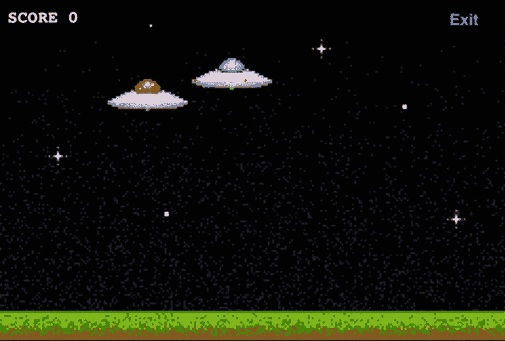
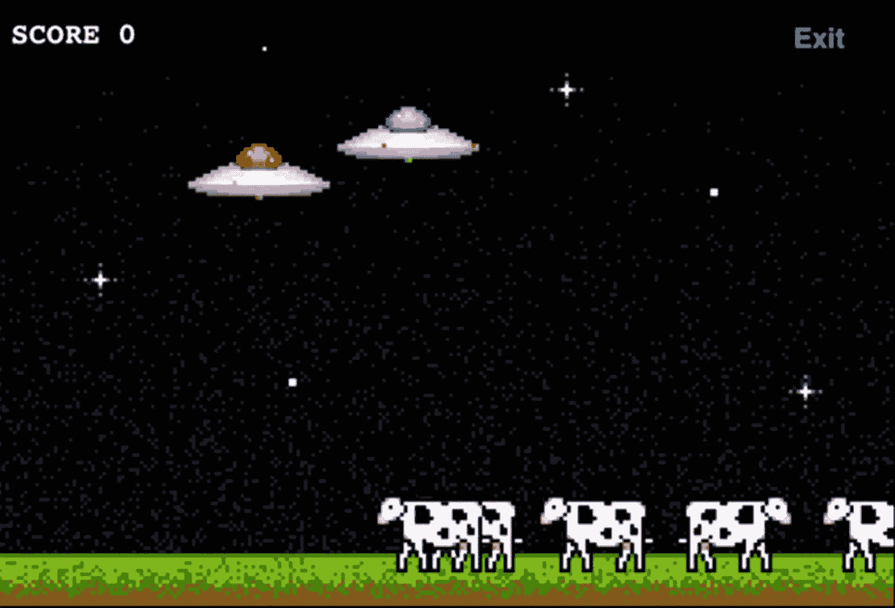
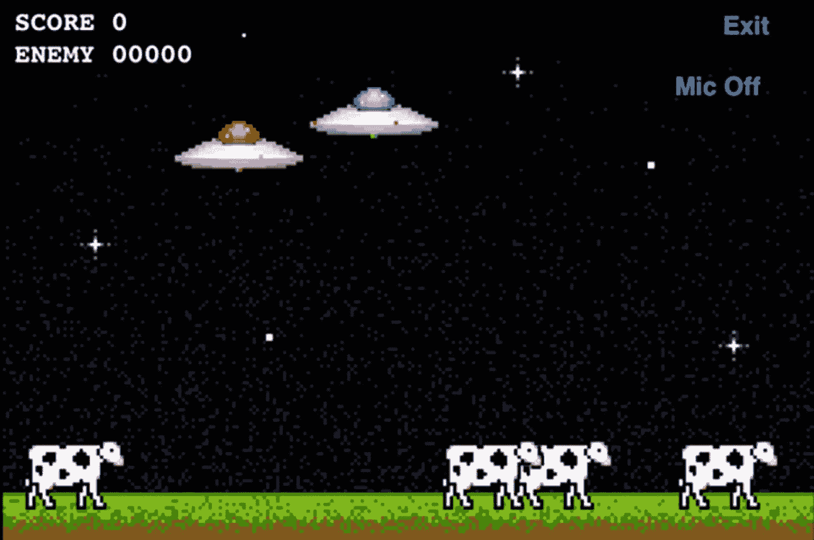
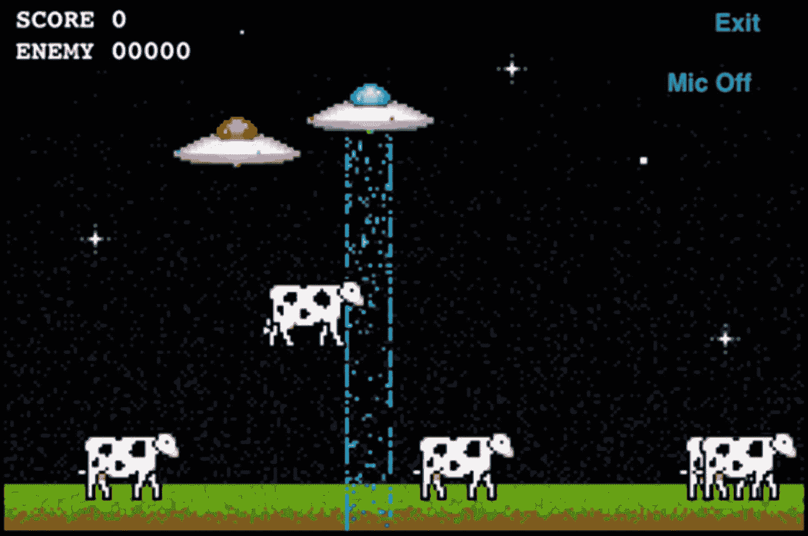

# 7. 数据交换

在前一章中，我们探讨了如何通过各种方法连接到对等端。到目前为止，我们还无法利用这种连接做太多事情。在本章中，我们将学习使用 GameKit 和 Game Center 网络在多个对等端之间交换数据的全部知识。我们已经在 UFO 游戏中添加了使用 Game Center 查找对等端的功能。现在，我们将添加实际进行多人比赛的功能。

由于之前章节已经做好了所有准备工作，关于数据交换我们只需关注两件事：第一，发送实际数据；第二，在接收端接收并处理这些数据。除了部分断线逻辑之外，其他需要完成的工作都已经就绪。让我们直接开始，修改第 5 章中的源代码。


## 修改单人游戏

为了将单人游戏转变为多人游戏，我们需要进行以下几项修改：

- 一旦连接到新对等端，游戏就需要开始。我们还需要一种方式通知现有游戏引擎，新游戏是多人模式。
- 需要指定一台设备为主机设备。我们将让这唯一的一台设备控制奶牛的行动，因为两台设备无法同时控制奶牛移动。如果希望两台设备画面保持同步，这一步至关重要。
- 每个对等端需要告知其他对等端自身的操作，例如移动和牵引光束的使用。
- 每个对等端需要解析其他对等端的设备状态，并更新自己的游戏状态，以确保两台设备相互同步。

这些步骤代表了将单人游戏转变为多人游戏通常所需的最低要求。你的具体游戏或应用可能会复杂得多。例如，你的多人游戏体验可能与单人游戏完全不同，以至于无法为两种模式复用同一个类。另一方面，你的游戏也可能更简单。例如，在多人海战游戏中，不需要指定任何一台设备为主机，因为不存在需要你追踪管理的电脑控制元素。

## 为多人游戏设置引擎

我们首先要做的是让游戏引擎知晓状态应设置为多人模式还是单人模式。实现这一点有复杂的方式，也有简单的方式。根据你的需求，很可能只需要一个简单的状态变量即可。

我们将在示例中使用状态变量这种方法，因为我们的游戏非常简单直接。在`UFOGameViewController.swift`文件中，我们创建一个新的`Bool`属性，该属性将用于告知类当前是单人模式还是多人模式。请在已有文件中添加以下几行代码：

```
class UFOGameViewController: UIViewController {
var gameIsMultiplayer = false
}
```

我们将在整个代码库中使用此属性来判断游戏是否运行在多人模式下。

在`UFOViewController`中，我们有一个现有函数，当游戏开始新的多人比赛时会被调用。Game Center 会返回一个`GKMatch`对象来帮助我们识别游戏。我们还将为`GameCenterManager`类添加一些新方法，用于处理与此系统的通信。目前，我们只需专注于让游戏在新的状态下启动并运行。

```
func matchmakerViewController(_ viewController: GKMatchmakerViewController, didFind match: GKMatch) {
dismiss(animated: true, completion: nil)
}
```

接下来，我们在该函数的末尾添加一段代码，以便在找到想要对战的对等端后，开始新的多人游戏。请将以下代码片段添加到每个方法中：

```
let gameVC = UFOGameViewController()
gameVC.gcManager = gcManager
gameVC.gameIsMultiplayer = true
navigationController?.pushViewController(gameVC, animated: true)
```

我们还需要持有代表对等端的`GKMatch`。在`UFOGameViewController`中创建两个新属性，命名为`peerIDString`和`peerMatch`。按照与设置`gameIsMultiplayer`属性相同的方式设置它们。你的头部文件的新部分应类似下面的抽象代码片段：

```
class UFOGameViewController: UIViewController {
//...
var peerIDString: String?
var peerMatch: GKMatch?
}
```

现在，我们需要添加逻辑来设置这些属性，以便开始新的多人游戏。这些函数现在应如下所示。

当加载游戏视图控制器时，我们就能知道它是否是多人模式，并且拥有对等端的引用。现在，我们的`GameViewController`拥有了开始新多人游戏所需的所有信息。

```
func matchmakerViewController(_ viewController: GKMatchmakerViewController, didFind match: GKMatch) {
dismiss(animated: true, completion: nil)
let gameVC = UFOGameViewController()
gameVC.gcManager = gcManager
gameVC.gameIsMultiplayer = true
gameVC.peerIDString = nil
gameVC.peerMatch = match
navigationController?.pushViewController(gameVC, animated: true)
}
```

### 选择主机

选择哪台设备作为主机比听起来要困难。两台设备首次连接时，被视为对等设备。那么我们如何决定哪台设备将拥有比另一台更多的控制权呢？

我使用过的最简单且最可靠的方法是让每台设备生成一个随机数。拥有最大随机数的设备成为主机。在极少数情况下，如果两台设备生成了相同的随机数，我们只需再次尝试生成两个新的随机数。

在确定随机数之后——即某台设备为自己争取成为主机机会所选的数字——我们需要将该数据发送给另一台设备。另一方面，我们需要处理数据，并使两台设备就哪台被选为主机达成一致结论。本节仅处理生成主机编号；接下来的两节将处理如何发送和接收这些数据。现在我们向`UFOGameViewController`类添加以下函数：

```
func generateAndSendHostNumber() {
let randomHostNumber = Double(arc4random())
let randomNumberString = "$Host:\(randomHostNumber)"
gcManager?.sendString(toAllPeers: randomNumberString, reliable: true)
}
```

针对这个特定的示例，我们将使用字符串来来回发送数据。你当然也可以将它作为`Int`发送，但无论发送什么，首先都需要转换为数据，这将在下一节中介绍。此外，我们需要确保在处理多人游戏时调用此方法。为此，我们需要在`viewDidLoad`方法的末尾添加以下代码。我们还需要稍微修改生成奶牛的逻辑。如果是多人游戏，只有主机负责生成和更新奶牛路径。

> **提示**  
> 当开始处理更复杂的网络通信时，切换到一种能够轻松存储更多数据且解析量更少的数据类型（如字典或数组）通常会更有益处。

```
override func viewDidLoad() {
//...
generateAndSendHostNumber()
if gameIsMultiplayer == false {
for _ in 0..<5 {
spawnCow()
}
updateCowPaths()
}
}
```


### 发送数据

我们将使用两个主要函数来向其他已连接的节点发送数据。一个函数用于向所有已连接的节点发送数据，另一个则仅向特定节点（例如队友或其他玩家组）发送数据。首先，在我们的`GameCenterManager`类中添加以下两个方法：

```
func sendStringToAllPeers(_ dataString: String, reliable: Bool)
func sendString(_ dataString: String, toPeers peers: [String] reliable: Bool)
```

我们将使用这些函数来来回回地发送字符串，但你可以添加额外的方法，以接受你针对特定游戏想使用的任何输入类型。请记住，所有内容在传输过程中都需要转换为数据。你或许还会注意到，第一个函数与我们之前从`generateAndSendHostNumber`调用的方法相同。

**提示**

如果你计划构建一个可复用的`Game Center`类，最好实现用于处理数组和字典的函数。在处理网络消息时，这两种都是非常常见的数据类型。

在真正开始来回发送数据之前，我们需要知道为多人游戏创建的`GKMatch`。为此，我们在`GameCenterManager`类中创建一个新的属性。我们将其命名为`matchOrSession`，并将其设置为一个 ID 类型。在开始新的多人游戏之前，在获取到新的`GKSession`或`GKMatch`之后，我们需要设置此属性。首先，让我们看看如何向所有节点发送数据。新方法如下所示。在你查看完它之后，我们将进行更详细的讨论：

```
func sendStringToAllPeers(_ dataString: String, reliable: Bool) {
    guard matchOrSession != nil else {
        print("Game Center Manager 的 matchOrSession 属性尚未设置，在发送或接收数据前，需要使用 GKMatch 或 GKSession 进行设置")
        return
    }
    guard let dataToSend = dataString.data(using: .utf8) else {
        print("Game Center Manager 的 dataString 无法转换为 Data。")
        return
    }
    var sendError: Error?
    if let session = matchOrSession as? MCSession {
        let peers = session.connectedPeers
        let mode: MCSessionSendDataMode = reliable ? .reliable : .unreliable
        do {
            try session.send(dataToSend, toPeers: peers, with: mode)
        } catch {
            sendError = error
        }
    } else if let match = matchOrSession as? GKMatch {
        let mode: GKMatch.SendDataMode = reliable ? .reliable : .unreliable
        do {
            try match.sendData(toAllPlayers: dataToSend, with: mode)
        } catch {
            sendError = error
        }
    } else {
        print("Game Center Manager 的 matchOrSession 既不是 GKMatch 也不是 GKSession，我们无法发送数据。")
    }
    if let sendError = sendError {
        print("发送数据时发生错误：\(sendError.localizedDescription)")
    }
}
```

我们需要确保已正确设置`matchOrSession`属性。如果没有设置，我们将无法继续，因为我们将使用此对象来发送数据。确保我们拥有正确的信息以继续之后，我们将`NSString`转换为`NSData`对象。这会将字符串编码为适合通过网络发送的格式。我们还需要设置可靠性模式，正如第 7 章中所讨论的那样。

现在一切就绪，可以实际发送数据了。我们首先检测当前处理的是来自 Game Center 类型连接的`GKMatch`，还是来自 Peer Picker 类型连接的`GKSession`。剩下的就是使用`GameKit` API 发送数据。

现在我们最好来看看如何有选择地向特定节点发送数据。我们可以基于已构建的向所有节点发送数据的示例进行扩展。让我们看看`sendString`函数：

```
func sendString(_ dataString: String, toPeers peers: [Any], reliable: Bool) {
    guard matchOrSession != nil else {
        print("Game Center Manager 的 matchOrSession 属性尚未设置，在发送或接收数据前，需要使用 GKMatch 或 GKSession 进行设置")
        return
    }
    guard let dataToSend = dataString.data(using: .utf8) else {
        print("Game Center Manager 的 dataString 无法转换为 Data。")
        return
    }
    var sendError: Error?
    if let session = matchOrSession as? MCSession, let peerIDs = peers as? [MCPeerID] {
        let mode: MCSessionSendDataMode = reliable ? .reliable : .unreliable
        do {
            try session.send(dataToSend, toPeers: peerIDs, with: mode)
        } catch {
            sendError = error
        }
    } else if let match = matchOrSession as? GKMatch, let players = peers as? [GKPlayer] {
        let mode: GKMatch.SendDataMode = reliable ? .reliable : .unreliable
        do {
            try match.send(dataToSend, to: players, dataMode: mode)
        } catch {
            sendError = error
        }
    } else {
        print("Game Center Manager 的 matchOrSession 既不是 GKMatch 也不是 GKSession，或者 peers 不是正确的数组类型，我们无法发送数据。")
    }
    if let sendError = sendError {
        print("发送数据时发生错误：\(sendError.localizedDescription)")
    }
}
```

此方法与向所有节点发送数据的方法非常相似。主要区别在于我们使用了一个新的 API 调用，并传入了一个节点 ID 或玩家的数组。当然，你可以修改这些方法，使其在发送数据时接受字符串以外的内容，但为了我们测试游戏的简便性，仅用字符串就足够了。

以上内容包含了你在两个或更多 iOS、Mac 或 Apple TV 设备之间发送数据所需了解的全部知识。在下一节中，我们将探讨如何接收并解析从另一个节点获取的数据。


### 接收数据

`GKMatch` 拥有自己的系统，用于接收传入数据的委托回调。Game Center 沿用了我们在第 5 章中用于邀请处理程序的同一个委托。我们将从修改该现有函数开始。

设置我们的 App 以接收数据的第一步是，将接收数据委托设置给我们的 `GameCenterManager` 类。我们将使用 `GameCenterManager` 类作为过滤点，将数据传回游戏。虽然你可以直接在游戏控制器中接收数据，但如果我们将所有数据都通过 `GameCenterManager` 进行管道传输，那么将来将这个类接入其他 App 会容易得多。

修改 `UFOViewController.swift` 中的 `matchmakerViewController` 函数，使其与以下内容一致：

```
func matchmakerViewController(_ viewController: GKMatchmakerViewController, didFind match: GKMatch) {
    dismiss(animated: true, completion: nil)
    gcManager?.matchOrSession = .match(match)
    let gameVC = UFOGameViewController()
    gameVC.gcManager = gcManager
    gameVC.gameIsMultiplayer = true
    gameVC.peerMatch = match
    navigationController?.pushViewController(gameVC, animated: true)
}
```

上述函数中需要重点关注的改动是，将处理传入数据请求的委托设置为我们的 `GameCenterManager` 类。这使我们能够在一个集中的位置处理所有传入的数据；然后从那里，我们可以将数据转发到 App 的相关部分。

接下来，你需要将以下函数添加到你的 `GameCenterManager` 类中。这个新函数用于处理来自 Game Center 的传入数据。该函数假设我们只处理传入的字符串，因为这是我们在处理游戏内发送数据时选择的设计方案。你可以轻松地调整此方法来处理其他类型的对象。此外，我们将扩展这个新函数以处理游戏特定数据。你还可以进一步调整此设置，使用更复杂、更智能的数据解析系统，但对于 UFO 游戏的需求来说，当前方案已经绰绰有余。

```
func receivedData(_ dataDictionary: [AnyHashable : Any]?) {
    guard let dataDictionary = dataDictionary as? [String: String] else { return }
}
```

**提示：** 你可以使用 `context` 属性将任意数据传递给 `received` 委托方法。

进一步修改 `receivedData` 函数，以处理游戏中可能出现的所有数据类型：

```
func receivedData(_ dataDictionary: [AnyHashable : Any]?) {
    guard let dataDictionary = dataDictionary as? [String: String] else { return }
    determineHost(dataDictionary)
}
```

现在剩下的就是实现我们的函数，以确定哪个玩家是主机；添加一个新的函数，如下面的代码片段所示：

```
func determineHost(_ dataDictionary: [String : String]?) {
    if Double(dataString ?? "") ?? 0.0 == randomHostNumber {
        print("主机编号相同，需要重新生成")
        generateAndSendHostNumber()
    } else if Double(dataString ?? "") ?? 0.0 > randomHostNumber {
        isHost = true
        for _ in 0..<5 {
            spawnCow()
        }
        updateCowPaths()
    } else if Double(dataString ?? "") ?? 0.0 < randomHostNumber {
        isHost = false
    }
}
```

如果你现在在两个设备上运行游戏，你可以看到每个日志都反映了该设备是否被指定为主机，或者另一台设备是否为主机。不过，`receivedData` 函数存在很大缺陷，因为它只处理主机数据消息。在下一节中，我们将完善这个函数，使其不仅能接受主机消息，还能接受玩家移动、奶牛移动和其他游戏操作等输入。

现在，你已经掌握了在两个不同的 iOS、Mac 或 Apple TV 设备之间发送数据，以及接收、解析这些数据并让系统做出反应的所有基本技能。如果你想在实际操作中尝试这些调用，下一节将引导你在我们的 UFO 游戏中完成几个发送和接收数据的示例。

## 整合所有内容

在上一节中，我们学习了如何接收发送到设备的数据。在本节中，我们将演练如何将接收到的数据实际用于我们的游戏。我们将添加第二个玩家，允许通过网络发送移动信息，同步两台设备之间的状态数据（例如奶牛移动），追踪每个玩家的得分，并完成与我们特定游戏相关的各种其他必要的后台任务。

### 选择主机

让我们从改进上一节实现的主机选择逻辑开始。现在，我们接收到的任何数据都被假定为主机编号。由于我们接收到的大部分数据并不是主机编号，我们需要找到一种方法来过滤这些数据，以便能够解析它们。修改 `generateAndSendHostNumber` 函数，使其与以下代码块一致：

```
func generateAndSendHostNumber() {
    randomHostNumber = Double(arc4random())
    let randomNumberString = "$Host:\(randomHostNumber)"
    gcManager?.sendStringToAllPeers(randomNumberString, reliable: true)
}
```

如你所见，我们现在在将要发送的消息中添加了一个标识符前缀。在本示例中，我选择了 `$Host:` 作为前缀，但你可以使用任何你想要的系统。此外，我们需要修改 `receivedData` 回调以支持新的格式。

```
func receivedData(_ dataDictionary: [AnyHashable : Any]?) {
    guard let dataDictionary = dataDictionary as? [String: String] else { return }
    if dataDictionary["data"]?.hasPrefix("$Host:") ?? false {
        determineHost(dataDictionary)
    } else {
        print("无法确定消息类型：\(dataDictionary)")
    }
}
```

如果我们确定该消息是一条主机消息，我们会将其发送给一个名为 `determineHost` 的新辅助函数，以确定哪个设备是主机。如果我们无法确定消息类型，则会在控制台打印一条警告消息，这将有助于我们后续的调试。我们需要将 `receivedData` 中的旧代码移动到 `determineHost` 中。除了移动代码外，我们还需要去掉前缀。虽然去除前缀有一定开销，但这是完成此任务最简单的方法。在更复杂的应用程序中，你可能需要设计一个更健壮的消息系统。

```
func determineHost(_ dataDictionary: [String : String]?) {
    let dataString = dataDictionary?["data"]?.replacingOccurrences(of: "$Host:", with: "")
    if Double(dataString ?? "") ?? 0.0 == randomHostNumber {
        print("主机编号相同，需要重新生成")
        generateAndSendHostNumber()
    } else if Double(dataString ?? "") ?? 0.0 > randomHostNumber {
        isHost = true
    } else if Double(dataString ?? "") ?? 0.0 < randomHostNumber {
        isHost = false
    }
}
```

现在我们仍然可以确定谁是主机，但我们已经打开了大门，能够处理更多类型的数据，而不仅仅是这一种。

下一步是在我们的游戏中传输并显示对手的 UFO。在本章中，我向项目添加了两个新图片：`EnemySaucer1.png` 和 `EnemySaucer2.png`。它们的形状与原始图片相同，但使用了不同的配色方案。我们将使用这些新素材来显示对手的飞船。


### 显示敌方 UFO

我们首先需要检测当前是否为多人游戏，如果是，则需在 `UFOGameViewController` 的 `viewDidLoad` 函数中绘制敌方 UFO。你会注意到，这段代码与我们在单人模式下绘制玩家的代码完全相同，唯一的区别是使用了不同的图形资源。

```
override func viewDidLoad() {
    super.viewDidLoad()
    if gameIsMultiplayer {
        let otherPlayerFrame = CGRect(x: 100, y: 70, width: 80, height: 34)
        otherPlayerImageView = UIImageView(frame: otherPlayerFrame)
        otherPlayerImageView?.animationDuration = 0.75
        otherPlayerImageView?.animationRepeatCount = 99999
        let imageArray = [UIImage(named: "EnemySaucer1.png"), UIImage(named: "EnemySaucer2.png")]
        otherPlayerImageView?.animationImages = imageArray.compactMap { $0 }
        otherPlayerImageView?.startAnimating()
        if let otherPlayerImageView = otherPlayerImageView {
            view.addSubview(otherPlayerImageView)
        }
    }
}
```

如果我们在两台设备上运行游戏并开始一局新的多人游戏，我们就会看到一个红色的敌方 UFO 静止在天空中。下一步，我们需要将移动数据发送给同伴，以便他们能够更新敌方玩家的位置。为此，我们在 `movePlayer` 函数的末尾添加一段新代码。

```
func movePlayer(_ vertical: double, _ horizontal: double) {
    //...
    if gameIsMultiplayer {
        let positionString = "$PlayerPosition: \(playerFrame?.origin.x ?? 0.0) \(playerFrame?.origin.y ?? 0.0)"
        gcManager?.sendStringToAllPeers(positionString, reliable: false)
    }
}
```

在这里，每次移动时都会将玩家坐标发送给同伴。我们选择以不可靠方式发送数据，因为即使发送失败，我们也可以使用下一个数据包。回想一下第 7 章的内容，这是发送完整数据而非增量移动数据的好处之一。当玩家移动时，数据会持续更新。

如第 7 章所述，这里非常适合使用预测技术，但为简单起见，我们将逐帧进行同步。此外，将 x 和 y 坐标发送到另一台设备有更好的方法，例如使用字典或自定义数据格式。然而，将它们编码为字符串是最容易理解的方式。随着游戏或应用的开发，你可以设计此类函数使其更精简、开销更小。

> **提示**
> 
> 使用 `stringWithFormat` 会产生大量开销。在实践中，应使用 `stringByAppendingString` 等方法进一步优化此类代码。

我们还需要更新 `receivedData` 函数，以处理即将接收的新数据类型。请按如下方式修改该函数。此外，我们添加一个新函数来解析传入的数据，同时新增一个名为 `drawEnemyShipWithData` 的函数，具体如下：

```
func receivedData(_ dataDictionary: [AnyHashable : Any]?) {
    guard let dataDictionary = dataDictionary as? [String: String] else { return }
    if dataDictionary["data"]?.hasPrefix("$Host:") ?? false {
        determineHost(dataDictionary)
    } else if dataDictionary["data"]?.hasPrefix("$PlayerPosition:") ?? false {
        drawEnemyShip(withData: dataDictionary)
    } else {
        print("无法确定消息类型：\(dataDictionary)")
    }
}

func drawEnemyShip(withData dataDictionary: [String : String]?) {
    let dataArray = dataDictionary?["data"]?.components(separatedBy: " ")
    let x = Double(dataArray?[1] ?? "") ?? 0.0
    let y = Double(dataArray?[2] ?? "") ?? 0.0
    otherPlayerImageView?.frame = CGRect(x: CGFloat(x), y: CGFloat(y), width: 80, height: 34)
}
```

该函数解析来自网络的传入数据。我们从接收到的字符串中提取 x 和 y 坐标，并用新位置更新敌方玩家的显示区域。这种逐帧同步两台设备的方法效率非常低下。如果有更多时间，应更新此函数，使用预测技术来判断玩家的移动方向，并且仅在玩家偏离预测时更新数据。不过，对于本演示而言，它已经满足需求。关于预测网络技术的更多信息，请参阅第 7 章。

如果现在运行游戏并开始一局新的多人游戏，你会看到每台设备都会反映其配对设备的移动情况。我们还需要生成奶牛、添加牵引光束并更新分数，但我们已经拥有一个功能完备（虽然目前略显单调）的多人游戏，如图 7-1 所示。



*图 7-1. 在 UFO 游戏中添加第二名玩家。每个玩家可独立移动，并通过网络保持同步。*


### 生成奶牛

为了让奶牛的运动在不同设备间同步，我们需要指定一台设备来处理奶牛的生成和移动路径。我们已经选定了主机设备，因此将由主机决定奶牛放置的位置。首先修改 `determineHost` 函数。如下代码所示，如果我们是主机，就开始执行正常的奶牛生成流程：

```
func determineHost(_ dataDictionary: [String : String]?) {
    let dataString = dataDictionary?["data"]?.replacingOccurrences(of: "$Host:", with: "")
    if Double(dataString ?? "") ?? 0.0 == randomHostNumber {
        print("主机数字相同，需要重新生成")
        generateAndSendHostNumber()
    } else if Double(dataString ?? "") ?? 0.0 > randomHostNumber {
        isHost = true
        for _ in 0..<5 {
            spawnCow()
        }
        updateCowPaths()
    } else if Double(dataString ?? "") ?? 0.0 < randomHostNumber {
        isHost = false
    }
}
```

我们还需要修改 `spawnCow` 函数以支持新的网络行为。这里所做的只是判断当前是否为网络游戏以及我们是否为主机，然后将数据发送给网络处理器。

```
func spawnCow() {
    let x = Int(arc4random() % 480)
    let cowImageView = UIImageView(frame: CGRect(x: CGFloat(x), y: 260, width: 64, height: 42))
    cowImageView.image = UIImage(named: "Cow1.png")
    view.addSubview(cowImageView)
    cowArray?.append(cowImageView)
    if isHost && gameIsMultiplayer {
        gcManager?.sendStringToAllPeers(String(format: "$spawnCow:%i", x), reliable: true)
    }
}
```

修改 `receivedData` 函数以支持新的 `$spawnCow` 消息类型。我们还需要从消息中提取 X 轴起点坐标，并将其传递给一个用于处理通过网络生成奶牛的新方法。接下来展示了这两个功能：

```
else if dataDictionary["data"]?.hasPrefix("$spawnCow:") ?? false {
    let x = Int(dataDictionary["data"]?.replacingOccurrences(of: "$spawnCow:", with: "") ?? "") ?? 0
    spawnCow(fromNetwork: x)
}
```

**提示**  
主机无需传递奶牛的 Y 轴坐标，因为它们始终在相同的 Y 轴上生成。如果你能从数据包中删除不必要的数据，总是有益的，因为这类无关数据会不断累积。

如果现在运行游戏，你会看到两台设备都在完全相同的位置生成了奶牛，但只有主机设备能驱动奶牛移动的动画。

下一步是添加共享奶牛动画控制的逻辑。修改现有的 `updateCowPaths` 方法，使其发送我们要更新的 `newX` 坐标和数组位置。以下新代码应添加到 `for` 循环的末尾：

```
if gameIsMultiplayer {
    let dataString = String(format: "$cowMove:%i:%f", x, newX)
    gcManager?.sendStringToAllPeers(dataString, reliable: true)
}
```

**注意**  
由于我们将生成奶牛的数据调用设置为可靠模式，因此可以保证数据按发送顺序接收。这意味着我们可以确保两台设备上的 `cowArray` 中的对象顺序相同。

我们还需要在 `receivedData` 函数中添加一个新的数据处理程序。将整个字典传递给新的 `updateCowPathsFromNetwork` 函数。

```
else if dataDictionary["data"]?.hasPrefix("$cowMove:") ?? false {
    updateCowPaths(fromNetwork: dataDictionary)
}

func updateCowPaths(fromNetwork dataDictionary: [String : String]?) {
    let dataArray = dataDictionary?["data"]?.components(separatedBy: ":")
    let placeInArray = Int(dataArray?[1] ?? "") ?? 0
    let tempCow = cowArray?[placeInArray] as? UIImageView
    let currentX = Double(tempCow?.frame.origin.x ?? 0.0)
    let newX = Double(Int(dataArray?[2] ?? "") ?? 0)
    if tempCow != currentAbductee {
        UIView.animate(
            withDuration: 3.0,
            delay: 0,
            options: [.curveLinear],
            animations: {
                tempCow?.frame = CGRect(x: CGFloat(newX), y: 260, width: 64, height: 42)
            }
        )
    }
    tempCow?.animationDuration = 0.75
    tempCow?.animationRepeatCount = 99999
    //翻转奶牛
    if newX < currentX {
        let flippedCowImageArray = [UIImage(named: "Cow1Reversed.png"), UIImage(named: "Cow2Reversed.png"), UIImage(named: "Cow3Reversed.png")]
        tempCow?.animationImages = flippedCowImageArray.compactMap { $0 }
    } else {
        let cowImageArray = [UIImage(named: "Cow1.png"), UIImage(named: "Cow2.png"), UIImage(named: "Cow3.png")]
        tempCow?.animationImages = cowImageArray.compactMap { $0 }
    }
    tempCow?.startAnimating()
}
```

这个函数与我们现有的更新奶牛路径函数非常相似。两个区别在于：我们从网络获取数组中的位置，并且不随机生成 `newX` 坐标。如果再次运行游戏，你会看到两边的奶牛现在彼此同步。当一头奶牛改变位置时，两台设备上的变化完全一致。图 7-2 展示了游戏的当前状态。



**图 7-2** – 在两台 iOS 设备之间通过网络同步奶牛运动

现在每位玩家都可以劫持奶牛并增加自己的分数。然而，仍然有两个问题需要解决。第一个是设备间没有共享分数，第二个是我们没有显示其他玩家的牵引光束，也没有在劫持过程中将奶牛动画化地移入 UFO。我们先从添加分数支持开始。

### 共享分数

当分数增加时，我们将这些数据发送给同伴。在 `finishAbducting` 函数中，在分数增加之后立即添加以下代码片段：

```
if gameIsMultiplayer {
    gcManager?.sendStringToAllPeers("$score:\(score)", reliable: true)
}
```

我们再次需要修改 `receivedData` 方法以支持新的 `$score` 消息。我选择在 `receivedData` 方法中增加敌方分数。当然，你也可以编写一个新方法来实现此功能。此外，我们需要为敌方分数添加一个新标签。它将放置在本地玩家分数的正下方。图 7-3 展示了分数显示效果。

```
else if dataDictionary["data"]?.hasPrefix("$score:") ?? false {
    let enemyScore = Float(dataDictionary["data"]?.replacingOccurrences(of: "$score:", with: "") ?? "") ?? 0.0
    enemeyScoreLabel.text = String(format: "ENEMY %05.0f", enemyScore)
}
```

**提示**  
从技术上讲，你无需在网络调用中传递分数值，因为分数总是每次增加 1；我们可以假设收到新的分数消息就意味着将数值加 1。



**图 7-3** – 为网络玩家添加分数

**练习**  
当任何一名玩家得分达到十分时，添加逻辑来宣布游戏获胜者会非常容易。尝试自己将这一逻辑添加到游戏中。


### 添加网络劫持代码

最后需要处理的是为劫持代码提供网络支持。我们需要在奶牛被劫持时正确地移除和重生它们，同时显示敌方 UFO 使用牵引光束并将奶牛移入飞船的动画。

让我们从在每个设备上显示和隐藏牵引光束开始。由于用户每次触摸屏幕时都会启动牵引光束，并在松开触摸时结束它，我们可以从这里入手。这里没有需要传输的值值；我们唯一需要注意的就是启动和停止动画本身。修改`touchesBegan`和`touchesEnd`方法，向对等设备发送消息。修改后的方法如下所示：

```
override func touchesBegan(_ touches: Set, with event: UIEvent?) {
    currentAbductee = nil
    tractorBeamOn = true
    if gameIsMultiplayer {
        gcManager?.sendStringToAllPeers("$beginTractorBeam", reliable: true)
    }
    tractorBeamImageView?.frame = CGRect(x: (myPlayerImageView?.frame.origin.x ?? 0.0) + 25, y: (myPlayerImageView?.frame.origin.y ?? 0.0) + 10, width: 28, height: 318)
    tractorBeamImageView?.animationDuration = 0.5
    tractorBeamImageView?.animationRepeatCount = 99999
    let imageArray = [UIImage(named: "Tractor1.png"), UIImage(named: "Tractor2.png")]
    tractorBeamImageView?.animationImages = imageArray.compactMap { $0 }
    tractorBeamImageView?.startAnimating()
    if let tractorBeamImageView = tractorBeamImageView {
        view.insertSubview(tractorBeamImageView, at: 4)
    }
    let cowImageView = hitTest()
    if let cowImageView = cowImageView {
        currentAbductee = cowImageView
        abductCow(cowImageView)
    }
}

override func touchesEnded(_ touches: Set, with event: UIEvent?) {
    tractorBeamOn = false
    if gameIsMultiplayer {
        gcManager?.sendStringToAllPeers("$endTractorBeam", reliable: true)
    }
    tractorBeamImageView?.removeFromSuperview()
    if let currentAbductee = currentAbductee {
        UIView.animate(
            withDuration: 1.0,
            delay: 0,
            options: [.curveEaseIn, .beginFromCurrentState],
            animations: {
                var frame = currentAbductee.frame
                frame.origin.y = 260
                frame.origin.x = (self.myPlayerImageView?.frame.origin.x ?? 0.0) + 15
                currentAbductee.frame = frame
            }
        )
    }
    currentAbductee = nil
}
```

如您所见，我们只是检查确保这是一个网络游戏，然后传递消息来开始或结束牵引光束。接下来，我们在`receivedData`函数中添加一个处理程序，用于调用两个新方法，这些方法将在对等设备上显示并动画化牵引光束。这两个函数是对我们当前牵引光束动画方法的修改，为方便参考，如下所示：

```
func beginTractorFromNetwork() {
    otherPlayerTractorBeamImageView?.frame = CGRect(x: (otherPlayerImageView?.frame.origin.x ?? 0.0) + 25, y: (otherPlayerImageView?.frame.origin.y ?? 0.0) + 10, width: 28, height: 318)
    otherPlayerTractorBeamImageView?.animationDuration = 0.5
    otherPlayerTractorBeamImageView?.animationRepeatCount = 99999
    let imageArray = [UIImage(named: "Tractor1.png"), UIImage(named: "Tractor2.png")]
    otherPlayerTractorBeamImageView?.animationImages = imageArray.compactMap { $0 }
    otherPlayerTractorBeamImageView?.startAnimating()
    if let otherPlayerTractorBeamImageView = otherPlayerTractorBeamImageView {
        view.insertSubview(otherPlayerTractorBeamImageView, at: 4)
    }
}

func endTractorFromNetwork() {
    otherPlayerTractorBeamImageView?.removeFromSuperview()
}
```

如果现在运行游戏，您会看到当每个用户触摸屏幕时，牵引光束会出现在两个设备上。我们无需担心在牵引光束开启时锁定 UFO 的移动，因为这在单人游戏中已经处理好了，并且只有在单人模式允许的情况下，移动才会传输到另一台设备。接下来，我们需要添加额外代码来处理碰撞检测，因此修改`hitTest`函数，如下所示：

```
func hitTest() -> UIImageView? {
    if !tractorBeamOn {
        return nil
    }
    for x in 0..<(cowArray?.count ?? 0) {
        let tempCow = cowArray?[x] as? UIImageView
        let cowLayer = tempCow?.layer.presentation()
        let cowFrame = cowLayer?.frame
        if cowFrame?.intersects(tractorBeamImageView?.frame ?? CGRect.zero) ?? false {
            tempCow?.frame = cowLayer?.frame ?? CGRect.zero
            tempCow?.layer.removeAllAnimations()
            if gameIsMultiplayer {
                gcManager?.sendStringToAllPeers(String(format: "$abductCowAtIndex:%i", x), reliable: true)
            }
            return tempCow
        }
    }
    return nil
}
```

这里我们使用了之前填充奶牛数组时用到的相同技巧。由于我们可靠地发送了数据以将对象放入数组，我们知道数组顺序始终保持一致。由于知道了数组的顺序，我们可以传递要修改的奶牛的索引。除了发送数据外，我们还需要编写一个新的`if`语句来捕获此消息，如下所示。您可以看到这个方法的设置很像分数方法，我们从中提取感兴趣的值并调用一个新的方法来使用它：

```
else if dataDictionary["data"]?.hasPrefix("$abductCowAtIndex:") ?? false {
    let index = Int(dataDictionary["data"]?.replacingOccurrences(of: "$abductCowAtIndex:", with: "") ?? "") ?? 0
    abductCowFromNetwork(at: index)
}
```

以下两个函数处理通过网络接收到的劫持动画。它们与我们用于在单人模式下动画化劫持的函数非常相似。您甚至可以通过使用一个标志来指示它们来自远程设备，从而修改现有函数以处理网络行为。

```
func abductCowFromNetwork(at x: Int) {
    otherPlayerCurrentAbductee = cowArray?[x] as? UIImageView
    //otherPlayerCurrentAbductee?.frame = otherPlayerCurrentAbductee?.frame    // 跳过冗余的自身初始化
    otherPlayerCurrentAbductee?.layer.removeAllAnimations()
    UIView.animate(
        withDuration: 4.0,
        delay: 0,
        options: [.curveEaseIn, .beginFromCurrentState],
        animations: {
            var frame = self.otherPlayerCurrentAbductee?.frame
            frame?.origin.y = self.otherPlayerImageView?.frame.origin.y ?? 0.0
            self.otherPlayerCurrentAbductee?.frame = frame ?? CGRect.zero
        },
        completion: finishAbductingFromNetwork
    )
}

func finishAbductingFromNetwork(_ finished: Bool) {
    cowArray = cowArray?.filter({ ($0) as AnyObject !== (otherPlayerCurrentAbductee) as AnyObject })
    endTractorFromNetwork()
    otherPlayerCurrentAbductee?.layer.removeAllAnimations()
    otherPlayerCurrentAbductee?.removeFromSuperview()
    otherPlayerCurrentAbductee = nil
    if isHost {
        spawnCow()
    }
}
```

我们还需要做一些额外的工作以确保不会引入新的错误。例如，我们添加一个新的指针来追踪敌人当前正在劫持的奶牛（如果有的话）。如果您还记得，在`updateCowPaths`方法中，我们不想更新正在被劫持的奶牛的路径，因为这会破坏用于劫持的动画。我们需要修改该方法，使其也忽略敌人可能正在劫持的任何奶牛。如果您再次运行游戏，您现在会注意到我们拥有一个功能完整的多人游戏，如图 7-4 所示。



**图 7-4** 一个功能完整的多人 UFO 游戏，两人通过蓝牙连接进行游戏


## 断线处理

在处理多人游戏支持时，最后一步需要添加逻辑来处理断线及其他不可恢复的故障。幸运的是，Apple 的 API 已帮我们完成了大部分繁重工作。但我们仍希望在 `GameCenterManager` 类中添加一个更通用的调用来简化操作。

```
func disconnect() {
    switch matchOrSession {
    case .match(let match):
        match.disconnect()
    case .session(let session):
        session.disconnect()
    case .none:
        break
    }
}
```

当你希望结束一场多人游戏时，应调用此方法。它将确保对等方安全断开连接，并避免许多难以排查的问题。

### 本章小结

在本章中，我们以高度浓缩的方式涵盖了大量信息。你学习了如何利用 Game Center 网络在多个 iOS、Mac 或 Apple TV 设备之间发送和接收数据。此外，你还掌握了如何处理网络状态变化（例如断线）。我们将本章所学原理应用于 UFO 游戏，在不到七章的篇幅内从零构建了一款多人 iOS 游戏。下一章，我们将探索 Game Center 的回合制游戏 API，其运作方式与实时游戏截然不同，因此需要构建全新的示例项目和游戏。

