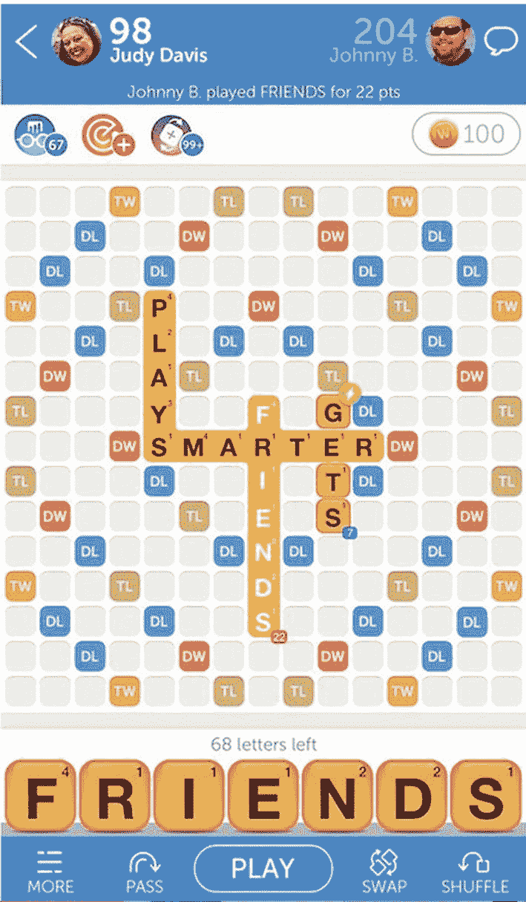
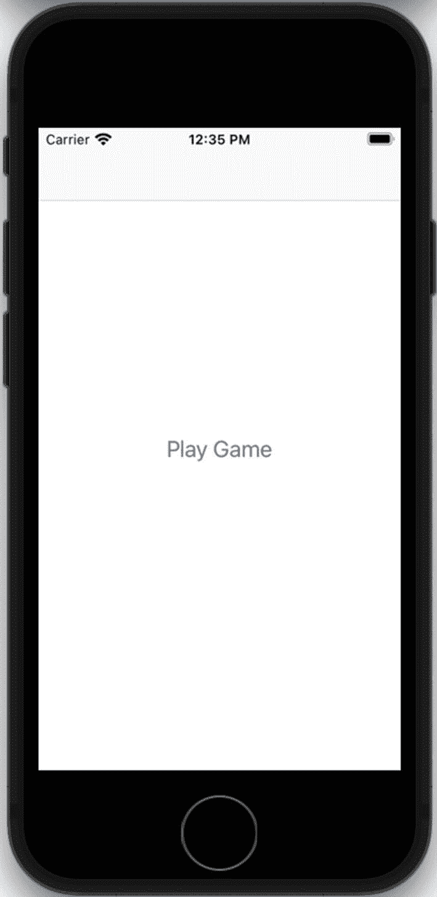
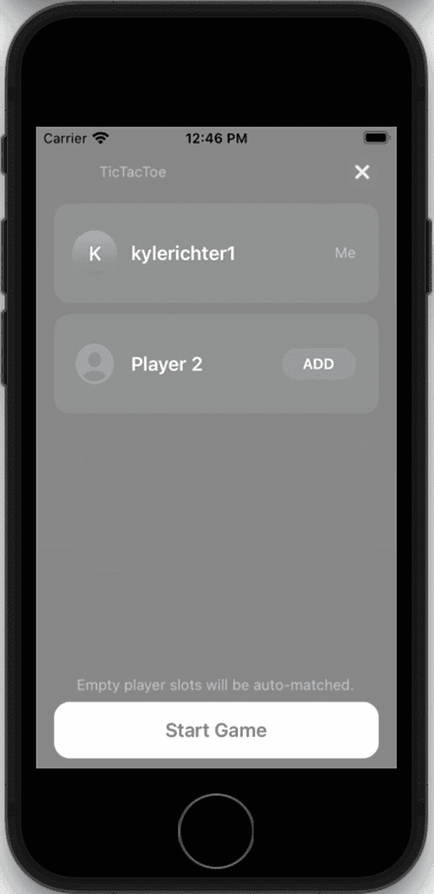
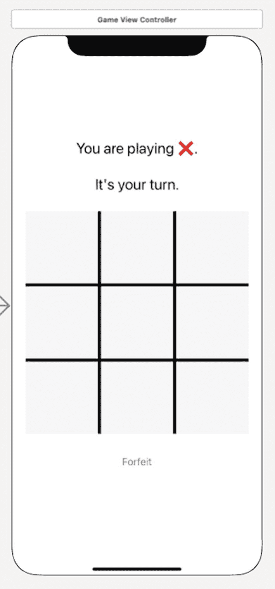

# 8. 使用 Game Center 实现回合制游戏

在 Game Center 首次发布后不久，Apple 便对该框架进行了更新，除了你从前几章熟悉的实时游戏功能外，还增加了回合制游戏支持。借助回合制游戏，你现在可以为用户提供异步游戏体验。回合制游戏泛指所有玩家轮流上场的游戏，典型示例包括井字棋、国际象棋、海战棋以及龙与地下城。

在过去几年中，iOS、Mac 和 Apple TV 上的回合制游戏变得非常流行，其开端可以说源于超级热门游戏《与朋友拼词》。《与朋友拼词》（如图 8-1 所示）是一款类似 Scrabble 的异步文字游戏。每位玩家会收到一组字母，轮流在棋盘上拼出单词。根据单词的难度以及棋盘布局，系统会为玩家评分。传统上，回合制游戏采用存储转发式平台：服务器会保存游戏数据，直到下一位玩家登录并获取数据。异步游戏通常更偏向休闲风格，不要求所有玩家时刻在线——尽管某些游戏确实需要即时响应和操作。



**图 8-1** Zynga 出品的《与朋友拼词》

在回合制游戏推出之前，Game Center 仅提供实时游戏，要求所有参与设备在整个多人游戏过程中始终保持活动状态并持续登录。回合制游戏则带来了更轻松的体验，允许玩家同时运行多达 20 场比赛，并且仅在轮到自己的回合时进行游戏。

在这些改进之前，编写此类游戏需要你自行编写并部署服务器来处理游戏交互。而现在，你只需不到一天的时间就能完成回合制游戏的网络组件搭建并投入运行。在本章中，我们将探讨如何利用 Game Center 的回合制游戏 API 编写一个简单的井字棋游戏。

## 新的示例项目

遗憾的是，我们现有的 UFO 示例游戏并不适合测试回合制游戏。如果让每个玩家移动一步后就等待对方跟上，这显然不合理。幸运的是，我们还可以围绕另一种非常简单的游戏类型来构建项目：井字棋。这款经典的儿童游戏几乎所有人都玩过，我们对其规则和策略都已相当熟悉。

我们首先创建一个基于 storyboard 的新 iOS App 项目。在整个项目中，将涉及三个视图：

* **主视图**：该视图仅包含一个按钮，用于启动我们将要创建的 `HomeViewController`。
* **GKTurnBasedMatchmakerViewController**：这是 Apple 提供的视图，用于创建和恢复回合制游戏。你无需自行创建此视图。
* **GameViewController**：该类负责处理用户输入、判断胜负与平局，并在每回合开始时更新游戏棋盘。

我们先从主视图开始处理。当你创建新项目时，这些文件会自动生成。首先需要做的是确保导入正确的 GameKit 框架，并添加本书一直在使用的可复用 `GameCenterManager` 类；你可以直接引入第 8 章中的现有版本。此外，我们还需要在视图中创建一个按钮，用于开始新游戏，如图 8-2 所示。



**图 8-2** 新井字棋游戏的主视图

新的主视图控制器类文件应与以下代码片段一致。我们需要遵循 `GameCenterManagerDelegate` 和 `GKTurnBasedMatchmakerViewController` 协议。与之前章节类似，我们还需要创建一个 `GameCenterManager` 的类实例。最后需要添加的是一个用于开始新游戏的 `IBAction`。请确保在 storyboard 中将“开始新游戏”按钮与 `IBAction` 连接起来。

我们还需要修改 `viewDidLoad` 函数，以检查并通过 Game Center 验证本地用户。这与我们在第 2 章中采用的方法相同。

```
class HomeViewController: UIViewController {
    var gcManager: GameCenterManager?
    
    override func viewDidLoad() {
        super.viewDidLoad()
        NotificationCenter.default.addObserver(
            self,
            selector: #selector(localUserAuthenticationChanged(_:)),
            name: .GKPlayerAuthenticationDidChangeNotificationName,
            object: nil)
        gcManager = GameCenterManager()
        gcManager?.authenticateLocalUser(self)
    }
}
```

我们还需要实现一个委托函数来监控成功验证和本地用户变化。我们使用此函数输出一些调试信息。

```
@objc func localUserAuthenticationChanged(_ notification: Notification?) {
    if let object = notification?.object {
        print("Authentication Changed: \(object)")
    }
}
```

在下一节中，我们将了解如何调用 `GKTurnBasedMatchmakerViewController`，以及如何处理所需的委托函数，以便处理错误并恢复或创建新的比赛。


## GKTurnBasedMatchmakerViewController

Apple 提供了一个默认类，用于呈现创建新回合制比赛的图形界面。如需以编程方式创建比赛，请参阅后面的“程序化比赛”部分。

首先，我们在上一节创建的单个按钮的 IBAction 中操作一个新的比赛匹配对象。我们在此处使用的方法与 Game Center 的比赛匹配非常相似。请看以下示例代码。此函数与之前处理实时游戏和比赛匹配的示例非常相似，显著的变化是切换到了 `GKTurnBasedMatchmakerViewController` 和 `turnBasedMatchmakerDelegate`，而不是其实时对应的类。用户将看到一个类似于图 8-3 所示的视图。

```swift
@IBAction func showMatchmaker() {
    let match = GKMatchRequest()
    match.minPlayers = 2
    match.maxPlayers = 2
    let turnMatchmakerVC = GKTurnBasedMatchmakerViewController(matchRequest: match)
    turnMatchmakerVC.turnBasedMatchmakerDelegate = self
    present(turnMatchmakerVC, animated: true)
}
```

> **注意：** 与所有 Game Center 功能一样，必须先通过 Game Center 进行身份验证，然后才能创建新的回合制游戏比赛。

您需要实现四个委托函数来遵循 `GKTurnBasedMatchmakerViewControllerDelegate`。第一个函数处理用户在比赛匹配器中取消操作。此处唯一的任务是调用游戏选择器模态视图的 `dismiss` 方法。您可以根据应用需要，添加额外的逻辑。

```swift
extension HomeViewController: GKTurnBasedMatchmakerViewControllerDelegate {
    func turnBasedMatchmakerViewControllerWasCancelled(_ viewController: GKTurnBasedMatchmakerViewController) {
        dismiss(animated: true)
    }
}
```

> **重要：** 当前游戏列表只有在您关闭并重新打开 `GKTurnBasedMatchmakerViewController` 后才会更新。



**图 8-3** – 开始新的回合制比赛

我们还需要实现一个委托函数来捕获此阶段发生的任何错误。每当比赛匹配过程中遇到错误时，都会调用以下函数。为了调试，我们会在控制台打印错误信息；但您应该告知用户发生了错误。

```swift
func turnBasedMatchmakerViewController(_ viewController: GKTurnBasedMatchmakerViewController, didFailWithError error: Error) {
    print("Turn Based Matchmaker Failed with Error: \(error.localizedDescription)")
}
```

我们在本节中讨论的最后一个委托函数处理用户在比赛匹配器界面退出比赛的情况。这是通过在游戏上从右向左滑动并选择退出选项来实现的。我们传入的逻辑是：退出的玩家将是比赛的失败方，而远程玩家将被标记为获胜者。如果您在此处没有调用正确的函数，您将能够退出游戏，但它会在几秒钟后重新出现。

```swift
func turnBasedMatchmakerViewController(_ viewController: GKTurnBasedMatchmakerViewController, playerQuitFor match: GKTurnBasedMatch) {
    guard let localParticipant = match.participants.first(where: { $0.player == GKLocalPlayer.local }),
          let otherParticipant = match.participants.first(where: { $0 != localParticipant }) else {
        return
    }
    localParticipant.matchOutcome = .quit
    otherParticipant.matchOutcome = .won
    match.endMatchInTurn(withMatch: match.matchData ?? Data()) { error in
        if let error = error {
            print("An error occurred ending match: \(error.localizedDescription)")
        }
    }
}
```

最后一个必需的函数 `didFindMatch` 将在下一节“开始新游戏”中讨论。

### 建立游戏状态

在我们真正深入新游戏之前，打好一些基础以使后续工作更轻松是非常重要的。我们要做的第一件事是设置游戏可能的状态。井字棋是一个非常简单的游戏，但仍然可能存在几种活跃状态；前两种状态适用于任何回合制游戏，涵盖了我们当前正在等待哪位玩家进行移动。以下三种状态涵盖了游戏结束的状态：本地玩家获胜、远程玩家获胜或平局：

```swift
private enum GameStatus {
    case waitingForLocalPlayer
    case waitingForOtherPlayer
    case localPlayerWon
    case otherPlayerWon
    case playersTied
}
```

接下来需要完成的另一项基础工作是启用检测当前游戏状态的功能。我们需要确定游戏中的获胜组合，以便检测它们在游戏过程中是否出现。我们将使用一种暴力方法检查是否有获胜者，即检查所有行和列是否存在三个相同玩家的棋子。如果没有任何可移动的位置，我们还需要检查是否平局。

```swift
private var currentGameStatus: GameStatus {
    if let localParticipant = localParticipant {
        switch localParticipant.matchOutcome {
        case .none:
            break
        case .quit, .lost, .timeExpired:
            return .otherPlayerWon
        case .won, .first, .second, .third, .fourth, .customRange:
            return .localPlayerWon
        case .tied:
            return .playersTied
        @unknown default:
            print("Unknown GKTurnBasedParticipant.matchOutcome received. Assuming game is in progress.")
        }
    }
    let winningCombinations = [
        // 水平
        [0, 1, 2],
        [3, 4, 5],
        [6, 7, 8],
        // 垂直
        [0, 3, 6],
        [1, 4, 7],
        [2, 5, 8],
        // 对角线
        [0, 4, 8],
        [2, 4, 6],
    ]
    let winningCombination = winningCombinations.first { combo in
        let filledSquares: [Player] = combo.compactMap { gameBoard[$0] }.filter { $0 != .none }
        guard filledSquares.count == combo.count else { return false }
        let uniquePlayers = Set(filledSquares)
        return uniquePlayers.count == 1
    }
    guard let winningPlayerIndex = winningCombination?[0], let winningPlayer = gameBoard[winningPlayerIndex] else {
        guard gameBoard.count != 9 else { return .playersTied }
        return localPlayerIsCurrentParticipant ? .waitingForLocalPlayer : .waitingForOtherPlayer
    }
    return winningPlayer == localPlayer ? .localPlayerWon : .otherPlayerWon
}
```

最后，我们需要设置一些函数来编码和存储游戏板的状态。这可以通过将按钮标签存储到 `JSONEncoder` 中来实现。这既便于安全地存储信息，也便于在游戏需要时轻松地进行网络传输。

```swift
private typealias GameBoard = [Int: Player]
private var gameBoard: GameBoard = [:] {
    didSet {
        logGameBoard("didSet")
    }
}
private var gameBoardData: Data? {
    logGameBoard("Serializing")
    return try? JSONEncoder().encode(gameBoard)
}
private func logGameBoard(_ label: String) {
    print((["\(label):"] + gameBoard.map { "\($0.key): \($0.value.buttonTitle ?? "")" }).joined(separator: "\n"))
}
private var logError: (Error?) -> Void = { error in
    guard let error = error else { return }
    print("An error occurred updating turn: \(error.localizedDescription)")
}
```


### 开始新游戏

以回合制方式开始新比赛是一个非常直接简单的过程。为此，您需要作为委托的一部分实现以下函数。这个新函数会关闭`GKTurnBasedMatchmakerViewController`，然后将比赛对象的副本传递给您的游戏控制器。以下代码片段是我们为井字棋游戏遵循的流程：

```
func turnBasedMatchmakerViewController(_ viewController: GKTurnBasedMatchmakerViewController, didFind match: GKTurnBasedMatch) {
    performSegue(withIdentifier: "PlayGame", sender: match)
    dismiss(animated: true)
}
```

然后，我们在转场准备就绪时将比赛对象传递给目标控制器。

```
override func prepare(for segue: UIStoryboardSegue, sender: Any?) {
    guard
        segue.identifier == "PlayGame",
        let match = sender as? GKTurnBasedMatch,
        let game = segue.destination as? GameViewController
    else { return }
    game.match = match
}
```

现在让我们将注意力转向`GameViewController`类。

**重要**

每个新回合中您只能传递 **4k** 大小的数据。如果无法将游戏数据限制在 4k 以内，您可以使用指向持有完整数据集的服务器 URL。或者，您也可以仅传递游戏状态的增量，并将现有数据本地存储。

```
class GameViewController: UIViewController {
    var match: GKTurnBasedMatch? {
        didSet {
            loadMatchData()
        }
    }
    @IBOutlet private var buttons: [UIButton]!
    @IBOutlet private var teamLabel: UILabel!
    @IBOutlet private var statusLabel: UILabel!
    @IBOutlet private var forfeitButton: UIButton!
    @IBAction private func makeMove(_ sender: UIButton) {
    }
    @IBAction func forfeitTapped() {
    }
}
```

我们首先需要配置实际的游戏视图（`GameViewController`）。在井字棋游戏中，我们需要九个位置供用户落子，以及一个认输选项和两个用于通知玩家轮到谁的标签。

我们使用简单的`UIButton`来处理用户输入。使用与图 8-4 所示类似的布局修改故事板。您需要为每个按钮和标签创建`IBOutlet`，并为落子和认输创建新的`IBAction`函数。将所有棋盘按钮连接到您之前创建的`makeMove`函数。我们还需要为`UIButton`设置标签以帮助定位。从左上角的标签 1 开始，从左到右、从上到下进行编号。



*图 8-4 – 从故事板编辑器看到的游戏棋盘视图*

现在您的游戏视图控制器中有了两个新函数，以及九个按钮出口和一个标签出口。这涵盖了如何开始新的回合制游戏比赛。在下一节中，我们将介绍如何落子并将控制权传递给下一位玩家。

### 进行第一步操作

在基于回合的新游戏中，我们需要做的第一件事是确定玩家代表哪一方。在我们的示例游戏中，有两方：X 和 O。我们将设置第一位玩家始终代表 X，第二位始终代表 O。这意味着 X 将始终先手。通过这种设置，使用以下代码和便捷函数可以轻松确定当前玩家代表哪一方。

前四段代码声明了私有变量，以便更轻松地获取本地玩家、远程玩家、当前玩家和下一位玩家。之后，为玩家创建了一个新的结构体，便于存储游戏进度的状态信息。最后，设置了一些额外的变量，以便轻松处理当前玩家和下一位玩家。

```
private var localParticipant: GKTurnBasedParticipant? {
    match?.participants.first{ $0.player == GKLocalPlayer.local }
}
private var otherParticipant: GKTurnBasedParticipant? {
    guard let localParticipant = localParticipant else { return nil }
    return match?.participants.first{ $0 != localParticipant }
}
private var localPlayerIsCurrentParticipant: Bool {
    guard let localParticipant = localParticipant else { return false }
    return match?.currentParticipant == localParticipant
}
private var nextParticipant: GKTurnBasedParticipant? {
    guard let localParticipant = localParticipant else { return nil }
    return localPlayerIsCurrentParticipant ? otherParticipant : localParticipant
}
private enum Player: String, Codable {
    case none
    case x
    case o
    var title: String {
        switch self {
        case .none: return "unknown"
        case .x: return "❌"
        case .o: return "⭕"
        }
    }
    var buttonTitle: String? {
        switch self {
        case .none: return nil
        case .x, .o: return title
        }
    }
}
private var localPlayer: Player = .none
private var otherPlayer: Player {
    switch localPlayer {
    case .none: return .none
    case .x: return .o
    case .o: return .x
    }
}
private var currentPlayer: Player {
    if let currentParticipant = match?.currentParticipant, let firstParticipant = match?.participants.first {
        return currentParticipant == firstParticipant ? .x : .o
    }
    return .none
}
private var nextPlayer: Player {
    switch currentPlayer {
    case .x: return .o
    case .o, .none: return .x
    }
}
```

确定了用户身份后，我们就可以允许他们落子了。我们将修改与九个游戏按钮相连的操作代码。首先，让我们看看点击落子空格时会调用的函数。

```
@IBAction private func makeMove(_ sender: UIButton) {
    guard let index = buttons.firstIndex(of: sender) else { return }
    gameBoard[index] = localPlayer
    sendMatchData()
}
```

接下来，调用`sendMatchData`函数，在该函数中判断当前游戏状态：是本地玩家完成落子结束回合、本地玩家获胜从而结束比赛、玩家平局从而结束比赛，还是正在等待远程玩家。

```
private func sendMatchData() {
    switch currentGameStatus {
    case .waitingForLocalPlayer:
        endTurn()
    case .localPlayerWon:
        endMatchInTurn(participantOutcome: .won, nextParticipantOutcome: .lost)
    case .playersTied:
        endMatchInTurn(participantOutcome: .tied, nextParticipantOutcome: .tied)
    case .waitingForOtherPlayer, .otherPlayerWon:
        break
    }
}
```

如果游戏状态判定轮到下一位玩家，则调用`endTurn`。一旦为比赛设置了适当的变量，就会调用下一位玩家和当前棋盘数据`match.endTurn`，并更新视图。这将通知 Game Center 轮到远程玩家操作了。


```swift
private func endTurn() {
    guard let match = match, let nextParticipant = nextParticipant, let gameBoardData = gameBoardData else { return }
    match.endTurn(withNextParticipants: [nextParticipant], turnTimeout: GKTurnTimeoutDefault, match: gameBoardData) { [weak self] error in
        self?.logError(error)
        self?.updateView()
    }
}
```

如果游戏以平局或胜利结束，则会调用 `endMatchInTurn`。根据游戏状态，将胜负结果（`win` 或 `tie`）作为 `participantOutcome` 参数传入函数。该变量还有其他可选值，例如 `quit`（退出）、`lost`（失败）、`timeExpired`（超时）以及自定义值，这些值在我们的简易井字棋示例中未使用，但可能适用于你的游戏。

```swift
private func endMatchInTurn(participantOutcome: GKTurnBasedMatch.Outcome, nextParticipantOutcome: GKTurnBasedMatch.Outcome?) {
    guard let match = match,
          let currentParticipant = match.currentParticipant,
          let nextParticipant = nextParticipant,
          let gameBoardData = gameBoardData else { return }
    currentParticipant.matchOutcome = participantOutcome
    if let nextParticipantOutcome = nextParticipantOutcome {
        nextParticipant.matchOutcome = nextParticipantOutcome
    }
    match.endMatchInTurn(withMatch: gameBoardData) { [weak self] error in
        self?.logError(error)
        self?.loadMatchData()
    }
}
```

> **注意：** 参与者数组的大小和顺序在比赛首次开始时确定，并在整个比赛过程中及每台设备上保持一致。

> **提示：** 你可能会注意到参与者数组中存在空对象；这些是为未匹配玩家预留的位置。Game Center 只会在轮到未匹配玩家行动时才会匹配新玩家。这意味着每次自动匹配完成后，都将轮到你进行操作。

每次落子结束时要做的最后一件事，就是将新的游戏数据发送给下一位玩家。该玩家随后更新游戏状态，并将其发送给下一位玩家（恰好又轮到第一位玩家）。

### GKLocalPlayerListener 扩展

我们将添加两个 `GKLocalPlayerListener` 扩展函数，用于监控回合事件的变化以及比赛的结束。这些扩展还能让我们在游戏进行过程中更新比赛数据。

```swift
extension GameViewController: GKLocalPlayerListener {
    func player(_ player: GKPlayer, receivedTurnEventFor match: GKTurnBasedMatch, didBecomeActive: Bool) {
        guard match.matchID == self.match?.matchID else { return }
        self.match = match
    }

    func player(_ player: GKPlayer, matchEnded match: GKTurnBasedMatch) {
        guard match.matchID == self.match?.matchID else { return }
        self.match = match
    }
}
```

### 继续进行中的游戏

当你在下一轮恢复游戏时（假设不是比赛的第一轮），需要先将游戏状态恢复到当前进度。为此，我们首先修改 `viewDidLoad` 函数以获取当前比赛数据，然后调用 `updateView` 函数来设置当前的游戏棋盘。此过程的第一步是确定当前的游戏状态。除了其他事项外，我们还能在此判断游戏是否已结束；如果尚未结束，则判断当前轮到谁。我们还需要解析游戏棋盘数据，填入当前的 X 和 O，以匹配游戏历史记录。

```swift
override func viewDidLoad() {
    super.viewDidLoad()
    GKLocalPlayer.local.register(self)
    updateView()
}

private func updateView() {
    teamLabel.text = "你正在扮演 \(localPlayer.title)。"
    let statusText: String
    let forfeitButtonEnabled: Bool
    switch currentGameStatus {
    case .waitingForLocalPlayer:
        statusText = "该你走了。"
        forfeitButtonEnabled = true
    case .waitingForOtherPlayer:
        statusText = "轮到 \(otherPlayer.title) 了。"
        forfeitButtonEnabled = true
    case .localPlayerWon:
        statusText = "你赢了！"
        forfeitButtonEnabled = false
    case .otherPlayerWon:
        statusText = "你输了。"
        forfeitButtonEnabled = false
    case .playersTied:
        statusText = "平局。"
        forfeitButtonEnabled = false
    }
    statusLabel.text = statusText
    forfeitButton.isEnabled = forfeitButtonEnabled

    for index in 0..<9 {
        let player = gameBoard[index] ?? .none
        let button = buttons[index]
        button.setTitle(player.buttonTitle, for: .normal)
        button.isEnabled = localPlayerIsCurrentParticipant && player == .none
    }
}

private func loadMatchData() {
    guard let match = match, let firstMatchParticipant = match.participants.first else {
        localPlayer = .none
        gameBoard = GameBoard()
        updateView()
        return
    }
    localPlayer = firstMatchParticipant.player == GKLocalPlayer.local ? .x : .o
    match.loadMatchData { (data, error) in
        if let error = error {
            print("加载比赛数据时出错：\(error.localizedDescription)")
            return
        }
        if self.otherParticipant?.matchOutcome == .quit, self.localParticipant?.matchOutcome != .won {
            self.endMatchInTurn(participantOutcome: .won, nextParticipantOutcome: nil)
            return
        }
        guard let data = data else { return }
        do {
            self.gameBoard = try JSONDecoder().decode(GameBoard.self, from: data)
        } catch {
            self.gameBoard = GameBoard()
        }
        self.updateView()
    }
}
```

> **提示：** 如果你在本地持久化游戏状态，则只需更新自上次操作以来发生的回合变化。这种方法有助于你将数据包大小控制在 4k 限制以内。

完成上述代码后，你现在可以使用两个 Game Center 账号进行一局完整的井字棋游戏了；但是，游戏永远不会检测到胜者或平局。在下一节中，我们将探讨检测游戏结束所需的逻辑。

### 退出与投降

玩家可以通过在匹配视图控制器中滑动来随时退出比赛。不过，你可能希望为用户提供从游戏内部投降或退出的途径。要允许玩家投降比赛，请使用以下代码片段。这样即使当前不是该玩家的回合，也能允许其退出游戏：

```swift
@IBAction func forfeitTapped() {
    if localPlayerIsCurrentParticipant {
        endMatchInTurn(participantOutcome: .quit, nextParticipantOutcome: .won)
    } else {
        quitMatchOutOfTurn()
    }
}

private func quitMatchOutOfTurn() {
    guard let match = match else { return }
    match.participantQuitOutOfTurn(with: .quit) { [weak self] error in
        self?.logError(error)
        self?.loadMatchData()
    }
}
```

### 编程式匹配

如果你想绕过 `GKTurnBasedMatchmakerViewController` 并实现自己的图形界面，也可以做到。使用以下函数可以创建一个新比赛，而无需用户通过匹配器：

```swift
func findMatch() {
    let match = GKMatchRequest()
    match.minPlayers = 2
    match.maxPlayers = 2
    GKTurnBasedMatch.find(for: match) { match, error in
        if let error = error {
            print("查找比赛时发生错误：\(error.localizedDescription)")
            return
        }
        // 使用返回的比赛开始新游戏。
    }
}
```

除了创建游戏，你还需要能够为本地用户加载现有游戏列表。你可以通过以下函数实现：

```swift
func loadMatches() {
    GKTurnBasedMatch.loadMatches { matches, error in
        if let error = error {
            print("加载比赛时发生错误：\(error.localizedDescription)")
            return
        }
        print("现有比赛：\(matches ?? [])")
    }
}
```

> **注意：** 由于这两个函数都使用后台任务来处理请求，因此你在代码块中实现的代码需要保证线程安全。


## `GKTurnBasedEventHandler`

`GKTurnBasedEventHandler`是一个委托协议，负责处理与回合制游戏相关的重要消息。要为事件设置委托，请使用以下代码：

```
[[GKTurnBasedEventHandler sharedTurnBasedEventHandler] setDelegate: self];
```

该协议包含三个可选函数。

*   `handleInviteFromGameCenter`：当您的委托接收到此函数时，它应使用通过函数传入的`playersToInvite`填充新的`GKMatchRequest`。然后，您需要开始新的比赛或展示匹配器 GUI。当用户接受来自朋友的比赛邀请时，将调用此函数。

*   `handleTurnEventForMatch`：当用户接受进行中比赛的推送通知时，您的委托会接收到此消息。您需要结束当前正在执行的任务，并为通过此函数传入的比赛显示游戏。

*   `handleMatchEnded`：当您的委托接收到此消息时，它应向玩家显示比赛结果和游戏结束视图，并允许玩家选择从 Game Center 中删除比赛数据。

## 总结

在本章中，我们学习了 Game Center 中新增的回合制游戏功能。我们使用了现有的`GameCenterManager`类，并编写了一个全新的示例游戏来配合回合制技术。现在，您应该已经牢固掌握了如何创建新的回合制游戏，以及在点对点之间保留和发送回合数据。通过本章学习的技能，您现在应该能够在几小时内轻松启动并运行回合制游戏的网络组件。

在下一章中，我们将探讨另一个激动人心的话题：语音聊天。Apple 投入了大量精力，使得在 iOS、Mac 和 Apple TV 应用中轻松使用 IP 语音（VOIP），我们将探索如何快速在您的 Game Center 或 GameKit 应用中启用 VOIP。

