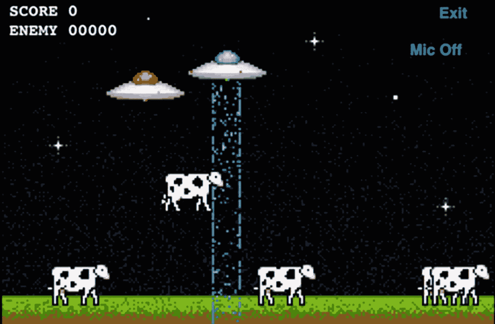

# 9. 语音聊天

语音聊天，作为 Game Center 提供的服务之一，远比其它服务更能证明 Apple 的工程实力。Apple 将其他平台上最复杂的功能之一，转变成了在 iOS、Mac 和 Apple TV 设备上最容易实现的功能。在其他平台上处理 IP 语音时，这通常是整个项目中最复杂、最令人生畏的任务。在本章中，我们将探讨如何将语音聊天服务添加到 UFO 项目或任何 Apple 平台应用中。本章的简短篇幅充分证明了 Apple 为降低这项技术的门槛所付出的巨大努力，即使是新手开发者也能轻松掌握。

注意

在本章中，我们将回到 UFO 项目。井字棋项目已经完成。

## Game Center 的语音聊天

我们首先来看看 Game Center 的语音聊天。使用`GKMatch`来创建语音聊天会话有许多优点，例如易用性、快速实现，以及与使用 GameKit 或自行实现系统相比，减少了所需的开销。一个`GKMatch`语音聊天可以有多个频道，每个频道都有一个关联的接收者列表。例如，在第一人称射击游戏中，您可以为队友设置一个频道，为所有玩家设置另一个频道。这样，您就可以在不向其他队伍泄露信息的情况下，讨论赢得比赛的策略。

注意

使用`GKMatch`的语音聊天仅适用于通过 Wi-Fi 连接到互联网的参与者；语音聊天不支持蜂窝网络。

### 创建音频会话

在开始使用语音聊天之前，您首先需要创建一个新的音频会话。在任何聊天服务开始之前执行此操作非常重要。如果您在创建聊天会话之后才创建音频会话，您将无法发送或接收语音数据。在下面的示例中，我们创建了一个新的音频会话，允许我们的应用播放和录制音频，然后将其设置为激活状态。

提示

您的应用可能已经有一个用于播放音效的音频会话；如果您已经创建了音频会话，则无需创建新的会话。如果重复使用现有的音频会话，请确保将其设置为允许播放和录制功能。

```
var error: Error? = nil
let audioSession = AVAudioSession.sharedInstance()
do {
try audioSession.setCategory(.playAndRecord)
} catch (let err){
error = err
}
do {
try audioSession.setActive(true)
} catch (let err) {
error = err
}
if let error = error {
print("An error occurred while starting audio session: \(error.localizedDescription)")
}
```

### 创建新的语音频道

您的应用中可以拥有任意数量的语音聊天频道，每个对等方都可以注册加入任意数量的频道。频道通过名称字符串进行创建和组织。这将决定我们希望用户加入哪些频道。当两个或多个对等方加入同名的频道时，它们将连接到同一个聊天。

下面的代码片段展示了如何创建三个不同频道的示例。请注意，这些频道是使用当我们开始一个新的基于 Game Center 的网络游戏时返回给我们的`GKMatch`对象创建的：

```
let allChannel = match.voiceChat(withName: "allPlayers")
let teamChannel = match.voiceChat(withName: "blueTeam")
let squadChannel = match.voiceChat(withName: "BlueTeamSquad2")
```

在此示例中，我们有一个与所有玩家通信的频道、一个与整个队伍通信的频道，以及第三个用于与小队通话的频道。仅仅创建了频道并不意味着它们会自动开启。在下一节中，我们将探讨如何在特定频道上启动和停止通信。

### 启动和停止语音聊天

在上一节中，我们创建了三个新的语音频道，用于 Game Center 类型的语音聊天。当您想要在这些频道上发送和接收语音时，需要首先告诉 API 您想开始使用该频道。连接到频道后，您就可以通过该频道发送和接收数据。如果您想连接到一个频道但不想发送任何语音音频，请参阅下一节关于麦克风静音的内容。

要开始使用语音频道，您需要调用上一节创建的`GKVoiceChat`对象上的`start`方法。

```
allChannel?.start()
teamChannel?.start()
```

当您想离开频道时，只需调用`stop`方法。这比简单地将频道中的所有参与者静音要好，因为应用程序将不再需要接收额外的网络数据。已停止的频道可以随时重新启动。

```
allChannel?.stop()
teamChannel?.stop()
```

提示

强烈建议您在传输语音数据时提供视觉和音频指示（例如红灯和咔嗒声）。这样可以降低用户在无意中传输语音数据的可能性。请始终记住，用户的麦克风和传输的语音应被视为敏感数据。从 iOS 14 开始，iPhone 刘海区域中有一个小的指示灯，用于指示麦克风当前处于活动状态。


### 聊天音量和静音

语音聊天的音量是按频道设置的。每个频道都有一个关联属性，可用于降低该聊天的整体音量。您无法将音量提高到用户当前设备音量之上。若要修改频道的音量，请添加以下代码行：

```
allChannel?.volume = 0.5 //最大音量的一半
```

此外，您可以通过引用单个玩家的 `GKPlayer` 来将其静音。可以使用以下两行代码对玩家进行静音和取消静音：

```
teamChannel?.setPlayer(player, muted: true)
teamChannel?.setPlayer(player, muted: false)
```

在某些情况下，您可能不希望始终传输用户的语音。默认情况下，用户加入聊天时处于静音状态。您需要在用户开始传输语音数据之前对其进行取消静音操作。

```
squadChannel?.isActive = true
```

**注意：** 一个用户一次只能在一个频道上传输语音；如果您对某个频道取消静音，API 会自动将所有其他频道静音。

要在基于 Game Center 的网络应用中完全启用语音聊天，这些就是全部所需。其他所有内容，包括发送和接收数据，均由 API 为您处理。

### 监控玩家状态

我在本章前面提到过，让用户知道他们当前正在传输数据非常重要。让玩家看到谁在说话也是一个重要步骤。通过监控玩家状态变化，您可以确定哪些用户当前正在传输语音，并在玩家列表中高亮显示他们，或执行其他类型的指示来表明哪个玩家正在说话。在您开始聊天时，以下代码块很容易设置，并且可以避免您进行轮询或委托回调：

```
guard let allChannel = allChannel else {
return
}
allChannel.playerVoiceChatStateDidChangeHandler = { player, state in
switch state {
case .connected:
print("频道", allChannel.name, "已连接。")
case .disconnected:
print("频道", allChannel.name, "已断开连接。")
case .speaking:
showSpeakingPlayer(player)
case .silent:
stopShowingSpeakingPlayer(player)
case .connecting:
print("频道", allChannel.name, "正在连接中。")
@unknown default:
print("频道", allChannel.name, "收到未知状态", state, "。")
}
}
```

**注意：** 玩家状态更新是按频道处理的。您需要为每个希望监控变化的频道配置一个这样的处理程序。

## 整合

在本章中，我们将修改第 8 章中的现有代码库。首先，为您的语音聊天服务创建一个新的音频会话。将以下代码块添加到 `UFOGameViewController.swift` 文件的 `viewDidLoad()` 方法中。此外，您需要将 `AVFoundation.framework` 添加到您的项目中。将 `viewDidLoad` 方法的相关部分修改为以下内容：

```
if gameIsMultiplayer == false {
for _ in 0..<5 {
spawnCow()
}
updateCowPaths()
} else {
generateAndSendHostNumber()
var error: Error? = nil
let audioSession = AVAudioSession.sharedInstance()
do {
try audioSession.setCategory(.playAndRecord)
} catch (let err){
error = err
}
do {
try audioSession.setActive(true)
} catch (let err) {
error = err
}
if let error = error {
print("启动音频会话时发生错误：\(error.localizedDescription)")
}
setupVoiceChat()
}
```

**警告：** 确保您构建的目标设备既有可用的扬声器也有麦克风。

您还需要添加一个名为 `setupVoiceChat` 的新方法。此方法将处理基本配置。

```
func setupVoiceChat() {
mainChannel = peerMatch?.voiceChat(withName: "main")
mainChannel?.start()
mainChannel?.volume = 1.0
mainChannel?.isActive = false
}
```

## 连接用户界面

最后一步，我们需要连接一个操作来打开和关闭麦克风。对于 UFO 项目，我决定采用一个简单的切换按钮，但您可能觉得需要实现不同的方法。新增一个按钮，如图 9-1 所示，并将下面贴出的新操作连接上去。



*图 9-1：在我们的 UFO 游戏演示中添加麦克风按钮*

```
@IBAction func startVoice(_ sender: Any) {
micOn = !micOn
if micOn {
micButton.setTitle("麦克风开", for: .normal)
mainChannel?.isActive = true
} else {
micButton.setTitle("麦克风关", for: .normal)
mainChannel?.isActive = false
}
}
```

此方法确定麦克风的当前状态（开/关），并将其切换到新状态。当切换发生时，我们会更新按钮标题，并根据我们使用的网络类型打开或关闭麦克风。

这些是将语音聊天功能添加到我们的 UFO 示例项目中所需的所有步骤。如果您在两台设备上运行游戏，您就可以通过语音进行双向交流了。

## 总结

在本章中，我们学习了如何用很少的工作量将一项传统上非常复杂的技术集成到我们的 iOS 应用中。我们探讨了在 GameKit 和 Game Center 中使用语音聊天的区别，并在 UFO 演示游戏中实现了两种系统的示例。现在，您已经具备了为任何 iPhone 或 iPad 应用添加功能完整的 VOIP 技术所需的技能。如果您一直从本书开头跟随阅读，那么您现在已具备将 GameKit 和 Game Center 的各个方面集成到您的应用中的所有技能。

在下一章中，我们将学习 iOS 游戏或应用开发中的另一项重要技术——StoreKit。通过使用 StoreKit 技术，我们将学习如何销售附加功能和产品扩展。


