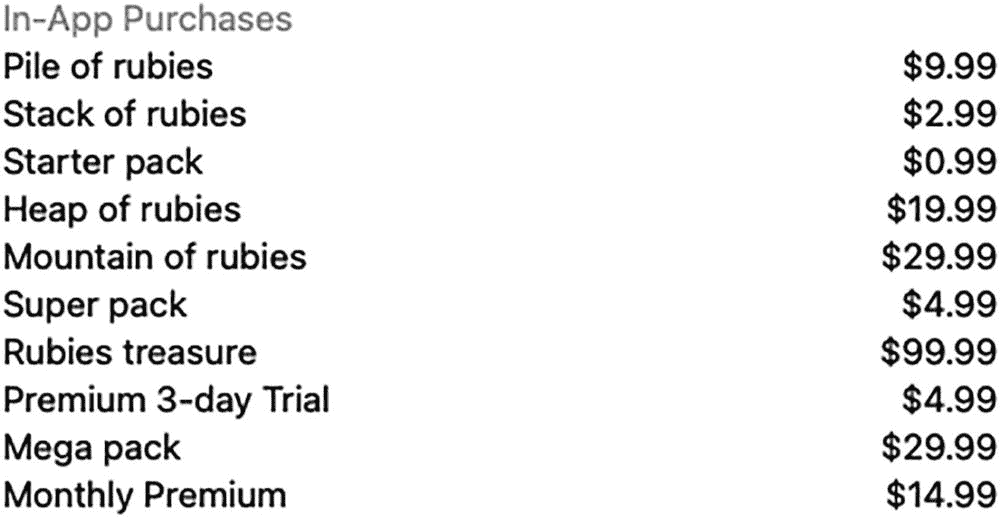
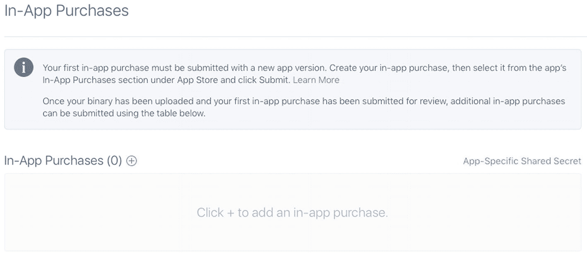
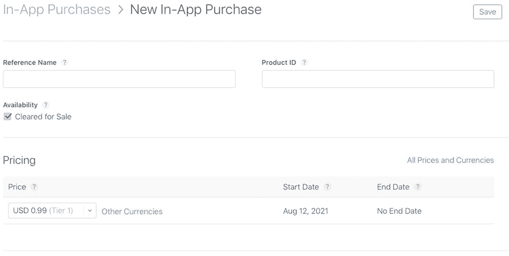
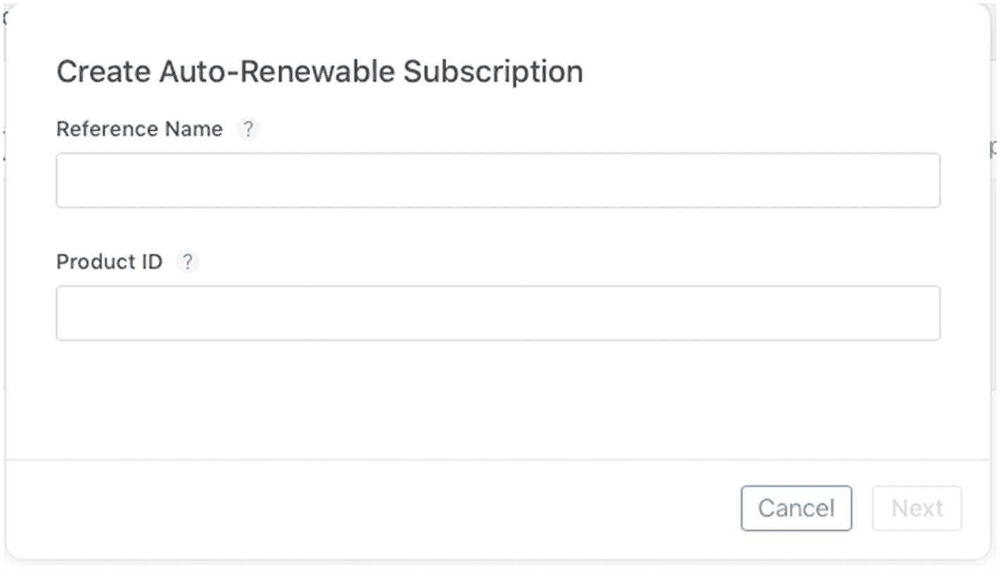
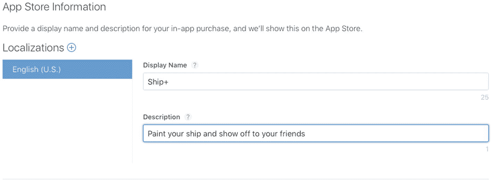
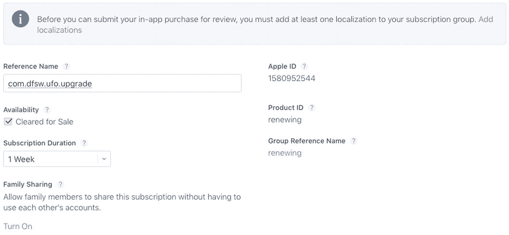
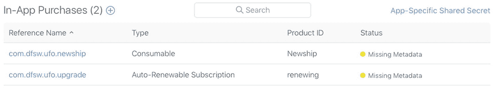

# 使用 StoreKit 实现应用内购买

在本书中，我们一直使用 Game Center 和 GameKit 为你的 iOS、Mac 及 Apple TV 应用添加丰富的社交功能。然而，还有另一个重要功能正在现代软件中迅速普及：应用内购买。允许用户直接在应用内购买升级或额外内容，将为你开辟一个潜在的重要收入来源。过去十年中，一种名为“免费增值”（Freemium）的新商业模式应运而生。免费增值是一种免费提供给用户，但通过销售附加内容实现盈利的游戏或产品。

我们将以 ngmoco:) 公司的《We Rule》为例。这款游戏最初为 iPhone 和 iPad 玩家免费提供。每个用户管理一个虚拟王国，负责建造建筑和种植庄稼。用户会随时间累积“魔力”（mojo），并可以利用这种应用内货币来建造新建筑和农场。然而，由于魔力积累缓慢且具有限制性，有些用户希望以超出常规允许的速度进行建造。这些高级用户可以访问应用内商店批量购买更多魔力。商店提供了从非常实惠到惊人高价的一系列购买选项。在处理可销售附加内容时，满足这两类用户的需求至关重要。你的部分用户可能偶尔有兴趣花一、两美元，而另一些高级用户则可能一次想花一百美元甚至更多。

免费增值已成为一种如此强大的商业模式，以至于 ngmoco:) 已停止开发不符合该模式的游戏，甚至在中途取消了《Rolando 3》的开发，因为它无法适应这种模式。这种模式似乎为 ngmoco:) 带来了丰厚回报。如图 10-1 所示，当前《We Rule》商店中销量最高的商品售价为 9.99 美元。这一项应用内购买的零售价就已超过大多数独立 iOS 游戏，而它能吸引该顾客的原因，是先用一款免费游戏吸引了他们。



图 10-1 – ngmoco:) 公司《We Rule》中当前最畅销的应用内购买列表

并非所有支持应用内购买的游戏或应用都必须是免费的。你也可以轻松地为付费游戏添加额外功能或解锁内容，例如《愤怒的小鸟》中的“神鹰”。应用内购买也不仅限于游戏。几乎任何软件都能从中受益，无论是解锁专业级功能，还是向用户收取推送通知支持的费用。在本章中，我们将探索如何为你的 iOS、Mac 和 Apple TV 软件添加一个功能完备的应用内商店。

## 在 App Store Connect 中设置你的应用

与 Game Center 类似，我们需要先在 App Store Connect 中开始处理应用内购买：

1.  登录 App Store Connect（[`https://appstoreconnect.apple.com/login`](https://appstoreconnect.apple.com/login)），如第 2 章所述。你需要一个现有项目进行操作。如果你尚未在 App Store Connect 中创建项目，请先创建一个。

2.  选择你要添加应用内购买支持的项目。然后，点击“应用内购买”部分下的“管理”按钮。

**重要提示**：从创建应用起，你有 90 天的时间上传二进制文件以供审核。请确保在项目完成前 90 天内保存应用内购买配置。



图 10-2 – 在 App Store Connect 中设置你的第一个应用内购买

1.  点击“管理”按钮将带你进入设置新产品的界面，如图 10-2 所示。进入后，点击加号（+）按钮。

你可以配置多种类型的应用内购买产品。为了方便起见，这里详细介绍如下：



图 10-3 – App Store Connect 中消耗型与非消耗型购买的设置界面

*   **消耗型**：用户在每次下载消耗型应用内购买商品时都必须重新购买。这包括游戏内货币，正如我们在上一节《We Rule》示例中看到的那样。图 10-3 显示了消耗型购买的设置界面。



图 10-4 – App Store Connect 中自动续期订阅的设置界面

*   **非消耗型**：非消耗型购买每个用户只需购买一次，通常用于可解锁功能。非消耗型购买的示例包括额外关卡、可重复使用的道具或额外内容。

*   **自动续期订阅**：自动续期订阅允许用户在设定的时间段内购买应用内内容。在该时间段结束时，订阅将自动续期并向用户收费，除非用户选择退出。杂志和报纸采用这种模式，每周或每月发布新一期，直到用户退出。图 10-4 显示了自动续期订阅购买的设置界面。

*   **非续期订阅**：在很大程度上，自动续期订阅已取代了对此模式的需求。非续期订阅的功能与自动续期订阅相同，区别在于每次订阅到期时，用户需要手动续订。

**注意**：自动续期订阅将同步到与用户 Apple ID 关联的所有设备。

我们将从添加一个非消耗型购买开始。我们将在示例的 UFO 游戏中使用此商品。

我们要添加的第一项商品是当前飞船的付费升级；将此商品命名为 `com.dragonforged.ufo.newShip1`。我使用了相同的标题作为产品 ID 和参考名称。参考名称仅用于在 App Store Connect 中搜索时做参考，而产品 ID 将在你的代码库中用于标识此商品。

创建新商品后，你需要至少添加一个本地化描述和标题，如图 10-5 所示。最后要做的，是为该商品选择一个定价等级。你可能还注意到有一个用于上传截图的区域；我们将在后面的“提交购买 GUI 截图”一节中讨论。




### 图 10-5

在 `App Store Connect` 中为产品添加本地化描述

添加消耗型产品的流程与非消耗型产品相同。如果你想添加基于订阅的产品，则需要留意几个新的字段，如图 10-6 所示。配置订阅时，你需要定义持续时间。`iTunes Connect` 允许你设置以下任一选项：一周、一个月、两个月、三个月、六个月或一年。此外，如果用户同意参与营销活动（例如提供其电子邮件地址），你还可以提供免费订阅。



### 图 10-6

在 `iTunes Connect` 中配置订阅持续时间

现在，你应该至少配置好了一个用于应用内购买的产品。你在 `App Store Connect` 中的界面应类似于图 10-7。至此，我们在 `App Store Connect` 中为使应用内购买正常运行所需的初始配置就完成了。在下一节中，我们将开始编写在设备上完成购买所需的代码。

> **注**
>
> 暂时不必担心“缺少元数据”错误；这将在后续流程中处理。在等待上传截图期间，你仍然可以测试购买功能。



### 图 10-7

产品已设置完毕，可在我们的应用中使用

## 向应用添加产品

与 `Game Center` 不同，苹果并未为应用内购买提供预设计的 GUI。你需要作为开发者为用户设计一个商店界面。在本节中，我们将学习如何获取你在 `iTunes Connect` 中添加的产品，使其在你的应用中显示为可购买状态。

> **注**
>
> 新的购买项或更改可能需要数小时才能生效。如果你反复检查一切无误但仍未看到产品，请等待几小时后再试。

## App ID 与应用内购买

在使用应用内购买功能时，苹果要求你的 `App ID` 不能包含通配符，例如 `76P4G6KX56.*`。你必须使用唯一的 `App ID`，例如 `76P4G6KX56.com.dragonforged.ufo`。如果你没有唯一的 `App ID`，则需要创建一个。请按照以下步骤创建新的唯一 `App ID`：

1.  在网页浏览器中导航至 [`https://appstoreconnect.apple.com/`](https://appstoreconnect.apple.com/)，然后从列表中选择你的应用。
2.  从左侧栏中选择 `App Information`。
3.  填写关于你应用的必填信息。
4.  点击 `Submit`。
5.  点击列表旁边的 `Configure`，确保 `In-App Purchase` 已开启（默认应已开启）。

## 设置

我们首先从应用中请求一个产品列表。首先，将 `StoreKit` 框架添加到你的项目中。我们将修改上一章中现有的 `UFO` 项目；如果更方便，你也可以在自己的项目中跟随操作。

> **重要**
>
> `In-App Purchase` 在模拟器上无法工作；所有测试都必须在设备上进行。

创建一个名为 `UFOStoreViewController` 的新类。我们将使用这个类向用户展示一个商店。将源代码文件设置为匹配以下内容：

```swift
import UIKit
import StoreKit
class UFOStoreViewController: UIViewController {
    var productsRequest: SKProductsRequest?
    @IBOutlet var storeTable: UITableView!
}
extension UFOStoreViewController: SKProductsRequestDelegate {
}
```

如你所见，我们导入了 `StoreKit` 头文件。设置 `SKProductsRequestDelegate`，并创建一个新对象来持有产品请求。我们需要创建一种让用户访问商店的方式，因此请继续在主屏幕上添加一个按钮以及呈现新视图控制器的相关代码。

## 检索产品列表

修改我们新商店视图控制器的 `viewDidLoad` 函数，使用我们在 `App Store Connect` 中设置的产品标识符启动一个新的商店请求。你可能需要修改你的产品标识符，使其与你上一节中设置的一致。

```swift
override func viewDidLoad() {
    super.viewDidLoad()
    let productIdentifiers: Set = [
        "com.dragonforged.ufo.newShip1",
        "com.dragonforged.ufo.subscription",
        "com.dragonforged.ufo.newShip2"
    ]
    let productsRequest = SKProductsRequest(productIdentifiers: productIdentifiers)
    productsRequest.delegate = self
    productsRequest.start()
    self.productsRequest = productsRequest
}
```

产品请求在委托回调中释放，如下所示。目前，此方法只是将你的产品信息打印到控制台，并记录任何无效产品。

```swift
func productsRequest(_ request: SKProductsRequest, didReceive response: SKProductsResponse) {
    for product in response.products {
        print("Product title:", product.localizedTitle)
        print("Product description:", product.localizedDescription)
        print("Product price:", product.price)
        print("Product id:", product.productIdentifier)
        print("\n\n")
    }
    for invalidProduct in response.invalidProductIdentifiers {
        print("Invalid product identifier: \(invalidProduct)")
    }
    productsRequest = nil
}
```

> **注**
>
> 虽然你可以使用本节中的代码检索无效产品标识符列表，但并没有关联的错误信息来确定产品为何被标记为无效。在大多数情况下，产品 ID 输入有误，或者产品尚未被足够的时间分发到服务器。

如果你现在运行游戏并导航至商店，应该会得到类似于以下内容的输出：

```
Product title: Ship+
Product description: Paint your ship and show off to your friends
Product price: 8.99
Product id: com.dragonforged.ufo.newShip1
Product title: Subscription
Product description: A subscription service
Product price: 1.99
Product id: com.dragonforged.ufo.subscription
```

> **注**
>
> 从产品请求获取响应可能需要几秒钟。最佳实践要求你应该向用户显示某种加载指示器。

以上是从苹果服务器检索产品所需的所有步骤。在下一节中，我们将使用标准表格视图向用户展示这些数据。


好的，作为高级文档工程师和翻译员，我将按照您的要求，对给定的英文文本进行翻译。


### 向用户展示你的产品

我们首先在商店视图控制器中添加一个表格视图。别忘了按要求连接数据源和委托。同时，我们为类添加一个新属性来持有产品。创建一个名为 `productArray` 的新数组属性。

```
var productArray: [SKProduct]?
```

将产品结果设置给它，并在 `productsRequest` 方法中重新加载表格。

```
productArray = response.products
storeTable.reloadData()
```

将两个必需的表格视图委托和数据源函数添加到你的类中，如下面的代码片段所示：

```
extension UFOStoreViewController: UITableViewDataSource {
static var currencyFormatter: NumberFormatter = {
let currencyFormatter = NumberFormatter()
currencyFormatter.numberStyle = .currency
return currencyFormatter
}()
func tableView(_ tableView: UITableView, numberOfRowsInSection section: Int) -> Int {
return productArray?.count ?? 0
}
func tableView(_ tableView: UITableView, cellForRowAt indexPath: IndexPath) -> UITableViewCell {
var cell: UITableViewCell
if let dequeuedCell = tableView.dequeueReusableCell(withIdentifier: "Cell") {
cell = dequeuedCell
} else {
let subtitleCell = UITableViewCell(style: .subtitle, reuseIdentifier: "Cell")
subtitleCell.selectionStyle = .none
cell = subtitleCell
}
let cellText: String
let cellDetailText: String
if let product = productArray?[indexPath.row] {
Self.currencyFormatter.locale = product.priceLocale
let priceText = Self.currencyFormatter.string(from: product.price)
let titleComponents = [product.localizedTitle, priceText]
cellText = titleComponents.compactMap{ $0 }.joined(separator: " - ")
cellDetailText = product.localizedDescription
} else {
cellText = "Unknown Product"
cellDetailText = ""
}
cell.textLabel?.text = cellText
cell.detailTextLabel?.text = cellDetailText
return cell
}
}
```

顶部的 `var` 配置了货币格式化器，单元格将用它来格式化产品价格。第一个函数简单地返回我们从苹果服务器检索到的产品数量，作为表格的行数。当我们以单元格形式显示它们时，我们使用了内置的 `.subtitle` 样式。我们将主标签设置为产品标题和价格，并使用详细标签显示描述。剩下的就是在 `productsRequest` 方法的末尾添加一个 `reloadTable` 方法。再次运行游戏后，你应该会看到一个表格视图，它能正确列出之前在 App Store Connect 中设置的两个应用内购买项。

> **注意**  
> 虽然 API 返回了本地化的标题和描述，但它不会本地化价格。在国际化应用中，你需要自行完成这额外的一步。

## 购买产品

在上一节中，我们学习了如何将产品添加到你的应用中。但如果没有购买这些产品的能力，我们的实现就只完成了一部分。在本节中，我们将探讨如何通过你的应用直接处理产品购买。

### 购买代码

我们需要做的第一件事是让商店的视图控制器类遵循 `SKPaymentTransactionObserver` 协议。完成之后，我们修改现有的 `viewDidLoad` 方法。我们将自己添加为一个新的交易观察者。此外，我们执行一个测试来确认我们能否在此设备上付款，如果不能，则显示一个 `UIAlert` 来通知用户。

```
override func viewDidLoad() {
super.viewDidLoad()
SKPaymentQueue.default().add(self)
guard SKPaymentQueue.canMakePayments() else {
let alert = UIAlertController.init(title: "", message: "Unable to make purchases with this device.", preferredStyle: .alert)
self.present(alert, animated: true, completion: nil)
return
}
let productIdentifiers: Set = [
"com.dragonforged.ufo.newShip1",
"com.dragonforged.ufo.subscription",
"com.dragonforged.ufo.newShip2"
]
let productsRequest = SKProductsRequest(productIdentifiers: productIdentifiers)
productsRequest.delegate = self
productsRequest.start()
self.productsRequest = productsRequest
}
```

接下来，我们需要添加一个 `didSelectRowAtIndexPath` 函数来注册我们表格视图中的选择事件。

```
extension UFOStoreViewController: UITableViewDelegate {
func tableView(_ tableView: UITableView, didSelectRowAt indexPath: IndexPath) {
guard let product = productArray?[indexPath.row] else {
return
}
let payment = SKPayment(product: product)
SKPaymentQueue.default().add(payment)
}
}
```

如果你现在运行应用并选择一个表格行，你会收到一个确认提示。然而，我们还没有编写任何处理此交易的代码，也没有设置测试用户，所以目前你只能做到这一步。

### 购买多个商品

苹果让用户一次购买多个商品变得非常简单。以下代码片段可用于一次批量购买某个商品的多个数量，例如用户购买五包 100 金币。

```
if let product = productArray?.first(where: { $0.productIdentifier == "com.dragonforged.rpg.100gold" }) {
let payment = SKMutablePayment(product: product)
payment.quantity = 5
SKPaymentQueue.default().add(payment)
}
```


### 处理交易

在用户请求购买后，你需要执行几个步骤来确保其购买成功完成。首先，我们要实现 `SKPaymentTransactionObserver` 协议中所需的方法。正如下面的代码示例所示，我们检测当前交易状态，然后根据交易是成功、失败还是恢复来调用一些新函数：

```swift
extension UFOStoreViewController: SKPaymentTransactionObserver {
func paymentQueue(_ queue: SKPaymentQueue, updatedTransactions transactions: [SKPaymentTransaction]) {
for transaction in transactions {
switch transaction.transactionState {
case .purchasing:
print("购买中:", transaction)
case .purchased:
transactionDidComplete(transaction)
case .failed:
transactionDidFail(transaction)
case .restored:
transactionDidRestore(transaction)
case .deferred:
print("延迟:", transaction)
@unknown default:
print("未处理的情况:", transaction)
}
}
}
}
```

我们需要实现一些便捷函数来帮助简化流程。如果交易成功完成或被恢复，我们需要记录交易事件、解锁用户购买的内容并执行一些清理工作。如果交易失败或被取消，我们只需要执行清理工作，并可能通知用户出现了问题。

```swift
func transactionDidComplete(_ transaction: SKPaymentTransaction) {
unlockContent(transaction.payment.productIdentifier)
finish(transaction, withSuccess: true)
}
func transactionDidRestore(_ transaction: SKPaymentTransaction) {
unlockContent(transaction.original?.payment.productIdentifier)
finish(transaction, withSuccess: true)
}
func transactionDidFail(_ transaction: SKPaymentTransaction) {
if let error = transaction.error as? SKError, error.code == SKError.Code.paymentCancelled {
SKPaymentQueue.default().finishTransaction(transaction)
} else {
finish(transaction, withSuccess: false)
}
}
```

接下来，我们来看一下 `unlockContent` 函数。这是你的实际应用中可能有所不同之处。在这个示例中，我们在 `NSUserDefaults` 中设置一个标志位，我们可以通过检查该标志位来判断用户是否已购买某个功能。根据你的应用结构，你可能会采取不同的方法，但无论采用何种方法，请记住，你需要通过应用重启来保留已解锁的内容。有关如何实现此方法的示例，请参阅“在 UFO 中将一切整合在一起”一节。

```swift
func unlockContent(_ productId: String?) {
switch productId {
case "com.dragonforged.ufo.newShip1":
UserDefaults.standard.set(true, forKey: "shipPlusAvailable")
case "com.dragonforged.ufo.subscription":
UserDefaults.standard.set(true, forKey: "subscriptionAvailable")
case .some(let unknown):
print("无法识别的产品 ID:", unknown)
case .none:
break
}
}
```

对于成功和不成功的购买，我们采取的最后一步是对我们的交易执行一些清理工作。以下方法中最重要的一步是调用 `finishTransaction` 方法。我们还会记录交易结果用于调试。在你调用 `finishTransaction` 之前，该交易将保持打开状态并存在于系统中。

```swift
func finish(_ transaction: SKPaymentTransaction, withSuccess success: Bool) {
SKPaymentQueue.default().finishTransaction(transaction)
if success {
print("交易成功:", transaction)
} else {
print("交易失败:", transaction)
}
}
```

### 恢复之前完成的交易

通常，你的用户需要恢复他们之前进行的购买。如果他们重新安装了你的应用或开始在另一台设备上使用它，就可能发生这种情况。始终为用户提供一条路径来下载所有内容并解锁他们之前进行的任何购买，这一点非常重要。幸运的是，Apple 已经为此场景提前做了规划，并提供了一个简单的方法来恢复用户的购买。

```swift
SKPaymentQueue.default().restoreCompletedTransactions()
```

这将重新“购买”你的所有内容，就像用户从你的商店中选择了它们一样。你将收到对 `paymentQueue(_:updatedTransactions:)` 方法的相应回调，并可以使用现有代码解锁内容。

## 测试帐户与测试购买

如果你现在尝试在沙盒环境中购买你的某个商品，你将收到一个帐户错误。你需要首先创建一个新的测试帐户，以便能够在无需付费的情况下测试购买。

要设置一个新的测试用户，你需要登录到 App Store Connect ([`http://appstoreconnect.apple.com`](http://appstoreconnect.apple.com))。从 App Store Connect 的主屏幕选择“管理用户”部分；然后在此处选择“新测试用户”选项。

测试用户不需要使用真实的电子邮件地址，你应选择一个易于输入且容易记住的地址，例如 `abc@def.com`。虽然你需要输入出生日期和其他身份信息，但完全没有理由不能虚构这些数据。确保选择“App Store”作为您测试本地化的商店。你可以为你将要测试的每个地区创建一个新帐户。

### 使用测试帐户登录

你无法直接在“设置”应用中登录你的测试帐户。这样做会导致你被迫同意标准用户协议并被提示输入信用卡号。为了解决此问题，您需要使用“设置”应用退出您现有的 App Store 帐户。退出帐户后，在尝试购买时，系统会提示您登录或创建新帐户。此时，您应在此处输入测试帐户凭据。

> **注**
> 如果您在主设备上进行测试，在进行真实购买或下载更新之前，请不要忘记返回“设置”应用退出您的测试帐户。

## 提交购买 GUI 截图

我们在本章前面的部分简要讨论过此步骤。Apple 要求您提交应用内购买的屏幕截图，然后才会批准其销售。关于 Apple 在此截图中具体寻找什么，存在一些混淆。简而言之，Apple 想要的是一个屏幕截图，证明您的应用内购买按预期工作。对于可解锁内容，这将是正在使用该物品的截图，例如用户正在玩已购买的关卡或使用已购买的道具。然而，有时您的产品在使用时可能不可见。在这种情况下，Apple 已接受显示该商品已被购买的商店截图。

> **注**
> 在您完成应用程序的编写和调试并准备提交审核之前，您不需要提交截图。

## 开发者审批

在您的应用内购买准备就绪之前，您需要完成的最后一步是开发者审批。在您的网页浏览器中返回到 App Store Connect，并导航到应用审核页面的“管理应用内购买”部分。屏幕的右上角将出现一个新的绿色按钮。

系统将提示您如何提交产品。有以下两种选项可用：

*   **随二进制文件提交：** 此选项将在您下次上传二进制文件时启用应用内购买。
*   **立即提交：** 这将允许您向现有应用提交新产品。


### 在 `UFOs` 中整合所有元素

根据应用内购买的复杂程度，将其集成到代码中有可能非常简单，也可能非常困难。在 `UFOs` 中，我们有一个非常简单的产品：用户只需支付一次性费用，就能解锁一艘不同颜色的飞船。当用户购买该产品后，我们会在用户默认设置中存储一个键值来记录这一操作。要在代码中解锁这个购买项，我们只需检查这个键值，然后执行所需的步骤即可。为此，我们需要向项目中添加一些新的美术资源。这些资源已包含在第 10 章的示例代码中（可从 Apress 网站获取）。

完成这一步后，我们需要修改 `viewDidLoad` 函数来更改飞船的图像。以下代码片段展示了这些改动：

```
override func viewDidLoad() {
    purchasedUpgrade = UserDefaults.standard.bool(forKey: "shipPlusAvailable")
    let playerFrame = CGRect(x: 100, y: 70, width: 80, height: 34)
    myPlayerImageView = UIImageView(frame: playerFrame)
    myPlayerImageView?.animationDuration = 0.75
    myPlayerImageView?.animationRepeatCount = 99999
    var imageArray: [UIImage]
    if purchasedUpgrade {
        imageArray = [UIImage(named: "Ship1.png"), UIImage(named: "Ship2.png")].compactMap { $0 }
    } else {
        imageArray = [UIImage(named: "Saucer1.png"), UIImage(named: "Saucer2.png")].compactMap { $0 }
    }
    myPlayerImageView?.animationImages = imageArray
    myPlayerImageView?.startAnimating()
    if let myPlayerImageView = myPlayerImageView {
        view.addSubview(myPlayerImageView)
    }
}
```

### 本章小结

在本章中，我们介绍了 StoreKit 和应用内购买。通过利用 StoreKit，你获得了多种将应用变现的方式，从可扩展的内容到为用户提供的特殊升级功能。

现在，你应该有信心在自己的应用内商店中添加各种产品了。尽管 StoreKit 并非 Game Center 或 GameKit 的直接组成部分，但你无疑会发现，应用内商店是你 iOS、Mac 或 Apple TV 软件中不可或缺的补充。

我们花了一些时间讨论了 ngmoco:) 及其在 Freemium 模式上的实验与成功经验。现在，你应该能够自信地使用 App Store Connect，并完成完全设置一个应用内购买产品所需的所有操作，以及让该购买项显示出来所需的代码。

我们探讨了如何处理购买失败的情况以及成功购买后的流程。此外，我们还探索了一些高级主题，例如一次完成多次购买。最后，我们看到了如何将整个体验集成到我们的 `UFOs` 演示应用中。

