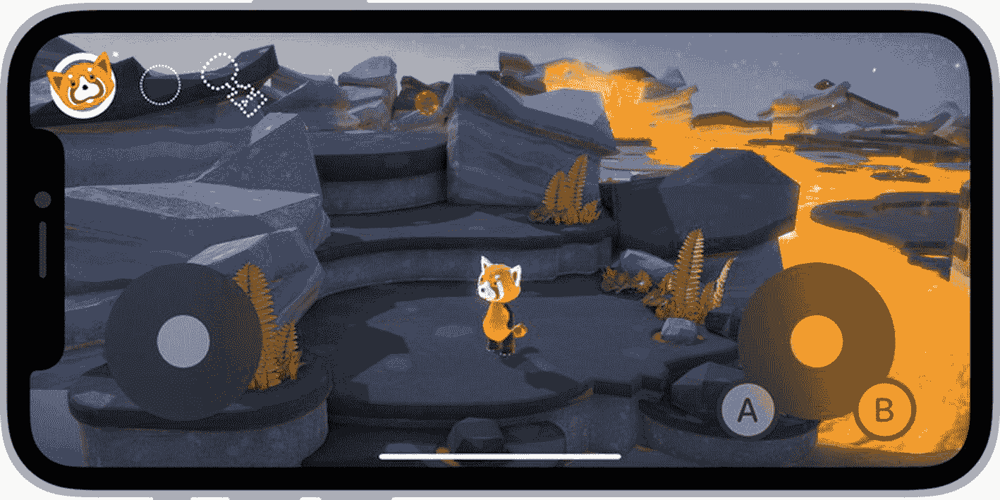

# 11. 游戏控制器

至少可以说，苹果在其平台上的游戏领域有着漫长而复杂的历史。当 iPhone 刚开始获得关注，并且世界迎来了首个原生 SDK 时，游戏显然并非优先考虑的事项。但从那时起，通过本书所描述的这些技术可以证明，苹果已经取得了长足的进步。iOS 游戏控制器最初是在 2013 年的 WWDC 上作为 iOS 7 的一部分发布的。将注意力集中在屏幕上，却又无法感知游戏控制器的位置，这被证明是困难的。从 iOS 15 开始，苹果引入了新的 SDK 来处理屏幕上的游戏控制器。

## 实体游戏控制器的类型

实体游戏控制器通常有两种类型：微型和扩展型。它们也可能以有线（底座连接器）或无线（蓝牙）型号提供。无论其他物理和布局上的差异如何，所有控制器都将遵循相同的输入类型。重要的是要注意，扩展型控制器比标准控制器拥有更多的输入控件。

微型控制器配备了一个方向 D-pad（方向键）、两个主要按钮（A、X）和一个菜单按钮。扩展型控制器配备了一个方向 D-pad、四个主要按钮（A、B、X、Y）、三个附加按钮（菜单、选项、主页）、两组肩部按钮以及两个方向摇杆。无线控制器还带有一个玩家指示灯 LED，该指示灯有四个位置。从 iOS 15 开始，该平台增加了软件控制器的功能，本章稍后将对此进行介绍。

> **注意**  
> 虽然游戏控制器可以为你的 iOS、Mac 或 Apple TV 游戏增添大量功能，但必须记住，它们应当是可选功能。除了对游戏控制器的支持外，游戏还必须通过触摸屏、标准控件或在适用情况下通过加速计，包含所有必需的功能。

游戏控制器首次发布时，很少有公司进行生产。到 iOS 15 发布时，市场上已有数十种可选产品，从罗技和雷蛇这样的大品牌，到较小的公司和初创企业，不一而足。兼容苹果设备的游戏控制器现在形状、尺寸和风格各异。

## 连接游戏控制器

当非无线控制器（底座连接器）连接到设备时，它会自动被检测到。然而，要检测无线控制器，应用必须专门开始搜索。示例应用在菜单屏幕的左上角添加了一个新按钮，用于切换是否搜索无线控制器。

为“查找无线控制器”按钮创建了一个新的 `IBAction`。当用户首次点击该按钮时，会调用 `startWirelessControllerDiscovery` 函数。第二次切换将通过类方法 `stopWirelessControllerDiscovery` 结束搜索过程。

```
@IBAction func findWirelessController() {
    findingWirelessController.toggle()
    if findingWirelessController {
        GCController.startWirelessControllerDiscovery {
            print("无线控制器搜索已完成")
        }
    } else {
        GCController.stopWirelessControllerDiscovery()
        print("用户已停止搜索无线控制器")
    }
}
```

当检测到新控制器时，无论是无线的还是有线连接的，都会触发一个通知：`GCControllerDidConnectNotification`。这个通知以及与之对应的用于游戏控制器断开连接的通知，应尽早注册。在示例项目中，这是在 `UFOViewController` 类的 `viewDidLoad:` 方法中完成的。

```
NotificationCenter.default.addObserver(self, selector: #selector(setupControllers), name: Notification.Name.GCControllerDidConnect , object: nil)
NotificationCenter.default.addObserver(self, selector: #selector(setupControllers), name: Notification.Name.GCControllerDidDisconnect , object: nil)
```

> **注意**  
> 当控制器断开连接时，建议游戏自动暂停，以便玩家可以解决控制器的问题，或返回基于触摸的游戏操作。作为质量保证流程的一部分，不要忘记在游戏过程中测试控制器断开连接的情况。

收到任一通知后，将调用一个新函数 `setupControllers:`；此方法允许应用随时追踪哪些控制器（可能不止一个）已连接。游戏控制器可通过 `GCController` 对象上的 `controllers` 函数获取；该函数会返回一个包含所有已连接控制器的数组。在示例应用中，该控制器数组的值也会保存到一个数组属性中，供后续使用。

```
@objc func setupControllers(_ notification: Notification) {
    gameControllerArray = GCController.controllers()
    if gameControllerArray.isEmpty {
        print("未找到游戏控制器")
    } else {
        print("找到的游戏控制器数量", gameControllerArray.count)
    }
}
```

> **注意**  
> 控制器有可能在通知设置好之前就被检测到；因此，在添加通知时检查控制器数组的内容以确定当前是否有任何已连接的控制器，这一点非常重要。


### 通过轮询读取数据

控制器与设备连接后，需要读取该控制器的输入。在示例应用 UFOs 中，加速度计数据每 0.05 秒读取一次。由于并非所有用户都能使用游戏控制器，因此即使添加了游戏控制器支持，仍需要保留这一行为。这使得加速度计轮询方法成为从游戏控制器读取数据的理想方式。修改 UFOs 中现有的 `motionOccurred:` 函数以添加游戏控制器功能。

首先，游戏必须判断玩家是否正在使用游戏控制器；这通过确定设备当前是否已连接任何游戏控制器来实现。在实际应用中，你可能希望为用户提供一个选项。当连接了一个或多个游戏控制器时，会使用数组中的最后一个。在你自己的应用中，允许用户选择他们想要使用的控制器也可能是有益的。创建一个新的控制器对象，并将数组中的最后一个控制器存储到其中。

UFOs 游戏有两个主要功能：第一个是启动牵引光束动作，第二个是在屏幕上将飞船从一个位置移动到另一个位置。出于演示目的，将使用控制器上的 Y 按钮来启动牵引光束。由于只要持续按下按钮，牵引光束就会保持开启状态，因此会创建一个布尔值来跟踪按钮当前是按下还是松开。

按钮的操作被简单地传递给 `touchesBegan` 函数，该函数与处理触摸事件时控制牵引光束的函数相同。这种方法的好处是，即使连接了控制器，触摸事件仍然可以工作。由于标准版和加强版游戏控制器都有 Y 按钮，因此无需编写特定代码来处理不同的控制器。

使用标准控制器时，方向键将用于移动。然而，加强版游戏控制器上的摇杆方向键在控制飞船时能提供更好的体验，因此应用会在可用时使用这些摇杆。这通过 `extendedGamePad` 属性实现；如果该值非 nil，则表示当前连接了加强版控制器。

与 A、B、X、Y 按钮类似，方向键的值可以通过 `GCController` 对象的一个属性来访问。但是，方向键为 X 和 Y 轴返回 0.0 到 1.0 的浮点值。这个值可以用来替代未连接游戏控制器时使用的加速度计值。连接加强版游戏控制器的摇杆值几乎相同，但它们存储在 `extendedGamepad` 下，而不是根 `gamepad` 属性下。

```
func motionOccurred(_ accelerometerData: CMAccelerometerData) {
if let controller = /*parentViewController.*/gameControllerArray.last {
//Testing for button press
let pressed = controller.microGamepad?.buttonX.isPressed
if pressed == true && gameControllerXHit == false {
gameControllerXHit = true
xButtonAction()
} else if pressed == false && gameControllerXHit == true {
gameControllerXHit = false
xButtonAction()
}
if let extendedGamepad = controller.extendedGamepad {
accel[0] = extendedGamepad.leftThumbstick.xAxis.value * accelerometerDamp + accel[0] * (1.0 - accelerometerDamp)
accel[1] = extendedGamepad.leftThumbstick.yAxis.value * accelerometerDamp + accel[1] * (1.0 - accelerometerDamp)
} else if let microGamePad = controller.microGamepad {
accel[0] = microGamePad.leftThumbstick.xAxis.value * accelerometerDamp + accel[0] * (1.0 - accelerometerDamp)
accel[1] = microGamePad.leftThumbstick.yAxis.value * accelerometerDamp + accel[1] * (1.0 - accelerometerDamp)
}
} else {
accel[0] = accelerometerData.acceleration.x * accelerometerDamp + accel[0] * (1.0 - accelerometerDamp)
accel[1] = accelerometerData.acceleration.y * accelerometerDamp + accel[1] * (1.0 - accelerometerDamp)
accel[2] = accelerometerData.acceleration.z * accelerometerDamp + accel[2] * (1.0 - accelerometerDamp)
}
}
```

**注意**  
0.0 值表示方向键或摇杆处于静止状态；在游戏控制器框架出现之前，开发者发现有必要在静止位置周围设计一个“死区”；使用游戏控制器后，这已不再必要，任何大于 0.0 的值都应被视为预期的移动。

### 数据回调

在许多情况下，在游戏循环的每次迭代中都轮询游戏控制器的输入是不合理的。幸运的是，Apple 提供了回调功能，可以在游戏控制器上任何物理按钮的值发生变化时设置这些回调。在下面的代码片段中，为右肩键设置了一个处理器。当按钮值发生变化时，此函数将调用 `rightShoulderButtonAction`：

```
controller.extendedGamepad?.rightShoulder.valueChangedHandler = { [weak self] button, value, pressed in
if pressed {
self?.rightShoulderButtonAction()
}
}
```

除了为每个动作设置回调外，回调还可以同时在多个按钮之间共享。这可以通过创建一个新的代码块并按照以下代码片段所示进行设置来实现。这将导致 A、B、X 和 Y 按钮上的任何动作都会输出日志语句：

```
let buttonHandler:  GCControllerButtonValueChangedHandler = { button, value, pressed in
print("Handle action for \(button) pressed: \(pressed), with value: \(value)")
}
controller.extendedGamepad?.buttonA.pressedChangedHandler = buttonHandler
controller.extendedGamepad?.buttonB.pressedChangedHandler = buttonHandler
controller.extendedGamepad?.buttonX.pressedChangedHandler = buttonHandler
controller.extendedGamepad?.buttonY.pressedChangedHandler = buttonHandler
```

也可以设置数据回调来处理方向键或摇杆的轴值变化。这可以通过以下代码片段实现：

```
controller.extendedGamepad?.rightThumbstick.valueChangedHandler = { stick, xValue, yValue in
print("Right Thumb Stick value did change: \(xValue), \(yValue)")
}
```

### 暂停

如果你的游戏支持游戏控制器，那么它也必须支持所有游戏控制器上都有的暂停按钮。即使你的游戏之前不支持暂停，连接游戏控制器后这也成为一项要求。处理游戏控制器上的暂停按钮非常简单，只需要额外几行代码。

```
controller.extendedGamepad?.buttonMenu.pressedChangedHandler = { [weak self] button, value, pressed in
self?.togglePauseState()
}
```

### 玩家指示灯

无线游戏控制器还具有玩家指示灯功能，因为游戏控制器框架支持将多个控制器连接到单个设备。你的游戏可以通过额外的无线控制器，在单个设备上支持多人游戏功能。每个无线控制器都会有四个 LED 灯，用于指示玩家编号。这些灯也用于让用户知道他们已成功连接无线控制器，即使在单人模式下也是如此。要照亮无线控制器的第一个灯，让玩家知道他们已成功连接，可以使用以下代码：

```
if controller.playerIndex == .indexUnset {
controller.playerIndex = .index1
}
```

`playerIndex` 属性也可用于照亮其他玩家索引值，范围从 0 到 3。每个控制器一次只能点亮一个玩家指示灯。


## 快照

有时可能需要对控制器的输入状态创建快照。这不仅有助于调试，还可用于创建回放配置文件或通过网络传输控制器数据。快照通过`NSData`表示形式进行存储。

```
let snapshot = controller.capture()
```

你可以通过`isSnapshot`属性检查控制器是否为快照，如下方简短的代码片段所示：

```
snapshot.isSnapshot // 返回 true
```

## 虚拟控制器

虚拟控制器是作为 iOS 15 更新的一部分引入 iOS 平台的。虚拟控制器提供了屏幕触摸控制器的功能与标准化。虽然虚拟控制器并非新技术，但在 iOS 15 发布之前，用户需要自行开发解决方案或部署第三方方案。



图 11-1

来自 WWDC 关于虚拟控制器的公告

为了显示一个新的虚拟控制器，需要创建`GCVirtualController`的新实例。

```
let configuration = GCVirtualController.Configuration()
configuration.elements = [GCInputDirectionPad, GCInputButtonA, GCInputButtonB]
let virtual = GCVirtualController(configuration: configuration)
```

创建完成后，可以自定义按钮上显示的图像。

```
let customButtonPath1 = UIBezierPath(rect: .zero)
virtual.updateConfiguration(forElement: GCInputButtonA) { configuration in
    configuration.path = customButtonPath1
    return configuration
}
```

在某些情况下，暂时隐藏控制器按钮是合理的，例如在访问菜单或暂停时。这可以通过快速调用`isHidden`属性来实现，如下方代码片段所示：

```
virtual.updateConfiguration(forElement: GCInputButtonB) { configuration in
    configuration.isHidden = true
    return configuration
}
```

为了连接控制器并将其显示在屏幕上，只需对控制器执行简单的`connect`调用。连接成功后，需要设置新的输入处理程序。

```
virtual.connect { error in
    guard let extendedGamepad = virtual.controller?.extendedGamepad else {
        return
    }
    extendedGamepad.dpad.valueChangedHandler = { dpad, xValue, yValue in
        print("方向键值已变更：\(xValue), \(yValue)")
    }
    extendedGamepad.buttonA.pressedChangedHandler = buttonHandler
    extendedGamepad.buttonA.pressedChangedHandler = buttonHandler
}
```

当需要断开控制器时，虚拟控制器对象接受`disconnect`调用。

```
virtual.disconnect()
```

以上就是创建、显示、交互以及清理虚拟控制器所需的全部步骤。苹果再次不遗余力地使这项技术的实现与使用变得尽可能简单直接。如果你的游戏能从屏幕控制器中受益，那么几乎没有理由不实现此功能。

## 总结

在本章中，你了解了物理控制器和虚拟控制器的游戏控制器功能，涵盖了从框架要求到连接和读取数据的全部内容。本章还涉及了诸如暂停、玩家指示灯和快照数据等主题。游戏控制器可以运用在 iOS、Mac 和 Apple TV 项目中讨论的相同原则进行部署。现在你应该对这项技术有了充分的掌握，并了解如何将其快速、轻松地部署到你的项目中，从而为你的用户提供一种超越设备自带标准控制的标准化、通用化的输入方式。

索引 A，B `abductCow` 函数 `Accelerometer` 运动 `Achievements` 添加钩子 自定义 GUI 失败反馈 通知视图和标签 `Xcode` `App Store Connect` 配置视图 `iTunes Connect` 修改 展示 优势 Game Center GUI *vs.* 自定义 GUI 重置 `Application Programming Interfaces (API)` `App Store Connect` 添加 `Add IDs` 添加产品 组合 配置 创建 描述 开发者审批 编辑 产品列表 产品到用户购买 代码 GUI 截图 多个项目 恢复交易 分数格式 设置 自动续期订阅 `iTunes Connect` 非消耗品 非续期订阅 测试账户 测试用户 UFO `App Store Connect` 门户 配置 `Asynchronous` 游戏 `authenticateLocalUser` 方法 `Auto-matching` C，D `cellForRowAtIndexPath` 方法 `Client-to-host` 网络 E `Exchanging data` 绑架 代码 断连 选择主机 分享分数 生成牛进程 UFO `exitAction` 方法 `Experience-type` 学习者 F `finishTransaction` 方法 `Foursquare` `Freemium` 模型 G `Game Center` 认证 后台线程 好友 登录 玩家状态变更 `Game Center Groups` `GameCenterManager` 类 创建 修改 `Game Center–specific information` `Game Controllers` 连接 数据回调 暂停 玩家指示灯 读取数据 快照 `GameKit` 游戏中心 网络 UFO 语音聊天 `GKLeaderboard` 对象 `GKLocalPlayer` `GKScore` 对象 `GKTurnBasedEventHandler` `GKTurnBasedMatchmakerViewController` `Graphical user interface (GUI)` H `hitTest` 函数 I，J，K `In-app purchase (IAP)` `insertSubview` 函数 L `Leaderboards` 添加按钮 `App Store Connect` *另见* `App Store Connect` 自定义显示 过滤显示 GUI 本地玩家分数 发布分数失败 UFO 展示目的 周期 `Local area network (LAN)` M `Matchmaking and invitations` 添加玩家 自动匹配 创建新 GUI 托管比赛 传入玩家活动 玩家属性限制 玩家属性 玩家组 编程方式 重新邀请 场景 使用玩家属性 `Matchmaking process` `Micro controllers` `Multiplayer match` 选择主机 接收数据 发送数据 N `Network designs` 外推法 格式化消息 预测 仅发送 超时相关断连 类型 `Non-wireless controller` `NSNotification` 系统 O `OfRowsInSection` 方法 `Optimizations` P，Q `Peer-to-peer network` `Physical Game Controllers` `Player groups` `productsRequest` 方法 R `receivedData` 函数 `Recurring leaderboards` `Reliable data` *vs.* `unreliable data` `Ring network` S `Score-based system` `scoreReported` 函数 `Single-player game` `Snapshots` `Synchronous execution` T `Tic-tac-toe` 游戏 `Turn-based game` 第一步 认输/退出 游戏状态 `GKLocalPlayerListener` 新比赛 可选函数 编程方式比赛 恢复游戏 U `UFOGameViewController.swift` `viewDidLoad()` 方法 UFO 绑架 加速计 运动 App Store 创建玩家 命中测试 玩家移动 设置对象 源代码 生成/移动 触摸事件 `UFOViewController` 类 `Uncommon networks` `unlockContent` 函数 `User-interaction` 观点 V，W，X，Y，Z `viewDidLoad` 函数 `Virtual controllers` `Voice chat` 音频会话配置 `Game Center` 连接用户界面 监控玩家状态 开始/停止 UFO 语音频道 音量/静音 `Voice over Internet Protocol (VOIP)`
