# 第 1 章：欢迎进入 iOS 媒体应用开发

## 本书的目的是什么？

本书是一本针对 iOS 媒体应用开发的深度指南，面向初级到中级的 iOS 开发者。在本书中，你将学习如何构建应用，以利用 iOS 的编程接口（API）来捕捉、显示和处理静态图像（照片）、视频及音频资源。书的最后部分涵盖了新功能，包括 Apple 在 iOS 8 中引入的 Swift 编程语言。

在呈现这些主题时，我借鉴了教程式指南的一些方法，通过提供代码片段向你介绍主题。然而，本书比典型教程更深入，它介绍了背景信息，讨论了实现挑战，并提供了关键项目来巩固你的新知识。这些关键项目为每个章节构建框架，为你提供一个完整的、利用了所涵盖功能的应用程序，以及来自其他流行应用的经验教训。通过构建一个真实的应用，你将对软件设计过程有更深的理解，并在应对实现挑战（通常是完成应用最困难的部分）方面获得更多经验。

你可能曾尝试开发一个应用但中途停止了，或者你的朋友也遇到同样的情况。关于 iOS 开发最著名的抱怨之一就是它限制了你所能做的事情。尽管这种说法有些道理——iOS 平台强制你在“沙盒”中开发应用，并隐藏了对许多常见功能（如全局文件系统）的访问——但许多抱怨来自于必须为 Cocoa Touch 这个极其平台特定的框架进行开发。为框架编程让你可以免费利用许多功能，例如绘制视图或实例化媒体播放器，但代价是需要时间学习该框架及其限制。此外，iOS 提供的框架数量之多，可能令新手望而生畏，他们觉得在开始之前必须熟悉所有框架。本书将通过聚焦 iOS 媒体框架及你使用它们所需的技能，帮助你构建媒体应用。

市面上有几本 iOS 开发指南会简要提及 iOS 媒体应用开发，但我感觉它们只是浅尝辄止。同样，Apple 为其 API 提供了出色的文档，但其措辞和技术深度可能令人望而生畏。本指南通过以易于理解的方式提供具体信息，对两者进行了补充。

## 媒体应用开发有何不同？


## 阅读本书需要哪些知识储备？

本书既适合初学者入门，也适合高级程序员参考。由于本书重点关注媒体应用开发，我假设您已至少初步了解以下内容：

- 核心编程概念（面向对象编程、指针、函数）
- iOS 核心开发主题（`Xcode`、Interface Builder、Cocoa Touch）
- Objective-C 语法

基于这些假设，我将在本书的行文风格中，自然运用这些核心知识库中的术语。这样既能让经验丰富的开发者感到亲切，也能让初学者通过实践掌握该领域的专业术语。如需更多帮助，推荐参考表 1-1 中列出的书籍。

表 1-1. 推荐参考资料

| 主题 | 书名与作者 |
| --- | --- |
| iOS 开发入门 | *Beginning iOS 7 Development* 作者：James Nutting、Fredrik Olsson、David Mark、Jeff LaMarche（Apress，2014） |
| Xcode 与调试器使用 | *Beginning Xcode* 作者：Matthew Knott（Apress，2014） |
| iOS 开发进阶 | *Learn iOS 7 App Development* 作者：James Bucanek（Apress，2013） |
| Objective-C 语法 | *Beginning Objective-C* 作者：James Dovey 与 Ash Furrow（Apress，2012） |

我还建议您参考 iOS 开发者库（`https://developer.apple.com/library/ios/navigation/`）。作为 Apple 的 iOS API 官方文档资源，开发者库会随每次 SDK 的发布而更新。您需要时刻关注 SDK 版本，因为方法经常会被更新或移除。请务必使用与您 SDK 版本匹配的文档。您可以在“已归档文档库”链接下找到旧版 SDK 的文档，如图 1-1 所示。

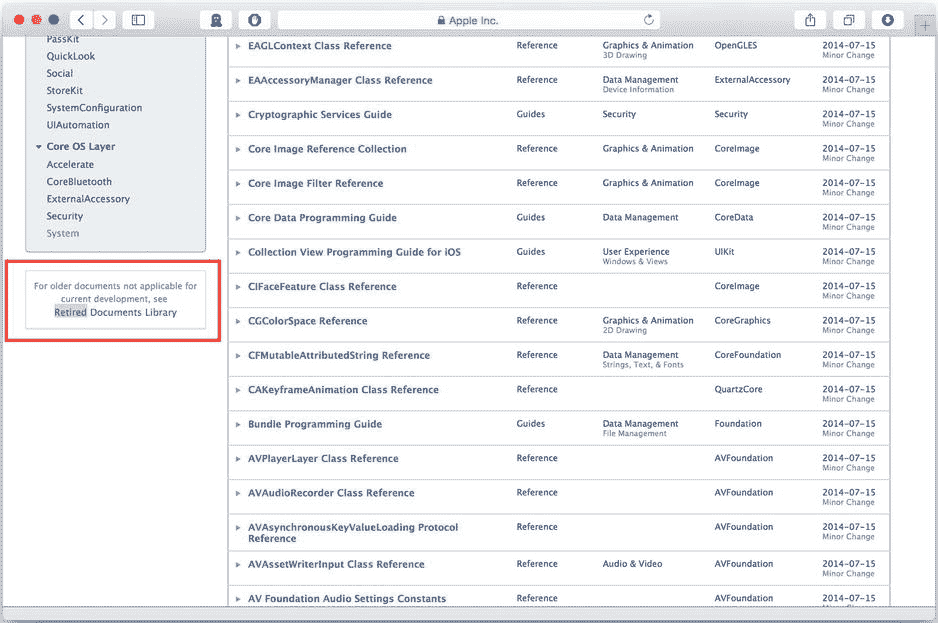

图 1-1. 查找旧版 iOS 文档

**注意** Apple 还会为 iOS 的 Beta 版本维护预发布文档。这些文档对于前沿开发是很好的参考，但不推荐用于生产环境，因为它们会频繁变动，且其准确性无法保证。

为了提供流畅而全面的阅读体验，本书分为四个单元：图像、音频、视频和进阶媒体主题。为了让内容自然流畅，我采用了以下结构组织内容：

- 第 1 部分：背景信息与核心框架
- 第 2 部分：中级框架应用
- 第 3 部分：高级实现（包括底层代码）

对于初学者，我建议从每个单元的第一章开始阅读，随着对概念逐渐熟悉，再深入后续章节。对于中级和高级读者，我建议快速浏览第一章以了解单元概要，然后直接深入后续章节中您感兴趣的专题。

## 开始学习需要准备什么？

与传统的 iOS 应用开发一样，要开始 iOS 媒体应用开发，您需要一台搭载 OS X 10.9 或更高版本（Mavericks）的 Intel 架构 Mac，以及 Mac App Store 中的最新版 `Xcode` 和 iOS SDK。作为 App Store 提交流程的一部分，Apple 会检查您的二进制文件是否在“有效”的计算机和 SDK 版本上编译。虽然这看起来是烦人的一步，但它有助于确保应用程序按统一标准编译，从而消除由编译器引起的崩溃。保持两者同步更新的最简单方法是从 Mac App Store 下载。

**注意** 您可以在 Apple 开发者网站上找到旧版 `Xcode`，但请记住，向 App Store 提交应用时必须使用当前版本。

要概括成为一名应用开发者所需的所有技能可能很难，但我将 iOS 媒体应用开发者定义为：深入了解 iOS 媒体特性，并能运用这些知识创造产品的人。要成功胜任这一角色，您需要做到的不仅仅是“让它工作起来”。您需要能够运用知识识别设计方案、指出有问题的需求，并在现场调试问题。

我的目标是建立您的背景知识，而不会让学习过程令人难以承受。建立庞大的知识储备以供调用固然重要，但以能让您记住或快速查阅的方式呈现这些知识同样重要。全面的 API 参考和纯问题-解决方案的方法对于解决特定问题极具价值，但并不能提供清晰的学习路径。作为媒体开发者，您需要掌握多个框架，每个框架都有自己的要求、主流设计模式或关于如何编写代码的建议。通过本书中难度递进的论述，我将为您提供一份可按照自己的节奏学习、同时也可作为参考的指南。

尽管理解一个框架的所能做到的一切极其重要，但理解框架的局限性也同样重要。很多时候，您会被要求实现某个功能，但经过进一步研究，您会发现这不可能实现，或者所需的工作量超出了项目预算或时间允许的范围。您还可能发现，有一种方法可以覆盖 90%的使用场景，而且比能覆盖 100%使用场景的方法更快。要成为一名成功的媒体开发者，您必须快速识别这些问题领域和可能的解决方案，并与正确的决策者进行沟通。作为媒体开发者，一个特别具有挑战性的方面是，媒体框架是 Cocoa Touch 中最复杂的框架之一。它们对实现也提出了最严格的要求。本书中的讨论材料和关键项目将让您接触到这些限制，并向您展示如何解决它们，以构建可用的产品。

取决于你问谁，开发周期中最激动人心的部分可能就是调试。您的视频播放器在竖屏模式下可能工作得很好，但用户一旋转设备，它就可能开始丢帧。要找出这个问题的根源，您需要使用工具生成数据点，然后将这些数据点与原因关联起来。在整个职业生涯中，您会发现同样的问题在多个项目中重复出现。拥有识别问题根本原因的经验，能让您在下次遇到时迅速识别并修复它。当您开始调试媒体应用时，您会注意到，由于它们操作（如流畅视频播放）的敏感性，它们最容易出现资源相关问题和严格的配置要求。没有什么地方比这里更能让您真正训练 `Xcode` 的 Instruments 工具。我在高级主题和讨论部分的目标是，让您接触常见问题的根本原因，引导您完成使用必要工具识别它们的过程，并解释工具生成的数据如何帮助您解决此类问题。

作为媒体开发者，您可能会发现自己扮演着媒体编程主题“百科全书”的角色——但这一角色也意味着您有责任将专业知识应用到设计过程中，并成为处理媒体相关代码问题的“专家”（无论男女）。本书不仅会帮助您巩固所学知识，还会让您尽早意识到潜在的陷阱。


与传统的 iOS 应用开发不同，iOS 媒体应用开发在硬件设备上进行测试是强制要求。当你刚开始进行 iOS 开发时，可能注意到很多你想要实现的功能能轻松在模拟器上测试。遗憾的是，我们在本书中将要编程实现的许多功能（例如，拍照和录音）在模拟器中不受支持，必须在物理设备上进行测试。此外，在模拟器上测试某些功能会产生兼容性错误。

需要始终备齐用于测试的硬件设备套件，这主要取决于你需要支持的设备范围。通常，你应在处于 Apple 最新更新周期（例如，`iPhone 5` 或 `iPhone 5S`）并运行最新版本 `iOS` 的设备上进行核心开发。在测试阶段，你还应能接触到运行旧版本 `iOS`（例如，`iOS 6.1`）的设备，以及硬件规格较老的设备（例如，`iPhone 4S`）。我在 `iPhone 5` 和带视网膜显示屏的 `iPad Mini` 上进行核心开发，在进入测试阶段时，我会使用一台运行 `iOS 6.1` 的 `iPad 3`，并借用朋友的 `iPhone 4S`。混合搭配不同设备和系统版本，能让你在 Apple 的 App Store 审核流程之前，发现最广泛的兼容性问题。

### 使用本书需要一个有效的 iOS 开发者计划账户

在本书中你需要使用的许多 API（例如，用于访问 `iPhone` 上的硬件摄像头）都需要将设备连接到你的开发电脑。Apple 不允许通过模拟器来模拟硬件摄像头或录音设备。从模拟器中调用这些 API 会导致示例程序崩溃。

要直接在硬件设备上测试，你需要将你的开发者计划账户升级为付费等级（个人或企业账户）。你可能已经拥有一个免费账户，用于访问支持论坛和文档库；然而，你需要一个付费账户才能使用其设备管理功能以及提供签名证书的能力。为了保护用户，Apple 要求所有 `iOS` 应用必须使用有效的代码签名证书进行签名，才能在设备上运行。付费账户使你能创建这些证书，并构建一个签名后的应用，从而可以在设备上运行。

你可以通过导航至 Apple 开发者计划网站（`https://developer.apple.com/programs/`）并选择 iOS 开发者计划链接（如图 1-2 所示）来注册付费的 iOS 开发者计划账户。然后系统会要求你使用你的 Apple ID 账户登录以继续。

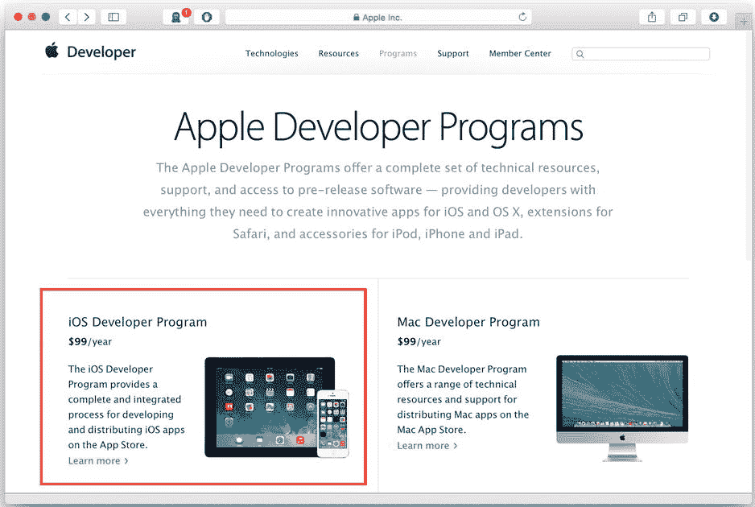

图 1-2. 注册付费的 iOS 开发者计划账户

**Caution** 如果你已在将 Apple ID 用于向 iBooks 发布内容，则需要为应用开发创建一个新的 Apple ID。Apple 不允许不同商店共用一个账户。

### 构建你的第一个 iOS 媒体应用

为了让你熟悉本书的风格和内容的深度，我们将从一个练习开始：构建一个简单的应用，能让你在两幅图像之间交替切换。这个练习的重点是让你接触到在设备上首次尝试运行应用时可能遇到的问题。我们将在本书的后续部分更详细地介绍应用中所使用的媒体 API。

在实现这个练习时，重点将放在遵循以设备为中心的工作流程上。你将探索如何设置项目、创建配置文件请求，并涵盖在连接设备的情况下运行应用的基础知识。

**Note** 本书中所有示例应用和关键项目的源代码均可在 Apress 网站上找到。对于本项目，你可以在`Chapter 1`文件夹中找到源代码。应用名为`ImageChanger`。该项目可在任何能够打开`Xcode 5`或更新版本的现代 Mac 上运行。

#### 关于此应用

为了演示 iOS 媒体应用的开发，你将学习如何创建一个应用，该应用允许你执行以下操作：

*   将图像加载到项目中的视图里
*   启用一个按钮来更改图像
*   根据用户的选择更改图像

用户界面极其简单，如图 1-3 所示。

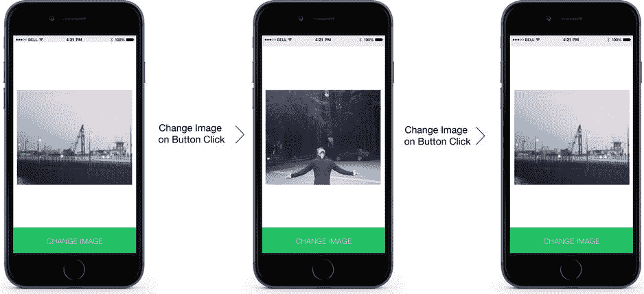

图 1-3. ImageChanger 应用的界面原型

如原型所示，我们的应用包含一个带有按钮和图像的屏幕。当你点击按钮时，当前显示的图像会切换。该状态会进行切换，意味着点击按钮两次将使应用恢复到初始状态。

#### 设置应用

此应用使用单个视图。选择“单视图应用程序”作为项目模板（见图 1-4）。

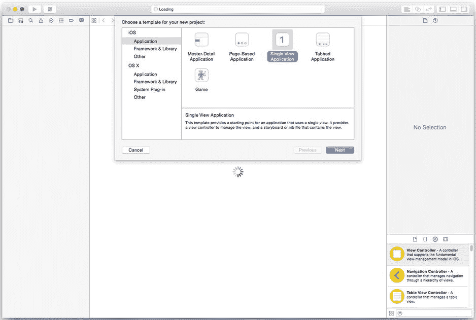

图 1-4. 创建一个单视图应用程序项目

选择“单视图应用程序”模板后，系统会要求你命名项目并选择保存位置。完成后，你将开始布局用户界面。

你需要向主视图控制器中添加一个按钮和一个图像视图，以使你的故事板看起来像图 1-3 中的原型。你可以在屏幕右下角的“对象库”中找到用于按钮、图像视图以及许多其他常见用户界面元素的 Interface Builder 模板。你可以通过将项目从“对象库”中拖出并放到目标视图控制器上来将其添加到视图控制器中。“对象库”在图 1-5 中高亮显示。

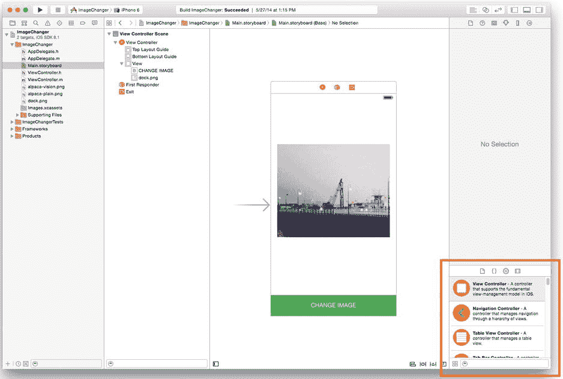

图 1-5. 对象库位于 Xcode 的右下角

#### 将图像添加到你的应用

要切换图像，首先需要将它们导入到应用中。你可以通过右键点击项目导航器（Xcode 的左窗格）中的任何项目来导入图像或任何其他类型的文件。点击“添加文件”选项并选择你的目标文件。对于此应用，请选择两个图像文件（PNG 或 JPG 格式）。

要使其中一个图像出现在图像视图中，请从 Interface Builder 中选择该图像视图，如图 1-6 所示。在属性检查器中，导航到“图像”下拉列表，并从你将在那里看到的文件名列表中选择刚刚添加的图像。

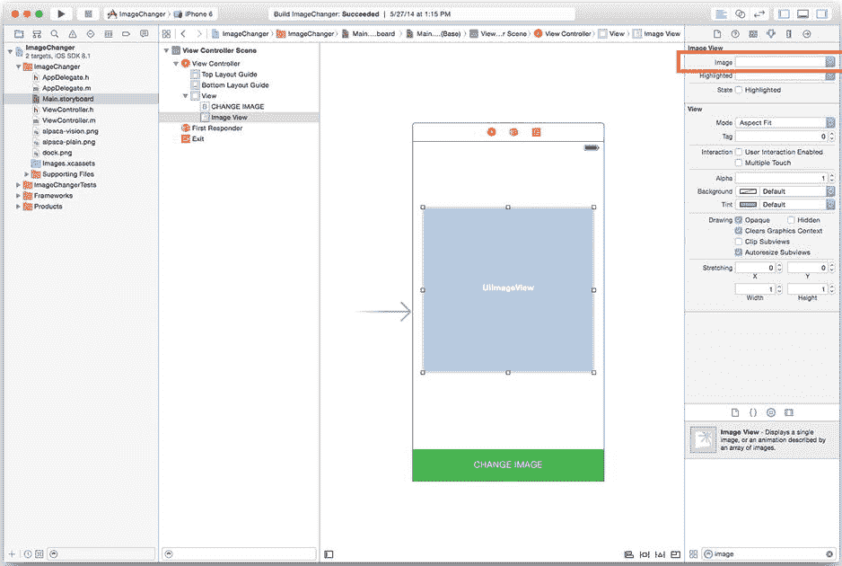

图 1-6. 属性检查器中的图像下拉列表

#### 处理用户界面事件

要使当前图像根据用户界面事件进行更改，你需要将源代码与故事板关联起来。主视图控制器由`ViewController`类表示，因此，在`ViewController.h`中，你需要添加以下属性和方法签名：

```
@property (nonatomic, assign) BOOL isActive;
@property (nonatomic, strong) IBOutlet UIImageView *imageView;
@property (nonatomic, strong) IBOutlet UIButton *changeButton;
-(IBAction)changeImage:(id)sender;
```

`imageView`和`changeButton`对象代表用户界面元素。`changeImage:`方法表示当用户按下按钮时需要被调用的方法。`isActive`属性允许你跟踪按钮的状态。

要使事件处理器工作，你必须通过向`ViewController.m`中添加以下代码来实现此方法：


```
-(IBAction)changeImage:(id)sender
{
    if (self.isActive) {
        self.imageView.image = [UIImage imageNamed:@"alpaca-vision.png"];
    } else {
        self.imageView.image = [UIImage imageNamed:@"alpaca-plain.png"];
    }
    self.isActive = !self.isActive;
}
```

你将在第 2 章中了解这段代码的工作原理，但从宏观角度来看，你大概能看出它根据一个全局布尔变量的状态来更改图像视图的`image`属性。请确保`[UIImage imageNamed:]`方法与你之前选择的文件名完全匹配。

## 在设备上运行应用程序

要在设备上运行项目，首先需要为项目设置一个开发团队。导航到项目属性，选择“团队”下拉菜单（参见图 1-7）。

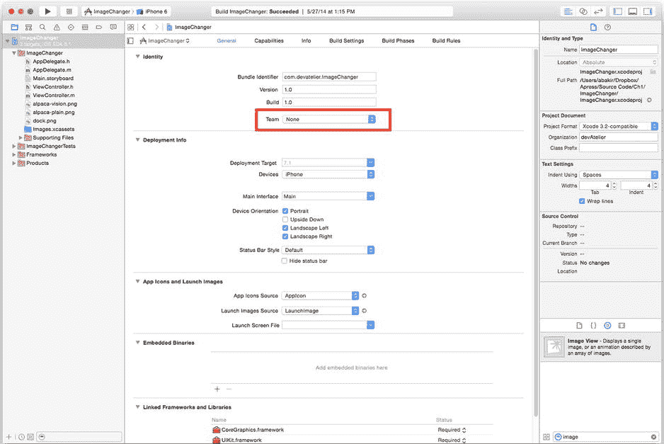

图 1-7. 项目属性中的团队下拉菜单

在选项中，你可以看到当前电脑上拥有签名信息的所有开发团队，以及“添加账户”的选项。如果下拉菜单为空，请选择“添加团队”以调出 Xcode 账户管理器，它会要求你输入 Apple ID，并引导你下载用于电脑的开发证书（参见图 1-8）。

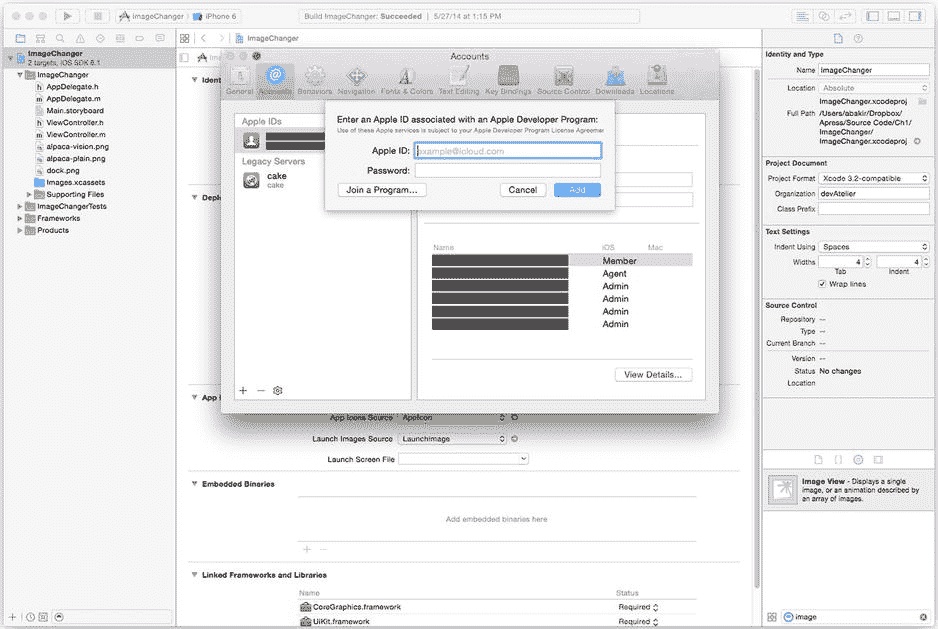

图 1-8. Xcode 账户管理器

如果账户管理器发现你的 iOS 开发者账户尚未设置任何开发证书，你需要登录网站，并选择右上角的“证书、标识符和描述文件”链接，如图 1-9 所示。

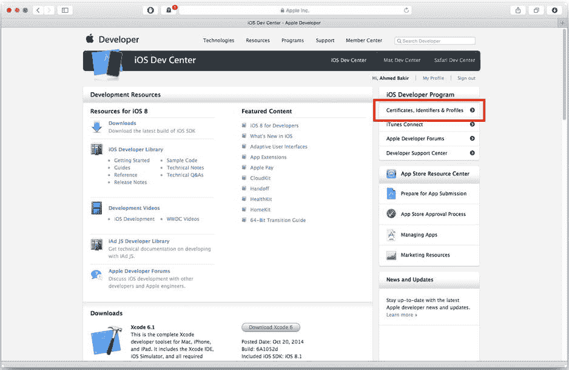

图 1-9. 在 iOS 开发者中心查找证书

在“证书”链接下，选择“添加证书”，并生成一个 iOS 应用程序开发证书。下一页（参见图 1-10）将详细说明如何生成证书签名请求文件并上传给 Apple。

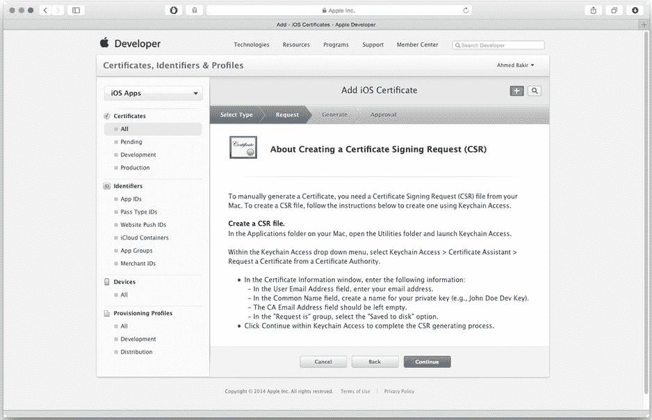

图 1-10. 生成证书签名请求

**注意** 所有证书都将使用此 CSR 文件进行身份验证，因此请记住存储位置并保护好该文件。尝试生成新的 CSR 文件将使所有现有证书失效。如果需要迁移到另一台电脑，Xcode 提供了“导出开发配置文件”工具。

CSR 文件验证通过后，将生成证书文件并自动下载。下载完成后，双击将其安装到电脑上。

现在开发证书已准备就绪，再次调出账户管理器，它将成功创建一个通配符配置描述文件。配置描述文件的作用类似于设备访问控制列表；通配符配置描述文件允许你将应用签名并部署到已注册 Apple 并通过 USB 连接的设备上。对于本例，通配符描述文件已足够，但在将应用分发进行测试之前，你还需要生成一个 App ID 和开发配置描述文件。

Xcode 识别到你的团队后，会在“团队”下拉菜单中显示团队名称。接下来，通过 USB 将 iOS 设备连接到电脑。如果设备被成功识别，它将出现在 Xcode“运行”按钮旁边的设备下拉菜单中，且项目属性屏幕上不会显示错误。如果设备未被识别，团队名称下方会出现“修复问题”按钮。点击该按钮将触发一个向导，尝试将你的设备添加到你的 iOS 开发者计划账户中。图 1-11 展示了 Xcode 未能识别团队的情况。

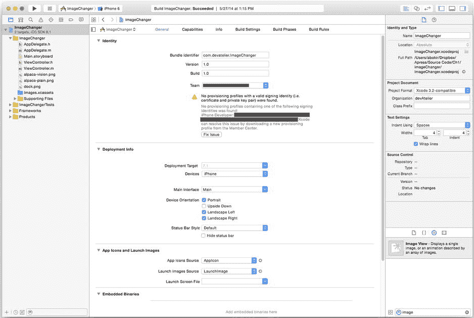

图 1-11. 团队选择失败

如果点击“修复问题”按钮后设备仍未识别，请打开 Xcode Organizer，导航到“设备”屏幕，选择你的设备，如图 1-12 所示。

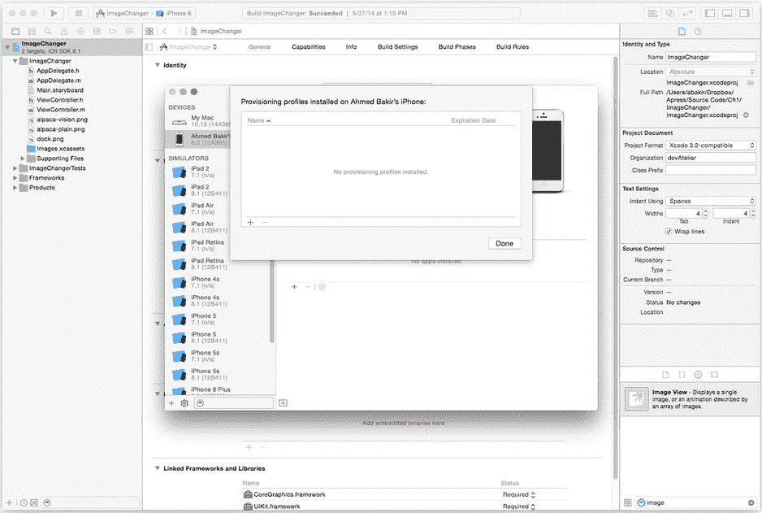

图 1-12. Xcode 设备管理器

解决所有设备签名问题后，你的设备将出现在设备列表下拉菜单中，你就可以点击“运行”按钮来编译并在设备上运行应用程序。

## 调试常见问题

在理想情况下，第一次尝试运行应用时一切完美无 bug。然而在现实中，经常会遗漏某些东西，此时你需要找出解决方法。开始调试最便捷的方法是在代码中设置断点。当设备连接到开发机器并运行时，它们通过 LLDB 调试器实例运行，该调试器允许你添加特殊的诊断钩子用于调试，以便在崩溃时显示调试信息。*断点*是一条命令，告诉调试器在到达你标记的特定行时停止运行应用程序。当代码执行到达断点时，你可以选择继续运行程序、中止程序，或检查变量和调用堆栈。

设置断点最简单的方法是点击你希望暂停的代码行旁边的垂直条。在 IDE 中开启“行号”选项会让操作更简单，因为你可以直接点击行号。图 1-13 展示了一个已启用断点的示例。该行号背景为蓝色箭头。

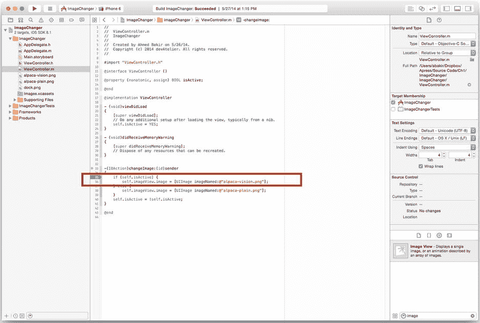

图 1-13. 断点设置

当执行到达断点时，调试器信息面板会出现在屏幕底部，提供变量检查器和调试器的命令行界面（参见图 1-14）。

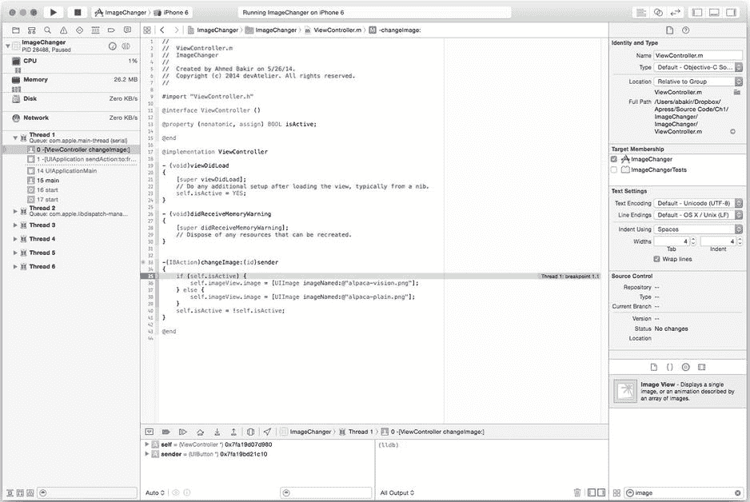

图 1-14. 命中断点

通过仔细设置断点，你可以确认代码是否到达了预期的行，并检查变量是否处于预期的状态。通常，你会因为方法从未被调用而发现它从未执行，或者因为逻辑错误而发现变量具有错误的值。

表 1-2 列出了在尝试实现此示例应用时可能遇到的常见问题及解决方案。虽然你可以从 Apress 网站下载应用程序并直接运行，但我们强烈建议你自己构建应用程序，以便熟悉整个过程。

表 1-2. 构建 ImageChanger 应用时的常见错误


| 问题 | 常见解决方案 |
| --- | --- |
| 应用程序无法在设备上运行 | 确保您的团队设置正确，并且您的设备已在 iOS 开发者计划中注册。 |
| 启动时图像视图未显示正确的图像 | 确保您的图像已正确添加到项目中。确保图像视图已正确关联到属性。确保您的视图启动代码没有重置图像视图。 |
| 按钮未更改图像 | 确保您的按钮和图像视图已正确关联到属性。确保按钮事件处理方法已正确注册，并且可以通过断点访问。 |
| 按下按钮后图像视图为空白 | 确保按钮事件处理方法中的图像名称与第二张图像的文件名完全一致。 |

**总结**

本章首先介绍了本书的目的、媒体应用开发的不同之处以及充分利用本书所需的条件。您了解了本书的基本目标及其结构安排，以便您能按照自己的节奏学习，同时还了解了本书对您先前编程经验和知识的假设。您还了解了一些媒体开发在资源和开发者期望方面与众不同的原因。最后，通过构建一个简单的 ImageChanger 应用程序，您开始探索构建媒体应用并在设备上运行的一些最基本的工作流程。

