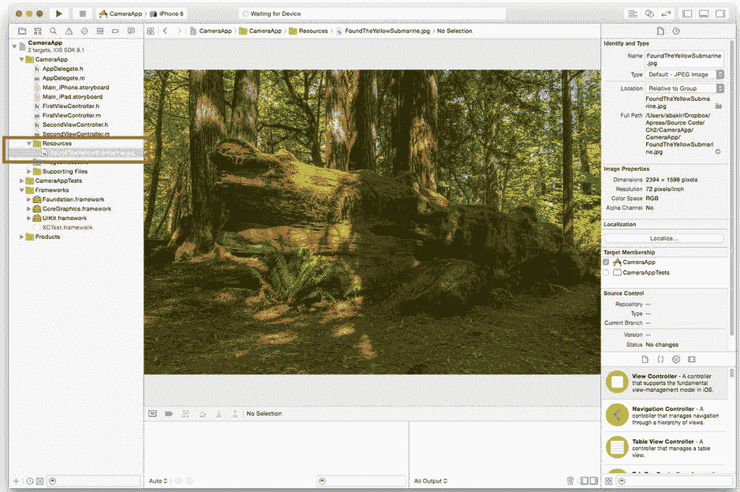
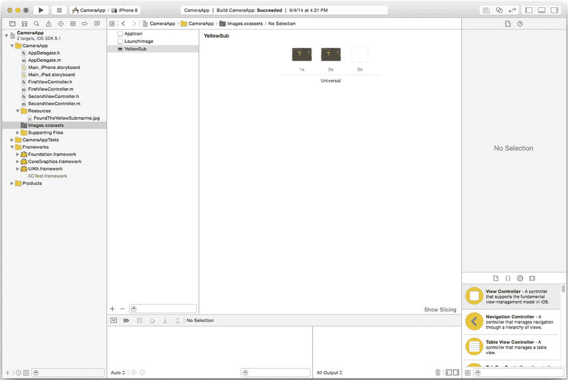
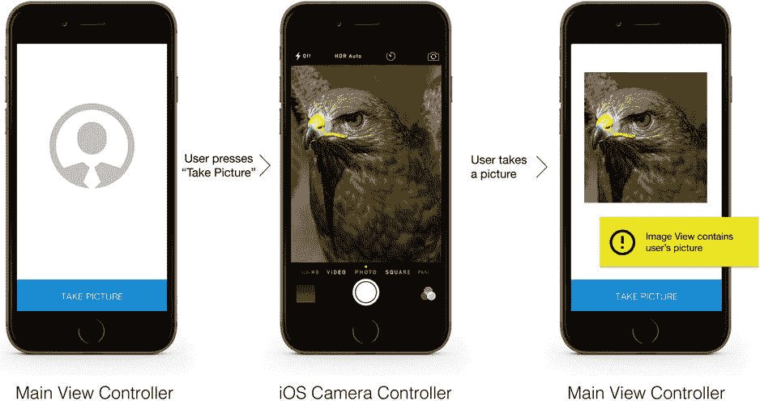
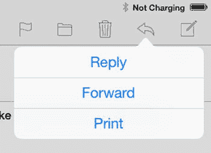

# 第一部分：图像

## 第二章：向应用添加图像

学习绘画的最佳途径是研究静物题材。同样，进入 iOS 媒体应用开发的最佳途径是从静态图像开始！

在本章中，您将使用 Apple 的 `UIImage`、`UIImageView` 和 `UIImagePicker` 类来在应用中表示、显示和导入图像。这些类抽象了许多有用的功能，从解码文件到提供应用内访问 iOS 系统级相机控制器的能力。

### 使用 UIImage 类表示图像数据

与以人类可读格式存储数据的纯文本文件不同，图像拥有一系列复杂的属性，需要以二进制数据形式存储——包括压缩和色彩空间信息。所有二进制数据都需要一个特殊的类来解码并以程序可用的方式表示它。`UIImage` 是 Apple 提供的用于表示图像数据的类。您可以将其视为所有涉及图像数据操作的通用语言。例如，您稍后将用到的 `UIImagePickerController`（用于从相机和照片库中选择图像）会将您的选择作为 `UIImage` 对象进行传输。

在接下来的两小节“加载捆绑文件”和“运行时加载图像”中，您将看到如何使用 `UIImage` 从文件系统的不同位置加载图像。要使这些图像数据在屏幕上可见以供用户查看，您需要使用 `UIImageView`，这将在本章下一主要部分“使用 UIImageView 类显示图像”中进行探讨。

#### 加载捆绑文件

在开发 iOS 媒体应用时，一个常见任务是从设计人员提供的文件中加载图像，例如背景图像、剪贴画或自定义按钮设计。为了熟悉这一工作流程，您将构建一个在方形框架中显示图像的单一视图应用，类似于第 1 章中的示例项目。如果您需要复习如何创建单一视图应用并向其添加图像视图，可以回顾第 1 章的最后一部分。

开始使用所需图像的最简单方法是调用 `UIImage` 的私有方法 `[UIImage imageNamed:]`，以从项目捆绑包中的文件创建图像对象：

```
UIImage *myImage = [UIImage imageNamed:@"Flower.jpg"];
```

*项目捆绑包* 这个术语现在可能看起来有些陌生，但这可能是一个您已经熟悉但尚未意识到的概念。如果您曾在 OS X 中对某个应用程序执行过辅助点击，您会注意到“显示包内容”选项。在 iOS 和 OS X 上，`.app` 文件都是智能容器，包含编译后的对象文件和捆绑的资源，例如图像、声音和预编译数据。当您的应用被编译时，所有源文件都会被转换为对象文件，而您包含的任何其他静态文件都会被直接复制到捆绑包中。

`[UIImage imageNamed:]` API 的工作原理是在项目捆绑包中搜索与您在 `name` 参数中提供的文件名完全匹配的文件。该 API 区分大小写，并且不对名称执行任何额外逻辑，因此请确保传入的文件名与捆绑包中的完全一致，否则返回的对象将为 `nil`。

**注意** PNG 文件和素材目录支持的图像集是无需使用精确文件名的唯一例外。对于这两类文件，您无需指定文件扩展名。

您可以通过确认文件在 Xcode 项目导航器（IDE 的左窗格）中是否可找到，来确认文件属于您的项目捆绑包，如图 2-1 所示。



图 2-1. Xcode 项目导航器，高亮显示了项目中的图像文件

在此示例中，您将看到一个 Resources 文件夹。为了保持项目文件夹的整洁，最好在导入文件之前创建组。我倾向于将所有图像文件和其他外部资源放入一个 Resources 组中。您可以通过“文件”菜单中的“新建”选项，或在“添加文件”步骤中导入文件夹来创建组。组和文件夹不会影响您使用 `[UIImage imageNamed:]` API。

#### 使用素材目录管理图像

从 iOS 7 SDK 开始，Apple 在 iOS 开发工作流程中引入了*素材目录*。素材目录通过提供一个集中存储图像文件的位置以及一个用于管理这些文件的图形用户界面，简化了您的工作流程。虽然在项目导航器中管理少量图像文件很容易，但当您需要管理数十个文件或同一文件的多个尺寸时，这一过程会变得非常麻烦——而素材目录正是为了缓解这种情况而设计的。

素材目录是一个重要概念，因为 Apple 对提供图像文件的多种分辨率有严格要求。如果您缺少启动图像或应用图标的必需分辨率，Apple 甚至会阻止您向 App Store 提交应用。

在本练习中，您将学习如何使用素材目录管理项目中的文件，以及如何修改语法以指示您正在使用素材目录。

您为 iOS 7 SDK 或更高版本创建的每个项目都附带一个名为 `Images.xcassets` 的空白素材目录文件。在项目导航器中点击此文件，您将看到图 2-2 所示的界面。



图 2-2. 素材目录用户界面

素材目录用户界面提供两个窗格：左侧的*集合列表*和右侧的*集合查看器*。为了帮助您管理同一图像的多个分辨率，素材目录使用*图像集*来表示图像文件。其理念是，您将图像的每一个分辨率都添加到一个集合中；然后在代码中，您可以引用该集合，而不是单个图像文件名。这便将确定合适文件（例如，非 Retina 或 Retina 屏幕）的负担从开发者转移到了编译器上。


您可以使用集合列表通过点击图像集来导航。同样，您也可以使用面板底部的“添加”和“移除”按钮来管理集合。当您点击一个图像集时，集合查看器将显示该集合所有分辨率版的占位符。

您可以通过从访达窗口拖放图像到对应的占位符来向集合添加图像（例如，使用`2x`占位符来代表图像的 Retina 版本）。您需要对项目中需要包含的每个图像分辨率重复此过程。要更新图像，只需将新版本拖到相应的缩略图上即可。`Xcode`会为您处理其余所有事情。

**注意** 在撰写本文时，PNG 文件是资源目录唯一支持的文件格式。对于 JPG 文件，您需要继续使用项目导航器。

要使用由资源目录管理的图像，请更改您的语法，使用图像集名称而不是文件名：

```
UIImage *myImage = [UIImage imageNamed:@"Flower"];
```

编译器将自动确定在当前运行的平台上要使用的正确图像版本。

**注意** 对于应用图标和启动图像，系统会为缺失的分辨率创建编译器警告。所需分辨率会随着 SDK 更新而更新，因此请确保您始终保持最新。

**加载运行时的图像**

虽然`[UIImage imageNamed:]`是一个便捷的 API，但它仅专为与应用捆绑的图像设计。当您尝试在运行时加载图像（例如已下载的图像）时，需要使用不同的 API：`[UIImage imageWithContentsOfFile:]`。这些 API 之间的关键区别在于，在运行时，您需要指定图像文件的路径，而不是它在应用包中的名称。示例 2-1 提供了此过程的示例。

**示例 2-1**. 在运行时加载图像文件

```
NSArray *searchPaths = NSSearchPathForDirectoriesInDomains(NSDocumentDirectory,
                       NSUserDomainMask, YES);
NSString *documentFolderPath = [searchPaths objectAtIndex:0];
NSString *localFilePath = [documentFolderPath stringByAppendingString:@"DownloadedFlower.png"];
UIImage *myImage = [UIImage imageWithContentsOfFile:localFilePath];
if (myImage == nil) { NSLog(@"File does not exist!");}
```

如您所见，大部分工作在于查找文档目录的路径。每个应用包都附带一个文档目录，旨在作为您保存或创建文件的目标。您可以使用 Apple 的系统宏（或快捷方法）来快速找到应用的文档目录。每次应用安装都有唯一的目录路径，因此在运行时运行此方法非常重要。

一旦获取了文档目录路径，您就可以使用`[NSString stringByAppendingString:]`方法附加文件名。如果图像加载成功，`UIImage`对象将非`nil`。

**注意** 您可能会说：“我以为 iOS 没有文件系统！”虽然 iOS 不像 PC 那样提供全局可访问的共享文件系统，但它确实在应用沙盒内提供了一个文件系统，您可以在运行时使用它来存储和检索文件。它被称为*沙盒*，因为您可以在沙盒内做（几乎）任何想做的事，但不允许其他人进入您的沙盒，并且很难将您的工作成果带出沙盒（换句话说，用于应用间通信的 API 非常有限）。

**支持的文件格式**

与存储为 ASCII 数据且可由任何程序打开的简单文本文件不同，图像文件是编码的二进制文件，需要特殊的指令（解码）才能正确打开。`UIImage`最便捷的功能之一就是它抽象了下表中所示文件格式的解码过程。

*UIImage 类支持的流行文件格式*

| 文件格式 | 扩展名 | 主要用途 |
| --- | --- | --- |
| 便携式网络图形 | `.png` | 现代、无损的栅格图像压缩。保留 Alpha（透明度）层。 |
| 联合图像专家小组 | `.jpg, .jpeg` | 非常高效的有损栅格图像压缩。不支持 Alpha 层。 |
| 图形交换格式 | `.gif` | 旧式无损图像支持。主要用于 Web 上的动画图像。 |
| 位图图像文件 | `.bmp` | 未压缩图像支持。由早期版本的 Windows 推广。 |
| 标签图像文件格式 | `.tiff, .tif` | 旧式低压缩图像支持。由早期的图像捕获设备和桌面出版软件包推广。 |

虽然系统可以加载这些文件格式，但不会为您优化其文件大小或密度。一个未压缩的 10MB 位图文件在访问和绘制时所需的时间将远远超过一个压缩的 100KB JPG 文件。只要可能，尽量使用压缩的 JPG（如果需要透明度层，则使用 PNG）。

**注意** 如果您的设计师只提供 Photoshop 文件（`.psd`），您需要手动将图层另存为图像文件。Photoshop 文件格式是一个资源密集型的移动目标，因此 Apple 极不可能为其提供系统级支持。

**使用 UIImageView 类显示图像**

要在应用中显示图像，您需要使用`UIView`的子类，这是 iOS 用户界面元素的原子单元。为了弥合这一差距，Apple 创建了`UIImageView`，它提供了一个在屏幕上放置图像的区域、在运行时动态缩放图像的方法，以及一个用于触摸手势的出口。

在本节中，您将学习如何使用图像初始化`UIImageView`，并将探索使用它处理动态内容大小的各种方法。

**初始化图像视图**

初始化`UIImageView`很简单：您只需用一个源`UIImage`对象来初始化它，如下所示：

```
UIImage *myImage = [UIImage imageNamed:@"Flower.jpg"];
UIImageView *myImageView = [[UIImageView  alloc] initWithImage:myImage];
```

尽管`[UIImageView initWithImage:]` API 没有将 frame 指定为必需参数，但您应该提供一个。Cocoa Touch 中的 frame 指定了用户界面元素的位置和大小。如果您使用 Interface Builder 构建界面，元素的 frame 将自动创建。您可以在示例 2-2 中找到以编程方式设置 frame 的示例。

**示例 2-2**. 以编程方式设置 frame

```
UIImage *myImage = [UIImage imageNamed:@"Flower.jpg"];
UIImageView *myImageView = [[UIImageView  alloc] initWithImage:myImage];
myImageView.frame = CGRectMake(10, 10, 100, 100);
[self.view addSubview:myImageView];
```

请注意上述代码中的`addSubview`调用，它将图像视图放置在屏幕上。

**注意** 您可以通过设置`image`属性随时更改图像视图的内容。

**设置图像缩放选项**

您可能以前遇到过这个问题：您请求一个分辨率为 640×480 像素的图像，但收到的是一个其他尺寸的图像，例如 637×480。为了解决这个极其常见的问题，Apple 为所有`UIView`对象构建了动态缩放功能，您可以通过`[UIView contentMode]`属性进行控制。在表 2-1 中，您将看到一些流行的内容模式常量值及其指定行为的表格。

**表 2-1**. 流行的`UIViewContentMode`常量值


| 常量名称 | 指定行为 |
| --- | --- |
| `UIViewContentModeScaleToFill` | 拉伸内容以适配视图框架的长宽比。 |
| `UIViewContentModeScaleAspectFit` | 缩放内容以适配视图框架，同时保持原始宽高比。框架的其余部分显示视图的背景色（默认透明）。 |
| `UIViewContentModeCenter` | 居中显示内容，同时保持其原始尺寸。 |
| `UIViewContentModeTop` | 将内容对齐到框架顶部边缘，同时保持其原始尺寸。 |
| `UIViewContentModeLeft` | 将内容对齐到框架左侧边缘，同时保持其原始尺寸。 |

所有 `UIView` 对象的默认 `contentMode` 是 `UIViewContentModeScaleToFill`，它会拉伸或收缩内容以适配 `UIView` 的边界。在选择 `contentMode` 时，请思考你的视觉设计参考所指定（或其他元素所需）的内容。如果你要将图像居中显示在屏幕中间，且对边缘对齐方式没有要求，那么 `UIViewContentModeScaleAspectFill` 是一个安全的选择。当需要保留特定边缘时，你可能需要考虑边缘对齐选项，例如 `UIViewContentModeTop` 或 `UIViewContentModeLeft`。在内容的宽高比需要与视图严格一致的情况下，可以探究 `UIViewContentModeScaleAspectFit`，或在展示图像前手动裁剪。

要指定内容模式，只需在 `UIImageView` 对象上设置属性：

```
[myImageView setContentMode:UIViewContentModeScaleAspectFill];
```

### 使用 UIImagePickerController 类选择图像

`UIImagePickerController` 是 Apple 的 `UIViewController` 子类，它提供了对系统级相机控制器和已保存图像缩略图浏览器的访问权限。当配置该控制器将相机作为其数据源时，你将看到与系统自带相机应用类似的相机基本界面。当配置该控制器使用已保存图像时，你将看到与照片应用中相同的基于缩略图的界面。通过 `UIImagePickerController`，Apple 提供了一种将图片快速导入应用的途径，省去了编写底层硬件接口的负担，让你能专注于图片的高级用途。

在本节中，你将学习如何使用图像选择器从相机胶卷中选择图像、使用硬件相机拍照，并将这些数据导出为 `UIImage` 对象。在此过程中，你还会了解一些 `UIImagePickerController` 类所依赖的背景概念，并探究该类的一些局限。

在本节中，你将构建图 2-3 中展示的应用。这是一个相机应用，它在 `UIImageView` 中显示图像，并包含一个“拍照”按钮，该按钮会调出 `UIImagePickerController`。当图像选择器完成后，应用应返回主视图控制器并显示所选图像。该应用的完成代码包含在 ImagePicker 项目中，此书作为本书代码包的一部分提供，位于 Apress 网站（`www.apress.com`）的源代码/下载区域。ImagePicker 项目位于代码包的 `Chapter 2` 文件夹中。



图 2-3. 基于相机的应用流程示意图

### 使用协议与委托

在开发使用图像选择器的应用时，你通常需要制定一个类似图 2-3 所描述的工作流程。

对于极其简单的类，你可以在一个类中处理所有逻辑。然而，`UIImagePickerController` 是一个完全独立的视图控制器；因此，你需要一种在它和你的类之间传递消息的方式。遵循面向对象设计的模式，你不想将你的类信息包含在图像选择器中，因为它需要是一个可以被其他类使用的类。同时，你也不想在你的代码中重复实现 `UIImagePickerController` 的功能。

`UIImagePickerController` 用于消息传递所依赖的 Objective-C 语言特性称为*委托*和*协议*。

*协议*是一种为类间通信定义有限接口的方式，可以通过导入你想要实现其协议的类的头文件来推断。协议指定了一个名称（用于标识）和一个方法列表及其参数。你还可以使用块关键字 `optional` 为方法指定优先级。通过在头文件中放置一个包含命名信息和方法签名的 `@protocol` 块来定义协议。代码清单 2-3 展示了一个简单的头文件，它定义了一个与 `UIImagePickerController` 类所使用的协议相似的协议。

***代码清单 2-3***. 简单相机协议的头文件

```
#import <UIKit/UIKit.h>

@protocol CameraViewControllerDelegate <NSObject>

-(void)cameraViewController:(UIViewController *)controller hasImage:(UIImage *)image;

@optional
-(void)cameraViewController:(UIViewController *)controller didCancel:(BOOL)state;

@end

@interface CameraViewController : UIViewController

@property (nonatomic, strong) UIImage *capturedImage;

@end
```

**注意** 所有不在 `@optional` 块下的方法都被视为必需方法，必须由协议的接收者实现。

你会注意到我并没有包含这些方法如何工作的代码示例。这正是协议的关键优势：协议定义了两个类之间的通信方式，但从不实现目标逻辑。你可以将协议视为类似于 Java 中的抽象类。

为了将其与具体示例联系起来，`UIImagePickerController` 类定义了一个协议，表明它将在选择器关闭后以及拍照后发送消息。在你的展示类中，由你来处理当它发送这些消息时发生什么。

处理这些数据的方式是通过委托。*委托*是将工作单元传递给另一个类的概念。以图像选择器为例，创建相机控制器实例、拍照和呈现数据流的所有工作都委托给了图像选择器类。当它完成后，会将结果发送回我们。实现协议并接收其消息的对象称为*委托*。

要实现协议，你需要修改接收类的头文件以包含协议定义，并修改类定义以表明它实现了该协议。它被称为*接收类*，因为它接收来自委托类的消息。代码清单 2-4 展示了一个实现协议的类的头文件示例。此头文件旨在与你的主视图控制器的头文件类似。

***代码清单 2-4***. 接收协议消息的类的头文件

```
#import <UIKit/UIKit.h>
#import "CameraViewController.h"

@interface FirstViewController : UIViewController <CameraViewControllerDelegate>
@property (nonatomic, strong) UIImage *selectedImage;
@end
```


好的，作为一名高级文档工程师和翻译员，我将严格遵循您提供的注意事项和示例格式，对给定的英文文本进行翻译。


表示协议的语法是将其名称放在尖括号内。你需要将这些名称放在基类名称之后。你可以实现的协议数量没有限制，但在添加之前，需要确保它们没有任何冲突的方法名称！

在实现（`.m`）文件中，你为协议指示的方法定义其行为。如代码清单 2-5 所示，你可以在此处处理当图片选取器准备就绪时如何处理图片，或者当按下“取消”按钮时该做什么。

**代码清单 2-5**. 接收协议消息的类的实现文件

```
#import "FirstViewController.h"

@implementation FirstViewController

- (void)viewDidLoad
{
    [super viewDidLoad];
        // 在视图加载后进行任何额外的设置，通常来自 nib 文件。
}

#pragma mark - CameraViewController 委托方法

-(void)cameraViewController:(UIViewController *)controller hasImage:(UIImage *)image
{
    self.selectedImage = image;
    [controller dismissViewControllerAnimated:YES completion:nil];
}

-(void)cameraViewController:(UIViewController *)controller didCancel:(BOOL)state
{
    if (state == YES) {
        [controller dismissViewControllerAnimated:YES completion:nil];
    }
}

@end
```

此列表中的 `#pragma mark` 会创建注释，这些注释将出现在 Xcode 的方法导航器下拉菜单中。在实现协议时使用此类注释是一个好习惯，这样你就能记住委托方法的定义位置。

**注意** 对于你未定义的每个必需方法，你都会收到编译器警告。带有 `optional` 标志的方法增加了有用但非必需的行为，因此不会触发编译器警告。

要完成使用委托的流程，你需要为原始类提供一种发送协议消息的方式。参见代码清单 2-6。

**代码清单 2-6**. 发送协议消息的类的修改后头文件

```
#import <UIKit/UIKit.h>

@protocol CameraViewControllerDelegate <NSObject>

-(void)cameraViewController:(UIViewController *)controller hasImage:(UIImage *)image;

@optional
-(void)cameraViewController:(UIViewController *)controller didCancel:(BOOL)state;

@end

@interface CameraViewController : UIViewController

@property (nonatomic, strong) UIImage *capturedImage;

@property (nonatomic, weak) id <CameraViewControllerDelegate> delegate;

@end
```

如你所见，你需要向源类添加一个泛型委托对象（类型为 `id`）。定义此对象后，你就可以通过定义的协议消息安全地调用委托对象，如代码清单 2-7 所示。

**代码清单 2-7**. 原始类的修改后实现文件

```
#import "CameraViewController.h"

@implementation CameraViewController

- (id)initWithNibName:(NSString *)nibNameOrNil bundle:(NSBundle *)nibBundleOrNil
{
    self = [super initWithNibName:nibNameOrNil bundle:nibBundleOrNil];
    if (self) {
        // 自定义初始化
    }
    return self;
}

- (void)viewDidLoad
{
    [super viewDidLoad];
    // 在视图加载后进行任何额外的设置。
}

#pragma mark - 操作处理程序

-(IBAction)takePictureButtonPressed:(id)sender
{
    [self.delegate cameraViewController:self hasImage:self.capturedImage];
}

-(IBAction)cancelButtonPressed:(id)sender
{
    [self.delegate cameraViewController:self didCancel:YES];
}

@end
```

总而言之，协议的核心概念如下：

1.  通过指定协议的方法及其优先级来定义协议。
2.  通过在目标类中定义所有必需的方法来实现协议。
3.  在源类中定义一个泛型委托对象的实例，并使用它来发送协议消息。

### 使用图片选取器访问已保存的图片


回顾图 2-3 中的示例，当用户点击主视图控制器中的“拍照”按钮时，你需要显示图片选择器。为了实现此功能，需要学习如何配置图片选择器、如何呈现它，以及如何处理通过其协议方法返回的图片数据。

### 配置和呈现图片选择器

为简单起见，我们将从配置图片选择器以选取已保存的图片开始。代码清单 2-8 提供了一个按钮事件处理程序的示例，用于呈现图片选择器。

***代码清单 2-8***. 配置和呈现图片选择器

```
-(IBAction)showPicker:(id)sender
{
    UIImagePickerController *imagePicker = [[UIImagePickerController alloc] init];
    imagePicker.sourceType = UIImagePickerControllerSourceTypeSavedPhotosAlbum;

    [self presentViewController:imagePicker animated:YES completion:^{
        NSLog(@"图片选择器已呈现！");
    }];
}
```

**注意**  上述代码中的插入符语法指定了一个*完成处理程序*，即方法执行完成后会执行的代码块。如果你不想实现该代码块，可将`^{...}`参数替换为`nil`。

此示例使用完成处理程序生成一条日志消息，表明呈现图片选择器的动画已完成。如果你不想在动画完成后执行任何操作，可以将代码块参数设置为`nil`。

要呈现图片选择器，需要执行三个步骤：初始化对象、指定来源类型以及呈现视图控制器。此示例使用`[UIViewController presentViewController:]`方法以模态方式呈现图片选择器，这是大多数应用实现的用户界面方式。*模态*呈现意味着在另一个视图之上显示一个视图，类似于弹出窗口。

**注意**  使用`UIImagePicker`无需包含任何外部头文件或框架；它是 UIkit 的一部分！

要将图片选择器作为数据源，请将`[UIImagePickerController sourceType]`参数设置为`UIImagePickerControllerSourceTypePhotoLibrary`。表 2-2 列出了`UIImagePickerControllerSourceType`的可选值。

表 2-2. UIImagePickerControllerSourceType 常量值

| 常量名称 | 指定行为 |
| --- | --- |
| `UIImagePickerControllerSourceTypePhotoLibrary` | 显示图片缩略图浏览器，初始化为用户手机上的所有相册（例如，已保存的照片、相机胶卷、照片流） |
| `UIImagePickerControllerSourceTypeSavedPhotosAlbum` | 显示图片缩略图浏览器，仅初始化为相机胶卷相册 |
| `UIImagePickerControllerSourceTypeCamera` | 显示 iOS 系统级相机控制器。内置的、依赖于设备的控件包括：取消、拍照、闪光灯开/关、切换摄像头 |

**注意**  默认来源类型为`UIImagePickerControllerSourceTypePhotoLibrary`。如果你未指定来源类型，将自动应用此设置。

### 处理来自图片选择器的数据

代码清单 2-8 展示了如何呈现图片选择器并将其配置为使用缩略图浏览器，但并未指定当用户在图片选择器中选择图片或按下“取消”按钮时应发生什么。为此，你需要实现`UIImagePickerControllerDelegate`协议。

正如“使用协议和委托”部分所述，使用协议的第一步是在头文件中将接收者声明为接收者：

```
@interface FirstViewController : UIViewController < UIImagePickerControllerDelegate>
```

同样，你需要让图片选择器知道你的类是其委托对象，因此需要在你之前创建的`UIImagePickerController`对象上设置`delegate`属性。


为了呈现图像选择器，请实现一个按钮处理程序，类似于清单 2-9 中的处理程序。请记住，要做到这一点，你需要在 Interface Builder 中创建一个按钮，并将其连接到处理程序的 `IBAction`。

*****清单 2-9***. 呈现图像选择器的按钮处理程序**

```objc
-(IBAction)showPicker:(id)sender
{
    UIImagePickerController *imagePicker = [[UIImagePickerController alloc] init];
    imagePicker.sourceType = UIImagePickerControllerSourceTypeSavedPhotosAlbum;
    imagePicker.delegate = self;

    [self presentViewController:imagePicker animated:YES completion:^{
        NSLog(@"Image picker presented!");
    }];
}
```

现在，你已经声明主视图控制器将实现协议的方法，接下来需要实现这些方法。指示已选择图像的委托方法如下：

```objc
- (void)imagePickerController:(UIImagePickerController *)picker
                               didFinishPickingMediaWithInfo:(NSDictionary *)info
```

此方法的返回值是发送消息的图像选择器，以及一个包含所选资产信息的字典对象。你可以在表 2-3 中找到由 `info` 字典提供的所有相关键/值对。

**表 2-3. 照片的 UIImagePickerController 媒体信息字典键/值对**

| 键名 | 存储值 |
| --- | --- |
| `UIImagePickerControllerMediaType` | `NSString` 对象，标识媒体类型（图像或影片） |
| `UIImagePickerControllerOriginalImage` | `UIImage` 对象，包含所选资产的原始图像数据 |
| `UIImagePickerControllerEditedImage` | `UIImage` 对象，包含所选资产的原始图像数据（如果启用了编辑功能） |
| `UIImagePickerControllerCropRect` | `CGRect`，包含用户选择的裁剪矩形的坐标（如果启用了编辑功能） |
| `UIImagePickerControllerMediaMetadata` | `NSDictionary`，包含使用系统相机保存的图像的元数据 |

在这种情况下，你最感兴趣的是 `UIImagePickerControllerOriginalImage` 键对应的值，因此在委托方法中，你需要提取 `UIImage` 对象。将 `UIImage` 对象设置为图像视图的内容后，可以在选择器上调用 `dismiss` 消息来关闭它，如清单 2-10 所示。

*****清单 2-10***. 接收图像选择器的 didFinishPickingMedia 方法**

```objc
-(void)imagePickerController:(UIImagePickerController *)picker
                              didFinishPickingMediaWithInfo:(NSDictionary *)info
{
    UIImage *selectedImage = [info objectForKey:UIImagePickerControllerOriginalImage];
    [self.imageView setImage:selectedImage];

    [picker
        dismissViewControllerAnimated:YES completion:^{
        NSLog(@"Image selected!");
    }];
}
```

类似地，当用户在图像选择器中按下“取消”按钮时，你需要关闭选择器，因此需要实现 `cancel` 委托方法，然后在图像选择器上调用 `[UIViewController dismissViewControllerAnimated:completion:]` 消息。请参见清单 2-11。

*****清单 2-11***. 接收图像选择器的取消消息**

```objc
-(void)imagePickerControllerDidCancel:(UIImagePickerController *)picker
{
    [picker dismissViewControllerAnimated:YES completion:^{
        NSLog(@"Picker cancelled without doing anything");
    }];
}
```

瞧！你现在可以呈现图像选择器，并在应用中使用选定的图像了！

**注意** `UIPickerController` 功能有限，因为它一次只能选择一张图片。在第 3 章中，你将探索如何构建一个允许用户选择多张图片的自定义视图控制器。

### 使用图像选择器拍照

乍一看，你可能会认为将图像选择器配置为使用硬件摄像头就像将 `sourceType` 设置为 `UIImagePickerControllerSourceTypeCamera` 一样简单。不幸的是，这一行代码可能非常具有欺骗性。虽然它是配置中有效且关键的部分，但还涉及其他步骤。首先，你需要确保你的应用正在运行的设备有摄像头，并且你的应用有权限访问它。苹果将此设计模式称为*动态配置*，你需要严格遵守它，以确保你的应用能在尽可能多的设备类型上正常工作。

方便的是，作为实现动态配置的一种手段，`UIImagePickerController` 提供了一系列公共方法，你可以使用这些方法来确定设备或你想要使用的功能的状态。表 2-4 列出了这些方法及其对应的功能。

**表 2-4. UIImagePickerController 设备检测方法**

| 方法签名 | 预期用途 |
| --- | --- |
| `+ (BOOL)isSourceTypeAvailable: UIImagePickerControllerSourceType)sourceType` | 指示指定的源类型（相册或相机）在设备上是否可用 |
| `+ (BOOL)isCameraDeviceAvailable: (UIImagePickerControllerCameraDevice)cameraDevice` | 指示所需的摄像头在设备上是否可用 |
| `+ (BOOL)isFlashAvailableForCameraDevice: (UIImagePickerControllerCameraDevice)cameraDevice` | 指示所选摄像头（前置或后置）的闪光灯是否可用 |
| `+ (NSArray *)availableMediaTypesForSourceType: (UIImagePickerControllerSourceType)sourceType` | 指示所选源类型（相册或硬件）支持的媒体类型 |
| `+ (NSArray *)availableCaptureModesForCameraDevice: (UIImagePickerControllerCameraDevice)cameraDevice` | 指示所选摄像头可用的捕获模式（图像、影片或两者） |

**注意** 许多这些设备检测选项旨在将图像选择器配置为使用视频。你将在后续章节中更详细地回顾它们。

为简单起见，清单 2-12 修改了之前显示的 `[MainViewController showPicker:]` 方法，增加了检测设备是否存在硬件摄像头以及如何相应地设置源类型的能力。如果摄像头不存在，则代码会像之前的示例一样简单地显示相册。

*****清单 2-12***. 用于显示相机控制器的按钮处理程序**

```objc
-(IBAction)showPicker:(id)sender
{
    UIImagePickerController *imagePicker = [[UIImagePickerController alloc] init];
    imagePicker.delegate = self;

    imagePicker.sourceType = UIImagePickerControllerSourceTypeSavedPhotosAlbum;

    if ([UIImagePickerController isSourceTypeAvailable:
         UIImagePickerControllerSourceTypeCamera]) {
        imagePicker.sourceType = UIImagePickerControllerSourceTypeCamera;
    }

    [self presentViewController:imagePicker animated:YES completion:^{
        NSLog(@"Image picker presented!");
    }];
}
```

#### 练习：让用户选择图像选择器类型

通过将设备检测逻辑与操作表相结合，你可以让用户选择在运行时选择图像选择器类型。不要立即配置图像选择器，而是使用检测逻辑来配置操作表：

```objc
-(IBAction)showPickerActionSheet:(id)sender
{
    UIActionSheet *pickerActionSheet = nil;
```


```objc
if ([UIImagePickerController isSourceTypeAvailable:UIImagePickerControllerSourceTypeCamera]) {
        pickerActionSheet = [[UIActionSheet alloc] initWithTitle:@"选择源类型"
                                                          delegate:self cancelButtonTitle:@"取消" destructiveButtonTitle:nil
                                                  otherButtonTitles:@"使用相册", @"拍照", nil];
} else {
        pickerActionSheet = [[UIActionSheet alloc] initWithTitle:@"选择源类型"
                                                       delegate:self cancelButtonTitle:@"取消" destructiveButtonTitle:nil
                                                  otherButtonTitles:@"使用相册", nil];
}
[pickerActionSheet showInView:self.view];
```

接下来，你需要指明你的类实现了`UIActionSheetDelegate`协议，因此修改类定义，如下列代码中粗体所示：

```objc
@interface FirstViewController : UIViewController <UIActionSheetDelegate,
                  UIImagePickerControllerDelegate, UINavigationControllerDelegate>
```

通过实现`didDismissWithButtonIndex:`委托方法，应用现在将呈现图片选择器，并根据用户点击的按钮配置源类型：

```objc
-(void)actionSheet:(UIActionSheet *)actionSheet didDismissWithButtonIndex:(NSInteger)buttonIndex
{
    UIImagePickerController *imagePicker = [[UIImagePickerController alloc] init];
    imagePicker.delegate = self;

    switch (buttonIndex) {
        case 0:
            imagePicker.sourceType = UIImagePickerControllerSourceTypePhotoLibrary;
            break;
        case 1:
            imagePicker.sourceType = UIImagePickerControllerSourceTypeCamera;
            break;
        default:
            break;
    }

    [self presentViewController:imagePicker animated:YES completion:^{
        NSLog(@"图片选择器已呈现！");
    }];
}
```

这段代码使用了`switch`语句而非`if-else`，因为操作表中有三个可能的选项：“使用图库”、“使用相机”和“取消”。取消按钮始终是列表中的最后一个。当你选择“取消”时，系统会销毁操作表，因此这里无需额外的逻辑来处理。

**注意** 取消按钮的默认行为是不执行任何操作就直接销毁操作表，这正是示例应遵循的做法。

### 理解图片选择器的用户界面限制

如你所见，`UIImagePicker`是访问苹果系统级相机控制器和已保存图片缩略图浏览器的便捷方式。不幸的是，由于它封装了系统级资源，也对视图控制器的呈现方式施加了限制。表 2-5 显示了 iPhone 和 iPad 设备上图片选择器的默认状态。

**表 2-5**. UIImagePickerController 用户界面状态

| | iPhone | iPad |
| --- | --- | --- |
| 相机 | 始终为全屏模态 | 始终为全屏模态 |
| 相册 | 始终为全屏模态，竖屏方向 | 可以呈现为全屏模态，或在弹出控制器内呈现 |

之前的示例主要针对 iPhone 设计。接下来，你将了解为适应 iPad 需要进行的修改。

### 在 iPad 上呈现相册

为了改善此应用的用户体验，你可以在 iPad 上使用弹出视图控制器来呈现图库界面。大多数应用会选择从`UIToolbarBarButtonItem`启动弹出视图，如图 2-4 所示。



**图 2-4**. 从 UIToolBarButtonItem 启动弹出视图的示例

弹出视图具有几个独特属性，需要以不同于普通视图控制器的方式初始化。

弹出视图的第一个要求是，在呈现时不能销毁它，因此你需要将其存储为类的实例变量：

```objc
@property (nonatomic, strong) UIPopoverController *popover;
```

接下来，`UIPopoverController`符合`UIAppearanceContainer`协议，意味着它旨在作为另一个视图控制器的容器，并且必须使用内容视图控制器进行初始化。清单 2-13 修改了按钮处理程序，将图片选择器作为弹出视图控制器的`contentViewController`呈现。

**清单 2-13**. 在弹出视图中显示图片选择器的按钮处理程序

```objc
-(IBAction)showPicker:(id)sender
{
    UIImagePickerController *imagePicker = [[UIImagePickerController alloc] init];
    imagePicker.delegate = self;
    imagePicker.sourceType = UIImagePickerControllerSourceTypeSavedPhotosAlbum;

    if ([UIImagePickerController isSourceTypeAvailable:UIImagePickerControllerSourceTypeCamera]) {
        imagePicker.sourceType = UIImagePickerControllerSourceTypeCamera;
    }

    self.popover = [[UIPopoverController alloc] initWithContentViewController:imagePicker];
}
```

你可能会看到顶部或底部带有按钮的弹出控制器。为此，请将目标视图控制器嵌入导航控制器，并在其工具栏中添加按钮。不过，本示例不会展示这一点。

最后，弹出视图需要一个*起点*——即它“弹出”的位置。本示例未使用导航控制器，而是从“拍照”按钮的框架位置呈现弹出视图：

```objc
[self.popover presentPopoverFromRect:self.actionButton.frame inView:self.view
              permittedArrowDirections:UIPopoverArrowDirectionDown animated:YES];
```

进一步证明苹果强烈希望你使用`UIBarButtonItem`来呈现弹出视图的是，他们提供了`presentPopoverFromBarButtonItem:`API。

**注意** 前述代码指定了`permittedArrowDirection`为`UIPopoverArrowDirectionDown`，强制弹出视图从“拍照”按钮向下弹出，这意味着弹出内容将出现在按钮下方。默认值为`UIPopoverArrowDirectionAny`，这是处理多种设备方向的更好选择。

要以编程方式关闭弹出视图，请在弹出控制器上调用`dismissPopoverAnimated:`方法，就像关闭其他任何视图控制器一样。此处的关键操作是选择图片或关闭控制器，因此将这段代码添加到`UIImagePickerController`的委托方法中，如清单 2-14 所示。

**清单 2-14**. 将弹出视图作为相机委托工作流程的一部分

```objc
-(void)imagePickerController:(UIImagePickerController *)picker
                              didFinishPickingMediaWithInfo:(NSDictionary *)info
{
    UIImage *selectedImage = [info objectForKey:UIImagePickerControllerOriginalImage];
    [self.imageView setImage:selectedImage];

    [picker dismissViewControllerAnimated:YES completion:^{
        NSLog(@"图片已选择！");
    }];

    if (self.popover != nil) {
        [self.popover dismissPopoverAnimated:YES];
        self.popover = nil;
    }
}

-(void)imagePickerControllerDidCancel:(UIImagePickerController *)picker
{
    [picker dismissViewControllerAnimated:YES completion:^{
        NSLog(@"选择器已取消，未执行任何操作");
    }];

    if (self.popover != nil) {
        [self.popover dismissPopoverAnimated:YES];
        self.popover = nil;
    }
}
```


你可以通过以下方式控制状态持久化（即是否希望弹出视图记住用户上次使用时的位置）：仅在选中图片时重新加载内容视图，或每次弹出视图时都重新加载。通常，最佳用户体验是每次弹出视图时都重新加载内容视图。本示例在按下"拍照"按钮时始终重新初始化弹出视图来实现这一点；参见列表 2-15。

***列表 2-15***。持久化弹出视图状态

```
-(IBAction)showPicker:(id)sender
{
    UIImagePickerController *imagePicker = [[UIImagePickerController alloc] init];
                                             imagePicker.delegate = self;

imagePicker.sourceType = UIImagePickerControllerSourceTypeSavedPhotosAlbum;

if ([UIImagePickerController isSourceTypeAvailable:
         UIImagePickerControllerSourceTypeCamera]) {

imagePicker.sourceType = UIImagePickerControllerSourceTypeCamera;

}

if (UI_USER_INTERFACE_IDIOM() == UIUserInterfaceIdiomPad &&
       imagePicker.sourceType != UIImagePickerControllerSourceTypeCamera) {
        //iPad

self.popover = [[UIPopoverController alloc]
                        initWithContentViewController:imagePicker];

[self.popover presentPopoverFromRect:self.actionButton.frame
                      inView:self.view
                      permittedArrowDirections:UIPopoverArrowDirectionDown animated:YES];

} else {
        //iPhone

[self presentViewController:imagePicker animated:YES completion:^{
            NSLog(@"Image picker presented!");
        }];
    }
}
```

**注意** 你还可以通过使用 `[UIPopoverController popoverContentSize]` 属性来控制弹出视图的大小。当你不想使用默认的 320×600 像素大小时，这非常有用。

## 总结

本章介绍了 `UIImage`、`UIImageView` 和 `UIImagePIckerController` 类。你了解了使用 `UIImage` 类加载数据的基础知识，以及它在底层提供的一些功能。你看到了如何使用 `UIImageView` 将 `UIImage` 显示到屏幕上，以及如何动态处理意外的文件大小。最后，你了解了如何使用 `UIImagePicker` 从相机导入图片，学习了设备能力和协议如何帮助你安全地实现这个类，以及如何将简单的相机应用移植到 iPad。

