# 第 3 章：用图片做有用的事

在本章中，你将看到如何通过添加特效、转换图片以及从应用中导出应用来改进你的图片相关应用。此外，你还将接触到新的图片处理用户界面，这些界面可以帮助你处理更高级的用例并构建引人入胜的用户体验。

本章假设你已具备使用 `UIImage` 类表示图片数据和使用 `UIImageView` 类显示图片数据的基本理解。如果你已经牢固掌握了这些主题，可以直接深入本章，专注于你最感兴趣的主题。如果你还需要复习，建议回顾第 2 章。

## 操作图片

在 iOS 中处理图片时，你会遇到的两个常见任务是调整图片的大小和方向。虽然 `UIImage` 类允许你根据帧大小在运行时缩放图片，但这并非永久解决方案，且可能降低应用速度。同样，`UIImage` 对裁剪提供了非常有限（且不一致）的控制。

对于更持久的解决方案，你应当实现 Apple 所谓的*图形上下文*。图形上下文是 Apple 的 Quartz 框架提供的一种数据类型，表示一个可以保存信息的绘制区域。Quartz 是 Apple 的绘图引擎，它位于 UIkit 的更低层级，让你能更直接地控制绘图操作。你可以使用图形上下文来绘制 2D 图形、显示位图图片数据，甚至显示 PDF。

对于所有图片操作，你需要执行以下步骤：

1.  创建一个符合目标尺寸的上下文。
2.  使用 `CGRect` 和 `CGContext` 辅助方法创建用于裁剪、调整大小或旋转的帧。
3.  通过将操作后的图片放置到上下文上来绘制它。
4.  将上下文的快照导出到文件或 `UIImage` 对象。
5.  关闭上下文以指示你的图片操作已完成，视图已准备好进行下一次操作。

你会注意到许多步骤与设置和拆卸相关。图形上下文对每个视图是唯一的，但在视图内是共享的。在你调用 `UIGraphicsGetCurrentContext` 辅助方法之前，图形上下文为 `nil`，该方法会尝试检索视图的当前上下文或创建一个新的。要保留你的更改，你需要在尝试任何其他操作之前关闭当前正在操作的上下文。

你可以将上下文想象成一块实体画布。你可以在画布上添加项目，在画布内旋转它们而不影响整体大小，甚至可以裁剪它们以适配。绘制对象就像将其粘贴并切掉边缘。导出则相当于宣告作品完成并将其发送给装裱师。

## 调整图片大小

要调整图片大小，你需要关注的主要操作是计算目标图片大小，然后在那个帧内绘制图片。如前所述，一旦你对更改满意，你需要从上下文中导出生成的图片以*保存*它。

调整图片大小最常见的原因是创建*缩略图*，即图片的较小版本，适合在多项物品的集合中显示。当显示大量物品时，你应通过加载文件大小和尺寸都较小的文件来优化速度。

在确定了缩略图的边界大小（或限制）后（例如，50 像素 x 50 像素），你将图片缩小以适配此帧。为了保持图片的宽高比，你选择一个固定维度，并用它来计算缩放因子。图 3-1 说明了调整图片大小的过程。

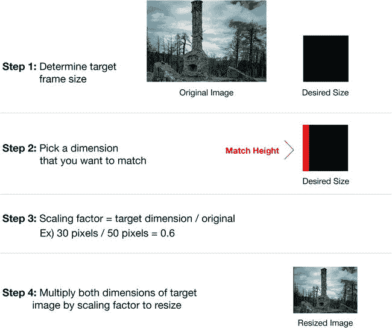

图 3-1。调整图片大小的过程

**注意** 使用固定维度可以让缩略图具有相同的宽度或高度，从而创造更好的用户体验。

你通过将目标（固定）维度除以源图片的对应维度来找到缩放因子：例如，如果你要匹配高度，你将使用图片的高度。

```
CGSize originalImageSize = self.originalImage.size;
float targetHeight = 150.0f;
float scaleFactor = targetHeight / originalImageSize.height;
```

你通过将剩余维度乘以缩放因子来计算目标帧：

```
float targetWidth = originalImageSize.width * scaleFactor;
CGRect targetFrame = CGRectMake(0, 0, targetWidth, targetHeight);
```

最后一步，你通过基于目标帧大小创建上下文，并调用 `[UIImage drawInRect:]` 实例方法将其绘制到上下文上，来创建缩放后的图片。完成后，将上下文的快照保存到 `UIImage` 对象并关闭上下文：


```objectivec
UIGraphicsBeginImageContext(targetFrame.size);
[self.originalImage drawInRect:targetFrame];
resizedImage = UIGraphicsGetImageFromCurrentImageContext();
UIGraphicsEndImageContext();
[self.imageView setImage:resizedImage];
```

**列表 3-1** 提供了一个完整方法的示例，它整合了上述所有步骤。

***列表 3-1***. 调整图像大小

```objectivec
-(IBAction)shrink:(id)sender
{
    UIImage *resizedImage = nil;

    CGSize originalImageSize = self.originalImage.size;
    float targetHeight = 150.0f;
    float scaleFactor = targetHeight / originalImageSize.height;
    float targetWidth = originalImageSize.width * scaleFactor;

    CGRect targetFrame = CGRectMake(0, 0, targetWidth, targetHeight);

    UIGraphicsBeginImageContext(targetFrame.size);

    [self.originalImage drawInRect:targetFrame];

    resizedImage = UIGraphicsGetImageFromCurrentImageContext();

    UIGraphicsEndImageContext();

    [self.imageView setImage:resizedImage];
}
```

请记住，在调整图像大小时，大部分代码将用于计算新的帧尺寸并将其在图形上下文中正确定位。

## 裁剪图像

裁剪图像的过程与调整图像大小非常相似，区别在于，不是将整个图像缩小到目标帧的尺寸，而是需要调整其大小并重新定位，使其适合裁剪帧。裁剪图像的一个常见原因是制作统一的图像缩略图（例如，正方形），而不管源图像的尺寸如何。

与调整大小类似，第一步是找到图像的缩放比例。由于您希望保留图像的自然宽高比（即确保图像不会变形），因此应使用较小的尺寸作为基准。然后，您可以将图像居中于边界框内，并裁剪掉多余的部分。您可以在图 3-2 中查看更新后的裁剪过程示意图。

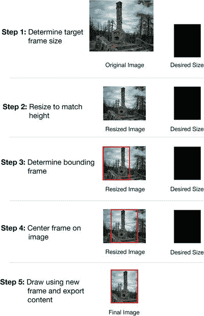

图 3-2. 图像裁剪过程

**列表 3-2** 提供了裁剪过程的实现。

***列表 3-2***. 裁剪图像

```objectivec
-(IBAction)crop:(id)sender
{
    UIImage *resizedImage = nil;
    CGSize originalImageSize = self.originalImage.size;
    CGSize targetImageSize = CGSizeMake(150.0f, 150.0f);
    float scaleFactor, tempImageHeight, tempImageWidth;
    CGRect croppingRect;

    BOOL favorsX = NO;

    if (originalImageSize.width > originalImageSize.height) {
        scaleFactor = targetImageSize.height / originalImageSize.height;
        favorsX = YES;
    } else {
        scaleFactor = targetImageSize.width / originalImageSize.width;
        favorsX = NO;
    }

    tempImageHeight = originalImageSize.height * scaleFactor;
    tempImageWidth = originalImageSize.width * scaleFactor;

    if (favorsX) {
        float delta = (tempImageWidth - targetImageSize.width) / 2;
        croppingRect = CGRectMake(-1.0f * delta, 0, tempImageWidth, tempImageHeight);
    } else {
        float delta = (tempImageHeight - targetImageSize.height) / 2;
        croppingRect = CGRectMake(0, -1.0f * delta, tempImageWidth, tempImageHeight);
    }

    UIGraphicsBeginImageContext(targetImageSize);

    [self.originalImage drawInRect:croppingRect];

    resizedImage = UIGraphicsGetImageFromCurrentImageContext();

    UIGraphicsEndImageContext();

    [self.imageView setImage:resizedImage];

    self.statusLabel.text = @"Effect: Crop";
}
```

您会注意到，此方法中的关键逻辑围绕着寻找较小的尺寸、重新定位图像以及通过移除边界框外的所有内容来保存更改。您需要移动图像使其适配在帧的中心，具体取决于需要在 `x` 还是 `y` 维度上进行更多裁剪（由 `favorsX` 变量指示）。此示例将其中一个 `origin` 值乘以 `-1.0`，表示图像需要向负方向移动（对于 `x` 是向左，对于 `y` 是向上）。与调整图像尺寸时一样，必须在完成后导出图形上下文的快照，以保存更改。

如果您不想缩小图像，而只想在指定的 (`x`,`y`) 位置裁剪出图像的一部分，则可以忽略缩放步骤。在这种情况下，最重要的操作是通过使用正确的目标坐标调用 `[UIView drawRect:]` 来定位边界框。列表 3-3 提供了一个忽略缩放的裁剪操作示例。

***列表 3-3***. 在指定 (`x`,`y`) 位置进行无缩放裁剪

```objectivec
-(IBAction)crop:(id)sender
{
    UIImage *resizedImage = nil;
    CGSize originalImageSize = self.originalImage.size;
    CGSize targetImageSize = CGSizeMake(150.0f, 150.0f);

    float originX = 10.0f;
    float originY = 20.0f;
    float scaleFactor, tempImageHeight, tempImageWidth;
    CGRect croppingRect = CGRectMake(originX, originY, originalImageSize.width,
        originalImageSize.height);
    UIGraphicsBeginImageContext(targetImageSize);

    [self.originalImage drawInRect:croppingRect];

    resizedImage = UIGraphicsGetImageFromCurrentImageContext();

    UIGraphicsEndImageContext();

    [self.imageView setImage:resizedImage];

    self.statusLabel.text = @"Effect: Crop";
}
```

您可以在本书的源代码包（请参见 Apress 网站的来源/代码下载区域，`www.apress.com`）中找到演示裁剪和调整大小的示例项目。该项目名为 ImageTransformations，位于第 3 章文件夹中。如图 3-3 所示，该项目提供了一个图像视图用于预览图像，以及用于裁剪、调整大小和将其恢复到原始大小的按钮。

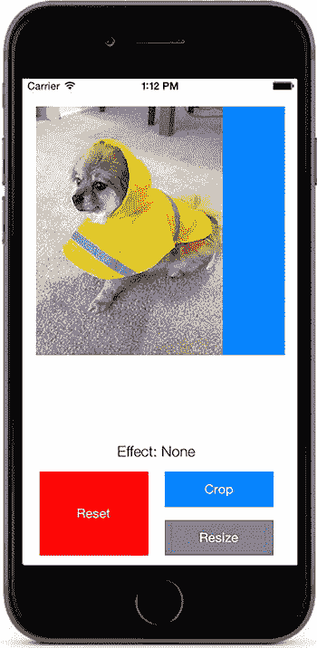

图 3-3. ImageTransformations 项目

## 保存图像

为了充分利用您的照片，包括您在应用中处理过的那些照片，您通常需要能够将它们保存到磁盘或照片库。除非用户使用的应用声明会在一段时间后删除所有图像（例如 Snapchat），否则大多数用户期望能够在下次打开应用时检索到他们使用您的应用创建的图像。保存图像的能力很重要，因为它能满足这种期望，并且允许用户将创建的图像导出到电子邮件或其他应用中。

### 将图像保存到文件

将图像保存到磁盘的过程非常简单。与其他许多数据操作一样，您需要提取图像的二进制数据，并将此数据写入文件。

要提取图像的二进制数据，您可以使用 UIKit 的便捷方法 `UIImagePNRepresentation()` 和 `UIImageJPEGRepresentation()`。这两种方法都返回 `NSData` 对象，如下所示：

```objectivec
NSData *imageData = UIImagePNGRepresentation(self.originalImage);
```


当你需要保留图片中的 Alpha（透明度）信息时，应使用 `UIImagePNGRepresentation()`，其唯一参数是你输入的 `UIImage`。如果你的图片不包含任何 Alpha 信息，且需要压缩选项，则应使用 `UIImageJPEGRepresentation()`。该方法的参数是输入的 `UIImage` 和一个 `float` 类型的值（范围 0.0 到 1.0），代表压缩质量。数值越低，压缩程度越高，图像质量越低。对于大多数应用来说，0.6 或 0.7 是在文件大小与图像质量之间的良好平衡点：

```
NSData *imageData = UIImageJPEGRepresentation(self.originalImage, 0.7f);
```

准备好图片的二进制数据后，即可将其写入文件。你可以使用 `NSData` 的实例方法 `[NSData writeToFile:]` 将数据写入磁盘。该方法需要一个文件的目标存储位置。就像从应用包内读取文件一样，你可以将应用的文档目录作为访问设备文件系统的接口。在列表 3-4 中提供了将图片保存到文档文件夹的示例。

***列表 3-4***. 将图片保存到文档文件夹

```
-(IBAction)saveToDisk:(id)sender
{
    NSArray *paths = NSSearchPathForDirectoriesInDomains(NSDocumentDirectory, NSUserDomainMask,
                     YES);
    NSString *documentsDirectory = [paths objectAtIndex:0];
    NSString *filePath = [documentsDirectory stringByAppendingPathComponent:@"image.jpg"];

NSData *imageData = UIImageJPEGRepresentation(self.originalImage, 0.7f);
    NSError *error = nil;
    NSString *alertMessage = nil;

//在尝试写入前检查文件是否存在
    if ([[NSFileManager defaultManager] fileExistsAtPath:filePath]) {

NSDateFormatter *dateFormat = [[NSDateFormatter alloc] init];
        [dateFormat setDateFormat:@"yyyyMMddHHmm"];

NSString *dateString = [dateFormat stringFromDate:[NSDate date]];

NSString *fileName = [NSString stringWithFormat:@"image-%@.jpg", dateString];

filePath = [documentsDirectory stringByAppendingPathComponent:fileName];
    }

[imageData writeToFile:filePath options:NSDataWritingAtomic error:&error];

if (error == nil) {
        alertMessage = @"已成功保存到'Documents'文件夹！";
    } else {
        alertMessage = @"无法保存图片 :(";
    }

UIAlertView *alertView = [[UIAlertView alloc] initWithTitle:@"状态"
                               message:alertMessage delegate:nil cancelButtonTitle:@"确定"
                               otherButtonTitles:nil];
    [alertView show];
}
```

**注意** Apple 的 API 不提供自动文件命名功能，因此在尝试写入文件前，务必记得检查文件名是否已存在。

在列表 3-4 中，代表图片的对象采用 `self.originalImage` 的格式。这表明该图片是类的一个实例变量，而非特定方法中的局部变量。当需要在同一个类中多次操作同一个对象，而无需将其作为参数传递时，实例变量就显得尤为重要。你需要在头文件中声明实例变量来创建它：

```
@property (nonatomic, strong) UIImage *originalImage;
```

现在文件已保存到文档文件夹，下次加载应用时你就可以访问它们了。

如果你希望用户能够将应用中的输出下载到他们的电脑上，还需要完成最后一步：为你的应用启用“iTunes 文件共享”。你可以通过导航到项目设置的“Info”选项卡，然后添加键“Application supports iTunes file sharing”来实现，如图 图 3-4 所示。

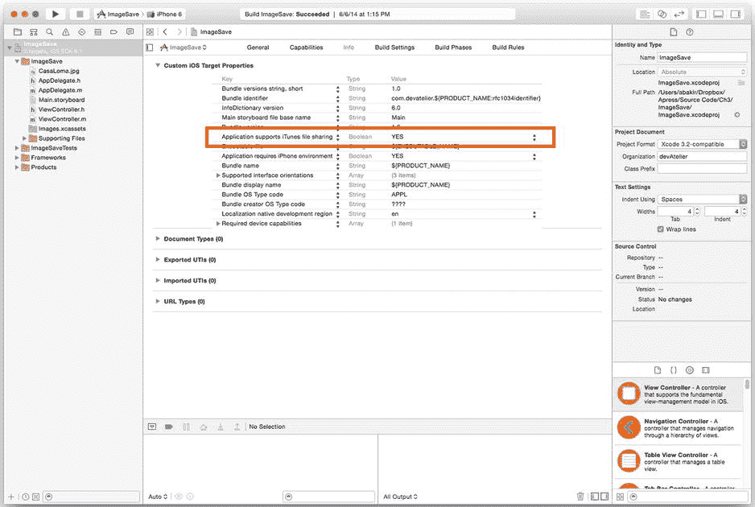

图 3-4. 启用 iTunes 文件共享

现在，用户可以在 iTunes 中选择他们的设备，向下滚动到“App”选项卡的“文件共享”部分来查看文件。通过点击已安装应用列表中的应用名称，他们就能看到应用文档文件夹的内容，如图 图 3-5 所示。

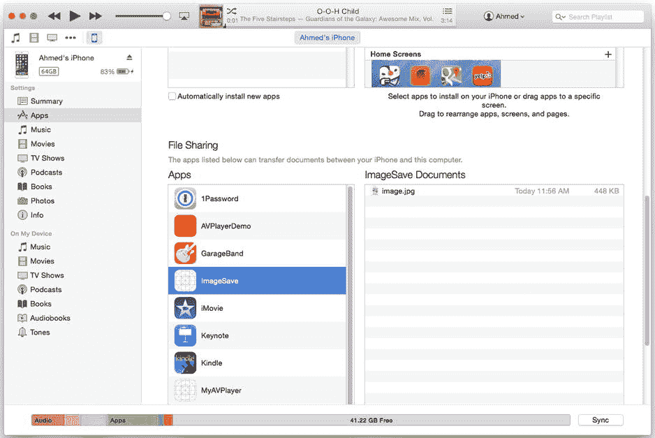

图 3-5. 在 iTunes 中查看文件

### 将图片保存到相册

对于许多基于照片的应用，你可能希望为其他应用提供访问那些在你的应用内创建或处理的图片的权限。在这种情况下，更合适的做法是直接将图片保存到系统的照片库中。为此，Apple 提供了一个便捷方法 `UIImageWriteToSavedPhotosAlbum()`，该方法允许你将 `UIImage` 对象直接保存到“相机胶卷”相册。

要使用 `UIImageWriteToSavedPhotosAlbum()` 方法，你需要传入要保存的 `UIImage` 对象，并可选地传入一个完成处理程序，该处理程序将在操作完成后执行。你可以使用这个完成处理程序来判断保存是否成功，并执行后续操作，例如显示一个 `UIAlertView`：

```
UIImageWriteToSavedPhotosAlbum(self.originalImage, self,
                               @selector(image:didFinishSavingWithError:contextInfo:), nil);
```

如果你使用了完成处理程序，请确保同时传递 `completionTarget` 参数（此处为 `self`）和处理程序方法的选择器。否则，你的代码将不知道在运行时使用哪个方法，也不知道在哪里查找它。列表 3-5 提供了一个显示提示视图的完成处理程序示例。

***列表 3-5***. 显示提示视图的完成处理程序

```
- (void)image:(UIImage *)image didFinishSavingWithError:(NSError *)
                                                         error contextInfo:(void *)contextInfo
{
    NSString *alertMessage = nil;
    if (error == nil) {
        alertMessage = @"已成功保存到相机胶卷！";
    } else {
        alertMessage = @"无法保存图片 :(";
    }

UIAlertView *alertView = [[UIAlertView alloc] initWithTitle:@"状态"
                               message:alertMessage delegate:nil cancelButtonTitle:@"确定"
                               otherButtonTitles:nil];
    [alertView show];
}
```

在源代码包中，我提供了一个名为 ImageSave 的示例项目，它演示了两种保存图片的方式。如图 图 3-6 所示，该应用提供了一个图片视图和两个触发保存操作的按钮。

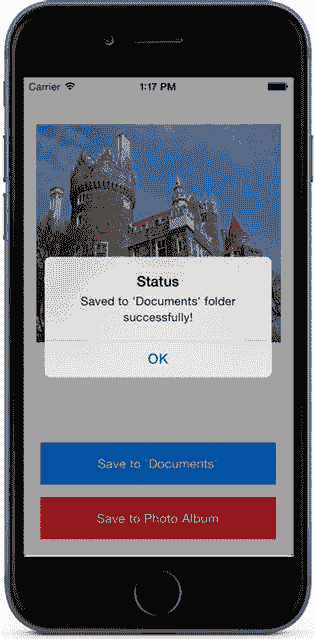

图 3-6. ImageSave 项目

## 从网络加载图片

你永远无法预测从网络加载一张图片需要多长时间。虽然你可以使用 `[NSData initWithContentsOfUrl:]` 方法来加载图片数据，但该方法不会提供错误处理，并且是一个阻塞操作，这意味着在下载完成之前，你的应用将无法响应其他事件。更好的方法是在后台下载图片，并在数据准备好后用下载结果刷新 `UIImageView`。

要在应用的后台下载图片数据，你需要使用 `NSURLConnection` 类。该类允许你控制下载（开始/停止），并提供了选项来控制其在何处执行（前台或后台），以及响应是通过委托还是完成块来处理。

首先，用占位图片或 `nil` 值初始化你的 `UIImageView`：

```
[self.imageView setImage:nil];
```

接下来，初始化一个包含目标 URL 的 `NSURLRequest` 对象：


```objectivec
NSURL *imageUrl = [NSURL URLWithString:@"http://www.devatelier.com/images/flower.png"];
NSURLRequest *urlRequest = [NSURLRequest requestWithURL:imageUrl];
```

`NSURLRequest` 对象将 URL 包装在一个 HTTP `GET` 命令中，这是浏览器和其他应用程序向 Web 服务器发送下载请求的方式。

为了简化此实现，我建议使用允许指定完成块的 `NSURLConnection` 方法：`[NSURLConnection sendAsynchronousRequest:]`。使用完成处理程序可以在方法完成后立即执行代码块，而无需持久化变量或创建额外的方法。它是一个类方法，因此无需实例化对象即可使用：

```objectivec
[NSURLConnection sendAsynchronousRequest:urlRequest queue:[NSOperationQueue mainQueue]
                 completionHandler:^(NSURLResponse *response, NSData *data,
                 NSError *connectionError) { ... }];
```

可以看到，该方法的完成处理程序返回一个 `NSData` 对象和一个 `NSError` 对象。如果下载失败，`error` 对象将为 `nil`；否则它将包含一个非 `nil` 值。清单 3-6 展示了一个方法，该方法发起下载，并在下载成功时根据结果数据创建一个 `UIImage` 对象。如果下载失败，应用程序将向用户显示一个提示错误的警告视图。

***清单 3-6*** 从网络加载图像

```objectivec
-(IBAction)start:(id)sender
{
    NSURL *imageUrl = [NSURL URLWithString:@"http://www.devatelier.com/images/flower.png"];
    NSURLRequest *urlRequest = [NSURLRequest requestWithURL:imageUrl];

    [self.imageView setImage:nil];

    [NSURLConnection sendAsynchronousRequest:urlRequest queue:[NSOperationQueue mainQueue]
                     completionHandler:^(NSURLResponse *response, NSData *data,
                     NSError *connectionError) {

        if (connectionError == nil) {

            UIImage *newImage = [UIImage imageWithData:data];
            [self.imageView setImage:newImage];

        } else {
            UIAlertView *alertView = [[UIAlertView alloc] initWithTitle:@"Error"
                message:@"Could not load image :(" delegate:nil cancelButtonTitle:@"OK"
                otherButtonTitles:nil];
            [alertView show]; 
        }
    }];
}
```

## 添加活动指示器

在许多应用程序中，你会注意到一个旋转动画，表示操作正在进行中（例如下载图像），如图 3-7 所示。你可以通过 `UIActivityIndicatorView` 类向任何视图添加旋转器（或活动指示器）。

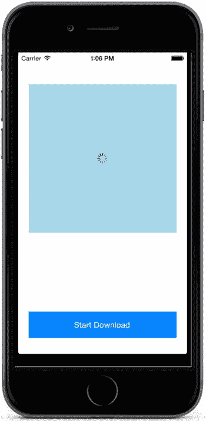

图 3-7 叠加了活动指示器的视图

要将 `UIActivityIndicatorView` 添加到 `UIImageView`，你需要遵循与其他 `UIView` 相同的大多数初始化步骤，包括设置容器框架以及将 `UIActivityIndicatorView` 作为子视图添加到 `UIImageView` 之上。

通过查看图 3-7，你会注意到 `UIActivityIndicatorView` 与 `UIImageView` 相比非常小。为了适应尺寸差异，你可以找到 `UIImageView` 的中心，并将其作为 `UIActivityIndicatorView` 的起点。清单 3-7 提供了一个向图像视图添加活动指示器的示例。

***清单 3-7*** 向图像视图添加活动指示器

```objectivec
// calculate the mid-way point of the image view
CGFloat indicatorWidth, indicatorHeight;
indicatorWidth = indicatorHeight = 100.0f;

CGFloat originX = (self.imageView.frame.size.width - indicatorWidth) / 2;
CGFloat originY = (self.imageView.frame.size.height - indicatorHeight) / 2;

CGRect activityFrame = CGRectMake(originX, originY, indicatorWidth, indicatorHeight);

self.activityView = [[UIActivityIndicatorView alloc] initWithFrame:activityFrame];
self.activityView.color = [UIColor blackColor];
[self.imageView addSubview:self.activityView];
```

你需要将 `UIImageView` 和 `UIActivityIndicatorView` 对象声明为实例变量，因为你需要在整个类中访问它们。

在 `UIActivityIndicatorView` 初始化并添加到 `UIImageView` 之后，你就可以让魔法发生了。当下载操作开始时，应使用 `[UIActivityIndicatorView startAnimating]` 实例方法来启动活动指示器的动画。当操作完成（无论成功还是失败）时，调用 `[UIActivityIndicatorView stopAnimating]` 实例方法来停止动画并隐藏活动指示器。

清单 3-8 展示了一个结合了发起下载与启动、停止活动指示器的示例。

***清单 3-8*** 加载图像并使用活动指示器镜像状态

```objectivec
-(IBAction)start:(id)sender
{
    NSURL *imageUrl = [NSURL URLWithString:@"http://images.devatelier.com/castle.jpg"];
    NSURLRequest *urlRequest = [NSURLRequest requestWithURL:imageUrl];

    [self.imageView setImage:nil];
    [self.imageView bringSubviewToFront:self.activityView];
    [self.activityView startAnimating];

    [NSURLConnection sendAsynchronousRequest:urlRequest queue:[NSOperationQueue mainQueue]
                     completionHandler:^(NSURLResponse *response, NSData *data,
                     NSError *connectionError) {

        [self.activityView stopAnimating];

        if (connectionError == nil) {

            UIImage *newImage = [UIImage imageWithData:data];
            [self.imageView setImage:newImage];

        } else {
            UIAlertView *alertView = [[UIAlertView alloc] initWithTitle:@"Error" message:@"Could not load image :(" delegate:nil cancelButtonTitle:@"OK" otherButtonTitles:nil];
            [alertView show];
        }
    }];
}
```

**注意** 视图按照添加的顺序显示。在此示例中，我使用了 `[UIView bringSubviewToFront:]` 实例方法来强制活动指示器显示在视图堆栈的最顶层。

本章源代码包中的 ImageDownload 项目实现了图 3-7 所示的用户界面。当用户按下“Start Download”按钮时，图像将在后台开始下载并显示活动指示器。下载完成后，指示器将消失，图像视图将重新加载已下载的图像。

## 为图像添加效果

无可争议，Apple 在 iOS 7 中引入的最引人注目的变化是其新的视觉设计语言以及为开发者提供的实现该语言的工具。iOS 7 标志着 Apple 从传统的拟物化用户界面方法（从现实世界中获取灵感）转向扁平、简洁、数字优先的设计。

在本节中，你将学习如何开始使用这种设计语言。你将利用传统方法（如渐变）为图像增加深度，并了解模糊和运动效果如何让你的应用使用 Apple 在其应用中使用的许多引人注目的视觉效果。

### 添加渐变

为了增加深度并突出叠加在图像上的内容（例如文本），你可以使用渐变。幸运的是，有一个现成的 API 可以做到这一点！

好的，高级文档工程师和翻译员已就位。以下是按照您的要求翻译后的中文文档。


你可以用来在视图上绘制渐变的 Quartz 类是`CAGradientLayer`。它是视图绘制类`CALayer`的子类，旨在根据输入的颜色和颜色停止点绘制渐变。*停止点*决定了各个区域应在何处停止并开始相互交错。你可以使用的颜色或停止点数量没有限制，但应尽量遵循良好的设计原则，实现不分散注意力的渐变。如图 3-8 所示，不同数量的停止点可以基于你放置它们的位置以及使用颜色区域的方式，产生截然不同的效果。

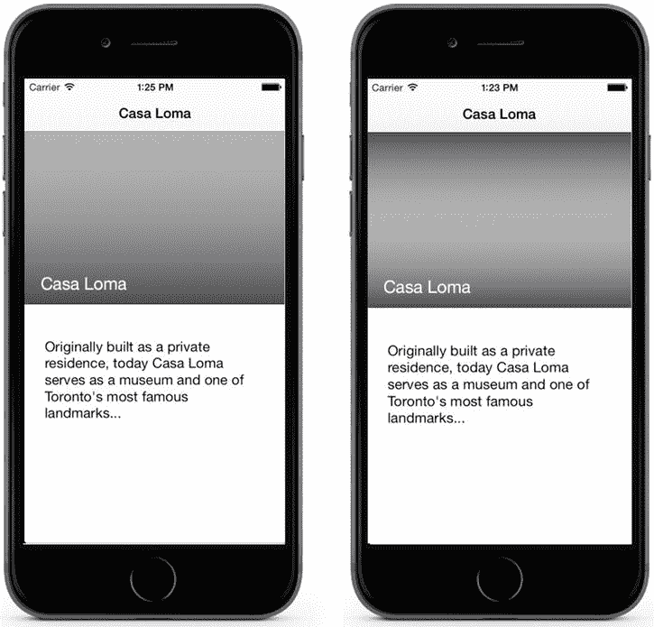

图 3-8 两个停止点的渐变与三个停止点的渐变对比

代码清单 3-9 展示了向`UIImageView`添加渐变的示例。

***代码清单 3-9*** 向 UIImageView 添加渐变

```
UIColor *darkestColor = [UIColor colorWithWhite:0.1f alpha:0.7f];
UIColor *lightestColor = [UIColor colorWithWhite:0.7f alpha:0.1f];

CAGradientLayer *headerGradient = [CAGradientLayer layer];
headerGradient.colors = [NSArray arrayWithObjects:(id)darkestColor.CGColor,
                         (id)lightestColor.CGColor, (id)darkestColor.CGColor,  nil];

headerGradient.frame = self.headerImageView.bounds;
[self.headerImageView.layer insertSublayer:headerGradient atIndex:0];
```

**注意**：如果你未定义任何停止点，默认值将均匀分布。

要创建渐变，首先需要创建一个`CAGradientLayer`对象。然后，指定要使用的颜色。在此示例中，我希望图像显示圆角效果，因此我使用了三个停止点，并且颜色从深色过渡到浅色，然后再回到深色。

**注意**：在图像上放置渐变时，我强烈建议使用`UIColor`方法，该方法允许你指定 alpha 值。Alpha 值决定了图层的透明度。Alpha 值为`0.0`意味着图层完全透明，而 alpha 值为`1.0`意味着图层完全不透明。交替使用你的 alpha 值，可以使渐变效果在不同位置更强或更弱，同时不会完全遮盖图像。

图 3-9 展示了渐变输出的示例。

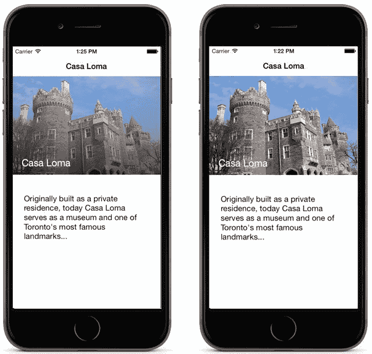

图 3-9 带有渐变的图像视图与不带渐变的图像视图对比

使用渐变，你可以仅用几行简单的代码创建强大的视觉效果，帮助你的图像实现更逼真的光照感。渐变还能比单纯的投影更好地突出覆盖层。此示例中使用的效果与 Facebook 在其个人资料页面上使用的效果相同。

使用渐变的示例项目名为`ImageGradient`。

## 让图像随设备移动

iOS 7 带来的最令人兴奋的用户界面功能之一，是能够向任何视图添加动态效果。*动态效果*允许你响应加速器事件移动视图，从而使应用更具沉浸感，并突出 UI 中最重要的部分。苹果使用动态效果来制作 iOS 7+ 主屏幕、锁屏、提醒视图以及 iPhone 上的 Safari 标签页浏览器的动画。

苹果通过`UIMotionEffect`抽象类公开了访问和创建动态效果的能力。作为一个抽象类，它必须被子类化才能实例化。然而，幸运的是，苹果提供了一个非常简单的子类，可以根据加速度计的变化水平和垂直移动视图，称为`UIInterpolatingMotionEffect`。

**注意**：要实现你自己的完全自定义行为和高级动画，你可以直接子类化`UIMotionEffect`，并在`keyPathsAndRelativeValuesForViewerOffsets:`方法中添加你的自定义逻辑。

要使用`UIInterpolatingMotionEffect`，你必须实例化一个对象，该对象带有一个`keyPath`，表示你要基于动态事件修改的`view`属性（例如，中心 x 位置），以及你要响应的动态类型（例如，水平移动）。对于许多动态效果，你将要显示视图的隐藏区域，因此你还必须定义相对限制，让动态效果知道这些边界是什么。定义效果后，你可以通过使用`[UIView addMotionEffect:]`实例方法将其添加到视图。你可以直接向此方法传递一个`UIMotionEffect`对象，或者如果你尝试一次添加多个效果，则传递一个`UIMotionEffectGroup`对象。代码清单 3-10 展示了向`UIImageView`添加动态效果的示例。

***代码清单 3-10*** 向 UIImageView 添加动态效果

```
UIInterpolatingMotionEffect *horizontalEffect = [[UIInterpolatingMotionEffect alloc]
                             initWithKeyPath:@"center.x"
                             type:UIInterpolatingMotionEffectTypeTiltAlongHorizontalAxis];

UIInterpolatingMotionEffect *verticalEffect = [[UIInterpolatingMotionEffect alloc]
                             initWithKeyPath:@"center.y"
                             type:UIInterpolatingMotionEffectTypeTiltAlongVerticalAxis];

horizontalEffect.minimumRelativeValue  = [NSNumber numberWithInteger:-50];
horizontalEffect.maximumRelativeValue  = [NSNumber numberWithInteger:50];

verticalEffect.minimumRelativeValue  = [NSNumber numberWithInteger:-50];
verticalEffect.maximumRelativeValue  = [NSNumber numberWithInteger:50];

//set bg image effects
[self.backgroundImageView addMotionEffect:horizontalEffect];
[self.backgroundImageView addMotionEffect:verticalEffect];
```

在代码清单 3-10 中，我设置了背景视图的动态效果。由于动态效果的意图是突出或弱化视图层次结构中的某个视图，因此通常将效果应用于背景中的视图或前景中的动作视图（例如，`UIAlertView`）是合适的。

**注意**：iOS 辅助功能屏幕中的“减弱动态效果”开关允许用户在整个系统范围内（包括你的应用）禁用动态效果。这无法被覆盖，因此请记住针对此限制进行设计。

源代码包中使用动态效果的示例项目名为`ImageTilt`。如图 3-10 所示，没有按钮。输入来自设备的倾斜。你会注意到图像在移动，但标签没有。

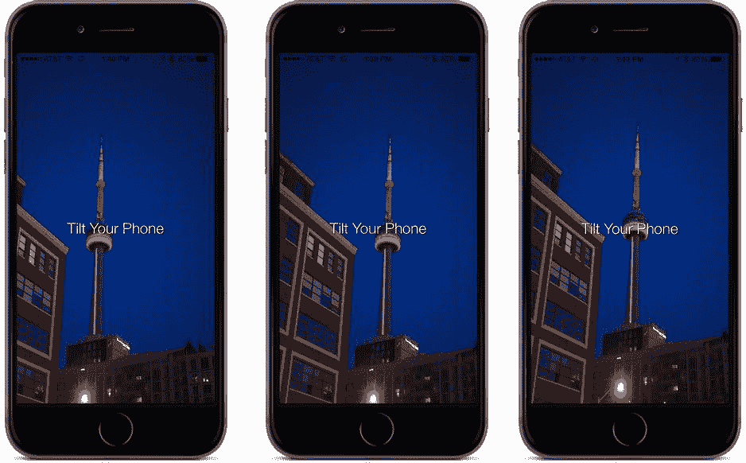

图 3-10 ImageTilt 项目的动态效果

## 为图像添加模糊效果

苹果在 iOS 7 的设计语言中带来的另一个令人兴奋的视觉效果，是强调模糊背景图像以突出用户界面的重要部分。当你打开 Siri 时，可以非常频繁地看到这种效果，如图 3-11 所示。

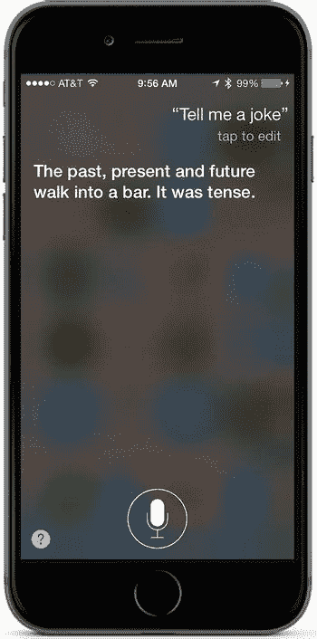

图 3-11 Siri 中的模糊效果


```markdown

创建模糊背景所需的许多核心概念都利用了创建图形上下文来操作图像，然后使用`CGAffineTransform`修改源图像。Apple 倾向于使用*高斯模糊*效果，这种效果通过数学运算平滑图像，从而减少细节。幸运的是，Apple 在 2013 年 Apple 全球开发者大会（WWDC）上为`UIImage`创建了一个名为`UIImage+ImageEffects.h`的分类类，它管理用于计算的图形上下文，执行模糊函数，并返回结果。我已将`ImageEffects`分类包含在本章的示例代码中。你也可以在 iOS Dev Center 上搜索 WWDC 课程“Implementing Engaging UI on iOS”找到它。

iOS 中的*分类*允许你在不子类化的情况下扩展一个类。分类允许你编写非常小的文件，这些文件可以为现有类添加多个方法，以增加功能。

要使用`ImageEffects`分类，你需要在你的类中包含`UIImage+ImageEffects.h`。然后，你可以像使用其他`UIImage`方法一样使用它提供的额外方法。图 3-12 比较了每种模糊效果提供的结果。

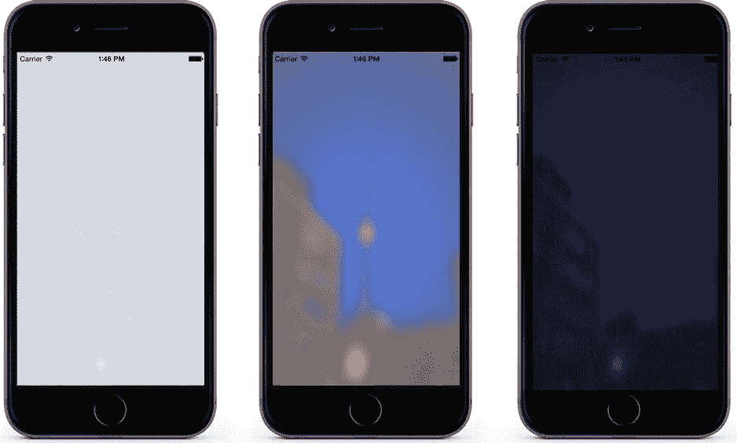

图 3-12. 同一张图片上的 Extra Light Effect 模糊、Light Effect 模糊和 Dark Effect 模糊

你应该使用的模糊效果取决于你的用户界面和图像的颜色。对于浅色图像，最好使用`[UIImage applyLightEffect:]`，而`[UIImage applyDarkEffect:]`更适合深色图像。如你所见，选择效果只需一行代码：

```
UIImage *blurredImage = [self.originalImage applyLightEffect];
```

为图像添加模糊效果的示例项目名为 ImageBlur。如图 3-13 所示，该项目有三个按钮，用于在模糊类型之间切换。我强烈建议使用你自己的一些图像测试该项目，看看模糊效果如何影响它们。

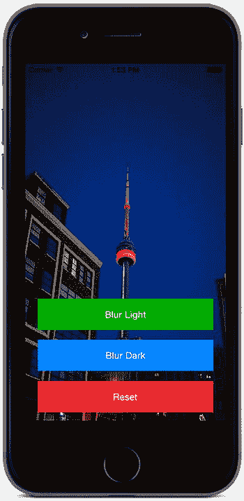

图 3-13. ImageBlur 项目

## 总结

在本章中，你了解了如何利用图形上下文的画布般能力来操作图像。接着，你学习了如何将图像导出到文件和相册，以便稍后重用或与其他应用共享。为了让你的应用更快，你了解了如何在不阻塞用户界面的情况下从互联网加载图像。最后，你开始看到如何使用 Apple 的许多视觉效果方法为图像增加额外的深度感。

# 第 4 章：高级照片界面

在本章中，你将通过构建自己的图像捕获和照片选择器类（类似于`UIImagePickerController`提供的默认类）来探索更底层的相机编程主题。在此过程中，你将了解如何配置硬件相机进行图像捕获，如何直接从“照片”应用访问照片，以及如何在用户界面中呈现这些原始数据。

你将使用`UIImagePickerController`作为功能参考，因此如果你不确定如何呈现该类或处理其输出，最好回顾第 2 章。

虽然复制 iOS 已提供的功能似乎工作量很大，但拥有一个与应用其余部分风格迥异的相机界面，或者一个不允许用户修改以改善照片质量的界面，会极大地影响你的功能并赶走用户。

## 构建自定义相机界面

第一个练习是复制`UIImagePickerController`提供的基本图像捕获界面。如图 4-1 所示，该项目使用了非标准界面，并公开了扩展的硬件控制集。

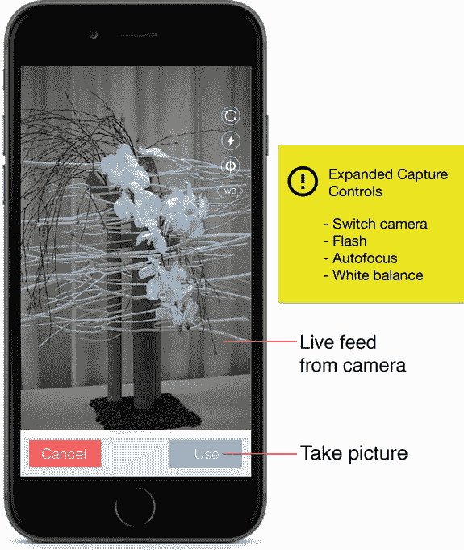

图 4-1. 具有自定义用户界面的相机控制器模型

为实现这一点，应用必须能够执行以下操作：

*   发现并配置相机硬件
*   显示来自相机的实时数据流
*   从 UI 修改捕获设置
*   当用户点击“拍照”按钮时捕获图片

理想情况下，你应该使用一个允许你配置相机“对象”并访问其生成的数据流的类。同时，你不想自己编写硬件驱动程序，因此最好使用能抽象这一层的工具。幸运的是，`AVFoundation`框架中包含了该功能，它是 Cocoa Touch 的一部分。

顾名思义，`AVFoundation`是 Apple 的媒体框架之一，用于捕获、操作和存储音频和视频资源。`AVFoundation`中的视频捕获 API 允许你访问来自相机的原始视频流，并为硬件控制（如闪光灯或自动对焦）提供高级配置功能。

你可以通过以下方式从视频流构建图像捕获接口：记住视频流只不过是一系列称为*帧*的图像。要捕获图像，你只需从视频中提取一帧。为确保结果准确，你需要在图像对焦时提取帧。

在本节中，你将了解如何使用`AVFoundation`设置相机、显示实时流以及根据用户界面事件捕获帧或更改设置。为了加快工作流程，本节使用 storyboards 和 Interface Builder 来构建用户界面。

与本书之前的练习一样，你可以在 Apress 网站（`www.apress.com`）的“源代码/下载”区域找到该项目的源代码，位于第 4 章文件夹下。该应用的名为 MyCamera。

### 初始化硬件接口

在你的应用尝试访问共享资源（如硬件）或执行失败可能性很高的操作时，Apple 建议使用*会话*设计模式。该模式通过会话对象管道传输所有操作，提供了错误减少和流量控制功能，例如信号量。会话还通过简化复杂接口的设置和拆除流程来减少错误。你将在访问音频硬件或执行网络操作时看到这种设计模式的使用。

要开始在项目中使用`AVFoundation`类，你需要将框架添加到项目中，并在任何使用它的类中包含它。向项目添加框架最简单的方法是将其添加到应用的“已链接的框架和库”数组中。你可以通过单击 Xcode 项目导航器中的项目名称，然后滚动到“通用”选项卡底部来修改此数组，如图 4-2 所示。

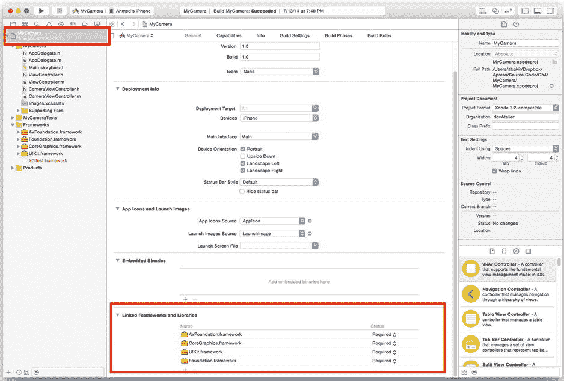

图 4-2. 查找“已链接的框架和库”数组

你可以通过单击“已链接的框架和库”窗格底部的加号按钮来选择要添加的框架。执行此操作会显示一个导航器，显示你开发计算机上安装的框架。你可以通过输入所需框架的名称进一步过滤列表。选择一个框架，然后单击“添加”按钮将其添加到项目（参见图 4-3）。

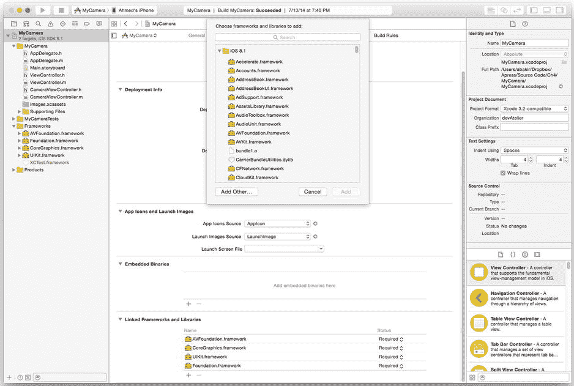

```


#### 图 4-3. Xcode 的框架选择器

在将 `AVFoundation` 框架添加到项目后，你需要在使用该框架的每个类的头文件顶部添加包含语句来将其引入你的文件。MyCamera 应用程序的头文件为 `ViewController.h`：

```
#include <AVFoundation/AVFoundation.h>
```

你用于管理硬件会话的 `AVFoundation` 类名为 `AVCaptureSession`。该类负责管理硬件接口，并提供高级别的启动和停止操作。实例化一个会话对象非常简单，只需调用 `AVCaptureSession` 对象的 `init` 方法：

```
AVCaptureSession *session = [[AVCaptureSession alloc] init];
```

**注意** 你需要在应用中与所有试图访问该会话对象的类共享它，因此请记得将其声明为实例变量或单例。

当你准备通过会话使用硬件设备时，需要将它们作为*输入*添加。这分为两个步骤：首先识别你想要使用的硬件设备，然后将其配置为向你的会话发送数据。硬件设备由 `AVCaptureDevice` 类表示，通过该类你可以查询设备权限和硬件可用性，并为设备配置采集设置。

在开始向设备发送命令之前，你需要先发现该设备。使用 `[AVCaptureDevice defaultDeviceWithMediaType:]` 类方法发现特定媒体类型的默认硬件设备。使用 `AVMediaTypeVideo` 常量指定视频设备：

```
AVCaptureDevice *camera = [AVCaptureDevice defaultDeviceWithMediaType:AVMediaTypeVideo];
```

**注意** 若要发现所有符合某类型的设备，请使用 `[AVCaptureDevice devicesWithMediaType:]` 类方法。为了匹配特定属性（例如摄像头位置），你需要遍历结果。你可以使用 `position` 属性来判断摄像头位于设备正面还是背面。

找到设备后，你需要将其添加到会话中。要将设备配置为与 `AVCaptureSession` 一起使用，你需要将其实例化为 `AVDeviceCaptureInput` 对象。`AVDeviceCaptureInput` 会尝试初始化硬件设备，如果成功则返回一个对象，如果失败则返回 `NSError`。对象就绪后，使用 `[AVCaptureSession canAddInput:]` 方法确认该设备可供你的应用程序使用，然后调用 `[AVCaptureSession addInput:]` 实例方法将其添加到会话中。你可以在代码清单 4-1 中找到说明此过程的示例。

#### 代码清单 4-1. 添加摄像头输入

```
NSError *error = nil;
AVCaptureDeviceInput *cameraInput = [AVCaptureDeviceInput
                                     deviceInputWithDevice:camera
                                     error:&error];

if (error == nil && [self.session canAddInput:cameraInput]) {
    [self.session addInput:cameraInput];
}
```

**警告** 为减少错误，在尝试添加输入之前，应始终确保该输入可用。请记住，摄像头是共享资源，你需要与其他应用和谐共处！

### 访问实时摄像头画面

在建立与摄像头硬件的接口后，你需要某种方式将输出显示在屏幕上。要显示实时视频画面，你需要执行三个步骤：

1.  访问包含实时视频流的数据源。
2.  将视频流放置到视图上。
3.  启动流。

`AVFoundation` 中负责镜像会话视频输出的类是 `AVCaptureVideoPreviewLayer`。该类是 `CALayer` 的子类，通常被称为**核心动画层**。核心动画层是一种后台类，你在将图像数据绘制到屏幕之前会将其发送给该类。层代表内容，而视图则代表内容将显示的位置。


与传统动画中的赛璐珞片类似，你可以组合图层来表示更复杂的数据，也可以独立移动它们。由于视频流本质上是快速变化的图像序列，从性能角度来看，将内容直接写入图层比在每一帧变化时销毁视图要合理得多。

通过调用构造方法 `[AVCapturePreviewLayer initWithSession:]` 来实例化 `AVCapturePreviewLayer` 对象，并将会话对象作为输入参数传入：

```
AVCaptureVideoPreviewLayer *previewLayer =
     [[AVCaptureVideoPreviewLayer alloc] initWithSession:self.session];
```

为了正确显示图层，你需要指定其尺寸和位置。在 `MyCamera` 项目中，你将使用名为 `previewView` 的 `UIView` 属性来展示相机实时画面。要将视频图层居中于该视图并赋予其相同的边界，可以使用以下代码片段：

```
CGRect layerRect = self.previewView.bounds;
CGPoint layerCenter = CGPointMake(CGRectGetMidX(layerRect),
    CGRectGetMidY(layerRect));
[previewLayer setBounds:layerRect];
[previewLayer setPosition:layerCenter];
```

然而，要显示视频图层，你需要为其指定一个绘制目标。你希望在视图上绘制视频，因此将预览图层作为子层添加到视图顶层：

```
[self.previewView.layer addSublayer:previewLayer];
```

默认情况下，预览图层会在保持宽高比的同时调整相机输出大小以适应其容器框。通过将 `videoGravity` 属性设置为 `AVLayerVideoGravityResize`，你可以将缩放模式更改为按比例填充：

```
[previewLayer setVideoGravity:AVLayerVideoGravityResize];
```

最后一步是启动视频流，在会话对象上调用 `[AVCaptureSession startRunning]` 方法即可：

```
[self.session startRunning];
```

`ViewController` 类的完整相机设置代码见列表 4-2。该代码被封装在 `[self viewDidLoad:]` 方法中，因为当视图初始化时需要初始化相机。

**列表 4-2**。初始化相机输入

```
- (void)viewDidLoad
{
        [super viewDidLoad];
            // Do any additional setup after loading the view.
        self.session = [[AVCaptureSession alloc] init];
        AVCaptureDevice *camera = [AVCaptureDevice
            defaultDeviceWithMediaType:AVMediaTypeVideo];
        NSError *error = nil;

AVCaptureDeviceInput *cameraInput = [AVCaptureDeviceInput
             deviceInputWithDevice:camera error:&error];

if (error == nil && [self.session canAddInput:cameraInput]) {
             [self.session addInput:cameraInput];

AVCaptureVideoPreviewLayer *previewLayer =
                [[AVCaptureVideoPreviewLayer alloc]
                  initWithSession:self.session];

CGRect layerRect = self.previewView.bounds;
            CGPoint layerCenter = CGPointMake(CGRectGetMidX(layerRect),
                                  CGRectGetMidY(layerRect));

[previewLayer setBounds:layerRect];
            [previewLayer setPosition:layerCenter];

[previewLayer setVideoGravity:AVLayerVideoGravityResize];

[self.previewView.layer addSublayer:previewLayer];

[self.session startRunning];
    }
}
```

### 捕捉静态图像

与之前向 `AVCaptureSession` 添加*输入*（input）以确定输入设备的方式类似，你需要添加一个*输出*（output）来确定如何导出数据。在本例中，当用户准备就绪时，你希望导出一张照片——以视频单帧的形式表示。

`AVCaptureSession` 输出对象的基类是 `AVCaptureOutput`，但它是一个仅指定捕获对象所需信息的抽象类。幸运的是，`AVFoundation` 提供了许多 `AVCaptureObject` 的子类，可用于你所需的导出格式。常用的一些子类列举在表 4-1 中。


表 4-1. 常用的 `AVCaptureOutput` 子类

| 子类 | 捕获输出 |
| --- | --- |
| `AVCaptureMovieFileOutput` | QuickTime 影片文件 |
| `AVCaptureVideoDataOutput` | 视频帧——用于处理 |
| `AVCaptureAudioFileOutput` | Core Audio 支持的音频文件（.MP3、.AIFF、.WAV、.AAC） |
| `AVCaptureAudioDataOutput` | 音频缓冲区——用于处理 |
| `AVCaptureMetadataOutput` | 媒体文件元数据属性（例如 GPS 位置、曝光度） |
| `AVCaptureStillImageOutput` | 静态图像和元数据 |

要捕获静态图像，请使用 `AVCaptureStillImageOutput` 子类。使用该类捕获图像的方法被定义为实例方法，因此需将 `AVCaptureStillImageOutput` 对象声明为实例变量：

```
self.stillImageOutput = [[AVCaptureStillImageOutput alloc] init];
```

虽然无需配置输出对象即可捕获原始数据，但最好通过将数据压缩为 JPEG 文件(.JPG)来节省空间。为此，您需要在配置字典中指定编解码器类型。将 `kCMVideoCodecType_JPEG` 常量作为 `AVVideoCodecKey` 键的值以指定 JPEG 格式。字典准备就绪后，使用 `[AVStillImageOutput setOutputSettings:]` 方法保存设置，如代码清单 4-3 所示。

***代码清单 4-3***. 配置输出对象

```
NSMutableDictionary *configDict = [NSMutableDictionary new];
[configDict setObject:AVVideoCodecJPEG forKey:AVVideoCodecKey];
[self.stillImageOutput setOutputSettings:configDict];
```

与添加输入对象类似，在将输出对象添加到会话之前，应检查其是否可用，如代码清单 4-4 所示。

***代码清单 4-4***. 添加输出对象

```
if ([self.session canAddOutput:self.stillImageOutput]) {
    [self.session addOutput:self.stillImageOutput];
}
```

现在已配置好输出对象，可以用于捕获静态图像。`AVCaptureStillImageOutput` 类的 API 参考文档显示，您可以使用 `[AVCaptureStillImageAsynchronouslyFromConnection:completionHandler]` 实例方法。但遗憾的是，使用此方法需要先建立*连接*。由 `AVCaptureConnection` 类表示的连接是连接输入和输出对象的接口。幸运的是，当您将输出添加到会话时，连接会自动创建。您可以通过指定要查找的输出对象和媒体类型（例如音频或视频）来查询连接，如代码清单 4-5 所示。

***代码清单 4-5***. 查询连接对象

```
AVCaptureConnection *connection = [self.stillImageOutput
    connectionWithMediaType:AVMediaTypeVideo];
```

创建连接对象后，您可以调用块来捕获静态图像。完成处理程序返回一个指向静态图像的低级媒体缓冲区（`CMSampleBufferRef`），如果操作失败则返回 `NSError` 对象。您可以通过调用 `[AVCaptureStillImageOutput jpegStillImageNSDataRespresentation:]` 类方法来保存图像，该方法返回作为 JPEG 文件（包含有效 EXIF 元数据）的静态图像 `NSData` 表示。检索到图像的 `NSData` 后，可将其保存到磁盘或转换为 `UIImage` 对象。

在代码清单 4-6 中，按钮处理程序封装了捕获图像的完整过程。在 MyCamera 项目中，这由"拍摄"按钮触发。如果该方法能成功捕获图像，它将向摄像头委托发送 `didFinishWithImage` 消息。如果捕获失败，则通过发送 `cancel` 消息并使用 `[NSLog description]` 将错误记录为字符串来记录错误。

***代码清单 4-6***. 捕获静态图像

```
-(IBAction)finish:(id)sender
{

AVCaptureConnection *connection = [self.stillImageOutput
        connectionWithMediaType:AVMediaTypeVideo];

//[[self.stillImageOutput connectionWithMediaType:AVMediaTypeVideo]
        setVideoOrientation:[connection videoOrientation]];

[self.stillImageOutput
        captureStillImageAsynchronouslyFromConnection:connection
        completionHandler:^(CMSampleBufferRef imageDataSampleBuffer,
        NSError *error) {

if (imageDataSampleBuffer != nil) {

NSData *imageData = [AVCaptureStillImageOutput
             jpegStillImageNSDataRepresentation:imageDataSampleBuffer];

UIImage *image = [UIImage imageWithData:imageData];

[self.delegate didFinishWithImage:image];
        } else {

NSLog(@"error description: %@", [error description]);

[self.delegate cancel];
        }

}];
```

**注意** EXIF（可交换图像文件格式）元数据是捕获照片信息（如曝光度、方向、拍摄日期和闪光灯设置）的行业标准。您的 iOS 捕获设备会产生这些值。您可以在 Apple 的“CGImageProperties Reference”（可从 Apple 在线 iOS 开发者库获取）中找到所有有效键/值对的完整列表。

由于目标是实现类似于 `UIImagePickerController` 的工作流程，您希望在用户拍照后立即关闭摄像头界面。为了加快处理速度并释放摄像头以供其他进程使用，请在摄像头控制器类的 `[UIViewController viewWillDisappear]` 方法中对会话调用 `[AVCaptureSession stopRunning]` 方法，如代码清单 4-7 所示。

***代码清单 4-7***. 停止捕获会话

```
- (void)viewWillDisappear:(BOOL)animated
{
    [super viewWillDisappear:animated];
    [self.session stopRunning];
}
```

**警告** 用于清理视图控制器的旧方法 `[UIViewController viewDidUnload]` 已从 iOS 6.0 开始弃用。请勿尝试定义此函数，因为您的代码永远不会被调用。

### 访问硬件控制

完成自定义摄像头控制器的最后一个组件是用于配置摄像头捕获设置的接口。本示例应用专注于切换摄像头（例如前置/后置）以及配置闪光灯、自动对焦和曝光设置。这些示例展示了摄像头开发中的两个重要模式：

*   在更改设备配置之前，必须先锁定设备配置。
*   应使用触摸事件驱动特定区域的设置（例如自动对焦、曝光）。

#### 切换摄像头

您将要构建的第一个硬件控制是一个按钮，允许用户在设备的前置和后置摄像头之间切换。与 iOS 中的默认摄像头类似，此示例将保留查看摄像头输出的实时预览和拍照的能力，并允许用户随意切换摄像头。回顾之前学到的关于 `AVFoundation` 捕获堆栈的知识，您可以通过切换会话上的活动输入来实现摄像头切换。

要在运行时切换摄像头，您需要维护指向每个硬件设备的指针。而在之前的示例中，您使用 `[AVCaptureDevice defaultDeviceWithMediaType]` 实例方法找到了默认摄像头设备，这次则需要维护一个设备数组。返回 `AVCaptureDevice` 对象数组的方法是 `[AVCaptureDevice devicesWithMediaType:]`：

```
self.cameraArray = [AVCaptureDevice 
                    devicesWithMediaType:AVMediaTypeVideo];
```

将 `NSArray` 初始化为目标类的实例变量，因为您需要在切换摄像头前再次查询它（换言之，如果用户正在使用只有一个摄像头的设备，则不应允许切换摄像头）。


您可以使用`AVCaptureDevice`的`_position_`属性来确定前置和后置摄像头。与之前的示例一样，您需要创建一个`AVCaptureDeviceInput`对象，将`AVCaptureDevice`连接到捕获会话。此示例将设备对象初始化为实例变量，以便稍后轻松修改其捕获设置。同样，您应该将输入对象初始化为实例变量，以便稍后切换设备。您通过切换会话上的活动输入对象来切换设备。您可以在清单 4-8 中找到说明此过程的示例。

**清单 4-8**. 初始化相机输入

```
-(void)initializeCameras
{
    NSArray *cameraArray = [AVCaptureDevice
                            devicesWithMediaType:AVMediaTypeVideo];

NSError *error = nil;

self.rearCamera = nil;
    self.frontCamera = nil;

if ([self.cameraArray count] > 1) {

for (AVCaptureDevice *camera in self.cameraArray) {
            if (camera.position == AVCaptureDevicePositionBack) {
                self.rearCamera = camera;
            } else if (camera.position == AVCaptureDevicePositionFront)
            {
                self.frontCamera = camera;
            }
        }

self.rearCameraInput = [AVCaptureDeviceInput
                                deviceInputWithDevice:self.rearCamera
                                error:&error];
      self.frontCameraInput = [AVCaptureDeviceInput
                               deviceInputWithDevice:self.frontCamera
                               error:&error];

} else {
        self.rearCamera = [AVCaptureDevice
             defaultDeviceWithMediaType:AVMediaTypeVideo];
        self.rearCameraInput = [AVCaptureDeviceInput
             deviceInputWithDevice:self.rearCamera
             error:&error];
    }

self.currentDevice = self.rearCamera;
}
```

您可以看到清单 4-8 中的代码在相机数组仅包含一个对象时，会回退到默认捕获设备。由于捕获设置更改仅影响用户设置为活动的设备，因此代码还保留了指向当前设备的指针。

现在您已拥有每个捕获设备的指针，需要实现代码，以便用户在预览视图中按下“Camera”按钮时切换活动摄像头。在此示例中，我们实现了一个返回类型为`IBAction`的方法，因为它是与 Interface Builder 中的对象（在本例中为“Camera”按钮）关联的事件处理程序。如果设备有两个摄像头，应用程序会显示一个多选操作表，允许用户保存其选择。如果出现故障，则会显示错误警报。您可以在清单 4-9 中找到执行所有初始化代码的处理程序方法。

**清单 4-9**. 用于选择摄像头的操作表

```
-(IBAction)switchCamera:(id)sender {

if ([self.cameraArray count] > 1) {

//present an action sheet

UIActionSheet *cameraSheet = [[UIActionSheet alloc]
            initWithTitle:@"Choose Camera"
            delegate:self cancelButtonTitle:@"Cancel"
            destructiveButtonTitle:nil
            otherButtonTitles:@"Front Camera", @"Rear Camera", nil];
        cameraSheet.tag = 100;
        [cameraSheet showInView:self.view];

} else {
        //we only have one camera, show an error message

UIAlertView *alert = [[UIAlertView alloc]
                               initWithTitle:@"Error"
            message:@"You only have one camera" delegate:nil
                cancelButtonTitle:@"OK"
                otherButtonTitles:nil];
        [alert show];
    }

}
```

为了支持操作表，您需要将视图控制器声明为委托。为此，请按如下所示修改类签名：

```
@interface CameraViewController : UIViewController
      <UIActionSheetDelegate>
```

在操作表按钮处理程序`[UIActionSheetDelegate actionSheet:didDismissWithButtonIndex:]`中，主要逻辑会检查传入操作表的标签，并将按钮索引传递给目标方法。在本例中，您希望将其传递给`switchToCameraWithIndex:`方法，如清单 4-10 所示。

**清单 4-10**. 操作表按钮处理程序

```
-(void) actionSheet:(UIActionSheet *)actionSheet
        didDismissWithButtonIndex:(NSInteger)buttonIndex
{
    switch (actionSheet.tag) {
        case 100:
            [self switchToCameraWithIndex:buttonIndex];
            break;
    }
}
```

现在，您已准备好实现切换活动摄像头的代码。更改操作的最终目标是捕获会话，因为您需要向会话添加或从会话中移除输入设备。为防止冲突，您需要在提交任何更改之前，对目标对象“加锁”以指示您将更改捕获设置。`AVCaptureSession`的锁是`[AVCaptureSession beginConfiguration]`：

```
[self.session beginConfiguration];
```

接下来，您需要将按钮选择与目标设备对齐。操作表按钮索引从上到下递增，意味着最顶部的项目索引为 0。在此示例中，“Front Camera”是顶部项目。您通过从捕获会话中移除后置摄像头输入，然后添加前置摄像头输入来切换到前置摄像头。为了镜像选择，您还需要更新类中的`currentDevice`指针以及“Switch Camera”按钮的标签：

```
if (buttonIndex == 0) { //front camera

[self.session removeInput:self.rearCameraInput];

if ([self.session canAddInput:self.frontCameraInput]) {
            [self.session addInput:self.frontCameraInput];
        }

self.cameraButton.titleLabel.text = @"Camera: Front";
        self.currentDevice = self.frontCamera;

}
```

对于最终产品，为操作表中的“Rear Camera”选项添加一个`else if`语句，并释放会话对象的配置锁，如清单 4-11 所示。

**清单 4-11**. 在两个摄像头之间切换的完整实现

```
-(void)switchToCameraWithIndex:(NSInteger)buttonIndex
{
    [self.session beginConfiguration];

if (buttonIndex == 0) {

[self.session removeInput:self.rearCameraInput];

if ([self.session canAddInput:self.frontCameraInput]) {
            [self.session addInput:self.frontCameraInput];
        }

self.cameraButton.titleLabel.text = @"Camera: Front";
        self.currentDevice = self.frontCamera;

} else if (buttonIndex == 1) {

[self.session removeInput:self.frontCameraInput];

if ([self.session canAddInput:self.rearCameraInput]) {
            [self.session addInput:self.rearCameraInput];
        }

self.cameraButton.titleLabel.text = @"Camera: Rear";
        self.currentDevice = self.frontCamera;
    }

[self.session commitConfiguration];
}
```

#### 更改闪光灯模式

在应用程序中更改闪光灯模式的过程与更改摄像头非常相似；主要区别在于你是在`AVCaptureDevice`级别上进行操作，而不是在`AVCaptureSession`级别上。与“更改摄像头”示例非常相似，此示例使用按钮更改闪光灯模式，并向用户提供一个操作表以供选择。iOS 支持的闪光灯模式有自动、打开和关闭。

清单 4-12 中的代码在显示选择器之前，会检查当前输入设备是否支持闪光灯模式。此错误检查步骤至关重要，因为它允许应用程序支持较旧的 iPhone，并规避了系统中所有内置摄像头都支持闪光灯功能的假设。在许多设备上，前置摄像头没有闪光灯。

**清单 4-12**. 更改闪光灯模式事件处理程序


```objective-c
-(IBAction)flashMode:(id)sender {
    if ([self.currentDevice isFlashAvailable]) {
        UIActionSheet *cameraSheet = [[UIActionSheet alloc]
                                       initWithTitle:@"闪光模式"
                                       delegate:self
                                       cancelButtonTitle:@"取消"
                                       destructiveButtonTitle:nil
                                       otherButtonTitles:@"自动",
                                       @"开启" , @"关闭", nil];
        cameraSheet.tag = 101;
        [cameraSheet showInView:self.view];
    } else {
        //
        UIAlertView *alert = [[UIAlertView alloc]
                               initWithTitle:@"错误"
                               message:@"不支持闪光灯"
                               delegate:nil
                               cancelButtonTitle:@"确定"
                               otherButtonTitles:nil];
        [alert show];
    }
}
```

下一步是扩展操作表按钮处理器，以支持这个新的操作表，如**代码清单 4-13**所示。为操作表分配一个唯一的标签，以便能够识别它。

***代码清单 4-13**.* 修改后的操作表按钮处理器

```objective-c
-(void) actionSheet:(UIActionSheet *)actionSheet
        didDismissWithButtonIndex:(NSInteger)buttonIndex
{
    switch (actionSheet.tag) {
        case 100:
            [self switchToCameraWithIndex:buttonIndex];
            break;
        case 101:
            [self switchToFlashWithIndex:buttonIndex];
            break;
        default:
            break;
    }
}
```

通过设置设备的 `flashMode` 属性来切换闪光灯模式。**代码清单 4-14** 在`[switchToFlashWithIndex:]`方法开头使用了一个`switch`语句，将按钮选择与有效的 `flashMode` 常量关联起来。要提交配置更改，请尝试获取该设备的锁定，然后在完成后释放。作为额外的错误检查，该示例在尝试设置之前，确保设备支持所选的闪光灯模式。

***代码清单 4-14***. 更改设备的闪光灯模式

```objective-c
-(void)switchToFlashWithIndex:(NSInteger)buttonIndex
{
    NSError *error = nil;

AVCaptureFlashMode flashMode = 0;

switch (buttonIndex) {
        case 0: {
            flashMode = AVCaptureFlashModeAuto;
            self.flashButton.titleLabel.text = @"闪光：自动";
            break;
        }
        case 1: {
            flashMode = AVCaptureFlashModeOn;
            self.flashButton.titleLabel.text = @"闪光：开启";
            break;
        }
        case 2: {
            flashMode = AVCaptureFlashModeOff;
            self.flashButton.titleLabel.text = @"闪光：关闭";
            break;
        }
        default:
            break;
    }

if ([self.currentDevice lockForConfiguration:&error]) {

self.currentDevice.flashMode = flashMode;

[self.currentDevice unlockForConfiguration];
    } else {
        NSLog(@"could not set flash mode");
    }

}
```

#### 更改自动对焦模式

设置相机的自动对焦模式遵循与设置闪光灯完全相同的过程（显示操作表、选择模式、在提交前查询兼容性）。但有一个重要的补充：你需要为相机定义一个焦点。

与前面的示例一样，如果当前相机设备支持自动对焦，该示例使用一个按钮处理器显示操作表，如**代码清单 4-15**所示。

***代码清单 4-15***. 更改对焦模式按钮处理器

```objective-c
-(IBAction)focusMode:(id)sender {
    if ([self.currentDevice isFocusPointOfInterestSupported]) {
        UIActionSheet *focusSheet = [[UIActionSheet alloc]
                                      initWithTitle:@"对焦模式"
                                      delegate:self
                                      cancelButtonTitle:@"取消"
                                      destructiveButtonTitle:nil
                                      otherButtonTitles:@"自动",
                                          @"连续自动对焦" ,
                                          @"固定", nil];
        focusSheet.tag = 102;
        [focusSheet showInView:self.view];
    } else {
        //
        UIAlertView *alert = [[UIAlertView alloc]
                               initWithTitle:@"错误"
                               message:@"不支持自动对焦"
                               delegate:nil
                               cancelButtonTitle:@"确定"
                               otherButtonTitles:nil];
        [alert show];
    }
}
```

与前面的示例一样，扩展操作表处理器以支持新的操作表，如**代码清单 4-16**所示。

***代码清单 4-16***. 修改后的操作表处理器

```objective-c
-(void) actionSheet:(UIActionSheet *)actionSheet
        didDismissWithButtonIndex:(NSInteger)buttonIndex
{
    switch (actionSheet.tag) {
        case 100:
            [self switchToCameraWithIndex:buttonIndex];
            break;
        case 101:
            [self switchToFlashWithIndex:buttonIndex];
            break;
        case 102:
            [self switchToFocusWithIndex:buttonIndex];
            break;
        default:
            break;
    }
}
```

就像更改闪光灯模式时一样，代码将按钮选项转换为有效的常量，获取配置锁定，如果设备支持这些更改，则提交更改。你可以在**代码清单 4-17**中找到封装了自动对焦模式切换逻辑的方法。

***代码清单 4-17***. 切换自动对焦模式

```objective-c
-(void)switchToFocusWithIndex:(NSInteger)buttonIndex
{
    NSError *error = nil;

AVCaptureFocusMode focusMode = 0;

switch (buttonIndex) {
        case 0: {
            focusMode = AVCaptureFocusModeAutoFocus;
            self.focusButton.titleLabel.text = @"对焦：自动";
            break;
        }
        case 1: {
            focusMode = AVCaptureFocusModeContinuousAutoFocus;
            self.focusButton.titleLabel.text = @"对焦：连续";
            break;
        }
        case 2: {
            focusMode = AVCaptureFocusModeLocked;
            self.focusButton.titleLabel.text = @"对焦：固定";
            break;
        }
        default:
            break;
    }

if ([self.currentDevice lockForConfiguration:&error] &&
        [self.currentDevice
        isFocusModeSupported:focusMode]) {

self.currentDevice.focusMode = focusMode;

[self.currentDevice unlockForConfiguration];
    } else {
        NSLog(@"could not set focus mode");
    }

}
```

默认情况下，焦点位于屏幕中央，但用户通常会将拍摄对象置于画面的左三分之一或右三分之一处。为了充分利用自动对焦功能，你应该让用户将相机重新对焦到某个新的焦点。在使用 iOS 的默认相机时，你可能记得点击屏幕时会出现一个矩形。这是通过使用 `UITapGestureRecognizer` 对象来实现的。

手势识别器允许你在用户发生触摸手势（例如点击屏幕或捏合/张开手指）时调用一个方法，并提供触摸事件在屏幕上发生的位置等属性。手势识别器处理器方法的签名类似于普通事件处理器的签名，不同之处在于参数类型是 `UIGestureRecognizer`：

```objective-c
-(IBAction)didTapPreview:(UIGestureRecognizer *)gestureRecognizer;
```


您可以使用 `[UIGestureRecognizer locationInView:]` 方法来获取触摸事件的 `x` 和 `y` 坐标，这些坐标是相对于您作为输入参数传入的视图的原点。

要将相机配置为对焦到特定点，请使用实例方法 `[AVCaptureDevice setFocusPointOfInterest:focusPoint]`。输入参数是一个 `CGPoint` 对象，其 `x` 和 `y` 值介于 0.0 和 1.0 之间，对应于焦点在画面内的相对位置。例如，值 `(0.5, 0.75)` 将使焦点在水平方向上居中，并在垂直方向上将其放置在画面底部以上四分之一处。

您可以通过将触摸事件的 `x` 位置除以画面的宽度，并将触摸事件的 `y` 位置除以画面的高度，将手势识别器的触摸坐标从绝对位置转换为相对位置，如代码清单 4-18 所示。

**代码清单 4-18**。将绝对位置转换为相对位置

```
CGPoint tapPoint = [gestureRecognizer
                    locationInView:gestureRecognizer.view];
CGFloat relativeX = tapPoint.x / self.previewView.frame.size.width;
CGFloat relativeY = tapPoint.y / self.previewView.frame.size.height;
CGPoint focusPoint = CGPointMake(relativeX, relativeY);
```

最后，通过将位置代码和拍摄设置配置代码添加到手势识别器处理程序中，将所有内容整合在一起，如代码清单 4-19 所示。

**代码清单 4-19**。从轻触手势处理程序设置焦点

```
-(void)didTapPreview:(UIGestureRecognizer *)gestureRecognizer
{
    CGPoint tapPoint = [gestureRecognizer
        locationInView:gestureRecognizer.view];
    CGFloat relativeX = tapPoint.x / self.previewView.frame.size.width;
    CGFloat relativeY = tapPoint.y /
        self.previewView.frame.size.height;
    CGPoint focusPoint = CGPointMake(relativeX, relativeY);

AVCaptureFocusMode focusMode = self.currentDevice.focusMode;

NSError *error = nil;

if ([self.currentDevice isFocusPointOfInterestSupported] &&
        [self.currentDevice isFocusModeSupported:focusMode])
    {
        if ([self.currentDevice lockForConfiguration:&error])
        {
            [self.currentDevice setFocusMode:focusMode];
            [self.currentDevice setFocusPointOfInterest:focusPoint];
            [self.currentDevice unlockForConfiguration];
        }
    }

self.tapPosition.text = [NSString stringWithFormat:
                             @"Tap Position: (%0.f, %0.f)",
                             tapPoint.x, tapPoint.y];
}
```

#### 更改曝光模式

修改曝光设置具有与更改自动对焦设置相同的所有属性和背景知识要求：

- 使用按钮和操作表来选择曝光模式。
- 在设置所需的曝光模式之前查询兼容性。
- 基于触摸事件为曝光设置设置焦点。

因此，按钮处理程序看起来应该非常熟悉。主要区别在于，此功能将只允许用户选择连续自动曝光或固定曝光。您可以在代码清单 4-20 中找到呈现曝光模式操作表的按钮处理程序。

**代码清单 4-20**。操作表按钮处理程序，包含曝光

```
-(IBAction)exposureMode:(id)sender {
    if ([self.currentDevice isExposurePointOfInterestSupported]) {
        //
        UIActionSheet *exposureSheet =
             [[UIActionSheet alloc]
               initWithTitle:@"Exposure Mode"
               delegate:self
               cancelButtonTitle:@"Cancel"
               destructiveButtonTitle:nil
               otherButtonTitles:@"Continuous Auto" , @"Fixed", nil];
        exposureSheet.tag = 103;
        [exposureSheet showInView:self.view];
    } else {
        //
        UIAlertView *alert = [[UIAlertView alloc]
                               initWithTitle:@"Error"
                               message:@"Flash not supported"
                               delegate:nil
                               cancelButtonTitle:@"OK"
                               otherButtonTitles:nil];
        [alert show];
    }
}
```

最终的操作表处理程序为曝光表添加了标签，如代码清单 4-21 所示。

**代码清单 4-21**。曝光模式按钮处理程序

```
-(void) actionSheet:(UIActionSheet *)actionSheet didDismissWithButtonIndex:(NSInteger)buttonIndex
{
    switch (actionSheet.tag) {
        case 100:
            [self switchToCameraWithIndex:buttonIndex];
            break;
        case 101:
            [self switchToFlashWithIndex:buttonIndex];
            break;
        case 102:
            [self switchToFocusWithIndex:buttonIndex];
            break; 
        case 103:
            [self switchToExposureWithIndex:buttonIndex];
            break;
        default:
            break;
    }
}
```

您以现在应该非常熟悉的方式设置曝光设置——将索引转换为常量，并获取锁，如代码清单 4-22 所示。

**代码清单 4-22**。设置曝光模式

```
-(void)switchToExposureWithIndex:(NSInteger)buttonIndex
{
    NSError *error = nil;

AVCaptureExposureMode exposureMode = 0;

switch (buttonIndex) {
        case 0: {
            exposureMode = AVCaptureExposureModeContinuousAutoExposure;
            self.exposureButton.titleLabel.text = @"Exposure: Cont";
            break;
        }
        case 1: {
            exposureMode = AVCaptureExposureModeLocked;
            self.exposureButton.titleLabel.text = @"Exposure: Fixed";
            break; 
        }
}

if ([self.currentDevice isExposureModeSupported:exposureMode] &&
        [self.currentDevice lockForConfiguration:&error]) {

self.currentDevice.exposureMode = exposureMode;

[self.currentDevice unlockForConfiguration];
    } else {
        NSLog(@"could not set exposure mode");
    }

}
```

最终的手势识别器复制了自动对焦的逻辑，但针对的是曝光，如代码清单 4-23 所示。

**代码清单 4-23**。轻触手势识别器，包含曝光设置

```
-(void)didTapPreview:(UIGestureRecognizer *)gestureRecognizer
{
    CGPoint tapPoint = [gestureRecognizer
                        locationInView:gestureRecognizer.view];
    CGFloat relativeX = tapPoint.x / self.previewView.frame.size.width;
    CGFloat relativeY = tapPoint.y /
                        self.previewView.frame.size.height;
    CGPoint focusPoint = CGPointMake(relativeX, relativeY);

AVCaptureExposureMode exposureMode =
                          self.currentDevice.exposureMode;
    AVCaptureFocusMode focusMode = self.currentDevice.focusMode;

NSError *error = nil;
```


```objc
if ([self.currentDevice lockForConfiguration:&error])
    {
        if ([self.currentDevice isFocusPointOfInterestSupported] &&
            [self.currentDevice isFocusModeSupported:focusMode])
        {
            [self.currentDevice setFocusMode:focusMode];
            [self.currentDevice setFocusPointOfInterest:focusPoint];
        }
        if ([self.currentDevice isExposurePointOfInterestSupported] &&
            [self.currentDevice isExposureModeSupported:exposureMode])
        {
            [self.currentDevice setExposureMode:exposureMode];
            [self.currentDevice setExposurePointOfInterest:focusPoint];
        }
        [self.currentDevice unlockForConfiguration];
    }

self.tapPosition.text =
        [NSString stringWithFormat:@"Tap Position: (%0.f, %0.f)",
                                   tapPoint.x, tapPoint.y];
}
```

### 处理不同屏幕尺寸

虽然你不需要向 `AVCaptureSession` 添加任何额外的配置选项来处理不同的屏幕尺寸（例如 iPad、iPhone 4S 或 iPhone 5），但你需要确保遵循通用（多设备）用户界面开发的最佳实践。

如果你为平板和手机用户界面使用同一个 storyboard，请确保已为相机控制器界面启用了自动布局，以便它能随着屏幕尺寸变大（或缩小）。一个好的做法是为控件分配固定尺寸，同时让预览区域自适应填充屏幕尺寸。

相反，如果你为平板和手机用户界面使用不同的 storyboard，请记得在两个 storyboard 上布局相机控制器。确保所有输出口和动作在两个 storyboard 上都正确设置，并尽量为每种设备优化用户界面。你可能会发现，手机界面适合使用短标题或有限的配置选项，而平板界面则适合使用扩展标题和全面的配置选项。再次强调，尽量让预览区域随屏幕扩展，因为它是用户的主要反馈界面。

**注意** 请记住，自动布局不适用于基于 NIB 的用户界面，因此要小心地在所有屏幕尺寸版本的界面中同步你的更改，或者开始过渡到使用 storyboard。

## 构建自定义图片选择器

在本节中，你将使用与自定义相机控制器相同的逻辑——即实现用例——来构建一个自定义图片选择器。苹果并未提供现成的 `UIImagePickerController`。对于此应用，你希望能够定制图片选择器的主题，并在返回原始视图前能够选择多张图片。图 4-4 展示了图片选择器的流程图和模型图。

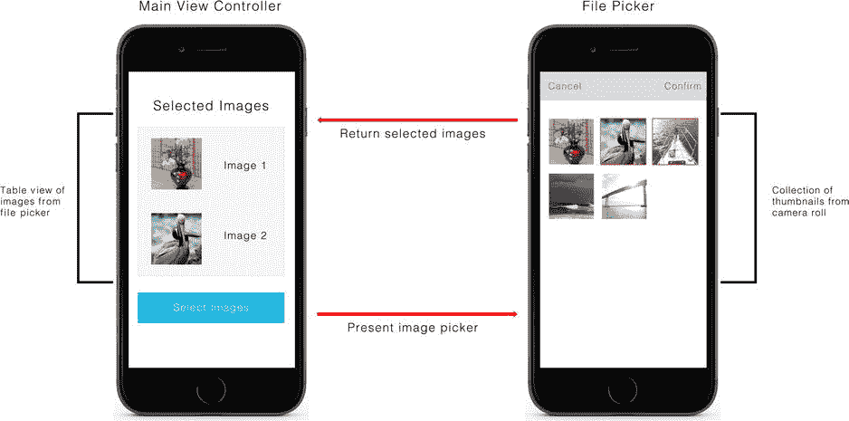

图 4-4. 自定义图片选择器的流程图和模型图

与 `UIImagePickerController` 非常相似，你需要模态呈现图片选择器，并在用户确认选择后将其关闭。由于此示例在熟悉的用户界面基础上增加了功能，因此它通过 `UICollectionView` 类以网格形式展示缩略图。应用通过高亮选中项并在其上显示一个填充的复选框来表示选择。取消选择某个项将撤销这两种状态变化。在用户确认更改或决定取消视图后，应用会销毁模态视图。选中的图片将出现在父视图控制器的可滚动表格视图中。

要实现此流程，你需要执行以下步骤，本节将涵盖这些步骤：

1. 初始化一个包含来自相机胶卷图片的数据源。
2. 在 `UICollectionView` 中展示这些图片。
3. 配置 `UICollectionView` 以允许多选。
4. 创建一个用于返回选中图片的程序化接口。

你将使用 Asset Library 框架作为数据源。由于大多数读者可能不熟悉此框架和 `UICollectionView` 类，你还会看到关于这两者的背景信息。

你可以在源代码包的 第 4 章 文件夹中找到此应用的源代码。该项目名为 MyPicker。

### 实例化资产库作为数据源

构建图片浏览器的第一步是实例化一个数据源。虽然没有 API 能让你直接“获取设备上所有的 `UIImage`”，但你可以利用 Asset Library 框架来访问“照片”应用中的所有照片和视频。

由 `ALAssetsLibrary` 类表示的资产库，提供了与“照片”应用双向的接口，用于读写照片和视频。你可以按相册、唯一 URL 或媒体类型查找资产，将资产保存到“照片”应用，或从你的应用内创建新相册。此外，与其他访问共享资源的应用一样，你可以查询你的应用是否有权限访问照片。虽然 iOS 没有全局文件系统这样的概念，但像这样的受限接口允许应用以安全、一致的方式共享数据。

要实例化一个 Asset Library，首先需要将 `AssetsLibrary.framework` 添加到项目中。与 MyCamera 项目一样，你可以通过将框架添加到项目通用设置下的“链接的框架和库”数组中，来将其添加到项目中。

添加框架后，在目标类中包含其头文件：

```objc
#import <AssetsLibrary/AssetsLibrary.h>
```

**注意** 与 `include` 关键字不同，`import` 关键字允许你通过在添加文件前检查重复项来减少代码量。

现在基础工作已就绪，你可以实例化一个 Asset Library：

```objc
ALAssetsLibrary *assetsLibrary = [[ALAssetsLibrary alloc] init];
```

就像你需要选择相册或时间线来查看“照片”应用中的照片一样，你需要指定一个*组*来通过 Asset Library 发现资产。由 `ALAssetGroup` 类表示的资产组，允许你根据一个或多个过滤器访问“照片”应用中的资产子集。资产组不仅允许你复制 `NSSet` 的某些功能（例如提供集合中的项目数量），还允许更高级的功能，并能提供诸如组的缩略图或权限状态等信息。

要检索资产组，请使用 Asset Library API `[ALAssetsLibrary enumerateGroupsWithTypes:usingBlock:failureBlock]`。你需向此 API 传递一个 `NSInteger`，它表示要包含在搜索中的过滤器；一个块，每次找到 `ALAssetGroup` 时都会调用该块；以及一个块，在发生故障时会调用该块。由于无法保证组查找的处理器或时间消耗（用户可能有数百个相册，其中许多是隐藏的），因此块语法适用于此 API。块通过为开发者提供在后台运行代码片段的方式，使应用更快，从而将主线程解放出来用于时间敏感的操作，例如用户界面元素的反馈（例如捕捉按钮按下）。

代码清单 4-24 返回代表“已存储的照片”和“我的照片流”图库中的照片的组。该示例在成功或失败时打印日志消息。

***代码清单 4-24***. 枚举资产组

```objc
NSInteger photoFilters = ALAssetsGroupPhotoStream |
                         ALAssetsGroupSavedPhotos;
```


```objc
[assetsLibrary enumerateGroupsWithTypes:photoFilters
    usingBlock:^(ALAssetsGroup *group, BOOL *stop) {
        [group enumerateAssetsUsingBlock:^(ALAsset *result,
        NSUInteger index, BOOL *stop) {
            NSLog(@"success! asset found");
        }];

} failureBlock:^(NSError *error) {
        NSLog(@"error! %@", [error description]);
    }
];
```

过滤器值代表一个掩码中的位，因此通过将它们进行 `OR` 操作，你可以组合多个过滤器。表 4-2 列出了常用的过滤器值及其含义。

表 4-2. 常用资源组过滤器

| 常量 | 资源组 |
| --- | --- |
| `ALAssetsGroupLibrary` | 资料库——设备上所有源自 iTunes 的资源 |
| `ALAssetsGroupAlbum` | 设备上的所有相簿，但不包含“我的照片流”或“共享流” |
| `ALAssetsGroupEvent` | 所有事件相簿 |
| `ALAssetsGroupFace` | 所有面孔相簿 |
| `ALAssetsGroupSavedPhotos` | 相机胶卷相簿 |
| `ALAssetsGroupPhotoStream` | 我的照片流相簿（iCloud） |
| `ALAssetsGroupAll` | 除源自 iTunes 的相簿外的所有相簿 |

现在你已经有了一组资源组，就可以实现遍历每个单独资源的逻辑了。`ALAsset` 类代表了资源。与 `ALAssetGroup` 类似，它们比你可能预期用来表示这类二进制数据的基类要智能得多。`ALAsset` 维护着与资源存在的每个版本（如原始版本和多个编辑版本）相对应的唯一内部 URL。它们还允许访问资源的派生属性（如缩略图），甚至支持保存资源的新版本。

要访问由 `ALAssetGroup` 表示的 `ALAsset` 对象，你可以使用与组发现 API 类似的 API：`[ALAssetGroup enumerateAssetsUsingBlock:]`。与组发现 API 一样，每当 API 找到一个资源并准备访问时，你定义的 block 就会被调用。简而言之，本示例将每个有效的（非 `nil`）图片结果添加到一个 `NSMutableArray` 资源数组中。稍后你将使用这个数据结构来填充集合视图。

***列表 4-25***. 枚举图片资源

```objc
self.assetsLibrary = [[ALAssetsLibrary alloc] init];
self.images = [NSMutableArray new];

NSInteger photoFilters = ALAssetsGroupPhotoStream |
                         ALAssetsGroupSavedPhotos;

[self.assetsLibrary enumerateGroupsWithTypes:photoFilters
    usingBlock:^(ALAssetsGroup *group, BOOL *stop) {
        [group enumerateAssetsUsingBlock:^(ALAsset *result, NSUInteger
                                           index, BOOL *stop) {
            if (result != nil) {
                    [self.images addObject:result];
            }
        }];
    } failureBlock:^(NSError *error) {
        NSLog(@"error! %@", [error description]);
    }
];
```

## BLOCK 快速指南

在 Objective-C 中，block 是一种语言特性，允许你指定*匿名方法*——即像方法一样工作但无需声明签名的代码片段。Block 是一种创建“一次性”方法的绝佳方式，这种方法仅从特定的代码路径调用。此外，你可以将 block 定义为方法的参数。在本书中，你将看到*完成 block* 的提及；这些是在方法调用中定义的 block，在方法完成时会立即被调用。

与方法相比，block 的语法较为突兀。Block 的签名如下：

`void (^myBlock)(NSString* string1, NSString *string2, int count);`

第一个关键字 `void` 是 block 的返回类型。`myBlock` 是 block 的名称，它前面总是有一个脱字符（`^`）。最后一对圆括号中的内容是参数类型。Block 在语法风格上更接近 C 语言，且不需要为参数添加标签。

Block 的签名指定了它的返回类型、名称和参数，就像方法一样。要定义一个 block，只需将 block 的代码放在花括号中，就像定义方法那样。编译器会将 block 视为*内联*函数，这意味着它们不会中断代码行，所以请确保在行末添加分号：

`int finalPhotoCount = ^(int count1, int count2) {`
    `return count1+count2;};`

调用带参数的 block 时，使用的语法与调用方法相同，需要指定参数类型和 block 的代码。例如，在列表 4-25 中，使用了 block 来枚举资源和组。

```objc
[group enumerateAssetsUsingBlock:^(ALAsset *result, NSUInteger index,
    BOOL *stop) {
        if (result != nil) {
           [self.images addObject:result];
        }
}];
```

Block 较为危险的一个方面是它的变量作用域与普通方法不同。你可以在 block 内创建局部变量，也可以访问 block 外部的实例变量。然而，默认情况下，block 中的所有外部变量都是*通过拷贝*传递的，这意味着你可以读取它们的内容，但不能修改它们。要声明一个可以被 block 修改的局部变量或实例变量，你需要在它的类型前添加 `__block` 关键字：

`__block NSInteger photoCount;`

对于实例变量，使用类似的模式，在属性关键字之后、类型之前添加 `__block` 关键字：

`@property (nonatomic, assign) __block NSInteger photoCount;`

使用 block 就像开一辆没有刹车的法拉利。你可以开得极快，但需要意识到你的局限性以及如何规避它们。

### 使用 UICollectionView 类来枚举资源

如果你构建了上一节中的示例，那么现在你已经有一个数组，其中包含与“存储的照片”和“我的照片流”图库中的照片相对应的一组资源。此时，你可以构建一个集合视图用户界面来展示这些项目。

*集合视图* 在 iOS 6 中引入，指的是你可能在 iBooks 应用和旧版照片应用中熟悉的基于图形的导航界面（参见图 4-5）。在集合视图中，项目通常由图形表示（如专辑封面或书籍封面），并从左到右、从上到下排列。与表视图非常相似，你需要为视图定义数据源，指定每个项目（称为*单元格*）的外观，并定义用户与项目交互时应发生的行为。与表视图不同，你无需指定每列或每行有多少个项目；`UICollectionView` 类会根据单元格大小和容器视图大小自动将项目适配到网格中。这使得传入线性数据集变得容易。同样，你可以像处理表视图那样，将数据分组到分区中。

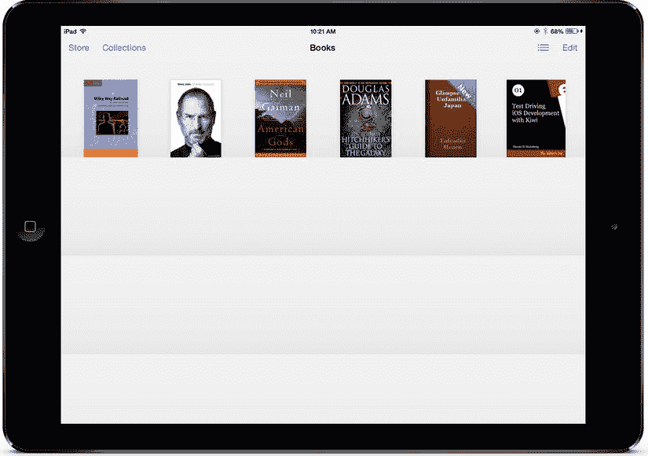

图 4-5. iBooks 中集合视图的截图

要向应用程序添加集合视图，请从 Interface Builder 的对象库中拖拽一个“集合视图控制器”（Collection View Controller）。确保你实例化了自己的 `UICollectionViewController` 子类，以便将数据源连接到视图，并实现你自己的操作处理程序。如果你正在实现 iPad 界面，请记得也在 iPad 故事板中复制这些设置。你可以在图 4-6 中找到故事板的截图。

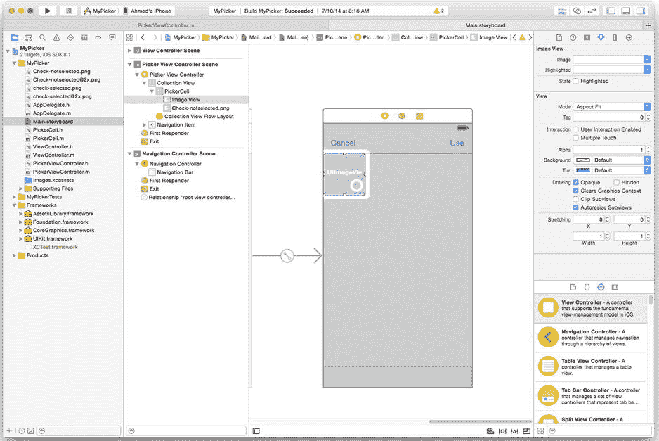

图 4-6. 在 Interface Builder 中添加集合视图


### 排版后内容

理解 `UICollectionView` 最简单的方式是将其视为更高级的 `UITableView`。与表格视图类似，集合视图需要用数据数组进行初始化，每个项目都由一个单元格表示。对于 MyPicker 项目，你需要让每个单元格包含一张图片和一个表示其状态的复选框。

`UICollectionView` 的默认 Interface Builder 模板带有一个空的 `UICollectionViewCell`。为了让它显示两张图片（一张用于内容，一张用于复选框），你需要遵循以下步骤：

1.  创建 `UICollectionViewCell` 的一个新子类。将此子类设置为单元格的父类（使用 Interface Builder 的属性检查器）。
2.  为单元格指定一个新的重用标识符（使用 Interface Builder 的属性检查器）。
3.  为单元格添加两个 `UIImage` 属性，分别代表图片和复选框。使用 Xcode 将这些属性关联到你的类。

处理 `UICollectionViewCell` 时，请确保你在 Interface Builder 中选中了该单元格；否则，你将难以修改它。如图 4-7 所示，你可以使用 Interface Builder 中的场景导航器（左侧面板）轻松选择项目。

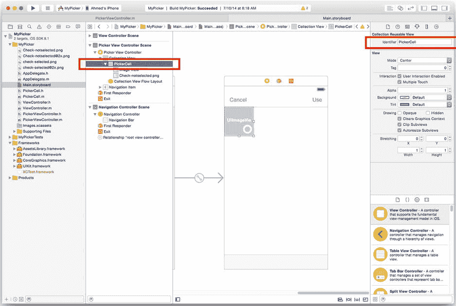

图 4-7。在 Interface Builder 中设置重用标识符

**注意** 如果在设置重用标识符时遇到问题，请确保你选中了 `UICollectionViewCell` 本身，而不是它的某个子视图。

与 `UITableView` 非常相似，你需要实现一系列委托方法才能充分发挥集合视图的功能。第一步是让集合视图知道数据源包含多少个分区，以及每个分区需要多少行。通过实现 `[UICollectionViewDataSource numberOfSectionsInCollectionView]` 协议方法来定义分区数。在该方法中，返回值是一个整型，指定分区的数量。这个简单示例从一维数组中加载资源，因此你可以返回 1 作为分区数量，如代码清单 4-26 所示。

***代码清单 4-26***。初始化集合视图的分区计数

```
- (NSInteger)numberOfSectionsInCollectionView:(UICollectionView *)collectionView
{
    return 1;
}
```

实际的配置工作发生在定义每个分区的行数上。对于这个示例，行数等于数组中的项目数量，因此你可以直接返回 `count` 属性。你可以在委托方法 `[UICollectionView numberOfItemsInSection:]` 中实现这一点，该方法接收分区编号作为输入参数，并返回行数，如代码清单 4-27 所示。

***代码清单 4-27***。初始化集合视图的行数

```
- (NSInteger)collectionView:(UICollectionView *)view numberOfItemsInSection:(NSInteger)section;
{
    return [self.images count];
}
```

根据你初始化输入数组的位置，你可能会遇到时序问题。例如，如果你在 `[UIViewController viewDidLoad]` 方法中调用 Asset Library，你会注意到 `[UICollectionView numberOfItemsInSection:]` 方法以计数 0 初始化集合视图，即使你已经找到多个项目。这是由于块编程的异步特性所致。因为查找代码在后台运行，没有任何机制阻止系统立即对仍然为空的数组执行集合视图初始化代码。

虽然这看起来像是一个相当大的错误，但无需担心，因为存在一个 API 允许你在任何时候刷新集合视图的数据源。这个 API 是 `[UICollectionView reloadData]`。它会立即再次调用 `[UICollectionView numberOfSections]` 和 `[UICollectionView numberOfItemsInSection:]` 方法，从而返回准确的初始化值。你只需在确信数组已完全填充时调用该方法即可。示例应用程序在完成遍历所有组时调用它。刷新代码块如代码清单 4-28 所示。

***代码清单 4-28***。刷新集合视图

```
[self.assetsLibrary enumerateGroupsWithTypes:photoFilters
    usingBlock:^(ALAssetsGroup *group, BOOL *stop) {
    [group enumerateAssetsUsingBlock:^(ALAsset *result, NSUInteger
                                       index, BOOL *stop) {
    if (result != nil) {
        [self.images addObject:result];
    }
}];

[self.collectionView reloadData];
} failureBlock:^(NSError *error) {
    NSLog(@"error! %@", [error description]);
}];
```

现在你可以对数据源充满信心，接下来需要确保每个 `UICollectionViewCell` 都能从资源中获取信息进行初始化。你可以使用 `[UICollectionView cellForItemAtIndexPath:]` 方法来初始化单元格，其输入参数是集合视图和每个项目对应的 `NSIndexPath` 值。遵循初始化表格视图单元格的模式，第一步是获取一个可供操作的单元格，这通过 `[UICollectionView dequeueReusableCellWithReuseIdentifier:forIndexPath:]` 方法实现。传入 `indexPath` 和在 Interface Builder 中定义的重用标识符。为了访问自定义单元格中的图片视图，请确保在获取对象后对其进行类型转换。你可以在代码清单 4-29 中找到基本的初始化代码。

***代码清单 4-29***。初始化集合视图单元格

```
- (UICollectionViewCell *)collectionView:(
       UICollectionView *)collectionView
           cellForItemAtIndexPath:(NSIndexPath *)indexPath
{
    PickerCell *cell = (PickerCell *)[collectionView
        dequeueReusableCellWithReuseIdentifier:@"PickerCell"
           forIndexPath:indexPath];

return cell;
}
```

获取单元格后，现在需要检索与之对应的资源。由于数据源是一维数组，你知道行号会与数组中每个项目的索引完全对应。因此，要检索每个资源，你只需使用 `indexPath` 的 `row` 属性调用 `[NSArray objectAtIndex:]` 即可。如果数据源是多维数组，你还可以传入分区编号。

```
ALAsset *asset = [self.images objectAtIndex:indexPath.row];
```

Cocoa Touch 中的 `indexPath` 是一个二维数组，包含分区（第一维）和行（第二维）。你需要通过访问当前分区的行内容，将 `indexPath` 转换为一维数组，这就是为什么你在很多代码中经常会看到 `indexPath.row` 的原因。

这个示例应用程序的目标是构建一个缩略图浏览器，类似于 `UIImagePickerController` 类提供的默认浏览器。虽然你可以从存储在 `ALAsset` 中的完整图像数据创建自己的缩略图，但出于速度和内存的考虑，你应该使用通过该类中的派生属性提供的缩略图。`ALAsset` 暴露了两个属性：`[ALAsset thumbnail]` 和 `[ALAsset aspectRatioThumbnail]`，它们都返回 `CGImageRef` 类型（即指向图像数据的指针）。区别在于，`thumbnail` 返回裁剪为正方形宽高比的缩略图，而 `aspectRatioThumbnail` 返回保留原始资源宽高比的缩略图。


你可以使用初始化方法 `[UIImage imageWithCGImage:]`，直接传入指针，从 `CGImageRef` 值创建 `UIImage`。之后，只需设置单元格图像视图的 `image` 属性即可。你可以在代码清单 4-30 中找到单元格的完整初始化方法。

***代码清单 4-30***. 使用缩略图初始化集合视图单元格

```
- (UICollectionViewCell *)collectionView:(
       UICollectionView *)collectionView
       cellForItemAtIndexPath:(NSIndexPath *)indexPath
{
       PickerCell *cell = (PickerCell *)[collectionView
       dequeueReusableCellWithReuseIdentifier:@"PickerCell"
           forIndexPath:indexPath];

ALAsset *asset = [self.images objectAtIndex:indexPath.row];
    cell.imageView.image = [UIImage imageWithCGImage:asset.aspectRatioThumbnail];

return cell;
}
```

### 启用多选

正如本章开头所述，构建自定义图像选择器最有力的理由之一，是为了覆盖 Apple 通过 `UIImagePickerController` 类不支持的用例，例如一次选择多张图像。通过利用 `UICollectionView` 的多选 API，你可以无需太多额外工作就能填补这一空白。

要启用多选图像功能，你需要完成三项高级任务：

- 在集合视图上启用多选
- 根据选择状态，向数据结构添加或移除项目
- 根据每个项目的选择状态更新其用户界面

要启用多选，你只需要在集合视图上启用 `allowMultipleSelection` 标志：

```
[self.collectionView setAllowsMultipleSelection:YES];
```

为了在用户关闭自定义图像选择器时返回多张图像，你需要将图像存储到一个数据结构中，该数据结构根据用户的选择而增长或缩小。你可以将项目存储在 `NSMutableArray` 中，但你需要编写自己的包装代码，以确保在添加项目之前它们不存在于结构中，这可能会降低应用程序的速度或增加其内存占用。一个更优雅的解决方案是使用 `NSMutableDictionary`，以资产索引号作为键。通过将资产直接与索引号关联，你不依赖于项目添加到字典中的顺序，并且可以使用非常快速、直接的查找。当用户选择资产时，你无需担心重复问题，因为每个键只能关联一个对象。当用户取消选择资产时，你可以根据索引号立即在字典中找到并移除该资产。

最后一步是更新用户界面，以反映选择状态的变化。实现此行为所需的两个委托方法是 `[UICollectionView didDeselectItemAtIndexPath:]` 和 `[UICollectionView didSelectItemAtIndexPath:]`。就像构建项目时一样，这些函数的核心操作是首先查找相应的单元格对象，然后修改特定值。本应用程序通过更改单元格的背景颜色以及放置在缩略图上的覆盖图像的状态来指示项目已被选中。由于应用程序尊重图像的原始宽高比，并且集合单元格是方形的，因此背景中有一些可操作的空间。通过添加覆盖图像，你还可以创建一个用户在其他支持多选项目的应用程序（例如 iOS 邮件应用）中熟悉的界面。选择和取消选择单元格的逻辑在代码清单 4-31 中进行了说明。

***代码清单 4-31***. 选择和取消选择集合视图单元格的逻辑

```
-(void)collectionView:(UICollectionView *)collectionView
        didSelectItemAtIndexPath:(NSIndexPath *)indexPath
{
    PickerCell *cell = (PickerCell *)[collectionView
        cellForItemAtIndexPath:indexPath];

cell.overlayView.image = [UIImage imageNamed:@"Check-selected"];
    cell.imageView.backgroundColor = [UIColor whiteColor];

[self.selectedImages setObject:[self.images
                                    objectAtIndex:indexPath.row]
                                    forKey:[NSNumber
                                    numberWithInteger:indexPath.row]];
}

- (void)collectionView:(UICollectionView *)collectionView
        didDeselectItemAtIndexPath:(NSIndexPath *)indexPath
{
    PickerCell *cell = (PickerCell *)[collectionView
        cellForItemAtIndexPath:indexPath];

cell.overlayView.image = [UIImage imageNamed:@"Check-notselected"];
    cell.imageView.backgroundColor = [UIColor purpleColor];

if ([self.selectedImages objectForKey:[NSNumber
                     numberWithInteger:indexPath.row]] !=  nil) {
        [self.selectedImages removeObjectForKey:[NSNumber
                     numberWithInteger:indexPath.row]];
    }

}
```

### 创建用于返回图像数据的接口

自定义图像选择器的最后一步是构建一个编程接口，用于将用户选择的图像返回给调用类。你还需要一种返回 `cancel` 消息的方法，指示用户没有选择任何图像。

回顾前面关于消息传递的讨论，你可能还记得有多种方法可以在两个类之间构建接口，从松散实现（如通知和键值观察）到非常严格的实现（包括协议和委托）。虽然基于通知的系统在这里可以工作，但这些系统通常更适用于后台任务或希望订阅服务的类，这意味着它们可以轻松地移除观察者身份并且仍然正常运行。因为你试图构建一种与本机 `UIImagePickerController` 类似的体验，所以你应该尝试使用与本机功能相似的设计模式，包括定义特定的消息并持有一个指向调用类的指针。在这种情况下，最合适的消息传递系统是委托。

要指定传递哪些消息，你必须首先定义协议。在本例中，你将传递 `didSelectImages` 消息（以及用户选择的资产列表）或 `cancel` 消息（表示用户未选择任何内容并希望关闭图像选择器）。为了让该接口的用户更轻松，此实现通过 `didSelectImages` 消息返回一个图像数组，而 `cancel` 消息不返回任何内容。你可以在代码清单 4-32 中找到协议定义的示例。

***代码清单 4-32***. 为图像选择器定义协议

```
#import <UIKit/UIKit.h>
#import <AssetsLibrary/AssetsLibrary.h>

@protocol PickerDelegate <NSObject>

-(void)didSelectImages:(NSArray *)images;
-(void)cancel;

@end

@interface PickerViewController : UICollectionViewController

@property (nonatomic, strong) NSMutableArray *images;
@property (nonatomic, strong) ALAssetsLibrary *assetsLibrary;
@property (nonatomic, strong) NSMutableDictionary *selectedImages;
@property (nonatomic, weak) id <PickerDelegate> delegate;

-(IBAction)cancel:(id)sender;
-(IBAction)done:(id)sender;

@end
```


从图像选择器类内部，在操作按钮处理程序中调用协议方法。`didSelectImages`处理程序通过遍历选择字典并返回每个索引所指示的非`nil`资源图像的表示，构建一个要传回的资产数组。对于`cancel`处理程序，你可以简单地向委托对象发送`cancel`消息。你可以在列表 4-33 中找到这些调用。

***列表 4-33***. 从图像选择器调用协议方法

```
-(IBAction)done:(id)sender
{
    NSMutableArray *imageArray = [NSMutableArray new];
    for (id key in self.selectedImages.allKeys) {
        if ([self.selectedImages objectForKey:key] != nil) {
            [imageArray addObject:[self.selectedImages
                                   objectForKey:key]];
        }
    }

[self.delegate didSelectImages:imageArray];
}

-(IBAction)cancel:(id)sender
{

[self.delegate cancel];
}
```

在调用图像选择器的父视图控制器中，当实例化图像选择器时，需要在类签名中声明将为图像选择器类使用委托，如列表 4-34 所示。

***列表 4-34***. 指定目标类实现选择器协议

```
@interface ViewController : UIViewController <PickerDelegate,
                            UITableViewDelegate, UITableViewDataSource>
```

尽管该代码将类声明为选择器协议的委托，你仍然需要对其进行初始化。

委托方法实现告诉表格视图，在收到`didSelectImages`消息后从资产数组加载缩略图，然后关闭图像选择器控制器。或者，对于取消消息，它只需关闭图像选择器控制器以返回正常的用户界面。你可以在列表 4-35 中找到选择器委托方法的示例。

***列表 4-35***. 实现选择器委托方法

```
#pragma mark - Picker Delegate methods

-(void)cancel
{
    [self dismissViewControllerAnimated:YES completion:nil];
}

-(void)didSelectImages:(NSArray *)images
{
    [self dismissViewControllerAnimated:YES completion:nil];

self.imageArray = [images copy];

[self.tableView reloadData];
}
```

从资产表示创建图像数据

现在你已经创建了一个接口来传回选中的资产，还需要一个步骤才能使其更像原生的图像选择器：它需要返回一些`UIImage`对象。要从`ALAsset`中提取原始图像数据，你需要执行以下步骤：

*   提取资产的所需版本或*表示*，到一个`ALAssetRepresentation`对象。
*   通过使用`[ALAssetRepresentation fullResolutionImage]`实例方法，保存指向该资产图像数据的指针。
*   查询`ALAsset`的元数据以确定图像的正确方向。
*   根据方向和提取的`CGImageRef`创建一个`UIImage`对象。

正如本章前面提到的，`ALAsset`类的优势之一是其不仅能够存储原始图像数据，还能存储元数据和图像的多个版本（称为*表示*）。一个表示可以涵盖不同的压缩格式或分辨率等变化。`ALAssetRepresentation`类存储表示信息，并具有实例方法，允许你查询图像指针、元数据、原始数据以及存储 URL/UTI（通用类型标识符）。

你可以通过传入所需表示的 UTI 或调用`[ALAsset defaultRepresentation]`（返回图像第一个可用的已保存表示）从`ALAsset`对象创建一个`ALAssetRepresentation`对象：

```
ALAssetRepresentation *defaultRepresentation = [asset defaultRepresentation];
```

类似地，你可以通过在表示对象上调用`[ALAssetRepresentation fullResolutionImage]`实例方法来获取指向表示图像数据的指针。返回类型是`CGImageRef`，一个指向图像数据的指针，这减小了对象大小并提高了速度（类似于`ALAsset`缩略图）。

```
CGImageRef imagePtr = [defaultRepresentation fullResolutionImage];
```

要从`CGImageRef`创建一个`UIImage`对象，使用`[UIImage imageFromCGImage:]`或`[UIImage imageFromCGImage:scale:orientation:]`实例方法。由于人们以横向或纵向模式拍照是极其常见的用例，你应该使用方向数据初始化图像以确保其正确显示。该实例方法接受一个`UIImageOrientation`标量作为输入，因此你需要查询`ALAsset`对象以获取方向信息。将默认值设置为`UIImageOrientationUp`——以防没有可用的方向信息。你可以在列表 4-36 中找到这一过程的说明。

***列表 4-36***. 查询资产方向

```
UIImageOrientation imageOrientation = UIImageOrientationUp;
NSNumber *orientation =
    [asset valueForProperty:@"ALAssetPropertyOrientation"];
if (orientation != nil) {
    imageOrientation = [orientation integerValue];
}
```

**注意** 查询`ALAssetRepresentation`的方向会返回一个`ALAssetOrientation`标量，它不能准确地表示图像是如何拍摄的。

收集了所有必要的拼图后，你现在可以创建一个图像对象：

```
UIImage *image = [UIImage imageWithCGImage:imagePtr scale:1.0f orientation:imageOrientation];
```

总结

本章提供了构建你自己的相机和图像选择器控制器的详细练习，目的是学习如何获得对照片相关 API 的更多控制，并构建你自己的用户界面来补充缺失的功能。通过使用更底层的框架，你应该对`UIImagePickerController`类的工作方式有清晰的认识。同时，希望你对图像在系统层面是如何被捕获和存储的有了更深的理解。

在相机控制器练习中，你探索了`AVFoundation`框架，以及如何利用其视频捕获能力来构建相机画面的实时预览，以及如何将帧导出为图像。你还看到了使用`CALayer`对象执行更快视图操作的一种方法，以及如何使用`AVCaptureDevice`操作相机的捕获设置。

图像选择器练习展示了`AssetsLibrary`框架如何为你提供一个方便的、更底层的 API 来查询设备上的媒体项目。你看到了如何按组和资产类型过滤资产，以及如何将结果添加到列表中。你还看到了如何在`UICollectionView`中显示这些结果，以及如何操作集合视图的设置以允许用户选择多个图像。

第二部分

音频

第 5 章

播放和录制音频文件

在本章中，你将通过构建应用程序来播放和录制音频，探索如何在你的应用中使用音频资源，这利用了 iOS 用于音视频任务的`AVFoundation`框架。与图像文件非常相似，音频以二进制数据的形式存储，并且必须解码后你的应用才能使用它。然而，一个巨大的区别是，音频文件存储为数据流，按时间索引，而不是表示一个静态图像的流。就像经常出现的情况一样，“有一个 API 可以做到这一点”，你将利用 iOS 内置的音频播放器和录音器类来构建你的应用。就像你处理图像一样，你将看到`AVFoundation`如何处理细节，让你能够专注于构建出色的用户体验，而不是实现底层音频编解码器。

播放音频文件


```markdown
iOS 中的`AVAudioPlayer`类提供了一个“无头”接口，用于在应用内播放音频文件。该类允许您控制单个或多个文件的播放（例如播放、暂停和跳转），循环音频文件，并监控当前播放项目的音频电平。您可以对本地文件（例如应用文档目录中的文件）或网络资源（例如网络音频流）使用此类。本章涵盖本地音频播放；不过，您将在第 6 章中了解网络流播放。

为了练习使用`AVAudioPlayer`类，您将构建图 5-1 所示的音乐播放器应用。

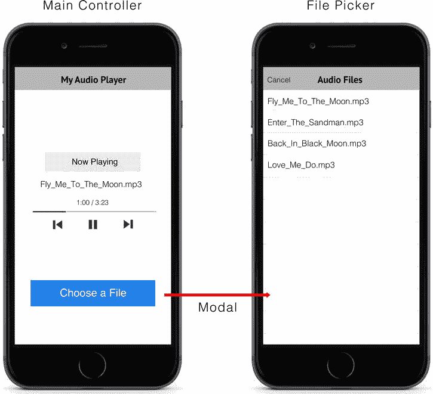

图 5-1. 简易音频播放器模型

此应用允许用户选择存储在其项目包中的音频文件并控制其播放。播放控件包括“播放/暂停”（取决于状态）、“快进”和“快退”（15 秒）。为指示状态，应用会显示播放进度和当前播放文件的名称。

文件选择通过`UITableViewController`处理。用户可以通过单击文件名来选择文件，这将会关闭文件选择器。单击“取消”按钮也会关闭文件选择器。

为实现此功能，您需要执行以下操作：

1.  向 iOS 请求音频播放权限。
2.  构建用户界面以选择要播放的音频文件。
3.  使用所选文件初始化音频播放器。
4.  构建用户界面以控制播放。

您可以在 Apress 网站（`www.apress.com`）的源代码/下载区域中找到此应用程序的所有源代码，位于`MyPlayer`项目的第 5 章文件夹中。

## 入门

如图 5-1 所示，`MyPlayer`应用程序的主要控件位于主视图控制器上。

您从熟悉的方式开始：在 Xcode 中使用“单视图应用程序”模板创建一个项目。默认情况下，Xcode 将使用`ViewController`类来表示您的主视图控制器；在`MyPlayer`项目中，此文件已重命名为`MainViewController`。您可以在 Xcode 中右键单击类名并从“重构”菜单中选择“重命名”来重命名一个类，如图 5-2 所示。

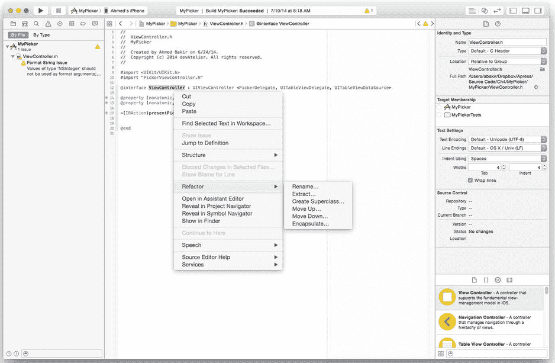

图 5-2. 如何重命名类

要实例化音频播放器，您需要在`MainViewController.h`中包含`AVAudioPlayer`类，这要求您在项目中包含`AVFoundation`框架。与第 4 章中的示例一样，您可以通过在 Xcode 中选择项目文件并滚动到“通用”选项卡底部的“链接的框架和库”窗格来向项目添加框架，如图 5-3 所示。

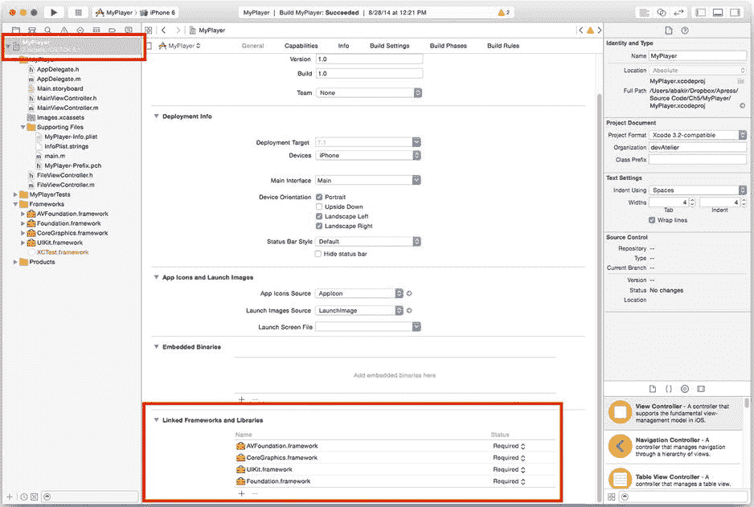

图 5-3. 向项目添加框架

在主视图控制器上，使用多个`UIButton`实例来表示“播放/暂停”、“快进”、“快退”和“选择文件”控件。添加一个`UIProgressView`作为进度条，以及`UILabel`实例用于歌曲标题和播放时间。您可以使用代码清单 5-1 中的头文件作为连接到情节提要文件的输出口的示例。

***代码清单 5-1***. `MyPlayer`主视图控制器的头文件

```
#import <UIKit/UIKit.h>
#import <AVFoundation/AVFoundation.h>
#import "FileViewController.h"

@interface MainViewController : UIViewController
    <FileControllerDelegate,AVAudioPlayerDelegate>
@property (nonatomic, strong) IBOutlet UILabel *timeLabel;
@property (nonatomic, strong) IBOutlet UILabel *titleLabel;
@property (nonatomic, strong) IBOutlet UIButton *chooseButton;
@property (nonatomic, strong) IBOutlet UIButton *playButton;
@property (nonatomic, strong) IBOutlet UIButton *skipForwardButton;
@property (nonatomic, strong) IBOutlet UIButton *skipBackwardButton;
@property (nonatomic, strong) IBOutlet UIProgressView *progressBar;
@property (nonatomic, strong) NSString *selectedFilePath;
@property (nonatomic, strong) AVAudioPlayer *audioPlayer;
@property (nonatomic, strong) NSTimer *timer;

-(IBAction)play:(id)sender;
-(IBAction)skipForward:(id)sender;
-(IBAction)skipBackward:(id)sender;

@end
```

在 Xcode 中使用“新建文件”命令，为文件选择器创建第二个视图控制器，它是`UITableViewController`的子类。在`MyPlayer`项目中，此类名为`FileViewController`。在 Interface Builder 中进行适当的连接，以将此类绑定到您的情节提要。

为了向文件选择器添加“取消”按钮，您需要将文件选择器嵌入到`UINavigationController`中。这会在视图顶部提供一个工具栏，您可以在其中添加栏按钮项。您可以通过在 Xcode 的“编辑器”菜单中选择“嵌入于”选项来轻松地向视图控制器添加导航控制器，如图 5-4 所示。

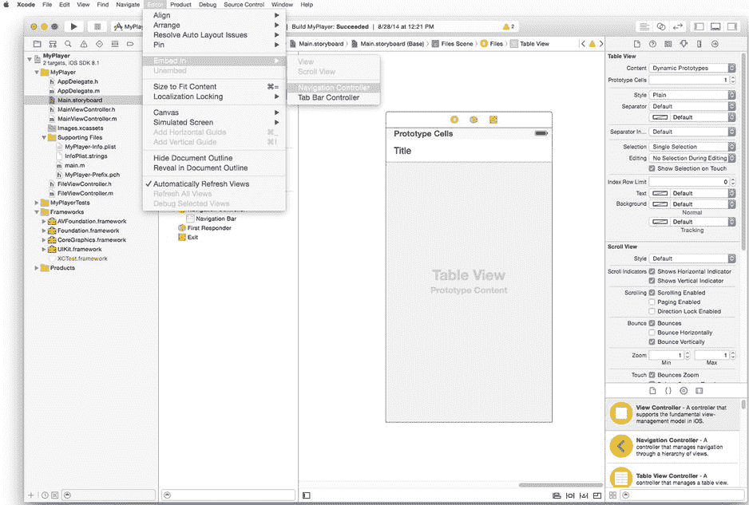

图 5-4. 向视图控制器添加导航控制器

您可以在代码清单 5-2 中找到`FileViewController`类的头文件。在您的头文件中，确保定义了一个用于传递消息的协议，以及情节提要所需的适当属性。

***代码清单 5-2***. `FileViewController`类的头文件

```
#import <UIKit/UIKit.h>

@protocol FileControllerDelegate <NSObject>
-(void)cancel;
-(void)didFinishWithFile:(NSString *)filePath;
@end

@interface FileViewController : UITableViewController
@property (nonatomic, strong) NSMutableArray *fileArray;
@property (nonatomic, strong) id <FileControllerDelegate> delegate;

-(IBAction)closeView:(id)sender;

@end
```

要完成您的情节提要，请连接所有操作和属性。确保“选择文件”按钮设置为模态呈现`FileViewController`，并确保`UITableViewController`的默认单元格具有一个重用标识符，以便您可以在代码中访问它。

您完成后的情节提要应类似于图 5-5。

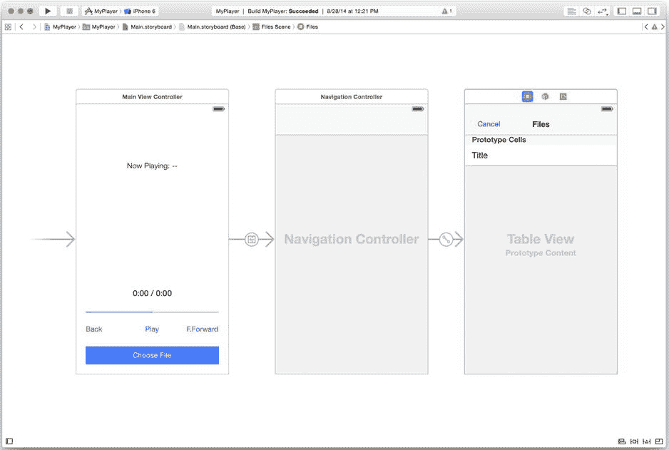

图 5-5. `MyPlayer`应用的完成后的情节提要

我对`MyPlayer`应用程序的实现仅包含一个 iPhone 用户界面。如果您正在创建通用应用程序，请确保将相同的设置应用于您适用于 iPad 的情节提要。

## 配置音频会话

与相机非常相似，您的 iOS 设备的音频功能是一种共享资源。Apple 通过*音频会话*的概念（由`AVAudioSession`表示）提供对系统音频控制器的访问。所有 iOS 应用都带有一个默认的音频会话，但在您对其进行配置之前，您的应用将无法利用全部音频功能。

配置音频会话允许您指定应用将执行的音频活动类型（例如录制和播放）、应用应如何与其他竞争音频资源的应用交互的偏好（例如，混合音轨，忽略所有其他音频源），以及处理硬件事件（例如用户拔下耳机）的方式。
```


尽管实现音频播放看起来需要大量工作，但`AVFoundation`提供了多种快捷方式，让配置音频会话变得简单，如代码清单 5-3 所示。

***代码清单 5-3***. 为播放配置音频会话

```
- (void)viewDidLoad
{
    [super viewDidLoad];
        // 加载视图后执行任何额外设置，
        // 通常来自 nib 文件。

NSError *error = nil;
    [[AVAudioSession sharedInstance]
        setCategory:AVAudioSessionCategoryPlayback
                                           error:&error];
    if (error == nil) {
        NSLog(@"音频会话初始化成功");
    } else {
        NSLog(@"初始化播放音频文件时出错：音频会话：%@",
              [error description]);
    }
}
```

在此示例中，你可以通过单例对象 `[AVAudioSession sharedInstance]` 访问应用的音频会话，如前所述，该对象会随应用自动生成。我们的应用默认被配置为所有音频会话消息的`delegate`对象。要指定你的应用播放音频，请使用系统宏 `AVAudioSessionCategoryPlayback`，这表示应用需要控制系统音频资源来播放声音。将此代码块添加到主视图控制器的 `[UIViewController viewDidLoad:]` 方法中，以指定你的应用在视图加载时想要控制音频会话。

## 使用单例

*单例* 是在应用中仅实例化一次的对象。所有操作都在一个共享对象上执行。与全局变量不同，单例是*延迟加载* 的，这意味着它在首次被调用时才被实例化。

在访问共享资源时，单例非常方便，因为它允许你创建一个管理器，通过它来传递所有操作。通过使用在整个应用程序中共享的单个管理器对象，你无需重复编写设置/拆卸代码（这些代码仅在对象初始化或销毁时调用），并且可以确保你的操作在有效对象上执行。

要声明一个单例，你可以在头文件中定义一个公共方法，方法名使用共享对象的名称。如果你希望应用委托可以作为一个单例访问，你的头文件应如下所示：

```
#import <UIKit/UIKit.h>

@interface AppDelegate : UIResponder <UIApplicationDelegate>

@property (strong, nonatomic) UIWindow *window;
+(AppDelegate*)sharedInstance;

@end
```

要实现你的延迟加载逻辑，定义一个全局变量（`static`对象）来存储你的共享对象，并通过 `sharedInstance` 方法传递所有消息。如果全局变量已初始化，它将返回指针；否则，它将初始化对象并返回指针。

```
static AppDelegate *shared;
+(AppDelegate*)sharedInstance{
    if (!shared || shared==nil) {
        shared = [[AppDelegate alloc] init];
    }
    return shared;
}
```

你可以在任何类中使用你的单例对象，方法就像使用其他任何对象一样，包含其头文件并向其传递消息：

```
#include "AppDelegate.h"

@implementation myClass

-(void)viewDidLoad {
    [[appDelegate sharedInstance] refreshSession];
}
```

尽管此示例使用了 `AVAudioSessionCategoryPlayback` 宏，但你也可以利用各种预配置的宏。表 5-1 列出了最常用的宏及其用途。

表 5-1. 常用的 `AVAudioSessionCategoryPlayback` 宏

| 宏（常量）名称 | 预期用途 |
| --- | --- |
| `AVAudioSessionCategorySoloAmbient` | 所有应用的默认音频会话配置。播放将持续进行，直到用户将设备静音或锁定屏幕。你的应用完全控制音频播放，并拒绝来自其他应用的音频事件。 |
| `AVAudioSessionCategoryAmbient` | 音频播放是可选的、但非必需的应用。播放将持续进行，直到用户将设备静音。其他应用仍然可以发送音频事件。 |
| `AVAudioSessionCategoryPlayback` | 需要音频播放才能正常工作的应用。即使用户将设备静音，播放也会继续。可以配置为允许来自其他应用的音频事件。 |
| `AVAudioSessionCategoryRecord` | 需要音频录制功能的应用。可以配置为支持后台音频录制。 |
| `AVAudioSessionCategoryPlayAndRecord` | 需要同时具备音频录制和播放功能的应用。可以配置为在后台继续运行，并接受来自其他应用的音频事件。 |

## 选择音频文件

要填充 `FileViewController`，你需要扫描应用的文档文件夹，查找 MP3 和 M4A 文件。你可以将得到的数组用作表格视图的数据源。

你可以通过调用系统文件管理器实例的 `[NSFileManager contentsOfDirectoryAtPath:]` 方法，找到并检索目录中所有文件的 `NSArray`。通过将每个文件的 `pathExtension` 分量与你正在查找的文件类型的扩展名进行比较，来确定每个文件的类型。`pathExtension` 属性是所有 `NSString` 对象上可用的派生属性。调用时，它会尝试返回字符串中紧跟句点（`.`）之后的部分。代码清单 5-4 展示了实现此行为的方法。在你的 `FileViewController` 类中的 `[self viewDidLoad]` 方法底部调用此方法。

***代码清单 5-4***. 构建音频文件列表

```
-(void)initializeFileArray
{
    NSArray *paths = NSSearchPathForDirectoriesInDomains(
                     NSDocumentDirectory,
                     NSUserDomainMask, YES);
    NSString *documentsDirectory = [paths objectAtIndex:0];
    NSError *error = nil;

NSArray *allFiles = [[NSFileManager defaultManager]
                          contentsOfDirectoryAtPath:documentsDirectory
                          error:&error];

if (error == nil) {

self.fileArray = [NSMutableArray new];

for (NSString *file in allFiles) {
            if ([[file pathExtension] isEqualToString:@"mp3"] ||
               [[file pathExtension] isEqualToString:@"m4a"]) {
                [self.fileArray addObject:file];
            }
        }

} else {
        NSLog(@"查找文件出错：%@", [error description]);
    }
}
```

你将在整个类中使用 `fileArray` 属性作为数据源，因此请记得在文件视图控制器的头文件中将其声明为实例变量。

现在你已经填充了文件数组，请实现必要的 `UITableViewDelegate` 方法，以开始将其用作表格的数据源。代码清单 5-5 展示了如何使用 `fileArray` 属性来填充表格视图数据源委托方法所需的节数和行数。

***代码清单 5-5***. 使用数组填充表格

```
- (NSInteger)numberOfSectionsInTableView:(UITableView *)tableView
{
    // 返回节数。
    return 1;
}

- (NSInteger)tableView:(UITableView *)tableView
       numberOfRowsInSection:(NSInteger)section
{
    // 返回该节中的行数。
    return [self.fileArray count];
}
```


要在每个表格视图单元格中显示文件名，可以使用 `[NSString lastPathComponent]` 派生属性，如代码清单 5-6 所示。该属性的工作方式类似于 `[NSString pathExtension]`，区别在于它提取的是字符串中最后一个正斜杠字符（`/`）之后的部分。请记得使用在 Interface Builder 中为单元格定义的复用标识符。

**代码清单 5-6.** 在表格视图单元格中显示文件名

```
- (UITableViewCell *)tableView:(UITableView *)tableView
    cellForRowAtIndexPath:(NSIndexPath *)indexPath
{
    UITableViewCell *cell = [tableView
        dequeueReusableCellWithIdentifier:@"fileCell"
        forIndexPath:indexPath];

// 配置单元格...

NSString *filePath = [self.fileArray objectAtIndex:indexPath.row];

cell.textLabel.text = [filePath lastPathComponent];

return cell;
}
```

当用户选中一个表格视图单元格时，你应该从文件数组中返回所选项的完整文件路径。这能让你的音乐播放器直接播放该文件。与之前的相机示例一样，此应用通过自定义定义的协议传回选择结果。头文件中的协议定义如代码清单 5-7 所示。

**代码清单 5-7.** FileControllerView 的协议定义

```
@protocol FileControllerDelegate <NSObject>

-(void)cancel;
-(void)didFinishWithFile:(NSString *)filePath;

@end
```

你可以使用代码清单 5-8 中所示的协议来传回文件路径。

**代码清单 5-8.** 选中表格视图单元格时传回文件路径

```
-(void)tableView:(UITableView *)tableView
    didSelectRowAtIndexPath:(NSIndexPath *)indexPath
{
    NSString *filePath = [self.fileArray objectAtIndex:indexPath.row];

[self.delegate didFinishWithFile:filePath];

}
```

定义好协议后，修改主视图控制器的头文件，声明你将实现该协议，如代码清单 5-9 所示。

**代码清单 5-9.** 主视图控制器的修改后头文件

```
#import <UIKit/UIKit.h>
#import <AVFoundation/AVFoundation.h>
#import "FileViewController.h"

@interface MainViewController : UIViewController
     <FileControllerDelegate>

@property (nonatomic, strong) IBOutlet UILabel *timeLabel;
@property (nonatomic, strong) IBOutlet UILabel *titleLabel;

@property (nonatomic, strong) IBOutlet UIButton *chooseButton;
@property (nonatomic, strong) IBOutlet UIButton *playButton;
@property (nonatomic, strong) IBOutlet UIButton *skipForwardButton;
@property (nonatomic, strong) IBOutlet UIButton *skipBackwardButton;

@property (nonatomic, strong) IBOutlet UIProgressView *progressBar;

@property (nonatomic, strong) NSString *selectedFilePath;

@end
```

代码清单 5-10 展示了如何实现代理方法：当收到 `cancel` 消息时关闭文件选择器，当收到 `didFinishWithFile:` 消息时保存选定的文件路径。

**代码清单 5-10.** 文件选择器代理方法实现

```
-(void)cancel
{
    [self dismissViewControllerAnimated:YES completion:nil];
}

-(void)didFinishWithFile:(NSString *)filePath
{
    self.selectedFilePath = filePath;
    [self dismissViewControllerAnimated:YES completion:nil];
}
```

请记得，在选择“Present File Picker”转场时，需要在 `[UIViewController prepareForSegue:]` 方法中声明主视图控制器为该协议的委托，如代码清单 5-11 所示。使用你在 Interface Builder 中创建的转场名称来选择按钮。

**代码清单 5-11.** 将主视图控制器声明为委托

```
- (void)prepareForSegue:(UIStoryboardSegue *)segue sender:(id)sender
{
    if ([[segue identifier] isEqualToString:@"showFilePicker"]) {
        FileViewController *fileViewController =
          (FileViewController *)segue.destinationViewController;
        fileViewController.delegate = self;
    }
}
```

你可能会想：“这很酷，但如何将音乐导入我的应用呢？”实际上，你可以使用 iTunes 来管理那些启用了 iTunes 文件共享的应用的数据。在 iTunes 中，选择你的设备，然后导航到“应用”标签页，即可进入文件管理器界面。如图 5-6 所示，滚动到页面底部会显示一个已启用文件共享的应用列表。选中它们即可管理其文档目录中的文件。


**图 5-6.** iTunes 文件共享界面

要配置你的应用以支持文件共享，单击项目文件来修改其设置，然后点击“Info”标签页，如图 5-7 所示。

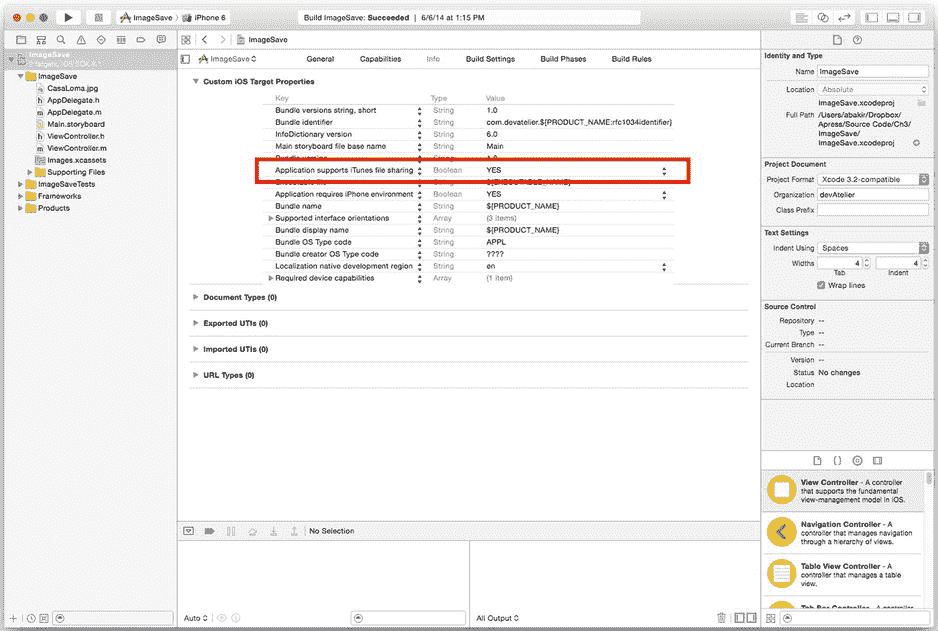

**图 5-7.** 启用 iTunes 文件共享

右键点击任意行以调出选项菜单，并选择“Add Row”。在列表中导航，选择“Application Supports iTunes File Sharing”。将值设置为“Yes”。将应用加载到设备上并打开 iTunes，你的应用现在就会出现在文件共享列表中。拖放几个文件到应用中，以便文件选择器有内容可供操作。

## 设置音频播放器

现在你的应用可以加载音频文件了，可以开始使用 `AVAudioPlayer` 类来播放文件。通过将音频播放器作为属性添加并实现其协议方法，你将音频播放器集成到类中。

由于此应用一次只播放一个音乐文件，你最好将 `AVAudioPlayer` 对象实现为主视图控制器（包含播放器的那个）的实例变量。音频播放器通过协议传回消息，因此，同样地，你也应该声明你的类将实现该协议。代码清单 5-12 展示了包含这些修改的头文件版本。

**代码清单 5-12.** 将音频播放器及其协议添加到头文件

```
#import <UIKit/UIKit.h>
#import <AVFoundation/AVFoundation.h>
#import "FileViewController.h"

@interface MainViewController : UIViewController <FileControllerDelegate,
AVAudioPlayerDelegate>

@property (nonatomic, strong) IBOutlet UILabel *timeLabel;
@property (nonatomic, strong) IBOutlet UILabel *titleLabel;

@property (nonatomic, strong) IBOutlet UIButton *chooseButton;
@property (nonatomic, strong) IBOutlet UIButton *playButton;
@property (nonatomic, strong) IBOutlet UIButton *skipForwardButton;
@property (nonatomic, strong) IBOutlet UIButton *skipBackwardButton;

@property (nonatomic, strong) IBOutlet UIProgressView *progressBar;

@property (nonatomic, strong) NSString *selectedFilePath;

@property (nonatomic, strong) AVAudioPlayer *audioPlayer;

@end
```

**注意** 如果你想编写一个音频播放可由多个视图控制的应用，最好将音频播放器实例封装在单例类中，并让所有类通过该单例访问它。


好的，作为高级文档工程师和翻译员，我将根据您提供的注意事项和示例，将以下英文文本翻译成中文。


现在您已将音频播放器对象添加到类中，需要对其进行初始化。`AVAudioPlayer`类提供了两个主要的`init`方法，分别是`[AVAudioPlayer initWithContentsOfURL:error:]`和`[AVAudioPlayer initWithData:error:]`。请记住，当文件视图控制器完成时，您将返回目标音频文件的文件路径，这意味着可以使用基于`URL`的`init`方法。播放器没有源文件就无法初始化，因此请将初始化功能放在接收来自文件视图控制器的文件的委托方法中，如列表 5-13 所示。

***列表 5-13***. 选择文件时初始化音频播放器

```
-(void)didFinishWithFile:(NSString *)filePath

self.selectedFilePath = filePath;

NSError *error = nil;
    NSURL *fileURL = [NSURL fileURLWithPath:self.selectedFilePath];

self.audioPlayer = [[AVAudioPlayer alloc]
                         initWithContentsOfURL:fileURL error:&error];
    self.audioPlayer.delegate = self;

if (error == nil) {
        NSLog(@"audio player initialized successfully");
    } else {
        NSLog(@"error initializing Playing audio files:audio player: %@",
              [error description]);
    }

//dismiss the file picker
    [self dismissViewControllerAnimated:YES completion:nil];
}
```

请注意，上述代码在将文件路径发送到音频播放器之前，将其转换为`URL`。虽然文件路径和`URL`都是文件位置的有效引用，但您需要将文件路径转换为`NSURL`数据类型以符合`API`要求。您可能想知道为什么没有使用基于`NSData`的`init`方法。要使用此方法，您需要将文件加载到内存中。虽然这对于从网络源下载的文件（您不想将文件保存到磁盘）是合适的，但它会为此应用程序增加不必要的开销。

## 构建播放界面

现在音频播放器已初始化，您可能认为应用程序已准备好开始播放文件。不幸的是，`AVAudioPlayer`是一个*无界面*类，意味着它不提供用户界面。要开始和控制音频播放，您需要通过用户操作来触发它们。

### 开始或暂停播放

音频播放器的主要控件是“播放”按钮。顾名思义，用户将使用它来启动播放。它有两个作用：如果音乐文件正在播放，您可以允许用户通过单击此按钮暂停播放。

使用音频播放器开始播放的方法是`[AVAudioPlayer play]`，它告诉音频播放器开始处理输入文件，并在播放器准备好后自动开始播放。您应该从“播放”按钮的按钮处理程序中调用此方法，如列表 5-14 所示。确保在`Interface Builder`中将此功能连接到您的故事板。

***列表 5-14***. 启动音频播放

```
-(IBAction)play:(id)sender
{
    [self.audioPlayer play];
}
```

与图像不同，音频和视频文件被系统视为数据流，需要额外的时间来建立内存缓冲区，以便可以预加载数据。缓冲区允许播放器拥有足够的数据，从而能够以默认速度（1x）播放文件。不幸的是，您无法预测填充缓冲区需要多长时间，因此`[AVAudioPlayer play]`方法是*异步的*（意味着它不会阻塞应用程序中的其他事件）。

**注意** 您可以使用`[AVAudioPlayer prepareToPlay]`方法强制音频播放器缓冲文件。此方法作为`[AVAudioPlayer play]`的一部分自动调用，但单独调用它可以提升用户体验，特别是当您不希望在用户选择文件后立即自动开始播放时。

此时，您的应用程序可以播放文件，但尚不能暂停。`[AVAudioPlayer pause:]`可以使播放器暂停。然而，在调用暂停方法之前，您应该检查音频播放器当前是否正在播放文件。您可以通过`[AVAudioPlayer isPlaying]`属性查询音频播放器的播放状态，如列表 5-15 中的示例所示。

***列表 5-15***. 使用播放状态确定按钮操作

```
-(IBAction)play:(id)sender
{
    if ([self.audioPlayer isPlaying]) {
        [self.audioPlayer pause];
        self.playButton.titleLabel.text = @"Play";
    } else {
        [self.audioPlayer play];
        self.playButton.titleLabel.text = @"Pause";
    }

}
```

除了更改操作外，代码还更改了按钮的标题。这是一个关键步骤，因为您希望在界面上向用户反映状态变化。

为了完成播放周期，您需要在播放完成时重置用户界面。您可能还记得，设置音频播放器的第一步之一是声明主视图控制器将实现`AVAudioPlayerDelegate`协议。当播放器完成播放文件时发送的委托方法是`audioPlayerDidFinishPlaying:Successfully:`。如列表 5-16 所示，您需要做的就是在收到此消息时重置“播放”按钮的文本。由于应用程序使用运行时逻辑来确定操作，因此您不需要重新连接按钮。

***列表 5-16***. 使用委托重置用户界面

```
-(void)audioPlayerDidFinishPlaying:(AVAudioPlayer *)player
                                    successfully:(BOOL)flag
{
    if (flag) {
        self.playButton.titleLabel.text = @"Play";
    }
}
```

### 快进或快退

现在您可以播放或暂停文件，接下来可以转向另一个常见的播放功能：快进或快退。与“播放”按钮一样，应用程序通过按钮处理程序控制这些功能。然而，与“播放”按钮不同，这些功能是离散的，因此每个功能应该有一个独立的`UI`元素。

您可以通过将`[AVAudioPlayer currentTime]`属性的值设置为所需的时间，强制音频播放器跳转到文件中的特定时间点。对于此应用程序，您希望能够快进或快退 15 秒。

对于快进功能，您可以通过将当前时间值加上 15 来获得所需时间，该值来自音频播放器。`NSTimeInterval`数据类型以秒为单位计数。为了防止用户跳过文件末尾（这是一个无效操作），在设置播放器的新时间值之前，您需要将新計算的目标时间与文件的时长进行比较。您可以使用`[AVAudioPlayer duration]`属性从音频播放器获取当前文件的时长。

列表 5-17 展示了快进的实现。

***列表 5-17***. 快进按钮处理程序

```
-(IBAction)skipForward:(id)sender
{
    if ([self.audioPlayer isPlaying]) {

NSTimeInterval desiredTime =
            self.audioPlayer.currentTime + 15.0f;
        if (desiredTime < self.audioPlayer.duration) {
            self.audioPlayer.currentTime = desiredTime;
        }
    }
}
```

您遵循类似的逻辑来实现快退。但是，不是检查文件的时长，而是将计算出的时间与 0（文件开始处）进行比较。如果用户在播放时间少于 15 秒时尝试快退，则将其发送到文件开头。否则，将其发送到当前位置前 15 秒的位置。列表 5-18 展示了一个示例。


#### 列表 5-18：后退按钮的处理方法

```
-(IBAction)skipBackward:(id)sender
{
    if ([self.audioPlayer isPlaying]) {
        NSTimeInterval desiredTime =
            self.audioPlayer.currentTime - 15.0f;
        if (desiredTime < 0) {
            self.audioPlayer.currentTime = 0.0f;
        } else {
            self.audioPlayer.currentTime = desiredTime;
        }
    }
}
```

**注意** 虽然你可能认为可以使用 `AVAudioPlayer` 的 `[AVAudioPlayer playAtTime:]` 方法来跳转到文件时间线上的某个特定点，但这并非该 API 支持的用例。实际上，此方法旨在延迟播放器的开始时间，例如，如果你想在音频文件开始播放前显示倒计时或执行其他操作，它会非常有用。

### 显示播放进度

作为音乐播放器应用的最后一个部分，你希望能够显示当前播放曲目的进度。遗憾的是，没有委托方法或通知会自动提供这个值。不过，你可以通过使用一个每秒触发一次的 `NSTimer` 来实现所需的结果。

`NSTimer` 类会在指定的时间延迟后或按重复周期触发一个方法。初始化定时器时，需要指定调用之间的延迟时间间隔、定时器触发时要调用的方法选择器，以及定时器是否应重复。重复定时器的一个注意事项是，它们会一直触发直到被专门*失效*（停止），因此你需要维护一个指向定时器的指针。你可以通过在主视图控制器中将定时器声明为实例变量来实现这一点：

```
@property (nonatomic, strong) NSTimer *timer;
```

你希望在用户按下“播放”按钮时启动定时器，因此将初始化代码放在播放按钮的处理方法中，如列表 5-19 所示。播放按钮由你的故事板管理，因此在状态改变时无需初始化，只需更新即可。

#### 列表 5-19：用户开始播放文件时初始化定时器

```
-(IBAction)play:(id)sender
{
    if ([self.audioPlayer isPlaying]) {
        [self.audioPlayer pause];
        self.playButton.titleLabel.text = @"Play";
        self.timer = [NSTimer timerWithTimeInterval:1.0f target:self
            selector:@selector(updateProgress) userInfo:nil
            repeats:YES];

} else {
        [self.audioPlayer play];
        self.playButton.titleLabel.text = @"Pause";
        [self.timer invalidate];
    }

}
```

你可能想知道为什么在开始播放时要重新初始化定时器对象，而在停止播放时销毁它。除了使用 `[NSTimer invalidate]` 方法销毁定时器外，没有其他方法可以暂停定时器。因此，你需要重新创建定时器来重新启动它。`audioPlayer` 对象无需重新初始化，因为它是一个实例变量，并且仅在更换文件时才重置。

此示例指定 `[self updateProgress]` 为定时器触发时调用的方法。因此，你需要在该方法中使用播放器的当前时间和歌曲持续时间来更新进度条和进度标签。与快进/快退示例类似，你可以使用 `[AVAudioPlayer currentTime]` 和 `[AVAudioPlayer duration]` 属性来获取这些值。列表 5-20 展示了主视图控制器的 `[self updateProgress]` 方法的实现。

#### 列表 5-20：更新进度条和标签的方法

```
-(void)updateProgress
{
    NSInteger durationMinutes = [self.audioPlayer duration] / 60;
    NSInteger durationSeconds = [self.audioPlayer duration] –
                                 durationMinutes * 60;

NSInteger currentTimeMinutes = [self.audioPlayer currentTime] / 60;
    NSInteger currentTimeSeconds = [self.audioPlayer currentTime] –
                                    currentTimeMinutes * 60;
    NSString *progressString =
       [NSString stringWithFormat:@"%d:%02d / %d:%02d",
       currentTimeMinutes, currentTimeSeconds, durationMinutes,
       durationSeconds];
    self.timeLabel.text = progressString;

self.progressBar.progress = [self.audioPlayer currentTime] /
                                [self.audioPlayer duration];

}
```

上述代码中有两个有趣的地方。首先，为了以人类可读的格式显示时间，它从当前时间和进度值的原始秒数输出中提取了分钟和秒。虽然显示总秒数是一种完全有效的表示进度的方式，但你的用户无法很好地利用它。其次，该方法只是将除法结果传递给进度条。`UIProgressView` 根据 `[UIProgressView progress]` 属性表示进度条的*完整*状态，该属性的值介于 `0.0` 和 `1.0` 之间。通过将当前时间除以总时长，你可以得到一个精确的进度值进行传递。

虽然一切正常运转很好，但你还要完成最后一步，以确保*下次*尝试播放文件时进度能正确更新：你需要使定时器失效。你已经看到了当用户按下“暂停”按钮时如何使定时器失效；现在，你还需要在文件播放完毕时使定时器失效。列表 5-21 展示了修改后的 `audioPlayerDidFinishPlaying:successfully` 委托方法的示例。

#### 列表 5-21：在音频播放器委托方法中使定时器失效

```
 -(void)audioPlayerDidFinishPlaying:(AVAudioPlayer *)player
                                     successfully:(BOOL)flag
{
    if (flag) {
        self.playButton.titleLabel.text = @"Play";
        [self.timer invalidate];
    }
}
```

## 录制音频文件

你可以将从播放音频中学到的许多知识应用到音频录制过程中。与播放音频类似，你需要先请求音频会话的权限才能使用音频硬件，并且可能会出现一些延迟。同样，你可以使用事件驱动的类 `AVAudioRecorder` 来开始/停止录制，它也是无界面的。

使用音频录制器的其他要求如下：

- 你需要一个能够录制的音频会话。
- 你需要在使用麦克风之前对其进行配置。
- 你需要构建一个播放界面来预览你的录音。

为了学习如何使用 `AVAudioRecorder` 类，你将构建图 5-8 中所示的音频录制器播放器应用。

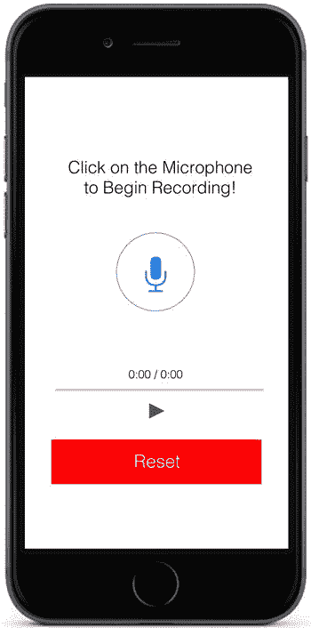

**图 5-8**。简单音频录制器的模型

此应用中唯一的输入是音频录制器，因此你可以将其实现为单视图应用程序。用户通过麦克风按钮触发录制。与音频播放器应用中的“播放”按钮类似，当录制处于活动状态时，此按钮的状态会变为“停止”。为了允许用户预览录音，你可以重用音频播放器应用中的播放界面。此应用还提供了一个“重置”按钮，以便用户在不满意录音时可以将其删除。

你可以在源代码包的 Chapter 6 文件夹中的 `MyRecorder` 项目中找到此应用的所有源代码。

### 开始使用

对于此项目，你可以将音频播放器应用的大部分工作作为基础进行复用。主要新增内容包括：

- 向主视图控制器添加音频录制器对象
- 添加用于录制的控件
- 添加额外的逻辑以支持从音频录制器播放。


以音频播放器的头文件为参考，你可以将录音器和新按钮添加到主视图控制器中。代码清单 5-22 展示了一个示例。

***代码清单 5-22***. 音频录音器的头文件

```
#import <UIKit/UIKit.h>
#import <AVFoundation/AVFoundation.h>

@interface MainViewController : UIViewController
    <AVAudioPlayerDelegate>

@property (nonatomic, strong) IBOutlet UILabel *timeLabel;

@property (nonatomic, strong) IBOutlet UIButton *recordButton;
@property (nonatomic, strong) IBOutlet UIButton *playButton;
@property (nonatomic, strong) IBOutlet UIButton *resetButton;

@property (nonatomic, strong) IBOutlet UIProgressView *progressBar;

@property (nonatomic, strong) AVAudioPlayer *audioPlayer;
@property (nonatomic, strong) AVAudioRecorder *audioRecorder;

@property (nonatomic, strong) NSTimer *timer;

-(IBAction)record:(id)sender;
-(IBAction)play:(id)sender;
-(IBAction)reset:(id)sender;

@end
```

与 `AVAudioPlayer` 类一样，`AVAudioRecorder` 也需要 `AVFoundation` 框架才能编译。按照你在音频播放器应用中所用的相同流程，将框架添加到你的项目中。

定义好属性和方法后，设计你的故事板，并使用 Interface Builder 连接操作。结果应如图 5-9 中的截图所示。

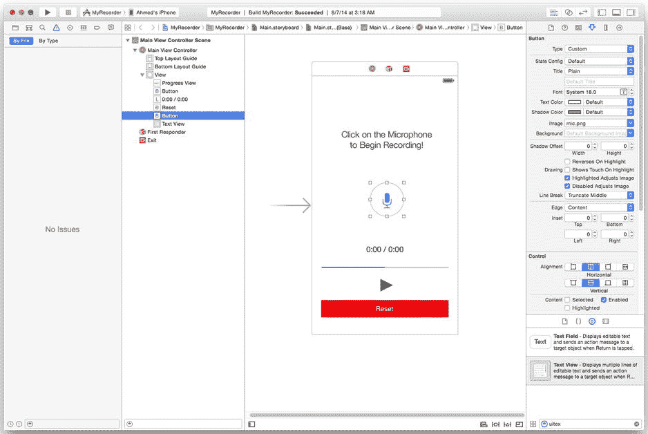

图 5-9. 简易音频录音器的故事板

## 配置音频会话

就像你在音频播放器中所做的那样，在使用音频录音器之前，你需要初始化音频会话。由于你的应用将同时需要播放和录音功能，请使用 `AVAudioSessionCategoryPlayAndRecord` 宏来配置音频会话。

你需要在用户按下录音按钮时立即准备音频会话，因此在按钮处理程序中配置会话，如代码清单 5-23 所示。

***代码清单 5-23***. 为录音初始化音频会话

```
-(IBAction)record:(id)sender
{
    NSError *error;

    AVAudioSession *audioSession = [AVAudioSession sharedInstance];
    [audioSession setCategory:AVAudioSessionCategoryPlayAndRecord
                       error:&error];
}
```

## 设置音频录音器

要设置音频录音器，请使用 `[AVAudioRecorder initWithURL:settings:error:]` 实例方法。与音频播放器一样，它需要一个 URL。不过，录音器关心的 URL 是录音的*目标路径*。与音频会话类似，你希望在用户按下录音按钮时初始化录音器。录音按钮处理程序的一个修改版本（包含录音器初始化逻辑）在代码清单 5-24 中提供。

***代码清单 5-24***. 初始化音频录音器

```
-(IBAction)record:(id)sender
{
    NSError *error;

    AVAudioSession *audioSession = [AVAudioSession sharedInstance];
    [audioSession setCategory:AVAudioSessionCategoryPlayAndRecord
                       error:&error];

    if (error == nil) {

        NSArray *paths =
            NSSearchPathForDirectoriesInDomains(NSDocumentDirectory,
            NSUserDomainMask, YES);
        NSString *documentsDirectory = [paths objectAtIndex:0];

        NSString *filePath = [documentsDirectory
           stringByAppendingPathComponent:@"recording.m4a"];
        NSURL *fileURL = [NSURL fileURLWithPath:filePath];

        NSMutableDictionary *settingsDict = [NSMutableDictionary new];
        [settingsDict setObject:[NSNumber numberWithInt:44100.0]
                                 forKey:AVSampleRateKey];
        [settingsDict setObject:[NSNumber numberWithInt:2]
                                 forKey:AVNumberOfChannelsKey];
        [settingsDict setObject:[NSNumber
                                 numberWithInt:AVAudioQualityMedium]
           forKey:AVEncoderAudioQualityKey];
        [settingsDict setObject:[NSNumber numberWithInt:16]
                                 forKey:AVEncoderBitRateKey];

        self.audioRecorder = [[AVAudioRecorder alloc]
                               initWithURL:fileURL
                               settings:settingsDict error:&error];

        if (error == nil) {

            NSLog(@"audio recorder initialized successfully!");

        } else {
            NSLog(@"error initializing audio recorder: %@",
                  [error description]);
        }

    } else {
        NSLog(@"error initializing Playing audio files:audio session: %@",
              [error description]);
    }
}
```

与音频播放器一样，在此应用中，你将使用文档目录作为用户录音的目标路径。你可以通过将文件名附加到文档目录来创建文件的完整路径。如果 URL 指定的文件不存在，音频录音器会创建一个新文件；如果文件已存在，则会覆盖现有文件。

你可能还会对 `settings` 参数感到好奇。这是一个键/值对字典，用于配置硬件的采集设置。前面的示例将麦克风配置为以中等质量采集 16 位立体声音频。这是一个不错的、中规中矩的配置，录音效果会比电话通话更好，但又不会有完整未压缩音频录音的数据开销。

## 构建录音界面

与 `AVAudioPlayer` 类一样，`AVAudioRecorder` 类也是无界面的，因此你必须实现自己的用户界面来控制录音过程。对于此应用，你需要添加特定于录音功能的控件：开始和停止录音、保存文件以及删除录音。除少数例外情况外，你可以复用音频播放器应用中的播放界面来预览录音。

### 开始或停止录音

你可以使用 `[AVAudioRecorder record]` 方法开始录制音频文件。同样，`[AVAudioRecorder stop]` 方法用于停止录音。与音频播放器应用一样，你使用单个按钮来切换录音状态。遵循你使用音频 API 时的相同模式，你通过使用 `[AVAudioRecorder isRecording]` 属性查询录音器对象的录音状态。代码清单 5-25 展示了实现此流程的录音按钮处理程序的修改版本。

***代码清单 5-25***. 开始或停止音频录音器

```
-(IBAction)record:(id)sender
{
    NSError *error;

    AVAudioSession *audioSession = [AVAudioSession sharedInstance];
    [audioSession setCategory:AVAudioSessionCategoryPlayAndRecord
                       error:&error];

    if (error == nil) {

        NSArray *paths =
            NSSearchPathForDirectoriesInDomains(NSDocumentDirectory,
            NSUserDomainMask, YES);
        NSString *documentsDirectory = [paths objectAtIndex:0];

        NSString *filePath = [documentsDirectory
                              stringByAppendingPathComponent:@"recording.m4a"];

        NSURL *fileURL = [NSURL fileURLWithPath:filePath];
```


```objc
NSMutableDictionary *settingsDict = [NSMutableDictionary new];
[settingsDict setObject:[NSNumber numberWithInt:44100.0]
                 forKey:AVSampleRateKey];
[settingsDict setObject:[NSNumber numberWithInt:2]
                 forKey:AVNumberOfChannelsKey];
[settingsDict setObject:[NSNumber
                         numberWithInt:AVAudioQualityMedium]
                 forKey:AVEncoderAudioQualityKey];
[settingsDict setObject:[NSNumber numberWithInt:16]
                 forKey:AVEncoderBitRateKey];

self.audioRecorder = [[AVAudioRecorder alloc]
                      initWithURL:fileURL
                      settings:settingsDict
                      error:&error];

if (error == nil) {
    if ([self.audioRecorder isRecording]) {
        [self.audioRecorder record];
        self.recordButton.titleLabel.text = @"停止";
    } else {
        [self.audioRecorder stop];
        self.recordButton.titleLabel.text = @"录制";
    }
} else {
    NSLog(@"error initializing audio recorder: %@",
          [error description]);
}
```

与音频播放器一样，请记住根据录制状态更新按钮标签。

## 播放录制内容

音频录制器对象的初始化参数之一是录制文件的目标路径。音频播放器的初始化参数之一则是用作音频源文件的路径。这一巧合使得预览音频文件变得非常简单：只需将录制文件的路径传递给音频播放器即可，你可以在"播放"按钮的处理程序中实现此功能，如代码清单 5-26 所示。

***代码清单 5-26***. 预览音频录制

```objc
-(IBAction)play:(id)sender
{
    NSError *error = nil;

    if ([self.audioRecorder isRecording]) {
        [self.audioRecorder stop];
    }

    if ([self.audioPlayer isPlaying]) {
        [self.audioPlayer stop];
        self.playButton.titleLabel.text = @"播放";
    } else {
        self.audioPlayer = [[AVAudioPlayer alloc]
                            initWithContentsOfURL:[self.audioRecorder url]
                            error:&error];

        if (error == nil) {
            [self.audioPlayer play];
            self.playButton.titleLabel.text = @"停止";
        } else {
            NSLog(@"error initializing Playing audio files:audio player: %@",
                  [error description]);
        }
    }
}
```

请注意，这里无需将录制文件的路径存储在变量中，可以直接通过录制对象的 `[AVAudioRecorder url]` 属性获取。本示例中还有一个注意事项：它会在播放文件之前检查录制状态。在尝试播放文件之前，必须先停止录制，否则会产生反馈回路（无尽回声），导致录制内容失效。

## 保存录制内容

无需额外操作即可保存录制内容。`AVAudioRecorder` 会在用户停止录制时，自动关闭文件缓冲区并将录制内容保存到磁盘。

你需要处理的一个主要用例是用户期望录制多个音频文件。可以通过 `NSFileManager` 类来解决此问题。为防止每次用户停止录制时录制的文件被覆盖，可以调用 `[NSFileManager fileExistsAtPath:]` 实例方法。要创建唯一的文件名，请在录制前检查以确保目标文件不存在。如果文件已存在，则在文件名末尾添加唯一标识符，例如递增计数器。代码清单 5-27 展示了"录制"按钮处理程序的修改版本，它在初始化录制器对象之前添加了此逻辑。

***代码清单 5-27***. 创建唯一文件名

```objc
-(IBAction)record:(id)sender
{
    NSError *error;

    AVAudioSession *audioSession = [AVAudioSession sharedInstance];
    [audioSession setCategory:AVAudioSessionCategoryPlayAndRecord
                       error:&error];

    if (error == nil) {
        NSArray *paths =
            NSSearchPathForDirectoriesInDomains(NSDocumentDirectory,
                                                NSUserDomainMask, YES);
        NSString *documentsDirectory = [paths objectAtIndex:0];

        NSString *filePath = [documentsDirectory
            stringByAppendingPathComponent:@"recording.m4a"];
        NSInteger count = 0;

        while ([[NSFileManager defaultManager]
                 fileExistsAtPath:filePath]) {
            NSString *fileName = [NSString
                stringWithFormat:@"recording-%d", count];
            filePath = [documentsDirectory
                        stringByAppendingPathComponent:fileName];
            count++;
        }

        NSURL *fileURL = [NSURL fileURLWithPath:filePath];

        NSMutableDictionary *settingsDict = [NSMutableDictionary new];
        [settingsDict setObject:[NSNumber numberWithInt:44100.0]
                         forKey:AVSampleRateKey];
        [settingsDict setObject:[NSNumber numberWithInt:2]
                         forKey:AVNumberOfChannelsKey];
        [settingsDict setObject:[NSNumber
                                 numberWithInt:AVAudioQualityMedium]
                         forKey:AVEncoderAudioQualityKey];
        [settingsDict setObject:[NSNumber numberWithInt:16]
                         forKey:AVEncoderBitRateKey];

        self.audioRecorder = [[AVAudioRecorder alloc]
                              initWithURL:fileURL
                              settings:settingsDict
                              error:&error];

        if (error == nil) {
            if ([self.audioRecorder isRecording]) {
                [self.audioRecorder record];
                self.recordButton.titleLabel.text = @"停止";
            } else {
                [self.audioRecorder stop];
                self.recordButton.titleLabel.text = @"录制";
            }
        } else {
            NSLog(@"error initializing audio recorder: %@",
                  [error description]);
        }
    } else {
        NSLog(@"error initializing Playing audio files:audio session: %@",
              [error description]);
    }
}
```

**注意**：更改录制文件路径的唯一方法是创建新的录制器对象。请务必在你的应用中通过提醒或指示旧录制已完成等方式，将这一点告知用户。

## 删除录制内容

有时，用户可能对某段录制内容非常不满意，想要直接删除。要删除正在进行的录制，请使用 `[AVAudioRecorder deleteRecording]` 实例方法，如代码清单 5-28 所示。此方法会删除你初始化录制器对象时所使用的文件。与其他录制事件一样，在尝试删除文件之前，请确保先停止录制器。

***代码清单 5-28***. 删除音频录制

```objc
-(IBAction)delete:(id)sender
{
    if ([self.audioRecorder isRecording]) {
        [self.audioRecorder stop];
    }

    [self.audioRecorder deleteRecording];
}
```

## 本章小结

在本章中，你学习了如何使用 `AVAudioPlayer` 和 `AVAudioRecorder` 类在应用中播放和录制音频。你还了解到，与访问相机时一样，这两个类都需要你使用 `AVAudioSession` 类作为系统共享资源的守门人。由于启动会话具有不确定性，你看到了如何实现一个基于事件的流程来处理播放器和录制器的消息。请记住，这两个类都是"无头"的，因此你必须自行实现用户界面——不过这很简单。最后请注意，在正确配置用于录制的会话后，驱动音频播放器和录制器的概念存在大量重叠。

