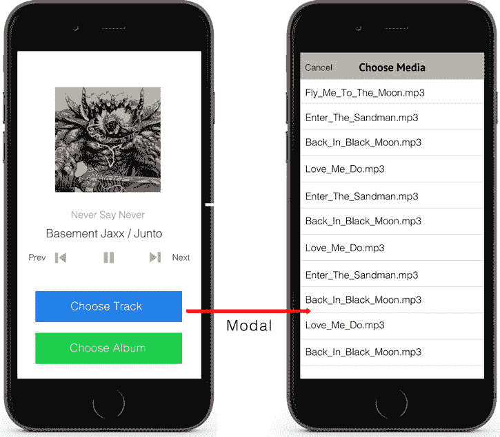
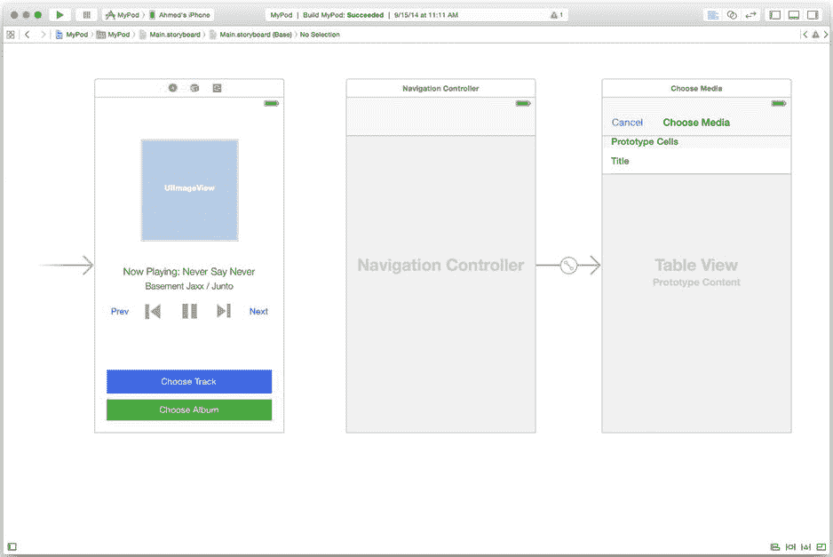
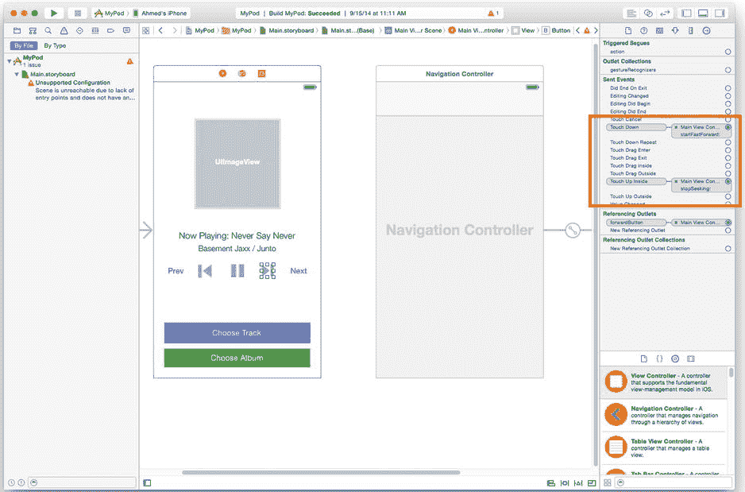
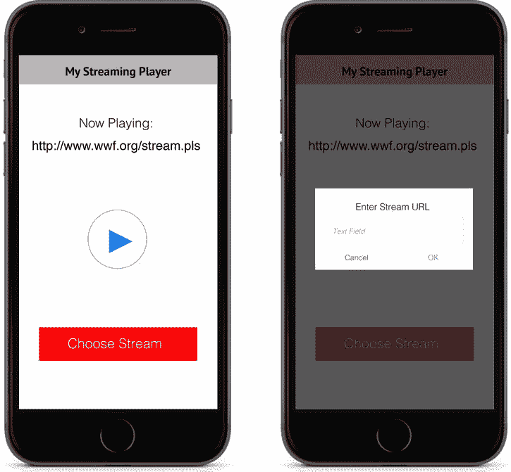
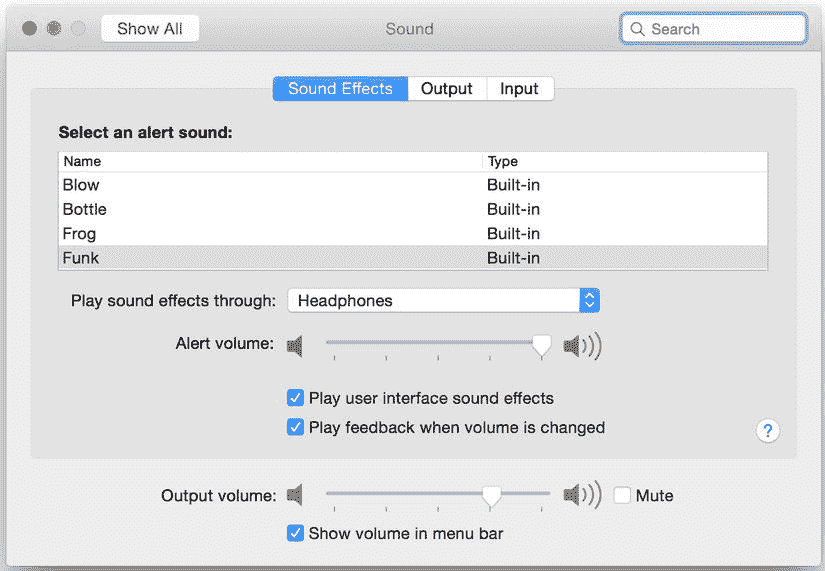
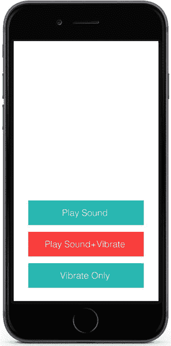

# 第 6 章：使用外部音频源


在本章中，你将了解如何使用外部源在应用中播放更多类型的音频。通过扩展你在第 5 章中学到的音频基础知识，本章将介绍如何播放来自 iTunes 和流媒体源的音乐，以及在应用中播放事件声音（当事件发生时触发的短音效，例如按下按钮）。在实现这些新的音频源时，你将看到如何重用在播放简单音频文件时首次遇到的设计模式（例如请求共享资源、事件驱动消息处理以及实现自定义用户界面），并将其应用到其他类中，以及如何为这些类注入额外的逻辑，使你的应用能够播放多种源类型。

本章的主要部分（关于 iTunes、流媒体音频和事件声音）由示例项目支撑，你可以在本书提供的源代码包的`Chapter 6`文件夹中找到这些项目。（请参见 Apress 网站的 Source Code/Download 区域，`www.apress.com`）。

## 从 iTunes 导入音乐

在第 5 章中，你学习了如何在应用中使用音频文件。但是，你必须导入所有想要使用的音频文件，要么将它们与应用捆绑在一起，要么通过 iTunes 文件共享。幸运的是，Apple 通过`MPMusicPlayerController`类提供了对用户设备上 iPod 音乐库的访问权限。当你希望用户能够在应用中播放他们自己的音乐，或者希望应用为用户当前加载的播放列表提供控制时，这非常有用。

`MPMediaPlayerController`中的*MP*来源于它所基于的框架：`MediaPlayer`框架。`MediaPlayer`框架是专门为媒体播放而构建的，使其能够处理更复杂的任务，例如播放视频、解码来自播客和有声读物的书签信息，以及访问 iPod 应用。`MediaPlayer`框架将在后续章节中发挥关键作用，你将使用它来播放视频。

与你之前用来播放声音文件的`AVAudioPlayer`类类似，`MPMusicPlayerController`类允许你在应用中构建一个自定义媒体播放器，包含播放控制方法和查询播放状态的方法。其中一些控件你已经很熟悉了，例如播放、暂停和快进/快退，以及模拟 iPod 应用行为的新控件，例如切换播放列表的随机播放模式。不幸的是，`MPMusicPlayerController`也是一个无头类，这意味着你必须实现自己的用户界面。此外，作为一个设计用于与 iPod 音乐库交互的类，你只能用它播放 iTunes 媒体。你可以通过继续维护一个用于播放其他音频文件的`AVAudioPlayer`对象来规避这个限制。

在本节中，你将学习如何使用`MPMediaPlayerController`类在应用中播放 iPod 音乐库中的音乐，方法是构建如图 6-1 所示的音乐播放器应用。你可以在本书源代码包的`Chapter 6`文件夹中找到这个应用。该项目名为`MyPod`。



*图 6-1. MyPod 项目原型图*

`MyPod`应用允许用户通过点击主视图控制器底部的按钮来选择要播放的歌曲或专辑。用户可以使用表视图控制器在项目之间导航。当用户选择了一首歌曲或专辑后，应用会提供当前播放歌曲的播放控制以及当前播放列表的导航控制。

`MyPod`应用的目标是向你展示实现基于`MPMusicPlayerController`的音乐播放器的关键概念，具体如下：

*   初始化音乐播放器
*   指定媒体查询（你可以将其视为播放列表）
*   构建播放界面
*   显示曲目信息（元数据）

## 开始

与本教程中的其他项目一样，你首先创建一个基于“单视图应用程序”模板的项目。使用图 6-1 中的原型图来帮助你选择要添加到故事板中的用户界面元素。务必添加一个表视图控制器，以便用户可以选择音乐。你不需要通过转场链接两个视图控制器，因为你将使用按钮处理程序来管理页面切换。完成后的故事板应类似于图 6-2 中的截图。



*图 6-2. MyPod 项目完成的故事板*

`MainViewController`类代表此应用的主视图。在实现该类之前，请确保已将`MediaPlayer`框架添加到项目中。在头文件（`MainViewController.h`）的顶部，引入该框架：

```objc
#import <MediaPlayer/MediaPlayer.h>
```

列表 6-1 显示了一个可用于实现`MainViewController`类的头文件。和往常一样，使用这些属性将你的故事板链接到该类。

***列表 6-1. MainViewController 类的头文件***

```objc
#import <UIKit/UIKit.h>
#import <MediaPlayer/MediaPlayer.h>
#import "MediaTableViewController.h"

@interface MainViewController : UIViewController

@property (nonatomic, strong) MPMusicPlayerController *musicPlayer;

@property (nonatomic, strong) IBOutlet UIButton *playButton;
@property (nonatomic, strong) IBOutlet UIButton *rewindButton;
@property (nonatomic, strong) IBOutlet UIButton *forwardButton;
@property (nonatomic, strong) IBOutlet UIButton *prevButton;
@property (nonatomic, strong) IBOutlet UIButton *nextButton;

@property (nonatomic, strong) IBOutlet UIButton *chooseTrackButton;
@property (nonatomic, strong) IBOutlet UIButton *chooseAlbumButton;

@property (nonatomic, strong) IBOutlet UILabel *titleLabel;
@property (nonatomic, strong) IBOutlet UILabel *albumLabel;
@property (nonatomic, strong) IBOutlet UIImageView *albumImageView;

-(IBAction)toggleAudio:(id)sender;
-(IBAction)startFastForward:(id)sender;
-(IBAction)startRewind:(id)sender;
-(IBAction)stopSeeking:(id)sender;
-(IBAction)chooseTrackButton:(id)sender;
-(IBAction)chooseAlbumButton:(id)sender;
@end
```

对于此应用，你需要从多个函数中访问`MPMediaPlayerController`对象，因此请确保像示例中所示将其定义为实例变量。

### 初始化音乐播放器

与硬件摄像头或麦克风类似，iPod 音乐库是一个共享资源。`MPMusicPlayerController`类通过允许你将音乐播放器实现为“应用音乐播放器”或“iPod 音乐播放器”来处理此限制。*应用音乐播放器*可以从 iPod 音乐播放器中拉取媒体项目，但不会对 iPod 应用的状态产生任何影响。*iPod 音乐播放器*是应用内的一个媒体播放器，它更像是一个 iPod 应用的遥控器，而不是一个独立的音乐播放器。你所有的播放设置更改和媒体选择都会影响 iPod 应用。这对于你想让用户在应用中控制或更改他们的“*现正播放*”播放列表的应用来说非常合适。

你可以通过为要实现的音乐播放器类型调用相应的类方法来实例化音乐播放器：

```objc
self.musicPlayer = [MPMusicPlayerController applicationMusicPlayer];
```


`MyPod`应用将其音乐播放器实现为应用程序音乐播放器。要实现 iPod 音乐播放器，请调用`[MPMusicPlayerController iPodMusicPlayer]`类方法。为了正确初始化对象，请将此调用放在类的`[self viewDidLoad]`方法中，如清单 6-2 所示。

***清单 6-2***. 初始化音乐播放器

```
- (void)viewDidLoad
{
    [super viewDidLoad];
        // Do any additional setup after loading the view,
        // typically from a nib.

self.musicPlayer = [MPMusicPlayerController applicationMusicPlayer];
}
```

## 指定媒体队列（播放列表）

在使用`MPMusicPlayerController`类开始播放音乐之前，你需要指定一个音乐播放器应播放的媒体项队列。你可以将媒体队列视为一个播放列表；它是一个按先进先出顺序播放的项列表（添加到队列的第一个项将首先播放）。

默认情况下，初始化一个新的`MPMediaQuery`项（`[[MPMediaQuery alloc] init]`）将返回 iPod 媒体库中所有项的未排序列表。为了使媒体队列有用，你应该尝试指定以下内容：

-   要按之过滤结果的项类型（例如，歌曲、播放列表、专辑或播客）
-   如何对结果进行分组（例如，按歌曲标题、专辑名称或艺术家）
-   用于匹配特定要求的附加过滤器（例如，仅匹配某个艺术家）

使用这些条件，你可以构建如下查询：查找所有艺术家为 Pink Floyd 的歌曲，按歌曲标题排序。

你可以通过使用`MPMediaQuery`类方法之一初始化查询对象，来快速为媒体查询指定媒体类型和分组顺序。对于 Pink Floyd 的例子，你可以使用`[MPMediaQuery songsQuery]`类方法，而不是默认构造器。

```
MPMediaQuery *pinkFloydQuery = [MPMediaQuery songsQuery];
```

你可以在表 6-1 中找到一些最流行的`MPMediaQuery`类方法及其结果查询的表格。

表 6-1. 流行的 `MPMediaQuery` 类方法

| 方法名 | 结果查询 |
| --- | --- |
| `[MPMediaQuery albumsQuery]` | 返回音乐项（歌曲）列表，按专辑标题排序 |
| `[MPMediaQuery artistsQuery]` | 返回音乐项（歌曲）列表，按艺术家名称排序 |
| `[MPMediaQuery compilationsQuery]` | 返回合辑项（专辑）列表，按专辑标题排序 |
| `[MPMediaQuery playlistsQuery]` | 返回播放列表项列表，按播放列表标题排序 |
| `[MPMediaQuery songsQuery]` | 返回音乐项（歌曲）列表，按歌曲标题排序 |

你可以通过为`groupingType`属性指定一个值来手动更改媒体查询的分组类型。你可以在表 6-2 中找到流行的分组类型表格。

表 6-2. 流行的 `MPMediaGrouping` 类型

| 键值 | 行为 |
| --- | --- |
| `MPMediaGroupingTitle` | 按专辑标题分组和排序音乐项 |
| `MPMediaGroupingArtist` | 按艺术家名称分组和排序音乐项 |
| `MPMediaGroupingAlbum` | 按专辑标题和曲目号分组和排序音乐项 |
| `MPMediaGroupingGenre` | 按流派分组和排序项 |
| `MPMediaGroupingPlaylist` | 按播放列表标题分组和排序集合 |

要过滤结果以匹配特定要求（例如，艺术家 = Pink Floyd），你将需要使用`MPMediaPropertyPredicate`。要构建媒体属性谓词，你需要指定三个参数：

-   你试图匹配的属性（例如，艺术家）
-   匹配值（例如，Pink Floyd）
-   比较类型（`contains`或`equalTo`）

对于 Pink Floyd 的例子，谓词如下所示：

```
MPMediaPropertyPredicate *artistPredicate = [MPMediaPropertyPredicate
    predicateWithValue:@"PinkFloyd"
    forProperty:MPMediaItemPropertyArtist
    comparisonType:MPMediaPredicateComparisonEqualTo];
```

构建谓词后，使用[`MPMediaQuery addFilterPredicate:]`实例方法将其添加到查询中：

```
[pinkFloydQuery addFilterPredicate:artistPredicate];
```

**注意** 一个查询可以有多个谓词——但要确保它们之间不冲突。

使用`[MPMusicPlayerController setQueueWithQuery:]`方法将你的查询加载到媒体播放器中。清单 6-3 展示了一个生成 Pink Floyd 查询并为共享音乐播放器对象设置媒体队列的函数。

***清单 6-3***. 设置媒体队列

```
MPMediaQuery *pinkFloydQuery = [MPMediaQuery songsQuery];
MPMediaPropertyPredicate *artistPredicate =
    [MPMediaPropertyPredicate predicateWithValue:@"Pink Floyd"
    forProperty:MPMediaItemPropertyArtist
    comparisonType:MPMediaPredicateComparisonEqualTo];
[pinkFloydQuery addFilterPredicate:artistPredicate];
[self.musicPlayer setQueueWithQuery:pinkFloydQuery];
```

对于`MyPod`项目，你需要在选择器表视图通过委托方法返回后设置查询。

## 创建项目选择界面

你现在将使用媒体查询来为`MyPod`应用构建项目选择界面。目标是构建一个可重用的类，用于选择歌曲、专辑或其他媒体类型。在媒体查询的上下文中，你将使用此类来确定查询的谓词过滤器（例如，歌曲标题）。你将为此任务使用两个媒体查询：一个用于生成所有歌曲（或专辑）的列表，另一个用于将最终结果传回给音乐播放器。

由于目标是构建一个可重用的类，你将希望使你的接口尽可能通用，包括输入和输出。清单 6-4 显示了选择界面的示例头文件，在示例项目中由`MediaTableViewController`类表示。

***清单 6-4***. `MediaTableViewController`类的头文件

```
#import <UIKit/UIKit.h>

@protocol MediaTableDelegate <NSObject>

-(void)didFinishWithItem:(NSString *)item andType:(NSString *)type;
-(void)didCancel;

@end

@interface MediaTableViewController : UITableViewController

@property (nonatomic, strong) NSArray *itemsArray;
@property (nonatomic, strong) NSString *mediaType;

-(id)initWithArray:(NSArray *)array withType:(NString *)type;

@end
```

请注意，初始化方法接受一个`NSArray`作为输入。这很方便，因为媒体查询返回一个结果数组，你可以轻松地从数组初始化表视图。还要注意用于返回结果的协议，该协议使用`NSString`来表示选定的项。同样，这是一个合适的选择，因为你想要构建一个返回谓词比较字符串的类。因为希望能够重用此类，请注意媒体类型是参数之一。以这种方式编写代码允许你在实现协议的类中处理结果。

首先创建按钮处理程序，当用户按下“选择曲目”按钮时显示`MediaTableViewController`。关键任务是创建一个可以用作数据源的媒体查询，并呈现表视图控制器。因为你正在查找歌曲，所以使用`[MPMediaQuery songsQuery]`类方法创建你的查询。清单 6-5 显示了此方法的实现。你将此按钮处理程序放在你的主视图控制器中。

***清单 6-5***. “选择曲目”按钮的按钮处理程序

```
-(IBAction)chooseTrackButton:(id)sender
{
    NSMutableArray *items = [NSMutableArray new];
```


```objc
MPMediaQuery *query = [MPMediaQuery songsQuery];

for (MPMediaItem *item in query.items) {
    NSString *trackName = [item valueForProperty:MPMediaItemPropertyTitle];
    [items addObject:trackName];
}

MediaTableViewController *mediaTableVC = [[MediaTableViewController alloc] initWithItems:items];
[self presentViewController:mediaTableVC animated:YES completion:nil];
```

你可能想知道为什么我选择从媒体查询项中提取歌曲标题，而不是直接传递结果数组（`items`属性）。答案是：为了让你的类更具可复用性，你需要减少依赖项。通过将媒体项发送到`MediaTableViewController`之前进行处理，你无需在类中包含`MediaPlayer`的头文件。

对于“选择专辑”按钮，请遵循相同的模式，但需要使用`[MPMediaQuery compilationsQuery]`类方法，并将*专辑*指定为返回类型。Listing 6-6 包含了“选择专辑”按钮处理器的实现。

***Listing 6-6***. “选择专辑”按钮的处理程序

```objc
-(IBAction)chooseAlbumButton:(id)sender
{
    NSMutableArray *items = [NSMutableArray new];

    MPMediaQuery *query = [MPMediaQuery compilationsQuery];

    for (MPMediaItem *item in query.items) {
        NSString *albumName = [item valueForProperty:MPMediaItemPropertyTitle];
        [items addObject:albumName];
    }

    MediaTableViewController *mediaTableVC = [[MediaTableViewController alloc] initWithItems:items];
    [self presentViewController:mediaTableVC animated:YES completion:nil];
}
```

要为`MediaTableViewController`填充表格视图，请使用`itemsArray`属性来填充单元格数量并设置每个单元格的标签。填充`MediaTableViewController`表格视图的方法在 Listing 6-7 中。请记住，这些方法应放在你的`MediaTableViewController.m`文件中。`[MediaTableViewController initWithItems]`方法使用默认的 Cocoa Touch`init`方法作为设计模式。

***Listing 6-7***. 填充 MediaTableViewController 表格视图

```objc
- (id)initWithItems:(NSArray *)array withType:(NSString *)type
{
    self = [super init];
    if (self) {
        // 自定义初始化
        self.itemsArray = array;
        self.mediaType = type;
    }
    return self;
}

- (NSInteger)numberOfSectionsInTableView:(UITableView *)tableView
{
    // 返回分区数
    return 1;
}

- (NSInteger)tableView:(UITableView *)tableView numberOfRowsInSection:(NSInteger)section
{
    // 返回分区中的行数
    return [self.itemsArray count];
}

- (UITableViewCell *)tableView:(UITableView *)tableView cellForRowAtIndexPath:(NSIndexPath *)indexPath
{
    UITableViewCell *cell = [tableView dequeueReusableCellWithIdentifier:@"itemCell" forIndexPath:indexPath];

    // 配置单元格...
    cell.textLabel.text = [self.itemsArray objectAtIndex:indexPath.row];
    return cell;
}
```

你以与其他项目选择项类似的模式处理项选择：通过协议从表格视图控制器发送消息，并在主视图控制器中处理。选择操作需要首先发生。当选中某个单元格时，在`MediaTableViewController`类的`[self tableView:didSelectRowAtIndexPath:]`方法中通过协议发送消息，如 Listing 6-8 所示。

***Listing 6-8***. 发送用于选择媒体项的协议消息

```objc
-(void)tableView:(UITableView *)tableView didSelectRowAtIndexPath:(NSIndexPath *)indexPath
{
    NSString *selectedItem = [self.itemsArray objectAtIndex:indexPath.row];
    [self.delegate didFinishWithItem:selectedItem andType:self.mediaType];
}
```

在主视图控制器中处理协议消息。根据返回的媒体类型，你使用`filterName`字符串作为匹配文本来设置谓词。在处理器方法中，使用`if()`语句比较媒体类型，以便使用不同的代码块处理专辑和歌曲。你将使用此谓词通过`[MPMusicPlayerController setQueueWithQuery:]`方法为音乐播放器初始化活动队列。Listing 6-9 展示了实现`MediaTableDelegate`协议此逻辑的示例委托方法。

***Listing 6-9***. 收到协议消息后设置媒体队列

```objc
-(void)didFinishWithItem:(NSString *)item andType:(NSString *)type
{
    if ([type isEqualToString:@"songs"]) {
        MPMediaQuery *query = [MPMediaQuery songsQuery];
        MPMediaPropertyPredicate *predicate = [MPMediaPropertyPredicate predicateWithValue:item
                                                                              forProperty:MPMediaItemPropertyArtist
                                                                           comparisonType:MPMediaPredicateComparisonEqualTo];
        [query addFilterPredicate:predicate];
        [self.musicPlayer setQueueWithQuery:query];
    } else if ([type isEqualToString:@"albums"]) {
        MPMediaQuery *query = [MPMediaQuery albumsQuery];
        MPMediaPropertyPredicate *predicate = [MPMediaPropertyPredicate predicateWithValue:item
                                                                              forProperty:MPMediaItemPropertyAlbumTitle
                                                                           comparisonType:MPMediaPredicateComparisonEqualTo];
        [query addFilterPredicate:predicate];
        [self.musicPlayer setQueueWithQuery:query];
    }
    [self dismissViewControllerAnimated:YES completion:nil];
}
```

## 构建播放界面

创建好媒体查询后，你现在可以开始构建播放界面了。`MPMediaPlayerController`类实现了`MPMediaPlayback`协议，这允许你复用许多用于播放声音文件的播放消息。

要使用`MPMediaPlayerController`类开始播放，请使用`[MPMediaPlayerController play]`方法，该方法的工作方式与其`AVAudioPlayer`对应方法完全相同，即开始（或恢复）播放媒体队列最前端的项目。要暂停播放，请使用`[MPMediaPlayerController pause]`方法，该方法会暂停当前正在播放的项目。暂停后再次播放，会从暂停的位置恢复播放。在 MyPod 项目中，播放由一个按钮控制，就像上一章中简单的音频文件播放器一样。该按钮的处理器在 Listing 6-10 中。

***Listing 6-10***. 在 MyPod 项目中切换播放状态

```objc
-(IBAction)toggleAudio:(id)sender
{
    if ([self.musicPlayer playbackState] == MPMusicPlaybackStatePlaying) {
        [self.musicPlayer pause];
        self.playButton.titleLabel.text = @"播放";
    } else {
        [self.musicPlayer play];
        self.playButton.titleLabel.text = @"暂停";
    }
}
```

与简单的音频播放器一样，要使用一个按钮切换播放状态，你应该通过使用`[MPMusicPlayerController playbackState]`属性轮询媒体播放器的播放状态。如果你想完全停止某个项目的播放，请实现一个单独的停止按钮，使用`[MPMediaPlayerController stop]`方法。`停止`的工作方式与`暂停`完全相同，唯一的区别是，当用户下次恢复播放时，它会将播放位置重置到音轨的开头。


### 在简易音频播放器应用中

在简易音频播放器应用中，你通过将曲目前进或后退 15 秒实现了快进和快退按钮。这个功能在`MPMusicPlayerController`类中同样可用，你可以通过改变`MPMusicPlayerController`对象的`currentPlaybackTime`属性，以相同的方式来实现。列表 6-11 展示了向前快进的示例。更完整的实现请参考第 5 章；你可以复用相同的逻辑。

***列表 6-11***. 在曲目中向前快进 15 秒

```
-(IBAction)seekForward:(id)sender
{
    if ([self.musicPlayer playbackState] ==
        MPMusicPlaybackStatePlaying) {

NSTimeInterval desiredTime =
           self.musicPlayer.currentPlaybackTime + 15.0f;
        if (desiredTime <
            self.musicPlayer.nowPlayingItem.playbackDuration) {
            self.musicPlayer.currentPlaybackTime = desiredTime;
        }
    }
}
```

为了开始利用`MediaPlayer`框架，你可以用一种略有不同的方式实现快进。`MediaPlayer`框架允许你在快进操作期间加快播放速度，产生一种类似快进录音带时听到的音效（这是我刻意引用的 80 年代风格）。然而，这种新实现完全由用户界面驱动，这意味着当用户按下按钮时开始快进，当用户释放按钮时停止快进。使用这种技术，你不再需要修改`currentPlaybackTime`属性。

要开始快进，请在媒体播放器对象上调用`[MPMediaPlayerController beginSeekingForward]`方法。类似地，你可以调用`[MPMediaPlayerController beginSeekingBackward]`方法开始快退。当快进/快退结束后，无论哪种情况，你都需要调用`[MPMediaPlayerController endSeeking]`方法。列表 6-12 展示了这些调用，它们被封装在事件处理器中，就像在 MyPod 项目中出现的那样。

***列表 6-12***. 快进和快退的事件处理器

```
-(IBAction)startFastForward:(id)sender
{
    [self.musicPlayer beginSeekingForward];
}

-(IBAction)startRewind:(id)sender
{
    [self.musicPlayer beginSeekingBackward];
}

-(IBAction)stopSeeking:(id)sender
{
    [self.musicPlayer endSeeking];
}
```

要将这些事件处理器关联到你的故事板，你需要更改在 Interface Builder 中使用的事件。要处理用户按下按钮时触发的事件，请在 Interface Builder 中将`[MainViewController startFastForward:]`方法关联到快进按钮的 Touch Down 事件。要处理释放按钮时触发的事件，请在 Interface Builder 中将`[MainViewController stopSeeking:]`方法关联到 Touch Up Inside 事件。图 6-3 展示了快进按钮在 Interface Builder 中完成连接后的截图。你可以按照相同的过程来连接快退按钮的事件。



图 6-3. 快进按钮的 Interface Builder 连接

为了完成 MyPod 项目的播放界面，你需要实现“上一首”和“下一首”按钮，以支持在当前加载的媒体队列（播放列表）中导航。通过在媒体播放器对象上使用`[MPMediaPlayerController skipToNextItem]`和`[MPMediaPlayerController skipToPreviousItem]`方法，你可以在媒体队列中导航。如果队列中只有一项，或者你位于队列的开始或末尾，这些方法将停止当前播放项目的播放。列表 6-13 展示了封装了这些方法的事件处理器。

***列表 6-13***. 播放列表导航的事件处理器

```
-(IBAction)nextTrack:(id)sender
{
    [self.musicPlayer skipToNextItem];
}

-(IBAction)prevTrack:(id)sender
{
    [self.musicPlayer skipToPreviousItem];
}
```

### 显示歌曲信息（元数据）

对于 MyPod 项目的最后一部分，你需要通过显示当前播放歌曲的信息（或元数据）来让用户知晓。回顾本部分开头的原型图，你希望显示歌曲标题、艺术家姓名、专辑标题和专辑封面（如果有的话）。与 iOS 应用开发的许多其他方面一样，有一个 API 可以完成这个任务！通过利用`[MPMediaItem valueForProperty:]`实例方法，你可以查询媒体项目的元数据信息。

`[MPMediaItem valueForProperty:]`实例方法返回一个包含你所查询的属性`key`的元数据信息的对象。由于这是一个极其通用的方法，你需要了解每个属性返回的对象类型才能充分利用它。表 6-3 列出了一些最常用的属性，包括它们所代表的信息以及返回类型。这些属性键是在`MPMediaItem`类中定义的常量值。

表 6-3. 常用的 `MPMediaItem` 属性键

| 键 | 返回类型 | 表示内容 |
| --- | --- | --- |
| `MPMediaItemPropertyArtist` | `NSString` | 所选项目的表演艺术家 |
| `MPMediaItemPropertyArtwork` | `MPMediaItemArtwork` | 所选项目的专辑封面 |
| `MPMediaItemPropertyAlbumTitle` | `NSString` | 所选项目的专辑标题 |
| `MPMediaItemPropertyGenre` | `NSString` | 所选项目的流派 |
| `MPMediaItemPropertyReleaseDate` | `NSString` | 所选项目的发行日期 |
| `MPMediaItemPropertyTitle` | `NSString` | 所选项目的标题 |

对于返回类型为`NSString`对象的属性，例如`MPMediaItemPropertyTitle`，你可以直接将输出保存到字符串，或用来初始化一个标签。例如，要初始化主视图控制器的`titleLabel`，将标签的`text`属性设置为返回值：

```
self.titleLabel.text = [currentMediaItem valueForProperty:MPMediaItemPropertyTitle];
```

回顾表 6-3，注意表示专辑封面的`MPMediaItemPropertyArtwork`键返回一个`MPMediaItemArtwork`对象。要使用此输出与`UIImageView`配合，你需要使用`[MPMediaItemArtwork imageWithSize:]`实例方法来生成一个`UIImage`对象，如列表 6-14 所示。

***列表 6-14***. 从 `MPMediaItemArtwork` 对象生成 `UIImage`

```
MPMediaItem *currentItem = self.musicPlayer.nowPlayingItem;
MPMediaItemArtwork *albumArt = [currentItem
    valueForProperty:MPMediaItemPropertyArtwork];
CGSize imageFrameSize = self.albumImageView.frame.size;
self.albumImageView.image = [albumArt imageWithSize:imageFrameSize];
```

`[MPMediaItemArtwork imageWithSize:]`方法使用一个`CGSize`参数来确定生成图像的宽度和高度。如示例所示，你可以传入`UIImageView`的`frame`中的`size`属性。

你可能最后一个问题是：“我应该在哪里调用获取所有这些元数据的代码？”因为每次播放列表前进时，你都需要更新显示的元数据，所以每当收到`MPMusicPlayerControllerNowPlayingItemDidChangeNotification`通知时，你应该检索元数据并设置你的标签。列表 6-15 展示了一个通过块方法捕获该通知的示例。

***列表 6-15***. 捕获“正在播放”变化的通知


```objc
[[NSNotificationCenter defaultCenter] addObserverForName:
    @"MPMusicPlayerControllerVolumeDidChangeNotification"
    object:self queue:nil
    usingBlock:^(NSNotification *note) {

MPMediaItem *currentItem = self.musicPlayer.nowPlayingItem;
        MPMediaItemArtwork *albumArt =
           [currentItem valueForProperty:MPMediaItemPropertyArtwork];
        CGSize imageFrameSize = self.albumImageView.frame.size;
        self.albumImageView.image =
           [albumArt imageWithSize:imageFrameSize];

NSString *artistName =
          [currentItem valueForProperty:MPMediaItemPropertyTitle];
        NSString *albumName =
          [currentItem valueForProperty:MPMediaItemPropertyAlbumTitle];

self.titleLabel.text =
           [currentItem valueForProperty:MPMediaItemPropertyTitle];
        self.albumLabel.text = [NSString stringWithFormat:@"%@ / %@",
                                artistName, albumName];

}];
```

要开始接收通知，您需要让音乐播放器知道它应该生成这些通知。您可以通过调用 `[MPMusicPlayerController beginGeneratingPlaybackNotifications]` 实例方法来实现这一点。清单 6-16 包含了主视图控制器的 `[self viewDidLoad]` 方法的完整版本，其中包含了这一步。

***清单 6-16***. 创建媒体播放器并捕获通知的完整实现

```objc
- (void)viewDidLoad
{
    [super viewDidLoad];
        // 加载视图后进行任何额外的设置，
        // 通常是从 nib 文件加载。

self.musicPlayer = [MPMusicPlayerController
                        applicationMusicPlayer];

[self.musicPlayer beginGeneratingPlaybackNotifications];

[[NSNotificationCenter defaultCenter] addObserverForName:
        @"MPMusicPlayerControllerNowPlayingItemDidChangeNotification"
        object:self
        queue:nil usingBlock:^(NSNotification *note) {

MPMediaItem *currentItem = self.musicPlayer.nowPlayingItem;
        MPMediaItemArtwork *albumArt = [currentItem
            valueForProperty:MPMediaItemPropertyArtwork];
        CGSize imageFrameSize = self.albumImageView.frame.size;

self.albumImageView.image =
           [albumArt imageWithSize:imageFrameSize];

NSString *artistName =
          [currentItem valueForProperty:MPMediaItemPropertyTitle];
        NSString *albumName =
          [currentItem valueForProperty:MPMediaItemPropertyAlbumTitle];

self.titleLabel.text =
          [currentItem valueForProperty:MPMediaItemPropertyTitle];
        self.albumLabel.text = [NSString stringWithFormat:@"%@ / %@",
                                artistName, albumName];

}];
}
```

通知是许多 `MediaPlayer` 类（尤其是用于视频播放的类）的核心概念。有关此概念的更详细解释，请跳转到第 10 章“播放和录制视频”的开头部分。

## 流媒体音乐

现在您已经知道如何在应用中播放音频文件和 iPod 媒体资料，是时候探索另一个主要的音频来源了：流媒体音频服务。许多广播电台提供其广播的在线版本，并且大量广播电台仅通过网络运营。这项技术被称为*流音频*，因为您不是下载文件，而是连接到一个服务器，该服务器向所有连接者广播连续的音频数据*流*（也称为*多播*）。该流通常使用与音频文件相同的压缩格式（编解码器，例如 MP3、OGG 或其他格式）进行编码，但不同于文件的是，它没有起始或终止头部。在播放器端，当应用程序连接到流时，它会将数据保存到内存中的一个存储桶中，称为*缓冲区*。当缓冲区收集到足够的数据以连续播放音频（或视频）时，播放即开始。

使用 `AVPlayer` 类，您可以访问 `AVFoundation` 框架的流媒体音频播放器。您之前用于音频文件播放的 `AVAudioPlayer` 类不支持缓冲区管理，因此它不适合用于流媒体音频。方便的是，`AVPlayer` 类遵循了许多与 `AVAudioPlayer` 和 `MPMusicPlayerController` 类相同的设计模式，这意味着您可以重用相同的通用逻辑进行播放。

为了在您的应用中集成流媒体广播服务，您可以修改第 5 章中的 MyPlayer 应用，将其转换为使用流媒体音频而非音频文件。您将简化用户界面，使其看起来像图 6-4 中的模型，将控件减少为“播放”按钮和一个用户可以输入流 URL 的提示框。该项目包含在源代码包的 `Chapter 6` 文件夹中，名为 MyStreamingPlayer 项目。



图 6-4. MyStreamingPlayer 应用模型

## 入门指南

要开始实现 MyStreamingPlayer 项目，请复制一份 MyPlayer 项目，并适当地重命名。

**提示** 您可以通过在源代码导航器（Xcode 的左窗格）中双击项目名称来快速重命名项目。

在 Interface Builder 中，从主视图控制器中移除除“播放”按钮和“选择文件”按钮之外的所有按钮。将“选择文件”按钮重命名为*选择流*。在您的代码中，删除已移除按钮的无关代码。因为您想要使用 `AVPlayer` 类（可以播放流媒体文件）而不是 `AVAudioPlayer` 类（不能播放），所以请将 `audioPlayer` 属性的对象类型更改为 `AVPlayer`。由于这两个类都属于 `AVFoundation` 框架，您无需进行任何其他更改。您的最终头文件应类似于清单 6-17 中的示例。

***清单 6-17***. MainViewController 类的头文件

```objc
#import <UIKit/UIKit.h>
#import <AVFoundation/AVFoundation.h>

@interface MainViewController : UIViewController <UIAlertViewDelegate>

@property (nonatomic, strong) IBOutlet UILabel *timeLabel;
@property (nonatomic, strong) IBOutlet UILabel *titleLabel;

@property (nonatomic, strong) IBOutlet UIButton *chooseButton;
@property (nonatomic, strong) IBOutlet UIButton *playButton;

@property (nonatomic, strong) NSURL *selectedURL;

@property (nonatomic, strong) AVPlayer *audioPlayer;

-(IBAction)play:(id)sender;
-(IBAction)chooseStream:(id)sender;

@end
```

### 连接到流

您将使用 `UIAlertView` 允许用户输入流 URL。您可以在大多数广播电台网站上找到有效的流 URL，方法是查找以 `.pls` 结尾的链接。`.pls` 文件是一个播放列表，其中包含多个流媒体广播频道的 URL。多播流通常对可以同时连接的用户数量有限制。使用播放列表有助于缓解拥塞，因为播放器会遍历播放列表，直到找到它可以连接的流。您希望在用户按下“选择流”按钮时显示 `UIAlertView`。清单 6-18 包含了此操作的事件处理程序示例。请确保您将此操作处理程序与 Interface Builder 中的按钮关联起来。

***清单 6-18***. 显示 UIAlertView 以选择流

```objc
-(IBAction)chooseStream:(id)sender
{
    UIAlertView *alertView = [[UIAlertView alloc]
        initWithTitle:@"请输入流 URL" message:@""
        delegate:self cancelButtonTitle:@"取消"
            otherButtonTitles:@"确定", nil];
    [alertView setAlertViewStyle:UIAlertViewStylePlainTextInput];
    [alertView show];
}
```


使用 `[UIAlertView setAlertViewStyle:]` 实例方法将 `UIAlertView` 设置为显示文本框。在下一节中，你将了解如何处理结果。

### 播放流媒体音频

当用户输入流媒体 URL 后，你便可以利用该信息为主视图控制器初始化 `AVPlayer` 对象。与 `AVAudioPlayer` 类非常相似，你可以在初始化过程中将项目加载到 `AVPlayer` 项目中。代码清单 6-19 展示了 `UIAlertView` 的委托方法，该方法用于初始化 `AVPlayer` 并更改“正在播放”标签的标题。

***代码清单 6-19***. 初始化 AVPlayer

```
-(void)alertView:(UIAlertView *)alertView didDismissWithButtonIndex:(NSInteger)buttonIndex
{
    if (buttonIndex == 1) {
        NSString *selectedUrlString =
           [alertView textFieldAtIndex:0].text;
        self.selectedURL = [NSURL URLWithString:selectedUrlString];
        self.titleLabel.text = [NSString stringWithFormat:
                                @"Now Playing: %@", selectedUrlString];
        self.audioPlayer = [[AVPlayer alloc] initWithURL:
                            self.selectedURL];
    }
}
```

要播放音频，请复用其他两个媒体播放器应用中的基本逻辑——根据播放状态启动或停止。对于 `AVPlayer` 类，你可以通过 `status` 属性查询其状态。如果该值为 `AVPlayerStatusReadyToPlay`，则说明播放器已准备好开始播放音频；否则，要么正在播放，要么在连接流媒体时发生错误。你可以通过检查 `error` 状态是否为非 `nil` 来判断是否发生了错误。代码清单 6-20 展示了“播放”按钮的操作处理器，该处理器尝试开始播放或显示错误信息。

***代码清单 6-20***. 播放按钮的操作处理器

```
-(IBAction)play:(id)sender
{
    if (self.audioPlayer.error != nil) {
        UIAlertView *alert = [[UIAlertView alloc]
                              initWithTitle:@"Error"
           message:[self.audioPlayer.error description] delegate:self
                    cancelButtonTitle:@"OK" otherButtonTitles:nil];
        [alert show];
    } else {
        if ([self.audioPlayer status] != AVPlayerStatusReadyToPlay) {
            [self.audioPlayer pause];
            self.playButton.titleLabel.text = @"Play";

} else {
            [self.audioPlayer play];
            self.playButton.titleLabel.text = @"Pause";
        }
    }
}
```

## 播放事件音效（包括振动）

通常，你会希望播放一个简短音效以响应用户界面事件，例如，当用户用相机拍照时发出咔嚓声，或者用户在输入文本时发出打字声。你可能还记得，在第 5 章中，使用 `AVAudioPlayer` 类播放声音的过程需要大量设置，并且可能需要几秒钟来初始化。因此，对于播放非常短的声音文件（少于 30 秒），Apple 建议使用 `AudioToolbox` 框架中包含的系统声音服务 API。

系统声音服务的理念是创建一个编程接口，用以重现 OS X 中“音效”面板的功能，如图 6-5 所示。该面板可通过“声音”系统偏好设置窗格访问，允许你指定在警报视图或其他操作发生时计算机应播放的命名音效。



图 6-5. OS X 音效面板

虽然 iOS 有自己系统声音面板，但在撰写本文时，Apple 不允许你在应用中访问它。然而，通过定义你自己的系统声音，你可以利用相同的功能。

要播放系统声音，请执行以下步骤：

1.  为你想要播放的声音文件创建一个 URL 引用。
2.  使用此 URL 引用创建一个 `SystemSoundID` 对象。
3.  通过引用其 `SystemSoundID` 对象来播放你所需的声音。

### 开始上手

为了帮助你学习如何使用系统声音，你将实现源代码包 `Chapter 6` 文件夹中的 SystemSounds 项目。SystemSounds 是一个简单的单视图应用，根据按下的按钮，播放音效或使设备振动。图 6-6 展示了该应用的模型图。



图 6-6. SystemSounds 项目模型图

在开始使用系统声音之前，你需要在项目中包含 `AudioToolbox` 框架。你可以通过通常的方式找到该框架：导航到项目设置，然后使用出现在“构建阶段”选项卡下“将二进制文件链接到库”部分中的框架浏览器。

接下来，你需要在将要实现该框架的类中包含 `AudioToolbox.h` 头文件。对于 SampleSounds 项目，这个类是 `MainViewController`：

```
#import <AudioToolbox/AudioToolbox.h>
```

**注意**  `AudioToolbox` 框架与 `AVFoundation` 是分开的，因此如果你要在同一项目中使用两者，请记得都包含它们。

### 创建系统声音

`AudioToolbox` 框架相对于 `AVFoundation` 具有速度优势，部分原因在于它是一个基于 C 语言的框架。在编译器层面，Objective-C 是在 C 语言之上实现的，因此直接使用 C 语言可以使框架减少开销，并以更接近硬件期望的方式表示数据。

因此，要初始化你的系统声音，你需要向系统提供一个 URL 引用（`CFURLRef`），而不是 `NSURL` 对象。`CFBundleCopyResourceURL()` 方法允许你以类似于检索文件 URL 的方式创建 URL 引用：通过指定主束的路径以及所需文件的名称和类型。代码清单 6-21 展示了一个创建 URL 引用的示例方法。

***代码清单 6-21***. 为声音文件创建 URL 引用

```
- (void)initializeSystemSound
{
    CFBundleRef mainBundle = CFBundleGetMainBundle();
    CFURLRef clickUrlRef = CFBundleCopyResourceURL(mainBundle,
        CFSTR("click"), CFSTR("wav"), nil);

}
```

为降低开销，`AudioToolbox` 类仅接受未压缩的音频文件（也称为*线性 PCM 文件*）。为满足此要求，你的系统声音应始终使用 AIF 和 WAV 文件。

为了在底层运行，你的声音文件需要加载到内存中，因此请确保通过将它们添加到项目中来包含在主束中（关于束的更详细说明，请参阅第 2 章）。要访问主束，你需要使用束引用（`CFBundleRef`），你可以通过 `CFGetMainBundle()` 函数轻松找到它。由于你在 C 语言层面操作，因此不能使用 `NSString` 类；相反，你需要使用字符串引用（`CFStringRef`）。创建一次性使用的 `CFStringRef` 的快捷方式是使用宏函数 `CFStr()`。

**注意**  你可能想知道为什么我在此示例中一直对方法调用使用括号。这是 C 语言的语法！请始终为你所引用的框架使用正确的语法。尽量避免对 Objective-C 框架使用 C 语言风格的调用；这样做会使调试变得更加困难。


好的，作为高级文档工程师和翻译员，我将严格遵循您的格式要求，完成英文到中文的翻译。


现在你已经有了一个有效的音效文件引用，你需要创建一个系统声音 ID 对象（`SystemSoundID`）来播放它，这需要使用 `AudioToolbox` 框架。你将在整个调用类中复用这个对象，因此请确保将其声明为实例变量。由于你需要对 `AudioToolbox` 类使用 C 语法，因此需要在类的 `@implementation` 块中声明该变量：

```
SystemSoundID clickSoundId;
```

在示例项目中，你可以在 `MainViewController.m` 文件中找到这个声明。

你可以通过调用 `AudioServicesCreateSystemSoundID()` 函数来初始化 `SystemSoundID` 对象，该函数需要你之前生成的 URL 引用和一个指向系统声音 ID 对象的指针。清单 6-22 展示了 `[self initializeSystemSounds]` 方法的修改版本，它会在运行时为一个系统声音 ID 创建一个指针。

***清单 6-22***. 创建一个 `SystemSoundID` 对象

```
- (void)initializeSystemSound
{
    CFBundleRef mainBundle = CFBundleGetMainBundle();
    CFURLRef clickUrlRef = CFBundleCopyResourceURL(mainBundle,
        CFSTR("click"), CFSTR("wav"), nil);

AudioServicesCreateSystemSoundID (clickUrlRef, &clickSoundId);
}
```

与上一章初始化音频会话时需要*按引用*传递 `NSError` 对象的方式类似，你同样需要*按引用*传递你的 `systemSoundId` 对象来初始化它们。回顾一下，按引用传递时，你可以修改传入对象的内容，而不是修改它在内存中的副本。

如果你需要创建多个系统声音，请按照流程为每个声音创建一个 URL 引用和 `SystemSoundID` 对象。

最后一点，你需要在调用所有系统声音 ID 对象之前完成它们的初始化，因此请从属于初始化过程的方法中调用 `[self initializeSystemSounds]` 方法。示例项目在 `MainViewController` 类中的 `[self viewDidLoad]` 方法里进行了此调用。

### 播放系统声音

既然你已经初始化了系统声音，就可以通过使用你的 `SystemSoundID` 对象调用 `AudioServicesPlaySystemSound()` 方法来播放它们。系统声音初始化后，你可以在类的生命周期内的任何时刻调用它们。清单 6-23 展示了一个播放系统声音的按钮处理程序示例。

***清单 6-23***. 播放系统声音

```
-(IBAction)playSound:(id)sender
{
    AudioServicesPlaySystemSound(clickSoundId);
}
```

**注意**  “系统声音服务”仅适用于非常简单的音频文件。它只能播放最多 30 秒的文件，使用用户当前的音频设置（音量、静音等），并且一次只能播放一个。如果需要更高级的播放功能，请继续使用 `AVAudioPlayer` 类。

### 使设备振动

“系统声音服务”提供了两种使设备振动的方式：一种是在播放系统声音的同时振动，另一种是代替播放系统声音而振动。

**注意**  振动功能仅在 iPhone 设备上可用；但是，在不兼容的设备上调用这些 API 是无害的；`vibrate` 命令将会被简单地忽略。

为了在播放系统声音时使设备振动，可以使用 `AudioServicesPlayAlertSound()` 方法代替 `AudioServicesPlaySystemSound()` 方法，如清单 6-24 所示。

***清单 6-24***. 播放带振动的系统声音

```
-(IBAction)playSoundAndVibrate:(id)sender
{
    AudioServicesPlayAlertSound(clickSoundId);
}
```

Apple 对于“没有全局可访问的系统声音”这一规则有一个例外：当你希望设备振动但不播放声音时。要实现这一点，可以使用 `AudioToolbox` 中用于振动的常量 `kSystemSoundID_Vibrate` 调用 `AudioServicesPlaySystemSound()` 方法。清单 6-25 展示了一个示例。

***清单 6-25***. 使设备振动但不播放声音

```
-(IBAction)vibrate:(id)sender
{
    AudioServicesPlaySystemSound(kSystemSoundID_Vibrate);
}
```

**注意**  与播放普通系统声音一样，一次只能有一个振动效果处于激活状态。在撰写本文时，还没有公开的 API 可以控制振动的强度或播放时长。

## 总结

在本章中，你学习了如何将三种新的音频源集成到你的应用：iPod 音乐文件、流式音频和系统声音。在实现 `MyPod` 应用时，你看到了 `MediaPlayer` 框架如何提供对 iPod 应用的深度访问，同时遵循与 `AVFoundation` 播放类相似的许多设计模式。通过 `MyStreamingPlayer` 应用，你学习了如何修改你的音频文件播放器来播放流式音频——这主要包括使用 `AVPlayer` 类代替 `AVAudioPlayer` 类。通过 `SystemSounds` 应用，你学习了如何使用 `SystemsSounds` 类将基于 `C` 的代码集成到你的应用中，以快速播放短音效文件或使手机振动。

最后要记住一点：这些类并不是互斥的；你可以在同一个应用中使用它们中的任意一个或全部，只要为你尝试播放的每个音频源维护一个对象即可。

