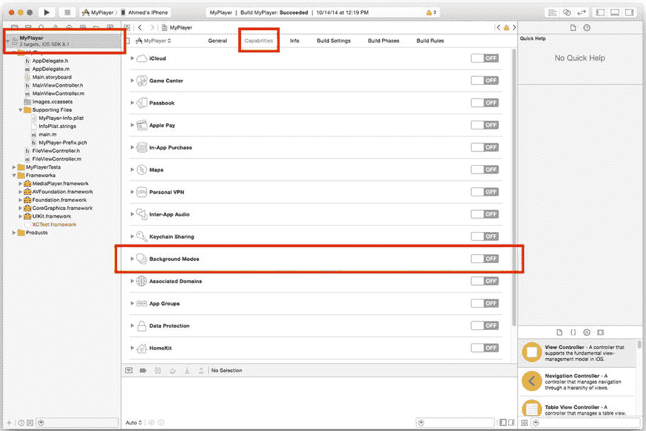
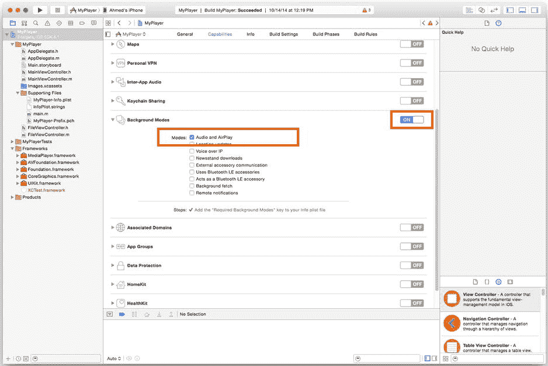
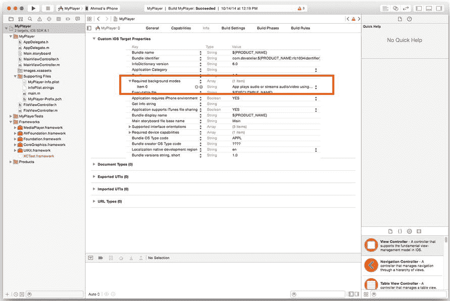
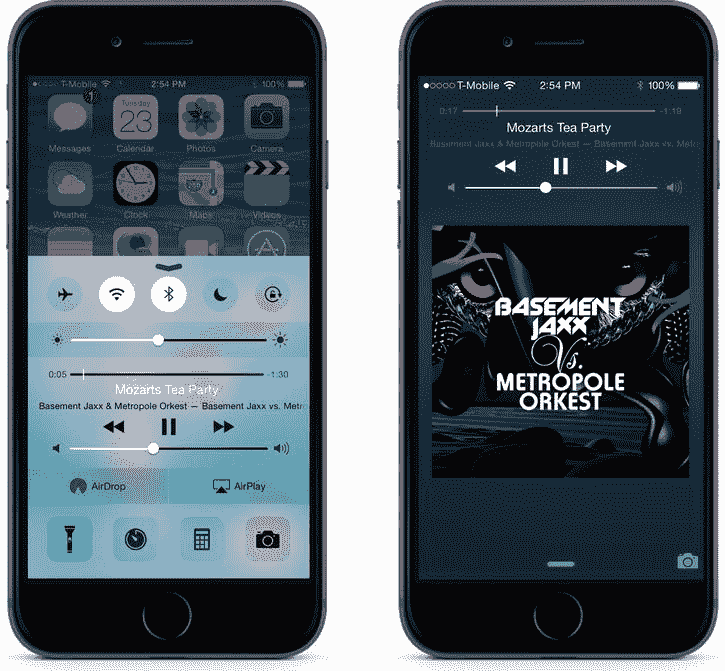
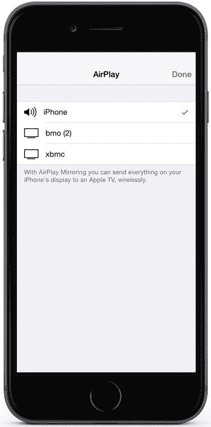
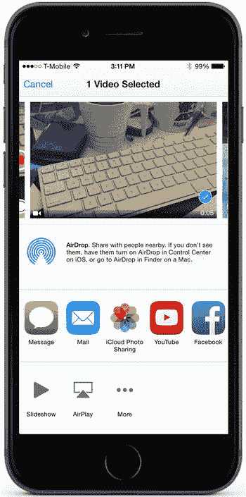
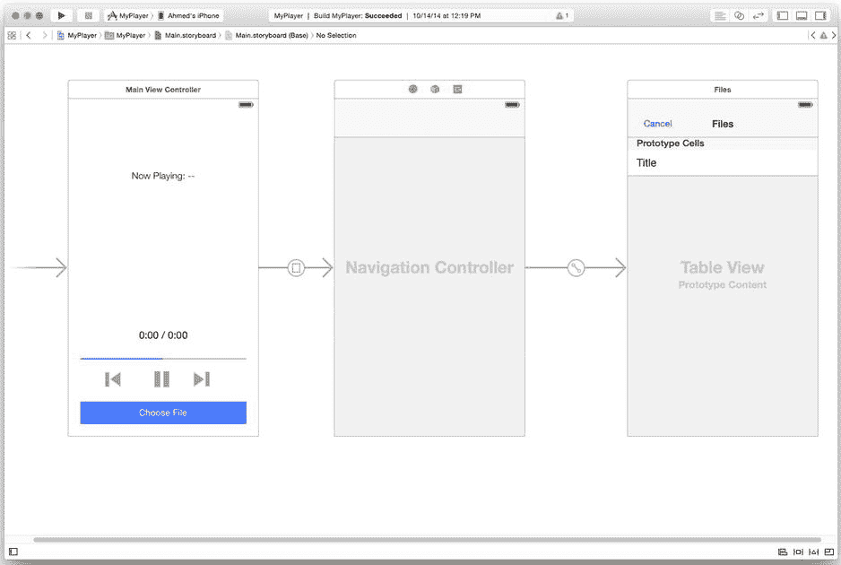

# 高级音频主题

在第 5 章和第 6 章中，你学习了如何构建接受多种输入源（包括本地文件、用户的 iPod 音乐库和流式广播）的音频播放器应用。你还学习了如何使用基于 `AVFoundation` 和 `MediaPlayer` 框架的媒体播放器，并看到了它们之间的一些相似之处。

在本章中，你将学习如何通过增加一些功能，使你的音频应用更加强大，这些功能可以将你的音频从其他设备任务的干扰中解放出来。这些功能将使你的应用在用户触发外部事件（例如将应用切换到后台或拔掉耳机）时能够继续运行。在此过程中，你还会探索一些额外的高级功能，例如 `AirPlay` 和“远程控制”，它们允许用户在应用内置的用户界面之外与其进行交互。

## 后台音频

在第 5 章的 `MyPlayer` 项目中，你构建了一个可以播放应用文档目录中声音文件的应用。不幸的是，你可能已经注意到，将应用发送到后台（无论是通过让设备“休眠”还是打开另一个应用）都会暂停播放。不过，通过对项目设置和音频会话进行一些调整，你可以使基于 `AVFoundation` 的音频应用即使在后台运行时也能继续播放。以下是您需要进行的主要更改：

*   为你的应用添加后台模式
*   选择兼容后台的会话类型

在本节中，你将修改第 5 章的 `MyPlayer` 项目，使其能够在后台播放音频。你可以在源代码包的“第 7 章”文件夹中找到该项目的副本（参见 Apress 网站 `www.apress.com` 的源代码/下载区域），其中包含了后台音频的修改。该项目保留 `MyPlayer` 名称。在构建第 5 章中 `MyPlayer` 项目的初始版本时，你学习了如何执行以下操作：

*   初始化音乐播放器
*   指定媒体查询（你可以将其视为播放列表）
*   构建播放界面
*   显示歌曲信息（元数据）


### 设置后台模式

启用后台音频的第一步是修改项目设置，以表明您的应用将使用音频后台服务。后台服务是 iOS 的机制，允许应用在进入后台时，保持其中一小部分进程持续运行。与设计为同时运行多个应用程序的现代桌面电脑不同，iOS 设备旨在一次只保持一个应用程序活跃。由于这些设备资源有限，允许所有进程始终处于活跃状态并不合理。相反，当用户启动或切换到另一个应用程序时，前一个应用会被置于后台，即被挂起，直到它被关闭或再次成为活跃应用。

苹果公司意识到，某些应用（例如音乐播放器或导航应用）在后台时仍需继续运行，因此 iOS 使用后台服务来定义一个允许在后台继续运行的进程白名单。

要使用后台服务，您需要在项目设置的 `UIBackgroundModes` 键中添加值。在 Xcode 6 中，您可以通过从项目导航器中选择项目文件（`MyPlayer.xcodeproj`），然后选择“功能”标签页来完成此操作，如图 7-1 所示。



图 7-1. Xcode 中的“功能”标签页

将“后台模式”部分的开关切换到“开”后，您会看到一系列复选框，用于选择后台模式。对于 MyPlayer 应用，您需要启用“音频和 AirPlay”。勾选复选框后，您的屏幕应如图 7-2 所示。



图 7-2. 完成的后台模式设置

Xcode 的“功能”标签页提供了用户友好的界面来修改通用项目设置。如果您使用的是 Xcode 5，或者更喜欢传统的修改应用设置方式，可以使用“信息”标签页。需要添加的键名为“必需的后台模式”（或 `UIBackgroundModes`）。图 7-3 展示了在“信息”标签页中设置的外观示例。



图 7-3. 使用“信息”标签页指定后台模式

`UIBackgroundModes` 键可以接受一个数组作为其输入值，因此您可以通过添加多个值来指定多种后台服务。

表 7-1 列出了最常用的 `UIBackgroundModes` 键及其含义。请记住，当您的应用在后台时，只有这些类型的任务可以保持运行。

表 7-1. iOS 支持的主要后台模式

| 名称 | 键值 | 用途 |
| --- | --- | --- |
| 音频和 AirPlay | `audio` | 允许应用在后台播放音频 |
| 位置更新 | `location` | 允许应用在后台使用定位服务（以提供基于位置的信息） |
| 外部配件通信 | `external-accessory` | 允许应用在后台与连接的硬件配件通信 |
| 使用蓝牙低功耗配件 | `bluetooth-peripheral` | 允许应用在后台与蓝牙配件通信 |
| 后台获取 | `fetch` | 允许应用在后台定期获取信息 |
| 远程通知 | `remote-notification` | 允许应用根据通知在后台更新信息 |

## 选择兼容的会话类型

为 MyPlayer 应用启用后台音频的第二步是选择支持后台运行的音频会话类型。与设置后台模式相比，这一步更为直接。您需要做的就是选择最适合您应用的音频会话。为方便起见，表 7-2 列出了兼容后台的会话类别及其用途。

表 7-2. 兼容后台运行的 `AVAudioSession` 类别

| 类别名称 | 用途 |
| --- | --- |
| `AVAudioSessionCategoryPlayback` | 播放声音文件（仅单工播放） |
| `AVAudioSessionCategoryRecord` | 录制声音文件（仅单工录制） |
| `AVAudioSessionCategoryPlayAndRecord` | 全双工音频播放与录制 |

MyPlayer 应用仅需要播放音频，因此 `AVAudioSessionCategoryPlayback` 键最为合适。由于您需要在视图加载时初始化会话，请将此代码放置在 `MainViewController` 类的 `[self viewDidLoad]` 方法中，如代码清单 7-1 所示。

***代码清单 7-1***. 初始化音频会话

```
- (void)viewDidLoad
{
    [super viewDidLoad];
        // 加载视图后进行任何额外的设置，通常
      // 来自一个 nib 文件。

NSError *error = nil;
    [[AVAudioSession sharedInstance]
        setCategory:AVAudioSessionCategoryPlayback error:&error];
    if (error == nil) {
        NSLog(@"音频会话初始化成功");
    } else {
        NSLog(@"初始化音频会话时出错: %@",
              [error description]);
    }
}
```

要测试您是否正确配置了后台音频，请在应用中选择一个音乐文件并等待其开始播放。然后按下 Home 键。即使应用进入后台，音乐也应继续播放。

## 使用“正在播放”中心

许多开发者喜欢用来增强音频驱动应用用户体验的另一个酷炫功能是“正在播放”中心。“正在播放”中心是 iOS 中的一个全局资源，它会显示在锁定屏幕、多任务菜单、任何 Made for iPod 兼容的连接设备（例如收音机或汽车仪表盘）上，以及任何明确请求该信息的应用中。

如图 7-4 所示，在锁定屏幕和多任务模态界面中，“正在播放”中心会显示歌曲标题、专辑或艺术家信息（取决于应用）、播放进度以及专辑封面艺术（在锁定屏幕上）。这些屏幕还提供了一组有限的播放控制，包括播放/暂停和后退/前进。



图 7-4. 锁定屏幕和多任务菜单上的“正在播放”信息

在本节中，您将学习如何通过实现 `MPNowPlayingInfoCenter` 类和远程控制事件，使您的音频应用与系统的“正在播放”中心兼容。

您可能对“远程控制”这个术语感到疑惑，因为众所周知 iPhone 并非电视的遥控器（至少其本身不是）。但在媒体应用的上下文中，远程控制指的是 Made for iPhone (MFi) 耳机上包含的硬件控制，例如 iPhone 附带的耳机。这些相同的控制会通过“正在播放”中心进行传递，而且额外的好处是，您可以利用它们使您的应用与 MFi 耳机兼容。

正如您在上一节中对后台音频所做的那样，您将继续扩展 MyPlayer 应用来添加对“正在播放”的支持。


**注意** `MPNowPlayingInfoCenter` 类仅用于向“正在播放”中心进行单向通信。获取当前播放曲目信息的唯一方法是实现 iPod 音乐库应用程序，如第 6 章所述。

## 显示元数据

如前所述，iOS 设备上的“正在播放”中心是一个共享系统资源。顾名思义，`MPNowPlayingInfoCenter` 类是 `MediaPlayer` 框架的一部分，但这并不妨碍它与 `AVFoundation` 媒体播放器配合使用。任何类型的应用程序都可以向 `MPNowPlayingInfoCenter` 类发送消息——只要它们格式正确。

要在 MyPlayer 应用程序中启用“正在播放”支持，您需要在项目中包含 `MediaPlayer` 框架，并将其添加到 `MainViewController` 类的头文件 (`MainViewController.h`) 中：

```objc
#import <MediaPlayer/MediaPlayer.h>
```

作为一个共享资源（就像摄像头一样），您可以通过单例模式访问“正在播放”中心，该单例可通过 `[MPNowPlayingInfoCenter defaultCenter]` 公开方法获取：

```objc
MPNowPlayingInfoCenter *infoCenter = [MPNowPlayingInfoCenter defaultCenter];
```

要为“正在播放”中心设置值，您需要使用包含新元数据值的 `NSDictionary` 对象来初始化 `nowPlayingInfo` 属性：

```objc
[infoCenter setNowPlayingInfo:myMetaDataDict];
```

表 7-3 展示了 `nowPlayingInfo` 字典的有效键及其类型和含义。这些键在 `MPMediaItem` 类中使用。您必须严格按照指定方式传递它们，否则您的应用程序可能在运行时崩溃。

#### 表 7-3. `nowPlayingInfo` 字典的有效键

| **键** | **类型** | **用途** |
| --- | --- | --- |
| `MPMediaItemPropertyArtist` | `NSString` | 所选项目的表演艺术家 |
| `MPMediaItemPropertyArtwork` | `MPMediaItemArtwork` | 所选项目的专辑封面 |
| `MPMediaItemPropertyAlbumTitle` | `NSString` | 所选项目的专辑标题 |
| `MPMediaItemPropertyGenre` | `NSString` | 所选项目的流派 |
| `MPNowPlayingInfoElapsedPlaybackTime` | `NSNumber` | 所选项目的播放进度（以秒为单位） |
| `MPMediaItemPropertyPlaybackDuration` | `NSNumber` | 所选项目的长度（以秒为单位） |
| `MPMediaItemPropertyTitle` | `NSString` | 所选项目的标题 |

回顾图 7-4，您会看到锁定屏幕和多任务屏幕共有的“正在播放”数值包括歌曲标题、专辑名称和播放时长。对于基于 `MPMusicPlayerController` 的应用程序，当您使用 iPod 音乐项目时，可以直接从当前正在播放的 `MPMediaItem` 中获取此信息，如列表 7-2 所示。

#### 列表 7-2. 从 `MPMediaItem` 设置元数据信息

```objc
-(void)viewDidLoad {
...
[[NSNotificationCenter defaultCenter]
        addObserverForName: 
           @"MPMusicPlayerControllerNowPlayingItemDidChangeNotification"
         selector:@selector(updateNPCenter:)  object:nil];
}

-(void)updateNPCenter:(NSNotification *)note {

MPMediaItem *currentItem = self.musicPlayer.nowPlayingItem;
        MPMediaItemArtwork *albumArt =
           [currentItem valueForProperty:MPMediaItemPropertyArtwork];
        CGSize imageFrameSize = self.albumImageView.frame.size;
        self.albumImageView.image =
        [albumArt imageWithSize:imageFrameSize];

NSString *artistName =
            [currentItem valueForProperty:MPMediaItemPropertyTitle];
        NSString *albumName =
            [currentItem
            valueForProperty:MPMediaItemPropertyAlbumTitle];
        NSString *songTitle =
            [currentItem valueForProperty:MPMediaItemPropertyTitle];

self.titleLabel.text =
            [currentItem valueForProperty:songTitle];
        self.albumLabel.text = [NSString stringWithFormat:@"%@ / %@",
                               artistName, albumName];

MPNowPlayingInfoCenter *infoCenter =
            [MPNowPlayingInfoCenter defaultCenter];
        NSDictionary *infoDict = [NSDictionary
            dictionaryWithObjects:@[songTitle, artistName,
            albumName, albumArt] forKeys:@[MPMediaItemPropertyTitle,
            MPMediaItemPropertyAlbumArtist,
            MPMediaItemPropertyAlbumTitle,
            MPMediaItemPropertyArtwork]];
        [infoCenter setNowPlayingInfo:infoDict];
        ;

}
```

在 MyPlayer 应用程序中，音乐文件的主键是文件名。对于没有完整元数据信息的应用程序，您可以为缺失的信息插入占位符。对于 MyPlayer 应用程序，使用文件名作为歌曲标题，使用应用程序名称作为专辑标题，使用文件时长作为播放时长，并使用占位图像作为专辑封面，如列表 7-3 所示。

#### 列表 7-3. 为 MyPlayer 应用程序设置元数据信息

```objc
NSString *songTitle = [filePath lastPathComponent];
NSString *artistName = @"MyPlayer";
MPMediaItemArtwork *albumArt = [[MPMediaItemArtwork alloc]
     initWithImage:[UIImage imageNamed:@"Placeholder"]];
```

您可能会想：“我什么时候调用这段代码？”答案是：每当您的播放列表发生变化时——例如，当用户选择新歌曲或您将新项目加载到播放列表中时——您都应该更新“正在播放”中心。MyPlayer 应用程序在文件选择器控制器完成时更新它。列表 7-4 显示了在文件选择器委托中设置“正在播放”信息的完整过程代码。

#### 列表 7-4. 在文件选择器委托中设置“正在播放”信息

```objc
-(void)didFinishWithFile:(NSString *)filePath
{
    self.selectedFilePath = filePath;

NSError *error = nil;
    NSURL *fileURL = [NSURL fileURLWithPath:self.selectedFilePath];

self.audioPlayer = [[AVAudioPlayer alloc]
                         initWithContentsOfURL:fileURL error:&error];
    self.audioPlayer.delegate = self;

if (error == nil) {
        NSLog(@"audio player initialized successfully");

self.timer = [NSTimer timerWithTimeInterval:1.0f target:self
                      selector:@selector(updateProgress) userInfo:nil
                      repeats:YES];

NSString *songTitle = [filePath lastPathComponent];
           NSString *artistName = @"MyPlayer";
           MPMediaItemArtwork *albumArt = [[MPMediaItemArtwork alloc]
              initWithImage:[UIImage imageNamed:@"Placeholder"]];

MPNowPlayingInfoCenter *infoCenter = [MPNowPlayingInfoCenter defaultCenter];
           NSDictionary *infoDict =
               [NSDictionary dictionaryWithObjects:@[songTitle, artistName, albumArt]
               forKeys:@[MPMediaItemPropertyTitle, MPMediaItemPropertyAlbumArtist,
               MPMediaItemPropertyArtwork]];
           [infoCenter setNowPlayingInfo:infoDict];

} else {
        NSLog(@"error initializing audio player: %@",
            [error description]);
    }

//dismiss the file picker
    [self dismissViewControllerAnimated:YES completion:nil];
}
```

最后一步，为了获得最佳用户体验，您应该每秒更新一次项目的已播放时间，以便用户可以看到进度。在 MyPlayer 应用中，您添加了定时器以每秒更新应用内的用户界面；您可以通过添加对“正在播放”信息的更新调用来利用此逻辑，如列表 7-5 所示。

#### 列表 7-5. 已添加“正在播放”更新的定时器委托


```objc
-(void)updateProgress
{
    NSInteger durationMinutes = [self.audioPlayer duration] / 60;
    NSInteger durationSeconds = [self.audioPlayer duration]
                                 - durationMinutes * 60;

    NSInteger currentTimeMinutes = [self.audioPlayer currentTime] / 60;
    NSInteger currentTimeSeconds = [self.audioPlayer currentTime]
                                    - currentTimeMinutes * 60;
    NSString *progressString =
        [NSString stringWithFormat:@"%d:%02d / %d:%02d",
         currentTimeMinutes, currentTimeSeconds, durationMinutes,
         durationSeconds];
    self.timeLabel.text = progressString;

    self.progressBar.progress = [self.audioPlayer currentTime] /
                                    [self.audioPlayer duration];

    NSNumber *numCurrentTimeSeconds = [NSNumber numberWithInt:currentTimeSeconds];
    NSNumber *numDurationSeconds = [NSNumber numberWithInt:durationSeconds];

    NSString *songTitle = [self.selectedFilePath lastPathComponent];
    NSString *artistName = @"MyPlayer";
    MPMediaItemArtwork *albumArt = [[MPMediaItemArtwork alloc]
        initWithImage:[UIImage imageNamed:@"Placeholder"]];

    MPNowPlayingInfoCenter *infoCenter = [MPNowPlayingInfoCenter defaultCenter];
    NSDictionary *infoDict = [NSDictionary
        dictionaryWithObjects:@[songTitle, artistName, albumArt,
            numDurationSeconds, numCurrentTimeSeconds]
            forKeys:@[MPMediaItemPropertyTitle,
            MPMediaItemPropertyAlbumArtist,
            MPMediaItemPropertyArtwork,
            MPMediaItemPropertyPlaybackDuration,
            MPNowPlayingInfoPropertyElapsedPlaybackTime]];
    [infoCenter setNowPlayingInfo:infoDict];
}
```

你可以在基于 `MPMusicPlayerController` 的应用中使用相同的逻辑来更新播放进度。

## 启用播放控制（远程控制）

要为用户提供"正在播放"中心的稳健用户体验，需要为应用添加远程控制支持。如本节开头所述，该机制同时驱动着 Made for iPhone 耳机和"正在播放"中心的控件。

要为应用启用远程控制支持，需要注册应用使其能够接收远程控制事件，然后实现这些事件的委托方法。

iOS 中的 `Events` 是在发生硬件交互事件（如用户触摸屏幕、旋转设备或使用耳机）时触发的消息。它们由 `UIKit` 框架中的 `UIEvent` 类表示，这意味着你无需在代码中包含任何额外的框架或类即可使用它们。

到目前为止，你无需担心代码中的 `UIEvent`，因为 Apple 已在 `UIKit` 中包含了对基本触摸事件的支持。然而，要利用更高级的事件（如远程控制事件），你需要将应用注册为能够处理这些事件。为应用添加远程控制支持的 API 调用是 `[[UIApplication sharedApplication] beginReceivingRemoteControlEvents]`。

**注意**  `[UIApplication sharedApplication]` 对象指定了应用的单例。

一个应用可能包含多个响应同一事件的视图，因此作为额外步骤，你需要通过将播放界面声明为事件的"第一响应者"，来指定其应成为远程控制事件的主要接收者。要指定某个视图为第一响应者，首先需要指示你的类*可以成为*第一响应者，然后指定你的视图*就是*第一响应者（默认情况下，新视图的第一响应者支持是关闭的）。

要指定某个视图可以成为第一响应者，请在视图中实现 `[UIResponder canBecomeFirstResponder]` 方法。列表 7-6 演示了如何在 `MainViewController` 类中实现这一操作。

***列表 7-6***。为 MainViewController 类添加第一响应者支持


- (void)viewDidLoad
{
    [super viewDidLoad];
        // 加载视图后执行任何额外设置，通常
        //来自 nib 文件。

NSError *error = nil;
    [[AVAudioSession sharedInstance]
        setCategory:AVAudioSessionCategoryPlayback error:&error];
    if (error == nil) {
        NSLog(@"audio session initialized successfully");
                  [self becomeFirstResponder];
    } else {
        NSLog(@"error initializing audio session: %@",
              [error description]);
    }

)
}

-(BOOL)canBecomeFirstResponder
{
    return YES;
}

为了再次回答“何时”这个问题，你需要指定你的应用程序已准备好成为第一响应者，并在播放界面的视图加载时接收远程控制事件。对于 MyPlayer 应用，这应在`MainViewController`的`[self viewDidLoad]`方法中完成，如代码清单 7-7 所示。

***代码清单 7-7***。向 MainViewController 类添加远程控制事件支持

```
- (void)viewDidLoad
{
    [super viewDidLoad];
        // 加载视图后执行任何额外设置，通常
        // 来自 nib 文件。

NSError *error = nil;
    [[AVAudioSession sharedInstance]
        setCategory:AVAudioSessionCategoryPlayback error:&error];
    if (error == nil) {
        NSLog(@"audio session initialized successfully");

[[UIApplication sharedApplication] beginReceivingRemoteControlEvents]
           [self becomeFirstResponder];
    } else {
        NSLog(@"error initializing audio session: %@",
              [error description]);
    }
    )
}
```

现在`MainViewController`类已准备好接收事件，你需要处理这些事件。处理远程控制事件的委托方法是`[UIResponder remoteControlReceivedWithEvent:]`。该方法使用的参数是一个`UIEvent`。输入的`type`属性决定了接收事件的类型。你通常使用`switch`语句来处理不同类型的远程控制事件。表 7-4 列出了所有可能的远程控制事件。

**表 7-4**。远程控制事件子类型

| 子类型名称 | 用途 |
| --- | --- |
| `UIEventSubtypeMotionShake` | 设备被摇晃 |
| `UIEventSubtypeRemoteControlPlay` | 播放按钮 |
| `UIEventSubtypeRemoteControlPause` | 暂停按钮 |
| `UIEventSubtypeRemoteControlStop` | 停止按钮 |
| `UIEventSubtypeRemoteControlTogglePlayPause` | 切换播放/暂停按钮 |
| `UIEventSubtypeRemoteControlNextTrack` | 跳至下一曲 |
| `UIEventSubtypeRemoteControlPreviousTrack` | 跳至上一曲 |
| `UIEventSubtypeRemoteControlBeginSeekingBackward` | 开始向后快退（按钮按下） |
| `UIEventSubtypeRemoteControlEndSeekingBackward` | 结束向后快退（按钮释放） |
| `UIEventSubtypeRemoteControlBeginSeekingForward` | 开始向前快进（按钮按下） |
| `UIEventSubtypeRemoteControlEndSeekingForward` | 结束向前快进（按钮释放） |

**注意**  你无需在应用中处理所有事件类型，只需处理与你的应用相关的事件。

代码清单 7-8 展示了`MainViewController`类的一个示例实现。

***代码清单 7-8***。MainViewController 类的远程控制事件处理程序

```
-(void)remoteControlReceivedWithEvent:(UIEvent *)event
{
    switch (event.subtype) {
        case UIEventSubtypeRemoteControlPlay:
        case UIEventSubtypeRemoteControlPause:
        case UIEventSubtypeRemoteControlTogglePlayPause:
            [self play:nil];
            break;
        case UIEventSubtypeRemoteControlNextTrack:
            [self skipForward:nil];
            break;
        case UIEventSubtypeRemoteControlPreviousTrack:
            [self skipBackward:nil];
            break;
        default:
            break;
    }
}
```

MyPlayer 应用包含了切换反馈和快进/快退的控制。因此，在代码清单 7-8 中，我只实现了对这两个动作的支持。为了进一步简化，清单显示可以通过相同的逻辑来处理多个事件。

在此过程的最后一步，当播放界面从内存中释放时，你需要进行清理。具体来说，`MainViewController`类需要指定它不再作为第一响应者，并且应停止接收远程控制事件。这发生在视图的`[self dealloc]`方法中，如代码清单 7-9 所示。

***代码清单 7-9***。清理远程控制事件

```
-(void)dealloc
{
    [self resignFirstResponder];
}
```

## 构建更稳健的音频会话

通过添加后台音频和“正在播放”支持，你已显著扩展了 MyPlayer 应用的功能。它现在运行得更像一个 iPod 应用。然而，要实现完全的功能对等，你需要扩展 MyPlayer 应用以处理意外外部事件，例如来自电话应用的音频中断，或用户插入耳机引起的音频路由变化。

当使用 iPod 应用听音乐时，你可能注意到：当调出 Siri 时播放会停止，关闭 Siri 时恢复播放；拔下耳机时播放暂停（这样你就可以避免用你独特的音乐偏好给旁观者留下深刻印象）。这些行为在 iOS 中并非默认设置；然而，Cocoa Touch 提供了委托和通知，允许你在应用中实现它们。

在本节中，你将了解如何通过实现`AVAudioSessionDelegate`来处理音频中断，以及响应`AVAudioSessionRouteChangeNotification`通知来处理输出设备（路由）变化，从而为你的音频应用构建更稳健的音频会话。与本章前几节一样，你将继续使用 MyPlayer 应用作为这些新功能的实验场。

### 处理音频中断

iOS 中的*音频中断*是任何会中断应用音频会话的事件。此类事件可能包括来电、闹钟、通知声音或 Siri。iOS 中音频中断的默认行为是遵循你为应用选择的音频会话所规定的设置。然而，通过响应`AVAudioSessionInterruptionNotification`通知，你可以捕获中断并插入自己的播放处理代码。

**注意**  `AVAudioSessionInterruptionNotification`通知并非`AVFoundation`基于媒体播放器所独有。任何类，包括那些使用`MediaPlayer`框架进行播放的类，都可以实现`AVAudioSessionInterruptionNotification`通知。

表 7-5 列出了每种`AVAudioSession`类型的默认中断行为。

**表 7-5**。AVAudioSession 类型的默认中断行为

| 子类型名称 | 用途 |
| --- | --- |
| `[MPMediaQuery albumsQuery]` | 返回按专辑标题排序的音乐项目（歌曲）列表 |
| `[MPMediaQuery artistsQuery]` | 返回按艺术家名称排序的音乐项目（歌曲）列表 |
| `[MPMediaQuery compilationsQuery]` | 返回按专辑标题排序的合辑项目（专辑）列表 |
| `[MPMediaQuery playlistsQuery]` | 返回按播放列表标题排序的播放列表项目列表 |
| `[MPMediaQuery songsQuery]` | 返回按歌曲标题排序的音乐项目（歌曲）列表 |


由于 `AVAudioSessionInterruptionNotification` 通知是在 `AVAudioSession.h` 中定义的，你无需在头文件中包含任何额外的类。与所有实现通知的项目一样，下一步是为该通知声明一个*观察者*方法（即每次捕获到通知时都会被调用的方法）。如代码清单 7-10 所示，你将此声明添加到类的 `[self viewDidLoad]` 方法中，因为该类需要在初始化完成后立即准备好捕获通知。观察者方法的选择器是 `[self caughtInterruption:]`，你将在下一步实现它。

***代码清单 7-10***. 为 MainViewController 类添加通知观察者

```
- (void)viewDidLoad
{
    [super viewDidLoad];
    // Do any additional setup after loading the view, typically
    // from a nib.

    NSError *error = nil;
    [[AVAudioSession sharedInstance]
        setCategory:AVAudioSessionCategoryPlayback error:&error];
    if (error == nil) {
        NSLog(@"audio session initialized successfully");
        [[NSNotificationCenter defaultCenter] addObserver:self
            selector:@selector(caughtInterruption:)
            name:AVAudioSessionInterruptionNotification object:nil];
    } else {
        NSLog(@"error initializing audio session: %@",
              [error description]);
    }
}
```

为了全面支持音频中断，你需要添加自定义代码来处理两个独特事件：中断开始和中断结束。为了创造最佳用户体验，当中断开始时，应立即暂停播放。通常，一个好的做法是为你的类创建一个实例变量，用于指示会话已被中断。对于 `MainViewController` 类，我将其定义为 `playbackInterrupted`：

```
@property (nonatomic, retain) BOOL playbackInterrupted;
```

当中断结束时，你应该在适用时尝试恢复播放。你可以通过检查 `playbackInterrupted` 变量和媒体播放器的播放状态来确定适用性。

通知通过一个设置为 `userInfo` 属性的 `NSDictionary` 对象，将相关信息发送回其观察者。通知为其信息指定了唯一名称和 `userInfo` 键。表示捕获到的音频中断类型的键是 `AVAudioSessionInterruptionType`，它映射到一个基于整数的 `enum`。它的值是 `AVAudioSessionInterruptionTypeBegan` 和 `AVAudioSessionInterruptionTypeEnded`。

基于这些信息，观察者方法（`[self caughtInterruption:]`）会检查通知中的 `AVAudioSessionInterruptionType` 键。暂停或恢复播放器，并将 `playbackInterrupted` 实例变量设置为正确的值，如代码清单 7-11 所示。

***代码清单 7-11***. 音频中断通知观察者方法

```
-(void)caughtInterruption:(NSNotification *)notification
{
    NSDictionary *userInfo = notification.userInfo;

    NSNumber *type = [userInfo
                     objectForKey:AVAudioSessionInterruptionTypeKey];
    if ([type integerValue] == AVAudioSessionInterruptionTypeBegan) {
        if (self.audioPlayer.playing) {
            [self.audioPlayer pause];
            self.playbackInterrupted = YES;
        }
    } else {
        if (self.audioPlayer.playing || self.playbackInterrupted) {
            [self.audioPlayer play];
            self.playbackInterrupted = NO;
        }
    }
}
```

为了给 `playbackInterrupted` 标志增加一层额外的安全性，请确保每当用户在界面中手动选择一个控件时，都将其值设置为 `NO`。代码清单 7-12 展示了“播放”按钮的示例。

***代码清单 7-12***. 为 MainViewController 类更新的播放按钮处理程序

```
-(IBAction)play:(id)sender
{
    if ([self.audioPlayer isPlaying]) {
        [self.audioPlayer pause];
        self.playButton.titleLabel.text = @"Play";
        self.timer = [NSTimer timerWithTimeInterval:1.0f
                      target:self
                      selector:@selector(updateProgress)
                      userInfo:nil repeats:YES];

    } else {
        [self.audioPlayer play];
        self.playButton.titleLabel.text = @"Pause";
        [self.timer invalidate];
    }
    self.playbackInterrupted = NO;
}
```

## 处理硬件（线路）变更

在创建音频应用时，你应该了解另一个晦涩的通知：`AVAudioSessionRouteChangeNotification`。每当用户更改设备上的音频硬件输出时，就会触发此通知。触发此通知的操作包括插入（或拔出）耳机、连接到 iPod 底座或连接到支持 AirPlay 的设备。

与 `AVAudioSessionInterruptionNotification` 通知一样，你首先需要为你的类（`MainViewController`）添加一个观察者，如代码清单 7-13 所示。

***代码清单 7-13***. 为线路变更通知添加观察者

```
- (void)viewDidLoad
{
    [super viewDidLoad];
    // Do any additional setup after loading the view, typically
    // from a nib.

    NSError *error = nil;
    [[AVAudioSession sharedInstance]
        setCategory:AVAudioSessionCategoryPlayback error:&error];
    if (error == nil) {
        NSLog(@"audio session initialized successfully");
        [[NSNotificationCenter defaultCenter]
          addObserver:self selector:@selector(caughtInterruption:)
          name:AVAudioSessionInterruptionNotification object:nil];

        [[NSNotificationCenter defaultCenter]
            addObserver:self selector:@selector(routeChanged:)
            name:AVAudioSessionRouteChangeNotification object:nil];
    } else {
        NSLog(@"error initializing audio session: %@",
              [error description]);
    }
}
```

一般来说，插入耳机的用户希望私下收听音乐。同样，切换到 AirPlay 的用户可能希望在音乐开始播放前进行声音检查。考虑到这一点，当用户更改输入设备（*线路*）时，你应该暂停播放。

**注意** 这些并非硬性规定，仅是建议。某些应用，例如流媒体视频播放器，无论输出设备如何更改，都可能需要继续正常运行。

为了获得最佳用户体验，在收到 `AVAudioSessionRouteChangeNotification` 通知时，你应该检查 `AVAudioSessionRouteChangeReason` 键，以获取线路变更原因的信息。相关值列于表 7-6。

表 7-6. 线路变更类型

| **类型** | **用途** |
| --- | --- |
| `AVAudioSessionRouteChangeReasonNewDeviceAvailable` | 用户连接了新的输出设备 |
| `AVAudioSessionRouteChangeReasonOldDeviceUnavailable` | 输出设备断开或故障 |
| `AVAudioSessionRouteChangeReasonWakeFromSleep` | iOS 设备从休眠中唤醒 |
| `AVAudioSessionRouteChangeReasonNoSuitableRouteForCategory` | 所选的音频会话类型没有可用的输出设备 |


从 Table 7-6 可以看出，路由可能因多种原因而改变，从用户主动发起的更改到设备故障。对于`MyPlayer`应用，根据之前的讨论，当用户发起路由更改时应暂停播放。在设备故障（`AVAudioSessionRouteChangeReasonNoSuitableRouteForCategory`）的情况下，应停止播放。`MainViewController`类的观察者方法（`[self routeChanged:]`）如 Listing 7-14 所示。

***Listing 7-14***. 路由更改的观察者方法

```
-(void)routeChanged:(NSNotification *)notification
{
    NSDictionary *userInfo = notification.userInfo;

    NSNumber *reason = [userInfo
                           objectForKey:AVAudioSessionRouteChangeReasonKey];
    switch ([reason integerValue]) {
        case AVAudioSessionRouteChangeReasonNoSuitableRouteForCategory:
            [self.audioPlayer stop];
            break;
        case AVAudioSessionRouteChangeReasonNewDeviceAvailable:
        case AVAudioSessionRouteChangeReasonOldDeviceUnavailable:
        case AVAudioSessionRouteChangeReasonWakeFromSleep:
            [self.audioPlayer pause];
            break;
        default:
            break;
    }
}
```

## 使用 AirPlay

尽管创建基于音频的应用程序的可能性是无穷无尽的，但本章仅再讨论一个主题：AirPlay。AirPlay 是苹果的专有技术，用于通过 WiFi 网络流式传输媒体。AirPlay 允许用户将 iOS 或 OS X 设备上的媒体直接流式传输到兼容 AirPlay 的设备，例如 Apple TV、Apple AirPort 路由器或兼容的第三方立体声音响。AirPlay 是一种基于发现的协议；当网络中检测到开放的 AirPlay 设备时，它会出现在系统的可用设备列表中。您可以通过在多任务菜单中选择 AirPlay 按钮来查看 iOS 设备可用的输出设备列表，如 Figure 7-5 所示。



Figure 7-5. AirPlay 设备列表

**Note**: AirPlay 不能通过蓝牙工作。用户必须连接到 WiFi 网络才能使用 AirPlay。

AirPlay 可以在两种主要模式下运行：仅传输应用程序输出，或镜像整个设备。镜像会直接将用户的 OS X 或 iOS 屏幕（包括系统屏幕）复制到 AirPlay。这对于教学环境中教师试图演示某个功能，或针对低视力辅助功能的应用来说非常方便。对于简单场景（例如将应用程序中的视频或音频传输到 Apple TV），使用 AirPlay 镜像就有些大材小用了。要传输内容，您需要在应用程序中实现 AirPlay 支持。

幸运的是，苹果在`MediaPlayer`和`AVFoundation`框架中内置了 AirPlay 支持，使您无需大量额外工作即可使用 AirPlay。正如您将在 Chapter 8 关于视频应用程序的讨论中看到的，`MPMoviePlayerController`会在检测到网络中的 AirPlay 设备后，直接在播放控制集中添加一个 AirPlay 按钮，如 Figure 7-6 所示。



Figure 7-6. `MPMoviePlayerController`的 AirPlay 控件

对于使用`AVAudioPlayer`或`MPMusicPlayerController`类的音频应用程序，您可以通过`MPVolumeView`类为应用程序添加类似的 AirPlay 控件。该类提供了一个音量滑块和一个 AirPlay 选择器，与`MPMoviePlayerController`类中的控件完全相同。

**Note**: 您可以通过将`showsVolumeSlider`属性设置为`NO`来选择不使用音量滑块。

顾名思义，`MPVolumeView`类是一个视图，因此您需要在故事板上指定一个区域来容纳它。Interface Builder 的拖放组件库中没有`MPVolumeView`控件；因此，您需要使用与之前基于摄像头的应用程序相同的方法——您需要将`MPVolumeView`添加为通用`UIView`的子视图。

对于`MyPlayer`应用程序，我在`MainViewController.h`头文件中添加了一个名为`airPlayView`的新`UIView`属性：

```
@property (nonatomic, strong) UIView *airPlayView;
```

将此属性添加到类后，修改故事板以添加并关联该视图，如 Figure 7-7 所示。



Figure 7-7. 针对`MyPlayer`项目修改后的故事板

接下来，您需要初始化`MPVolumeView`。幸运的是，`MPVolumeView`的初始化非常简单；您只需正确地初始化对象并添加为子视图即可。如 Listing 7-15 所示，这需要在`[self viewDidLoad]`方法中完成。

***Listing 7-15***. 初始化`MPVolumeView`

```
- (void)viewDidLoad
{
    [super viewDidLoad];
        // Do any additional setup after loading the view, typically
        // from a nib.

    NSError *error = nil;
    [[AVAudioSession sharedInstance]
        setCategory:AVAudioSessionCategoryPlayback error:&error];
    if (error == nil) {
        NSLog(@"audio session initialized successfully");

        MPVolumeView *volumeView = [[MPVolumeView alloc] init];
           [volumeView sizeToFit];
           [self.airPlayView addSubview:volumeView];

        [[UIApplication sharedApplication]                beginReceivingRemoteControlEvents];

        [self becomeFirstResponder];

        [[NSNotificationCenter defaultCenter]
               addObserver:self
               selector:@selector(caughtInterruption:)
               name:AVAudioSessionInterruptionNotification object:nil];

        [[NSNotificationCenter defaultCenter]
                 addObserver:self
                 selector:@selector(routeChanged:)
                 name:AVAudioSessionRouteChangeNotification object:nil];
    } else {
                 NSLog(@"error initializing audio session: %@",
                  [error description]);
    }
}
```

如果这看起来很简洁，那么好消息是，事实确实如此。这就是您需要做的全部工作！AirPlay 直接连接到远程控制事件和“正在播放”中心。通过将这些处理程序添加到代码中，您可以为 AirPlay 应用程序构建一个功能完整的用户体验。

**Note**: 默认情况下，音量滑块是白色的。如果您看不到音量滑块，请尝试更改视图的背景颜色。

## 总结

在本章中，您看到了如何通过添加后台音频支持、“正在播放”中心以及路由更改和音频中断通知，显著扩展基于音频的应用程序的性能。通过添加这些功能，您还了解到实现 AirPlay 只需在类中添加一个`MPVolumeView`即可。虽然无法预测用户会如何使用您的应用程序，但您可以利用 Apple 提供的有限后台音频功能，使您的应用程序更加令人愉悦。

