# 第 8 章：播放和录制视频

在本章中，您将深入学习如何在应用程序中使用视频，了解如何播放和录制视频文件。作为一种格式，视频比静态图像或照片更复杂，需要显著的底层支持。幸运的是，有 API 可以为您提供这种底层支持。


本章将说明如何使用`MPMoviePlayerController`类来播放视频文件。同时，你还会重温如何使用`UIImagePickerController`类来录制视频文件。幸运的是，你会发现，前面图像和音频章节中学习的大部分技术都可以直接应用于这里的视频主题。事实上，本章的两个项目都直接借用了之前项目中的代码。

在此过程中，你将简单学习通知的相关知识，因为理解通知对于使用`MediaPlayer`框架至关重要。视频播放器甚至没有定义代理——可见通知有多么重要！

## 播放视频文件

与照片和音频类似，Apple 提供了“简单”和“困难”两种方法来实现视频相关的所有功能。简单的方法通常意味着使用内置的用户界面来完成你的任务——但你必须应对 Apple 所设置的限制。困难的方法则意味着使用底层框架来实现相同的功能——但你必须自己创建用户界面和会话处理代码。

首先，你将看到如何使用 Apple 的内置视频播放界面 `MPMoviePlayerController` 类以简单的方式播放视频。你可以使用 `MPMoviePlayerController` 类播放来自文件或网络流的视频，如图 8-1 所示。此外，该类提供了一套基本的播放控件（包括播放/暂停、进度条搜索和 AirPlay），并允许你通过相同的界面播放音频文件。如果你曾经通过网页浏览器观看过电影，那么从用户角度来说，你已经对 `MPMoviePlayerController` 类非常熟悉了。

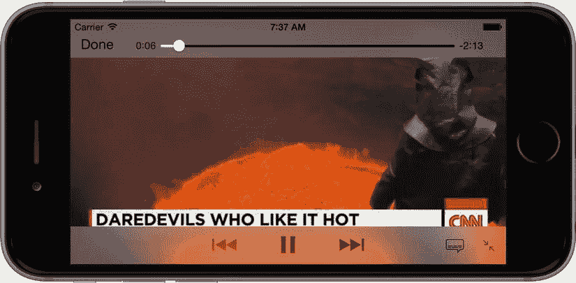

图 8-1. 使用 `MPMoviePlayerController` 类显示的基于浏览器的视频

从开发者的角度来看，`MPMoviePlayerController` 类是有限的，因为你受限于 Apple 的大小限制（全屏或窗口模式）及其控件（全部或没有）。

**注意** 在第 9 章中，你将看到如何通过构建自己的视频播放器类，使用`AVFoundation`来绕过`MPMoviePlayerController`类的用户界面限制。

在本节中，你将通过实现图 8-2 所示的 MyVideoPlayer 应用程序，来探索如何使用`MPMoviePlayerController`类。该应用程序包含在源代码包的`Chapter 8`文件夹中。（请参见 Apress 网站的源代码/下载区域，`www.apress.com`。）

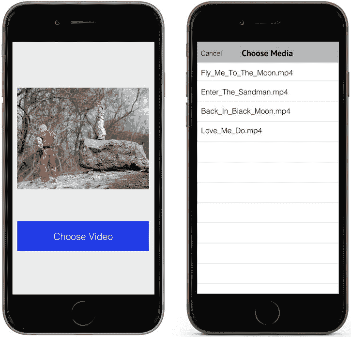

图 8-2. MyVideoPlayer 项目的原型图

MyVideoPlayer 应用程序具有一个简单的用户界面，主要包括一个允许用户选择要播放的视频文件的文件选择器，以及一个嵌入在`UIView`中的视频播放器，该播放器允许用户观看选定的视频。这个嵌入播放器的播放控件来自`MPMoviePlayerController`类本身。请注意，这些控件与浏览器中嵌入视频的控件相似——这是因为 Safari 和此应用程序使用相同的类来显示视频！

你可能从第 5 章的 MyPlayer 音乐播放器应用程序中认出了这个文件选择器。你在那个项目中构建了一个通用的、可复用的文件选择类。在这里，你将直接重用该类，从而可以专注于视频特有的功能。

与音频播放相比，视频需要更复杂的设置过程以及更多的异步状态变更处理（视频文件通常非常大）。在构建 MyVideoPlayer 项目时，你将掌握以下视频播放的核心能力：

*   用有效的内容初始化视频播放器
*   为不同的播放模式配置视频播放器
*   使用通知来检测播放状态变化中的错误

## 开始


如前所述，`MyVideoPlayer` 项目在设计及用户界面组件（包括文件选择器界面）上大量依赖于 `MyPlayer` 应用。在本节中，你将看到直接取自 `MyPod` 项目的代码示例。关于这些代码运行机制的更详细说明，请参阅第 6 章。

与 `MyPod` 应用类似，首先在 Xcode 中使用“单视图应用程序”模板创建一个新项目。由于 `MPMoviePlayerController` 类是 `MediaPlayer` 框架的一部分，请务必先将该框架包含到项目中。

与之前的应用一样，主视图控制器是用户界面的主要驱动者。你可以使用代码清单 8-1 中的头文件作为添加所需用户界面元素的指南。请注意，`MediaPlayer` 框架包含在文件顶部，因为 `MainViewController` 类会实例化媒体播放器。

***代码清单 8-1*** `MainViewController` 类的头文件

```
#import <UIKit/UIKit.h>
#import <MediaPlayer/MediaPlayer.h>
#import "FileViewController.h"

@interface MainViewController : UIViewController <FileControllerDelegate>

@property (nonatomic, strong) IBOutlet UIView *playerView;
@property (nonatomic, strong) MPMoviePlayerController *moviePlayer;

@end
```

你可能已经注意到，代码将 `playerView` 属性声明为 `UIView` 类型，而非更具体的类。当你需要将视频播放器实现为子视图时，设计模式是将另一个元素的视频层子视图进行设置——类似于你在第 4 章中构建的自定义相机界面。记得将每个属性连接到故事板中对应的元素。

对于此应用，你可以直接使用 `MyPod` 项目中的 `FileViewController` 类而无需修改。该类的头文件和实现文件如代码清单 8-2 和 8-3 所示。

***代码清单 8-2*** `FileViewController` 类的头文件

```
#import <UIKit/UIKit.h>

@protocol FileControllerDelegate <NSObject>

-(void)cancel;
-(void)didFinishWithFile:(NSString *)filePath;

@end

@interface FileViewController : UITableViewController

-(id)initWithFileArray:(NSArray *)fileArray;

@property (nonatomic, strong) NSMutableArray *fileArray;

@property (nonatomic, strong) id <FileControllerDelegate> delegate;

-(IBAction)closeView:(id)sender;

@end
```

***代码清单 8-3*** `FileViewController` 类的实现文件

```
#import "FileViewController.h"

@implementation FileViewController

-(id)initWithFileArray:(NSArray *)fileArray
{
    self = [super init];
    if (self) {
        self.fileArray = fileArray;
    }
    return self;
}

- (void)viewDidLoad
{
    [super viewDidLoad];

// 取消注释以下行以保持选择
    // 在视图切换间的状态。
    // self.clearsSelectionOnViewWillAppear = NO;

// 取消注释以下行以在此视图控制器的
    // 导航栏中显示编辑按钮。
    // self.navigationItem.rightBarButtonItem = self.editButtonItem;
}

- (void)didReceiveMemoryWarning
{
    [super didReceiveMemoryWarning];
    // 处理任何可以重新创建的资源。
}

#pragma mark - 表视图数据源

- (NSInteger)numberOfSectionsInTableView:(UITableView *)tableView
{
    // 返回分区数量。
    return 1;
}

- (NSInteger)tableView:(UITableView *)tableView
      numberOfRowsInSection:(NSInteger)section
{
    // 返回分区中的行数。
    return [self.fileArray count];
}

- (UITableViewCell *)tableView:(UITableView *)tableView
      cellForRowAtIndexPath:(NSIndexPath *)indexPath
{
    UITableViewCell *cell =
        [tableView dequeueReusableCellWithIdentifier:@"fileCell"
         forIndexPath:indexPath];

// 配置单元格...

NSString *filePath = [self.fileArray objectAtIndex:indexPath.row];

cell.textLabel.text = [filePath lastPathComponent];

return cell;
}

-(void)tableView:(UITableView *)tableView
       didSelectRowAtIndexPath:(NSIndexPath *)indexPath
{
    NSString *filePath = [self.fileArray objectAtIndex:indexPath.row];

[self.delegate didFinishWithFile:filePath];

}

-(IBAction)closeView:(id)sender
{
    [self.delegate cancel];
}

@end
```

与 `MyPod` 项目类似，你需要在故事板中使用一个表视图控制器和一个导航控制器来表示文件选择器。关于此过程的更详细说明，请参阅第 5 章（请记住，表视图控制器是“嵌入”在导航控制器中的）。完成后的故事板应类似于图 8-3 中的示例。

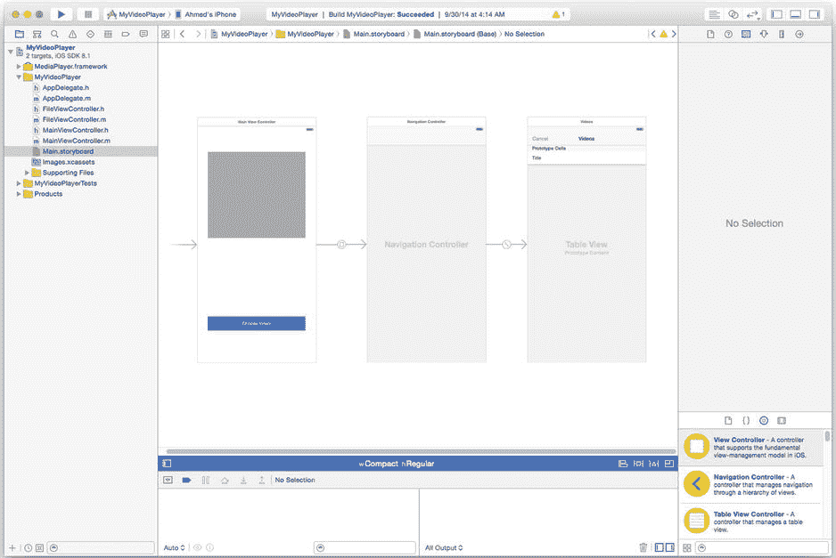

图 8-3 `MyVideoPlayer` 应用的故事板

## 初始化视频播放器

要使用 `MPMoviePlayerController` 类播放视频文件，必须首先初始化该类。因为你采用的是“简单”方法，`MPMoviePlayerController` 类会为你抽象处理诸如获取音频和视频播放会话等任务。初始化该类的主要目标如下：

- 为影片播放器指定 `contentURL` 属性
- 设置影片播放器的父视图
- 注册你的类以处理 `MPMoviePlayerPlaybackStateChanged` 通知

在集成 `MPMoviePlayerController` 类时，大部分工作与呈现和消息处理相关。与你所了解的用于照片和音频的媒体 API 不同，`MPMoviePlayerController` 类使用通知作为其消息传递的主要机制。该类甚至没有定义 `delegate` 属性，这意味着你必须使用通知来处理来自媒体播放器的所有事件。对于来自其他生态系统的开发者来说，通知可能是一个令人困惑的话题，但你将在本章后面的“通知入门”边栏中找到关于其工作原理的详细说明。

### 指定内容 URL

在其最简单的形式中，你可以通过一行代码初始化 `MPMoviePlayerController` 对象：

```
[MPMoviePlayerController alloc] initWithContentURL:];
```

`[MPMoviePlayerController initWithContentURL:]` 方法接受一个 `NSURL` 对象，该对象必须是指向应用文档目录中文件的有效 URL，或者是一个视频流。该文件（或视频流）的格式必须是该类所支持的。表 8-1 列出了 `MPMoviePlayerController` 类支持的文件格式以及每种格式的预期用途。

表 8-1 `MPMoviePlayerController` 类支持的媒体格式

| 文件类型 | 扩展名 | 用途 |
| --- | --- | --- |
| MPEG-4 视频 | MP4 | 视频压缩的当前基线，比 AVI 和 DVD 标准（MPEG-2）效率更高 |
| H.264 视频 | MOV, MP4 | 苹果主导的高清视频标准，比普通 MPEG-4 更先进 |
| MPEG-3 音频 | MP3 | 有损音频压缩的行业标准 |
| AAC 音频 | M4A | 苹果用于 MPEG-4 压缩音频的格式 |

当用户播放视频文件时，输出会显示在你的初始化代码所指定的视图中。当用户播放音频文件时，视图中会出现 QuickTime 标志作为占位符。

请注意，此方法仅初始化对象；错误不会发生，直到你尝试播放该文件。错误会通过 `MPMoviePlayerPlaybackState` 通知传递回来，你将在本章后面与其他通知处理程序一起处理该通知。

## 使用文件选择器作为数据源


在使用 `MyVideoPlayer` 项目中的文件选择器时，你需要修改转场处理程序 `[self prepareForSegueWithIdentifier:]`。这一次，不要像之前那样使用 iPod 媒体初始化文件选择器，而是需要填充由 `MediaPlayer` 框架所支持的文件。与第 5 章中的 `MyPlayer` 应用程序一样，你可以通过在应用文档目录中搜索文件扩展名与受支持文件格式相匹配的文件来生成此列表。输入数组准备好之后，你就可以展示文件选择器了。此逻辑将位于主视图控制器的转场处理程序中，如代码清单 8-4 所示。

***代码清单 8-4***.  用于填充并展示文件选择器的转场处理程序

```
-(void)prepareForSegue:(UIStoryboardSegue *)segue sender:(id)sender
{
    if ([segue.identifier isEqualToString:@"showFilePicker"]) {
        NSMutableArray *videoArray = [NSMutableArray new];

NSArray *paths =
            NSSearchPathForDirectoriesInDomains(NSDocumentDirectory,
            NSUserDomainMask, YES);
        NSString *documentsDirectory = [paths objectAtIndex:0];
        NSError *error = nil;

NSArray *allFiles = [[NSFileManager defaultManager]
            contentsOfDirectoryAtPath:documentsDirectory error:&error];

if (error == nil) {

for (NSString *file in allFiles) {
                if ([[file pathExtension] isEqualToString:@"m4v"] ||
                    [[file pathExtension] isEqualToString:@"mov"]) {
                    [videoArray addObject:file];
                }
            }

} else {
            NSLog(@"error looking up files: %@", [error description]);
        }

UINavigationController *navigationController =
             (UINavigationController *)segue.destinationViewController;
        FileViewController *fileVC =
             (FileViewController *)navigationController.topViewController;
        fileVC.delegate = self;
        fileVC.fileArray = videoArray;
    }
}
```

你应该在每个单元格中显示文件名，因此请使用该文件名来填充输入数组。

同样，请记住在主视图控制器的头文件中指定你将实现 `FileControllerDelegate` 协议：

```
@interface MainViewController : UIViewController
    <FileControllerDelegate>
```

`FileControllerDelegate` 协议指定了一个方法，该方法在用户选取文件后返回一个文件路径。你可以使用它在 `MainViewController` 类中初始化 `MPMoviePlayerController` 对象。在你的主视图控制器的 `[FileControllerDelegate didFinishWithItem:]` 委托方法中，将 `filePath` 字符串转换为 `NSURL` 对象，并用它来初始化你类的 `mediaPlayer` 对象。与之前的应用程序一样，你的媒体播放器应该是一个实例变量，因为会有许多方法访问它。你可以在代码清单 8-5 中找到一个示例。

***代码清单 8-5***.  在用户选择项目后初始化视频播放器

```
-(void)didFinishWithFile:(NSString *)filePath
{
    NSURL *fileURL = [NSURL URLWithString:filePath];
    self.moviePlayer = [[MPMoviePlayerController alloc]
        initWithContentURL:fileURL];

//解散文件选择器
    [self dismissViewControllerAnimated:YES completion:nil];
}
```

### 为媒体播放器指定父视图

尽管你的视频播放器对象已在内存中分配，但你仍然需要指定一个父视图才能在应用中显示它。此过程类似于你在第 4 章创建自定义相机应用时将视频层添加到视图的方式——为你的播放器设置与其父视图相同的边界框，然后将其添加为子视图。

与所有 `UIView` 对象一样，你需要指定视图的尺寸及其位置。`frame` 属性是一个 `CGRect` 数据结构，包含视图的尺寸及其相对于屏幕左上角的 (x,y) 位置。对于所有视图，第二个属性 `bounds` 指定了视图的可见区域（即其*边界*框）。`bounds` 属性的 (x,y) 位置是相对于*frame* 的原点，而不是相对于屏幕的原点。默认情况下，`bounds` 属性被设置为目标视图的左上角位置，但如果你试图重新定位或裁剪子视图，则可以更改它。

此应用的目标是使影片播放器填满 `playerView` 的可见区域。因此，`MPMoviePlayerController` 的 `view` 的 `frame` 需要与 `playerView` 的尺寸相匹配，并且具有相对位置。`bounds` 属性是解决此问题的完美方案：

```
self.moviePlayer.view.frame = self.playerView.bounds;
```

在为 `MPMoviePlayerController` 对象设置 `frame` 之后，将其 `view` 作为子视图添加到 `playerView` 之上，这将使其成为可见属性：

```
[self.playerView addSubview:self.moviePlayer.view];
```

现在你将得到最终的解决方案，如代码清单 8-6 所示。

***代码清单 8-6***.  将视图定位添加到您的初始化代码中

```
-(void)didFinishWithFile:(NSString *)filePath
{
    NSURL *fileURL = [NSURL URLWithString:filePath];
    self.moviePlayer = [[MPMoviePlayerController alloc]
        initWithContentURL:fileURL];

self.moviePlayer.view.frame = self.playerView.bounds;
    [self.playerView addSubview:self.moviePlayer.view];

//解散文件选择器
    [self dismissViewControllerAnimated:YES completion:nil];
}
```

**注意** 如果你想要一个仅在**全屏模式**下运行的影片播放器，请使用 `MPMediaPlayerViewController` 类。其初始化路径和通知与 `MPMediaPlayerController` 相同；主要的操作区别在于，当视图被解散时，该对象会被释放。

### 向类添加通知处理

作为初始化媒体播放器的最后一步，你需要将 `MainViewController` 注册为 `MPMoviePlaybackStateDidChangeNotification` 通知的接收者。`MPMoviePlayerController` 类完全依赖通知来传递消息，这与之前使用的音频播放器和相机类不同，后者使用委托。你可以在下面的侧边栏中找到关于如何使用通知的更详细解释，但这里有一个快速总结：要处理通知，你需要明确声明你的类将处理哪些通知，并将这些通知绑定到处理程序方法。

#### 通知入门

在任何编程语言中，*消息传递*是进程间发送信息的方式。在类的实例上调用方法是最简单的消息传递形式之一：你让接收者（对象）知道要执行什么消息（方法），以及使用什么数据（参数）。

直接向另一个类发送消息并不总是方便或明智的。对于一个非常通用的类，你不想包含可能调用其方法的其他每个类的头文件。同样，你也不想包含调用一个相当复杂的类上的消息所需的所有内容。

为了解决这个问题，Cocoa Touch 提供了三种在类之间执行通用消息传递的专门方式：

- 协议
- 通知
- 键值观察


#### iOS 开发中的协议与通知

你应该对前面章节中介绍的协议（protocol）已经有所了解。当你希望为两个类（例如相机与需要从相机获取图像的类）之间的数据传递定义有限接口时，协议是理想的选择。然而，协议也可能非常严格。协议定义中的每个方法都被隐式标记为`required`（必需），这意味着委托类必须实现所有方法才能完全符合规范。

`MPMediaPlayerController`类可以发出多种类型的消息，包括播放状态、流错误以及显示模式变化（例如全屏）。使用委托来实现所有这些功能可能会变得笨重。对于媒体播放器，你需要一种消息传递方案，让接收类只处理它关心的消息，而无需承担巨大的开销。

当你希望使用一种松散的消息传递方案时，通知是理想的选择。通知是一种基于名称的消息传递系统，任何人都可以通过使用特定名称发送格式正确的消息来*发布*通知，任何人都可以通过声明他们能够使用该名称接收格式正确的消息来处理（*观察*）通知。这种魔法由一个*通知中心*对象实现，它充当所有通知的中介。

第三种通用的消息传递方案是键值观察，其工作原理与通知类似，不同之处在于键值观察不是基于名称的系统，而是基于对象实例的变化。例如，“当`count`变量发生变化时，调用`increaseCount`方法”。虽然它在某些情况下很有用，但这并不适用于媒体播放器，因为你不需要监控某个属性的变化。

#### 添加通知观察者

要将你的类声明为某个通知的*观察者*，有两个主要 API：`[NSNotificationCenter addObserver:selector:name:object]` 和 `[NSNotificationCenter addObserverForName:object:queue:usingBlock]`。两者都要求你指定要观察的通知名称以及如何处理它。两者之间的主要区别在于：第一个 API 在捕获到通知时通过`@selector`参数在运行时调用一个方法，而第二个 API 则执行一个代码块。例如，如果你试图捕获一个`MPMoviePlayerLoadStateDidChangeNotification`通知，并使用声明为`[self stateChanged:]`的处理方法，你的代码将如下所示：

```
[[NSNotificationCenter defaultCenter] addObserver:self
    selector:@selector(stateChanged:)
    name:MPMoviePlayerPlaybackStateDidChangeNotification
    object:nil];
```

你可能对`[NSNotificationCenter defaultCenter]`这段代码有疑问。这是一个单例对象，它为你的应用程序提供一个通知中心对象——无需任何特殊设置即可使用。除非你的代码变得足够复杂，需要根据通知中心来过滤通知，否则这对于大多数应用来说已经足够了。

#### 发布与移除通知

要发送通知，你可以通过使用`[NSNotificationCenter postNotification:object:userInfo]`方法来*发布*一个`NSNotification`对象。使用此方法，你需要指定要发布的通知名称以及你传递的任何信息，通过将信息添加到`userInfo`参数传递的`NSDictionary`对象中。如果你要发布一个名为`MyCustomNotification`的自定义通知，代码将如下所示：

```
NSDictionary *myDict = [NSDictionary dictionaryWithObject:@"ahmed"
                                     forKey:@"userName"];
[[NSNotificationCenter defaultCenter]
      postNotificationName:@"MyCustomNotification" object:self
      userInfo:myDict];
```

关于通知还有最后一点：当类被释放时，一定要记得移除观察者。除非你显式地移除观察者，否则通知中心会尝试继续使用你的类来处理传入的通知，这可能会导致你的应用程序崩溃。要移除观察者，请使用`[NSNotificationCenter removeObserver:name:object]`方法。对于`MyCustomNotification`示例，调用方式如下：

```
[[NSNotificationCenter defaultCenter] removeObserver:self
    name:MPMoviePlayerPlaybackStateDidChangeNotification
    object:nil];
```

如你所见，通知是建立消息传递的一种快速方式。对于需要执行特定消息传递方案的类，委托是理想的选择，但如果你只是试图建立一个简单且允许任何人选择是否响应的方案，那么通知就是完美的解决方案。

#### 实际实现

正如前面的侧边栏所述，处理通知的第一步是将你的类声明为观察者。因为这是一个类级别的操作，你可以在`MainViewController`类的`[self viewDidLoad]`方法中设置观察者。通过将其设为类级别操作，无论媒体播放器是被初始化多次还是从未初始化（如果媒体播放器从未初始化，消息将永远不会发送），你都已经准备好。列表 8-7 展示了`MainViewController`类修改后的`[self viewDidLoad]`方法。

**列表 8-7.** 向你的类添加通知观察者

```
- (void)viewDidLoad {
    [super viewDidLoad];
    // 加载视图后的任何其他设置，
    // 通常来自一个 xib 文件。

[[NSNotificationCenter defaultCenter] addObserver:self
        selector:@selector(playbackFinished:)
        name:MPMoviePlayerPlaybackDidFinishNotification object:nil];

[[NSNotificationCenter defaultCenter] addObserver:self
        selector:@selector(loadStateChanged:)
        name:MPMoviePlayerLoadStateDidChangeNotification object:nil];
}
```

在示例中，我使用了`[NSNotificationCenter addObserver:selector:name:object]` API 来设置观察者，这样我就可以指定一个方法作为通知处理程序，而不是代码块——这主要是为了让代码在拆分后更易于阅读。

`MPMoviePlayerPlaybackDidFinishNotification`通知通过`MPMoviePlayerPlaybackDidFinishReasonUserInfoKey`键返回一个`MPMovieFinishReason`常量，并通过`error`键返回一个错误。如果结束原因是`MPMovieFinishReasonPlaybackError`，你应该提取错误对象，并通过错误消息或`UIAlertView`通知用户。你可以在列表 8-8 中找到`MainViewController`类的`[self playbackFinished:]`方法。

**列表 8-8.** 显示播放错误

```
-(void)playbackFinished:(NSNotification *) notification
{
    NSDictionary *userInfo = notification.userInfo;
    NSNumber *finishReason = [userInfo
        objectForKey:MPMoviePlayerPlaybackDidFinishReasonUserInfoKey];

if ([finishReason integerValue] ==
        MPMovieFinishReasonPlaybackError) {
        NSError *error = [userInfo objectForKey:@"error"];
        NSString *errorString = [error description];

UIAlertView *alert = [[UIAlertView alloc]
            initWithTitle:@"错误！"
            message:errorString delegate:nil
            cancelButtonTitle:@"确定" otherButtonTitles:nil];
        [alert show];
    }
}
```


`MPMoviePlayerLoadStateDidChangeNotification`通知不会在`userInfo`字典中设置任何键，但你知道当它触发时，播放器已在加载状态之间转换（主要状态有`Unknown`、`Playable`、`Playthrough OK/Loaded`和`Stalled`）。与音频播放器一样，加载视频文件是一个不确定的操作，这意味着你无法预测文件加载需要多长时间。因此，你应该使用`[MPMediaPlayerController prepareToPlay]`方法开始加载视频文件，并在文件加载完成后触发`[MPMediaPlayerController play]`方法。你可以通过比较`loadState`属性与`MPMovieLoadStatePlayable`值来判断媒体播放器是否准备好播放文件，如代码清单 8-9 所示。

***代码清单 8-9***. 自动启动媒体播放器

```
-(void)loadStateChanged:(NSNotification *) notification
{
    if (self.moviePlayer.loadState == MPMovieLoadStatePlayable) {

[self.moviePlayer play];
    }
}
```

最后一步，请记住你需要移除通知以在类完成后进行清理。完全如侧边栏所示，你应将调用`[NSNotificationCenter removeObserver:name:object]`的代码放在`MainViewController`的`[self dealloc]`方法中，如代码清单 8-10 所示。

***代码清单 8-10***. 移除通知观察者

```
- (void)dealloc
{
    [[NSNotificationCenter defaultCenter] removeObserver:self
       name:MPMoviePlayerPlaybackDidFinishNotification
    object:nil];
    [[NSNotificationCenter defaultCenter] removeObserver:self
         name:MPMoviePlayerLoadStateDidChangeNotification
         object:nil];
}
```

配置视频播放器

现在你已经完成了初始化媒体播放器所需的所有步骤，可以开始播放视频文件了。然而，为了从`MPMediaPlayerController`类中获得最佳性能，你需要通过指定一些额外的视频特定属性值来配置它：源类型和 AirPlay。

指定源类型（本地文件或网络流）

`MPMoviePlayerController`类的默认源类型配置是*unknown*。这使该类采取观望态度来加载视频。它会尝试从源加载数据，然后——根据对源的了解——配置电影播放器以从文件或网络流播放。通过为`movieSourceType`属性指定值，你可以省略这个中间步骤并显著加快加载时间。

`movieSourceType`属性接受`MPMovieSourceType`常量值作为输入。本地文件的值为`MPMovieSourceTypeFile`，而网络流的值为`MPMovieSourceTypeStreaming`。MyVideoPlayer 应用程序只允许用户选择本地文件，因此我使用了`MPMovieSourceTypeFile`值：

```
self.videoPlayer.movieSourceType = MPMovieSourceTypeFile;
```

指定 AirPlay 支持

在窗口和全屏模式下，视频播放器都支持 AirPlay 作为播放控制。如第 7 章所述，AirPlay 是苹果的专有技术，允许用户将 iOS 设备上的音频和视频内容流式传输到 Apple TV。要使视频文件兼容 AirPlay，它需要使用 H.264 视频编解码器（`MPMoviePlayerController`类支持的格式之一）进行编码；要使视频流兼容 AirPlay，它需要使用 Apple HTTP Live Streaming（HLS）协议进行传输。请注意，`MPMoviePlayerController`可以播放许多不兼容 AirPlay 的文件类型和流，并且只有在播放兼容 AirPlay 的项目时才会显示 AirPlay 控制。

当视频文件通过 AirPlay 播放时，你的电影播放器视图将被替换为占位图像，如图 8-4 所示。设备上的电影播放器仍然可以使用所有播放控制，但视频将仅在 Apple TV 上播放。

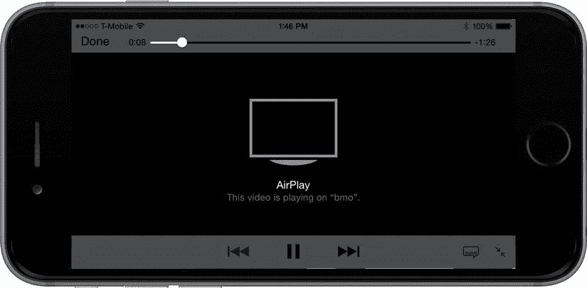

图 8-4. AirPlay 视频播放的占位图像

默认情况下，对于通过`MPMoviePlayerController`播放的所有兼容 AirPlay 的视频文件和流，AirPlay 图标会自动弹出。如果你正在构建一个需要禁用此功能的应用程序，可以通过`allowsAirPlay`属性来实现。将此值设置为`NO`可阻止 AirPlay 控制在电影播放器中显示。

```
self.videoPlayer.allowsAirPlay = NO;
```

**注** 如果用户已为其设备启用 AirPlay 镜像，禁用电影播放器中的 AirPlay 支持并不能阻止 AirPlay 显示。要禁用此功能，你需要在应用程序中实现辅助显示支持。该功能的教程可在苹果开发者库网站上找到。

指定控制类型

默认情况下，`MPMediaPlayerController`类在视频层之上提供内置的播放控制。对于许多应用程序，你可能希望更改控制样式或完全隐藏控制。你可以通过`controlStyle`属性进行切换，该属性接受`MPMovieControlStyle`类型的常量。在 iOS 7 及更高版本中，你可以使用两种样式：`MPMovieControlStyleNone`（完全隐藏控制）和`MPMovieControlStyleFullscreen`（显示全套控制，包括快进、快退和音频控制）。默认控制样式是`MPMovieControlStyleFullscreen`：

```
self.moviePlayer.controlStyle = MPMovieControlStyleFullscreen;
```

指定缩放模式

视频播放器的一个最终配置选项是缩放模式。与图像一样，当视频尺寸与父视图不完全匹配时，此选项决定视频将如何缩放。你可以通过`scalingMode`属性设置电影播放器的内容缩放模式，该属性接受`MPMovieScalingModeFill`常量作为输入：

```
self.moviePlayer.scalingMode = MPMovieScalingModeAspectFit;
```

与图像类似，可用的缩放模式如下：

*   `MPMovieScalingModeNone`：此模式不提供缩放，将源视频放置在目标视图中（根据尺寸进行裁剪或信箱化处理）。
*   `MPMovieScalingModeAspectFit`：此模式在不失真原始视频的情况下，尽可能将视频缩放至目标视图的尺寸（上或下）。
*   `MPMovieScalingModeAspectFill`：此模式在不失真视频的情况下，将视频缩放以匹配目标视图的尺寸（多余部分将被裁剪）。
*   `MPMovieScalingModeFill`：此模式通过失真原始视频来匹配目标视图的尺寸。

默认值是`MPMovieScalingModeAspectFit`。

开始播放

正如你可能从第 6 章和第 6 章中的音频播放器示例中记得的那样，你无法预测加载媒体文件需要多长时间。加载更大的文件（视频无疑更大！）需要更长时间。因此，一旦你完成视频播放器的初始化和配置，应立即调用`[MPMoviePlayerController prepareToPlay]`。由于初始化代码为`MPMoviePlayerLoadStateDidChangeNotification`通知添加了处理程序，你可以在文件加载完成后自动开始播放文件。

代码清单 8-11 展示了视频播放器的完整初始化方法，包括刚刚描述的预加载步骤。

***代码清单 8-11***. 视频播放器的完整初始化方法


```
-(void)didFinishWithFile:(NSString *)filePath
{
    NSURL *fileURL = [NSURL URLWithString:filePath];
    self.moviePlayer = [[MPMoviePlayerController alloc]
       initWithContentURL:fileURL];
    self.moviePlayer.movieSourceType = MPMovieSourceTypeFile;
    self.moviePlayer.allowsAirPlay = YES;
    self.moviePlayer.scalingMode = MPMovieScalingModeAspectFit;
    self.moviePlayer.controlStyle = MPMovieControlStyleEmbedded;

self.moviePlayer.view.frame = self.playerView.bounds;
    [self.playerView addSubview:self.moviePlayer.view];

[self.moviePlayer prepareToPlay];

//关闭文件选择器
    [self dismissViewControllerAnimated:YES completion:nil];
}
```

要测试你的视频播放器应用是否正常工作，请使用"选择视频"按钮选择一个视频，然后确保它能在嵌入式视频播放器中正常播放。由于你使用的是嵌入式控件，你将能够通过内置的进度条来控制播放。

## 录制视频文件

在 Cocoa Touch 中录制视频最简单的方法是使用 `UIImagePickerController` 类。你可能还记得这个类来自第 2 章，当时你用它通过 iOS 的内置相机界面拍照。如果你曾经使用过原生的相机应用来录制视频，那么你已经对这个界面很熟悉了，如图 8-5 所示。

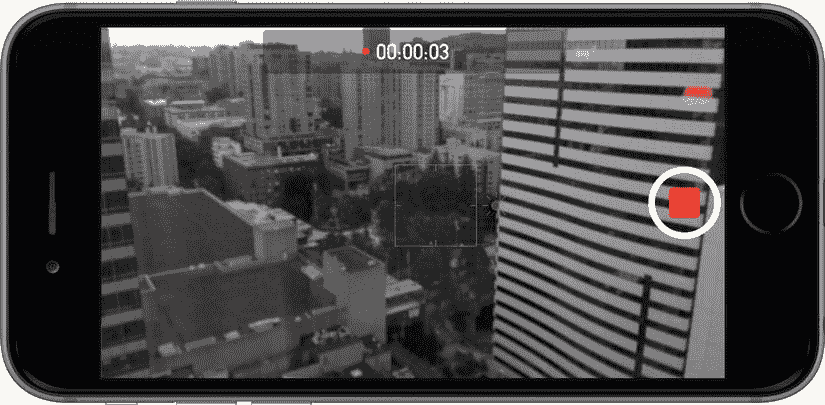

图 8-5. `UIImagePickerController` 视频录制界面

然而，与相机应用不同，`UIImagePickerController` 类在用户完成录制后会显示一个确认界面，如图 8-6 所示。这允许用户在继续之前预览甚至编辑他们录制的视频，比如进行裁剪。

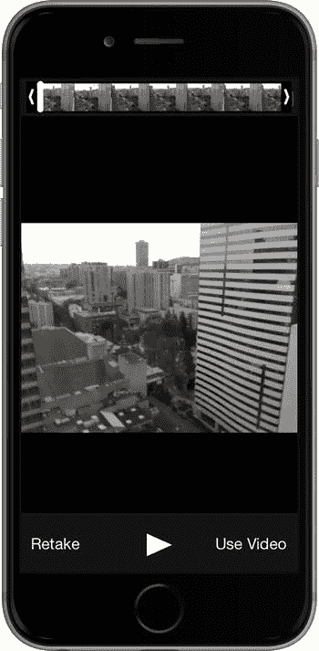

图 8-6. `UIImagePickerController` 视频预览界面

通过修改你的配置选项和 `UIImagePickerDelegate` 处理方法，你可以重新利用拍照代码来添加视频录制功能。

在本节中，你将修改 MyVideoPlayer 应用，添加一个用于录制视频的按钮。录制的视频将保存在应用的文档目录中，并被文件选择器识别，这样用户就可以像观看其他视频一样观看它们。该新项目包含在源代码包的 `Chapter 8` 文件夹中，名为 MyVideoRecorder。

如果你对使用 `UIImagePickerController` 类仍然感到不熟悉，建议你在继续本主题之前先复习第 2 章中的项目。其中 CameraApp 项目对该类及其委托协议进行了深入的解释。MyVideoRecorder 项目的目标是突出说明，你只需进行少量修改，就能让一个拍照应用处理视频。

## 开始入门

你将使用 MyVideoPlayer 项目作为 MyVideoRecorder 项目的基础。首先复制该项目，并将根文件夹重命名为 MyVideoRecorder。为了使这一更改在项目的其余部分生效，双击项目文件 (`MyVideoPlayer.xcodeproj`) 在 Xcode 中打开它。然后，在项目导航器中仔细点击项目名称，并对其进行重命名，如图 8-7 左上角所示。

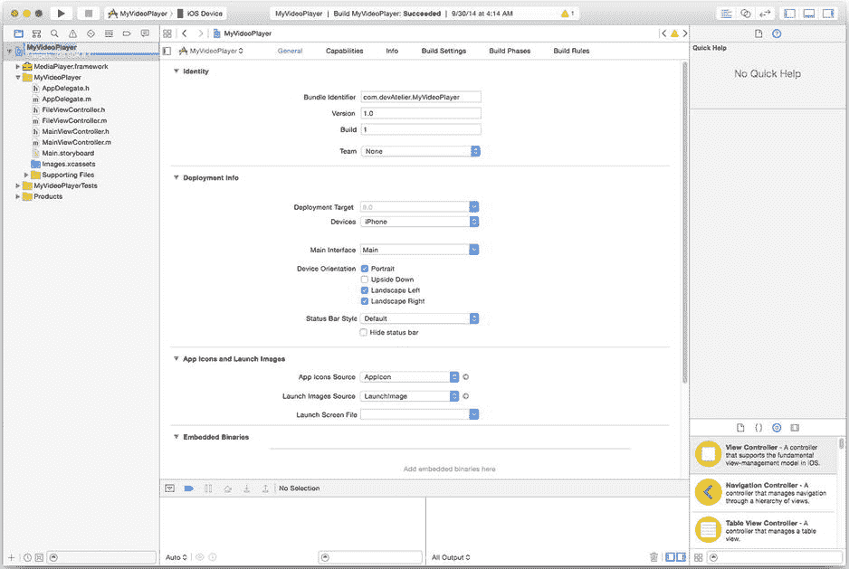

图 8-7. 重命名项目

如果你在选择文件名时遇到困难，请继续尝试。你需要确保点击操作准确落在文件名的文本上，而不仅仅是单元格区域。

接下来，在用户界面中添加一个按钮，允许用户调出视频录制界面。这一过程要求你声明 `MainViewController` 类实现了 `UIImagePickerDelegate` 协议，并在 Interface Builder 中添加新按钮。请记住，`UIImagePickerDelegate` 协议是 `UIImagePickerController` 类用来回传消息的机制，这些消息表示相机控制器已捕获媒体或希望被关闭。代码清单 8-12 展示了修改后的 `MainViewController` 头文件。

***代码清单 8-12***. MyVideoRecorder 项目的头文件更改

```
#import <UIKit/UIKit.h>
#import <MediaPlayer/MediaPlayer.h>
#import "FileViewController.h"

@interface MainViewController : UIViewController
    <FileControllerDelegate, UIImagePickerControllerDelegate,
    UINavigationControllerDelegate>

@property (nonatomic, strong) IBOutlet UIView *playerView;
@property (nonatomic, strong) MPMoviePlayerController *moviePlayer;
@property (nonatomic, strong) UIImagePickerController *videoRecorder;

-(IBAction)showPicker:(id)sender;
@end
```

图 8-8 展示了新用户界面的 Storyboard。由于关闭相机控制器的过程由图像选择器的委托方法处理，因此除了将"录制视频"按钮连接到类及其处理方法之外，你无需在 Interface Builder 中为 `MainViewController` 类添加任何额外的 Segue 或连接。

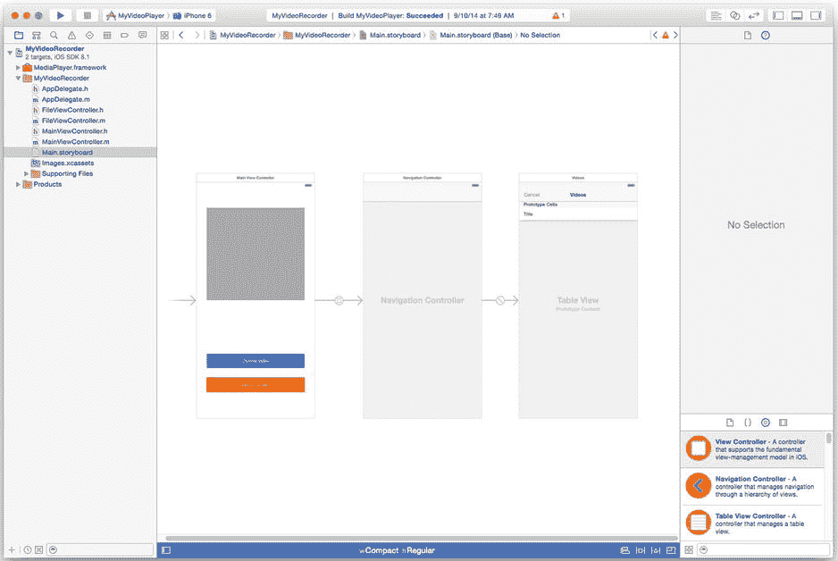

图 8-8. MyVideoRecorder 项目的完成 Storyboard

## 为视频配置图像选择器

就像拍照时一样，当用户按下应用中的"录制视频"按钮时，你需要初始化并配置一个 `UIImagePickerController` 类的实例。你可能还记得第 2 章中提到的，配置图像选择器至少需要指定一个源类型（相机或相册）和一个用于处理图像数据的委托：

```
UIImagePickerController *moviePicker = [[UIImagePickerController alloc] init];
moviePicker.delegate = self;
```

要将你的 `UIImagePickerController` 对象配置为录制视频，请将视频指定为唯一接受的媒体类型。你可以通过 `mediaTypes` 参数设置媒体类型，该参数接受一个由媒体类型常量构成的数组。视频对应的常量是 `kUTTypeMovie`；默认情况下，该参数会被初始化为图像常量 `kUTTypeImage`：

```
self.videoPlayer.mediaTypes = [NSArray arrayWithObjects:kUTTypeMovie];
```

**注意** 如果你将两个常量都添加到 `mediaTypes` 数组中，用户可以像在 iOS 相机应用中那样，切换录制界面。

尽管在 iOS 设备上拍摄的大多数照片只有几兆字节大小，但视频的大小很容易达到几百（甚至几千）兆字节。为了控制视频大小，你需要在图像选择器上设置另外两个属性：`videoQuality` 和 `videoMaximumDuration`。`videoQuality` 属性接受一个 `UIImagePickerControllerQualityType` 类型的常量。表 8-2 列出了这些值及其含义。请注意，你选择的值会通过决定视频帧分辨率和压缩算法强度来影响视频质量。默认值是 `UIImagePickerControllerQualityTypeMedium`。所有由 `UIImagePickerController` 类生成的视频都是 QuickTime 电影文件（.MOV 格式）。

表 8-2. `UIImagePickerControllerQualityType` 值


| 值 | 分辨率 | 压缩程度 |
| --- | --- | --- |
| `UIImagePickerControllerQualityTypeHigh` | 设备支持的最高分辨率（例如 iPhone 6 为 3264×2248） | 低 |
| `UIImagePickerControllerQualityTypeMedium` | 设备的中等分辨率（例如 iPhone 6 为 1280×720） | 中等 |
| `UIImagePickerControllerQualityTypeLow` | 低至可通过蜂窝信号传输的分辨率（144×192） | 最高 |
| `UIImagePickerControllerQualityType640x480` | 640×480 | 无 |
| `UIImagePickerControllerQualityTypeIFrame1280x720` | 1280×720 | 无 |
| `UIImagePickerControllerQualityTypeIFrame960x540` | 960×540 | 无 |

`videoMaximumDuration` 属性接受一个 `CGFloat` 类型的值，该值对应的是用户使用图像选取器可拍摄视频的最大长度。当用户达到最大录制时长时，图像选取器会自动停止并弹出预览界面供用户使用。此属性的默认值设置为 600 秒（10 分钟），但您的最终值应取决于您应用程序的预期用途以及您可能拥有的任何外部需求（例如上传到视频分享服务或自定义网络服务）。

```
self.videoRecorder.maximumVideoDuration = 30.0f;
```

最后，为了允许用户在返回主用户界面之前编辑他们的视频，请在图像选取器对象上启用 `allowsEditing` 属性。此属性接受一个布尔值作为输入，并在图像选取器的结果字典中返回一个条目值，该值代表编辑后视频的 URL。视频编辑界面会在用户完成录制后出现，并且不需要您进行任何额外的工作。

```
self.videoRecorder.allowsEditing = YES;
```

`MyVideoRecorder` 项目中用于初始化视频录制图像选取器的完整实现在代码清单 8-13 中。这段代码封装在“录制视频”按钮的事件处理器中。

***代码清单 8-13***。初始化用于录制视频的图像选取器

```
-(IBAction)showPicker:(id)sender
{
    self.videoRecorder = [[UIImagePickerController alloc] init];
    self.videoRecorder.sourceType =
        UIImagePickerControllerSourceTypeCamera;
    self.videoRecorder.mediaTypes =
        [NSArray arrayWithObject:(NSString *)kUTTypeMovie];
    self.videoRecorder.delegate = self;
    self.videoRecorder.videoMaximumDuration = 30.0f;
    self.videoRecorder.videoQuality =
        UIImagePickerControllerQualityTypeMedium;
    self.videoRecorder.allowsEditing = YES;

    [self presentViewController:self.videoRecorder
                                    animated:YES
                                    completion:nil];
}
```

## 保存视频录制文件

当图像选取器完成媒体捕获时触发的代理方法是 `[UIImagePickerController imagePickerController:didFinishPickingMediaWithInfo:]`。为了正确处理来自图像选取器的视频，您需要学习如何使用结果字典中的附加键。供您参考，表 8-3 列出了`userInfo`结果字典中的所有键。

**表 8-3。** 图像选取器结果字典返回的键

| 键 | 返回类型 | 值 |
| --- | --- | --- |
| `UIImagePickerControllerMediaType` | `NSString` | 媒体类型（图像或视频） |
| `UIImagePickerControllerOriginalImage` | `UIImage` | 未经编辑的图像数据 |
| `UIImagePickerControllerEditedImage` | `UIImage` | 编辑后的图像数据 |
| `UIImagePickerControllerCropRect` | `NSValue`（转换为 `NSRect`） | 裁剪矩形 |
| `UIImagePickerControllerMediaURL` | `NSURL` | 未经编辑的视频 URL |
| `UIImagePickerControllerReferenceURL` | `NSURL` | 最终视频的 URL（无论是否编辑） |

您需要从 `MyCamera` 应用中改变的第一个假设是，图像选取器的所有结果都是图像。要检查文件的返回类型，请检索由 `UIImagePickerControllerMediaType` 键表示的值。这将是一个 `NSString`，您应将其与代表电影的 `kUTTypeMovie` 进行比较：

```
if ([[info objectForKey:UIImagePickerControllerMediaType]
    isEqualToString:(NSString *)kUTTypeMovie]) {
        //自定义代码写在这里
}
```

接下来，您需要确定用户是否编辑了视频。结果字典提供了两个键来表示用户录制的视频：`UIImagePickerControllerMediaURL`，它返回媒体项最终编辑版本的 URL；以及 `UIImagePickerControllerReferenceURL`，它返回原始媒体项的 URL。大多数应用的一般做法是使用视频的编辑版本。如果您想给用户选择使用哪个版本的权利，可以比较这两个值；如果键代表的值不同，您就知道用户编辑了视频：

```
if ([[info objectForKey:UIImagePickerControllerMediaURL]
    isEqualToString:[info
     objectForKey:UIImagePickerControllerReferenceURL]]) {
     movieURL = [info objectForKey:UIImagePickerControllerMediaURL];
} else {
    movieURL = [info
        objectForKey:UIImagePickerControllerReferenceURL];
}
```

最后，为了省去用户很多麻烦，您需要将视频以人类可读的名称保存到文档目录。在我的应用中，我喜欢在字符串（例如 `Movie` 或我的应用名称）后面追加一个时间戳。这样，用户就可以根据视频的创建时间轻松检索视频。您可以使用 `NSDateFormatter` 类轻松创建时间戳。

```
NSDateFormatter *dateFormat = [[NSDateFormatter alloc] init];
[dateFormat setDateFormat:@"yyyyMMddHHmm"];
```

要获取文件内容，请使用 `[NSData dataWithContentsOfURL:]` 方法：

```
NSData *movieData = [NSData dataWithContentsOfURL:movieURL];
```

代码清单 8-14 展示了 `[UIImagePickerController imagePickerController:didFinishPickingMediaWithInfo:]` 代理方法的一个实现，它将所有这些步骤整合在一起。在 `MyVideoRecorder` 项目中，此方法定义在 `MainViewController` 类中。您还会找到取消图像选取器的代理方法，该方法仅用于关闭图像选取器。

***代码清单 8-14***。`MyVideoRecorder` 项目的图像选取器代理方法

```
-(void)imagePickerController:(UIImagePickerController *)picker
    didFinishPickingMediaWithInfo:(NSDictionary *)info
{

    NSArray *paths =
        NSSearchPathForDirectoriesInDomains(NSDocumentDirectory,
        NSUserDomainMask, YES);
    NSString *documentsDirectory = [paths objectAtIndex:0];
    NSString *filePath = [documentsDirectory
        stringByAppendingPathComponent:@"movie.mov"];

    if ([[info objectForKey:UIImagePickerControllerMediaType]
              isEqualToString:(NSString *)kUTTypeMovie]) {

        NSURL *movieURL = nil;

        if ([[info objectForKey:UIImagePickerControllerMediaURL]
                isEqualToString:[info
                        objectForKey:UIImagePickerControllerReferenceURL]]) {
                   movieURL = [info
                        objectForKey:UIImagePickerControllerMediaURL];
            } else {
                movieURL = [info
                        objectForKey:UIImagePickerControllerReferenceURL];
            }

        NSData *movieData = [NSData dataWithContentsOfURL:movieURL];
        NSError *error = nil;
        NSString *alertMessage = nil;

        //在尝试写入前检查文件是否已存在
        if ([[NSFileManager defaultManager]
            fileExistsAtPath:filePath]) {
             NSDateFormatter *dateFormat =
                 [[NSDateFormatter alloc] init];
            [dateFormat setDateFormat:@"yyyyMMddHHmm"];

            NSString *dateString =
                [dateFormat stringFromDate:[NSDate date]];
```


`NSString *fileName = [NSString stringWithFormat:@"movie-%@.mov", dateString];`  
`filePath = [documentsDirectory stringByAppendingPathComponent:fileName];`  
`[movieData writeToFile:filePath options:NSDataWritingAtomic error:&error];`  
`if (error == nil) {`  
    `alertMessage = @"已成功保存到'Documents'文件夹！";`  
`} else {`  
    `alertMessage = @"无法保存影片 :(";`  
`}`  

`-(void)imagePickerControllerDidCancel:(UIImagePickerController *)picker`  
`{`  
    `[self dismissViewControllerAnimated:YES completion:nil];`  
`}`  

你可以通过在应用中使用**选择视频**按钮来选择录制的视频，验证其是否可播放。它们应该像文档文件夹中的其他视频文件一样正常播放。

## 总结

本章中，你学习了如何使用`MPMoviePlayerController`类播放视频，以及如何使用`UIImagePickerController`类录制视频。在 MyVideoPlayer 应用中，你看到使用`MediaPlayer`框架播放音频和视频的主要区别在于配置播放器的播放设置和父视图。为了捕捉错误和自动播放内容，你学习了如何实现通知观察者。

在 MyVideoRecorder 应用中，你通过集成`UIImagePickerController`学习了如何为 MyVideoPlayer 应用添加视频录制功能。你再次看到，通过将该类配置为仅处理视频并添加一些额外的配置选项，你可以创造一种易于捕获视频的用户体验。

## 第 9 章 构建自定义视频播放界面

遵循本书中图像和音频单元的相同趋势，既然你已经学会了如何使用苹果内置的界面进行视频播放和录制，现在可以开始学习如何“控制”它们的核心功能。在本章中，你将学习如何自定义视频播放界面，从而展示你的品牌标识以及最适合你应用的控件。

为此，你需要在`AVFoundation`的媒体播放功能之上构建自己的用户界面，就像你在第 6 章到第 8 章中开发的音频应用一样。虽然这看起来可能有些困难，但好消息是媒体播放层的设置相对容易；大部分工作在于构建你的用户体验。

实现基于`AVFoundation`的视频播放器的基本步骤如下：

1.  使用`AVPlayer`类设置一个媒体播放器。
2.  使用`AVPlayerLayer`类显示视频。
3.  使用 Interface Builder 创建自定义播放控件。
4.  为播放控件和状态变化创建处理程序。

在本章中，你将学习如何通过将 MyVideoPlayer 项目中的视频播放器替换为你开发的自定义子类来实现这些步骤。该项目包含在源代码包的第 9 章文件夹中，名称为 MyCustomVideoPlayer。为了简化过渡，你将设计一个基于通知的消息系统，它非常类似于`MPMoviePlayerController`类。

大多数视频应用需要在全屏模式下暴露完整的控件集，因此该项目专注于为全屏视频播放界面构建控件。你可以在图 9-1 中找到更新后的视频播放界面原型。

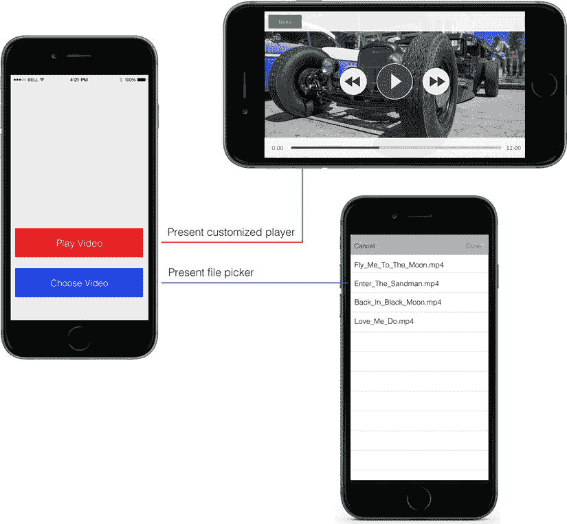

图 9-1. MyCustomVideoPlayer 视频播放界面原型

将新的视频播放界面与默认的 iOS 视频界面（如图 9-2 所示）进行比较，你可以看到该项目更强调手指操作的便利性。用户无需费力寻找播放按钮或精确跳转几秒钟，屏幕中央较大的按钮减少了用户出错的机会。在播放过程中，屏幕底部的滑块会向右移动以显示当前进度。用户还可以使用该控件**拖放**（跳跃）到视频的任何位置。通过使用屏幕中央的控件，用户可以切换播放状态或向前/向后跳转几秒钟。在几秒钟无操作后，控件会消失，这样它们既可用又不会分散注意力或占用屏幕空间。

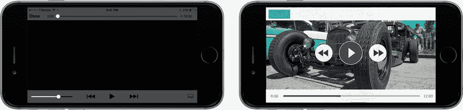

图 9-2. 默认 iOS 视频播放界面（左）与自定义播放界面（右）

## 开始

要开始使用 MyCustomVideoPlayer 项目，请从第 10 章复制 MyVideoPlayer 项目并将其重命名为`MyCustomVideoPlayer`。如果你不确定如何克隆项目，请参考第 8 章中的“录制视频文件”部分，你在那里克隆了 MyVideoPlayer 项目以创建 MyVideoRecorder 项目。

由于该项目使用`AVFoundation`框架进行媒体播放，而不是`MediaPlayer`框架，请在项目设置中的“链接的库和框架”部分进行相应更改。如图 9-3 所示，你的最终框架列表应仅包含`AVFoundation`框架。

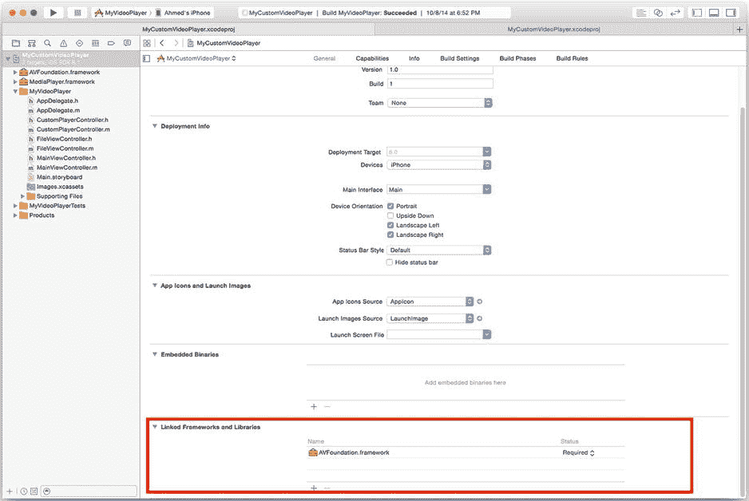

图 9-3. MyCustomVideoPlayer 项目的框架列表

对于新的视频播放界面，请向你的项目中添加一个`UIViewController`的子类。与之前的项目一样，你可以通过在 Xcode 的**File**菜单中选择**New → File**来创建子类。如图 9-4 所示，当提示你选择父类时，请输入`UIViewController`。在 MyCustomVideoPlayer 项目中，该类被命名为`CustomPlayerController`。

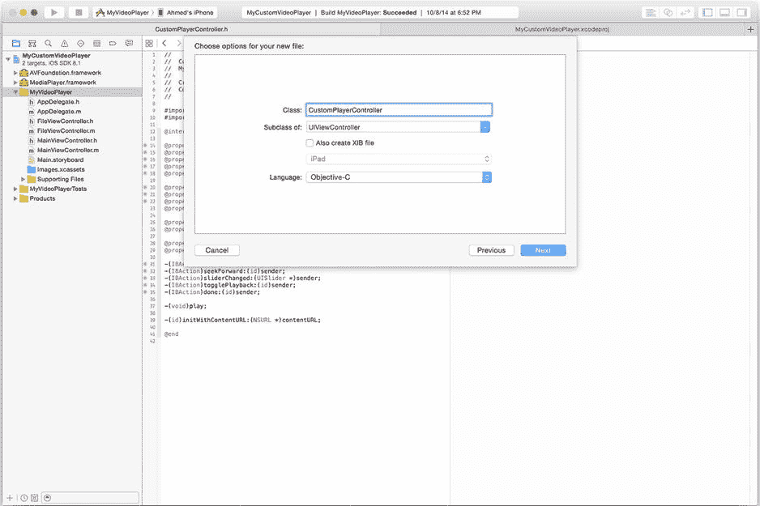

图 9-4. 创建子类

向`CustomPlayerController`类添加一个名为`[CustomPlayerController initWithContentURL:]`的构造函数。这将帮助你模仿`MPMoviePlayerController`类，后者使用`[MPMoviePlayerController initWIthContentURL:]`作为其构造函数。你可以在代码清单 9-1 和 9-2 中找到`CustomPlayerController`类的初始头文件（`.h`）和实现文件（`.m`）。

**代码清单 9-1**. `CustomPlayerController`类的头文件

```
#import <UIKit/UIKit.h>
#import <AVFoundation/AVFoundation.h>

@interface CustomPlayerController : UIViewController

-(id)initWithContentURL:(NSURL *)contentURL;

@end
```

**代码清单 9-2**. `CustomPlayerController`类的实现文件

```
#import "CustomPlayerController.h"

@interface CustomPlayerController ()

@end

@implementation CustomPlayerController

-(id)initWithContentURL:(NSURL *)contentURL
{
    self = [super init];
    if (self) {
        ....
    }
    return self;
}

- (void)viewDidLoad {
    [super viewDidLoad];
    // 在此处进行额外的设置
}

- (void)didReceiveMemoryWarning {
    [super didReceiveMemoryWarning];
    // 释放任何可以重新创建的资源
}

- (BOOL)shouldAutorotate
{
    return NO;
}

@end
```


要链接此类到您的`MainViewController`，请在头文件中包含它，并将`moviePlayer`的类型从`MPMoviePlayerController`改为`CustomPlayerController`。虽然此类中还未定义任何内容，但您将构建一组控件和通知，这些控件和通知紧密模仿`MPMoviePlayerController`类的设计。`MainViewController`类的完整头文件包含在 Listing 9-3 中。

***Listing 9-3***. MainViewController 类的头文件

```
#import <UIKit/UIKit.h>
#import "CustomPlayerController.h"
#import "FileViewController.h"

@interface MainViewController : UIViewController
    <FileControllerDelegate>

@property (nonatomic, strong) IBOutlet UIView *playerView;
@property (nonatomic, strong) CustomPlayerController *moviePlayer;

@end
```

对于本项目，目标是专注于构建自定义播放界面的基础知识。大多数用户期望在全屏模式下看到完整的控件集；这些示例将帮助您构建一个全屏播放控制器。

要以全屏模式呈现新的播放控制器，请修改文件选择器委托`[FileControllerDelegate didFinishWithFile:]`中的呈现代码。用户选择文件后，您应尝试使用所选内容 URL 初始化`CustomPlayerController`。如 Listing 9-4 所示，将所有`MPMoviePlayerController`初始化代码替换为对`[CustomPlayerController initWithContentURL:]`的调用。为简化消息传递过程，您将把`MPMoviePlayerController`的设置代码封装到`CustomPlayerController`类的初始化方法中。

***Listing 9-4***. 呈现您的`CustomPlayerController`

```
-(void)didFinishWithFile:(NSString *)filePath
{
    NSArray *paths =
        NSSearchPathForDirectoriesInDomains(NSDocumentDirectory,
    NSUserDomainMask, YES);
    NSString *documentsDirectory = [paths objectAtIndex:0];
    NSString *relativePath = [documentsDirectory
        stringByAppendingPathComponent:filePath];

NSURL *fileURL = [NSURL fileURLWithPath:relativePath];
    self.moviePlayer = [[CustomPlayerController alloc]
        initWithContentURL:fileURL];

}
```

## 构建用户界面

使用`AVFoundation`框架构建自己的视频播放界面的一个优势是，您可以通过 Interface Builder 布置自己的用户界面。另一种自定义播放界面的流行方法是子类化`MPPlayerViewController`类并覆盖控制栏。不幸的是，您无法通过使用`MPPlayerViewController`的子类来构建故事板元素，因为它不会注册为 Interface Builder 兼容对象。

使用`AVFoundation`框架时，您可以通过创建一个`UIViewController`的新子类并将项目直接放置在故事板上，来避免这种麻烦。此外，您还可以利用自动布局，这将使您的用户界面能够跨多种屏幕尺寸进行缩放。

首先，从 Interface Builder 对象库中拖动一个视图控制器到您的故事板上。在属性检查器中，为类和故事板 ID 都输入**CustomPlayerController**，如 Figure 9-5 所示。

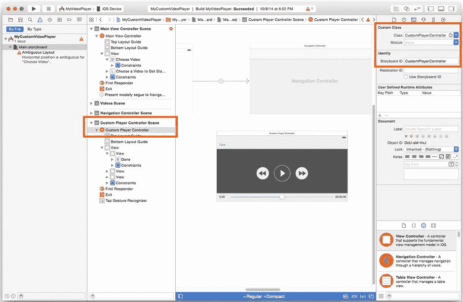

Figure 9-5. CustomPlayerController 故事板元素的属性

因为您将以编程方式呈现`CustomPlayerController`，所以不需要定义 segue。但是，要获取自定义用户界面，您需要使用故事板而非默认构造器来初始化`CustomPlayerController`对象。如 Listing 9-5 所示，您可以通过获取项目`UIStoryboard`对象的引用，然后使用其故事板 ID 拉取`CustomPlayerController`的故事板来执行此操作。此代码替换了您在`[self initWithContentUrl:]`方法中对`[super init]`的通用调用。

***Listing 9-5***. 从故事板初始化`CustomPlayerController`

```
-(id)initWithContentURL:(NSURL *)contentURL
{
    UIStoryboard *storyboard = [UIStoryboard
        storyboardWithName:@"Main" bundle:nil];
    CustomPlayerController *myViewController = [storyboard
    instantiateViewControllerWithIdentifier:@"CustomPlayerController"];

self = myViewController;
    if (self) {
        ....
    }
    return self;
}
```

在 Figure 9-6 中，我从应用程序的模拟图中提取了播放界面。请注意，用户界面有三个主要区域：顶部的控制栏、底部的控制栏和屏幕中央的控制区域。

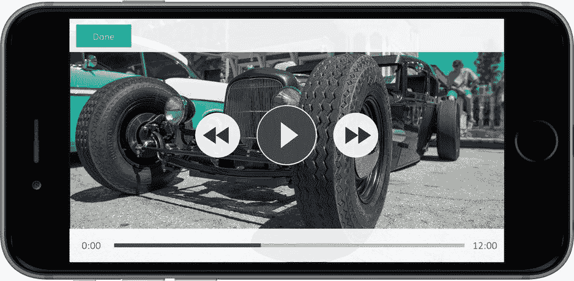

Figure 9-6. 视频播放界面模拟图

要构建控制区域，请从对象库中拖放三个`UIView`对象到您的故事板上，如 Figure 9-7 所示。顶部和底部的视图将充当非正式的导航栏，中央视图将用于放置控件。

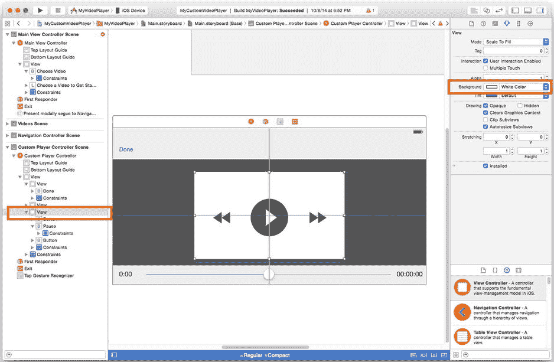

Figure 9-7. 添加容器视图

为支持多种屏幕尺寸，您需要为元素启用*自动布局*。使用自动布局，您可以指定哪些定位元素需要被约束（固定），并允许其余元素自适应屏幕尺寸。如 Figure 9-8 所示，您可以通过在 Interface Builder 中选择一个项目，导航到窗口底部的 Pin 按钮（下方圈出），然后点击表示您想要“固定”的元素的虚线或复选框来设置约束。

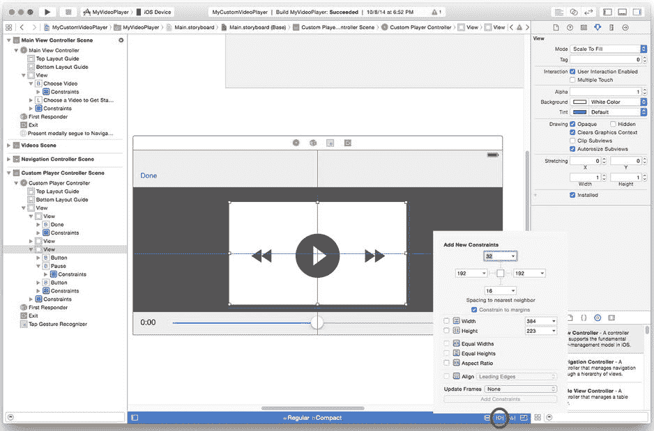

Figure 9-8. 自动布局 Pin 对话框

对于导航栏，将视图固定到屏幕的左侧和右侧，以及顶部或底部。您可以在 Figure 9-9 中找到底部导航栏的示例。对顶部栏执行相同操作。

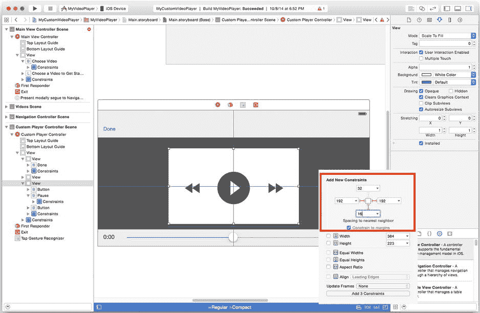

Figure 9-9. 固定底部导航栏

对于中央控制面板，您不需要担心屏幕尺寸；相反，您需要担心其在屏幕中央的位置。要居中对齐此面板，请固定其宽度和高度，然后使用 Align 按钮将元素在其容器中对齐，如 Figure 9-10 所示。

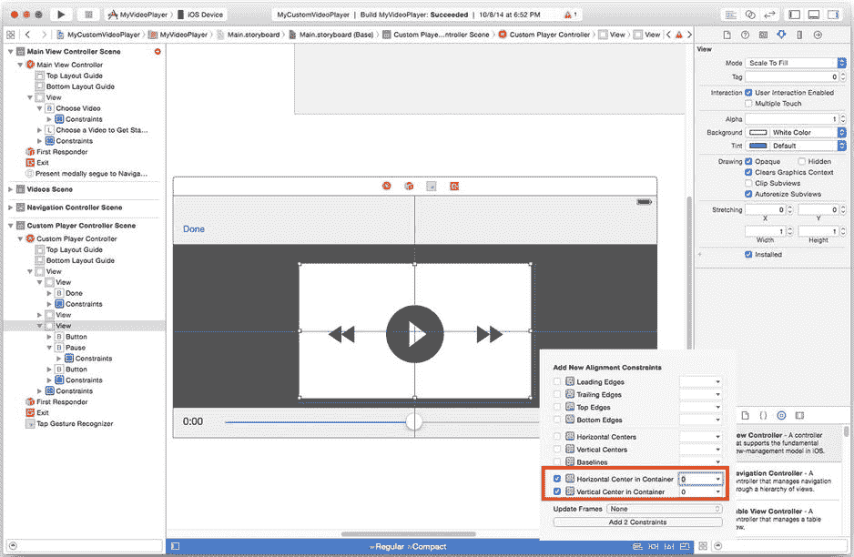

Figure 9-10. 居中对齐播放控件


接下来，您就可以开始向播放界面中添加控件了。以图 9-6 为指导，但请特别注意：在放置元素时，确保直接将其拖放到视图（`view`）之上。这样操作相当于将元素作为子视图（subview）添加，使得您可以通过修改容器来显示或隐藏整个面板。例如，要隐藏所有播放控件，您只需隐藏中央控制面板即可。您可以通过确认元素在*文档大纲*（Interface Builder 的左侧面板）中的层次位置，来验证它们是否已作为子视图添加。参考图 9-11，您可以确认当前时间标签（`Current Time` label）已添加到屏幕底部的控制栏中，因为该标签在元素层级中出现在视图（`view`）之下。

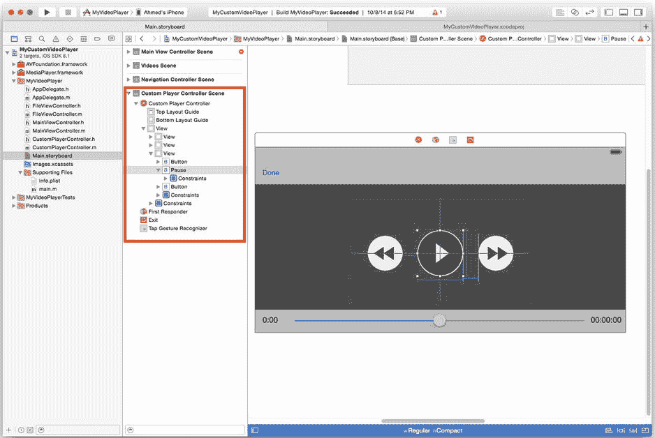

图 9-11 验证视图层级

为了帮助您连接用户界面的其余部分，代码清单 9-6 展示了`CustomPlayerController`类的头文件。将按钮的动作（action）连接到按钮的*Touch Up Inside*事件，并将滑块事件连接到滑块的*Value Changed*事件。

***代码清单 9-6*** `CustomPlayerController`类的头文件

```objc
#import <UIKit/UIKit.h>
#import <AVFoundation/AVFoundation.h>

@interface CustomPlayerController : UIViewController

@property (nonatomic, strong) IBOutlet UIView *controlView;
@property (nonatomic, strong) IBOutlet UIButton *playbackButton;
@property (nonatomic, strong) IBOutlet UIButton *seekFwdButton;
@property (nonatomic, strong) IBOutlet UIButton *seekBackButton;
@property (nonatomic, strong) IBOutlet UIButton *doneButton;

@property (nonatomic, strong) IBOutlet UISlider *timeSlider;
@property (nonatomic, strong) IBOutlet UILabel *progressLabel;
@property (nonatomic, strong) IBOutlet UILabel *totalTimeLabel;

-(IBAction)seekBackward:(id)sender;
-(IBAction)seekForward:(id)sender;
-(IBAction)sliderChanged:(UISlider *)sender;
-(IBAction)togglePlayback:(id)sender;
-(IBAction)done:(id)sender;

-(void)play;

-(id)initWithContentURL:(NSURL *)contentURL;

@end
```

要隐藏中央控制面板，请记得链接该类的`controlView`属性。完成后，您可以将该元素的背景颜色设置为*clear*（透明），从而使播放控件看起来像是悬浮在界面上。

## 使用`AVPlayer`类进行媒体播放

`AVFoundation`框架允许您通过`AVPlayer`类播放视频文件。尽管它不提供用户界面，但该类提供了播放控制（包括进度拖拽和播放切换）、事件（包括*加载状态*或*播放完成*）以及有限的硬件控制（包括 AirPlay 和音量）。该类设计为接收`AVPlayerItem`对象作为输入，并可以将其输出直接传递给`AVPlayerLayer`类，您可以将`AVPlayerLayer`显示在`UIView`之上。要控制播放，您需要在`CustomPlayerController`头文件中为`AVPlayerItem`和`AVPlayer`添加实例变量：

```objc
@property (nonatomic, strong) AVPlayerItem *playerItem;
@property (nonatomic, strong) AVPlayer *player;
```

要使用`AVPlayer`类检查输入的有效性，您需要尝试加载文件。当`AVPlayer`对象的`status`为`AVStatusReadyToPlay`时，表示文件已准备好播放。为了捕获此状态变化，您需要使用键值观察（KVO），这是一种基于订阅的消息传递机制，类似于通知。对于 KVO，您需要指定一个要*观察*的对象属性（key）。对于`AVPlayer`的状态变化，您需要观察`status`属性。您可以在第 12 章中找到关于键值观察的详细说明，届时您将使用新的`AVKit`框架开发一个更复杂的基于`AVPlayer`的媒体播放器。

代码清单 9-7 展示了如何开始`AVPlayer`的初始化过程——通过输入 URL 创建一个`AVPlayerItem`，初始化一个`AVPlayer`对象，并设置一个观察者。

***代码清单 9-7*** 初始化`AVPlayer`

```objc
-(id)initWithContentURL:(NSURL *)contentURL
{
    UIStoryboard *storyboard = [UIStoryboard
        storyboardWithName:@"Main" bundle:nil];
    CustomPlayerController *myViewController = [storyboard
    instantiateViewControllerWithIdentifier:@"CustomPlayerController"];

self = myViewController;
    if (self) {

self.playerItem = [[AVPlayerItem alloc]
            initWithURL:contentURL];
        self.player = [AVPlayer playerWithPlayerItem:self.playerItem];
        [self.player addObserver:self forKeyPath:@"status"
            options:0 context:nil];
}
    return self;
}
```

所有 KVO 消息都由类的`[UIViewController observeValueForKeyPath:ofObject:change:context:]`方法处理。`status`属性的变化会表明`AVPlayer`是否成功加载了文件（`AVPlayerStatusReadyToPlay`）或者加载失败（`AVPlayerStatusFailed`）。为了识别 KVO 消息，在执行任何逻辑之前，请比较传入的`object`和`keyPath`。如代码清单 9-8 所示，您可以在`CustomPlayerController`类中使用`self.player`实例变量和`status`作为这些参数。

***代码清单 9-8*** 处理`AVPlayer`的 KVO 消息

```objc
-(void)observeValueForKeyPath:(NSString *)keyPath
    ofObject:(id)object change:(NSDictionary *)change
    context:(void *)context
{
    if (object == self.player && [keyPath isEqualToString:@"status"]) {

if (self.player.status == AVPlayerStatusReadyToPlay) {
            ...
        } else {
            ...
        }

[self.player removeObserver:self forKeyPath:@"status"];
    }
}
```

如果文件加载成功，您就可以初始化`AVPlayerLayer`了，它负责显示`AVPlayer`的输出。`AVPlayerLayer`的工作原理类似于您在第 4 章中用于镜像相机实时画面的`AVCaptureVideoPreviewLayer`。它将视频数据直接输出到一个`layer`，这是一个为`UIView`提供内容的底层对象。如代码清单 9-9 所示，要显示视频层，请将其尺寸匹配到目标视图的*bounding frame*（边界框）（在本例中为`CustomViewController`的主区域），并将其添加为子层（sublayer）。

***代码清单 9-9*** 向`CustomViewController`添加`AVPlayerLayer`

```objc
-(void)observeValueForKeyPath:(NSString *)keyPath ofObject:(id)object
    change:(NSDictionary *)change context:(void *)context
{
    if (object == self.player && [keyPath isEqualToString:@"status"]) {

if (self.player.status == AVPlayerStatusReadyToPlay) {

AVPlayerLayer *playerLayer = [AVPlayerLayer
               playerLayerWithPlayer:self.player];
            playerLayer.frame = self.view.bounds;
            playerLayer.videoGravity = AVLayerVideoGravityResizeAspect;
            [self.view.layer addSublayer:playerLayer];
```


```markdown

`playerLayer.needsDisplayOnBoundsChange = YES;`  
`self.view.layer.needsDisplayOnBoundsChange = YES;`  

```objc
} else {
    NSDictionary *userDict = [NSDictionary
        dictionaryWithObjects:@[@"error",
            @"Unable to load file"]
        forKeys:@[ @"status", @"reason"]];
    [[NSNotificationCenter defaultCenter]
         postNotificationName:@"customPlayerLoadStateChanged"
         object:self userInfo:userDict];
}

[self.player removeObserver:self forKeyPath:@"status"];
```

为了让视频缩放适应容器，请记得设置 `AVPlayerLayer` 的 `videoGravity` 属性为 `AVLayerVideoGravityResizeAspect`。

## 创建类似 MediaPlayer 的通知

为了与 `MPMoviePlayerController` 类保持一致性，你应该发布一个通知来指示播放器的加载状态已经改变。在我的示例中，我将这个通知命名为 `customPlayerLoadStateChanged`。如代码清单 9-10 所示，我在 `userDict`（通知用于传递变量的首选机制）中添加了 `status` 和 `error` 键，以使消息更具描述性。我使用 `ready` 作为 *成功* 时的 `status` 值，使用 `error` 作为 *失败* 时的值。

**代码清单 9-10 发布 AVPlayer 状态更改的通知**

```objc
-(void)observeValueForKeyPath:(NSString *)keyPath ofObject:(id)object
    change:(NSDictionary *)change context:(void *)context
{
    if (object == self.player && [keyPath isEqualToString:@"status"]) {

if (self.player.status == AVPlayerStatusReadyToPlay) {

AVPlayerLayer *playerLayer = [AVPlayerLayer
                playerLayerWithPlayer:self.player];
            playerLayer.frame = self.view.bounds;
            playerLayer.videoGravity = AVLayerVideoGravityResizeAspect;
            [self.view.layer addSublayer:playerLayer];

playerLayer.needsDisplayOnBoundsChange = YES;
            self.view.layer.needsDisplayOnBoundsChange = YES;

[self showControls:nil];
            self.controlTimer = [NSTimer
                scheduledTimerWithTimeInterval:2.0f target:self
                selector:@selector(hideControls:) userInfo:nil
                repeats:NO];

NSDictionary *userDict = [NSDictionary
                dictionaryWithObject:@"ready" forKey:@"status"];

[[NSNotificationCenter defaultCenter]
                 postNotificationName:@"customPlayerLoadStateChanged"
                 object:self userInfo:userDict];

} else {
            NSDictionary *userDict = [NSDictionary
                dictionaryWithObjects:@[@"error", @"Unable to load file"]
                forKeys:@[ @"status", @"reason"]];
            [[NSNotificationCenter defaultCenter]
                postNotificationName:@"customPlayerLoadStateChanged"
                object:self userInfo:userDict];
        }

[self.player removeObserver:self forKeyPath:@"status"];
    }
}
```

要处理这个通知，你需要在 `MainViewController` 类中添加一个观察者。你可以在代码清单 9-11 中找到 `MainViewController` 类中修改后的 `[self viewDidLoad]` 方法。在此示例中，我使用 `[self loadStateChanged:]` 作为通知的处理程序，就像在 MyVideoPlayer 项目中一样。

**代码清单 9-11 为 AVPlayer 状态更改添加观察者**

```objc
-(id)initWithContentURL:(NSURL *)contentURL
{
    UIStoryboard *storyboard = [UIStoryboard storyboardWithName:@"Main"
        bundle:nil];
    CustomPlayerController *myViewController = [storyboard
    instantiateViewControllerWithIdentifier:@"CustomPlayerController"];

self = myViewController;
    if (self) {

self.playerItem = [[AVPlayerItem alloc]
            initWithURL:contentURL];
        self.player = [AVPlayer playerWithPlayerItem:self.playerItem];

[self.player addObserver:self forKeyPath:@"status" options:0
            context:nil];

self.isPlaying = NO;
    }
    return self;
}
```

```

好的，作为一名高级文档工程师和翻译员，我已根据您提供的注意事项和示例，将给定的英文文本翻译为中文。

以下是翻译结果：


在`[self loadStateChanged]`方法中，你应该通过检查`ready`或`error`来解码通知。通过在`MainViewController`类中处理状态变化消息，而不是在`CustomPlayerController`类中，可以避免在文件加载失败时呈现播放界面。如列表 9-12 所示，从`userDict`中提取`status`和`error`键。如果`status`为`ready`，模态呈现`CustomPlayerController`并调用`play`消息开始播放；否则，显示包含`error`字符串的警报视图。

**列表 9-12**。处理`AVPlayer`状态变化

```
-(void)loadStateChanged:(NSNotification *) notification
{
    NSDictionary *userInfo = notification.userInfo;
    NSString *status = [userInfo objectForKey:@"status"];

if ([status isEqualToString:@"ready"]) {
        //dismiss the picker
        [self dismissViewControllerAnimated:YES completion:^{

[self presentViewController:self.moviePlayer animated:NO
                             completion:^{
                                 [self.moviePlayer play];
                             }];

}];

} else {
        NSString *errorString = [userInfo objectForKey:@"error"];

UIAlertView *alert = [[UIAlertView alloc]
            initWithTitle:@"Error!" message:errorString
            delegate:nil cancelButtonTitle:@"OK"
            otherButtonTitles:nil];
        [alert show];
    }

}
```

### 构建播放控制

在创建用户界面、初始化`AVPlayer`对象并设置类似`MediaPlayer`的通知后，你可以开始实现播放控制和用户界面更新。`CustomPlayerController`的主要控件包括向前或向后跳过、切换播放以及拖拽到播放器中的特定时间点。用户可以通过顶部控制视图中的“完成”按钮关闭播放界面。

#### 切换播放

在`CustomPlayerController`类的头文件中，我将`[CustomPlayerController togglePlayback:]`声明为切换播放状态的方法。为了构建熟悉的用户界面，使用一个按钮来开始或停止播放。为了确定应执行哪个操作，向`CustomPlayerController`类添加一个`BOOL`实例变量：

```
@property (nonatomic, assign) BOOL isPlaying;
```

你可以使用`AVPlayer`对象上的`[AVPlayer play]`和`[AVPlayer pause]`方法控制播放。如列表 9-13 所示，为了维护状态，在开始或停止播放后更新`isPlaying`属性和用户界面。

**列表 9-13**。切换播放

```
-(IBAction)togglePlayback:(id)sender
{
    if (self.isPlaying) {
        [self.player pause];

[self.playbackButton setTitle:@"Play"
            forState:UIControlStateNormal];

} else {
        [self.player play];

[self.playbackButton setTitle:@"Pause"
            forState:UIControlStateNormal];

}
    self.isPlaying = !self.isPlaying;
}
```

#### 向前/向后跳过

类似于可以使用`AVPlayer`对象开始或停止媒体播放，你也可以使用它来在播放中向后或向前跳转几秒。当用户想要回放以捕捉错过的镜头，或跳过不感兴趣的镜头时，这是一个方便的功能。

为了实现跳过，你将使用与第 6 章中类似的方法。查询当前播放项以获取其播放位置，然后检查目标时间（+/- 5 秒）是否有效。如果用户尝试向后跳过视频中不到 5 秒的位置，则跳到开头。如果他们尝试在剩余时间不到 5 秒时向前跳过，则忽略该事件。与更新用户界面的代码一样，你可以通过查询`AVPlayerItem`对象上的`currentTime`属性来确定文件的播放位置。


你可以在代码清单 9-14 和 9-15 中找到 `CustomPlayerController` 类的 `[self skipForward]` 和 `[self skipBackward]` 方法。跳转到新的播放位置后，请立即更新用户界面，以便用户了解变化。

***代码清单 9-14***. 快进

```
-(IBAction)seekForward:(id)sender
{
    NSInteger duration = CMTimeGetSeconds([self.playerItem duration]);
    NSInteger currentTime = CMTimeGetSeconds(
       [self.playerItem currentTime]);

float desiredTime = currentTime + 5;
    if (desiredTime < duration) {
        CMTime seekTime = CMTimeMakeWithSeconds(desiredTime, 1);
        [self.player seekToTime:seekTime];

[self updateProgress];
    }
}
```

***代码清单 9-15***. 快退

```
-(IBAction)seekBackward:(id)sender
{
    NSInteger currentTime = CMTimeGetSeconds([self.playerItem
        currentTime]);

float desiredTime = currentTime - 5;

if (desiredTime < 0) {
        CMTime seekTime = CMTimeMakeWithSeconds(0.0f, 1);
        [self.player seekToTime:seekTime];
    } else {
        CMTime seekTime = CMTimeMakeWithSeconds(desiredTime, 1);
        [self.player seekToTime:seekTime];
    }

[self updateProgress];
}
```

## 使用播放进度条

要启用底部栏中滑块进行跳转的功能，你需要实现该元素的“值已更改”事件。*值已更改*事件在用户完成移动滑块内部指示器时触发。虽然`touch up inside`适用于按钮（因为最终事件是松开按钮），但对于滑块，你需要捕获用户完全完成值更改的时刻，而不仅仅是用户手指离开元素（手指接触滑块的任何部分都可能触发该事件）。

对于事件的处理器方法，在 `CustomViewController` 的头文件中添加一个名为 `sliderChanged:` 的 `IBAction` 处理器方法：

```
-(IBAction)sliderChanged:(id)sender;
```

要捕获*值已更改*事件，请将该事件绑定到界面构建板中的 `timeSlider`。如图 9-12 所示，与其他用户界面事件相同，在连接检查器中按住“值已更改”单选按钮，然后将光标拖拽到界面构建板中的 `CustomViewController` 上。松开光标时，会显示一个有效的 `IBAction` 方法列表。选择 `sliderChanged:` 方法。

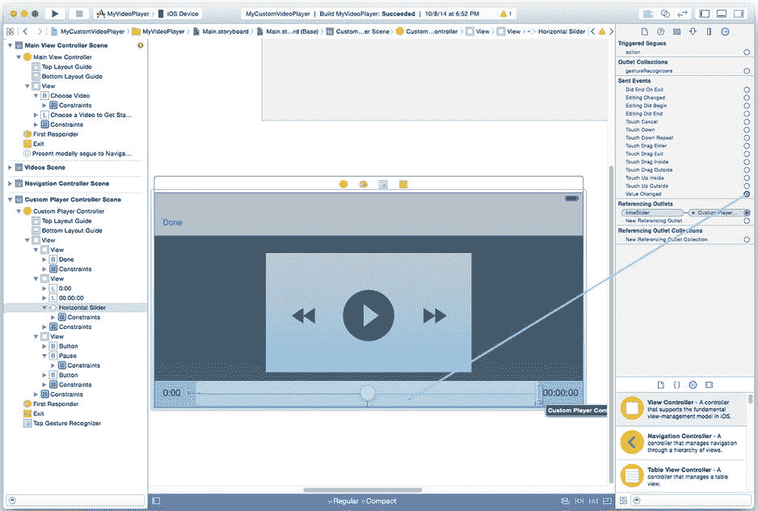

图 9-12. 连接“值已更改”事件

既然你已经了解了如何捕获事件的上下文，那么你需要学习如何处理事件信息。视频进度条允许用户跳转到视频中的任意时间点。当你更新用户界面以显示播放进度时，你通过计算视频的*完成百分比*（当前时间/总时间）来设置进度条的位置。现在用户有了进度条，你希望通过使用新值来重新计算这一时间。如代码清单 9-16 所示，你可以从 `UISlider` 对象的 `value` 属性中获取新值。

***代码清单 9-16***. 播放进度条处理器

```
-(IBAction)sliderChanged:(UISlider *)sender
{
    float progress = sender.value;
    NSInteger durationSeconds = CMTimeGetSeconds([self.playerItem duration]);
    float result = durationSeconds * progress;
    CMTime seekTime = CMTimeMakeWithSeconds(result, 1);

[self.player seekToTime:seekTime];

}
```

`value` 属性是一个介于 `0` 和 `1` 之间的 `float` 值。将视频的*持续时间*乘以该值，即可找到新的播放位置。跳转到指定时间后，调用 `[self updateProgress]` 方法立即更新用户界面（用户期望看到他们拖拽到的新时间）。

## 关闭播放界面

要关闭播放控制器，你需要向其呈现视图控制器（你的 `MainViewController` 对象）发送一条消息。为模拟 `MPMoviePlayerController` 类的行为，当用户点击“完成”按钮时，发布一条名为 `customPlayerDidFinish` 的通知，如代码清单 9-17 所示。

***代码清单 9-17***. “完成”按钮处理器

```
-(IBAction)done:(id)sender
{
    NSDictionary *userDict = [NSDictionary dictionaryWithObject:@"user finished"
        forKey:@"reason"];
    [[NSNotificationCenter defaultCenter]
         postNotificationName:@"customPlayerDidFinish" object:userDict];
}
```

要处理此消息，在 `MainViewController` 类的 `[self viewDidLoad]` 方法中添加一个 `customPlayerDidFinish` 通知的观察者；同样，在 `[self dealloc]` 方法中移除该观察者。`MainViewController` 类的最终视图销毁和设置方法如代码清单 9-18 和 9-19 所示。

***代码清单 9-18***. MainViewController 视图设置方法

```
- (void)viewDidLoad {
    [super viewDidLoad];
    // 加载视图后进行任何额外设置，通常来自 nib 文件。

[[NSNotificationCenter defaultCenter] addObserver:self
        selector:@selector(playbackFinished:)
        name:@"customPlayerDidFinish"
        object:nil];
    [[NSNotificationCenter defaultCenter] addObserver:self
        selector:@selector(loadStateChanged:)
        name:@"customPlayerLoadStateChanged" object:nil];
}
```

***代码清单 9-19***. MainViewController 视图销毁方法

```
- (void)dealloc
{
    [[NSNotificationCenter defaultCenter] removeObserver:self
        name:@"customPlayerDidFinish" object:nil];
    [[NSNotificationCenter defaultCenter] removeObserver:self
        name:@"customPlayerLoadStateChanged" object:nil];

}
```

在通知的处理器方法中（代码清单 9-19 指定为 `[self playbackFinished:]`），调用 `[self dismissViewController:animated:]`。为了给此方法添加错误处理，我在 `userDict` 中创建了一个 `error` 条目，你可以用它来检查播放是否因错误而失败。`MainViewController` 类的“播放完成”处理器如代码清单 9-20 所示。

***代码清单 9-20***. 播放完成处理器方法

```
-(void)playbackFinished:(NSNotification *) notification
{

NSDictionary *userInfo = notification.userInfo;
    NSString *finishReason = [userInfo objectForKey:@"reason"];

[self dismissViewControllerAnimated:YES completion:^{

if ([finishReason isEqualToString:@"error"]) {
            NSError *error = [userInfo objectForKey:@"error"];
            NSString *errorString = [error description];

UIAlertView *alert = [[UIAlertView alloc]
                initWithTitle:@"Error!" message:errorString
                delegate:nil cancelButtonTitle:@"OK"
                otherButtonTitles:nil];
            [alert show];
        }

}];

}
```

## 添加用户界面更新

为了改进 MyCustomVideoPlayer 应用程序的用户界面，你应添加用户界面更新，以隐藏播放控件并指示当前播放进度，这两者都可以通过巧妙使用定时器来实现。

用户开始播放后，你应该更新“当前时间”标签和进度条，以指示当前播放位置。此外，在几秒钟无操作后，你应该隐藏中央播放控制面板。

### 更新播放进度


为了更新播放进度，你可以复用第 6 章 MyPlayer 音频应用中类似的逻辑。创建一个每秒触发一次的定时器，并在其处理程序方法中执行用户界面更新。对于`CustomPlayerController`类，用户期望进度滑块（视频拖拽条）和进度标签（位于滑块左侧）每秒更新一次。

创建一个名为`[self updateProgress]`的方法来包含此用户界面更新代码。要显示进度，你需要知道视频的总时长和当前播放位置。你可以通过当前加载的`AVPlayerItem`对象上的`duration`和`currentTime`属性来查询这些信息。对于`CustomViewController`类，这对应实例变量`playerItem`。对于`progressLabel`，你可以简单地将`currentTime`转换为分钟和秒后进行显示。滑块则稍微复杂一些——但也复杂不到哪里去。

视频拖拽条是任何视频播放用户界面的关键组成部分。它允许用户跳转到视频中的某个位置并查看当前播放状态。它看起来像一个进度条，因为它本来就是。要获取进度，你需要知道视频已“观看”了多少，与剩余多少相比。你可以通过将当前时间除以总时长来得到这个比例。例如，如果用户观看了一段 60 秒视频中的 30 秒，那么进度应为 50%。当你以`0`到`1`之间的`float`形式获得新值后，可以通过设置`value`属性将其应用于`UISlider`。

***列表 9-21*** 展示了`CustomViewController`类的`[self updateProgress]`方法，该方法更新进度标签和滑块。

```
-(void)updateProgress
{

NSInteger durationMinutes = CMTimeGetSeconds(
        [self.playerItem duration]) / 60;
    NSInteger durationSeconds = CMTimeGetSeconds(
        [self.playerItem duration])  - durationMinutes * 60;

NSInteger currentTimeMinutes = CMTimeGetSeconds(
        [self.playerItem currentTime]) / 60;
    NSInteger currentTimeSeconds = CMTimeGetSeconds(
        [self.playerItem currentTime])  - currentTimeMinutes * 60;

self.timeSlider.value = CMTimeGetSeconds(
        [self.playerItem currentTime])/CMTimeGetSeconds(
        [self.playerItem duration]) + 0.0f;

self.progressLabel.text = [NSString stringWithFormat:@"%02ld:%02ld",
        currentTimeMinutes, currentTimeSeconds];
    self.totalTimeLabel.text = [NSString stringWithFormat:@"%02ld:%02ld",
        durationMinutes, durationSeconds];

}
```

与 MyPlayer 应用非常相似，你只应在视频播放处于活动状态时更新进度。如 ***列表 9-22*** 所示，如果用户正在开始播放，则创建一个每秒触发一次的定时器；否则，使现有定时器失效以停止它。

```
-(IBAction)togglePlayback:(id)sender
{
    if (self.isPlaying) {
        [self.player pause];

[self.playbackButton setTitle:@"Play"
            forState:UIControlStateNormal];

[self showControls:nil];

[self.updateTimer invalidate];

} else {
        [self.player play];

[self.playbackButton setTitle:@"Pause"
            forState:UIControlStateNormal];

self.updateTimer = [NSTimer scheduledTimerWithTimeInterval:1.0f
            target:self selector:@selector(updateProgress) userInfo:nil
            repeats:YES];
    }
    self.isPlaying = !self.isPlaying;
}
```

你会注意到，这里我调用了`[NSTimer scheduledTimerWithTimeInterval:target:selector:userInfo:repeats:]`构造方法来初始化定时器，而不是`[NSTimer timerWithTimeInterval:target:selector:userInfo:repeats:]`。由于定时器更新需要被主线程捕获才能执行，*调度*定时器是强制此行为的好方法。

### 自动隐藏播放控件

虽然播放控件对用户很方便，但如果它们一直停留在播放器视图之上，可能会令人烦恼。一些视频应用（包括 Apple 的应用）通过在一段时间无操作后隐藏控件来解决这个问题。当用户点击视频区域时，你通常可以正确假设用户即将拖拽视频或需要切换播放/暂停。类似地，如果 1 或 2 秒过去用户没有触摸任何元素，你可以安全地假设用户操作已结束。

你可以通过向播放视图添加一个`UITapGestureRecognizer`来检测此类活动。*手势识别器*内置于许多`UIKit`类中，例如`UIButton`，并驱动熟悉的事件，例如*touch up inside*。与任何其他事件一样，你需要定义要监视的手势以及捕获事件时要调用的`IBAction`处理方法。在 Interface Builder 中，要向任何元素添加手势识别器，请将其从对象库中拖出并放到你的目标上。对于播放视图，将一个*Tap 手势识别器*拖到`CustomPlayerController`的`view`属性上，如 ***Figure 9-13*** 所示。

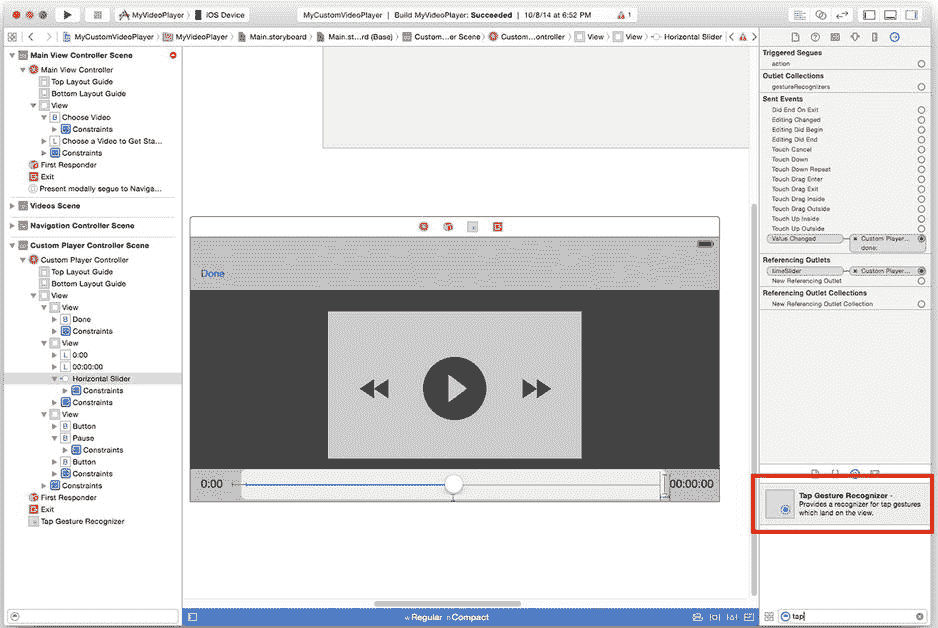

***Figure 9-13***. 向`CustomPlayerController`类添加一个`UITapGestureRecognizer`

对于处理方法，在你的头文件中创建一个名为`[self showControls:]`的`IBAction`方法。

```
-(IBAction)showControls:(id)sender;
```

要将处理方法连接到手势识别器，请在连接检查器中按住“已发送操作”下的`selector`属性，并将其拖到`CustomPlayerController`上，如 ***Figure 9-14*** 所示。从下拉菜单中选择`[self showControls:]`方法。

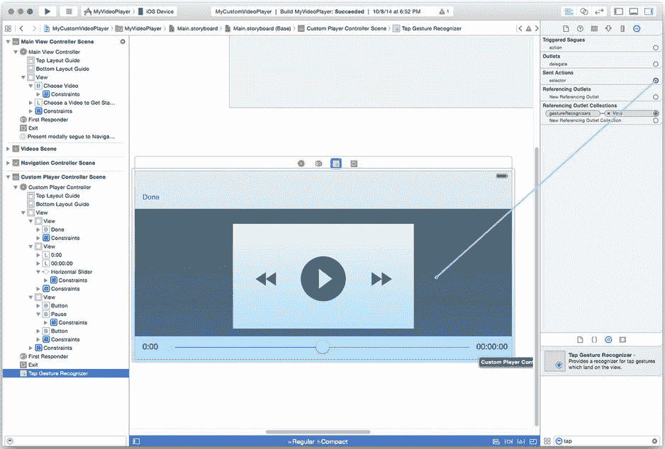

***Figure 9-14***. 将`UITapGestureRecognizer`连接到处理方法

顾名思义，在`[self showControls:]`中，你应该显示播放控件。然而，你还应该启动一个定时器，在 2 秒后隐藏控件。如 ***列表 9-23*** 所示，要显示控件，将子视图置于最前面（这将使其显示在视频之上）并启用用户交互触摸事件。要隐藏控件，创建一个名为`controlTimer`的实例变量，并令其处理方法为`[self hideControllers:]`。为防止冲突的定时器事件，如果之前的定时器不为`nil`，则将其禁用。

```
-(IBAction)showControls:(id)sender
{
    if (self.controlTimer != nil)
        [self.controlTimer invalidate];

[self.view bringSubviewToFront:self.controlView];
    self.controlView.userInteractionEnabled = YES;

if (sender != nil) {
        self.controlTimer = [NSTimer scheduledTimerWithTimeInterval:2.0f
            target:self selector:@selector(hideControls:) userInfo:nil
            repeats:NO];
    }
}
```

要隐藏控件，反转该过程。将播放控件移到预览层后面，并禁用触摸事件，以免产生任何误触发，如 ***列表 9-24*** 所示。

```
-(IBAction)hideControls:(id)sender
{
    [self.view sendSubviewToBack:self.controlView];
    self.controlView.userInteractionEnabled = NO;
}
```

你可以使用相同的过程来隐藏屏幕顶部和底部的栏。只需在你的类中定义它们，并将其添加到通过点击和定时器事件隐藏或显示的视图列表中。


## 构建自定义视频录制界面

在本章中，你将学习如何使用 `AVFoundation` 框架构建自定义播放控制器。你将看到，通过精心使用视图定位和自动布局，可以构建一个既符合品牌形象，又能灵活适配各种屏幕尺寸的用户界面。

为了实现媒体播放，你学习了如何使用 `AVPlayer` 类加载文件，以及如何通过观察状态变化来判断文件是否加载成功。利用同一个对象，你构建了播放控制功能，允许用户切换播放状态、向前或向后跳转几秒，以及拖拽到视频中的任意位置。

最后，为了给应用增添一丝灵动之感，你添加了界面更新功能：当用户不与应用交互时，隐藏中央的播放控制按钮，并根据当前播放位置更新当前时间标签和进度条。

尽管这个用户界面和播放栈的设置代码比直接使用 `MPMoviePlayerController` 类要复杂一些，但最终的成果是一个自定义播放控制器，它既能模仿 `MPMoviePlayerController` 类的功能和消息传递系统，又允许你添加自己的品牌元素。

