# 第 10 章：构建自定义视频录制界面

为了结束视频部分的学习，你将“用更复杂的方式”构建自己的视频录制界面。正如你在处理其他媒体功能时所看到的，Cocoa Touch 为视频捕捉提供了一个出色的内置界面——但前提是你愿意接受其界面和功能上的限制。当你想要突破这些限制，自定义视频捕捉界面以更好地适应工作流程或品牌需求时，就需要构建自己的用户界面。为此，你需要接入 `AVFoundation` 的底层图像捕捉功能。

如果这一切听起来很熟悉，那是因为确实如此。通过重复你在第 4 章中构建自定义静态图像界面时使用的许多相同步骤，你可以构建一个自定义视频捕捉界面。正如你在第 4 章学到的，实现静态图像界面需要以下主要步骤：

1. 发现并配置摄像头硬件。
2. 构建能够显示实时摄像头画面的用户界面。
3. 从界面修改捕捉设置。
4. 当用户按下“拍照”按钮时保存图像。

要将这个工作流程调整为视频捕捉，你需要执行以下操作：

1. 配置用于视频的捕捉会话。
2. 添加视频专用的捕捉控件。
3. 当用户完成录制时显示预览界面。
4. 重构消息传递接口以处理更大的文件。

在本章中，你将通过实现 `MyCustomRecorder` 项目（你可以在第 10 章文件夹中找到代码）来构建一个自定义视频录制界面，该项目首次出现在第 9 章中，并通过“录制视频”按钮添加了视频捕捉功能。你将复用 `MyCustomPlayer` 项目的代码来实现所有视频播放功能。用户可以在开始录制视频之前修改捕捉设置。录制完成后，他们将看到一个预览界面，可以在其中选择接受或拒绝刚刚拍摄的视频。

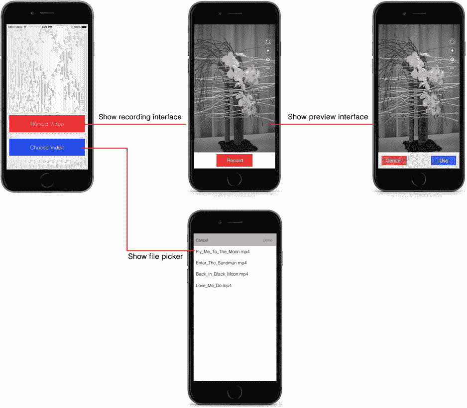

*图 10-1. MyCustomRecorder 项目示意图*

在图 10-2 中，你可以将 `MyCustomRecorder` 项目与第 4 章中的 `MyCamera` 静态图像捕捉项目进行对比。可以看出，除了预览界面和捕捉设置外，应用的整体流程是相同的。

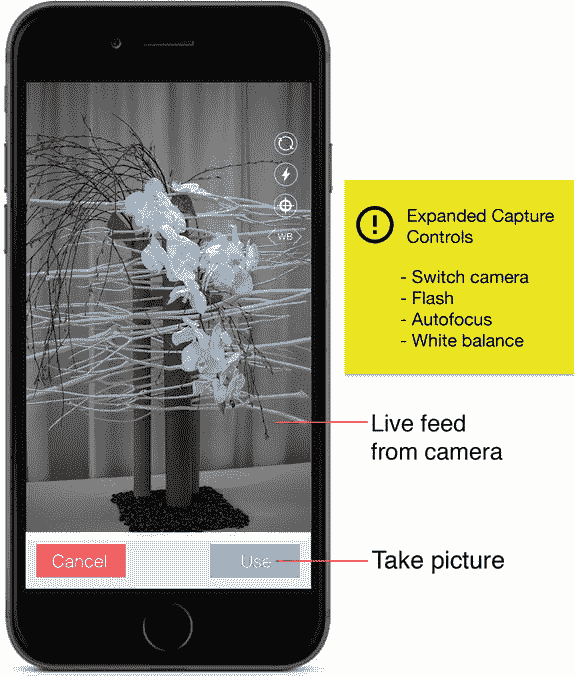

*图 10-2. MyCamera 静态图像捕捉项目示意图*

本章在很大程度上依赖于你在第 4 章中学习的使用 `AVFoundation` 进行图像捕捉的知识。如果你还没有掌握那个主题，我建议在继续之前先复习一下第 4 章。本项目复用了第 4 章中的许多图像捕捉代码示例，但我对核心类（如 `AVCaptureInputDevice` 和 `AVCaptureSession`）的讲解将不会那么深入。

## 开始之前

在本章中，你的主要重点是视频捕捉。首先，从第 9 章克隆 `MyCustomPlayer` 项目，以获得基本的用户界面和视频播放界面。克隆项目的方法是在 Finder 中复制它，然后在 Xcode 中打开。如图 10-3 所示，请注意，你可以通过仔细点击项目导航器中项目文件的名称来重命名项目。

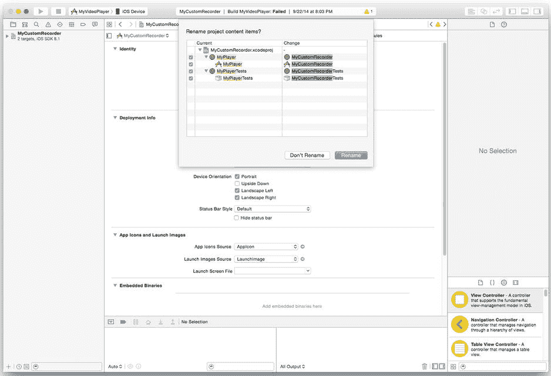

*图 10-3. 重命名项目*

要构建自定义视频捕捉界面，你需要使用 `AVFoundation` 框架的图像捕捉类。与之前的项目一样，在项目设置的“Linked Frameworks” 中添加此框架。你最终包含的框架列表应类似于图 10-4 中的示例。

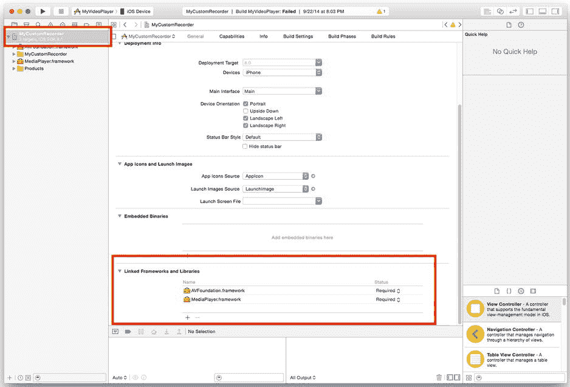

*图 10-4. MyCustomRecorder 项目的框架列表*

`MyCamera` 项目的设备设置代码、用户界面和协议都封装在 `CameraViewController` 类中。由于用户界面和协议与 `UIImagePickerControllerView` 类非常相似，你应该将它们用作 `MyCustomRecorder` 项目的基础。从 `MyCamera` 项目中复制这些文件。

## 设置硬件接口

包含项目的基础类之后，你可以开始修改 `CameraViewController` 类以支持视频捕捉。在处理用户界面之前，你需要确保摄像头的硬件接口已正确设置为视频捕捉模式。

回顾第 4 章，用于配置媒体捕捉的类如下：

- `AVCaptureDevice`：表示你将访问的硬件设备
- `AVCaptureInput`：表示你正在访问的数据流（例如，摄像头的视频流，麦克风的音频流）
- `AVCaptureOutput`：表示设备捕捉到的数据（例如，一个视频文件）
- `AVCaptureSession`：管理输入数据流与输出之间的接口

在 `CameraViewController` 类中，硬件初始化代码位于 `[CameraViewController viewDidLoad]` 和 `[CameraViewController initializeCameras]` 方法中。用于静态图像捕捉的硬件初始化代码已在代码清单 10-1 中高亮显示。在本节中，你将更改这些设置，使其适用于视频。

***代码清单 10-1*** *静态图像捕捉的硬件接口设置*

```
- (void)viewDidLoad
{
    [super viewDidLoad];
    // 在此添加视图加载后的额外设置

    self.previewView.autoresizingMask =
           UIViewAutoresizingFlexibleWidth |
           UIViewAutoresizingFlexibleHeight;

    self.session = [[AVCaptureSession alloc] init];

    // 寻找后置摄像头

    [self initializeCameras];

    NSError *error = nil;

    self.stillImageOutput = [[AVCaptureStillImageOutput alloc] init];

    NSMutableDictionary *configDict = [NSMutableDictionary new];
         [configDict setObject:AVVideoCodecJPEG forKey:AVVideoCodecKey];

    [self.stillImageOutput setOutputSettings:configDict];

    if (error == nil && [self.session canAddInput:self.rearCameraInput]) {
            [self.session addInput:self.rearCameraInput];
    }

    // 设置预览图层
```


`self.previewLayer = [[AVCaptureVideoPreviewLayer alloc] initWithSession:self.session];`

`CGRect layerRect = self.view.bounds;`
`CGPoint layerCenter = CGPointMake(CGRectGetMidX(layerRect), CGRectGetMidY(layerRect));`

`[self.previewLayer setBounds:layerRect];`
`[self.previewLayer setPosition:layerCenter];`

`[self.previewLayer setVideoGravity:AVLayerVideoGravityResize];`

`[self.previewView.layer addSublayer:self.previewLayer];`

```
// 设置我们的输出
if ([self.session canAddOutput:self.stillImageOutput]) {
    [self.session addOutput:self.stillImageOutput];
}

[self.view bringSubviewToFront:self.tapPosition];
```

`-(void)initializeCameras`
`{`

`self.cameraArray = [AVCaptureDevice devicesWithMediaType:AVMediaTypeVideo];`

`NSError *error = nil;`

`self.rearCamera = nil;`
`self.frontCamera = nil;`

`if ([self.cameraArray count] > 1) {`

```
for (AVCaptureDevice *camera in self.cameraArray) {
    if (camera.position == AVCaptureDevicePositionBack) {
        self.rearCamera = camera;
    } else if (camera.position == AVCaptureDevicePositionFront) {
        self.frontCamera = camera;
    }
}

self.rearCameraInput = [AVCaptureDeviceInput
    deviceInputWithDevice:self.rearCamera error:&error];
self.frontCameraInput = [AVCaptureDeviceInput
    deviceInputWithDevice:self.frontCamera error:&error];
```

`} else {`
```
self.rearCamera = [AVCaptureDevice
    defaultDeviceWithMediaType:AVMediaTypeVideo];
self.rearCameraInput = [AVCaptureDeviceInput
    deviceInputWithDevice:self.rearCamera error:&error];
```

`}`

`self.currentDevice = self.rearCamera;`
`}`

首先，你需要确保你想要使用的硬件接口的所有 `AVCaptureDevice` 和 `AVCaptureInput` 对象都已正确设置。回顾 `[CameraViewController initializeCameras]` 方法，你可以看到静态图像捕获要求你找到能够捕获视频的捕获设备（以便显示实时画面）。这样就处理了视觉方面的问题；然而，为了捕获音频，你需要为麦克风添加一个输入设备。列表 10-2 提供了一个包含音频输入的 `[CameraViewController initializeCameras]` 方法的修改版本。

**列表 10-2**。MyCustomRecorder 项目（包含音频）的 `AVCaptureDevice` 和 `AVCaptureDeviceInput` 设置

```
-(void)initializeCameras
{
    self.cameraArray = [AVCaptureDevice
                        devicesWithMediaType:AVMediaTypeVideo];

NSError *error = nil;

self.rearCamera = nil;
    self.frontCamera = nil;

self.microphone = nil;

if ([self.cameraArray count] > 1) {

for (AVCaptureDevice *camera in self.cameraArray) {
            if (camera.position == AVCaptureDevicePositionBack) {
                self.rearCamera = camera;
            } else if (camera.position == AVCaptureDevicePositionFront) {
                self.frontCamera = camera;
            }
        }

self.rearCameraInput = [AVCaptureDeviceInput
            deviceInputWithDevice:self.rearCamera error:&error];
        self.frontCameraInput = [AVCaptureDeviceInput
            deviceInputWithDevice:self.frontCamera error:&error];

} else {
        self.rearCamera = [AVCaptureDevice
            defaultDeviceWithMediaType:AVMediaTypeVideo];
        self.rearCameraInput = [AVCaptureDeviceInput
            deviceInputWithDevice:self.rearCamera error:&error];
    }

self.microphone = [[AVCaptureDevice
        devicesWithMediaType:AVMediaTypeAudio] objectAtIndex:0];
    self.audioInput = [AVCaptureDeviceInput
        deviceInputWithDevice:self.microphone error:&error];

self.currentDevice = self.rearCamera;
}
```

接下来，你需要确保已经为你的媒体设置了正确的 `AVCaptureOutput` 对象。对于静态图像捕获，类的 `AVCaptureOutput` 对象由 `stillImageOutput` 属性表示，该属性是 `AVCaptureStillImageOutput` 类的子类。为了捕获视频，你需要生成一个包含音频和视频流的文件，其格式应能被 `MPMoviePlayerController` 类回放。作为回顾，表 10-1 重复列出了第 4 章 中的 `AVCaptureOutput` 类型。对于录制同时包含音频和视频数据的电影文件，最合适的输出类型是 `AVCaptureMovieFileOutput`，它会生成一个有效的 QuickTime 电影文件。

**表 10-1**。`AVCaptureOutput` 类型

| 子类 | 捕获输出 |
| --- | --- |
| `AVCaptureMovieFileOutput` | QuickTime 电影文件 |
| `AVCaptureVideoDataOutput` | 视频帧——用于处理 |
| `AVCaptureAudioFileOutput` | Core Audio 支持的音频文件（MP3、AIFF、WAV、AAC） |
| `AVCaptureAudioDataOutput` | 音频缓冲区——用于处理 |
| `AVCaptureMetadataOutput` | 媒体文件元数据属性（例如，GPS 位置、曝光级别） |
| `AVCaptureStillImageOutput` | 静态图像和元数据 |

你需要为你的类添加一个新属性来处理电影输出。在 MyVideoRecorder 项目中，这个属性名为 `fileOutput`：

```
@property (nonatomic, strong) AVCaptureMovieFileOutput *fileOutput;
```

到目前为止，你还没有配置硬件接口以使其更适合你的应用程序。正如第 8 章（MyVideoRecorder 项目）中的简单视频录制示例所示，你至少应该指定视频文件的尺寸和最大录制时长。此外，对于 `AVCaptureMovieFileOutput` 类，你可以实现 `minFreeDiskSpaceLimit` 属性，以防止在设备没有足够可用磁盘空间时开始录制。列表 10-3 显示了一个代码片段，它通过这些更改初始化了 `fileOutput` 对象。在你最终的代码中，这个片段将是 `[CameraViewController viewDidLoad]` 方法的一部分。

**列表 10-3**。初始化一个 `AVCaptureMovieFileOutput` 对象

```
self.movieFileOutput = [[AVCaptureMovieFileOutput alloc] init];
self.movieFileOutput.minFreeDiskSpaceLimit = 200 * 1024; //200MB
self.movieFileOutput.maxRecordedDuration =
    CMTimeMakeWithSeconds(180, 1); //最长 3 分钟

if ([self.session canAddOutput:self.movieFileOutput]) {
    [self.session addOutput:self.movieFileOutput];
} else {
    UIAlertView *alert = [[UIAlertView alloc] initWithTitle:@"错误！"
        message:@"磁盘空间不足" delegate:self
        cancelButtonTitle:@"确定" otherButtonTitles:nil];
    [alert show];
}
```

由于视频捕获在比典型的 Cocoa Touch 类更低的层级上运行，因此 `minFreeDiskSpaceLimit` 属性使用 C 语言的 64 位整数类型 `int64_t`，而 `maxRecordedDuration` 属性则使用 Apple 底层用于表示时间的 `struct`（自定义数据类型）：`CMTime`。如示例所示，通过强制类型转换，你可以清晰地地将输入转换为这些类可处理的类型。


### 指定视频分辨率

配置硬件接口的最后一部分——`AVCaptureSession`对象时，就需要考虑指定视频分辨率了。`session`的功能类似于硬件接口的电话接线员，它将输入设备与输出流连接起来。回顾列表 10-2，初始化`AVCaptureSession`对象的基本步骤是：选择合适的构造方法，然后添加输入。虽然这些步骤对视频仍然适用，但多了一步：使用会话预设来配置会话以进行视频捕获。表 10-2 列出了预设选项。

表 10-2。`AVCaptureSession`预设

| 预设 | 输出类型 |
| --- | --- |
| `AVCaptureSessionPresetPhoto` | 高质量静态图像 |
| `AVCaptureSessionPresetLow` | 设备上可用的低质量视频和音频，适合通过 3G 蜂窝网络传输 |
| `AVCaptureSessionPresetMedium` | 设备上可用的中等质量视频和音频 |
| `AVCaptureSessionPresetHigh` | 设备上可用的最高质量视频和音频（默认） |
| `AVCaptureSessionPreset1080x720` | 1080×720（720p）视频 |
| `AVCaptureSessionPreset1920x1080` | 1280×1080（1080p）视频 |
| `AVCaptureSessionPresetiFrame960x540` | 960×540 H.264 iFrame 视频（适合 iMovie 编辑） |
| `AVCaptureSessionPresetiFrame1280x720` | 1280×720 H.264 iFrame 视频（适合 iMovie 编辑） |
| `AVCaptureSessionPresetInputPriority` | 原始视频和音频流，适用于高级编解码器或视频处理 |

与所有应用程序一样，请选择最适合您预期用途和设备的预设。如果不确定，视频捕获的安全选择是`AVCaptureSessionPreset1920x1080`。所有运行 iOS 6 或更高版本的 iOS 设备都能捕获 1080p 视频。要使用预设配置您的会话，只需使用所选常量设置属性：

```
[self.session setSessionPreset:AVCaptureSessionPreset1920x1080];
```

列表 10-4 展示了 MyVideoRecorder 项目中完成的`[CameraViewController viewDidLoad]`和`[CameraViewController initializeCameras]`方法。与列表 10-1 中的静态图像示例一样，硬件接口部分以粗体显示。

***列表 10-4***。MyCustomRecorder 项目的完整硬件接口代码

```
- (void)viewDidLoad
{
    [super viewDidLoad];
    // Do any additional setup after loading the view.

self.session = [[AVCaptureSession alloc] init];

// find the back-facing camera

[self initializeCameras];

NSError *error = nil;

if (error == nil && [self.session
        canAddInput:self.rearCameraInput]) {
        [self.session addInput:self.rearCameraInput];

// set up our output

self.movieFileOutput = [[AVCaptureMovieFileOutput alloc] init];
        self.movieFileOutput.minFreeDiskSpaceLimit = 200 * 1024; //200MB
        self.movieFileOutput.maxRecordedDuration =
            CMTimeMakeWithSeconds(180, 1); //3 mins max

if ([self.session canAddOutput:self.movieFileOutput] &&
            [self.session
                canSetSessionPreset:AVCaptureSessionPreset1920x1080]) {
            [self.session
                setSessionPreset:AVCaptureSessionPreset1920x1080];
            [self.session addOutput:self.movieFileOutput];
        } else {
                 UIAlertView *alert = [[UIAlertView alloc]
                initWithTitle:@"Error!" message:@"Camera Unavailable"
                delegate:self cancelButtonTitle:@"OK"
                otherButtonTitles:nil];
            [alert show];
        }

[self.view bringSubviewToFront:self.tapPosition];
    }

}

-(void)initializeCameras
{
    self.cameraArray = [AVCaptureDevice
                        devicesWithMediaType:AVMediaTypeVideo];

NSError *error = nil;

self.rearCamera = nil;
    self.frontCamera = nil;

self.microphone = nil;

if ([self.cameraArray count] > 1) {

for (AVCaptureDevice *camera in self.cameraArray) {
            if (camera.position == AVCaptureDevicePositionBack) {
                self.rearCamera = camera;
            } else if (camera.position == AVCaptureDevicePositionFront) {
                self.frontCamera = camera;
            }
        }

self.rearCameraInput = [AVCaptureDeviceInput
            deviceInputWithDevice:self.rearCamera error:&error];
        self.frontCameraInput = [AVCaptureDeviceInput
            deviceInputWithDevice:self.frontCamera error:&error];

} else {
        self.rearCamera = [AVCaptureDevice
            defaultDeviceWithMediaType:AVMediaTypeVideo];
        self.rearCameraInput = [AVCaptureDeviceInput
            deviceInputWithDevice:self.rearCamera error:&error];
    }

self.microphone = [[AVCaptureDevice
        devicesWithMediaType:AVMediaTypeAudio] objectAtIndex:0];
    self.audioInput = [AVCaptureDeviceInput
        deviceInputWithDevice:self.microphone error:&error];

self.currentDevice = self.rearCamera;
}
```

## 构建用户界面

配置好硬件接口后，您可以开始更新用户界面以支持视频捕获。与硬件接口一样，您不需要丢弃所有现有代码来启用此功能；您主要需要对现有代码进行一些通知修改。

与静态图像捕获类似，以下是用户界面中需要关注的主要区域：

*   显示摄像头输入的实时预览。
*   公开用于修改捕获设置的控件。
*   公开用于开始和停止录制的控件。

与静态图像不同，您需要在录制过程中更改用户界面。除了切换“录制”按钮的状态外，您还应该显示录制进度，并隐藏一些捕获设置（用户不应在录制过程中更改手电筒模式或低光设置；这样做会产生不连贯的效果）。录制完成后，用户应进入预览模式，在此模式下他们可以接受或拒绝录制的视频。

本节重点介绍启动视频录制以及在录制过程中出现的用户界面元素。完成录制的过程主要涉及非用户界面主题，将在下一节“完成录制”中介绍。

### 设置视频图层

在静态图像捕获项目的`[CameraViewController viewDidLoad]`方法中，您使用了`AVCaptureVideoPreviewLayer`对象来显示来自摄像头的实时预览。如列表 10-5 所示，该图层连接到会话对象，并配置为在父视图控制器中正确显示。

***列表 10-5***。MyCamera 项目的视频预览图层初始化代码

```
self.previewLayer = [[AVCaptureVideoPreviewLayer alloc]
                      initWithSession:self.session];

// CGRect layerRect = self.previewView.bounds;
CGRect layerRect = self.view.bounds;
CGPoint layerCenter = CGPointMake(CGRectGetMidX(layerRect),
     CGRectGetMidY(layerRect));

[self.previewLayer setBounds:layerRect];
[self.previewLayer setPosition:layerCenter];

[self.previewLayer setVideoGravity:AVLayerVideoGravityResize];
// [self.previewLayer
//    setVideoGravity:AVLayerVideoGravityResizeAspectFill];

[self.previewView.layer addSublayer:self.previewLayer];
```

好消息是，对于视频捕获，您无需对显示实时视频的代码做任何更改！您可以原样重用这段代码。虽然您需要在硬件初始化代码中创建一个音频输入对象来管理音频捕获，但实时预览应仅包含视频。用户将能够在视频录制完成后预览音频，因为在录制过程中预览音频会导致讨厌的反馈循环（回声）。


在继续之前，我想回顾几个需要特别关注的配置选项：设置正确的帧属性和启动会话。从第 4 章你可能记得，图层只是你添加到视图中的一个组件——类似于动画层的一部分。要正确定位图层，你需要为其指定适当的边界和原点位置。这与操作普通视图的流程相同，但需要记住显式定义所有内容以正确显示图层。同样，*自动调整大小*的概念并非视频图层的默认设置，因此你需要确保为预览层的`videoGravity`属性指定`AVLayerVideoGravityResize`。

你可能还记得，定位视频图层的帧并不会自动在目标视图上显示实时画面。要显示实时视频，你需要启动会话。与静态图像拍摄类似，你可以通过调用会话对象上的`[AVCaptureSession startRunning]`方法来启动会话。这适用于大多数会话预设类型。对于视频拍摄应用程序，一个重要的区别在于：启动会话并不等同于录制文件。你需要通过`AVCaptureMovieFileObject`来开始或停止录制。稍后，你将为“切换录制”按钮的处理程序添加相应代码。

列表 10-6 展示了`MyCustomRecorder`项目中`[CameraViewController viewDidLoad]`方法的最终版本。视频预览层初始化代码以粗体文本突出显示。

***列表 10-6***. `MyCustomRecorder`项目的视频预览层初始化代码

```
- (void)viewDidLoad
{
    [super viewDidLoad];
    // 加载视图后进行任何其他设置

self.previewView.autoresizingMask =
        UIViewAutoresizingFlexibleWidth |
        UIViewAutoresizingFlexibleHeight;

self.session = [[AVCaptureSession alloc] init];

// 查找后置摄像头

[self initializeCameras];

NSError *error = nil;

self.focusPoint = CGPointMake(0.5f, 0.5f);

if (error == nil && [self.session
        canAddInput:self.rearCameraInput]) {
        [self.session addInput:self.rearCameraInput];

// 设置预览层
      self.previewLayer = [[AVCaptureVideoPreviewLayer alloc]
            initWithSession:self.session];

CGRect layerRect = self.view.bounds;
        CGPoint layerCenter = CGPointMake(CGRectGetMidX(layerRect),
            CGRectGetMidY(layerRect));

[self.previewLayer setBounds:layerRect];
        [self.previewLayer setPosition:layerCenter];

[self.previewLayer setVideoGravity:AVLayerVideoGravityResize];

[self.previewView.layer addSublayer:self.previewLayer];

// 设置输出

self.movieFileOutput = [[AVCaptureMovieFileOutput alloc] init];
        self.movieFileOutput.minFreeDiskSpaceLimit =
           200 * 1024; // 200MB
        self.movieFileOutput.maxRecordedDuration =
            CMTimeMakeWithSeconds(180, 1); // 最长 3 分钟

if ([self.session canAddOutput:self.movieFileOutput] &&
            [self.session
                canSetSessionPreset:AVCaptureSessionPreset1920x1080]) {
            [self.session 
                setSessionPreset:AVCaptureSessionPreset1920x1080];
            [self.session addOutput:self.movieFileOutput];
        } else {
            UIAlertView *alert = [[UIAlertView alloc]
                initWithTitle:@"错误！"
                message:@"磁盘空间不足"
                delegate:self cancelButtonTitle:@"确定"
                otherButtonTitles:nil];
            [alert show];
        }

[self.view bringSubviewToFront:self.tapPosition];
    }

}
```

## 添加拍摄设置控件

在静态图像拍摄项目中，你添加了一套广泛的控件来修改相机拍摄设置，例如曝光、闪光灯、设备选择和自动对焦控制。虽然你可以重用设备选择和自动对焦控件，但需要精简该项目的控件列表，因为某些概念（如曝光和闪光灯）仅适用于相机传感器激活的时刻。好消息是，你可以为视频实现诸如手电筒模式、白平衡和弱光设置等功能，以提供类似的功能。

查看图 10-5 中苹果内置的相机界面，你会发现苹果暴露的唯一控件是“切换手电筒”和“切换设备”。

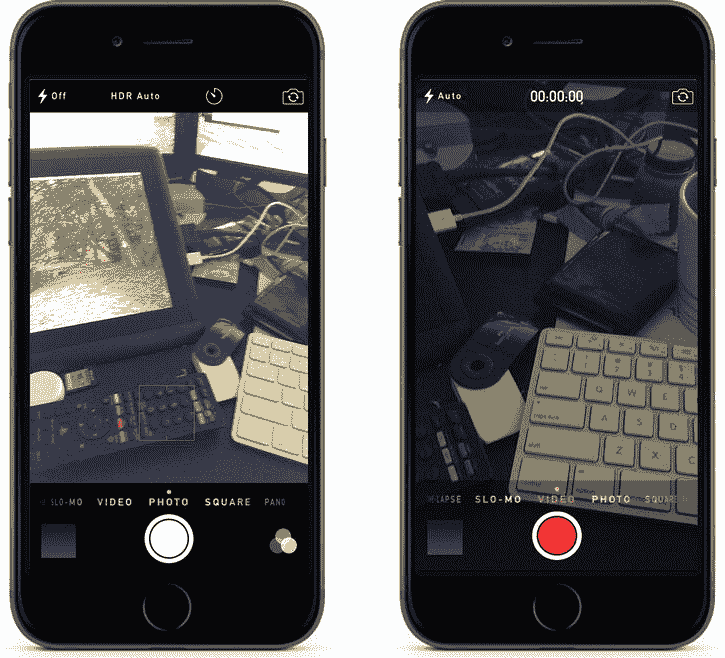

图 10-5. 苹果静态图像与视频拍摄界面之间的区别

由于你的应用程序提供了与默认设置不同的用户体验，因此你将添加用于手电筒模式和弱光设置的控件，如图 10-6 所示。

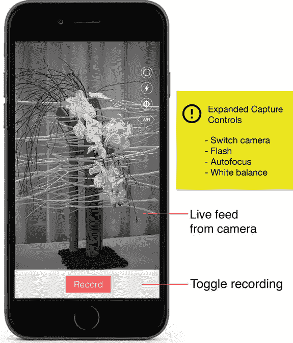

图 10-6. `MyCustomRecorder`项目的视频拍摄界面

对于`MyCustomRecorder`项目，你将移除曝光按钮，并将闪光灯按钮重新用于手电筒模式。你还将添加用于弱光设置和开始录制的按钮。在 Interface Builder 中进行这些更改后，你的故事板应类似于图 10-7 所示。

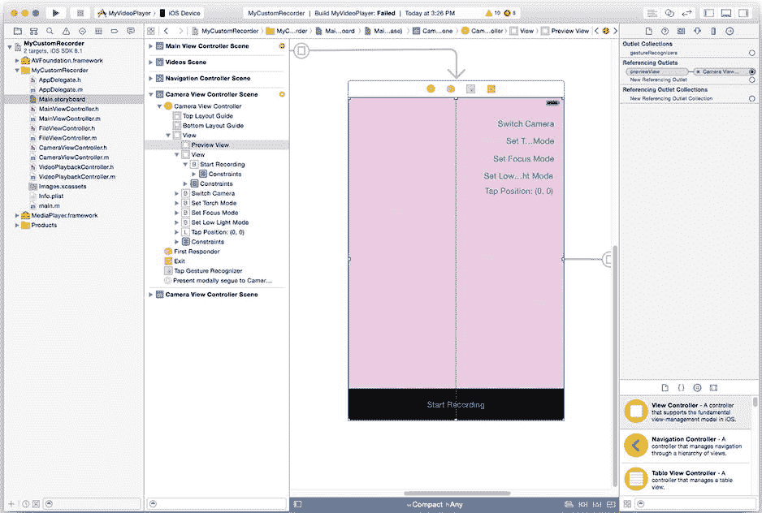

图 10-7. 视频拍摄界面的故事板

新增按钮就位后，你的`CameraViewController.h`文件应类似于列表 10-7 中的示例。

***列表 10-7***. 包含新控件的`CameraViewController`修改头文件

```
#import <UIKit/UIKit.h>
#import <AVFoundation/AVFoundation.h>

@protocol CameraDelegate <NSObject>

-(void)cancel;
-(void)didFinishWithImage:(UIImage *)image;

@end

@interface CameraViewController : UIViewController
    <UIActionSheetDelegate>

@property (nonatomic, strong) IBOutlet UIView *previewView;
@property (nonatomic, strong) IBOutlet UIButton *torchButton;
@property (nonatomic, strong) IBOutlet UIButton *lowLightButton;
@property (nonatomic, strong) IBOutlet UIButton *focusButton;
@property (nonatomic, strong) IBOutlet UIButton *cameraButton;

@property (nonatomic, strong) IBOutlet UILabel *tapPosition;

@property (nonatomic, strong) AVCaptureSession *session;
@property (nonatomic, strong) AVCaptureMovieFileOutput
    *movieFileOutput;

@property (nonatomic, strong) id <CameraDelegate> delegate;

-(IBAction)cancel:(id)sender;
-(IBAction)toggleRecording:(id)sender;

-(IBAction)torchMode:(id)sender;
-(IBAction)lowLightMode:(id)sender;
-(IBAction)focusMode:(id)sender;
-(IBAction)switchCamera:(id)sender;

-(IBAction)didTapPreview:(UIGestureRecognizer *)gestureRecognizer;

@end
```

供你参考，我在列表 10-8 中包含了自动对焦和切换设备按钮的处理程序。对于视频拍摄，你完全不需要修改这些处理程序，并且一如既往，它们应放在你的`CameraViewController.m`文件中。

***列表 10-8***. 自动对焦与切换设备的按钮处理程序

```
-(void)switchToFocusWithIndex:(NSInteger)buttonIndex
{
    NSError *error = nil;

AVCaptureFocusMode focusMode = 0;
```


```objectivec
switch (buttonIndex) {
    case 0: {
        focusMode = AVCaptureFocusModeAutoFocus;
        self.focusButton.titleLabel.text = @"Focus: Auto";
        break;
    }
    case 1: {
        focusMode = AVCaptureFocusModeContinuousAutoFocus;
        self.focusButton.titleLabel.text = @"Focus: Cont";
        break;
    }
    case 2: {
        focusMode = AVCaptureFocusModeLocked;
        self.focusButton.titleLabel.text = @"Focus: Fixed";
        break;
    }
    default:
        break;
}
```

```objectivec
if ([self.currentDevice lockForConfiguration:&error] &&
    [self.currentDevice isFocusModeSupported:focusMode]) {

    self.currentDevice.focusMode = focusMode;

    [self.currentDevice unlockForConfiguration];
} else {
    NSLog(@"could not set focus mode");
}
```

```objectivec
-(void)switchToCameraWithIndex:(NSInteger)buttonIndex
{
    [self.session beginConfiguration];

    if (buttonIndex == 0) {
        [self.session removeInput:self.rearCameraInput];

        if ([self.session canAddInput:self.frontCameraInput]) {
            [self.session addInput:self.frontCameraInput];
        }

        self.cameraButton.titleLabel.text = @"Camera: Front";
        self.currentDevice = self.frontCamera;

    } else if (buttonIndex == 1) {
        [self.session removeInput:self.frontCameraInput];

        if ([self.session canAddInput:self.rearCameraInput]) {
            [self.session addInput:self.rearCameraInput];
        }

        self.cameraButton.titleLabel.text = @"Camera: Rear";
        self.currentDevice = self.frontCamera;
    }

    [self.session commitConfiguration];
}
```

### 手电筒模式

相机闪光灯的概念是发出一束光，照亮原本过于暗淡而无法拍摄的场景。用户通常在闪光灯关闭的情况下构图，但当他们按下拍摄按钮时，闪光灯会恰好激活足够长的时间，在相机传感器工作期间照亮场景。这一概念并不适用于视频拍摄，因为传感器需长时间保持激活状态；然而，通过实现手电筒模式，您可以让用户在录制期间保持闪光灯 LED 激活，从而为场景增加光线。

要激活手电筒模式，您可以复用 `MyCamera` 项目中的闪光灯按钮。底层功能有所不同，但这种差异对用户来说并不明显。在 `MyCamera` 项目中，闪光灯模式的处理方法是 `[CameraViewController flashMode:]`。打开您的 `CameraViewController.h` 文件，在该方法名上执行辅助点击（右键点击或 Option 键点击），调出重构窗口，如图 Figure 10-8 所示。这将允许您在包含该方法的每个文件中重命名它，包括 Interface Builder 文件。您的新方法应命名为 `[CameraViewController torchMode:]`。

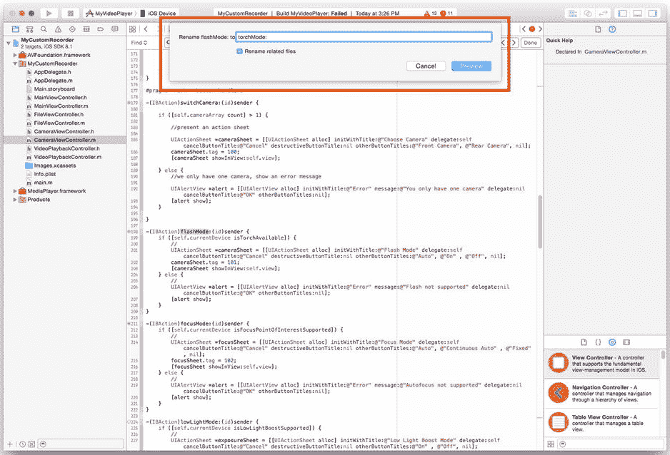

图 10-8. 重构窗口

如第 4 章所述，修改拍摄设置的一般流程是：使用屏幕上的显示按钮弹出可用模式的操作表，然后设置模式（如果设备支持）。虽然如今几乎所有现代 iOS 设备都配备了两个摄像头，但需要注意的是，这些摄像头并不相同。通常，后置摄像头功能更强大，支持高分辨率图像、闪光灯以及其他可提高画质的功能（例如 iPhone 6 Plus 的图像稳定功能）。相比之下，前置摄像头分辨率较低，可用的拍摄控制选项也更少。

`torchMode` 属性用于控制 `AVCaptureDevice` 上的手电筒模式。其配置选项为 `Off`（关闭）、`On`（开启）和 `Auto`（自动），分别由常量 `AVCaptureTorchModeOff`、`AVCaptureTorchModeOn` 和 `AVCaptureTorchModeAuto` 表示。作为该过程的第一步，请修改您的按钮处理器，以便在操作表中显示这些新值，如代码清单 10-9 所示。

***代码清单 10-9***. 手电筒模式的按钮处理器

```objectivec
-(IBAction)torchMode:(id)sender {
    if ([self.currentDevice isTorchAvailable]) {
        UIActionSheet *cameraSheet = [[UIActionSheet alloc]
            initWithTitle:@"Flash Mode" delegate:self
            cancelButtonTitle:@"Cancel" destructiveButtonTitle:nil
            otherButtonTitles:@"Auto", @"On" , @"Off", nil];
        cameraSheet.tag = 101;
        [cameraSheet showInView:self.view];
    } else {
        UIAlertView *alert = [[UIAlertView alloc]
            initWithTitle:@"Error"
            message:@"Flash not supported" delegate:nil
            cancelButtonTitle:@"OK" otherButtonTitles:nil];
        [alert show];
    }
}
```

与之前的示例一样，您需在操作表协议返回 `[UIActionSheet didDismissWithButtonIndex:]` 消息后修改拍摄设置。请记住，此消息是全局发送给所有操作表的。为了区分不同的操作表，您需要为每个操作表分配一个标签（`101` 是闪光灯模式的标签）。在手电筒模式的 `case` 块（对应 `101` 号）中，执行另一个重构操作，将配置方法重命名为 `[CameraViewController switchToTorchModeWithIndex:]`，如代码清单 10-10 所示。

***代码清单 10-10***. 修改后的手电筒模式操作表委托

```objectivec
-(void) actionSheet:(UIActionSheet *)actionSheet
      didDismissWithButtonIndex:(NSInteger)buttonIndex
{
    switch (actionSheet.tag) {
        case 100:
            [self switchToCameraWithIndex:buttonIndex];
            break;
        case 101:
            [self switchToTorchWithIndex:buttonIndex];
            break;
        case 102:
            [self switchToFocusWithIndex:buttonIndex];
            break;
        case 103:
            [self switchToExposureWithIndex:buttonIndex];
            break;
        default:
            break;
    }
}
```

用于判断 `AVCaptureDevice` 是否支持手电筒模式的方法是 `[AVCaptureDevice isTorchModeSupported:]`。如代码清单 10-11 所示，在您的 `[CameraViewController switchToTorchModeWithIndex:]` 方法中，锁定设备进行配置后，首先检查手电筒模式是否可用，如果适用则进行设置。完成配置更改后，解锁设备。如果在锁定设备或尝试进行更改时发生错误，则显示错误警告。

***代码清单 10-11***. 更改手电筒模式的方法

```objectivec
-(void)switchToTorchWithIndex:(NSInteger)buttonIndex
{
    NSError *error = nil;

    AVCaptureTorchMode torchMode = 0;

    switch (buttonIndex) {
        case 0: {
            torchMode = AVCaptureTorchModeAuto;
            self.torchButton.titleLabel.text = @"Torch: Auto";
            break;
        }
        case 1: {
            torchMode = AVCaptureTorchModeOn;
            self.torchButton.titleLabel.text = @"Torch: On";
            break;
        }
        case 2: {
            torchMode = AVCaptureTorchModeOff;
            self.torchButton.titleLabel.text = @"Torch: Off";
            break;
        }
        default:
            break;
    }

    if ([self.currentDevice lockForConfiguration:&error]) {
        self.currentDevice.torchMode = torchMode;
        [self.currentDevice unlockForConfiguration];
    } else {
        NSLog(@"could not set torch mode");
    }
}
```

遵循苹果的示例，将 `AVCaptureTorchModeAuto` 用作手电筒模式的默认配置设置。您可以通过将手电筒模式设置添加到 `[CameraViewController initializeCameras]` 方法来定义此默认值。

### 弱光增强


对于静态图像，你可以通过曝光来调整拍摄图像的亮度或暗度，而无需使用闪光灯。作为构图过程的一部分，你允许用户指定曝光是否应随焦点选择的变化而自动变化，还是应基于先前选择保持固定。这样，当用户重新调整焦点时，他们可以看到图像变亮/变暗或维持当前亮度设置。不幸的是，一切都有权衡，当你为图像增加或减少光线时，往往也在增加或减少细节。这可能导致传感器产生大量噪声，但你可以通过重新对焦或调整曝光设置来补偿。然而，在拍摄视频时，你不想在拍摄过程中重新对焦或大幅改变曝光设置，因为这两种变化都会产生不自然的效果，大多数人会觉得分散注意力。

为了在视频拍摄的光线调整过程中补偿图像质量的变化，你将在拍摄界面中启用一个低光增强控制，以替代曝光模式。低光设置指示`AVCaptureDevice`类根据环境光线自动提亮或调暗场景——这与曝光模式不同，后者基于当前焦点改变设置。如果用户选择禁用低光增强，相机在录制期间将不会调整场景的光线。

你通过`automaticallyEnablesLowLightBoostWhenAvailable`方法控制`AVCaptureDevice`的低光设置（增强开启或关闭）。顾名思义，输入是一个`BOOL`，意味着用户只能启用或禁用此设置。

与所有拍摄设置一样，在提交更改时，你需要锁定设备并确保硬件支持这些设置。要查询设备是否支持低光增强模式，请使用`lowLightSupported`属性。列表 10-12 展示了低光模式按钮的处理程序。

***列表 10-12***. 低光模式按钮的处理程序

```
-(IBAction)lowLightMode:(id)sender {
    if ([self.currentDevice isLowLightBoostSupported]) {
        //
        UIActionSheet *lowLightSheet = [[UIActionSheet alloc]
            initWithTitle:@"Low Light Boost Mode" delegate:self
            cancelButtonTitle:@"Cancel" destructiveButtonTitle:nil
            otherButtonTitles:@"On" , @"Off", nil];
        lowLightSheet.tag = 103;
        [lowLightSheet showInView:self.view];
    } else {
        //
        UIAlertView *alert = [[UIAlertView alloc]
            initWithTitle:@"Error"
            message:@"Low Light Boost not supported" delegate:nil
            cancelButtonTitle:@"OK" otherButtonTitles:nil];
        [alert show];
    }
}
-(void)switchToExposureWithIndex:(NSInteger)buttonIndex
{
    NSError *error = nil;

BOOL boostOn;
    switch (buttonIndex) {
        case 0: {
            boostOn = YES;
            self.lowLightButton.titleLabel.text = @"LL Boost: On";
            break;
        }
        case 1: {
            boostOn = NO;
            self.lowLightButton.titleLabel.text = @"LL Boost: Off";
            break;
        }
        default:
            break;
    }

if ([self.currentDevice lockForConfiguration:&error] &&
        [self.currentDevice isLowLightBoostSupported]) {

self.currentDevice.
            automaticallyEnablesLowLightBoostWhenAvailable = boostOn;

[self.currentDevice unlockForConfiguration];
    } else {
        NSLog(@"could not set exposure mode");
    }

}
```

## 开始/停止录制

在设置了视频拍摄界面的预览层和拍摄控制后，剩下的唯一用户界面任务是处理开始和停止录制。查看 Apple 相机应用的“录制中”界面，如图 10-9 所示。请注意，在录制过程中，Apple 将“开始”按钮的状态更改为“停止”，并显示当前录制的时长。

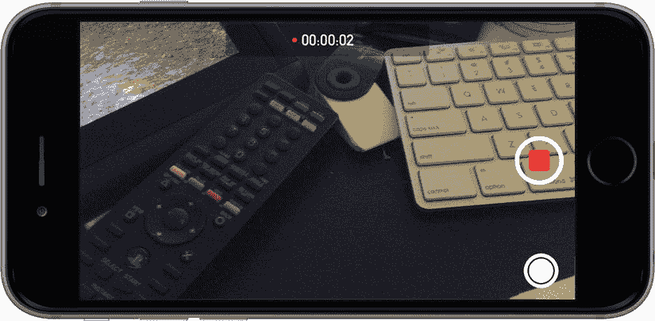

图 10-9. 相机应用的“录制中”界面

在`MyCustomRecorder`应用中，你将更进一步，隐藏拍摄控制，因为用户在录制期间除了焦点外不应修改任何内容。

为了显示录制时间，将`UILabel`添加到你的故事板，并将`NSTimer`对象添加到`CameraViewController`类。在`MyCustomRecorder`项目中，我将它们分别命名为`timeLabel`和`recordingTimer`：

```
@property (nonatomic, strong) IBOutlet UILabel *timeLabel;
@property (nonatomic, strong) NSTimer *recordingTimer;
```

在 Interface Builder 中，使用属性检查器将`timeLabel`默认设置为隐藏。当用户开始播放时，你将显示它。

在继续之前，花点时间回顾一下你在构建静态图像拍摄界面时如何将捕获的图像转换为图像文件。参考列表 10-13，你会看到在“完成”按钮的处理程序中，你调用了`[AVCaptureImageOutput captureStillImageAsynchronouslyFromConnection:completionHandler:]`方法来生成图像文件。操作完成后，你生成了一个`UIImage`对象并将其传递回你的委托对象。

***列表 10-13***. 从视频源捕获图像文件

```
-(IBAction)finish:(id)sender
{

AVCaptureConnection *connection = [self.stillImageOutput
        connectionWithMediaType:AVMediaTypeVideo];

[self.stillImageOutput
        captureStillImageAsynchronouslyFromConnection:connection
        completionHandler:^(CMSampleBufferRef imageDataSampleBuffer,
            NSError *error) {

if (imageDataSampleBuffer != nil) {

NSData *imageData = [AVCaptureStillImageOutput
             jpegStillImageNSDataRepresentation:imageDataSampleBuffer];

UIImage *image = [UIImage imageWithData:imageData];

[self.delegate didFinishWithImage:image];
        } else {

NSLog(@"error description: %@", [error description]);

[self.delegate cancel];
        }

}];

}
```

对于视频捕获，你希望在按下“录制”按钮时切换录制。与静态图像捕获类似，你需要在类的`AVCaptureOutput`对象上执行此操作，对于视频捕获，该对象是`AVCaptureMovieFileOutput`对象（`AVCaptureMovieFileOutput`是`AVCaptureFileOutput`的子类）。你不再调用一个方法来捕获静态图像，而是开始或停止录制。在`AVCaptureMovieFileOutput`对象上开始和停止录制的方法是`[AVCaptureFileOutput startRecordingToOutputFileURL:recordingDelegate:]`和`[AVCaptureFileOutput stopRecording]`。

列表 10-14 展示了切换录制的处理方法，该方法在`CameraViewController.h`文件中被定义为`[CameraViewController toggleRecording]`。在这个方法中，你希望基于`AVCaptureOutput`对象的当前状态来开始或停止视频捕获。你可以通过使用`recording`属性查询`AVCaptureMovieFileOutput`对象的录制状态。

***列表 10-14***. 用于切换视频录制的按钮处理程序

```
-(IBAction)toggleRecording:(id)sender
{
    if ([self.movieFileOutput isRecording]) {


```objc
NSArray *paths = NSSearchPathForDirectoriesInDomains(
    NSDocumentDirectory, NSUserDomainMask, YES);
NSString *documentsDirectory = [paths objectAtIndex:0];
NSString *relativePath = [documentsDirectory
    stringByAppendingPathComponent:@"movie.mov"];

NSURL *fileURL = [NSURL fileURLWithPath:relativePath];

[self.movieFileOutput startRecordingToOutputFileURL:fileURL
         recordingDelegate:self];
} else {

[self.movieFileOutput stopRecording];
}
}
```

当开始录制文件时，你需要指定输出文件的 URL 以及遵循某个协议的委托对象。`AVCaptureFileOutput` 类定义了 `AVCaptureFileOutputRecordingDelegate` 协议，用于回传影片文件的完成消息。因此，请修改 `CameraViewController` 的头文件，标明你将实现该协议：

```objc
@interface CameraViewController : UIViewController
    <UIActionSheetDelegate, AVCaptureFileOutputRecordingDelegate >
```

在下一节“完成录制”中，你将实现该委托方法以关闭影片文件。

作为用户界面的最后一步，你应在开始录制后更新界面，即隐藏拍摄按钮并显示录制进度。幸运的是，在 Cocoa Touch 中隐藏界面元素极为简单：只需将 `isHidden` 属性设为 `YES`。将此属性设为 `NO` 则会显示被隐藏的元素。在代码清单 10-15 中，我已在录制按钮处理程序中添加了界面更新逻辑。

***代码清单 10-15***：为切换录制按钮添加界面更新

```objc
-(IBAction)toggleRecording:(id)sender
{
    if ([self.movieFileOutput isRecording]) {

NSArray *paths = NSSearchPathForDirectoriesInDomains(
        NSDocumentDirectory, NSUserDomainMask, YES);
    NSString *documentsDirectory = [paths objectAtIndex:0];
    NSString *relativePath = [documentsDirectory
        stringByAppendingPathComponent:@"movie.mov"];

NSURL *fileURL = [NSURL fileURLWithPath:relativePath];

self.torchButton.hidden = YES;
        self.focusButton.hidden = YES;
        self.cameraButton.hidden = YES;
        self.lowLightButton.hidden = YES;

self.timeLabel.hidden = NO;

[self.movieFileOutput startRecordingToOutputFileURL:fileURL
        recordingDelegate:self];

self.recordingTimer = [NSTimer timerWithTimeInterval:1.0f
        target:self selector:@selector(updateProgress) userInfo:nil
        repeats:YES];
        self.duration = 0;
    } else {

[self.movieFileOutput stopRecording];

self.torchButton.hidden = NO;
        self.focusButton.hidden = NO;
        self.cameraButton.hidden = NO;
        self.lowLightButton.hidden = NO;

self.timeLabel.hidden = YES;

[self.recordingTimer invalidate];
      self.duration = 0;
    }
}
```

请注意，除了隐藏或显示界面元素外，录制按钮处理程序还会创建或销毁 `playbackTimer` 对象。与所有定时器一样，要更新状态，你需要使用一个处理程序方法（选择器）重新初始化定时器对象。停止定时器的唯一方法是销毁它。在代码清单 10-16 中，你可以找到定时器的选择器方法 `[CameraViewController updateProgress]`，该方法会使用当前录制时长更新 `timeLabel`。

***代码清单 10-16***：时间更新的选择器方法

```objc
-(void)updateProgress
{
    NSInteger durationMinutes = self.duration / 60;
    NSInteger durationSeconds = self.duration  - durationMinutes * 60;
    NSString *progressString = [NSString stringWithFormat:@"%d:%02d",
        durationMinutes, durationSeconds];
    self.timeLabel.text = progressString;
    self.duration++;
}
```

## 完成录制

要完成 MyCustomRecorder 项目，你需要实现完成录制过程的代码。尽管你调用了 `[AVCaptureFileOutput stopRecording]` 方法，但仅凭这一调用还不足以生成一个可用 `MPMoviePlayerController` 子类播放的有效影片文件。

由于你没有使用 `UIImagePickerController` 类来录制视频，你需要提供自己的视频播放器来预览录制的文件。如图 10-10 所示，该视频播放器将提供有限的播放控制功能，以及让用户接受或拒绝录制视频的按钮。为了实现这些有限的控制，你将复用第 9 章中构建的 MyVideoPlayer 项目中的视频播放器。

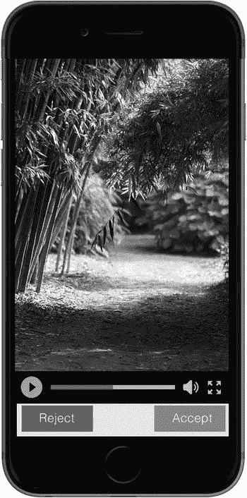

图 10-10。视频预览界面原型

最后，要从 `CameraViewController` 对象返回结果，你需要使用 `CameraDelegate` 协议，并修改该协议以处理视频。由于视频文件远大于图片，无法作为参数回传，因此你需要寻找替代方案。

## 保存视频输出

你可能还记得本书之前的讨论，我曾暗示视频文件比图片和音频文件更复杂。与包含单一数据流二进制信息的图片和音频文件不同，视频文件是包含音频和视频数据流的容器。这使得视频文件对有效的文件头和文件尾（用于标识数据终止点）的要求更为严格。再加上压缩视频所需算法（编解码器）的复杂程度更高，你就能理解为什么这一过程如此复杂了。

通过从 `[CameraViewController togglePlayback:]` 方法中调用 `[AVCaptureFileOutput stopRecording]` 方法，你指示 `AVCaptureMovieFileOutput` 类启动此过程并关闭文件。文件关闭操作完成后，你的输出对象会调用你在委托（对于 MyCustomRecorder 项目而言是 `CameraViewController` 类）上声明的 `[AVCaptureFileOutputRecordingDelegate captureOutput:didFinishRecordingToOutputFileAtURL:fromConnections:error:]` 方法。

协议的一个关键优势在于，它会严格定义一套将要发送给其委托的消息，包括消息名称和参数类型。`didFinish` 协议消息会回传以下内容：

*   一个 `AVCaptureOutput` 对象，标识已完成的输出对象
*   一个 `NSURL` 对象，指示已成功（或未成功）关闭的文件的 URL
*   一个由 `AVCaptureConnection` 对象组成的 `NSArray`，这些对象与该输出的会话相关联
*   一个 `NSError` 对象，如果文件未能成功关闭，则返回非 `nil` 值

你可以在代码清单 10-17 中找到 `CameraViewController` 类的实现。

***代码清单 10-17***：CameraViewController 类的“输出完成”委托方法

```objc
-(void)captureOutput:(AVCaptureFileOutput *)captureOutput
    didFinishRecordingToOutputFileAtURL:(NSURL *)outputFileURL
    fromConnections:(NSArray *)connections error:(NSError *)error
{
    if (error != nil)  {
        NSString *errorString = [error description];
        UIAlertView *alertView = [[UIAlertView alloc]
            initWithTitle:@"Error" message:errorString delegate:self
            cancelButtonTitle:@"OK" otherButtonTitles:nil];
        [alertView show];

} else {
        VideoPlaybackController *playbackVC =
            [[VideoPlaybackController alloc]
            initWithURL:outputFileURL];
        playbackVC.delegate = self;

[self presentViewController:playbackVC animated:YES
            completion:^{
               [playbackVC prepareToPlay];
        }];
    }
}
```


该实现使用了 `error` 对象来检查操作是否成功。如果操作失败，它会从 `error` 对象中获取人类可读的 `description` 字符串，并显示一个警示视图。当操作成功时，它会呈现一个已使用输出文件 URL 初始化的 `VideoPlaybackController`。`VideoPlaybackController` 是 `MPMoviePlayerController` 类的自定义子类，你将在本项目中使用它进行视频预览。

**警告** 虽然从 `AVCaptureFileOutputRecordingDelegate` 协议返回的输出文件 URL 与用于开始录制的 URL 相同，但你不应在委托方法触发前开始播放，因为直到接收到该消息后文件才有效。

## 显示预览界面

对于你的视频预览界面，你需要显示一个视频播放器，允许用户接受或拒绝他们刚刚录制的视频。虽然你可以直接原样返回录制的视频，但最好在用户返回 MyCustomRecorder 应用程序的主界面之前，给他们一个检查录制结果的机会。

对于 `VideoPlaybackController` 类，你需要从你在第 9 章中构建的 MyCustomPlayer 项目中获取 `CustomVideoPlayer` 类的基本视频播放功能，并修改其控件以切换播放以及接受或拒绝文件。子类化是一种面向对象编程概念，它允许你继承父类的所有属性和方法，同时仍保留在子类中修改这些属性和方法的能力。继承是一种便捷的方式，可以在不破坏或影响原始类的情况下扩展类的功能。在本例中，你需要创建子类以重用 `CustomVideoPlayer` 类，用于此应用的**全屏视频播放器**。

首先，将 `CustomVideoPlayer.h` 和 `CustomVideoPlayer.m` 文件复制到你的工作目录中，并将它们添加到你的项目中。接下来，从“文件”菜单中选择“新建文件”。如图 10-11 所示，当系统要求你指定文件的父类时，输入 **MyCustomPlayer**——这将导致 Xcode 自动为你创建子类模板。

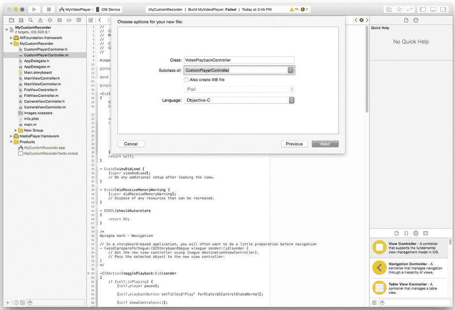

图 10-11. 在 Xcode 中为新建文件指定父类

接下来，你需要为视频播放器创建故事板。这个新播放界面与你为 MyCustomPlayer 项目创建的界面的主要区别在于，导航栏中不再有“完成”按钮，取而代之的是“接受”和“拒绝”按钮，两者都用于完成视频处理过程。参照图 10-12，添加一个用于视频输出的图层和一个用于控制播放的按钮。将此视图控制器嵌入到导航控制器中，以便添加你的按钮。

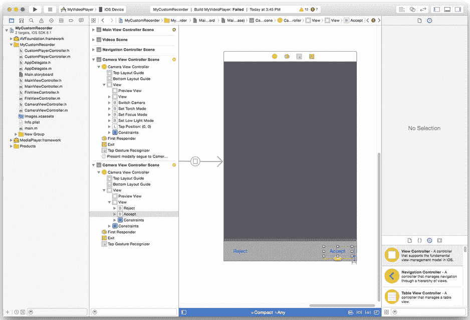

图 10-12. 视频播放器的故事板

`VideoPlaybackController` 类的头文件在代码清单 10-18 中。与其他项目一样，记得将你的按钮处理程序和属性与故事板绑定。

***代码清单 10-18***. VideoPlaybackController 类的头文件

```
#import <UIKit/UIKit.h>

@interface VideoPlaybackController : MyCustomPlayer

@property (nonatomic, strong) IBOutlet *const;

-(IBAction)accept:(id)sender;
-(IBAction)reject:(id)sender;

@end

@protocol CustomPlayerDelegate <NSObject>

-(void)didFinishWithSuccess:(BOOL)success;

@end
```

由于你正在创建 `CustomVideoPlayer` 类的子类，因此无需重新实现视频播放功能。只需将你的按钮绑定到你在 `CustomVideoPlayer` 类中定义的 `togglePlayback` 按钮处理程序即可（父类中的方法在 Interface Builder 中显示，就像你在自己的类中定义它们一样）。对于视频录制过程，你需要重点关注“接受”和“拒绝”功能。

当用户决定接受刚录制的视频时，你应遵循与 `UIImagePickerController` 相同的工作流程，将用户返回到主用户界面。在此过程中，你需要保存文件并关闭视频预览和捕获界面。`VideoPlaybackController` 类的“接受”按钮处理程序如代码清单 10-19 所示。

***代码清单 10-19***. VideoPlaybackController 的“接受”按钮处理程序

```
-(IBAction)accept:(id)sender
{
    [self.mediaPlayer stop];
    [self.delegate didFinishWithSuccess:YES];
}
```

此按钮处理程序非常简短——它所做的只是停止播放器并调用 `[CustomPlayerDelegate didFinishWithSuccess:]` 方法。`[ViewController dismissViewController:animated:]` 方法一次只能关闭一个模态控制器。要同时关闭 `VideoPlaybackController` 和 `CameraViewController`，你需要对呈现它们的视图控制器分别执行关闭操作。`CameraViewController` 是由 `MainViewController` 呈现的，因此你需要通过 `CameraDelegate` 协议将其关闭。类似地，`VideoPlaybackController` 是由 `CameraViewController` 呈现的，因此你需要通过 `CustomPlayerDelegate` 协议将其关闭。

“拒绝”按钮处理程序同样简单直接。你只需要关闭播放控制器并重置视频录制界面即可。作为重置过程的一部分，你应该删除当前的影片文件。代码清单 10-20 展示了“拒绝”按钮处理程序方法。

***代码清单 10-20***. VideoPlaybackController 的“拒绝”按钮处理程序

```
-(IBAction)reject:(id)sender
{
    [self.mediaPlayer stop];
    [self.delegate didFinishWithSuccess:NO];
}
```

你可能对 `[CustomPlayerDelegate didFinishWithSuccess:]` 方法的实现感到好奇。在你的 `CameraViewController` 类中，如果 `success` 参数设置为 `YES`，则表明用户想要接受视频，因此你可以关闭代表播放器的模态视图控制器，并在你的相机委托对象上调用 `[CameraDelegate didFinishWithURL:]`。如果 `success` 参数设置为 `NO`，则表示用户想要拒绝视频。`CameraViewController` 类的完整 `[CustomPlayerDelegate didFinishWithSuccess:]` 方法如代码清单 10-21 所示。

***代码清单 10-21***. CameraViewController 类的“播放完成”委托方法

```
-(void)didFinishWithSuccess:(BOOL)success
{
    NSURL *outputUrl = [self.movieFileOutput outputFileURL];

if (success) {

[self.delegate didFinishWithUrl:outputUrl];

[self dismissViewControllerAnimated:YES completion:nil];

} else {

[self dismissViewControllerAnimated:YES completion:^{
            //删除旧影片文件

[[NSFileManager defaultManager]
                 removeItemAtPath:[outputUrl path] error:NULL];

}];

}
}
```

接下来，你将进一步了解 `[CameraDelegate didFinishWithURL:]` 方法，该消息允许你传回一个视频，而非图像。

## 为视频修改你的协议


为了完成录制过程，你需要修改 `CameraDelegate` 协议，添加一个允许传回视频的选项。查看代码清单 10-22 中静态图片的实现，你可以看到指定了一个 `[CameraDelegate didFinishWithImage:]` 方法，它将捕获的图像作为 `UIImage` 对象返回。

***代码清单 10-22***. 静态图片的 `CameraDelegate` 协议声明

```
@protocol CameraDelegate <NSObject>

-(void)cancel;
-(void)didFinishWithImage:(UIImage *)image;

@end
```

虽然这种消息传递技术适用于静态图片（最多几兆字节），但视频文件可能轻易达到数百兆字节。为了有效地传回视频，你应该返回由 `AVCaptureMovieFileOutput` 生成的电影文件的 URL。代码清单 10-23 包含了 `CameraDelegate` 协议的修改后声明。用于返回视频的方法被命名为 `[CameraDelegate didFinishWithURL:]`。

***代码清单 10-23***. 视频的 `CameraDelegate` 协议声明

```
@protocol CameraDelegate <NSObject>

-(void)cancel;
-(void)didFinishWithUrl:(NSURL *)url;

@end
```

**注意** 切记，仅在 `AVCaptureFileOutputRecordingDelegate` 完成后才展示播放界面。这样，你才能确保视频文件是有效的。

与所有其他协议一样，你需要在被设置为代理的类中实现 `[CameraDelegate didFinishWithURL:]` 方法。对于 `MyCustomRecorder` 项目，这是 `MainViewController`。你只需在实现中关闭视频捕获界面并显示一个成功提示视图即可。因为你在创建 `AVCaptureMovieFileOutput` 对象时，指定了一个位于应用程序文档目录中的输出 URL，所以无需执行额外工作来保存视频文件。`MainViewController` 类的最终实现在代码清单 10-24 中。

***代码清单 10-24***. `MainViewController` 类的“完成录制并获取 URL”实现

```
-(void)didFinishWithSuccess:(BOOL)success
{
    NSURL *outputUrl = [self.movieFileOutput outputFileURL];

if (success) {

[self.delegate didFinishWithUrl:outputUrl];

[self dismissViewControllerAnimated:YES completion:nil];

} else {

[self dismissViewControllerAnimated:YES completion:^{
            //delete old movie file

[[NSFileManager defaultManager]
                removeItemAtPath:[outputUrl path] error:NULL];

}];

}
}
```

## 总结

在本章中，你了解了如何基于 `AVFoundation` 框架的图像捕获类构建自定义视频录制界面。为了节省时间，你复用了第 4 章中的 `CameraViewController` 类用于基础捕获界面，以及第 9 章中的 `CustomPlayer` 类用于自定义视频播放界面。

值得注意的是，你能够复用你在第 4 章中构建的静态图片捕获项目的大部分代码，仅做了少量更改来处理电影文件输出并启用视频特定的捕获设置。为了模拟 `UIImagePickerController` 的预览界面，你向 `CustomPlayer` 类添加了“接受”和“拒绝”控件。最后，为了适应视频文件较大的体积，你向 `CameraDelegate` 协议添加了一个“完成录制并获取 URL”的方法。

正如本书中许多其他项目的模式一样，这个自定义视频录制项目主要是一项修改现有代码以满足新用例的练习。当你继续作为媒体应用开发者（以及广义上的工程师）时，你会发现许多其他概念与你已知的内容有大量重叠。关键是要保持开放的心态，并利用你认识到的常见模式。

# 第四部分

iOS 8 及更高版本

## 第 11 章

使用 Xcode 6 进行用户界面开发

当我刚开始进行 iOS 开发时，我与 Xcode 和 Interface Builder 的关系非常复杂。我可以进行布局，但它们无法按我想要的方式连接，或者我会遇到无法调试的奇怪崩溃。通过大量的努力（以及 Storyboard 的发布），我的挫败感开始消退，iOS 用户界面开发开始变得更加自然。幸运的是，随着 Xcode 6 的发布，Apple 通过使构建和调试用户界面变得更加容易，持续改进了开发过程。

在本章中，你将了解如何通过自适应用户界面来加速你的用户界面开发，如何将 Quick Look 实时视图调试添加到你的任何类中，以及如何使你自己的类与 Interface Builder 的属性检查器完全兼容。这些新增功能通过减少查看“当前”情况所需的步骤，以及通过与以前仅限于 Apple 创建的类的功能集成，帮助你更快地进行开发。

**注意** 本章涵盖的主题仅在 Xcode 6 及更高版本（配合 iOS 8.0 SDK）中可用。

## 使用 Size Classes 构建自适应用户界面

在 iOS 存在的头几年，它仅限于所有都配备 3.5 英寸屏幕的 iPhone。随后，设备交付选项迅速增长，包括了 10 英寸的 iPad、8 英寸的 iPad Mini、4 英寸的 Retina iPhone、4.7 英寸的 iPhone，以及现在（随着 iPhone 6 Plus 的推出），5.5 英寸的 iPhone。当开发者只需要支持两种屏幕尺寸时，他们倾向于使用 `#ifdef` 语句和单独的 Interface Builder 文件来管理这两个用户界面。然而，当 Apple 开始推出具有更高像素密度（iPhone 4）和新宽高比（iPhone 5）的设备时，这种方法就失效了。为了帮助应对不断变化的显示需求，Apple 在 Xcode 5 中引入了*自动布局*和*资源目录*。为了为未来的设备铺平道路，Apple 在 Xcode 6 中引入了一种用于用户界面开发的设计方法，称为*自适应用户界面*。

Apple 使用自适应用户界面的目标是让你构建一个能在所有设备上运行的 Storyboard。为了实现这个目标，Apple 向 iOS 8 引入了*Size Classes*的概念：一种超越“iPhone 模式”和“iPad 模式”来思考布局的新方式。iOS 中的 Size Classes 鼓励你根据视图可用的空间来概念化用户界面，而不是根据特定的目标设备（如手机或平板电脑）。为了确保平滑过渡，Apple 将对此概念的支持构建到了 Interface Builder 的各个方面——包括新的约束类型、新的自动布局预览界面以及新的模拟器（*可调整大小的模拟器*）。为了帮助你以编程方式实现此功能，Apple 还引入了 `UITraitCollection` 类，它将 Size Classes 和屏幕密度（例如，Retina）结合在一起，作为检测设备类型的 `UIInterfaceIdiom` 宏的强大替代方案。

本节重点介绍如何使用 Size Classes 构建自适应 Storyboard。你可以通过查看 Apple 的自适应用户界面门户网站（`https://developer.apple.com/design/adaptivity/`）来了解更多关于 `UITraitCollection` 类的信息。

如图 11-1 所示，如果你要比较 iOS 中用户界面的四种主要布局类型，结果将是 iPhone 竖屏模式、iPhone 横屏模式、iPad 竖屏模式和 iPad 横屏模式。

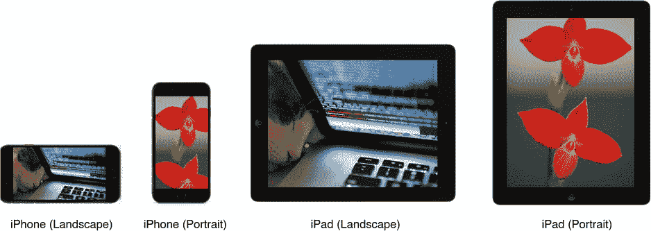

图 11-1. iOS 设备的主要布局


在自适应用户界面中，尺寸通过`vertical`尺寸类别和`horizontal`尺寸类别来表示。这些尺寸类别的幅度由你针对的屏幕类别决定：`compact`用于手机或`regular`用于平板。

如果你将屏幕重叠在一起，会注意到另一个有趣的模式，如图 11-2 所示。这些屏幕大致形成一个 3×3 的网格，宽度构成 x 轴，高度构成 y 轴。

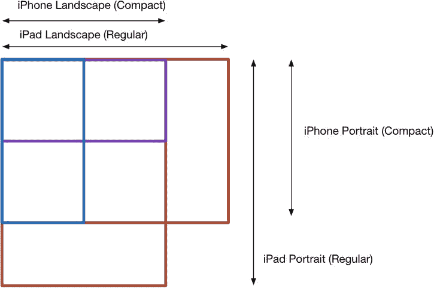

图 11-2. 屏幕尺寸的并置

尽管`compact`尺寸类别的属性很好地包含在`regular`尺寸类别内，但你可以看到还有扩展空间。因此，苹果提供了`any`尺寸类别，旨在作为用户界面的默认尺寸类别。你应该尝试将`any`尺寸类别中的项目缩小以适配`compact`尺寸类别，或者增大其尺寸/内边距以适配`regular`尺寸类别。

通过将它们放入 3×3 网格，按方向和增大尺寸排列，可以很好地可视化尺寸类别的可能组合，如图 11-3 所示。

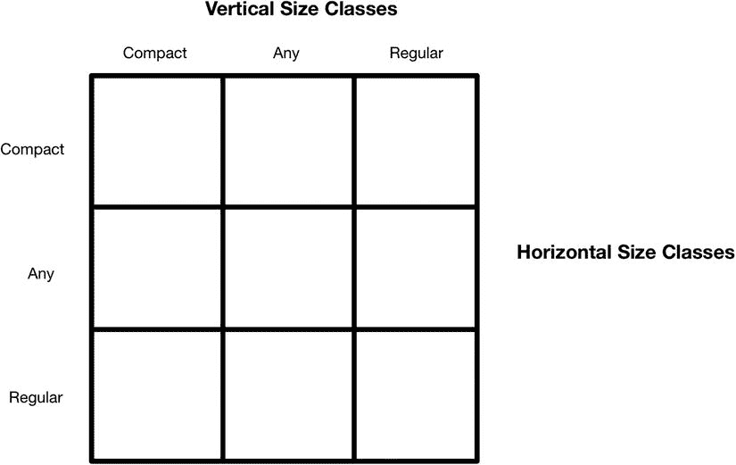

图 11-3. 尺寸类别的 3×3 网格

围绕与你目标设备对应的组合框画一条线，你就会了解需要使用的尺寸类别以优化布局。对于横屏模式的 iPad，你会使用`regular horizontal`尺寸类别和`any vertical`尺寸类别，如图 11-4 所示。

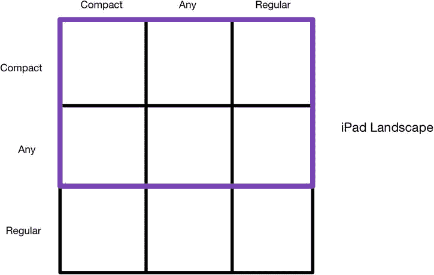

图 11-4. 横屏模式 iPad 的尺寸类别组合

Interface Builder 允许你通过属性检查器中的“尺寸类别”选项（可启用或禁用尺寸类别）和新的自动布局预览切换视图（可在故事板的特定尺寸类别版本之间切换），无缝地将尺寸类别集成到故事板中。

你可以通过选择文件检查器（Interface Builder 最右侧窗格的第一个选项卡）来切换故事板的尺寸类别设置，如图 11-5 所示。如果你在 Xcode 6 或更高版本中创建项目，故事板已经选中了“使用尺寸类别”复选框；否则，你需要手动选择它。

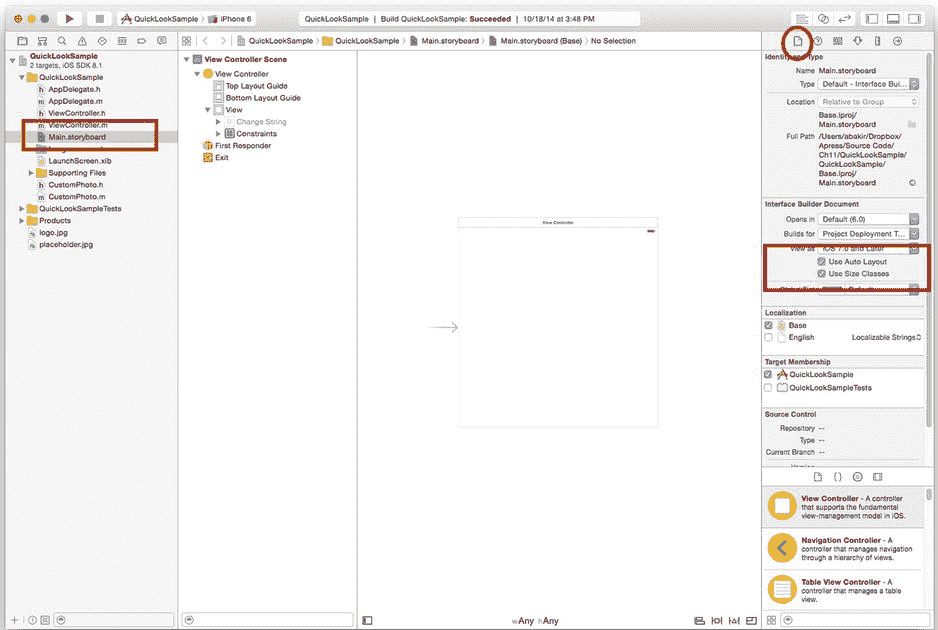

图 11-5. 为故事板启用尺寸类别

第一次在故事板中使用尺寸类别时，结果会相当令人震惊。如图 11-6 所示，默认的故事板预览将是方形的，对应于`any`×`any`的尺寸类别组合。故事板所选组合的名称显示在 Interface Builder 底部窗格的中心，在图 11-6 中以红色标出。

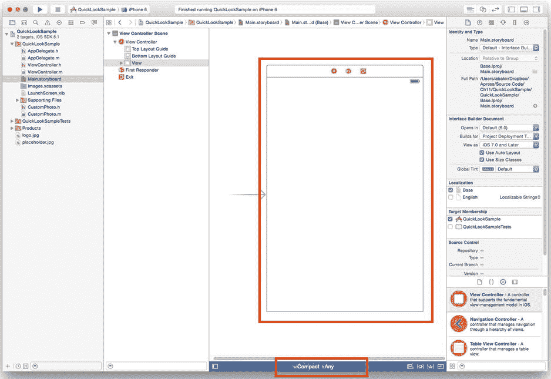

图 11-6. 默认故事板和尺寸类别组合

点击此标签会弹出一个尺寸选择器，位于弹出窗口内，如图 11-7 所示。此选择器使用与图 11-1 相同的尺寸类别组合表。使用相同的“追踪”组合逻辑，为你的设备选择适当的组合。

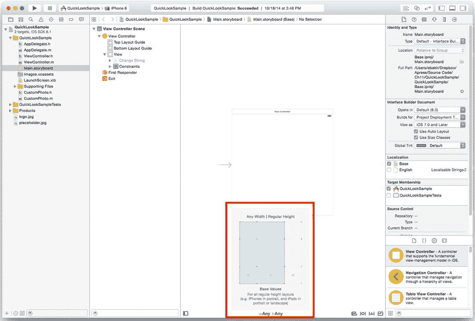

图 11-7. 故事板布局选择器

在 Xcode 6 中，你不再被迫为每个版本的界面使用相同的自动布局约束集。切换布局后，所有约束和位置更改将仅应用于该布局。利用这一点，创建最适合你设备尺寸的布局。

如果你计划使用自动布局约束来定位项目（例如将项目保持在屏幕中央），请使用`any`×`any`布局作为基础，并在其他布局（例如`compact`×`regular`）中覆盖你的选择。

## 使用 Quick Look 进行运行时预览

自第 5 版以来，苹果在 Xcode 中提供了一个名为 Quick Look 的功能。此功能允许你在调试期间将鼠标悬停在对象上以查看内容的预览，如图 11-8 所示。为此，你需要使用一个与 Quick Look 兼容的对象。在 Xcode 6 之前，苹果提供了一组有限的类（例如`UIView`、`NSString`、`CLLocation`）；然而，从 Xcode 6 开始，你可以通过实现`[NSObject debugQuickLookObject]`方法将 Quick Look 扩展到任何类。

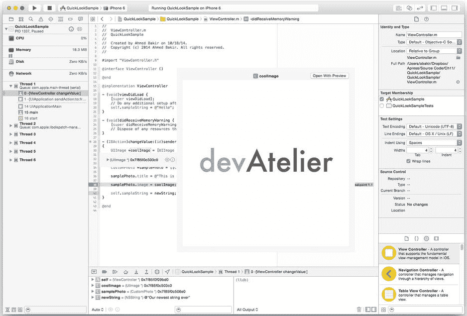

图 11-8. 对象的 Quick Look 详细信息

表 11-1 列出了默认的 Quick Look 兼容类及其输出。在构建 Quick Look 实现时，你需要使用这些类之一来显示调试信息。

表 11-1. Quick Look 兼容类

| 类 | 预览类型 |
| --- | --- |
| `UIView` | 视图及其所有子视图的快照 |
| `CLLocation` | 显示`CLLocation`对象元数据的地图和图例 |
| `NSString` | 字符串的纯文本打印输出 |
| `NSAttributedString` | 字符串的打印输出，包括所有格式（例如颜色或粗体） |
| `UIColor` | 包含所选颜色的色板 |
| `UIImage` | 图像的预览 |
| `NSURL` | 指定 URL 处内容的预览 |
| `NSData` | 数据二进制内容的打印输出 |

要访问 Quick Look，必须使用调试会话。在命中断点且执行暂停后，你可以通过将鼠标悬停在当前作用域（通常是调试器暂停的方法）中的任何兼容对象上来调出 Quick Look 面板。单击眼形按钮（如图 11-9 所示）会调出 Quick Look 视图，其中包含对象的更多详细信息。

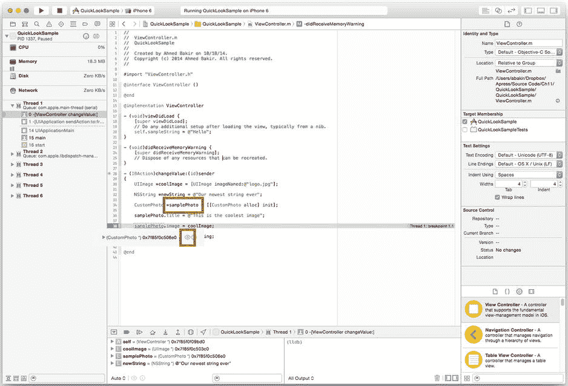

图 11-9. 显示 Quick Look 详细信息窗格

要在应用程序中启用 Quick Look，你需要在自定义类中实现`[NSObject debugQuickLookObject]`方法。回顾模型-视图-控制器设计模式，大多数需要实现 Quick Look 的类将是*模型*（表示数据）或*视图*（表示元素的视觉布局）。

为了帮助说明这个主题，我创建了一个名为`CustomPhoto`的模型类，它表示一个图像及其关联的元数据信息，类似于`ALAsset`类。你可以在源代码包的第 11 章文件夹下的 QuickLookSample 项目中找到此示例代码。列表 11-1 显示了`CustomPhoto`类的头文件。

***列表 11-1***. CustomPhoto 类的头文件

```
#import <Foundation/Foundation.h>
#import <UIKit/UIKit.h>

@interface CustomPhoto : NSObject

@property (nonatomic, strong) UIImage *image;
@property (nonatomic, strong) NSString *title;
@property (nonatomic, strong) NSString *location;

@end
```


很自然地，开发者会希望在调试`CustomPhoto`对象时，能够预览图片并检查元数据属性。由于只能从`[NSObject debugQuickLookObject]`方法返回一个对象，因此你需要选择一个能够容纳所有对象输出的类。

在`QuickLookSample`项目中，我选择创建一个`UIView`。Quick Look 可以在其预览面板中完整地绘制一个视图，因此向容器`UIView`添加子视图是一种同时显示多个项目的好方法。如图 11-10 所示，在本例中，我打算在`UIImageView`中显示图片，并在`UILabel`中显示元数据属性。

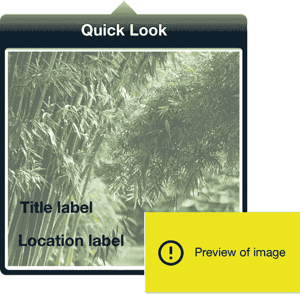

图 11-10. Quick Look 输出的模拟示意图

为 Quick Look 构建`UIView`最简单的方法是以编程方式创建并定位所有子视图。Quick Look 不接受`UIViewController`子类作为输入，因此使用 Storyboard 或 XIB 文件来布局用户界面并不高效。虽然手动定位子视图比较麻烦，但这里有一些关于`CGRect`的技巧，可以帮助你更快地构建子视图：

*   使用相邻的子视图作为定位参考。例如，要将两个元素放在相同的 y 坐标位置，可以在第一个视图的 `frame` 上使用`CGRectMinY()`便捷方法。
*   创建`UILabel`对象时，可以通过 `font` 属性更改字体。`[UIFont systemFontWithSize:]`方法允许你为字体指定像素高度，这在尝试确定标签高度时可以作为有用的参考。例如，一个 20 磅的字体，上下各留 5 像素的内边距即可——这意味着你应该指定 30 像素的高度。
*   创建`UILabel`时，文本的默认裁剪行为是截断中间字符。你可以通过将 `adjustsFontSizeToFitWidth` 属性设置为 `YES`，让文本收缩以适合`UILabel`。

代码清单 11-2 展示了创建`UIView`的代码。除了视图定位代码之外，你还会看到我为每个属性设置了默认值。因为你正在构建一个调试视图，所以当输入未设置或无效时，需要非常清楚地向用户表明。

***代码清单 11-2***. 为 `CustomPhoto` 类启用 Quick Look

```
-(id)debugQuickLookObject {
    UIView *quickLookView = [[UIView alloc] initWithFrame:CGRectMake(
        0, 0, 400, 400)];

UIImageView *imageView = [[UIImageView alloc]
        initWithFrame:quickLookView.frame];

imageView.image = (self.image == nil) ?
        [UIImage imageNamed:@"placeholder.jpg"]:
        imageView.image = self.image;

CGFloat originX = CGRectGetMinX(quickLookView.frame) + 10;
    CGFloat originY = CGRectGetMaxY(quickLookView.frame) - 40;
    CGFloat width = quickLookView.frame.size.width;

CGRect titleLabelFrame = CGRectMake(originX, originY, width, 20);
    CGRect locationLabelFrame = CGRectMake(originX, originY + 20,
        width, 20);

UILabel *titleLabel = [[UILabel alloc] initWithFrame:titleLabelFrame];
    UILabel *locationLabel = [[UILabel alloc]
        initWithFrame:locationLabelFrame];

titleLabel.text = (self.title == nil) ? @"No title" : self.title;
    locationLabel.text = (self.location == nil) ? @"No location" :
        self.location;

[quickLookView addSubview:imageView];
    [quickLookView addSubview:titleLabel];
    [quickLookView addSubview:locationLabel];

return quickLookView;
}
```

上述方法的输出应类似于图 11-11 中的示例。

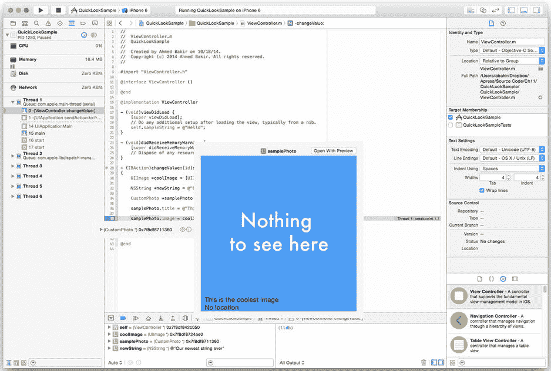

图 11-11. `CustomPhoto`类的 Quick Look 输出


```markdown
作为`UIView`的替代方案，你可以使用`NSAttributedString`对象来构建输出。富文本字符串通过允许你指定格式（如颜色和粗体文本）以及其他输入方法，扩展了`NSString`类。例如，你可以直接使用`NSAttributedString`渲染 HTML。

## 向类中添加 Interface Builder 预览

延续改进用户界面可视化调试的主题，Xcode 6 现在允许你在 Interface Builder 中预览和配置你自己的`UIView`子类。此外，Interface Builder 现在提供了一个名为*Debug Selected View*的功能，允许你在不运行应用程序的情况下调试视图。

与 Quick Look 一样，Apple 历史上在其自己的`UIView`子类（如`UILabel`和`UIButton`）中支持 Interface Builder 内的预览和配置。参考 Figure 11-12，你可以看到`UIButton`会改变其外观以反映用户在属性检查器中输入的属性更改。通过 Xcode 6，你现在可以通过添加`IB_DESIGNABLE`属性，为你的`UIView`子类启用相同的功能。

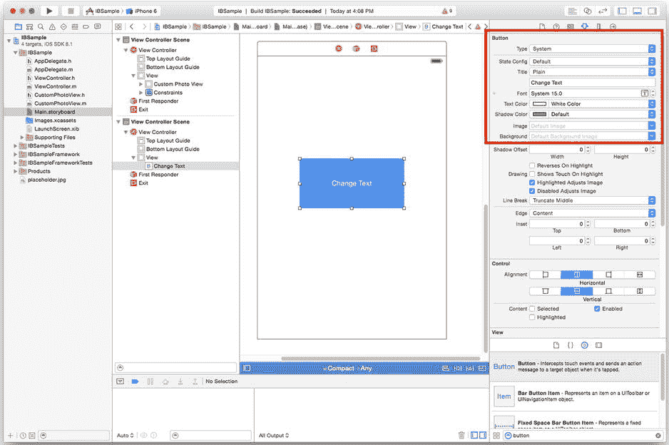

Figure 11-12. 属性检查器和 UIButton 的预览

为了演示此功能，你将创建一个单视图应用程序，该应用程序显示`CustomPhoto`类的内容，并在名为`CustomPhotoView`的`UIView`子类中展示。你可以在源代码包的 Chapter 11 文件夹中找到这个`IBSample`项目的代码。

对于`CustomPhotoView`类，你将显示一个`UIImage`和两个`UILabel`对象，它们代表`CustomPhoto`中的元数据字段，如 Figure 11-13 所示。为了帮助调试，你希望让开发人员在 Interface Builder 中看到这些子视图的实时预览。

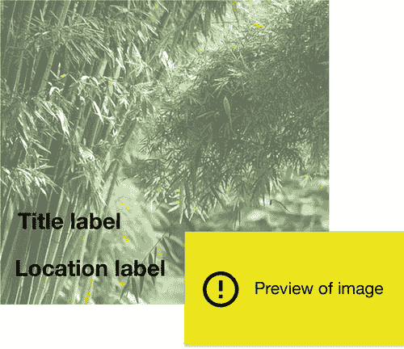

Figure 11-13. `CustomPhotoView`类的模型图

首先，创建`CustomPhotoView`类作为`UIView`的子视图。添加属性以表示模型图中的子视图，如代码清单 11-3 所示。

***代码清单 11-3***. `CustomPhotoView`类的头文件

```
#import <UIKit/UIKit.h>

IB_DESIGNABLE

@interface CustomPhotoView : UIView

@property (nonatomic) UILabel *titleLabel;
@property (nonatomic) UILabel *locationLabel;
@property (nonatomic) UIImageView *imageView;

@end
```

要为你的视图启用 Interface Builder 预览，请将`IB_DESIGNABLE`属性添加到类的`@interface`声明之前的行。Objective-C 中的*attribute*是一种编译器指令（类似于*macro*），它允许你将预定义的行为附加到变量声明上。定义实例变量时使用的`nonatomic`属性指示编译器自动为该对象创建 getter 和 setter 方法。修改后的头文件应类似于代码清单 11-4 中的示例。

***代码清单 11-4***. `CustomPhotoView`类的`IB_DESIGNABLE`兼容头文件

```
#import <UIKit/UIKit.h>

IB_DESIGNABLE

@interface CustomPhotoView : UIView

@property (nonatomic) UILabel *titleLabel;
@property (nonatomic) UILabel *locationLabel;
@property (nonatomic) UIImageView *imageView;

@end
```

要可视化`CustomPhotoView`类，你需要将其添加到你的故事板中。选择项目的`Main.storyboard`文件，并将一个视图对象拖到视图控制器场景上。使用身份检查器（Interface Builder 中的第三个选项卡）将该视图关联到`CustomPhotoView`类，如 Figure 11-14 所示。为了更容易看到视图，请使用属性检查器为其赋予一个非白色的背景颜色。

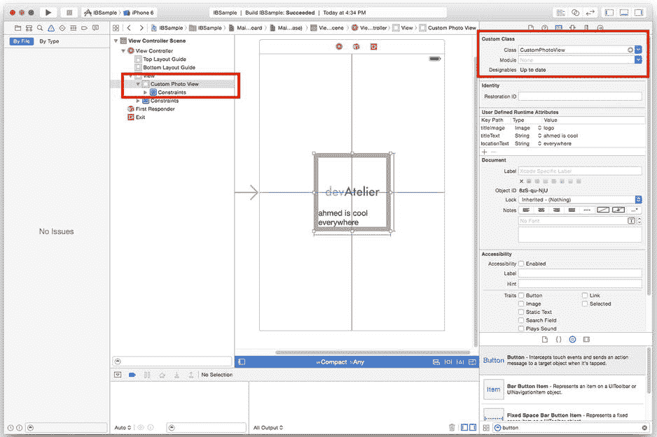

Figure 11-14. 在身份检查器中设置类名称

为了充分利用 Interface Builder 预览，你需要以编程方式布局你的视图（类似于 Quick Look）。通常，要以编程方式布局视图，你会使用`[UIView initWithFrame:]`构造方法。不幸的是，由于预览本质上是动态的，并且核心功能基于子视图构建，因此你需要使用一个每当视图被指示重新加载其子视图时都会调用的方法。由于这种设计限制，最佳的方法是使用`[UIView layoutSubviews]`。

**注意**：如果你有任何用于在`UIView`中绘制元素的代码（例如添加边框），请将其放在`[UIView drawRect]`方法中。

在你的`[UIView layoutSubviews]`方法中，添加子视图的初始化代码。`UIImageView`应填满`UIView`的整个可见区域（意味着它应使用相同的框架），而`UILabel`应位于视图的底部。与 Quick Look 示例类似，使用相邻的框架来定位元素。使用示例数据初始化子视图后，结果应类似于代码清单 11-5。

***代码清单 11-5***. 初始化`CustomPhotoView`类

```
-(void)layoutSubviews
{
    [super layoutSubviews];

    CGFloat padding = 10.0f;
    CGFloat labelHeight = 20.0f;
    CGFloat viewWidth = self.frame.size.width;
    CGFloat viewHeight = self.frame.size.height;

    CGRect insideFrame = CGRectMake(padding, padding,
        viewWidth - padding * 2, viewHeight - padding * 2);
    CGRect label1Frame = CGRectMake(padding,
        CGRectGetMaxY(insideFrame) - 40, viewWidth, labelHeight);
    CGRect label2Frame = CGRectMake(padding,
        CGRectGetMinY(label1Frame) + 20,  viewWidth, labelHeight);

    self.imageView = [[UIImageView alloc] initWithFrame:insideFrame];
    [self addSubview:self.imageView];

    self.titleLabel = [[UILabel alloc] initWithFrame:label1Frame];
    [self addSubview:self.titleLabel];
    self.titleLabel.text = @"No title";

    self.locationLabel = [[UILabel alloc] initWithFrame:label2Frame];
    [self addSubview:self.locationLabel];
    self.locationLabel.text = @"No location";
}
```

要在 Interface Builder 中预览`CustomPhotoView`，请选择你的故事板文件。你应该能够在视图中看到占位符文本，如 Figure 11-15 所示。不幸的是，你还需要再做一点工作才能预览图像。

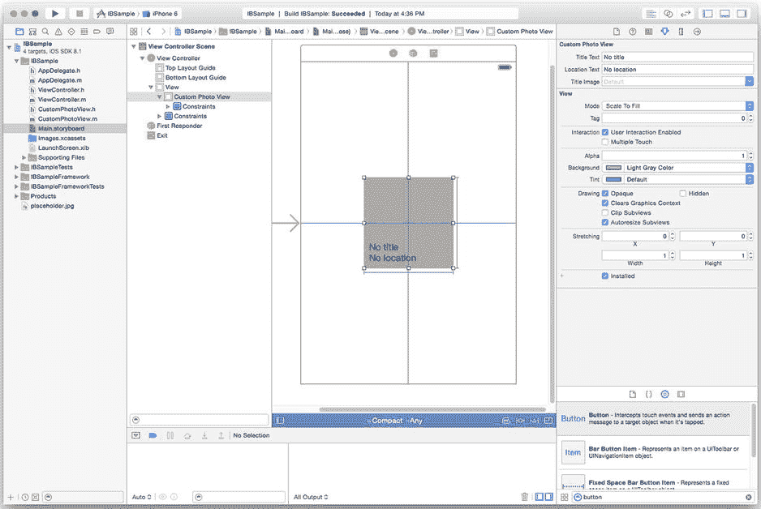

Figure 11-15. 预览`CustomPhotoView`类

尽管看到占位符文本令人兴奋，但对于开发人员来说，能够从 Interface Builder 内部实时更改图像和文本并查看结果则更为激动人心（也更有用）。Xcode 6 允许你通过`IBInspectable`属性，将有限的类集合作为可编辑属性暴露在 Interface Builder 中。此属性的工作方式与`IBOutlet`属性非常相似：将必要的代码添加到你的声明中，可以使该属性出现在 Interface Builder 中。你可以在表 11-2 中找到支持的类列表。

表 11-2. `IBInspectable`兼容的类

| 类 | 用途 |
| --- | --- |
| `UIImage` | 允许你从应用包或素材目录中选择图像 |
| `UIColor` | 允许你通过 OS X 颜色选择器选择颜色 |
| `NSString` | 允许你输入字符串 |
| `NSInteger` | 允许你输入整数值 |
| `CGFloat` | 允许你输入浮点数值 |
| `CGRect` | 允许你输入四个浮点数值，分别对应框架的 x、y、宽度和高度 |
```


为了创建`IBInspectable`兼容的对象，向`CustomPhotoView`类添加代表`CustomPhoto`类中`image`、`title`和`location`属性的属性，如清单 11-6 所示。

***清单 11-6***. 向`CustomPhotoView`类添加`IBInspectable`属性

```objective-c
#import <UIKit/UIKit.h>

IB_DESIGNABLE

@interface CustomPhotoView : UIView

@property (nonatomic) UILabel *titleLabel;
@property (nonatomic, strong) IBInspectable NSString *titleText;
@property (nonatomic) UILabel *locationLabel;
@property (nonatomic, strong) IBInspectable NSString *locationText;

@property (nonatomic) UIImageView *imageView;
@property (nonatomic, strong) IBInspectable UIImage *titleImage;

@end
```

要验证 Interface Builder 是否识别了您的属性，请在故事板中选择您的视图。在“属性检查器”顶部，您将看到包含您属性的部分，如图 11-16 所示。

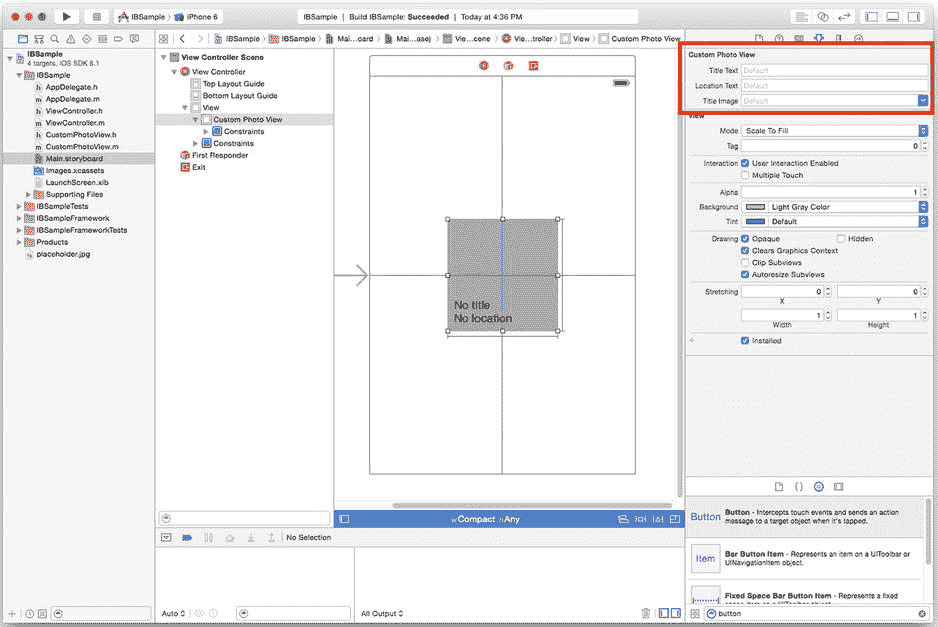

图 11-16. 在 Interface Builder 中查看`IBInspectable`属性

要使输入影响预览，您需要将这些属性连接到`[UIView layoutSubviews]`方法中的子视图。如清单 11-7 所示，通过将占位值替换为对`IBInspectable`兼容属性的引用，您可以为属性启用实时预览。

***清单 11-7***. 添加实时更新

```objectivec
-(void)layoutSubviews
{
    [super layoutSubviews];

...

self.imageView = [[UIImageView alloc] initWithFrame:insideFrame];
    self.imageView.image = self.titleImage;

[self addSubview:self.imageView];

self.titleLabel = [[UILabel alloc] initWithFrame:label1Frame];
    self.titleLabel.text = self.titleText;
    [self addSubview:self.titleLabel];

self.locationLabel = [[UILabel alloc] initWithFrame:label2Frame];
    self.locationLabel.text = self.locationText;
    [self addSubview:self.locationLabel];

}
```

现在，您可以从 Interface Builder 内为属性选择新值。一旦您完成输入（或从下拉菜单中选择一个选项），故事板将反映您的更改。

## 使用 Interface Builder 调试视图

在 Interface Builder 中查看实时预览可以大大加快视图调试，但如果您在屏幕上放置元素时遇到问题，这并没有帮助。为满足此需求，Xcode 6 为界面开发者引入了一种新的调试模式：**Debug Selected Views**。此功能允许您设置断点并逐步执行视图初始化代码，而无需运行您的应用程序。

您没看错：**Debug Selected Views**功能让您无需启动应用程序的调试会话，即可执行调试会话的所有功能（断点、单步执行代码以及使用 LLDB 调试控制台）。如果您曾经尝试调试`UITableViewController`，您一定非常熟悉这个过程是多么困难——过滤数据源中每个`UITableViewCell`的消息有时会使您偏离最初的目标。

使用**Debug Selected Views**功能无需额外设置。只需在 Interface Builder 中选择一个`IB_DESIGNABLE`兼容的`UIView`子类，然后从“Editor”菜单中选择**Debug Selected Views**选项，如图 11-17 所示。

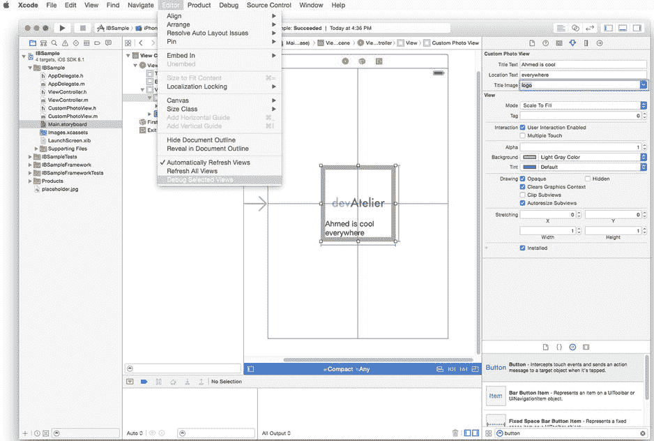

图 11-17. 启用 Debug Selected Views

确保您在`UIView`子类中设置了断点；否则调试器将没有内容可检查。当调试器命中断点时，您将看到熟悉的 LLDB 调试界面，如图 11-18 所示。您可以使用这些额外的面板来检查堆栈、设置额外断点，甚至向 LLDB 调试器发送指令。

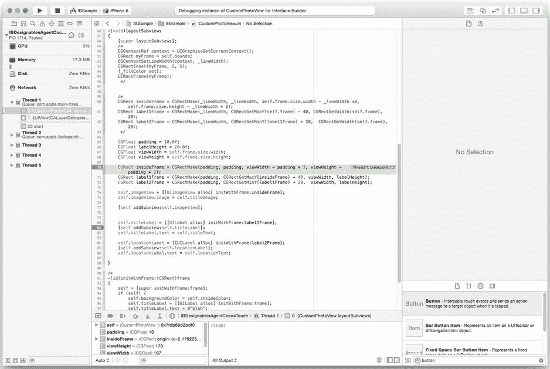

图 11-18. 调试界面

与普通调试会话不同，视图调试不会启动 iOS 模拟器。要调试您的视图，请在 Xcode 的单独标签页或作为伴随视图（维恩图图标）中打开 Interface Builder。因为您已经为类启用了`IB_DESIGNABLE`属性，所以在逐步执行代码时，您可以在 Interface Builder 中查看实时预览。

## 总结

在本章中，您探索了 Xcode 6 中可以帮助您更快、更智能地构建和调试用户界面的几项新功能。首先，Size Classes 可以帮助您构建一个可在所有设备上使用的单一故事板。接着，您了解了如何向任何类添加 Quick Look 兼容输出，使您能够在 Xcode 调试界面中查看类的快照。最后，为了帮助您创建可重用的用户界面元素，您了解了如何使用`IB_DESIGNABLE`属性向任何`UIView`子类添加 Interface Builder 兼容性。任何集成开发环境的目标都应是加速您的工作流程。所有这些功能无疑有助于实现这一目标，为您提供了比不断重启调试会话更好的调试用户界面的方法。

# 第 12 章 使用 AVKit 框架进行媒体播放

尽管 iOS 7 给 Apple 移动应用世界带来了设计理念上的巨大转变，但 iOS 8 承诺通过强调新功能和对旧功能的精简，再次推动移动应用开发。这些变化延伸到了媒体播放领域，引入了另一个媒体播放框架——`AVKit`！

`AVKit`框架旨在成为`MediaPlayer`框架媒体播放功能的直接替代品。如图 12-1 所示，该框架通过`AVPlayerViewController`类提供的播放界面，与您在本书中一直使用的`MPMediaPlayerController`类提供的界面几乎完全相同。

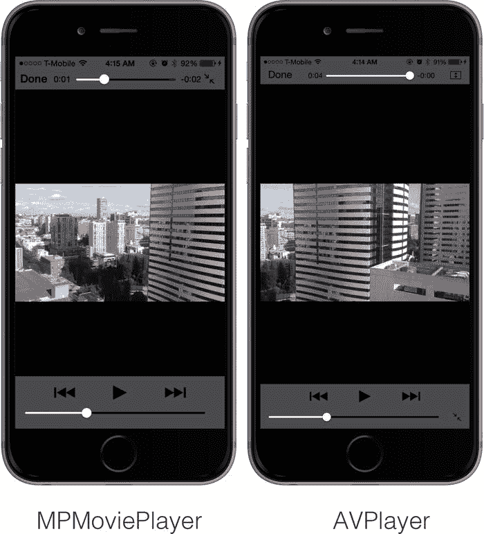

图 12-1. 熟悉的`MPMoviePlayerController`播放界面与新`AVPlayerController`播放界面的对比

从用户界面角度来看，除了控制栏中增加了一个小的“Expand”按钮外，变化不大。对于某些视频，您可能还会看到一个“Dialog”按钮，它提供了一个音频和字幕轨道选择器，如图 12-2 所示。

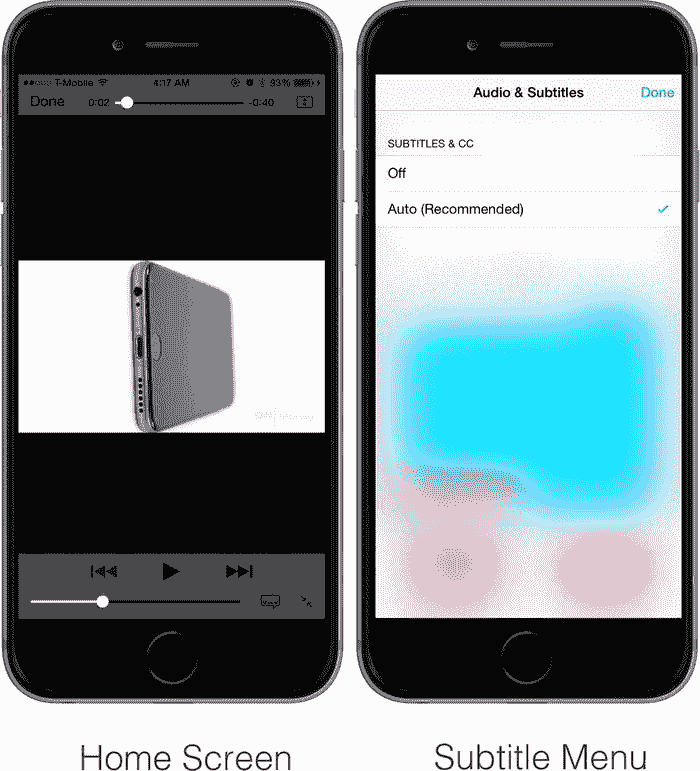

图 12-2. `AVPlayerController`类的音频和字幕选择器

这一新功能源于`AVKit`和`MediaPlayer`框架在软件架构层面的关键差异；`AVKit`框架被设计为在更接近`AVFoundation`框架的层级上进行媒体播放。从视频章节（第 8-10 章）中您可能还记得，您使用了`MediaPlayer`框架来呈现 iOS 内置的媒体播放界面，但需要下探到`AVFoundation`层来重写控件或创建自己的录制界面。


同样，通过音频章节（第 5 章–第 7 章），你可能还记得，`AVFoundation`允许你控制播放——前提是你得自己构建播放界面。`AVKit`框架则致力于弥补这一差距，它提供了一个可操作`AVAssetItem`对象（即`AVFoundation`用于表示媒体的类）的播放界面。因此，它可以用更少的“胶水”代码执行更高级的操作。这使得处理媒体文件更加容易，甚至能让你即时实现视频特效——例如添加水印或颜色滤镜。

在本章中，你将看到如何通过修改来自第 9 章的 MyVideoPlayer 视频播放器应用，使其使用`AVPlayerController`类进行媒体播放，从而利用`AVKit`框架。此外，你还将了解`AVKit`与`AVFoundation`框架更紧密的集成，例如使用`AVQueuePlayer`类轻松地将播放列表加载到视频播放器中。最后，为增添最后一点亮点，你将学习如何为播放器添加水印——这是一种为视频播放界面添加品牌标识的便捷方式。

此时，你可能想知道`MediaPlayer`框架是否还会存在，以及你所学的知识在未来几年是否依然适用。答案是肯定的，绝对适用！`AVPlayerViewController`类的功能设计和消息传递旨在模仿`MPMoviePlayerController`类，因此你所掌握的`MediaPlayer`框架知识将减少调试和实现基于`AVKit`的应用时的障碍。此外，尽管引入了`AVKit`框架，苹果公司宣布`MediaPlayer`框架并*不*会被弃用。至少在接下来的几个版本中，你可以预期基于`MediaPlayer`的应用会像往常一样正常运行。

虽然苹果公司没有弃用`MediaPlayer`框架，但他们对于竞争性 API 的总体趋势是将活跃开发转移到较新的框架上；尽早开始使用将帮助你脱颖而出。

**Caution** 在尝试实现本章项目之前，你需要将开发工具升级到 Xcode 6 和 iOS 8 SDK。`AVKit`框架在 iOS 8 之前的 SDK 版本中不可用。

## 入门指南

为了说明`AVKit`框架的使用，你将修改来自第 9 章的 MyVideoPlayer 视频播放应用，使其使用`AVPlayerViewController`类进行媒体播放，并添加支持水印和队列播放（播放列表）的功能。新项目将命名为 MyAVPlayer，可在源代码包的第 13 章文件夹中找到。

MyVideoPlayer 项目呈现了一个窗口式视频播放器。用户可以从应用的文档文件夹中选择一个媒体文件进行播放。如图 12-3 所示，用户在 MyAVPlayer 项目中唯一能看到的图形界面变化是覆盖在播放器上的水印，以及一个额外的“全部播放”按钮，用于开始播放文档文件夹中的所有媒体文件。

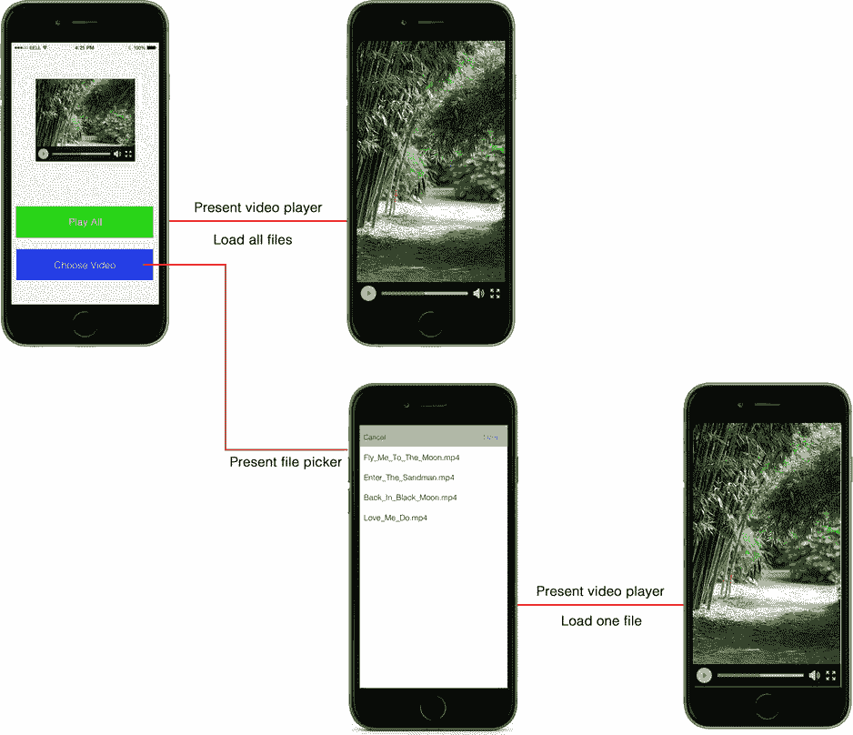

图 12-3. MyAVPlayer 项目效果图

按照你在第 8 章中从 MyPod 项目副本创建 MyVideoPlayer 项目时的相同流程，创建一个包含 MyVideoPlayer 项目的文件夹副本，然后在 Xcode 中将其重命名为`MyAVPlayer`。

要使用`AVKit`框架，必须确保`AVKit`和`AVFoundation`框架都已包含在你的项目中。如果你使用的是 Xcode 6 和 iOS 8 SDK（或更高版本），这两个框架都会出现在框架浏览器中。由于在此项目中你将使用`AVKit`作为`MediaPlayer`框架的直接替代品，请从项目中移除`MediaPlayer`框架。你最终的框架列表应类似于图 12-4 中的示例。

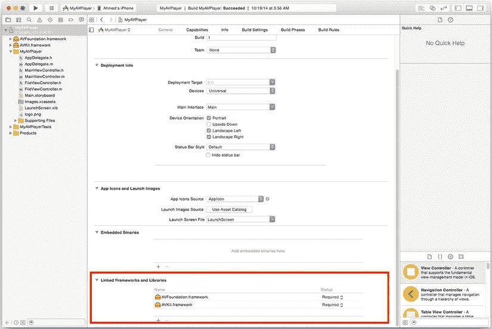

图 12-4. MyAVPlayer 项目的框架列表

接下来，你需要更新`MainViewController`类中的代码，以反映`AVKit`框架和新的“全部播放”按钮。首先，导入`AVKit`和`AVFoundation`框架：

```
#import <AVFoundation/AVFoundation.h>
#import <AVKit/AVKit.h>
```

然后将`moviePlayer`属性的类型从`MPMoviePlayerController`更改为`AVPlayerViewController`：

```
@property (nonatomic, strong) AVPlayerViewController *moviePlayer;
```

最后，添加一个代表“全部播放”按钮的`UIButton`属性：

```
@property (nonatomic, strong) IBOutlet UIButton *playAllButton;
```

你的`MainViewController`类的头文件应类似于代码清单 12-1 中的示例。

**代码清单 12-1.** MainViewController 类的头文件

```
#import <UIKit/UIKit.h>
#import <AVFoundation/AVFoundation.h>
#import <AVKit/AVKit.h>
#import "FileViewController.h"

@interface MainViewController : UIViewController <FileControllerDelegate>

@property (nonatomic, strong) IBOutlet UIView *playerViewContainer;
@property (nonatomic, strong) IBOutlet UIButton *chooseFileButton;
@property (nonatomic, strong) IBOutlet UIButton *playAllButton;
@property (nonatomic, strong) AVPlayerViewController *moviePlayer;

-(IBAction)playAll:(id)sender;

@end
```

最后，将你的“全部播放”按钮添加到项目的 Storyboard 中，并将其关联到你刚刚添加的属性。你中间状态的 Storyboard 应类似于图 12-5 中的示例。

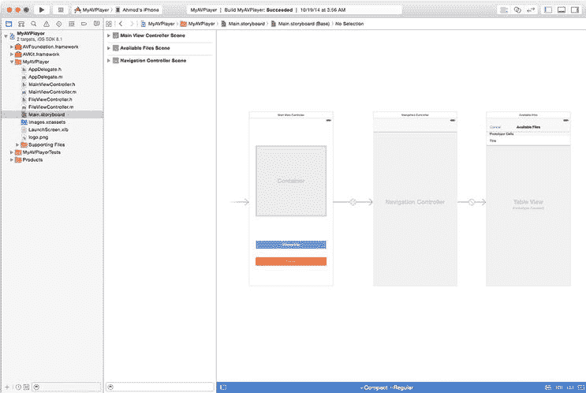

图 12-5. MyAVPlayer 项目的 Storyboard

## 使用 AVPlayer 类播放媒体文件

与`MPMediaPlayerController`类一样，要初始化一个`AVPlayerViewController`对象，你需要为其提供一个媒体文件或内容 URL 作为输入。`AVPlayer`类负责处理`AVPlayerViewController`类的播放功能。`AVPlayer`类使用`AVPlayerItem`对象（`AVAsset`的子类）来表示媒体项。与`MPMediaItem`对象不同，`AVAsset`可以以*容器*格式表示媒体文件，可以包含多个字幕和音轨，并且可以表示`AVComposition`对象——这些特殊对象可向资产添加基于时间的特效，如滤镜和转场。

你可以使用`[AVPlayer playerWithURL:]`方法，通过单个媒体文件初始化`AVPlayer`对象。这样做会自动将你的内容 URL 转换为一个`AVPlayerItem`对象。与 MyVideoPlayer 应用类似，你应该在用户从文件选择器中选择文件后初始化`AVPlayer`。将你的初始化代码放在`FileControllerDelegate`协议的处理器方法`[FileControllerDelegate didFinishWithFile:]`中，如代码清单 12-2 所示。这将替换你之前的`MPMoviePlayerController`初始化代码。

**代码清单 12-2.** 将媒体文件加载到 AVPlayer 对象中


```objc
-(void)didFinishWithFile:(NSString *)filePath
{
    NSArray *paths = NSSearchPathForDirectoriesInDomains(
        NSDocumentDirectory, NSUserDomainMask,  YES);
    NSString *documentsDirectory = [paths objectAtIndex:0];
    NSString *relativePath = [documentsDirectory
        stringByAppendingPathComponent:filePath];

    NSURL *fileURL = [NSURL fileURLWithPath:relativePath];

    self.moviePlayer.player = [AVPlayer playerWithURL:fileURL];
    [self.moviePlayer.player addObserver:self forKeyPath:@"status"
                             options:0 context:nil];

    [self dismissViewControllerAnimated:YES completion:^{
        [self.moviePlayer.player play];
    }];
}
```

与基于 `MediaPlayer` 的实现类似，你的内容 URL 需要在运行时创建，以正确确定应用文档目录的位置（请记住，确切位置与 iOS 自动生成的 UUID 相关联）。

**注意** 如果你想直接加载 `AVComposition` 或 `AVPlayerItem`，可以使用 `[AVPlayer playerWithPlayerItem:]` 方法。

初始化 `AVPlayer` 对象后，用户可以点击“播放”按钮开始播放文件。然而，要完全实现 `MyVideoPlayer` 项目的工作流程，还需要添加最后两个步骤：

1.  呈现 `AVPlayerViewController`。
2.  定义媒体播放事件（例如，预加载媒体以使其加载更快）。

### 呈现 AVPlayerViewController

从用户界面的角度来看，`AVPlayerViewController` 相比 `MPMoviePlayerController` 有两个主要优势：它提供了*自适应*控件，可以响应窗口大小和播放内容的类型；并且它提供了可在 `Interface Builder` 中使用的对象表示形式，如图 12-6 所示。

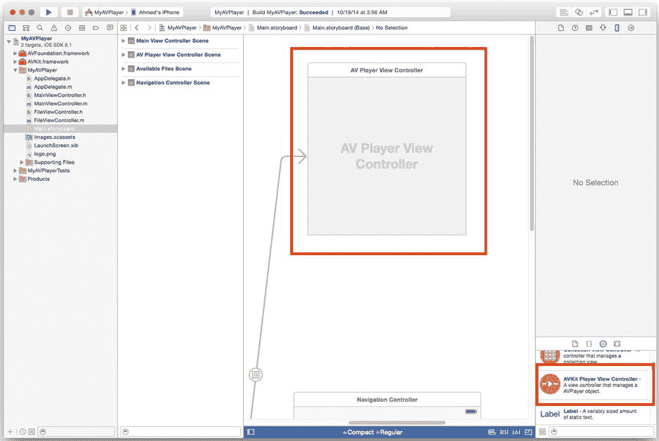

图 12-6. `AVPlayerViewController` 的 `Interface Builder` 对象

如图 12-7 所示，`AVPlayerViewController` 类会根据呈现样式（窗口或全屏）自动切换控件类型。相比之下，`MPMoviePlayerController` 要求用户指定其控件样式。

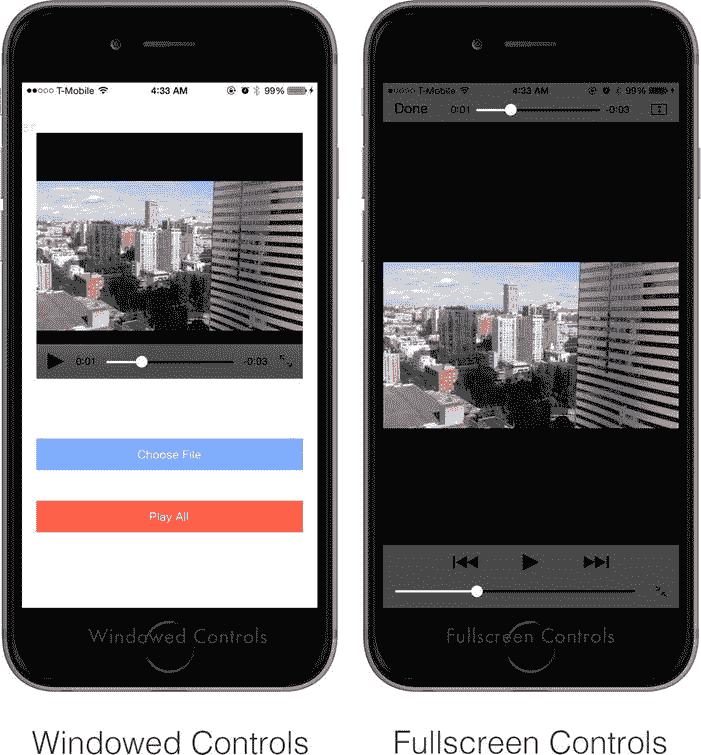

图 12-7. 两种 `AVPlayerViewController` 呈现样式的控件差异

与 `MPMoviePlayerController` 类一样，用户可以点击嵌入播放器中的展开控件，在窗口播放和全屏播放之间切换。

**注意** 你仍然可以通过 `showsPlaybackControls` 属性完全隐藏 `AVPlayerViewController` 的控件。

类似地，控件会根据用户播放的是本地媒体文件还是流媒体文件而改变。如图 12-8 所示，本地播放会显示“播放”按钮和“前进/后退”按钮，以便用户在播放列表中导航；而流媒体播放会显示“播放”按钮和“重复”按钮。在控件样式方面，`AVPlayerViewController` 类会自动完成所有这些操作。

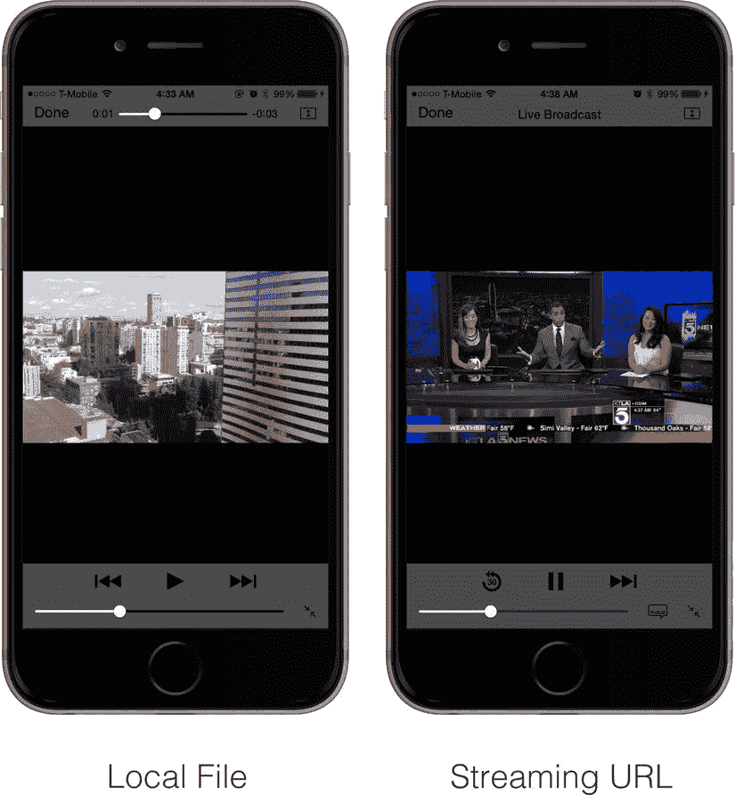

图 12-8. `AVPlayerViewController` 在本地文件和流媒体文件之间的控件差异

虽然 `MyAVPlayer` 项目的用户界面应与 `MyVideoPlayer` 项目保持一致，但你需要更改视图初始化代码。`AVPlayer` 类负责控制媒体播放，而 `AVPlayerViewController` 作为用户界面的包装器。要以窗口模式呈现 `AVPlayerViewController`，请使用容器视图来包含 `AVPlayerViewController` 对象。

要将 `AVPlayerViewController` 放置在 `MainViewController` 类上，请从 `Interface Builder` 的对象库中将容器视图和 AV Player View Controller 对象拖放到你的故事板中，如图 12-9 所示。

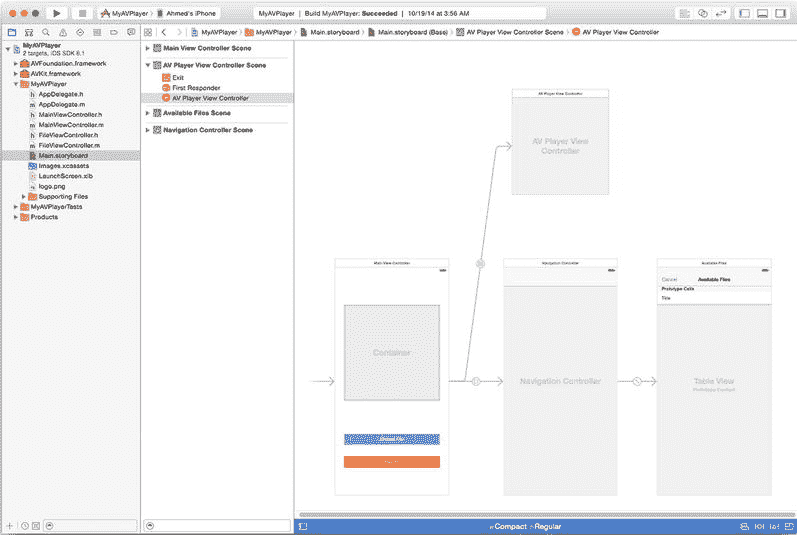

图 12-9. `MyAVPlayer` 项目的完成故事板

将容器视图连接到 `MainViewController` 类中的 `playerView` 属性。要初始化视图，请创建一个名为 `setPlayer` 的*嵌入*转场。系统只会在视图加载后调用该转场一次。与所有转场一样，将其添加到 `[MainViewController prepareForSegue:sender:]` 方法中，如代码清单 12-3 所示。

***代码清单 12-3***. 从转场初始化 `AVPlayerViewController` 对象

```objc
-(void)prepareForSegue:(UIStoryboardSegue *)segue sender:(id)sender
{
    if ([segue.identifier isEqualToString:@"setPlayerContent"]) {
        AVPlayerViewController *playerVC = (AVPlayerViewController *)
            segue.destinationViewController;
        self.moviePlayer = playerVC;

    } else if ([segue.identifier isEqualToString:@"showFilePicker"]) {
        NSMutableArray *videoArray = [NSMutableArray new];

        NSArray *paths = NSSearchPathForDirectoriesInDomains(
            NSDocumentDirectory, NSUserDomainMask, YES);
        NSString *documentsDirectory = [paths objectAtIndex:0];
        NSError *error = nil;

        NSArray *allFiles = [[NSFileManager defaultManager]
            contentsOfDirectoryAtPath:documentsDirectory error:&error];

        if (error == nil) {

            for (NSString *file in allFiles) {
                NSString *fileExtension = [
                    [file pathExtension] lowercaseString];
                if ([fileExtension isEqualToString:@"m4v"] ||
                    [fileExtension isEqualToString:@"mov"]) {
                        [videoArray addObject:file];
                }
            }

            UINavigationController *navigationController =
            (UINavigationController *) segue.destinationViewController;
            FileViewController *fileVC =
              (FileViewController *)navigationController.topViewController;
            fileVC.delegate = self;
            fileVC.fileArray = videoArray;
        } else {
            NSLog(@"error looking up files: %@", [error description]);
        }
    }
}
```

在转场中，访问*目标*视图控制器的主要方法是通过 `destinationViewController` 属性。由于 `setPlayer` 转场标识在你的故事板中只使用一次，因此你可以知道 `destinationViewController` 对象指向你放置的 `AVPlayerViewController`。进行类型转换后，你就获得了可用于设置 `MainViewController` 类的 `moviePlayer` 属性的有效对象。（请记住，放置在故事板上的对象在加载时会由其默认构造函数初始化。）

由于你是在 `[FileViewDelegate didFinishWithFile:]` 方法中（在用户从文件选择器中选择文件后）初始化了 `AVPlayer` 对象，因此你的视频播放器现在可以使用了。当用户选择媒体文件时，你的视频播放器将加载视频的第一帧和播放器的控制栏，表明它已准备好播放。

## 使用 AVQueuePlayer 类播放播放列表

`AVKit` 框架相对于 `MediaPlayer` 框架的另一个优势在于，它允许你使用 `AVQueuePlayer` 类通过播放列表来初始化媒体播放器。除了能够一次加载多个文件之外，将 `AVQueuePlayer` 用作 `AVPlayerController` 的 `player` 属性，将自动添加上下文控件和处理方法，以便用户可以在播放列表中的项目之间导航。


你可能会想：“这功能很基本啊，难道所有的媒体播放器类不都应该有吗？”遗憾的是，你用于媒体播放的主要类——`AVAudioPlayer`（用于音频）和`MPMediaPlayerController`（用于视频）——无法用播放列表来初始化。大多数应用程序在这些类上实现类似播放列表功能的方式是：当应用收到*播放完成*事件时，用播放列表中的“下一个文件”来初始化媒体播放器。在`AVKit`出现之前，唯一能原生处理播放列表的媒体播放器类是`MPMusicPlayerController`，你曾用它进行 iPod 音乐播放——但请记住，你必须实现自己的用户界面才能使用这个类。而`AVQueuePlayer`类则一举两得，既提供了用户界面，又提供了从一个对象到另一个对象的转场逻辑。

正如`AVPlayerViewController`类旨在作为`MPMediaPlayerController`类的直接替代品一样，你可以将`AVQueuePlayer`类用作`AVPlayer`类的直接替代品。这两个类的关键区别在于：初始化`AVQueuePlayer`时，不是传入单个媒体资源，而是传入一个`AVPlayerItem`对象数组：

```
AVQueuePlayer *queuePlayer = [[AVQueuePlayer alloc]
                              initWithItems:playerItemArray];
```

需要使用`AVPlayerItem`对象的要求意味着你不能使用单个内容 URL 来初始化播放器。不过，你可以通过`[AVPlayerItem playerItemWithURL:]`方法从内容 URL 创建`AVPlayerItem`对象：

```
AVPlayerItem *item1 = [AVPlayerItem playerItemWithURL:@"goodDoge.mp4"];
```

这个方法允许你使用本地文件 URL 或远程内容 URL。和往常一样，记得在运行时计算本地文件 URL，以便正确加载它：

```
NSString *relativePath = [documentsDirectory
    stringByAppendingPathComponent:@"goodDoge.mp4"];
NSURL *fileURL = [NSURL fileURLWithPath:relativePath];
AVPlayerItem *item1 = [AVPlayerItem playerItemWithURL:fileURL];
```

因为`AVQueuePlayer`类是`AVPlayer`的子类，你只需要将一个`AVQueuePlayer`对象传递给`AVPlayerViewController`的`player`属性即可：

```
self.moviePlayer.player = queuePlayer;
```

正如本章开头在 MyAVPlayer 项目中提到的，你希望让用户通过“选择文件”按钮播放单个文件，或者当他们使用“全部播放”按钮时加载所有可用文件。为此，在用户选择“选择文件”按钮时，用`AVPlayer`初始化`AVPlayerViewController`；在用户选择“全部播放”按钮时，用`AVQueuePlayer`初始化。

为了保留单文件播放功能，你应该保持“选择文件”处理程序（文件选择器委托）不变。相反，创建一个新方法`[MainViewController playAll:]`，它将作为“全部播放”按钮的处理程序。如代码清单 12-4 所示，使用此方法为共享的`AVPlayerViewController`对象设置`player`属性。

***代码清单 12-4***. 使用`AVQueuePlayer`初始化`AVPlayerViewController`

```
-(IBAction)playAll:(id)sender
{

NSString *relativePath = [documentsDirectory
        stringByAppendingPathComponent:@"goodDoge.mp4"];
    NSURL *fileURL = [NSURL fileURLWithPath:relativePath];
    AVPlayerItem *item1 = [AVPlayerItem playerItemWithURL:fileURL];

NSString *relativePath2 = [documentsDirectory
        stringByAppendingPathComponent:@"badDoge.mp4"];
    NSURL *fileURL2 = [NSURL fileURLWithPath:relativePath2];

AVPlayerItem *item2 = [AVPlayerItem
        playerItemWithURL:@"http://www.devatelier.com/commercial.mov"];
    NSArrray *playerItemArray = [NSArray arrayWithObjects: item1, item2];

self.moviePlayer.player = [[AVQueuePlayer alloc]
        initWithItems:playerItemArray];

[self.moviePlayer.player addObserver:self forKeyPath:@"status"
        options:0 context:nil];

[self.moviePlayer.player play];

}
```

为了让这段代码能编译通过，你需要定义`inputPlaylist`对象。因为目标是播放所有文件，你可以从文件选择器（`FileViewController`）类中复制扫描逻辑。扫描文档目录中的所有文件，并将它们添加到一个`NSMutableArray`中。当这个过程完成后，将其附加到你的`AVPlayerViewController`上。代码清单 12-5 显示了完整的初始化方法。

***代码清单 12-5***. `AVQueuePlayer`的完整初始化代码

```
-(IBAction)playAll:(id)sender
{
    NSArray *paths = NSSearchPathForDirectoriesInDomains(
        NSDocumentDirectory, NSUserDomainMask, YES);
    NSString *documentsDirectory = [paths objectAtIndex:0];
    NSError *error = nil;

NSArray *allFiles = [[NSFileManager defaultManager]
        contentsOfDirectoryAtPath:documentsDirectory error:&error];

NSMutableArray *playerItemArray = [NSMutableArray new];

for (NSString *file in allFiles) {

if ([[file pathExtension] isEqualToString:@"mp4"] ||
            [[file pathExtension] isEqualToString:@"mov"] ||
             [[file pathExtension] isEqualToString:@"MOV"]) {
            NSString *relativePath = [documentsDirectory
                stringByAppendingPathComponent:file];

NSURL *fileURL = [NSURL fileURLWithPath:relativePath];

AVPlayerItem *playerItem = [AVPlayerItem
                playerItemWithURL:fileURL];

[playerItem addObserver:self forKeyPath:@"status"
                options:nil context:nil];

[playerItemArray addObject:playerItem];
        }

}

self.moviePlayer.player = [[AVQueuePlayer alloc]
        initWithItems:playerItemArray];

[self.moviePlayer.player addObserver:self forKeyPath:@"status"
        options:0 context:nil];

[self.moviePlayer.player play];

}
```

## 处理媒体播放事件

`MPMediaPlayerController`类中少数几个没有直接移植到`AVPlayerViewController`类的特性之一，是通过通知报告播放状态变化。好消息是，你可以通过使用键值观察者在`AVPlayerViewController`中实现类似的功能。某些播放事件（如*播放完成*和类似事件）的通知仍然存在。

### 使用键值观察者

与通知类似，键值观察（KVO）是一种基于订阅的消息传递系统，这意味着类在声明*正在观察*它们之前不会收到任何消息。虽然通知要求你定义并使用通知“名称”，通过一个中心服务（通知中心）来传递和接收消息，但键值观察者是去中心化的。

当对象上某个属性（键）的内容（值）发生变化时，会触发键值观察者消息。在 KVO 中，一个类声明自己是一个对象消息的观察者，并指定一个处理程序方法——这与通知类似。任何对象或属性都可以被观察，这让你能够灵活地定义对未绑定到通知或委托方法的事件的处理——但代价是可重用性降低（你的实现将特定于类，且可移植性较差）。

创建和使用键值观察者的过程与创建通知非常相似（主要区别在于其特定于对象的特性）：声明你的类正在观察对象上的某个属性。

1. 实现 KVO 事件的处理程序代码。
2. 当不再需要时，移除你的观察者（以防止崩溃）。

注册键值观察者的 API 是`[NSObject addObserver:forKeyPath:options:context]`。如果你想观察数组长度的变化，注册代码看起来像这样：

`[self.peopleArray addObserver:self forKeyPath:@"count" options:nil`
    `context:nil];`


#### 接收者（`receiver`，即调用类）是此消息需要被观察的对象；在本例中，就是数组本身。观察者（`observer`）是充当委托并基于指定值变化接收消息的类。`key path` 是您想要观察的对象的属性；该名称作为区分大小写的字符串传递。`options` 参数允许您指定信息应如何发送到处理方法。例如，您可以减少消息的频率（默认值 `nil` 对于大多数初级应用来说已经足够）。`context` 参数允许您在处理方法中指定一个“原始值”进行比较。同样，默认值 `nil` 对于大多数初级应用来说已经足够。

与通知不同，`NSObject` 方法通过使用 `[NSObject observeValueForKeyPath:ofObject:change:context]` 来处理所有键值观察者。对于数组示例，您的处理方法如下所示：

```
-(void)observeValueForKeyPath:(NSString *)keyPath
     ofObject:(id)object change:(NSDictionary *)change
     context:(void *)context
{
    if ((object == self.peopleArray) &&
         [keyPath isEqualToString:@"count"] ) {
             NSLog(@"new count!", [self.peopleArray count]);
     }
}
```

处理 KVO 消息的参数与声明观察者时使用的参数一一对应。陌生部分应该是处理逻辑。由于一个方法处理所有消息，您需要检查消息是否来自指定的对象。如果您使用的是实例变量，则直接比较对象；如果您想使用局部变量，则可以比较对象类型。此外，您还需要检查消息是否对应于预期的属性（因为您可以在同一对象上观察多个属性）。

最后，要移除观察者，您需要在类的拆卸过程中，调用接收对象上的 `[NSObject removeObserver:forKeyPath]` 方法。对于数组示例，代码如下所示：

```
-(void)dealloc
{
    [self.peopleArray removeObserver:self forKeyPath:@"count"];
}
```

正如通知一样，KVO 消息可能在类拆卸后触发；清理观察者可以防止崩溃。如果在运行时重新初始化实例变量，建议将移除观察者作为重置步骤的一部分。

#### 加载完成事件

您可能还记得（参见第 8 章），在选择媒体文件后，您立即调用了 `[MPMediaPlayer prepareToPlay]` 方法开始加载文件。文件加载完成后，会触发 `MPMoviePlayerLoadStateChanged` 通知，指示文件已准备好播放。收到此通知后，您调用了 `[MPMediaPlayer play]` 函数。`AVPlayer` 对象的 `status` 属性用于检索视频的加载状态。在您的 `FileViewController` 委托方法中，初始化 `player` 对象后添加一个观察者，如列表 12-6 所示。

***列表 12-6***。为视频加载状态添加键值观察者

```
-(IBAction)playAll:(id)sender
{
    NSArray *paths = NSSearchPathForDirectoriesInDomains(
        NSDocumentDirectory, NSUserDomainMask, YES);
    NSString *documentsDirectory = [paths objectAtIndex:0];
    NSError *error = nil;

NSArray *allFiles = [[NSFileManager defaultManager]
        contentsOfDirectoryAtPath:documentsDirectory error:&error];

if (error == nil) {
        NSMutableArray *playerItemArray = [NSMutableArray new];

for (NSString *file in allFiles) {
        NSString *fileExtension = [file pathExtension];
        if ([[fileExtension lowercaseString] isEqualToString:@"mp4"] ||
            [[fileExtension lowercaseString] isEqualToString:@"mov"]) {

NSString *relativePath = [documentsDirectory
                    stringByAppendingPathComponent:file];
```


```objectivec
NSURL *fileURL = [NSURL fileURLWithPath:relativePath];

AVPlayerItem *playerItem = [AVPlayerItem
                   playerItemWithURL:fileURL];

[playerItem addObserver:self forKeyPath:@"status"
                   options:NSKeyValueObservingOptionNew context:nil];

[playerItemArray addObject:playerItem];
       }

}

self.moviePlayer.player = [[AVQueuePlayer alloc] initWithItems:playerItemArray];

[self.moviePlayer.player addObserver:self forKeyPath:@"status" options:0 context:nil];

[self.moviePlayer.player play];

} else {
         NSLog(@"no files found");
  }
}
```

回顾“使用键值观察”边栏，在你的 `[MainViewController observeValueForKeyPath:]` 方法中，将处理逻辑放在一个 `if` 代码块内，该代码块用于确认观察到的 `object` 是你的 `player`，并且观察到的 `keyPath` 是 `status`。如果发生错误，则显示一个警告视图；否则，立即开始播放视频文件，如代码清单 12-7 所示。只有当两个比较条件都成功时，你的处理方法才会执行。

***代码清单 12-7***。视频加载状态键值观察的处理方法

```objectivec
-(void)observeValueForKeyPath:(NSString *)keyPath ofObject:(id)object
    change:(NSDictionary *)change context:(void *)context
{
    if ((object == self.moviePlayer.player) && [keyPath
        isEqualToString:@"status"] ) {

UIImage *image = [UIImage imageNamed:@"devat"];
        UIImageView *imageView = [[UIImageView alloc]
            initWithImage:image];
        imageView.frame = self.moviePlayer.videoBounds;
        imageView.contentMode = UIViewContentModeBottomRight;
        imageView.autoresizingMask = UIViewAutoresizingFlexibleHeight |
            UIViewAutoresizingFlexibleWidth;

if ([self.moviePlayer.contentOverlayView.subviews count] == 0) {
            [self.moviePlayer.contentOverlayView addSubview:imageView];
        }

[object removeObserver:self forKeyPath:@"status"];

} else if ([object isKindOfClass:[AVPlayerItem class]]) {

AVPlayerItem *currentItem = (AVPlayerItem *)object;

if (currentItem.status == AVPlayerItemStatusFailed) {
            NSString *errorString = [currentItem.error description];
            NSLog(@"item failed: %@", errorString);

if ([self.moviePlayer.player
                isKindOfClass:[AVQueuePlayer class]]) {
                AVQueuePlayer *queuePlayer =
                    (AVQueuePlayer *)self.moviePlayer.player;
                [queuePlayer advanceToNextItem];
            } else {
                UIAlertView *alert = [[UIAlertView alloc]
                    initWithTitle:@"Error" message:errorString
                    delegate:self cancelButtonTitle:@"OK"
                    otherButtonTitles:nil];
                [alert show];
            }
        } else {
            [object removeObserver:self forKeyPath:@"status"];
        }
    }
}
```

请记住，键值观察的目标是将消息精准过滤到你所需的内容（例如，特定的媒体播放器对象、特定的属性）。你不需要添加错误处理逻辑，因为代理方法由整个类共享（每个 KVO 对象都会向此类发送消息）。

另请注意，代码清单 12-7 的最后一行在捕获到观察者后将其移除。这可以防止用户在下次开始播放视频时发生崩溃。此时，你原始的 `AVPlayer` 对象已从内存中释放。

#### 播放完成事件

在 MyVideoPlayer 应用中，通过观察 `MPMoviePlayerPlaybackDidFinishNotification` 通知，你在媒体播放完成时显示了一个警告视图。要捕获 `AVKit` 框架的等效通知，请为 `AVPlayerItemDidPlayToEndTimeNotification` 通知添加一个观察者，如代码清单 12-8 所示。

***代码清单 12-8***。为 AVPlayer 的“播放完成”通知添加观察者

```objectivec
- (void)viewDidLoad {
    [super viewDidLoad];
    [[NSNotificationCenter defaultCenter] addObserver:self
        selector:@selector(playbackFinished:)
        name:AVPlayerItemDidPlayToEndTimeNotification object:nil];
}
```

许多视频应用通常在播放完成后自动关闭视频播放界面。你可以通过在回调方法中调用 `[self dismissViewController:animated:]` 方法来实现此行为，如代码清单 12-9 所示。

***代码清单 12-9***。 “播放完成”通知的回调方法

```objectivec
-(void)playbackFinished:(NSNotification *) notification
{
    NSDictionary *userInfo = notification.userInfo;

if ([self.moviePlayer.player isKindOfClass:[AVPlayer class]]) {
        [self dismissViewControllerAnimated:YES completion:nil];
    } else {
        //do nothing
    }

}
```

使用“播放完成”通知时，在完全关闭 `AVPlayerViewController` 之前，请务必检查当前加载的 `AVPlayer` 对象的类型。对于 `AVQueuePlayer`，在关闭 `AVPlayerViewController` 之前，你需要创建一个变量来维护队列位置。不幸的是，目前尚无相关的 API。

#### 错误处理

当播放单个媒体文件时，如果文件加载失败，显示一条错误消息是一种良好的做法。当播放多个文件时，制定一个恢复策略至关重要，例如跳过有问题的项目并继续播放下一个。在使用 `AVPlayer` 类播放单个文件时，*播放状态* 观察者已处理了此错误。对于 `AVQueuePlayer`，你需要更高级一些的处理方式。

你可以通过观察添加到队列中的每个 `AVPlayerItem` 的 `status` 变量，为 `AVQueuePlayer` 类启用项目错误处理。如代码清单 12-10 所示，修改你的 `[MainViewController playAll:]` 方法，为你创建的每个 `AVPlayerItem` 添加一个观察者。虽然同一个观察者方法可以服务所有项目，但除非你单独注册它们，否则它们的事件将被忽略。

***代码清单 12-10***。为 AVPlayerItem 对象添加键值观察者

```objectivec
-(IBAction)playAll:(id)sender
{
    NSArray *paths =
        NSSearchPathForDirectoriesInDomains(NSDocumentDirectory,
        NSUserDomainMask, YES);
    NSString *documentsDirectory = [paths objectAtIndex:0];
    NSError *error = nil;

NSArray *allFiles = [[NSFileManager defaultManager]
        contentsOfDirectoryAtPath:documentsDirectory error:&error];

NSMutableArray *playerItemArray = [NSMutableArray new];

if (error == nil) {

for (NSString *file in allFiles) {
              NSString *fileExtension =           [[file pathExtension] lowercaseString];
                if ([fileExtension isEqualToString:@"m4v"] ||
                    [fileExtension isEqualToString:@"mov"]) {

NSString *relativePath = [documentsDirectory
                              stringByAppendingPathComponent:file];

NSURL *fileURL = [NSURL fileURLWithPath:relativePath];

AVPlayerItem *playerItem = [AVPlayerItem
                        playerItemWithURL:fileURL];

[playerItem addObserver:self forKeyPath:@"status"
                 options:NSKeyValueObservingOptionNew context:nil];

[playerItemArray addObject:playerItem];
                 }
        }

self.moviePlayer.player = [[AVQueuePlayer alloc]
        initWithItems:playerItemArray];

[self.moviePlayer.player addObserver:self forKeyPath:@"status"
        options:0 context:nil];

[self.moviePlayer.player play];

}
```


好的，作为一名高级文档工程师和翻译员，我将严格遵循您提供的注意事项，将给定的英文文本翻译为中文。


因为您正在观察的对象是即时创建的，位于 `[MainViewController observeValueForKeyPath:]` 方法中，您需要检查传入的 `object` 的类型，而不是进行直接的指针比较。在 Cocoa Touch 中，您可以通过 `[NSObject kindOfClass:]` 方法检查任何对象的类型。将传入的对象与目标类的 `class` 属性进行比较。在 KVO 处理方法中，与 `AVPlayerItem` 类进行比较，代码如下：

```
if ([object isKindOfClass:[AVPlayerItem class]])
```

通过类型比较后，您可以查询传入对象的 `status` 属性，检查其是否处于 `AVPlayerItemStatusFailed` 状态。如列表 12-11 所示，如果播放器是 `AVQueuePlayer`，则记录错误并前进到下一个项目；否则，显示一个警告视图。

***列表 12-11***。用于项目状态的键值观察者

```
-(void)observeValueForKeyPath:(NSString *)keyPath ofObject:(id)object
    change:(NSDictionary *)change context:(void *)context
{
    if ((object == self.moviePlayer.player) && [keyPath
        isEqualToString:@"status"] ) {

        UIImage *image = [UIImage imageNamed:@"logo.png"];
        UIImageView *imageView = [[UIImageView alloc]
            initWithImage:image];
        imageView.frame = self.moviePlayer.videoBounds;
        imageView.contentMode = UIViewContentModeBottomRight;
        imageView.autoresizingMask = UIViewAutoresizingFlexibleHeight |
            UIViewAutoresizingFlexibleWidth;

        if ([self.moviePlayer.contentOverlayView.subviews count] == 0) {
            [self.moviePlayer.contentOverlayView addSubview:imageView];
        }

        [object removeObserver:self forKeyPath:@"status"];

    } else if ([object isKindOfClass:[AVPlayerItem class]]) {

        AVPlayerItem *currentItem = (AVPlayerItem *)object;

        if (currentItem.status == AVPlayerItemStatusFailed) {
            NSString *errorString = [currentItem.error description];
            NSLog(@"item failed: %@", errorString);

            if ([self.moviePlayer.player
                    isKindOfClass:[AVQueuePlayer class]]) {
                AVQueuePlayer *queuePlayer =
                    (AVQueuePlayer *)self.moviePlayer.player;
                [queuePlayer advanceToNextItem];
            } else {
                UIAlertView *alert = [[UIAlertView alloc]
                    initWithTitle:@"Error" message:errorString
                    delegate:self cancelButtonTitle:@"OK"
                    otherButtonTitles:nil];
                [alert show];
            }
        } else {
            [object removeObserver:self forKeyPath:@"status"];
        }
    }
}
```

您刚才看到的只是您可以为 `AVPlayer` 类处理的部分播放状态事件。有关完整列表，请查阅 Apple 开发者库中关于 `AVPlayer` 类的文档（`https://developer.apple.com/Library/ios/documentation/AVFoundation/Reference/AVPlayer_Class/index.html`）。请记住，如果您试图观察的事件没有相应的通知，就创建一个键值观察者！

## 添加覆盖视图（水印）

`AVPlayerViewController` 类的另一个便利之处是它允许您添加一个*内容覆盖视图*。覆盖视图让您可以在视频层之上显示静态或实时内容，而无需编写复杂的底层代码来拦截视频层。例如，如果您需要显示注释、实时状态指示器甚至是水印，内容覆盖视图是一种快速实现这些功能的方法。覆盖行为的一个著名例子是 YouTube 广告视图，如图 12-10 所示，它允许您点击高亮区域访问广告商的网站。

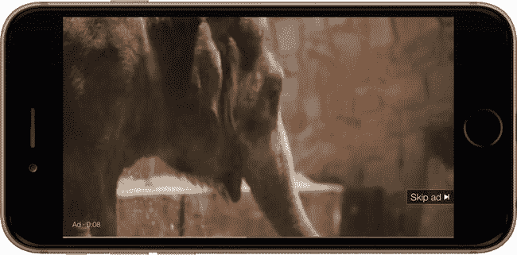

图 12-10。YouTube 广告功能

在本节中，您将学习如何为视频添加水印——这是为您的应用添加品牌标识的好方法。此示例使用静态图像作为水印，但您可以在覆盖视图中显示任何您想要的内容——只要它是 `UIView` 类的子类即可。

**注意** 避免在内容覆盖视图中放置高度交互的元素，因为它们可能与控制条发生冲突。

首先，将图像导入到您的项目中。如果您希望水印具有透明度，请使用带有透明度层的 PNG 图像；否则，使用 JPEG 或不透明的 PNG 图像文件。我倾向于使用高度约为 50 像素的图像，这样图像不会分散观众对内容的注意力。尽量在图像的所有边缘构建至少 10 像素的内边距。使用此图像创建一个 `UIImage` 对象。在 MyAVPlayer 项目中，文件命名为 `logo.png`：

```
UIImage *image = [UIImage imageNamed:@"logo.png"];
```

要在内容覆盖视图上显示图像，您需要将其包装在 `UIView` 的子类中，因此使用您刚刚创建的 `UIImage` 对象初始化一个 `UIImageView` 对象：

```
UIImageView *imageView = [[UIImageView alloc] initWithImage:image];
```

请记住，创建 `UIView` 的过程与调整其大小和位置是不同的。为了模仿电视广播，大多数视频应用喜欢将水印放置在视频的右下角或右上角。通过将 `UIImageView` 类的 `contentMode` 属性设置为 `UIViewContentModeBottomRight`，您可以指示 `UIImageView` 类将图像放置在右下角，同时保留其原始尺寸：

```
imageView.contentMode = UIViewContentModeBottomRight;
```

同样，您会希望图像保持在视频播放区域内。不幸的是，视频播放器的大小会随着 `AVPlayerViewController` 的呈现样式（窗口或全屏）而改变。不过，您可以通过将覆盖视图的大小设置为视频播放区域的*边界框*，并添加*灵活的*宽度和高度调整蒙版来解决这个问题：

```
imageView.frame = self.moviePlayer.videoBounds;
imageView.autoresizingMask = UIViewAutoresizingFlexibleHeight |
    UIViewAutoresizingFlexibleWidth;
```

在您初始化和定位了 `UIImageView` 之后，将其作为子视图添加到 `contentOverlayView` 之上：

```
[self.moviePlayer.contentOverlayView addSubview:imageView];
```

现在最重要的问题是，“放在哪里？”如前所述，将 `contentOverlayView` 放置在视频层之上所需的条件之一是知道视频层的尺寸信息。不幸的是，在视频加载完成之前，这个值是无效的。幸运的是，这与您构建键值观察者以了解项目何时加载完成的事件是同一个事件。为覆盖视图创建一个新的 `if` 块，如列表 12-12 所示。

***列表 12-12***。将水印添加到您的“加载完成”键值观察者中

```
-(void)observeValueForKeyPath:(NSString *)keyPath ofObject:(id)object
     change:(NSDictionary *)change context:(void *)context
{
    if ((object == self.moviePlayer.player) && [keyPath
        isEqualToString:@"status"] ) {

        UIImage *image = [UIImage imageNamed:@"logo.png"];
        UIImageView *imageView = [[UIImageView alloc]
           initWithImage:image];
        imageView.frame = self.moviePlayer.videoBounds;
        imageView.contentMode = UIViewContentModeBottomRight;
        imageView.autoresizingMask = UIViewAutoresizingFlexibleHeight |
                                     UIViewAutoresizingFlexibleWidth;

        if ([self.moviePlayer.contentOverlayView.subviews count] == 0) {
            [self.moviePlayer.contentOverlayView addSubview:imageView];
        }

        [object removeObserver:self forKeyPath:@"status"];

    } else if ([object isKindOfClass:[AVPlayerItem class]]) {

        AVPlayerItem *currentItem = (AVPlayerItem *)object;
```


```objc
if (currentItem.status == AVPlayerItemStatusFailed) {
    NSString *errorString = [currentItem.error description];
    NSLog(@"item failed: %@", errorString);

    if ([self.moviePlayer.player
            isKindOfClass:[AVQueuePlayer class]]) {
        AVQueuePlayer *queuePlayer =
            (AVQueuePlayer *)self.moviePlayer.player;
        [queuePlayer advanceToNextItem];
    } else {
        UIAlertView *alert = [[UIAlertView alloc]
            initWithTitle:@"Error" message:errorString
            delegate:self cancelButtonTitle:@"OK"
            otherButtonTitles:nil];
        [alert show];
    }
} else {
    [object removeObserver:self forKeyPath:@"status"];
}
```

最后一点提示，`contentOverlayValue` 属性是只读的，这意味着你无法从中移除子视图，只能添加视图。因此，在代码清单 12-12 中，我在添加水印前检查了子视图的数量——无论用户选择视频多少次，你都应该只保留一个水印！

## 总结

在本章中，你了解了如何使用 `AVKit` 框架及其媒体播放类 `AVPlayer` 和 `AVQueuePlayer`，作为 `MediaPlayer` 框架的即插即用替代方案。通过 MyAVPlayer 项目，你集成了基于播放列表的媒体和覆盖视图，充分利用了 `AVKit` 与 `AVFoundation` 框架更紧密的集成。在集成过程中，你会发现该框架的许多设计模式与 `MediaPlayer` 使用的模式非常相似，但需要稍有不同的实现方式。

请记住，尽管苹果不会立即弃用 `MediaPlayer` 框架，但尽早使用 `AVKit` 可以让你访问一组新的功能特性，否则你需要自行开发这些功能。

# 第 13 章

## 使用 HealthKit 和 Core Motion 追踪健身数据

在今年苹果全球开发者大会上公布的所有功能中，最令人惊讶的当属 `HealthKit`——苹果的健康与健身追踪平台。虽然健康和健身是 App Store 中最大的两个细分领域，但苹果此前一直扮演着幕后角色，提供 API 和硬件接口，但从未过多涉足软件层面（除了为 Nike+ 计步器开发配套应用）。`HealthKit` 改变了这一切，它提供了一个健康数据存储库，鼓励所有开发者与之集成；同时，随 iOS 8 预装的健康应用也让用户能够查看其存储的数据。

尽管你可以找到从步数统计到高度专业化的教练指导等各种应用，但在应用之间同步或共享信息却极其困难。例如，你可能有一个应用能出色地帮助你完成晨跑，另一个应用则鼓励你全天保持活跃，但合并这两个应用的数据几乎是不可能的。蓝牙和 WiFi 连接设备的普及只会加剧这一问题。几乎每个健康配件都需要其专属的自定义配套应用来与配件通信并记录数据。在 `HealthKit` 出现之前，没有一个好的方法可以在一个地方查看所有信息。

为了进一步扩展健康和健身功能，苹果从 iPhone 5S 开始，在每一款新 iOS 设备（包括 iPad Air、iPhone 6 和 iPhone 6 Plus）中内置了 M 系列运动协处理器。M 系列芯片提供了一套高度先进的传感器，减少了对提供相同功能的外部配件的需求。此外，M 系列芯片功耗极低，因此是感知运动的实用替代方案。据苹果称，M 系列芯片的能效是苹果此前用于运动感应芯片的 100 倍。从 iOS 7 开始，苹果在其运动感应框架 `Core Motion` 中内置了对 M 系列协处理器的支持，现在量化这些数据变得更加容易。

在本章中，你将了解如何通过向 MyPod 应用添加运动追踪和日志记录功能来充分利用这两个框架。新应用将命名为 `MyFitnessPod`，并在源代码包的第 13 章文件夹中提供。如图 13-1 所示，你将复用 MyPod 应用的媒体播放和播放列表选择功能，但还将添加锻炼控制和状态信息。切换播放按钮被移除，因为它与锻炼控制绑定：当用户开始、暂停或结束锻炼时，播放也会相应操作。

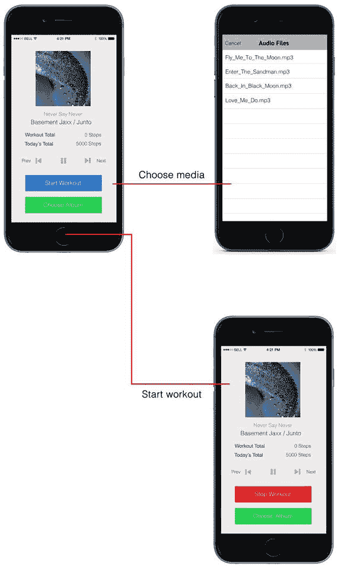

图 13-1. MyFitnessPod 项目设计草图

你可能会好奇这与 `HealthKit` 和 `Core Motion` 有何关联。当用户开始锻炼时，`MyFitnessPod` 应用将使用 `Core Motion` 框架开始追踪活动。同样，当用户完成活动时，你将使用 `Core Motion` 结束活动，并将活动数据记录到 `HealthKit`。在活动进行期间，你将同时监控这两个框架，以显示每日步数和当前锻炼进度。

**注意** 本章需要 iOS 8 以及配备 M 系列运动协处理器的设备（iPhone 5S 或更新机型）才能完整实现。`Core Motion` 功能将无法在不兼容的设备上运行，且 `HealthKit` 在 iOS 8.0 之前的 SDK 版本中不可用。

## 开始操作

与之前的项目一样，本项目建立在你之前工作的基础上。首先从第 7 章克隆 MyPod 项目，并将其重命名为 `MyFitnessPod`。如果你仍然不确定如何重命名项目，请参考第 8 章的“开始操作”部分。

接下来，你需要添加必要的框架。在 Xcode 6 中，你将在框架浏览器中找到 `CoreMotion` 和 `HealthKit` 框架。最终的框架集应类似于图 13-2 中的示例。

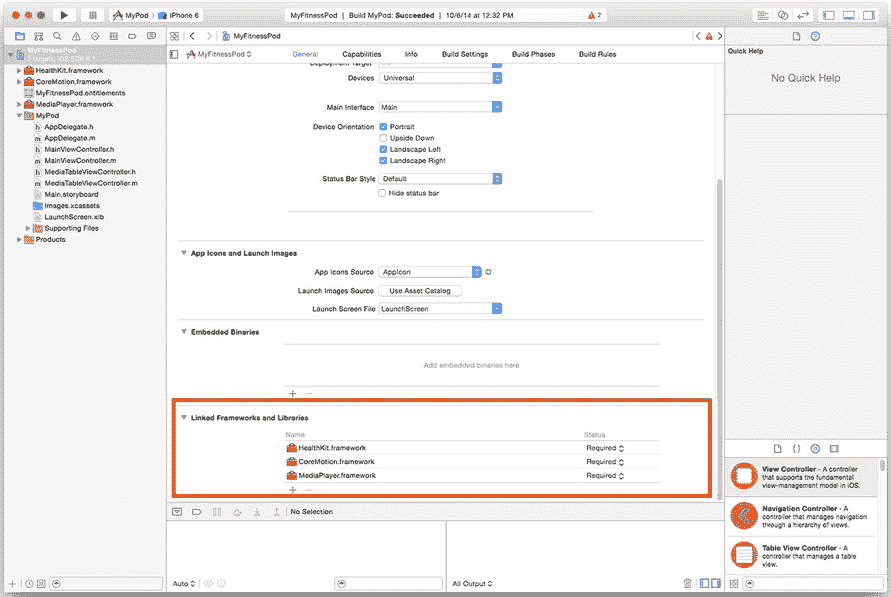

图 13-2. MyFitnessPod 项目使用的框架

由于 `HealthKit` 访问敏感的用户信息，且某些用户可能希望选择退出，你需要将 `HealthKit` 访问权限添加到应用功能列表中。与之前的功能更改类似，导航到项目设置的“功能”选项卡。向下滚动到 `HealthKit` 并点击切换开关。系统将弹出一个对话框，要求你选择一个开发团队来关联应用，如图 13-3 所示。

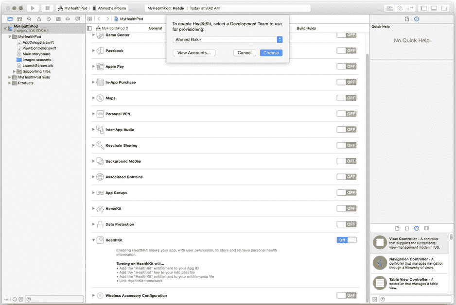

图 13-3. HealthKit 开发团队提示

选择开发团队后，“功能”选项卡会将切换开关设置为“开”，并显示一系列勾选标记，表明你的应用已满足 `HealthKit` 的所有要求，如图 13-4 所示。

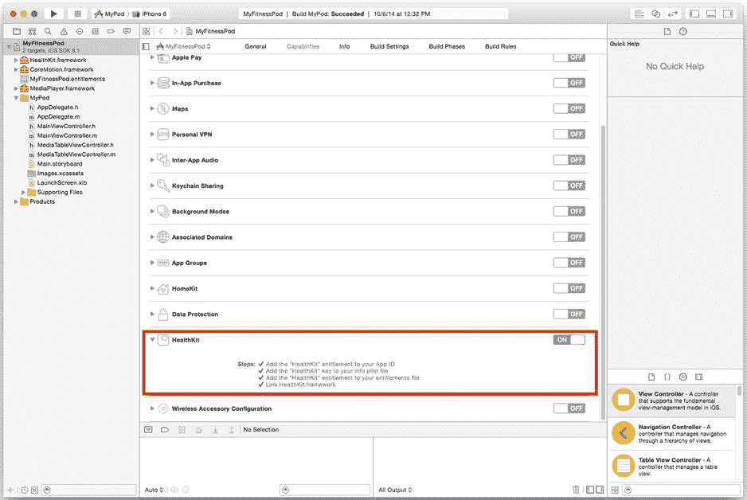


图 13-4. 成功的 HealthKit 配置

由于许多用户会在锻炼过程中将设备设为睡眠模式，因此你还应打开“音频和 AirPlay”后台模式，如图 13-5 所示。

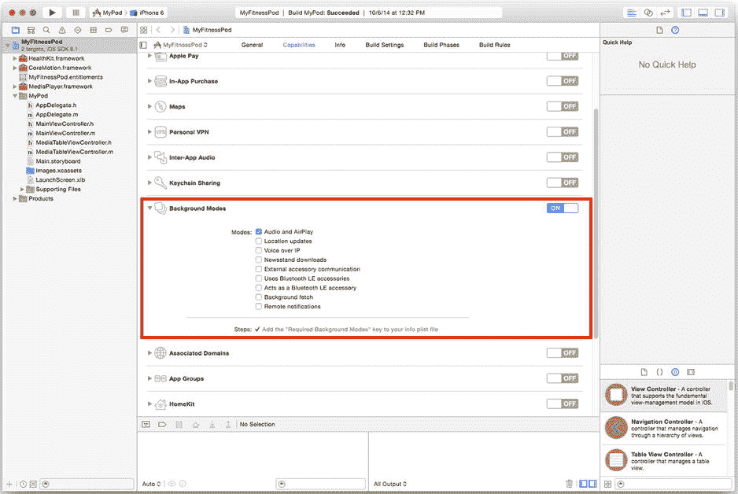

图 13-5. 启用后台音频

**注意** `MyFitnessPod` 项目中包含的最终版本代码涵盖了第 9 章中的后台音频控制功能。此处未列出该代码以节省篇幅。如果你自行移植示例，请注意使用 `MPMusicPlayerController` 的播放消息，而非 `AVAudioPlayer` 类的消息。

现在，项目已配置好 HealthKit 和 Core Motion，你可以开始修改用户界面，添加锻炼控件和状态标签。图 13-6 展示了 `MyFitnessPod` 项目故事板的截图。请注意，这里没有新增视图控制器，只是在 `MainViewController` 上添加了额外的标签和按钮。

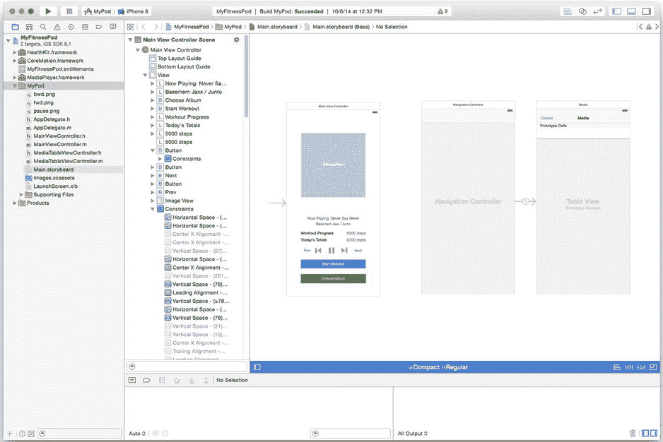

图 13-6. MyFitnessPod 项目故事板

要连接这些用户界面元素，一如既往地，你需要为每个项目添加 `IBOutlet` 属性和 `IBAction` 处理方法。代码清单 13-1 展示了 `MainViewController` 类的头文件，其中新增项以粗体高亮显示。请使用这些内容将你的故事板连接到代码。

***代码清单 13-1***. `MainViewController` 类的头文件

```objectivec
#import <UIKit/UIKit.h>
#import <MediaPlayer/MediaPlayer.h>
#import "MediaTableViewController.h"
#import <CoreMotion/CoreMotion.h>
#import <HealthKit/HealthKit.h>

@interface MainViewController : UIViewController <MediaTableDelegate>

@property (nonatomic, strong) MPMusicPlayerController *musicPlayer;

@property (nonatomic, strong) IBOutlet UIButton *playButton;
@property (nonatomic, strong) IBOutlet UIButton *rewindButton;
@property (nonatomic, strong) IBOutlet UIButton *forwardButton;
@property (nonatomic, strong) IBOutlet UIButton *prevButton;
@property (nonatomic, strong) IBOutlet UIButton *nextButton;

@property (nonatomic, strong) IBOutlet UIButton *workoutButton;
@property (nonatomic, strong) IBOutlet UIButton *chooseAlbumButton;

@property (nonatomic, strong) IBOutlet UILabel *titleLabel;
@property (nonatomic, strong) IBOutlet UILabel *albumLabel;
@property (nonatomic, strong) IBOutlet UIImageView *albumImageView;

@property (nonatomic, strong) IBOutlet UILabel *dailyProgressLabel;
@property (nonatomic, strong) IBOutlet UILabel *workoutProgressLabel;

@property (nonatomic, strong) CMPedometer *pedometer;
@property (nonatomic, strong) HKHealthStore *healthStore;
@property (nonatomic, strong) NSDate *startDate;
@property (nonatomic, assign) BOOL isWorkoutActive;

-(IBAction)toggleAudio:(id)sender;
-(IBAction)nextTrack:(id)sender;
-(IBAction)prevTrack:(id)sender;

-(IBAction)seekForward:(id)sender;
-(IBAction)startFastForward:(id)sender;
-(IBAction)startRewind:(id)sender;
-(IBAction)stopSeeking:(id)sender;

-(IBAction)startWorkout:(id)sender;

-(IBAction)chooseTrackButton:(id)sender;
-(IBAction)chooseAlbumButton:(id)sender;

@end
```

## 使用 Core Motion 追踪活动

自 iOS 4 起，Core Motion 就成了 iOS 的动作感应框架。多年来，开发者一直用它来访问内置的加速计和陀螺仪（自那时起便催生了成千上万的赛车游戏）。然而，在 M 系列运动协处理器问世之前，一直缺乏简便的方法来获取步数数据。你可以利用加速计来检测设备移动时是否发生了“颠簸”，但你必须自行编写代码来定义何为“一步”。同样，你可以使用 GPS 来确定用户的移动距离，但这样做会迅速耗尽电池电量。


虽然 iOS 7 在 Core Motion 框架中为 M 系列运动协处理器添加了接口，但 iOS 8 才完全解锁其功能，允许你直接以*步数*和*活动类型*的形式检索数据。Core Motion 负责处理所有工作，包括定义什么是步数、步数对应的距离，以及在记录步数时用户正在做什么（例如跑步或步行）。

既然你已经了解了 Core Motion 的功能，就可以探索如何启用它了。对于 `MyFitnessPod` 应用，你将希望使用 Core Motion 来开始记录用户的步数，并在用户界面上回显显示。为此，你需要让应用程序准备好接受运动数据，该任务包括以下步骤：

1.  请求使用硬件的权限（如果可用）
2.  注册你的类以接收运动更新
3.  为这些更新实现处理程序方法

Core Motion 框架严重依赖于完成处理程序（block）来进行消息传递。如果你仍不确定如何使用 block，请参考第 4 章中的“Block 快速指南”边栏。

## 请求运动活动权限

因为健康数据是你能收集到的关于用户最敏感的信息之一，所以在开始访问 M 系列运动协处理器硬件之前，你需要确保你的应用程序已获得用户访问*运动活动*数据的权限。与你之前开发的基于照片的应用程序一样，你不能覆盖用户的决定，但你可以捕获响应并适当地初始化你的应用程序。

管理运动事件和运动活动权限的 Core Motion 类是 `CMMotionActivityManager`。严格来说，*运动活动*被定义为一个对应于用户当前所进行运动类型的事件，无论是步行、跑步还是驾车。虽然处理这些事件不在 `MyFitnessPod` 项目的范围内，但 Apple 将运动活动作为 Core Motion 的权限级别，因此你需要将其包含在你的项目中。

你可以通过调用公共方法 `[CMMotionActivity isActivityAvailable]` 来查询运动活动状态。该方法返回一个 `BOOL` 值，指示用户是否已授予你的应用访问运动活动的权限。如图 13-7 所示，首次调用此方法会暴露系统的权限操作表。隐私权限通过*应用程序标识符*进行键控，这意味着你的应用后续启动（或重新安装）时不会再次提示用户选择权限级别。（用户可以随时通过选择 iOS 设置应用中的“隐私”选项来更改其权限级别。）

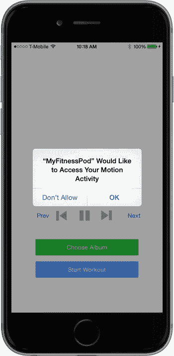

图 13-7. 运动活动权限提示

**注意** 你可以通过选择 iOS 设置应用中的“通用”→“还原”→“还原隐私与定位”来重置设备上的所有应用权限。

由于操作表需要可见以供用户响应，你需要从用户发起的操作中调用该方法（而不是使用 `[self viewDidLoad]` 方法）。对于 `MyFitnessPod` 应用，需要运动数据的主要用户发起操作是“开始锻炼”按钮，因此请将你的权限调用放在该按钮的处理程序方法中，该方法在代码清单 13-1 的头文件中定义为 `[MainViewController toggleWorkout]`。如代码清单 13-2 所示，在确定用户即将开始锻炼后，你应立即检查运动活动权限。如果用户已授予你的应用权限，你就可以开始更新用户界面并开始设置计步器；否则，你应该显示一个提示，让用户知道你的应用需要运动活动权限。


### 13-2. 检查运动活动权限

```
-(IBAction)toggleWorkout:(id)sender
{
    if (self.isWorkoutActive) {
        //停止锻炼
        self.isWorkoutActive = NO;

} else {
        //开始锻炼

if ([CMMotionActivityManager isActivityAvailable])
          {
            self.isWorkoutActive = YES;

} else {
            UIAlertView *errorAlert = [[UIAlertView alloc]
                initWithTitle:@"错误"
                message:@"需要运动权限"
                delegate:self
                cancelButtonTitle:@"确定"
                otherButtonTitles:nil];
            [errorAlert show];
        }
    }

}
```

在确定你的应用程序已被允许访问运动活动后，你需要进行第二次检查——以确定设备是否具有带步数追踪功能的 M 系列运动协处理器。从 M 系列运动协处理器中检索步数数据的 Core Motion 类为 `CMPedometer`。该类允许你查询硬件以获取更新，并通过 `CMPedometerData` 类返回值，该类会自动将加速度计和高度计数据抽象为步数、距离以及上升或下降的“楼层数”。查询计步器可用性的公共方法是 `[CMPedometer isStepTrackingAvailable]`。如代码清单 13-3 所示，在更新用户界面之前，将其作为第二个条件添加，这样只有在权限和硬件都可用时才能开始锻炼。在确定硬件可用后，你可以初始化一个 `CMPedometer` 对象来维护与硬件的接口。

### 13-3. 检查并初始化计步器

```
-(IBAction)toggleWorkout:(id)sender
{
    if (self.isWorkoutActive) {
        //停止锻炼

} else {
        //开始锻炼

if ([CMMotionActivityManager isActivityAvailable] &&
            [CMPedometer isStepCountingAvailable]) {
            self.pedometer = [[CMPedometer alloc] init];
            self.isWorkoutActive = YES;}
        else {
            UIAlertView *errorAlert = [[UIAlertView alloc]
                initWithTitle:@"错误"
                message:@"需要运动权限"
                delegate:self
                cancelButtonTitle:@"确定"
                otherButtonTitles:nil];
            [errorAlert show];
        }
    }

}
```

尽管 Core Motion 使用块（blocks）进行消息传递，但你应该为 `CMPedometer` 对象维护一个实例变量，以便处理后台更新。在 `MainViewController` 类中，该对象由 `pedometer` 属性表示：

```
@property (nonatomic, strong) CMPedometer *pedometer;
```

**注意：** 并非所有设备都支持距离和高度计数据，因此如果你计划在应用程序中使用这些功能，请调用 `[CMPedometer isDistanceAvailable]` 和 `[CMPedometer isFloorCountingAvailable]` 公共方法。

## 开始锻炼

在确定你的应用程序拥有一个有效的计步器后，你现在可以开始实现开始锻炼所需的代码了。图 13-8 展示了图 13-1 的一个子集，突出了应用程序的开始过渡状态。

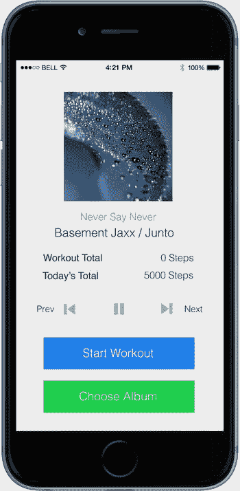

图 13-8. 开始锻炼屏幕的模拟图

当用户点击“开始锻炼”按钮时，你希望开始播放音乐，将按钮文本更改为“停止锻炼”，并开始显示实时反馈以指示用户的锻炼进度。如代码清单 13-4 所示，播放音乐和更新用户界面很简单：只需调用你已经定义好的方法即可。然而，获取计步器进度更新则稍微复杂一些。

### 13-4. 开始锻炼时更新用户界面

```
-(IBAction)toggleWorkout:(id)sender
{
    if (self.isWorkoutActive) {
        //停止锻炼

} else {
        //开始锻炼

if ([CMMotionActivityManager isActivityAvailable] &&
            [CMPedometer isStepCountingAvailable]) {
            self.pedometer = [[CMPedometer alloc] init];
            self.isWorkoutActive = YES;
            self.startDate = [NSDate date];
            self.workoutProgressLabel.text = @"0 步";
            self.workoutButton.titleLabel.text = @"停止锻炼";
        } else {
            UIAlertView *errorAlert = [[UIAlertView alloc]
                initWithTitle:@"错误"
                message:@"需要运动权限"
                delegate:self
                cancelButtonTitle:@"确定"
                otherButtonTitles:nil];
            [errorAlert show];
        }
    }

}
```

对于计步器数据更新，Apple 定义了两种模型：一种是基于推送的模型，在此模型下应用程序会持续（每 2.5 秒）接收来自硬件的可用数据；另一种是基于拉取的模型，在此模型下应用程序在需要时请求数据。MyFitnessPod 项目的模拟图表明，应用程序应在数据可用时显示更新，因此你应该使用推送模型作为应用程序更新的主要驱动方式。

**警告：** 基于推送的交付模型是一种软件设计模式，而*推送通知*则是一个非常具体的 iOS 功能（通知被“推送”到你的设备）。在与其它开发者交流时，请务必不要混淆这两者。

要接收推送更新，请在你的 `CMPedometer` 对象上调用 `[CMPedometer startPedometerUpdatesFromDate:withHandler]` 方法。从方法签名可以看出，输入参数是一个接收更新的完成处理程序，以及一个作为计步器更新基准的开始时间。Core Motion 将传输自该开始时间以来发生的更新事件。对于 MyFitnessPod 应用程序，开始时间就是用户按下“开始锻炼”按钮的时间。在编程上，你可以通过使用 `[NSDate date]` 方法简单地获取*当前时间*来实现这一点。代码清单 13-5 提供了 MyFitnessPod 项目的 `[CMPedometer startPedometerUpdatesFromDate:withHandler]` 调用。

### 13-5. 为计步器更新设置 `MainViewController` 类

```
-(IBAction)toggleWorkout:(id)sender
{
    if (self.isWorkoutActive) {
        //停止锻炼
        if (self.pedometer != nil) {
            [self.pedometer stopPedometerUpdates];
        }
        [self.musicPlayer stop];
        self.isWorkoutActive = NO;
        self.workoutButton.titleLabel.text = @"开始锻炼";

} else {
        //开始锻炼
        if ([CMMotionActivityManager isActivityAvailable] &&
            [CMPedometer isStepCountingAvailable]) {
            self.pedometer = [[CMPedometer alloc] init];
            self.isWorkoutActive = YES;
            self.startDate = [NSDate date];
            self.workoutProgressLabel.text = @"0 步";
            self.workoutButton.titleLabel.text = @"停止锻炼";

[self.pedometer
                startPedometerUpdatesFromDate:self.startDate
                withHandler:^(CMPedometerData *pedometerData,
                NSError *error) {

...
            }];

} else {
            UIAlertView *errorAlert = [[UIAlertView alloc]
                initWithTitle:@"错误"
                message:@"需要运动权限"
                delegate:self cancelButtonTitle:@"确定"
                otherButtonTitles:nil];
            [errorAlert show];
        }
    }

}
```


当您的应用收到更新时，应在“Workout Progress”（锻炼进度）标签中显示更新的步数。表示计步器事件的`CMPedometerData`类通过将`numberOfSteps`属性声明为`NSNumber`对象，使这一操作变得简单。您可以通过调用`[NSNumber intValue]`方法获取`int`类型的值，并将其包含在字符串中来显示此值：

```
NSString *workoutProgressString = [NSString stringWithFormat:@"%ld steps",
    [pedometerData.numberOfSteps intValue]];
self.workoutProgressLabel.text = workoutProgressString;
```

在将此代码添加到处理程序方法之前，您需要考虑一个复杂情况：块（block）总是在**后台**执行，而用户界面总是在主线程上执行。为弥合这一差距，请使用`dispatch_async(dispatch_queue_t queue, dispatch_block_t block)`方法在主队列上更新`workProgressLabel`对象。`dispatch_async()`的第一个参数接受一个队列对象，第二个参数接受一个块。通过传入`dispatch_get_main_queue()`作为队列，您可以自动获取指向主执行队列的指针：

```
dispatch_async(dispatch_get_main_queue(), ^{
    self.workoutProgressLabel.text =
    [NSString stringWithFormat:@"%ld steps",
    [pedometerData.numberOfSteps integerValue]];
    });
```

您可以在 Listing 13-6 中找到`MyFitnessPod`项目的完整实现。

***Listing 13-6***. 计步器更新块（包括用户界面变更）

```
-(IBAction)toggleWorkout:(id)sender
{
    if (self.isWorkoutActive) {
        // stop workout
    } else {
        // start workout
        if ([CMMotionActivityManager isActivityAvailable] &&
            [CMPedometer isStepCountingAvailable]) {
            self.pedometer = [[CMPedometer alloc] init];
            self.isWorkoutActive = YES;
            self.startDate = [NSDate date];
            self.workoutProgressLabel.text = @"0 steps";
            self.workoutButton.titleLabel.text = @"Stop Workout";
            [self.pedometer
                startPedometerUpdatesFromDate:self.startDate
                withHandler:^(CMPedometerData *pedometerData,
                NSError *error) {
                NSLog(@"number of steps: %ld",
                    [pedometerData.numberOfSteps integerValue]);
                dispatch_async(dispatch_get_main_queue(), ^{
                    self.workoutProgressLabel.text =
                    [NSString stringWithFormat:@"%ld steps",
                    [pedometerData.numberOfSteps integerValue]];
                });
            }];
        } else {
            UIAlertView *errorAlert = [[UIAlertView alloc]
                initWithTitle:@"Error"
                message:@"Motion permission required"
                delegate:self
                cancelButtonTitle:@"OK"
                otherButtonTitles:nil];
            [errorAlert show];
        }
    }
}
```

## 集成后台更新

任何应用的重中之重都是其后台功能。对于锻炼应用来说，这一点尤为重要，因为用户可能会忙碌 30 分钟或更长时间（远超多数 iOS 设备的休眠设置）。好消息是，由于您使用开始时间初始化了`[CMPedometer startPedometerUpdatesFromDate:withHandler]`方法，将应用置于后台并不会阻止该方法在返回前台时返回准确信息（更新仍会与您提供的原始时间进行比较）。

后台更新遇到的问题是用户界面的初始化问题。在应用处于后台时更新用户界面没有意义，因为用户永远不会看到这些信息。然而，与此同时，您又不希望用户回到应用时仍然看到旧的锻炼进度显示在屏幕上（在下一次更新之前会一直如此）。为解决此问题，请使用`CMPedometer`类的拉取机制，在应用返回前台后立即检索用户的步数。

对于`MainViewController`类，您可以使用`[self viewDidAppear:]`方法来处理此事件。每当视图出现时，都会调用`[self viewDidAppear:]`事件，无论这次出现是由于应用从后台返回、首次初始化，还是其他视图消失所致。如 Listing 13-7 所示，通过检查锻炼是否已激活，您可以在锻炼开始后仅查询这些更新。

***Listing 13-7***. 准备后台更新

```
- (void)viewDidAppear:(BOOL)animated
{
    if (self.isWorkoutActive) {
        [self.pedometer queryPedometerDataFromDate:self.startDate
            toDate:[NSDate date] withHandler:^(CMPedometerData
            *pedometerData, NSError *error) {
            NSLog(@"number of steps: %ld", [pedometerData.numberOfSteps integerValue]);
            dispatch_async(dispatch_get_main_queue(), ^{
                self.workoutProgressLabel.text = [NSString
                    stringWithFormat:@"%ld steps",
                    [pedometerData.numberOfSteps integerValue]];
            });
        }];
    }
}
```

`CMPedometer`类的拉取方法是`[CMPedometer queryPedometerDataFromDate:toDate:withHandler:]`，它接受两个日期和一个完成处理程序作为输入。对于*开始日期*，请使用计步器的开始时间；对于*结束日期*，请使用当前时间——即应用返回前台的时间。为了维护开始日期，请在您的类中添加一个实例变量：

```
@property (nonatomic, strong) NSDate *startDate;
```

接下来，当您点击“Start Workout”（开始锻炼）按钮时，添加一个保存`startDate`的额外步骤，如 Listing 13-8 所示。

***Listing 13-8***. 保存锻炼的开始日期

```
-(IBAction)toggleWorkout:(id)sender
{
    if (self.isWorkoutActive) {
        // stop workout
    } else {
        // start workout
        if ([CMMotionActivityManager isActivityAvailable] &&
            [CMPedometer isStepCountingAvailable]) {
            self.pedometer = [[CMPedometer alloc] init];
            self.isWorkoutActive = YES;
            self.startDate = [NSDate date];
            self.workoutProgressLabel.text = @"0 steps";
            self.workoutButton.titleLabel.text = @"Stop Workout";
            [self.pedometer startPedometerUpdatesFromDate:self.startDate
                withHandler:^(CMPedometerData *pedometerData,
                NSError *error) {
                NSLog(@"number of steps: %ld",
                    [pedometerData.numberOfSteps integerValue]);
                dispatch_async(dispatch_get_main_queue(), ^{
                    self.workoutProgressLabel.text =
                    [NSString stringWithFormat:@"%ld steps",
                    [pedometerData.numberOfSteps integerValue]];
                });
            }];
        } else {
            UIAlertView *errorAlert = [[UIAlertView alloc]
                initWithTitle:@"Error"
                message:@"Motion permission required"
                delegate:self
                cancelButtonTitle:@"OK"
                otherButtonTitles:nil];
            [errorAlert show];
        }
    }
}
```


现在您可以使用 `startDate` 实例变量作为提取查询的基准。对于完成处理程序，执行与推送处理程序完全相同的逻辑——在主线程上更新用户界面以显示接收到的步数。列表 13-9 展示了 MyFitnessPod 项目中完整的 `[self viewDidAppear]` 方法。

**列表 13-9.** 返回前台后更新用户界面

```
- (void)viewDidAppear:(BOOL)animated
{
    if (self.isWorkoutActive)  {
        [self.pedometer queryPedometerDataFromDate:self.startDate
            toDate:[NSDate date]
            withHandler:^(CMPedometerData *pedometerData,
            NSError *error) {

NSLog(@"步数: %ld",
                [pedometerData.numberOfSteps integerValue]);
            dispatch_async(dispatch_get_main_queue(), ^{
                self.workoutProgressLabel.text =
                [NSString stringWithFormat:@"%ld 步",
                [pedometerData.numberOfSteps integerValue]];
            });
        }];
    }
}
```

### 停止锻炼

最终，所有锻炼都必须结束，计步器更新也应随之停止。通过调用 `CMPedometer` 对象上的 `[CMPedometer stopPedometerUpdates]` 方法，让 Core Motion 知道它应该停止向之前定义的完成处理程序发送计步器事件。

对于 MyFitnessPod 应用程序，将此逻辑放在用户发起停止锻炼的事件中：即“停止锻炼”按钮的处理程序。如列表 13-10 所示，在确定锻炼处于活动状态后，调用 `[CMPedometer stopPedometerUpdates]` 方法，并通过停止音乐播放和重置锻炼按钮标题来将用户界面重置为原始状态。您无需重置步数，因为大多数用户期望在锻炼结束时看到他们的总数。

**列表 13-10.** 停止更新并重置用户界面

```
-(IBAction)toggleWorkout:(id)sender
{
    if (self.isWorkoutActive) {
        //停止锻炼

if (self.pedometer != nil) {
            [self.pedometer stopPedometerUpdates];
        }
        [self.musicPlayer stop];
        self.isWorkoutActive = NO;
        self.workoutButton.titleLabel.text = @"开始锻炼";
    } else {
        //开始锻炼

if ([CMMotionActivityManager isActivityAvailable] &&
            [CMPedometer isStepCountingAvailable]) {
            self.pedometer = [[CMPedometer alloc] init];
            /*
             if (queue loaded) {
                 play queue
             } else {
                 load default playlist
             }
             */

self.isWorkoutActive = YES;
            self.startDate = [NSDate date];
            self.workoutProgressLabel.text = @"0 步";
            self.workoutButton.titleLabel.text = @"停止锻炼";
            [self.pedometer startPedometerUpdatesFromDate:self.startDate
                withHandler:^(CMPedometerData *pedometerData,
                NSError *error) {

NSLog(@"步数: %ld",
                    [pedometerData.numberOfSteps integerValue]);
                dispatch_async(dispatch_get_main_queue(), ^{
                    self.workoutProgressLabel.text =
                    [NSString stringWithFormat:@"%ld 步",
                    [pedometerData.numberOfSteps integerValue]];
                });
            }];

} else {
            UIAlertView *errorAlert = [[UIAlertView alloc]
                initWithTitle:@"错误"
                message:@"需要运动权限"
                delegate:self cancelButtonTitle:@"确定"
                otherButtonTitles:nil];
            [errorAlert show];
        }
    }

}
```

## 使用 HealthKit 同步数据

此时，MyFitnessPod 应用已能够利用 M 系列运动协处理器，因此是时候通过使用 HealthKit 作为发布和检索应用收集的锻炼数据的后端，使其成为“负责任的数据公民”。正如本章开头所述，HealthKit 允许您跳过构建自己数据记录界面的不必要步骤，为所有应用提供一个集中位置，让它们可以存储（和检索）健康和健身数据。此外，“健康”应用为用户提供了查看此数据配置文件的窗口，使他们能够在一个地方监控步数信息、卡路里摄入量、体重、血压以及无数其他健康指标。用户甚至可以创建自己的仪表板来获取历史快照。您在编写本章时可以看到我的仪表板，如图 13-9 所示。

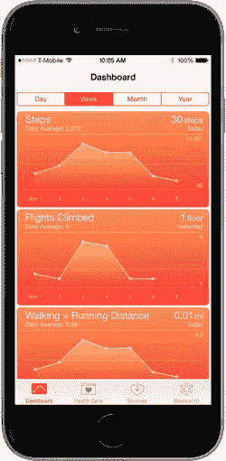

**图 13-9.** 作者的“健康”应用仪表板

在本节中，您将学习如何利用 HealthKit 来记录锻炼、检索过去的锻炼活动以及接收实时数据更新。这能让您的用户在应用之间共享数据，并通过实现“今日总计”标签并用准确数据填充它来完成用户界面。

尽管 HealthKit 是一个与 Core Motion 完全独立的框架，但好消息是它共享了许多设计上的相似性，例如基于推送和拉取的数据查询概念。HealthKit 还公开了数据类型，为每种存储的活动类型提供丰富的信息。使用 HealthKit 需要实现的基本步骤如下：

1.  请求对象类型的权限（读取、写入或两者兼有）。
2.  实现一个查询和处理程序方法，以在数据可用时进行检索。
3.  创建一个格式正确的对象来存储数据。

### 请求使用 HealthKit 的权限

与 Core Motion 一样，在您可以对 HealthKit 执行任何操作之前，需要请求正确的权限。同样，由于健康数据是敏感的个人信息，权限级别非常精细，导致会显示一个详细的模态视图，供用户在授予权限前查看，如图 13-10 所示。

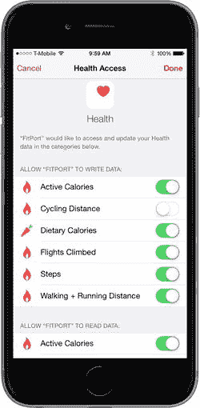

**图 13-10.** HealthKit 权限模态视图

您会注意到，此模态视图针对应用希望访问的每种健康数据类型显示了读取和写入权限。HealthKit 中的每个操作都与一个*对象类型*相关联，由 `HKObject` 类表示。就像 `CMPedometerData` 类一样，`HKObject` 类为正在存储的每种类型的健康数据存储了丰富的属性集，包括数量（或特征）、测量时间和测量来源。属性集因对象类型而异。需要记住两种高级别的对象类型：*数量*，用定量单位（如体重）测量；以及*特征*，用定性观察（如睡眠质量差）表示。系统会提示用户为您尝试操作的每种对象类型选择权限。

要请求 HealthKit 权限，您需要在 `HKHealthStore` 对象上调用 `[HKHealthStore requestAuthorizationToShareTypes:readTypes:completion:]` 方法。`HKHealthStore` 类表示 HealthKit 数据操作的接口，类似于托管对象上下文为 Core Data 中的数据库提供接口。与数据库一样，为您想要执行的每个数据操作都创建一个健康存储是没有意义的，因此将其声明为实例变量。对于 `MainViewController` 类，此属性称为 `healthStore`：

```
@property (nonatomic, strong) HKHealthStore *healthStore;
```


要请求权限，你需要指定一个`NSSet`对象类型集合，这些类型代表你想要请求的数据类型。对于`MyFitnessPod`项目，你只需要读取和写入步数，因此使用`NSQuantityTypeIdentifierStepCount`常量来初始化你的权限集合：

```
NSSet *dataTypes =
    [NSSet setWithObject:HKQuantityTypeIdentifierStepCount];
```

当你请求运动活动权限时，由于请求的性质（简单的“是”或“否”），你需要在视图可见后调用状态获取方法。由于`HealthKit`权限更为复杂，`[HKHealthStore requestAuthorizationToShareTypes:readTypes:completion:]`方法允许你指定一个完成处理程序，该处理程序返回一个`success`变量，用于指示用户是否已授予你的应用所有请求的权限。这使你能够将初始化代码放在`[self viewDidLoad]`方法中。Listing 13-11 展示了`MainViewController`类的`[self viewDidLoad]`方法，其中包括`HealthKit`初始化。

***Listing 13-11***. 请求来自`HealthKit`的步数权限

```
- (void)viewDidLoad {
    [super viewDidLoad];
    // Do any additional setup after loading the view,
    // typically from a nib.

self.musicPlayer = [MPMusicPlayerController applicationMusicPlayer];

....
    self.isWorkoutActive = NO;

if ([HKHealthStore isHealthDataAvailable]) {
        NSSet *dataTypes =
            [NSSet setWithObject:HKQuantityTypeIdentifierStepCount];
        [self.healthStore requestAuthorizationToShareTypes:dataTypes
            readTypes:dataTypes
            completion:^(BOOL success, NSError *error) {
            if (success) {

} else {

UIAlertView *alert = [[UIAlertView alloc]
                    initWithTitle:@"Error"
                    message:@"MyFitnessPod requires step count access!"
                    otherButtonTitles:nil];
                [alert show];
            }
        }];
    }
}
```

注意，权限块的起始处包含对`[HKHealthStore isHealthDataAvailable]`的调用。这是检查设备是否支持`HealthKit`（iOS 8 或更高版本）的另一种简单方法，并能防止在旧设备上崩溃（你无法访问未定义的类！）。

如果完成处理程序返回`success`，你的`HKHealthStore`将准备好使用，无需额外的初始化操作。如果权限请求失败，你应该向用户显示错误消息。如果用户已为你的应用设置了权限，完成处理程序将立即被调用并返回结果。

## 从`HealthKit`检索数据

由于`HealthKit`在设计上与`Core Motion`相似，它提供了基于推送和拉取的查询方式来检索数据。与`Core Motion`一样，基于推送的方法在每次记录事件时返回结果，而基于拉取的方法则在启动后仅返回一次结果。`HealthKit`的推送机制对于类似数据库的系统来说非常不寻常（手动启动操作有助于提高性能），但考虑到资源的共享特性，这种机制很有价值，因为它允许应用响应来自其他应用程序的更新。例如，如果你将一个应用置于后台，在另一个应用中获取血压读数，当你返回原始应用时，可能会收到更新。

使用`HealthKit`执行查询涉及两个步骤：

1.  定义一个`HKQuery`对象，其类型与结果类型（例如统计信息、样本、云端备份数据等）和期望的执行方法（推送或拉取）匹配。
2.  在你的`HKHealthStore`对象上执行查询以获取结果。

`HKQuery`是一个抽象类，它定义了初始化查询和指定返回内容的通用规则，但不指定行为或返回类型。要执行查询，你必须选择一个`HKQuery`的子类，该子类与你正在寻找的结果类型（例如，一组数据或单个项目）以及所需的执行行为（基于推送或拉取）匹配。表 13-1 列出了主要的`HKQuery`子类，包括每个子类的结果类型和执行行为。

Table 13-1. 主要`HKQuery`子类的结果类型和执行行为

| 子类 | 结果类型 | 执行行为 |
| --- | --- | --- |
| `HKSampleQuery` | 一组样本对象（包含样本时间和数量） | 拉取（生成一个事件） |
| `HKStatisticsQuery` | 一组样本对象的统计结果（例如平均值、总和） | 拉取 |
| `HKStatisticsCollectionQuery` | 一个样本类型的一组统计结果（适用于构建图表） | 拉取 |
| `HKObserverQuery` | 对数量对象（如步数）的更改 | 推送（生成事件直到停止） |
| `HKAnchoredObjectQuery` | 匹配样本类型的最新对象 | 拉取 |

对于`MyFitnessPod`应用，使用`HKStatisticsQuery`来确定“今日进度”标签的总步数（总和），并使用`HKObserverQuery`来监控步数何时变化。

要创建统计查询，创建一个新的`HKStatisticsQuery`对象，并使用`[HKStatisticsQuery initWithQuantityType:quantitySamplePredicate:options:completionHandler:]`方法进行初始化。对于数量类型，你需要使用一个`HKQuantityType`对象，该对象与你希望检索的数据类型匹配。`HKQuantityType`类有一个便捷构造函数`[HKQuantityType quantityTypeForIdentifier:]`，它允许你基于与预定义常量匹配的常量来创建对象。步数的常量是`HKQuantityTypeIdentierStepCount`：

```
HKQuantityType *quantityType = [HKQuantityType
    quantityTypeForIdentifier: HKQuantityTypeIdentierStepCount];
```

用于初始化`HKStatisticsQuery`的样本谓词是一个`NSPredicate`，类似于你在第 7 章的`MyPod`项目中使用的，通过让用户从媒体选择器中选择来限制专辑选择的谓词。`NSPredicate`对象需要非常具体才能正确过滤数据类型，但为了帮助你，`HKQuery`类提供了便捷构造函数。要按日期过滤样本对象，请使用公共方法`[HKQuery predicateForSamplesWithStartDate:endDate:options:]`。对于开始和结束日期，使用当前日期的午夜（00:00）和晚上 11:59（23:59），如 Listing 13-12 所示。

***Listing 13-12***. 构建基于日期的样本谓词

```
-(NSPredicate *)getCurrentDatePredicate {
    NSCalendar *calendar = [NSCalendar currentCalendar];
    NSDate *now = [NSDate date];
    NSDate *startDate = [calendar dateBySettingHour:0 minute:0 second:0
        ofDate:now options:0];
    NSDate *endDate = [calendar dateBySettingHour:0 minute:0 second:0
        ofDate:now options:0];
    NSPredicate *datePredicate = [HKQuery
        predicateForSamplesWithStartDate:startDate
        endDate:endDate options:0];
    return datePredicate; 
}
```

对于查询选项，你应该指定`HKStatisticsCumulativeSum`，以表示你想要检索样本集的总和。

对于完成处理程序，你将使用查询的`result`对象的`sumQuantity`来提取今天的步数，并使用该值构造“今日进度”标签的字符串。要执行查询，请在你的`HKHealthStore`对象上调用`[HKHealthStore executeQuery:]`方法。


触发`MainViewController`类总步数查询的代码包含在清单 13-13 中。该方法被封装在一个方法中，因为你不想每次查询总步数状态时都重复这段代码。

***清单 13-13***. 步数统计查询

```
-(void)updateTotalStepCount
{
    NSPredicate *datePredicate =
        [self getCurrentDatePredicate];

HKUnit *countUnit = [HKUnit unitFromString:@"count"];

HKQuantityType *quantityType = [HKQuantityType
        quantityTypeForIdentifier:HKQuantityTypeIdentifierStepCount];

HKStatisticsQuery *statisticsQuery = [[HKStatisticsQuery alloc]
        initWithQuantityType:quantityType
        quantitySamplePredicate:datePredicate
        options:HKStatisticsOptionCumulativeSum
        completionHandler:^(HKStatisticsQuery *query,
                            HKStatistics *result,
        NSError *error) {

HKQuantity *sumQuantity = result.sumQuantity;
        dispatch_async(dispatch_get_main_queue(), ^{
            self.dailyProgressLabel.text =
                [NSString stringWithFormat:@"%l steps",
                [sumQuantity doubleValueForUnit:countUnit]];
        });

}];
    [self.healthStore executeQuery:statisticsQuery];
}
```

要获取总步数，你需要使用`results`属性，它代表一个包含查询结果的`HKQuantity`对象。`sumQuantity`属性表示总和值。调用`[HKQuantity doubleValueForUnit:]`会返回一个可以在字符串中显示的`double`值。

在清单 13-14 中，你可以看到我在`[self viewDidLoad:]`方法中调用了`[MainViewController updateTotalStepCount]`方法——就在确认 HealthKit 权限之后——以便初始化“今日进度”标签。

***清单 13-14***. 首次查询

```
- (void)viewDidLoad {
    [super viewDidLoad];
    // Do any additional setup after loading the view,
    // typically from a nib.

...

self.isWorkoutActive = NO;

if ([HKHealthStore isHealthDataAvailable]) {
        NSSet *dataTypes =
            [NSSet setWithObject:HKQuantityTypeIdentifierStepCount];
        [self.healthStore requestAuthorizationToShareTypes:dataTypes
            readTypes:dataTypes
            completion:^(BOOL success, NSError *error) {
            if (success) {
                [self updateTotalStepCount];
            } else {
                UIAlertView *alert = [[UIAlertView alloc]
                    initWithTitle:@"Error" message:@"MyFitnessPod " +
                        "requires step count access for total progress!"
                    delegate:self cancelButtonTitle:@"OK"
                    otherButtonTitles:nil];
                [alert show];
            }
        }];
    }
}
```

## 获取实时更新

为了在锻炼期间获取实时更新，你需要从`HKObserverQuery`中触发`[MainViewController updateTotalStepCount]`方法，该方法会检查总步数是否已更新。不幸的是，没有哪个查询能一石二鸟（同时确定变更事件和新数量），因为`HKObserverQuery`会通知观察者事件，但不会返回关于这些事件的任何数据。

由于推送查询需要被停止，请将`HKObserverQuery`定义为一个实例变量：

```
@property (nonatomic, strong) HKObserverQuery *observerQuery;
```

要初始化`HKObserverQuery`，请使用`[HKObserverQuery initWithSampleType:predicate:updateHandler]`方法。对于样本类型，你将再次使用与步数对应的`HKQuantityType`对象（所有`HKQuantityType`对象都是`HKSampleType`的子类）：

```
HKQuantityType *quantityType = [HKQuantityType
    quantityTypeForIdentifier:HKQuantityTypeIdentierStepCount];
```

你不需要为查询指定谓词，因为你不需要过滤事件。步数的每次更改都将是一个新增操作。

在完成处理程序中，既然你知道步数已更改，就可以调用`[MainViewController updateTotalStepCount]`方法来检索最新总数。

在清单 13-15 中，你可以看到我已将此查询添加到了`[MainViewController viewDidLoad]`方法中，因为只要应用程序处于打开状态，用户就应该能够看到总步数更新。

***清单 13-15***. 步数统计查询

```
- (void)viewDidLoad {
    [super viewDidLoad];
    // Do any additional setup after loading the view,
    // typically from a nib.

...

self.isWorkoutActive = NO;

if ([HKHealthStore isHealthDataAvailable]) {
        NSSet *dataTypes =
            [NSSet setWithObject:HKQuantityTypeIdentifierStepCount];
        [self.healthStore requestAuthorizationToShareTypes:dataTypes
            readTypes:dataTypes
            completion:^(BOOL success, NSError *error) {
            if (success) {
                [self updateTotalStepCount];

HKQuantityType *quantityType = [HKQuantityType
                    quantityTypeForIdentifier:
                    HKQuantityTypeIdentifierStepCount];

self.observerQuery = [[HKObserverQuery alloc]
                    initWithSampleType:quantityType predicate:nil
                    updateHandler:^(HKObserverQuery *query,
                                    HKObserverQueryCompletionHandler
                                    completionHandler, NSError *error) {
                    if (!error) {
                        [self updateTotalStepCount];
                    } else {
                                NSLog(@"Unable to retrieve step count.");
                    }
                }];

} else {
                UIAlertView *alert = [[UIAlertView alloc]
                    initWithTitle:@"Error"
                    message:@"MyFitnessPod requires step count access " +
                        "for total progress!"
                    delegate:self cancelButtonTitle:@"OK"
                    otherButtonTitles:nil];
                [alert show];
            }

}];
    }
}
```

对于所有长时间运行的查询，你需要调用`[HKHealthStore stopQuery:]`方法来停止接收更新。如清单 13-16 所示，我在`[MainViewController dealloc]`方法中进行了此调用，以指示应用程序在退出时应停止接收更新。

***清单 13-16***. 停止 HKObserverQuery

```
-(void)dealloc
{
    [self.healthStore stopQuery:self.oberverQuery];
    [super dealloc];
}
```

## 记录活动

为了让其他应用程序能够使用来自 MyFitnessPod 应用的数据，你需要将锻炼结果保存到 HealthKit。要将锻炼保存到 HealthKit，你需要在锻炼完成时创建一个`HKSample`对象，并使用`[HKHealthStore saveObject:withCompletion:]`方法将其保存到你的`HKHeathStore`对象中。

HealthKit 中的`HKSample`对象代表一条数据及其收集的时间跨度。`HKQuantitySample`子类扩展了此功能，允许你存储数量数据，例如步数。这一切听起来应该很熟悉，因为当你从`CMPedometer`类检索数据时，你基于日期范围接收了一个数量（步数）。如清单 13-17 所示，通过获取用户结束锻炼时的最终计步器读数，你可以创建一个可以保存到 HealthKit 的`HKQuantitySample`对象。

***清单 13-17***. 从计步器数据创建 HKQuantitySample

```
self.pedometer queryPedometerDataFromDate:self.startDate
    toDate:[NSDate date] withHandler:^(CMPedometerData *pedometerData,
    NSError *error) {
```


`NSLog(@"number of steps: %ld", [pedometerData.numberOfSteps integerValue]);`
`__block double stepCount = 0;`
`dispatch_async(dispatch_get_main_queue(), ^{`
`stepCount = [pedometerData.numberOfSteps doubleValue];`

`HKUnit *countUnit = [HKUnit unitFromString:@"count"];`
`HKQuantity *stepQuantity = [HKQuantity quantityWithUnit:countUnit doubleValue:stepCount];`
`HKQuantitySample *exerciseSample = [HKQuantitySample quantitySampleWithType:HKQuantityTypeIdentifierStepCount quantity:stepQuantity startDate:self.startDate endDate:[NSDate date]];`

**注意** 请记住，只要依赖被 block 修改的变量，就始终需要使用 `__block` 关键字。

`HKQuantity` 对象需要一个值和用 `HKUnit` 类表示的*单位*。这样可以为值提供上下文，并自动执行单位转换（取决于用户区域）。由于*计数*是一个普遍理解的单位，请使用 `count` 字符串初始化你的 `HKUnit` 对象。

现在，你已经基于计步器数据得到了有效的 `HKQuantitySample` 对象，可以将其保存到健康存储中。如 清单 13-18 所示，该操作应发生在 `[MainViewController togglePlayback:]` 方法中。在完成处理程序里，如果保存失败，请显示一个错误。

***清单 13-18***。将 `HKQuantitySample` 保存到 HealthKit

```
-(IBAction)toggleWorkout:(id)sender
{
    if (self.isWorkoutActive) {
        // 停止锻炼

if (self.pedometer != nil) {
            [self.pedometer stopPedometerUpdates];
        }

[self.musicPlayer stop];

self.isWorkoutActive = NO;

self.workoutButton.titleLabel.text = @"开始锻炼";

__block double stepCount = 0;
        [self.pedometer queryPedometerDataFromDate:self.startDate
             toDate:[NSDate date]
             withHandler:^(CMPedometerData *pedometerData,
                 NSError *error) {

NSLog(@"步数: %ld",
                [pedometerData.numberOfSteps integerValue]);
            dispatch_async(dispatch_get_main_queue(), ^{
                stepCount = [pedometerData.numberOfSteps doubleValue];

HKUnit *countUnit = [HKUnit unitFromString:@"count"];
                HKQuantity *stepQuantity = [HKQuantity
                    quantityWithUnit:countUnit doubleValue:stepCount];
                HKQuantitySample *exerciseSample = [HKQuantitySample
                  quantitySampleWithType:HKQuantityTypeIdentifierStepCount
                  quantity:stepQuantity startDate:self.startDate
                  endDate:[NSDate date]];

[self.healthStore saveObject:exerciseSample
                    withCompletion:^(BOOL success, NSError *error){
                    if (success) {
                        [self updateTotalStepCount];
                    } else {
                        NSLog(@"保存步数时出错");
                    }
                }];

});
        }];

} else {
        ...
    }

}
```

保存锻炼结果后，你不需要手动刷新总步数，因为这一操作由你之前设置的 `HKObserverQuery` 自动处理。

## 总结
在本章中，你了解了如何重新利用 MyPod 应用程序，将它从简单的基于 iPod 的音乐播放器转变为强大的、与 HealthKit 连接的健身锻炼应用程序。通过将 Core Motion 集成到应用程序中，你能够在用户设备上创建无需配件的 M 系列运动协处理器接口，并能够直接将计步器数据作为步数进行查询。为了让你的应用程序更好地与其他健身应用协同工作，并获取用户日常活动的完整快照，你将 HealthKit 作为健康信息存储库集成到了应用程序中。在此过程中，你还了解了两个框架在设计上的相似性，从而能够快速转换数据类型，并使用相似的设计模式来检索数据。

# 第 14 章：Swift 入门
在撰写 2014 年 6 月 2 日之后的 iOS 书籍时，几乎不可能不提及近年来最震撼的公告之一：Swift。*Swift* 是苹果全新的编程语言，旨在降低 iOS 和 OS X 的入门门槛。对许多开发者来说，Objective-C 独特的 C 语言与 Smalltalk 语法结合体极具挑战性。如今，大学里很少有纯粹基于 C 语言的计算机科学课程，因为依赖 C 语言的工作通常涉及极低级的编程或遗留代码。虽然 Smalltalk 是最早的纯面向对象编程（OOP）语言之一，但其语法与任何其他流行语言都不同，并且除了教学领域外，如今很少被采用。

为了解决这个问题，苹果希望利用 Swift 将 Objective-C 的设计理念与 Java、Python 和 Haskell 等较新编程语言的最佳语法特性相结合。为了让这门语言更具生命力，苹果宣布 Xcode、Cocoa 和 Cocoa Touch 完全兼容 Swift，允许你完全使用 Swift 构建应用。这种兼容性也意味着仍在学习该语言的开发者可以在项目中混合使用 Objective-C 和 Swift。

在本章中，你将看到如何通过将第 9 章的 MyAVPlayer 项目从 Objective-C 转换为 Swift 来开始使用 Swift。在此过程中，我将在此介绍你在移植项目不同部分时所需的 Swift 语法，讨论如何将 Swift 集成到现有的 Objective-C 代码中，并强调如何为 Swift 修改 Xcode 工作流程。

本章仅作为 Swift 编程语言的高度概述。如需更深入地讨论该语言，我推荐 David Mark 等人所著的《Beginning iPhone Development with Swift》（Apress, 2014 年），以及苹果公司自己的语言指南《The Swift Programming Language》，该指南可在 iBooks Store 获取。

## 入门
在这一章中，你将把 MyAVPlayer 项目移植到 Swift。最终项目将命名为 SwiftAVPlayer，并包含在源代码包的第 14 章文件夹中。在开始之前，不妨回顾一下图 14-1 中提供的第 1 章 MyAVPlayer 项目模型图。

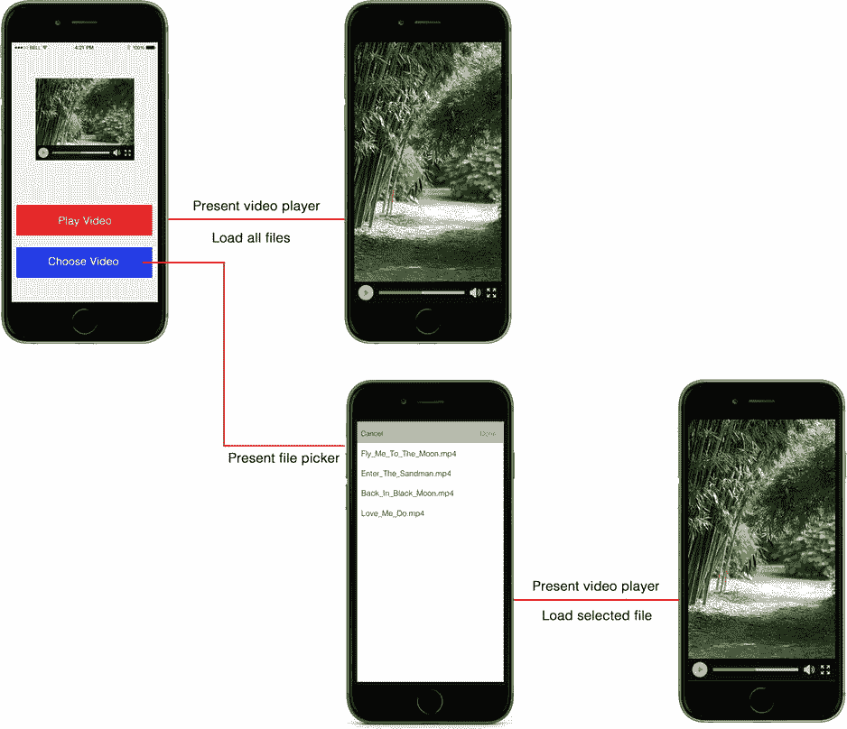

图 14-1。MyAVPlayer 项目模型图

在 MyAVPlayer 项目中，目标是使用 `AVKit` 框架创建一个媒体播放应用。用户可以通过点击主视图控制器底部的“选择文件”和“全部播放”按钮来启动播放，这两个按钮分别允许用户手动选择要播放的文件，或自动播放应用文档目录中的所有可用文件。SwiftAVPlayer 项目将保留这一功能。

### 创建新项目
与 Objective-C 项目相同，创建 Swift 项目的第一步是从 Xcode 的“文件”菜单中选择“新建” → “项目”。你将看到本书中创建 Objective-C 项目时熟悉的项目向导。然而，要创建 Swift 项目，请在“语言”下拉菜单中选择 Swift，如图 14-2 所示。若要同时支持 iPhone 和 iPad，请将“设备”类型选择为“通用”。

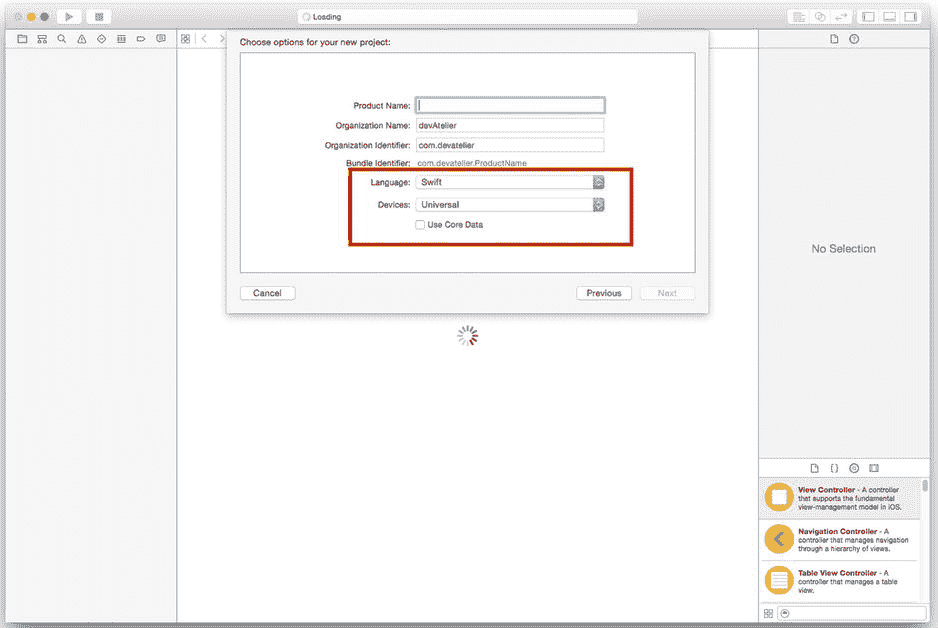

图 14-2。创建 Swift 项目


当您的项目创建成功后，您将看到如图 14-3 所示的项目层次结构。项目将预填充一个`ViewController`类（名为`ViewController.swift`）、一个`AppDelegate`类（名为`AppDelegate.swift`）、一个故事板文件（名为`Main.storyboard`）以及基于向导选择的默认 Xcode 项目设置。

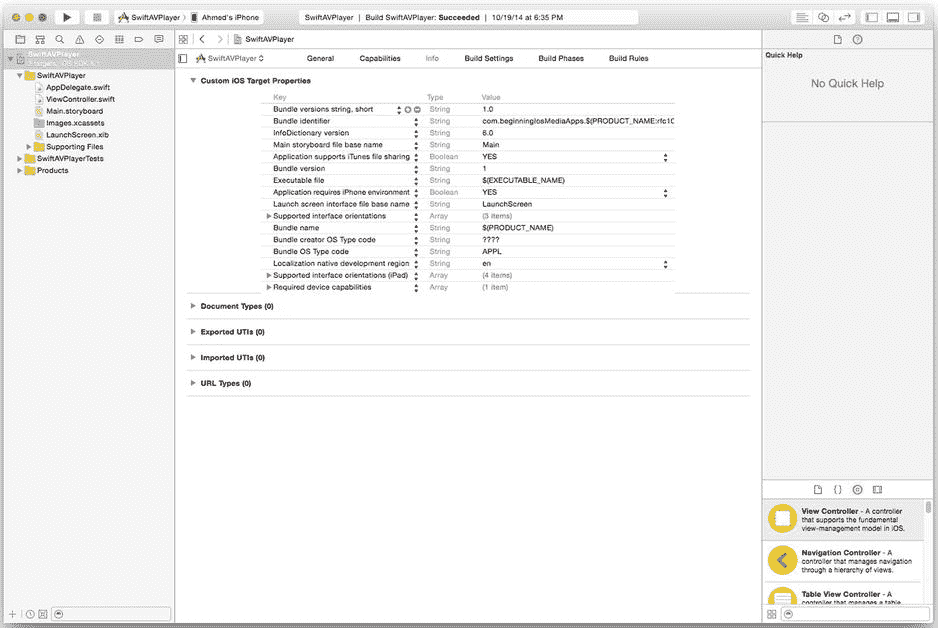

图 14-3. 示例 Swift 项目

此项目层次结构与创建 Objective-C 项目时的层次结构类似。主要区别在于项目的基础编译语言设置为 Swift，并且默认类以 Swift 提供。所有 Xcode 项目设置界面和 Interface Builder 界面的工作方式与 Objective-C 项目完全相同，因为文件格式没有重大变化。由于`MyAVPlayer`项目依赖应用程序的文档目录存放文件，您需要在项目中启用 iTunes 文件共享。与 Objective-C 项目一样，点击项目的 Info 选项卡，并选择`Application Supports iTunes File Sharing`即可启用，如图 14-4 所示。确保该键的值设置为`Yes`以启用文件共享。

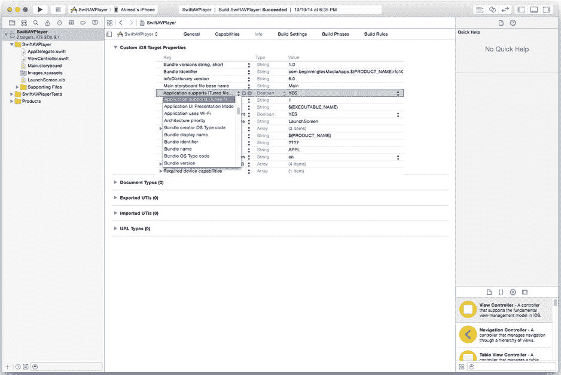

图 14-4. 启用 iTunes 文件共享支持

## 将 Objective-C 类导入到你的项目中

在继续构建故事板之前，我应该讨论一下房间里的大象：Swift 与 Objective-C 的兼容性。Swift 允许您导入用 Objective-C 编写的类并调用 Objective-C 方法。这种导入功能非常有价值，因为您可以导入任何现有的 Cocoa Touch API 或现有的 Objective-C 代码。

为了说明这一点，我们不会用 Swift 重写整个`MyAVPlayer`项目，而是仅使用 Swift 重写`MainViewController`类，并将`FileViewController`（文件选择器）作为 Objective-C 类导入。

要将 Objective-C 类添加到您的 Swift 项目中，请遵循与 Objective-C 项目相同的流程：将文件拖放到项目导航器中，或从文件菜单中选择“将文件添加到<项目名称>”。第一次将 Objective-C 类导入 Swift 项目时，系统会要求您创建一个 Objective-C 桥接头文件，如图 14-5 所示。选择“是”以继续。

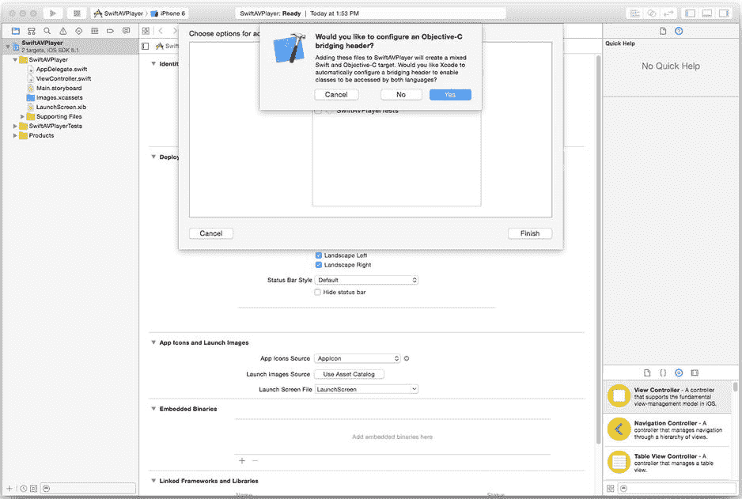

图 14-5. Objective-C 桥接头文件提示

*Objective-C 桥接头文件*是一种特殊的头文件，它为编译器提供要暴露给 Swift 类的 Objective-C 头文件列表。它作为一个通用头文件工作，类似于 PCH（预编译头）文件。通过`#import`导入类。对于`SwiftAVPlayer`项目，您唯一需要导入的类是`FileViewController`。将以下`#import`语句添加到项目中的`SwiftAVPlayer-Bridging-Header.h`文件中：

```objc
#import "FileViewController.h"
```

如果您想将更多 Objective-C 类（包括第三方组件）导入到项目中，可遵循相同步骤，确保将所有类添加到桥接头文件中。您无需将任何 Cocoa Touch 类添加到此桥接头文件中，因为 Apple 已为您处理好这些。

## 构建故事板

为基于 Swift 的项目构建故事板的过程与为基于 Objective-C 的项目构建故事板完全相同，只是您需要一些额外配置来使用导入的 Objective-C 类。您已经熟悉的所有 Interface Builder 功能，包括属性检查器、对象库和视图层次结构，都可以在基于 Swift 的项目中使用。

对于`MySwiftAVPlayer`项目，构建如图 14-6 所示的故事板。

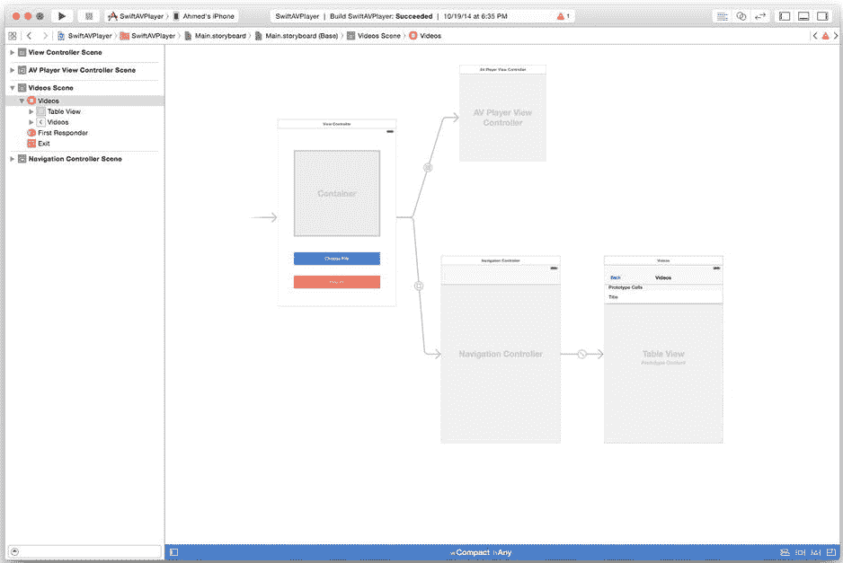

图 14-6. SwiftAVPlayer 项目的故事板

此故事板的关键组件如下：

*   一个 AVKit 播放器视图控制器，代表项目的媒体播放器
*   一个容器视图，用于容纳媒体播放器，以及一个名为`setPlayerContent`的 Embed 转场，用于初始化媒体播放器
*   一个`UITableViewController`子类，用于文件选择器
*   一个`UINavigationController`，嵌入文件选择器，并通过一个名为`showFilePicker`的 Present Modally 转场连接到“选择文件”选项

有关如何构建此故事板每个组件的更多详细信息，请参阅第 9 章。

要将故事板上的文件选择器连接到其父类`FileViewController.h`，请使用 Interface Builder 中的身份检查器，就像在基于 Objective-C 的项目中一样。要使 Interface Builder 能够识别基于 Objective-C 的类，您需要选择一个父类和一个*模块*。模块是为 Objective-C 类添加 Swift 兼容性的另一种方式。对于基本项目，您不需要定义模块；但是，您需要点击身份检查器中的模块下拉列表，以便让 Interface Builder 识别您的 Objective-C 类。

如图 14-7 所示，在输入`FileViewController`作为类名后，点击空的模块下拉列表以保存您的选择。

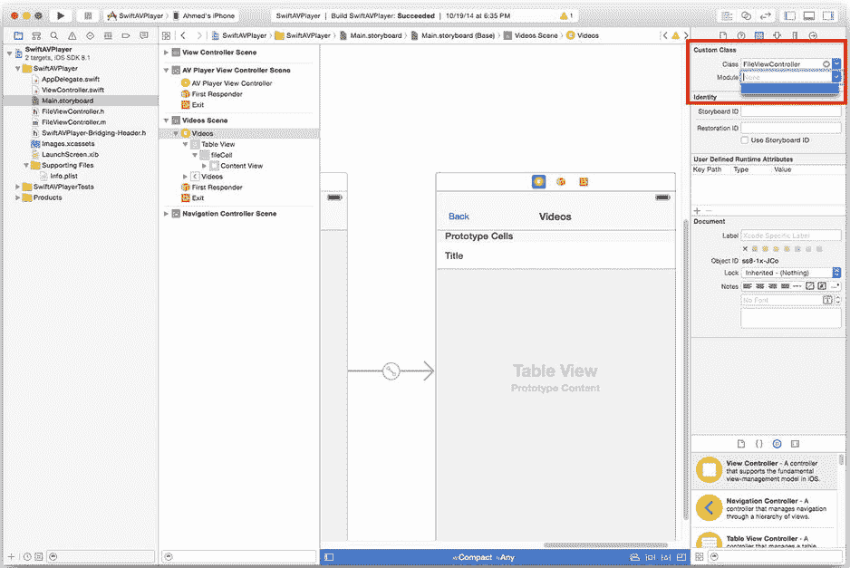

图 14-7. 为基于 Objective-C 的类选择空模块

**注意**：此步骤是 Xcode 6 的局限性，并且是在故事板中使用 Objective-C 类所必需的。

在下一节中，您将看到如何在 Swift 中连接到您的`IBOutlet`和`IBAction`。

## 基本 Swift 语法

在深入学习之前，我想介绍一些基本的 Swift 语法概念，帮助您熟悉这门语言。为了使转换过程更清晰，我将在每个 Swift 代码示例之前展示相应的 Objective-C 代码。本节中的代码并非旨在直接用于最终项目，因此请随意在练习示例时进行实验。

### 调用方法（Hello World）

在 Objective-C 中，要在控制台打印“Hello World”，您会使用`NSLog()`方法：

```objc
NSLog(@"Hello World");
```

在 Swift 中，等效的代码是：

```swift
println("Hello World")
```

您应该注意到几个主要区别：

*   *无分号*：Swift 使用`newline`字符来分隔行。
*   *无@符号*：Swift 有自己的`String`类，它被实现为一个简单的字符数组。
*   *`println`*：Swift 使用这个从 C 和 Java 中熟悉的函数名，允许您直接向控制台打印一行。

在 Objective-C 中，调用带有多个参数的方法如下所示：

```objc
NSInteger finalSum = [self calculateSumOf:5 andValue:5];
```

在 Swift 中，调用带有多个参数的方法是将它们添加到括号内的逗号分隔列表中（就像在 C 或 Java 中一样）：

```swift
var finalSum = calculateSum(5, 5)
```

如果方法为其参数定义了标签，则将标签添加到值前面：

```swift
var finalSum = calculateSum(firstValue: 5, secondValue: 5)
```

### 定义变量

在“Hello World”之后，每个编程课程都必须继续讨论变量。


#### Swift 与 Objective-C 语法对比

在 Objective-C 中，通过声明类型、变量名和值来创建变量：

```
NSInteger count = 5;
```

在 Swift 中，通过指定变量名和可变性（`var`或`let`）来声明变量，并可选择指定数据类型和初始值：

```
var count : Int = 5
```

所有使用`var`在 Swift 中定义的变量都是*可变的*，这意味着你可以更改它们的值而无需重新初始化变量——例如，`NSMutableString`或`NSMutableArray`。

`let`关键字类似于 Objective-C 和 C 中的`const`；这是一个*常量*值，不应更改。

Swift 会推断数据类型，因此如果你愿意，可以在声明中省略类型：

```
var count = 5
```

## 实例化对象

在 Objective-C 中，通过先分配内存再调用构造函数来实例化对象：

```
NSMutableArray *fileArray = [[NSMutableArray alloc] init];
```

在 Swift 中则更简单。Swift 会自动分配内存，省去了`alloc`步骤。此外，Swift 中类的默认构造函数是类名后跟一对空圆括号：

```
var fileArray = NSMutableArray()
```

如果你要初始化的类在其构造函数中接受参数，则可以像调用任何其他方法一样调用构造函数：

```
var myView = UIView(frame: myFrame)
```

如果你从 Objective-C 类实例化对象，则需要将其构造函数作为方法调用：

```
var mutableArray = NSMutableArray()
```

## 访问属性和方法（包括 Objective-C 类）

在 Swift 中，你可以使用点符号访问对象的属性或方法，就像在 C 或 Java 中一样。这包括在 Objective-C 中定义的类。

在 Objective-C 中，通过以下代码访问字符串的`lastPathComponent`属性：

```
NSString *extension = [fileName lastPathComponent];
```

Swift 中的等效写法如下：

```
var extension = fileName.lastPathComponent
```

要在 Objective-C 中调用`UIView`对象的`reloadSubviews`方法，你会编写如下调用：

```
[myView reloadSubviews];
```

在 Swift 中，同一行代码看起来像这样：

```
myView.reloadSubviews()
```

## 类型转换

在 Objective-C 中，要将对象从一种类转换为另一种，需要在前面加上类名和可选的星号来标识指针：

```
UINavigationController *navigatonController = (UINavigationController *)segue.destinationController;
```

在 Swift 中，使用`as`关键字即可轻松完成转换：

```
let navigationController = segue.destinationController as UINavigatonController
```

只需在结果后添加`as`关键字和类名，编译器就会为你处理其余部分。你甚至可以在任何需要使用对象的地方内联插入此关键字：

```
for (file as String in fileArray) {}
```

## 使用字符串格式化器

在 Objective-C 中，当你想要将对象的值插入字符串时，必须使用字符串格式化器来构建自定义字符串：

```
NSString *summaryString = [NSString
    stringWithFormat:@"value 1: %d value 2: %d", value1, value2];
```

对于每个要插入字符串的值，你需要使用代表其类型的替换字符。

在 Swift 中，这已成为过去。你可以通过将变量名放在圆括号内，并在前面加上反斜杠来将值插入字符串：

```
let value1 = 5
let value2 = 10
var summaryString = "value 1: \(value1) value2: \(value2)"
```

## 使用数组

在 Objective-C 中，你使用`NSArray`类表示数组。Objective-C 中的数组只包含对象，可以通过几种便捷的构造函数方法进行初始化，包括`[NSArray arrayWithObjects:]`：

```
NSArray *stringArray = [NSArray arrayWithObjects:@"string 1",
    @"string 2", @"string 3"]
```

在 Swift 中，你可以在定义变量时通过在方括号中提供值来声明数组：

```
var stringArray = ["string 1", "string 2", "string 3"]
```


Swift 对数组内容的类型限制与 Objective-C 不同，因此你可以直接用标量值（如`Int`）来初始化数组：

```
var intArray = [1, 3, 5]
```

如果你不希望用值来初始化数组，可以通过在方括号中指定类型名称来声明输入变量的类型：

```
var intArray : [Int]
```

你还可以使用下标语法来读取或修改 Swift 数组中的值：

```
var sampleString = stringArray[3]
```

如果你将数组定义为可变变量，可以使用加号（`+`）运算符向数组追加值：

```
stringArray += "string4"
```

## 使用条件逻辑

在 Objective-C 中，实现最基本的条件逻辑时，需要将比较表达式放在括号内，作为 `if` 语句的一部分：

```
if (currentValue < maximumValue) {
}
```

在 Swift 中，除了不再需要括号之外，此语法基本保持不变：

```
if currentValue < maximumValue {
}
```

`if-else` 语句也遵循这一规则：

```
if currentValue < maximumValue {
    //执行某些操作
} else if currentValue == 3 {
    //执行其他操作
}
```

**注意：** 你在 Objective-C 中熟悉的所有比较运算符在 Swift 中仍然有效。

在 Objective-C 中，当你需要检查多个值时，会使用 `switch` 语句，并为每个值提供一个 `case` 分支：

```
switch(currentValue) {
    case 1: NSLog("value 1");
        break;
    case 2: NSLog("value 2");
        break;
    case 3: NSLog("value 3");
        break;
}
```

好消息是，Swift 中同样支持 `switch` 语句，但有一些变化：

- Swift 中的 `switch` 语句允许比较对象。Objective-C 中只能比较值的要求在 Swift 中已被取消。
- Swift 中的 `switch` 语句默认不再贯穿（fall through）。这意味着你不必在每个 `case` 末尾添加 `break;` 语句。
- Swift 中的 `switch` 语句必须是穷尽的（即必须覆盖所有值，或包含一个 `default` 分支）。这一要求是代码安全的最佳实践，可以防止意外的比较。

在 Swift 中，之前的 `switch` 语句将如下所示：

```
switch currentValue {
    case 1: println("value 1")
    case 2: NSLog("value 2")
    case 3: NSLog("value 3")
    default: NSLog("other value")
}
```

## 使用循环

所有主要循环类型（`for`、`for-each`、`do`、`do-while`）的语法在 Swift 中基本保持不变。两个主要变化是：你无需声明类型，并且括号再次变为可选：

```
for name in nameArray {
    println("name = \(name)")
}
```

Swift 引入了一项能改进循环的重要功能：*区间*（ranges）。Swift 中的区间允许你指定一组值，用于循环迭代或作为比较的一部分。

Swift 中有两种主要的区间类型：

- *闭区间*，表示为 `x...y`，创建一个从 x 开始并包含包括 y 在内的所有值的区间。（注意：是*三个*点！）
- *半开区间*，表示为 `x..<y`，创建一个从 x 开始并包含直到 y 为止的所有值的区间。（注意：是*两个*点！）

你可以在 `for-each` 循环中使用区间，如下所示：

```
for i in 1..<5 {
    println(i)
}
```

这将打印数字 1 到 4。

## 定义方法

在 Swift 中定义方法之前，我们先看一下 Objective-C 中的方法签名：

```
-(BOOL)compareValue1:(NSInteger)value1 toValue2:(NSInteger)value2;
```

在这行代码中，你可以看到返回类型位于方法名之前，每个参数都放在冒号之后。你还可以为第一个参数之后的每个参数添加标签，以提高可读性。

在 Swift 中，你需要在方法名之前加上 `func` 关键字，然后将输入参数和输出参数放在括号内来声明方法：

```
func compareValues(value1: Int, value2: Int) -> (result: Bool)
```

Swift 使用 `->` 来分隔输入参数和返回参数。


### 排版后的内容

### 参数类型声明

与 Swift 中的变量一样，通过附加类型名称和冒号来指示每个参数的类型。

如果方法不返回任何内容，可以省略返回参数和`->`：

```
func isValidName(name: String) {
}
```

### 调用枚举类型

在 Swift 中，可以通过指定枚举的名称、类型和值来构建枚举类型：

```
enum PlaybackStates : Int {
    case .Failed = -1, case .Loading, case .Success
}
```

与 Objective-C 不同，要表示`enum`中的值，需要在常量名称前放置一个句点。在与`enum`值进行比较时，保留该句点：

```
if playbackState == .Success {
    println("Success!")
```

### 使用特殊标点（问号和感叹号运算符）

对于任何来自基于 C 的语言的人来说，Swift 最令人困扰的一个方面是它如何使用问号和感叹号运算符。

在 Swift 中，问号运算符（`?`）用于表示可选变量。*可选变量*是可以持有值或`nil`的变量。你可能想知道为什么这很重要。在其他语言中，对象可以是`nil`，但标量变量（如`int`）始终存储值。Swift 中的可选变量消除了这一限制，允许任何内容存储`nil`值。

通过在其类型末尾附加问号来将变量声明为可选：

```
var myString : String?
```

这也适用于用值初始化对象时：

```
var myString : String? = "Ahmed is cool"
```

由于 Swift 会推断变量类型，因此在需要通过引用传递对象（例如`NSError`）时，可选变量非常重要。

**注意**：在 Swift 中，仍然使用问号来表示三元运算。

Swift 中的感叹号运算符允许你*解包*可选变量。这相当于在 Objective-C 或其他基于 C 的语言中解引用指针。解包允许你提取可选变量的属性（如果变量尚未初始化，则提取`nil`）。

要解包变量，在其变量名称末尾附加一个感叹号：

```
var errorString = error!.description
```

**警告**：在点表示法中，不要省略感叹号后的句点。两者都是解包变量所必需的。

## 构建类

与 Objective-C 不同，Swift 没有接口文件（`.h`）和实现文件（`.m`）的概念。在 Swift 中，整个类都在一个`.swift`文件中声明。

在 Objective-C 中，类声明由以下部分组成：

* 类名
* 父类
* 属性声明（在接口文件中）
* 方法定义（在实现文件中）

作为比较的基础，请参考 MyAVPlayer 项目的类声明，如列表 14-1 所示。在 MyAVPlayer 项目中，可以在`MainViewController.h`文件中找到它。

***列表 14-1***。主视图控制器类的头文件

```
#import <UIKit/UIKit.h>
#import <AVKit/AVKit.h>
#import "FileViewController.h"
@interface MainViewController : UIViewController <FileControllerDelegate>

@property (nonatomic, strong) IBOutlet UIView *playerViewContainer;
@property (nonatomic, strong) IBOutlet UIButton *chooseFileButton;
@property (nonatomic, strong) IBOutlet UIButton *playAllButton;
@property (nonatomic, strong) AVPlayerViewController *moviePlayer;

-(IBAction)playAll:(id)sender;

@end
```

要在 Swift 中导入类，使用`import`关键字并指定类的名称。与 Objective-C 不同，不需要指定头文件的路径：

```
import UIKit
import AVKit
import FileViewController
```

在 Swift 中，定义类类似于定义变量：在`class`关键字后指定类名，在冒号后指定父类名（就像为变量指定类型一样）。在父类名后添加大括号以表示代码块：

```
class ViewController : UIViewController {
}
```


由于 Swift 不区分接口文件和实现文件，你需要在类定义内部声明属性和方法。

Swift 中的属性声明方式与其他变量相同，只是其作用域位于类的顶层：

```
class ViewController : UIViewController {
    var playAllButton : UIButton!
    var chooseFileButton : UIButton!
    var playAllButton : UIButton!
    var moviePlayer : AVPlayerViewController!
}
```

同样，定义方法时，将其放置在类的顶层：

```
class ViewController : UIViewController {
    var playAllButton : UIButton!
    var chooseFileButton : UIButton!
    var playAllButton : UIButton!
    var moviePlayer : AVPlayerViewController!
    func playAll() {

}
}
```

在**列表 14-2**中，你可以找到 `ViewController` 类的 Swift 文件，其中包含了从 `UIViewController` 类继承的 `viewDidLoad` 和 `didReceiveMemoryWarning` 方法。当重写父类的方法时，你需要在方法定义前添加 `override` 关键字。

***列表 14-2***。修改后的 ViewController 类 Swift 文件

```
import UIKit
import AVFoundation
import AVKit

class ViewController: UIViewController, FileControllerDelegate {

var chooseFileButton : UIButton!
    var playAllButton : UIButton!
    var moviePlayer : AVPlayerViewController!

override func viewDidLoad() {
        super.viewDidLoad()
        // 在此处执行视图加载后的任何额外设置，
        // 通常来自 nib 文件。
    }

override func didReceiveMemoryWarning() {
        super.didReceiveMemoryWarning()
        // 处置任何可以重新创建的资源。
    }

}
```

## 将项目连接到 Interface Builder

与 Objective-C 类似，为了使你的用户界面元素和处理程序方法对 Interface Builder 可见，你需要在属性声明前添加 `@IBOutlet` 属性，在方法前添加 `@IBAction`。

在 Objective-C 版本的 `MainViewController` 类中，你通过在类名前面添加 `@IBOutlet` 关键字，将一个元素声明为 Interface Builder 的 *outlet*：

```
@property (nonatomic, strong) IBOutlet UIButton *playAllButton;
```

在 Swift 中，你可以通过在变量声明前添加 `@IBOutlet` 关键字，将一个对象声明为 outlet：

```
@IBOutlet var chooseFileButton : UIButton!
```

要在 Objective-C 中将方法声明为 Interface Builder 的 *action*，你需要将返回类型改为 `IBAction`，并使用 `id` 对象表示事件的发送者：

```
-(IBAction)playAll:(id)sender;
```

在 Swift 中，你通过在方法签名前添加 `@IBAction` 属性，并将 `sender` 对象作为输入参数，来实现相同的逻辑：

```
@IBAction func playAll:(sender: AnyObject)
```

你会注意到的最大区别是，Swift 中的通用对象类型是 `AnyObject` 而不是 `id`。`id` 关键字在 Swift 中无法编译，所以请不要尝试使用它。

添加这些属性后，你就可以在 Interface Builder 中连接你的属性和处理程序了。

**列表 14-3** 展示了“播放全部”按钮的 Objective-C 版本处理程序。在此方法中，你根据文档目录中可用的文件构建了一个 `AVPlayerItem` 对象数组。构建列表后，你启动了媒体播放器的播放。

***列表 14-3***。“播放全部”按钮的 Objective-C 处理程序

```
-(IBAction)playAll:(id)sender
{
    NSArray *paths =
        NSSearchPathForDirectoriesInDomains(NSDocumentDirectory,
        NSUserDomainMask, YES);
    NSString *documentsDirectory = [paths objectAtIndex:0];
    NSError *error = nil;

NSArray *allFiles = [[NSFileManager defaultManager]
        contentsOfDirectoryAtPath:documentsDirectory error:&error];

NSMutableArray *playerItemArray = [NSMutableArray new];

if (error == nil) {
        for (NSString *file in allFiles) {
            NSString *extensionString = [[file pathExtension]
                lowercaseString];
            if ([extensionString isEqualToString:@"mp4"] ||
                [extensionString isEqualToString:@"mov"]) {

NSString *relativePath = [documentsDirectory
                    stringByAppendingPathComponent:file];

NSURL *fileURL = [NSURL
                     fileURLWithPath:relativePath];

AVPlayerItem *playerItem = [AVPlayerItem
                     playerItemWithURL:fileURL];

[playerItem addObserver:self forKeyPath:@"status"
                     options:NSKeyValueObservingOptionNew context:nil];

[playerItemArray addObject:playerItem];
             }
        }
   } else {
     NSLog ("could not load files");
   }

self.moviePlayer.player = [[AVQueuePlayer alloc]
        initWithItems:playerItemArray];

[self.moviePlayer.player addObserver:self forKeyPath:@"status"
        options:0 context:nil];

[self.moviePlayer.player play];

}
```

**列表 14-4** 展示了“播放全部”按钮的 Swift 版本处理程序。

***列表 14-4***。“播放全部”按钮的 Swift 处理程序

```
@IBAction func playAll(sender : AnyObject) {

var error : NSError? //可选变量（可为 nil）

let paths =
        NSSearchPathForDirectoriesInDomains(.DocumentDirectory,
        .UserDomainMask, true) // 枚举值使用点语法
    let documentsDirectory = paths[0] as String

let allFiles =
        NSFileManager.defaultManager().contentsOfDirectoryAtPath(
        documentsDirectory, error: &error) as [String]

if error != nil {
        let errorString = error!.description //提取值
        // 打印错误字符串
        println("error loading files: \(errorString)")

} else {
        var playerItemArray  = NSMutableArray()
        for file in allFiles {
            let fileExtension = file.pathExtension.lowercaseString
            if fileExtension == "m4v" || fileExtension == "mov" {
                let relativePath = documentsDirectory.
                    stringByAppendingPathComponent(file)
                let fileURL = NSURL(fileURLWithPath: relativePath)
                let playerItem = AVPlayerItem(URL: fileURL)

playerItem.addObserver(self, forKeyPath: "status",
                    options:nil, context: nil)

playerItemArray.addObject(playerItem)

}
        }

moviePlayer.player = AVQueuePlayer(items: playerItemArray)
        moviePlayer.player.addObserver(self, forKeyPath: "status",
            options: nil, context: nil)

moviePlayer.player.play()
    }

}
```

## 添加委托支持

在 Objective-C 中，要将你的类声明为某个协议的委托，你需要在类签名中添加协议名称，并在类中实现 `@required` 的委托方法。在 Swift 中，你遵循相同的过程，但语法不同。

在 Objective-C 中，你会通过在父类名后的尖括号中添加协议名称来声明类遵循某个协议：

```
@interface MainViewController : UIViewController <FileControllerDelegate>
```

但在 Swift 中，语法是在父类名之后，以逗号分隔的列表形式添加协议名称：

```
class ViewController: UIViewController, FileControllerDelegate {
```

在 MyAVPlayer 项目中，你需要使用 `FileControllerDelegate` 协议来处理用户决定关闭文件选择器或选择文件时的用户界面事件。你可以在**列表 14-5** 中找到这些方法的 Objective-C 版本。

***列表 14-5***。Objective-C 委托方法

```
-(void)cancel
{
    //关闭文件选择器
    [self dismissViewControllerAnimated:YES completion:nil];
}


-(void)didFinishWithFile:(NSString *)filePath
{
    NSArray *paths = NSSearchPathForDirectoriesInDomains(
         NSDocumentDirectory, NSUserDomainMask, YES);
    NSString *documentsDirectory = [paths objectAtIndex:0];
    NSString *relativePath = [documentsDirectory
         stringByAppendingPathComponent:filePath];
    NSURL *fileURL = [NSURL fileURLWithPath:relativePath];
    self.moviePlayer.player = [AVPlayer playerWithURL:fileURL];
    [self.moviePlayer.player addObserver:self forKeyPath:@"status"
          options:0 context:nil];
    [self dismissViewControllerAnimated:YES completion:^{
        [self.moviePlayer.player play];
    }];
}

在 `[FileControllerdelegate didFinishWithFile:]` 方法中，你根据用户的选择，使用基于文件的 URL 初始化了电影播放器，然后开始播放。而在 `[FileControllerdelegate cancel]` 方法中，你仅仅关闭了文件选择器，没有进行任何媒体选择。

这些方法的 Swift 版本如代码清单 14-6 所示。

***代码清单 14-6***. Swift 委托方法

```
func cancel() {
    dismissViewControllerAnimated(true, completion: nil)
}

func didFinishWithFile(filePath: String!) {
    let paths = NSSearchPathForDirectoriesInDomains(
           .DocumentDirectory,.UserDomainMask, true)
    let documentsDirectory = paths[0] as String
    let relativePath = documentsDirectory.
            stringByAppendingPathComponent(filePath)
    let fileURL = NSURL(fileURLWithPath: relativePath)
    moviePlayer.player = AVPlayer(URL: fileURL)
    moviePlayer.player.addObserver(self, forKeyPath: "status",
        options: nil, context: nil)
    dismissViewControllerAnimated(true, completion: { () -> Void in
            self.moviePlayer.player.play()
    })
}
```

因为你并非从父类重写委托方法，所以不需要在方法签名前添加 `override` 关键字。你会注意到，这里的几个局部变量通过 `let` 声明为常量；由于我使用这些变量来访问属性，因此不需要它们可变。

在 `dismissViewControllerAnimated` 方法调用中的 `() -> Void` 片段表示一个完成处理器。Swift 中的闭包被视为没有名称的方法；要在 Swift 中实现一个完成处理器，对于你的参数，可以使用该闭包的输入和输出参数集（如果它不需要参数，则使用两组空圆括号）：

```
() -> () {
// 执行某些操作
}
```

## 添加键值观察支持

在 MyAVPlayer 项目中，你使用了键值观察来自动推进队列中的播放项，并在播放完成时自动关闭全屏媒体播放器。要重现此行为，你需要在 Swift 中实现键值观察。

通常来说，Swift 试图摆脱键值观察，转而倾向于使用一种名为**属性观察器**的新概念。如代码清单 14-7 所示，属性观察器允许你实现当变量即将更改（`willSet`）和已更改（`didSet`）时的代码块。你可以通过在这些块中可用的 `oldValue` 和 `newValue` 常量来访问这些值。

***代码清单 14-7***. 属性观察器

```
var count : Int {
        willSet {
                println("old value \(oldValue)")
        }
        didSet {
                println("new value \(newValue)")
        }
}
```

不幸的是，属性观察器需要在定义属性或局部变量时实现。对于现有类的属性，你可以继续使用 Objective-C 中添加观察者的方法：`[NSObject addObserver:forKeyPath:options:context:]`，只不过你需要使用 Swift 方法语法来调用它：

```
moviePlayer.player.addObserver(self, forKeyPath: "status", options: nil,
    context: nil)
```

供你参考，你可以在代码清单 14-8 中找到 KVO 处理方法的 Objective-C 版本。如果传入的对象是 `AVPlayer`，你会添加一张图片作为覆盖视图。如果是 `AVPlayerItem`，你会自动推进到 `AVQueuePlayer` 中的下一个项。

***代码清单 14-8***. 用于 KVO 的 Objective-C 处理方法

```
-(void)observeValueForKeyPath:(NSString *)keyPath ofObject:(id)object
    change:(NSDictionary *)change context:(void *)context
{
    if ((object == self.moviePlayer.player) &&
        [keyPath isEqualToString:@"status"] ) {
        UIImage *image = [UIImage imageNamed:@"logo.png"];
        UIImageView *imageView = [[UIImageView alloc]
            initWithImage:image];
        imageView.frame = self.moviePlayer.videoBounds;
        imageView.contentMode = UIViewContentModeBottomRight;
        imageView.autoresizingMask = UIViewAutoresizingFlexibleHeight |
                                     UIViewAutoresizingFlexibleWidth;
        if ([self.moviePlayer.contentOverlayView.subviews count] == 0) {
            [self.moviePlayer.contentOverlayView addSubview:imageView];
        }
        [object removeObserver:self forKeyPath:@"status"];
    } else if ([object isKindOfClass:[AVPlayerItem class]]) {
        AVPlayerItem *currentItem = (AVPlayerItem *)object;
        if (currentItem.status == AVPlayerItemStatusFailed) {
            NSString *errorString = [currentItem.error description];
            NSLog(@"item failed: %@", errorString);
            if ([self.moviePlayer.player
                    isKindOfClass:[AVQueuePlayer class]]) {
                    AVQueuePlayer *queuePlayer =
                       (AVQueuePlayer *)self.moviePlayer.player;
                [queuePlayer advanceToNextItem];
            } else {
                UIAlertView *alert = [[UIAlertView alloc]
                    initWithTitle:@"Error" message:errorString
                    delegate:self cancelButtonTitle:@"OK"
                    otherButtonTitles:nil];
                [alert show];
            }
        } else {
            [object removeObserver:self forKeyPath:@"status"];
        }
    }
}
```

观察者的 Swift 版本处理方法如代码清单 14-9 所示。由于这是一个继承来的方法，请记得在方法签名前添加 `override` 关键字。

***代码清单 14-9***. 用于 KVO 的 Swift 处理方法

```
override func observeValueForKeyPath(keyPath: String, ofObject
    object: AnyObject, change: [NSObject : AnyObject],
    context: UnsafeMutablePointer<Void>) {
        if object.isKindOfClass(AVPlayer) && keyPath == "status" {
            let overlayImage = UIImage(named: "logo.png")
            let imageView = UIImageView(image: overlayImage)
            imageView.frame = moviePlayer.videoBounds
            imageView.contentMode = .BottomRight
            imageView.autoresizingMask = .FlexibleHeight | .FlexibleWidth
            if moviePlayer.contentOverlayView.subviews.count == 0 {
                self.moviePlayer.contentOverlayView.addSubview(imageView)
            }
            object.removeObserver(self, forKeyPath: "status")
        } else if object.isKindOfClass(AVPlayerItem) {
            let currentItem = object as AVPlayerItem
            if currentItem.status == .Failed {
                let errorString = currentItem.error.description
                println("error playing item: \(errorString)")
                if (moviePlayer.player.isKindOfClass(AVQueuePlayer)) {
                    let queuePlayer = moviePlayer.player as AVQueuePlayer
                    queuePlayer.advanceToNextItem()
                } else {
                    let alert = UIAlertView(title: "Error",
                        message: errorString, delegate: self,
                        cancelButtonTitle: "OK")
                    alert.show()
                }
            } else {
                object.removeObserver(self, forKeyPath: "status")
            }
        }
}
```


在这个方法中，你会发现与 Objective-C 实现相比有两个有趣的变化。首先，当你检查传入对象的类型时，可以直接在类名上调用 `isKindOfClass()` 方法。此外，当你检查传入的消息字符串时，你直接对值进行比较，而不是调用 `isEqualToString()` 方法。

## 添加通知支持

Swift 完全支持通知，但需要注意的是，你必须实现用于发送和观察通知的 Objective-C 方法。

在 Objective-C 中，通过为 `AVPlayerItemDidPlayToEndTimeNotification` 声明一个选择器方法，来设置用于播放完成通知的主视图控制器类：

```
[[NSNotificationCenter defaultCenter] addObserver:self
    selector:@selector(playbackFinished:)
    name:AVPlayerItemDidPlayToEndTimeNotification object:nil];
```

你可以在 Swift 中使用相同的方法来添加观察者，注意将其转换为 Swift 风格的语法：

```
var notificationCenter = NSNotificationCenter.defaultCenter()
notificationCenter.addObserver(self, selector: "playbackFinished:",
    name: AVPlayerItemDidPlayToEndTimeNotification, object: nil)
```

Objective-C 的通知处理器如列表 14-10 所示。在该方法中，你会在收到播放已结束的通知后关闭全屏媒体播放器。

***列表 14-10***. Objective-C 中的通知处理器

```
-(void)playbackFinished:(NSNotification *) notification
{
    NSDictionary *userInfo = notification.userInfo;

if ([self.moviePlayer.player isKindOfClass:[AVPlayer class]]) {
        [self dismissViewControllerAnimated:YES completion:nil];
    } else {
        //do nothing
    }

}
```

对于你的 Swift 处理器方法，记得将传入的通知作为输入参数，如列表 14-11 所示。

***列表 14-11***. Swift 中的通知处理器

```
func playbackFinished(notification : NSNotification) {

let userInfo = notification.userInfo

if moviePlayer.player.isKindOfClass(AVPlayer) {
       dismissViewControllerAnimated(true, completion: nil)
   } else {
       //do nothing
   }
}
```

## 总结

在本章中，你通过移植 `MyAVPlayer` 项目，初步体验了 Swift。在了解了如何设置 Swift 项目并导入现有的 Objective-C 类之后，通过 Swift 语言语法的速成课程，你掌握了将新知识应用于用 Swift 重写 `ViewController` 类的基础知识。虽然 Swift 为 iOS 开发带来了显著的语法变化，但其方法设计旨在与 Objective-C 类似。在大多数情况下，你可以使用 Swift 方法语法从 Swift 中调用任何 Objective-C Cocoa Touch 方法。在无法实现的情况下，请查阅 Apple 开发者库以获取替代方法。

