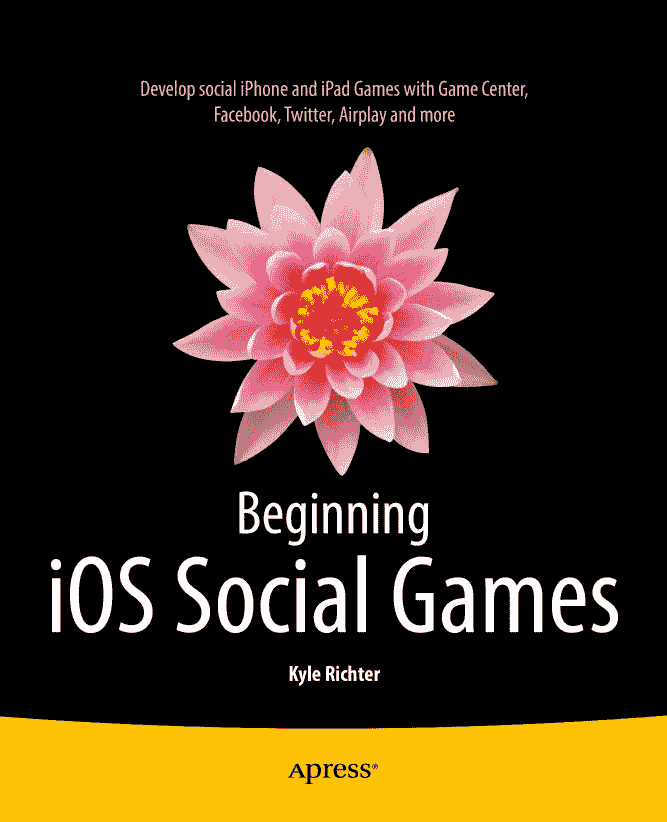

凯尔·里克特 著《iOS 社交游戏开发入门》10.1007/978-1-4302-4906-1 © Apress 2013 凯尔·里克特《iOS 社交游戏开发入门》

ISBN 978-1-4302-4905-4 电子书 ISBN 978-1-4302-4906-1 © Apress 2013 《iOS 社交游戏开发入门》总裁与出版人：保罗·曼宁 主编辑：史蒂夫·安格林 策划编辑：詹姆斯·马克汉姆 技术审核：马库斯·扎拉和卢卡斯·乔丹 编辑委员会：史蒂夫·安格林、马克·贝克纳、埃文·白金汉、加里·康奈尔、路易斯·科里根、詹姆斯·德沃尔夫、乔纳森·格尼克、乔纳森·哈塞尔、罗伯特·哈钦森、米歇尔·洛曼、詹姆斯·马克汉姆、马修·穆迪、杰夫·奥尔森、杰弗里·佩珀、道格拉斯·庞迪克、本·雷诺-克拉克、多米尼克·沙克沙夫特、格温南·斯皮林、马特·韦德、史蒂夫·韦斯、汤姆·韦尔什 协调编辑：吉尔·巴尔扎诺 文字编辑：詹姆斯·康普顿 排版：SPi Global 索引编制：SPi Global 美术设计：SPi Global 封面设计：安娜·伊什琴科 本书通过全球图书贸易由 Springer Science+Business Media New York 发行，地址：233 Spring Street, 6th Floor, New York, NY 10013。电话：1-800-SPRINGER，传真：(201) 348-4505，电子邮件：`orders-ny@springer-sbm.com`，或访问 [www.springeronline.com](http://www.springeronline.com/)。Apress Media, LLC 是加利福尼亚州的有限责任公司，其唯一成员（所有者）是 Springer Science + Business Media Finance Inc (SSBM Finance Inc)。SSBM Finance Inc 是一家特拉华州公司。如需翻译相关信息，请发送电子邮件至 `rights@apress.com`，或访问 [www.apress.com](http://www.apress.com/)。Apress 和 friends of ED 的书籍可批量购买用于学术、企业或促销用途。大多数图书也提供电子书版本和许可。更多信息，请参考我们的特别批量销售–电子书许可网页，网址为 [www.apress.com/bulk-sales](http://www.apress.com/bulk-sales)。本书作者引用的任何源代码或其他补充材料，读者可在 [www.apress.com](http://www.apress.com/) 获取。有关如何找到本书源代码的详细信息，请访问 [www.apress.com/source-code/](http://www.apress.com/source-code/)。本作品受版权保护。出版商保留所有权利，涉及材料的全部或部分内容，特别包括翻译、重印、再次使用插图、朗诵、广播、以缩微胶卷或任何其他物理方式复制，以及信息存储与检索的传输、电子改编、计算机软件，或目前已知或未来开发的任何类似或不同方法。不在此法律保留范围内的是与评论或学术分析相关的简短摘录，或专门为输入计算机系统并执行而提供的材料，仅供购买者独家使用。仅允许在出版商所在地现行版权法的规定下复制本出版物或其部分内容，并且必须始终从 Springer 获得使用许可。使用许可可通过 Copyright Clearance Center 的 RightsLink 获取。违反相应版权法将承担法律责任。本书中可能包含商标名称、标识和图像。我们并非在每次出现商标名称、标识或图像时都使用商标符号，而是仅以编辑方式使用这些名称、标识和图像，以维护商标所有者的利益，并无意侵犯商标。本出版物中使用商品名称、商标、服务标记及类似术语，即使未明确标识，也不应被视为对它们是否受所有权保护的看法。尽管本书中的建议和信息在出版时被认为是真实和准确的，但作者、编辑和出版商均不对可能出现的任何错误或遗漏承担法律责任。出版商对本书内容不作任何明示或暗示的保证。本书谨献给那些在我们之前的巨人们，我们站在他们的肩膀上。

