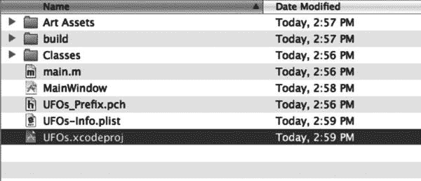
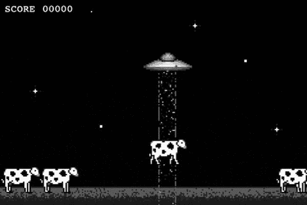
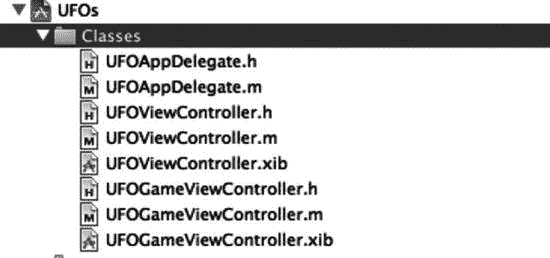
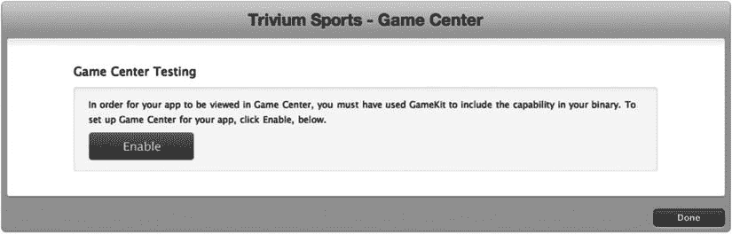
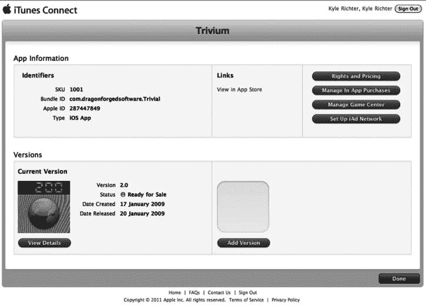

# 1. 社交游戏入门

## 摘要

欢迎阅读《*iOS 社交游戏开发入门*》！本书旨在引导您将`Game Kit`、`Game Center`及其他社交功能集成到 iOS 应用和游戏中。全书围绕一个名为`UFOs`的示例游戏展开，您将在本章稍后部分了解该游戏。不过，如果您已有现成的应用或游戏并希望为其添加社交功能，也可以直接使用该项目。本书可作为参考手册和资源工具，助您完成向 iOS 应用添加社交功能的流程。虽然我建议您从头到尾阅读以全面了解所涵盖的技术，但这并非强制要求。每一章均独立成篇，您可以直接跳至与项目需求相关的章节，并快速将该功能集成到应用中。

本书虽涵盖社交游戏的多个方面，但重点在于 Apple 的社交游戏平台`Game Kit`，及其延伸部分`Game Center`。2009 年 3 月 17 日，Apple 发布`Game Kit`时，将其定位为 iOS 设备实时联网难题的解决方案——而在此之前，实时联网一直颇具挑战。`Game Kit`增加了对蓝牙、局域网以及语音聊天服务的支持。不久后，Apple 在 iOS 4.0 中宣布为`Game Kit`加入`Game Center`功能。借助新版 SDK，Apple 带来了丰富的新特性——其中`Game Center`对本书而言最为重要。在 iOS 5 中，`Game Center`再次迎来更新，最显著的是增加了回合制游戏框架的支持。Apple 延续这一传统，在 iOS 6 中通过`Game Center Challenges`（游戏中心挑战）继续支持`Game Center`。除`Game Center`的变更外，Apple 还在 iOS 5 中增加了对 Twitter 的 OS 级支持，并在 iOS 6 中增加了对 Facebook 的支持。随着 2013 年 WWDC 上 iOS 7 的发布，`Game Center`从底层进行了彻底重新设计，以匹配`UIKit`引入的扁平化视觉风格。

通常，iOS 开发者社区倾向于将`Game Center`视为一套独立的应用程序编程接口（API）。这是一种误解。`Game Center`是`Game Kit`不可分割的一部分，两者相辅相成。在后续章节中，您将看到大量例证。为便于本书叙述，我们将把这两项技术统称为`Game Kit`；但涉及`Game Center`特有功能时，我们仍会使用其正式名称。

本书前 10 章专注于`Game Kit`功能；其余章节涵盖其他社交元素，例如第 11 章中的`Store Kit`与应用内购买、第 12 章和第 13 章中的 Twitter 与 Facebook 分享、第 14 章中的 AirPlay 镜像，以及第 15 章中的 iOS 7 游戏手柄。

请注意，尽管名称如此，`Game Kit`和`Game Center`并不仅限于游戏。不过，近期 Apple 已开始打击在非游戏应用中使用`Game Center`技术的行为。部分开发者曾收到类似以下类型的 Apple 拒绝邮件：

> “Game Center 的预期用途是补充游戏应用或应用内的游戏功能。然而，我们注意到您的应用不包含任何游戏玩法或游戏特性。”

这类拒绝似乎主要针对在非游戏应用中使用排行榜和成就系统。但可以合理辩称，在应用中加入排行榜或成就系统本身就增加了游戏性元素。如果您收到此类拒绝，仍有机会提出申诉；据我所知，目前尚未有开发者在此类申诉中失败。据我观察，也未有因在应用中使用`Game Kit`网络功能而遭拒绝的案例。

## Game Kit 概述

`Game Kit`可分为三个独立部分：网络功能、`Game Center`和语音聊天。尽管所有这些服务协同工作，共同营造一个无缝环境，但分别审视每个部分仍大有裨益。虽然各领域可能存在重叠，但每个部分均可视为一个主要类别。尽管 API 本身并未区分这些部分，但在学习和思考`Game Kit`开发时，将它们分开考虑会更有帮助。

### 网络功能

`Game Kit`的网络功能允许您在一个或多个对等端之间发送和接收数据。`Game Kit`网络还提供一种连接协议，用于连接 Wi-Fi 网络上的本地客户端，或通过蓝牙进行本地连接。`Game Center`还通过广域网匹配扩展了此功能。

`Game Kit`支持在两台 iOS 设备之间创建即席蓝牙或本地无线网络。随着 iOS 4.0 的发布，`Game Kit`开始支持在广域网上进行联网，最多可同时支持 16 名玩家。`Game Kit`网络功能将在第 6、7、8 章中介绍。`Game Center`匹配功能将在第 5 章中介绍。

### Game Center

`Game Center`负责处理身份验证、好友、排行榜、成就、挑战和邀请。从某种意义上说，`Game Center`为开发者提供了与社交互动相关的服务器服务。也可以说`Game Center`包含了自己的网络系统。虽然确实如此，但我们将该主题归入前文关于网络功能的章节，并在第 5 章中详细讨论。`Game Center`技术，如排行榜和成就，将在第 3 章和第 4 章中介绍。

> **注**
> 在各类印刷和参考文档中，“`Game Center`”一词有时既指`Game Center` API 的集合，也指`Game Center`应用本身。

### 语音聊天

Apple 所称的“Game Voice”允许任何应用（不仅限于游戏）通过网络连接提供语音通信。该 API 处理用户音频流的捕获和播放，并提供服务来处理连接、通信、错误和断开连接。这项技术将在第 10 章中探讨。


## 示例游戏：UFO

根据我的经验，大多数开发者都是“体验型”学习者。这意味着他们通过实践而不是观看或聆听来学习效果最佳。当我最初学习编程时，我会逐行将杂志上的源代码抄写到 Commodore 64 中。手动输入每一行代码的体验使信息得以牢固记忆。而听讲座或看别人写代码则很难让我记住大量信息。如果只有讲课和演示的学习方式，我无法想象自己会坚持走这条职业道路。本书正是本着体验型学习者的精神而设计的。

在进入 Game Kit 本身之前，我们首先要讲解如何使用附带的示例游戏。这个名为“UFO”的游戏，并非设计成获奖级、令人上瘾的游戏，而是足够简单，可以将其视为任何通用项目，让您能专注于社交游戏方面的内容。我已尽最大努力将代码量控制在 300 行以内。尽管游戏本身很简单，但所有读者都必须像自己编写一样理解这些代码，这一点至关重要。保持示例的简洁性将使您作为读者能够从项目本身抽离出来，专注于 Game Kit 特有的信息。我们将从玩游戏开始，然后查看源代码。

**注意**

所有章节的源代码以及示例项目均可在[`www.apress.com`](http://www.apress.com/)获取。示例代码提供两种格式：一种支持自动引用计数（ARC）环境（这是 iOS 5 新增的功能），另一种使用手动内存管理系统。除对 ARC 的支持外，这两个项目完全相同。

需要特别说明的是，书中印刷的示例代码是非 ARC 版本。如果您使用的是 ARC，则需要进行调整。更多信息，请参阅苹果公司关于过渡到 ARC 的文章，网址为[`http://developer.apple.com/library/ios/#releasenotes/ObjectiveC/RN-TransitioningToARC/Introduction/Introduction.html`](http://developer.apple.com/library/ios/#releasenotes/ObjectiveC/RN-TransitioningToARC/Introduction/Introduction.html)。

### UFO：理解游戏

您首先需要打开从[`apress.com`](http://apress.com/)下载的基础项目。图 1-1 显示了项目的文件结构。我们将快速运行游戏，看看它的样子。



*图 1-1. Finder 中显示的 UFO 示例项目的文件结构*

要玩游戏，请从“构建”菜单栏中选择“构建并运行”。游戏将启动到一个通用屏幕，上面有一个标有“Play”的按钮。请点击 Play 按钮。您将进入游戏屏幕，如图 1-2 所示。

游戏的目标很典型：倾斜设备上下或左右移动飞船。一旦飞船定位到一头牛上方，点击屏幕任意位置并保持按住，直到牛被绑架。每绑架一头牛得一分。游戏没有结局。每次绑架一头牛后，就会生成一头新的牛并放置在草地上。



*图 1-2. UFO 示例项目的游戏画面视图*

现在您了解了游戏玩法，可以查看驱动游戏引擎的源代码了。

### UFO：检查源代码

在分组树中，您将看到我们将使用的三个类文件：`UFOAppDelegate`、`UFOViewController`和`UFOGameViewController`。这些文件都有对应的头文件（`.h`文件）和实现文件（`.m`文件）。分组树如图 1-3 所示。



*图 1-3. Xcode 中显示的示例项目分组树结构*

首先，看一下`UFOAppDelegate.h`和`UFOAppDelegate.m`文件。这些文件应该让你感到熟悉，因为其他 iOS 开发工作中也常遇到。它们不过是`UINavigationController`的一个基础子类。如果您需要熟悉这里的代码，请查看苹果公司为新项目提供的示例代码（`https://developer.apple.com/library/ios/navigation/#section=Resource%20Types&topic=Sample%20Code`）。

下一组文件也相对简单：查看`UFOViewController.h`和`UFOViewController.m`。这些是与登录或主屏幕相关的类。目前这里只有一个 Play 按钮，但随着本书的深入，我们将在此视图中添加排行榜、成就和多人游戏控件。

最后，我们将使用`UFOGameViewController.m`。这是驱动所有游戏玩法的主类，也是添加大部分 Game Kit 功能的地方。

#### 设置加速计委托

我们将从下载的源文件顶部开始逐步讲解；在 Xcode 中打开`UFOGameViewController`文件。我们修改了`UFOGameViewController`的`init`方法，以注册加速计反馈。请看下面的代码片段，后续会详细讨论。

```
- (id)init
{
    if (self != [super init]) {
        return nil;
    }
    self.motionManager = [[CMMotionManager alloc] init];
    self.motionManager.accelerometerUpdateInterval = 0.05;
    [self.motionManager startAccelerometerUpdatesToQueue:[NSOperationQueue currentQueue]
                                            withHandler:^(CMAccelerometerData *accelerometerData, NSError *error)
    {
        [self motionOccurred:accelerometerData];
        if(error)
        {
            NSLog(@"%@", error);
        }
    }];
    return self;
}
```

我们将使用核心运动框架来捕捉加速计数据并移动角色。输入频率设置为 0.05 秒，这将提供一个非常流畅、反应灵敏的控制系统。

接下来，看一下`viewDidLoad`方法。我们将其分解成几个部分，以准确理解这里发生了什么。

```
accelerometerDamp = 0.3f;
accelerometer0Angle = 0.6f;
movementSpeed = 15;
```

这里我们设置了一些类变量，用于存储开始处理加速计输入时所需的数据。当我们开始处理飞船移动时，将再次使用这些变量。目前，您不需要完全理解它们的作用，只需知道它们已被设置即可。我们创建了一个名为`motionOccurred:`的新方法，该方法将由核心运动框架调用以处理倾斜输入。先前定义的阻尼方法被应用，信息被传递给`movePlayer::`方法，该方法将在后续章节中讨论。

```
-(void)motionOccurred:(CMAccelerometerData *)accelerometerData;
{
    // 使用基本的低通滤波器，仅保留加速计数值中的重力分量
    accel[0] = accelerometerData.acceleration.x * accelerometerDamp + accel[0] * (1.0 - accelerometerDamp);
    accel[1] = accelerometerData.acceleration.y * accelerometerDamp + accel[1] * (1.0 - accelerometerDamp);
    accel[2] = accelerometerData.acceleration.z * accelerometerDamp + accel[2] * (1.0 - accelerometerDamp);
    if(!tractorBeamOn)
        [self movePlayer:accel[0] :accel[1]];
}
```


#### 将玩家绘制到视图上

接下来，我们需要创建“玩家”：

```
CGRect playerFrame = CGRectMake(100, 70, 80, 34);
myPlayerImageView = [[UIImageView alloc] initWithFrame: playerFrame];
[myPlayerImageView setAnimationDuration:0.75];
[myPlayerImageView setAnimationRepeatCount:99999];
NSArray *imageArray = [NSArray arrayWithObjects: [UIImage imageNamed: @"Saucer1.png"],
 [UIImage imageNamed: @"Saucer2.png"], nil];
[myPlayerImageView setAnimationImages:imageArray];
[myPlayerImageView startAnimating];
[self.view addSubview: myPlayerImageView];
```

为此，我们创建一个新的 `UIImageView`，并用预定义的 frame 对其进行初始化。接下来的四行代码是 `UIImageView` 中一个鲜为人知但非常实用的功能：我们为 `UIImageView` 设置了一个图像数组，它会在这些图像之间循环切换。在本例中，我们设置了两张图像进行轮换。我们还需要指定完整动画的持续时长（此例中为 3/4 秒），以及动画的重复次数。动画细节设置完成后，我们在 `UIImageView` 上调用 `startAnimating`。接下来，我们只需要将 `UIImageView` 添加到主视图中即可。这样，屏幕上就出现了一个正在播放动画的玩家！

#### 设置奶牛、牵引光束和得分

我们需要创建并显示多个游戏元素。首先，我们来创建得分标签，它会向玩家通报游戏过程中的进度。

```
cowArray = [[NSMutableArray alloc] init];
tractorBeamImageView = [[UIImageView alloc] initWithFrame: CGRectZero];
score = 0;
[scoreLabel setText:[NSString stringWithFormat: @"SCORE %05.0f", score]];
```

得分标签本身已经通过 Interface Builder 放置在了视图上。

```
for (int x = 0; x < 5; x++) {
        [self spawnCow];
}
[self updateCowPaths];
```

在 `viewDidLoad` 方法中，我们需要做的最后一件事是创建一些奶牛并将其放置在屏幕上。这里有一个辅助方法用于生成这些奶牛。每次调用该方法，它都会创建一头新奶牛并放置到屏幕上。我们将在本节的稍后部分详细了解这个方法。我们还会调用另一个辅助方法来更新奶牛的行走路径，稍后也会深入探讨这个方法。

#### 处理旋转事件

代码中出现的下一个方法是 `shouldAutorotateToInterfaceOrientation`，如下所示：

```
- (BOOL)shouldAutorotateToInterfaceOrientation:(UIInterfaceOrientation)
interfaceOrientation
{
        if (UIInterfaceOrientationIsLandscape(interfaceOrientation)) {
                return YES;
       }
        return NO;
}
```

虽然这看起来只是一小段代码，但它对于确保游戏不允许用户旋转到竖屏模式，同时允许用户在两种横屏方向下进行游戏，至关重要。

#### 添加玩家移动

这涵盖了所有初始化和设置代码。现在我们可以进入游戏更令人兴奋的部分了。首先，我们需要处理用户输入和操作，然后是游戏玩法功能。

```
- (void)accelerometer:(UIAccelerometer *)accelerometer didAccelerate:(UIAcceleration
 *)acceleration
{
        accel[0] = acceleration.x * accelerometerDamp + accel[0] * (1.0 –
 accelerometerDamp);
        accel[1] = acceleration.y * accelerometerDamp + accel[1] * (1.0 –
 accelerometerDamp);
        accel[2] = acceleration.z * accelerometerDamp + accel[2] * (1.0 –
 accelerometerDamp);
        if (!tractorBeamOn) {
                [self movePlayer:accel[0] :accel[1]];
        }
}
```

我们需要看的第一个方法是加速计的委托方法。我们获取加速计的值，并对其应用一个阻尼系数，以提供更真实的手感。然后，我们进行一项检查，确保牵引光束已关闭（如果光束开启，我们不希望能够移动 UFO），接着将这两个值传递给我们的 `movePlayer` 方法，该方法如下所示。

```
- (void)movePlayer:(float)vertical:(float)horizontal;
{
        vertical += accelerometer0Angle;
        if (vertical > .50)
        {
                vertical = .50;
        }
        else if (vertical < -.50)
        {
                vertical = -.50;
        }
        if (horizontal > .50)
        {
                horizontal = .50;
        }
        else if (horizontal < -.50)
        {
                horizontal = -.50;
        }
        CGRect playerFrame = myPlayerImageView.frame;
        if ((vertical < 0 && playerFrame.origin.y < 120) || (vertical > 0 &&
 playerFrame.origin.y > 20))
        {
                playerFrame.origin.y -= vertical*movementSpeed;
        }
        if ((horizontal < 0 && playerFrame.origin.x < 440) || (horizontal > 0 &&
 playerFrame.origin.x > 0))
        {
                playerFrame.origin.x -= horizontal*movementSpeed;
        }
        myPlayerImageView.frame = playerFrame;
}
```

这个方法初看起来可能比想象中简单得多。第一部分代码设置了我们的最大速度。下一部分确保用户无法将 UFO 移出屏幕。一旦通过这两项安全检查，我们就更新玩家的 frame，从而移动 UFO。


好的，作为高级文档工程师和翻译员，我将遵循您的注意事项，将给定的英文文本翻译成中文。


#### 监听触摸事件

接下来我们需要关注游戏中的触摸事件。我们将使用触摸来启动和控制牵引光束。第一步是重写 `touchesBegan` 事件。

```
- (void)touchesBegan:(NSSet *)touches withEvent:(UIEvent *)event
{
    currentAbductee = nil;
    tractorBeamOn = YES;
    tractorBeamImageView.frame = CGRectMake(myPlayerImageView.frame.origin.x+25, myPlayerImageView.frame.origin.y+10, 28, 318);
    tractorBeamImageView.animationDuration = 0.5;
    tractorBeamImageView.animationRepeatCount = 99999;
    NSArray *imageArray = [NSArray arrayWithObjects: [UIImage imageNamed:@"Tractor1.png"], [UIImage imageNamed: @"Tractor2.png"], nil];
    tractorBeamImageView.animationImages = imageArray;
    [tractorBeamImageView startAnimating];
    [self.view insertSubview:tractorBeamImageView atIndex:4];
    UIImageView *cowImageView = [self hitTest];
    if (cowImageView)
    {
        currentAbductee = cowImageView;
        [self abductCow: cowImageView];
    }
}
```

我们首先清除指向上一个被绑架奶牛的指针。这个值可能已经是 `nil`，但谨慎起见最好这样做。然后，我们将一个表示牵引光束是否开启的 `BOOL` 变量设为 `YES`。此时，我们需要绘制牵引光束。为此，我们设置 `tractorBeamImageView` 的 frame，使其与玩家 UFO 当前所在位置一致。我们将使用与本节前面讨论的相同的动画快捷方式来为牵引光束添加动画。接着，我们将牵引光束的 `imageView` 添加到主视图；我们在这里使用 `insertSubview` 方法是为了确保牵引光束位于奶牛之下，但又在背景之上。然后我们调用 `hitTest` 方法，我们将在本章稍后部分看到这个方法。如果 `hitTest` 返回了结果，我们就调用 `abductCow` 方法。

在继续介绍 `hitTest` 和 `abductCow` 方法之前，我们必须先完成对触摸事件的处理。我们在此关心的另一个触摸事件是 `touchesEnded` 委托回调。当用户将手指从屏幕上移开时，我们希望从视图中移除牵引光束，并让用户恢复移动。

```
- (void)touchesEnded:(NSSet *)touches withEvent:(UIEvent *)event
{
    tractorBeamOn = NO;
    [tractorBeamImageView removeFromSuperview];
    if (currentAbductee) {
        [UIView beginAnimations: @"dropCow" context:nil];
        [UIView setAnimationDuration: 1.0];
        [UIView setAnimationCurve:UIViewAnimationCurveEaseIn];
        [UIView setAnimationBeginsFromCurrentState: YES];
        CGRect frame = currentAbductee.frame;
        frame.origin.y = 260;
        frame.origin.x = myPlayerImageView.frame.origin.x +15;
        currentAbductee.frame = frame;
        [UIView commitAnimations];
    }
    currentAbductee = nil;
}
```

将 `tractorBeamOn` 的状态变量设为 `NO`。然后我们可以从视图中移除牵引光束的图像。代码的下一部分是将奶牛送回地面（如果它当时在半空中的话）。为此，我们只需启动一个简单的动画，将奶牛送回地面水平。最后要做的是将 `currentAbductee` 指针重置为 `nil`。

#### 生成和移动奶牛

我们还有一个便捷的方法来生成新奶牛。我们在 `viewDidLoad` 中调用此方法，为玩家提供初始数量的奶牛以供绑架；当我们完成绑架一头奶牛时，也会调用它。

```
- (void)spawnCow;
{
    UIImageView *cowImageView = [[UIImageView alloc] initWithFrame:CGRectMake (arc4random()%480, 260, 64, 42)];
    cowImageView.image = [UIImage imageNamed: @"Cow1.png"];
    [[self view] addSubview: cowImageView];
    [cowArray addObject: cowImageView];
    [cowImageView release];
}
```

提示

`arc4Random()` 函数会像 `rand()` 或 `random()` 一样返回一个随机数，但它会在首次调用时自动设定种子。

我们创建一个表示奶牛的新 `imageView`。然后使用 `arc4Random()` 函数生成一个随机的 x 位置。我们设置奶牛将要使用的图像，并将其添加到主视图中。这里要做的最后一步是将 `imageView` 添加到我们的 `cowArray` 中。我们将使用这个数组进行碰撞检测以及更新移动路径。

虽然 UFO 游戏的设计目标并非极具挑战性，但我们确实希望至少为玩法增加一些难度。下面的方法将使奶牛在屏幕上随机游荡。

```
- (void)updateCowPaths
{
    for (int x = 0; x < [cowArray count]; x++) {
        UIImageView *tempCow = [cowArray objectAtIndex: x];
        if (tempCow != currentAbductee) {
            continue;
        }
        [UIView beginAnimations:@"cowWalk" context:nil];
        [UIView setAnimationDuration: 3.0];
        [UIView setAnimationCurve:UIViewAnimationCurveLinear];
        float currentX = tempCow.frame.origin.x;
        float newX = currentX + arc4random()%100-50;
        if (newX > 480) {
            newX = 480;
        }
        if (newX < 0) {
            newX = 0;
        }
        if (tempCow != currentAbductee) {
            tempCow.frame = CGRectMake(newX, 260, 64, 42);
        }
        [UIView commitAnimations];
        tempCow.animationDuration = 0.75;
        tempCow.animationRepeatCount = 99999;
        //flip cow
        if (newX < currentX) {
            NSArray *flippedCowImageArray = [NSArray arrayWithObjects: [UIImage imageNamed: @"Cow1Reversed.png"], [UIImage imageNamed: @"Cow2Reversed.png"], [UIImage imageNamed: @"Cow3Reversed.png"], nil];
            [tempCow setAnimationImages:flippedCowImageArray];
        } else {
            NSArray *cowImageArray = [NSArray arrayWithObjects: [UIImage imageNamed: @"Cow1.png"], [UIImage imageNamed: @"Cow2.png"], [UIImage imageNamed: @"Cow3.png"], nil];
            [tempCow setAnimationImages:cowImageArray];
        }
        [tempCow startAnimating];
    }
    //change the paths for the cows every 3 seconds
    [self performSelector:@selector(updateCowPaths) withObject:nil afterDelay:3.0];
}
```

在 `updateCowPaths` 方法的第一行，我们遍历奶牛对象的数组。然后为奶牛随机化一个新的 x 位置。一个快速的检查确保我们不会指示奶牛走出屏幕。然后提交动画。我们还需要处理奶牛的方向变化。

注意

我们用来处理此事件的代码并不是翻转图像最有效的方法，但如果你是这类游戏的新手，它是最容易学习的。

与我们之前对牵引光束和 UFO 图像所做的操作一样，我们将添加一些动画帧，使奶牛看起来更有趣。最后要做的是调用 `performSelector`，并设置 3 秒的延迟。这将每三秒更新一次奶牛的行进路线，为移动系统增加一点挑战性。


#### 使用 `UIImage` 执行命中测试

在考虑如何设置绑架奶牛之前，需要先完成一些绑架奶牛本身的预备步骤。首先，我们必须实现一个 `hitTest` 方法，该方法由本节前面讨论的 `touchesBegan` 事件调用。

```
- (UIImageView*)hitTest
{
    if (!tractorBeamOn) {
        return nil;
    }
    for (int x = 0; x < [cowArray count]; x++) {
        UIImageView *tempCow = [cowArray objectAtIndex: x];
        CALayer *cowLayer = [[tempCow layer] presentationLayer];
        CGRect cowFrame = [cowLayer frame];
        if (CGRectIntersectsRect(cowFrame, tractorBeamImageView.frame)) {
            tempCow.frame = cowLayer.frame;
            [tempCow.layer removeAllAnimations];
            return tempCow;
        }
    }
    return nil;
}
```

第一行是另一个健全性检查，这次是为了确保我们不会在 `tractorBeam` 未开启时调用 `hitTest` 方法。一旦确定我们应该进行命中检测，我们就遍历奶牛对象数组。由于奶牛正处于动画过程中，我们不能依赖 `frame` 中的数据，因为那将显示奶牛最终的位置，而不是当前的位置。

为了确定奶牛当前的位置，我们请求 `presentationLayer`。Core Graphics 提供了一个用于测试两个 `CGRect` 是否相交的有用方法，这正是我们将在这里使用的方法。如果命中了奶牛，就返回该对象。如果遍历完循环仍未通过命中测试，则返回 `nil`。

**提示：** 可以在任何 `CALayer` 上调用 `presentationLayer` 方法，以提供对正在动画处理的图层当前值的最佳估计。

#### 绑架奶牛

在我们的 `touchesBegan` 方法中，我们测试了 `hitTest` 是否返回了一只奶牛。如果是，我们就用返回的对象调用 `abductCow`。代码如下：

```
- (void)abductCow:(UIImageView *)cowImageView;
{
    [UIView beginAnimations: @"abduct" context:nil];
    [UIView setAnimationDuration: 4.0];
    [UIView setAnimationCurve:UIViewAnimationCurveEaseIn];
    [UIView setAnimationDelegate: self];
    [UIView setAnimationDidStopSelector: @selector(finishAbducting)];
    [UIView setAnimationBeginsFromCurrentState: YES];

    CGRect frame = cowImageView.frame;
    frame.origin.y = myPlayerImageView.frame.origin.y;
    cowImageView.frame = frame;

    [UIView commitAnimations];
}
```

我们在奶牛对象（它是一个 `imageView`）上开始一个动画事件。同时设置一个 `didStopSelector`，动画完成后会调用该方法。我们将奶牛的新 y 轴坐标设置为 UFO 当前的 y 坐标，并开始动画。

动画停止后，我们会收到 `finishAbducting` 的回调。这使我们能够增加分数、清理绑架代码并生成一头新奶牛。

```
- (void)finishAbducting;
{
    if (!currentAbductee || !tractorBeamOn) {
        return;
    }
    [cowArray removeObjectIdenticalTo: currentAbductee];
    [tractorBeamImageView removeFromSuperview];
    tractorBeamOn = NO;
    score++;
    [scoreLabel setText:[NSString stringWithFormat: @"SCORE %05.0f", score]];

    [[currentAbductee layer] removeAllAnimations];
    [currentAbductee removeFromSuperview];
    currentAbductee = nil;

    //生成一头新奶牛
    [self spawnCow];
}
```

在方法开始时，我们检查牵引光束是否仍然开启，以及是否存在被绑架对象。就像用户从屏幕松开触摸时所做的处理一样，我们也要从视图中移除牵引光束图像，并正确设置状态变量。用户每绑架一头奶牛，我们奖励其 1 分，并相应地更新 `scoreLabel`。我们清理旧的奶牛图像，并将其设置为 `nil`。然后生成一头新奶牛来替换被绑架的那头。

### 配置 iTunes Connect 以支持 Game Center

在你的 iOS 应用或游戏能够访问任何 Game Center 功能之前，需要在 iTunes Connect 中进行配置。iTunes Connect 的出现早于 App Store 和 iPhone；它最初是作为音乐人和媒体制作人向 iTunes 音乐商店上传内容而引入的门户。后来经过改造，允许开发者上传他们的 iOS 软件在 App Store 上销售。自 2008 年 7 月向 iPhone 开发者开放以来，iTunes Connect 经历了巨大的演变。苹果已开始将其作为应用配置的主要来源。诸如应用内购买（IAP）、iAd 和 Game Center 等功能都需要在 iTunes Connect 中进行配置。

**注意：** 你仍然可以不设置为应用配置 Game Center 而独立使用任何 Game Kit 功能。关于 Game Kit 独立功能的更多信息，请参阅第 6、7、8 和 10 章。

#### 开始使用 iTunes Connect

如果你从未向 App Store 上传过应用，那么可能对 iTunes Connect 门户不太熟悉。然而，如果你之前用过 iTunes Connect，可以跳到下一节“在 iTunes Connect 中配置 Game Center”，因为以下内容只是对你的一次回顾。

iTunes Connect 是一个 Web 门户，可以通过任何浏览器访问 `http://itunesconnect.apple.com`。你将使用已有的 Apple ID（即你注册为开发者时使用的那个，网址为 `http://developer.apple.com`）来访问该门户。当你想要在 App Store 上架新应用进行销售，或对其价格、描述等进行修改时，使用的也是同一个 Web 应用程序。iTunes Connect 的登录页面视图如图 1-4 所示。


*图 1-4. 2013 年 7 月拍摄的 iTunes Connect 视图*

登录 iTunes Connect 后，你会看到大量选项。其中最重要的是设置你的合同、税务和银行信息。虽然这些要求本身与 Game Center 无关，但最好尽早处理掉。

苹果可能需要数周时间来处理这些信息，所以请尽快提交。在这些信息处理完毕并获批之前，你将无法在 App Store 上发布软件。一旦完成本部分下所有要求的信息填写，你就可以专注于应用开发本身了。

**注意：** 如果你只打算发布免费的 iOS 应用，则无需完成付费应用合同。但如果你未来计划发布任何付费软件，则应尽快完成这些手续。

在访问任何 Game Center 特定信息之前，你需要创建一个新的 iOS 应用（或使用现有的应用）。这是一个直接了当的过程，iTunes Connect 会引导你完成。你从“管理你的应用”部分开始；在那里你会找到“添加新应用”按钮。其余步骤应该相当直观。

如果你尚未准备好上传应用，可以在此处创建占位数据以获取 Game Center 门户的访问权限。一旦在 iTunes Connect 中创建了应用，就可以开始配置 Game Center 的特定信息。

**警告：** 如果创建应用后 90 天内未上传发布版本，苹果将删除该应用信息，并限制你将来无法使用相同名称创建新应用。此规定于 2010 年底引入，旨在防止人们“域名抢注”应用名称。


#### 在 iTunes Connect 中配置 Game Center

在 iTunes Connect 中创建并选中你的应用后，你会看到一个类似图 1-5 的界面。在该界面的右上角区域，你会看到一个“管理 Game Center”按钮。

如果你之前曾在 iOS 应用中配置过 iAd 或 App 内购买，那么对这个界面会感到非常熟悉。配置 iAd 和 IAP 的过程与操作 Game Center 类似。

当首次进入应用的 Game Center 门户时，系统会询问你是否要启用 Game Center，如图 1-5 所示。启用后，你将看到添加新排行榜或成就的选项。我们将在后续章节中重点介绍这些选项（第 3 章介绍排行榜，第 4 章介绍成就）。眼下，我们只需确保为应用启用 Game Center。



图 1-5. 新应用 Game Center 门户的初始视图  
提示  
如果应用无法识别 Game Center，最常见的原因可能出自以下两个问题之一。请确保你的应用使用的是“App 信息”页面中显示的相同包 ID（见图 1-6）。第二个问题可能是等待时间不够。在 iTunes Connect 中对 Game Center 所做的更改，iOS 应用可能需要最多 30 分钟才能感知到。



图 1-6. 在 iTunes Connect 中看到的应用专属视图。你可以在该图右上角看到“管理 Game Center”按钮

## 总结

现在，你应该对 Game Kit 和 Game Center 所提供的功能有了基本了解，同时对本书中你将使用的示例项目也有了深入认识。此外，你现在应该能够轻松地在 iTunes Connect 中为 Game Center 设置新应用。

在接下来的章节中，你将学习如何将 Game Center、Game Kit 以及其他社交功能的全部能力集成到 iOS 应用中。基于 iOS 的设备系列才刚刚起步，而 Game Center 是第一个面向开发者提供的下一代 API。这些新技术让我们得以一窥 iOS 开发者的未来。在下一章中，你将学习如何将 Game Center 集成到一个项目中。

