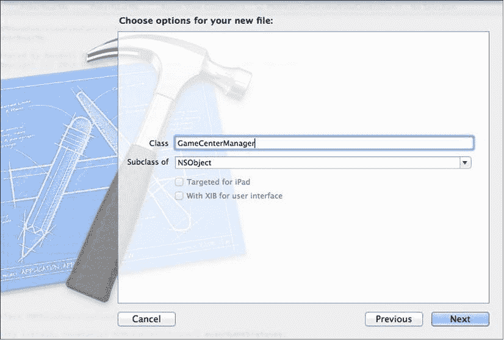
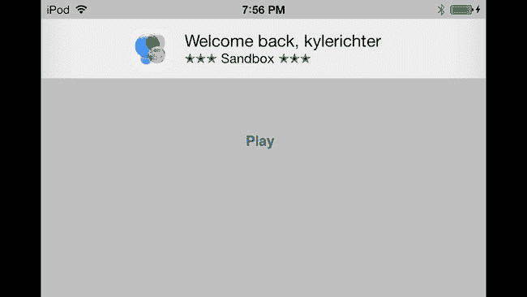

# 2. Game Center：设置与入门

摘要  
与苹果的许多集成技术（iCloud、推送通知、Passbook）类似，在使用 Game Center 之前，需要先完成一些标准的准备工作。Game Center 是一项庞大且多样化的技术，能够轻松为你的社交应用添加非常复杂的功能。完成这些基本步骤后，你就可以放心地跳转到任何 Game Center 章节，实现特定于你应用的功能。

与苹果的许多集成技术（iCloud、推送通知、Passbook）类似，在使用 Game Center 之前，需要先完成一些标准的准备工作。Game Center 是一项庞大且多样化的技术，能够轻松为你的社交应用添加非常复杂的功能。完成这些基本步骤后，你就可以放心地跳转到任何 Game Center 章节，实现特定于你应用的功能。

在第 1 章中，你学习了如何在 iTunes Connect 中配置 Game Center，并开始使用示例项目 UFOs。在本章中，我们将讨论如何将 Game Center 集成到我们的应用中，并深入编写一些 Game Center 专属代码。

你将学习如何检测 Game Center 兼容性，探索沙盒的限制，验证本地玩家身份，处理会话，以及获取好友列表。你还将创建 `GameCenterManager` 类，在后续的 Game Kit 章节中我们将一直使用这个类。

## 测试 Game Center

在调用任何 Game Center 专属代码之前，我们需要进行一项测试，以验证用户使用的 iOS 版本是否支持 Game Center。执行此项检查的第一步是创建新的 `GameCenterManager` 类。在本书的剩余部分，我们将使用这个类来将 Game Center 功能集中在一个易于访问的类中。这个类将包含所有 Game Center 专属代码和回调，并且可以轻松地在你的所有应用中共享。大多数现代应用的目标系统是 iOS 5 及以上版本，因此无需进行 Game Center 检查；但如果你的应用仍针对 iOS 4，则应验证 Game Center 是否已安装。

首先，在 Xcode 中创建一个新文件。你需要从可用模板中选择 **Objective-C class**。确保从 **Subclass Of** 下拉菜单中选择 `NSObject`。将新类命名为 `GameCenterManager`，如图 2-1 所示。



图 2-1. 创建 `GameCenterManager` 类

向你的 `GameCenterManager` 类中添加以下方法：

```
+ (BOOL) isGameCenterAvailable

{

        Class gcClass = (NSClassFromString(@"GKLocalPlayer"));

        NSString *reqSysVer = @"4.1";

        NSString *currSysVer = [[UIDevice currentDevice] systemVersion];

BOOL osVersionSupported = ([currSysVer compare:reqSysVer options:NSNumericSearch] != NSOrderedAscending);

        return (gcClass && osVersionSupported);

}
```

此方法使用 `NSClassFromString` 函数创建一个新的类对象。如果 API 中存在 `GKLocalPlayer`，则 `gcClass` 不会为 nil。我们还针对最低操作系统版本进行了测试。由于许多 Game Center 类在功能可用之前就已包含在 API 中，因此我们需要执行两项检查。接下来的三行代码将当前 iOS 版本与我们设置为 4.1 的版本字符串进行比较。该方法返回结果，如果设备已准备好支持 Game Center，则结果为 true。

注意  
无论用户是否拥有支持 Game Center 的设备，你始终应尽一切努力让用户能够与你的应用交互。如果用户没有支持 Game Center 的设备，你仍需确保他们能够使用你应用中非社交功能的部分。

提示  
如果你确实希望将应用限制为仅支持支持 Game Center 设备的用户使用，请在 `info.plist` 文件中添加一个名为 `UIRequiredDeviceCapabilities` 的新键。然后，将该键的值设置为 `"gamekit"`。这将使你的应用在 App Store 中仅限拥有支持 Game Center 设备的用户购买。

现在，你可以修改 `UFOViewController.m` 文件，以执行 Game Center 可用性检查。创建一个新的 `viewDidLoad` 方法，如以下代码片段所示：

```
- (void)viewDidLoad

{

        [super viewDidLoad];

        if ([GameCenterManager isGameCenterAvailable]) {

                NSLog(@"Game Center is available");

        } else {

                NSLog(@"Game Center not available");

        }

}
```

注意  
如果你发现即使 Game Center 应可用，`isGameCenterAvailable` 方法也总是返回 NO，那么最常见的原因是在你的目标设置中忘记包含 `GameKit.framework`。

目前，所有代码所做的只是在控制台输出 Game Center 是否可用。我们将在下一节中扩展此代码。


## 使用 Game Center 进行身份验证

当你的应用确认设备支持 Game Center 后，即可对用户进行身份验证。通过 Game Center 完成身份验证的用户始终被称为本地玩家，并由 `GKLocalPlayer` 类表示。在使用任何其他 Game Center 功能之前，你必须首先验证本地玩家的身份。

Apple 建议你在应用中尽早进行 Game Center 身份验证。在用户需要访问任何 Game Center 行为之前完成身份验证的主要原因是，确保用户在他们想要执行 Game Center 操作时，无需等待网络回调来完成身份验证。此外，如果你正在处理 Game Center 邀请，则需要在处理启动事件之前完成身份验证。尽早进行身份验证还能确保用户在游戏过程中不会被要求登录。在后续章节中，我们还将探讨其他好处，例如能够重新提交之前提交失败的高分。

### 修改 GameCenterManager 类

在添加用于 Game Center 身份验证的代码之前，我们首先需要设置一些前置调用，以便开始使用 `GameCenterManager` 类。`GameCenterManager` 将是一个可复用的类，它为与 Game Center 交互添加了大量便捷方法；它的设计使其可以轻松地集成到任何未来的项目中。所有与 Game Center 相关的代码都将通过 `GameCenterManager` 类路由，这使得在整个应用中轻松使用它成为可能。设置这个可复用类的第一步是创建委托回调系统。

**注意**

如果你之前没有接触过代码块（Blocks），它们可能会让你感到有些困惑。Game Center 高度依赖代码块，你将在本书中大量看到它们的使用。

根据我的经验，理解代码块的最佳方式是将它们视为内联函数，这些函数在调用它们的方法执行完成后被触发。在前面的示例中，当 `authenticateWithCompletionHandler` 执行完毕后，它会调用

`[self callDelegateOnMainThread: @selector(processGameCenterAuth:) withArg: NULL error: error]`

在继续之前，对代码块有扎实的掌握会很有帮助。如果你对代码块的使用感到不确定，我建议你阅读 Apple Developer Connection 上位于 [`developer.apple.com/library/mac/#documentation/Cocoa/Conceptual/Blocks/Articles/bxUsing.html`](http://developer.apple.com/library/mac/#documentation/Cocoa/Conceptual/Blocks/Articles/bxUsing.html) 的文章。

你需要将以下方法添加到 `GameKitManager.m` 中。添加完成后，我们将讨论它们的确切功能。

```
- (void) callDelegateOnMainThread: (SEL) selector withArg: (id) arg error: (NSError*) err
{
    dispatch_async(dispatch_get_main_queue(), ^(void) {
        [self callDelegate: selector withArg: arg error: err];
    });
}
```

我们所有的委托回调都必须在主线程上执行；Game Center 并不保证回调代码块会在主线程上执行，如果不强制在主线程上运行，它们可能会在后台线程上执行。由于 UIKit 视图控制器只能在主线程上安全访问，因此在后台线程上调用委托可能会导致崩溃和其他意外行为。为了避免产生任何与线程相关的错误（这些错误可能非常难以追踪和修复），我们将在主线程上调用所有委托方法。

**注意**

有许多不同的方法可以强制代码在主线程上执行或以其他方式确保线程安全。出于我们的目的，我们将使用上述方法。这对于 iOS 平台上线程经验较少的读者来说最容易理解。

下面的方法在确保我们在主应用线程上操作后，从 `callDelegateOnMainThread` 方法内部调用。此方法检查以确保我们在主线程上，然后使用传递的信息调用我们的协议方法。

```
- (void)callDelegate:(SEL)selector withArg:(id)arg error:(NSError*)err
{
    assert([NSThread isMainThread]);
    if ([delegate respondsToSelector: selector]) {
        if (arg != NULL) {
            [delegate performSelector: selector withObject:arg withObject: err];
        } else {
            [delegate performSelector: selector withObject: err];
        }
    } else {
        NSLog(@"Missed Method");
    }
}
```

如果你没有实现委托方法，你将在控制台中看到一条 "Missed Method" 的 `NSLog` 消息。这仅仅是为了协助调试而提供的，可以为你节省一些在调试协议方法时绞尽脑汁的时间。

在 `GameCenterManager` 类中我们需要做的最后一件事情是添加委托属性。修改头文件的相关部分，使其看起来像以下代码：

```
@interface GameCenterManager : NSObject <GameCenterManagerDelegate>
@property(nonatomic, retain) id <GameCenterManagerDelegate, NSObject> delegate;
```

除了这些修改之外，你还需要合成委托，并在 `deallocation` 中释放它。`GameCenterManager` 委托将由调用 Game Center 函数的类来设置，以便获取关于这些调用的反馈。这样就完成了对 `GameCenterManager` 类所需的修改。


#### 在 iOS 6 和 iOS 7 上进行身份验证

iOS 6 引入了一种新的身份验证方法，简化了登录 Game Center 的流程。如果你的应用使用 iOS 6 或更高版本，以下方法更为高效；不过，如果你需要在 iOS 5 甚至 iOS 4 设备上进行身份验证，请参阅下一节“在 iOS 6 之前进行身份验证”。请查看以下完整的方法：

```
- (void)authenticateLocalUserModern
{
  if ([[GKLocalPlayer localPlayer] authenticateHandler] == nil) {
    [[GKLocalPlayer localPlayer] setAuthenticateHandler:^(UIViewController *viewController, NSError *error) {
      if (error != nil) {
        if ([error code] == GKErrorNotSupported) {
          UIAlertView *alert = [[UIAlertView alloc] initWithTitle:@"错误" message:@"此设备不支持 Game Center" delegate:nil cancelButtonTitle:@"关闭" otherButtonTitles:nil];
          [alert show];
          [alert release];
        } else if ([error code] == GKErrorCancelled) {
          UIAlertView *alert = [[UIAlertView alloc] initWithTitle:@"错误" message:@"此设备已因该应用登录失败次数过多，你需要从 Game Center.app 登录" delegate:nil cancelButtonTitle:@"关闭" otherButtonTitles:nil];
          [alert show];
          [alert release];
        } else {
          UIAlertView *alert = [[UIAlertView alloc] initWithTitle:@"错误" message:[error localizedDescription] delegate:nil cancelButtonTitle:@"关闭" otherButtonTitles:nil];
          [alert show];
          [alert release];
        }
      } else {
        if (viewController != nil) {
          [(UIViewController *)delegate presentViewController:viewController animated:YES completion:NULL];
        }
      }
    }];
  } else {
    [[GKLocalPlayer localPlayer] authenticate];
  }
}
```

iOS 6 为 `GKLocalPlayer` 引入了一个新属性 `authenticateHandler`。本质上，这是一个用于监控登录错误的块，在某些情况下会向用户显示一个 `UIViewController`。第一步是确保我们之前没有设置过 `authenticateHandler`。如果设置过，调用 `authenticate` 即可完成登录，如方法底部的 `else` 语句所示。在确定 `authenticateHandler` 尚未设置后，会为 `GKLocalPlayer` 单例设置一个。设置 `authenticateHandler` 的操作也会提示用户登录 Game Center。

接下来的三个 `if` 语句（分别处理 `GKErrorNotSupported`、`GKErrorCancelled` 以及其他所有错误）均用于处理身份验证过程中可能遇到的各种错误类型。第一个处理的错误是该用户设备因任何原因不支持 Game Center。下一个 `if` 语句处理登录失败次数过多的棘手情况。用户很少遇到此问题，但开发者经常遇到。最后一个错误检查处理所有其他错误并向用户显示。

如果未遇到任何错误，则表明 Game Center 已成功进行身份验证。然而，如果 Game Center 返回了一个 `UIViewController`，则需要将其展示给用户；这可以通过使用新的 iOS 6 方法 `presentViewController:` 来处理。这是在 iOS 6 上完成 Game Center 登录所需的全部步骤。有关 iOS 6 之前版本的身份验证信息，请参阅下一节。

**提示：** 不要忘记导入 `<GameKit/GameKit.h>` 头文件和相关的 Game Kit 框架，否则 `GKLocalPlayer` 将未定义。

#### 在 iOS 6 之前进行身份验证

如果你的应用支持 iOS 6 之前的 iOS 版本，则需要使用较旧的身份验证方式，本节将对此进行描述。处理身份验证需要在 `GameCenterManager` 类中添加代码。定义一个协议，并将以下代码块添加到 `GameCenterManager.h` 中 `@interface` 行的上方。这将创建一个新的可选委托回调方法，名为 `processGameCenterAuthentication`。

```
@protocol GameCenterManagerDelegate <NSObject>

@optional
- (void)processGameCenterAuthentication:(NSError*)error;

@end
```

需要在 `GameCenterManager` 的实现中添加一个新方法。创建一个包含以下代码的新方法：

```
- (void)authenticateLocalUser
{
  if ([GKLocalPlayer localPlayer].authenticated) {
    return;
  }

  [[GKLocalPlayer localPlayer] authenticateWithCompletionHandler:^(NSError *error) {
    [self callDelegateOnMainThread: @selector(processGameCenterAuthentication:) withArg:NULL error:error];
  }];
}
```

该方法将作为与 Game Center 进行身份验证的辅助工具。第一行代码检查 `localPlayer` 单例，以确认用户是否已通过身份验证。如果是，则方法结束。如果用户尚未通过身份验证，则调用 `authenticateWithCompletionHandler` 方法。

当 `authenticateWithCompletionHandler` 执行完毕后，我们调用 `[self callDelegateOnMainThread: @selector(processGameCenterAuthentication:) withArg: NULL error: error]`。为了继续执行，我们必须实现此方法。

**提示：** 如果你收到警告，提示 `GameCenterManager` 可能不会响应我们已实现的任何方法，请确保已将相关方法添加到了接口文件中。


### 从 UFOViewController 进行身份验证

现在我们已经修改了 `GameCenterManager` 类以支持身份验证，我们需要在 `UFOViewController` 类中创建一个新对象来表示 `GameCenterManager`。

导入 `GameCenterManager` 的头文件，并创建一个名为 `gcManager` 的新 `GameCenterManager` 对象。你还需要将 `GameCenterManagerDelegate` 添加到 `UFOViewController.h` 的接口中。完成后，`UFOViewController.h` 应如下所示：

```
#import <UIKit/UIKit.h>
#import "GameCenterManager.h"
@interface UFOViewController : UIViewController <GameCenterManagerDelegate>
@property (nonatomic, strong) GameCenterManager *gcManager;
-(IBAction)playButtonPressed;
@end
```

你将再次修改 `UFOViewController` 的 `viewDidLoad` 方法。对 `viewDidLoad` 方法进行必要的修改，使其与以下代码片段匹配：

```
- (void)viewDidLoad
{
  [super viewDidLoad];
  if (![GameCenterManager isGameCenterAvailable]) {
    return;
  }
  GameCenterManager  *manager = [[GameCenterManager alloc] init];
  [manager setDelegate:self];
  [manager authenticateLocalUser];
  [self setGcManager:manager];
}
```

我们添加的第一行新代码初始化并分配了一个 `GameCenterManager` 的实例。下一行将代理的 `self` 设置为 `UFOViewController` 类；这将使我们能够从 `GameCenterManager` 获取回调。

完成这两步后，我们就可以调用便捷方法 `authenticateLocalUser`。此时，Game Center 会处理所需的登录视图、身份验证以及任何账户创建。然而，我们确实需要关注代理方法 `processGameCenterAuthentication`，以便捕获在身份验证过程中遇到的任何错误。

如果你使用 iOS 6 及更新版本的身份验证方法，则无需实现代理回调，只需将前面代码片段中的 `[gcManager authenticateLocalUser];` 替换为 `[gcManager authenticateLocalUserModern];` 即可。

**注意**  
如果你在某个应用内取消 Game Center 登录三次或更多次，你将无法再次从该应用登录，除非你前往 `GameCenter.app` 并登录。这是未记录的行为，如果你不知道自己在寻找什么，追踪起来会非常麻烦。此外，如果你发现即使从 `GameCenter.app` 也无法登录，可以重置模拟器或恢复设备来解决这些问题。

如果你尝试再次运行该应用，你会在控制台日志中看到“Missed Method”。这是因为我们尚未添加在身份验证完成时调用的可选协议方法。我们需要在 `UFOViewController.m` 中添加以下方法：

```
- (void)processGameCenterAuthentication:(NSError*)error;
{
  if (error != nil) {
    NSLog(@"身份验证过程中发生错误: %@", [error localizedDescription]);
  } else {
    NSLog(@"身份验证成功");
  }
}
```

现在，当你登录时，你应该会在控制台看到“身份验证成功”的输出，以及图 2-2 所示的图像（其中会显示你的 Game Center 名称）。

**注意**  
在出于测试目的登录 Game Center 时，请始终创建一个新的 Apple ID。切勿使用现有的 Apple ID 从沙盒环境登录 Game Center。

  
**图 2-2.** 用户登录 Game Center 时将看到的标准“欢迎回来”信息

**提示**  
如果你在登录时遇到问题，请确保 `info.plist` 中的 bundle ID 与 iTunes Connect 中启用了 Game Center 的 bundle ID 相匹配。有关在 iTunes Connect 中配置 Game Center 的更多信息，请参阅第 1 章。

### 沙盒

为了帮助你在应用上线前进行测试，Apple 为 Game Center 提供了沙盒环境。沙盒的功能与生产版本的 Game Center 完全相同，同时将所有活动对非沙盒用户隐藏。

沙盒允许开发者秘密开发新的 Game Center 功能，并且避免测试数据污染排行榜和成就系统。登录沙盒环境时，登录提示的顶部会显示“\*\*\* 沙盒 \*\*\*”。

登录后，无法在应用内确定当前是否已登录到沙盒。但是，如果你打开 `GameCenter.app`，你将看到自己是否处于沙盒环境中。表 2-1 中的信息将帮助你确定当前运行的模式。

**表 2-1.** 确定各种类型构建的沙盒状态

| 构建类型 | 沙盒状态 |
| --- | --- |
| iOS 设备模拟器 | 仅沙盒环境 |
| 开发者预置描述文件构建 | 仅沙盒环境 |
| Ad-Hoc 分发构建 | 仅沙盒环境 |
| 签名分发构建 | 仅生产环境 |

**提示**  
Apple 最近还提供了在 iTunes Connect 中清除所有用户的排行榜和成就进度的选项。建议在发布启用 Game Center 的应用之前进行重置。

### 监控状态变化

从 iOS 4.0 开始，iOS 设备获得了同时运行多个应用的能力。这在处理状态时可能会产生一些复杂的行为错误，尤其是当用户同时访问两个不同的启用 Game Center 的应用时。例如，当你的应用在后台运行时，用户可能会退出 Game Center，甚至以其他用户身份登录。因此，通过 `NSNotification` 系统监听本地用户的变化至关重要。

如果你使用的是本章前面详述的 iOS 6 `authenticateHandler` 方法，那么监听和响应身份验证事件的状态变化是可选的，并且 `authenticateHandler` 会为你处理所有繁重的工作。如果你的应用需要以其他方式使用这些数据，你仍然可以监控状态变化。

在 `UFOViewController.m` 的 `viewDidLoad` 方法中，在验证 Game Center 是否可用的测试之后，立即添加以下代码片段。

```
[[NSNotificationCenter defaultCenter]
                             addObserver:self
                                selector:@selector(localUserAuthenticationChanged:)
                                    name:GKPlayerAuthenticationDidChangeNotificationName
                                  object:nil];
```

**注意**  
不要忘记在 `viewDidUnload` 中移除 `NSNotification` 观察者，否则你可能会遇到崩溃或其他意外行为。

你还应该在 `UFOViewController` 中添加一个新方法。每当玩家身份验证状态发生变化时，都会调用此方法。

```
-(void)localUserAuthenticationChanged:(NSNotification *)notif;
{
        NSLog(@"身份验证已更改: %@", notif.object);
}
```

当身份验证发生变化时，此新方法将打印新 `GKLocalPlayer` 的描述。你需要确定在应用中需要采取哪些特殊步骤来处理本地玩家的变化。

**提示**  
在发布应用之前，不要忘记测试用户切换，因为 Apple 会在审核阶段进行测试。


## 使用 GKLocalPlayer

`GKLocalPlayer` 对象会一直存在，且在通过 Game Center 认证后不会为空；该对象代表当前用户。你永远不会直接创建 `GKLocalPlayer` 的实例，而是通过类方法 `localPlayer` 来处理。`localPlayer` 单例是与 `GKLocalPlayer` 交互的唯一方式。

`GKLocalPlayer` 对象有三个相关属性：`authenticated`、`friends` 和 `underage`。我们将在下一节处理 `friends` 属性。在前面的认证代码中，我们已经处理过布尔值型的 `authenticated` 属性。

`underage` 属性用于限制 Game Center 应用中的内容仅供 17 岁以上用户访问。以下代码执行未成年人检查：

```
if ([GKLocalPlayer localPlayer].underage)
{
    NSLog(@"用户未满 18 岁");
}
```

在完成获取用户好友列表的步骤之前，`friends` 属性将返回 nil。完成该步骤后，`friends` 属性将返回一个包含本地用户好友的数组。具体流程将在下一节详细说明。

### 获取好友列表

好友列表是一个用户 ID 数组，这些用户是你通过 `Game Center.app` 设为好友的人。有了这些数据，你可以实现诸多功能，例如在游戏语音频道中仅创建好友列表，或在全局排行榜中高亮显示好友的分数。

我们将在示例项目中添加一个调用来获取好友列表，但本章不会对这些数据进行具体处理。目前，我们只需将信息打印到控制台即可。

首先，修改 `GameCenterManager` 类，添加一个获取本地玩家好友列表的新方法。在实现文件中添加以下方法：

```
- (void)retrieveFriendsList;
{
    if ([GKLocalPlayer localPlayer].authenticated == YES) {
        [[GKLocalPlayer localPlayer] loadFriendsWithCompletionHandler:^(NSArray *friends, NSError *error) {
            [self callDelegateOnMainThread: @selector(friendsFinishedLoading:error:) withArg:friends error:error];
        }];
    } else {
        NSLog(@"必须先完成认证");
    }
}
```

此方法与本章前面添加的 `authentication` 方法非常相似。确定 `GKLocalPlayer` 已认证后，我们可以调用 `loadFriendsWithCompletionHandler`。该方法返回一个玩家 ID 数组。我们将在下一节学习如何使用这些玩家 ID 获取 `GKPlayer` 对象。接着，我们使用线程安全的 `callDelegateOnMainThread` 方法将数据返回给委托。

在运行此代码前，仍需修改头文件并为委托添加新的协议方法。将头文件修改为以下代码片段：

```
@protocol GameCenterManagerDelegate <NSObject>
@optional
- (void)processGameCenterAuthentication:(NSError*)error;
- (void)friendsFinishedLoading:(NSArray *)friends error:(NSError *)error;
@end

@interface GameCenterManager : NSObject <GameCenterManagerDelegate>
@property(nonatomic, retain) id <GameCenterManagerDelegate, NSObject> delegate;
+ (BOOL)isGameCenterAvailable;
- (void)authenticateLocalUser;
- (void)callDelegateOnMainThread:(SEL)selector withArg:(id) arg error:(NSError*) err;
- (void)callDelegate:(SEL)selector withArg:(id)arg error:(NSError*) err;
- (void)retrieveFriendsList;
@end
```

这里所做的修改是添加了一个新的可选协议，该协议将在 `friends` 代码块执行完成后被调用。我们将返回一个好友 ID 数组以及遇到的任何错误。同时，我们还会向类方法中添加一个名为 `retrieveFriendsList` 的新方法。

在运行应用前，最后需要做的事情是在 `UFOViewController.m` 中添加对 `retrieveFriendsList` 的调用以及协议方法。由于必须成功认证 Game Center 后才能调用获取好友列表的方法，我们可以在认证回调中添加该调用。将方法修改为以下代码片段：

```
- (void)processGameCenterAuthentication:(NSError*)error;
{
    if (error != nil) {
        NSLog(@"认证时发生错误：%@", [error localizedDescription]);
    } else {
        [gcManager retrieveFriendsList];
    }
}
```

我们还需要添加一个协议方法，用于将好友列表打印到控制台。在 `UFOViewController.m` 中添加以下方法：

```
- (void)friendsFinishedLoading:(NSArray *)friends error:(NSError *)error;
{
    if (error != nil) {
        NSLog(@"请求好友列表时发生错误：%@", [error localizedDescription]);
    } else {
        NSLog(@"好友列表：%@", friends);
    }
}
```

如果你的好友列表中有任何好友，你应该会看到类似下面的输出：

```
2011-02–01 12:56:32.759 UFOs[3328:207] 好友列表：(
    "G:1093075676"
)
```

**注意：** 如果你尚未向沙盒环境添加任何好友，现在是添加的好时机。你可以在 `Game Center.app` 中创建新账户，并将它们添加为测试账户的好友。拥有一个非空的好友列表，对于本书的 Game Center 相关章节以及调试 Game Center 特定代码都很有价值。

下一节将介绍如何处理从好友列表中获取的玩家数据。

### 好友列表头像

从 iOS 5.0 开始，Apple 增加了对好友头像的支持。玩家可以选择在 Game Center 应用中设置自己的头像。如果玩家尚未设置头像，Game Center 会为其分配一个默认头像。要在你的应用中访问头像，你需要运行 iOS 5.0 或更高版本，并且需要实现一个新方法。以下方法在现有的 `GKPlayer` 对象上调用（关于 `GKPlayer` 的更多信息，请参阅上一节）。头像图片大小有两种选项：`GKPhotoSizeNormal` 和 `GKPhotoSizeSmall`。

```
[player loadPhotoForSize:GKPhotoSizeNormal withCompletionHandler: ^(UIImage *photo, NSError *error) {
    if (error == nil) {
        [playerAvatarImageView setImage:photo];
    } else {
        NSLog(@"加载玩家头像时发生错误：%@", [error localizedDescription]);
    }
}];
```


## 与玩家协作

`Game Center`本质上是一种社交服务，因此其核心围绕玩家展开。你需要了解与`GKPlayer`对象相关的三个属性。`isFriend`属性是一个布尔值，用于返回该玩家是否为当前本地玩家的好友。另外两个属性分别处理玩家的名称和别名。`playerID`属性是静态的，始终指向同一个玩家。`playerID`字符串绝不应在你的应用中向用户显示。而`alias`属性是动态的，用户可随时更改。它绝不可用于验证用户身份，但应作为唯一用于向应用用户标识该玩家的字符串。

> **警告**
> 请勿对玩家标识符字符串的结构做任何假设。其格式和长度可能随时变更。

之前检索好友列表时，我们返回的并非`GKPlayers`数组，而是他们的 ID 数组。这是 Game Center 的常见行为。为方便处理玩家数据，我们将添加两个便捷方法，用于将玩家 ID 转换为`GKPlayer`对象。

我们需要创建两个新方法：一个用于处理玩家 ID 数组，另一个用于处理单个玩家 ID。这将为后续工作省去额外步骤。我们将这些辅助方法添加到`GameCenterManager`类中。首先，新增协议方法，并修改`GameCenterManager.h`文件的相关部分，使其与以下代码一致：

```
@protocol GameCenterManagerDelegate <NSObject>

@optional

- (void)processGameCenterAuthentication:(NSError*)error;

- (void)friendsFinishedLoading:(NSArray *)friends error:(NSError *)error;

- (void)playerDataLoaded:(NSArray *)players error:(NSError *)error;

@end
```

我们还将向`GameCenterManager`类的实现文件添加以下两个新方法：

```
- (void)playersForIDs:(NSArray *)playerIDs

{

[GKPlayer loadPlayersForIdentifiers:playerIDs withCompletionHandler:^(NSArray *players, NSError *error) {

[self callDelegateOnMainThread: @selector(playerDataLoaded:error:) withArg: players error: error];

}];

}

- (void)playerforID:(NSString *)playerID

{

[GKPlayer loadPlayersForIdentifiers:[NSArray arrayWithObject:playerID] withCompletionHandler:^(NSArray *players, NSError *error) {

[self callDelegateOnMainThread: @selector(playerDataLoaded:error:) withArg:players error:error];

}];

}
```

这两个方法都将使用`loadPlayersForIdentifiers`。唯一的区别在于，一个方法接收字符串并将其转换为单元素数组，另一个则直接接收数组。同样，我们将使用线程安全的委托回调。

最后一步是在`UFOViewController`中实现委托回调。首先修改好友加载方法，将好友列表转换为`GKPlayer`对象数组。请将`friendsFinishedLoading`方法修改为如下代码：

```
- (void)friendsFinishedLoading:(NSArray *)friends error:(NSError *)error;

{

if (error != nil) {

NSLog(@"An error occured during friends list request: %@", [error localizedDescription]);

} else {

[gcManager playersForIDs: friends];

}

}
```

还需添加我们刚刚定义的新协议方法。请在`UFOViewController.m`文件中添加以下代码：

```
- (void)playerDataLoaded:(NSArray *)players error:(NSError *)error;

{

if (error != nil) {

NSLog(@"An error occured during player lookup: %@", [error localizedDescription]);

} else {

NSLog(@"Players loaded: %@", players);

}

}
```

现在运行应用（假设你的 Game Center 账户已关联好友），它将拉取好友的玩家 ID 列表，执行查找后将`GKPlayer`描述信息输出到控制台。输出内容应与以下示例类似：

```
2011-02–01 14:20:23.335 UFOs[4038:207] Authentication Changed: <GKPlayer
0x5f46fb0>(playerID: G:1092793231, alias: the_other_kyle, status: (null), rid:(null))
2011-02–01 14:20:23.471 UFOs[4038:207] Players loaded: (
"<GKPlayer 0x6a201e0>(playerID: G:1093075676, alias: johncash, status: (null),
rid:(null))"
)
```

## 本章小结

在本章中，你学习了如何检测 Game Center 兼容性以及为 iOS 6/7 及更早版本认证本地用户。现在你应该深刻理解如何使用`GameCenterManager`类，以及它对于创建整洁、易于在多个项目中复用的代码环境的优势。

此外，你现在应能熟练使用`GKLocalPlayer`、`GKPlayer`和好友列表。下一章我们将深入探讨排行榜，并扩展本章所学的主题。如果你对本章讨论的任何内容有疑问，请记住，可获取的源代码（`www.apress.com`）包含了所有主题的工作示例。

