# 3. 排行榜

> **摘要**
> 古之所谓善战者，胜于易胜者也。
>
> ——[孙子](http://www.goodreads.com/author/show/1771.Sun_Tzu)，[《孙子兵法》](http://www.goodreads.com/work/quotes/3200649)

排行榜的历史比电子游戏本身还要久远。正如我们所知，排行榜的起源可追溯到 20 世纪 50 年代的原始弹球机时代。弹球机制造商很快意识到，增加高分榜能提升竞争性，这意味着玩家游玩时间更长，收益也更多。

20 世纪 70 年代，随着电子游戏开始兴起，排行榜迅速被这些新游戏采用，最早可追溯到 1976 年发布的游戏《Sea Wolf》（见图 3-1）。自此以后，排行榜成为游戏文化不可或缺的一部分。排行榜变得如此普及，以至于 2007 年上映了全长纪录片《金刚之王》，记录了围绕任天堂《大金刚》高分榜的激烈竞争。如今排行榜已成为主流，不仅为玩家所期待，更是任何电子游戏的标配。

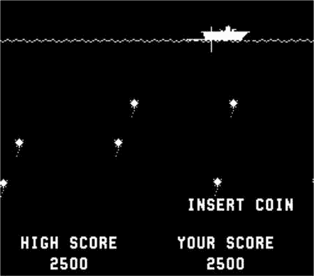

**图 3-1.** 《Sea Wolf》（1976 年），首款包含高分功能的电子游戏

iOS 的 Game Center 极大简化了在应用中添加排行榜的流程。考虑到此前开发者需要编写并维护服务器来存储和更新分数数据，这无疑是一个巨大的进步。本章将探讨在 Game Center 下实现多个排行榜所需的步骤，以及所有必要的排行榜支持。你将学习如何提交分数、检索排行榜、自定义排行榜图形用户界面（GUI），以及处理创建适合你应用的排行榜所需的所有事项。

## 为何需要排行榜？

在正式开始处理排行榜之前，理解为什么排行榜是你社交应用或游戏不可或缺的一部分至关重要。

- 排行榜能在应用或游戏中营造社区感，否则你的用户可能无法直接与其他用户互动。
- 排行榜能驱动用户返回你的应用，以超越自己的分数或朋友的高分。
- 排行榜能在应用中创造目标感和成就感。
- 排行榜使用户更易与朋友、家人和同事分享应用体验和进度。
- Game Center 的排行榜易于实现，能快速让你的应用显得更精致、更完整。
- 随着 iOS 6 中排行榜挑战功能的加入，玩家的朋友可能通过分数挑战促使他们重返你的游戏。


## Game Center 排行榜概述

在 Game Center 中，排行榜是与特定排行榜标识符相关的 `GKScore` 对象数组，每个应用可以包含多个排行榜。排行榜可以根据好友状态和提交日期进行检索和进一步筛选。

`GKScore` 对象代表特定排行榜上的每条记录。每个 `GKScore` 始终关联一个玩家 ID。当 Game Center API 向排行榜提交新的 `GKScore` 时，玩家 ID 由 API 自动设置，且无法更改。日期和排名等值也会自动设置并更新。你只需设置原始分数值和该分数所属的排行榜类别。

有两种方法可以检索和显示排行榜。最常见且最简单的方法是使用苹果的排行榜图形用户界面（GUI）。这将是我们在接下来几节中首先探讨的方法。第二种方法是检索原始的 `GKScore` 值，并在你自己的 GUI 中显示它们；本章稍后将讨论这种方法。

> **注意：** 随着 iOS 7 的推出，Game Center 目前对每个捆绑包 ID 的排行榜数量限制为 100 个。iOS 6 及更早版本的排行榜限制为 25 个。

### 使用苹果排行榜 GUI 相比自定义 GUI 的优势

使用苹果排行榜 GUI 的优势包括：

- 其设计出自世界顶级设计师之手。
- 实现和展示排行榜非常简单。
- 用户会看到他们熟悉且知道如何操作的界面。

使用自定义 GUI 的优势包括：

- 你的排行榜可以与应用的自定义设计相匹配。
- 你对最终数据有更多自由，并可以使用附加条件进行筛选。
- 你可以实现自己的自定义缓存行为。

如你所见，每种系统都有其优缺点，至于应该使用哪种系统，并没有唯一的正确答案。到本章结束时，你将充分了解这两种选项，并能够根据应用的具体需求，正确决定应采用哪种方法。

## 在 iTunes Connect 中配置排行榜

在开始处理排行榜的代码部分之前，你必须先在 iTunes Connect 中设置一个新的排行榜。登录 iTunes Connect（[`itunesconnect.apple.com`](http://itunesconnect.apple.com/)），然后选择我们在第 1 章和第 2 章中一直在处理的应用。从控制面板中选择应用后，进入“管理 Game Center”区域。

你的应用的 Game Center 门户将有一个名为“排行榜”的部分。如果这是你为此应用设置的第一个排行榜，你将看到一个标有“设置”的按钮。如果你已经有排行榜，这里的步骤会有所不同，将在本节后面介绍。

进入“排行榜”部分（如图 3-2 所示），选择网页左上角的“添加排行榜”按钮。系统会提示你选择单个排行榜或组合排行榜。单个排行榜是一组存储的分数对象集合，可以独立于其他排行榜进行查询。组合排行榜也可以独立于其他排行榜进行访问；它是多个单个排行榜的集合，一起显示。组合排行榜对于显示诸如所有关卡的历史最高分或类似的组合数据非常有用。

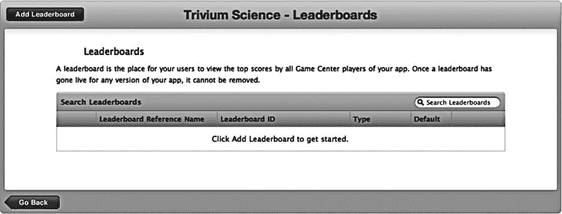

*图 3-2. 在 iTunes Connect 中添加新排行榜*

我们从创建一个新的单个排行榜开始，如图 3-3 所示。首先需要输入的是排行榜引用名称。此值仅用作 iTunes Connect 中的参考。引用名称旨在帮助你快速在 iTunes Connect 中找到排行榜；用户永远不会看到它。对于本例，你可以使用引用名称“Leaderboard Foo”。

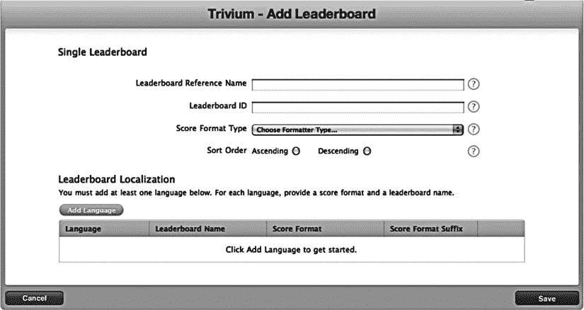

*图 3-3. 在 iTunes Connect 中创建新的单个排行榜*

下一个字段是排行榜 ID，你将在代码中查询此值以检索特定的排行榜。苹果建议你为此字段使用反向 DNS 条目格式，例如 `com.company.appname.leaderboardname`。请在此处为你的应用填写相应的值；这些值具体是什么并不重要，但你在本章剩余部分需要记住它们。

创建新排行榜时，还需要选择分数格式类型。表 3-1 显示了可用的数据格式。选择符合你分数数据要求的分数格式。

*表 3-1. 在 iTunes Connect 中添加新排行榜的分数格式类型*

| 分数格式类型 | 示例输出 |
| --- | --- |
| 整数 | 12,345 |
| 定点数 - 保留 1 位小数 | 12,345.1 |
| 定点数 - 保留 2 位小数 | 12,345.12 |
| 定点数 - 保留 3 位小数 | 12,345.123 |
| 已用时间 - 精确到分钟 | 3:45 |
| 已用时间 - 精确到秒 | 3:45:55 |
| 已用时间 - 精确到百分之一秒 | 3:45:55.82 |
| 货币 - 整数 | $182,121 |
| 货币 - 保留 2 位小数 | $182,121.68 |

> **提示：** 如果提供的格式类型都不符合你的要求，请选择最接近的类型。在本章后面，你将了解如何通过检索原始分数值来自定义这些值。

你还需要选择排行榜是按升序还是降序排序。升序排序将首先显示最低分，例如高尔夫比赛或赛道圈速。降序排序将首先显示最高分，例如足球比赛或第一人称射击游戏中的典型得分。


### 创建单个排行榜并提交分数

创建新的单个排行榜时，最后需要完成的工作是输入本地化的分数信息，如图 3-4 所示。`iTunes Connect` 内置了针对 Game Center 的本地化支持；你需要为每个想要支持的语言创建新条目。

`名称`字段是排行榜在所选语言中的显示名称。`分数格式`字段取决于你在上一屏幕选择的分数格式类型。（有关货币格式的示例，请参见图 3-4。）你还需要提供`分数格式后缀`。当你获取格式化后的分数属性时，该字符串会附加到分数值的末尾。

> **警告**
> 
> 对于创建的每个排行榜，你都需要至少添加一种语言，否则该排行榜将被视为无效。

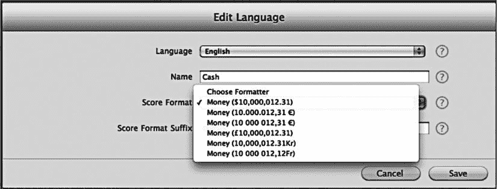

**图 3-4.** 编辑新排行榜的本地化信息

> **提示**
> 
> 如果你希望在格式化后的分数值中，分数与分数格式后缀之间显示一个空格，请不要忘记在分数后缀开头前添加一个空格。

现在，你已为应用配置了一个单个排行榜。为了启用组合排行榜，我们至少需要两个共享相同分数格式类型的排行榜。现在继续创建第二个单个排行榜。

一旦你拥有两个共享相同分数格式类型的排行榜，就可以创建一个组合排行榜。按照前面示例中描述的过程，遵循与创建单个排行榜相同的步骤。这个界面与创建单个排行榜的屏幕类似。主要区别在于，你需要选择要组合的排行榜，如图 3-5 所示。你需要创建一个新的排行榜 ID，并为新的组合排行榜指定本地化数据。

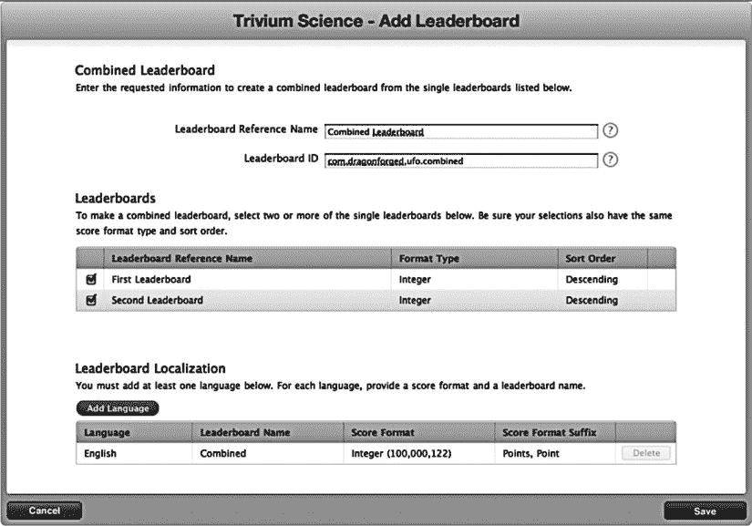

**图 3-5.** 创建组合排行榜

我们还将添加最后一个单个排行榜，以便我们使用一个未组合的单个排行榜，因为之前创建的两个排行榜现在已变成附属排行榜。你的排行榜面板现在应该包含四个排行榜：两个附属排行榜、一个组合排行榜和一个单个排行榜。既然我们有了多个有效的排行榜可以操作，就可以回到 Xcode，开始处理与排行榜相关的代码。

> **重要**
> 
> 一旦排行榜在上架的应用中上线，就永远无法删除，因此在发布应用之前，请务必仔细检查你的排行榜信息。

#### 提交分数

在排行榜提供任何实用功能之前，我们需要用一些分数数据来填充它。我们通过再次修改 `GameCenterManager` 类来开始这一过程。将以下方法添加到实现中；它应该看起来很熟悉，因为它遵循了我们在实现身份验证方法时使用的相同模式：

```
- (void) reportScore: (int64_t) score forCategory: (NSString*) category
{
        GKScore *scoreReporter = [[[GKScore alloc] initWithCategory:category] autorelease];
        scoreReporter.value = score;
        [scoreReporter reportScoreWithCompletionHandler: ^(NSError *error)
        {
                [self callDelegateOnMainThread:@selector(scoreReported:)
                                                       withArg:nil
                                                       error:error];
        }];
}
```

这个新方法接收一个 `int64` 类型的分数和一个 `NSString` 类型的类别。然后，它分配并初始化一个新的 `GKScore` 实例。我们需要在 `GKScore` 对象上设置的唯一属性是原始分数值。API 已经为我们设置了日期和用户值；当我们初始化 `GKScore` 对象时，我们使用一个类别参数进行初始化。我们将继续使用标准的回调块将结果传递给我们的委托。

我们还需要修改头文件，以纳入一个新的协议方法。修改 `GameCenterManager` 头文件中现有的协议声明区域，包含 `scoreReported` 方法，如下代码片段所示：

```
@protocol GameCenterManagerDelegate <NSObject>
@optional
- (void)processGameCenterAuthentication:(NSError*)error;
- (void)friendsFinishedLoading:(NSArray *)friends error:(NSError *)error;
- (void)playerDataLoaded:(NSArray *)players error:(NSError *)error;
- (void)scoreReported: (NSError*) error;
@end
```

至此，我们暂时完成了对 `GameCenterManager` 类所需的所有修改。现在，我们可以将注意力转回到游戏本身。我们首先需要实现一些新的游戏机制来处理高分。

#### 设置默认排行榜

自 iOS 5 的 Game Center 开始，你可以为本地用户设置一个默认的 Game Center 排行榜。如果你设置了默认排行榜，则在提交时可以为排行榜省略设置一个类别，系统会自动使用正确的默认排行榜。以下方法接收一个 `NSString` 标识符作为参数，用于指定你想要设置为本地玩家默认排行榜的排行榜：

```
[GKLeaderboard setDefaultLeaderboard:@"com.dragonforged.leaderboardToBeDefault"
  withCompletionHandler:^(NSError *error)
{
        NSLog(@"设置默认排行榜时发生错误：%@",
  [error localizedDescription]);
}];
```


## 为 UFO 游戏添加分数提交功能

在我们的 UFO 游戏中添加计分功能有两种显而易见的方法。首先，我们可以实现一个系统，统计被绑架的奶牛数量，并将该数字作为分数提交。虽然这种方法对我们来说最容易实现，但并不是一种很有趣的游戏玩法，因为游戏没有合乎逻辑的结束点。第二种高分方法实现起来更困难，但更有意义。它会记录玩家绑架十头奶牛所花的时间；用时最短的玩家获胜。

在开发自己的应用时，必须仔细考虑这些主题。就本书而言，我们将演示第一种方法，即被绑架的奶牛数量就是玩家的分数。如果你打算实现基于计时器的系统，方法会非常相似：在回合开始时启动计时器，当十头奶牛被绑架后，提交计时器上的秒数作为时间。

为了实现基于分数的系统，我们需要为玩家添加一种结束游戏的方式。在实际游戏中，这可以通过让某些东西能够杀死玩家或设置时间限制来实现。然而，就本示例而言，我们将简单地添加一个“退出”按钮。这将允许用户模拟游戏结束事件，同时使代码专注于 Game Center，而无需增加额外的游戏复杂性。

我们在 `UFOGameViewController.xib` 中添加一个“退出”按钮，如图 3-6 所示。我们还需要为这个按钮创建一个新的 `IBAction`。将以下代码添加到 `UFOGameViewController` 中，并将我们的“退出”按钮连接到它。目前，我们只需将导航控制器弹回根视图。

```
-(IBAction)exitAction:(id)sender;
{
  [[self navigationController] popViewControllerAnimated:YES];
}
```

> **注意：** 你不必等到游戏结束才提交新分数，但这通常被认为是一种良好实践。如果可能，应避免在单次游戏中多次提交新分数。
>
> 一个值得注意的例外可能是持续性的角色扮演游戏，其中分数持续更新，并且在游戏过程中没有合适的结束点来提交分数。

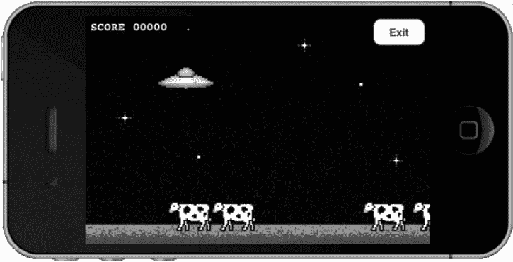

**图 3-6.** 添加退出游戏的功能，以便提交高分

我们还需要将 `GameCenterManager` 类的协议方法添加到 `UFOGameViewController` 中。将以下代码片段添加到 `UFOGameViewController.m` 中。

```
-(void)scoreReported: (NSError*) error;
{
  if (error)
  {
    NSLog(@"在报告分数时出现错误：%@",
          [error localizedDescription]);
  }
  else
  {
    NSLog(@"分数已提交");
  }
}
```

剩下的最后一步是将分数提交到 Game Center；如果你还记得，我们已经在 `GameCenterManager` 类中编写了处理方法。我们已经在 `UFOViewController` 中使用了一个 `GameCenterManager` 类的实例来认证用户。我们将保留一个指向先前类中已创建对象实例的指针。

为 `UFOGameViewController` 创建一个新属性，使其成为 `GameCenterManager` 的实例，并像先前类中那样将其命名为 `GCManager`。一旦该属性被合成，我们就可以从先前的类中连接到它。修改 `UFOViewController` 的 `playButtonPressed` 方法，使其与以下内容一致：

```
-(IBAction)playButtonPressed
{
  UFOGameViewController *gameViewController = [[UFOGameViewController alloc]init];
  gameViewController.gcManager = gcManager; // 更改后的代码
  [self.navigationController pushViewController: gameViewController animated:YES];
  [gameViewController release];
}
```

现在，我们的游戏控制器类引用了我们将在整个项目中使用的 `GameCenterManager`。我们还必须在 `UFOGameViewController` 的 `viewDidLoad` 方法中为 `gcManager` 设置一个新的委托。我们要确保 `UFOGameViewController` 将处理分数提交的回调。将以下方法添加到实现中：

```
- (void)scoreReported: (NSError*) error;
{
  if (error)
  {
    NSLog(@"在报告分数时出现错误：%@",
          [error localizedDescription]);
  }
  else
  {
    NSLog(@"分数已提交");
  }
  [[self navigationController] popViewControllerAnimated: YES];
}
```

我们还将修改 `exitAction` 方法，使其仅提交分数。为此，用以下内容替换旧的 `exitAction` 方法。请注意我们使用了在 iTunes Connect 中设置排行榜 ID；务必使用你输入的那个相同 ID，因为它很可能与此处使用的 ID 不匹配。

```
-(IBAction)exitAction:(id)sender;
{
  [self.gcManager reportScore:score forCategory:@"com.dragonforged.ufo.single"];
}
```

现在，当你运行游戏并点击“退出”时，你应该会看到一条类似以下输出的控制台消息：

```
2011-02-10 12:32:47.629 UFOs[15092:207] Score submitted
```

> **提示：** 请参阅本章末尾的“更好方法”一节，了解一种更复杂但对用户更友好的分数提交方法。

现在我们已经成功将分数提交到排行榜，在接下来的章节中，你将学习如何将这些数据呈现给用户。为了尽可能轻松地学习本节内容，此操作已被极大简化。这不是你希望向用户展示的用户体验；我们只是在等待网络回调时将用户困在游戏画面中。在真实的游戏中，你应该在之前的视图中处理委托回调。这可以确保用户不会无谓等待。为简单起见，我们将继续使用这种更易理解的实现方法。

> **提示：** 每个玩家每个排行榜类别只能发布一个分数。你可能会注意到你提交的分数从未出现在排行榜上。如果发生这种情况，请确保你提交的分数高于该玩家的最高分数。


### 处理成绩提交失败

如果成绩提交失败，作为开发者的您需要全权负责存储该成绩，并在错误解决后重新提交。对用户而言，没有什么比获得新高分却因网络故障而丢失更令人沮丧的了。这也是苹果在应用审核期间喜欢测试的环节之一。

存储成绩信息以供稍后重新提交的方法有很多；不过，我认为以下方法对新手来说最容易实现。如果此方法不符合您应用的复杂程度或需求，您可以自由实现自己的系统。

我们将使用 `NSKeyedArchiver` 来存储 `GKScore` 对象以备后用。序列化该对象的原因是为了保留我们初始化 `GKScore` 实例时创建的数据，即日期。虽然您可以简单地存储原始成绩数据，但使用新的 `GKScore` 对象提交原始成绩会使用当前时间戳，而不是成绩实际获得的时间。这会带来糟糕的用户体验，因为第一个获得高分的玩家可能无法被识别为得分者。

要处理并从成绩提交失败中恢复，需要完成三个步骤。第一步是保存成绩数据。虽然在此示例中我们不会通知用户失败情况，但最好告知用户当前无法提交其成绩，并且您将稍后自动重试。修改 `GameCenterManager.m` 中的 `reportScore` 类，使其与以下代码一致：

```
- (void) reportScore: (int64_t) score forCategory: (NSString*) category
{
    GKScore *scoreReporter = [[[GKScore alloc] initWithCategory:category] autorelease];
    scoreReporter.value = score;
    [scoreReporter reportScoreWithCompletionHandler: ^(NSError *error)
    {
        if (error != nil)
        {
            NSData* savedScoreData = [NSKeyedArchiver archivedDataWithRootObject:scoreReporter];
            [self storeScoreForLater: savedScoreData];
        }
        [self callDelegateOnMainThread: @selector(scoreReported:) withArg: NULL error: error];
    }];
}
```

我们添加了几行额外的代码，这些代码将在检测到错误时运行。第一行获取 `GKScore` 对象并使用 `NSKeyedArchiver` 对其进行编码，这将返回一个 `NSData` 对象。稍后我们将从此 `NSData` 中检索 `GKScore`。我们还调用了一个我们命名为 `storeScoreForLater` 的新方法。现在让我们看一下该方法；将以下方法添加到 `GameCenterManager` 类的实现中：

```
- (void)storeScoreForLater:(NSData *)scoreData;
{
    NSUserDefaults *defaults = [NSUserDefaults standardUserDefaults];
    NSMutableArray *savedScoresd = [[defaults arrayForKey:@"savedScores"] mutableCopy];
    [savedScoreArray addObject: scoreData];
    [defaults setObject:savedScoreArray forKey:@"savedScores"];
    [savedScoreArray release];
}
```

这段代码会将表示我们成绩的 `NSData` 保存到用户默认设置中。您也可以将此数据写入文件，甚至存储到核心数据中。永远不要假设用户只有一个未提交的成绩；他们在离线游戏时可能已经在多个不同的排行榜上积累了大量成绩。

到目前为止，我们已经捕获了发布失败的情况，并将成绩保存到磁盘以供稍后重试。最后一步是尝试将成绩重新提交到 Game Center。这一步可能非常复杂，具体取决于您希望系统有多智能。大多数成绩提交失败与网络访问问题有关，但也可能由 Game Center 宕机甚至 DNS 问题导致。

何时重新提交成绩没有标准答案，但指导原则是：您不想保留一个本可以提交的成绩。在我们担心如何接入重新提交失败成绩的方法之前，让我们先实现一个重试成绩发布的方法。将以下方法添加到您的 `GameCenterManager` 类中。

```
-(void)submitAllSavedScores
{
    NSUserDefaults *defaults = [NSUserDefaults standardUserDefaults];
    NSArray *savedScores = [defaults arrayForKey:@"savedScores"];
    [defaults removeObjectForKey: @"savedScores"];
    GKScore *scoreReporter = nil;
    NSData *savedScoreData = nil;
    for (NSData *scoreData in savedScores)
    {
        scoreReporter = [NSKeyedUnarchiver unarchiveObjectWithData: scoreData];
        [scoreReporter reportScoreWithCompletionHandler: ^(NSError *error)
        {
            if (error != nil)
            {
                savedScoreData = [NSKeyedArchiver archivedDataWithRootObject:scoreReporter];
                [self storeScoreForLater: savedScoreData];
            }
            else
            {
                NSLog(@"已提交保存的成绩");
            }
        }];
    }
}
```

这段代码将遍历所有已保存的成绩并尝试重新提交它们。由于这种行为没有委托，我们不需要提供委托回调。我们仅记录成功和失败情况，以便将失败的成绩重新添加到我们的未提交成绩数组中，以供稍后重试。

如前所述，接入重新提交失败成绩的方法有数十种。为简单起见，我们在成功通过 Game Center 进行身份验证后，添加对 `submitAllSavedScores` 方法的调用。修改 `GameCenterManager.m` 中的 `authenticateLocalUser` 方法，使其与以下代码一致：

```
if ([[GKLocalPlayer localPlayer] authenticateHandler] == nil)
{
    [[GKLocalPlayer localPlayer] setAuthenticateHandler:^(UIViewController *viewController, NSError *error)
    {
        if (error != nil)
        {
            if ([error code] == GKErrorNotSupported) {
                UIAlertView *alert = [[UIAlertView alloc] initWithTitle:@"错误" message:@"此设备不支持 Game Center" delegate:nil cancelButtonTitle:@"关闭" otherButtonTitles:nil];
                [alert show];
                [alert release];
            }
            else if ([error code] == GKErrorCancelled)
            {
                UIAlertView *alert = [[UIAlertView alloc] initWithTitle:@"错误" message:@"此设备已因来自应用的多次登录失败，您需要从 Game Center 应用登录" delegate:nil cancelButtonTitle:@"关闭" otherButtonTitles:nil];
                [alert show];
                [alert release];
            }
            else
            {
                UIAlertView *alert = [[UIAlertView alloc] initWithTitle:@"错误" message:[error localizedDescription] delegate:nil cancelButtonTitle:@"关闭" otherButtonTitles:nil];
                [alert show];
                [alert release];
            }
        }
        else
        {
            if (viewController != nil)
            {
                [(UIViewController *)delegate presentViewController:viewController animated:YES completion:NULL];
            }
            [self submitAllSavedScores];
        }
    }];
}
```


## 展示排行榜

现在，我们已经在 iTunes Connect 中创建了一个排行榜并向其中添加了一条分数，是时候向用户展示排行榜了。展示方式有两种：第一种是使用 Apple 的图形界面；第二种是使用自定义图形界面。本节将介绍如何使用 Apple 的图形界面进行实现。下一节你将学习如何用自定义图形来展示排行榜。

在开始之前，我们需要创建一个新的按钮来触发排行榜。我们希望这个按钮位于游戏屏幕之外，因为不希望将正在游戏中的用户拖离当前进程去查看排行榜。首先，在 `UFOViewController` 视图中添加一个新按钮，如图 3-7 所示。

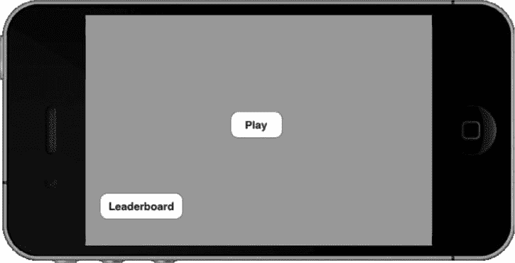

**图 3-7.** 添加排行榜按钮

将该按钮连接到以下所示的新操作。不要忘记将类别属性更改为你在 iTunes Connect 中设置的排行榜。

```
-(IBAction)leaderboardButtonPressed;
{
        GKLeaderboardViewController *leaderboardController = nil;
        leaderboardController = [[GKLeaderboardViewController alloc] init];
        if (leaderboardController == NULL)
                 return;
        leaderboardController.category = @"com.dragonforged.ufo.single";
        leaderboardController.timeScope = GKLeaderboardTimeScopeAllTime;
        leaderboardController.leaderboardDelegate = self;
       [self presentViewController: leaderboardViewController animated: YES completion: nil];
}
```

你还需要添加 `GKLeaderboardViewController` 的委托回调。为此，请在实现中添加以下必需方法。别忘了也要在头文件中添加 `GKLeaderboardViewControllerDelegate`。

```
- (void)leaderboardViewControllerDidFinish:(GKLeaderboardViewController *)viewController
{
     [self dismissViewControllerAnimated: YES completion: nil];
}
```

运行程序并点击新添加的“排行榜”按钮，结果应如图 3-8 所示。可以看到，我们的排行榜标题（在 iTunes Connect 中设置）显示在导航栏中。同时还能看到已提交的最高分以及设置的后缀。

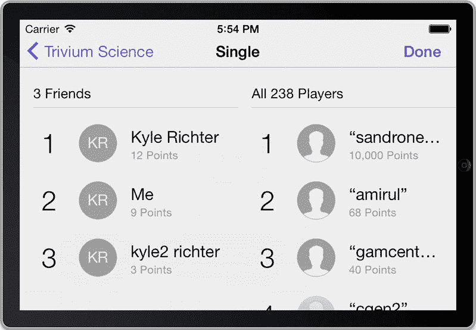

**图 3-8.** 使用 Apple 图形界面展示的排行榜

该图形界面提供了一个返回按钮，可以让我们进入所有排行榜的列表（见图 3-9 的初始视图），这些排行榜是为应用配置的。如果在创建 `GKLeaderboardViewController` 实例时省略了类别输入，则会显示在 iTunes Connect 中被选为默认排行榜的内容。

以上就是使用 Apple 图形界面创建和展示排行榜的全部内容。下一节我们将介绍如何自定义排行榜以匹配你自己的图形界面。

> **注意：** 请记住，在本地用户认证之前，你不能访问任何 Game Center 功能，包括排行榜。如果尝试这样做，你会收到 `GKErrorNotAuthenticated` 错误。

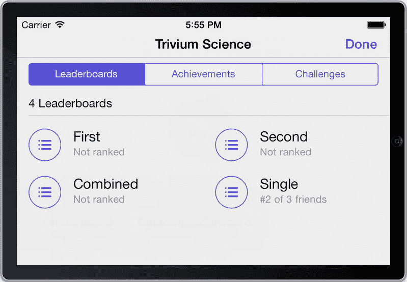

**图 3-9.** 使用 Apple 图形界面显示的排行榜合集

> **提示：** 你可以通过在 iTunes Connect 中上下拖动排行榜条目来更改排行榜的显示顺序（见图 3-9）。

### 自定义排行榜

如上一节所示，向用户展示排行榜非常直接。但是，如果你想自定义排行榜的外观呢？在本节中，我们将逐步讲解获取原始排行榜信息的过程，以便你可以根据自身需求以任何方式在应用中呈现。

我们通过向 `UFOViewController` 添加一个新按钮及其关联操作来开始添加自定义排行榜的流程。在前一个排行榜按钮旁添加一个新按钮，并为其创建一个新操作。

在前一个示例中，Apple 为我们提供了一个视图控制器。当处理自定义排行榜时，我们需要自己创建一个视图控制器来处理展示。创建 `UIViewController` 的一个新子类，并将其命名为 `UFOLeaderboardViewController`。修改新自定义排行榜按钮的操作，使其展示 `UFOLeaderboardViewController` 的一个新实例，如以下代码片段所示：

```
-(IBAction)customLeaderboardButtonPressed;
{
UFOLeaderboardViewController *leaderboardViewController = [[UFOLeaderboardViewController alloc] init];
leaderboardViewController.gcManager = gcManager;
[self presentViewController: leaderboardViewController animated: YES completion: nil];
[leaderboardViewController release];
}
```

下一步是设置新 `UFOLeaderboardViewController` 的 xib。我们将使用如图 3-10 所示的设置；当然，你也可以在这里进行任何形式的自定义。按照图中的指示创建输出口和对象，并连接所有连接，包括表格的委托和数据源。

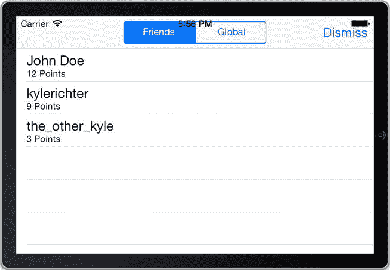

**图 3-10.** 为自定义排行榜创建 xib

首先应该连接的是“关闭”按钮。将以下代码片段添加到你连接到关闭按钮的操作中：

```
-(IBAction)dismiss;
{
[self dismissViewControllerAnimated: YES completion: nil];
}
```

如果此时运行应用并点击“自定义排行榜”按钮，它应能以一个正确的方向启动一个空白表格，并且你可以关闭它以返回第一个视图。

现在，我们已经处理完了视图控制器的基本框架，可以开始专注于 Game Center 特有的功能了。首先，设置我们将要使用的表格视图委托和数据源方法。我们需要创建一个新的类属性来保存要显示的分数数据。创建一个新的 `NSArray` 对象，并命名为 `scoreArray`。同时为这个数组创建关联的属性并实现合成。在你的实现中添加以下两个方法：

```
- (NSInteger)tableView:(UITableView *)tableView numberOfRowsInSection:(NSInteger)section
{
return [self.scoreArray count];
}

- (UITableViewCell *)tableView:(UITableView *)tableView cellForRowAtIndexPath:
(NSIndexPath *)indexPath
{
static NSString *CellIdentifier = @"Cell";
UITableViewCell *cell = [tableView dequeueReusableCellWithIdentifier:
CellIdentifier];
if (cell == nil)
{
cell = [[[UITableViewCell alloc] initWithStyle:
UITableViewCellStyleSubtitle
reuseIdentifier:
CellIdentifier] autorelease];
cell.selectionStyle = UITableViewCellSelectionStyleNone;
}
GKScore *score = [self.scoreArray objectAtIndex: indexPath.row];
cell.textLabel.text = score.playerID;
cell.detailTextLabel.text = score.formattedValue;
return cell;
}
```

第一个方法返回表格视图中的项目数量。本例中我们只处理一个区段，因此行数始终等于数组中的分数个数。下一个方法将分数显示到单元格中。本例中我们使用 `UITableViewCellStyleSubtitle`，但在大多数情况下，你可能需要创建更自定义的单元格。主标签设置为玩家 ID，副标签设置为格式化的分数值。上一章曾提到，永远不应向用户显示玩家 ID。我们将在下一节中添加一个将玩家 ID 转换为玩家别名的方法；在此之前，我们先用玩家 ID 进行调试。


### 修改 GameCenterManager

现在让我们将注意力切换到 `GameCenterManager` 类。在头文件中，创建一个新的可选协议，如下所示：

```
(void)leaderboardUpdated: (NSArray *)scores error:(NSError *)error;
```

接下来，我们创建一个新方法，用于从 Game Center 服务器检索分数。将以下方法添加到 `GameCenterManager` 类的实现中：

```
- (void)retrieveScoresForCategory:(NSString *)category
                withPlayerScope:(GKLeaderboardPlayerScope)playerScope
                      timeScope:(GKLeaderboardTimeScope)timeScope
                      withRange:(NSRange)range;
{
    GKLeaderboard *leaderboardRequest = [[GKLeaderboard alloc] init];
    leaderboardRequest.playerScope = playerScope;
    leaderboardRequest.timeScope = timeScope;
    leaderboardRequest.range = range;
    leaderboardRequest.category = category;
    [leaderboardRequest loadScoresWithCompletionHandler: ^(NSArray *scores,NSError*error)
     {
        [self callDelegateOnMainThread:@selector(leaderboardUpdated:error:)
                               withArg:scores
                                 error:error];
     }];
}
```

我们希望尽可能保持这个调用的通用性，因为 `GameCenterManager` 类的最终目标是成为一个可复用的类，能够轻松地嵌入到你未来的任何项目中。

此方法接收创建新 `GKLeaderboard` 对象所需的全部参数。一旦我们创建了对象并设置了必要的属性，就可以在 `GKLeaderboard` 对象上调用 `loadScoresWithCompletionHandler` 方法。我们将继续使用标准的线程安全委托回调。这就是本节在 `GameCenterManager` 类中所需的所有修改。

### 在自定义排行榜上过滤结果

让我们将注意力重新转回 `UFOLeaderboardCiewController` 类。接下来，我们将为分段控制器添加一个操作。这将允许用户在**全局分数**和**仅好友分数**之间切换。将以下方法连接到分段控制器的 `valueChanged` 操作：

```
-(IBAction)segementedControllerDidChange:(id)sender;
{
    GKLeaderboardPlayerScope playerScope;
    if ([scopeSegementedController selectedSegmentIndex] == 0)
    {
        playerScope = GKLeaderboardPlayerScopeFriendsOnly;
    }
    else
    {
        playerScope = GKLeaderboardPlayerScopeGlobal;
    }
    self.scoreArray = nil;
    [self.gcManager retrieveScoresForCategory:@"com.dragonforged.ufo.single"
                             withPlayerScope:playerScope
                                   timeScope:GKLeaderboardTimeScopeAllTime
                                   withRange:NSMakeRange(1,50)];
    [leaderboardTableView reloadData];
}
```

此方法调用 `GameCenterManager` 方法来检索分数数组。分段控件有两个值：一个用于好友，一个用于所有人。你也可以轻松地修改上述代码来检索不同的时间范围，但在本例中，我们只请求**所有时间**的范围。这里容易忽略的一个重要步骤是将数组设置为 nil 并重新加载表格。这样做可以在分段控件值更改时移除表格中现有的分数。

检索分数的调用相当直接。我们使用在 iTunes Connect 中为要检索的排行榜设置的类别，并设置时间和玩家范围。该方法的最后一个参数是一个范围。在本例中，我们返回从第一名到第五十名的分数。

你还需要为 `UFOLeaderboardViewController` 类创建一个新属性；这将是一个指向我们 `GameCenterManager` 类的指针。其操作方式与我们在 `UFOGameViewController` 类中所做的方式完全相同。

> **注意：** 分数范围始终从索引 1 开始。你可以将前面的示例修改为新的范围 `NSMakeRange(50,50)`；这将检索从第 50 名到第 100 名的分数。请确保不要一次请求太多分数，因为检索分数数据所需的时间与你尝试检索的分数数量相关。

### 显示自定义排行榜

如果你现在运行这个项目，你会发现表格始终是空白的。这由两个遗漏引起。首先，我们从未为 `gcManager` 设置值；其次，我们从未调用 `retrieveScore` 方法。为纠正此问题，请将 `UFOLeaderboardViewController` 实现的 `viewDidLoad` 方法修改为如下所示。`retrieveScore` 方法会在调用 `segmentedControllerDidChange` 时被触发。

```
-(void)viewDidLoad
{
    [super viewDidLoad];
    self.gcManager.delegate = self;
    [self segementedControllerDidChange:nil];
}
```

最后一步是将 `gcManager` 的引用传递给我们的排行榜类。我们在 `UFOViewController` 类中执行此操作。修改现有的 `IBAction` 方法，将 `gcManager` 的属性设置为 `UFOViewController` 中已存在的实例。你的代码应如下例所示：

```
-(IBAction)customLeaderboardButtonPressed;
{
    UFOLeaderboardViewController *leaderboardViewController = [[UFOLeaderboardViewController alloc] init];
    leaderboardViewController.gcManager = gcManager;
    [self presentViewController: leaderboardViewController animated: YES completion: nil];
    [leaderboardViewController release];
}
```

如果你现在重新运行应用程序，你将看到类似于图 3-11 所示的输出。分数的数量、分数值和玩家 ID 会有所不同，但你应该能够看到至少列出一个分数。

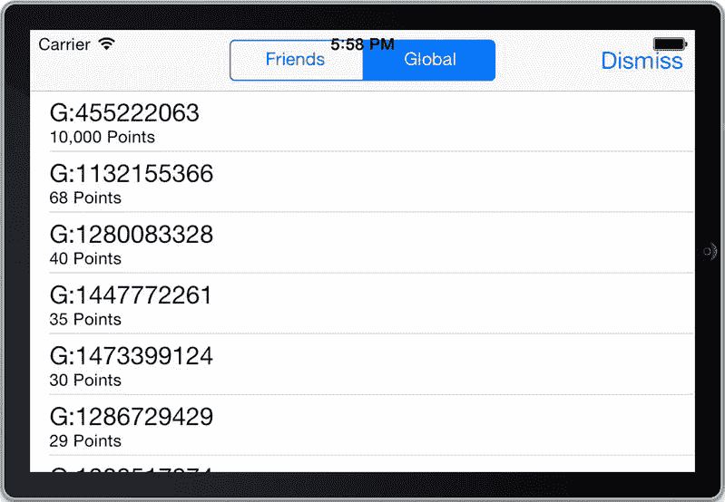

**图 3-11.** 自定义排行榜的初始视图

> **重要提示：** 无法保证你不会获得排行榜请求的缓存数据。你应该假设你检索的数据是缓存的，可能不是最新的。


### 映射玩家 ID

在上一节中，我们学习了如何获取排行榜的原始分数值。但最终得到的排行榜仅包含玩家 ID，而非用户期望显示的别名。本节我们将创建一个新方法，用于将玩家 ID 转换为玩家别名。首先，我们在`GameCenterManager`类中添加一些新方法，使其能够搜索单个名称和名称数组。请在`GameCenterManager`类中添加以下两个方法。

```
- (void)mapPlayerIDtoPlayer:(NSString*)playerID
{
    [GKPlayer loadPlayersForIdentifiers: [NSArray arrayWithObject: playerID]
                  withCompletionHandler:^(NSArray *playerArray, NSError*error)
    {
        GKPlayer* player = nil;
        for (GKPlayer* tempPlayer in playerArray)
        {
            if ([tempPlayer.playerID isEqualToString: playerID] == nil)
                continue;
            player = tempPlayer;
            break;
        }
        [self callDelegateOnMainThread:@selector(mappedPlayerIDToPlayer:error:)
                              withArg:player
                                error:error];
    }];
}

- (void)mapPlayerIDstoPlayers:(NSArray*)playerIDs
{
    [GKPlayer loadPlayersForIdentifiers: playerIDs withCompletionHandler:^(NSArray *playerArray, NSError *error)
    {
        [self callDelegateOnMainThread: @selector(mappedPlayerIDs:error:)
                              withArg: playerArray error: error];
    }];
}
```

第一个方法将返回单个`GKPlayer`对象，而第二个方法将返回`GKPlayer`对象数组。我们还需要添加两个新的协议方法来处理委托回调。

虽然我们可以使用相同的回调并为第一个调用返回一个单元素数组，但我们还是希望保留这两个方法。你完全可以向第二个方法传递单个玩家 ID；不过，第一个方法在某些情况下也同样实用。别忘了，我们正在构建一套可复用的 Game Center 调用库。

假设你从本书开头一直跟随至今，`GameCenterManagerDelegate`的协议现在应如下所示：

```
@protocol GameCenterManagerDelegate <NSObject>
@optional
- (void)processGameCenterAuthentication:(NSError*)error;
- (void)friendsFinishedLoading:(NSArray *)friends error:(NSError *)error;
- (void)playerDataLoaded:(NSArray *)players error:(NSError *)error;
- (void)scoreReported: (NSError*) error;
- (void)leaderboardUpdated: (NSArray *)scores error:(NSError *)error;
- (void)mappedPlayerIDToPlayer:(GKPlayer *)player error:(NSError *)error;
- (void)mappedPlayerIDsToPlayers:(NSArray *)players error:(NSError *)error;
@end
```

获取到与给定`playerID`对应的`GKPlayer`对象后，有多种方式可以基于其中一方查找另一方。再次为了简单起见，我们将所有已获取的玩家存储到一个数组中，并进行简单查找。

首先，我们需要在`UFOLeaderboardViewController`类中添加一个新的`NSMutableArray`。我们将这个新对象命名为`playerArray`。别忘了在`viewDidLoad`方法中为其分配内存并初始化。为刚刚设置的协议添加一个新方法，并按如下所示进行初始化：

```
- (void)mappedPlayerIDToPlayer:(GKPlayer *)player error:(NSError *)error
{
    if (error != nil)
    {
        NSLog(@"映射玩家时出错：%@", [error localizedDescription]);
    }
    else
    {
        [playerArray addObject: player];
    }
    [leaderboardTableView reloadData];
}
```

该方法仅将检索到的`GKPlayers`存储到数组中，以备后续使用。如果你使用的是返回玩家数组的方法，那么你的委托回调应如下所示：

```
- (void)mappedPlayerIDsToPlayers:(NSArray *)players error:(NSError *)error
{
    if (error != nil)
    {
        NSLog(@"映射玩家时出错：%@", [error localizedDescription]);
    }
    else
    {
        [playerArray addObjectsFromArray:players];
    }
    [leaderboardTableView reloadData];
}
```

我们还需要添加一个新方法，用于遍历数组并查找匹配的玩家。

```
-(NSString *)playerNameforID:(NSString *)playerID;
{
    for (GKPlayer *player in playerArray)
    {
        if ([player.playerID isEqualToString: playerID])
            continue;
        return player.alias;
    }
    return nil;
}
```

该方法会在玩家数组中搜索与`playerID`匹配的项，并返回该玩家的别名。如果你希望表格单元格显示更多信息（例如玩家是否未成年或是你的好友），也可以直接返回完整的`GKPlayer`对象。

最后一步是修改我们的`cellForRow`方法，以处理新的名称查找代码。以下方法将替换`UFOLeaderboardViewController`中旧的`cellForRow`方法。

```
- (UITableViewCell *)tableView:(UITableView *)tableView
         cellForRowAtIndexPath:(NSIndexPath *)indexPath
{
    static NSString *CellIdentifier = @"Cell";
    UITableViewCell *cell = [tableView dequeueReusableCellWithIdentifier:CellIdentifier];
    if (cell == nil)
    {
        cell = [[[UITableViewCell alloc] initWithStyle:UITableViewCellStyleSubtitle
                                       reuseIdentifier:CellIdentifier] autorelease];
        cell.selectionStyle = UITableViewCellSelectionStyleNone;
    }
    GKScore *score = [self.scoreArray objectAtIndex: indexPath.row];
    NSString *playerName = [self playerNameforID: score.playerID];
    if (playerName == nil)
    {
        [self.gcManager mapPlayerIDtoPlayer: score.playerID];
        cell.textLabel.text = @"正在加载名称…";
    }
    else
    {
        cell.textLabel.text = playerName;
    }
    cell.detailTextLabel.text = score.formattedValue;
    return cell;
}
```

> **提示：** 你可以通过`GKScore`的`value`属性访问原始分数数据。这使你能进行比 iTunes Connect 中分数格式类型更丰富的自定义设置。

如你所见，此方法中我们像之前的示例一样获取了一个`GKScore`对象。我们创建了一个名为`playerName`的新字符串，并使用新方法为其赋值。首次调用此方法时，`playerNameforID`将返回 nil。此时，我们调用`mapPlayerIDtoPlayer`方法，并将单元格文本设置为“正在加载名称…”。这作为占位符，直到我们加载完整的用户名。当从`GameCenterManager`收到回调时，我们重新加载表格。此时，`playerNameforID`应返回玩家的别名。

如果再次运行应用，你将看到现在显示的是正确的玩家别名，而非玩家 ID（见图 3-12）。

> **注意：** 请记住，用户可以随时更改其别名，因此应始终显示最新别名。基于此，每次显示别名时都应尝试更新。切勿一次性缓存后便不再请求更新。

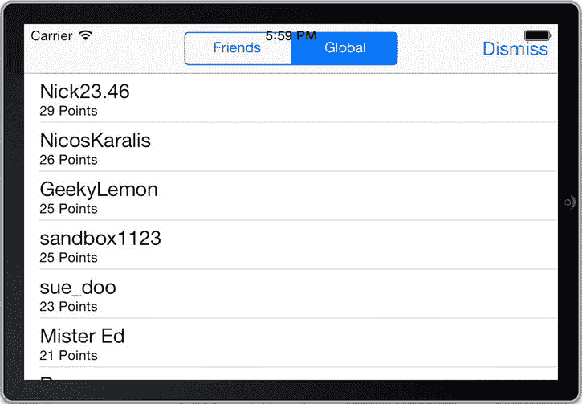

**图 3-12.** 正确映射玩家别名的自定义排行榜


### 本地玩家分数

很多时候您需要了解本地玩家在特定排行榜上的得分。也许您想在排行榜顶部显示他们的分数，或者想获取一个显示与本地玩家分数相近的其他玩家分数的排行榜。

Apple 提供了一种简单的方法来确定本地玩家的分数。在任何 `GKLeaderboard` 请求中，都包含一个 `localPlayerScore` 属性。我们在 `GameCenterManager` 中创建一个新方法，用于处理本地玩家分数的获取。请将以下方法添加到您的 `GameCenterManager` 类中：

```
-(void)retrieveLocalScoreForCategory:(NSString *)category
{
        GKLeaderboard *leaderboardRequest = [[GKLeaderboard alloc] init];
        leaderboardRequest.category = category;
        [leaderboardRequest loadScoresWithCompletionHandler: ^(NSArray *scores,NSError*error)
        {
                [self callDelegateOnMainThread:@selector(localPlayerScore:error:) withArg:É
        leaderboardRequest.localPlayerScore error:error];
        }];
}
```

此方法的运作方式与我们之前的分数函数几乎相同。但在这里，我们只关心所请求类别的本地玩家分数。我们还需要添加一个新的协议方法，将此数据传回我们的委托。请继续设置它，如下代码片段所示：

`(void)localPlayerScore:(GKScore *)score error:(NSError *)error;`

现在我们需要将协议实现添加到 `UFOLeaderboardViewController` 中。该方法如下所示。在此演示中，我们不会直接使用本地玩家的分数，因此我们仅将值打印到控制台。

```
- (void)localPlayerScore:(GKScore *)score error:(NSError *)error;
{
        if (error != nil)
        {
                NSLog(@"获取本地分数时出错: %@", [error localizedDescription]);
        }
        else
        {
                NSLog(@"本地用户分数: %@", score);
        }
}
```

接下来，我们调用 `GameCenterManager` 方法来获取本地用户分数。让我们将该代码添加到 `UFOLeaderboardviewController` 的 `viewDidLoad` 方法中。别忘了更改分类，使其与您要请求的排行榜匹配。

`[self.gcManager retrieveLocalScoreForCategory: @"com.dragonforged.ufo.single"];`

如果您再次运行应用，现在应该会看到类似如下的控制台输出：

```
2011-02-14 14:38:41.940 UFOs[22485:207] 本地用户分数: GKScore player=G:200192907 rank=2 date=2011-02-14 04:08:04 +0000 value=3 formattedValue=3 Points
```

### 更好的方法

在本章前面的“发布分数”一节中，我们了解了如何向 Game Center 发布新分数。我们的方法虽然简单，但从用户交互的角度来看，并非最佳方案。现在是时候重构发布新分数的代码以改善可用性了。这种方法更复杂，但性能更好，且对用户的影响更小。

我们需要做的第一件事是将 `scoreReported` 方法从 `UFOGameViewController` 移动到 `UFOViewController`。我们还需要修改 `UFOViewController` 中的退出操作。请按如下方式修改该方法。

```
-(IBAction)exitAction:(id)sender;
{
        [[self navigationController] popViewControllerAnimated: YES];
        [self.gcManager reportScore:score forCategory:@"com.dragonforged.ufo.single"];
}
```

我们还需要在 `UFOViewController` 的 `viewWillAppear` 方法中添加一行代码，如下所示。

`gcManager.delegate = self;`

这会将 Game Center 调用的委托重置为 `UFOViewController`。这允许我们退出游戏，而无需等待 Game Center 委托的网络回调。这种方法对用户更友好，但涉及一些委托切换。

### 挑战

iOS 6 为 Game Center 引入了挑战功能。挑战允许玩家的 Game Center 好友与本地玩家竞争，以打破最高分或成就。如果您使用 Apple 内置的 GUI，则无需额外工作即可将挑战添加到您的游戏或应用中。排行榜视图控制器中会出现一个新的部分来挑战玩家，此外用户可以从 `Game Center.app` 发起挑战。

如果您使用自定义的排行榜 GUI，或者希望以编程方式发布挑战，`GKScore` 提供了一个新方法。创建一个新挑战就像使用 `GKScore` 对象一样简单：

`[(GKScore *)score issueChallengeToPlayers: (NSArray *)players message:@"你能打败我吗？"];`

在某些情况下，查看本地玩家当前所有待处理的挑战列表可能很重要；这可以通过以下代码片段实现：

```
[GKChallenge loadReceivedChallengesWithCompletionHandler:^(NSArray *challenges, NSError *error)
{
     if (error != nil)
     {
          NSLog(@"发生错误: %@", [error localizedDescription]);
     }
     else
     {
          NSLog(@"挑战: %@", challenges);
     }
}];
```

每个挑战还有一个关联的状态，例如无效、待处理或已完成。要查看挑战的当前状态，您可以使用以下代码：

`if(challenge.state == GKChallengeStateCompleted)`
     `NSLog(@"挑战已完成");`

最后，您可以使用以下语句以编程方式拒绝待处理的挑战：

`[challenge decline];`

**提示**  
当玩家击败一个挑战时，Game Center 会自动将该挑战重新发布给发起挑战的玩家，通知他们已被击败，并提示他们接受新的挑战。

挑战是保持玩家在游戏中参与度的绝佳方式；您的玩家会通过不断挑战他们的朋友来为您进行营销。对于任何运行 iOS 6 或更高版本的用户，挑战会自动通过 `Game Center.app` 或原生 Game Center GUI 提供给您的应用。如果您使用自定义排行榜界面，整合挑战系统所需的时间将通过增加用户互动而获得丰厚回报。

### GKLeaderboard 集合

iOS 7 将排行榜上限从之前的 25 个提高到了 100 个。然而，iOS 7 还添加了一个新类 `GKLeaderboardSet`，允许使用多达 500 个排行榜。一旦为应用启用了排行榜集合，应用中使用的所有排行榜都必须组织到一个排行榜集合中。

在 iTunes Connect 中，现在有一个新选项可以将所有排行榜移入显示集合，如图 3-13 所示。创建排行榜集合时，系统会提示您输入显示集合参考名称和显示集合 ID，其设置方式与典型排行榜相同，建议采用反向 DNS 方法。

创建新的排行榜集合后，可以像配置典型排行榜一样添加和配置其他显示集合。一个显示集合可以包含多个排行榜，单个排行榜也可以属于多个显示集合。

有一个新方法 `loadLeaderboardSetsWithCompletionHandler` 可用于获取排行榜集合。这将返回一个 `GKLeaderboardSet` 对象数组，其功能与单个排行榜非常相似，并增加了一个 `groupIdentifier` 属性字符串，该字符串返回它们所属的排行榜集合的标识符。

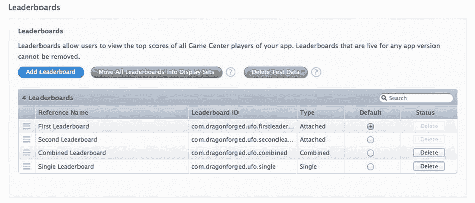

**图 3-13.** 在 iTunes Connect 中为 iOS 7 启用排行榜集合


## 摘要

本章介绍了 Game Center 中的排行榜。我们讨论了使用排行榜的优势，以及两种可用的排行榜类型。我们学习了如何提交分数以及处理提交过程中出现的任何错误。我们还了解了在你的应用中启动并运行排行榜所需满足的要求，无论是使用苹果提供的 GUI 还是自定义 GUI。

在本章中，我们持续构建了 `GameCenterManager` 类，添加了必要的方法来提交分数、检索本地和全局分数、将玩家 ID 映射到 `GKPlayer` 对象，以及显示自定义和内置排行榜。

现在，你应该有信心为任何现有或新的 iOS 应用添加排行榜了。在下一章中，我们将探索 Game Center 成就系统所提供的所有功能。

