# 成就

**摘要**

> “所有成就伟业的人，都曾是伟大的梦想家。”
> ——奥里森·斯威特·马登

相对较新的社交游戏概念“成就”出现的时间远比我们在第 3 章中讨论的排行榜要晚得多，并且随着微软 Xbox 360 的发布，其受欢迎程度急剧上升。成就提供了排行榜所忽略的细节层次和成就感。排行榜显示谁拥有领先的分数；而另一方面，成就通过奖励玩家完成特定任务、探险、目标或关卡来展示玩家的技能和优势。当成就可以服务于游戏内的目的时，它们就成了一种超越其他玩家的“能量提升”。能够查看他人的成就给了玩家一种“炫耀的资本”。

随着社交网络游戏的发展和普及，成就系统功能的热度更是直线飙升。就像每个人在高中体育比赛中都能拿到一个奖杯一样，每个玩家都想在游戏中获得一项成就。

Foursquare 是最早将成就从游戏世界带入社交应用领域的网站之一。Foursquare 将其成就称为“徽章”（见图 4-1），但其基本概念是相同的。玩家因完成任务而获得奖励，但徽章的数量并不会影响游戏玩法，或者在这个例子中，不会影响用户以任何直接方式使用应用的能力。

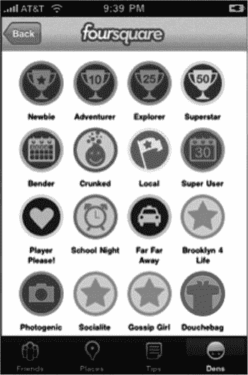

*图 4-1. 展示徽章或成就的 iPhone 版 Foursquare*

Game Center 让为你的 iOS 应用添加成就系统变得简单。在本章中，我们将学习如何为我们的演示游戏 UFOs 添加成就。你将学到快速轻松地将成就系统完全集成到你的应用中所需要的一切。特别是，你将学习如何：

- 创建新的成就
- 显示达成进度
- 在应用中添加成就挂钩
- 推进和重置成就
- 自定义成就的外观
- 处理成就挑战

## 为什么使用成就？

如果成就对你的社交应用或游戏的作用还不够明显，那么让我们花点时间回顾一下它的诸多好处。

-   成就让你的用户获得额外的成就感。
-   成就能使用户更频繁地回到你的应用中。用户更愿意返回你的应用来完成更多成就，从而使完成游戏的过程更有回报、更有趣。
-   成就为用户提供了一种与他人分享体验的简便方式。
-   Game Center 中的成就为你发布的产品增添了精致的外观和感觉。
-   成就让用户在探索你的应用或游戏时，有更强的进步感。
-   成就提供了游戏的一种替代玩法。如果用户不喜欢战役模式，他们可以通过你的成就系统享受成就感。
-   成就有助于建立游戏品牌认知度。当用户在 Twitter 和 Facebook 上分享他们的成就时，品牌知名度会提升，随之销量也会增加。
-   成就可以为你的游戏提供一个目标或结局，否则游戏可能就变成了开放式结局。像问答游戏或棋盘游戏这类游戏通常没有传统的结局。
-   成就挑战有助于吸引更多用户使用你的产品。

## Game Center 成就概览

成就，也被称为徽章，在 Game Center 中的运作方式略不同于其他平台。与排行榜类似，首先需要在 iTunes Connect 中按应用进行成就配置。你需要创建 `GKAchievement` 对象的新实例来报告进度（更多信息请参见“修改成就进度”部分）。与排行榜条目（在达到并提交分数时创建）不同，成就可以报告增量进度。

与使用排行榜相比（更多关于排行榜的信息请参见第 3 章），另一个显著的变化是你将使用两种类型的对象来提交和检索成就。`GKAchievement` 用于提交新成就或更新成就进度，而 `GKAchievementDescription` 用于向用户显示成就数据。这与我们在使用排行榜时看到的情况相反，那时我们使用 `GKScore` 对象来提交和检索数据。

与排行榜一样，你可以使用苹果自带的图形用户界面 (GUI) 或更符合你应用外观和感觉的自定义 GUI 来显示成就进度。每种系统的优缺点也与排行榜相同。我将总结这些优缺点，并在适当之处补充一些成就相关的细节信息。

### 使用苹果成就 GUI 与自定义 GUI 的好处

以下是在处理成就时使用苹果自带的 GUI 所带来的一些好处。

-   你成就的外观和感觉是由世界上一些最优秀的设计师打造的。
-   GUI 实现起来非常简单，使得向用户展示成就进度变得很容易。
-   用户喜欢他们已熟悉如何操作的界面。
-   与你自己实现系统相比，你的应用更能适应未来的变化。
-   当新功能可用时（例如随着 iOS 6 的推出新增的“挑战”功能），它们会自动包含在内。

以下是在 iOS 设备上处理成就时使用你自己的 GUI 所带来的几个好处。

-   你的成就进度可以与应用的定制设计相匹配。
-   你对返回的数据有更多控制权，并且可以使用额外的标准进行过滤。
-   你可以实现自己的自定义缓存行为。
-   你可以为未完成或进行中的成就使用自定义图像。

如你所见，两种系统各有优缺点，对于应该使用哪一种并没有正确的答案。到本章结束时，你将对这些选项有更好的理解，并能够更有把握地决定哪种方法最适合你的应用。

正如本节开头所提到的，你需要像处理排行榜一样，开始从 iTunes Connect 着手处理成就相关事宜。


## 在 iTunes Connect 中配置成就

正如我们在排行榜中所见，如果不先在 iTunes Connect 中至少设置一个新成就，就无法开始处理成就。使用您的用户名和密码登录 iTunes Connect (`itunesconnect.apple.com`)，然后选择我们在前面章节中一直在处理的应用程序（更多信息，请参见第 2 章）。从控制面板选择应用程序后，返回本书前面介绍的“管理 Game Center”区域。

您应用程序的 Game Center 门户将有一个标记为“成就”的版块。如果您是第一次在此应用程序中处理成就，将会出现一个标记为“设置”的按钮。如果您已有成就，步骤会有所不同，这将在本节稍后部分介绍。

单击“设置”按钮将显示“成就配置”屏幕。选择页面左上角的“添加新成就”按钮，如图 4-2 所示。这将带您进入图 4-3 所示的视图。

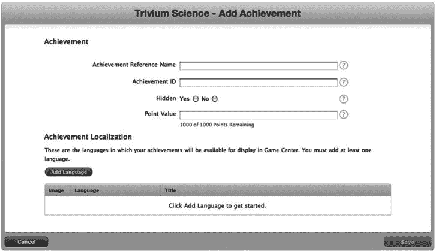

图 4-3. iTunes Connect 中新成就的配置视图

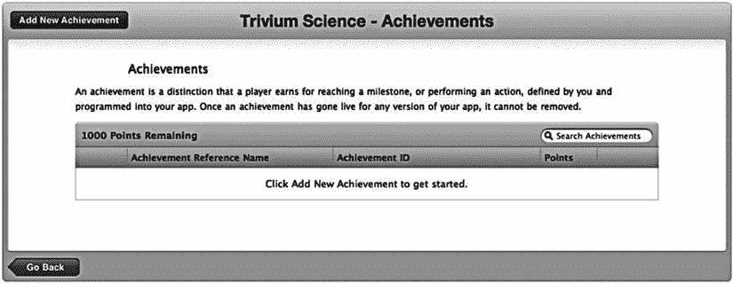

图 4-2. 通过 iTunes Connect 门户添加新成就

您可能会注意到，此门户页面与排行榜门户页面有很多相似之处。表 4-1 总结了这些属性。

表 4-1. iTunes Connect 中的成就属性

| 属性 | 描述 |
| --- | --- |
| 成就引用名称 | 仅在 iTunes Connect 内部使用，此字符串用于在 iTunes Connect 中轻松定位和引用此成就。 |
| 成就 ID | 此标识符将在您的代码中引用。与排行榜类别一样，Apple 建议您使用反向 DNS 系统，例如 `com.company.appname.achievementname`。 |
| 隐藏 | 如果成就是隐藏的，用户将无法在成就列表中看到它，直到他们完成它或进度有所增加。 |
| 积分 | 可为成就分配积分。您的应用程序被分配了 1000 积分。每完成一个成就，用户就会朝着该总分前进。一旦用户达到 1000 分，他们就已经解锁了所有成就。您应该为更难完成的成就分配更多积分。这能让用户更好地了解成就的价值。积分值是可选的，如果您不想在应用程序中使用它们，可以忽略。 |

提示：您不必让成就的总分加起来正好是 1000 分，但不能超过 1000 分。

### 创建新成就

现在是时候创建新成就了。我们将创建一个成就，当用户绑架 25 头奶牛时达成。我们将 `绑架 25 头` 作为成就名称，这样当我们有几十个成就时，它也很容易找到。对于我们的成就 ID，我们将使用 `com.dragonforged.ufo.abduct25`。您可以随意在此处使用任何 ID，但在接下来的示例中，请务必将其替换为 `com.dragonforged.ufo.abduct25`。我们将使其成为非隐藏成就，并为其分配 10 积分。

注意：完成任何成就所获得的积分不得超过 100 分。

要使成就有效，您必须至少配置一种语言。如图 4-4 所示，成就的本地化区域与前一章创建排行榜时遇到的区域有很大不同。请参考表 4-2 了解每个属性的信息。

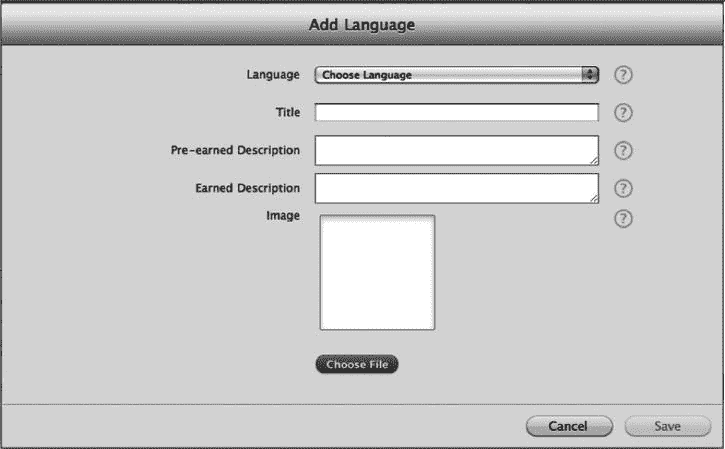

图 4-4. 在 iTunes Connect 中本地化成就

注意：每个游戏拥有其成就描述；您不能在多个游戏之间共享成就描述。

表 4-2. iTunes Connect 中的本地化成就属性

| 属性 | 描述 |
| --- | --- |
| 语言 | 选择此成就将显示的语言。您必须为您发布的产品中将支持的每种本地化设置一种语言。 |
| 标题 | 这是将在应用程序内显示以描述此成就的标题。 |
| 达成前描述 | 这是成就非隐藏且未完成或仅部分完成时显示的描述。 |
| 达成后描述 | 这是成就已完全解锁并完成时显示的描述。 |
| 图片 | 这是用户在获得成就时将显示的图片。Apple 将提供未获得的图片，或者您可以在使用自定义成就 GUI 时指定自己的图片。此图片必须为 512 × 512 像素且分辨率为 72 DPI。 |
| 可多次达成 | 这允许玩家接受他们已经完成过的成就上的挑战。更多详情请参阅“成就挑战”部分。 |

出于我们的目的，我们将为这个成就配置英语。我的示例将使用“绑架 25 头奶牛”作为标题，但您可以使用您喜欢的任何标题。对于达成前描述，我选择了“用你的 UFO 绑架 25 头奶牛”。对于达成后描述，我使用了“你已经掌握了绑架奶牛的艺术”。我还将使用一个奶牛过马路标志作为图片。完成后，您应该有一个完全设置好的成就，看起来应该类似于图 4-5 中显示的视图。

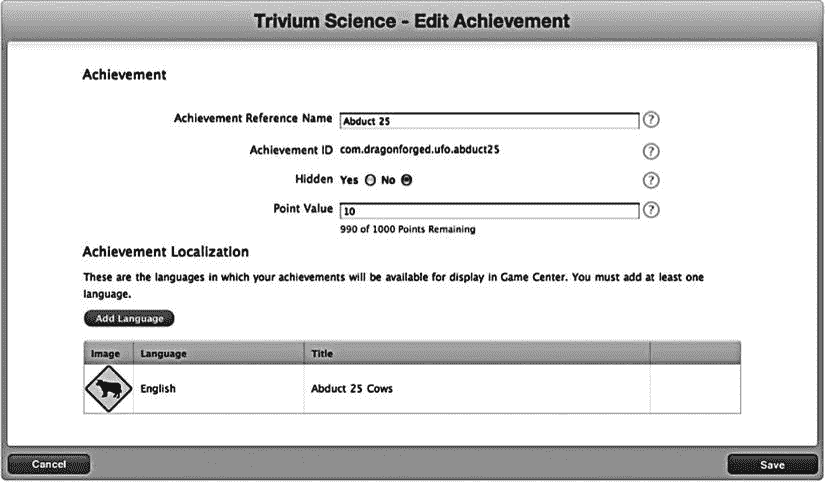

图 4-5. 在 iTunes Connect 中显示的新成就

我们想要为我们的游戏处理几个不同的成就设置。继续创建另一个新成就，用于绑架一头奶牛；这将是我们的非进度型成就。然后创建第三个成就，用于五分钟的游戏时间，并将其设置为隐藏。这最后一个成就将让我们能够处理计时器、进度型成就和隐藏成就。您可以为这些成就选择任何积分值、描述、标题和图片，但请务必记下成就 ID。

现在，您应该在 iTunes Connect 中为我们的游戏配置了三个成就。我们现在可以返回 Xcode，并开始在代码层面处理这些成就。


## 展示成就

与排行榜不同，在将用户数据填充到成就系统之前，有大量的图形界面预览工作要做。观察修改成就对其通过默认 GUI 显示效果的影响，是很有帮助的。本章我们将首先展示苹果的成就 GUI，然后继续提交用户数据。本章稍后还会介绍自定义的成就 GUI。

开始之前，我们需要创建一个新的`UIButton`来触发成就视图。我们很可能希望在游戏屏幕之外执行此操作，就像处理两个排行榜按钮时那样。首先，我们在`UFOViewController`视图中添加一个新按钮，如图 4-6 所示。

你还需要创建一个`IBAction`并将其连接到新的“成就”按钮。将以下代码插入到你连接到“成就”按钮的操作中。

```
-(IBAction)achievementButtonPressed;

{

     GKAchievementViewController *controller = nil;

       controller = [[GKAchievementViewController alloc] init];

         [achievementViewController setAchievementDelegate:self];

         [self presentViewController:achievementViewController animated:YES completion:nil];

       [controller release];

}
```

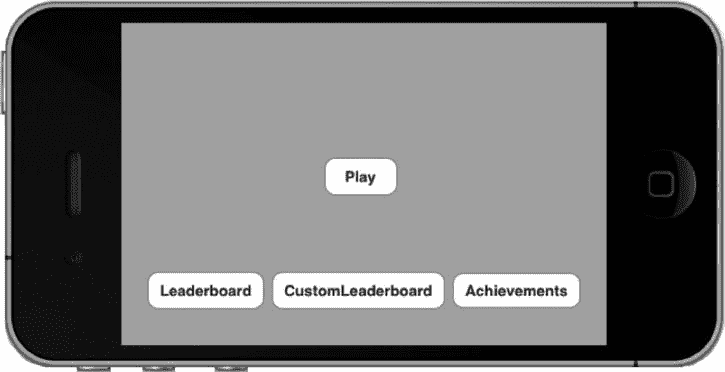

图 4-6.

添加新按钮以触发成就视图

**提示**

从 iOS 6 开始，你可以使用`GKGameCenterViewController`创建一个可用于成就、排行榜和挑战的 Game Center 视图。在 iOS 6 上使用`GKAchievementViewController`会启动一个已预先选中成就部分的`GKGameCenterViewController`，同时保持向后兼容性。

此外，我们需要连接一个与`GKAchievementViewController`配合使用的委托回调。将以下方法添加到你的实现文件中：

```
- (void)achievementViewControllerDidFinish:(GKAchievementViewController *)viewController

{

     [self dismissViewControllerAnimated:YES completion:nil];

}
```

如果你现在运行应用并点击“成就”按钮，将会看到一个类似于图 4-7 所示的视图。显示的成就使用的是苹果的“未获得”图像。苹果建议你始终使用其“未获得”图像，但当使用自定义成就 GUI 时，你可以覆盖此图像并返回自己的图像。

接下来，回想一下我们设置了三个成就，其中一个是隐藏状态。如图 4-7 所示，提供的视图只向我们展示了两个成就。因为我们尚未向第三个成就提交任何进度，其详情对用户是隐藏的。不过，你可以看到顶部信息行反映出存在一个隐藏的成就（1/3 成就）。同时注意，这些成就使用的是在 iTunes Connect 中设置的本地化“未获得”描述。

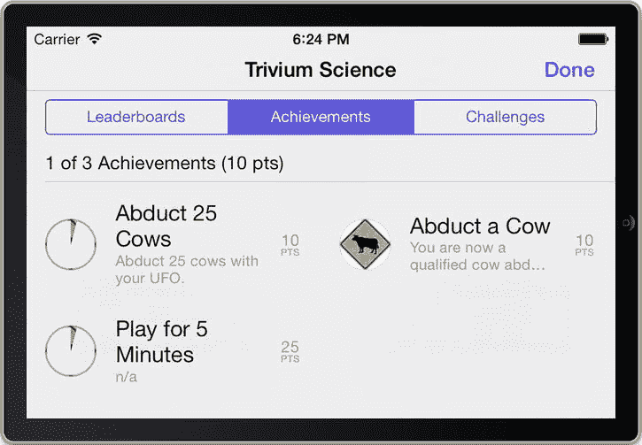

图 4-7.

使用苹果默认 GUI 显示的成就

这是通过苹果内置 GUI 向用户展示其成就进度的全部必要步骤。下一节，我们将探讨如何更新和推进这些成就。在本章稍后部分，你将学习如何使用自定义 GUI 来展示成就。

**注意**

用户始终可以在 Game Center 应用中查看他们的成就进度，但仍建议你在自己的应用中提供让用户查看进度的方式。

## 修改成就进度

与排行榜条目不同，成就可以通过用户交互不断修改和推进。就像我们处理其他 Game Center 功能一样，我们将在`GameCenterManager`类中创建一个新方法来处理与成就的交互。添加以下方法后，我们将审阅代码以了解其具体运作方式。

**提示**

请记住，所有这些源代码都可以在线获取，网址为 [`http://apress.com`](http://apress.com)。处理大型方法时，从下载的源代码中复制可能会更简单。

```
- (void)submitAchievement:(NSString*)identifier percentComplete:(double)percentComplete

{

if ([self earnedAchievementCache] == NULL)

{

[GKAchievement loadAchievementsWithCompletionHandler:^(NSArray
*achievements, NSError *error) {

if (error == NULL)

{

NSMutableDictionary *tempCache = [NSMutableDictionary
dictionaryWithCapacity:[achievements count]];

for (GKAchievement* achievement in achievements)

{

[tempCache setObject: achievement forKey:
[achievement identifier]];

}

[self setEarnedAchievementCache:tempCache];

[self submitAchievement:identifier percentComplete:
percentComplete];

}

else

{

[self callDelegateOnMainThread:
@selector(achievementSubmitted: error:) withArg:NULL
error:error];

}

}];

}

else

{

GKAchievement *achievement = [[self earnedAchievementCache]
objectForKey:identifier];

if (achievement != NULL)

{

if (([achievement percentComplete] >= 100.0) ||
([achievement percentComplete] >= percentComplete))

{

achievement = NULL;

}

[achievement setPercentComplete:percentComplete];

}

else

{

achievement = [[[GKAchievement alloc] initWithIdentifier:identifier]
autorelease];

[achievement setPercentComplete:percentComplete];

[[self earnedAchievementCache] setObject:achievement
forKey:[achievement identifier]];

}

if (achievement != NULL)

{

[achievement reportAchievementWithCompletionHandler:^(NSError
*error) {

[self callDelegateOnMainThread:
@selector(achievementSubmitted:error:)
withArg: achievement error:error];

}];

}

}

}
```

在执行此代码之前，你需要添加一个新的类属性。创建一个新的可变字典（别忘了合成它）。`GameCenterManager`头文件的相关部分现在应如下所示。

```
@interface GameCenterManager : NSObject <GameCenterManagerDelegate>

{

id <GameCenterManagerDelegate, NSObject> delegate;

NSMutableDictionary* earnedAchievementCache;

}

@property(nonatomic, retain) id <GameCenterManagerDelegate, NSObject> delegate;

@property(nonatomic, retain) NSMutableDictionary* earnedAchievementCache;
```


### 加载成就

现在来看我们添加的 `submitAchievement:percentComplete:` 方法。其中包含两个主要的 if/else 代码块。如果 `[self earnedAchievenmentCache]` 为 NULL，则会执行第一个代码块——在代码首次运行时，该缓存始终为 NULL。现在让我们看看这段代码。

```
[GKAchievement loadAchievementsWithCompletionHandler:^(NSArray *achievements, NSError *error) {
    if (error == NULL)
    {
        NSMutableDictionary *tempCache = [NSMutableDictionary dictionaryWithCapacity: [achievements count]];
        for (GKAchievement *achievement in achievements)
        {
            [tempCache setObject:achievement forKey:[achievement identifier]];
        }
        [self setEarnedAchievementCache:tempCache];
        [self submitAchievement:identifier percentComplete:percentComplete];
    }
    else
    {
        [self callDelegateOnMainThread:@selector(achievementSubmitted:error:) withArg:NULL error:error];
    }
}];
```

**重要**  
`loadAchievementsWithCompletionHandler` 返回的数组不会显示任何你尚未提交 `percentageCompleted` 的成就。

这段代码的主要功能是将成就列表加载到 `earnedAchievementCache` 中。我们调用了 `GKAchievement` 的 `loadAchievementsWithCompletionHandler` 方法。该调用会返回一个数组，其中包含在 iTunes Connect 中设置的所有成就。接着，我们将 `GKAchievement` 对象以标识符为键存入字典中。

此时，代码再次调用了 `submitAchievement:percentComplete`。这一次，`earnedAchievementCache` 不为 NULL，因此会执行第二组代码。如果在此过程中遇到错误，我们会使用标准的委托回调将错误发送回委托。

你需要向 `GameCenterManager` 添加一个新的协议方法来处理这个委托回调；现在正是添加的好时机。将以下可选协议添加到头文件中：

```
- (void)achievementSubmitted:(GKAchievement*)achievement error:(NSError*)error;
```

现在我们来看第二段代码。以下代码成功执行后，会将成就提交到 Game Center 服务器。

```
GKAchievement *achievement = [[self earnedAchievementCache] objectForKey:identifier];
if (achievement != NULL)
{
    if ((achievement.percentComplete >= 100.0) || (achievement.percentComplete >= percentComplete))
    {
        achievement = NULL;
    }
    [achievement setPercentComplete:percentComplete];
}
else
{
    achievement = [[[GKAchievement alloc] initWithIdentifier: identifier] autorelease];
    [achievement setPercentComplete:percentComplete];
    [[self earnedAchievementCache] setObject:achievement forKey:[achievement identifier]];
}

if (achievement != NULL)
{
    [achievement reportAchievementWithCompletionHandler: ^(NSError *error) {
        [self callDelegateOnMainThread:@selector(achievementSubmitted:error:) withArg:achievement error:error];
    }];
}
```

第一行代码根据传入该方法的标识符字符串，从 `earnedAchievementCache` 中检索 `GKAchievement` 对象。如果成就已完成，或上报的进度与 Game Center 服务器上的进度相同，我们将 achievement 设为 NULL。这样可以避免因提交将被忽略的进度而占用网络时间。同时，我们将 `GKAchievement` 对象上的 `percentComplete` 属性设置为传入该方法的 double 值。

如果缓存中不存在该成就，我们会分配并初始化一个新实例。在这种情况下，还需要将其添加到本地成就缓存中。

最后一步，在检查非 NULL 之后，提交成就。我们在成就对象上调用 `reportAchievementWithCompletionHandler`，然后通过现有协议将结果传回给委托。

**注意**  
所有成就都有一个 `percentageComplete` 属性，无论它们是否允许分阶段完成进度。如果你的成就只能完全获得或未获得，那么对于已获得的成就，你需要传入 100。

### 成就协议

本节中我们要做的最后一件事是在 `UFOGameViewController` 中实现协议方法。将以下方法添加到该文件的实现中；目前我们只需将错误和成功信息打印到控制台。

```
- (void)achievementSubmitted:(GKAchievement *)achievement error:(NSError *)error;
{
    if (error)
    {
        NSLog(@"上报成就时发生错误：%@", [error localizedDescription]);
    }
    else
    {
        NSLog(@"成就已提交");
    }
}
```

## 重置成就

在某些情况下，你可能需要重置用户的成就。这不仅对调试非常有用；你可能会发现为用户提供一个重置选项也很有用。你可能想添加一个威望模式，或者让用户有机会从头开始你的游戏。以下代码片段将完全重置本地用户在你应用中的所有成就。

```
- (void)resetAchievements
{
    [self setEarnedAchievementCache:NULL];
    [GKAchievement resetAchievementsWithCompletionHandler:^(NSError *error) {
        if (error == NULL)
        {
            NSLog(@"成就已重置");
        }
        else
        {
            NSLog(@"重置成就时发生错误：%@", [error localizedDescription]);
        }
    }];
}
```

**重要**  
不要忘记移除你存储的成就缓存信息，否则在应用重启之前，你将无法更新重置后的成就进度。


## 添加成就挂钩

在应用中实现成就功能时，最大的挑战在于如何将触发和推进成就的挂钩嵌入到常规操作流程中。我发现，在程序接近完成时添加这些挂钩比边开发边添加更容易。

本节将提供多个成就关联的示例；你的应用可能差异较大，但应能轻松调整这些示例以满足特定成就需求。

为便于获取成就进度详情，我们首先在 `GameCenterManager` 类中添加几个便捷方法。以下是用于填充本地成就缓存的第一个方法。

```
- (void)populateAchievementCache
{
     if ([self earnedAchievementCache] == NULL)
     {
          [GKAchievement loadAchievementsWithCompletionHandler:^(NSArray *achievements,
          NSError *error) {
               if (error == NULL)
               {
                    NSMutableDictionary* tempCache= [NSMutableDictionary
                    dictionaryWithCapacity: [achievements count]];
                    for (GKAchievement *achievement in achievements)
                    {
                                        [tempCache setObject:achievement forKey:[achievement
                                        identifier]];
                    }
                    [self setEarnedAchievementCache:tempCache];
               }
               else
               {
                    NSLog(@"An error occurred while loading achievements: %@",
                     [error localizedDescription]);
               }
          }];
     }
}
```

此方法的功能与上一节预览的提交成就进度方法中的缓存填充代码非常相似。为了使用其他两个便捷方法，我们需要先填充本地缓存。在身份验证完成后，应尽快调用 `populateAchievementCache`；在演示应用中，我在 `GameCenterManager` 的本地玩家身份验证方法中添加了该调用。请同时添加以下方法。

```
- (double)percentageCompleteOfAchievementWithIdentifier:(NSString*)identifier
{
     if ([self earnedAchievementCache] == NULL)
     {
          NSLog(@"Unable to determine achievement progress, local cache is empty");
     }
     else
     {
          GKAchievement *achievement= [[self earnedAchievementCache]
          objectForKey:identifier];
          if (achievement != NULL)
          {
               return [achievement percentComplete];
          }
          else
          {
               return 0;
          }
     }
     return -1;
}
```

此方法返回传入标识符对应成就的完成百分比（双精度浮点数）。如果在本地缓存中找不到该成就副本，则假定完成百分比为 0。下一个方法使用此方法返回布尔值，指示成就是否已完成。

```
- (BOOL)achievementWithIdentifierIsComplete: (NSString*)identifier
{
       if ([self percentageCompleteOfAchievementWithIdentifier:identifier] >= 100)
         {
              return YES;
       }
         else
         {
              return NO;
       }
}
```

> **注：** 身份验证后请务必尽快调用 `populateAchievementCache`，否则这些便捷方法将无法返回正确的成就数据。

### 在 UFO 游戏中添加挂钩

现在我们已经准备好一些辅助方法，可以开始为 UFO 游戏关联成就挂钩。我们需要关联三个成就。前两个都与我们绑架的奶牛数量有关，因此从这里开始。修改 `UFOGameViewController` 的 `finishAbducting` 方法如下：

```
- (void)finishAbducting
{
       if (!currentAbductee || !tractorBeamOn) return;
       [cowArray removeObjectIdenticalTo:currentAbductee];
       [tractorBeamImageView removeFromSuperview];
      tractorBeamOn = NO;
       score++;
       [scoreLabel setText:[NSString stringWithFormat:@"SCORE %05.0f", score]];
       [[currentAbductee layer] removeAllAnimations];
      [currentAbductee removeFromSuperview];
       currentAbductee = nil;
          [self spawnCow];
       if (![[self gcManager] achievementWithIdentifierIsComplete:
        @"com.dragonforged.ufo.aduct1"])
         {
              [[self gcManager] submitAchievement:@"com.dragonforged.ufo.aduct1"
           percentComplete:100];
       }
}
```

我们目前只关注此方法的最后几行。首先，我们对单次绑架的标识符字符串调用便捷方法 `achievementWithIdentifierIsComplete`。由于这是一个“已获得/未获得”类成就，我们无需关心当前的完成百分比。要将成就标记为已完成，将其完成百分比设置为 100 即可。

> **注：** 如果示例中的标识符字符串与您在 iTunes Connect 中为单次绑架使用的字符串不同，请务必进行相应更改。

下一个成就的挂钩方式类似，唯一区别在于我们使用增量进度。将以下代码片段添加到 `finishAbducting` 方法的末尾。

```
if (![[self gcManager] achievementWithIdentifierIsComplete:
@"com.dragonforged.ufo.abduct25"])
{
       double percentComplete = [[self gcManager]
         percentageCompleteOfAchievementWithIdentifier: @"com.dragonforged.ufo.abduct25"];
       percentComplete += 4;
       [[self gcManager] submitAchievement:@"com.dragonforged.ufo.abduct25"
         percentComplete:percentComplete];
}
```

此代码片段使用了与提交完整成就相同的方法，但有一个主要区别：我们需要先确定当前成就进度，然后在此基础上增加 4（因为 25 的 4% 等于 1）。要递增 25 次绑架中的一次，就需要增加 4%。

> **提示：** 别忘了我们在 `GameCenterManager` 中添加的 `resetAchievement` 方法。它在调试提交代码时非常有用。建议在 `didAuthenticate` 部分保留对该方法的调用，以便在调试期间始终将应用恢复到干净状态。

现在运行游戏并绑架几只奶牛。完成后，您会注意到成就界面显示进度，如图 4-8 所示。如果至少绑架了一只奶牛，您应该会获得一个已完成成就。如果绑架的奶牛少于 25 只，则应获得一个进度成就。请注意，用户完成成就时不会收到通知；我们将在后续章节“提供成就完成反馈”中讨论通知方法。

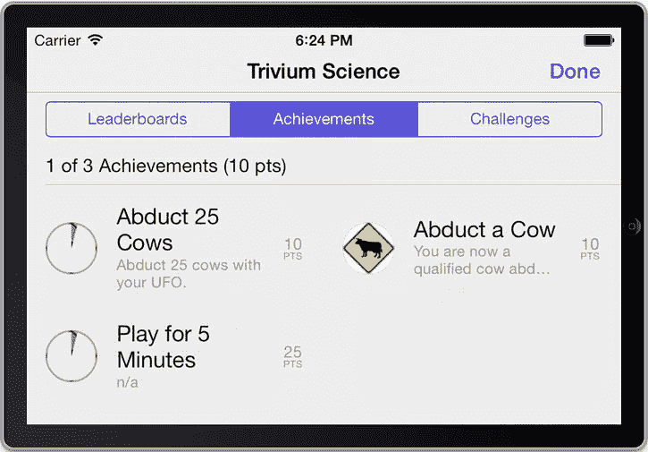

**图 4-8.** 使用 Apple 提供的界面查看成就进度


#### 基于时间的成就钩子

我们为该项目添加的最后一个钩子，用于处理玩家达成五分钟成就的逻辑。你的第一反应可能是记录游戏时长，并在用户退出游戏时将其作为进度提交。这可能并非最佳方案。我们希望在玩家完成成就时立即通知他们，而不是让他们等到游戏结束后才能看到自己获得了哪些成就。解决这个问题有多种方法。在本示例中，我们将每三秒（即五分钟的百分之一）触发一个`NSTimer`，并更新成就进度。将以下代码添加到`UFOGameViewController`中。

```
- (void)tickThreeSeconds
{
    if ([[self gcManager]achievementWithIdentifierIsComplete:
        @"com.dragonforged.ufo.play5"]) return;
    double percentComplete = [[self gcManager]
        percentageCompleteOfAchievementWithIdentifier:@"com.dragonforged.ufo.play5"];
    percentComplete++;
    [[self gcManager] submitAchievement:@"com.dragonforged.ufo.play5"
        percentComplete:percentComplete];
}
```

这里我们启动了一个三秒定时器。每次定时器触发时，我们调用`tickThreeSeconds`方法。该方法会获取成就的当前进度，在此基础上增加百分之一，然后将其提交回服务器。如果成就已经完成，该方法会直接返回。此外，请将`viewDidAppear`和`viewWillDisappear`方法修改为如下所示：

```
-(void)viewDidAppear:(BOOL)animated
{
    [super viewDidAppear: animated];
    timer = [NSTimer scheduledTimerWithTimeInterval:3.0 target:self
        selector:@selector(tickThreeSeconds) userInfo:nil repeats:YES];
}

- (void)viewWillDisappear:(BOOL)animated
{
    [super viewWillDisappear: animated];
    [timer invalidate];
    timer = nil;
}
```

#### 另一个便捷方法

有时你可能想获取`GKAchievement`对象，但手头只有成就标识符。下面的方法在传入成就标识符时，会返回一个`GKAchievement`对象。

```
- (GKAchievement*)achievementForIdentifier:(NSString*)identifier
{
    GKAchievement *achievement = [[self earnedAchievementCache] objectForKey:identifier];
    if (achievement == nil)
    {
        achievement = [[[GKAchievement alloc] initWithIdentifier:identifier] autorelease];
        [[self earnedAchievementCache] setObject:achievement forKey:[achievement identifier]];
    }
    return achievement;
}
```

#### 完成成就时的反馈

让用户知道他们何时完成了一项成就非常重要。然而，你不应该只是简单地弹出一个`UIAlertView`，因为考虑到大多数成就都是在游戏进行中完成的（例如在赛车游戏中完成 20 圈），这会造成很大的干扰。你不想打断用户的操作，因此需要一个更好的系统。我一直很喜欢那种从底部或顶部滑入的小视图来告知用户成就达成——这与登录 Game Center 时获得的反馈方式非常相似。自 iOS 5 起，Apple 提供了内置的成就横幅；本章后面“成就完成横幅”部分将介绍其用法。

为了实现反馈系统，我们首先需要在`GameCenterManager`中添加一个新的协议方法。我们将用这个方法通知委托对象，用户首次完成了一个成就。在头文件中添加以下方法，作为可选协议：

```
-(void)achievementEarned:(GKAchievementDescription*)achievement;
```

此外，我们需要修改现有的`submitAchievement:percentComplete:`方法。查看该方法的最后一个`if`语句块。我们将其修改如下。首先，添加一个`if`语句来判断`percentageComplete`是否超过 100，这将触发我们的新协议。同时请注意，我们使用的是`GKAchievementDescription`而非`GKAchievement`。我们将在后面的“检索成就数据”一节中进一步讨论这个方法。

```
if (achievement != NULL)
{
    [achievement reportAchievementWithCompletionHandler:^(NSError *error) {
        if (percentComplete< 100)
        {
            [self callDelegateOnMainThread:
                @selector(achievementSubmitted:error:)
                withArg:achievement error:error];
            return;
        }
        [GKAchievementDescription
            loadAchievementDescriptionsWithCompletionHandler:
            ^(NSArray *descriptions, NSError *error) {
                for (GKAchievementDescription *achievementDescription in descriptions)
                {
                    if (![[achievement identifier] isEqualToString:
                        [achievementDescription identifier]]) continue;
                    [self callDelegateOnMainThread:@selector
                        (achievementEarned:)
                        withArg:achievementDescription error:nil];
                }
            }];
        [self callDelegateOnMainThread:@selector(achievementSubmitted:error:)
            withArg:achievement error:error];
    }];
}
```

这样就完成了对`GameCenterManager`类所需的修改。现在我们需要为用户连接视觉反馈。回到`UFOGameViewController.m`文件中，添加我们新的协议方法`achievementEarned:`。你可以在这里添加任何类型的反馈，包括标准的`UIAlertView`，但本节我们将探索一种更友好的方式。

我们需要在`UFOGameViewController`中创建一些新的`IBOutlets`。创建一个新视图，将其尺寸设置为 480×25。然后将视图的背景设置为黑色，不透明度为 70%。我们还要创建一个新的标签，将其放置在该视图的中心位置，并将文本对齐方式设置为居中。你的视图应该类似于图 4-9 所示。

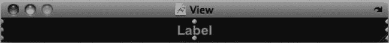

**图 4-9.** 成就达成视图和标签

将视图和标签分别连接到`IBOutlets`。在示例代码中，它们被命名为`achievementCompletionView`和`achievementCompletionLabel`。然后我们修改`achievementEarned:`方法，并添加另一个用于处理动画的方法。

```
- (void)achievementEarned:(GKAchievementDescription *)achievement;
{
    [achievementCompletionView setFrame:CGRectMake(0, 320, 480, 25)];
    [[self view] addSubview:achievementCompletionView];
    [achievementcompletionLabel setText:[achievement achievedDescription]];
    [UIView beginAnimations:@"SlideInAchievement" context:nil];
    [UIView setAnimationDuration:0.5];
    [UIView setAnimationDelegate:self];
```


```markdown
`[UIView setAnimationDidStopSelector:@selector(achievementEarnedAnimationDone)];`

`[achievementCompletionView setFrame:CGRectMake(0, 295, 480, 25)];`

`[UIView commitAnimations];`

`}`

```
-(void)achievementEarnedAnimationDone
{
    [UIView beginAnimations:@"SlideInAchievement" context:nil];
    [UIView setAnimationDelay:5.0];
    [UIView setAnimationDuration:1.0];
    [achievementCompletionView setFrame:CGRectMake(0, 320, 480, 25)];
    [UIView commitAnimations];
}
```

这两种方法都相当直观。当应用从完成成就中收到代理回调时，我们会将 `achievementCompletionView` 添加到游戏视图中。然后，我们将其动画显示到视图的底部。在五秒延迟后，我们再将其动画移出视图。你还可以访问 `GKAchievementDescription` 中使用的图像。我们将在下一节进一步研究这些属性。

> **提示：** 你可能需要重置成就才能看到任何完成进度。我发现创建一个用于测试期间重置成就的新按钮非常有用。

如果你现在运行应用并绑架一头牛（假设你尚未完成该成就），你应该会看到与图 4-10 所示非常相似的输出。

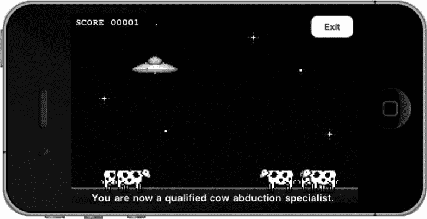

**图 4-10.** 显示自定义的成就横幅

### 添加成就完成横幅

当 Game Center 首次发布时，开发者需要负责创建和显示用户的成就反馈。在 Game Center API 的首次更新后，苹果在 iOS 5 中为 `GKAchievement` 类添加了一个非常易于使用的属性，让你能够快速实现这一步骤：如以下代码片段所示，设置 `showsCompletionBanner` 属性会在成就完成时向用户显示一条消息。`showsCompletionBanner` 的默认属性是 `NO`。

```
myAchievement.showsCompletionBanner = YES;
```

### 自定义成就图形界面

有时你可能希望自定义成就系统的外观，以匹配应用中的自定义图形界面。正如你在上一章的排行榜中看到的，我们可以处理原始数据并以自己选择的方式呈现。本节重点介绍使用你自己的图形界面将成就添加到应用中。与我们处理自定义排行榜时一样，首先需要添加一个新按钮来显示自定义的成就进度视图。添加一个新按钮及其关联操作，如图 4-11 所示。

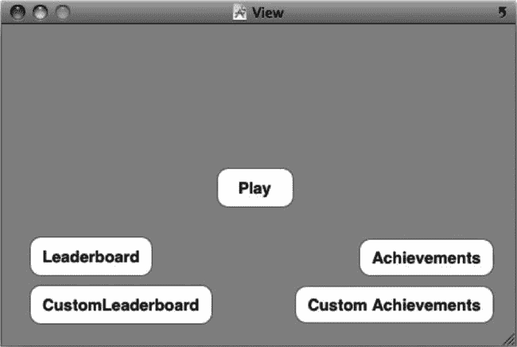

**图 4-11.** 在 Interface Builder 中添加自定义成就按钮

我们需要创建一个新类来处理成就进度信息的处理和显示。创建一个名为 `UFOAchievementViewController` 的新类，并将其设为 `UIViewController` 的子类。在 XIB 中为表格视图、导航栏和关闭按钮设置操作和输出口。同时不要忘记为表格视图设置数据源和代理。你的 XIB 应类似于图 4-12 所示。

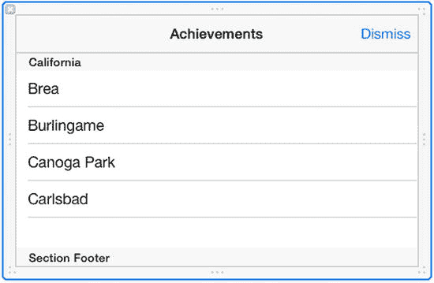

**图 4-12.** 在 Interface Builder 中显示的自定义成就进度视图

我们还需要创建一个用于存储成就数据的数组。创建一个新的 `NSArray` 对象，并将其命名为 `achievementArray`。同时需要导入 `GameCenterManager` 的头文件并遵循其协议。`UFOAchievementViewController` 的头文件现在应类似于以下内容。

```
#import <UIKit/UIKit.h>
#import "GameCenterManager.h"

@interface UFOAchievementViewController : UIViewController <UITableViewDelegate,
    UITableViewDataSource, GameCenterManagerDelegate>
{
    GameCenterManager *gcManager;
    UITableView *achievementTableView;
    NSArray *achievementArray;
}

@property (nonatomic, retain) GameCenterManager *gcManager;
@property (nonatomic, retain) NSArray *achievementArray;
@property (nonatomic, retain) IBOutlet UITableView *achievementTableView;
- (IBAction)dismissAction;

@end
```

接下来，连接操作以呈现我们的新 `UFOAchievementViewController` 类。编辑在 `UFOViewController` 中创建的操作，以反映以下更改：

```
- (IBAction)customAchievementButtonPressed;
{
    UFOAchievementViewController *achievementViewController =
        [[UFOAchievementViewController alloc] init];
    [achievementViewController setGcManager:gcManager];
    [self presentViewController:achievementViewController animated:YES completion:nil];
    [achievementViewController release];
}
```

让我们花点时间切换到 `UFOAchievementViewController` 的实现文件。首先，添加一个方法来确保视图正确设置为横向。添加以下方法：

```
-(BOOL) shouldAutorotateToInterfaceOrientation:
    (UIInterfaceOrientation)interfaceOrientation
{
    if (UIInterfaceOrientationIsLandscape(interfaceOrientation)) return YES;
    return NO;
}
```

我们还需要一个关闭操作，因此也添加该方法：

```
- (IBAction)dismissAction
{
    [self dismissViewControllerAnimated:YES completion:nil];
}
```

如果你现在运行应用，应该会看到一个简单朴素的表格视图，类似于图 4-13 所示。此外，关闭按钮现在应该可以工作了。

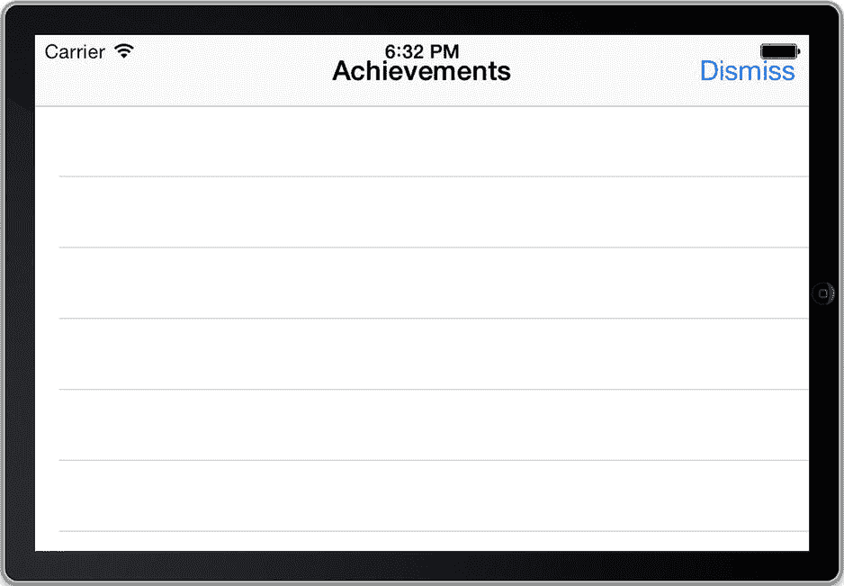

**图 4-13.** 我们将用于自定义成就的空白自定义表格
```


### 获取成就数据

在继续处理 `UFOAchievementViewController` 之前，我们需要先回到 `GameCenterManager` 类中。将以下方法作为可选协议添加到 `GameCenterManagerDelegate`：

`- (void)achievementDescriptionsLoaded:(NSArray *)descriptions error:(NSError *)error;`

然后在 `GameCenterManager` 的实现中添加以下新方法：

```
- (void)retrieveAchievementMetadata
{
    [GKAchievementDescription loadAchievementDescriptionsWithCompletionHandler:
     ^(NSArray *descriptions, NSError *error) {
         [self callDelegateOnMainThread:@selector
          (achievementDescriptionsLoaded:error:) withArg:descriptions error:error];
     }];
}
```

该方法会返回 Game Center 服务器上找到的所有 `GKAchievementDescription`。现在我们可以回到 `UFOAchievementViewController` 类中，完成自定义成就表格的实现。

> **重要说明：**  
> `retrieveAchievementMetadata` 方法也会返回隐藏的成就。如果希望向用户隐藏这些成就，你需要将它们从结果中过滤掉。

修改 `UFOAchievementViewController` 的 `viewWillAppear:` 方法，使其与以下代码一致：

```
- (void)viewWillAppear:(BOOL)animated
{
    [[self gcManager] setDelegate:self];
    [super viewWillAppear: YES];
    [[self gcManager] retrieveAchievementMetadata];
}
```

此外，添加我们之前创建的新协议方法。如果没有遇到任何错误，我们只需将返回的描述数组赋值给本地数组。获取到新数据后，我们还需要刷新表格以向用户展示数据。代码如下：

```
- (void)achievementDescriptionsLoaded:(NSArray *)descriptions error:(NSError *)error;
{
    if (error == nil)
    {
        [self setAchievementArray:descriptions];
    }
    else
    {
        NSLog(@"获取成就描述时发生错误: %@",
              [error localizedDescription]);
    }
    [achievementTableView reloadData];
}
```

对于 `numberOfRowsInSection` 方法，我们直接返回 `achievementArray` 的计数，如下所示：

```
- (NSInteger)tableView:(UITableView *)tableView numberOfRowsInSection:(NSInteger)section
{
    return [[self achievementArray] count];
}
```

我们还需要实现 `cellForRowAtIndexPath` 方法。将以下方法也添加到实现中。添加完成后，我们将对其详细分析。

```
- (UITableViewCell *)tableView:(UITableView *)tableView
         cellForRowAtIndexPath:(NSIndexPath *)indexPath
{
    static NSString *CellIdentifier = @"Cell";
    UITableViewCell *cell = [tableView dequeueReusableCellWithIdentifier:CellIdentifier];
    if (cell == nil)
    {
        cell = [[[UITableViewCell alloc] initWithStyle:UITableViewCellStyleDefault
                                      reuseIdentifier:CellIdentifier] autorelease];
        [cell setSelectionStyle:UITableViewCellSelectionStyleNone];
    }
    
    GKAchievementDescription *achievementDescription = [[self achievementArray]
                                                        objectAtIndex:[indexPath row]];
    [[cell textLabel] setText:[achievementDescription title]];
    if ([achievementDescription image] == nil)
    {
        [[cell imageView] setImage:[GKAchievementDescription
                                    placeholderCompletedAchievementImage]];
        [achievementDescription loadImageWithCompletionHandler:^(UIImage *image,
                                                                 NSError *error) {
            if (error == nil)
            {
                [[cell imageView] setImage:image];
            }
        }];
    }
    else
    {
        [[cell imageView] setImage:[achievementDescription image]];
    }
    return cell;
}
```

该方法前半部分相当标准：要么创建一个新的表格单元格，要么从可重用集合中获取一个。这里我们使用默认的内置表格单元格来节省时间。我们创建一个新的 `GKAchievementDescription`，并根据 `achievementArray` 的行号填充数据。

我们处理的第一个属性是标题，用它来设置单元格的 `textLabel`。在大多数情况下，你可能还需要使用 `achievedDescription` 或 `unachievedDescription`。为了简化，这里我们只使用标题。接下来，我们需要为成就设置图片。这部分稍微复杂一些。

`GKAchievementDescription` 有一个相关的图片属性，在填充之前该属性为 `nil`。首先检查该属性是否已被填充，只需一个简单的 nil 检查即可完成。如果已填充，我们将单元格图片设置为已缓存的那张。如果未填充，则需要从 Game Center 服务器加载图片。为此，我们在 `GKAchievementDescription` 对象上调用 `loadImageWithCompletionHandler`。该方法会返回已获得的图片。请注意，我们使用了默认的占位图片，可以通过 `GKAchievementDescription` 的类方法访问该图片。

> **提示：**  
> 在 `UITableViewCellSytleDefault` 单元格中设置图片时，不要将图片设为 `nil`。否则会导致单元格文本左对齐并移除图片视图。如果此时通过 block 加载图片，图片在单元格或表格重新加载之前都不会显示。这就是我们先设置占位图片的原因。

如果现在运行应用并查看自定义成就视图，它应该类似于图 4-14 所示。

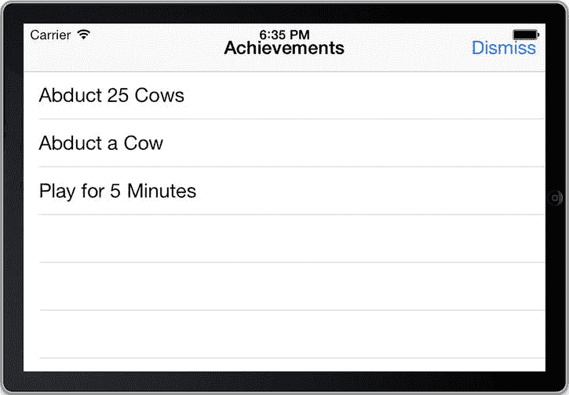

**图 4-14.** 自定义 GUI 中展示的成就数据

目前我们只能看到成就列表及其关联图片，但无法查看用户解锁成就的进度。回想一下，本章前面我们编写了几个便捷方法，在这里会很有用。有两个方法可以返回成就的进度：`percentageCompleteOfAchievementWithIdentifier:` 和 `achievementWithIdentifierIsComplete`。此外，如果需要访问整个 `GKAchievement` 对象，可以使用 `achievementForIdentifier`。接下来我们使用 `percentageCompleteOfAchievementWithIdentifier:` 来显示完成百分比。修改 `cellForRowAtIndexPath:` 中设置单元格文本标签的代码段。新的代码段应如下所示：

```
NSString *percentageCompleteString = [NSString stringWithFormat: @" %.0f%% 完成",
                                      [[self gcManager] percentageCompleteOfAchievementWithIdentifier:
                                       [achievementDescription identifier]]];
[[cell textLabel] setText:[[achievementDescription title]
                           stringByAppendingString:percentageCompleteString]];
```

再次运行游戏，你会发现输出信息更加实用，如图 4-15 所示。

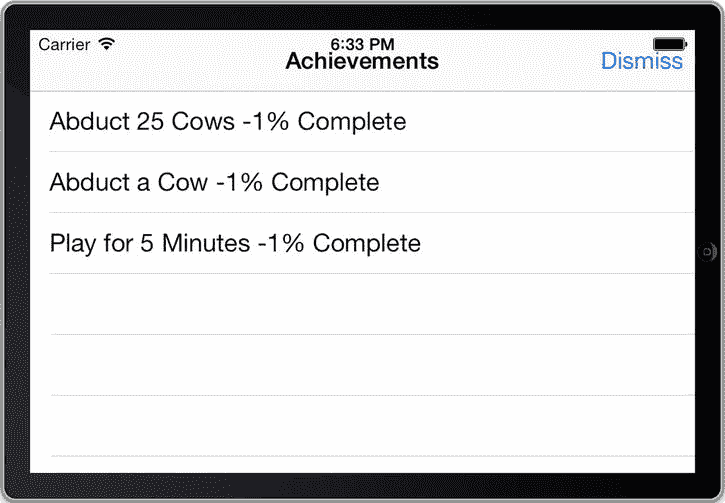

**图 4-15.** 带有完成百分比的自定义 GUI 成就显示


## 从提交失败中恢复

开发者全权负责处理成就提交失败的情况。你绝不能让用户丢失任何成就进度。丢失成就对用户来说是非常令人沮丧的，应不惜一切代价避免。为防止这种情况，可以采取与处理分数失败时相同的方法。主要区别在于无需存储`GKAchievement`对象，因为它不包含任何日期信息或时效性信息。我们只需存储`percentageComplete`值。我们将创建一个新方法来处理此行为。将以下方法添加到`GameCenterManager`类中。

```
-(void)storeAchievementToSubmitLater:(GKAchievement *)achievement

{

NSMutableDictionary *achievementDictionary = [[NSMutableDictionary alloc]
initWithArray:[[NSUserDefaults standardUserDefaults]
objectForKey:@"savedAchievements"]];
if ([achievementDictionary objectForKey:[achievement identifier]] == nil)

{

[achievementDictionary setObject:[NSNumber numberWithDouble:[achievement
percentComplete]] forKey:[achievement identifier]];

}

else

{

double storedProgress = [[achievementDictionary objectForKey:
achievement.identifier] doubleValue];
if ([achievement percentComplete] > storedProgress)

{

[achievementDictionary setObject:[NSNumber
numberWithDouble:[achievement percentComplete]]
forKey:[achievement identifier]];

}

}

[[NSUserDefaults standardUserDefaults] setObject:achievementDictionary
forKey:@"savedAchievements"];
[achievementDictionary release];

}
```

此方法将一个成就作为参数，并验证该成就是否已作为引用存储在我们未能成功提交的成就集合中。如果提交失败，则需要查看哪个成就的进度更靠前，以避免出现删除用户进度的情况。完成后，我们将它作为字典存储到`userDefaults`中，使用标识符作为键，完成百分比作为值。我们在`submitAchievement:PercentComplete:`方法的错误处理中调用此方法。相关代码片段如下所示：

```
if (achievement!= NULL)

{

[achievement reportAchievementWithCompletionHandler: ^(NSError *error) {
if (error != nil)

{

[self storeAchievementToSubmitLater: achievement];

}
if (percentComplete >= 100)

{

[GKAchievementDescription
loadAchievementDescriptionsWithCompletionHandler:
^(NSArray *descriptions, NSError *error) {
for (GKAchievementDescription *achievementDescription in descriptions)

{

if (![[achievement identifier]
isEqualToString:[achievementDescription
identifier]]) continue;
[self callDelegateOnMainThread:
@selector(achievementEarned:)
withArg:achievementDescription error:nil];

}

}];

}
[self callDelegateOnMainThread: @selector(achievementSubmitted:error:)
withArg: achievement error: error];

}];

}
```

**提示**

建议通知用户，他们的成就当前无法提交，但已保存并稍后将重新提交。这能让用户知道任何进度都没有丢失。

我们还需要一个新方法，用于检查是否有未提交的成就进度。至于何时调用此方法最佳，并没有标准答案。通常可以在用户通过 Game Center 认证后调用它，但你可能还想从其他方法中调用它，例如每当网络可达性状态更新时。将以下方法添加到你的`GameCenterManager`类中。

```
- (void)submitAllSavedAchievements

{

NSMutableDictionary *achievementDictionary = [[NSMutableDictionary alloc]
initWithArray:[[NSUserDefaults standardUserDefaults]
objectForKey:@"savedAchievements"]];
NSArray *keys = [achievementDictionary allKeys];
for (int x = 0; x < [keys count]; x++)

{

[self submitAchievement:[keys objectAtIndex:x] percentComplete:
[[achievementDictionary objectForKey:[keys objectAtIndex:x]] doubleValue]];
[[NSUserDefaults standardUserDefaults] removeObjectForKey:[keys
objectAtIndex:x]];

}
[achievementDictionary release];

}
```

此方法加载未提交进度的副本，并遍历每个项目，尝试逐一重新提交。如果再次提交失败，它们将被重新添加回已保存的数据中。

## 成就挑战

随着 iOS 6 的推出，成就现在可以作为挑战发送给 Game Center 好友。如果你的应用使用 Apple 提供的标准界面，则无需做任何更改即可为用户提供成就挑战功能。

如果你正在开发的应用使用自定义成就界面，或者你更倾向于启用编程式挑战，则可以使用以下代码片段来实现：

```
[(GKAchievement *)achievement issueChallengeToPlayers: (NSArray *)players message:@"Think you can earn this achievement!?"];
```

你可能还想获取所有可以发送当前成就挑战的玩家列表。以下代码将接收一个玩家 ID 数组（例如你的好友列表），并返回一个可以接受挑战的玩家列表。如果你的应用阻止用户接受已完成的成就挑战，这将非常有用。

```
[achievement selectChallengeablePlayerIDs: arrayOfPlayersToCheck withCompletionHandler:^(NSArray *challengeablePlayerIDs, NSError *error)

{

     if(error != nil)

     {

                       NSLog(@"An error occurred while retrieving a list of
        challengeable players: %@", [error
        localizedDescription]);

     }
     NSLog(@"The following players can be challenged: %@",      challengeablePlayerIDs);

}];
```

**注意**

为了让用户能够接受他们已经完成的成就挑战，需要在 iTunes Connect 中为每个成就勾选“可多次达成”选项。

还可以使用以下代码片段获取已验证用户所有待处理的`GKChallenge`项目数组：

```
[GKChallenge loadReceivedChallengesWithCompletionHandler:^(NSArray *challenges, NSError *error)

{

     if (error != nil)

     {

          NSLog(@"An error occurred: %@", [error localizedDescription]);

     }

     else

     {

          NSLog(@"Challenges: %@", challenges);

     }

}];
```

每个挑战都有一个关联的状态，例如已完成、已作废、已拒绝或待处理。可以通过以下方式轮询这些状态：

```
if(challenge.state == GKChallengeStateCompleted)
     NSLog(@"Challenge Completed");
```

最后，也可以通过简单地对其调用`decline`来拒绝传入的挑战，如下所示：

```
[challenge decline];
```

## 总结

现在，你已拥有所有必要的工具，可以为你的 Game Center 应用添加丰富且复杂的成就系统。你了解了添加成就的价值，以及如何在 iTunes Connect 门户中设置和配置它们。我们讨论了使用 Apple 默认成就图形界面和你自定义图形界面的优缺点。现在，你已知道如何扩展`GameCenterManager`类，以便在其中统一发布成就进度、获取成就反馈和重置成就进度。

你在本章中完成的最重要一步是扩展了可重用的`GameCenterManager`类，这使得你在未来的项目中可以轻松地添加成就功能。在下一章中，我们将探索 Game Center 的配对和邀请系统，以便你能够添加多人游戏功能和其他网络特性。


