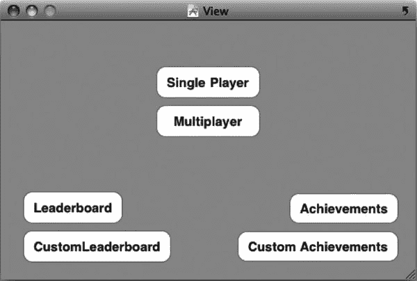
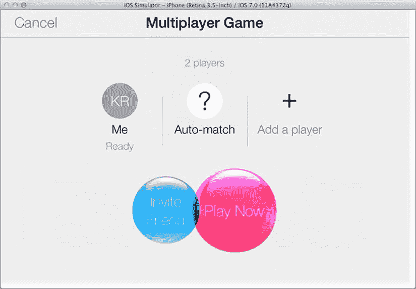
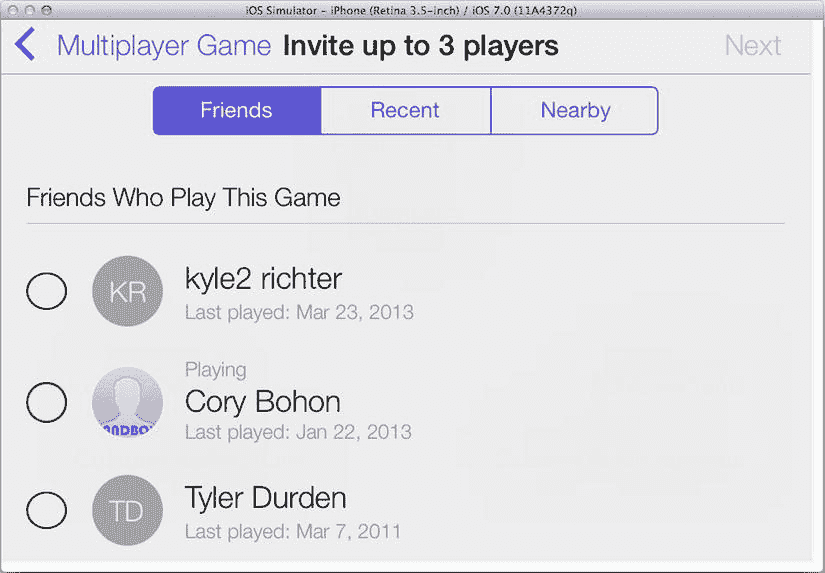
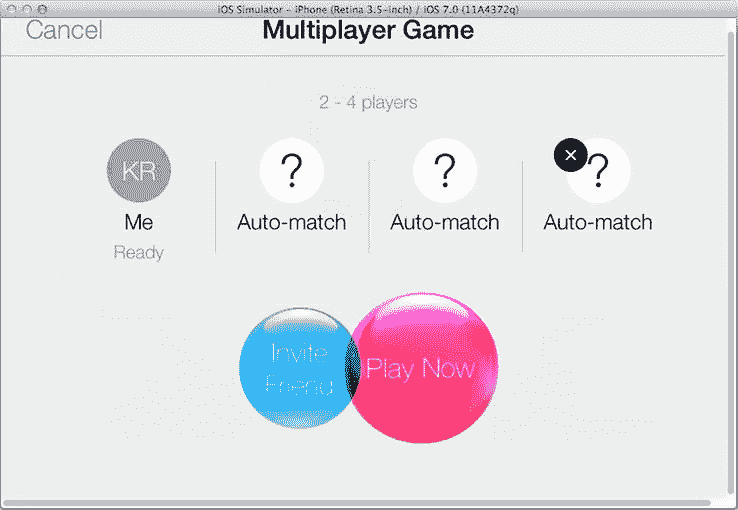
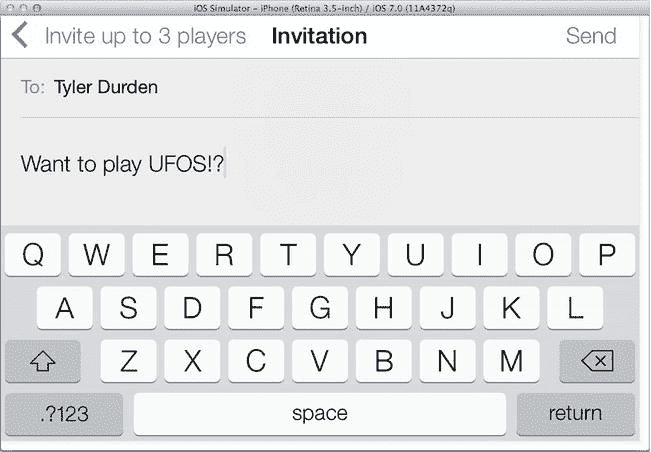
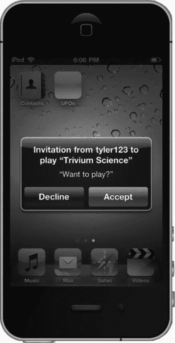
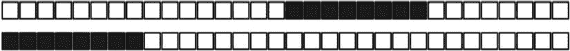
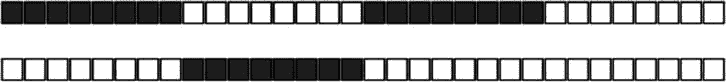
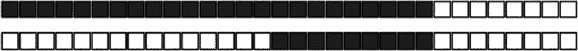
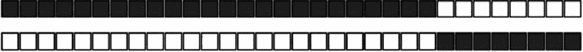

# 5. 匹配与邀请

## 摘要

谨慎选择你的敌人，因为他们将定义你。

> ——U2 乐队，《黎巴嫩的雪松》

从本章开始，并贯穿后续几章，我们将讨论如何将 Game Center 以及后来的 Game Kit 联网功能添加到你的应用或游戏中。在现代，为应用添加联网能力几乎被视为一项必备技术。添加联网支持的过程通常始于寻找可连接的对象。如今，几乎所有现代软件都包含某种联网组件，无论是与在线服务通信以检索或发布信息，还是直接与对等设备通信以交换数据。

在接下来的章节中，我们将讨论与其他对等设备的通信，尽管并非我们所有的联网配置都是点对点的（关于网络设计的详细信息，请参见第 7 章）。

尤其是本章，将探讨如何利用 Game Center 的邀请系统，使用 Game Center 来查找和邀请对等方进入你的应用。

Game Center 为你提供了一个被严重低估的销售和分发工具，而你处理邀请的开销却非常小。当邀请非本地用户在你的游戏或应用中开始多人体验时，你可以选择邀请任何一位 Game Center 好友。如果你邀请的好友当前未安装此应用，系统会提示他们立即购买应用并开始游戏。在 iPhone 上，没有其他方法能以此种方式向其他用户发送“立即购买”链接。此功能为发展你的用户群提供了一条绝佳途径——只需让你的用户为你销售即可。

除了“立即购买”链接，Game Center 还允许用户直接从 Game Center 界面内为你的应用评分，并且自 iOS 6 起，它提供了通过 Twitter 和 Facebook 分享你的应用的功能。单凭这些特性，就足以成为添加 Game Center 的有力理由，甚至无需涉及其提供的强大联网能力。

## 为什么要为你的应用添加联网功能？

看看近年任何一年销量前十的 PC 或主机游戏列表，你会发现其中绝大多数都是非常注重多人互动体验的游戏。让我们快速浏览一下 2012 年销量最高的 PC 游戏《使命召唤：黑色行动 2》。虽然这款游戏确实有单人模式，但它更像是游戏的一种附加功能，而非主要卖点。其重点显然在于多人游戏，甚至不惜牺牲单人战役。从《字母拼图》到《部落冲突》，多人在线 iOS 游戏已经开始站稳脚跟。近年来，行业的焦点已从制作丰富、深刻的单人战役，转向将更多精力投入到多人模式上。对于这种新现象，有一个完全合理的解释：在多人模式上投入能获得更高的性价比。

人类天生是社会性生物。我们渴望社交互动以促进健康的心理发展。电子游戏和其他社交软件正日益成为这种互动的出口。无论你是否同意这种说法背后的道理，但事实是多人游戏正变得越来越流行。无论是大型多人在线角色扮演游戏，还是你常见的、种类繁多的第一人称射击游戏，软件用户都越来越喜欢多人互动。

为你的游戏增加多人元素可以将用户的游戏时间延长百倍。如果需要证据，看看 1999 年发布的《雷神之锤 3》或《虚幻竞技场》，它们在发布后的许多年里仍有用户登录。如果这些游戏只专注于单人模式，它们很可能不会有如此忠实的粉丝群。下面列出了一些其他理由，说明为什么通过 Game Center 添加匹配和邀请功能对你的产品来说应该是一个简单的商业决策：

-   为游戏添加多人组件是提升游戏品质的好方法。取决于你正在制作的游戏类型，添加多人元素可能只需要很少的额外工作。
-   用户已经期望 App Store 上一流的游戏具备多人模式。
-   如果你拥有制作精良的多人组件，就可以为你的应用定出更高的价格。
-   没有什么比自动购买邀请系统更能让用户即时下载你的应用了。如果你能让潜在用户处于被邀请玩游戏并能立即购买的情景中，你完成销售的机会将大得多。
-   如果你正在使用广告支持系统，增加应用或游戏中的游戏时间或使用时间，将带来更多收入。如果你销售的是付费应用，用户会觉得他们的钱花得更值。
-   人类喜欢竞争，所以鼓励你的用户去做他们喜欢的事。多人模式或许不适合所有人，但对许多人来说，他们在选购新游戏时只对此感兴趣。
-   多人模式也可能为未来的应用内购买打开大门，从而增加收入和盈利能力。

> **提示：** 只要可能，也请为你的游戏用户提供单人游戏选项，因为仍然存在一个相当可观的、偏爱单人战役的用户群。此外，有些玩家可能并非时刻都能连接到互联网。


## 通用匹配场景

在开始处理匹配和邀请本身之前，理解在 iOS 应用或游戏中实现多人网络功能时可能遇到的一些场景至关重要。

*   第一个，也是最常见的场景是：一个已经在你的应用中的玩家想要创建一个自动匹配的游戏。所有玩家都已经安装并加载了该应用，并且处于预期要开始网络会话的状态。被邀请的玩家会收到一个通知，询问他/她是否想要加入与邀请者的游戏。当双方都同意时，匹配 GUI 将被关闭，并创建一个新的匹配。
*   另一个常见场景是：用户创建一个新的匹配事件，并邀请其 Game Center 好友列表中的其他玩家。被邀请的好友会收到一个推送通知，告知他们被邀请加入一个游戏。如果这些好友已经安装了游戏并接受邀请，游戏将会启动。一旦所有被邀请的玩家都进入匹配，游戏就会开始。如果他们尚未安装该游戏，系统将提示他们安装，并且在成功安装后游戏将自动启动。
*   如果好友被邀请，但他们尚未安装应用并决定安装，则会发生略有不同的事件流程。安装过程结束后，应用将自动启动，然后你可以继续匹配事件的正常流程。
*   玩家可以直接在 Game Center 应用中创建一个新的匹配事件。在这种场景下，所有玩家都会被启动到应用中，并收到加入匹配的邀请。这种情况最好的部分是：如果你的应用已经支持邀请，你无需编写任何额外的代码来支持此场景。
*   玩家也可以邀请一个或多个好友，并使用自动匹配器填充剩余的空位。这是前两种场景的混合，如果已经添加了对这两种场景的支持，那么你无需为此场景进行额外的编程。
*   你可能会遇到的最后一个场景（可选）是以编程方式自动匹配玩家。在这种情况下，请求会发送到 Game Center 服务器，然后匹配结果会返回给你。玩家不会看到任何标准 GUI，你可以选择实现自己的界面。

注意：匹配基于应用的 `bundle ID`；如果应用的 `bundle ID` 不匹配，则无法通过匹配系统进行通信。

### 创建新的匹配请求

要创建新的匹配，你首先需要创建一个新的 `GKMatchRequest` 对象。该对象代表了你将要创建的新匹配的所需参数。`GKMatchRequest` 既用于显示 GUI，也用于以编程方式创建匹配。当你使用 GUI 时，你会将 `GKMatchRequest` 对象传递给 `GKMatchmakerViewController` 的新实例；另一方面，如果你以编程方式处理匹配，你会将该对象传递给 `GKMatchmaker` 的实例。有关程序化匹配交互的更多详细信息，请参阅后续章节。现在，让我们专注于如何在代码中创建一个新的匹配请求。请看下面的代码片段：

```
GKMatchRequest *request = [[GKMatchRequest alloc] init];
request.minPlayers = 2;
request.maxPlayers = 2;
```

这个例子是演示如何创建新匹配的最简单方式。你必须同时指定最大和最小玩家数量。在这个例子中，我们创建了一个正好需要两名玩家的新请求。

`GKMatchRequest` 还有一个名为 `playersToInvite` 的属性，你可以使用 `GKPlayer` 标识符数组来自动填充到一个新的匹配中。这在连续进行多个游戏并且希望保持相同玩家组时非常有用。当你的应用从 Game Center 应用启动时，该属性也会被预填充为邀请你进入应用的玩家。

注意：当接受与好友的匹配邀请时，该事件由 Game Center 应用处理，并且 `playersToInvite` 属性将被填充。

`GKMatchRequest` 还有另外两个属性：`playerAttributes` 和 `playerGroup`，你将在本章后面的部分中使用它们。这两个属性将在同名的章节中详细讨论。

注意：如果你使用 Game Center 作为托管游戏的服务器，你最多只能有四名玩家。但是，如果你实现了自己的服务器（如本章“使用你自己的服务器”部分所述），则可以邀请最多 16 名玩家。


### 呈现匹配界面

我们首先从使用 Apple 提供的标准匹配界面开始。首先添加一个新按钮，用于在我们的测试游戏主屏幕上呈现该视图。我还提前将旧的“开始游戏”按钮重命名为“单人游戏”，并创建了一个名为“多人游戏”的新按钮（见图 5-1）。我们将使用 `UFOViewController` 作为匹配行为的委托，因此需要让该视图控制器遵循 `GKMatchmakerViewControllerDelegate` 协议。此外，将刚刚添加的多人游戏按钮的操作方法修改为以下代码：

```
- (IBAction)multiplayerButtonPressed;

{

GKMatchRequest *request = [[GKMatchRequest alloc] init];

request.minPlayers = 2;

request.maxPlayers = 2;

GKMatchmakerViewController *mmvc = [[GKMatchmakerViewController alloc] initWithMatchRequest:request];

mmvc.matchmakerDelegate = self;

[request release];

[self presentModalViewController:mmvc animated:YES];

[mmvc release];

}
```



图 5-1. 在 `UFOViewController.xib` 中添加一个新的多人游戏按钮

我们创建了一个新的 `GKMatchRequest` 实例，正如上一节所做的那样。我们的演示游戏将正好包含两名玩家，因此我们将最大和最小玩家数都设置为 2。

在代码片段的下一部分，我们创建了一个新的 `GKMatchViewController` 实例，并使用刚创建的 `GKMatchRequest` 对其进行分配和初始化。我们还将委托设置为我们的 `UFOViewController` 类。完成后，我们像呈现其他任何模态视图一样呈现它。你应该会看到类似图 5-2 的输出。



图 5-2. `MatchmakerViewController` 创建包含两名玩家的新匹配界面

如果你还没有这样做，现在正是为沙盒 Game Center 账户填充好友列表的好时机。在这个过程中，手头有几个未使用的电子邮件地址会很有帮助，因为你不想使用之前与 iTunes Connect 或 Game Center 关联过的任何电子邮件地址。一旦你添加了一两个好友，就可以继续点击图 5-2 中显示的“邀请好友”按钮。假设你已经完成了前面的步骤，系统将自动为你提供自动匹配功能。

**提醒**：在创建沙盒账户时，不要使用你之前在 iTunes Connect 或 Game Center 中使用过的任何电子邮件地址，否则可能会导致奇怪且意外的行为。

你现在应该能看到你的好友列表，并能够邀请他们进入你的应用，如图 5-3 所示。



图 5-3. 从你的 Game Center 好友列表中邀请一位好友

在继续之前，我们需要实现 `GKMatchmakerViewController` 的必需委托方法。具体来说，我们需要实现以下三个方法才能继续处理匹配：

```
- (void)matchmakerViewControllerWasCancelled:(GKMatchmakerViewController *)viewController
{
    [self dismissViewControllerAnimated:YES completion:NULL];
}

- (void)matchmakerViewController:(GKMatchmakerViewController *)viewController didFailWithError:(NSError *)error
{
    [self dismissViewControllerAnimated:YES completion:NULL];
    if (error != nil)
    {
        NSString *message = [NSString stringWithFormat:@"An error occurred: %@", [error localizedDescription]];
        UIAlertView *alert = [[UIAlertView alloc] initWithTitle:@""
                                                        message:message
                                                       delegate:nil
                                              cancelButtonTitle:@"Dismiss"
                                              otherButtonTitles:nil];
        [alert show];
        [alert release];
    }
}

- (void)matchmakerViewController:(GKMatchmakerViewController *)viewController didFindMatch:(GKMatch *)match
{
    [self dismissViewControllerAnimated:YES completion:NULL];
}
```

前两个方法处理用户取消和失败的情况，而第三个方法处理成功的情况。最后一个方法在成功时会返回一个 `GKMatch` 对象；我们将在后续章节中使用该对象来开始一场新的比赛。

当每场比赛允许的玩家数量可变时，用户将可以选择在匹配视图控制器中添加或移除玩家槽位，如图 5-4 所示。



图 5-4. 具有可变玩家数量的匹配界面

在邀请好友加入 Game Center 比赛时，你可以选择附带一条简短消息显示在邀请中，如图 5-5 所示。



图 5-5. 向好友发送邀请消息，请求他们与你开始一场比赛。此消息将作为推送通知发送，并在受邀者的设备上显示为一条传入的文本消息，如图 5-6 所示


### 处理收到的邀请

在为你的应用实现匹配功能时，你还必须实现一个处理来自好友邀请的系统。被邀请者的设备将收到一条推送通知，告知他们有好友邀请他们玩游戏。假设他们已安装该游戏并接受邀请，你需要处理如何通过一场新的比赛将两位玩家连接起来。如果被邀请者未安装该游戏或应用，系统会引导他们进行下载。下载完成后，将按照正常的邀请流程进行处理。

> **注意**
>
> 你还需要处理来自 `Game Center.app` 中创建的新比赛的邀请。你可能不需要编写任何额外的代码；但是，你确实需要彻底测试这个交互路径。

我们将使用邀请处理器来处理邀请（特别感谢苹果公司提供的命名）。邀请处理器接受两个参数；根据你处理的邀请类型，这两个参数中只有一个会是非空值。

-   当应用收到来自 Game Center 好友的邀请时，`acceptInvite` 参数为非空值。邀请你的玩家已经创建了比赛请求，因此你的应用在接接受邀请时无需自己创建。
-   `playersToInvite` 参数，我们在本章前面讨论过，当 `Game Center.app` 启动你的应用时，该参数为非空值。该属性包含一个玩家标识符数组，用于使用新的 `GKMatchRequest` 邀请这些玩家。当 `playersToInvite` 属性为非空值时，你需要创建一个新的 `GKMatchRequest`，并用你在这里收到的玩家填充它。

> **重要**
>
> 在处理沙盒模式与邀请时，可能会遇到一些古怪的情况。如果你发现自己始终收不到邀请的推送通知，请在两个设备上都打开该应用，并让双方互相邀请对方一次。完成此操作后，即可恢复从主屏幕测试邀请的功能。

现在我们已经了解了需要处理的参数类型，以及会遇到的各种场景，我们可以开始编写一个新的邀请处理器了。`GKMatchmaker` 有一个名为 `sharedMatchmaker` 的单例方法，它接受一个 `inviteHandler` 属性。我们在此使用一个 block 来设置和处理接收到的邀请。为了保持简洁清晰，我们将邀请处理器封装在 `GameCenterManager` 类自身的一个方法中。将以下新方法添加到 `GameCenterManager` 中：

```
- (void)setupInvitationHandler:(id)inivationHandler;

{

[GKMatchmaker sharedMatchmaker].inviteHandler = ^(GKInvite *acceptedInvite,É

NSArray *playersToInvite)

{

GKMatchmakerViewController *mmvc = nil;

if (acceptedInvite) {

mmvc = [[GKMatchmakerViewController alloc] initWithInvite:acceptedInvite];

} else if (playersToInvite) {

GKMatchRequest *request = [[GKMatchRequest alloc] init];

request.minPlayers = 2;

request.maxPlayers = 2;

request.playersToInvite = playersToInvite;

mmvc = [[GKMatchmakerViewController alloc] initWithMatchRequest:request];

[request release];

}

mmvc.matchmakerDelegate = inivationHandler;

[inivationHandler presentViewController:mmvc animated:YES completion:NULL];

[mmvc release];

};

}
```

让我们分解这个方法，看看每一步具体发生了什么。我们做的第一件事是向 `shareMatchmaker` 单例的 `inviteHandler` 属性设置一个 block。当这个 block 被执行时（这发生在用户接受邀请时），我们有两种可能的结果。

第一种情况是 `acceptedInvite` 不为 nil。在这种情况下，我们创建一个新的 `GKMatchmakerViewController` 实例，并用被接受的邀请对其进行初始化。然后我们向用户展示这个视图控制器。

在第二种情况下，`playersToInvite` 为非空值。此时，我们需要创建一个新的 `GKMatchRequest` 实例。在我们的示例游戏中，我们只允许最多两名玩家，但你应该将其设置为你游戏中允许的最大玩家数量。我们将请求的 `playersToInvite` 属性设置为从 block 传入的玩家 ID 数组。创建完新的请求对象后，我们可以创建一个 `GKMatchmakerViewController` 来向用户展示相关信息。他们将看到标准的匹配视图，并且玩家列表已预先填充。

> **重要**
>
> 在你通过 Game Center 认证本地用户之前，你无法正式接受或以其他方式处理邀请。因此，在成功认证后尽快注册一个邀请处理器非常重要。

因为我们希望在与 Game Center 认证成功后尽快调用此方法，所以在成功认证后添加对新的 `setupInvitationHandler:` 方法的调用。修改 `UFOViewController` 中的 `processGameCenterAuthentication` 方法，使其与以下代码一致：

```
- (void)processGameCenterAuthentication:(NSError*)error;

{

if (error != nil) {

NSLog(@"An error occured during authentication: %@",É

[error localizedDescription]);

} else {

[gcManager setupInvitationHandler:self];

}

}
```

> **提示**
>
> 如果你没有两台设备来测试邀请，你可以使用模拟器作为其中一台设备。别忘了使用两个不同的 Game Center 账户登录模拟器和你的设备，否则你们将无法互相邀请。

我们将使用 `self`（即 `UFOViewController`）作为邀请处理器的代理。如果你在上一节“呈现比赛 GUI”中完成了所需的代理调用，则无需对此类进行任何额外修改。

恭喜！你现在可以处理进入你应用的邀请了（参见图 5-6）。在下一节中，我们将探讨如何配置自动匹配功能，以便为你自动填充受邀者。

> **注意**
>
> 邀请的“立即购买”功能无法在沙盒环境中测试；它只能用于正式版应用。为了在沙盒中测试邀请，每个测试设备都必须安装此应用。



**图 5-6.** 在你的应用外部收到邀请。你的应用名称会自动填入提示视图中。在邀请时，你可以选择指定一条消息，如前文图 5-5 所示。

## 自动匹配

自动匹配是 Game Center 提供的一项优秀功能，无需你付出额外努力。Game Center 维护着一个在线队列，里面是正在等待加入你应用中多人游戏的玩家。如果你没有用所有已邀请的好友填满一个新的比赛请求，自动匹配功能将自动用其他在线的未匹配玩家填充剩余的空位。

你可以使用玩家组和玩家属性来筛选自动匹配的结果，这两者都将在本章后面讨论。此外，你可以查询任何活跃玩家组的活动情况，以了解匹配到新比赛的平均等待时间；这也会在后面的章节中进一步讨论。


## 以编程方式进行匹配

你的应用也可以在不使用匹配界面接口的情况下，以编程方式查找匹配。你可以使用这种方法来实现自己的自定义匹配 GUI，或创建一种“立即匹配”类型的操作，在这种操作中，用户会被自动配对，然后在无需额外用户交互的情况下开始游戏。在我们的演示应用中不会使用这种匹配风格，但下面的方法将允许你以编程方式实现匹配：

```
- (void)findProgrammaticMatch
{
    GKMatchRequest *request = [[GKMatchRequest alloc] init];
    request.minPlayers = 2;
    request.maxPlayers = 4;
    [[GKMatchmaker sharedMatchmaker] findMatchForRequest:request withCompletionHandler:^(GKMatch *match, NSError *error) {
        if (error) {
            NSLog(@"在寻找匹配时发生错误: %@", [error localizedDescription]);
        } else if (match != nil) {
            NSLog(@"已找到匹配: %@", match);
        }
    }];
    [request release];
}
```

上述代码相当直接明了。我们创建了一个新的 `GKMatchRequest`，并将最小玩家数设为 2，最大玩家数设为 4。然后我们调用了一个新方法 `findMatchesForRequest`。当找到匹配时，该方法会调用我们的代码块，因此如果匹配没有快速返回，提供一个活动指示器可能是个好主意。在你获得一个 `GKMatch` 之后，就可以开始一场新的多人游戏，正如后续章节所述。

在使用以编程方式添加的匹配时，如果匹配耗时过长或用户改变了主意，允许用户取消匹配请求是很重要的。该操作可以通过以下代码行完成：

```
[[GKMatchmaker sharedMatchmaker] cancel];
```

## 向匹配中添加玩家

有时你可能希望在匹配创建后向其中添加新玩家。例如，也许有玩家退出游戏，而你希望在不重新开始游戏的情况下替换他；或者某个玩家在游戏开始后无法连接，你想用替补替代他。以下方法将使用自动匹配行为自动向匹配中添加新玩家：

```
- (void)addPlayerToMatch:(GKMatch *)match withRequest:(GKMatchRequest *)request
{
    [[GKMatchmaker sharedMatchmaker] addPlayersToMatch:match matchRequest:request completionHandler:^(NSError *error) {
        if (error) {
            NSLog(@"在向匹配添加玩家时发生错误: %@", [error localizedDescription]);
        } else if (match != nil) {
            NSLog(@"已向匹配添加了一名玩家");
        }
    }];
}
```

在玩家被添加到匹配后，你需要将该玩家与当前匹配同步。添加玩家会使该玩家能够接收和发送数据，但他们无法访问任何已经通过匹配发送过的数据。

## 重新邀请玩家

随着 iOS 5.0 的发布，Apple 增加了自动尝试重新邀请断开连接玩家的功能。此方法仅在两人 Game Center 匹配中受支持。当玩家断开连接时，会调用以下方法；Game Center 将自动尝试重新连接该玩家。如果成功，你将收到对 `match:player:didChangeState:` 的额外调用。

```
-(BOOL)match:(GKMatch *)match shouldReinvitePlayer:(NSString *)playerID
{
    return YES;
}
```

## 玩家分组

玩家分组允许你为每个玩家指定不同的分类。默认情况下，Game Center 会将所有人自动匹配到同一个组中。通过玩家分组，你可以指定某些玩家正在寻找只包含该组其他玩家的游戏组。

例如，想要在某个地下城特定层级或特定赛道上游戏的玩家将被分组在一起，以便他们与其他想要在同一层级游玩的玩家配对。玩家分组可用于将玩家划分到多种不同类型的分组中，例如：

*   想要玩同一地图层级（例如赛道）、RPG 中的同一区域、第一人称射击游戏中的同一地图或动作游戏中同一关卡的玩家。
*   根据技能水平区分玩家。要么让玩家选择他们希望游玩的技能水平，要么根据过往表现自动确定他们的技能水平。
*   正在进行的游戏类型。例如，玩家可以分为想玩夺旗、团队死斗、占领或单人求生模式的群体。
*   希望一起游戏的同一部落、公会、团队或网络中的玩家。
*   已购买额外应用内内容，不能再与未购买者配对的玩家。

玩家分组并不局限于这些项目，可以根据应用的需求以任何方式将玩家分组。玩家分组通过 `GKMatchRequest` 上的 `playerGroup` 属性表示。此属性的唯一限制是必须使用 `NSUInteger` 来表示。指定 `playerGroup` 相当直接，如下例所示。

```
#define kMyForestMap 123456789

GKMatchRequest *request = [[GKMatchRequest alloc] init];
request.minPlayers = 2;
request.maxPlayers = 4;
request.playerGroup = kMyForestMap;
```

在大多数情况下，你会希望让用户选择他们所属的 `playerGroup`；然而，也可能存在并非如此的情况，例如自动确定玩家的技能水平。

> **警告：** 在将 `playerGroup` 设置为任何非零值后，玩家将只与同组的其他玩家进行匹配。

## 玩家属性

与玩家分组类似，玩家属性在匹配过程中用于缩小用户可能遇到的可用游戏范围。玩家属性通常与玩家分组功能相似，但在某些方面处理方式不同。玩家属性的众多用途包括以下内容：

*   在角色扮演游戏中，角色通常会选择职业。通常需要多种职业的组合——比如治疗者、战士和法师——才能完成一个任务。
*   体育游戏中，团队通常有各种位置，如守门员、后卫、中场和前锋。一个团队需要所有这些位置的组合才能进行比赛。
*   在潜艇模拟游戏中，你也可以有不同的玩家角色，如船长、声呐操作员、领航员和武器系统操作员。
*   在第一人称射击游戏中，你需要玩家扮演诸如近距离格斗专家、狙击手、医护兵和排长等角色。


### 理解玩家属性限制

`Player` 属性可用于为每位玩家分配这些值，从而让你能够平衡一支包含所需玩家的队伍。然而，自 iOS 7.0 起，使用 `Player` 属性存在若干限制；在开始使用 `Player` 属性之前，理解这些限制非常重要。

-   每个角色只能由一名玩家担任。例如，在一场足球比赛中，你不能要求有三名中场球员。
-   所有角色都必须被填充后，游戏才被视为准备就绪。例如，你不能在缺少狙击手的情况下开始一款第一人称射击游戏（基于前面的例子）。
-   每位玩家一次只能担任一个角色；玩家不能以填充多个角色的方式加入游戏。例如，你不能让一位第一人称射击游戏中的玩家既愿意当狙击手又愿意当医护兵；在比赛请求最终确定之前，他们需要选择其中一个。
-   `Player` 属性在自动匹配期间会被使用。如果你邀请一位朋友加入游戏，系统不会检测他们是否匹配需要填充的角色。相反，他们会自动被分配一个随机角色。简而言之，朋友无法选择他们的 `Player` 属性。
-   在标准匹配图形用户界面中，角色不会在任何地方显示。你需要在进入此视图之前实现自己的系统，以允许用户选择他们的角色。
-   `GKMatch` 对象不包含关于哪些玩家被分配了哪些角色的信息。你需要实现在比赛连接后自行确定谁扮演哪个角色的系统。
-   没有现成的系统可以判断哪些角色需求过剩，或者哪些角色更难找到匹配。例如，在角色扮演游戏中，可能每个人都想玩法师，而没人想当治疗者；因此，法师要找到一个空位会困难得多，而治疗者则可以轻松找到。

### 使用玩家属性

不要让这一长串限制吓退你使用 `Player` 属性。即使存在这些限制，它们对于创造更好的多人游戏体验仍然极具价值。让我们来看一个如何使用 `Player` 属性构建匹配的示例。

```
#define class_SquadLeader            0xFF000000
#define class_Breacher               0x00FF0000
#define class_Grenadier              0x0000FF00
#define class_LightMachineGun        0x000000FF
```

我们首先为每个 `Player` 属性定义一个掩码，在本节后续内容中，我们将称其为“兵种”。这个示例代表了一款现代军事风格游戏中的标准战斗小队。每个兵种被分配了一个不同的掩码值。Game Center 使用一种算法，根据以下规则来匹配这些玩家：

-   匹配的掩码始终以邀请玩家的掩码开始。
-   如果邀请玩家已设置了 `Player` 属性掩码，Game Center 将忽略所有未设置 `Player` 属性掩码的玩家。
-   只有当玩家的 `Player` 属性掩码与已邀请到比赛中的任何玩家的掩码的任何部分都不重叠时，该玩家才会被加入比赛。
-   在玩家加入比赛后，该玩家的属性值将通过逻辑或运算合并到比赛的掩码中。
-   如果比赛的掩码值等于 `FFFFFFFF`，则认为比赛已完成并可以开始；如果掩码不等于 `FFFFFFFF`，Game Center 将继续搜索可以填充该比赛的玩家。
-   无法向 Game Center 查询当前正在等待哪名玩家。

以下内容基于我们刚刚定义的兵种。

一个空白的比赛所拥有的 `Player` 属性掩码如图 5-7 所示。


图 5-7. 一个空的玩家属性掩码 (`0x00000000`)

玩家 1 开始一场新比赛，并选择班长作为其兵种。当该玩家创建比赛时，比赛的 `Player` 属性掩码将如图 5-8 所示。


图 5-8. 代表班长兵种的玩家属性掩码 (`0xFF000000`)

现在，比赛发起者使用 Game Center 自动匹配新玩家。Game Center 找到的第一个玩家选择了掷弹兵作为其兵种。掷弹兵的掩码将如图 5-9 所示。


图 5-9. 代表掷弹兵兵种的玩家属性掩码 (`0x0000FF00`)

当我们将其与已有比赛的掩码进行比较时（如图 5-10 所示），可以看到没有重叠，因此该玩家可以被邀请加入游戏。



图 5-10. `0xFF000000` 与 `0x0000FF00` 的比较

当这些掩码合并形成新的比赛掩码时，它将如图 5-11 所示。


图 5-11. 一个新的比赛掩码，代表两名玩家 (`0xFF00FF00`)

玩家 3 选择突击兵作为其兵种并搜索游戏。Game Center 找到了我们一直在处理的这个比赛，并通过比较比赛掩码和突击兵掩码来确定是否还有空位供突击兵加入，如图 5-12 所示。



图 5-12. 上方是当前比赛的掩码 (`0xFF00FF00`)，下方是突击兵的掩码 (`0x00FF0000`)


各个掩码之间没有重叠，因此可以邀请`Breacher`加入游戏。玩家 4 选择了`Grenadier`职业，并让`Game Center`寻找对手。`Game Center`会再次找到我们进行中的比赛，并尝试将新玩家加入其中。

由于玩家 4 提供的掩码与比赛的掩码存在部分重叠（见图 5-13），因此该玩家无法加入。如果`Game Center`无法为该玩家找到空闲的比赛，它就会开始寻找新玩家来填补该玩家比赛中的空缺。



图 5-13. 上方是当前比赛的掩码（`0xFFFFFF00`），下方是`Grenadier`的掩码（`0x0000FF00`）

玩家 5 选择了`Light Machine Gun`作为其掩码，并开始寻找可加入的比赛。`Game Center`将其掩码与当前比赛的掩码进行比较，如图 5-14 所示。



图 5-14. 上方是当前比赛的掩码（`0xFFFFFF00`），下方是`Light Machine Gun`的掩码（`0x000000FF`）

由于两组掩码之间没有重叠，玩家 5 可以加入比赛。这将为比赛创建一个完整的玩家属性掩码，如图 5-15 所示。


图 5-15. 一个已完成的比赛掩码（`0xFFFFFFFF`）

如果玩家 5 从未加入游戏，而最初的邀请者想用来自`Game Center`的朋友填补这个空位，那么被邀请的朋友将无法选择他的职业。在这种情况下，比赛的掩码将如图 5-16 所示。随后，被邀请的朋友将被分配如图 5-17 所示的掩码，该掩码将补全比赛的掩码。这将完成所有玩家属性掩码，并允许游戏开始。


图 5-17. 用于补全比赛掩码所需的`Machine Gun`的掩码（`0x000000FF`）


图 5-16. 当前比赛的掩码（`0xFFFFFF00`）

设置玩家属性非常直接，如下面的代码片段所示。

```
#define class_SquadLeader              0xFF000000
#define class_Breacher                 0x00FF0000
#define class_Grenadier                0x0000FF00
#define class_LightMachineGun          0x000000FF
...
GKMatchRequest *request = [[GKMatchRequest alloc] init];
request.minPlayers = 4;
request.maxPlayers = 4;
request.playerAttributes = class_SquadLeader;
```

## 玩家活动

`Game Center`提供了一种查询近期玩家活动的方法。你的用户通常希望尽可能多地了解在寻找多人比赛时需要等待多长时间。重要的是要明确：玩家活动指的是**近期**的活动，而非**当前**的活动。苹果没有提供确切判断有多少玩家正在等待比赛的方法，但它确实提供了一种方法来确定最近有多少用户寻找过比赛。让我们看看获取玩家活动所需的源代码。在你的`GameCenterManager`类的实现文件中添加以下两个新方法：

```
- (void)findAllActivity
{
    [[GKMatchmaker sharedMatchmaker] queryActivityWithCompletionHandler:
    ^(NSInteger activity, NSError *error) {
        [self callDelegateOnMainThread:@selector(playerActivity:error:) withArg:[NSNumber numberWithInt: activity] error:error];
    }];
}

- (void)findActivityForPlayerGroup:(NSUInteger)playerGroup
{
    [[GKMatchmaker sharedMatchmaker] queryPlayerGroupActivity:playerGroup withCompletionHandler:^(NSInteger activity, NSError *error) {
        NSDictionary *activityDictionary = [[NSDictionary alloc] initWithObjects:
        [NSArray arrayWithObjects:[NSNumber numberWithInt: activity], [NSNumber numberWithInt: playerGroup], nil] forKeys:[NSArray arrayWithObjects:@"activity", @"group", nil]];
        [self callDelegateOnMainThread: @selector(playerActivityForGroup:error:) withArg: activityDictionary error:error];
        [activityDictionary release];
    }];
}
```

我们还需要在`GameCenterManager`的头文件中添加两个新的协议方法。添加以下两个可选协议。

```
- (void)playerActivity:(NSNumber *)activity error:(NSError *)error;
- (void)playerActivityForGroup:(NSDictionary *)activityDict error:(NSError *)error;
```

在`UFOViewController`中实现这些新的协议方法，如下所示：

```
- (void)playerActivity:(NSNumber *)activity error:(NSError *)error
{
    if (error != nil) {
        NSLog(@"查询玩家活动时发生错误: %@",
        [error localizedDescription]);
    } else {
        NSLog(@"近期所有玩家活动: %@", activity);
    }
}

- (void)playerActivityForGroup:(NSDictionary *)activityDict error:(NSError *)error
{
    if (error != nil) {
        NSLog(@"查询玩家活动时发生错误: %@", [error localizedDescription]);
    } else {
        NSLog(@"近期所有玩家活动: %@ 针对组别: %@", [activityDict objectForKey:@"activity"], [activityDict objectForKey:@"group"]);
    }
}
```

你应该会得到类似如下的输出：

```
2011-03-08 11:11:04.007 UFOs[3000:207] 近期所有玩家活动: 3 针对组别: 12345
2011-03-08 11:11:04.008 UFOs[3000:207] 近期所有玩家活动: 3
```

那么，现在我们有了指定玩家组别的活动数据，这些数字究竟意味着什么呢？苹果从未明确说明这些数字的确切含义，但通过仔细研究，它们似乎代表了过去一到三分钟内尝试通过自动匹配功能连接游戏的用户数量。这些数字似乎在该时间范围内的某个不确定的间隔期重置。此外，当用户尝试加入比赛时，新数字的反映似乎会有 15–30 秒的延迟。然后，可以通过多种方式（例如平均连接时间）将这些信息呈现给用户。

即使玩家活动功能存在局限性，它仍然是判断用户寻找比赛时可能等待时间的一个非常有价值的工具。然而，你需要确保这些数字仅用于参考信息，因为它们往往不够可靠，不足以作为决策依据。

**注意**：如果苹果系统提供的玩家活动信息不足以满足你应用的需求，你可以实现自己的服务器系统来精确跟踪有多少玩家正在等待比赛。要构建这样的系统，需要一个远程服务器来存储等待玩家数量，并将其转发回来进行显示。


### 使用自有服务器（托管比赛）

在通常情况下，Game Center 会为您托管比赛；然而，Apple 提供了一种技术，允许您实现自己的服务器来托管比赛。这种方法被称为“托管比赛”，可以在任何应用中实现，为基于 Game Center 的多人在线网络功能增加更多灵活性。

当使用 Game Center 托管比赛时，每台连接到比赛的设备都会创建一个 `GKMatch` 实例。`GKMatch` 类负责完成连接、握手、发送和接收数据以及处理错误等所有繁重工作。但有时您需要实现自己的服务器，最典型的场景是当您希望允许多于四人同时连接到同一比赛时。在这种情况下，您可以使用 Game Center 为比赛查找玩家，并使用自己的服务器来连接这些玩家。

> **提示：** 使用托管比赛最多可连接 16 名用户，而使用 Game Center 托管时只能连接四名。

不过，使用自有服务器也存在一些缺点，最显著的是，您现在需要负责之前由 Game Center 免费提供的所有底层工作。具体来说，您需要处理以下事项：

- 您必须自行设计并实现所有网络代码来连接玩家。Game Center 会为您查找比赛，但其作用到此为止。
- 如果您的应用使用标准匹配界面，则您的服务器必须在有新玩家成功连接时通知应用，以便更新图形用户界面。
- 语音聊天功能不再免费提供。不过，您仍然可以使用 `GKVoiceChatService` 类通过自己的网络系统发送语音数据。更多信息请参阅第 9 章。

为了在设备端支持托管比赛，我们需要对代码库进行少量修改。首先，我们修改本章前面设置的多人按钮操作方法。

```
- (IBAction)multiplayerButtonPressed

{

GKMatchRequest *request = [[GKMatchRequest alloc] init];

request.minPlayers = 2;

request.maxPlayers = 4;

GKMatchmakerViewController *mmvc = [[GKMatchmakerViewController alloc] initWithMatchRequest:request];

[request release];

mmvc.matchmakerDelegate = self;

mmvc.hosted = YES;

[self presentViewController:mmvc animated:YES completion:NULL];

[mmvc release];

}
```

如您所见，我们新增了一行代码——`mmvc.hosted = YES`——这告诉匹配界面 GUI，该比赛将托管在我们自己的服务器上。除了将 `matchmakerViewController` 设置为 `hosted` 之外，您还需要让每台设备连接到您的服务器。本节不涉及如何编写服务器端代码，因为这里可以采用数十种语言和方法。不过，在设备连接到您的服务器后，它需要使用加入玩家的 `playerID` 调用以下方法。

```
[matchmakerViewController setHostedPlayerReady: playerID ];
```

这将更新所有已连接玩家屏幕上的 GUI，告知他们新玩家已准备好开始比赛。当所有玩家都连接到您的服务器并确认准备就绪后，您的委托方法会被调用来开始游戏。在使用 Game Center 比赛时，我们使用委托回调 `matchmakerViewController:didFindMatch:` 来开始比赛。但对于托管游戏，我们使用以下方法：

```
- (void)matchmakerViewController:(GKMatchmakerViewController *)viewController didFindPlayers:(NSArray *)playerIDs

{

[self dismissModalViewControllerAnimated:YES];

NSLog(@"Players: %@", playerIDs);

//开始托管游戏

}
```

此时，您可以开始游戏，由您的服务器处理已连接玩家之间的通信。此外，您还可以像本章前面介绍的 Game Center 托管比赛那样，以编程方式开始托管比赛。

```
- (void)findProgrammaticHostedMatch

{

GKMatchRequest *request = [[GKMatchRequest alloc] init];

request.minPlayers = 2;

request.maxPlayers = 16;

[[GKMatchmaker sharedMatchmaker] findPlayersForHostedMatchRequest:request withCompletionHandler:^(NSArray *playerIDs, NSError *error) {

if (error) {

NSLog(@"查找比赛时发生错误: %@", [error localizedDescription]);

} else if (playerIDs != nil) {

NSLog(@"已为比赛找到玩家: %@", playerIDs);

}

}];

[request release];

}
```

如您所见，这与我们之前的方法非常相似，但不同的是，我们不再获得 `GKMatch` 对象，而是返回一个 `playerIDs` 数组。您还会注意到，我们可以将最大玩家数增加到 16 人。

## 总结

本章向您介绍了比赛匹配和邀请的概念。我们讨论了为您的 iOS 应用或游戏增加多人游戏功能的巨大优势，以及在此过程中可能需要克服的一些障碍。我们探讨了从呈现标准 Apple GUI 到使用玩家分组和玩家属性进行高度自定义匹配的整个匹配流程。我们还回顾了如何处理各种可能场景下的邀请，以及如何查询玩家活动。最后，我们发现了如何实现自己的服务器来消除 Game Center 的一些限制。我们扩展了可重用的 `GameCenterManager` 类，使其能够处理比赛匹配、邀请以及所需的开销，以便您可以快速为应用添加多人游戏功能。

在本章中，我们深入探讨了如何创建比赛并为比赛填充玩家。在接下来的章节中，我们不仅将学习如何在玩家之间进行通信，还将探索查找通信玩家的新方法。下一章将介绍如何使用 Game Kit 通过 Peer Picker 查找玩家。

