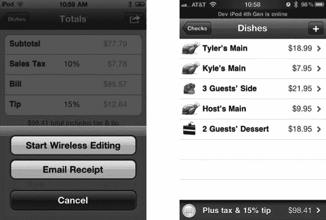
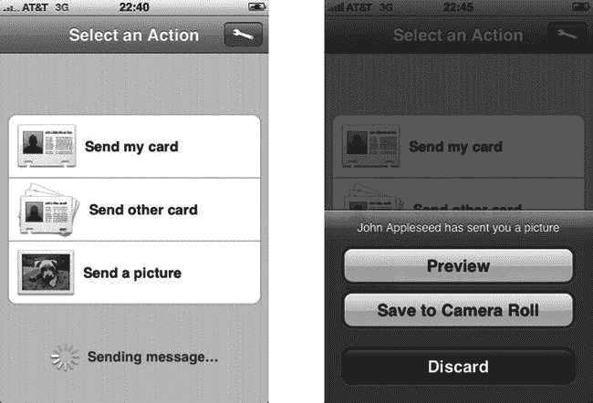
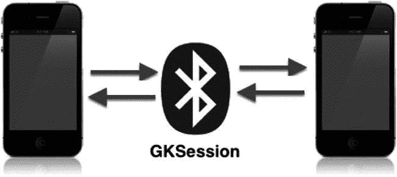
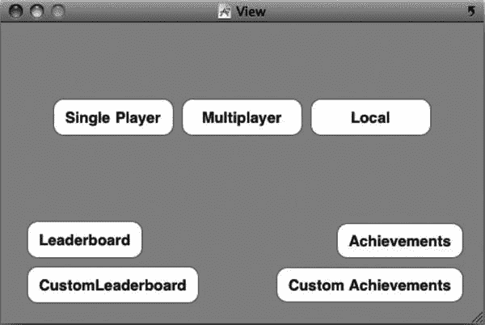
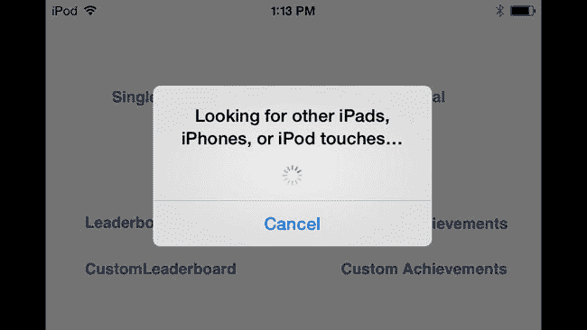
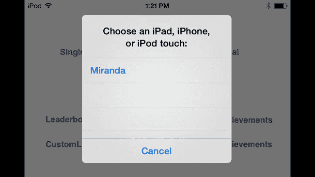
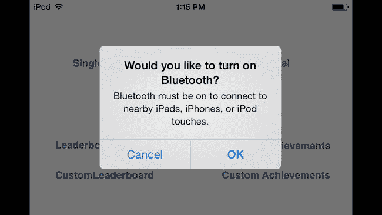
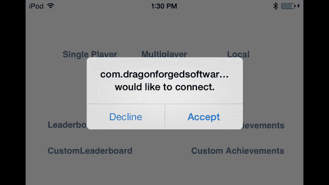
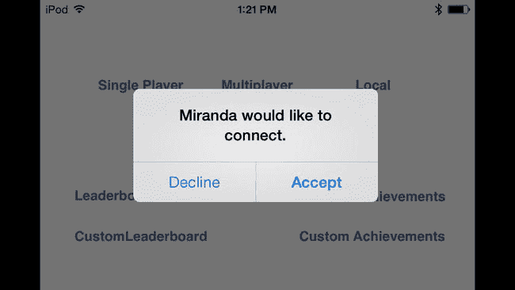
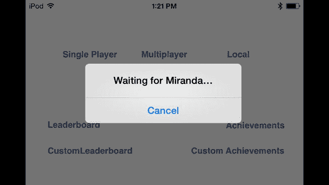

# 对等选择器

> **摘要：**“我坚信，任何能够增强沟通的工具，都会对人们相互学习以及实现他们所追求的自由产生深远的影响。”
>
> ——比尔·盖茨

在上一章中，我们探讨了如何使用 Game Center 查找比赛。在本章中，我们将了解 iOS 提供的另一种用于查找可连接玩家的系统。该系统称为对等选择器，可用于通过蓝牙或本地 Wi-Fi 网络（局域网）在两个 iOS 设备之间建立连接。

在我们开始编写实际代码之前，先快速回顾一下 Game Kit 和 Game Center 的发展历史。当 Apple 发布 iOS 3.0（当时称为 iPhone OS 3.0）时，它实现了一套新的 API 调用，统称为 Game Kit。在 3.0 时代，Game Kit 负责处理蓝牙、局域网联网和语音聊天服务。当 Game Center 在 iOS 4.0/4.1 中加入时，它为 Game Kit 带来了显著的改进。Game Center 实际上可以看作是 Game Kit 的扩展，而不是一个全新的 API。从 iOS 5 到 iOS 6 和 iOS 7，Game Kit 的网络功能和对等选择器基本保持不变。

在本章中，我们将学习如何使用蓝牙和 Wi-Fi 局域网建立新连接。在第 8 章中，您将学习如何使用共享方法发送数据，无论玩家是通过 Game Center 还是 Game Kit 找到的。


## 对等选择器的优势

自 iOS 4.0 引入以来，Game Kit 网络功能一直受到开发者社区的普遍忽视。这实在有失公允，因为 Game Kit 对于 iOS 开发者而言，依然是一个极其有用且便捷的工具。它仍然是向 iOS 应用添加点对点、双人网络连接的最简单方式。

在我开发的大多数多人应用中，我都同时实现了 iOS 的两种网络系统。Game Center 网络和 Game Kit 网络各有优劣，通常同时为你的用户提供这两种方式，要比因其中一种的局限性而被逼入死角更容易。以下列出了一些同时采用两者的理由：

-   你的用户可能无法访问外部网络连接，但依然希望进行多人活动。这种情况可能发生在汽车或飞机上的乘客中，只要能允许在飞行期间开启蓝牙设备。
-   你可能希望让用户轻松连接到附近其他（基于位置的）用户。虽然这可以通过 Game Center 的玩家群组来实现，但使用 Game Kit 要简单得多。
-   你需要在两台设备之间寻找延迟更低的连接。
-   你希望面向那些使用 iPod touch 或仅支持 Wi-Fi 的 iPad 的用户，他们可能无法稳定连接 Wi-Fi，或者根本无法访问蜂窝网络。
-   实现 Game Kit 网络比用 Game Center 实现完整的多人游戏系统更快捷、更容易。

正如你所见，用于查找对等玩家的“对等选择器”方法与 Game Center 的匹配系统存在一些重要差异。没有什么能阻止你同时实现这两种方式，而且至少在我看来，这是非常值得推荐的（即使苹果官方没有明确推荐）。

在接下来的章节中，你将学习一些让这两个系统并行不悖的方法。然而，如果你只选择实现其中一种，请仔细权衡哪种方案更能满足用户的需求。例如，如果你有一个应用可以向遇到的人分享你乐队的 MP3 文件，那么 Game Kit 将是更好的选择。

## 现实世界示例

自 iOS 3.0 发布以来，我们见证了 Game Kit 网络功能在非常意想不到的场景中得到应用。在本节中，我们将讨论一些使用 Game Kit 网络来增强用户体验的著名应用案例。我在这节中向您展示的两个应用，都更适合使用 Game Kit 网络而非 Game Center 网络。

首先，我们来看看 Black Pixel 公司开发的 Bistromath（见图 6-1）。这款应用的核心功能是在餐厅中为多位用餐者分摊账单。这个创意在 iPhone 上已经被用滥了，App Store 上有数十款应用提供这种服务。然而，Bistromath 即使价格高于免费的竞争对手，依然广受欢迎。这是为什么呢？

Bistromath 有其独特之处。它不仅设计精美、视觉吸引人，还提供了其他账单分摊应用所没有的功能：Game Kit 网络。Bistromath 使用 Game Kit 在多台设备之间建立 Wi-Fi 或蓝牙连接，允许用户登录“主机”应用并输入各自的餐品项目。



图 6-1.

来自 Black Pixel 的 Bistromath，它使用 Game Kit 网络来分摊账单

这个简单的功能让 Bistromath 在其细分领域脱颖而出。加入 Game Kit 网络功能后，用户无需再拿着 iPhone 在餐桌上传递，让每个人输入自己点的菜。像这样对你的应用进行微小的补充，就能极大地提升其感知价值。

Handshake（见图 6-2）是 Skorpiostech 公司在 App Store 早期开发的一款应用。它是第一款允许用户向其他用户发送自己名片的应用。为了支持 Handshake 的网络连接，其服务器团队投入了超过六个月的工作。服务器需要支持大量客户端登录，并为地理位置相近的其他客户端提供匹配服务。



图 6-2.

来自 Skorpiostech 的 Handshake，它使用自己的服务器系统在两个本地设备之间共享数据

每台设备会确定自己的位置，并告知服务器它的位置以及它在寻找对等用户。服务器随后会返回附近的用户，并允许应用在它们之间建立连接。如果在编写 Handshake 时 Game Kit 网络就已可用，这个过程本可以在几天内完成，而不是几个月。Handshake 从未被重写以支持 Game Kit；不过，当苹果在 iOS 3.0 中随 Game Kit 一起引入联系人共享功能时，它就被视为走到了生命尽头。

> **注**: Game Kit 和 Game Center 并不仅限于游戏。虽然苹果最近开始打击在非游戏应用中使用排行榜和成就系统，但你总有理由说它们为你的应用增加了类游戏功能。而 Game Kit 网络在任何应用中都不受限制。


## 使用会话（Sessions）

在使用 Game Kit 网络功能时，你需要使用一个 `GKSession` 对象（参见图 6-3）将所有内容串联起来。此对象用于创建和管理设备之间的临时蓝牙或本地无线网络连接。运行在多台设备上的同一应用副本，可以利用这些服务来发现彼此、连接、握手、交换数据并优雅地断开连接。

> **注意**  
> 原始 iPhone 或原始 iPod touch 不支持蓝牙联网。



**图 6-3.** 使用 `GKSession` 通过蓝牙进行的点对点联网

一个 `GKSession` 对象主要与对等节点（peers）协同工作。在此上下文中，对等节点是指任何通过创建并配置自身的 `GKSession` 对象而使其可见的 iOS 设备。对等节点只能看到运行着相同 bundle 标识符（bundle identifier）的其它应用上的对等节点。

每个对等节点由一个 `peerID` 字符串表示，该字符串始终是唯一的。你的应用可以使用某个对等节点的 `peerID` 来获取该对等节点的用户可读句柄或名称。类似地，当你的应用启动一个 `GKSession` 时，它会创建一个对等节点来代表本地用户，并且该对等节点会变得对附近所有设备可见。此处的“附近设备”指的是同一本地 Wi-Fi 网络上的任何设备，或蓝牙范围内的任何设备，详见表格 6-1 和 6-2。

> **注意**  
> 从 iOS 5 开始，Core Bluetooth 被添加到 iDevices 中，允许与蓝牙层直接交互。如果你的蓝牙实现超出了 Game Kit 的能力范围，Core Bluetooth 提供了更底层的功能。

**表 6-1.** 标准蓝牙设备的范围

| 蓝牙类别 | 毫瓦 (mW) | dBm (dBmW) | 近似范围 |
| --- | --- | --- | --- |
| 1 类 (iPhone 4s/5) | 100 | 20 | 约 100 米，或约 328 英尺 |
| 2 类 (iPhone) | 2.5 | 4 | 约 10 米，或约 32 英尺 |
| 3 类 | 1 | 0 | 约 1 米，或约 3 英尺 |

**表 6-2.** 标准蓝牙版本的数据速率

| 版本 | 数据速率 | 最大应用吞吐量 |
| --- | --- | --- |
| 1.2 版本 | 1 Mbit/s | 0.7 Mbit/s |
| 2.0 + EDR 版本 (iPhone) | 3 Mbit/s | 1.4 Mbit/s |
| 3.0 + HS 版本 | 24 Mbit/s | 不适用 |
| 4.0 (BLE) 版本 (iPhone 4s/5) | 可变 | 不适用 |

苹果最近启用了设备与 iOS Simulator 之间的蓝牙连接支持。然而，此支持存在一些限制：最值得注意的是，设备无法通过蓝牙找到 Simulator，因此 Simulator 必须发起连接。此外，iOS Simulator 不会检测 Mac 是否已启用蓝牙。最后，当设备收到连接时，连接的来源将显示为 bundle ID 字符串而非设备名称，如本章后面图 6-10 所示。

对等节点通过使用一个唯一字符串来标识其所实现的服务，从而被其他对等节点发现。这个唯一字符串就是 `sessionID` 属性。会话可以配置为三种模式之一：会话可以配置为广播其 `sessionID`，从而充当服务器（server）；或者搜索其他使用 `sessionID` 进行广告宣传的对等节点，从而充当客户端（client）；最后，也可以同时充当服务器和客户端，这被称为对等节点（peer）。在下一章中，我们将更深入地探讨 iOS 上的网络设计。

`GKSession` 有一个关联的 `GKSessionDelegate` 协议。每当发现新的远程对等节点、远程对等节点尝试连接，或某个对等节点的连接状态发生改变时，系统都会调用该委托。此外，你还需要设置一个数据接收处理程序（data-received handler），以便在接收到新数据时指定委托回调。这个回调可以与主要的 `GKSessionDelegate` 不同。第 8 章 将详细探讨数据交换。

> **注意**  
> `GKSession` 及其相关方法是线程安全的；然而，会话始终会在主线程上调用其委托方法。


## 展示对等选择器

与以往一样，我们将首先在`UFOViewController.xib`中为对等选择器添加一个新按钮，如图 6-4 所示。为这个按钮创建一个新的操作方法，命名为`localMultiplayerGameButtonPressed`。此外，你需要创建两个新的类变量：一个是`GKPeerPickerController`的实例，另一个是`GKSession`的实例。分别将它们命名为`peerPickerController`和`currentSession`。你还需要让`UFOViewController`符合`GKPeerPickerControllerDelegate`委托协议。



图 6-4. 为本地多人游戏添加按钮

将以下代码添加到新本地按钮对应的操作方法中。

```
- (IBAction)localMultiplayerGameButtonPressed
{
    peerPickerController = [[GKPeerPickerController alloc] init];
    [peerPickerController setDelegate:self];
    [peerPickerController setConnectionTypesMask:GKPeerPickerConnectionTypeNearby];
    [peerPickerController show];
}
```

这段代码不言自明：我们`alloc`并`init`了一个`GKPeerPickerController`的新实例，并将其委托设置为`self`。

我们需要为连接类型指定一个掩码。有两个选项可供我们选择：`GKPeerPickerConnectionTypeNearby`和`GKPeerPickerConnectionTypeOnline`。在本例中，我们使用`GKPeerPickerConnectionTypeNearby`，这将启用蓝牙连接。而`GKPeerPickerConnectionTypeOnline`常量则允许通过本地无线网络进行在线连接。

你也可以同时提供这两个选项，让用户自行选择。用户选择后，你可以继续处理，就像只给用户提供了一个选项一样。如果你现在运行应用并选择“本地”，你应该会看到一个类似图 6-5 的新`UIAlert`。



图 6-5. 搜索蓝牙对等设备时显示的提示。注意，此提示显示为灰色，而非`UIAlert`通常的蓝色

继续将应用安装到第二台设备上，如果没有第二台设备，也可以安装到模拟器上。当两台设备上的应用都准备就绪后，启动应用并选择“本地游戏”选项。起初，你会看到类似于图 6-5 所示的画面。几秒钟后，两台设备应该能找到彼此，然后你应该会看到类似于图 6-6 所示的提示。

> **注意：** 两台蓝牙设备相互发现可能需要长达 30 秒的时间。设备之间的距离越远，建立连接所需的时间就可能越长。



图 6-6. 使用对等选择器查找对等设备

如果用户设备上的蓝牙已关闭，而你启动了`GKSession`，系统将提示用户启用蓝牙，如图 6-7 所示。



图 6-7. 提示用户在设备上启用蓝牙。你无法通过应用内的其他任何方式启用蓝牙

如果你从可用对等设备列表中选择了其中一个，你会看到一条等待消息，如图 6-8 所示。被邀请的设备会看到一条消息，如图 6-9 所示；或者，如果是由模拟器发出的邀请，设备会显示类似图 6-10 的消息。

凭借我们编写的相对较少的代码，所有功能都已通过 API 提供给我们。如果你碰巧点击了“接受”按钮，你会发现没有任何反应。在“对等选择器委托”一节中，我们将实现完成对等选择器功能所需的委托调用。



图 6-10. 从模拟器向设备发来的邀请。注意，设备名称显示为包标识符



图 6-9. 从另一台对等设备向设备发来的邀请



图 6-8. 蓝牙等待建立连接

