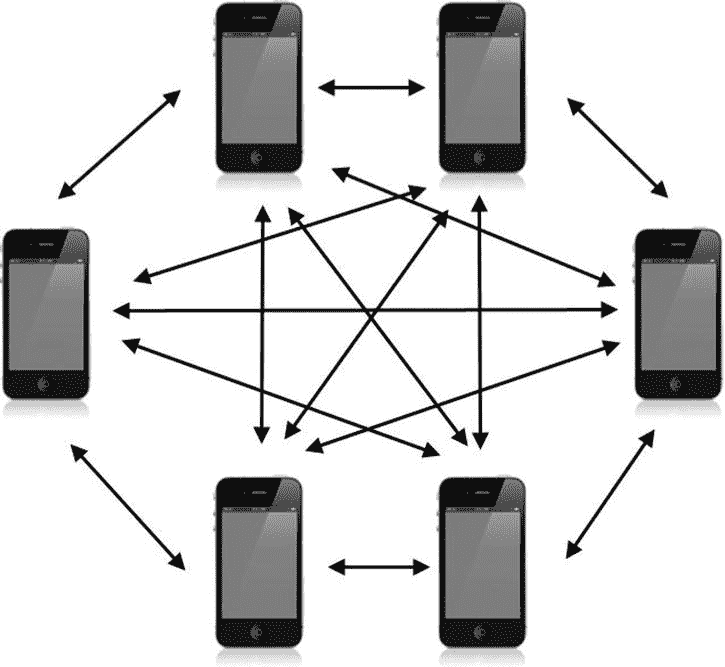
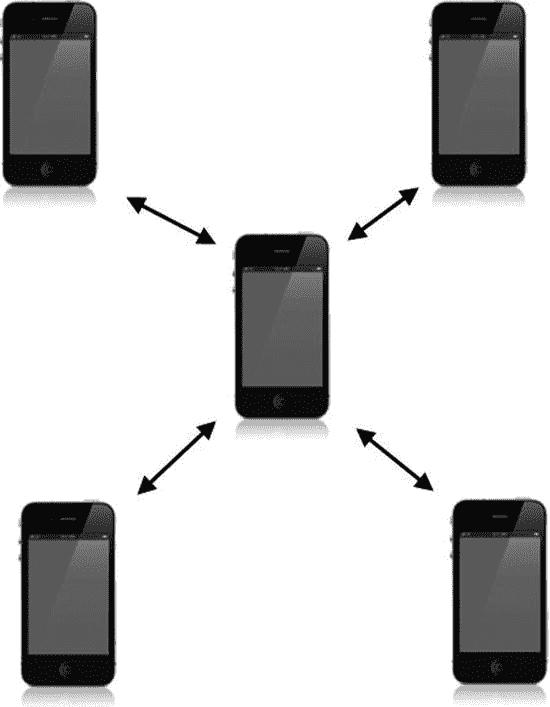
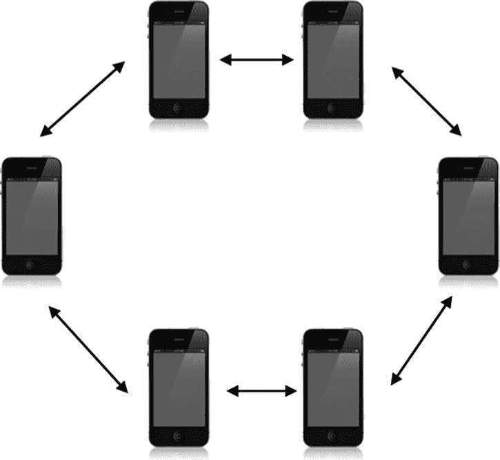

# 7. 网络设计概述

**摘要**

在前面的章节中，我们探讨了如何通过 Game Center 和 Game Kit 的各种方法来查找并与对等方建立连接。在本章中，我们将探讨如何不仅为 iOS 游戏，也为任何平台上的游戏设计网络体验。本章的设计风格与本书前几章略有不同。主要区别在于，本章不涉及相关源代码，并且我们只会简要提及 iOS 特有的网络主题。本章将重点放在网络设计的概念上，而不是应用内的实际网络实现。长期从事开发的开发者可能从之前的开发经验中已经熟悉这些网络类型，除了 iOS 天生是无线的之外，这与教科书中的网络示例并无差异。在第 8 章中，你将了解如何将所有内容整合在一起，让你的对等方开始相互通信。

## 提前规划

虽然直接着手编写网络逻辑是完全可行的——而且这种情况也屡见不鲜——但这种方法很可能会在后续引发更多麻烦。毕竟，你在编写新应用或游戏之前，不可能不先规划其运作方式。计算机网络是一个复杂的课题，你应该带着计划去处理它；否则，你可能会在投入大量时间和精力后，发现自己不得不重写整个系统。你绝不想因为所采用的方法限制了未来扩展的可能性，而陷入进退维谷的境地。与软件开发一样，你不应该在第一天就急于编写代码。你应该先在白板上做些梳理，摸清项目的需求。

以一款名为`Clan Lord`的桌面在线角色扮演游戏为例，它于 20 世纪 90 年代末为 Mac 平台编写。`Clan Lord`拥有一个非常忠实的粉丝群体，使该游戏持续活跃至今。然而，在游戏最初编写时，许多与网络相关的问题显然没有得到充分的深思熟虑。

`Clan Lord`在其所有网络调用中都采用了逐帧同步的方式。这意味着每一帧，玩家屏幕上可见的每一个元素，都必须传输给所有已连接的用户。这种方法在游戏规模小、用户基数小、功能有限的情况下是可行的，并且效果不错。但是，在设计软件时，你不能对未来抱有限制性的视野。要始终为最好的情况，或者——取决于你的视角——最坏的情况做好规划。在设计网络时，你必须考虑到六个月、一年，甚至十年后你希望你的游戏或应用实现什么功能。

`Clan Lord`如今深受几个根深蒂固的问题所困扰。例如，它的渲染引擎以每秒 8 帧（fps）的速度运行，因为在普通家庭网络上每秒钟无法同步超过八个完整帧的数据。如果在项目启动之初就在客户端实现一些逻辑，这个问题本可以避免；例如，告知客户端物体的位置及其移动时机，比每帧同步所有数据要高效得多。此外，玩家的移动被限制在 8 帧每秒，因为操作必须同步回服务器，这使得对事件的响应变得困难。这个问题也可以通过使用本章稍后讨论的**预测算法**来预防，该算法可以确定玩家在移动过程中的最终位置。

`Clan Lord`是这样一个例子：一款游戏的热门程度远超预期，并且寿命也比任何人想象的要长得多。遗憾的是，当这种情况发生时，你就会受限于项目启动之初的愿景和设计。事后撤销某些东西，远比最初就做对要困难得多。在设计你的游戏网络功能——也就是你的网络时——请花时间认真、有目的地进行，因为其结果可能会伴随你很长时间。

### 三种网络类型

尽管网络设计存在多种不同的风格和类型，但在设计游戏网络时，你主要可以实现三种基本的网络类型。几乎所有特定的网络配置类型都源于这三种基本类型。选择一种基本的网络类型是一个很好的起点，因为它将指引你走向设计流程的下一步。

我们将重点讨论三种基本的网络设计类型，但请记住，还有其他几十种众所周知的网络配置，本节中我们也会稍作提及。我们在本章中将详细讨论的三种网络类型是：点对点网络、客户端-主机网络和环形网络。

#### 点对点网络

点对点网络，如图 7-1 所示，是在 iOS 平台上最常见到的网络类型。在这种网络中，没有哪个设备被区别对待，每个设备都负责向所有需要与之通信的其他对等节点发送数据，并从中接收数据。

图 7-1. 使用六台 iOS 设备的点对点网络的可视化表示

在处理 Game Center 网络时，通常会采用点对点网络，因为在 iOS 平台上它通常最容易实现。虽然这种方法具有设置极其简单的优点，但同样也存在显著的弱点和缺陷。主要问题在于，它会产生大量冗余的开销。每个对等节点都需要将自身的行为告知所有其他对等节点。在图 7-1 所示的六方网络中，这意味着每次更新游戏状态时，每个设备都需要发送五条消息。此外，如果你实现的系统要求每个对等节点都用成功消息进行确认，那么你还需要接收五条消息。

点对点网络的另一个缺点是，当面对大量对等节点时，处理起来会变得非常混乱。从图 7-1 中可以看出，事情很快就会变得复杂。与我们将在本节讨论的其他基本网络类型不同，点对点方式是唯一一种没有明确数据流向的类型。根据定义，每个对等节点都可以向任何其他对等节点发送消息。这也意味着你必须跟踪每个对等节点需要知道的信息。在大多数情况下，这是一种完全可以接受的方法。然而，当你开始处理更复杂的网络时，这种配置可能就不再理想了。

此外，没有哪个设备能控制游戏的状态。如果游戏中存在人工智能组件，那么你需要设计一个系统，使其能在所有设备之间保持同步。

#### 客户端-主机网络

客户端-主机网络指定一台设备作为主机。主机设备负责向所有连接的客户端发送信息。客户端之间从不直接通信，它们只与主机通信，由主机将所需信息转发给其他客户端。图 7-2 展示了客户端-主机网络的典型结构。

图 7-2. 使用五台 iOS 设备的客户端-主机网络示意图

这种架构也被称为客户端-服务器网络，它简化了数据流。每个对等点或客户端只需关注自身和主机，无需了解网络中可能存在的其他设备。此类网络的优势在于，由一台设备负责同步所有信息并处理信息流，因此安全性极高（尤其在反作弊方面）。不过，在 iOS 平台上作弊问题并不严重，因为该系统本身就是一个沙盒环境。

这种网络还有其他优点，例如只需一台设备关注网络状态，且由该设备全权负责网络行为。这种网络简化了连接、断开、传输错误以及状态变化（如计算机控制的物体，比如人工智能）等事件的处理。然而，在 iOS 平台上，同样的架构可能会带来麻烦：如果主机设备需要处理过多信息，其运行速度可能会变慢或耗电增加。此外，如果一台设备需要处理所有游戏信息，可能会导致该设备上的游戏或应用性能不佳。在传统的桌面计算机网络中，主机或服务器通常是专用设备，或主机设备的额外任务对可用资源的影响并不大。

#### 环形网络

环形网络（见图 7-3）没有主机和客户端之分。它的工作原理类似于对等网络，但每个对等点只负责与一个指定的对等点通信，并且只接收来自另一个独立指定的对等点的信息。信息像环一样在一组设备之间流动，因此得名。

这种网络在 iOS 平台上并不常见，因为通常不需要它为断开的对等点提供冗余。Apple 已经做了大量基础工作来确保网络保持活跃和稳定，开发者无需额外投入设计时间来防止对等点之间失去联系。不过，在某些情况下，你可能会发现这种配置在 iOS 平台上设计网络时很有用。虽然环形网络提高了稳定性和连接性，但代价是增加了延迟并降低了传输速度。在移动设备上，网络连接成功的关键限制因素通常是延迟，在选择网络方案时应牢记这一点。

图 7-3. 使用六台 iOS 设备的环形网络示意图。注意，该图比图 7-1 所示的对等网络看起来简单得多

### 较少见的网络类型

计算机科学中还有许多其他类型的网络设计和样式。有些更实用，有些则主要停留在理论层面。本节将介绍一些较为知名的“非主流”网络。虽然其中一些可以在 iOS 设备上实现，但大多数在普通的 iOS 项目中可能不会带来实际好处。

- **无头客户端**——客户端完全不拥有任何数据，由主机设备控制。你可以将这种设置视为从服务器磁盘启动的计算机终端。其工作方式与虚拟网络计算（`VNC`）客户端非常相似。
- **专用服务器**——这种类型中的主机不参与游戏或活动，专门负责从对等点发送信息并收集新的输入。这通常由大型公司部署以创建游戏社区。虽然在 iOS 领域也可能见到，但这通常是一个远程的 Ruby on Rails 或 Python 服务器在发送数据，而非另一台 iOS 设备。
- **网状/部分网状网络**——这是一种对等网络，其中每个对等点可能不知道网络上存在的其他对等点。数据包被标记上目的地，每一跳都试图将数据包向目的地靠近。全网状网络意味着每个对等点都相互连接。
- **树形网络**——这种网络由相互连接的对等点组成树状结构，每个对等点都由一个中心点控制。中心点将消息传递给其他中心点，每个树分支则在该分支内来回传递消息。当处理延迟要求不高的极大规模对等点集群时，这种网络非常有用。
- **混合网络**——这种网络结合了两种或多种技术，例如通过一个中心服务器连接两个对等点组。

这涵盖了你在软件工程职业生涯中会遇到的大部分网络类型，当然，直到有更好的发明出现为止。实际上，你可以设计的网络类型没有限制，每年都会出现更好的设计和信息流。在下一节中，我们将研究网络上实际发送和接收的数据包。

## 可靠数据 vs. 不可靠数据

数据包可靠性是网络设计中的一个重要课题。在脱离 iOS 平台讨论数据包可靠性时，我们具体指代的是数据的优先级、数据包的排序以及重试判定因素。在深入探讨 iOS 中实现所需的细节之前，我们先分别审视这些属性及其与网络设计的关系（见表 7-1）。

**表 7-1.** 常见数据包属性及其对网络行为的影响

| 属性 | 与网络设计的关系 |
| --- | --- |
| 优先级 | 在进行底层网络编程时，你处理的是数据包。每个数据包大小固定，包含你想发送给其他对等方的相关信息。数据包通常被发送到队列中，然后再发送给其目标对等方。但由于网络并非精确无误（尤其当你试图获取最低延迟时），数据包接收的顺序可能并不总是与生成甚至发送的顺序一致。例如，在一个标准的在线游戏中，你可能会传递两种信息：游戏状态变更信息和聊天信息。显然，你的角色请求某个动作（例如攻击敌人或躲避攻击）需要及时发生，这比一条聊天信息更重要。解决此类问题的方法是为数据包设置优先级。对等方会循环遍历其所有待处理消息，并优先发送优先级最高的消息。这样，在发送失败时可以优先重试关键消息，同时也能将重要数据包提升到队列顶端。 |
| 排序 | 数据包接收的顺序可能至关重要。例如，如果你发送了 10 个共同组成一条超长聊天消息的数据包，那么这些数据包的接收顺序对于接收方对等方来说就非常重要。如果数据包没有按顺序接收和处理，你的消息可能会变得杂乱无章。当这种情况发生在控制状态机的数据包上时，可能会出现非常不可预测的行为。然而，确保数据包有序是需要付出一定开销的。如果你正在等待 10 个数据包中的第 1 个，那么你无法对可能已经收到的其他数据包做任何处理。这会造成一种局面：你的网络速度取决于最慢的那个数据包。如果排序对于你的网络正确运行并非至关重要，那你就不应过分担心顺序问题。 |
| 重试 | 网络本质上就是不可靠的。即使是连接到专用网络的台式机，也会出现丢包和其他故障。在处理移动设备上的网络可靠性时，唯一可以确定的就是故障的发生。当你向另一个对等方发送数据包时，有两种处理方式：第一种是发送即忘系统；第二种是发送并验证系统。在第一种方法中，你发送一个数据包，并不真正关心它是否到达。让我澄清一下：你确实关心，但如果发送失败，你也无能为力。这种可接受的失败的一个典型例子是语音聊天数据包。如果它未能成功到达终点，重新发送只会让音频与现实时间不同步；更好的做法是接受音频中的跳过，并继续传输数据流。在第二种方法中，数据包被认为是至关重要的，例如玩家打开一个宝箱、搜索被杀死的敌人寻找宝藏，或者更新他们的移动方向。对等方需要发送这些数据才能顺利执行命令。如果你跳过了这个数据包，将会让用户感到沮丧，因为他们不得不自己重试该动作，而不是让网络为他们重试。 |

现在我们已经涵盖了将数据包从一个设备发送到另一个设备所涉及的重要问题，我们可以来看看这些原则如何应用于 iOS 平台本身。

在 Game Kit 中，数据可以通过两种模式发送：第一种是 `GKSendDataReliable`；第二种自然就是 `GKSendDataUnreliable`。若要了解每种模式为我们做了什么，以及它们如何与我们刚刚讨论的主题相契合，请参见表 7-2。

**表 7-2.** 数据包属性及其在 Game Center 中的应用

| 属性 | `GKSendDataReliable` | `GKSendDataUnreliable` |
| --- | --- | --- |
| 优先级 | Game Kit 网络在处理数据包时不考虑任何类型的优先级。数据包按照它们被送入系统的顺序发送。 | Game Kit 网络在处理数据包时不考虑任何类型的优先级。数据包按照它们被送入系统的顺序发送。 |
| 排序 | 数据包将按照它们被发送的顺序接收。 | 使用此方法的数据包可能不会按照它们被发送的顺序接收。 |
| 重试 | 数据包将持续重试，直到成功接收。在第一个数据包收到确认之前，不会发送下一个数据包。 | 数据包被发送后，立即从队列中移除。API 在发送下一个数据包之前，不会等待接收成功的通知。这自然比在每个数据包之间等待响应要快。 |

## 只发送必要的数据

新手在设计网络时最容易犯的错误之一就是发送过多数据。把所有内容一股脑发出去确实简单。本章开头我们就讨论过一款存在这个问题的游戏。

> “如果我有更多时间，我会写一封更短的信。” ——布莱兹·帕斯卡

这句常被误引的名言，其实完全可以用来形容网络数据包。数据包的大小直接关系到网络的速度、稳定性和可扩展性。花时间弄清楚什么是最低限度的必要发送数据，这一点至关重要。

来看一个你在设计游戏时可能遇到的虚构例子。假设你正在开发一款角色扮演游戏：你控制自己的英雄，引导他/她穿过一系列地下城。在这些地下城中，你可以与物品互动，并遭遇各种敌人，实时展开战斗。我们知道会有一些静态数据；例如，你在迷宫内时，迷宫布局很可能不会改变。因此，我们不应该每帧甚至定期将地图瓦片发送给客户端，而应该在玩家首次进入该区域时发送这些数据。或许会有一些移动的元素，但其行为我们可以无限预测，比如流动的河流或闪烁的火把。这些物品也可以一次性加载，同时带上它们保持同步所需的信息。

当然，在玩家于地下城冒险的过程中，有些物品需要持续更新。玩家自身每次创建新动作时都需要更新。例如，如果你在向东跑，可以每帧发送一个数据包来告诉服务器你在向东跑。然而，处理这种交互更高效的方式是告诉服务器“开始以全速向东移动”。当你停止向东移动时，再通知服务器“停止”。这种交互方式能大幅减少完成相同任务所需发送给服务器的消息数量。正是诸如此类的优化，解释了为什么玩现代游戏时，你有时会看到断线的玩家冲着墙跑——服务器在客户端断线前从未收到过 `stop-running` 命令。

请花时间精心设计你网络数据的结构。你总可以随时添加更多信息，但随着网络设计深入，去除数据就会变得非常困难。始终寻找减小数据包大小的方法，因为数据包太小没有任何坏处，但一个过大的数据包会在未来给你和你的用户带来很多麻烦。

### 预测与外推

再考虑另一个例子：这次是赛车游戏。每位玩家控制一辆赛车在赛道上行驶。我们知道每辆车在比赛开始时的位置。我们也知道，由于网络往返延迟，我们发送给服务器的任何消息都会带有固有延迟。难道我们不应该等待服务器告知后才更新赛车位置吗？那会导致游戏体验非常卡顿。为了解决这个常见问题，我们使用预测技术。

我们知道，在接下来的几帧里，赛车十有八九会继续沿着当前路线行驶。我们会假设事物会保持当前状态，直到服务器另有通知；如果用户稍微向左或向右转向，这就是当服务器通知我们更新时需要进行的一个微小修正。运动中的物体在不受到外力作用时会保持运动状态，这不仅是物理定律，也是设计预测网络的第一个规则。

物体完全逆转其当前路线的概率，远低于物体对其当前路线进行微调的概率。这样一来，如果服务器通知你某些状态不同步，处理这些微小变化就更容易了。如果玩家确实完全改变了方向，或者以其他方式打破了你对后续行为的预测，你的预测误差最多也就等于当前的延迟，这通常只是几分之一秒。如果你有一个很可能继续保持当前状态的对象——比如移动中的玩家、下落状态的物体、子弹轨迹或任何类型的物理模拟——最好的办法就是假设这些动作将继续，直到服务器通知你它们已改变。

利用这些信息，你可以预测服务器将要传来的数据，你的网络看起来就会比实际速度快得多。预测网络技术就是为什么你在游戏中遇到延迟时，有时会看到玩家或物体轻微跳来跳去的原因。

### 消息格式化

无论何时为游戏或类游戏应用程序设计网络，你都必须处理至少两种类型的消息。它们通常被称为状态消息和服务器消息。状态消息是直接影响游戏引擎的消息，例如玩家移动或开启宝箱。服务器消息处理的是将一切粘合在一起的“胶水”，例如连接、断开连接、心跳包和错误。

快速将这些消息分派到不同的处理器至关重要。保持这些消息的解析代码放在不同位置是一个良好的设计模式。毕竟，你不会想在第一人称射击游戏中扫描所有聊天消息来寻找客户端超时消息。

有许多不同的方法来实现这种分离，但我发现大多数情况下使用一个简单的前缀就足够了。如果你为所有状态消息添加一个服务器消息中不会出现的特殊字符前缀，就可以快速检查传入消息的第一个字符，确保每条消息都被送达正确的解析器。如果你在设计一个更复杂的网络，可以使用大量可能的前缀来确保消息送达正确的位置。在第 8 章中，当我们开始发送和接收数据时，我们将研究消息格式化的实际示例。

## 防止作弊与超时断线

目前在 iOS 平台上，通过网络漏洞作弊还不是一个需要重点关注的问题。如果你是一位在线游戏玩家，可能对这种行为再熟悉不过了。精明的用户会分析网络行为模式，然后发送客户端本身绝不会发出的指令，例如`将生命值提升至浮点数上限`或`将重生时间缩短为零`。虽然你可能需要让服务器响应诸如`提升`或`降低生命值`这类指令，但必须确保服务器掌握控制权。举例来说，与其让客户端发送`“将移动速度提升至每秒五十英尺”`，不如设计成`“请求提升移动速度”`这样的消息格式，然后由服务器返回新的速度值。如果让客户端掌控变量，迟早会有人利用这一点来攻击你的系统。

当客户端没有任何需要向服务器或对等节点发送的更新数据时，最佳实践是发送一条简单的消息表明`“我还在线，请不要断开我的连接”`，这类消息被称为`“保活”`消息。尽管在 iOS 平台上你无需担心超时断线问题，但确保空闲对等节点之间保持通信线路畅通依然是明智之举。

在设计消息架构时，你完全可以将其视为设计 API；两者存在大量相似之处，必须遵循相同准则。如果你在应用的第一版中发布了允许用户查询移动速度的指令，那么第二版就难以轻易移除该指令，因为旧版客户端可能仍然依赖于它。请遵循 API 开发者采用的准则：全面测试所有功能，因为一旦发布到外部环境，就很难再收回了。

## 万策尽时如何应对

当你长期从事网络设计或软件开发工作后，必然会遇到这样一个问题：当设计的系统不再满足需求时该怎么办。我们来讨论一个可能让具备逻辑或商业训练背景的读者感到熟悉的症状。有一种被称为`“沉没成本谬误”`的现象，即人们在处理时间等不可退还资源时，会将其与可退还成本同等衡量。请看以下公式：

- `收益 = 项目收入 - 开放成本`

现在我们用实际数据来分析同样的案例。1968 年，研究人员诺克斯和英克斯特对 141 名赛马下注者进行了调查：其中 72 人刚在 30 秒内完成 2 美元下注，69 人即将在 30 秒内下注 2 美元。假设认为，刚刚做出行动承诺的人会通过比以往任何时候都更坚信自己选中了赢家，来减少决策后的认知失调。诺克斯和英克斯特要求下注者按七分制评估自己选中的马匹获胜概率。他们发现：即将下注的人给出的平均评分为 3.48，对应`“获胜机会尚可”`；而刚刚完成下注的人给出的平均评分为 4.81，对应`“获胜机会良好”`。这一假设得到证实：在投入 2 美元后，人们更加确信自己的下注会获得回报。诺克斯和英克斯特还对赛马场常客进行了辅助测试，并几乎完全重现了他们的发现。¹

我们在这里讨论的是，何时应该接受现实、放弃并重新开始。当你对一匹“马”投入时间和金钱后，最终会认为它的价值高于实际价值。放弃从来都不是受欢迎的解决方案；我们的大脑天生抗拒这种做法。我们会盯着不可退回的成本，并将其计算为有利于自己的因素。一旦做出投入，就更容易将这项投入合理化并试图捍卫它。没有人愿意成为那个叫停项目、抛弃所有已投入时间和金钱的人；然而，当你将时间和资源投入开发项目时，这些投入已经消耗且无法收回。你无法仅仅基于已投入的时间来证明继续投入更多时间是正确的。

何时该放弃并重新开始，没有绝对正确的答案，也没有绝对错误的答案。你唯一能做的就是客观审视问题：如果你尚未投入这个项目，你会选择什么解决方案？

## 总结

本章我们探讨了实际网络的设计，与本书其他章节中针对 iOS 的具体信息不同。即使没有本章内容，凭借常识和直觉，你也能够轻松设计出一个可运行的网络，但请牢记本章的核心经验：能工作，不代表工作得好。设计网络很容易；正确设计网络则非常困难。

关于网络设计的信息量远不止一章甚至一本书所能容纳。如果只能留下一条最终建议：当你开始构思网络结构时，要边推进边全面思考，永远不要满足于你的第一个方案。

下一章我们将正式开始实现设备间的消息传输。第 10 章还将对这项技术进行扩展，探讨如何为 iOS 应用添加语音聊天服务。

## 脚注

¹ Knox, R. E., & Inkster, J. A. (1968). `“Postdecision dissonance at post time.”` Journal of Personality and Social Psychology, 8, 319–323.

