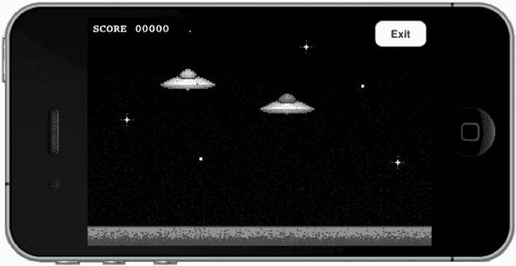
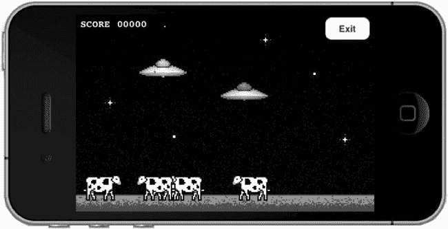
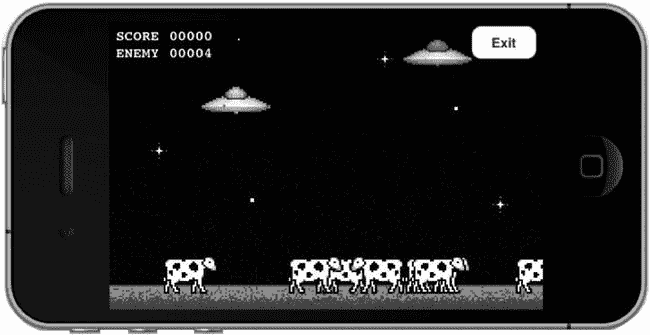
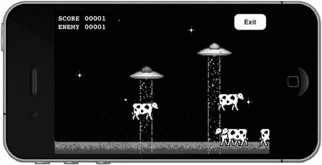

# 8. 数据交换

## 摘要

在过去的几章中，我们探讨了通过多种方式连接对等节点的方法。到目前为止，我们还未能充分利用这些连接。在本章中，你将了解到使用`Game Kit`和`Game Center`网络在节点间交换数据的所有知识。在前面的章节中，我们已经为 UFO 游戏添加了通过`Game Center`和`Peer Picker`（`Game Kit`）查找对等节点的功能。现在，我们将添加实际进行完整多人对战的能力。

由于所有基础工作已在前面章节中完成，对于数据交换我们只需关注两个事项：首先，需要发送实际数据；其次，需要在接收端接收并处理这些数据。其他所需工作均已就绪，仅剩本章结尾将处理的断连逻辑。让我们直接开始修改第 6 章的源代码。


## 修改单人游戏

要将单人游戏转换为多人游戏，我们需要进行一些修改。

- 一旦连接到新的对等方，我们就需要开始游戏。我们还需要一种方法，让现有的游戏引擎知道新游戏是多人模式。
- 需要指定一台设备作为主机设备。我们将让这台设备控制牛群的运动，因为两台设备不能同时控制牛群的运动。如果我们希望两台设备保持同步，这是一个重要的步骤。
- 每个对等方都需要将自身的操作（如移动和使用牵引光束）告知其他对等方。
- 每个对等方都需要解析其他对等方的设备，并更新自身的游戏状态，以使两台设备彼此保持同步。

这些步骤代表了将单人游戏转换为点对点多人游戏通常所需的最低要求。你的特定游戏或应用可能复杂得多。例如，你的多人游戏体验可能与单人游戏相差甚远，以至于无法为两种模式复用同一个类。另一方面，你的游戏也可能更简单。例如，一款多人海战游戏就不需要任何一台设备作为主机，因为其中没有需要你追踪的计算机控制元素。

## 为多人游戏设置引擎

我们首先需要让游戏引擎知道游戏状态应设置为多人模式还是单人模式。实现这一点有复杂的方法，也有简单的方法。根据你的需求，使用一个简单的状态变量通常就足够了。

在我们的示例中，我们将使用状态变量这种方法，因为我们的游戏非常直接。在`UFOGameViewController.h`中，我们创建一个新的实例变量来表示一个`BOOL`值，该值将用于通知类当前是单人模式还是多人模式。将以下两行代码添加到已有的头文件中，并且别忘了在实现文件中`synthesize``gameIsMultiplayer`。

```
@interface UFOGameViewController : UIViewController <UIAccelerometerDelegate,
GameCenterManagerDelegate>
{
    BOOL gameIsMultiplayer;
}
@property(nonatomic, assign) BOOL gameIsMultiplayer;
```

我们将在整个代码库中使用这个属性来判断游戏是否在多人模式下运行。

当游戏开始一场新的多人比赛时，有两个现有的方法会被调用。第一个方法`matchmakerViewController`会在 Game Center 找到比赛时被调用；第二个方法`peerPickerController`会在我们通过 Peer Picker 找到对等方时被调用。我们将为对等方处理两种不同的标识符：Game Center 返回一个`GKMatch`对象，Peer Picker 返回一个`NSString`来表示对等方。我们还会在`GameCenterManager`类中添加一些新方法，以便使用相同的代码同时与这两个系统进行通信。现在，我们只需专注于让游戏在全新的多人状态下运行起来。

```
- (void)matchmakerViewController:(GKMatchmakerViewController *)viewController
didFindMatch:(GKMatch *)match
{
    [self dismissModalViewControllerAnimated:YES completion: nil];
}

- (void)peerPickerController:(GKPeerPickerController *)picker didConnectPeer:(NSString
*)peerID toSession:(GKSession *)session
{
    currentSession = session;
    [self dismissModalViewControllerAnimated: YES completion: nil];
}
```

接下来，我们在每个方法的末尾添加一段代码，以便在找到想要与之对战的对等方后开始一场新的多人游戏。将以下代码片段添加到每个方法中。

```
UFOGameViewController *gameVC = [[UFOGameViewController alloc] init];
gameVC.gcManager = gcManager;
gameVC.gameIsMultiplayer = YES;
[self.navigationController pushViewController:gameVC animated:YES];
[gameVC release];
```

我们还需要持有代表对等方的`GKMatch`或`NSString`。在`UFOGameViewController`中创建两个新属性，分别命名为`peerIDString`和`peerMatch`。按照与设置`gameIsMultiplayer`实例变量相同的方式设置它们。头文件的新部分应该类似于下面这段抽象的代码片段：

```
@interface UFOGameViewController : UIViewController <UIAccelerometerDelegate,
GameCenterManagerDelegate>
{
    //...
    NSString *peerIDString;
    GKMatch *peerMatch;
}
@property(nonatomic, retain) NSString *peerIDString;
@property(nonatomic, retain) GKMatch *peerMatch;
```

现在，我们需要在开始新多人游戏的两个方法中添加设置这些属性的逻辑。这些方法现在应该如下所示。如你所见，我们将未使用的属性设为`nil`；这两个属性中总有一个会被设为`nil`，因为你不可能同时使用 Peer Picker 和 Game Center 进行游戏。

```
- (void)matchmakerViewController:(GKMatchmakerViewController *)viewController
didFindMatch:(GKMatch *)match
{
    [self dismissModalViewControllerAnimated:YES completion: nil];
    UFOGameViewController *gameVC = [[UFOGameViewController alloc] init];
    gameVC.gcManager = gcManager;
    gameVC.gameIsMultiplayer = YES;
    gameVC.peerIDString = nil;
    gameVC.peerMatch = match;
    [self.navigationController pushViewController:gameVC animated:YES];
    [gameVC release];
}

- (void)peerPickerController:(GKPeerPickerController *)picker didConnectPeer:
(NSString *)peerID toSession:(GKSession *)session
{
    currentSession = session;
    [self dismissModalViewControllerAnimated: YES completion: nil];
    UFOGameViewController *gameVC = [[UFOGameViewController alloc] init];
    gameVC.gcManager = gcManager;
    gameVC.gameIsMultiplayer = YES;
    gameVC.peerIDString = peerID;
    gameVC.peerMatch = nil;
    [self.navigationController pushViewController:gameVC animated:YES];
    [gameVC release];
}
```

当加载游戏视图控制器时，我们就知道了它是否为多人模式，并且也拥有了指向对等方的引用。现在，`GameViewController`拥有了开始一场新多人游戏所需的所有信息。


### 选择主机

选择哪个设备作为主机比听起来要复杂。当两台设备首次连接时，它们被视为对等设备。那么我们如何确定哪个设备将拥有比另一个更高的控制权呢？

最直接且万无一失的方法是让每台设备生成一个随机数。随机数较大的设备成为主机。在极其罕见的情况下，如果两台设备生成了相同的随机数，我们只需重试。在现代桌面游戏中，主机通常由延迟最低或处理器速度最快的计算机决定。

在确定设备为其作为主机的机会选择的随机数后，我们需要将该数据发送到另一台设备。在接收端，我们需要处理数据，并使两台设备就哪个设备被选为主机得出相同的结论。本节仅涉及生成主机编号；接下来的两节将介绍如何发送和接收这些数据。现在我们向`UFOGameCenterViewController`类中添加以下`generateAndSendHostNumber`方法：

```
-(void)generateAndSendHostNumber;
{
        double randomHostNumber = arc4random();
        NSString *randomNumberString = [NSString stringWithFormat: @"%d",
        randomHostNumber];
        [self.gcManager sendStringToAllPeers:randomNumberString reliable: YES];
}
```

出于本示例的目的，我们将使用`NSString`来来回发送数据。你也可以轻松地将其作为`NSNumber`发送，但无论发送什么，首先需要将其转换为`NSData`，我们将在下一节中介绍。此外，我们要确保在处理多人游戏时调用此方法。为此，我们需要在`viewDidLoad`方法的末尾添加以下代码。我们还需要稍微修改生成牛的逻辑。如果是多人游戏，只有主机负责生成和更新牛的路径。

> **提示：** 当开始处理更复杂的网络通信时，切换到一种能够轻松存储更多数据且解析更少的数据类型通常是有益的，例如字典或数组。

```
-(void)viewDidLoad
{
        //...
        [self generateAndSendHostNumber];
        if (self.gameIsMultiplayer == NO)
        {
                for (int x = 0; x < 5; x++)
                        {
                                [self spawnCow];
                        }
                        [self updateCowPaths];
        }
}
```

### 发送数据

我们将使用两种主要方法向已连接的同伴发送数据。一种方法将处理向所有已连接的同伴发送数据，另一种方法仅向指定的同伴发送数据，例如队友或其他玩家组。首先，将以下两个方法添加到我们的`GameCenterManager`类中。以下方法适用于 Game Center 和 Game Kit 网络通信。

```
-(void)sendStringToAllPeers:(NSString *)dataString reliable:(BOOL)reliable;
-(void)sendString:(NSString *)dataString toPeers:(id)peers reliable:(BOOL)reliable;
```

我们将使用这些方法来回发送字符串，但你可以添加额外的方法来接受任何你想要的输入类型。请记住，所有内容在传输过程中都需要转换为`NSData`。你可能还会注意到，第一个方法正是我们之前从`generateAndSendHostNumber`中调用的那个方法。

> **提示：** 实现处理数组和字典的方法是个好主意。在处理网络消息时，这两种都是非常常见的数据类型。

在我们真正开始来回发送数据之前，我们需要知道为多人游戏创建的`GKSession`或`GKMatch`。为此，我们在`GameCenterManager`类中创建一个新的实例变量。我们将其命名为`matchOrSession`，并设置为 ID 类型。我们需要在开始新的多人游戏之前，在收到新的`GKSession`或`GKMatch`之后设置此属性。让我们先看看如何向所有同伴发送数据。为了方便阅读，这里打印了这个新的`sendStringToAllPeers`方法。在你检查之后，我们将进一步详细讨论它。

```
-(void)sendStringToAllPeers:(NSString *)dataString reliable:(BOOL)reliable
{
if (self.matchOrSession == nil)
{
NSLog(@"Game Center Manager matchOrSession 实例变量未设置，在发送或接收数据之前，需要使用 GKMatch 或 GKSession 进行设置");
return;
}
NSData *dataToSend = [dataString dataUsingEncoding:NSUTF8StringEncoding];
GKSendDataMode mode;
if (reliable)
{
mode = GKSendDataReliable;
}
else
{
mode = GKSendDataUnreliable;
}
NSError *error = nil;
if ([self.matchOrSession isKindOfClass: [GKSession class]])
{
[self.matchOrSession sendDataToAllPeers:dataToSend withDataMode:
mode error:&error];
}
else if ([self.matchOrSession isKindOfClass: [GKMatch class]])
{
[self.matchOrSession sendDataToAllPlayers:dataToSend withDataMode:
mode error:&error];
}
else
{
NSLog(@"Game Center Manager matchOrSession 既不是 GKMatch 也不是 GKSession，我们无法发送数据");
}
if (error != nil)
{
NSLog(@"发送数据时发生错误：%@", [error
localizedDescription]);
}
}
```

在`sendStringToAllPeers`方法中，我们需要确保已正确设置`matchOrSession`属性。如果没有设置，我们将无法继续，因为我们将使用此对象来发送数据。在确保我们拥有正确的信息可以继续后，我们将`NSString`转换为`NSData`对象。这会将字符串编码为适合通过网络发送的格式。我们还需要设置可靠性模式，如第 7 章中所讨论的。

现在我们已经准备好实际发送数据的所有条件，首先检测我们是在处理来自 Game Center 类型连接的`GKMatch`，还是来自 Peer Picker 类型连接的`GKSession`。剩下的就是使用 Game Kit API 发送数据。

现在是时候看看如何有选择地仅向某些同伴发送数据了。我们可以从已有的向所有同伴发送数据的示例中构建。让我们完整地看一下`sendString`方法：

```
-(void)sendString:(NSString *)dataString toPeers:(id)peers reliable:(BOOL)reliable
{
if (self.matchOrSession == nil)
{
NSLog(@"Game Center Manager matchOrSession 实例变量未设置，在发送或接收数据之前，需要使用 GKMatch 或 GKSession 进行设置");
return;
}
```


`}`

`NSData *dataToSend = [dataString dataUsingEncoding:NSUTF8StringEncoding];`

`GKSendDataMode mode;`

`if (reliable)`

`{`

`mode = GKSendDataReliable;`

`}`

`else`

`{`

`mode = GKSendDataUnreliable;`

`}`

`NSError *error = nil;`

`if ([self.matchOrSession isKindOfClass: [GKSession class]])`

`{`

`if ([peers isKindOfClass:[NSArray class]])`

`{`

`[self.matchOrSession sendData:dataToSend toPeers:peers withDataMode:mode error:&error];`

`}`

`else`

`{`

`NSLog(@"Game Kit requires peers be sent as an NSArray of Peer ID Strings");`

`}`

`}`

`else if ([self.matchOrSession isKindOfClass: [GKMatch class]])`

`{`

`if ([peers isKindOfClass:[NSArray class]])`

`{`

`[self.matchOrSession sendData:dataToSend toPlayers:peers withDataMode:mode error:&error];`

`}`

`else`

`{`

`NSLog(@"Game Center requires peers be sent as an NSArray of Peer ID Strings");`

`}`

`}`

`else`

`{`

`NSLog(@"Game Center Manager matchOrSession was not a GKMatch or a GKSession, we are unable to send data");`

`}`

`if (error != nil)`

`{`

`NSLog(@"An error occurred while sending data: %@", [error localizedDescription]);`

`}`

`}`

该方法与向所有对等方发送数据的方法非常相似。主要区别在于，我们使用了一个新的 API 调用，并传入一个对等方 ID 数组。当然，你可以修改这些方法，使其在发送数据时接受不仅仅是`NSString`类型的数据，但为了我们测试游戏的简便性，一个字符串就足够了。

以上内容涵盖了在两个或更多 iOS 设备之间发送数据所需了解的方方面面。在下一节中，我们将探讨如何接收和解析从另一个对等方接收到的数据。

### 接收数据

`GKSession`和`GKMatch`各自拥有接收传入数据委托回调的系统。这两个系统都依赖于一个委托。Game Center 使用的是在第 5 章中用于邀请处理程序的同一个委托；Game Kit 允许我们使用一个单独的调用`setDataReceiveHandler:withContext:`来指定负责处理来自网络的传入数据的实例。

设置我们的应用程序以接收数据的第一步，是将两个系统的接收数据委托都设置为我们的`GameCenterManager`类。我们将使用`GameCenterManager`类作为一个过滤点，将数据传回我们的游戏。虽然你也可以直接在游戏控制器中接收数据，但如果我们通过`GameCenterManager`来传递所有数据，将来将这个类插入到其他应用程序中会容易得多，而且我们可以将 Game Kit 和 Game Center 的网络通信导向相同的协议，从而使实现过程更轻松。

修改`UFOViewController.m`中的`matchmakerViewController`和`peerPickerController`方法，使其与以下内容一致：

```
- (void)matchmakerViewController:(GKMatchmakerViewController *)viewController didFindMatch:(GKMatch *)match
{
    [self dismissModalViewControllerAnimated:YES completion: nil];
    gcManager.matchOrSession = match;
    //Set a new received data handler
    [gcManager setupInvitationHandler: gcManager];
    UFOGameViewController *gameVC = [[UFOGameViewController alloc] init];
    gameVC.gameIsMultiplayer = YES;
    gameVC.peerIDString = nil;
    gameVC.peerMatch = match;
    [self.navigationController pushViewController:gameVC animated:YES];
    [gameVC release];
}

- (void)peerPickerController:(GKPeerPickerController *)picker didConnectPeer:(NSString *)peerID toSession:(GKSession *)session
{
    [picker dismiss];
    currentSession = session;
    gcManager.matchOrSession = session;
    //Set a new received data handler
    [session setDataReceiveHandler: gcManager  withContext: nil];
    UFOGameViewController *gameVC = [[UFOGameViewController alloc] init];
    gameVC.gameIsMultiplayer = YES;
    gameVC.peerIDString = peerID;
    gameVC.peerMatch = nil;
    [self.navigationController pushViewController:gameVC animated:YES];
    [gameVC release];
}
```

上述两个方法中需要关注的重要变化是，将处理传入数据请求的委托设置为我们 的`GameCenterManager`类。这使我们能够在一个集中的位置处理所有传入数据；然后我们可以将数据中继转发到应用程序的相关部分和类。

接下来，你需要向`GameCenterManager`类中添加以下两个方法。第一个方法处理来自 Game Kit 的传入数据，第二个方法处理来自 Game Center 的传入数据。这两个方法都假设我们仅处理传入的字符串，因为这是我们设计游戏发送数据时选择的方案。你可以轻松地调整这些方法以处理接收其他类型的对象。此外，我们需要添加一个新的协议方法来处理将数据发送回我们的游戏类。你也可以进一步调整此设置，使用更复杂、更智能的数据解析系统，但对于我们 UFO 游戏的需求来说，这套方案已经足够适用。

```
- (void)receiveData:(NSData *)data fromPeer:(NSString *)peer inSession: (GKSession *)session context:(void *)context;
{
    NSString *dataString = [[NSString alloc] initWithData:data encoding:NSUTF8StringEncoding];
    NSDictionary *dataDictionary = [NSDictionary dictionaryWithObjects:
                                    [NSArray arrayWithObjects:dataString, peer, session, nil] forKeys:
                                    [NSArray arrayWithObjects:@"data", @"peer", @"session", nil]];
    [dataString release];
    [self callDelegateOnMainThread: @selector(receivedData:) withArg: dataDictionary error: nil];
}

- (void)match:(GKMatch *)match didReceiveData:(NSData *)data fromPlayer:(NSString *)playerID
{
    NSString *dataString = [[NSString alloc] initWithData:data encoding:NSUTF8StringEncoding];
}
```


```
`NSDictionary *dataDictionary = [NSDictionary dictionaryWithObjects:`

`[NSArray arrayWithObjects:dataString, playerID, match, nil] forKeys:`

`[NSArray arrayWithObjects:@"data", @"peer", @"session", nil]];`

`[dataString release];`

`[self callDelegateOnMainThread: @selector(receivedData:) withArg:`

`dataDictionary error: nil];`

`}`

**提示**：您可以使用 `context` 属性向接收到的委托方法传递任何附加数据。

新的协议方法名为 `receivedData`，下文展示了它如何融入我们现有的可用协议列表：

```objc
@protocol GameCenterManagerDelegate <NSObject>
@optional
- (void)processGameCenterAuthentication:(NSError*)error;
- (void)friendsFinishedLoading:(NSArray *)friends error:(NSError *)error;
- (void)playerDataLoaded:(NSArray *)players error:(NSError *)error;
- (void)scoreReported: (NSError*) error;
- (void)leaderboardUpdated: (NSArray *)scores error:(NSError *)error;
- (void)mappedPlayerIDToPlayer:(GKPlayer *)player error:(NSError *)error;
- (void)mappedPlayerIDsToPlayers:(NSArray *)players error:(NSError *)error;
- (void)localPlayerScore:(GKScore *)score error:(NSError *)error;
- (void)achievementSubmitted:(GKAchievement *)achievement error:(NSError *)error;
- (void)achievementEarned:(GKAchievementDescription *)achievement;
- (void)achievementDescriptionsLoaded:(NSArray *)descriptions error:(NSError *)error;
- (void)playerActivity:(NSNumber *)activity error:(NSError *)error;
- (void)playerActivityForGroup:(NSDictionary *)activityDict error:(NSError *)error;
- (void)receivedData:(NSDictionary *)dataDictionary;
@end
```

现在只剩下实现接收数据的协议方法这一项任务了。我们需要在 `UFOGameViewController` 的实现文件中添加以下方法：

```objc
- (void)receivedData:(NSDictionary *)dataDictionary;
{
    if ([[dataDictionary objectForKey: @"data"] doubleValue] == randomHostNumber)
    {
        NSLog(@"主机数字相等，我们需要重新生成");
        [self generateAndSendHostNumber];
    }
    else if ([[dataDictionary objectForKey: @"data"] doubleValue] >
             randomHostNumber)
    {
        NSLog(@"我们是主机");
        isHost = YES;
    }
    else if ([[dataDictionary objectForKey: @"data"] doubleValue] <
             randomHostNumber)
    {
        NSLog(@"对方是主机");
        isHost = NO;
    }
}
```

如果你现在在两台设备上运行游戏，就可以看到每台设备的日志都反映了它是否被指定为主机。不过，目前的 `receivedData` 方法存在局限性，因为它只能处理主机数据消息。在下一节中，我们将优化这个方法，使其不仅能接收主机消息，还能处理玩家移动、奶牛移动以及其他游戏操作的输入数据。

你现在已经掌握了在两台 iOS 设备之间发送数据，以及接收、解析这些数据并让系统作出响应所需的所有基本技能。如果你想练习实际使用这些方法，下一节将引导你完成在 UFO 游戏中发送和接收数据的几个示例。

## 整合所有功能

在上一节中，你学习了如何接收发送到设备的数据。在本节中，我们将演练如何在实际游戏中有效利用接收到的数据。我们会添加第二个玩家，允许通过网络发送移动信息，同步两台设备之间的状态数据（例如奶牛移动），追踪每位玩家的得分，并完成游戏相关的其他必要开销任务。

### 选择主机

让我们从改进上一节实现的主机选择逻辑开始。目前，我们假定接收到的任何数据都是主机数字。但由于我们接收到的大部分数据并非主机数字，因此需要找到一种方法来过滤这些数据，以便正确解析。请将 `generateAndSendHostNumber` 方法修改为如下代码块：

```objc
-(void)generateAndSendHostNumber;
{
        randomHostNumber = arc4random();
        NSString *randomNumberString = [NSString stringWithFormat: @"$Host:%f",
        randomHostNumber];
        [self.gcManager sendStringToAllPeers:randomNumberString reliable: YES];
}
```

如你所见，我们现在为要发送的消息添加了一个标识符前缀。在这个示例中，我选择了 `"$Host:"` 作为前缀，但你可以使用任何你觉得方便的系统。此外，我们还需要修改 `receivedData` 回调以支持新格式。

```objc
- (void)receivedData:(NSDictionary *)dataDictionary;
{
        if ([[dataDictionary objectForKey: @"data"] hasPrefix:@"$Host:"])
        {
                        [self determineHost: dataDictionary];
        }
        else
        {
                        NSLog(@"无法确定消息类型：%@",
dataDictionary);
        }
}
```

如果我们确定消息是主机消息，就将其发送给一个名为 `determineHost` 的新辅助方法，以确定哪台设备是主机。如果无法确定消息类型，我们将在控制台打印一条警告信息，这有助于在系统日益复杂时进行调试。我们需要将 `receivedData` 中的旧代码移到 `determineHost` 中。除了移动代码，我们还需要去除前缀。虽然使用 `stringByReplacingOccurrencesOfString:` 去除前缀的开销较大，但这是完成此任务最简单的方法。在更复杂的应用中，你可能需要设计一个更健壮、更高效的消息系统。

```objc
-(void)determineHost:(NSDictionary *)dataDictionary
{
        NSString *dataString = [[dataDictionary objectForKey: @"data"]
        stringByReplacingOccurrencesOfString:@"$Host:" withString:@""];
        if ([dataString doubleValue] == randomHostNumber)
        {
                        NSLog(@"主机数字相等，我们需要重新生成");
                        [self generateAndSendHostNumber];
        }
        else if ([dataString doubleValue] > randomHostNumber)
        {
                        NSLog(@"我们是主机");
                        isHost = YES;
        }
        else if ([dataString doubleValue] < randomHostNumber)
        {
                        NSLog(@"对方是主机");
                        isHost = NO;
        }
}
```

现在，我们仍然可以确定谁是主机，但同时为处理更多类型的数据打开了大门。

下一步将是在游戏中传输并显示我们对手的 UFO。在本章的源文件中，我已经向项目添加了两个新图片：`EnemySaucer1.png` 和 `EnemySaucer2.png`。它们与原始图片相同，但应用了不同的配色方案。我们将使用这些新资源来显示和区分对手的飞船。
```


### 显示敌方 UFO

我们需要做的第一件事是检测当前是否为多人游戏，如果是，则需要在 `UFOGameViewController` 的 `viewDidLoad` 方法中绘制敌方 UFO。你会注意到，这段代码与单人模式下绘制玩家所用的代码完全相同，唯一的区别是我们使用了不同的图形资源：

```
-(void)viewDidLoad
{
    if (self.gameIsMultiplayer)
    {
        CGRect otherPlayerFrame = CGRectMake(100, 70, 80, 34);
        otherPlayerImageView = [[UIImageView alloc] initWithFrame:otherPlayerFrame];
        otherPlayerImageView.animationDuration = 0.75;
        otherPlayerImageView.animationRepeatCount = 99999;
        NSArray *imageArray = [NSArray arrayWithObjects: [UIImage imageNamed:@"EnemySaucer1.png"], [UIImage imageNamed: @"EnemySaucer2.png"], nil];
        otherPlayerImageView.animationImages = imageArray;
        [otherPlayerImageView startAnimating];
        [self.view addSubview: otherPlayerImageView];
    }
}
```

如果我们现在在两台设备上运行游戏并开始一场新的多人游戏，就会看到一架红色的敌方 UFO 静静悬在空中。下一步是将我们的移动数据发送给对等设备，以便它们能更新敌方玩家的位置。为此，我们在 `movePlayer` 方法的末尾添加一段新代码：

```
-(void) movePlayer:(float)vertical :(float)horizontal;
{
    //... (现有移动玩家代码)
    if (self.gameIsMultiplayer)
    {
        NSString *positionString = [NSString stringWithFormat:@"$PlayerPosition: %f %f", playerFrame.origin.x, playerFrame.origin.y];
        [self.gcManager sendStringToAllPeers:positionString reliable:NO];
    }
}
```

这段代码会在你每次移动时，将玩家的 x 和 y 坐标发送给对等设备。数据将以不可靠方式发送，因为即使发送失败，我们也可以使用下一个数据包；当玩家持续移动时，数据会不断更新。正如第 7 章中所讨论的，这里非常适合使用预测技术，但为简单起见，我们将逐帧同步。此外，还有更好的方法将 x 和 y 坐标发送到其他设备，例如使用字典或自定义数据格式。但将它们编码为字符串是最容易理解的方式。随着游戏或应用的开发，你可以设计这种类型的函数，使其更加精简，开销更小。

**提示：** 使用 `stringWithFormat` 会带来较大的开销。在实践中，你应该使用 `stringByAppendingString` 等方法进一步优化这类代码。

我们还需要更新 `receivedData` 方法，以处理预期收到的新数据类型。请将该方法修改为如下所示。此外，我们还要添加一个新方法来解析传入的数据，并添加一个名为 `drawEnemyShipWithData` 的新方法，如下所示：

```
- (void)receivedData:(NSDictionary *)dataDictionary;
{
    if ([[dataDictionary objectForKey: @"data"] hasPrefix:@"$Host:"])
    {
        [self determineHost: dataDictionary];
    }
    else if ([[dataDictionary objectForKey: @"data"] hasPrefix:@"$PlayerPosition:"])
    {
        [self drawEnemyShipWithData: dataDictionary];
    }
    else
    {
        NSLog(@"无法确定消息类型: %@", dataDictionary);
    }
}

-(void)drawEnemyShipWithData:(NSDictionary *)dataDictionary
{
    NSArray *dataArray = [[dataDictionary objectForKey: @"data"] componentsSeparatedByString:@" "];
    float x = [[dataArray objectAtIndex: 1] floatValue];
    float y = [[dataArray objectAtIndex: 2] floatValue];
    otherPlayerImageView.frame = CGRectMake(x, y, 80, 34);
}
```

更新后的 `receivedData:` 方法会解析从网络传入的数据。我们从中提取 x 和 y 坐标，并使用 `drawEnemyShipWithData:` 方法用新位置更新敌方玩家的框架。这种方法逐帧同步两台设备，效率非常低下。如果时间更充裕，应该更新此方法以使用预测技术来确定玩家的移动方向，并且仅在玩家偏离预测时才更新数据。不过，就本演示而言，它已能满足我们的需求。有关预测性网络的更多信息，请参阅第 7 章。

如果你现在运行游戏并开始一场新的多人游戏，你会看到每台设备都能反映其配对设备的移动情况。我们仍然需要生成奶牛、添加牵引光束并更新分数，但我们已经拥有一个功能正常（尽管目前还很简陋）的多人游戏，如图 8-1 所示。



**图 8-1.** 在 UFO 游戏中添加第二名玩家。每个玩家都可以独立移动，并通过网络保持同步。


#### 生成奶牛

为了使奶牛的运动在各设备间保持同步，我们需要指定一台设备负责处理奶牛的生成和移动路径。我们已选定了一台主机设备，因此将由该主机决定奶牛的放置位置。首先，修改 `determineHost` 方法。如下代码所示，如果当前设备是主机，则开始正常的奶牛生成流程：

```
-(void)determineHost:(NSDictionary *)dataDictionary
{
    NSString *dataString = [[dataDictionary objectForKey: @"data"]
        stringByReplacingOccurrencesOfString:@"$Host:" withString:@""];
    if ([dataString doubleValue] == randomHostNumber)
    {
        NSLog(@"主机编号相同，需要重新生成");
        [self generateAndSendHostNumber];
    }
    else if ([dataString doubleValue] > randomHostNumber)
    {
        isHost = YES;
        for(int x = 0; x < 5; x++)
        {
            [self spawnCow];
        }
        [self updateCowPaths];
    }
    else if ([dataString doubleValue] < randomHostNumber)
    {
        isHost = NO;
    }
}
```

我们还需要修改 `spawnCow` 方法以支持新的网络行为。这里所做的只是判断当前是否处于网络游戏状态以及是否是主机，然后将数据发送给网络处理器：

```
-(void)spawnCow;
{
    int x = arc4random()%480;
    UIImageView *cowImageView = [[UIImageView alloc] initWithFrame:CGRectMake(x, 260, 64, 42)];
    cowImageView.image = [UIImage imageNamed: @"Cow1.png"];
    [self.view addSubview: cowImageView];
    [cowArray addObject: cowImageView];
    [cowImageView release];
    if (isHost && self.gameIsMultiplayer)
    {
        [gcManager sendStringToAllPeers:[NSString stringWithFormat:@"$spawnCow:%i", x] reliable:YES];
    }
}
```

修改 `receivedData` 方法以支持新的 `$spawnCow` 消息类型。我们还需要从消息中提取 x 轴坐标，并将其传递给一个处理网络生成奶牛的新方法。这两个方法如下所示。

```
else if ([[dataDictionary objectForKey: @"data"] hasPrefix:@"$spawnCow:"])
{
    int x = [[[dataDictionary objectForKey: @"data"]
        stringByReplacingOccurrencesOfString:@"$spawnCow:" withString:@""] intValue];
    [self spawnCowFromNetwork: x];
}

-(void)spawnCowFromNetwork:(int)x
{
    UIImageView *cowImageView = [[UIImageView alloc] initWithFrame:CGRectMake(x, 260, 64, 42)];
    cowImageView.image = [UIImage imageNamed: @"Cow1.png"];
    [self.view addSubview: cowImageView];
    [cowArray addObject: cowImageView];
    [cowImageView release];
}
```

**提示：** 我们的主机无需传递奶牛的 y 轴坐标，因为它们始终在同一 y 轴上生成。若能减少数据包中的信息，总是有益的。

如果现在运行游戏，你会看到两台设备在完全相同的位置生成了奶牛，但只有主机设备负责奶牛的运动动画。

接下来，需要添加共享奶牛动画控制的逻辑。修改现有的 `updateCowPaths` 方法，将我们想要更新的 `newX` 和奶牛在数组中的位置发送出去。以下新代码应添加到 `for` 循环的末尾。

```
if (self.gameIsMultiplayer)
{
    NSString *dataString = [NSString stringWithFormat:@"$cowMove:%i:%f", x, newX];
    [gcManager sendStringToAllPeers:dataString reliable:YES];
}
```

**注意：** 由于我们将生成奶牛调用的数据设置为可靠传输，所以数据会按照发送顺序被接收。这可以确保两台设备上 `cowArray` 中的对象顺序一致。

我们还需要在 `receivedData` 方法中添加一个新的数据处理器。为此，我们将整个字典传递给新的 `updateCowPathsFromNetwork` 方法：

```
else if ([[dataDictionary objectForKey: @"data"] hasPrefix:@"$cowMove:"])
{
    [self updateCowPathsFromNetwork: dataDictionary];
}

-(void)updateCowPathsFromNetwork:(NSDictionary *)dataDictionary;
{
    NSArray *dataArray = [[dataDictionary objectForKey: @"data"]
        componentsSeparatedByString:@":"];
    int placeInArray = [[dataArray objectAtIndex: 1] intValue];
    UIImageView *tempCow = [cowArray objectAtIndex: placeInArray];
    float currentX = tempCow.frame.origin.x;
    [UIView beginAnimations:@"cowWalk" context:nil];
    [UIView setAnimationDuration: 3.0];
    [UIView setAnimationCurve:UIViewAnimationCurveLinear];
    float newX = [[dataArray objectAtIndex: 2] intValue];
    if (tempCow != currentAbductee)
    {
        tempCow.frame = CGRectMake(newX, 260, 64, 42);
    }
    [UIView commitAnimations];
    tempCow.animationDuration = 0.75;
    tempCow.animationRepeatCount = 99999;
    //翻转奶牛方向
    if (newX < currentX)
    {
        NSArray *flippedCowImageArray = [NSArray arrayWithObjects: [UIImage
            imageNamed: @"Cow1Reversed.png"], [UIImage imageNamed: @"Cow2Reversed.png"],
            [UIImage imageNamed: @"Cow3Reversed.png"], nil];
        tempCow.animationImages = flippedCowImageArray;
    }
    else
    {
        NSArray *cowImageArray = [NSArray arrayWithObjects: [UIImage
            imageNamed: @"Cow1.png"], [UIImage imageNamed: @"Cow2.png"],
            [UIImage imageNamed: @"Cow3.png"], nil];
        tempCow.animationImages = cowImageArray;
    }
    [tempCow startAnimating];
}
```

此方法与现有的更新奶牛路径方法非常相似。两个区别在于：我们从网络获取奶牛在数组中的位置，并且不随机生成 `newX` 坐标。如果再次运行游戏，你会看到两组奶牛现在已经同步。当奶牛位置改变时，两台设备上的结果完全相同。图 8-2 展示了游戏当前状态。



**图 8-2.** 在两台 iOS 设备间通过网络同步奶牛运动

现在每位玩家都可以绑架奶牛并增加自己的分数。然而，还有两个问题需要解决。第一个是我们在设备之间不共享分数，第二个是我们不显示其他玩家的牵引光束，也不在绑架过程中将奶牛动画化到 UFO 中。我们先从添加对分数的支持开始。

### 共享分数

当分数增加时，我们将数据发送给对等设备。在 `finishAbducting` 方法中，紧接在增加分数代码之后，添加以下代码片段。

```
if (self.gameIsMultiplayer)
{
    [gcManager sendStringToAllPeers:[NSString stringWithFormat:@"$score:%f", score] reliable:YES];
}
```

再次，我们需要修改 `receivedData` 方法以支持新的 `$score` 消息。我选择在 `receivedData` 方法中增加对手的分数。当然，你也可以编写一个新方法来处理此功能。此外，我们需要为对手的分数添加一个新标签。该标签将放置在本机玩家分数下方。图 8-3 展示了分数的显示位置。

```
else if ([[dataDictionary objectForKey: @"data"] hasPrefix:@"$score:"])
{
    float enemyScore = [[[dataDictionary objectForKey: @"data"]
        stringByReplacingOccurrencesOfString:@"$score:" withString:@""] floatValue];
    enemyScoreLabel.text = [NSString stringWithFormat: @"ENEMY %05.0f", enemyScore];
}
```



**图 8-3.** 为联网玩家添加分数

**提示：** 从技术上讲，你不需要在网络调用中传递分数值，因为分数每次只增加 1；我们可以假设一条新的分数消息即为增加 1 的指令。


### 添加网络劫持代码

最后需要处理的是为劫持代码添加网络支持。我们需要在奶牛被劫持时正确移除和重新生成奶牛，同时显示敌方 UFO 使用牵引光束并将奶牛动画吸入飞船的过程。

首先，在每个设备上显示和隐藏牵引光束。由于每次用户触摸屏幕时启动牵引光束，并在用户松开触摸时结束，我们可以从这里入手。这里不需要传输任何数值，唯一需要注意的是启动和停止动画本身。修改 `touchesBegan` 和 `touchesEnd` 方法，向对等设备发送消息，如下所示：

```
- (void)touchesBegan:(NSSet *)touches withEvent:(UIEvent *)event
{
    currentAbductee = nil;
    tractorBeamOn = YES;
    if (self.gameIsMultiplayer)
    {
        [gcManager sendStringToAllPeers:@"$beginTractorBeam"
                              reliable:YES];
    }
    tractorBeamImageView.frame = CGRectMake(myPlayerImageView.frame.origin.x+25,
                                            myPlayerImageView.frame.origin.y+10, 28, 318);
    tractorBeamImageView.animationDuration = 0.5;
    tractorBeamImageView.animationRepeatCount = 99999;
    NSArray *imageArray = [NSArray arrayWithObjects: [UIImage imageNamed:
                            @"Tractor1.png"], [UIImage imageNamed: @"Tractor2.png"], nil];
    tractorBeamImageView.animationImages = imageArray;
    [tractorBeamImageView startAnimating];
    [self.view insertSubview:tractorBeamImageView atIndex:4];

    UIImageView *cowImageView = [self hitTest];
    if (cowImageView)
    {
        currentAbductee = cowImageView;
        [self abductCow: cowImageView];
    }
}

-(void)endTractorFromNetwork
{
    [otherPlayerTractorBeamImageView removeFromSuperview];
}

- (void)touchesEnded:(NSSet *)touches withEvent:(UIEvent *)event
{
    tractorBeamOn = NO;
    if (self.gameIsMultiplayer)
    {
        [gcManager sendStringToAllPeers:@"$endTractorBeam"
                              reliable:YES];
    }
    [tractorBeamImageView removeFromSuperview];
    if (currentAbductee)
    {
        [UIView beginAnimations: @"dropCow" context:nil];
        [UIView setAnimationDuration: 1.0];
        [UIView setAnimationCurve:UIViewAnimationCurveEaseIn];
        [UIView setAnimationBeginsFromCurrentState: YES];
        CGRect frame = currentAbductee.frame;
        frame.origin.y = 260;
        frame.origin.x = myPlayerImageView.frame.origin.x +15;
        currentAbductee.frame = frame;
        [UIView commitAnimations];
    }
    currentAbductee = nil;
}
```

如上述代码所示，我们只需检查是否为网络游戏，然后传递消息开始或结束牵引光束。接下来，在`receivedData`方法中添加一个处理程序，用于调用两个新方法，这两个方法将在对等设备上显示并动画化牵引光束。这两个方法`beginTractorFromNetwork`和`endTractorFromNetwork`是对当前牵引光束动画方法的修改，为方便查阅，现展示如下：

```
-(void)beginTractorFromNetwork
{
    otherPlayerTractorBeamImageView.frame =
        CGRectMake(otherPlayerImageView.frame.origin.x+25,
                   otherPlayerImageView.frame.origin.y+10, 28, 318);
    otherPlayerTractorBeamImageView.animationDuration = 0.5;
    otherPlayerTractorBeamImageView.animationRepeatCount = 99999;
    NSArray *imageArray = [NSArray arrayWithObjects: [UIImage imageNamed:
                            @"Tractor1.png"], [UIImage imageNamed: @"Tractor2.png"], nil];
    otherPlayerTractorBeamImageView.animationImages = imageArray;
    [otherPlayerTractorBeamImageView startAnimating];
    [self.view insertSubview:otherPlayerTractorBeamImageView atIndex:4];
}

-(void)endTractorFromNetwork
{
    [otherPlayerTractorBeamImageView removeFromSuperview];
}
```

如果再次运行游戏，你会看到当任一用户触摸屏幕时，牵引光束会同时出现在两个设备上。我们无需担心在牵引光束开启时锁定 UFO 的移动，因为这在单人游戏中已处理，并且只有在单人模式下可接受的移动才会传输到其他设备。接下来，我们需要添加额外的代码来处理碰撞检测，因此修改`hitTest`方法如下：

```
-(UIImageView *)hitTest
{
    if (!tractorBeamOn)
    {
        return nil;
    }
    for (int x = 0; x < [cowArray count]; x++)
    {
        UIImageView *tempCow = [cowArray objectAtIndex: x];
        CALayer *cowLayer= [[tempCow layer] presentationLayer];
        CGRect cowFrame = [cowLayer frame];
        if (CGRectIntersectsRect(cowFrame, tractorBeamImageView.frame))
        {
            tempCow.frame = cowLayer.frame;
            [tempCow.layer removeAllAnimations];
            if (self.gameIsMultiplayer)
            {
                [gcManager sendStringToAllPeers:[NSString
                    stringWithFormat: @"$abductCowAtIndex:%i", x] reliable:YES];
            }
            return tempCow;
        }
    }
    return nil;
}
```

这里我们使用了之前填充奶牛数组时的相同技巧。由于我们可靠地发送数据以将对象加入数组，因此知道数组的顺序始终相同。由于知道数组顺序，我们可以传递要修改的奶牛的索引。除了发送数据外，还需要编写一个新的`if`语句来捕获此消息，如下所示。可以看到，此方法的设置与分数方法非常相似，我们提取感兴趣的值，并使用它调用一个新方法。

```
else if ([[dataDictionary objectForKey: @"data"] hasPrefix:@"$abductCowAtIndex:"])
{
    int index = [[[dataDictionary objectForKey: @"data"]
                  stringByReplacingOccurrencesOfString:@"$abductCowAtIndex:" withString:@""] intValue];
    [self abductCowFromNetworkAtIndex:index];
}
```

以下两个方法`abductCowFromNetworkAtIndex`和`finishAbductingFromNetwork`处理通过网络接收的劫持动画。它们都与我们在单人模式下动画化劫持事件的方法非常相似。你甚至可以修改现有的方法，通过传递一个标志来指示它们来自远程设备，从而处理网络行为。

```
-(void)abductCowFromNetworkAtIndex:(int)x
{
    otherPlayerCurrentAbductee = [cowArray objectAtIndex: x];
    otherPlayerCurrentAbductee.frame = otherPlayerCurrentAbductee.frame;
    [otherPlayerCurrentAbductee.layer removeAllAnimations];
    [UIView beginAnimations: @"abductNetwork" context:nil];
    [UIView setAnimationDuration: 4.0];
    [UIView setAnimationCurve:UIViewAnimationCurveEaseIn];
    [UIView setAnimationDelegate: self];
    [UIView setAnimationDidStopSelector: @selector(finishAbductingFromNetwork)];
    [UIView setAnimationBeginsFromCurrentState: YES];
    CGRect frame = otherPlayerCurrentAbductee.frame;
    frame.origin.y = otherPlayerImageView.frame.origin.y;
    otherPlayerCurrentAbductee.frame = frame;
    [UIView commitAnimations];
}

-(void)finishAbductingFromNetwork;
{
    [cowArray removeObjectIdenticalTo:otherPlayerCurrentAbductee];
    [self endTractorFromNetwork];
    [otherPlayerCurrentAbductee.layer removeAllAnimations];
    [otherPlayerCurrentAbductee removeFromSuperview];
    otherPlayerCurrentAbductee = nil;
    if (isHost)
    {
        [self spawnCow];
    }
}
```


我们还需要做一些额外的工作，以确保不会引入新的错误。例如，我们添加了一个新的指针，用于追踪敌人当前正在绑架的奶牛（如果有的话）。如果你还记得，在`updateCowPaths`方法中，我们不想更新正在被绑架的奶牛的路径，因为这会破坏绑架过程中使用的动画。我们需要修改该方法，使其忽略敌人正在绑架的任何奶牛。如果你再次运行游戏，就会看到我们已经有了一个功能完整的多人游戏，如图 8-4 所示。



图 8-4. 一个功能完整的多人 UFO 游戏，两名玩家通过蓝牙连接进行游戏

## 断连

在实现多人支持时，我们需要做的最后一步是添加逻辑，以处理断连和其他无法恢复的故障。幸运的是，苹果的 API 处理了大部分基础工作。不过，我们仍然希望在 `GameCenterManager` 类中添加一个更通用的调用，以便简化我们的工作。

```
- (void)disconnect;
{
        if ([self.matchOrSession isKindOfClass: [GKSession class]])
        {
                        [self.matchOrSession disconnectFromAllPeers];
        }
        else if ([self.matchOrSession isKindOfClass: [GKMatch class]])
        {
                        [self.matchOrSession disconnect];
        }
}
```

当你希望结束一场多人游戏时，应调用此方法。它将确保对等方安全断开连接，并防止许多难以排查的问题。

## 总结

在本章中，我们以非常紧凑的方式涵盖了大量信息。你学会了如何使用 Game Kit 网络和 Game Center 网络在两个或多个 iOS 设备之间发送和接收数据。此外，你还学会了如何处理网络状态变化，例如断连。我们将本章学到的原理应用到了 UFO 游戏中，在不到八章的篇幅内从头构建了一个多人 iOS 游戏。在下一章中，我们将探讨 iOS 5 发布时新增的 Game Center 回合制游戏 API。

