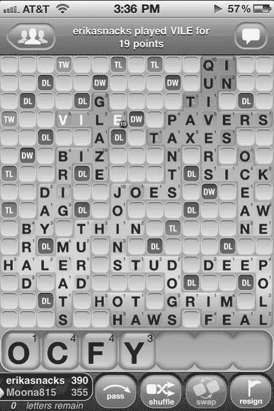
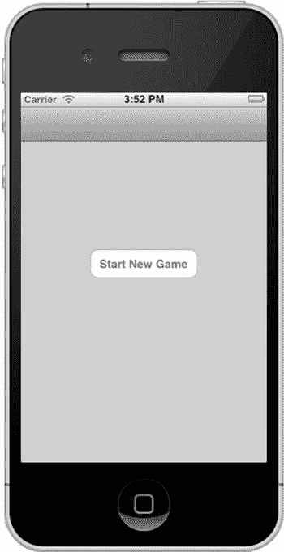
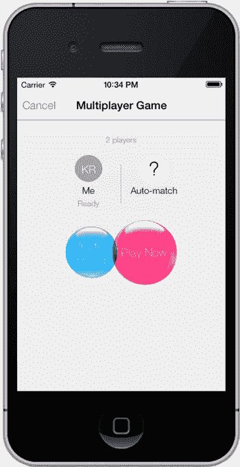
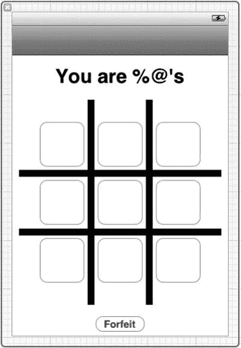
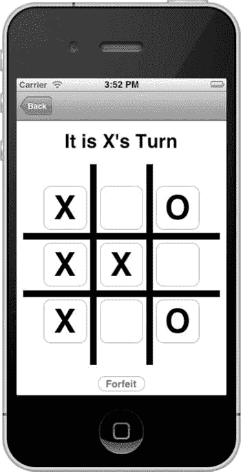
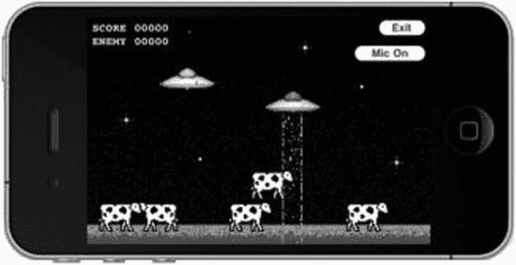

# 9. 使用 Game Center 进行回合制游戏

摘要

仿佛你能消磨时间而不伤害永恒。

> —亨利·大卫·梭罗

苹果在 2011 年的全球开发者大会（WWDC）上发布了 iOS 5。新 SDK 为 Game Center 带来了许多较小的增强功能，其中还包括一个非常重要的新特性：通过 Game Center 进行回合制游戏。通过回合制游戏，你可以为用户提供异步游戏体验。回合制游戏就是指玩家轮流进行游戏的任何游戏，例如井字棋、国际象棋、纸牌游戏、战舰棋和地产大亨。苹果在 iOS 6 和 iOS 7 中持续改进了回合制游戏，使其成为每次 Game Center 更新的一个亮点功能。

iOS 上的回合制游戏在过去几年里变得非常流行，最初是从 Words with Friends 开始的。如图 9-1 所示，这款来自 Zynga 的异步文字游戏类似于拼字游戏。每位玩家会收到一组字母，他们需要轮流在棋盘上拼出一个单词，并根据单词的难度和棋盘布局来获得分数。回合制游戏传统上采用存储转发平台：服务器保存游戏数据，直到下一个客户端登录并获取为止。异步游戏通常属于休闲游戏，不需要所有玩家在整个游戏过程中都保持在线连接。



图 9-1. Zynga 的 Words with Friends

在 iOS 5 推出之前，Game Center 只提供实时游戏，即所有涉及的设备在多人游戏过程中需要持续保持活跃和登录状态。回合制游戏则带来了一种更休闲的体验，允许玩家同时进行多达 20 场比赛，并且只在轮到自己的回合时才开始操作。在新的 Game Center 增强功能出现之前，编写这类游戏需要你自行编写和部署服务器来处理游戏交互。而现在，你可以快速添加回合制游戏的网络组件，在不到一天的时间内就可以启动并运行。在本章中，我们将探索如何使用 iOS 5 和 Game Center 的新回合制游戏 API 编写一个简单的井字棋游戏。


## 新示例项目

遗憾的是，我们现有的 UFO 示例游戏并不适合测试回合制游戏。让每个玩家操作一步然后等待对方跟上进度，这显然不合逻辑。幸运的是，我们可以围绕另一种非常简单的游戏类型来构建项目：井字棋。这款经典儿童游戏几乎所有人都玩过，我们对它的规则和策略也相当熟悉。

我们首先创建一个基于导航控制器的新项目。整个项目将涉及三个视图：

-   主视图：仅包含一个启动`GKTurnedBasedMatchmakerViewController`的按钮。
-   `GKTurnedBasedMatchmakerViewController`：这是苹果提供的用于创建和恢复回合制游戏的视图。你无需自行创建此视图。
-   `游戏视图`：负责处理用户输入、判定胜负和平局、以及在每回合开始时更新游戏面板的类。

我们从主视图开始处理。创建新项目时，系统会自动生成这些文件。我们首先要做的是确保导入正确的 Game Kit 框架，并添加本书一直使用的可复用`GameCenterManager`类；你可以从第 8 章引入已有的类。同时，我们还需在视图中创建一个用于开始新游戏的按钮，如图 9-2 所示。



图 9-2. 新井字棋游戏的主视图

新的基础视图控制器类的头文件应与以下代码片段一致。我们需要遵循`GameCenterManagerDelegate`和`GKTurnedBasedMatchmakerViewController`协议。与之前章节类似，我们还需要创建一个`GameCenterManager`的类实例。最后需要添加的是一个用于开始新游戏的`IBAction`方法。请确保在 Interface Builder 中将“开始新游戏”按钮连接到该`IBAction`。

```
#import <UIKit/UIKit.h>
#import <GameKit/GameKit.h>
#import "GameCenterManager.h"

@interface tictactoeViewController : UIViewController <GameCenterManagerDelegate, GKTurnBasedMatchmakerViewControllerDelegate>
{
    GameCenterManager *gcManager;
}

-(IBAction)beginGame:(id)sender;
@end
```

我们还需要修改`viewDidLoad`方法，以检查本地用户身份并在 Game Center 中进行认证。这与第 2 章中的做法相同。如果你支持 iOS 6 或更高版本，应使用第 2 章中概述的新认证方法。

```
- (void)viewDidLoad
{
    [super viewDidLoad];
    if ([GameCenterManager isGameCenterAvailable])
    {
        [[NSNotificationCenter defaultCenter] addObserver:self
                                                 selector:@selector(localUserAuthenticationChanged:)
                                                     name:GKPlayerAuthenticationDidChangeNotificationName object:nil];
        gcManager = [[GameCenterManager alloc] init];
        [gcManager setDelegate: self];
        [gcManager authenticateLocalUser];
    }
}
```

此外，我们还需要实现两个委托方法来监控认证成功和本地用户变更。我们将使用这两个方法输出一些调试信息。

```
- (void)processGameCenterAuthentication:(NSError*)error;
{
    if (error != nil)
    {
        NSLog(@"认证过程中发生错误：%@", [error localizedDescription]);
    }
}

- (void)localUserAuthenticationChanged:(NSNotification*)notif;
{
    NSLog(@"认证状态已变更：%@", notif.object);
}
```

在下一节中，我们将了解如何调用`GKTurnedBasedMatchmakerViewController`，以及如何处理在恢复或创建新对战时所需的委托方法。

## `GKTurnedBasedMatchmakerViewController`

与排行榜和成就类似，苹果提供了一个默认类来显示创建新回合制比赛的图形界面。若要编程方式创建比赛，请参见后面的“编程方式创建比赛”一节。

我们首先在前一节创建的单个按钮的`IBAction`方法中操作新的配对对象。这里使用的方法与第 5 章所述的 Game Center 配对非常相似。我们首先分配并初始化一个`GKMatchRequest`实例，设置最小和最大玩家数。然后创建一个新的`GKTurnedBasedMatchmakerViewController`，并用刚创建的配对对象进行初始化。最后，将委托设置为`self`，并以模态方式向用户呈现该视图。此视图将类似于图 9-3 所示。

```
- (IBAction)beginGame:(id)sender
{
    GKMatchRequest *match = [[GKMatchRequest alloc] init];
    [match setMaxPlayers:2];
    [match setMinPlayers:2];
    GKTurnBasedMatchmakerViewController *tmvc = nil;
    tmvc = [[GKTurnBasedMatchmakerViewController alloc] initWithMatchRequest:match];
    [tmvc setTurnBasedMatchmakerDelegate: self];
    [self presentViewController:tmvc animated:YES completion: nil];
    [tmvc release];
    [match release];
}
```

**注意：** 在创建新的回合制比赛之前，必须先让`GKLocalPlayer`在 Game Center 中进行认证。

为了遵守`GKTurnedBasedMatchmakerViewControllerDelegate`协议，需要实现四个委托方法。第一个方法处理用户在配对界面取消操作。唯一的要求是调用`dismissViewControllerAnimated:Completion:`。你可以根据应用需求添加额外的逻辑。

```
- (void)turnBasedMatchmakerViewControllerWasCancelled:(GKTurnedBasedMatchmakerViewController*)viewController
{
    [self dismissViewControllerAnimated: YES completion: nil];
}
```

**重要：** 当前游戏的列表可能不会立即更新，你需要关闭并重新打开`GKTurnedBasedMatchmakerViewController`。



图 9-3. 开始新的回合制比赛

我们还需要实现一个委托方法，以捕获此阶段发生的任何错误。以下方法在配对过程中遇到错误时被调用。为了调试，我们将错误信息输出到控制台；但在实际应用中，你需要告知用户发生了错误。

```
- (void)turnBasedMatchmakerViewController:(GKTurnedBasedMatchmakerViewController*)viewController didFailWithError:(NSError *)error
{
    NSLog(@"回合制配对失败，错误信息：%@", [error localizedDescription]);
}
```

本节讨论的最后一个委托方法处理用户在配对界面退出比赛的情况。这通过滑动游戏并选择“退出”选项来实现。在以下方法中，我们调用方法参数中传递的比赛对象的`participantQuitOutOfTurnWithOutcome`方法，并传入`GKTurnedBasedMatchOutcomeQuit`结果。如果此处未调用正确的方法，虽然看起来可以退出游戏，但几秒钟后游戏会重新出现。

```
- (void)turnBasedMatchmakerViewController:(GKTurnedBasedMatchmakerViewController*)viewController playerQuitForMatch:(GKTurnedBasedMatch *)match
{
    [match participantQuitOutOfTurnWithOutcome:GKTurnedBasedMatchOutcomeQuit
                        withCompletionHandler:^(NSError *error) {
                            if (error)
                            {
                                NSLog(@"结束比赛时发生错误：%@", [error localizedDescription]);
                            }
                        }];
}
```

最后一个必需的方法`didFindMatch`将在下一节“开始新游戏”中讨论。


## 开始新游戏

启动一场新的回合制游戏是一个直接且相对简单的过程。要实现这一点，你需要实现以下方法。这个新方法会关闭`GKTurnBasedMatchmakerViewController`，然后将比赛对象的副本传递给游戏控制器。以下代码片段是井字棋示例应用程序遵循的流程。

```
- (void)turnBasedMatchmakerViewController:(GKTurnBasedMatchmakerViewController *)viewController didFindMatch:(GKTurnBasedMatch *)match
{
     [self dismissViewControllerAnimated: YES completion: nil];
     tictactoeGameViewController *gameVC = [[tictactoeGameViewController alloc] init];
     gameVC.match = match;
      [[self navigationController] pushViewController:gameVC animated:YES];
      [gameVC release];
}
```

现在让我们将注意力转向`tictactoeGameViewController`类。从头文件开始，我们创建一个新属性来持有比赛对象，该对象在前一个方法中设置。我们还创建了一个新的可变字典来保存游戏数据，这将在本章后续内容中深入讨论。

```
#import <UIKit/UIKit.h>
#import <GameKit/GameKit.h>

@interface tictactoeGameViewController : UIViewController

@property(nonatomic, retain) NSMutableDictionary *gameDictionary;
@property(nonatomic, retain) GKTurnBasedMatch *match;

@end
```

**重要提示**

每轮新游戏你只能严格传递 4k 的数据。如果你无法将游戏数据限制在 4k 以内，可以使用一个指向持有完整数据集的服务器的 URL。或者，你也可以只传递游戏状态的增量变化，并将现有数据存储在本地。

我们需要在此暂停，配置实际的游戏视图（`tictactoeGameViewController`）。我们在井字棋游戏中需要九个落子位置，以及一个认输选项和一个告知玩家当前轮到谁的标签。

我们使用简单的`UIButton`来处理用户输入。修改 XIB 文件，布局类似图 9-4 所示。你需要为每个按钮和标签创建`IBOutlet`，并为落子和认输创建新的`IBAction`方法。将所有棋盘按钮连接到之前创建的`makeMove`方法。我们还需要在`UIButton`上设置标签，以便定位它们。从左上角开始设置标签 1，从左到右、从上到下依次编号。



图 9-4.

游戏棋盘视图，如 Interface Builder 所示

现在你的游戏视图控制器中有两个新方法，以及九个按钮出口和一个标签出口。你已经了解了如何开始一场新的回合制游戏，在下一节中，我们将看看如何落子并将控制权传递给下一个玩家。

### 落子

在落子之前，我们在新的回合制游戏中需要做的第一件事是确定玩家代表的角色。在我们的示例游戏中，有两个阵营：X 和 O。我们将第一个玩家始终设为 X，第二个玩家始终设为 O。这意味着 X 将总是先手。通过这样的设置，使用以下代码片段就能轻松确定当前玩家代表的角色：

```
if (match.currentParticipant == [match.participants objectAtIndex:0])
{
    myPlayerCharacter = @"X";
    identifyTeamLabel.text = @"轮到 X 落子";
}
else
{
    myPlayerCharacter = @"O";
    identifyTeamLabel.text = @"轮到 O 落子";
}
```

确定玩家身份后，我们就可以让他们落子了。我们将修改与九个游戏按钮关联的操作代码。首先，让我们以完整形式查看这个方法。然后，我们可以分解它并深入分析每个部分。

```
- (IBAction)makeMove:(id)sender
{
    [sender setTitle:myPlayerCharacter forState:UIControlStateNormal];
    NSString *buttonIndexString = [NSString stringWithFormat:@"%d", [sender tag]];
    [gameDictionary setObject:myPlayerCharacter forKey:buttonIndexString];
    NSData *data = [NSPropertyListSerialization dataFromPropertyList:gameDictionary format:NSPropertyListXMLFormat_v1_0 errorDescription:nil];
    GKTurnBasedParticipant *nextPlayer;
    if (match.currentParticipant == [match.participants objectAtIndex:0]) {
        nextPlayer = [[match participants] lastObject];
    } else {
        nextPlayer = [[match participants] objectAtIndex:0];
    }
    if ([self checkWinner] != nil) {
        if ([[self checkWinner] isEqualToString:@"Tie"]) {
            UIAlertView *alert = [[UIAlertView alloc] initWithTitle:@"游戏结束" message:@"平局" delegate:nil cancelButtonTitle:@"关闭" otherButtonTitles: nil];
            [alert show];
            [alert release];
        } else {
            UIAlertView *alert = [[UIAlertView alloc] initWithTitle:@"游戏结束" message:nil delegate:nil cancelButtonTitle:@"关闭" otherButtonTitles: nil];
            [alert show];
            [alert release];
        }
        [self.match participantQuitInTurnWithOutcome:GKTurnBasedMatchOutcomeWon nextParticipant:nextPlayer turnTimeout: 32000 matchData:data completionHandler:^(NSError *error) {
            if (error) {
                NSLog(@"结束比赛时发生错误：%@", [error localizedDescription]);
            }
        }];
    } else {
        [self.match endTurnWithNextParticipant:nextPlayer matchData:data completionHandler:^(NSError *error) {
            if (error) {
                NSLog(@"更新回合时发生错误：%@", [error localizedDescription]);
            }
            [self.navigationController popViewControllerAnimated: YES];
        }];
    }
}
```

这个方法乍看可能很复杂，但在我们逐步讲解完所有细节后，你会发现它其实相当简单。我们做的第一件事是将发送者（游戏按钮）的标题设置为我们的玩家角色，该角色通过前面的代码片段确定。

接下来，我们知道需要保存游戏数据以使其在每一轮中持续存在，因此我们将玩家的角色以按钮标签为键存储到字典中。这使得我们以后可以遍历字典并重新填充之前的落子（你将在下一节“继续进行中的游戏”中了解更多）。

现在我们需要准备并将游戏数据发送给下一个玩家。这需要几个步骤。由于我们需要以`NSData`格式发送游戏数据，我们将现有的游戏`NSDictionary`转换为`NSData`。我们使用`NSPropertyListSerialization`方法完成此操作。然后我们就可以发送并稍后检索这些数据。


下一步是确定谁将是下一位玩家。在双人游戏中，这很简单：我们查看参与者数组，找出不是我们的那一位，然后将其设为下一位玩家。当面对更多玩家时，你只需确定自己在比赛参与者数组中的当前索引，然后调用下一位玩家；或者，如果你是最后一位玩家，则调用第一位。

**注意：** 参与者数组的大小和顺序在比赛开始时确定，并在整个比赛过程中以及每台设备上保持一致。

**提示：** 你可能会注意到参与者数组中存在`nil`对象；这些是未匹配玩家的占位符。Game Center 只会在轮到新玩家行动时匹配他们。这意味着每次你被自动匹配时，都将轮到你行动。

接下来的代码段检查比赛是否有赢家。我们将在本章的“结束比赛”部分更详细地讨论这一点。

每步操作结束时，我们要做的最后一件事情是将新的游戏数据发送给下一位玩家。这位玩家随后会更新游戏状态，并将其发送给再下一位玩家（恰好又是第一位玩家）。为此，我们在比赛对象上调用`endTurnWithNextParticipant`。我们需要传入之前在该方法中确定的下一位玩家。

## 继续进行中的游戏

当你在下一回合恢复游戏时（假设这不是比赛的第一回合），你需要首先将游戏状态恢复到当前位置。为此，我们首先修改`viewDidLoad`方法以获取当前比赛数据。我们需要在比赛对象上调用`loadMatchDataWithCompletionHandler`。这会返回我们在上一步方法中发送给下一位玩家的数据。然后我们将`NSData`转换回`NSDictionary`，并将其添加到`gameDictionary`中。代码如下：

```
- (void)viewDidLoad
{
    //Existing viewDidLoad code... // 现有的 viewDidLoad 代码...
    [self.match loadMatchDataWithCompletionHandler:^(NSData *matchData, NSError *error) {
        NSDictionary *myDict = nil;
        myDict = [NSPropertyListSerialization propertyListFromData:match.matchData
                                                 mutabilityOption:NSPropertyListImmutable
                                                           format:nil
                                                 errorDescription:nil];
        [gameDictionary addEntriesFromDictionary:myDict];
        [self populateExistingGameBoard];
        if (error) {
            NSLog(@"loadMatchData - %@", [error localizedDescription]);
        }
    }];
}
```

**提示：** 如果你在本地持久化游戏状态，则只需要更新自你上次行动以来发生的回合。这种方法有助于你将数据包大小控制在 4k 限制以内。

填充游戏数据字典后，我们需要调用一个新的便捷方法，根据该字典填充游戏 GUI。该方法将遍历字典中的所有键，并用玩家的角色填充相应的游戏按钮。我们还将按钮的启用状态设置为`NO`，以防止玩家移动到对手的位置上。

```
- (void)populateExistingGameBoard
{
    NSArray *dataArray = [gameDictionary allKeys];
    for (NSString *key in dataArray) {
        UIButton *button = (UIButton*)[self.view viewWithTag: [key intValue]];
        [button setTitle:[gameDictionary objectForKey:key] forState:UIControlStateNormal];
            [button setEnabled: NO];
    }
}
```

有了这些代码，你现在就可以使用两个 Game Center 账号，完整地进行一局井字棋游戏；但是，游戏永远不会检测到赢家或平局。在下一节中，我们将探讨检测游戏结束事件所需的逻辑。图 9-5 显示了一个已填充的游戏示例。



**图 9-5.** 通过比赛数据填充游戏棋盘

## 结束比赛

在“走出第一步”一节中，我们看到调用了名为`checkWinner`的方法。本节中，我们将更仔细地研究该方法。对于井字棋，我们采用暴力方法来检查是否有赢家：检查所有行和列中是否有三个重复的字符。如果没有任何地方可以落子，我们还需要检查是否平局。

```
- (NSString*)checkWinner
{
     //top row // 顶行
         if ([gameButton1.titleLabel.text isEqualToString:gameButton2.titleLabel.text] &&
        [gameButton2.titleLabel.text isEqualToString:gameButton3.titleLabel.text])
                  return gameButton1.titleLabel.text;
         //middle row // 中间行
         if ([gameButton4.titleLabel.text isEqualToString:gameButton5.titleLabel.text] &&
        [gameButton5.titleLabel.text isEqualToString:gameButton6.titleLabel.text])
                  return gameButton4.titleLabel.text;
         //bottom row // 底行
        if ([gameButton7.titleLabel.text isEqualToString:gameButton8.titleLabel.text] &&
        [gameButton8.titleLabel.text isEqualToString:gameButton9.titleLabel.text])
                  return gameButton7.titleLabel.text;
         //first column // 第一列
         if ([gameButton1.titleLabel.text isEqualToString:gameButton4.titleLabel.text] &&
        [gameButton4.titleLabel.text isEqualToString:gameButton7.titleLabel.text])
                  return gameButton1.titleLabel.text;
         //middle column // 中间列
        if ([gameButton2.titleLabel.text isEqualToString:gameButton5.titleLabel.text] &&
        [gameButton5.titleLabel.text isEqualToString:gameButton8.titleLabel.text])
                  return gameButton2.titleLabel.text;
         //last column // 最后一列
        if ([gameButton3.titleLabel.text isEqualToString:gameButton6.titleLabel.text] &&
        [gameButton6.titleLabel.text isEqualToString:gameButton9.titleLabel.text])
                return gameButton3.titleLabel.text;
         //diagonal // 对角线
        if ([gameButton1.titleLabel.text isEqualToString:gameButton5.titleLabel.text] &&
        [gameButton5.titleLabel.text isEqualToString:gameButton9.titleLabel.text])
          return gameButton1.titleLabel.text;
        if ([gameButton3.titleLabel.text isEqualToString:gameButton5.titleLabel.text] &&
        [gameButton5.titleLabel.text isEqualToString:gameButton7.titleLabel.text])
                return gameButton3.titleLabel.text;
        if (gameButton1.titleLabel.text != nil && gameButton2.titleLabel.text != nil &&
        gameButton3.titleLabel.text != nil && gameButton4.titleLabel.text != nil &&
        gameButton5.titleLabel.text != nil && gameButton6.titleLabel.text != nil &&
        gameButton7.titleLabel.text != nil && gameButton8.titleLabel.text != nil &&
        gameButton9.titleLabel.text != nil)
                  return @"Tie";
    return nil;
}
```

如果你将注意力转回上一节的`makeMove`方法，会看到如果我们判定玩家获胜，就会进行一次新的调用。我们需要调用`participantQuitInTurnWithOutcome`来结束比赛。我们传入`GKTurnBasedMatchOutcomeWon`作为参数，但如果出现玩家输掉的情况，我们也可以传入`GKTurnBasedMatchOutcomeLost`。

```
[self.match participantQuitInTurnWithOutcome:GKTurnBasedMatchOutcomeWon
 nextParticipant:nextPlayer turnTimeout: 32000 matchData:data completionHandler:^(NSError *error)  {
        if (error)
        {
                  NSLog(@"An error occurred ending match: %@", [error localizedDescription]);
         }
}];
```


### 退出与弃权

玩家可随时从匹配视图控制器中滑动屏幕退出比赛。但建议在游戏内部为用户提供弃权或退出比赛的路径。要允许玩家弃权比赛，请使用以下代码片段：

```
- (IBAction)forfeit:(id)sender
{
    [self.match participantQuitOutOfTurnWithOutcome:GKTurnBasedMatchOutcomeQuit withCompletionHandler:^(NSError *error) {
        if (error) {
            NSLog(@"结束比赛时发生错误：%@", [error localizedDescription]);
        }
    }];
}
```

### 玩家超时

在本章前面部分，我们讨论了使用 `endTurnWithNextParticipant:matchData:completionHandler:` 方法来结束回合。从 iOS 6 开始，该方法已被弃用，并替换为 `endTurnWithNextParticipants:turnTimeout:matchData:completionHandler:`。如果你的应用目标是 iOS 5，则需要继续使用先前的方法；但如果目标是 iOS 6 或更高版本，你可以开始使用这个允许玩家超时的新方法。

在 iOS 6 之前，无法在回合制比赛中跳过某位玩家；如果某位玩家未能进行其回合，游戏将进入一种不确定状态，直到游戏被弃权。使用 `endTurnWithNextParticipants:turnTimeout:matchData:completionHandler:` 方法可以设置一个 `NSTimeInterval` 参数。一旦时间间隔过去，控制权将传递给队列中的下一位玩家，并且可以处理玩家错过其回合的行为。

### 玩家交涉

在 iOS 7 之前，非当前回合的玩家无法发送任何操作。iOS 7 带来了玩家交涉功能。玩家交涉允许任何玩家在任何时候发起操作，这可用于同时回合、聊天以及玩家之间的交易，无论当前轮到谁行动。

一次交涉请求需要成功完成五个步骤。

交涉发起者向接收者发送请求。接收者被告知有挂起的请求。接收者对交涉做出回应，并将响应发送回发起者。发起者随后收到响应通知。最后，当前玩家被告知交涉已完成，并更新比赛数据。

如果你的游戏允许，任何玩家都可以发起交涉，无论当前是否是他们的回合。发起者需要为交涉请求选择一个或多个接收者。发起者还需要指定交易类型，是聊天消息、交易、请求帮助，还是其他类型。交涉还需要设置一个超时时间，以确定交涉的有效时长。

iOS 7 中提供了一种发送交涉的新方法，`sendExchangeToParticipants:`。该方法接受多个参数，首先是接收请求的接收者数组。随后是一个 `NSData` 块，代表请求的详细信息。还会附加一条可本地化的消息和一个以秒为单位的超时时间：

```
[GKTurnBasedExchange sendExchangeToParticipants:recipients data:data localizableMessageKey:key
arguments:arguments timeout:timeout completionHandler:^(GKTurnBasedExchange
*exchange, NSError *error) {
    }];
```

注意

交涉数据限制为 1k，而常规回合数据的限制为 4k。

发起玩家可以在交涉被接收者接受并处理之前的任何时间取消交涉请求。这通过使用 `player:exchangeCanceled:match:` 方法完成。

接收玩家需要使用以下方式响应交涉请求：

```
[GKTurnBasedExchange replyWithLocalizableMessageKey:key arguments:arguments data:data
completionHandler:^(NSError *error) {
}]
```

如果需要，当前游戏的比赛数据必须进行更新，以反映交涉的结果。因此，可能有必要将当前玩家也包含在交涉接收者列表中，以便数据可以作为其回合的一部分进行更新。

### 玩家提醒

iOS 7 还增加了向玩家发送待处理操作提醒的功能。这些提醒将以推送通知的形式出现在他们的设备上。推送通知将包含引用的可本地化消息，并且需要考虑该消息的显示尺寸。这使得游戏可以发送提醒，提示需要进行回合或交涉操作。

```
[GKTurnBasedMatch sendReminderToParticipants:(NSArray *)participants localizableMessageKey:(NSString *)key  arguments:(NSArray *)arguments completionHandler:(void(^)(NSError *error))completionHandler]
```

## 编程式匹配

如果你想绕过 `GKTurnBasedMatchmakerViewController` 并实现自己的图形界面，有办法可以做到。使用以下方法无需用户通过匹配界面即可创建新比赛：

```
- (void)findMatch
{
    GKMatchRequest *match = [[GKMatchRequest alloc] init];
    [match setMaxPlayers:2];
    [match setMinPlayers:2];
    [GKTurnBasedMatch findMatchForRequest:match withCompletionHandler:^(GKTurnBasedMatch *match, NSError *error)  {
        if (error == nil) {
            // 使用返回的比赛开始新游戏
        } else {
            NSLog(@"寻找比赛时发生错误：%@", [error localizedDescription]);
        }
    }];
}
```

除了创建游戏，你还需要能够为本地用户加载现有游戏列表。可以通过以下方法实现：

```
- (void)loadMatches
{
    [GKTurnBasedMatch loadMatchesWithCompletionHandler:^(NSArray *matches, NSError *error) {
        if (error == nil) {
            NSLog(@"现有比赛：%@", matches);
        } else {
            NSLog(@"加载比赛时发生错误：%@", [error localizedDescription]);
        }
    }];
}
```

注意

由于这两种方法都使用后台任务来处理请求，你在块内实现的代码必须是线程安全的。

## `GKTurnBasedEventHandler`

`GKTurnedBasedEventHandler` 是一个委托协议，负责处理与回合制游戏相关的重要消息。要为事件设置委托，请使用以下代码：

```
[[GKTurnBasedEventHandler sharedTurnBasedEventHandler] setDelegate: self];
```

该协议有三个可选方法。

- `handleInviteFromGameCenter`：当你的委托收到此方法时，它应该使用通过该方法传入的 `playersToInvite` 填充一个新的 `GKMatchRequest`。然后你需要开始一场新比赛或展示匹配界面。当用户接受来自朋友的比赛邀请时，会调用此方法。
- `handleTurnEventForMatch`：当用户接受了针对进行中比赛的推送通知时，你的委托会收到此消息。你需要结束正在进行的任何任务，并显示通过此方法传入的比赛对应的游戏。
- `handleMatchEnded`：当你的委托收到此消息时，它应向玩家显示比赛结果和游戏结束视图，并允许玩家选择从 Game Center 中移除比赛数据。

## 总结

在本章中，你学习了 Game Center 的回合制游戏功能。我们与现有的 `GameCenterManager` 类协作，并编写了一个全新的示例游戏来使用回合制技术。现在，你应该对如何创建新的回合制游戏，以及在玩家之间保留和发送回合数据有了扎实的理解。掌握了本章所学的技能，你现在应该能够在几小时内轻松启动并运行回合制游戏的网络组件。

在下一章中，我们将探讨另一个激动人心的话题：语音聊天。Apple 投入了大量精力使 IP 语音在 iOS 应用中易于使用，我们将探索如何在你启用了 Game Center 或 Game Kit 的应用中快速启动并运行 VoIP。


### 语音聊天

## 摘要

伟大的发现与进步总是离不开众多智慧的协作。或许人们认为是我开辟了道路，但当我回顾后续的发展时，深感这份荣誉应归属于他人而非我自己。

> ——亚历山大·格拉汉姆·贝尔

语音聊天作为 Game Kit 提供的服务之一，比其他任何功能都更能证明苹果公司的工程实力。苹果将其他平台上最复杂的功能之一，变成了 iOS 上最容易实现的功能。当你在其他平台上处理基于互联网协议的语音传输（VOIP）时，这常常是整个项目中最复杂、最令人头疼的任务。在本章中，我们将探讨如何为我们的 UFOs 游戏或任何 iOS 应用添加语音聊天服务。本章的篇幅之短，足以证明苹果公司为此技术付出了多少努力，使其甚至能被最资浅的开发者轻松掌握。

与前几章的策略不同，我们将分别处理 Game Kit 语音聊天和 Game Center 语音聊天，而不是像之前那样编写一个共享类。虽然这两种服务有许多相似之处，但它们的差异足以让我们分别进行处理。此外，在本章中，我们将在 UFOs 游戏中实现语音聊天时应用所学的主题。

## Game Center 的语音聊天

首先，我们来看看 Game Center 的语音聊天。使用 `GKMatch` 创建语音聊天会话有很多优势，例如易于使用、实现快速，并且相比使用 Game Kit 或必须实现自定义解决方案，开销更少。一个 `GKMatch` 语音聊天可以拥有多个频道，每个频道都关联着一个接收者列表。例如，在第一人称射击游戏中，你可以为队友设置一个频道，为所有玩家设置另一个频道。这样你就可以讨论获胜战术，而不会将信息泄露给其他队伍。

> **注意：** 使用 `GKMatch` 的语音聊天仅适用于通过 Wi-Fi 连接互联网的参与者；语音聊天不支持蜂窝网络。

### 创建音频会话

在开始处理语音聊天本身之前，你首先需要创建一个新的音频会话。在开始任何语音聊天服务之前，这一点非常重要。如果你在创建聊天会话之后才创建音频会话，你将无法发送或接收语音数据。在下面的示例中，我们创建了一个新的音频会话，允许我们的应用播放和录制音频，然后将其设置为活动状态。

> **提示：** 你的应用可能已经使用音频会话来播放音效；如果你已经创建了一个音频会话，则无需创建新的会话。如果你要重用现有的音频会话，请确保将其设置为允许播放和录制功能。

```
NSError *error = nil;
AVAudioSession *audioSession = [AVAudioSession sharedInstance];
if(![audioSession setCategory:AVAudioSessionCategoryPlayAndRecord error:&error])
{
    if(error)
    {
        NSLog(@"启动音频会话时发生错误: %@", [error localizedDescription]);
    }
}
if(![audioSession setActive: YES error: &error])
{
    if(error)
    {
        NSLog(@"启动音频会话时发生错误: %@", [error localizedDescription]);
    }
}
```

### 创建新的语音频道

你的应用中可以拥有任意数量的语音聊天频道，每个对等方可以根据自己的意愿注册成为任意数量频道的一部分。频道通过名称字符串进行创建和组织。这就是我们确定用户要加入哪些频道的方式。当两个或更多对等方加入具有相同名称的频道时，它们就会连接到同一个聊天室。

下面的代码片段展示了如何创建三个不同的频道。请注意，这些频道是使用当我们开始一个基于 Game Center 的网络游戏时返回给我们的 `GKMatch` 对象创建的。

```
GKVoiceChat *allChannel = [[match voiceChatWithName:@"allPlayers"] retain];
GKVoiceChat *teamChannel = [[match voiceChatWithName:@"blueTeam"] retain];
GKVoiceChat *squadChannel = [[match voiceChatWithName:@"BlueTeamSquad2"] retain];
```

在这个示例中，我们有一个用于与所有玩家通信的频道，一个用于与整个队伍通信的频道，以及第三个用于与小队通信的频道。仅仅创建了频道并不意味着它们会自动开启。在下一节中，我们将探讨如何在特定频道上开始和停止通信。

### 启动和停止语音聊天

在上一节中，我们创建了三个用于 Game Center 类型语音聊天的新语音频道。当你想在这些频道上传输和接收语音时，你首先需要告诉 API 你想开始使用该频道。在你连接到某个频道后，你就可以从该频道发送和接收数据。如果你想连接到一个频道但不想传输任何语音音频，请参阅关于麦克风静音的下一节。

要开始使用语音频道，你需要在上一节创建的 `GKVoiceChat` 对象上调用 `start` 方法。

```
[allChannel start];
[teamChannel start];
```

当你想离开一个频道时，只需调用 `stop` 方法。这比简单地将频道中所有参与者静音更好的原因是，应用将无需接收额外的网络数据。已停止的频道可以随时重新启动。

```
[allChannel stop];
[teamChannel stop];
```

> **提示：** 强烈建议在传输语音数据时提供视觉和音频指示，例如红灯和咔嗒声。这可以减少用户无意中传输语音数据的可能性。永远记住，用户的麦克风和传输的语音应被视为敏感数据。

### 聊天音量和静音

语音聊天的音量是按频道设置的。每个频道都有一个相关的属性，可以用来降低该聊天的整体音量。你不能将音量提高到超过用户当前设备所选择的音量。例如，如果用户的最大音频为 70%，而你将音量设置为 100%，系统会自动将其缩放为 70%。要修改频道的音量，请添加以下代码行：

```
allChannel.volume = 0.5; //最大音量的一半
```

此外，你可以通过引用玩家的 `playerID` 来静音频道中的单个玩家。可以使用以下两行代码来静音和取消静音玩家：

```
[teamChannel setMute:YES forPlayer: playerID];
[teamChannel setMute:NO forPlayer:playerID];
```

在某些情况下，你可能不想一直传输用户的语音。默认情况下，用户启动聊天时处于静音状态。你需要先取消用户静音，他们才能开始传输语音数据。

```
squadChannel.active = YES;
```

> **重要：** 一个用户一次只能在一个频道上传输语音；如果你取消静音一个频道，API 将自动静音所有其他频道。

这就是在你的基于 Game Center 的网络应用中完全启用语音聊天所需的全部内容。其他一切，包括播放、发送和接收数据，都由 API 为你处理。


### 监测玩家状态

我在本章前面提到过，让用户知道他们正在传输数据非常重要。让玩家看到谁在说话也是一个重要步骤。通过监测玩家状态的变化，你可以确定哪些用户当前正在传输语音，并在玩家列表中高亮显示他们，或通过其他方式指示哪个玩家正在说话。以下代码块在你开始聊天时很容易设置，它省去了你执行轮询或委托回调的麻烦：

```
allChannel.playerStateUpdateHandler = ^(NSString *playerID, GKVoiceChatPlayerState state)
{
        switch (state)
                {
                        case GKVoiceChatPlayerSpeaking:
                                [self showSpeakingPlayer: playerID];
                                break;
                        case GKVoiceChatPlayerSilent:
                                [self stopShowingSpeakingPlayer: playerID];
                                break;
         }
    };
```

> **注意：** 玩家状态更新是按频道处理的。你需要为你想要监测变化的每个频道配置一个。

## 适用于 Game Kit 的语音聊天

在使用 Game Kit 语音聊天时，我们将重点关注 `GKVoiceChatService` 对象。Game Kit 语音聊天的基本原理与 Game Center 语音聊天非常相似。实现此系统的一个良好起点是，在你使用 Peer Picker 系统连接到另一个玩家并获取到 `GKSession` 对象之后。需要注意的是，`GKVoiceChatService` 设计为一次只能向一个对等方发送数据。虽然这还不是一个限制（因为 Game Kit 目前只支持两个对等方），但如果将来 API 扩展，记住这一点很重要。

> **注意：** 在继续之前，别忘了检查 `[GKVoiceChatService isVoIPAllowed]` 以确保你的设备支持语音聊天。某些设备，例如第一代 iPod touch，不支持语音聊天。

### 创建音频会话

与 Game Center 一样，我们可以通过首先创建一个新的 `AVAudioSession` 来开始使用 Game Kit 语音聊天。确保在开始任何语音聊天服务调用之前创建会话至关重要。

```
    NSError *error = nil;
    AVAudioSession *audioSession = [AVAudioSession sharedInstance];
        if(![audioSession setCategory:AVAudioSessionCategoryPlayAndRecord error:&error])
        {
            if(error)
            {
                NSLog(@"An error occurred while starting audio session: %@", [error localizedDescription]);
            }
        }
        if(![audioSession setActive: YES error: &error])
        {
            if(error)
            {
                NSLog(@"An error occurred while starting audio session: %@", [error localizedDescription]);
            }
        }
```

### 必需的额外设置

与 Game Center 的方法不同，Game Kit 需要更多的额外设置才能启动和运行。你需要做的第一件事是实现几个必要的方法。下面发布的第一个方法返回你希望与之通信的玩家的 `peerID`。这个值可以轻松地从你当前的 `GKSession` 对象中获取：

```
- (NSString *)participantID
{
    return session.peerID;
}
```

你还需要实现一个方法来将语音数据发送到已连接的对等方，以及另一个方法来处理接收数据；这两个方法都在下面的代码片段中给出。这两个方法将共同处理你的应用的语音数据发送和接收。

```
- (void)voiceChatService:(GKVoiceChatService *)voiceChatService sendData:(NSData *)data toParticipantID:(NSString *)participantID
{
    NSError *error = nil;
    if(![self.session sendData:data toPeers:[NSArray arrayWithObject: participantID] withDataMode:GKSendDataReliable error:&error])
    {
        NSLog(@"Unable to send data to peers: %@", [error localizedDescription]);
    }
}

- (void) receiveData:(NSData *)data fromPeer:(NSString *)peer inSession:
    (GKSession *)session context:(void *)context;
    {
        [[GKVoiceChatService defaultVoiceChatService] receivedData:data
        fromParticipantID:peer];
   }
```

### 启动运行

除了我们在上一节中实现的三个新方法之外，你还需要完成一些额外的步骤才能使一切正常运行。首先，你需要初始化一个新的 `GKVoiceChatClient` 实例，这应该是你创建的 `GKVoiceChatClient` 的自定义子类。有关此步骤的更多信息，请参阅下一节“整合在一起”。

```
GKVoiceChatClient *voiceChatClient = [[GKVoiceChatClient alloc] initWithSession:
 session];
[GKVoiceChatService defaultVoiceChatService].client = voiceChatClient;
```

创建了 `GKVoiceChatClient` 的新实例后，你需要将你的对等方连接到它。以下代码演示了如何实现这一点。

```
[[GKVoiceChatService defaultVoiceChatService] startVoiceChatWithParticipantID:
 [self  participantID] error: &error];
```

要结束语音聊天会话，你需要调用一个类似的方法，如下所示。

```
[[GKVoiceChatService defaultVoiceChatService] stopVoiceChatWithParticipantID:
 [self  participantID]];
```

在你与另一个对等方建立连接后，你将开始接收语音聊天数据。如果你想要发送数据，你需要做的就是使用以下代码片段取消麦克风静音：

```
[GKVoiceChatService defaultVoiceChatService].microphoneMuted = NO;
```

以上就是启动并运行 Game Kit 语音聊天所需的所有步骤。虽然比使用 Game Center 语音聊天的工作量稍多一些，但它仍然比实现你自己的 VOIP 系统要容易得多。


## 整合

在本章中，我们在第 8 章的基础上修改现有代码库。首先，为你的语音聊天服务创建一个新的音频会话。将以下代码块添加到 `UFOGameViewController.m` 的 `viewDidLoad:` 方法中。此外，你还需要将 `AVFoundation.framework` 添加到你的项目中。修改 `viewDidLoad` 方法的相关部分，使其与以下内容一致。

```
if (self.gameIsMultiplayer == NO)
{
    for (int x = 0; x < 5; x++)
    {
        [self spawnCow];
    }
    [self updateCowPaths];
}
else
{
    [self generateAndSendHostNumber];
    NSError *error = nil;
    AudioSessionInitialize(NULL, NULL, NULL, self);
    AVAudioSession *audioSession = [AVAudioSession sharedInstance];
    if(![audioSession setCategory:AVAudioSessionCategoryPlayAndRecord error:&error])
    {
        if(error)
        {
            NSLog(@"启动音频会话时发生错误：%@", [error localizedDescription]);
        }
    }
    if(![audioSession setActive: YES error: &error])
    {
        if(error)
        {
            NSLog(@"启动音频会话时发生错误：%@", [error localizedDescription]);
        }
    }
    [self setupVoiceChat];
}
```

**警告：** 确保你正在构建的目标设备同时具备扬声器和麦克风可供使用。

你还需要添加一个名为 `setupVoiceChat` 的新方法。该方法将处理 Game Center 和 Game Kit 的基本配置。

```
-(void)setupVoiceChat
{
    //GameKit
    if (self.peerIDString)
    {
        NSError *error = nil;
        UFOVoiceChatClient *voiceChatClient = [[UFOVoiceChatClient alloc] init];
        voiceChatClient.session = self.gcManager.matchOrSession;
        [GKVoiceChatService defaultVoiceChatService].client = voiceChatClient;
        [[GKVoiceChatService defaultVoiceChatService]
            startVoiceChatWithParticipantID:self.peerIDString error:&error];
        [GKVoiceChatService defaultVoiceChatService].microphoneMuted = YES;
        if (error)
        {
            NSLog(@"设置语音聊天时发生错误：%@",
                [error localizedDescription]);
        }
    }
    //Game Center
    else
    {
        mainChannel = [[self.peerMatch voiceChatWithName:@"main"] retain];
        [mainChannel start];
        mainChannel.volume = 1.0;
        mainChannel.active = NO;
    }
}
```

你可能已经注意到，这段代码中有一个新的类类型叫做 `UFOVoiceChatClient`。我们将使用这个类来处理语音的传入和传出数据，以及用于监控状态和错误的其他方法。该类的实现如下。

```
@implementation UFOVoiceChatClient

@synthesize session;

-(NSString *)participantID
{
    return self.session.peerID;
}

- (void)voiceChatService:(GKVoiceChatService *)voiceChatService sendData:(NSData *)data toParticipantID:(NSString *)participantID
{
    NSError *error = nil;
    if(![self.session sendData:data toPeers:[NSArray arrayWithObject: participantID] withDataMode:GKSendDataReliable error:&error])
    {
        NSLog(@"无法向对等端发送数据：%@", [error localizedDescription]);
    }
}

- (void)receivedData:(NSData *)arbitraryData fromParticipantID:(NSString *)participantID
{
    [[GKVoiceChatService defaultVoiceChatService] receivedData:arbitraryData
        fromParticipantID:participantID];
}

- (void)voiceChatService:(GKVoiceChatService *)voiceChatService
    didReceiveInvitationFromParticipantID:(NSString *)participantID
    callID:(NSInteger)callID
{
    NSLog(@"已收到邀请");
}

- (void)voiceChatService:(GKVoiceChatService *)voiceChatService
    didNotStartWithParticipantID:(NSString *)participantID error:
    (NSError *)error
{
    NSLog(@"未开始邀请");
}

- (void)voiceChatService:(GKVoiceChatService *)voiceChatService
    didStartWithParticipantID:(NSString *)participantID
{
    NSLog(@"已开始邀请");
}

@end
```

**注意：** 确保你的 `voiceChatClient` 遵循 `GKVoiceChatClient` 协议。

你还需要对 `GameCenterManager` 类进行一些细微的修改，以处理传入的语音数据。将现有的 `receiveData:fromPeer:inSession:Context:` 方法修改如下：

```
- (void)receiveData:(NSData *)data fromPeer:(NSString *)peer inSession: (GKSession
    *)session context:(void *)context;
{
    NSString *dataString = [[NSString alloc] initWithData:data
        encoding:NSUTF8StringEncoding];
    if (dataString == nil)
    {
        [[GKVoiceChatService defaultVoiceChatService] receivedData:data
            fromParticipantID:peer];
        [dataString release];
        return;
    }
    NSArray *objects = [NSArray arrayWithObjects:dataString, peer, session, nil];
    NSArray *keys = [NSArray arrayWithObjects: @"data", @"peer", @"session", nil];
    NSDictionary *dataDictionary = [NSDictionary dictionaryWithObjects:objects forKeys:keys];
    [dataString release];
    [self callDelegateOnMainThread: @selector(receivedData:) withArg: dataDictionary
        error: nil];
}
```

注意我们添加了另一段代码，用于处理将数据传递给我们的 `defaultVoiceChatService` 客户端。如果我们无法从 `NSData` 中解码出字符串，我们就判断该数据是否为语音数据。你的应用可能更复杂，可能需要一个前缀或其他类型的设计符来确定数据是否为语音，但对于 UFOs 这样简单的游戏来说，这种方法非常合适。

我们需要做的最后一件事是连接一个操作，以开启和关闭麦克风。我决定在 UFOs 中使用一个简单的切换按钮，但你可能会觉得需要实现不同的方法。添加一个新的按钮，如图 10-1 所示，并连接接下来发布的新操作。



*图 10-1.* 在我们的 UFO 游戏演示中添加一个麦克风按钮

```
-(IBAction)startVoice:(id)sender;
{
    micOn = !micOn;
    if (micOn)
    {
        [micButton setTitle:@"麦克风开" forState:UIControlStateNormal];
        //GameKit
        if (self.peerIDString)
        {
            [GKVoiceChatService defaultVoiceChatService].microphoneMuted =
                NO;
        }
        //Game Center
        else
        {
            mainChannel.active = YES;
        }
    }
    else
    {
        [micButton setTitle:@"麦克风关" forState:UIControlStateNormal];
        //GameKit
        if (self.peerIDString)
        {
            [GKVoiceChatService defaultVoiceChatService].microphoneMuted =
                YES;
        }
        //Game Center
        else
        {
            mainChannel.active = NO;
        }
    }
}
```

该方法确定麦克风的当前状态（开/关），并将其切换到新状态。发生这种情况时，我们会更新按钮标题，并根据我们使用的网络类型打开或关闭麦克风。

这些是将语音聊天功能添加到我们 UFOs 示例项目中所需的所有步骤。如果你在两台设备上运行游戏，将能够通过语音双向通信。

**注意：** 从说话到在对等设备上接收到语音数据的延迟可能在 500 毫秒到数千毫秒之间。

## 总结

在本章中，你学习了如何以极少的代码工作，将一项传统上非常复杂的技术集成到我们的 iOS 应用中。我们探讨了在 Game Kit 和 Game Center 上使用语音聊天的差异，并在我们的 UFOs 演示游戏中实现了两个系统的示例。现在你已经掌握了为任何 iPhone 或 iPad 应用添加全功能 VOIP 技术所需的技能。如果你一直在从头开始阅读本书，那么你现在已经具备在你的应用中实现 Game Kit 和 Game Center 所有方面所需的所有技能。

在下一章中，我们将探讨编写 iOS 游戏或应用时的另一项重要技术——StoreKit。利用 `StoreKit` 技术，我们将探索如何为你的产品销售额外的功能和附件。


