# 11. 使用 StoreKit 实现应用内购买

## 摘要

如果你想建立长期成功的企业，你不是在完成一笔销售，而是在开启一段关系。

> —帕特里夏·弗里普

到目前为止，在本书中，我们一直在使用 Game Center 和 Game Kit 为你的应用添加丰富的社交网络功能。然而，还有一个在现代软件中逐渐流行的重要特性：应用内购买。允许用户直接从你的应用内购买升级或附加内容，可以开辟一条潜在的重要收入来源。在过去几年中，一种名为“免费增值”的新商业模式已经兴起。免费增值是一种新型的游戏或产品，免费提供给用户，但通过销售附加组件来盈利。App Store 上收入最高的 100 款应用大部分都是免费应用；在编写本章时，收入前 100 名的应用中有 81 款是免费下载的，如图 11-1 所示。

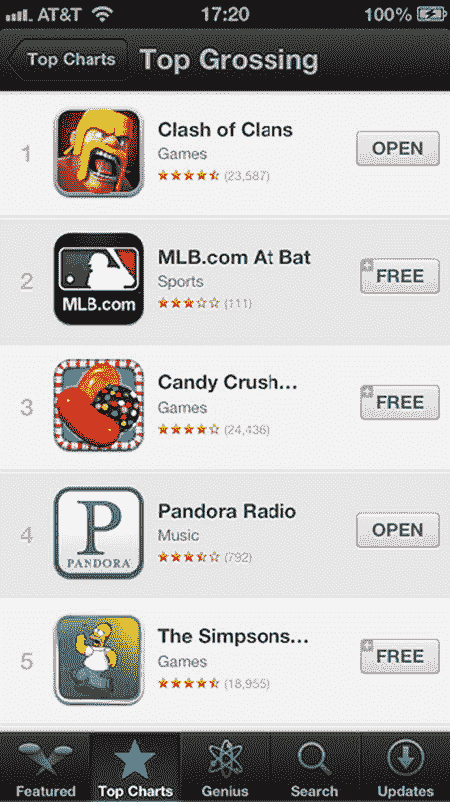

*图 11-1. App Store 上收入最高的应用，显示了免费游玩模式的统治地位*

让我们以 ngmoco:) 的热门游戏《We Rule》为例，这是一个非常成功的免费游玩游戏。这款游戏在 iPhone 和 iPad 上均可免费下载和游玩。每个用户都控制着一个虚拟王国，负责建造建筑和种植作物。用户会随着时间的推移产生“魔力”，并可以使用这种应用内货币来建造新的建筑和农场。然而，由于魔力的限制性质（积累缓慢），一些用户希望比正常情况下更快地进行建造。

这些高级用户可以访问应用内商店批量购买更多魔力。图 11-2 展示了《We Rule》的内置商店。它提供了从非常便宜到贵得惊人的多种购买选项。在处理可销售的附加组件时，兼顾这两种类型的用户非常重要。你的一些用户可能偶尔有兴趣花一两美元，而另一些则是希望一次性花一百美元甚至更多的高级用户。

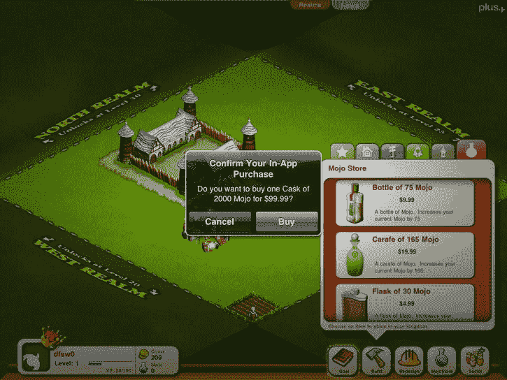

*图 11-2. ngmoco:) 的《We Rule》中的应用内购买商店*

免费增值模式已成为一种利润丰厚的模式，以至于 ngmoco:) 已经停止开发不符合该模式的游戏，甚至在中途取消了《Rolando 3》的开发，因为它无法改编成免费增值类型的游戏。这种模式似乎为 ngmoco:) 带来了丰厚的回报。如图 11-3 所示，当前《We Rule》商店中销量最高的商品售价为 9.99 美元。这一单个应用内购买的价格就超过了大多数独立的 iOS 游戏。它之所以能够获得这笔销售，是因为用户在免费游戏的过程中已经投入其中。

并非所有支持应用内购买的游戏或应用都需要是免费的。事实上，直到最近，你还不允许在免费应用中实现应用内购买。你可以在付费游戏中轻松添加额外功能或解锁内容，例如《愤怒的小鸟》中的神鹰。应用内购买也不仅限于游戏。几乎所有软件都能从中受益，无论是解锁专业级功能，还是向用户收取推送通知支持的订阅费。在本章中，我们将探讨如何为你的 iOS 软件添加一个功能齐全的应用内商店。

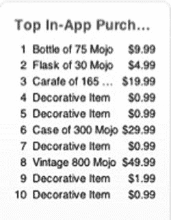

*图 11-3. ngmoco:) 的《We Rule》当前最畅销的应用内购买列表*

## 在 iTunes Connect 中设置你的应用

与 Game Center 一样，第一步是访问 iTunes Connect 来为你的应用配置购买项目。

登录 iTunes Connect（[`itunesconnect.apple.com`](http://itunesconnect.apple.com/)），如第 2 章所述。你需要有一个现有的项目来进行操作。如果你在 iTunes Connect 中还没有创建项目，请立即创建一个。选择你想要添加应用内购买支持的项目。然后，点击名为“管理应用内购买”的按钮，如图 11-4 所示。

> **重要提示：** 从创建应用起，你有 90 天的时间来上传二进制文件进行审核。请确保在你项目完成的 90 天内保存好应用内购买配置。

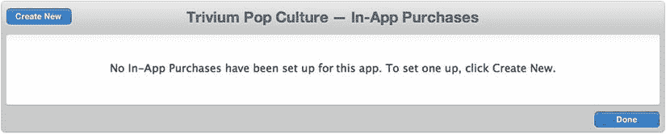

*图 11-5. 在 iTunes Connect 中设置你的第一个应用内购买*

点击“管理应用内购买”按钮将带你进入一个用于设置新产品的屏幕，如图 11-5 所示。进入后，点击窗口左上角的“创建新”按钮。

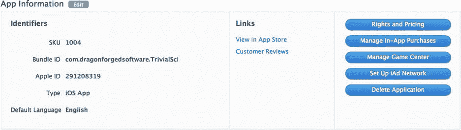

*图 11-4. iTunes Connect 中的应用列表，显示“管理应用内购买”按钮*

你可以配置几种类型的应用内购买产品：

*   **非续期订阅：** 在大多数情况下，可续期订阅已经消除了对这种模式的需求。非续期订阅的功能与自动续期订阅相同，只是用户每次到期时需要手动续订。

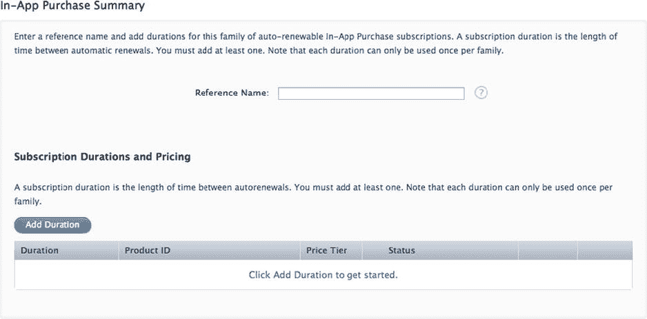

*图 11-7. iTunes Connect 中自动续期购买的设置屏幕*

*   **非消耗品：** 非消耗品购买只需要每个用户购买一次，通常用于可解锁功能。非消耗品购买的示例包括额外关卡、可重复使用的增强道具或附加内容。其设置屏幕与消耗品相同。
*   **自动续期订阅：** 自动续期订阅允许用户在一段设定的时间内购买应用内内容。在此期间结束时，除非用户选择退出，否则订阅将自动续期并向用户收费。杂志和报纸遵循这种模式，每周或每月发布新一期，直到用户取消订阅。图 11-7 显示了自动续期购买的设置屏幕。

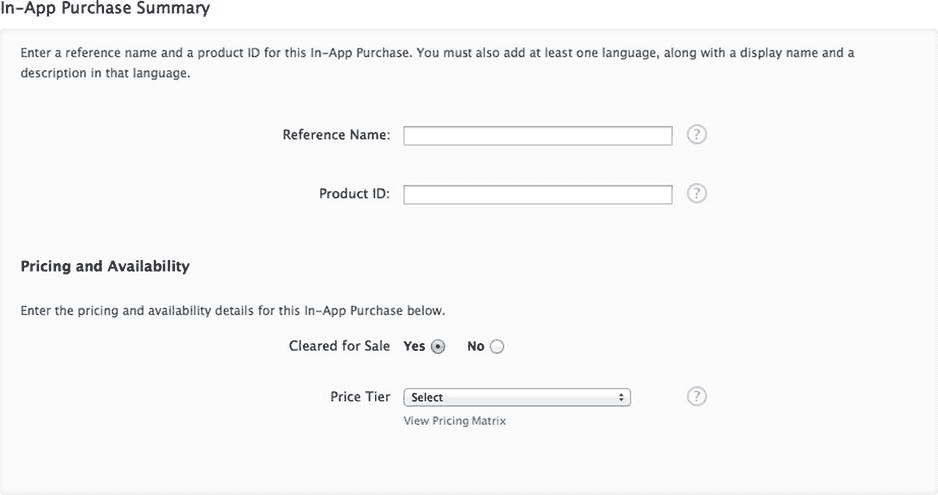

*图 11-6. iTunes Connect 中消耗品和非消耗品购买的设置屏幕*

*   **消耗品：** 消耗品应用内购买每次用户下载时都必须购买。这些包括游戏内货币，正如我们在上一节《We Rule》示例中所见。图 11-6 显示了消耗品购买的设置屏幕。

> **注意：** 自动续期订阅将发送到与该用户 Apple ID 关联的所有设备。

我们将从向我们的示例 UFO 游戏添加一个非消耗品购买项目开始。

我们要添加的第一个项目是对用户当前飞船的付费升级；将该项目命名为 `com.dragonforged.ufo.newShip1`。在此示例中，产品 ID 和引用名称使用了相同的标题。引用名称用于在 iTunes Connect 中搜索，而产品 ID 将用于你的代码库中以标识此项目。

创建新项目后，你需要添加至少一个本地化的描述和标题，如图 11-8 所示。你需要做的最后一件事是为该项目选择一个定价等级。你可能还注意到有一个上传截图的区域；这将在后面的“提交购买 GUI 截图”一节中讨论。


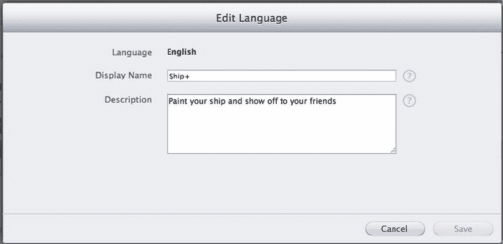

**图 11-8.** 在 iTunes Connect 中为产品添加本地化描述

添加消耗型产品的步骤与非消耗型产品相同。如果你想添加基于订阅的产品，需要注意几个新增的字段，如图 11-9 所示。配置订阅时，你需要定义订阅时长。iTunes Connect 支持以下选项：一周、一个月、两个月、三个月、六个月或一年。如果用户同意参与营销活动（例如提供电子邮件地址），你还可以选择提供免费订阅。

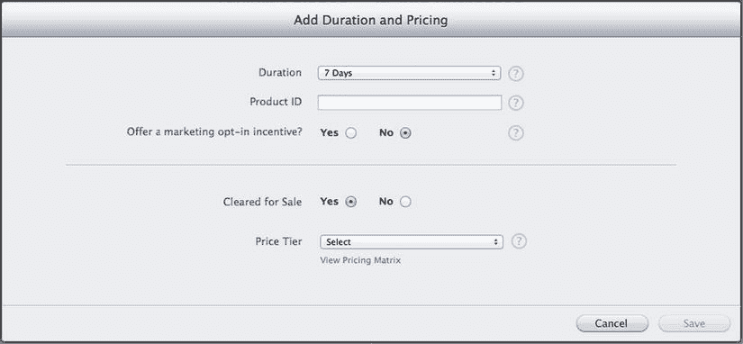

**图 11-9.** 在 iTunes Connect 中配置订阅时长

现在，你应该已经为应用内购买配置了至少一个产品。iTunes Connect 中的界面应类似于图 11-10。这完成了启用应用内购买所需的 iTunes Connect 初始配置。在下一节中，我们将开始处理在设备上完成购买所需的代码。

> **注意：** 暂时不必为“等待截图”错误担心；这将在后续流程中处理。在等待上传截图期间，你仍然可以测试购买。

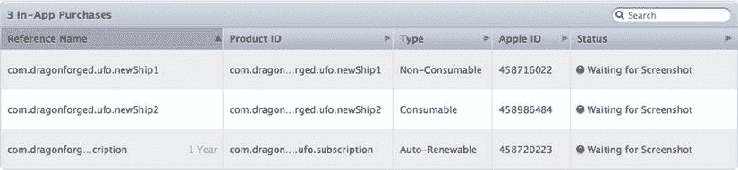

**图 11-10.** 产品已设置完毕，准备在应用中使用

## 向应用添加产品

苹果并未为应用内购买提供预设计的图形界面。作为开发者，你需要自行设计用户商店界面。在本节中，你将学习如何将在 iTunes Connect 中添加的产品显示在应用内供用户购买。

> **注意：** 新购买和更改可能需要数小时才能生效。如果反复检查后仍看不到产品，请等待几小时再试。

### 应用标识与内购

处理应用内购买时，苹果要求你的应用标识（App ID）不能包含通配符，例如 `76P4G6KX56.*`。你必须有一个唯一的应用标识，例如 `76P4G6KX56.com.dragonforged.ufo`。如果没有唯一标识，则需要创建一个。请按照以下步骤创建新的唯一应用标识。

在浏览器中访问 [`http://developer.apple.com/iPhone`](http://developer.apple.com/iPhone)，从右侧列表中选择“iPhone 开发者计划门户”。从左侧列中选择“应用标识”，然后点击右上角的“新建应用标识”按钮。填写应用的相关信息，点击“提交”。接着点击列表旁的“配置”按钮，确保“应用内购买”已开启（默认应为开启状态）。

### 设置

首先，我们将从应用中请求产品列表。首先，将 `StoreKit` 框架添加到你的项目中。我们将修改前一章节中已有的 UFO 项目；你也可以跟随自己的项目操作，这样更方便。

> **重要提示：** 应用内购买无法在模拟器上运行；所有测试必须在真机上进行。

创建一个名为 `UFOStoreViewController` 的新类。我们将使用此类向用户展示商店界面。头部文件设置如下：

```
#import <UIKit/UIKit.h>
#import <StoreKit/StoreKit.h>
@interface UFOStoreViewController : UIViewController <SKProductsRequestDelegate>
{
    SKProductsRequest *productsRequest
}
@end
```

如你所见，我们导入了 `StoreKit` 头文件，设置了 `SKProductsRequestDelegate` 委托，并创建了一个对象来持有产品请求。我们需要为用户提供访问商店的途径，因此请为主屏幕添加一个按钮以及相关代码，以展示新的视图控制器（`UFOStoreViewController`）。

### 获取产品列表

修改新商店视图控制器的 `viewDidLoad` 和 `viewDidUnload` 方法，使用在 iTunes Connect 中设置的产品标识符发起新的商店请求。你可能需要修改产品标识符，使其与你之前设置的一致。

```
- (void)viewDidLoad
{
    [super viewDidLoad];
    NSSet *productIdentifiers = [NSSet setWithObjects:
        @"com.dragonforged.ufo.newShip1", @"com.dragonforged.ufo.subscription", nil];
    productsRequest = [[SKProductsRequest alloc]
        initWithProductIdentifiers:productIdentifiers];
    productsRequest.delegate = self;
    [productsRequest start];
}
- (void)viewDidUnload
{
    productsRequest.delegate = nil;
}
```

产品请求在下一步展示的委托回调中释放。目前，此方法仅将产品信息打印至控制台，并记录任何无效产品。

```
- (void)productsRequest:(SKProductsRequest *)request
    didReceiveResponse:(SKProductsResponse *)response
{
    NSArray *productArray= [response products];
    for (SKProduct *product in productArray) {
        NSLog(@"Product title: %@" , product.localizedTitle);
        NSLog(@"Product description: %@" , product.localizedDescription);
        NSLog(@"Product price: %@" , product.price);
        NSLog(@"Product id: %@\n\n" , product.productIdentifier);
    }
    for (NSString *invalidProduct in response.invalidProductIdentifiers)
    {
        NSLog(@"Invalid: %@" , invalidProduct);
    }
    [request release];
}
```

> **注意：** 尽管可以使用本节代码获取无效产品标识符列表，但并没有关联的错误信息来判定产品为何被标记为无效。最常见的原因是产品 ID 输入错误，或者时间不足，产品尚未分发至服务器。

如果你现在运行游戏并进入商店，应获得类似以下输出：

```
2011–08-19 17:31:23.970 UFOs[3580:707] 产品标题：Ship+
2011–08-19 17:31:23.973 UFOs[3580:707] 产品描述：为飞船涂装并向朋友炫耀
2011–08-19 17:31:23.975 UFOs[3580:707] 产品价格：8.99
2011–08-19 17:31:23.977 UFOs[3580:707] 产品 ID：com.dragonforged.ufo.newShip1
2011–08-19 17:31:23.979 UFOs[3580:707] 产品标题：订阅服务
2011–08-19 17:31:23.981 UFOs[3580:707] 产品描述：一项订阅服务
2011–08-19 17:31:23.983 UFOs[3580:707] 产品价格：1.99
2011–08-19 17:31:23.987 UFOs[3580:707] 产品 ID：com.dragonforged.ufo.subscription
```

> **注意：** 从产品请求获取响应可能需要数秒。最佳实践建议在加载期间向用户显示某种加载指示器。

以上就是从苹果服务器获取产品所需的全部步骤。下一节中，我们将使用标准表格视图向用户展示这些数据。


### 向用户展示你的产品

首先，在商店视图控制器中添加一个表格视图。别忘了按需连接数据源和委托。我们还需要在类中添加一个新属性来存储产品。创建一个名为 `productArray` 的新类数组，并在 `productsRequest` 方法中将产品结果赋值给它。

在你的类中添加两个必需的表格视图委托和数据源方法，如下列代码片段所示：

```objc
- (NSInteger)tableView:(UITableView *)tableView numberOfRowsInSection:(NSInteger)section
{
    return [productArray count];
}

- (UITableViewCell *)tableView:(UITableView *)tableView cellForRowAtIndexPath:(NSIndexPath *)indexPath
{
    static NSString *CellIdentifier = @"Cell";
    UITableViewCell *cell = [tableView dequeueReusableCellWithIdentifier:CellIdentifier];
    if (cell == nil)
    {
        cell = [[[UITableViewCell alloc] initWithStyle:UITableViewCellStyleSubtitle reuseIdentifier:CellIdentifier] autorelease];
        cell.selectionStyle = UITableViewCellSelectionStyleNone;
    }

    SKProduct *product = [self.productArray objectAtIndex: [indexPath row]];
    cell.textLabel.text = [NSString stringWithFormat:@"%@ - $%@", product.localizedTitle, product.price];
    cell.detailTextLabel.text = product.localizedDescription;
    return cell;
}
```

第一个方法简单地返回从苹果服务器检索到的产品数量，这些产品用于表格的行数。当我们将其显示为单元格时，我们使用内置的 `UITableViewCellStyleSubtitle`。我们将主标签设置为产品标题和价格，并使用详细标签显示描述。剩下的工作就是在 `productsRequest` 方法的末尾添加一个重新加载表格的方法。再次运行游戏时，你的输出应与图 11-11 所示类似。

> **注意：** 虽然 API 返回本地化的标题和描述，但它不会本地化价格。在国际化应用中，你需要自己完成这额外的一步。

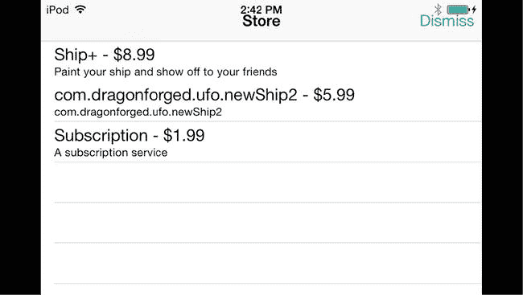

**图 11-11.** 在标准表格视图中显示产品列表

## 购买产品

在上一节中，你学习了如何将产品添加到你的应用中。如果没有购买这些产品的功能，我们的实现就只完成了一部分。在本节中，我们将探讨如何通过你的应用直接处理产品购买。

### 购买代码

我们需要做的第一件事是让 `UFOStoreViewController` 类遵循 `SKPaymentTransactionObserver` 协议。完成之后，我们修改现有的 `viewDidLoad` 方法。将 `self` 添加为新的交易观察者。此外，我们执行一个测试，确保可以在该设备上进行支付，如果不行，则显示一个 `UIAlert` 来通知用户。

```objc
- (void)viewDidLoad
{
    [super viewDidLoad];
    [[SKPaymentQueue defaultQueue] addTransactionObserver:self];

    if ([SKPaymentQueue canMakePayments])
    {
        NSSet *productIdentifiers = [NSSet setWithObjects:@"com.dragonforged.ufo.newShip1", @"com.dragonforged.ufo.subscription", nil];
        productsRequest = [[SKProductsRequest alloc] initWithProductIdentifiers:productIdentifiers];
        productsRequest.delegate = self;
        [productsRequest start];
    }
    else
    {
        UIAlertView *alert = [[UIAlertView alloc] initWithTitle:nil message:@"Unable to make purchases with this device." delegate:nil cancelButtonTitle:@"Dismiss" otherButtonTitles: nil];
        [alert show];
        [alert release];
    }
}
```

接下来，我们需要添加一个 `didSelectRowAtIndexPath` 方法来注册表格视图中的选择事件。

```objc
- (void)tableView:(UITableView *)tableView didSelectRowAtIndexPath:(NSIndexPath *)indexPath
{
    SKProduct *product = [self.productArray objectAtIndex: [indexPath row]];
    SKPayment *payment = [SKPayment paymentWithProductIdentifier:product.productIdentifier];
    [[SKPaymentQueue defaultQueue] addPayment:payment];
}
```

如果现在运行应用并选择一个表行，你会看到一个确认提示，如图 11-12 所示。然而，我们还没有编写任何处理该交易的代码，也没有设置测试用户，所以目前你只能进行到这一步。在快速查看多次购买同一商品的代码之后，我们将进入这些阶段。

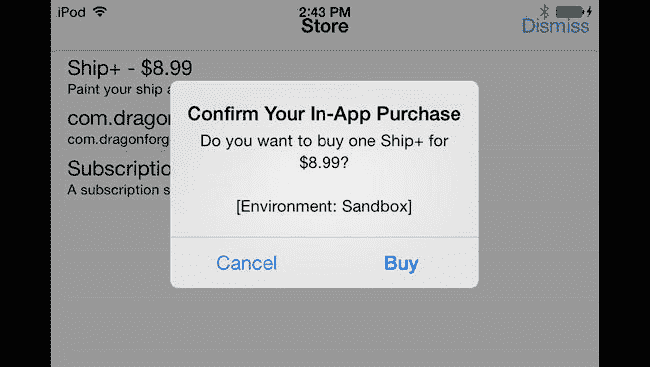

**图 11-12.** 在沙盒环境中确认购买

### 购买多个商品

苹果让用户一次购买多个商品变得很简单。以下代码片段可用于一次批量购买多个数量的同一商品，例如用户购买五包 100 金币：

```objc
SKMutablePayment *payment = [SKMutablePayment paymentWithProductIdentifier:com.dragonforged.rpg.100gold];
payment.quantity = 5;
[[SKPaymentQueue defaultQueue] addPayment: payment];
```


### 处理交易

当用户发起购买请求后，需要执行若干步骤以确保购买成功完成。首先，我们需要实现`SKPaymentTransactionObserver`协议中要求的方法。如下方代码示例所示，我们检测当前交易状态，然后根据交易成功、失败或恢复来调用相应的方法：

```objc
- (void)paymentQueue:(SKPaymentQueue *)queue updatedTransactions:(NSArray *)transactions
{
    for (SKPaymentTransaction *transaction in transactions)
    {
        if ([transaction transactionState] == SKPaymentTransactionStatePurchased)
        {
            [self transactionDidComplete:transaction];
        }
        else if ([transaction transactionState] == SKPaymentTransactionStateFailed)
        {
            [self transactionDidFail:transaction];
        }
        else if ([transaction transactionState] == SKPaymentTransactionStateRestored)
        {
            [self transactionDidRestore:transaction];
        }
        else
        {
            NSLog(@"未处理的情况: %@", transaction);
        }
    }
}
```

我们需要实现一些便捷方法来简化流程。如果交易成功完成或已恢复，我们需要记录交易事件、解锁用户购买的内容，并执行一些清理工作。如果交易失败或取消，我们只需执行清理操作，并可能通知用户发生了问题。相关代码如下：

```objc
- (void)transactionDidComplete:(SKPaymentTransaction *)transaction
{
    [self recordTransactionData:transaction];
    [self unlockContent:[[transaction payment] productIdentifier]];
    [self finishTransaction:transaction withSuccess:YES];
}

- (void)transactionDidRestore:(SKPaymentTransaction *)transaction
{
    [self recordTransactionData:transaction.originalTransaction];
    [self unlockContent:[[[transaction originalTransaction] payment] productIdentifier]];
    [self finishTransaction:transaction withSuccess:YES];
}

- (void)transactionDidFail:(SKPaymentTransaction *)transaction
{
    if ([[transaction error] code] != SKErrorPaymentCancelled)
    {
        [self finishTransaction:transaction withSuccess:NO];
    }
    // SKErrorPaymentCancelled
    else
    {
        [[SKPaymentQueue defaultQueue] finishTransaction:transaction];
    }
}
```

现在让我们详细看看调用的每个方法，先从`recordTransactionData`方法开始。该方法的主要目的是为我们的购买行为保留一份虚拟的审计线索。我们使用`NSUserDefaults`来保存所有已处理交易的数组，这样我们可以在将来任意时刻检查交易数据：

```objc
- (void)recordTransactionData:(SKPaymentTransaction *)transaction
{
    NSArray *transactions = [[NSUserDefaults standardUserDefaults] objectForKey:@"transactions"];
    NSMutableArray *transactionArray = [transactions mutableCopy];
    [transactionArray addObject:[transaction transactionReceipt]];
    [[NSUserDefaults standardUserDefaults] setObject:transactionArray forKey:@"transactions"];
    [transactionArray release];
}
```

接下来，看看`unlockContent`方法。这里就是你的应用可能有所不同的地方。在本示例中，我们在`NSUserDefaults`中设置一个标志，用于检查用户是否已购买某个功能。根据应用的结构不同，你可能需要采取不同的方式来解锁内容，但无论采用何种方法，请记住，你需要确保解锁的内容在应用重启后依然保留。请参阅“在 UFOs 中将所有内容整合在一起”一节，了解如何实现此方法的示例。

```objc
- (void)unlockContent:(NSString *)productId
{
    if ([productId isEqualToString:@"com.dragonforged.ufo.newShip1"])
    {
        [[NSUserDefaults standardUserDefaults] setBool:YES forKey:@"shipPlusAvailable"];
    }
    if ([productId isEqualToString:@"com.dragonforged.ufo.subscription"])
    {
        [[NSUserDefaults standardUserDefaults] setBool:YES forKey:@"subscriptionAvailable"];
    }
}
```

对于成功和不成功的购买，最后一步都是对交易过程进行一些清理。以下方法中最重要的步骤是调用`finishTransaction`方法。我们还会记录交易结果以供调试。在你调用`finishTransaction`之前，交易将保持开放状态并存在于系统中。

```objc
- (void)finishTransaction:(SKPaymentTransaction *)transaction withSuccess:(BOOL)success
{
    [[SKPaymentQueue defaultQueue] finishTransaction:transaction];
    NSDictionary *transactionDictionary = [NSDictionary dictionaryWithObjectsAndKeys:transaction, @"transaction", nil];
    if (success)
    {
        NSLog(@"交易成功: %@", transactionDictionary);
    }
    else
    {
        NSLog(@"交易失败: %@", transactionDictionary);
    }
}
```

### 恢复之前完成的交易

通常，用户需要恢复他们之前完成的购买。这可能在用户重新安装应用或在另一台设备上开始使用时发生。始终为用户提供下载所有内容的途径非常重要。幸运的是，Apple 已经预见到了这一场景，并提供了一个简单的方法来恢复用户的购买。

```objc
[[SKPaymentQueue defaultQueue] restoreCompletedTransactions];
```

这将重新购买你的所有内容，就像用户从你的商店中选择它们一样。你会收到`paymentQueue:updatedTransactions`方法的相应回调，并可以使用现有的代码来解锁内容。

## 测试账户与测试购买

如果你现在尝试在沙盒环境中购买某个项目，将会收到账户错误。你需要先创建一个新的测试账户，才能在不产生实际费用的情况下测试购买。要设置新的测试用户，你需要登录 iTunes Connect（[`http://iTunesConnect.apple.com`](http://itunesconnect.apple.com/)）。从 iTunes Connect 主屏幕选择“管理用户”部分；在这里，选择“新测试用户”选项。

测试用户无需使用真实的电子邮件地址，你应选择输入方便且容易记住的内容，例如`abc@def.com`。虽然你需要输入出生日期和其他身份信息，但完全可以虚构这些数据。请确保选择与测试应用本地化版本相对应的 iTunes Store。你可以为每个要测试的地区创建一个新账户。

### 使用测试账户登录

你不能直接在“设置”应用中登录测试账户。如果这样做，你将被迫同意标准用户协议，并提示输入信用卡号。为了解决这个问题，你需要使用“设置”应用退出当前的 iTunes 账户。退出账户后，在尝试购买时会提示你登录或创建新账户。此时你就可以输入测试账户的凭据。

**注意：** 如果你在主要设备上进行测试，在进行真实购买或下载更新前，别忘了重新打开“设置”应用并退出测试账户。


#### 提交购买界面截图

我们在本章前面简要讨论过这一步骤。苹果要求你在应用内购买项目获得销售许可之前，先提交一张截图。关于苹果具体需要这张截图展示什么，存在一些困惑。

简单来说，苹果希望你能提供一张屏幕截图，证明你的应用内购买功能按预期工作。对于可解锁内容，这应该是一张正在使用该项目的截图，比如用户正在玩已购买的游戏关卡，或正在使用已购买的道具。然而，有时候你的产品在使用时可能并不可见。在这种情况下，苹果接受一张商店界面显示该项目已被购买的截图，如图 11-13 所示。

**注意：** 你需要等到完成应用的编写和调试，并准备提交审核时，才需要提交截图。

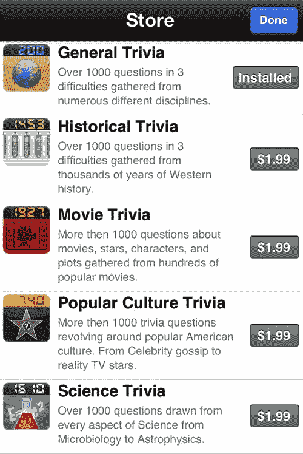

*图 11-13.* 当没有可截取的使用中画面时，一张可被接受的应用内购买截图示例。

**注意：** 苹果在审核过程中测试应用内购买时，会使用沙盒账户。这意味着提交给苹果的应用需要同时支持沙盒环境和生产环境。

#### 开发者批准

在应用内购买项目准备就绪之前的最后一步是获得开发者批准。回到网页浏览器中的 iTunes Connect，导航至应用审核页面的“管理应用内购买”部分。屏幕右上角会出现一个新的绿色按钮。

系统会提示你如何提交产品。有以下两种选项：

-   **随二进制文件提交：** 此选项将在你下次上传二进制文件时启用应用内购买功能。
-   **立即提交：** 此选项允许你向现有应用提交新产品。

**注意：** 如果你看到“随新二进制文件提交”选项，可能是因为你的上一个应用版本是在 iOS 3.0 引入应用内购买功能之前上传的。

#### 收据

当你成功完成一笔交易时，你会收到一张收据，作为已完成的交易对象的一部分。以下是我们 UFOs 演示项目中一次购买的收据样本。

```
{
"signature" = "AnQ+nzB60K5Lc6pI6zh8bptEO+GSGUJ+xT5DSef2p66H8gz/P/D13mBqf96ciJoLesI64fohhZTNb9NrCEkZMVyeqkJed2t38509XpckLWeLJCDYUJqUS1t+fsoy7fwSU0v8TUBzF3Eua1h83GszxlPyylo3mRDssrG+QcgrHwFOAAADVzCCA1MwggI7oAMCAQICCGUUkU3ZWAS1MA0GCSqGSIb3DQEBBQUAMH8xCzAJBgNVBAYTAlVTMRMwEQYDVQQKDApBcHBsZSBJbmMuMSYwJAYDVQQLDB1BcHBsZSBDZXJ0aWZpY2F0aW9uIEF1dGhvcml0eTEzMDEGA1UEAwwqQXBwbGUgaVR1bmVzIFN0b3JlIENlcnRpZmljYXRpb24gQXV0aG9yaXR5MB4XDTA5MDYxNTIyMDU1NloXDTE0MDYxNDIyMDU1NlowZDEjMCEGA1UEAwwaUHVyY2hhc2VSZWNlaXB0Q2VydGlmaWNhdGUxGzAZBgNVBAsMEkFwcGxlIGlUdW5lcyBTdG9yZTETMBEGA1UECgwKQXBwbGUgSW5jLjELMAkGA1UEBhMCVVMwgZ8wDQYJKoZIhvcNAQEBBQADgY0AMIGJAoGBAMrRjF2ct4IrSdiTChaI0g8pwv/cmHs8p/RwV/rt/91XKVhNl4XIBimKjQQNfgHsDs6yju++DrKJE7uKsphMddKYfFE5rGXsAdBEjBwRIxexTevx3HLEFGAt1moKx509dhxtiIdDgJv2YaVs49B0uJvNdy6SMqNNLHsDLzDS9oZHAgMBAAGjcjBwMAwGA1UdEwEB/wQCMAAwHwYDVR0jBBgwFoAUNh3o4p2C0gEYtTJrDtdDC5FYQzowDgYDVR0PAQH/BAQDAgeAMB0GA1UdDgQWBBSpg4PyGUjFPhJXCBTMzaN+mV8k9TAQBgoqhkiG92NkBgUBBAIFADANBgkqhkiG9w0BAQUFAAOCAQEAEaSbPjtmN4C/IB3QEpK32RxacCDXdVXAeVReS5FaZxc+t88pQP93BiAxvdW/3eTSMGY5FbeAYL3etqP5gm8wrFojX0ikyVRStQ+/AQ0KEjtqB07kLs9QUe8czR8UGfdM1EumV/UgvDd4NwNYxLQMg4WTQfgkQQVy8GXZwVHgbE/UC6Y7053pGXBk51NPM3woxhd3gSRLvXj+loHsStcTEqe9pBDpmG5+sk4tw+GK3GMeEN5/+e1QT9np/Kl1nj+aBw7C0xsy0bFnaAd1cSS6xdory/CUvM6gtKsmnOOdqTesbp0bs8sn6Wqs0C9dgcxRHuOMZ2tm8npLUm7argOSzQ==";
"purchase-info" = "ewoJIml0ZW0taWQiID0gIjQ1ODk4NjQ4NCI7Cgkib3JpZ2luYWwtdHJhbnNhY3Rpb24taWQiID0gIjEwMDAwMDAwMDU4NDM1MzgiOwoJInB1cmNoYXNlLWRhdGUiID0gIjIwMTEtMDgtMjEgMjI6Mzk6NTIgRXRjL0dNVCI7CgkicHJvZHVjdC1pZCIgPSAiY29tLmRyYWdvbmZvcmdlZC51Zm8ubmV3U2hpcDIiOwoJInRyYW5zYWN0aW9uLWlkIiA9ICIxMDAwMDAwMDA1ODQzNTM4IjsKCSJxdWFudGl0eSIgPSAiMSI7Cgkib3JpZ2luYWwtcHVyY2hhc2UtZGF0ZSIgPSAiMjAxMS0wOC0yMSAyMjozOTo1MiBFdGMvR01UIjsKCSJiaWQiID0gImNvbS5kcmFnb25mb3JnZWRzb2Z0d2FyZS5Ucml2aWFsU2NpIjsKCSJidnJzIiA9ICIxLjAiOwp9";
"environment" = "Sandbox";
"pod" = "100";
"signing-status" = "0";
}
```

苹果强烈建议开发者检查此收据的有效性。虽然这一步骤仍是可选的，但进行检查可以增加一层安全保障，防止用户在不付费的情况下激活你的应用内购买。苹果提供了两个用于验证收据的服务器：一个用于沙盒环境，另一个用于正式发布软件，如表 11-1 所述。

*表 11-1.* 用于向苹果验证收据的服务器地址

| 环境 | 服务器地址 |
| --- | --- |
| 沙盒 | [`sandbox.itunes.apple.com`](http://sandbox.itunes.apple.com) |
| 生产环境 | [`buy.itunes.apple.com`](http://buy.itunes.apple.com) |

Joe D’Andrea 在 Stack Overflow ( [`http://stackoverflow.com/questions/1298998`](http://stackoverflow.com/questions/1298998) ) 上发布了两种方法来帮助你检查有效收据。他的方法简洁高效，为了方便您使用，我已将其收录在此。

```objc
-(BOOL)verifyReceipt:(SKPaymentTransaction *)transaction
{
    NSString *jsonObjectString = [self encode:(uint8_t *)transaction.transactionReceipt.bytes length:transaction.transactionReceipt.length];
    NSString *completeString = [NSString stringWithFormat:@"http://url-for-your-php?receipt=%@", jsonObjectString];
    NSURL *urlForValidation = [NSURL URLWithString:completeString];
    NSMutableURLRequest *validationRequest = [[NSMutableURLRequest alloc] initWithURL:urlForValidation];
    [validationRequest setHTTPMethod:@"GET"];
    NSData *responseData = [NSURLConnection sendSynchronousRequest:validationRequest returningResponse:nil error:nil];
    [validationRequest release];
    NSString *responseString = [[NSString alloc] initWithData:responseData encoding:NSUTF8StringEncoding];
    NSInteger response = [responseString integerValue];
    [responseString release];
    return (response == 0);
}

- (NSString *)encode:(const uint8_t *)input length:(NSInteger)length
{
    static char table[] = "ABCDEFGHIJKLMNOPQRSTUVWXYZabcdefghijklmnopqrstuvwxyz0123456789+/=";
    NSMutableData *data = [NSMutableData dataWithLength:((length + 2) / 3) * 4];
    uint8_t *output = (uint8_t *)data.mutableBytes;
    
    for (NSInteger i = 0; i < length; i += 3) {
        NSInteger value = 0;
        for (NSInteger j = i; j < (i + 3); j++) {
            value <<= 8;
            if (j < length) {
                value |= (0xFF & input[j]);
            }
        }
        NSInteger index = (i / 3) * 4;
        output[index + 0] = table[(value >> 18) & 0x3F];
        output[index + 1] = table[(value >> 12) & 0x3F];
        output[index + 2] = (i + 1) < length ? table[(value >> 6) & 0x3F] : '=';
        output[index + 3] = (i + 2) < length ? table[(value >> 0) & 0x3F] : '=';
    }
    return [[[NSString alloc] initWithData:data encoding:NSASCIIStringEncoding] autorelease];
}
```

将这两个方法添加到你的项目之后，你只需调用`verifyReceipt`并传入你收到的交易对象，然后执行一个布尔值测试来判断收据是否有效。至此，就完成了验证收据真伪所需的所有步骤。

这种验证收据的方法要求你托管一个中间服务器；以下是一个非常精简的用于验证收据的 PHP 脚本：

```php
$receipt = json_encode(array("receipt-data" => $_GET["receipt"]));
// 注意：在生产环境中使用 "buy" 替代 "sandbox"。
$url = "https://sandbox.itunes.apple.com/verifyReceipt";
$response_json = call-your-http-post-here($url, $receipt);
$response = json_decode($response_json);
// 在此处保存数据！
print $response->{'status'};
```


### iOS 7 本地收据验证

iOS 7 增加了在设备上验证应用内购买收据的功能，而无需通过第三方服务器。服务器收据验证仍然可用，甚至可能根据应用需求更为合适。

苹果建议在调用 `NSApplicationMain` 函数之前，在应用的主函数内验证本地收据。为了验证收据，首先必须定位它。`NSBundle` 包含一个便捷辅助方法，可以为你定位收据。如果未找到收据，则验证失败。

`[[NSBundle mainBundle] appStoreReceiptURL];`

定位到收据后，需要检查以确保它已由苹果正确签名。苹果在《收据验证编程指南》中提供了验证收据签名的示例代码。此处转载该示例代码以便查阅。该代码将使用 OpenSSL 验证收据的签名。

```
/* PKCS #7 容器（收据）和验证输出。 */
BIO *b_p7;
PKCS7 *p7;

/* 苹果根证书，以原始数据及其 OpenSSL 表示形式。 */
BIO *b_x509;
X509 *Apple;

/* 用于信任链验证的根证书。 */
X509_STORE *store = X509_STORE_new();

/* ... 使用 BIO_new_mem_buf() 函数并传入缓冲区及其大小来初始化两个 BIO 变量 ... */

/* 将 b_out 初始化为输出 BIO，用于保存在签名验证期间提取的收据负载。 */
BIO *b_out = BIO_new(BIO_s_mem());

/* 捕获收据文件的内容，并将 p7 变量填充为 PKCS #7 容器。 */
p7 = d2i_PKCS7_bio(b_p7, NULL);

/* ... 将苹果根证书加载到 b_X509 中 ... */

/* 将 b_x509 初始化为输入 BIO，其值为苹果根证书，并将其加载到 X509 数据结构中。
   然后将苹果根证书添加到该结构中。 */
Apple = d2i_X509_bio(b_x509, NULL);
X509_STORE_add_cert(store, Apple);

/* 验证签名。如果验证正确，b_out 将包含 PKCS #7 负载，且 rc 将为 1。 */
int rc = PKCS7_verify(p7, NULL, store, NULL, b_out, 0);

/* 为了增强安全性，你可以验证根证书的指纹，并验证中间证书和签名证书的 OID。
   中间证书的证书策略扩展中的 OID 为 (1 2 840 113635 100 5 6 1)，
   签名证书的标记 OID 为 (1 2 840 113635 100 6 11 1)。 */
```

下一个代码示例将使用 asn1c 解析收据负载。

```
#include "Payload.h" /* 此头文件由 asn1c 生成。 */

/* 收据负载及其大小。 */
void *pld = NULL;
size_t pld_sz;

/* 用于解析负载的变量。两种数据类型均在 Payload.h 中声明。 */
Payload_t *payload = NULL;
asn_dec_rval_t rval;

/* ... 将收据文件中的负载加载到 pld 中，并将 pld_sz 设置为负载大小 ... */

/* 使用 asn1c 生成的解码器函数解析缓冲区。
   payload 变量将包含收据属性。 */
rval = asn_DEF_Payload.ber_decoder(NULL, &asn_DEF_Payload, (void **)&payload, pld,
```

以下代码示例提取收据属性。

```
/* 用于存储收据属性的变量。 */
OCTET_STRING_t *bundle_id = NULL;
OCTET_STRING_t *bundle_version = NULL;
OCTET_STRING_t *opaque = NULL;
OCTET_STRING_t *hash = NULL;

/* 遍历收据属性，保存计算 GUID 哈希所需的值。 */
size_t i;
for (i = 0; i < payload->list.count; i++) {
    ReceiptAttribute_t *entry;
    entry = payload->list.array[i];
    switch (entry->type) {
        case 2:
            bundle_id = &entry->value;
            break;
        case 3:
            bundle_version = &entry->value;
            break;
        case 4:
            opaque = &entry->value;
            break;
        case 5:
            hash = &entry->value;
            break;
    }
}
```

接下来，需要将收据的包标识符与应用 `info.plist` 中的 `CFBundleShortVersionString` 值进行比较。如果这两个标识符不匹配，则验证失败。

然后，验证收据中的版本标识符字符串是否与 `info.plist` 中 `CFBundleShortVersionString` 的硬编码值匹配。如果这些值不匹配，则验证失败。

最后，检查收据的 GUID 是否与设备的 GUID 匹配。设备的 GUID 可以通过以下代码获得。同样，如果这两个值不匹配，则验证失败。

`[[UIDevice currentDevice] identifierForVendor];`

如果收据已找到且由苹果签名，并且包标识符、版本和 GUID 的值全部匹配，则收据和购买有效。

