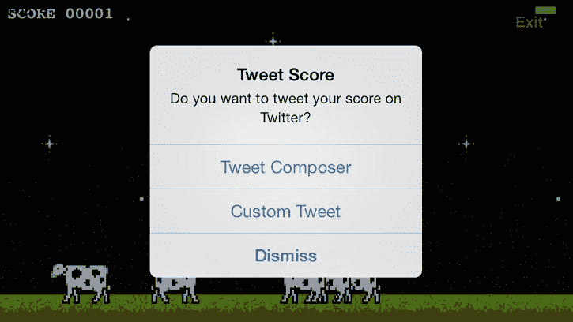
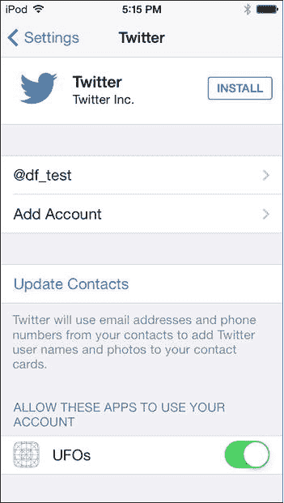
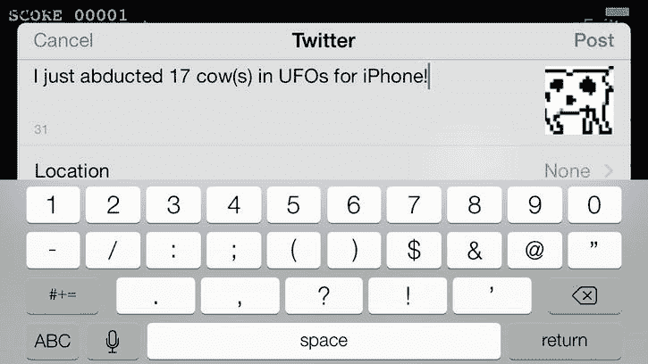

# 12. Twitter

## 摘要

让 Twitter 显得无聊且半成品的特点，恰恰是其强大之处。

> ——乔纳森·奇特林，哈佛法学教授

Twitter 于 2006 年 3 月由旧金山湾区的一个小开发团队创建。到 2012 年，其注册用户已超过 5 亿，且增长势头不减。注册用户可以在自己的时间线上发布 140 字符的短消息，关注者和公众均可浏览这些消息。苹果在 iOS 5 中开始大力推动社交网络，并宣布添加 Social Framework。首个获得支持的服务是 Twitter，随后在 iOS 6 中支持了 Facebook。尽管自 iOS 2.0 起苹果就在 iOS 中集成了谷歌地图等第三方软件，但 Twitter 的集成标志着一次里程碑。这是首次有第三方应用成为核心系统组件。虽然 Twitter 应用默认并未安装，但用户可以轻松通过 `Settings.app` 安装。

本章将引导您完成将 Twitter 集成到应用中的过程。主要重点是使用内置的 Twitter Composer 以实现快速集成。在“深入使用 Twitter”一节中，还将为在更直接层面使用 Twitter 提供基础。

## UFO 游戏

与之前的章节不同，本章不会继续基于现有的 UFO 游戏源代码进行开发。相反，我们将从第三章的源代码出发，为其添加 Twitter 功能。这种风格变化的主要原因是为了精简现有代码库，使项目尽可能易于理解。虽然之前的代码是基于前几章的经验不断构建的，但剩余章节涵盖的主题本质上相互独立。因此，接下来四章（关于 Twitter、Facebook、Airplay 和游戏控制器）都将基于 UFO 游戏示例代码的早期版本。

我们将在游戏结束后，使用 Twitter 将用户分数发布到他们的时间线上。这需要对第三章示例项目中的应用行为做一处更改。`exitAction:` 函数将被更新，以提示用户选择一种 Twitter 发布方法，或选择退出返回主菜单：

```
-(IBAction)exitAction:(id)sender
{
    UIAlertView *alert = [[UIAlertView alloc] initWithTitle:@"Tweet Score" message:@"Do you
    want to tweet your score on Twitter?" delegate:self cancelButtonTitle:@"Dismiss"
    otherButtonTitles:@"Tweet Composer", @"Custom Tweet", nil];
    [alert show];
    [alert release];
}
```

为 `alertView` 设置了一个新的委托方法来处理回调并确定所需执行的操作。用户将看到三个选项（图 12-1）。两种 Twitter 方式将在“Tweet Composer”和“Custom Tweets”两节中讨论；“Dismiss”操作将执行 `exitAction:` 方法先前的行为，即提交分数并返回主屏幕：

```
- (void)alertView:(UIAlertView *)alertView didDismissWithButtonIndex:(NSInteger)buttonIndex
{
     //tweet composer
    if(buttonIndex == 1) {
    } else if(buttonIndex == 2) {//custom tweet
    } else if(buttonIndex == 0) {
        [[self navigationController] popViewControllerAnimated: YES];
        [self.gcManager reportScore:score forCategory:@"com.dragonforged.ufo.single"];
    }
}
```



**图 12-1.** 游戏结束后选择 Twitter 发布选项

## iOS 上的 Twitter

自 2011 年引入以来，Twitter 已成为 iOS 不可或缺的一部分。从 iOS 6 开始，Game Center 在合并的 Game Center 视图控制器内添加了共享应用的内置功能。Twitter 账户配置可通过 `Settings.app`（图 12-2）进行；截至 iOS 7，尚无法为您的用户提供通过第三方应用（如您的产品）登录的方法。



**图 12-2.** iOS 7 中 Twitter 的配置设置

通过 `Settings.app`，iOS 上的 Twitter 允许用户配置多个账户，但授权是一次性授予所有账户的。首次请求 Twitter 功能时，每个应用都必须请求访问用户 Twitter 账户的权限。可以在 `Settings.app` 的 Twitter 部分找到当前拥有访问权限的应用列表；用户也可以随时撤销特定应用对 Twitter 的访问权限。

`Social Framework` 提供了两种将内容发布到用户时间线的方法。Tweet Composer 使用内置图形用户界面，其功能类似于电子邮件编辑器。可以预设消息、附件和 URL，但用户在发送推文前可以修改文本；此方法将在“Tweet Composer”一节中描述。您还可以使用更定制化的方法，允许您通过自定义用户界面发送推文；此方法可在用户无需事先预览信息的情况下发送推文。此方法将在“Custom Tweets”一节中描述。


### Tweet Composer

Tweet Composer（图 12-3）是允许用户向 Twitter 发布状态的最简单方法。它提供了一个大多数用户已经熟悉的界面，并包含轻松包含图片、URL、位置和多个账户的控件和功能。主要缺点是用户需要自己阅读和发布推文内容。这意味着当发布像分数这样的项目时（如图 12-3 所示），用户可能会输入虚假分数，或者根据自己的意愿修改文本。



图 12-3. Tweet Composer 视图

要开始使用 Tweet Composer，用户必须执行测试以确保其设备兼容。导致`isAvailableForServiceType`失败的最常见原因是用户尚未设置 Twitter 账户或未通过`Settings.app`登录：

`[SLComposeViewController isAvailableForServiceType:SLServiceTypeTwitter]`

**注意**：在开始使用 Twitter Composer 之前，不要忘记引入`Social.Framework`并导入`social/Social.h`。

一旦确认设备上 Twitter 可用且已正确登录，就可以创建新的`SLComposeViewController`。在本示例中，我们将指定`SLServiceTypeTwitter`，但其他类型也可用。在第 13 章中我们将使用 Facebook，而`SLComposeViewController`从 iOS 7 开始也支持新浪微博、腾讯微博和 LinkedIn 的社交网络。

`SLComposeViewController *tweetController = [SLComposeViewController composeViewControllerForServiceType:SLServiceTypeTwitter];`

创建用于处理`SLComposeViewController`完成的新块。在示例应用中，两种完成情况下都会将最高分发布到 Game Center，并将用户返回主菜单。

```
SLComposeViewControllerCompletionHandler myBlock = ^(SLComposeViewControllerResult result)
{
if (result == SLComposeViewControllerResultCancelled) {
NSLog(@"Tweet Controller Canceled");
[[self navigationController] popViewControllerAnimated: YES];
[self.gcManager reportScore:score forCategory:@"com.dragonforged.ufo.single"];
} else {
NSLog(@"Tweet Controller Done");
[[self navigationController] popViewControllerAnimated: YES];
[self.gcManager reportScore:score forCategory:@"com.dragonforged.ufo.single"];
}
[tweetController dismissViewControllerAnimated:YES completion:nil];
};
```

新创建的块被设置为`SLComposeViewController`上的`completionHandler`属性：

`tweetController.completionHandler = myBlock;`

现在可以为 Tweet Composer 可选地设置默认值；这些值将预填充到 Composer 中供用户使用。有三个可用的值：`setInitialText:` 将向用户提供推文文本，请记住有 140 个字符的限制。使用`addImage:`可以添加图片；这将为`UIImage`提供一个 Twitpic URL，该 URL 将在提交推文时上传。最后，`addURL:`提供了添加 URL 的功能。

```
[tweetController setInitialText:[NSString stringWithFormat: @"I just abducted %0.0f cow(s) in UFOs for iPhone!", score]];
[tweetController addImage:[UIImage imageNamed:@"Cow1.png"]];
[tweetController addURL:[NSURL URLWithString:@"http://bit.ly/19ak0Uv"]];
```

自定义 Tweet Composer 后，像呈现其他模态视图一样呈现给用户：

`[self presentViewController:tweetController animated:YES completion:nil];`

当用户发送推文时，之前的块被调用，并执行指定的回调操作。用户还会听到一个简短的推文音效，以告知推文已成功发送。最终的推文产品可以在图 12-4 中看到，该图截取自 Twitter 网站。


图 12-4. 在 Twitter.com 上看到的来自 UFOs 应用的推文


### 自定义推文

在许多情况下，可能需要通过自定义用户界面或完全无需用户界面来发布推文。iOS 将此功能作为账户框架的一部分提供。虽然基于账户的 Twitter 发布方法稍微复杂一些，并且需要用户明确授予应用程序权限，但它比前面讨论的推文编辑器提供了更多的自定义性和灵活性。

**注意：** 在处理自定义推文时，请确保包含 `Accounts.framework` 并导入 `accounts/Accounts.h`。

与使用推文编辑器不同，在处理账户时，首先需要做的是创建一个推文来源账户的引用。这是通过创建一个新的 `ACAccountStore` 和一个新的 `ACAccountype` 来实现的，如下面的代码片段所示：

```
ACAccountStore *account = [[[ACAccountStore alloc] init] autorelease];
ACAccountType *accountType = [account accountTypeWithAccountTypeIdentifier: ACAccountTypeIdentifierTwitter];
```

一旦指定了账户类型，用户需要授予应用程序与该账户交互的权限。在新创建的 `ACAccountStore` 上调用 `requestAccessToAccountsWithType:` 即可实现此功能：

```
account requestAccessToAccountsWithType:accountType options:nil completion:^(BOOL granted, NSError *error)
```

系统将提示用户允许应用程序访问，如图 12-5 所示。

![A978-1-4302-4906-1_12_Fig5_HTML.jpg

**图 12-5.** 被提示允许访问设备上的 Twitter 账户

`granted` 变量的值将反映用户是否同意允许应用程序访问他们的 Twitter 信息。此权限使应用程序能够完全访问账户，包括发布推文以及读取好友和时间线历史等信息。

用户可能在设备上设置了多个 Twitter 账户，因此能够确定用户想从哪个账户发布推文非常重要。可以使用 `accountsWithAccountType:` 获取用户账户的数组，对于示例应用程序，默认将使用数组中的最后一个账户：

```
NSArray *accounts = [account accountsWithAccountType:accountType];
```

根据推文是否包含附加图片，需要使用两个不同的端点。如果推文被发布到错误的端点，会静默失败。对于包含图片数据的推文，端点是 `https://upload.twitter.com/1/statuses/update_with_media.json`；而不包含图片数据的推文应发布到 `http://api.twitter.com/1/statuses/update.json`。以下示例演示了如何选择并存储正确的端点：

```
NSURL *requestURL = nil;
if (hasAttachment) {
    requestURL = [NSURL URLWithString:@"https://upload.twitter.com/1/statuses/update_with_media.json"];
} else {
    requestURL = [NSURL URLWithString:@"http://api.twitter.com/1/statuses/update.json"];
}
```

一旦确定了正确的端点，就创建一个新的 `SLRequest`。`SLRequest` 对象在处理社交框架和基于账户的方法时，会完成所有繁重的工作。它为与受支持的第三方 API 通信提供了一个封装器。服务类型设置为 `SLServiceTypeTwitter`，并选择 POST 方法。设置之前确定的 URL，最后将其他参数设置为 nil：

```
SLRequest *postRequest = [SLRequest requestForServiceType:SLServiceTypeTwitter requestMethod:SLRequestMethodPOST URL:requestURL parameters:nil];
```

在将 `SLRequest` 提交到 Twitter 服务器之前，必须首先配置其元数据，以提供推文文本和任何可能附件的信息。推文格式的规范来自官方 Twitter API 文档。关于 API 交互的具体细节，请参阅 `https://dev.twitter.com/docs/api`。推文文本被编码为 `NSData`，并使用标识名称 `"status"` 和类型 `"multipart/form-data"` 进行提交。

```
NSString *text = [NSString stringWithFormat: @"I just abducted %0.0f cow(s) in UFOs for iPhone!", score];
NSData *textData = [text dataUsingEncoding:NSUTF8StringEncoding];
[postRequest addMultipartData:textData withName:@"status" type:@"multipart/form-data" filename:nil];
```

如果你想为推文提供图片附件，可以使用以下方法。这将在上传过程中将图片提交到 Twitpic：

```
NSData *imageData = UIImageJPEGRepresentation([UIImage imageNamed:@"Saucer1.png"], 1.0);
[postRequest addMultipartData:imageData withName:@"media" type:@"image/jpg" filename:@"Image.jpg"];
```

在提交推文之前，需要告知 `SLRequest` 该推文将发送到哪个账户，因为 `SLRequest` 一次只支持发布到一个账户。这种方法还可以让用户在发布前有机会查看和修改推文。我们通过将 `SLRequest` 的 `account` 属性设置为之前从数组中检索到的 Twitter 账户来提供此信息：

```
postRequest.account = twitterAccount;
```

一旦提供了账户和元数据，就可以发布推文了。在 `postRequest` 上调用 `performRequestWithHandler` 方法，并提供一个用于回调的 block。如果帖子成功提交，返回的状态码将是 200。其他错误代码表示出错；W3C（万维网联盟）维护了一个标准化的错误代码及其含义列表，网址为 `http://www.w3.org/Protocols/rfc2616/rfc2616-sec10.html`。由于结果是通过 block 返回的，因此使用一个便捷方法将结果发布给用户（图 12-6）。与编辑器不同，此方法在成功时不会为用户播放声音，也没有任何其他指示表明推文已成功发布。

```
[postRequest performRequestWithHandler:^(NSData *responseData, NSHTTPURLResponse *urlResponse, NSError *error) {
    if (error != nil) {
        [self performSelectorOnMainThread:@selector(displayAlertWithString:) withObject:[NSString stringWithFormat: @"一个错误发生了：%@", [error localizedDescription]] waitUntilDone:NO];
    }
    if ([urlResponse statusCode] == 200) {
        [self performSelectorOnMainThread:@selector(displayAlertWithString:) withObject:@"推文已成功发布" waitUntilDone:NO];
    }
}];
```


**图 12-6.** 通知用户自定义推文已成功发布


### 深入探索 Twitter

虽然发布推文功能已能满足多数游戏的需求，但有时你的应用可能需要获取用户的好友列表或访问其时间线数据。`SLRequest` 方法为这些更高级的功能提供了访问途径。本节将简要演示这两个主题。

若要获取用户最近五十条推文，可执行以下方法：

```
NSURL *requestURL = [NSURL URLWithString:@"http://api.twitter.com/1/statuses/home_timeline.json"];
NSDictionary *options = @{@"count" : @"50",@"include_entities" : @"1"};
SLRequest *postRequest = [SLRequest requestForServiceType:SLServiceTypeTwitter requestMethod:SLRequestMethodGET URL:requestURL parameters:options];
postRequest.account = twitterAccount;
```

若要获取用户的好友列表，可以使用以下方法：

```
NSURL *requestURL = [NSURL URLWithString:@"https://api.twitter.com/1.1/friends/list.json"];
SLRequest *postRequest = [SLRequest requestForServiceType:SLServiceTypeTwitter requestMethod:SLRequestMethodGET URL:requestURL parameters:nil];
request.account = self.twitterAccount;
```

在 API 层面与 Twitter 交互，可以完全访问 Twitter SDK。这种直接访问方式让你的应用能够超越单纯的推文发布，与 Twitter 进行更深入的互动。例如，应用可以拉取用户所有好友的列表，或下载用户的头像用于游戏。

`SLRequest` 的唯一限制在于它所交互的第三方 API 会不断演变。有关 `SLRequest` 和 Twitter 更多功能的详细信息，请参阅官方 Twitter API 文档：[`dev.twitter.com/docs/api`](https://dev.twitter.com/docs/api)。

## 本章小结

在本章中，你学习了 Social Framework 和 Accounts Framework，以及如何利用它们与 Twitter API 进行交互。我们涵盖了使用内置推文编辑器发布推文，以及使用自定义界面发布推文的方法。最后，我们简要介绍了通过 `SLRequest` 和 Twitter API 实现的其他功能，例如获取好友列表和时间线历史记录。现在，你应该已经能够完全自如地为下一个应用或游戏添加 Twitter 功能。`SLRequest` 会持续适应 Twitter API 的更新，这意味着即使 iOS 未发布新版本，社交网络也可能出现令人兴奋的新功能。下一章我们将探索 Facebook 功能，它将拓展你在本章学到的社交网络知识。

