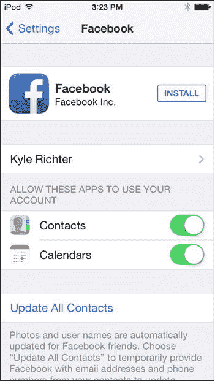
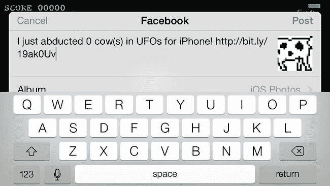
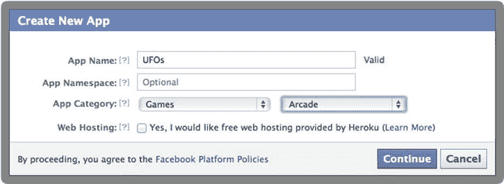
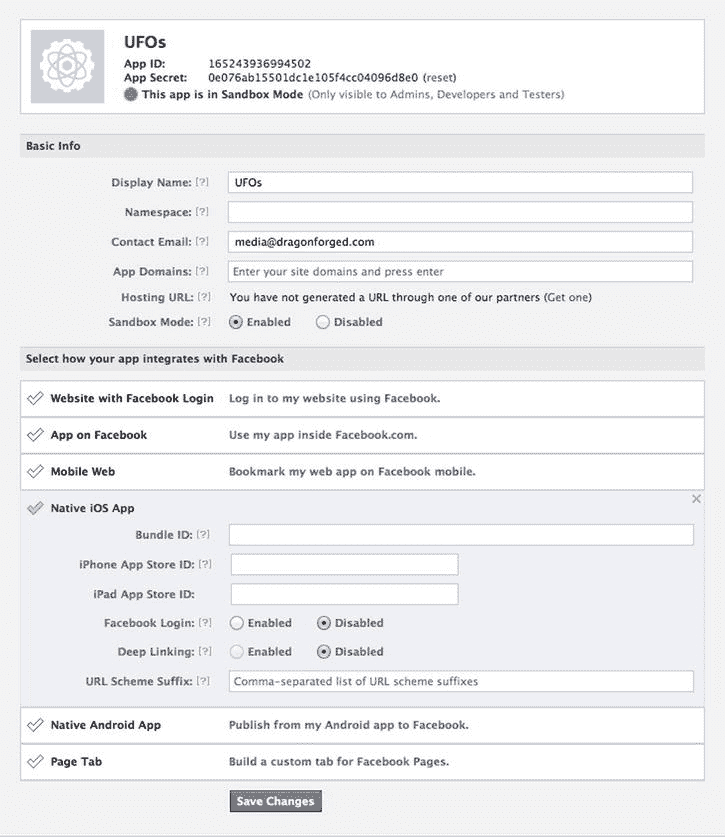
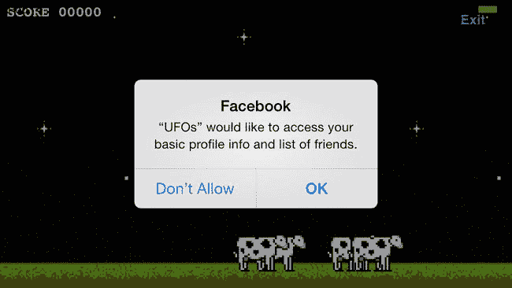

# 13. Facebook

摘要

> “想想人们如今在 Facebook 上做什么。他们与朋友和家人保持联系，同时也在为自己构建形象和身份——从某种意义上说，这就是他们的个人品牌。他们在与自己想要连接的受众建立联系。现在如果不用 Facebook，几乎可以说是一种劣势。”

> ——马克·扎克伯格

Facebook 成立于 2004 年 2 月，是西方世界最受欢迎的社交网络服务，拥有超过十亿活跃用户。Facebook 已与现代文化和社会紧密交织，甚至催生了一部关于其不光彩历史的大制作电影。

自移动设备在 2007 年开始普及以来，Facebook 一直是移动软件的核心组成部分，最初以移动版网站形式出现，并迅速转变为每个主流平台的原生服务。早在 iOS 2 时代，Facebook 的 API 就已可用，最初称为 Facebook Connect。随着 iOS 6 的推出，Facebook 的 API 服务成为 iOS SDK 的内置组件。Facebook 功能是对最初为 iOS 5 引入、用于支持 Twitter 的 Social Framework 的扩展。

## 关于示例项目

从第 12 章到本书结尾，示例代码不再基于之前的章节构建。本项目将是第 3 章示例项目的扩展；如果你打算跟随示例项目操作，请从该章的 Xcode 项目开始修改。

当用户退出游戏并获得最终得分后，系统会提示他们选择是否将该分数发布到自己的 Facebook 主页，可以使用内置编辑器或编程式 API 方式。用户也可以选择不分享分数并返回主菜单视图。为实现这一更改，`exitAction:` 方法被修改为通过 `UIAlert` 向用户呈现这些选项。

```
-(IBAction)exitAction:(id)sender;
{
    UIAlertView *alert = [[UIAlertView alloc]
    initWithTitle:@"Facebook 分数" message:@"是否要将分数发布到您的 Facebook 主页？"
    delegate:self cancelButtonTitle:@"取消"
    otherButtonTitles:@"Facebook 编辑器", @"自定义发布",
    nil];
    [alert show];
    [alert release];
}
```

`alert` 视图的代理也被配置为处理包含用户选择的回调。如果用户选择不在 Facebook 上分享分数，则将分数提交给 Game Center，并返回主菜单视图。

```
- (void)alertView:(UIAlertView *)alertView didDismissWithButtonIndex:(NSInteger)buttonIndex
{
     //Facebook 编辑器
    if(buttonIndex == 1)
    {
    }
    //自定义发布
    else if(buttonIndex == 2)
    {
    }
    else if(buttonIndex == 0)
    {
        [[self navigationController] popViewControllerAnimated: YES];
        [self.gcManager reportScore:score forCategory:@"com.dragonforged.ufo.single"];
    }
}
```

## iOS 上的 Facebook

当 Twitter 作为 iOS 5 中 Social Framework 的一部分被宣布时，许多人疑惑为什么没有同时包含 Facebook。苹果在 iOS 6 中解决了这个问题。与 Twitter 类似，Facebook 的设置需在“设置”应用内完成（图 13-1）；用户无法直接从第三方应用登录。Facebook 配置还支持将日历和联系人与其 iOS 原生版本同步。虽然 Twitter 允许用户同时登录多个账户，但在 iOS 7 中，Facebook 一次只能链接一个账户。



图 13-1. iOS 7 上 Facebook 的配置设置

在应用中通过 Social Framework 发布内容到 Facebook 有两种系统实现方式。第一种是使用 `SLComposeViewController`，这在“Facebook 编辑器”一节中有描述。这是最容易实现的方式，用户将看到一个标准、熟悉的界面。第二种方式是使用 `SLRequest` 直接与 Facebook SDK 交互，这在“Facebook 权限”和“自定义 Facebook 发布”部分有介绍。与使用编辑器相比，使用 `SLRequest` 涉及多层认证和各种潜在问题；而编辑器则无需用户提供额外的认证或权限。


### Facebook 分享器

Facebook 分享器（图 13-2）是最简单的方式，让用户从你的应用向他们的 Facebook 涂鸦墙发布信息。它提供了选择相册、设置位置、附加图片以及指定可见范围的选项，无需额外配置。此外，它也不需要 `SLRequest` 方法所需的两个额外权限请求。



图 13-2.

Facebook 分享器视图

> **注意：** 在使用 Facebook 分享器之前，别忘了引入 `Social.Framework` 并导入 `social/Social.h`。

在使用 Facebook 分享器之前，我们的代码会进行兼容性测试，以确保设备支持 Facebook 发布，并且已正确设置并登录了账户。

`[SLComposeViewController isAvailableForServiceType:SLServiceTypeFacebook]`

如果此调用返回 `NO`，最常见的原因是用户尚未在“设置”应用中设置 Facebook 账户。一旦确认所有内容已在 Facebook 中正确配置，就会创建一个新的 `SLComposeViewController`，并将其服务类型设置为 `SLServiceTypeFacebook`。

`SLComposeViewController *facebookController = [SLComposeViewController composeViewControllerForServiceType: SLServiceTypeFacebook];`

系统会创建一个新的代码块来处理分享器视图的结果。示例项目处理了两种情况：取消发布和其他所有事件。在这两种情况下，分数都会提交到游戏中心，并且分享器视图会被关闭。

```
SLComposeViewControllerCompletionHandler myBlock = ^(SLComposeViewControllerResult result)
{
    if (result == SLComposeViewControllerResultCancelled)
    {
         NSLog(@"Facebook 分享器已取消");
    }
    else
    {
        NSLog(@"Facebook 分享器已完成");
    }

    [[self navigationController] popViewControllerAnimated: YES];
    [self.gcManager reportScore:score forCategory:@"com.dragonforged.ufo.single"];
    [facebookController dismissViewControllerAnimated:YES completion:nil];
};
```

这个新创建的代码块会被设置到 `facebookController` 的 `completionHandler` 属性上：

`facebookController.completionHandler = myBlock;`

有若干属性可以提供给分享器视图显示，首先是显示在分享控制器中的初始文本。请记住，用户可以在发布之前进入并更改这些值。一个可选的 `UIImage` 也可以附加到发布内容中，它将作为上传的图片出现在 Facebook 上。最后，可以使用 `addURL:` 方法向发布内容添加一个 URL。

```
[facebookController setInitialText:[NSString stringWithFormat: @"我刚刚在 UFO 中为 iPhone 绑架了 %0.0f 头奶牛！", score]];
[facebookController addImage:[UIImage imageNamed:@"Cow1.png"]];
[facebookController addURL:[NSURL URLWithString:@"http://bit.ly/19ak0Uv"]];
```

一旦分享器视图配置完成，就可以使用以下代码片段将其呈现给用户：

`[self presentViewController:facebookController animated:YES completion:nil];`

当发布内容成功发送后，它会播放 iOS 中标准的发送邮件声音，告知用户操作已成功完成。此发布的结果如图 13-3 所示，可在 Facebook 网站上看到。


图 13-3.

在 Facebook 网站上查看的 Facebook 分享器发布结果

### Facebook 应用

每个需要与 Facebook API 交互的应用都必须有一个关联的 Facebook 应用。（如果你的应用使用的是前面描述的 Facebook 分享器方式，则不需要创建一个专用的 Facebook 应用。）你通过 Facebook 开发者门户（ [`https://developers.facebook.com/apps`](https://developers.facebook.com/apps) ）创建一个新的 Facebook 应用，如图 13-4 所示。



图 13-4.

从 Facebook 开发者门户创建新的 iOS 应用

一旦创建了 Facebook 应用，你需要获取其应用 ID（图 13-5），因为在集成 Facebook 的过程中，会使用它向 Facebook 服务器标识你的应用。Facebook 还会提供一个应用密钥；但在使用社交框架时不需要它。



图 13-5.

按照社交框架的要求，将 Facebook 应用配置为原生 iOS 应用

> **注意：** 请确保“原生 iOS 应用”部分下的 Bundle ID 与 iOS 应用的 `info.plist` 中的 Bundle ID 相匹配。


### Facebook 权限

Facebook 有一套分层的权限系统，用于访问和发布数据。这意味着，为了获取像发布内容这样的高级权限，你需要先拥有读取等低级权限。

第一组需要请求的权限是通用的个人资料读取权限，这些权限允许应用读取用户的基本个人资料信息，例如姓名、电子邮件和好友列表。还有一个额外的权限用于读取个人主页动态，而要发布动态则需要更多权限。

更为复杂的是，在请求额外权限之前，必须首先获得基本读取权限的授权。无法将所有权限合并到单个调用中。因此，要在用户的时间线上发布内容，需要分别请求两个独立的权限。

**注意**

在本示例项目中，使用了 UFO 的 Facebook ID（`165243936994502`）；在开发过程中，请务必将此值正确更改为你应用的 Facebook ID。

第一组被请求的权限是基本个人资料读取权限组。请求任何基本属性字段都将授予对整个基本个人资料的访问权限。在下面的示例中，请求了 `email` 属性。一旦用户批准读取 `email` 属性，应用也将获得读取所有基本个人资料信息以及好友列表的权限。

需要分配并初始化一个新的 `ACAccountStore`，并创建一个标识符为 `ACAccountTypeIdentifierFacebook` 的新 `ACAccountType`。这将通知 API 你将要使用 Facebook 账户进行操作。

接下来创建一个 `options` 字典；它将包含三对键/值。第一个是 `audience` 键；由于我们此时不会发布新数据，因此该值在这一步骤中并不关键，我们指定为 `ACFacebookAudienceEveryone`。下一个值是应用 ID，这在之前通过创建新的 Facebook 应用时已确定。最后一对代表请求的权限名称，在示例项目中将是 `email`。

```
ACAccountStore *accountStore = [[ACAccountStore alloc] init];
ACAccountType *facebookAccountType = [accountStore accountTypeWithAccountTypeIdentifier:ACAccountTypeIdentifierFacebook];
NSDictionary *options = @{
    ACFacebookAudienceKey : ACFacebookAudienceEveryone,
    ACFacebookAppIdKey : @"165243936994502",
    ACFacebookPermissionsKey : @[@"email"]};
```

参数配置完成后，就可以执行调用：

```
[accountStore requestAccessToAccountsWithType:facebookAccountType options:options completion:^(BOOL granted, NSError *error){}];
```

接着，系统会提示用户为你的应用授予基本个人资料访问权限，如图 13-6 所示。



图 13-6. UFO 请求对 Facebook 账户的基本个人资料访问权限

由于在应用可以请求额外权限之前，需要先获得基本权限的授权，因此可以在用户授予基本个人资料访问权限的响应中，请求发布动态的权限。修改前面基本权限请求的代码块，以允许向用户动态发布内容，如下代码示例所示。

```
[accountStore requestAccessToAccountsWithType:facebookAccountType options:options completion:^(BOOL granted, NSError *error)
{
    if (granted)
    {
        NSLog(@"基本访问权限已授予");
        NSDictionary *secondOptions = @{
            ACFacebookAudienceKey : ACFacebookAudienceEveryone,
            ACFacebookAppIdKey : @"165243936994502",
            ACFacebookPermissionsKey : @[@"publish_stream"]};
        [accountStore requestAccessToAccountsWithType:facebookAccountType options:secondOptions
            completion:^(BOOL granted, NSError *error)
            {
                if (granted)
                {
                    NSLog(@"扩展访问权限已授予");
                    NSArray *accounts = [accountStore accountsWithAccountType:facebookAccountType];
                    self.facebookAccount = [accounts lastObject];
                    [self performSelectorOnMainThread:@selector(postFromFacebook) withObject:nil
                        waitUntilDone:NO];
                }
                else
                {
                    [self performSelectorOnMainThread:@selector(displayAlertWithString:) withObject:error
                        waitUntilDone:NO];
                }
            }];
    }
    else
    {
        NSLog(@"基本访问权限被拒绝: %@", [error localizedDescription]);
    }}];
```

一旦基本访问权限被授予，就会以与初始权限请求相同的方式创建第二个请求，但有一处更改。我们将请求 `publish_stream` 访问权限，而不是 `email`；这将允许你的应用代表用户发布内容。其余代码处理失败情况并通知用户；请记住，`UIAlert` 不能从 block 中显示，因此需要在主线程上调用它们。一旦用户首次为你的应用授予了访问权限，除非他们以后特意移除权限，否则无需再次授予。


### 自定义 Facebook 帖子

在获得向用户信息流发布内容的权限后，即可创建自定义帖子。许多场景下，可能需要通过自定义界面来发布帖子到 Facebook。

使用第 12 章讨论的 Accounts 框架，在获得用户许可后，你可以通过自己的界面（甚至无需界面）代表他们发布内容。Accounts 方法比 Facebook Composer 更复杂，但提供了更大的自由度。

**注意：** 在处理自定义状态更新时，请确保包含`Accounts.framework`并导入`accounts/Accounts.h`。

因为在请求权限时已创建了`ACAccount`对象，所以无需再创建新对象；但你需要一个指向在请求权限时所创建账户的指针。与第 12 章中的 Twitter 类似，Facebook 根据状态更新是否包含媒体（如图像或视频）或仅包含文本，要求使用不同的信息流 URL。当发布不包含图像的状态更新时，URL 应设置为[`https://graph.facebook.com/me/feed`](https://graph.facebook.com/me/feed)。否则，URL 需要设置为[`https://graph.facebook.com/me/photos`](https://graph.facebook.com/me/photos)。将帖子发布到错误的 URL 会导致失败。

```
BOOL attachedImage = YES;
NSURL *feedURL = nil;
if(attachedImage)
{
   feedURL = [NSURL URLWithString:
     @"https://graph.facebook.com/me/photos"];
}
else
{
   feedURL = [NSURL URLWithString:
     @"https://graph.facebook.com/me/feed"];
}
```

一旦确定了正确的 URL，就可以设置消息的文本。这是作为参数字典的一部分完成的。创建一个名为`message`的新键，并将其值设置为要发布的文本：

```
NSDictionary *parameters = [NSDictionary dictionaryWithObject:[NSString stringWithFormat:
   @"I just abducted %0.0f cow(s) in UFOs for iPhone!", score] forKey:@"message"];
```

创建一个新的`SLRequest`对象。`SLRequest`对象将包含与 Facebook API 交互所需的所有信息，并为这些调用提供网络封装。服务类型指定为`SLServiceTypeFacebook`，`requestMethod`设置为 POST。URL 根据是否有媒体附件设置为先前确定的 URL，最后设置先前创建的参数：

```
SLRequest *feedRequest = [SLRequest
   requestForServiceType:SLServiceTypeFacebook
   requestMethod:SLRequestMethodPOST
   URL:feedURL
   parameters:parameters];
```

如果状态更新包含附加的图像文件，还需要指定该图像文件。图像数据首先以 PNG 表示形式转换为`NSData`。然后通过`addMultipartData:`方法将其添加到`SLRequest`中。添加图像时，请确保`withName`和`type`的值与以下代码片段中的完全一致。`filename`属性可以自定义以帮助识别图像。

```
if(attachedImage)
{
   NSData *imageData = UIImagePNGRepresentation([UIImage
      imageNamed:@"Saucer1.png"]);
   [feedRequest addMultipartData:imageData
      withName:@"source" type:@"multipart/form-data"
      filename:@"Image"];
}
```

`SLRequest`的`account`属性需要设置为在“Facebook 权限”部分中先前认证的账户。

```
feedRequest.account = self.facebookAccount;
```

一旦`SLRequest`完全配置完毕，就可以将其发送到 Facebook 的服务器进行处理和发布。要发布到 Facebook，请在`SLRequest`对象上调用`performRequestWithHandler`。如果消息被 Facebook 成功处理，它将返回状态码 200。任何其他状态码表示失败；完整的 HTTP 响应状态码列表可在[`http://www.w3.org/Protocols/rfc2616/rfc2616-sec10.html`](http://www.w3.org/Protocols/rfc2616/rfc2616-sec10.html)找到。

```
[feedRequest performRequestWithHandler:^(NSData *responseData,
   NSHTTPURLResponse *urlResponse, NSError *error)
{
   NSLog(@"Facebook post statusCode: %u", [urlResponse statusCode]);
   if([urlResponse statusCode] == 200)
   {
      [self performSelectorOnMainThread:@selector(displayAlertWithString:)
         withObject:@"Your message has been posted to Facebook" waitUntilDone:NO];
   }
   else if(error != nil)
   {
      [self performSelectorOnMainThread:@selector(displayAlertWithString:)
         withObject:error waitUntilDone:NO];
   }
}];
```

该框架在成功发布后不提供任何用户反馈。示例应用为用户提供了一个`UIAlert`，告知他们帖子是否成功，或描述发生的错误。自定义 Facebook 帖子的结果如图 13-7 所示，该图显示在 Facebook 网站上。请注意，“通过...发布”一行显示的是在 Facebook 开发者门户中设置的应用名称，而使用 Composer 则仅显示“通过 iOS”。


**图 13-7.** 在 Facebook 网站上看到的自定义 Facebook 帖子结果

## 进一步探索 Facebook

将信息发布到用户主页时间线可以满足大多数游戏的使用场景，无论是发布分数、分享游戏链接，还是炫耀奖励。然而，Facebook 是一个庞大的社交平台，可以处理多种类型的请求。

例如，如果你想获取用户的信息流，你可以按以下格式实现一个`SLRequest`。Facebook 时间线以 JSON 对象的形式返回，并显示在控制台中。

```
NSURL *feedURL = [NSURL URLWithString:@"https://graph.facebook.com/me/feed"];
SLRequest *feedRequest = [SLRequest
   requestForServiceType:SLServiceTypeFacebook
   requestMethod:SLRequestMethodGET
   URL:feedURL
   parameters:nil];
feedRequest.account = self.facebookAccount;
[feedRequest performRequestWithHandler:^(NSData *responseData,
   NSHTTPURLResponse *urlResponse, NSError *error)
{
   NSLog(@"Facebook post statusCode: %u", [urlResponse statusCode]);
   if([urlResponse statusCode] == 200)
   {
      NSLog(@"Facebook Timeline: %@", [[NSJSONSerialization JSONObjectWithData:responseData
         options:NSJSONReadingMutableLeaves error:&error] objectForKey:@"data"]);
   }
}];
```

Facebook API 具有极大的灵活性和功能，并且其更新频率高于 iOS SDK。`SLRequest`是一个透明的封装类，用于与 Facebook API 交互，因此 Facebook 所做的任何更改都会立即可用。Facebook 的完整功能列表可在其开发者网站上找到：[`https://developers.facebook.com/docs/reference/api/`](https://developers.facebook.com/docs/reference/api/)。


## 摘要

本章介绍了 iOS 6 中新增的 Facebook 功能。我们从 Facebook 的背景知识以及它如何集成到核心系统开始讲起，进而介绍了如何与 Facebook API 交互。我们还涵盖了 Facebook Composer，逐步讲解了如何快速简便地为你的应用添加 Facebook 发布支持。最后，本章演示了通过开发者门户创建 Facebook 应用，以及请求读取和发布到用户时间线所需权限的过程。

你现在应该已经完全能够熟练使用内置的 Composer 或自定义界面来发布状态更新到 Facebook 了。同时，你也应该对如何使用 Facebook API 实现更高级的功能有了扎实的理解。

