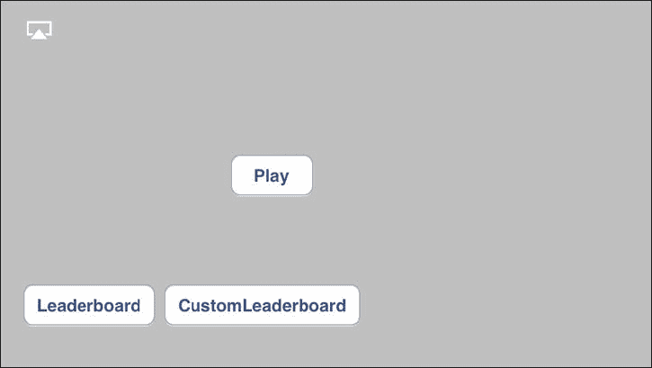
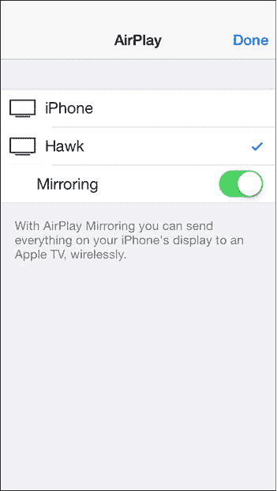
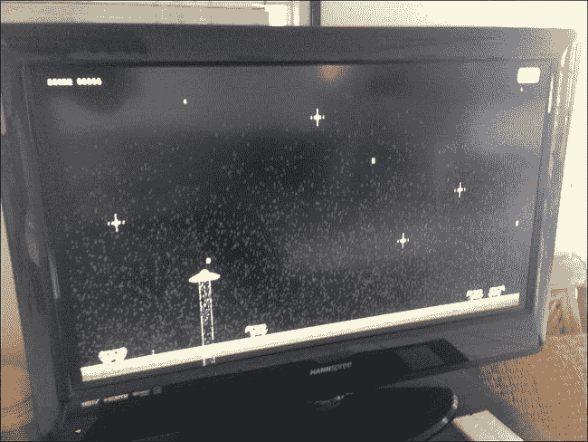

# 14. AirPlay

## 简介

AirPlay 作为 iOS 4.3 的一部分推出，并在 iOS 5.0 中得到了极大增强，它允许与兼容设备共享音频或视频信息。这些设备最常见的是用于视频和音频的 Apple TV，以及用于音乐播放的、支持 AirPlay 的音响系统。

本章将介绍如何处理 AirPlay 音频，以及如何处理镜像和第二屏技术。从 iOS 5.0 开始，使用 `MPMoviePlayerController` 或 `UIWebViews` 的应用中，任何视频或音频播放界面上都可以使用 AirPlay 按钮。

Apple 让 AirPlay 成为了 iOS 平台上最容易使用的技术之一。在大多数情况下，在你的应用中支持 AirPlay 无需额外编写代码，即使是在最复杂的情况下，也只需要几行代码。

## 内置播放器的 AirPlay

有三个类原生支持 AirPlay 输出：`AVPlayer`、`MPMoviePlayerController` 和 `UIWebView`。在播放媒体内容时，AirPlay 默认是开启的；但是，出于版权或其他原因，可能需要修改这种默认行为。

一个 `AVPlayer` 对象有一个属性 `allowsAirPlayVideo`，它接受一个布尔值，用于决定是否显示 AirPlay 输出的控件。同样地，`MPMoviePlayerController` 类有一个类似的属性，名为 `allowsAirPlay`。最后，`UIWebView` 使用属性 `mediaPlaybackAllowsAirPlay`。在 `UIWebview` 中禁用或启用 AirPlay 时，请注意内容，内容本身可以专门禁用 AirPlay。

> **注：** AirPlay 在 iOS 模拟器中无法工作；此外，只有当本地 AirPlay 设备（例如 Apple TV）可用时，AirPlay 控件才会显示。

### MPNowPlayingInfoCenter

许多支持 AirPlay 的音响系统支持当前播放项目的元数据；这通常是一个 LCD 显示屏，用于显示歌曲名称和艺术家等信息。AirPlay 允许使用 `MPNowPlayingInfoCenter` 类来设置这些信息；可以在适用的地方设置这些元数据以供显示。

```
MPNowPlayingInfoCenter *center = [MPNowPlayingInfoCenter defaultCenter];

NSDictionary *songInfo = [NSDictionary dictionaryWithObjectsAndKeys:
    @"Counting Crows", MPMediaItemPropertyArtist,
    @"Rain King", MPMediaItemPropertyTitle,
    @"August and Everything After", MPMediaItemPropertyAlbumTitle, nil];

center.nowPlayingInfo = songInfo;
```

处理播放的物理设备决定了在其显示器上显示哪些项目；然而，`MPNowPlayingInfoCenter` 类为几个项目提供了可选值，详情见表 14-1。

**表 14-1.** 设置元数据时 `MPNowPlayingInfoCenter` 的可用常量

| 常量 | 描述 |
| --- | --- |
| `MPMediaItemPropertyAlbumTitle` | 一个 `NSString`，表示专辑的名称。 |
| `MPMediaItemPropertyAlbumTrackCount` | 一个 `NSNumber`，表示曲目的总数。 |
| `MPMediaItemPropertyAlbumTrackNumber` | 一个 `NSNumber`，表示当前的曲目编号。 |
| `MPMediaItemPropertyArtist` | 一个 `NSString`，表示艺术家的名称。 |
| `MPMediaItemPropertyArtwork` | 一个 `MPMediaItemArtwork` 实例，表示正在播放项目的插图。 |
| `MPMediaItemPropertyComposer` | 一个 `NSString`，表示作曲家的名称。 |
| `MPMediaItemPropertyDiscCount` | 一个 `NSNumber`，表示光盘的总数。 |
| `MPMediaItemPropertyDiscNumber` | 一个 `NSNumber`，表示当前的光盘编号。 |
| `MPMediaItemPropertyGenre` | 一个 `NSString`，表示流派名称。 |
| `MPMediaItemPropertyPersistentID` | 一个 `NSNumber`，指示正在播放的项目。此标识符在多次启动之间持续存在，但在同步时可能会重置。 |
| `MPMediaItemPropertyPlaybackDuration` | 一个 `NSNumber`，表示当前播放时长的 `NSTimeInterval`（单位：秒）。 |
| `MPMediaItemPropertyTitle` | 一个 `NSString`，表示正在播放项目的名称（例如文件名）。 |

### 响应远程事件

当 AirPlay 正在播放媒体时，处理媒体输出的设备很可能也能接受用户输入，例如切换曲目、暂停、跳过或快进。你的应用响应并正确处理这些事件非常重要。你的应用必须首先让操作系统知道它有兴趣接收这些通知；这可以通过在 `UIApplication` 单例上调用 `beginRecievingRemoteControlEvents` 来完成：

```
[[UIApplication sharedApplication] beginReceivingRemoteControlEvents];
```

同样重要的是，当你的应用不再对这些通知感兴趣时，要记得停止接收它们；为此，调用另一个方法 `endReceivingRemoteControlEvents`，如下所示：

```
[[UIApplication sharedApplication] endReceivingRemoteControlEvents];
```

有十二种类型的事件可以通知到你的应用。当这些事件发生时，会调用 `remoteControlReceivedWithEvent:` 进行处理。以下示例展示了如何处理其中一些事件：

```
- (void) remoteControlReceivedWithEvent: (UIEvent *) receivedEvent
{
    if (receivedEvent.type == UIEventTypeRemoteControl)
    {
        switch (receivedEvent.subtype)
        {
            case UIEventSubtypeRemoteControlPlay:
                [self play];
                break;
            case UIEventSubtypeRemoteControlPause:
                [self pause];
                break;
            case UIEventSubtypeRemoteControlNextTrack:
                [self nextTrack];
                break;
            case UIEventSubtypeRemoteControlPreviousTrack:
                [self previousTrack];
                break;
        }
    }
}
```


## 在应用中启用 AirPlay

如果你的应用未使用三种受支持的 AirPlay 类别之一，你仍然可以为用户提供 AirPlay 选项。要显示 AirPlay 设备选择器，请使用 `MPVolumeView` 类。在以下代码片段中，音量滑块条被隐藏以仅显示设备选择器；但并没有要求必须隐藏音量滑块。结果如图 14-1 所示。

```
MPVolumeView *volumeView = [[MPVolumeView alloc] initWithFrame:
CGRectMake(15, 15, 0, 0)];
[volumeView setShowsVolumeSlider:NO];
[self.view addSubview: volumeView];
[volumeView release];
```



图 14-1. 使用 `MPVolumeView` 类启用 AirPlay 选择器（显示在左上角）

注意：要使用 AirPlay 类，应用必须首先通过 `#import <MediaPlayer/MediaPlayer.h>` 以及 `MediaPlayer.Framework` 导入所需的 Media Player 头文件。

系统声音（例如键盘敲击声和提示音）不会通过 AirPlay 扬声器发送；如果你的应用大量使用系统声音，则应将其作为应用正常音频的一部分进行播放，以便通过 AirPlay 发送。

## AirPlay 屏幕镜像

从 iOS 7 开始，应用无法自行启用 AirPlay 屏幕镜像，必须使用系统工具来启用它。不过，启用镜像功能无需进行额外的开发。

在 iOS 7 中，从屏幕底部向上滑动以调出控制面板，然后选择 AirPlay 按钮。你将可以选择一个支持 AirPlay 的设备。如果该设备支持 AirPlay 屏幕镜像（例如 Apple TV），你将看到一个用于启用它的切换开关（图 14-2）。iOS 6 用户应双击 Home 键并在快速应用切换器中向左滑动，以到达播放控件，然后再次向右滑动以调出 AirPlay 控件，你便能够开启 AirPlay 屏幕镜像。



图 14-2. 通过控制中心在 iOS 7 上启用 AirPlay 屏幕镜像

## 第二屏幕的 AirPlay

在你的应用中，在 iOS 设备和 AirPlay 设备上显示不同的内容可能是明智的做法。虽然用户仍需要按照上一节所述开启 AirPlay 监控，但你可以为每个屏幕显示完全不同的内容。首先，可以执行一项测试来确定第二屏幕是否可用。

```
if ([[UIScreen screens] count] > 1)
```

需要设置对第二屏幕的引用，并且必须创建一个新的窗口。每个屏幕都需要有一个专用的窗口：

```
UIScreen *secondScreen = [[UIScreen screens] objectAtIndex:1];
CGRect screenBounds = secondScreen.bounds;
UIWindow * secondWindow = [[UIWindow alloc] initWithFrame:screenBounds];
secondWindow.screen = secondScreen;
```

新窗口默认是隐藏的；要在外部显示器上查看该窗口，我们必须首先将其 `hidden` 属性设置为 NO：

```
secondWindow.hidden = NO;
```

如果现在运行这段代码，AirPlay 屏幕将显示一个空白的黑色视图，因为第二个窗口没有任何视图需要显示。以 UFO 游戏为例，我们可以将游戏数据显示到第二屏幕。修改现有的 `playButtonPressed` 方法，使其与以下代码一致：

```
-(IBAction)playButtonPressed
{
    if([self checkForExistingScreenAndInitializeIfPresent])
    {
        // 使用第二屏幕
    }
    else
    {
        gameViewController = [[UFOGameViewController alloc]  init];
        gameViewController.gcManager = gcManager;
        [self.navigationController pushViewController: gameViewController animated:YES];
    }
}
```

还需要添加一个新方法来检测并设置第二屏幕；该方法名为 `checkForExistingScreenAndInitializeIfPresent`，如果检测到第二屏幕则返回布尔值 YES。如果没有第二屏幕，游戏将继续使用单屏幕方式。该方法遵循刚刚展示的检测和显示第二窗口的方法。此外，还创建了一个新按钮来处理 AirPlay 屏幕上的牵引光束发射；之所以需要这个按钮，是因为 AirPlay 屏幕不支持触摸事件。牵引光束事件通过调用游戏控制器的 `touchesBegan` 和 `touchesEnded` 方法来处理。同时创建 `UFOGameViewController`，并将其视图添加到第二个窗口中。

```
- (bool)checkForExistingScreenAndInitializeIfPresent
{
    if ([[UIScreen screens] count] > 1)
    {
        UIScreen *secondScreen = [[UIScreen screens] objectAtIndex:1];
        CGRect screenBounds = secondScreen.bounds;
        UIWindow * secondWindow = [[UIWindow alloc] initWithFrame:screenBounds];
        secondWindow.screen = secondScreen;
        UIButton *button = [UIButton buttonWithType:UIButtonTypeRoundedRect];
        [button addTarget:self action:@selector(fire)
            forControlEvents:UIControlEventTouchDown];
        [button addTarget:self action:@selector(fireStop)
            forControlEvents:UIControlEventTouchUpInside | UIControlEventTouchUpOutside];
        [button setTitle:@"发射！" forState:UIControlStateNormal];
        button.frame = CGRectMake(80.0, 180.0, 160.0, 40.0);
        [self.view addSubview:button];
        secondWindow.hidden = NO;
        gameViewController = [[UFOGameViewController alloc] init];
        gameViewController.view.frame = screenBounds;
        gameViewController.gcManager = gcManager;
        [secondWindow addSubview:gameViewController.view];
        return YES;
    }
    return NO;
}
```

务必记住，Apple TV 显示屏可能不符合你预期的常规屏幕尺寸，应用元素需要设置为检测它们所出现的边界并相应地进行缩放。将 UFO 游戏显示在连接到宽屏液晶电视的 Apple TV 上的结果如图 14-3 所示。



图 14-3. 通过 Apple TV 使用 AirPlay 在宽屏电视上运行的 UFO 游戏

## 响应屏幕通知

可能有必要检测外部 AirPlay 屏幕的连接和断开。Apple 提供了一组通知，可以处理这些事件并通知你的应用进行妥善处理。要注册这些通知，请实现以下代码：

```
[[NSNotificationCenter defaultCenter] addObserver:self selector:@selector(handleScreenDidConnectNotification:) name:UIScreenDidConnectNotification object:nil];
[[NSNotificationCenter defaultCenter] addObserver:self selector:@selector(handleScreenDidDisconnectNotification:) name:UIScreenDidDisconnectNotification object:nil];
```

当屏幕断开或连接时，应用应根据需要创建和移除所显示的 `UIScreen`。作为开发者，你全权负责在不使用第二窗口时对其进行清理。

## 总结

本章涵盖了与 AirPlay 相关的所有内容。尽管 AirPlay 是一个相当简单且有限的主题，但这一功能可以为你的游戏增添独特的元素。大多数开发者尚未在其产品中实现自定义的 AirPlay 游戏元素，而市场对此类功能有明确的需求。Apple 在 2013 年初宣布已售出 1300 万台 Apple TV。成为首批支持并理解 AirPlay 能为产品增添价值（当 Apple 将 Apple TV 从副业产品转变为主流产品时）的开发者之一，将使你占据有利地位。


