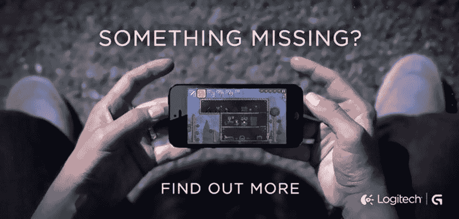
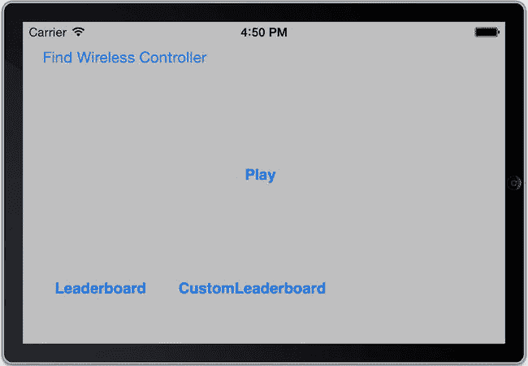

# 15. 游戏控制器

## 摘要

我无法信任一个连自己都无法控制的人去控制他人。

> —罗伯特·E·李

iOS 游戏控制器在 2013 年苹果全球开发者大会（WWDC）上作为 iOS 7 的一部分发布，旨在回应当初 iPhone 于 2007 年发布、2008 年 iPhone 游戏兴起后出现的主要批评之一：缺乏触觉反馈。在无法感知游戏控制键位置的情况下专注于屏幕，这被证明是很困难的。虽然市场上有许多第三方解决方案，从贴在 iPhone 屏幕上的贴纸到蓝牙控制器，但直到现在，始终缺乏一种通用的游戏输入方法。

主要问题在于，每款游戏都需要支持每种类型的游戏控制器，而所有这些控制器都使用不同的协议。这导致设备种类繁多，每款设备仅支持少数几款游戏。苹果是唯一能够实施并强制执行标准的公司，而这正是它在 iOS 7 中所做的。新的硬件都将遵循通用协议，使开发者得以专注于软件开发而非设备支持。如果你的游戏支持一款游戏控制器，它就能支持所有控制器。

本章及相关源代码编写于任何游戏控制器进入消费市场之前，尽管控制器的广告已经开始出现（图 15-1）。虽然已尽一切努力确保所讨论的技术材料准确无误，但无法保证面对生产硬件时游戏的行为会如预期所示。



图 15-1. 罗技为新型 iOS 7 实体游戏控制器发布的首个广告

## 游戏控制器的类型

游戏控制器主要有两种类型：标准型和扩展型。它们也可能以有线（底座连接器）或无线（蓝牙）型号提供。无论其他物理和布局差异如何，所有控制器都将遵循相同的输入类型。需要注意的是，扩展型控制器比标准型控制器拥有更多的输入控制键。

标准型控制器配备有方向键、四个主按钮（A、B、X 和 Y）、两个肩部按钮（左和右）以及一个暂停按钮。扩展型控制器则拥有标准型控制器的所有按钮，外加第二组肩部按钮和两个方向摇杆。无线控制器还配备一个玩家指示灯 LED，有四个位置。

> **注意：** 虽然游戏控制器可以为你的 iOS 游戏增加很多功能，但切记它必须是可选的。除了支持游戏控制器外，游戏还必须通过触摸屏或加速度计提供所有必需的功能。

尽管有几家公司宣布了 iOS 游戏控制器，但截至 2013 年 10 月，尚未有任何产品进入消费市场。在宣布 iOS 7 支持游戏控制器时，苹果表示首批硬件将于 2013 年秋季面世。

## 连接到游戏控制器

当非无线（底座连接器）控制器连接到设备时，它会自动被检测到。然而，要检测无线控制器，应用程序必须专门开始寻找。示例应用程序在菜单屏幕的左上角添加了一个新按钮，用于切换搜索无线控制器，如图 15-2 所示。

> **注意：** 在进行任何游戏控制器特定的调用之前，你首先需要将 `GameController.Framework` 导入到项目中，并包含 `GameController/GCController.h` 头文件。请记住，游戏控制器仅适用于 iOS 7 及更高版本。



图 15-2. 在现有的 UFO 主屏幕中添加“查找无线控制器”按钮

为“查找无线控制器”按钮创建了一个新的操作。当用户首次点击该按钮时，会调用类方法 `startWirelessControllerDiscoveryWithCompletionHandler`。第二次切换则会通过类方法 `stopWirelessControllerDiscovery` 结束搜索过程。

```
- (IBAction)findWirelessController:(id)sender
{
    findingWirelessController = !findingWirelessController;
    if(findingWirelessController)
    {
        [GCController startWirelessControllerDiscoveryWithCompletionHandler:^{
            NSLog(@"无线控制器搜索已完成");
        }];
    }
    else
    {
        [GCController stopWirelessControllerDiscovery];
        NSLog(@"用户已停止无线控制器搜索");
    }
}
```

当检测到新的控制器时，无论是无线连接还是有线连接，都会触发一个通知 `GCControllerDidConnectNotification`。这个通知以及对应的游戏控制器断开连接的通知应尽早注册。在示例项目中，我们在 `UFOViewController` 类的 `viewDidLoad:` 方法中执行此操作：

```
[[NSNotificationCenter defaultCenter] addObserver:self selector:@selector(setupControllers:) name:GCControllerDidConnectNotification object:nil];
[[NSNotificationCenter defaultCenter] addObserver:self selector:@selector(setupControllers:) name:GCControllerDidDisconnectNotification object:nil];
```

> **注意：** 当控制器断开连接时，建议游戏自动暂停，以便玩家能够解决控制器问题或返回基于触摸的游戏操作。作为质量保证流程的一部分，请务必测试游戏过程中断开控制器的情况。

收到这些通知后，我们的代码会调用一个新的 `setupControllers:` 方法。该方法允许应用程序随时跟踪哪些控制器已连接，因为可能存在多个控制器。游戏控制器可通过 `GCController` 对象上的 `controllers` 方法获取；此方法将返回所有已连接控制器的数组。该 `controller` 数组的值也会保存到一个数组属性中，供示例应用程序后续使用。

```
-(void)setupControllers:(NSNotification *)notif
{
    self.gameControllerArray = [GCController controllers];
    if([gameControllerArray count] > 0)
    {
        NSLog(@"找到游戏控制器数量: %i",
              [gameControllerArray count]);
    }
    else
    {
        NSLog(@"未找到游戏控制器");
    }
}
```

> **注意：** 控制器有可能在设置通知之前就被检测到，因此在添加通知时检查控制器数组的内容，以确定当前是否有任何已连接的控制器，这一点非常重要。

一个典型的例子是，用户在游戏控制器连接之前启动了应用程序。应用程序已经注册了游戏控制器的连接事件，本节所述的通知将被触发。

一个反例是，用户在启动应用程序之前已经连接了游戏控制器。在这种情况下，通知不会触发，因为游戏控制器是在配置通知之前连接的。在这种情况下，开发者应手动检测任何已连接的游戏控制器。


### 通过轮询读取数据

当控制器连接到设备后，需要读取该控制器的输入。在 UFOs 示例应用中，加速度计数据每 0.05 秒读取一次。由于并非所有用户都有游戏控制器，因此在添加游戏控制器支持后，仍需保留此行为。这使得加速度计轮询方法非常适合从游戏控制器读取数据。如果你的游戏没有可以接入的现有循环，可以设置一个简单的 `NSTimer`。修改 UFOs 中现有的 `motionOccurred:` 方法，以添加游戏控制器功能。

首先，游戏必须判断玩家是否正在使用游戏控制器。它通过检测设备当前是否已连接任何游戏控制器来实现这一点；在你自己的应用程序中，你可能希望给用户提供一个选项。如果连接了多个游戏控制器，则使用数组中的最后一个。在你自己的应用中，允许用户选择他们想要使用的控制器也可能是有益的。创建一个新的 `Controller` 对象，并将数组中的最后一个控制器存储到其中。

UFOs 游戏有两个主要功能。第一个是启动牵引光束动作，第二个是在屏幕上将飞船从一个位置移动到另一个位置。出于演示目的，控制器上的 Y 按钮将用于启动牵引光束。由于只要按住按钮，牵引光束就会保持开启状态，我们创建一个 `bool` 来跟踪按钮当前是否被按下。按钮的动作直接传递给 `touchesBegan:` 方法，该方法与处理触摸事件时控制牵引光束的方法是同一个。这种方法的好处是，即使连接了控制器，触摸事件仍然有效。由于标准版和扩展版游戏控制器都有 Y 按钮，因此不需要特定的代码来处理不同的控制器。

对于标准控制器，将使用方向键（D-pad）进行移动。然而，扩展版游戏控制器上的拇指摇杆方向键在控制飞船时能提供更好的体验，因此应用将在可用时使用它们。属性 `extendedGamePad` 控制此选择；如果此值非 nil，则表示已连接扩展控制器。

与 A、B、X 和 Y 按钮类似，方向键的值可以通过 `GCController` 对象上的属性访问。但是，方向键针对 X 和 Y 轴返回的是 0.0 到 1.0 的浮点值。该值可以替代未连接游戏控制器时使用的加速度计值。为扩展版游戏控制器的拇指摇杆连接值的过程几乎相同，但值存储在 `extendedGamepad` 下，而不是根 `gamepad` 属性下。

```
-(void)motionOccurred:(CMAccelerometerData *)accelerometerData;
{
  bool gameControllerBeingUsed = NO;
  GCController *myController = nil;

  if([parentViewController.gameControllerArray count] >  0)
  {
    gameControllerBeingUsed = YES;
    myController = [parentViewController.gameControllerArray  lastObject];
  }

  if(gameControllerBeingUsed == YES)
  {
    //检测按钮按下
    if(myController.gamepad.buttonY.pressed && gameControllerYHit == NO)
    {
      gameControllerYHit = YES;
      [self touchesBegan:nil withEvent:nil];
    }

    if(!myController.gamepad.buttonY.pressed && gameControllerYHit == YES)
    {
      gameControllerYHit = NO;
      [self touchesEnded:nil withEvent:nil];
    }

    //非扩展版游戏手柄
    if(myController.extendedGamepad == nil)
    {
      accel[0] = myController.gamepad.dpad.xAxis.value * accelerometerDamp +             accel[0] * (1.0 - accelerometerDamp);
      accel[1] = myController.gamepad.dpad.yAxis.value * accelerometerDamp +             accel[1] * (1.0 - accelerometerDamp);
    }

    //扩展版游戏手柄
    else
    {
      GCExtendedGamepad *extendedGamePadProfile = myController.extendedGamepad;
      accel[0] = extendedGamePadProfile.leftThumbstick.xAxis.value * accelerometerDamp +             accel[0] * (1.0 - accelerometerDamp);
      accel[1] = extendedGamePadProfile.leftThumbstick.yAxis.value * accelerometerDamp +             accel[1] * (1.0 - accelerometerDamp);
    }
  }

  else
  {
    //使用一个基本的低通滤波器，仅保留加速度计值中的重力分量
    accel[0] = accelerometerData.acceleration.x * accelerometerDamp + accel[0] *         (1.0 - accelerometerDamp);
    accel[1] = accelerometerData.acceleration.y * accelerometerDamp + accel[1] *         (1.0 - accelerometerDamp);
    accel[2] = accelerometerData.acceleration.z * accelerometerDamp + accel[2] *         (1.0 - accelerometerDamp);
    if(!tractorBeamOn)
      [self movePlayer:accel[0] :accel[1]];
  }
}
```

> **注意**：当方向键和拇指摇杆处于静止位置时，其值为 0.0。在游戏控制器框架出现之前，开发者发现有必要在静止位置周围设计一个“死区”；现在这已不再必要，任何大于 0.0 的值都应被视为有意的移动。

### 数据回调

在许多情况下，在每个游戏循环周期轮询游戏控制器输入是没有意义的。幸运的是，苹果提供了回调功能，可以在游戏控制器上任何物理按钮的值发生变化时进行设置。在以下代码片段中，为右肩部按钮设置了一个处理程序。当按钮值改变时，此方法将调用 `rightShoulderButtonAction`。

```
myController.gamepad.rightShoulder.valueChangedHandler = ^(GCControllerButtonInput *button, float value, BOOL pressed))
    {
      if(pressed)
          [self rightShoulderButtonAction];
    };
```

除了为每个动作设置回调外，您还可以同时在多个按钮之间共享回调。为此，创建一个新的代码块，并按照以下代码片段所示进行设置。对 A、B、X 或 Y 按钮的任何操作都将导致打印日志语句。

```
void(^buttonHandler)(GCControllerButtonInput *, float, BOOL) = ^(GCControllerButtonInput *button, float value, BOOL pressed)
{
    NSLog(@"Handle action for %@ pressed: %i, with value: %f", button, pressed, value);
};

myController.gamepad.buttonA.valueChangedHandler = buttonHandler;
myController.gamepad.buttonB.valueChangedHandler = buttonHandler;
myController.gamepad.buttonX.valueChangedHandler = buttonHandler;
myController.gamepad.buttonY.valueChangedHandler = buttonHandler;
```

也可以设置数据回调来处理方向键或拇指摇杆的轴值变化。为此，请使用以下代码片段：

```
myController.extendedGamepad.rightThumbstick.valueChangedHandler = ^(GCControllerDirectionPad *dpad, float xValue, float yValue)
{
    NSLog(@"Right Thumb Stick value did change: %f, %f", xValue, yValue);
};
```

### 暂停

如果你的游戏支持游戏控制器，那么它也必须支持所有游戏控制器上都有的暂停按钮。即使你的游戏之前不支持暂停，在连接了游戏控制器后，支持暂停也成为一个要求。处理游戏控制器上的暂停按钮非常简单，只需要额外几行代码：

```
myController.controllerPausedHandler = ^(GCController *controller)
 {
     [self togglePauseState];
 };
```


## 玩家指示灯

无线游戏控制器还配备了玩家指示灯，因为游戏控制器框架支持将多个控制器连接到单一设备。你的游戏可以通过额外的无线控制器，利用单个设备实现多人游戏功能。每个无线控制器都会配备四个 LED 灯，用于指示玩家编号。这些灯也能让用户知道他们已成功连接无线控制器，即使在单人游戏模式下也是如此。以下代码会点亮无线控制器的第一个灯，让玩家知道他们已成功连接：

```
if(myController.playerIndex == GCGameControllerPlayerIndexUnset)
{
        myController.playerIndex = 0;
}
```

`playerIndex` 属性也可用于点亮其他玩家索引值，范围从 0 到 3。每个控制器每次只能开启一个玩家指示灯。

## 快照

有时可能需要创建控制器输入状态的快照。这不仅有助于调试，还可用于创建回放配置文件或通过网络发送控制器数据。快照通过 `NSData` 表示形式存储，如下所示：

```
GCGamepadSnapshot *snapshot = [myController.gamepad saveSnapshot];
NSData *snapshotData = snapshot.snapshotData;
```

`GCGamePadSnapshot` 的优点之一是，它作为 `GCGamePad` 的子类，因此从中读取数据无需对游戏逻辑进行任何更改。

## 总结

在本章中，你学习了 iOS 7 的游戏控制器功能，从框架的要求到连接和读取数据。本章还涵盖了暂停、玩家指示灯和快照数据等主题。尽管这些 API 非常新，相关硬件尚未面市，但它们为移动游戏开启了无限可能。此前，iPhone 和 iPod 从未有过标准化的游戏控制器输入方式。游戏控制器框架的加入，是 Apple 对 iOS 游戏持续发展趋势的有力认可，也是这些设备成为下一代主要游戏机的第一步。如果你恰好也是 Mac 开发者，无线游戏控制器也将使用本章讨论的相同代码和实践，在 Mac 游戏中发挥作用。


## iOS 社交游戏入门

## 索引

### A, B

- **成就系统**：添加钩子（`GameCenterManager.populateAchievementCache`）；在 UFO 中增加钩子（`achievementWithIdentifierIsComplete`）；苹果提供的界面（`didAuthenticate`、`finishAbducting`方法、`resetAchievement`方法、`UFOGameViewController`）
- **苹果优势**：自定义图形用户界面
- **图形用户界面**：自定义图形用户界面
- **AchievementArray**（`GameCenterManager`、`NSArray`对象）
- **UFOAchievementViewController**（`UFOViewController`、`UIViewController`）
- **反馈机制**：`achievementCompletionLabel`、`achievementCompletionView`、`achievementEarned`方法；自定义横幅（`GameCenterManager`、`GKAchievement`、`IBOutlets`、`percentageComplete`、`submitAchievement: percentComplete`、`UIAlertView`）
- **Foursquare**
- **Game Center**：`GKAchievement`、`GKAchievementDescription`、`GKScore`对象、排行榜、程序化挑战、使用理由、重置、数据检索
- **已获得描述**（`achievementArray`、`achievementWithIdentifierIsComplete`、`cellForRowAtIndexPath`方法）；自定义图形用户界面（`GameCenterManager`类、Game Center 服务器、`GKAchievementDescription`、`GKAchievement`对象、`loadImageWithCompletionHandler`、`numberOfRowsInSection`方法、`percentageComplete`、`percentageCompleteOfAchievementWithIdentifier`、`retrieveAchievementMetadata`方法、`submitAchievement: PercentComplete`、`textLabel`、`UFOAchievementViewController`、`unachievedDescription`、`userDefaults`、`viewWillAppear`）
- **ShowsCompletionBanner**：基于时间的钩子（`tickThreeSeconds`、`UFOGameViewController`、`viewDidAppear`、`viewWillDisappear`）
- **UITableViewCellSytleDefault**
- **AddMultipartData**：方法
- **AirPlay**：内置播放器（`AVPlayer`对象、元数据）；`MPMoviePlayerController`类；`MPNowPlayingInfoCenter`类；`remoteControlReceivedWithEvent`；`UIWebview`类；屏幕镜像（`MPVolumeView`类、通知）；第二屏幕（`hidden`属性、`playButtonPressed`方法、牵引光束事件、`UFOGameViewController`类）；宽屏、Apple TV
- **应用程序编程接口**：自动匹配
- **Clan Lord 游戏**：Composer 账户设置（`addURL:`方法、`completionHandler`属性、Game Center、`SLRequest`方法、`SLServiceTypeFacebook`创建）
- **自定义推文**：`ACAccountype`账户、`endpoint`属性、`granted`变量、元数据（`NSData`、`postRequest`方法、`SLRequest`方法）、使用数组

### D

- **委托回调**

### E

- **数据交换**：`determineHost`方法；断线重连；多人模式的游戏引擎；`matchmakerViewController`；`peerIDString`与`peerMatch`；`generateAndSendHostNumber`方法；网络绑架代码（`abductCowFromNetworkAtIndex`、`beginTractorFromNetwork`、`endTractorFromNetwork`、`finishAbductingFromNetwork`、`hitTest`方法、修改、`touchesBegan:`与`touchesEnded:`方法、`updateCowPaths`方法）；选择主机；接收数据（`GameCenterManager`类、`receivedData`协议方法）；发送数据（`sendString`方法、`sendStringToAllPeers`方法）；分数共享；单人游戏修改；生成奶牛流程（`determineHost`方法、`receivedData`方法、`spawnCow`方法、修改）；同步奶牛移动（`updateCowPaths`方法）；UFO（`drawEnemyShipWithData`在`viewDidLoad`方法中、`movePlayer`方法、已更新、`receivedData`方法、使用`stringWithFormat`、`exitAction:`方法）

### F

- **Facebook**：Composer 账户设置（`addURL:`方法、`completionHandler`属性、Game Center、`SLRequest`方法、`SLServiceTypeFacebook`创建）；自定义帖子（`ios`）；JSON 对象；新 iOS 创建；权限（`ACAccountStore`电子邮件属性、高级权限、低级权限、`publish-to-stream`权限）；UFO 请求；UFO 警告视图委托（`exitAction:`方法）；包装类

### G

- **Game Center**：`authentication`（`callDelegateOnMainThread:`方法、来自`UFOViewController`的`delegate`属性、`GameCenterManager`类）；iOS 6；iOS 6 之前版本；好友列表（`avatars`、`Game Center.app`、`GameKit.framework`、`GKLocalPlayer`对象、`GKPlayers`、`retrieveFriendsList`、`callDelegateOnMainThread`方法、`loadFriendsWithCompletionHandler`方法、沙盒状态变更）；测试（`gcClass`、`NSClassFromString`）
- **游戏控制器**：数据回调；指示灯；问题；罗技；暂停按钮；数据读取与轮询；加速度计数据（`extendedGamePad`控件、`NSTimer`、`touchesBegan:`方法、牵引光束动作）；快照；类型（扩展控制器、标准控制器）；无线控制器（`controller`数组、`GCControllerDidConnectNotification`、`setupControllers:`方法、`startWirelessControllerDiscoveryWithCompletionHandler`、UFO 主屏幕、`viewDidLoad:`方法）
- **Game Kit**：网络与语音聊天；Game Kit 网络（`Bistromath`、握手、会话、蓝牙）；`GSessionDelegate`协议；限制；点对点网络；范围与数据传输速率；`GKVoiceChatService`类
- **图形用户界面**：添加与移除玩家；取消与失败（`GKMatch`对象）；邀请好友与游戏（`iTunes Connect`、`MatchmakerViewController`创建、推送通知、`UFOViewController.xib`）

### H

- **HTTP 响应**

### I, J, K

- **应用内购买**：App ID；最畅销游戏；开发者审批；`Submit Now`选项；`Submit with Binary`选项；免费模式；UFO 中的 GUI 截图（代码片段、`viewDidLoad`方法）；iOS 收据验证（`GUID`、`NSApplicationMain`函数、`NSBundle`）；iTunes Connect 配置（自动续期订阅、消耗型商品、初始配置、本地化描述、`manage`按钮、非消耗型商品、非续期订阅、截图、设置、订阅时长、产品展示、`productArray`类、`productsList`方法、`UITableViewCellStyleSubtitle`）；购买代码（沙盒、`SKPaymentTransactionObserver`协议、`UFOStoreViewController`类、`UIAlert`、购买多个商品、收据、沙盒服务器地址、`verifyReceipt`方法、`restoreCompletedTransactions`、获取产品列表、`viewDidLoad`方法、`viewDidUnload`方法、沙盒设置、`SKProductsRequestDelegate`、`StoreKit`框架、`UFOStoreViewController`、测试账户、登录）；最高收入应用下载；交易流程（`finishTransaction`方法、`NSUserDefaults`、`recordTransactionData`方法、`SKPaymentTransactionObserver`、`unlockContent`方法）；ngmoco 的`We Rule`（`We Rule`内置商店）
- **邀请**：`acceptInvite`参数（`GameCenterManager`类、`GKMatchmakerViewController`、`match:player:didChangeState`、`playersToInvite`参数、沙盒、`UFOViewController`）
- **iTunes Connect**：成就进度；成就配置（`Achievement ID`属性、`Achievement Reference Name`属性、Game Center 门户、`Hidden`属性、`Points`属性）；配置成就（创建成就"绑架 25 头奶牛"、`Earned Description`属性、`Image`属性、`Language`属性、`Pre-earned Description`属性、`Title`属性）；Game Center 配置（`GameCenterManager`落地页）；加载成就（`earnedAchievementCache`、`GkAchievement`、`loadAchievementsWithCompletionHandler`、`percentComplete`、`reportAchievementWithCompletionHandler`、`submitAchievement: percentComplete`方法、修改）；成就进度；成就展示；苹果默认 GUI；苹果未获得成就图标（`GKAchievementViewController`、`GKGameCenterViewController`、`IBAction`触发器、`UFOViewController`、`UIButton`）

### L

- **排行榜**：挑战；自定义（`GameCenterManager`类、`gcManager`、`retrieveScore`方法、分段控件）；Game Center 默认设置；苹果排行榜 GUI；自定义 GUI（`GKScore`对象、`GameCenterManager`类、`GKLeaderboardSet`）；高分方法；基于分数的系统；分数提交失败；基于计时器的系统（`UFOGameViewController`）；在 iTunes Connect 中（添加新排行榜、组合排行榜、分数格式类型）；本地玩家分数（`Player IDs`、`cellForRow`方法、`GameCenterManagerDelegate`、`GKPlayer`对象、`NSMutableArray`、`playerNameforID`）；提交分数；展示（苹果 GUI、社交应用或游戏中的自定义 GUI）

### M

- **匹配机制**：自动匹配（`findMatchesForRequest`、`GKMatchmakerViewController`、`GKMatchRequest`、`GKMatchRequest`对象）；GUI 添加与移除玩家；取消与失败（`GKMatch`对象）；邀请好友与游戏（`iTunes Connect`、`MatchmakerViewController`创建、推送通知、`UFOViewController.xib`）；邀请（参见"邀请"）；玩家属性（Game Center、`GameCenterManager`类、分组、主持匹配、限制、`playerGroup`属性、协议、规则、场景）；最畅销 PC 游戏；元数据；屏幕镜像

### N, O

- **网络设计**：反作弊（`Clan Lord`）；客户端-主机网络（优势、可视化表示）；专用服务器（无头客户端）；混合网络；保活消息；网状/部分网状网络（数据包可靠性属性——排序属性、优先级属性、重试属性）；点对点网络（缺点、可视化表示、弱点与缺陷）；预测与推断；环形网络；数据发送；状态与服务器消息；`沉没成本谬论`；超时相关断线；树形网络

### P, Q

- **Peer 选择器**：蓝牙对等设备优势；传入对等设备；查找 UIAlert；等待连接；启用蓝牙提示；Game Center 网络（`Bistromath`、握手、`GKPeerPickerConnectionTypeNearby`、`GKPeerPickerConnectionTypeOnline`、`GKPeerPickerControllerDelegate`、`peerPickerController`、`GKSession`对象、`localMultiplayerGameButtonPressed`）
- **权限**：`ACAccountStore`电子邮件属性；高级权限；低级权限；`publish-to-stream`权限；UFO 请求；`PlayerIndex`属性

### R

- **数据读取与轮询**：加速度计数据（`extendedGamePad`控件、`NSTimer`、`touchesBegan:`方法、牵引光束动作）

### S

- **Sea Wolf 游戏**
- **第二屏幕**：`hidden`属性；`playButtonPressed`方法；牵引光束事件；`UFOGameViewController`类；宽屏、Apple TV
- **SLComposeViewController**
- **快照**
- **社交游戏**
- **沉没成本谬论**

### T

- **回合制游戏**：`GKTurnedBasedEventHandler`（`handleInviteFromGameCenter`、`handleMatchEnded`、`handleTurnEventForMatch`）；`GKTurnedBasedMatchmakerViewController`委托方法；`GKLocalPlayer`；`GKMatchRequest`；回合制比赛（基于比赛的代码片段、完成表单、`NSData`、`NSPropertyListSerialization`、`participants`数组、比赛结束`checkWinner`、`GKTurnBasedMatchOutcomeLost`、`GKTurnBasedMatchOutcomeWon`、`makeMove`方法）；基于导航控制器的项目（`authentication`方法、`delegate`方法、`GameCenterManager`类、游戏视图、`GKTurnedBasedMatchmakerViewController`的`IBAction`方法、井字游戏、`viewDidLoad`方法、`NSTimeInterval`、玩家交换、`initiator`、`recipients`、玩家提醒、玩家超时、程序化比赛、进度游戏数据字典、`gameDictionary`、比赛数据、退出或认输）；井字游戏示例应用（`IBAction`方法、界面构建器、`makeMove`方法、`tictactoeGameViewController`类）
- **与好友拼词**：Tweet Composer（`addImage`、`addURL`、`completionHandler`属性、缺点、`setInitialText`、`SLComposeViewController`、`SLServiceTypeTwitter`、网站）；Twitter 自定义推文（`ACAccountype`账户、`endpoint`属性、`granted`变量、元数据、`NSData`、`postRequest`方法、`SLRequest`方法、使用数组）；iOS 7 Tweet Composer（`addImage`、`addURL`、`completionHandler`属性、缺点、`setInitialText`、`SLComposeViewController`、`SLServiceTypeTwitter`、网站）；UFO 的`alertView`设置（`exitAction`函数）
- **类型**：扩展控制器；标准控制器

### U

- **UFO**：`abductCow`方法；`accelerometer`委托、设置（`viewDidLoad`方法）；警告视图委托（`exitAction:`方法）；文件结构；游戏视图组树结构（`UFOAppDelegate.h`与`UFOAppDelegate.m`文件）；组视图结构（`UFOGameViewController.m`文件）；`hitTest`方法；`insertSubview`方法；iTunes Connect 配置；`movePlayer`方法；`myPlayerImageView`；目标；分数标签；`shouldAutorotateToInterfaceOrientation`；生成与移动奶牛；`touchesBegan`事件；`UIAlert`；URL

### V

- **语音聊天**：音频会话（Game Kit 的`channels`）；添加麦克风（`AVAudioSession`、`AVFoundation.framework`）；`GKVoiceChatClient`；对`GameCenterManager`类的修改；发送与接收语音数据；`setupVoiceChat`；`UFOVoiceChatClient`；`GKMatch`监控玩家状态变化；启动与停止方法；音量和静音；网络语音电话

### W, X, Y, Z

- **无线控制器**：`controller`数组；`GCControllerDidConnectNotification`；`setupControllers:`方法；`startWirelessControllerDiscoveryWithCompletionHandler`；UFO 主屏幕；`viewDidLoad:`方法
- **全球开发者大会**
- **万维网联盟**
